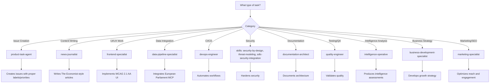

# 🤖 Custom GitHub Copilot Agents - EU Parliament Monitor

This directory contains custom agent profiles for GitHub Copilot, designed to provide domain-specific expertise for the EU Parliament Monitor project.

---

## 📋 Overview

Each agent profile is a Markdown file with YAML frontmatter that defines specialized expertise. When working on tasks related to a specific domain, GitHub Copilot can leverage these profiles to provide more informed and contextually appropriate assistance.

### Agent Architecture

All agents follow the **2026 GitHub Copilot Coding Agent Standard** with:

- **GitHub MCP Insiders API** integration for experimental features
- **Toolset policy** — omit the `tools` frontmatter field so that Copilot CLI allows all tools by default. **Never** write `tools: ["*"]` inside an `mcp-servers` block: the gh-aw MCP gateway (`awmg`) treats `*` as a literal tool name and exposes 0 tools. See [`.github/prompts/08-infrastructure.md`](../prompts/08-infrastructure.md) §2 for the canonical rule.
- **Organization-wide access** via PAT token (Hack23 repositories)
- **Modern Copilot features**: `assign_copilot_to_issue`, `create_pull_request_with_copilot`, stacked PRs, job tracking
- **gh-aw agent imports** — workflows can import a single agent file via the `imports:` frontmatter field (see [gh-aw Copilot Custom Agents](https://github.github.com/gh-aw/reference/copilot-custom-agents/)). In this repository's gh-aw usage (tested against gh-aw v0.69.3, 2026-04-21), imported agent files contribute **body-only** content: the agent body is appended to the workflow prompt, but agent frontmatter — including `mcp-servers:` — is **not** merged into the workflow frontmatter. Therefore `mcp-servers:` must live in the workflow itself or in a shared frontmatter-only workflow component (e.g. [`.github/workflows/shared/mcp/news-mcp-servers.md`](../workflows/shared/mcp/news-mcp-servers.md)). See [`.github/agents/news-generation.agent.md`](./news-generation.agent.md) for the canonical split-imports pattern used by every article-generating `news-*.md` workflow.
- **Cross-repository patterns** for accessing European-Parliament-MCP-Server, riksdagsmonitor, cia, ISMS-PUBLIC
- **ISMS compliance** mapped to ISO 27001, NIST CSF 2.0, CIS Controls v8.1, GDPR, NIS2, EU CRA

---

## 🗂️ Role Index (analysis-producer / analysis-consumer / gh-aw-infrastructure)

Group the catalog by their role in the news critical path. See
[`.github/prompts/README.md`](../prompts/README.md) § *Analysis Artifact
Integration* for the chain they support.

| Role | Agents |
|---|---|
| **Analysis producers** (write artifacts under `analysis/daily/<run>/`) | `intelligence-operative`, `news-generation.agent` |
| **Analysis consumers** (read artifacts, render to content) | `news-journalist`, `marketing-specialist`, `business-development-specialist` |
| **Data / pipeline suppliers** (Stage A inputs) | `data-pipeline-specialist` |
| **gh-aw infrastructure** (workflow authoring / CI) | `agentic-workflows.agent`, `devops-engineer`, `ci-cleaner.agent`, `create-safe-output-type.agent`, `custom-engine-implementation.agent`, `interactive-agent-designer.agent` |
| **Quality / review / docs** | `quality-engineer`, `grumpy-reviewer.agent`, `contribution-checker`, `documentation-architect`, `technical-doc-writer.agent`, `w3c-specification-writer.agent` |
| **Product / frontend** | `product-task-agent`, `frontend-specialist`, `developer.instructions` |

Canonical analysis anchors every agent on the news critical path should read:
[`ai-driven-analysis-guide.md`](../../analysis/methodologies/ai-driven-analysis-guide.md),
[`artifact-catalog.md`](../../analysis/methodologies/artifact-catalog.md),
[`per-artifact-methodologies.md`](../../analysis/methodologies/per-artifact-methodologies.md),
[`analysis/templates/README.md`](../../analysis/templates/README.md),
[`reference-quality-thresholds.json`](../../analysis/methodologies/reference-quality-thresholds.json).

## 🎯 Available Agents

### 1. 📊 Product Task Agent (`product-task-agent`)

**Expertise**: Product management, GitHub issue creation, European Parliament monitoring

**When to Use**:
- Creating GitHub issues for new features or improvements
- Analyzing repository health and quality metrics
- Coordinating work across multiple specialized agents
- Prioritizing tasks and managing product backlog
- European Parliament data integration planning
- ISMS compliance tracking and auditing

**Key Capabilities**:
- Automated issue creation with proper labels and priorities
- Playwright browser testing for visual regression
- Multi-language quality assurance (14 languages)
- WCAG 2.1 AA accessibility auditing
- European Parliament MCP integration monitoring
- ISMS policy enforcement (ISO 27001, GDPR, NIS2)
- Agent coordination and task assignment

**Example Use**:
```bash
@product-task-agent analyze the current state of multi-language support and create issues for any gaps found
```

---

### 2. 📰 News Journalist (`news-journalist`)

**Expertise**: The Economist-style European Parliament reporting, multi-language content generation

**When to Use**:
- Writing or editing news articles about European Parliament activities
- Generating week-ahead previews of plenary sessions
- Creating committee reports and analysis
- Covering legislative propositions and motions
- Multi-language content quality assurance
- SEO optimization and structured data

**Key Capabilities**:
- The Economist editorial standards and style
- European Parliament coverage (MEPs, committees, plenary sessions)
- Multi-language news generation (14 languages)
- European Parliament MCP data integration for articles
- Fact-checking and source verification
- GDPR-compliant political reporting
- SEO metadata and structured data generation

**Example Use**:
```bash
@news-journalist create a week-ahead article covering the upcoming plenary session using European Parliament MCP data
```

---

### 3. 🎨 Frontend Specialist (`frontend-specialist`)

**Expertise**: HTML5/CSS3, WCAG 2.1 AA accessibility, responsive design, multi-language UI

**When to Use**:
- Implementing or improving UI components
- Ensuring WCAG 2.1 AA accessibility compliance
- Creating responsive layouts (320px - 1440px+)
- Multi-language interface design
- Performance optimization (Core Web Vitals)
- Security headers configuration (CSP, HSTS)

**Key Capabilities**:
- Semantic HTML5 markup
- CSS3 responsive design patterns
- WCAG 2.1 AA accessibility implementation
- Keyboard navigation and screen reader support
- Multi-language UI patterns (14 languages, RTL support)
- Core Web Vitals optimization
- GitHub Pages deployment optimization

**Example Use**:
```bash
@frontend-specialist fix the language switcher to be fully keyboard accessible and WCAG 2.1 AA compliant
```

---

### 4. 🔄 Data Pipeline Specialist (`data-pipeline-specialist`)

**Expertise**: European Parliament MCP Server integration, data caching, API client patterns

**When to Use**:
- Integrating European Parliament MCP Server data
- Implementing data caching strategies
- Building retry logic and error handling
- Creating fallback mechanisms for MCP unavailability
- Validating data schemas and quality
- Optimizing API client performance

**Key Capabilities**:
- European Parliament MCP tool mastery (6 tools)
- src/mcp/ep-mcp-client.ts TypeScript source and gateway setup (scripts/mcp-setup.sh)
- LRU cache implementation and TTL strategies
- Exponential backoff retry logic
- Undici HTTP client patterns
- Data schema validation
- Error handling and logging best practices

**Example Use**:
```bash
@data-pipeline-specialist implement caching for MEP data with a 24-hour TTL and retry logic for API failures
```

---

### 5. ⚙️ DevOps Engineer (`devops-engineer`)

**Expertise**: GitHub Actions, CI/CD, automation, deployment strategies

**When to Use**:
- Creating or modifying GitHub Actions workflows
- Setting up automated testing pipelines
- Implementing deployment automation
- Configuring Node.js and Playwright environments
- Managing MCP server pre-installation
- Branch protection and repository settings

**Key Capabilities**:
- GitHub Actions workflow authoring
- Daily news generation automation
- Playwright browser testing in CI
- Node.js 25 environment setup
- MCP server pre-installation and caching
- GitHub Pages deployment strategies
- Security scanning integration (Dependabot, CodeQL)

**Example Use**:
```bash
@devops-engineer create a GitHub Actions workflow to validate HTML/CSS on every PR
```

---

> **🔒 Security note — no standalone `security-architect` agent.** Security
> responsibilities are distributed across every agent via the shared skills
> catalogue. See [`.github/skills/README.md`](../skills/README.md) § Security
> Skills and § Compliance Skills for the authoritative entry points:
> [`security-by-design`](../skills/security-by-design.md),
> [`sdlc-security-integration`](../skills/sdlc-security-integration.md),
> [`threat-modeling`](../skills/threat-modeling.md),
> [`isms-compliance`](../skills/isms-compliance.md),
> [`compliance-frameworks`](../skills/compliance-frameworks.md),
> [`data-protection`](../skills/data-protection.md), and the full Hack23
> ISMS-PUBLIC policy → skill map in
> [`ISMS_SKILLS_COMPREHENSIVE.md`](./ISMS_SKILLS_COMPREHENSIVE.md).
> Security review is an explicit responsibility of `grumpy-reviewer.agent`
> and `contribution-checker`.

---

### 6. 📚 Documentation Architect (`documentation-architect`)

**Expertise**: C4 models, Mermaid diagrams, API documentation, architecture documentation

**When to Use**:
- Creating or updating architecture documentation
- Generating C4 diagrams (Context, Container, Component, Code)
- Creating Mermaid sequence or flow diagrams
- Documenting API endpoints and schemas
- Maintaining ARCHITECTURE.md and SECURITY_ARCHITECTURE.md
- Multi-language documentation strategies

**Key Capabilities**:
- C4 architecture model implementation
- Mermaid diagram generation
- European Parliament MCP API documentation
- ISMS policy documentation
- Multi-language documentation patterns (14 languages)
- README.md best practices
- Architecture decision records (ADRs)

**Example Use**:
```bash
@documentation-architect create a C4 Container diagram showing the European Parliament MCP integration architecture
```

---

### 7. ✅ Quality Engineer (`quality-engineer`)

**Expertise**: Testing, validation, accessibility testing, performance benchmarking

**When to Use**:
- Writing or improving tests
- Validating HTML/CSS with automated tools
- Conducting accessibility testing (WCAG 2.1 AA)
- Performance benchmarking and optimization
- Link integrity checking
- Multi-language quality assurance

**Key Capabilities**:
- Playwright visual regression testing
- HTMLHint and CSSLint validation
- WCAG 2.1 AA accessibility testing
- Core Web Vitals measurement
- Link integrity verification (linkinator)
- Test coverage and mutation testing
- Multi-language QA (14 languages)
- Cross-browser testing strategies

**Example Use**:
```bash
@quality-engineer create Playwright tests to validate all 14 language versions for accessibility compliance
```

---

### 8. 🔍 Intelligence Operative (`intelligence-operative`)

**Expertise**: Political science, intelligence analysis, OSINT, behavioral analysis, EU Parliament transparency

**When to Use**:
- Analyzing MEP voting patterns and political group dynamics
- Conducting structured analytic techniques (ACH, SWOT, Devil's Advocacy)
- Assessing democratic accountability and institutional performance
- Evaluating legislative outcomes and coalition stability
- Producing data-driven intelligence assessments from EP MCP data
- Risk assessment for EU political developments

**Key Capabilities**:
- Political science frameworks (comparative politics, public policy)
- OSINT methodologies for EU Parliament open data
- Intelligence analysis techniques (ACH, PESTLE, stakeholder analysis)
- MEP scorecards and political group analysis
- Electoral analysis and coalition dynamics
- Behavioral analysis for MEP decision-making patterns
- European Parliament MCP data integration
- GDPR-compliant political data analysis

**Example Use**:
```bash
@intelligence-operative analyze voting cohesion trends across political groups using EP MCP voting records and produce a risk assessment
```

---

### 9. 💼 Business Development Specialist (`business-development-specialist`)

**Expertise**: Strategic planning, partnership development, revenue models, civic tech sustainability

**When to Use**:
- Developing strategic growth plans for the platform
- Identifying partnership opportunities with EU institutions, media, NGOs
- Designing mission-aligned revenue models (grants, consulting, open core)
- Analyzing market segments across 27 EU member states
- Creating investor/grant proposals for civic tech funding
- Evaluating business model viability and sustainability

**Key Capabilities**:
- Business Model Canvas for civic tech platforms
- Partnership development (EU institutions, media, academic, NGO)
- Revenue strategy (EU Horizon grants, democracy funds, consulting)
- Market segmentation across 27 EU member states
- Go-to-market strategy for political transparency platforms
- Financial modeling and sustainability planning
- ISMS compliance for business decisions
- GDPR-compliant business practices

**Example Use**:
```bash
@business-development-specialist create a Business Model Canvas for EU Parliament Monitor with focus on grant funding and institutional partnerships
```

---

### 10. 📢 Marketing Specialist (`marketing-specialist`)

**Expertise**: Digital marketing, content strategy, SEO, community building, multi-language outreach

**When to Use**:
- Developing SEO strategy for multi-language news articles
- Creating content marketing plans for EU Parliament coverage
- Building community engagement across EU member states
- Optimizing search visibility for 14 language versions
- Designing social media campaigns for democratic engagement
- Measuring marketing effectiveness and audience growth

**Key Capabilities**:
- Multi-language SEO optimization (14 languages, hreflang)
- Content strategy for EU Parliament journalism
- Social media marketing for civic engagement
- Community building across EU member states
- Brand positioning for transparency platforms
- Performance measurement and analytics
- GDPR-compliant marketing (privacy-first, no tracking cookies)
- Political neutrality in all messaging
- Structured data (JSON-LD) and Schema.org optimization

**Example Use**:
```bash
@marketing-specialist develop a multi-language SEO strategy for EU Parliament news articles targeting all 14 language versions
```

---

## 🔧 GitHub Agentic Workflows (gh-aw) Agents

The following agents are sourced from [github/gh-aw](https://github.com/github/gh-aw) and provide GitHub Agentic Workflows capabilities:

### 11. 🤖 Agentic Workflows (`agentic-workflows.agent`)

**Expertise**: GitHub Agentic Workflows (gh-aw) — Create, debug, and upgrade AI-powered workflows

**When to Use**:
- Creating new agentic workflows in markdown
- Debugging failing workflows
- Upgrading workflows to new gh-aw versions
- Creating shared workflow components
- Fixing Dependabot PRs for workflow dependencies
- Analyzing test coverage

---

### 12. 🧹 CI Cleaner (`ci-cleaner.agent`)

**Expertise**: Repository CI state cleanup — formatting, linting, testing, and workflow recompilation

**When to Use**:
- CI is failing and needs cleanup
- Code formatting needs fixing
- Linters report issues
- Tests are broken
- Workflows need recompilation

---

### 13. ✅ Contribution Checker (`contribution-checker.agent`)

**Expertise**: PR evaluation against CONTRIBUTING.md guidelines

**When to Use**:
- Evaluating PR compliance with contribution guidelines
- Assessing PR quality (on-topic, focused, tested, described)
- Generating structured PR feedback

---

### 14. 🔌 Create Safe Output Type (`create-safe-output-type.agent`)

**Expertise**: Adding new safe output types to GitHub Agentic Workflows

**When to Use**:
- Adding a new safe output type to the gh-aw system
- Implementing JSONL validation pipelines
- Creating handler factories for safe outputs

---

### 15. ⚙️ Custom Engine Implementation (`custom-engine-implementation.agent`)

**Expertise**: Implementing custom agentic engines in gh-aw

**When to Use**:
- Building a new AI engine for gh-aw
- Understanding the engine interface architecture
- Integrating engines with MCP servers and firewalls

---

### 16. 📖 Developer Instructions (`developer.instructions`)

**Expertise**: Development guidelines and standards for GitHub Agentic Workflows

**When to Use**:
- Understanding code organization patterns
- Following validation architecture
- Applying security best practices
- Managing releases with changesets

---

### 17. 🔥 Grumpy Reviewer (`grumpy-reviewer.agent`)

**Expertise**: Thorough code review with a grumpy, sarcastic senior developer persona

**When to Use**:
- Getting brutally honest code reviews
- Finding code smells, performance issues, and security concerns
- Identifying missing error handling and poor naming

---

### 18. 🎯 Interactive Agent Designer (`interactive-agent-designer.agent`)

**Expertise**: Interactive wizard for creating and optimizing agent prompts and workflow descriptions

**When to Use**:
- Creating new agent prompts via guided wizard
- Optimizing existing workflow descriptions
- Designing workflow configurations (frontmatter)
- Creating custom agent instructions

---

### 19. 📝 Technical Doc Writer (`technical-doc-writer.agent`)

**Expertise**: Technical documentation using GitHub Docs voice and Diátaxis structure

**When to Use**:
- Writing developer-focused documentation
- Creating getting-started guides, how-to guides, and references
- Following GitHub Docs style and tone

---

### 20. 📋 W3C Specification Writer (`w3c-specification-writer.agent`)

**Expertise**: Formal W3C-style specifications with RFC 2119 keywords

**When to Use**:
- Writing formal technical specifications
- Creating protocol, API, or data format specifications
- Applying RFC 2119 requirement levels (MUST, SHALL, SHOULD, MAY)
- Defining conformance classes and compliance testing

---

### 21. 📥 News Generation (imported) (`news-generation.agent`)

**Type**: gh-aw _imported_ agent — body is appended to every
article-generating `news-*.md` workflow prompt via the `imports:` field.
Not invokable directly via `@news-generation`.

**Purpose**: Contributes the canonical Required Reading order and 5-stage
Stage Contract (Data → Analysis → Completeness Gate → Article → Single PR)
to every importing workflow. Paired with
[`.github/workflows/shared/mcp/news-mcp-servers.md`](../workflows/shared/mcp/news-mcp-servers.md)
(separate import that merges the `mcp-servers:` frontmatter block).

**Importers**: `news-breaking`, `news-week-in-review`, `news-month-in-review`,
`news-week-ahead`, `news-month-ahead`, `news-committee-reports`,
`news-motions`, `news-propositions` (the 8 unified article workflows).
Explicitly **not** imported by `news-translate` (multi-call flush pattern,
exempt from single-PR rule). The legacy split-pair `news-<type>-analysis.md`
+ `news-<type>-article.md` layout and the manual `news-article-generator.md`
helper were removed in the April-2026 aggregator-pipeline migration.

See [`.github/workflows/README.md`](../workflows/README.md) for the full
shared-import pattern.

---

## 🌍 European Parliament Context

All agents are configured with expertise in:

### Data Sources
- **European-Parliament-MCP-Server** (6 tools):
  - `get_meps` - MEP profiles and data
  - `get_plenary_sessions` - Session schedules and agendas
  - `search_documents` - Parliamentary document search
  - `get_parliamentary_questions` - Questions and answers
  - `get_committee_info` - Committee details and members
  - `get_voting_records` - Voting results and patterns

### Multi-Language Support (14 Languages)
- **Nordic**: English (en), Swedish (sv), Danish (da), Norwegian (no), Finnish (fi)
- **EU Core**: German (de), French (fr), Spanish (es), Dutch (nl)
- **Middle East**: Arabic (ar), Hebrew (he)
- **East Asia**: Japanese (ja), Korean (ko), Chinese (zh)

### Article Types
- **Week Ahead**: Preview of upcoming plenary sessions and events
- **Committee Reports**: Analysis of committee activities and decisions
- **Propositions**: Government and parliamentary legislative proposals
- **Motions**: Parliamentary motions and resolutions

---

## 🔒 ISMS Compliance Framework

All agents enforce compliance with the Hack23 ISMS. The three foundational SDLC policies every agent honours:

### Foundational SDLC Policies

| Policy | Scope | Enforced by |
|--------|-------|-------------|
| **[Information Security Policy](https://github.com/Hack23/ISMS-PUBLIC/blob/main/Information_Security_Policy.md)** | CIA triad, risk management, ownership, least privilege, defense in depth | All agents; primary in product-task-agent, documentation-architect |
| **[Secure Development Policy](https://github.com/Hack23/ISMS-PUBLIC/blob/main/Secure_Development_Policy.md)** | SSDLC phase gates, threat modelling, secure coding, testing, release | devops-engineer, data-pipeline-specialist, quality-engineer, frontend-specialist |
| **[Open Source Policy](https://github.com/Hack23/ISMS-PUBLIC/blob/main/Open_Source_Policy.md)** | License intake, SBOM, SLSA, contribution workflow, supply chain | devops-engineer, data-pipeline-specialist, product-task-agent |

**Consolidated checklist + phase gates**: [`sdlc-security-integration` skill](../skills/sdlc-security-integration.md)

### ISO 27001:2022 Controls
- A.5.10: Information use (European Parliament transparency)
- A.8.3: Access restrictions (GitHub permissions, branch protection)
- A.8.23: Web filtering (CSP headers, security policies)
- A.8.24: Cryptography (TLS 1.3, HTTPS-only)
- A.8.25: Secure SDLC (enforced via sdlc-security-integration skill)
- A.8.28: Secure coding (HTML/CSS validation, input sanitization)

### NIST CSF 2.0 Functions
- **Govern**: ISMS policies, risk tolerance, ownership (product-task-agent)
- **Identify**: Asset inventory (repositories, domains, data sources)
- **Protect**: Access control (GitHub MFA, branch protection)
- **Detect**: Monitoring (Dependabot, CodeQL, audit logs)
- **Respond**: Incident procedures (rollback, hotfix)
- **Recover**: Recovery planning (git history, backups)

### CIS Controls v8.1
- Control 1: Asset inventory
- Control 4: Secure configuration (GitHub Pages, headers)
- Control 6: Access control (branch protection, MFA)
- Control 7: Continuous vulnerability management (Dependabot, CodeQL)
- Control 8: Audit logging (GitHub audit logs)
- Control 14: Security awareness (agent documentation)
- Control 15: Service provider management (Third_Party_Management.md)
- Control 16: Application security (validation, SAST)

### EU Regulations
- **GDPR**: Data protection, privacy by design
- **NIS2**: Network and information security directive
- **EU CRA**: Cyber Resilience Act compliance (SBOM, SLSA L3, vuln disclosure)

**Reference**: [Hack23 ISMS-PUBLIC Repository](https://github.com/Hack23/ISMS-PUBLIC)

---

## 🤖 GitHub Copilot Insiders Features

All agents support modern Copilot coding agent features:

### 1. Basic Issue Assignment
```javascript
// Assign Copilot to an issue
await github.issue_write({
  method: "update",
  owner: "Hack23",
  repo: "euparliamentmonitor",
  issue_number: 42,
  assignees: ["copilot-swe-agent[bot]"]
});
```

### 2. Feature Branch Assignment
```javascript
// Work from a feature branch
await github.assign_copilot_to_issue({
  owner: "Hack23",
  repo: "euparliamentmonitor",
  issue_number: 42,
  base_ref: "feature/mep-profiles"
});
```

### 3. Custom Instructions Assignment
```javascript
// Provide additional context
await github.assign_copilot_to_issue({
  owner: "Hack23",
  repo: "euparliamentmonitor",
  issue_number: 42,
  base_ref: "main",
  custom_instructions: `
    - Follow European Parliament MCP patterns
    - Support all 14 languages
    - Ensure WCAG 2.1 AA compliance
    - Reference ISMS policies
  `
});
```

### 4. Direct PR Creation
```javascript
// Create PR with specific agent
await github.create_pull_request_with_copilot({
  owner: "Hack23",
  repo: "euparliamentmonitor",
  title: "Add MEP voting visualization",
  body: "Implement interactive voting charts using European Parliament MCP data",
  base_ref: "main",
  custom_agent: "data-pipeline-specialist"
});
```

### 5. Stacked PRs
```javascript
// Sequential PRs building on each other
const pr1 = await github.create_pull_request_with_copilot({
  owner: "Hack23",
  repo: "euparliamentmonitor",
  title: "Step 1: Add MEP data layer",
  body: "Implement European Parliament MCP client",
  base_ref: "main"
});

const pr2 = await github.create_pull_request_with_copilot({
  owner: "Hack23",
  repo: "euparliamentmonitor",
  title: "Step 2: Add MEP profiles",
  body: "Create multi-language MEP profile pages",
  base_ref: pr1.branch  // Stack on PR 1
});
```

### 6. Job Status Tracking
```javascript
// Monitor Copilot progress
const status = await github.get_copilot_job_status({
  owner: "Hack23",
  repo: "euparliamentmonitor",
  job_id: "abc123-def456"
});
```

---

## 🔗 Cross-Repository Access

All agents have access to the following Hack23 organization repositories:

| Repository | Purpose |
|-----------|---------|
| **European-Parliament-MCP-Server** | MCP server implementation, API schemas, tool documentation |
| **riksdagsmonitor** | Similar static site patterns, news generation workflows |
| **cia** | OSINT methodologies, intelligence analysis patterns |
| **ISMS-PUBLIC** | Compliance policies (ISO 27001, GDPR, NIS2), security requirements |
| **homepage** | Translation guides, multi-language best practices |

**Access Pattern Example**:
```javascript
// Reference riksdagsmonitor patterns
const riksdagPatterns = await github.get_file_contents({
  owner: "Hack23",
  repo: "riksdagsmonitor",
  path: "src/aggregator/article-generator.ts"
});

// Check ISMS policies
const secureDevPolicy = await github.get_file_contents({
  owner: "Hack23",
  repo: "ISMS-PUBLIC",
  path: "Secure_Development_Policy.md"
});
```

---

## 📊 Agent Selection Guide

Use this decision tree to select the right agent:



### Quick Reference Table

| Task Type | Primary Agent | Secondary Agent(s) |
|-----------|--------------|-------------------|
| Create product issues | product-task-agent | - |
| Write news articles | news-journalist | data-pipeline-specialist, intelligence-operative |
| Fix accessibility | frontend-specialist | quality-engineer |
| Add MEP data | data-pipeline-specialist | frontend-specialist |
| Setup CI/CD | devops-engineer | _skills: security-by-design, sdlc-security-integration_ |
| Security audit | _skills: security-by-design, threat-modeling_ | quality-engineer, grumpy-reviewer.agent |
| Architecture docs | documentation-architect | - |
| Run tests | quality-engineer | frontend-specialist |
| Political analysis | intelligence-operative | news-journalist, data-pipeline-specialist |
| Business planning | business-development-specialist | marketing-specialist |
| SEO optimization | marketing-specialist | news-journalist, frontend-specialist |
| Grant proposals | business-development-specialist | intelligence-operative |
| Audience growth | marketing-specialist | business-development-specialist |

---

## 🚀 Usage Examples

### Example 1: Create Feature Issue

```bash
# Use product-task-agent to analyze and create issues
@product-task-agent analyze the European Parliament MCP integration and create issues for any missing features or quality gaps
```

**Expected Outcome**: Multiple well-structured GitHub issues with:
- Clear titles and descriptions
- Proper labels (`type:feature`, `priority:high`, etc.)
- Acceptance criteria
- ISMS compliance mapping
- Recommended agent assignments

---

### Example 2: Generate News Article

```bash
# Use news-journalist to create content
@news-journalist create a week-ahead article for the upcoming plenary session in all 14 languages using European Parliament MCP data
```

**Expected Outcome**: Multi-language news articles with:
- The Economist editorial style
- European Parliament MCP data integration
- SEO-optimized metadata
- Proper HTML5 semantic structure
- GDPR-compliant content

---

### Example 3: Implement Accessibility Fix

```bash
# Use frontend-specialist for UI improvements
@frontend-specialist make the language switcher fully keyboard accessible and ensure it passes WCAG 2.1 AA Level A compliance
```

**Expected Outcome**: Accessible UI component with:
- Keyboard navigation (Tab, Enter, Space, Arrow keys)
- ARIA attributes for screen readers
- Focus indicators
- Playwright tests for keyboard interaction
- WCAG 2.1 AA validation

---

### Example 4: Setup Automated Testing

```bash
# Use devops-engineer for CI/CD
@devops-engineer create a GitHub Actions workflow to validate HTML/CSS on every pull request and run Playwright accessibility tests
```

**Expected Outcome**: GitHub Actions workflow with:
- HTMLHint and CSSLint validation
- Playwright browser testing
- Accessibility auditing
- Multi-language testing
- Results reporting in PR comments

---

### Example 5: Political Intelligence Assessment

```bash
# Use intelligence-operative for deep analysis
@intelligence-operative analyze political group cohesion trends using EP MCP voting records and produce a SWOT assessment for cross-group collaboration
```

**Expected Outcome**: Intelligence product with:
- Structured analytic techniques (ACH, SWOT)
- Data-driven analysis from EP MCP voting records
- Political group cohesion metrics
- Risk assessment and early warning indicators
- GDPR-compliant political data analysis

---

### Example 6: Business Strategy Planning

```bash
# Use business-development-specialist for growth planning
@business-development-specialist create a Business Model Canvas for EU Parliament Monitor with focus on EU Horizon grant opportunities
```

**Expected Outcome**: Strategic business document with:
- Business Model Canvas framework
- Revenue stream analysis (grants, consulting, partnerships)
- Customer segmentation across 27 EU member states
- Partnership strategy for EU institutions
- Mission alignment with democratic transparency

---

### Example 7: SEO and Marketing Strategy

```bash
# Use marketing-specialist for audience growth
@marketing-specialist develop a multi-language SEO strategy for EU Parliament news articles targeting all 14 language versions
```

**Expected Outcome**: Marketing strategy with:
- Multi-language SEO keyword research
- Hreflang implementation guidance
- JSON-LD structured data optimization
- Core Web Vitals targets
- GDPR-compliant analytics approach
- Political neutrality in all messaging

---

## 🏗️ Agent Development Patterns

### Pattern 1: Coordinated Multi-Agent Workflow

```bash
# Step 1: Product planning
@product-task-agent create a feature plan for MEP voting record visualization

# Step 2: Intelligence analysis
@intelligence-operative analyze voting patterns and identify newsworthy trends from EP MCP data

# Step 3: Data integration
@data-pipeline-specialist implement the European Parliament MCP integration for voting records

# Step 4: Frontend implementation
@frontend-specialist create the responsive voting chart UI with WCAG 2.1 AA support

# Step 5: Content creation
@news-journalist write data-driven articles based on intelligence analysis findings

# Step 6: SEO optimization
@marketing-specialist optimize articles for search visibility across 14 languages

# Step 7: Quality assurance
@quality-engineer write Playwright tests and validate accessibility across all 14 languages

# Step 8: Documentation
@documentation-architect create C4 diagrams and API documentation for the voting visualization feature
```

### Pattern 2: Stacked PRs for Complex Features

```javascript
// PR 1: Data layer (data-pipeline-specialist)
const pr1 = await github.create_pull_request_with_copilot({
  owner: "Hack23",
  repo: "euparliamentmonitor",
  title: "Step 1: Add voting record data fetching",
  body: "Implement European Parliament MCP client for voting data",
  base_ref: "main",
  custom_agent: "data-pipeline-specialist"
});

// PR 2: UI layer (frontend-specialist)
const pr2 = await github.create_pull_request_with_copilot({
  owner: "Hack23",
  repo: "euparliamentmonitor",
  title: "Step 2: Add voting chart visualization",
  body: "Create responsive voting chart using data from PR #1",
  base_ref: pr1.branch,
  custom_agent: "frontend-specialist"
});

// PR 3: Testing (quality-engineer)
const pr3 = await github.create_pull_request_with_copilot({
  owner: "Hack23",
  repo: "euparliamentmonitor",
  title: "Step 3: Add comprehensive tests",
  body: "Implement Playwright tests and accessibility validation",
  base_ref: pr2.branch,
  custom_agent: "quality-engineer"
});
```

---

## 📚 Additional Resources

### Hack23 Organization
- **ISMS Policies**: https://github.com/Hack23/ISMS-PUBLIC
- **Riksdagsmonitor**: https://github.com/Hack23/riksdagsmonitor
- **CIA Platform**: https://github.com/Hack23/cia
- **Homepage**: https://github.com/Hack23/homepage

### European Parliament
- **MCP Server**: https://github.com/Hack23/European-Parliament-MCP-Server
- **Official APIs**: https://data.europarl.europa.eu/

### GitHub Copilot
- **Custom Agents**: https://docs.github.com/en/copilot/concepts/agents/coding-agent/about-custom-agents
- **MCP Protocol**: https://modelcontextprotocol.io/

### Standards & Compliance
- **ISO 27001:2022**: https://www.iso.org/standard/27001
- **NIST CSF 2.0**: https://www.nist.gov/cyberframework
- **CIS Controls v8.1**: https://www.cisecurity.org/controls
- **WCAG 2.1**: https://www.w3.org/WAI/WCAG21/quickref/
- **GDPR**: https://gdpr-info.eu/
- **NIS2 Directive**: https://digital-strategy.ec.europa.eu/en/policies/nis2-directive

---

## 🛠️ Development & Maintenance

### Adding New Agents

When creating new agents, follow this structure:

```markdown
---
name: agent-name
description: Brief description (max 200 chars)
# tools: omit this field — Copilot CLI treats omission as equivalent to all tools.
# Never set tools: ["*"] inside an mcp-servers entry (awmg treats "*" as a literal tool name).
---

# Agent Title

## 📋 Required Context Files
## Role Definition
## Core Expertise
## Standards and Guidelines
## GitHub MCP Insiders Experimental Features
## Capabilities
## Boundaries & Limitations
## Integration with Other Agents
## Skills to Leverage
## Cross-Repository Access
## Quality Standards
## Remember
```

### Updating Agents

When updating agents:
1. Maintain YAML frontmatter structure
2. Ensure GitHub MCP Insiders features are documented
3. Keep ISMS compliance mappings current
4. Update cross-repository references as needed
5. Test agent behavior in GitHub Copilot
6. Document changes in commit messages

---

## 🤝 Contributing

When contributing to agent development:

1. **Follow Standards**: Use existing agents as templates
2. **Test Thoroughly**: Validate YAML syntax and agent behavior
3. **Document Fully**: Include examples and use cases
4. **ISMS Compliance**: Map to ISO 27001, NIST CSF, CIS Controls
5. **European Parliament Focus**: Ensure EU-specific context
6. **Multi-Language**: Support all 14 languages
7. **Security First**: Follow Hack23 Secure Development Policy

---

## 📞 Support

For questions or issues:

- **Repository Issues**: https://github.com/Hack23/euparliamentmonitor/issues
- **ISMS Questions**: Reference https://github.com/Hack23/ISMS-PUBLIC
- **Agent Curator**: @hack23-agent-curator (org-level agent)

---

**Last Updated**: 2026-02-16  
**Version**: 1.0  
**Maintained by**: Hack23 AB
