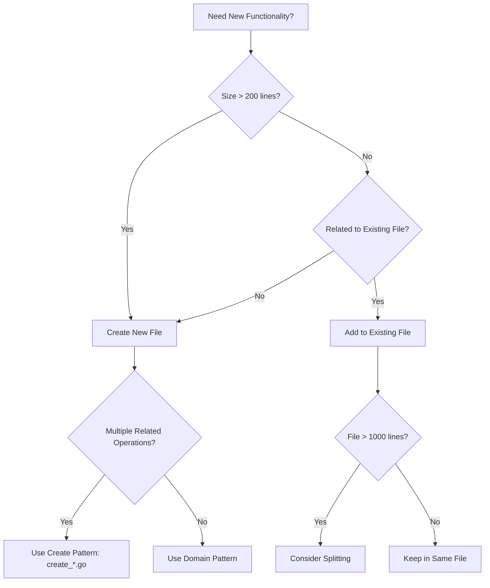
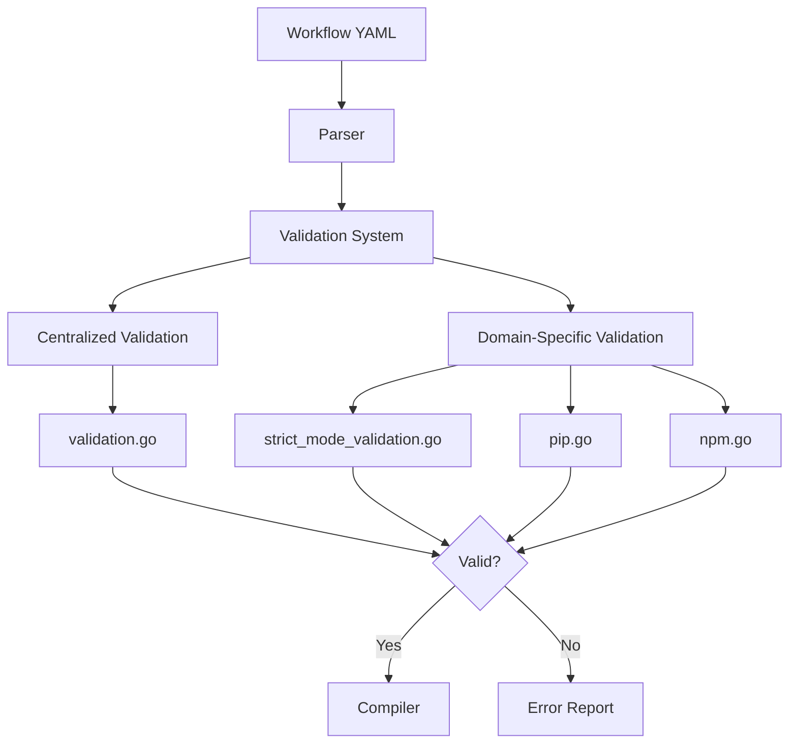

# Developer Instructions

This document consolidates development guidelines, architectural patterns, and implementation standards for GitHub Agentic Workflows. It provides guidance for contributing to the codebase while maintaining consistency, security, and code quality.

## Table of Contents

- [Code Organization Patterns](#code-organization-patterns)
- [Validation Architecture](#validation-architecture)
- [Development Standards](#development-standards)
- [String Processing](#string-processing)
- [YAML Handling](#yaml-handling)
- [Safe Output Messages](#safe-output-messages)
- [Custom GitHub Actions](#custom-github-actions)
- [Security Best Practices](#security-best-practices)
- [Testing Framework](#testing-framework)
- [Repo-Memory System](#repo-memory-system)
- [Hierarchical Agent Management](#hierarchical-agent-management)
- [Release Management](#release-management)
- [Quick Reference](#quick-reference)

---

## Code Organization Patterns

### Recommended Patterns

The codebase exhibits several well-organized patterns that should be emulated:

#### 1. Create Functions Pattern (`create_*.go`)

**Pattern**: One file per GitHub entity creation operation

**Examples**:
- `create_issue.go` - GitHub issue creation logic
- `create_pull_request.go` - Pull request creation logic
- `create_discussion.go` - Discussion creation logic
- `create_code_scanning_alert.go` - Code scanning alert creation
- `create_agent_task.go` - Agent task creation logic

**Why it works**:
- Clear separation of concerns
- Enables quick location of specific functionality
- Prevents files from becoming too large
- Facilitates parallel development
- Makes testing straightforward

#### 2. Engine Separation Pattern

**Pattern**: Each AI engine has its own file with shared helpers in `engine_helpers.go`

**Examples**:
- `copilot_engine.go` (971 lines) - GitHub Copilot engine
- `claude_engine.go` (340 lines) - Claude engine
- `codex_engine.go` (639 lines) - Codex engine
- `custom_engine.go` (300 lines) - Custom engine support
- `engine_helpers.go` (424 lines) - Shared engine utilities

**Why it works**:
- Engine-specific logic is isolated
- Shared code is centralized
- Allows addition of new engines without affecting existing ones
- Clear boundaries reduce merge conflicts

#### 3. Test Organization Pattern

**Pattern**: Tests live alongside implementation files with descriptive names

**Examples**:
- Feature tests: `feature.go` + `feature_test.go`
- Integration tests: `feature_integration_test.go`
- Specific scenario tests: `feature_scenario_test.go`

**Why it works**:
- Tests are co-located with implementation
- Clear test purpose from filename
- Encourages comprehensive testing
- Separates integration from unit tests

### File Creation Decision Tree



### File Size Guidelines

- **Small (50-200 lines)**: Utilities, helpers, simple features
- **Medium (200-500 lines)**: Domain-specific logic, focused features
- **Large (500-1000 lines)**: Complex features, comprehensive implementations
- **Very Large (1000+ lines)**: Consider splitting if not cohesive

---

## Validation Architecture

The validation system ensures workflow configurations are correct, secure, and compatible with GitHub Actions before compilation. Validation is organized into two main patterns:

1. **Centralized validation** - General-purpose validation in `validation.go`
2. **Domain-specific validation** - Specialized validation in dedicated files

### Validation Flow



---

## Development Standards

### Code Quality

- Use `const` by default; `let` only when reassignment is required
- Use `===` and `!==` (never `==` or `!=`)
- Never use `eval`, `new Function()`, or implied eval
- Keep cognitive complexity ≤ 15 per function
- Avoid duplicate strings (threshold: 3 occurrences — extract to constants)

### Security

- Sanitize all user/external inputs before use
- Avoid dynamic `RegExp` construction with untrusted input
- Use `crypto.randomUUID()` or `crypto.randomBytes()` — never `Math.random()` for tokens
- Log errors without exposing internal stack traces to end users

---

## String Processing

### Sanitization Rules

- Always sanitize user-provided strings before including in YAML output
- Use proper escaping for shell commands
- Validate string lengths before processing
- Handle multi-byte characters correctly

---

## YAML Handling

### Best Practices

- Use consistent indentation (2 spaces)
- Quote strings that could be misinterpreted as other YAML types
- Validate YAML structure before processing
- Handle multiline strings with proper block scalars

---

## Safe Output Messages

Safe outputs provide structured communication between AI agents and the GitHub API. Key principles:

- Use typed JSONL format for output
- Validate all fields against JSON schema
- Support staged mode for review before execution
- Handle errors gracefully with meaningful messages

---

## Custom GitHub Actions

### Build Workflow

```bash
# Install dependencies
make deps

# Build the binary
make build

# Run tests
make test

# Full validation
make agent-finish
```

---

## Security Best Practices

1. **Template Injection Prevention**: Never interpolate user input directly into templates
2. **Secret Management**: Use GitHub secrets, never hardcode credentials
3. **Input Validation**: Validate all inputs from external sources
4. **Least Privilege**: Request minimum required permissions
5. **Network Security**: Explicitly allowlist required domains

---

## Testing Framework

### Test Types

- **Unit Tests**: Fast, isolated tests for individual functions
- **Integration Tests**: Tests that verify component interactions
- **End-to-End Tests**: Full workflow compilation and execution tests

### Running Tests

```bash
make test-unit     # Go unit tests (~25s)
make test          # All Go tests (~30s)
make test-js       # JavaScript tests
make test-all      # All tests
```

---

## Release Management

### Changesets

Use changesets to document changes and manage versioning:

```bash
# Create a changeset
npx changeset

# Release new version
npx changeset version
npx changeset publish
```

**Version Types**:
- **major**: Breaking changes
- **minor**: New features (backward compatible)
- **patch**: Bug fixes and minor improvements

---

## Quick Reference

### Common Patterns

**Creating a new GitHub entity handler**:
1. Create `create_<entity>.go` in `pkg/workflow/`
2. Implement `Create<Entity>()` function
3. Add validation in `validation.go` or domain-specific file
4. Create corresponding test file
5. Update safe output messages

**Adding new validation**:
1. Determine if centralized or domain-specific
2. Add validation function in appropriate file
3. Call from main validation orchestrator
4. Add tests for valid and invalid cases
5. Document validation rules

**Adding new engine**:
1. Create `<engine>_engine.go` in `pkg/workflow/`
2. Implement engine interface
3. Use `engine_helpers.go` for shared functionality
4. Add engine-specific tests
5. Register engine in engine factory

---

**Last Updated**: 2026-01-31
