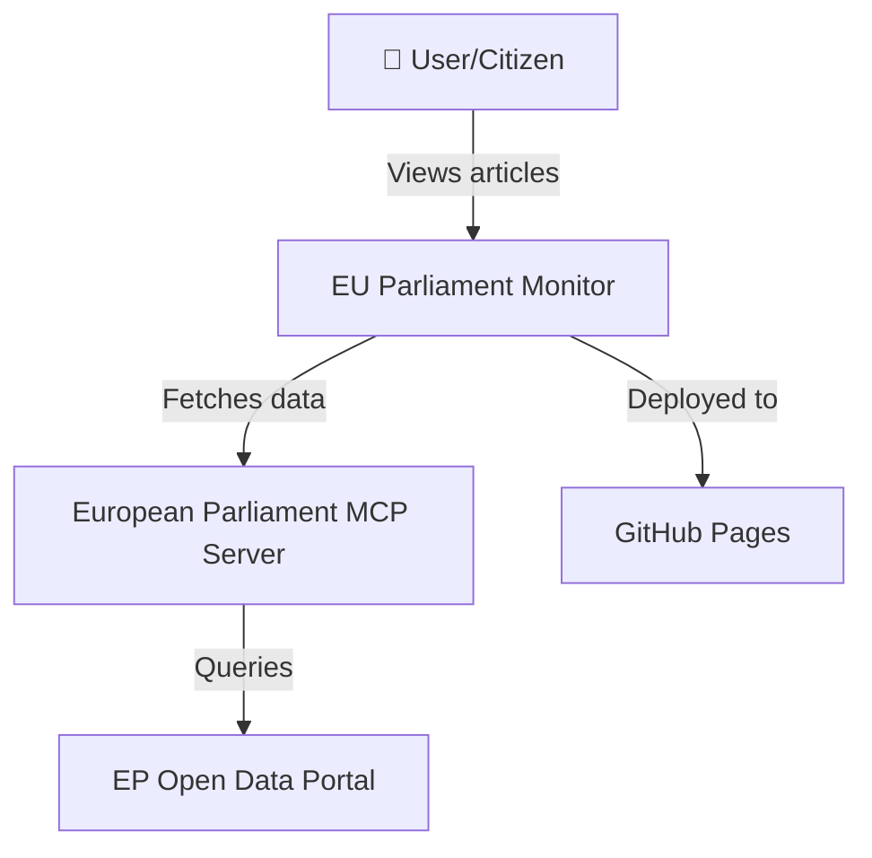
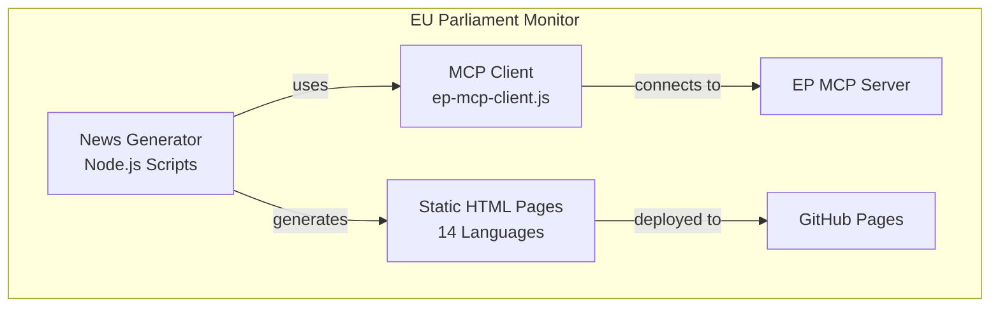
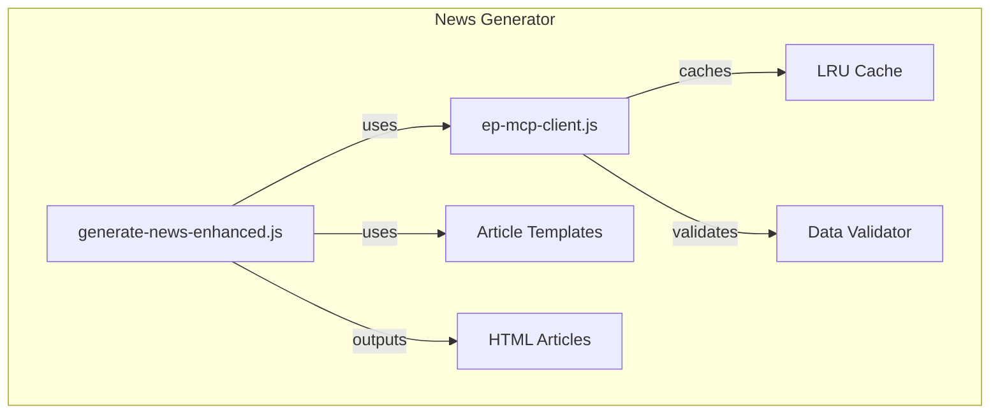
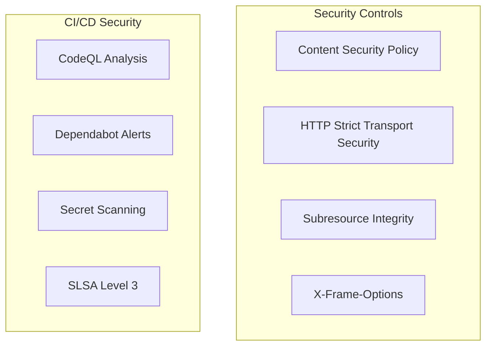

# 🏛️ C4 Architecture Documentation Skill

## Purpose

Ensure all architecture documentation follows the C4 model (Context, Container, Component, Code) with Mermaid diagram syntax, maintaining both current and future state documentation.

## Rules

### MUST (Critical)
1. MUST maintain complete C4 architecture models for the system
2. MUST use Mermaid syntax for all architecture diagrams
3. MUST maintain both current state and future state documentation
4. MUST include document control metadata (owner, version, classification, review date)
5. MUST update architecture docs when system design changes

### Required Documentation Files

**Current State:**
- `ARCHITECTURE.md` — C4 models (Context, Container, Component)
- `DATA_MODEL.md` — Data structures, entities, relationships
- `FLOWCHART.md` — Business process and data flows
- `STATEDIAGRAM.md` — State transitions and lifecycles
- `MINDMAP.md` — Conceptual relationships
- `SWOT.md` — Strategic analysis
- `SECURITY_ARCHITECTURE.md` — Security design and controls
- `THREAT_MODEL.md` — STRIDE threat analysis

**Future State:**
- `FUTURE_ARCHITECTURE.md` — Evolution roadmap
- `FUTURE_DATA_MODEL.md` — Enhanced data plans
- `FUTURE_FLOWCHART.md` — Improved workflows
- `FUTURE_STATEDIAGRAM.md` — Advanced state management
- `FUTURE_MINDMAP.md` — Capability expansion
- `FUTURE_SWOT.md` — Future opportunities
- `FUTURE_SECURITY_ARCHITECTURE.md` — Security improvements

### C4 Model Levels

**Level 1 - System Context:**


**Level 2 - Container:**


**Level 3 - Component:**


### Document Control Header

Every architecture document MUST include:
```markdown
| 📋 Metadata | Details |
|---|---|
| **Document** | Architecture Documentation |
| **Owner** | James Pether Sörling, CEO Hack23 AB |
| **Version** | X.Y |
| **Classification** | PUBLIC |
| **Last Review** | YYYY-MM-DD |
| **Next Review** | YYYY-MM-DD |
```

### Mermaid Diagram Standards

- Use clear, descriptive labels
- Include technology annotations in containers
- Use consistent color schemes
- Add legends when diagrams are complex
- Keep diagrams focused (max 15-20 nodes)

## Examples

### Security Architecture Pattern


## Related Policies
- [Secure Development Policy](https://github.com/Hack23/ISMS-PUBLIC/blob/main/Secure_Development_Policy.md)
- [Information Security Policy](https://github.com/Hack23/ISMS-PUBLIC/blob/main/Information_Security_Policy.md)

## Related Documentation
- [CIA Architecture](https://github.com/Hack23/cia/blob/master/ARCHITECTURE.md)
- [Black Trigram Architecture](https://github.com/Hack23/blacktrigram/blob/master/ARCHITECTURE.md)
- [CIA Compliance Manager Architecture](https://github.com/Hack23/cia-compliance-manager/blob/main/ARCHITECTURE.md)
