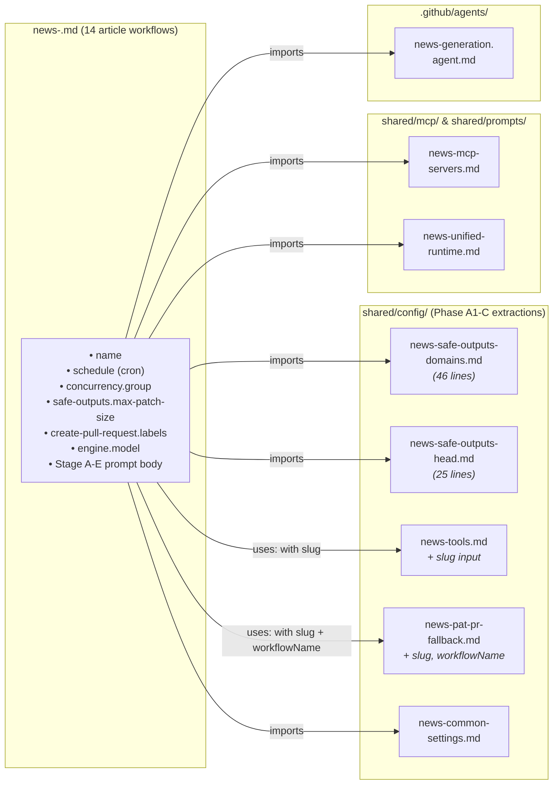

# GitHub Workflows Documentation

This directory contains GitHub Actions workflows for the EU Parliament Monitor project. All workflows follow Hack23 security standards with pinned action versions and harden-runner integration.

## Workflows Overview

### 🏗️ Infrastructure & Setup

#### `copilot-setup-steps.yml`
**Purpose**: Environment setup for GitHub Copilot operations

**Trigger**: 
- Workflow dispatch (manual)
- Push to `.github/workflows/copilot-setup-steps.yml`
- PR to `.github/workflows/copilot-setup-steps.yml`

**What it does**:
- Sets up Node.js 26
- Installs MCP server packages globally
- Configures Xvfb for browser-based operations
- Installs Playwright browsers
- Verifies MCP server installations

**Security**: Read-only permissions by default, escalated only when needed

---

### 📰 News Generation (Agentic Workflows)

The project uses **agentic workflow markdown files** (`.md`) that are compiled to `.lock.yml` files via `gh aw compile --validate`. Each news workflow generates a specific type of EU Parliament article using the European Parliament MCP server as the primary data source, with **IMF native REST-client enrichment as the sole authoritative source for economic context** and World Bank MCP enrichment **only for non-economic domains** (health, education, social, environment, demographics, defence, agriculture, innovation, governance). The World Bank is mounted as an MCP server; IMF data is fetched via a native TypeScript REST client — there is no IMF MCP mount in the workflow frontmatter.

> **Unified single-PR architecture (canonical):** each article type is
> served by a **single** unified workflow (`news-<type>.md`, 60-min timeout)
> that runs Stages A → E in one session and produces exactly one PR
> containing both the analysis artifacts and the rendered article HTML.
> Analysis artifacts live in the deterministic folder
> `analysis/daily/${DATE}/${TYPE}/` with per-attempt history recorded in
> `manifest.json.history[]`. The earlier split-pair
> `news-<type>-analysis.md` + `news-<type>-article.md` layout and the
> manual `news-article-generator.md` helper were removed in the April-2026
> aggregator-pipeline migration. See
> [`.github/prompts/02-analysis-protocol.md`](../prompts/02-analysis-protocol.md) §2
> and [`.github/agents/news-generation.agent.md`](../agents/news-generation.agent.md)
> §"Shared Stage Contract".

#### Unified workflows (8 article types)

The repository contains **14 unified agentic workflows** for automated news article generation. Each workflow follows the 5-stage pipeline (Data → Analysis → Completeness Gate → Article → Single PR) and produces one PR per run containing both analysis artifacts and rendered article HTML.

| Workflow (`.md`) | Article Type Slug | Schedule (UTC) | Trigger |
|---|---|---|---|
| [`news-breaking.md`](news-breaking.md) | `breaking` | Every 6 hours (`0 */6 * * *`) | Schedule + manual |
| [`news-week-in-review.md`](news-week-in-review.md) | `week-in-review` | Saturdays 09:00 (`0 9 * * 6`) | Schedule + manual |
| [`news-month-in-review.md`](news-month-in-review.md) | `month-in-review` | 28th of each month 10:00 (`0 10 28 * *`) | Schedule + manual |
| [`news-quarter-in-review.md`](news-quarter-in-review.md) | `quarter-in-review` | 5th of each month 08:00 (`0 8 5 * *`) | Schedule + manual |
| [`news-year-in-review.md`](news-year-in-review.md) | `year-in-review` | Mid-Jan annual (`0 8 15 1 *`) | Schedule + manual |
| [`news-week-ahead.md`](news-week-ahead.md) | `week-ahead` | Fridays 07:00 (`0 7 * * 5`) | Schedule + manual |
| [`news-month-ahead.md`](news-month-ahead.md) | `month-ahead` | 1st of each month 08:00 (`0 8 1 * *`) | Schedule + manual |
| [`news-quarter-ahead.md`](news-quarter-ahead.md) | `quarter-ahead` | 1st of each month 08:00 (`0 8 1 * *`) | Schedule + manual |
| [`news-year-ahead.md`](news-year-ahead.md) | `year-ahead` | Quarterly (`0 8 2 1,4,7,10 *`) | Schedule + manual |
| [`news-term-outlook.md`](news-term-outlook.md) | `term-outlook` | Semi-annual (`0 8 1 1,7 *`) | Schedule + manual |
| [`news-election-cycle.md`](news-election-cycle.md) | `election-cycle` | Annual December (`0 8 1 12 *`) + manual | Schedule + manual |
| [`news-committee-reports.md`](news-committee-reports.md) | `committee-reports` | Weekdays 04:00 (`0 4 * * 1-5`) | Schedule + manual |
| [`news-motions.md`](news-motions.md) | `motions` | Weekdays 06:00 (`0 6 * * 1-5`) | Schedule + manual |
| [`news-propositions.md`](news-propositions.md) | `propositions` | Weekdays 05:00 (`0 5 * * 1-5`) | Schedule + manual |

Each workflow renders articles using `npm run generate-article -- --run "${ANALYSIS_DIR}"` (aggregator-driven pipeline from `src/aggregator/**`).

#### Multi-language translation

| Workflow (`.md`) | Purpose | Trigger |
|---|---|---|
| [`news-translate.md`](news-translate.md) | 14-language translation with multi-call flush pattern (exempt from single-PR rule) | Manual (`workflow_dispatch`) only |

#### Shared-import pattern

Every article workflow imports a stack of reusable building blocks (the May 2026 refactor
extracted ~22% of duplicated frontmatter into single-source shared components — see the
[refactor commits](https://github.com/Hack23/euparliamentmonitor/pulls?q=Phase+A1+OR+Phase+A2+OR+Phase+B+OR+Phase+C) for forensic detail):

```yaml
imports:
  - .github/agents/news-generation.agent.md
  - shared/config/news-common-settings.md
  - shared/config/news-safe-outputs-domains.md
  - shared/config/news-safe-outputs-head.md
  - uses: shared/config/news-tools.md
    with:
      slug: <article-type-slug>
  - uses: shared/config/news-pat-pr-fallback.md
    with:
      slug: <article-type-slug>
      workflowName: "News: EU Parliament <Title> — Unified"
  - shared/mcp/news-mcp-servers.md
  - shared/prompts/news-unified-runtime.md
```

| Component | Owns |
|-----------|------|
| [`.github/agents/news-generation.agent.md`](../agents/news-generation.agent.md) | Canonical analysis-awareness anchor (required by repo lint rules) |
| [`shared/config/news-common-settings.md`](shared/config/news-common-settings.md) | Common `features`, `runtimes`, `network.allowed` blocks |
| [`shared/config/news-safe-outputs-domains.md`](shared/config/news-safe-outputs-domains.md) | `safe-outputs.allowed-domains` allowlist (46 lines, identical across 14) |
| [`shared/config/news-safe-outputs-head.md`](shared/config/news-safe-outputs-head.md) | `safe-outputs.threat-detection` + bundle-prerequisite `steps:` (25 lines, identical across 14). **NOTE:** `safe-outputs.max-patch-size` does **not** propagate via gh-aw v0.74.1 imports (resets to default 1024 in the compiled lock) — it must stay inline in each workflow. |
| [`shared/config/news-tools.md`](shared/config/news-tools.md) | Full `tools:` block (timeout / startup-timeout / github.toolsets / bash / edit / web-fetch / agentic-workflows / cache-memory) — parameterized by `slug` (only `cache-memory.key` varies between workflows) |
| [`shared/config/news-pat-pr-fallback.md`](shared/config/news-pat-pr-fallback.md) | `post-steps:` (agent-patch capture) + `jobs.pat-pr-fallback` (host-side PAT recovery) — parameterized by `slug` and `workflowName`. The PAT recovery contract (`scripts/gh-aw-pat-pr-fallback.sh` short-circuits on `GH_AW_SAFE_OUTPUTS_RESULT=success`) lives here. |
| [`shared/mcp/news-mcp-servers.md`](shared/mcp/news-mcp-servers.md) | Frontmatter-only shared MCP mounts (EP / IMF / WB / sequential-thinking / fetch-proxy) |
| [`shared/prompts/news-unified-runtime.md`](shared/prompts/news-unified-runtime.md) | Repeated unified-workflow runtime instructions (required reading + Stage order) |

`news-translate.md` imports `news-common-settings.md` + the MCP/prompt components and keeps its
translation-specific prompt body (multi-call flush pattern, exempt from single-PR rule).

#### Import topology diagram



The arrow style distinguishes plain imports from parameterized
(`uses: … with: …`) imports. Drift-guard tests in
[`test/unit/agentic-workflows-threat-detection.test.js`](../../test/unit/agentic-workflows-threat-detection.test.js)
walk this graph and fail if any workflow re-inlines a block that has been
extracted to a shared component.

#### Drift-guard

`test/unit/agentic-workflows-threat-detection.test.js` walks each article workflow's
import graph and asserts:

- Every article workflow imports each of the 5 shared config files above with correct
  `with:` parameters where required
- No workflow re-inlines the now-shared blocks (`allowed-domains`, `threat-detection`,
  bundle-prerequisite fetch step, `post-steps` capture, `pat-pr-fallback` job, or the
  `tools:` block)
- Workflow-wide invariants (`timeout: 180`, `startup-timeout: 180`, no `repo-memory:`,
  no `max-continuations: 1`) still hold on the **combined** post-import view

A re-inlined block in any workflow fails the drift-guard and blocks PR merge.

See the [prompts library](../prompts/README.md) for the canonical Stage A → E flow.

#### Workflow timing contract

Every unified article workflow runs under a 60-minute hard cap (`timeout-minutes: 60`)
with two binding deadlines:

| Deadline | Target | Hard limit | Source |
|---|---|---|---|
| Active-work completion (Stages A → E) | minute ≤ 42 | minute ≤ 45 | `src/config/article-horizons.ts` per-slug budgets |
| Single safe-outputs `create_pull_request` call | minute ≤ 42 | minute ≤ 45 (47 for electoral) | `safeoutputs___create_pull_request` enforcement |

The remaining 15-minute buffer under the 60-minute cap absorbs sandbox boot,
MCP gateway startup (EP / IMF / WB / sequential-thinking / fetch-proxy), the
deterministic article render (`npm run generate-article`), git push, and the
host-side PAT-recovery job. Per-slug stage budgets (Stage A / Stage B Pass 1+2 /
Stage C gate + optional Pass 3 / Stage D / Stage E) live in
[`src/config/article-horizons.ts`](../../src/config/article-horizons.ts). The
Stage C exit tripwire (typically minute 36, slug-specific in
`article-horizons.ts`) fires `GATE_RESULT=ANALYSIS_ONLY` and (if late) skips
Stage D so the run still reaches the PR call before the hard deadline.

**MCP session lifetime**: `engine.mcp.session-timeout` is intentionally NOT set
in any workflow — gh-aw v0.71.3 advertises the field, but the bundled MCP
gateway image (`ghcr.io/github/gh-aw-mcpg:v0.3.1`) rejects it
(`additionalProperties 'sessionTimeout' not allowed`, run #25275823699
fingerprint). The MCP gateway uses its upstream default session lifetime; the
agent must finish within the 60-minute `timeout-minutes` cap regardless. See
[`.github/prompts/02-analysis-protocol.md`](../prompts/02-analysis-protocol.md) §3
for the canonical stage budgets and [`.github/prompts/09-troubleshooting.md`](../prompts/09-troubleshooting.md) §5
for historical rate-limit forensics (run #24963129839).

#### Lock-file compile flow

1. Author or edit a `news-*.md` / `shared/mcp/*.md` / imported agent file.
2. Locally run `gh aw compile --validate` (the repo does **not** commit lock
   files directly from agents — see `copilot/cleanup-agentic-workflows`
   guidance).
3. CI job [`compile-agentic-workflows.yml`](compile-agentic-workflows.yml)
   re-compiles every `.md`, validates that the committed `.lock.yml` matches
   the recompile output, and runs `npm run lint:prompts` (see
   [`.github/prompts/README.md` § Drift-guard Lint](../prompts/README.md#drift-guard-lint-npm-run-lintprompts)).
4. The pinned gh-aw version lives inside `compile-agentic-workflows.yml`
   (currently v0.69.3).

Only `.lock.yml` files are executed at runtime; `.md` files are source.

#### `safeoutputs` semantics

All article-generating workflows declare:

```yaml
safe-outputs:
  create-pull-request:
    max: 1                 # default for every news-*.md article workflow
    # news-translate.md uses `excluded-files:` + multi-call flush, exempt from single-PR rule
```

Key rules (enforced by [`scripts/lint-prompts.js`](../../scripts/lint-prompts.js)):

- **`safeoutputs___create_pull_request` takes a synchronous git format-patch
  snapshot AT CALL TIME.** It must therefore be called exactly once, at the
  very end of the run, after all files are written. Calling it earlier
  produces a PR with a partial working tree.
- `news-translate.md` is the single exempt workflow (multi-call flush with
  `max-patch-size` + re-calls).
- Banned phrases CI-lint-enforced: `checkpoint pr`, `keep-alive`, `heartbeat`,
  `progressive safe output`, `push_repo_memory`.

Rationale and exceptions: [`06-pr-and-safe-outputs.md`](../prompts/06-pr-and-safe-outputs.md).

#### Common features across all news workflows
- Uses `european-parliament-mcp-server@1.3.4` as primary data source
- Mandatory date context establishment via `date -u` command
- Supports 14 languages: en, sv, da, no, fi, de, fr, es, nl, ar, he, ja, ko, zh
- HTML validation and quality checks before PR creation
- Never commits generated files (sitemap, rss, index files)
- Uses `safeoutputs___create_pull_request` (called exactly once) for PR creation
- References the [prompts library index](../prompts/README.md) for shared rules, EP MCP tool reference, and the 5-stage analysis pipeline
- References [`ai-driven-analysis-guide.md`](../../analysis/methodologies/ai-driven-analysis-guide.md) for the analysis protocol (10 steps, Rules 1–22)
- References [`analysis/templates/README.md`](../../analysis/templates/README.md) for the 39-template artifact catalog
- May apply minor TypeScript/script corrections (max 20 lines) to unblock generation

#### Resilience & performance posture (May-2026 review)

Every `news-*.md` workflow inherits the following hardened posture, applied
uniformly across all 14 article workflows plus `news-translate.md`:

| Concern | Setting | Source-of-truth doc |
|---|---|---|
| Per-tool-call cap | `tools.timeout: 180` (aligned with EP MCP 180 s request timeout) | upstream `reference/tools.md` |
| MCP server boot budget | `tools.startup-timeout: 180` | upstream `reference/tools.md` |
| MCP gateway keepalive | upstream default (no override needed) | upstream `reference/mcp-gateway.md` §4.1.3.5 |
| Cache memory (resume on failure) | `tools.cache-memory: { key: news-<type>-…, retention-days: 7 }` | upstream `reference/cache-memory.md` |
| Web fallback | `tools.web-fetch:` | upstream `reference/tools.md` |
| Explicit edit tool | `tools.edit:` | upstream `reference/tools.md` |
| GitHub toolset | `tools.github.toolsets: [all]` (excludes `dependabot`) | upstream `reference/github-tools.md` |
| Network ecosystem identifiers | `defaults`, `github`, `node`, Docker registry domains + explicit data-source domains | upstream `reference/network.md` |
| Safe-output PR resilience | `if-no-changes: warn`, `fallback-as-issue: true`, `auto-close-issue: false`, `excluded-files: ["**/*.lock", …]` | upstream `reference/safe-outputs-pull-requests.md` |
| Safe-output egress allowlist | `safe-outputs.allowed-domains: [github, …data sources]` (least-privilege; **not** `default-safe-outputs`) | upstream `reference/safe-outputs.md` |

**Host-side PAT fallback for expired safeoutputs sessions:** the 8 unified
article workflow sources define a custom `pat-pr-fallback` job named
`Host-side PAT PR fallback` that depends on the generated `agent` job and
downloads the agent artifact. `gh aw compile --validate` emits that source job
into the generated lock files; do **not** patch `.lock.yml` files directly.
The fallback job runs
[`scripts/gh-aw-pat-pr-fallback.sh`](../../scripts/gh-aw-pat-pr-fallback.sh)
**only when the safe_outputs job did not report success** — the script
short-circuits with `safe_outputs job reported success; fallback skipped`
whenever `needs.safe_outputs.result == 'success'` (plumbed as the
`GH_AW_SAFE_OUTPUTS_RESULT` env var). When safe_outputs failed (or its
result is unknown), the fallback activates on any of: `session not
found` in `/tmp/gh-aw/agent-stdio.log`, a captured
`/tmp/gh-aw/aw-agent-recovery.patch`, or a gh-aw `aw-*.patch` /
`aw-*.bundle` artifact paired with a non-success result. The step uses
`secrets.COPILOT_MCP_GITHUB_PERSONAL_ACCESS_TOKEN` from
[`copilot-setup-steps.yml`](copilot-setup-steps.yml), stages only
`analysis/daily/**` and `news/**`, pushes the deterministic
`news/<YYYY-MM-DD>-<type>` branch, and reuses any existing open PR for that
branch before creating a new one. `news-translate.md` remains the only
multi-call safeoutputs workflow and does not use this fallback.

> **Regression history**: prior to the `GH_AW_SAFE_OUTPUTS_RESULT=success`
> short-circuit, a successful bundle-path PR (e.g. PR #1902) could be
> followed by a duplicate fallback PR (e.g. PR #1903) when the post-step
> recovery patch existed and the downstream branch-pattern API check
> missed the bundle PR. The success-guard makes the fallback contract
> authoritative: **PAT recovery runs only when safe_outputs failed.**

**Cache-memory restore semantics**: gh-aw v0.69.3 emits an
`update_cache_memory` job gated by `if: needs.agent.result == 'success'`,
which means cache-memory is **only persisted to Actions cache on a
successful agent run**. If the agent job fails outright (hard crash,
skipped, cancelled), nothing is saved and the next run starts with an
empty `/tmp/gh-aw/cache-memory/`. The recovery surface this PR enables
is therefore narrower than "resume after any failure":
- ✅ Agent step succeeds, but `safeoutputs___create_pull_request` is
  blocked (org policy, patch-size rejection) → cache-memory **is**
  saved, and `fallback-as-issue: true` opens a tracking issue. The
  next run restores the prior partial work via `manifest.json.history[]`.
- ❌ Agent step is killed mid-run (session TTL, container OOM, fatal
  error) → cache-memory is **not** saved; the next run starts fresh.

Hard agent crashes do not have a durable partial-work guarantee; resilience
comes from enabling gh-aw continuation recovery, keeping tool calls bounded, and
using the host-side PAT fallback when gh-aw captures a patch artifact. Do not
reintroduce `repo-memory` as a checkpoint mechanism — it compiles an additional
`push_repo_memory` write path that the stable riksdagsmonitor news workflows do
not use.

**Security**: Read-only permissions by default, MCP data only from official EU Parliament / World Bank / IMF sources. Firewall policy via [`gh-aw-firewall` skill](../skills/gh-aw-firewall.md).

#### Degraded-mode data flow and thresholds cache

When the EP API is unavailable or slow, `scripts/prefetch-ep-feeds.sh` retries
each feed 3 times (backoff: 5 s → 15 s → 45 s) before writing an unavailable-
envelope placeholder. After all feeds are processed the script writes
`${ANALYSIS_DIR}/data/prefetch-status.json` with a `prefetchMode` field that
propagates through the pipeline:

```
prefetch-ep-feeds.sh → prefetch-status.json (prefetchMode)
                     → Stage A reads prefetchMode
                     → Stage A writes manifest.dataMode
                     → npm run validate-analysis reads manifest.dataMode
                     → line-floor reduction applied (Stage C gate)
```

| `prefetchMode` / `dataMode` | Meaning | Line-floor factor |
|-----------------------------|---------|-------------------|
| `green` / `full` | All feeds fetched; IMF & voting OK | 1.00 |
| `degraded-feeds` | 1+ feeds unavailable after 3 retries | 0.80 |
| `degraded-imf` | IMF data unavailable | 0.85 |
| `degraded-voting` | EP roll-call data absent | 0.85 |
| `title-only` | Only titles/metadata available | 0.75 |
| `minimal` | Most EP feeds unavailable + IMF absent | 0.65 |

Stage A agents must read `prefetch-status.json` and write `manifest.dataMode`
before Stage B. Stage C's `npm run validate-analysis` then auto-reduces floors
so structurally constrained runs can pass without agent self-declaration.
Structural checks (Mermaid, WEP, Admiralty, SATs) are **never** reduced.

**Thresholds cache**: to avoid re-reading
`analysis/methodologies/reference-quality-thresholds.json` per artifact (a
pattern that wastes 38+ invocations per run), agents call
`bash scripts/cache-analysis-thresholds.sh "${ANALYSIS_DIR}" "<slug>"` **once
at Stage B start**. This writes `${ANALYSIS_DIR}/runs/thresholds-cache.json`
with only the entries for the active article type. All subsequent artifact
writes read from the cache, not the source file. The lint check in
`scripts/lint-prompts.js` flags workflows that inline direct threshold reads.

## Helper Scripts — Invocation Order

The following scripts are called by the pre-agent steps or at specific Stage entry points. Invocation order per run:

| Order | Script | Stage | Purpose |
|-------|--------|-------|---------|
| 1 | `bash scripts/prefetch-ep-feeds.sh <slug> <feeds…>` | Pre-agent | EP Open Data feed fetch with 3-retry exponential backoff. Exits 1 when all feeds fail (API unreachable). Drift-guarded by `test/unit/prefetch-ep-feeds.test.js` and `test/unit/shell-safety.test.js`. |
| 2 | `node scripts/scrape-doceo-votes.js --date <date> --slug <slug> --output-dir <dir>` | Stage A | Direct DOCEO RCV XML scrape for roll-call votes (bypasses EP MCP 4–6 week lag). Returns `publicationLag:true` on 404 — not an error. |
| 3 | `node scripts/imf-fallback-ladder.js --output-dir <dir>` | Stage A | IMF economic data with 4-rung fallback: SDMX 3.0 → DataMapper → World Bank proxy → cached vintage. Writes `economic-context-data.json` with provenance. |
| 4 | `node scripts/cache-thresholds.js --slug <slug> --run-id <run-id>` | **Stage B start** | Filter `reference-quality-thresholds.json` once per run. Eliminates 38+ per-artifact re-reads. Content-hashed for short-circuit. |
| 5 | `node scripts/extend-artifacts.js --spec-file <path> --base-dir <dir>` | Stage B Pass 2 | Batch-extend multiple under-floor artifacts in one Node execution. Accepts JSON spec array `[{path, content, mode}]`. |

---

### 🏷️ Labeling & PR Automation

#### `labeler.yml`
**Purpose**: Automatically label PRs based on file changes

**Trigger**: 
- `pull_request_target` events (opened, synchronize, reopened, edited)

**What it does**:
1. Checks if required labels exist
2. Applies labels based on `.github/labeler.yml` configuration
3. Provides guidance if labels are missing

**Configuration**: `.github/labeler.yml` - defines label patterns

**Security**: 
- Uses `pull_request_target` for secure token access
- Harden-runner with egress audit
- Minimal permissions (read contents, write PRs)

**Labels Categories**:
- Features & Enhancements
- News & Content
- Multi-language
- UI/UX
- Infrastructure
- Code Quality
- Security
- Documentation
- Dependencies
- Testing
- Custom Agents

#### `setup-labels.yml`
**Purpose**: One-time workflow to create all repository labels

**Trigger**: Workflow dispatch (manual)

**Inputs**:
- `recreate_all`: Delete existing labels and recreate (default: `false`)

**What it does**:
1. Creates or updates all project labels
2. Sets consistent colors and descriptions
3. Verifies labeler configuration
4. Validates key labels exist

**Usage**: Run once when setting up the repository, or when adding new labels

**Security**: Issues and PRs write permission for label management

---

### 📦 Release Management

#### `release.yml`
**Purpose**: Automated release creation with SBOM and attestations

**Trigger**: 
- Workflow dispatch (manual)
- Push to tags matching `v*`

**Inputs**:
- `version`: Version to release (vX.Y.Z format)
- `prerelease`: Is this a pre-release? (default: `false`)

**Jobs**:
1. **Prepare**: Version management, validation, tagging
2. **Build**: Create release artifacts, generate SBOM, create attestations
3. **Release**: Draft release notes, create GitHub release

**Artifacts**:
- `euparliamentmonitor-{version}.zip` - Full project archive
- `euparliamentmonitor-{version}.spdx.json` - SBOM
- `*.intoto.jsonl` - Build and SBOM attestations

**Security**:
- SLSA Build Level 3 compliance via attestations
- SBOM generation with Anchore
- Pinned action versions
- Minimal permissions per job

**Configuration**: `.github/release-drafter.yml` - release notes template

#### `release-drafter.yml` (Configuration)
**Purpose**: Automated release notes generation

**Categories**:
- 🚀 New Features
- 🌍 EU Parliament Integration
- 🌐 Multi-language Support
- 🎨 UI/UX Improvements
- 🏗️ Infrastructure & Performance
- 🔄 Code Quality & Refactoring
- 🔒 Security & Compliance
- 📝 Documentation
- 📦 Dependencies
- 🐛 Bug Fixes
- 🧪 Test Coverage Improvements
- 🤖 Custom Agent Updates
- ⚙️ Component Updates

**Version Resolution**:
- `major`: Breaking changes
- `minor`: Features, enhancements, new integrations
- `patch`: Bugs, security, dependencies, docs (default)

---

### 🔒 Security & Compliance

#### `codeql.yml`
**Purpose**: Automated security vulnerability scanning

**Trigger**: 
- Push to main branch
- Pull requests to main
- Schedule: Weekly on Mondays at 00:00 UTC

**What it does**:
1. Initializes CodeQL with security-extended queries
2. Analyzes JavaScript/TypeScript code
3. Uploads SARIF results to GitHub Security
4. Generates security alerts for vulnerabilities

**Configuration**:
- **Languages**: javascript-typescript
- **Build Mode**: none (interpreted language)
- **Queries**: security-extended, security-and-quality
- **Ignored Paths**: news/, node_modules/, test files

**Security**:
- Security-events write permission
- Results uploaded to GitHub Security tab
- Integration with Dependabot alerts

#### `dependabot.yml` (Configuration)
**Purpose**: Automated dependency updates

**Update Schedule**:
- **npm**: Weekly on Mondays at 06:00
- **GitHub Actions**: Weekly on Mondays at 07:00

**Configuration**:
- Open up to 10 PRs at once
- Groups minor/patch updates
- Automatic labeling with `dependencies`, `javascript`, `github_actions`
- Commit message format: `build(deps):...`
- Reviewers/Assignees: Hack23

**Security**: Enables automated security updates for vulnerabilities

---

#### `zap-scan.yml`
**Purpose**: OWASP ZAP full active DAST scan against deployed targets

**Trigger**:
- `workflow_dispatch` with `url` input (defaults to `https://euparliamentmonitor.com`; host must be in the workflow's ALLOWED_HOSTS allowlist — `euparliamentmonitor.com`, `www.euparliamentmonitor.com`)
- Scheduled weekly: Sundays at 03:00 UTC against the production canonical URL

**What it does**:
- Runs `zaproxy/action-full-scan@v0.13.0` (SHA-pinned) using the official `ghcr.io/zaproxy/zaproxy:stable` container
- Spider + AJAX-spider + active scan with alpha rules (`-a -j` cmd options)
- Reads false-positive suppressions from `.zap/rules.tsv` (in-repo, reviewed)
- Auto-files findings as a single rolling GitHub issue and uploads `report_html.html`, `report_md.md`, `report_json.json` as the `zap_scan` artifact
- Concurrency-protected (`group: zap-scan`, `cancel-in-progress: false`) so two scans never overlap on the same target

**Permissions**:
- `contents: read`
- `issues: write` (only required for the auto-issue; can be removed by setting `allow_issue_writing: false`)

**Tuning**:
- Update `.zap/rules.tsv` to suppress new noisy findings — keep the ignore list as small as possible and prefer fixing the underlying issue
- Adjust the cron in `on.schedule` if production traffic patterns change

---

### ✅ Test & Validation

#### `test-and-report.yml`
**Purpose**: Comprehensive PR validation and testing

**Trigger**: 
- Push to main branch
- Pull requests to main

**Jobs**:

1. **Prepare**: Environment setup, dependency installation
2. **Validation**: 
   - HTML validation with htmlhint
   - JavaScript syntax checking
   - package.json script verification
3. **Functional Tests**:
   - News generation test
   - Index generation test
   - Sitemap generation test
   - Generated HTML validation
4. **Security Check**:
   - npm audit for vulnerabilities
   - Outdated dependency check
5. **Report**: Generate summary of all test results

**Artifacts**: Test output (news/, indexes, sitemap)

**Security**: 
- Read-only permissions by default
- Write PRs for comments
- Write security-events for audit results

#### `e2e.yml`
**Purpose**: Playwright end-to-end browser tests (14 languages, accessibility,
visual regression) against the built static site.

**Trigger**: Push + PR to `main`; manual dispatch; daily cron at 00:00 UTC.

**Runtime**: Runs inside the official `mcr.microsoft.com/playwright:v1.60.0-noble`
container — chromium + firefox + webkit + OS deps + fonts are pre-baked, so the
job no longer pays the ~500 MB cold browser download or the `playwright
install-deps` apt-get flake cost. Node 26 is overlaid via `actions/setup-node`
because the image bundles Node 22 and `engines.node` requires `>=26`. Bump the
image tag in lockstep with `@playwright/test` in `package.json`.

> **Note:** `step-security/harden-runner` is not used in container jobs (it
> requires host-level network hooks). The egress-audit observability is
> intentionally traded for the build-reliability gain on the Playwright path.

#### `reuse.yml`
**Purpose**: REUSE 3.3 compliance check (every file declares an SPDX licence
header or has a matching `.license` companion).

**Trigger**: Push + PR to `main`.

#### `scorecards.yml`
**Purpose**: OSSF Scorecard weekly supply-chain security scan — publishes
results to GitHub Security and the OSSF dashboard.

**Trigger**: Weekly schedule + push to `main`.

#### `dependency-review.yml`
**Purpose**: GitHub dependency-review action — blocks PRs that introduce
vulnerable or disallowed-licence dependencies.

**Trigger**: Pull requests.

#### `compile-agentic-workflows.yml`
**Purpose**: Recompiles every `news-*.md` → `.lock.yml` with the pinned gh-aw
version and fails the build if any committed lock file is stale. Also runs
`node scripts/lint-prompts.js` to enforce the four drift-guard rules
documented in [`.github/prompts/README.md`](../prompts/README.md).

**Trigger**: Push + PR that touches any `.github/workflows/*.md`,
`.github/agents/*.md`, `.github/prompts/*.md`, or `scripts/lint-prompts.js`.

#### `agentics-maintenance.yml`
**Purpose**: Scheduled maintenance workflow for gh-aw housekeeping (token
rotation checks, cache cleanup, upstream-version drift diagnostics).

**Trigger**: Schedule.

---

### 🚀 Deployment

#### `deploy-s3.yml`
**Purpose**: Deploy the built static site (HTML, CSS, JS, 14-language news
articles) to the production S3 / CloudFront origin.

**Trigger**: Push to `main` + manual dispatch.

**Security**: OIDC-assumed AWS role (no long-lived keys); harden-runner with
strict egress; pinned action versions.

---

## Security Standards

All workflows follow Hack23 ISMS security requirements:

### Pinned Action Versions
Every action uses SHA256 pinning for security:
```yaml
uses: actions/checkout@de0fac2e4500dabe0009e67214ff5f5447ce83dd # v6.0.2
```

### Harden Runner
All workflows include StepSecurity Harden Runner:
```yaml
- name: Harden Runner
  uses: step-security/harden-runner@5ef0c079ce82195b2a36a210272d6b661572d83e # v2.14.2
  with:
    egress-policy: audit
```

### Minimal Permissions
Workflows follow principle of least privilege:
```yaml
permissions: read-all  # Default

jobs:
  specific-job:
    permissions:
      contents: read
      pull-requests: write  # Only when needed
```

### Dependency Management
- Dependabot enabled for automated updates
- Weekly schedule to minimize disruption
- Grouped updates to reduce PR volume
- Automated security updates prioritized

---

## Workflow Maintenance

### Adding New Workflows

1. Create workflow file in `.github/workflows/`
2. Pin all action versions (use SHA + tag comment)
3. Include harden-runner as first step
4. Set minimal permissions
5. Add to this README with documentation
6. Test with workflow dispatch or PR

### Updating Workflows

1. Test changes in feature branch
2. Use Dependabot or manual SHA updates
3. Verify action compatibility
4. Update documentation in this README
5. Ensure ISMS compliance maintained

### Workflow Best Practices

- **Use caching**: npm dependencies, build artifacts
- **Fail fast**: Set `fail-fast: false` only when needed
- **Timeout**: Set reasonable timeouts (360 minutes max)
- **Artifacts**: Upload test results and build outputs
- **Summaries**: Use `$GITHUB_STEP_SUMMARY` for results
- **Secrets**: Never log or expose secrets
- **Permissions**: Request only what's needed

---

## Troubleshooting

### Labeler Not Working
**Problem**: Labels not being applied to PRs

**Solution**:
1. Run `setup-labels.yml` workflow first
2. Check `.github/labeler.yml` syntax
3. Verify label names match in both files
4. Check workflow permissions include `pull-requests: write`

### Release Workflow Failing
**Problem**: Release creation fails

**Solution**:
1. Ensure semantic version format: `vX.Y.Z`
2. Check if tag already exists
3. Verify npm version command compatibility
4. Check artifact generation succeeds

### News Generation Issues
**Problem**: News articles not generated or PR not created

**Solution**:
1. Check MCP server connectivity (European Parliament API availability)
2. Verify `date -u` returns correct date context
3. Ensure `npm ci && npm run build` succeeds
4. Check `safeoutputs___create_pull_request` was called (not raw git commands)
5. Review workflow logs for MCP health gate failures
6. Never commit generated files (sitemap, rss, index files) — only article HTML

### CodeQL Analysis Failing
**Problem**: CodeQL analysis encounters errors

**Solution**:
1. Check JavaScript syntax in all.js files
2. Verify no build step required (build-mode: none)
3. Review ignored paths configuration
4. Check CodeQL query compatibility

### Dependabot PRs Not Created
**Problem**: No Dependabot PRs appearing

**Solution**:
1. Verify `.github/dependabot.yml` syntax
2. Check repository settings have Dependabot enabled
3. Ensure `package-lock.json` exists and is committed
4. Verify schedule configuration

---

## Workflow Triggers Reference

| Workflow | Push | PR | Schedule | Manual |
|----------|------|----|---------:|-------:|
| copilot-setup-steps | ✅ | ✅ | ❌ | ✅ |
| news-breaking | ❌ | ❌ | ✅ Every 6 h | ✅ |
| news-committee-reports | ❌ | ❌ | ✅ Mon-Fri 04:00 | ✅ |
| news-week-ahead | ❌ | ❌ | ✅ Fri 07:00 | ✅ |
| news-week-in-review | ❌ | ❌ | ✅ Sat 09:00 | ✅ |
| news-month-ahead | ❌ | ❌ | ✅ 1st 08:00 | ✅ |
| news-month-in-review | ❌ | ❌ | ✅ 28th 10:00 | ✅ |
| news-motions | ❌ | ❌ | ✅ Mon-Fri 06:00 | ✅ |
| news-propositions | ❌ | ❌ | ✅ Mon-Fri 05:00 | ✅ |
| news-translate | ❌ | ❌ | ❌ | ✅ |
| labeler | ❌ | ✅ | ❌ | ❌ |
| setup-labels | ❌ | ❌ | ❌ | ✅ |
| release | ✅ Tags | ❌ | ❌ | ✅ |
| codeql | ✅ main | ✅ | ✅ Weekly | ❌ |
| test-and-report | ✅ main | ✅ | ❌ | ❌ |
| e2e | ✅ main | ✅ | ❌ | ✅ |
| reuse | ✅ main | ✅ | ❌ | ❌ |
| scorecards | ✅ main | ❌ | ✅ Weekly | ❌ |
| dependency-review | ❌ | ✅ | ❌ | ❌ |
| compile-agentic-workflows | ✅ (path-scoped) | ✅ (path-scoped) | ❌ | ✅ |
| agentics-maintenance | ❌ | ❌ | ✅ | ✅ |
| deploy-s3 | ✅ main | ❌ | ❌ | ✅ |

---

## ISMS Compliance

### ISO 27001 Controls
- **A.14.2.5** - Secure System Development Principles
- **A.14.2.8** - System Security Testing
- **A.14.2.9** - System Acceptance Testing

### NIST CSF
- **PR.DS-6** - Integrity Checking Mechanisms
- **DE.CM-4** - Malicious Code Detection
- **DE.CM-8** - Vulnerability Scans

### CIS Controls
- **16.3** - Establish a Process for Software Updates
- **16.4** - Automated Software Patch Management
- **16.11** - Leverage Vetted Modules or Services

---

## Support

For workflow issues or questions:
- **GitHub Issues**: https://github.com/Hack23/euparliamentmonitor/issues
- **Workflow Runs**: https://github.com/Hack23/euparliamentmonitor/actions
- **Security Alerts**: https://github.com/Hack23/euparliamentmonitor/security

---

**Last Updated**: 2026-03-02  
**Maintained By**: Hack23 DevOps Team
