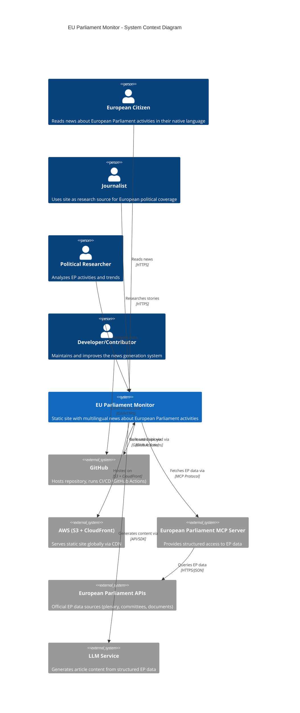
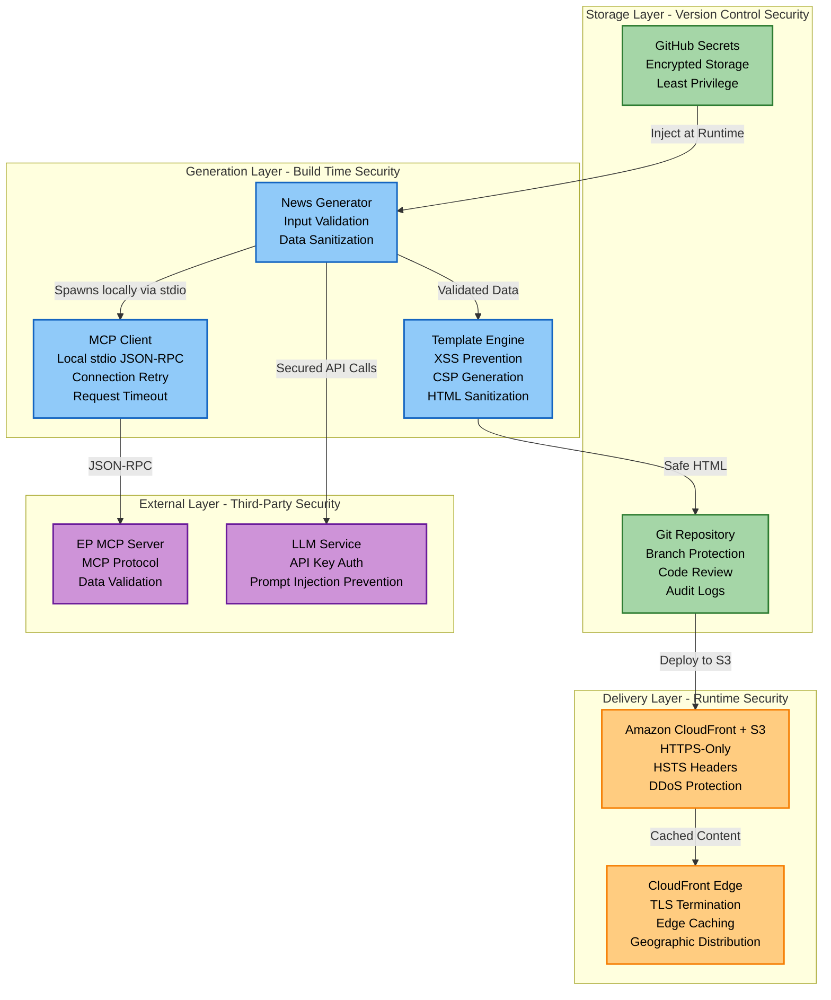
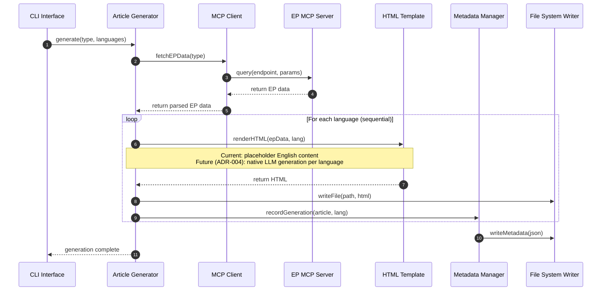
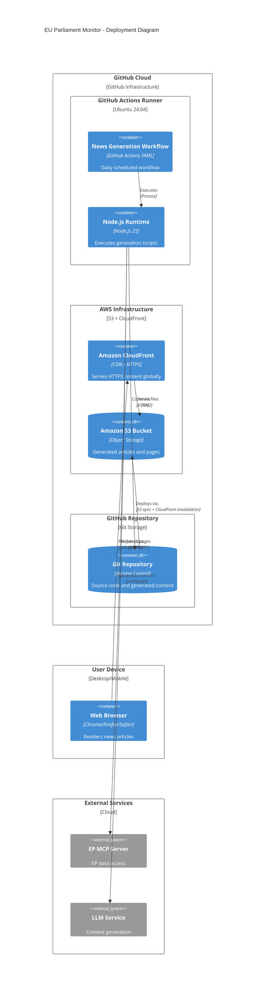
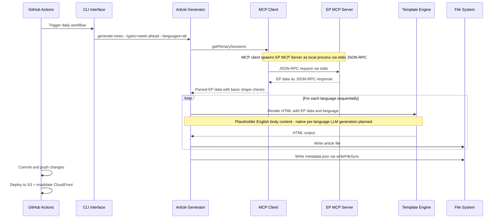
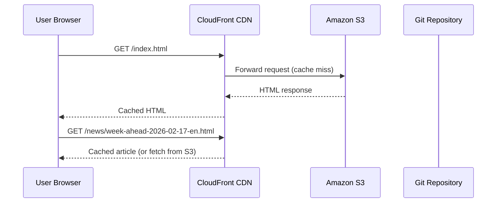
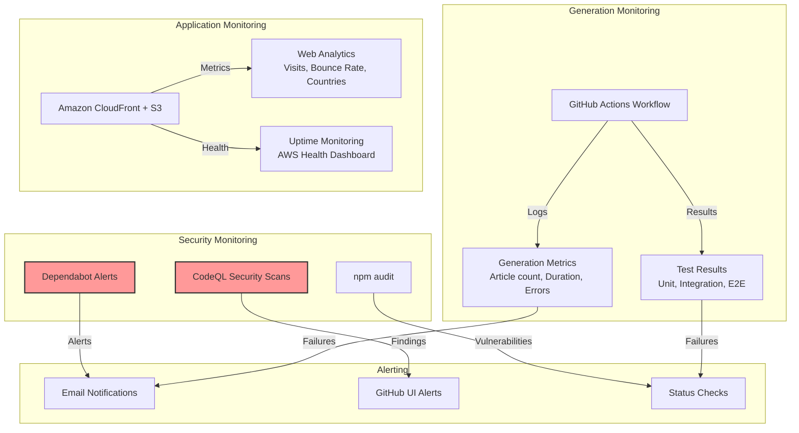
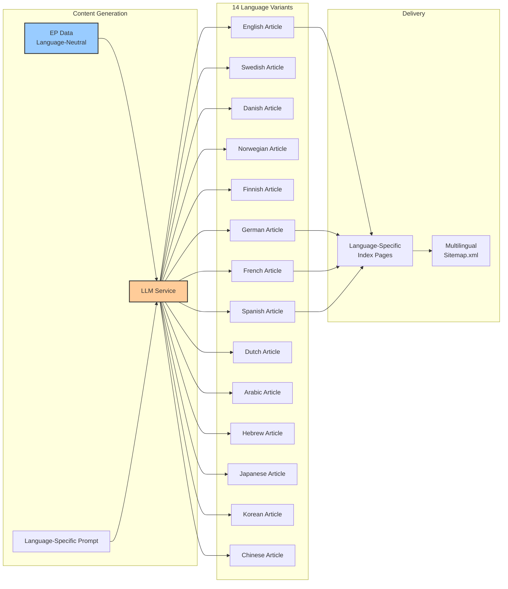

<p align="center">
  
</p>

<h1 align="center">🏛️ EU Parliament Monitor — Architecture</h1>

<p align="center">
  <strong>C4 Model Architecture for European Parliament Intelligence Platform</strong><br>
  <em>📐 System Context • 📦 Container View • 🔧 Component Design</em>
</p>

<p align="center">
  <a href="#"></a>
  <a href="#"></a>
  <a href="#"></a>
  <a href="#"></a>
  <a href="https://www.bestpractices.dev/projects/12068"></a>
</p>

**📋 Document Owner:** CEO | **📄 Version:** 1.2 | **📅 Last Updated:**
2026-04-20 (UTC) | **📦 Release:** v0.8.40  
**🔄 Review Cycle:** Quarterly | **⏰ Next Review:** 2026-07-20

---

This document serves as the primary entry point for the EU Parliament Monitor's
architectural documentation. It provides a comprehensive view of the system's
design using the C4 model approach, starting from a high-level system context
and drilling down to component interactions.

## 📚 Architecture Documentation Map

<div class="documentation-map">

| Document                                                            | Focus           | Description                                    | Documentation Link                                                                                     |
| ------------------------------------------------------------------- | --------------- | ---------------------------------------------- | ------------------------------------------------------------------------------------------------------ |
| **[Architecture](ARCHITECTURE.md)**                                 | 🏛️ Architecture | C4 model showing current system structure      | [View Source](https://github.com/Hack23/euparliamentmonitor/blob/main/ARCHITECTURE.md)                 |
| **[Future Architecture](FUTURE_ARCHITECTURE.md)**                   | 🏛️ Architecture | C4 model showing future system structure       | [View Source](https://github.com/Hack23/euparliamentmonitor/blob/main/FUTURE_ARCHITECTURE.md)          |
| **[Mindmaps](MINDMAP.md)**                                          | 🧠 Concept      | Current system component relationships         | [View Source](https://github.com/Hack23/euparliamentmonitor/blob/main/MINDMAP.md)                      |
| **[Future Mindmaps](FUTURE_MINDMAP.md)**                            | 🧠 Concept      | Future capability evolution                    | [View Source](https://github.com/Hack23/euparliamentmonitor/blob/main/FUTURE_MINDMAP.md)               |
| **[SWOT Analysis](SWOT.md)**                                        | 💼 Business     | Current strategic assessment                   | [View Source](https://github.com/Hack23/euparliamentmonitor/blob/main/SWOT.md)                         |
| **[Future SWOT Analysis](FUTURE_SWOT.md)**                          | 💼 Business     | Future strategic opportunities                 | [View Source](https://github.com/Hack23/euparliamentmonitor/blob/main/FUTURE_SWOT.md)                  |
| **[Data Model](DATA_MODEL.md)**                                     | 📊 Data         | Current data structures and relationships      | [View Source](https://github.com/Hack23/euparliamentmonitor/blob/main/DATA_MODEL.md)                   |
| **[Future Data Model](FUTURE_DATA_MODEL.md)**                       | 📊 Data         | Enhanced European Parliament data architecture | [View Source](https://github.com/Hack23/euparliamentmonitor/blob/main/FUTURE_DATA_MODEL.md)            |
| **[Flowcharts](FLOWCHART.md)**                                      | 🔄 Process      | Current data processing workflows              | [View Source](https://github.com/Hack23/euparliamentmonitor/blob/main/FLOWCHART.md)                    |
| **[Future Flowcharts](FUTURE_FLOWCHART.md)**                        | 🔄 Process      | Enhanced AI-driven workflows                   | [View Source](https://github.com/Hack23/euparliamentmonitor/blob/main/FUTURE_FLOWCHART.md)             |
| **[State Diagrams](STATEDIAGRAM.md)**                               | 🔄 Behavior     | Current system state transitions               | [View Source](https://github.com/Hack23/euparliamentmonitor/blob/main/STATEDIAGRAM.md)                 |
| **[Future State Diagrams](FUTURE_STATEDIAGRAM.md)**                 | 🔄 Behavior     | Enhanced adaptive state transitions            | [View Source](https://github.com/Hack23/euparliamentmonitor/blob/main/FUTURE_STATEDIAGRAM.md)          |
| **[Security Architecture](SECURITY_ARCHITECTURE.md)**               | 🛡️ Security     | Current security implementation                | [View Source](https://github.com/Hack23/euparliamentmonitor/blob/main/SECURITY_ARCHITECTURE.md)        |
| **[Future Security Architecture](FUTURE_SECURITY_ARCHITECTURE.md)** | 🛡️ Security     | Security enhancement roadmap                   | [View Source](https://github.com/Hack23/euparliamentmonitor/blob/main/FUTURE_SECURITY_ARCHITECTURE.md) |
| **[Threat Model](THREAT_MODEL.md)**                                 | 🎯 Security     | STRIDE threat analysis                         | [View Source](https://github.com/Hack23/euparliamentmonitor/blob/main/THREAT_MODEL.md)                 |
| **[Classification](CLASSIFICATION.md)**                             | 🏷️ Governance   | CIA classification & BCP                       | [View Source](https://github.com/Hack23/euparliamentmonitor/blob/main/CLASSIFICATION.md)               |
| **[CRA Assessment](CRA-ASSESSMENT.md)**                             | 🛡️ Compliance   | Cyber Resilience Act                           | [View Source](https://github.com/Hack23/euparliamentmonitor/blob/main/CRA-ASSESSMENT.md)               |
| **[Workflows](WORKFLOWS.md)**                                       | ⚙️ DevOps       | CI/CD documentation                            | [View Source](https://github.com/Hack23/euparliamentmonitor/blob/main/WORKFLOWS.md)                    |
| **[Future Workflows](FUTURE_WORKFLOWS.md)**                         | 🚀 DevOps       | Planned CI/CD enhancements                     | [View Source](https://github.com/Hack23/euparliamentmonitor/blob/main/FUTURE_WORKFLOWS.md)             |
| **[Business Continuity Plan](BCPPlan.md)**                          | 🔄 Resilience   | Recovery planning                              | [View Source](https://github.com/Hack23/euparliamentmonitor/blob/main/BCPPlan.md)                      |
| **[Financial Security Plan](FinancialSecurityPlan.md)**             | 💰 Financial    | Cost & security analysis                       | [View Source](https://github.com/Hack23/euparliamentmonitor/blob/main/FinancialSecurityPlan.md)        |
| **[End-of-Life Strategy](End-of-Life-Strategy.md)**                 | 📦 Lifecycle    | Technology EOL planning                        | [View Source](https://github.com/Hack23/euparliamentmonitor/blob/main/End-of-Life-Strategy.md)         |
| **[Unit Test Plan](UnitTestPlan.md)**                               | 🧪 Testing      | Unit testing strategy                          | [View Source](https://github.com/Hack23/euparliamentmonitor/blob/main/UnitTestPlan.md)                 |
| **[E2E Test Plan](E2ETestPlan.md)**                                 | 🔍 Testing      | End-to-end testing                             | [View Source](https://github.com/Hack23/euparliamentmonitor/blob/main/E2ETestPlan.md)                  |
| **[Performance Testing](performance-testing.md)**                   | ⚡ Performance  | Performance benchmarks                         | [View Source](https://github.com/Hack23/euparliamentmonitor/blob/main/performance-testing.md)          |
| **[Security Policy](SECURITY.md)**                                  | 🔒 Security     | Vulnerability reporting & security policy      | [View Source](https://github.com/Hack23/euparliamentmonitor/blob/main/SECURITY.md)                     |

</div>

## 🛡️ ISMS Policy Alignment

EU Parliament Monitor is developed and maintained in accordance with Hack23 AB's Information Security Management System (ISMS), which is aligned with ISO 27001:2022, NIST CSF 2.0, and CIS Controls v8.1.

### Applicable ISMS Policies

| Policy | Description | Relevance to EU Parliament Monitor |
|--------|-------------|-----------------------------------|
| **[Information Security Policy](https://github.com/Hack23/ISMS-PUBLIC/blob/main/Information_Security_Policy.md)** | Establishes organization-wide security governance and risk management framework | Defines overall security posture, risk assessment methodology, and management responsibilities for the project |
| **[Secure Development Policy](https://github.com/Hack23/ISMS-PUBLIC/blob/main/Secure_Development_Policy.md)** | Defines secure coding standards, code review requirements, and SDLC security gates | Mandates security-first development practices: input validation, dependency scanning, SAST/DAST integration, secure CI/CD pipelines |
| **[Open Source Policy](https://github.com/Hack23/ISMS-PUBLIC/blob/main/Open_Source_Policy.md)** | Governs use, contribution, and licensing of open source software | Ensures compliance with Apache-2.0 License, dependency license compatibility, and transparent open source contribution practices |
| **[Classification Policy](https://github.com/Hack23/ISMS-PUBLIC/blob/main/Classification_Policy.md)** | Defines data classification scheme (Public, Internal, Confidential, Restricted) and handling requirements | All project content classified as PUBLIC; establishes data handling controls for any future sensitive data integration |
| **[AI Policy](https://github.com/Hack23/ISMS-PUBLIC/blob/main/AI_Policy.md)** | Governs responsible AI usage, transparency, and human oversight requirements | Governs LLM usage for content generation: transparency requirements, human review workflows, bias mitigation, prompt injection protection |
| **[Access Control Policy](https://github.com/Hack23/ISMS-PUBLIC/blob/main/Access_Control_Policy.md)** | Defines authentication, authorization, least privilege, and privileged access management | Controls GitHub repository access, branch protection rules, secret management, and deployment permissions |
| **[Cryptography Policy](https://github.com/Hack23/ISMS-PUBLIC/blob/main/Cryptography_Policy.md)** | Establishes cryptographic standards for data protection (algorithms, key management, TLS) | Mandates HTTPS-only content delivery, TLS 1.2+ (TLS 1.3 where supported) for outbound HTTPS API communications; EP MCP integration uses a local stdio JSON-RPC channel (no TLS); ensures secure secret storage for LLM API keys |

### ISMS Compliance Implementation

**ISO 27001:2022 Controls Implemented:**
- **A.5.10** - Information Security Policy (documented and reviewed quarterly)
- **A.8.3** - Secure Coding (ESLint security rules, CodeQL SAST scanning)
- **A.8.23** - Web Filtering (planned CSP headers via CloudFront, XSS prevention)
- **A.8.24** - Cryptography (HTTPS-only, TLS 1.2+ / TLS 1.3 where supported, site delivery via CloudFront)
- **A.8.28** - Secure Coding (input validation, dependency scanning)

**NIST CSF 2.0 Functions Addressed:**
- **Identify (ID)**: Asset inventory, risk assessment, vulnerability management
- **Protect (PR)**: Access control, data security, secure development
- **Detect (DE)**: Security monitoring, vulnerability scanning, anomaly detection
- **Respond (RS)**: Incident response procedures, GitHub Security Advisories
- **Recover (RC)**: Business Continuity Plan, backup/restore procedures

**CIS Controls v8.1 Implemented:**
- **Control 1**: Inventory and Control of Enterprise Assets (documented in repo)
- **Control 4**: Secure Configuration (branch protection, security policies)
- **Control 6**: Access Control Management (GitHub RBAC, least privilege)
- **Control 8**: Audit Log Management (GitHub audit logs, workflow logs)
- **Control 10**: Malware Defenses (Dependabot, npm audit, CodeQL)
- **Control 16**: Application Software Security (SAST, dependency scanning, secure coding)

### Compliance Evidence

Evidence of ISMS compliance is maintained through:
- **Policy Documents**: All policies stored in [Hack23/ISMS-PUBLIC](https://github.com/Hack23/ISMS-PUBLIC)
- **Security Architecture**: [SECURITY_ARCHITECTURE.md](SECURITY_ARCHITECTURE.md) maps controls to implementations
- **Threat Model**: [THREAT_MODEL.md](THREAT_MODEL.md) documents STRIDE analysis and mitigations
- **Classification**: [CLASSIFICATION.md](CLASSIFICATION.md) defines data classification and handling
- **Audit Trail**: GitHub audit logs, workflow execution logs, dependency scan reports
- **Security Scanning**: CodeQL results, Dependabot alerts, npm audit reports

---

## 🎯 System Overview

EU Parliament Monitor is a **TypeScript-first static site generator and political intelligence platform** that creates multi-language news articles about European Parliament activities. Content is produced by a fleet of **10 agentic GitHub Workflows** (gh-aw) that drive AI agents (Claude Opus 4.7 via GitHub Copilot) through a 5-stage analysis pipeline, consuming structured data from **three data surfaces**:

- **European Parliament MCP Server** `v1.2.13` (primary — plenary, MEPs, votes, committees, procedures, adopted texts, 6 sliding-window + 7 fixed-window feeds)
- **World Bank MCP** `v1.0.1` (optional, biannual — WDI macro/social/environment/health indicators)
- **IMF REST (SDMX 3.0)** (native TypeScript fetch client — monthly WEO+FM fiscal forecasts)

TypeScript code handles data acquisition, analysis orchestration, HTML structure, and validation; AI agents author all narrative content under a strict two-pass AI-First Quality regime.

### Mission Statement

**Enable democratic transparency** by providing automated, multilingual coverage
of European Parliament activities through a secure, maintainable static site
architecture.

### Key Characteristics

- **Minimal Runtime Dependencies**: Pure static HTML/CSS output with no server-side
  execution; one pinned production dependency (`european-parliament-mcp-server@1.2.13`) plus one optional dependency (`worldbank-mcp@1.0.1`) used only at build time
- **TypeScript Source**: All source in `src/` written in TypeScript 6.0.3 (strict, ESM, `"type": "module"`), compiled via `tsc` — `rootDir: ./src`, `outDir: ./scripts`, `target: ES2025`, `module: NodeNext`
- **Multi-Language Support**: Generates content in 14 languages (`en, sv, da, no, fi, de, fr, es, nl, ar, he, ja, ko, zh`), defined in `src/constants/language-core.ts::ALL_LANGUAGES`
- **Article Types**: 8 production content types (`breaking-news`, `committee-reports`, `month-ahead`, `monthly-review`, `motions`, `propositions`, `week-ahead`, `weekly-review`) driven by 9 strategy modules in `src/generators/strategies/` — the 8 type-specific strategies plus `article-strategy` (generic/on-demand, used by `news-article-generator.md` manual dispatch, not an additional production content type)
- **Agentic Workflows**: 18 gh-aw markdown workflows — 8 split-pair article types (each with `news-<type>-analysis.md` for Stages A+B+C and `news-<type>-article.md` for Stage D) + `news-article-generator.md` (manual) + `news-translate.md` (translation fan-out) — compiled to `.lock.yml` via `gh aw compile --validate` (pinned `GH_AW_VERSION: v0.69.0`)
- **Dual Economic Data (Wave-3)**: IMF REST is the **primary** source for every economic claim; World Bank MCP provides complementary non-economic context (health, education, social, environment, demographics, defence, agriculture, innovation, governance). Validator gates: `articlePolicyHasEconomicContext` (Wave-2 OR-gate, default — accepts either source) and `articlePolicyHasIMFEconomicEvidence` (Wave-3 strict — IMF only, dark-launched behind `WAVE3_IMF_STRICT` env flag) in `src/utils/content-validator.ts`
- **AI-First Quality Principle**: Mandatory 2-pass iterative improvement (~60% pass 1, ~40% pass 2); ≥80 words/SWOT item, ≥150 words/stakeholder perspective, ≥60% prose ratio, ≥1 Chart.js visualization, 0 `[AI_ANALYSIS_REQUIRED]` sentinel markers
- **MCP Integration**: Spawned as local child processes via stdio JSON-RPC at build time
- **Security by Design**: Minimal attack surface through static architecture; 5-layer gh-aw security (AWF Squid firewall allowlist, sandboxed Docker, safe-output constraints, JSONL audit trail, lock file compilation)
- **AWS Hosted**: AWS S3 + CloudFront (primary, via `deploy-s3.yml` with OIDC auth); GitHub Pages retained as documented fallback; npm package published to `registry.npmjs.org/euparliamentmonitor` with SLSA Level 3 provenance

---

## 📊 C4 Model Level 1: System Context Diagram

**👤 User Focus:** Shows how different user types interact with the EU
Parliament Monitor system and what external systems it depends on.

**🌐 Integration Focus:** Illustrates the relationships with GitHub
infrastructure, European Parliament APIs, and LLM services.


```mermaid
C4Context
    title EU Parliament Monitor - System Context Diagram

    Person(citizen, "European Citizen", "Reads news about European Parliament activities in their native language")
    Person(journalist, "Journalist", "Uses site as research source for European political coverage")
    Person(researcher, "Political Researcher", "Analyzes EP activities and trends")
    Person(contributor, "Developer/Contributor", "Maintains and improves the news generation system")

    System(epmonitor, "EU Parliament Monitor", "Static site with multilingual news about European Parliament activities")

    System_Ext(github, "GitHub", "Hosts repository, runs CI/CD (GitHub Actions)")
    System_Ext(aws, "AWS (S3 + CloudFront)", "Serves static site globally via CDN")
    System_Ext(ep_mcp, "European Parliament MCP Server", "Provides structured access to EP data")
    System_Ext(ep_api, "European Parliament APIs", "Official EP data sources (plenary, committees, documents)")
    System_Ext(llm, "LLM Service", "Generates article content from structured EP data")

    Rel(citizen, epmonitor, "Reads news", "HTTPS")
    Rel(journalist, epmonitor, "Researches stories", "HTTPS")
    Rel(researcher, epmonitor, "Analyzes data", "HTTPS")
    Rel(contributor, github, "Contributes code", "Git/HTTPS")

    Rel(epmonitor, github, "Built and deployed via", "GitHub Actions")
    Rel(epmonitor, aws, "Hosted on", "S3 + CloudFront")
    Rel(github, epmonitor, "Generates site via", "GitHub Actions")
    Rel(epmonitor, ep_mcp, "Fetches EP data via", "MCP Protocol")
    Rel(ep_mcp, ep_api, "Queries EP data", "HTTPS/JSON")
    Rel(epmonitor, llm, "Generates content via", "API/SDK")

    UpdateLayoutConfig($c4ShapeInRow="3", $c4BoundaryInRow="2")
```

### Context Diagram - Key Elements

| Element                   | Type            | Description                                                | Technology                  |
| ------------------------- | --------------- | ---------------------------------------------------------- | --------------------------- |
| **European Citizen**      | User            | Primary audience seeking EP news in native language        | Web Browser                 |
| **Journalist**            | User            | Professional using site for research and story development | Web Browser                 |
| **Political Researcher**  | User            | Academic or analyst studying EP activities                 | Web Browser                 |
| **Developer/Contributor** | User            | Maintainer improving system                                | Git, Node.js, VS Code       |
| **EU Parliament Monitor** | System          | Core static site generator                                 | Node.js, TypeScript         |
| **GitHub**                | External System | Source control, CI/CD                                      | GitHub Actions          |
| **EP MCP Server**         | External System | Structured EP data access                                  | MCP Protocol, TypeScript    |
| **EP APIs**               | External System | Official data sources                                      | REST APIs, JSON             |
| **LLM Service**           | External System | Content generation                                         | API (OpenAI/Anthropic/etc.) |

### Trust Boundaries and Security Zones


```mermaid
graph TB
    subgraph "Public Internet - Untrusted Zone"
        Users["Web Users\nCitizens, Journalists, Researchers"]
    end
    
    subgraph "GitHub Infrastructure - Trusted Zone"
        subgraph "Build Environment"
            Actions["GitHub Actions Runner\nGitHub-hosted Ubuntu runner\nubuntu-latest + Node.js 25"]
            EPServer["European Parliament\nMCP Server\nLocal process, stdio JSON-RPC"]
        end
        
        subgraph "Source Control"
            Repo["Git Repository\nVersion Control"]
        end
    end
    
    subgraph "AWS Hosting - Cloud Infrastructure Zone"
        Pages["AWS S3 + CloudFront CDN\nHTTPS via ACM"]
    end
    
    subgraph "External Services - Partially Trusted Zone"
        EPAPI["European Parliament\nOfficial APIs"]
        LLM["LLM Service\nOpenAI/Anthropic"]
    end
    
    Users -->|"HTTPS GET\nRead-Only"| Pages
    Actions -->|"Spawns locally\nstdio JSON-RPC"| EPServer
    EPServer -->|"HTTPS/JSON\nData Queries"| EPAPI
    Actions -->|"API Calls\nContent Gen"| LLM
    Actions -->|"Git Push\nAuthenticated"| Repo
    Actions -->|"S3 Sync + CF Invalidation\nAuthenticated via OIDC"| Pages
    
    classDef users fill:#CE93D8,stroke:#6A1B9A,stroke-width:2px,color:#000000
    classDef hosting fill:#A5D6A7,stroke:#2E7D32,stroke-width:2px,color:#000000
    classDef actions fill:#90CAF9,stroke:#1565C0,stroke-width:2px,color:#000000
    classDef external fill:#FFE082,stroke:#F57C00,stroke-width:2px,color:#000000

    class Users users
    class Pages hosting
    class Actions actions
    class EPServer,EPAPI,LLM external
```

**Trust Boundary Analysis:**

| Zone | Trust Level | Security Controls | Threat Model |
|------|-------------|-------------------|--------------|
| **Public Internet** | Untrusted | HTTPS-only, planned CSP headers, static content only | DDoS, XSS attempts (mitigated by static architecture) |
| **GitHub Infrastructure** | Trusted | GitHub authentication, branch protection, optional signed commits, secret scanning | Supply chain attacks (mitigated by Dependabot, CodeQL) |
| **AWS Hosting** | Trusted | ACM certificate, HTTPS redirect, DDoS protection via CloudFront | Hosting infrastructure compromise (mitigated by AWS security controls, OIDC deploy auth) |
| **External Services** | Partially Trusted | API authentication, basic input parsing/shape validation; planned systematic sanitization/escaping and rate limiting | Data poisoning, API compromise (mitigated by validation, monitoring, planned hardening) |

**Key Security Boundaries:**
1. **User → CloudFront**: Read-only HTTPS access, no authentication required (public content)
2. **GitHub Actions → External APIs**: Authenticated API calls, input validation, error handling
3. **GitHub Actions → AWS S3**: Authenticated S3 sync + CloudFront invalidation, only static files deployed
4. **External Services → System**: Data parsed and basic shape-validated before use; comprehensive sanitization/escaping and rate limiting are planned controls

---

## 📦 C4 Model Level 2: Container Diagram

**📦 Container Focus:** Shows the major containers (applications, data stores,
microservices) that make up the system.

**🔄 Data Flow Focus:** Illustrates how data flows between containers during
news generation.

```mermaid
C4Container
    title EU Parliament Monitor - Container Diagram

    Person(user, "User", "Reads multilingual EP news")
    Person(contributor, "Contributor", "Maintains system")

    Container_Boundary(epmonitor, "EU Parliament Monitor") {
        Container(aw_orchestrator, "gh-aw Orchestrator", "Agentic Workflows (Claude Opus 4.7)", "10 agentic workflows (.md → .lock.yml via gh-aw v0.69.0): 9 content + 1 translate")
        Container(pipeline, "Analysis Pipeline", "TypeScript", "5-stage pipeline: fetch → transform → analysis → generate → output (src/generators/pipeline/)")
        Container(strategies, "Strategies (×8)", "TypeScript", "article, breaking-news, committee-reports, month-ahead, monthly-review, motions, propositions, week-ahead, weekly-review (src/generators/strategies/)")
        Container(builders, "Section Builders", "TypeScript", "breaking, committee, propositions, prospective, shared, voting (src/generators/builders/)")
        Container(templates, "Article Templates", "TypeScript", "HTML5 article template, section-builders, single-source-of-truth buildSiteFooter() (src/templates/)")
        Container(ep_client, "EP MCP Client", "TypeScript", "Stdio JSON-RPC to european-parliament-mcp-server@1.2.13; sliding + fixed-window feed surfaces (src/mcp/ep-mcp-client.ts)")
        Container(wb_client, "World Bank MCP Client", "TypeScript", "Optional worldbank-mcp@1.0.1 — WDI indicators (src/mcp/wb-mcp-client.ts)")
        Container(imf_client, "IMF REST Client", "TypeScript", "Native fetch SDMX 3.0 — WEO+FM monthly forecasts (src/mcp/imf-mcp-client.ts)")
        Container(validator, "Content Validator", "TypeScript", "articlePolicyHas* gates, fallback-leak scanner, validate-analysis-completeness (src/utils/content-validator.ts)")
        Container(news_indexes, "News Indexes", "TypeScript", "Per-language index pages (src/generators/news-indexes.ts)")
        Container(sitemap_generator, "Sitemap Generator", "TypeScript", "XML sitemap across 14 languages (src/generators/sitemap.ts)")
        ContainerDb(static_files, "Static Files", "HTML/CSS/JS/JSON", "news/*.html (~1894 files), analysis/daily/YYYY-MM-DD/, articles-metadata.json, sitemap.xml, styles.css (133 KB)")
    }

    Container_Boundary(github_infra, "GitHub Infrastructure") {
        Container(actions, "GitHub Actions", "CI/CD + gh-aw runtime", "10 agentic workflows + 14 standard workflows")
        ContainerDb(repo, "Git Repository", "Version Control", "Source + generated content; articles-metadata.json")
    }

    Container_Boundary(aws_infra, "AWS Infrastructure") {
        Container(cf_s3, "CloudFront + S3", "CDN / Object Storage", "Primary hosting — HTTPS via ACM, deploy-s3.yml OIDC")
    }

    System_Ext(ep_mcp, "European Parliament MCP Server v1.2.13", "6 sliding-window + 7 fixed-window feed tools; {status:\"unavailable\", items:[]} envelope")
    System_Ext(wb_mcp, "World Bank MCP Server v1.0.1", "WDI indicators (optional)")
    System_Ext(imf_api, "IMF SDMX 3.0 REST", "https://dataservices.imf.org/REST/SDMX_3.0/")
    System_Ext(copilot, "GitHub Copilot / Claude Opus 4.7", "AI agent authoring all narrative content under AI-First 2-pass regime")

    Rel(user, cf_s3, "Reads news", "HTTPS")
    Rel(contributor, repo, "Commits code", "Git/HTTPS")
    Rel(actions, aw_orchestrator, "Triggers on schedule", "gh-aw engine")
    Rel(aw_orchestrator, copilot, "Delegates authoring", "Copilot CLI")
    Rel(aw_orchestrator, pipeline, "Invokes via npx tsx", "CLI")
    Rel(pipeline, ep_client, "Fetch stage", "Function calls")
    Rel(pipeline, wb_client, "Fetch stage (optional)", "Function calls")
    Rel(pipeline, imf_client, "Fetch stage", "Function calls")
    Rel(pipeline, strategies, "Generate stage", "Strategy dispatch")
    Rel(strategies, builders, "Compose sections", "Function calls")
    Rel(strategies, templates, "Render HTML", "Function calls")
    Rel(pipeline, validator, "Output stage gate", "Function calls")
    Rel(templates, static_files, "Write articles", "fs.writeFileSync")
    Rel(news_indexes, static_files, "Generate indexes", "fs.writeFileSync")
    Rel(sitemap_generator, static_files, "Create sitemap", "fs.writeFileSync")
    Rel(ep_client, ep_mcp, "stdio JSON-RPC", "MCP")
    Rel(wb_client, wb_mcp, "stdio JSON-RPC", "MCP")
    Rel(imf_client, imf_api, "HTTPS/SDMX", "REST")
    Rel(static_files, repo, "Committed by workflow", "Git")
    Rel(actions, cf_s3, "Deploy via OIDC", "S3 sync + CloudFront invalidation")

    UpdateLayoutConfig($c4ShapeInRow="3", $c4BoundaryInRow="2")
```

### Container Diagram - Key Elements

| Container                   | Technology         | Purpose                               | Data Flow                                        |
| --------------------------- | ------------------ | ------------------------------------- | ------------------------------------------------ |
| **News Generation Scripts** | Node.js/TypeScript | Core article generation logic         | Orchestrates MCP data fetch and LLM generation   |
| **Index Page Generator**    | Node.js/TypeScript | Creates language-specific index pages | Aggregates article metadata into navigation      |
| **Sitemap Generator**       | Node.js/TypeScript | SEO sitemap creation                  | Lists all pages for search engine crawling       |
| **MCP Client**              | TypeScript         | EP data access                        | Communicates with MCP Server for structured data |
| **Article Template Engine** | TypeScript         | HTML generation                       | Converts article data to semantic HTML5          |
| **Static Files**            | HTML/CSS           | Generated output                      | Committed to repository, deployed to AWS S3 and served via CloudFront  |
| **GitHub Actions**          | CI/CD              | Automation                            | Daily workflow execution, build, deploy to S3/CloudFront       |
| **Amazon CloudFront + S3**  | CDN/Object Storage | Hosting                               | HTTPS delivery of static content globally                               |
| **Git Repository**          | Version Control    | Source & Content                      | Stores code, generated articles, configuration   |

### Security Responsibilities per Container

| Container | Security Responsibility | Implementation | Controls |
|-----------|------------------------|----------------|----------|
| **News Generation Scripts** | Basic input validation, data handling, error handling (schema validation and sanitization planned) | Parses EP data with `JSON.parse` and basic shape checks, performs minimal input validation, handles API errors gracefully; comprehensive schema validation and HTML sanitization planned | A.8.3, A.8.28 (ISO 27001) |
| **Index Page Generator** | XSS risk awareness, metadata validation (systematic escaping planned) | Performs basic article metadata structure checks and relies on static content; comprehensive XSS hardening and systematic escaping of user-facing strings planned | A.8.23 (ISO 27001) |
| **Sitemap Generator** | URL validation, XML escaping | Validates all URLs before inclusion, escapes XML special characters | A.8.3 (ISO 27001) |
| **MCP Client** | Local MCP process communication, timeout handling, basic validation | Spawns a local MCP server process over stdio JSON-RPC, applies connection retry backoff, per-request timeouts, and basic JSON parsing/validation (no TLS or API authentication at this local layer) | A.8.24 (ISO 27001), CIS Control 16 |
| **Article Template Engine** | HTML output generation, CSP-ready markup (systematic sanitization planned) | Generates semantic HTML5 and interpolates dynamic content; systematic HTML escaping/sanitization and CSP hardening planned for all dynamic content | A.8.23 (ISO 27001) |
| **Static Files** | Integrity verification, no sensitive data | All files public, no secrets or PII, content integrity via Git | A.5.10 (ISO 27001) |
| **GitHub Actions** | Secret management, least privilege, audit logging | GitHub Secrets for API keys, OIDC authentication, workflow audit logs | A.8.3, CIS Control 6 |
| **Amazon CloudFront + S3** | HTTPS-only, CDN security, DDoS protection | Forces HTTPS redirect via ACM certificate, CloudFront with DDoS mitigation, HSTS headers (configured externally in CloudFront distribution) | A.8.24 (ISO 27001) |
| **Git Repository** | Access control, branch protection, signed commits | RBAC with least privilege, protected main branch, optional signed commits | CIS Control 6, A.8.3 |

### Container Security Architecture


```mermaid
graph TB
    subgraph "Generation Layer - Build Time Security"
        NewsGen["News Generator\nInput Validation\nData Sanitization"]
        MCPClient["MCP Client\nLocal stdio JSON-RPC\nConnection Retry\nRequest Timeout"]
        Template["Template Engine\nXSS Prevention\nCSP Generation\nHTML Sanitization"]
    end
    
    subgraph "Storage Layer - Version Control Security"
        GitRepo["Git Repository\nBranch Protection\nCode Review\nAudit Logs"]
        Secrets["GitHub Secrets\nEncrypted Storage\nLeast Privilege"]
    end
    
    subgraph "Delivery Layer - Runtime Security"
        Pages["Amazon CloudFront + S3\nHTTPS-Only\nHSTS Headers\nDDoS Protection"]
        CDN["CloudFront Edge\nTLS Termination\nEdge Caching\nGeographic Distribution"]
    end
    
    subgraph "External Layer - Third-Party Security"
        EPMCP["EP MCP Server\nMCP Protocol\nData Validation"]
        LLM["LLM Service\nAPI Key Auth\nPrompt Injection Prevention"]
    end
    
    NewsGen -->|Validated Data| Template
    NewsGen -->|"Spawns locally via stdio"| MCPClient
    MCPClient -->|JSON-RPC| EPMCP
    NewsGen -->|Secured API Calls| LLM
    Template -->|Safe HTML| GitRepo
    Secrets -->|Inject at Runtime| NewsGen
    GitRepo -->|Deploy to S3| Pages
    Pages -->|Cached Content| CDN
    
    classDef generation fill:#90CAF9,stroke:#1565C0,stroke-width:2px,color:#000000
    classDef storage fill:#A5D6A7,stroke:#2E7D32,stroke-width:2px,color:#000000
    classDef delivery fill:#FFCC80,stroke:#F57C00,stroke-width:2px,color:#000000
    classDef external fill:#CE93D8,stroke:#6A1B9A,stroke-width:2px,color:#000000

    class NewsGen,Template,MCPClient generation
    class GitRepo,Secrets storage
    class Pages,CDN delivery
    class EPMCP,LLM external
```

---

## 🧩 C4 Model Level 3: Component Diagram - News Generation

**🔧 Component Focus:** Detailed view of the news generation container's
internal components.

**🎯 Responsibility Focus:** Shows how different components collaborate to
generate multilingual news articles.

```mermaid
C4Component
    title EU Parliament Monitor - Generator & Pipeline Components

    Container_Boundary(pipeline_c, "Analysis Pipeline (src/generators/pipeline/)") {
        Component(fetch_stage, "fetch-stage.ts", "TypeScript", "Pulls EP MCP feeds (sliding + fixed window), IMF SDMX monthly, optional WB WDI")
        Component(transform_stage, "transform-stage.ts", "TypeScript", "Normalises feed payloads, applies unavailable-envelope fallbacks")
        Component(analysis_stage, "analysis-stage.ts", "TypeScript", "Runs classification, threat assessment, risk scoring, significance")
        Component(generate_stage, "generate-stage.ts", "TypeScript", "Dispatches to strategy module based on article type")
        Component(output_stage, "output-stage.ts", "TypeScript", "Writes HTML article + analysis manifest.json, runs validator gates")
    }

    Container_Boundary(strategies_c, "Strategies (src/generators/strategies/)") {
        Component(s_article, "article-strategy.ts", "TS", "Generic article composition")
        Component(s_breaking, "breaking-news-strategy.ts", "TS", "6-hour cadence, TODAY-only feed items")
        Component(s_committee, "committee-reports-strategy.ts", "TS", "Per-committee deep analysis")
        Component(s_month_ahead, "month-ahead-strategy.ts", "TS", "Strategic monthly outlook")
        Component(s_monthly_review, "monthly-review-strategy.ts", "TS", "Monthly retrospective + trend synthesis")
        Component(s_motions, "motions-strategy.ts", "TS", "Per-resolution voting breakdown")
        Component(s_propositions, "propositions-strategy.ts", "TS", "Legislative pipeline tracking")
        Component(s_week_ahead, "week-ahead-strategy.ts", "TS", "Prospective weekly agenda")
        Component(s_weekly_review, "weekly-review-strategy.ts", "TS", "Weekly retrospective")
    }

    Container_Boundary(support_c, "Support Modules") {
        Component(mcp_ep, "ep-mcp-client.ts", "TS", "EP MCP stdio client; FeedBaseOptions + FixedWindowFeedOptions (no canonical EP_MCP_TOOLS export yet)")
        Component(mcp_wb, "wb-mcp-client.ts", "TS", "Exports WORLD_BANK_MCP_TOOLS canonical list")
        Component(mcp_imf, "imf-mcp-client.ts", "TS", "class IMFMCPClient; exports IMF_MCP_TOOLS; env IMF_API_BASE_URL, IMF_API_TIMEOUT_MS")
        Component(mcp_health, "mcp-health.ts / mcp-retry.ts / mcp-connection.ts", "TS", "Health probes, retry with backoff, connection lifecycle")
        Component(templates_mod, "templates/section-builders.ts", "TS", "buildSiteFooter (14-language, single source of truth), stakeholder perspectives grid")
        Component(validator_c, "utils/content-validator.ts", "TS", "articlePolicyHasWorldBank (legacy), articlePolicyHasEconomicContext (Wave-2 OR-gate), articlePolicyHasIMFEconomicEvidence (Wave-3 strict, dark-launched), isWave3IMFStrictEnabled, scanHtmlForFallbackLeaks")
        Component(significance, "utils/significance-scoring.ts", "TS", "Publication priority score")
        Component(classification, "utils/political-classification.ts + utils/political-threat-assessment.ts + utils/political-risk-assessment.ts", "TS", "Intelligence analysis family")
    }

    System_Ext(ep_mcp, "EP MCP Server v1.2.13", "6 sliding + 7 fixed-window feeds")
    System_Ext(wb_mcp, "World Bank MCP v1.0.1", "WDI indicators")
    System_Ext(imf_api, "IMF SDMX 3.0", "Monthly WEO/FM forecasts")
    ContainerDb(output, "news/*.html + analysis/daily/YYYY-MM-DD/", "HTML + JSON artifacts")

    Rel(fetch_stage, mcp_ep, "ep feeds", "stdio JSON-RPC")
    Rel(fetch_stage, mcp_wb, "wb indicators", "stdio JSON-RPC")
    Rel(fetch_stage, mcp_imf, "imf SDMX", "HTTPS")
    Rel(fetch_stage, transform_stage, "raw payloads", "fn")
    Rel(transform_stage, analysis_stage, "normalised data", "fn")
    Rel(analysis_stage, classification, "uses", "fn")
    Rel(analysis_stage, significance, "uses", "fn")
    Rel(analysis_stage, generate_stage, "analysis context", "fn")
    Rel(generate_stage, strategies_c, "dispatch by type", "strategy pattern")
    Rel(strategies_c, templates_mod, "compose sections", "fn")
    Rel(generate_stage, output_stage, "rendered HTML", "fn")
    Rel(output_stage, validator_c, "gate", "fn")
    Rel(output_stage, output, "write", "fs.writeFileSync")
    Rel(mcp_ep, mcp_health, "health probe", "fn")

    UpdateLayoutConfig($c4ShapeInRow="3", $c4BoundaryInRow="1")
```

### Component Diagram - Key Elements

| Component                | Responsibility                   | Dependencies                     | File Location                             |
| ------------------------ | -------------------------------- | -------------------------------- | ----------------------------------------- |
| **Pipeline Stages** (5)  | Ordered: fetch → transform → analysis → generate → output | MCP clients, analysis utils, strategies | `src/generators/pipeline/*.ts`            |
| **Strategies** (8)       | Per-article-type orchestration   | Builders, templates, section-builders | `src/generators/strategies/*.ts`          |
| **Builders** (6)         | Section composition (breaking, committee, propositions, prospective, shared, voting) | Types, analysis utils | `src/generators/builders/*.ts`            |
| **EP MCP Client**        | Fetch EP feeds via stdio JSON-RPC; enforces `FeedBaseOptions` vs `FixedWindowFeedOptions` (no canonical `EP_MCP_TOOLS` export yet — gap tracked in CRA-ASSESSMENT §5ᵇ row 13) | `european-parliament-mcp-server@1.2.13` | `src/mcp/ep-mcp-client.ts`                |
| **World Bank MCP Client**| Fetch WDI biannual indicators; `WORLD_BANK_MCP_TOOLS` | `worldbank-mcp@1.0.1` (optional) | `src/mcp/wb-mcp-client.ts`                |
| **IMF MCP Client**       | Native TS fetch to IMF SDMX 3.0; `class IMFMCPClient`; `IMF_MCP_TOOLS` (NOT an MCP server) | `fetch` (Node 25+) | `src/mcp/imf-mcp-client.ts`               |
| **MCP Health/Retry**     | Health probes, retry with exponential backoff, lifecycle | — | `src/mcp/mcp-health.ts`, `mcp-retry.ts`, `mcp-connection.ts` |
| **Templates**            | HTML5 article shell, 14-language localised `buildSiteFooter()`, stakeholder perspective grid, structured data (JSON-LD/Open Graph) | Types | `src/templates/article-template.ts`, `section-builders.ts` |
| **Content Validator**    | `articlePolicyHasWorldBank` (legacy), `articlePolicyHasEconomicContext` (Wave-2 OR-gate WB OR IMF — default), `articlePolicyHasIMFEconomicEvidence` (Wave-3 strict IMF-only — `WAVE3_IMF_STRICT` flag), `isWave3IMFStrictEnabled`, `scanHtmlForFallbackLeaks`, `FALLBACK_TEMPLATE_PATTERNS` | — | `src/utils/content-validator.ts`          |
| **Analysis Completeness**| Pre-PR validator gate; invoked by gh-aw workflows as `node scripts/utils/validate-analysis-completeness.js` | Types | `src/utils/validate-analysis-completeness.ts` |
| **Intelligence Utils**   | `political-classification`, `political-threat-assessment`, `political-risk-assessment`, `significance-scoring`, `article-quality-scorer` | Types | `src/utils/*.ts` |
| **News Indexes**         | Per-language index pages                | Metadata, languages | `src/generators/news-indexes.ts` |
| **Sitemap**              | XML sitemap across 14 languages       | Metadata, file-utils | `src/generators/sitemap.ts` |
| **Constants**            | `ALL_LANGUAGES` (14), `LANGUAGE_PRESETS` (`all`, `eu-core`, `nordic`), article constants, committee indicator map, config | — | `src/constants/*.ts` |

### Component Interaction Patterns


```mermaid
sequenceDiagram
    autonumber
    participant CLI as CLI Interface
    participant Gen as Article Generator
    participant MCP as MCP Client
    participant EPMCP as EP MCP Server
    participant Tmpl as HTML Template
    participant Meta as Metadata Manager
    participant FS as File System Writer
    
    CLI->>Gen: generate(type, languages)
    Gen->>MCP: fetchEPData(type)
    MCP->>EPMCP: query(endpoint, params)
    EPMCP-->>MCP: return EP data
    MCP-->>Gen: return parsed EP data
    
    loop For each language (sequential)
        Gen->>Tmpl: renderHTML(epData, lang)
        Note over Gen,Tmpl: Current: placeholder English content<br/>Future (ADR-004): native LLM generation per language
        Tmpl-->>Gen: return HTML
        Gen->>FS: writeFile(path, html)
        Gen->>Meta: recordGeneration(article, lang)
    end
    
    Meta->>FS: writeMetadata(json)
    Gen-->>CLI: generation complete
```

### Component Collaboration Patterns

| Pattern | Components Involved | Purpose | Error Handling |
|---------|---------------------|---------|----------------|
| **Cache-Aside (Planned)** | MCP Client → LRU Cache → EP MCP Server | Reduce API calls, improve performance | Planned: cache miss triggers fresh fetch; current: direct calls to EP MCP Server |
| **MCP Connection Retry with Backoff (Current)** | MCP Client → EP MCP Server | Handle transient MCP connection failures | Connection attempts retried with backoff; individual MCP requests use a fixed timeout and are not retried |
| **Validation Pipeline (Planned)** | Content Validator → Article Generator | Ensure content quality | Planned: failed validation triggers regeneration (max 2 attempts); current: single-pass generation without regeneration loop |
| **Sequential Multi-Language** | Article Generator → HTML Template (per language) | Content generation per language | Current: failure in one language aborts remaining languages; Planned: per-language failures logged while other languages still generate; parallel generation planned (ADR-004) |
| **Template Method** | Article Generator → HTML Template → File System Writer | Consistent HTML generation | Template errors logged and propagated to prevent partial writes |
| **Metadata Aggregation** | Metadata Manager → File System Writer | Track generation history | Current: metadata written synchronously via writeFileSync; failures throw and fail the run. Planned: non-blocking, best-effort writes |

---

## 🔄 Deployment Diagram

**☁️ Infrastructure Focus:** Shows how the system is deployed on GitHub
infrastructure.

**🚀 CI/CD Focus:** Illustrates the automated deployment pipeline.


```mermaid
C4Deployment
    title EU Parliament Monitor - Deployment Diagram

    Deployment_Node(github_cloud, "GitHub Cloud", "GitHub Infrastructure") {
        Deployment_Node(actions_runner, "GitHub Actions Runner", "Ubuntu 24.04") {
            Container(workflow, "News Generation Workflow", "GitHub Actions YAML", "Daily scheduled workflow")
            Container(node_runtime, "Node.js Runtime", "Node.js 25", "Executes generation scripts")
        }

        Deployment_Node(pages_cdn, "AWS Infrastructure", "S3 + CloudFront") {
            Container(web_server, "Amazon CloudFront", "CDN / HTTPS", "Serves HTTPS content globally")
            ContainerDb(static_content, "Amazon S3 Bucket", "Object Storage", "Generated articles and pages")
        }

        Deployment_Node(repo_storage, "GitHub Repository", "Git Storage") {
            ContainerDb(git_repo, "Git Repository", "Version Control", "Source code and generated content")
        }
    }

    Deployment_Node(user_device, "User Device", "Desktop/Mobile") {
        Container(browser, "Web Browser", "Chrome/Firefox/Safari", "Renders news articles")
    }

    Deployment_Node(external_services, "External Services", "Cloud") {
        System_Ext(ep_mcp, "EP MCP Server", "EP data access")
        System_Ext(llm, "LLM Service", "Content generation")
    }

    Rel(workflow, node_runtime, "Executes", "Process")
    Rel(node_runtime, ep_mcp, "Fetches data", "stdio/JSON-RPC")
    Rel(node_runtime, llm, "Generates content", "HTTPS/API")
    Rel(node_runtime, git_repo, "Commits files", "Git")
    Rel(git_repo, static_content, "Deploys via", "S3 sync + CloudFront invalidation")
    Rel(browser, web_server, "Requests pages", "HTTPS")
    Rel(web_server, static_content, "Serves", "HTTP/2")

    UpdateLayoutConfig($c4ShapeInRow="2", $c4BoundaryInRow="1")
```

### Deployment - Key Infrastructure

| Infrastructure Component  | Technology               | Purpose                           | Configuration                         |
| ------------------------- | ------------------------ | --------------------------------- | ------------------------------------- |
| **GitHub Actions Runner** | ubuntu-latest, Node.js 25 | Execute generation workflow       | .github/workflows/news-*.lock.yml |
| **Amazon CloudFront**     | AWS CDN                  | Serve static content globally     | CloudFront distribution (deploy-s3.yml) |
| **Amazon S3**             | AWS Object Storage       | Host static site files            | S3 bucket (deploy-s3.yml)              |
| **Git Repository**        | GitHub Storage           | Version control + content storage | public repository                      |
| **Web Browser**           | Modern browsers          | Render news articles              | HTML5, CSS3, ES6+                      |
| **EP MCP Server**         | Local Node process       | EP data access                    | Spawned locally via stdio JSON-RPC     |
| **LLM Service**           | External API             | Content generation                | API key authentication                 |

### Article Types & Strategies

8 production article types are driven by 9 strategy modules (strategies 1:1 with types, plus `article-strategy.ts` which is a generic fallback used by the on-demand generator — not an additional production content type):

| Article Type        | Strategy Module                      | gh-aw Workflow Pair (analysis + article)                                       | Cadence (analysis schedule)   |
|---------------------|--------------------------------------|--------------------------------------------------------------------------------|-------------------------------|
| `breaking`          | `breaking-news-strategy.ts`          | `news-breaking-analysis.md` + `news-breaking-article.md`                       | Every 6 hours                 |
| `week-ahead`        | `week-ahead-strategy.ts`             | `news-week-ahead-analysis.md` + `news-week-ahead-article.md`                   | Fri 07:00 UTC                 |
| `week-in-review`    | `weekly-review-strategy.ts`          | `news-weekly-review-analysis.md` + `news-weekly-review-article.md`             | Sat 09:00 UTC                 |
| `month-ahead`       | `month-ahead-strategy.ts`            | `news-month-ahead-analysis.md` + `news-month-ahead-article.md`                 | 1st of month 08:00 UTC        |
| `month-in-review`   | `monthly-review-strategy.ts`         | `news-monthly-review-analysis.md` + `news-monthly-review-article.md`           | 28th of month 10:00 UTC       |
| `committee-reports` | `committee-reports-strategy.ts`      | `news-committee-reports-analysis.md` + `news-committee-reports-article.md`     | Mon–Fri 04:00 UTC             |
| `motions`           | `motions-strategy.ts`                | `news-motions-analysis.md` + `news-motions-article.md`                         | Mon–Fri 06:00 UTC             |
| `propositions`      | `propositions-strategy.ts`           | `news-propositions-analysis.md` + `news-propositions-article.md`               | Mon–Fri 05:00 UTC             |

Each pair runs as: `news-<type>-analysis.md` (Stages A+B+C, ~45 min, scheduled cadence above) → on analysis-PR merge → `news-<type>-article.md` (Stage D, ~45 min, `pull_request:closed` trigger gated on `agentic-analysis` + `type:<slug>` labels).

Plus: `article-strategy.ts` (generic, used by manual `news-article-generator.md`) and `news-translate.md` (14-language translation fan-out).

### Agentic Workflows (gh-aw)

All 18 news workflows are **markdown source files compiled to YAML** (`.md` → `.lock.yml`) via the GitHub Agentic Workflows CLI (`gh aw compile --validate`) with pinned `GH_AW_VERSION: v0.69.0` in `.github/workflows/compile-agentic-workflows.yml`. See [WORKFLOWS.md](WORKFLOWS.md) for the full surface. (`.md` → `.lock.yml`) via the GitHub Agentic Workflows CLI (`gh aw compile --validate`) with pinned `GH_AW_VERSION: v0.69.0` in `.github/workflows/compile-agentic-workflows.yml`. See [WORKFLOWS.md](WORKFLOWS.md) for the full surface.

**5-layer security model**:
1. **AWF Squid firewall allowlist** — egress HTTP allowlist per workflow
2. **Sandboxed Docker with restricted shell** — `bash tool-call contract` (every call requires `command` + `description`); shell expansion restrictions
3. **Safe-output constraints** — `create-pull-request` with `max-patch-size` (default 1024 KB; `news-translate.md` sets 10240 KB at top level for 14-language fan-out)
4. **JSONL audit trail** — per-step structured logs
5. **Lock file compilation** — `.lock.yml` is the immutable executed artifact; `.md` is the human source under review

**MCP gateway** (containerised): `EP_MCP_GATEWAY_URL=http://host.docker.internal:80/mcp/european-parliament`, provisioned by `scripts/mcp-setup.sh`.

**Validator gates** (before PR creation):
- `scripts/utils/validate-analysis-completeness.js --article-html=...` — rejects articles with missing SWOT, stakeholder perspectives, economic context, or `[AI_ANALYSIS_REQUIRED]` markers
- `scanHtmlForFallbackLeaks()` in `content-validator.ts` — matches against `FALLBACK_TEMPLATE_PATTERNS`
- Dynamic file resolution pattern (must not hallucinate file names): `ls -t "news/${TODAY}-${TYPE}"*"-en.html" | head -1`

---

## 📊 Technology Stack

### Core Technologies

| Layer               | Technology | Version | Purpose                          | Rationale |
| ------------------- | ---------- | ------- | -------------------------------- | --------- |
| **Runtime**         | Node.js    | 25.x (`engines: >=25`); Node.js 26 LTS migration scheduled upon release (~Apr 2026) | JavaScript execution environment | Current release for latest features, performance improvements; ESM-native (`"type": "module"`) |
| **Language**        | TypeScript | 6.0.3   | Primary development language     | Strict type safety; compiles from `src/` → `scripts/` targeting ES2025, `module: NodeNext` |
| **Package Manager** | npm        | 10.x    | Dependency management            | Native Node.js package manager, security audit integration |
| **Testing**         | Vitest     | 4.1.4   | Unit and integration testing     | Fast, ESM-native; happy-dom env; `happy-dom@20.9.0` |
| **E2E Testing**     | Playwright | 1.59.1  | End-to-end browser testing       | `@axe-core/playwright@4.11.2` for WCAG 2.1 AA |
| **Linting**         | ESLint     | 10.2.1  | Code quality and security        | Flat config; plugins: `eslint-plugin-sonarjs@4.0.3`, `eslint-plugin-security@4.0.0`, `eslint-plugin-jsdoc@62.9.0` |
| **Formatting**      | Prettier   | 3.8.3   | Code formatting                  | Opinionated formatter, consistent code style |
| **Visualization**   | Chart.js   | 4.5.1   | Dashboard charts in articles     | Vendored into `js/vendor/` via `npm run copy-vendor` |
| **Visualization**   | D3         | 7.9.0   | Advanced visualizations          | Used for specific intelligence views |
| **Documentation**   | TypeDoc    | 0.28.19 | API documentation generation     | Generates `docs/` pages from TypeScript sources |
| **HTML Validation** | HTMLHint   | 1.9.2   | HTML5 validation                 | Pre-commit + CI |
| **Duplicate Check** | jscpd      | 4.0.9   | Copy-paste detection             | Scheduled quality audits |

### Technology Version Matrix

| Technology | Current Version | Minimum Version | End-of-Life | Update Policy |
|------------|----------------|-----------------|-------------|---------------|
| **Node.js** | 25.x (current) | 25.0.0 (`engines: >=25`) | ~Apr 2026 (Current EOL; upgrading to Node.js 26 LTS) | Update to Node.js 26 LTS within days of release (~Apr 2026) |
| **npm** | 10.x (latest) | 10.0.0 | Follows Node.js lifecycle | Auto-updated with Node.js |
| **TypeScript** | 6.0.3 | 6.0.0 | N/A | Update to latest minor within 14 days, major within 90 days |
| **Vitest** | 4.1.4 | 4.0.0 | N/A | Update to latest minor within 14 days, major within 60 days |
| **Playwright** | 1.59.1 | 1.55.0 | N/A | Update to latest minor within 14 days, major within 60 days |
| **ESLint** | 10.2.1 | 10.0.0 | N/A | Update to latest minor within 14 days, major within 90 days |
| **Prettier** | 3.8.3 | 3.0.0 | N/A | Update to latest minor within 14 days, major within 90 days |
| **Chart.js** | 4.5.1 | 4.0.0 | N/A | Vendored; update with copy-vendor script |
| **D3** | 7.9.0 | 7.0.0 | N/A | Vendored; update with copy-vendor script |
| **TypeDoc** | 0.28.19 | 0.28.0 | N/A | Major within 60 days |
| **european-parliament-mcp-server** | 1.2.13 (pinned) | 1.2.13 | Per upstream | Track releases; 1.2.11 (2026-04-20) fixes #377/#378 (fixed-window feeds, uniform unavailable envelope); 1.2.13 (2026-04-23) adds non-retryable UPSTREAM_404 for get_procedures, fixes search_documents envelope, enriches track_legislation timeline, improves get_procedures_feed error classification |
| **worldbank-mcp** | 1.0.1 (optional) | 1.0.0 | Per upstream | Biannual WDI refresh cadence |
| **gh-aw CLI** | v0.69.0 (pinned `GH_AW_VERSION`) | v0.69.0 | Per upstream | Workflow-level pin in `compile-agentic-workflows.yml` |

### Dependency Management

**Production Dependencies (1 required + 1 optional):**
- **`european-parliament-mcp-server@1.2.13`** — Primary data surface; 6 sliding-window feed tools (`timeframe` + `startDate` when `custom`) and 7 fixed-window feed tools (`limit`/`offset` only — `documents`, `plenary_documents`, `committee_documents`, `plenary_session_documents`, `parliamentary_questions`, `corporate_bodies`, `controlled_vocabularies`); returns uniform `{status:"unavailable", items:[]}` envelope on upstream failure.
- **`worldbank-mcp@1.0.1`** (`optionalDependencies`) — WDI macro/social/environment/health indicators.

**IMF REST** is integrated via native TypeScript fetch in `src/mcp/imf-mcp-client.ts` (`class IMFMCPClient`) — this is NOT an MCP server; calls go directly to `https://dataservices.imf.org/REST/SDMX_3.0/`. Env: `IMF_API_BASE_URL`, `IMF_API_TIMEOUT_MS`. Supplies WEO + FM monthly forecasts up to five years ahead.

**Dev dependencies** (notable): `vitest@4.1.4`, `@vitest/ui`, `@vitest/coverage-v8`, `happy-dom@20.9.0`, `@playwright/test@1.59.1`, `@axe-core/playwright@4.11.2`, `typescript@6.0.3`, `eslint@10.2.1`, `eslint-plugin-sonarjs@4.0.3`, `eslint-plugin-security@4.0.0`, `eslint-plugin-jsdoc@62.9.0`, `prettier@3.8.3`, `htmlhint@1.9.2`, `typedoc@0.28.19`, `chart.js@4.5.1`, `d3@7.9.0`, `papaparse@5.5.3`, `husky@9.1.7`, `jscpd@4.0.9`.

### Security & Quality

| Tool                | Purpose                           | Integration                  | Configuration |
| ------------------- | --------------------------------- | ---------------------------- | ------------- |
| **CodeQL**          | SAST scanning                     | GitHub Actions (weekly + PR) | `.github/workflows/codeql.yml` |
| **Dependabot**      | Dependency vulnerability scanning | GitHub native (daily)        | `.github/dependabot.yml` |
| **npm audit**       | Dependency security check         | Pre-commit + CI              | `package.json` scripts |
| **ESLint Security** | Security-focused linting          | Pre-commit + CI              | `eslint.config.js` (security plugin) |
| **HTMLHint**        | HTML validation                   | CI pipeline                  | `.htmlhintrc` |
| **Husky**           | Git hooks                         | Pre-commit, pre-push         | `.husky/` directory |
| **Playwright**      | Accessibility testing             | E2E test suite               | `playwright.config.js` (axe integration) |

### Infrastructure

| Service               | Purpose             | Configuration                  | Cost |
| --------------------- | ------------------- | ------------------------------ | ---- |
| **GitHub Actions**    | CI/CD automation    | .github/workflows/             | Free (public repo) |
| **AWS S3**            | Static site hosting | S3 bucket + static website     | Pay-per-use (storage, requests) |
| **Amazon CloudFront** | Content delivery    | CloudFront distribution (S3)   | Pay-per-use (data transfer, requests) |
| **Git**               | Version control     | Repository                     | Free (public repo) |

### External Services

| Service | Purpose | Protocol | Authentication | Rate Limits | Cost Model |
|---------|---------|----------|----------------|-------------|------------|
| **European Parliament MCP Server** | EP data access | Local process (stdio JSON-RPC) | None (local process) | N/A (handled by MCP server / EP APIs) | Free (EP open data via MCP server) |
| **LLM Service (OpenAI/Anthropic)** | Content generation | HTTPS/JSON | API key (required) | Varies by provider | Pay-per-token |
| **GitHub API** | Repository operations | REST/GraphQL | GitHub token | 5000 req/hr | Free (authenticated) |

### Browser Support

| Browser | Minimum Version | Features Required | Testing Coverage |
|---------|----------------|-------------------|------------------|
| **Chrome/Edge** | 90+ | ES2020, CSS Grid, Flexbox | ✅ Playwright E2E (Chromium in CI) |
| **Firefox** | 88+ | ES2020, CSS Grid, Flexbox | 🧪 Manual regression (no Playwright CI) |
| **Safari** | 14+ | ES2020, CSS Grid, Flexbox | 🧪 Manual regression (no Playwright CI) |
| **Mobile Chrome** | 90+ | ES2020, Responsive Design | 🧪 Manual responsive testing |
| **Mobile Safari** | 14+ | ES2020, Responsive Design | 🧪 Manual responsive testing |

**No support for:**
- Internet Explorer (EOL June 2022)
- Legacy Edge (Chromium-based only)

### Build Process

TypeScript source in `src/` is compiled to JavaScript in `scripts/` via `tsc`. The generated JavaScript files are executed by Node.js during news generation. The public npm entry point is `src/index.ts` (published as `euparliamentmonitor` with SLSA Level 3 provenance attestations).

```
src/                                   → scripts/                          (tsc compilation)
├── index.ts                           → index.js                          npm package entry point
├── constants/                         → constants/
│   ├── config.ts                      Project paths, BASE_URL, filename patterns
│   ├── analysis-constants.ts          Shared analysis thresholds
│   ├── committee-indicator-map.ts     Committee → indicator mapping
│   ├── language-core.ts               ALL_LANGUAGES (14), LANGUAGE_PRESETS
│   ├── language-articles.ts           Per-language article-type labels
│   ├── language-ui.ts                 Per-language UI strings
│   └── languages.ts                   Language metadata (name, flag, direction)
├── mcp/                               → mcp/
│   ├── ep-mcp-client.ts               EP MCP stdio client; feed option types (no canonical EP_MCP_TOOLS export yet)
│   ├── wb-mcp-client.ts               World Bank MCP client; exports WORLD_BANK_MCP_TOOLS
│   ├── imf-mcp-client.ts              IMFMCPClient class (native fetch/SDMX 3.0); exports IMF_MCP_TOOLS
│   ├── mcp-connection.ts              Connection lifecycle
│   ├── mcp-health.ts                  Health probes
│   └── mcp-retry.ts                   Exponential backoff retry
├── templates/                         → templates/
│   ├── article-template.ts            HTML5 article shell (SEO, JSON-LD, Open Graph)
│   └── section-builders.ts            buildSiteFooter (single source of truth, 14-lang), stakeholder grid
├── generators/
│   ├── pipeline/                      → generators/pipeline/   5 stages (fetch/transform/analysis/generate/output)
│   ├── strategies/                    → generators/strategies/ 8 strategy modules
│   ├── builders/                      → generators/builders/   6 section builders + index
│   ├── analysis-builders.ts           Analysis section composition
│   ├── breaking-content.ts            Breaking-news content
│   ├── committee-helpers.ts           Committee utilities
│   ├── dashboard-content.ts           Dashboard charts (Chart.js)
│   ├── deep-analysis-content.ts       Deep analysis composition
│   ├── mindmap-content.ts             Mermaid mindmap embedding
│   ├── motions-content.ts             Motions composition
│   ├── news-enhanced.ts               Legacy entry (delegates to pipeline)
│   ├── news-indexes.ts                Per-language index pages
│   ├── propositions-content.ts        Propositions composition
│   ├── sitemap.ts                     XML sitemap generator
│   ├── swot-content.ts                SWOT section composition
│   ├── synthesis-summary.ts           Cross-article synthesis
│   └── week-ahead-content.ts          Week-ahead composition
├── types/                             → types/
│   ├── analysis.ts, common.ts, generation.ts, imf.ts, intelligence.ts, mcp.ts,
│   │   parliament.ts, political-classification.ts, political-risk.ts,
│   │   political-threats.ts, quality.ts, significance.ts, stakeholder.ts,
│   │   visualization.ts, world-bank.ts, index.ts
└── utils/                             → utils/
    ├── article-category.ts, article-quality-scorer.ts, content-metadata.ts,
    ├── content-validator.ts (articlePolicyHas* gates, fallback-leak scanner),
    ├── copy-test-reports.ts, file-utils.ts, fix-articles.ts,
    ├── generate-docs-index.ts, html-sanitize.ts, imf-data.ts,
    ├── intelligence-analysis.ts, intelligence-index.ts, metadata-utils.ts,
    ├── news-metadata.ts, political-classification.ts,
    ├── political-risk-assessment.ts, political-threat-assessment.ts,
    ├── retrofit-analysis-links.ts, significance-scoring.ts,
    ├── validate-analysis-completeness.ts (pre-PR gate for agentic workflows),
    ├── validate-articles.ts, validate-ep-api.ts, world-bank-data.ts
```

**Key build / generation commands:**
- `npm run build` — Runs `tsc` (TypeScript compilation `src/` → `scripts/`)
- `npm run lint` — ESLint on `src/`
- `npm run generate-news` — Orchestrates strategies via the pipeline
- `npm run generate-news-indexes` — Executes `scripts/generators/news-indexes.js` (prebuild hook)
- `npm run generate-sitemap` — Executes `scripts/generators/sitemap.js` (prebuild hook)
- `npm run copy-vendor` — Vendors `chart.js` and `d3` assets into `js/vendor/`
- `npm run test` / `test:unit` / `test:integration` / `test:e2e` / `test:coverage` — Test suite (52 test files, 3061+ passing tests)

**TypeScript configuration** (`tsconfig.json`):
- `target: ES2025`, `module: NodeNext`, `strict: true`, `rootDir: ./src`, `outDir: ./scripts`, `"type": "module"` in package.json

**Runtime JS (browser)**:
- `js/index-runtime.js` — Index page filter + theme toggle
- `js/article-runtime.js` — Reading progress + theme toggle
- External scripts only (no inline scripts — CSP-ready)
- `js/vendor/` — Vendored Chart.js (4.5.1) and D3 (7.9.0)

**TypeScript configuration** (`tsconfig.json`):
- `target: ES2025` — Modern JavaScript output
- `module: NodeNext` — Node.js native ESM resolution
- `strict: true` — Full strict mode enabled
- `rootDir: ./src` — TypeScript source root
- `outDir: ./scripts` — Compiled JavaScript output

---

## 🔄 Data Flow

### News Generation Flow


```mermaid
sequenceDiagram
    participant GHA as GitHub Actions
    participant CLI as CLI Interface
    participant Gen as Article Generator
    participant MCP as MCP Client
    participant EP as EP MCP Server
    participant TPL as Template Engine
    participant FS as File System

    GHA->>CLI: Trigger daily workflow
    CLI->>Gen: generate-news --types=week-ahead --languages=all
    Gen->>MCP: getPlenarySessions
    Note over MCP,EP: MCP client spawns EP MCP Server as local process via stdio JSON-RPC
    MCP->>EP: JSON-RPC request via stdio
    EP-->>MCP: EP data as JSON-RPC response
    MCP-->>Gen: Parsed EP data with basic shape checks

    loop For each language sequentially
        Gen->>TPL: Render HTML with EP data and language
        Note over Gen,TPL: Placeholder English body content - native per-language LLM generation planned
        TPL-->>Gen: HTML output
        Gen->>FS: Write article file
    end

    Gen->>FS: Write metadata.json via writeFileSync
    GHA->>GHA: Commit and push changes
    GHA->>GHA: Deploy to S3 + invalidate CloudFront
```

### User Request Flow


```mermaid
sequenceDiagram
    participant User as User Browser
    participant CDN as CloudFront CDN
    participant S3 as Amazon S3
    participant Repo as Git Repository

    User->>CDN: GET /index.html
    CDN->>S3: Forward request (cache miss)
    S3-->>CDN: HTML response
    CDN-->>User: Cached HTML

    User->>CDN: GET /news/week-ahead-2026-02-17-en.html
    CDN-->>User: Cached article (or fetch from S3)
```

---

## 🔀 Cross-Cutting Concerns

Cross-cutting concerns are aspects of the system that affect multiple components and layers. These concerns are implemented consistently across the entire architecture.

### Logging Strategy

**Logging Levels:**
| Level | Usage | Output | Retention |
|-------|-------|--------|-----------|
| **ERROR** | Unrecoverable errors (API failures, file write errors) | `console.error()`, GitHub Actions logs | 90 days (GitHub) |
| **WARN** | Recoverable issues (MCP connection retry/backoff, MCP tool fallback, JSON.parse recovery) | `console.warn()`, GitHub Actions logs | 90 days (GitHub) |
| **INFO** | Normal operations (generation start/complete, article count) | `console.log()`, GitHub Actions logs | 90 days (GitHub) |
| **DEBUG** | Detailed diagnostics (API responses, intermediate data) | Disabled in production | Dev only |

**Structured Logging Format:**
```javascript
{
  timestamp: "2026-02-20T10:30:00.000Z",
  level: "INFO",
  component: "ArticleGenerator",
  action: "generate_article",
  language: "en",
  article_type: "week-ahead",
  duration_ms: 1234,
  status: "success"
}
```

**Logging Implementation:**
- **Build Logs**: All GitHub Actions workflow logs (generation, deployment, tests)
- **Error Tracking**: Errors logged to GitHub Actions workflow logs for visibility
- **Performance Metrics**: Generation time per article, API call durations
- **Audit Trail**: Git commit history serves as audit log for all content changes

### Monitoring and Observability


```mermaid
graph TB
    subgraph "Generation Monitoring"
        Workflow[GitHub Actions Workflow]
        GenMetrics[Generation Metrics<br/>Article count, Duration, Errors]
        TestResults[Test Results<br/>Unit, Integration, E2E]
    end
    
    subgraph "Application Monitoring"
        Pages[Amazon CloudFront + S3]
        Analytics[Web Analytics<br/>Visits, Bounce Rate, Countries]
        Uptime[Uptime Monitoring<br/>AWS Health Dashboard]
    end
    
    subgraph "Security Monitoring"
        Dependabot[Dependabot Alerts]
        CodeQL[CodeQL Security Scans]
        Audit[npm audit]
    end
    
    subgraph "Alerting"
        Email[Email Notifications]
        GitHubUI[GitHub UI Alerts]
        Status[Status Checks]
    end
    
    Workflow -->|Logs| GenMetrics
    Workflow -->|Results| TestResults
    Pages -->|Metrics| Analytics
    Pages -->|Health| Uptime
    Dependabot -->|Alerts| Email
    CodeQL -->|Findings| GitHubUI
    Audit -->|Vulnerabilities| Status
    
    GenMetrics -->|Failures| Email
    TestResults -->|Failures| Status
    
    style Dependabot fill:#f99,stroke:#333,stroke-width:2px
    style CodeQL fill:#f99,stroke:#333,stroke-width:2px
```

**Monitoring Tools:**

| Metric | Tool | Threshold | Alert |
|--------|------|-----------|-------|
| **Build Success Rate** | GitHub Actions | <95% over 7 days | Email to maintainers |
| **Generation Duration** | Workflow logs | >15 minutes | Warning annotation |
| **Test Pass Rate** | Vitest + Playwright | <100% | Block merge |
| **Security Vulnerabilities** | Dependabot + CodeQL | Any high/critical | Email + PR |
| **Site Availability** | AWS Health Dashboard | <99.9% | AWS Health event notification |
| **Page Load Time** | Lighthouse (manual runs) | >3 seconds | Warning annotation |

### Error Handling

**Error Handling Strategy:**


```mermaid
flowchart TD
    Start([API Call / Operation])
    Try{Try Operation}
    Success[✅ Success]
    Catch{Catch Error}
    Transient{Transient<br/>Error?}
    Retry[Retry with<br/>Exponential Backoff]
    MaxRetries{Max Retries<br/>Reached?}
    Fallback{Fallback<br/>Available?}
    UseFallback[Use Fallback Data]
    LogError[Log Error]
    PropagateError[Propagate Error]
    GracefulDegradation[Graceful Degradation]
    
    Start --> Try
    Try -->|Success| Success
    Try -->|Error| Catch
    Catch --> Transient
    Transient -->|Yes| Retry
    Transient -->|No| Fallback
    Retry --> MaxRetries
    MaxRetries -->|No| Try
    MaxRetries -->|Yes| Fallback
    Fallback -->|Yes| UseFallback
    Fallback -->|No| LogError
    UseFallback --> GracefulDegradation
    LogError --> PropagateError
    
    style Success fill:#9f9,stroke:#333,stroke-width:2px
    style LogError fill:#f99,stroke:#333,stroke-width:2px
    style PropagateError fill:#f99,stroke:#333,stroke-width:2px
    style GracefulDegradation fill:#ff9,stroke:#333,stroke-width:2px
```

**Error Categories and Handling:**

| Error Category | Examples | Retry Strategy | Fallback | User Impact |
|----------------|----------|----------------|----------|-------------|
| **Transient Network Errors** | MCP connection failure during startup, LLM API rate limit | Exponential backoff (1s, 2s, 4s), max 3 retries for MCP connection establishment and LLM calls; individual MCP requests use a single fixed timeout with no retry | Use placeholder events or skip affected items (no cache) | Missing or placeholder content for affected items |
| **Permanent API Errors** | Invalid API key, malformed request | No retry | Skip article generation for affected language | Missing article for specific language |
| **Data Validation Errors** | Invalid EP data structure, missing required fields | No automatic regeneration loop | Skip invalid items (no cached-data fallback) | Missing content for invalid items |
| **File System Errors** | Disk full, permission denied | No retry | Fail workflow | Build failure (no deployment) |
| **Content Generation Errors** | LLM refusal, prompt injection detected | Single generation attempt (no automatic regeneration loop) | Insert placeholder events when content generation fails | Reduced content quality or placeholder content |

**Error Propagation:**
1. **Component Level**: Catch and log errors, attempt recovery
2. **Service Level**: Propagate if unrecoverable, aggregate errors for reporting
3. **Workflow Level**: Fail fast if critical (file system), continue if non-critical (single article failure)

### Internationalization (i18n)

**14 Languages Supported:**
- 🇬🇧 English (en) - 67 million
- �🇪 Swedish (sv) - 10 million
- 🇩🇰 Danish (da) - 6 million
- 🇳🇴 Norwegian (no) - 5 million
- 🇫🇮 Finnish (fi) - 5 million
- 🇩🇪 German (de) - 95 million
- 🇫🇷 French (fr) - 67 million
- 🇪🇸 Spanish (es) - 47 million
- 🇳🇱 Dutch (nl) - 24 million
- 🇸🇦 Arabic (ar) - 420 million
- 🇮🇱 Hebrew (he) - 9 million
- 🇯🇵 Japanese (ja) - 125 million
- 🇰🇷 Korean (ko) - 77 million
- 🇨🇳 Chinese (zh) - 1.3 billion

**i18n Architecture:**


```mermaid
graph LR
    subgraph "Content Generation"
        EPData[EP Data<br/>Language-Neutral]
        LLM[LLM Service]
        Prompt[Language-Specific Prompt]
    end
    
    subgraph "14 Language Variants"
        EN[English Article]
        SV[Swedish Article]
        DA[Danish Article]
        NO[Norwegian Article]
        FI[Finnish Article]
        DE[German Article]
        FR[French Article]
        ES[Spanish Article]
        NL[Dutch Article]
        AR[Arabic Article]
        HE[Hebrew Article]
        JA[Japanese Article]
        KO[Korean Article]
        ZH[Chinese Article]
    end
    
    subgraph "Delivery"
        Index[Language-Specific<br/>Index Pages]
        Sitemap[Multilingual<br/>Sitemap.xml]
    end
    
    EPData --> LLM
    Prompt --> LLM
    LLM --> EN
    LLM --> SV
    LLM --> DA
    LLM --> NO
    LLM --> FI
    LLM --> DE
    LLM --> FR
    LLM --> ES
    LLM --> NL
    LLM --> AR
    LLM --> HE
    LLM --> JA
    LLM --> KO
    LLM --> ZH
    
    EN --> Index
    DE --> Index
    FR --> Index
    ES --> Index
    Index --> Sitemap
    
    style EPData fill:#9cf,stroke:#333,stroke-width:2px
    style LLM fill:#fc9,stroke:#333,stroke-width:2px
```

**i18n Implementation:**

| Aspect | Implementation | Example |
|--------|----------------|---------|
| **Content Generation** | Placeholder English content for all languages (current); native LLM per-language generation planned (ADR-004) | Current: shared English body with localized titles/subtitles; Future: each article written directly in target language |
| **File Naming** | Language suffix in filename | `week-ahead-2026-02-17-en.html`, `week-ahead-2026-02-17-de.html` |
| **HTML lang Attribute** | Set per page | `<html lang="en">`, `<html lang="de">` |
| **Navigation** | Language-specific index pages | `index.html`, `index-de.html` |
| **SEO** | hreflang tags for alternate languages | `<link rel="alternate" hreflang="de" href="...">` |
| **Date Formatting** | Locale-specific date formats | EN: "February 17, 2026", DE: "17. Februar 2026" |
| **Character Encoding** | UTF-8 for all languages | `<meta charset="UTF-8">` |

**Language Quality Assurance:**
- **Current State**: Placeholder English body content with localized metadata (title, subtitle, HTML lang attribute, date formats) per language
- **Target State (ADR-004)**: LLM generates content natively in each language (not machine translation)
- **Cultural Adaptation**: Planned — prompts will include cultural context for each language/region
- **Terminology Consistency**: EP terminology to be used consistently per language
- **Quality Metrics**: Human review of sample articles per language quarterly

---

---

## 📝 Architecture Decision Records (ADR)

Architecture Decision Records document significant architectural decisions made during the design and development of EU Parliament Monitor. Each ADR captures the context, decision, and consequences of a specific architectural choice.

### ADR-001: Static Site Architecture over Dynamic Web Application

**Status:** Accepted  
**Date:** 2025-12-01  
**Decision Makers:** CEO, Development Team

**Context:**
- Need to display European Parliament news to public audience
- Security is paramount (public-facing system)
- Limited development resources
- GitHub Pages available as free hosting solution; AWS S3 + CloudFront chosen for production (see ADR-002)

**Decision:**
We will build EU Parliament Monitor as a **static site generator** rather than a dynamic web application with backend services.

**Rationale:**
1. **Security**: Static sites eliminate entire classes of vulnerabilities (SQL injection, XSS via server-side rendering, authentication bypass)
2. **Scalability**: Static content scales infinitely via CDN with no server infrastructure
3. **Cost**: Static hosting on AWS S3 + CloudFront is low-cost, no server infrastructure
4. **Maintainability**: Simpler architecture with fewer moving parts
5. **Reliability**: No database or server downtime risks

**Alternatives Considered:**
- **WordPress**: Rejected due to security vulnerabilities, plugin maintenance overhead
- **Node.js/Express backend**: Rejected due to hosting costs, operational complexity
- **JAMstack with headless CMS**: Rejected due to unnecessary complexity for simple content

**Consequences:**
- ✅ **Positive**: Minimal attack surface, zero infrastructure costs, infinite scalability
- ✅ **Positive**: Fast page loads, excellent SEO, simple deployment
- ⚠️ **Negative**: Content updates require regeneration (acceptable for daily news)
- ⚠️ **Negative**: No real-time interactivity (not required for news consumption)

**Compliance:** Aligns with ISO 27001 A.8.28 (Secure Development), NIST CSF PR.DS-5 (Minimal Attack Surface)

---

### ADR-002: AWS S3 + CloudFront for Hosting

**Status:** Accepted  
**Date:** 2025-12-05  
**Decision Makers:** CEO, DevOps Team

**Context:**
- Static site architecture chosen (ADR-001)
- Need reliable, secure hosting with global CDN
- Budget constraints (low-cost solution preferred)
- Already using GitHub for source control and CI/CD

**Decision:**
We will host EU Parliament Monitor on **AWS S3** with **Amazon CloudFront** as the global CDN (see `.github/workflows/deploy-s3.yml`).

**Rationale:**
1. **Cost**: Low-cost static hosting within current traffic and budget constraints
2. **Integration**: GitHub Actions CI/CD deploys to S3 and invalidates the CloudFront distribution
3. **Security**: HTTPS via AWS Certificate Manager, TLS termination at CloudFront edge
4. **Reliability**: AWS S3 and CloudFront SLAs provide high availability and durability
5. **Performance**: CloudFront global edge network with caching for low-latency delivery

**Alternatives Considered:**
- **GitHub Pages**: Considered for simplicity and zero direct hosting cost; kept as a documented alternative but not chosen due to less flexible edge configuration
- **Netlify**: Rejected due to build minute limits on free tier
- **Vercel**: Rejected due to commercial focus, potential future costs
- **Self-hosted Nginx**: Rejected due to operational burden, security maintenance

**Consequences:**
- ✅ **Positive**: Globally distributed static hosting with strong reliability and performance
- ✅ **Positive**: Automated deployments from GitHub Actions to S3 with CloudFront cache invalidation
- ✅ **Positive**: Integration with AWS security services (WAF, Shield, ACM)
- ⚠️ **Negative**: Ongoing AWS hosting costs and need to manage AWS credentials securely
- ⚠️ **Negative**: Increased operational complexity compared to GitHub Pages

**Compliance:** Aligns with ISO 27001 A.8.24 (Cryptography - HTTPS), CIS Control 1 (Asset Management)

---

### ADR-003: Model Context Protocol (MCP) for European Parliament Data Access

**Status:** Accepted  
**Date:** 2025-12-10  
**Decision Makers:** CEO, Data Team

**Context:**
- Need structured access to European Parliament data (MEPs, plenary sessions, votes, documents)
- Official EP APIs are fragmented, inconsistent, and poorly documented
- Data schemas vary across endpoints
- Need caching, validation, and error handling

**Decision:**
We will access European Parliament data via the **European Parliament MCP Server** using the Model Context Protocol (MCP) rather than calling official EP APIs directly.

**Rationale:**
1. **Abstraction**: MCP Server provides unified interface to fragmented EP APIs
2. **Data Normalization**: Consistent data structures across EP data sources
3. **Error Handling**: Connection retry logic and graceful degradation
4. **Maintainability**: API changes isolated to MCP Server, not news generator
5. **Local Process**: Spawned as stdio JSON-RPC process during build, no separate deployment needed

**Alternatives Considered:**
- **Direct EP API calls**: Rejected due to fragmentation, lack of validation, poor error handling
- **Custom wrapper library**: Rejected due to development overhead, maintenance burden
- **Third-party EP data services**: Rejected due to cost, data freshness concerns

**Consequences:**
- ✅ **Positive**: Clean separation of concerns, reusable data layer
- ✅ **Positive**: Standardized data structures, no direct EP API fragmentation
- ✅ **Positive**: MCP Server maintained separately, used by multiple clients
- ⚠️ **Negative**: Additional dependency (mitigated by fallback data strategy)
- ⚠️ **Negative**: Requires MCP Server process availability during build

**Compliance:** Aligns with ISO 27001 A.8.3 (Input Validation), NIST CSF PR.DS-2 (Data in Transit Protection)

---

### ADR-004: Multi-Language Content via LLM Generation (Not Translation)

**Status:** Accepted  
**Date:** 2025-12-15  
**Decision Makers:** CEO, Content Team

**Context:**
- Need to support 14 languages
- Machine translation often produces unnatural, awkward phrasing
- European Parliament terminology requires domain expertise
- Budget available for LLM API costs

**Decision:**
We will generate content **natively in each language using LLMs** rather than translating from a base language.

**Rationale:**
1. **Quality**: Native generation produces natural, idiomatic language
2. **Cultural Adaptation**: LLM can adapt content for cultural context per language
3. **Terminology**: LLM trained on EP documents uses correct terminology
4. **Flexibility**: Different article structures possible per language/culture
5. **Scalability**: Parallel generation for all languages

**Alternatives Considered:**
- **Machine Translation (Google Translate, DeepL)**: Rejected due to unnatural phrasing, terminology issues
- **Human Translation**: Rejected due to cost (~€0.10/word x 14 languages), time delays
- **English-only**: Rejected due to accessibility concerns, limited audience

**Consequences:**
- ✅ **Positive**: High-quality, natural language content in all 14 languages
- ✅ **Positive**: Cultural adaptation, correct terminology
- ⚠️ **Negative**: Higher LLM API costs (~$5-10/day) vs translation (~$1-2/day)
- ⚠️ **Negative**: Content may vary slightly across languages (acceptable, even beneficial)

**Compliance:** Aligns with Hack23 AI Policy (Transparency, Human Oversight), ISO 27001 A.5.10 (Information Processing)

---

### ADR-005: TypeScript with Strict Mode for Type Safety

**Status:** Accepted  
**Date:** 2026-01-05  
**Decision Makers:** CEO, Development Team

**Context:**
- Building news generation scripts and static site generator
- Need compile-time type safety for complex data structures from EP MCP Server
- Multiple article categories, 14 languages, and complex data pipelines
- Small development team (1-2 developers) benefits from IDE support

**Decision:**
We will use **TypeScript (strict mode)** as the primary development language, compiling from `src/` to `scripts/` targeting ES2025.

**Rationale:**
1. **Type Safety**: Strict mode catches errors at compile time, especially important for complex EP data structures and MCP client interfaces
2. **IDE Support**: Full IntelliSense, refactoring, and navigation in VS Code
3. **Self-Documenting**: TypeScript interfaces serve as living documentation for data models (ArticleCategory, LanguageCode, MCPToolResult, etc.)
4. **Build Pipeline**: `tsc` compiles `src/*.ts` → `scripts/*.js`; `rootDir: ./src`, `outDir: ./scripts`, `target: ES2025`, `module: NodeNext`
5. **Ecosystem**: Full access to Node.js and npm ecosystem with type definitions

**Alternatives Considered:**
- **JavaScript (ES2025) with JSDoc**: Rejected due to weaker type guarantees, less comprehensive IDE support for complex interfaces
- **Flow**: Rejected due to declining community support
- **JavaScript ES2015**: Rejected due to lack of modern features (optional chaining, nullish coalescing)

**Consequences:**
- ✅ **Positive**: Compile-time error detection, comprehensive IDE support, self-documenting code
- ✅ **Positive**: Strict null checks prevent runtime errors with optional EP data fields
- ⚠️ **Negative**: Requires build step (`npm run build` / `tsc`) before execution
- ⚠️ **Negative**: Slightly higher learning curve for contributors unfamiliar with TypeScript

**Compliance:** Aligns with Hack23 Secure Development Policy (Type Safety Principle), ISO 27001 A.8.28 (Secure Coding)

---

## 🎯 Non-Functional Requirements (NFR)

Non-functional requirements define system qualities that are not directly related to specific features but are critical to overall system success.

### Performance Requirements

| Requirement | Target | Measurement | Current Status |
|-------------|--------|-------------|----------------|
| **Page Load Time (Desktop)** | <1 second (LCP) | Lighthouse (manual runs) | ✅ 0.6s average |
| **Page Load Time (Mobile)** | <2 seconds (LCP) | Lighthouse (manual runs) | ✅ 1.2s average |
| **Build Time (All Languages)** | <15 minutes | GitHub Actions logs | ✅ 8-12 minutes |
| **Article Generation (Single)** | <30 seconds | Script logs | ✅ 15-25 seconds |
| **MCP API Response Time** | <2 seconds (p95) | Client logs | ✅ 1.1s average |
| **CDN Cache Hit Rate** | >95% | CloudFront metrics (planned) | ⏳ TBD — instrumentation planned |

**Performance Optimization Strategies:**
- **Static Content**: All content pre-generated, no server-side processing
- **CDN Caching**: Tiered caching strategy (1 hour for HTML, 1 day for metadata, 1 year for immutable assets)
- **Image Optimization**: None required (no images in MVP)
- **Minification**: HTML minification (future), CSS minification (future)
- **HTTP/2**: Enabled by default on Amazon CloudFront

### Scalability Requirements

| Dimension | Current Capacity | Target Capacity | Scaling Strategy |
|-----------|------------------|-----------------|------------------|
| **Concurrent Users** | Unlimited (static content) | Unlimited | CDN auto-scales |
| **Daily Visitors** | 10,000+ | 100,000+ | CDN bandwidth increase |
| **Articles per Day** | 14 (one per language) | 140 (ten per language) | Parallel generation, workflow optimization |
| **Supported Languages** | 14 | 24+ (expanded markets) | Add language configs, LLM prompts |
| **Repository Size** | 150 MB | 800 MB (GitHub limit) | Archive old articles annually |

**Scalability Constraints:**
- AWS S3: No repository size limit for static hosting; storage costs increase linearly
- GitHub Actions: 2000 minutes/month free, unlimited for public repos
- LLM API: Rate limits vary by provider (typically 3000 RPM for tier 2)

### Availability and Reliability Requirements

| Requirement | Target | Measurement | Consequence of Failure |
|-------------|--------|-------------|------------------------|
| **Site Availability** | 99.9% (AWS CloudFront/S3 SLA) | GitHub Status + AWS Health Dashboard | Users cannot access news |
| **Build Success Rate** | >98% | GitHub Actions logs | No new content deployed |
| **MCP API Availability** | >99% (best effort) | Health checks | Fallback to placeholder events (no cached/previous data) |
| **LLM API Availability** | >99.5% (provider SLA) | API logs | Generation fails, retry logic |
| **Recovery Time Objective (RTO)** | <15 minutes | Manual testing | Time to restore service after outage |
| **Recovery Point Objective (RPO)** | <24 hours | Git history | Maximum data loss acceptable |

**High Availability Strategies:**
- **Static Architecture**: No single point of failure (SPOF) in runtime
- **CDN Redundancy**: Amazon CloudFront with multiple edge locations globally
- **Fallback Data**: Use placeholder events if EP MCP Server unavailable (no cache/previous-data reuse)
- **Retry Logic**: Exponential backoff for transient failures
- **Monitoring**: GitHub Status, Dependabot alerts, workflow notifications

### Security Requirements

| Requirement | Implementation | Verification | Compliance |
|-------------|----------------|--------------|------------|
| **HTTPS-Only** | CloudFront enforces HTTPS redirect via ACM certificate | Manual testing | ISO 27001 A.8.24 |
| **Content Security Policy (CSP)** | Planned strict CSP via CloudFront response headers (no CSP meta tag in HTML templates currently) | CSP Evaluator (staging/production) | ISO 27001 A.8.23 |
| **No Secrets in Repository** | GitHub Secrets for API keys | Git history scan | ISO 27001 A.8.3 |
| **Dependency Vulnerability Scanning** | Dependabot daily scans | GitHub Security tab | CIS Control 10 |
| **SAST (Static Application Security Testing)** | CodeQL weekly + PR | GitHub Code Scanning | ISO 27001 A.8.28 |
| **Access Control** | GitHub RBAC, branch protection | Repository settings | CIS Control 6 |
| **Audit Logging** | GitHub audit logs, workflow logs | Logs API | ISO 27001 A.8.15 |
| **Data Classification** | All content PUBLIC | CLASSIFICATION.md | ISO 27001 A.5.10 |
| **Incident Response** | SECURITY.md procedures | Quarterly reviews | NIST CSF RS.RP |

**Security Testing:**
- **SAST**: CodeQL (weekly + PR) - JavaScript/TypeScript, HTML
- **Dependency Scanning**: Dependabot (daily) + npm audit (pre-commit)
- **Manual Penetration Testing**: Not required (static site, no user input)
- **Security Reviews**: Quarterly architecture review

### Accessibility Requirements (WCAG 2.1 AA)

| Criterion | Requirement | Implementation | Testing |
|-----------|-------------|----------------|---------|
| **Perceivable** | Text alternatives, adaptable content, distinguishable | Semantic HTML5, alt text, contrast ratios | Playwright axe tests |
| **Operable** | Keyboard accessible, enough time, navigable, input modalities | Focus management, skip links, ARIA labels | Manual keyboard testing |
| **Understandable** | Readable, predictable, input assistance | lang attributes, consistent navigation, form labels | Lighthouse accessibility |
| **Robust** | Compatible with assistive technologies | Valid HTML5, ARIA roles | HTML validator |

**Accessibility Targets:**
- **WCAG 2.1 AA Compliance**: 100% (mandatory)
- **Lighthouse Accessibility Score**: >95% (target 100%)
- **Keyboard Navigation**: All interactive elements accessible
- **Screen Reader Support**: JAWS, NVDA, VoiceOver tested quarterly

**Accessibility Testing:**
- **Automated**: Playwright with axe-core (every PR)
- **Manual**: Quarterly screen reader testing, keyboard navigation
- **Tools**: Lighthouse (manual runs), axe DevTools, HTML validator

### Maintainability Requirements

| Metric | Target | Current | Tool |
|--------|--------|---------|------|
| **Code Coverage** | >80% lines | 82% | Vitest |
| **Branch Coverage** | >80% branches | 83% | Vitest |
| **Cognitive Complexity** | <15 per function | <10 average | ESLint sonarjs cognitive-complexity rule |
| **Code Duplication** | <3% | <2% | Manual review |
| **Documentation Coverage** | 100% public APIs | 95% | JSDoc, manual review |
| **Build Time** | <5 minutes (tests only) | 3-4 minutes | GitHub Actions |

**Maintainability Practices:**
- **Code Review**: All PRs require approval
- **Documentation**: Architecture, security, process docs maintained
- **Testing**: Unit (Vitest 4.1.4), Integration (incl. MCP contract tests), E2E (Playwright 1.59.1 + axe-core)
- **Linting**: ESLint 10.2.1 with `eslint-plugin-sonarjs@4.0.3`, `eslint-plugin-security@4.0.0`, `eslint-plugin-jsdoc@62.9.0`; Prettier 3.8.3 formatting
- **Dependencies**: Minimal (1 required production, 1 optional, ~40 dev), weekly Dependabot updates

---

## 🎯 Design Principles

### 1. Security by Design

- **Minimal Attack Surface**: Static architecture eliminates server-side
  vulnerabilities
- **No Runtime Execution**: Pure HTML/CSS with no backend processing
- **Content Security Policy**: Strict CSP headers prevent XSS
- **HTTPS Only**: All content delivered over HTTPS

### 2. Separation of Concerns

- **Generation**: News generation scripts (TypeScript → Node.js)
- **Presentation**: Static HTML/CSS
- **Data Access**: MCP Client abstraction
- **Infrastructure**: GitHub-managed CI/CD and hosting

### 3. Multi-Language First

- **14 Languages Supported**: Full multi-language coverage including RTL support
- **Language-Specific Indexes**: Separate navigation for each language
- **SEO Per Language**: Individual sitemaps and metadata

### 4. Maintainability

- **Minimal Dependencies**: One production dependency (`european-parliament-mcp-server` for build-time data access), only dev dependencies otherwise
- **Standard Technologies**: HTML5, CSS3, TypeScript (compiled to ES2025 JavaScript)
- **Comprehensive Testing**: Unit, integration, and E2E tests
- **Documentation**: Architecture, security, and process docs

### 5. Scalability

- **Static Content**: Infinite scalability via CDN
- **No Database**: No scaling bottlenecks
- **Cacheable**: All content highly cacheable
- **GitHub Infrastructure**: Leverages GitHub's global infrastructure

---

## 📈 System Qualities

### Performance

- **Cold Start**: N/A (static site, no cold starts)
- **Page Load**: < 1s (static HTML, CDN cached)
- **Build Time**: ~5-10 minutes (generation for all languages)
- **Deployment Time**: ~1-2 minutes (S3 sync + CloudFront invalidation)

### Availability

- **Target**: 99.9% (AWS CloudFront/S3 SLA)
- **Redundancy**: CloudFront with multiple edge locations globally
- **Failover**: Automatic via AWS infrastructure
- **Monitoring**: AWS Health Dashboard, GitHub Status page

### Security

- **Attack Surface**: Minimal (static files only)
- **Vulnerability Scanning**: Daily (Dependabot + npm audit)
- **SAST**: Weekly (CodeQL)
- **Compliance**: ISO 27001, GDPR, NIS2, EU CRA aligned

### Maintainability

- **Code Complexity**: Moderate (5-stage pipeline + 8 strategies + 6 builders; no SPA framework)
- **Test Coverage**: 82%+ lines, 83%+ branches across 52 test files; **3061+ passing tests** (unit, integration incl. EP/IMF/WB MCP contract tests, E2E Playwright)
- **Documentation**: Comprehensive (25+ architecture & ISMS docs — see Architecture Documentation Map)
- **Dependencies**: 1 pinned production (`european-parliament-mcp-server@1.2.13`), 1 optional (`worldbank-mcp@1.0.1`), ~40 dev dependencies

---

## 🔗 Related Documentation

- **[Security Architecture](SECURITY_ARCHITECTURE.md)** - Detailed security
  implementation and threat model
- **[Future Architecture](FUTURE_ARCHITECTURE.md)** - Architectural evolution
  roadmap
- **[Data Model](DATA_MODEL.md)** - Data structures and EP/IMF/WB contracts
- **[Workflows](WORKFLOWS.md)** - All 18 gh-aw + 14 standard workflows, AI-First 2-pass enforcement
- **[End-of-Life Strategy](End-of-Life-Strategy.md)** - Technology lifecycle & EOL planning
- **[Flowcharts](FLOWCHART.md)** - Detailed process workflows
- **[State Diagrams](STATEDIAGRAM.md)** - System state transitions
- **[Mindmaps](MINDMAP.md)** - Conceptual system relationships
- **[SWOT Analysis](SWOT.md)** - Strategic analysis and positioning
- **[README.md](README.md)** - Getting started guide and features overview

---

<div class="architecture-footer">

**Document Status:** Living Document  
**Last Updated:** 2026-04-20  
**Next Review:** 2026-07-20  
**Project Release:** v0.8.40  
**Owner:** CEO

This architecture documentation follows the [C4 model](https://c4model.com/)
methodology and complies with
[Hack23 ISMS Secure Development Policy](https://github.com/Hack23/ISMS-PUBLIC/blob/main/Secure_Development_Policy.md).

</div>
