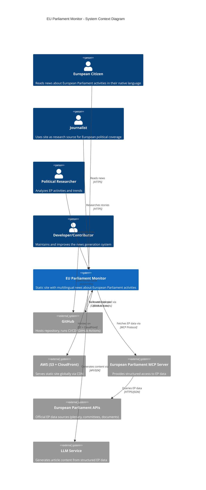
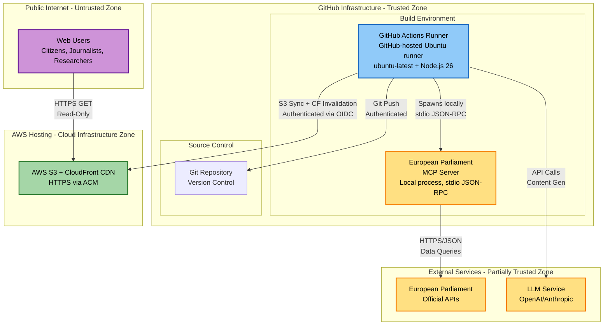
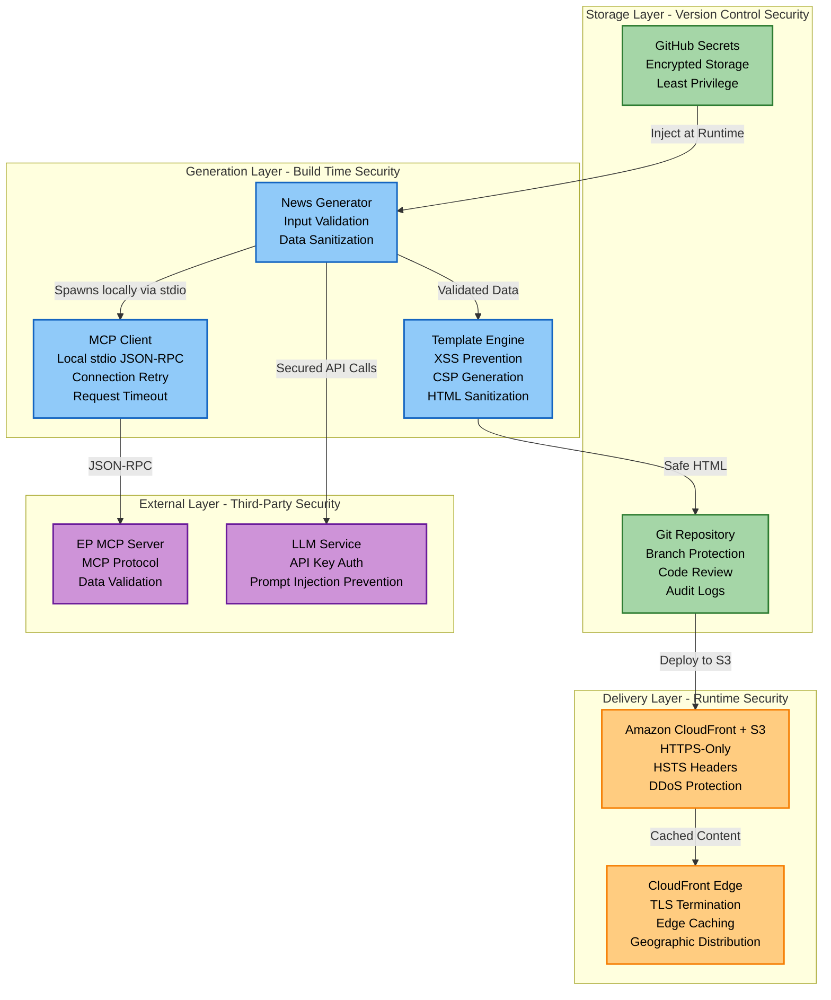
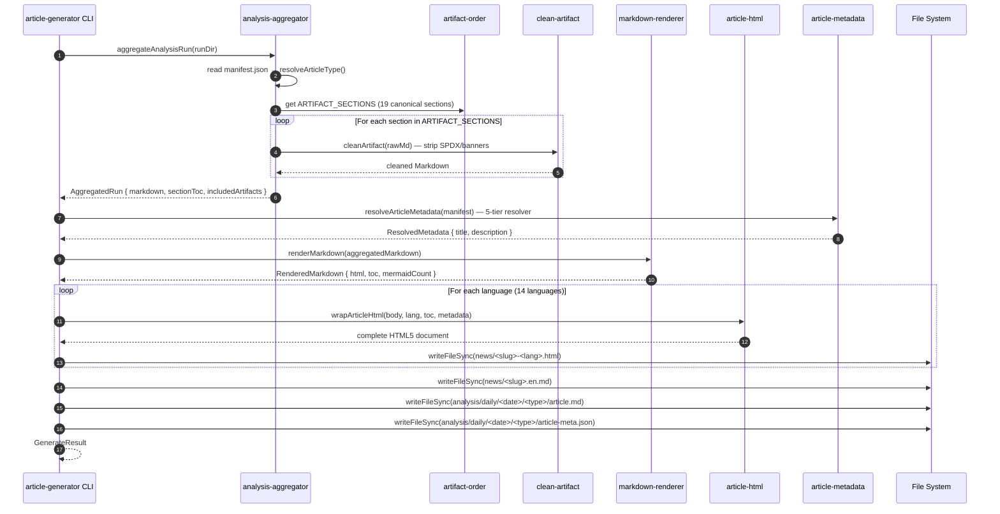
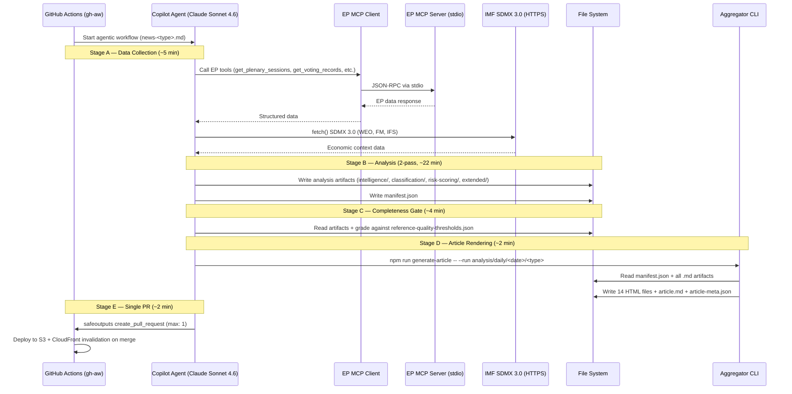
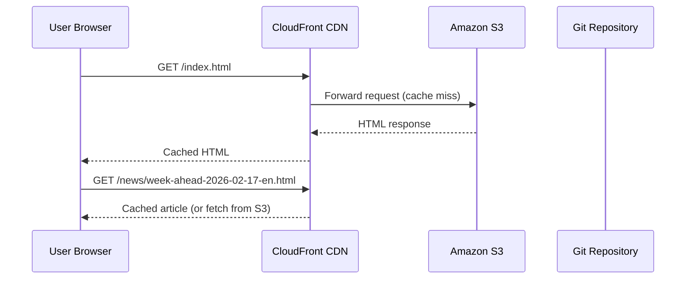
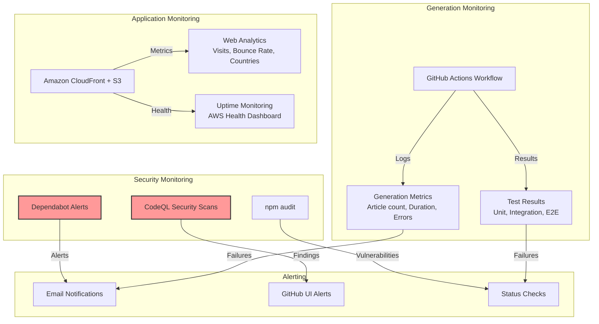
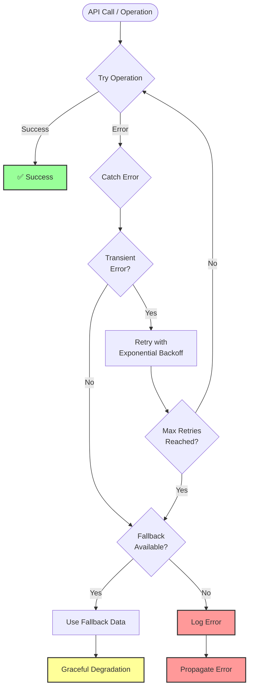
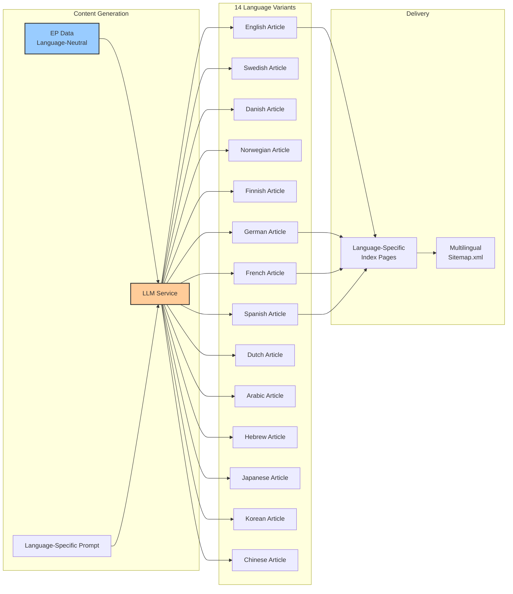

<p align="center">
  
</p>

<h1 align="center">🏛️ EU Parliament Monitor — Architecture</h1>

<p align="center">
  <strong>C4 Model Architecture for European Parliament Intelligence Platform</strong><br>
  <em>📐 System Context • 📦 Container View • 🔧 Component Design</em>
</p>

<p align="center">
  <a href="#"></a>
  <a href="#"></a>
  <a href="#"></a>
  <a href="#"></a>
  <a href="https://www.bestpractices.dev/projects/12068"></a>
</p>

**📋 Document Owner:** CEO | **📄 Version:** 1.4 | **📅 Last Updated:**
2026-05-06 (UTC) | **📦 Release:** v0.8.59  
**🔄 Review Cycle:** Quarterly | **⏰ Next Review:** 2026-08-06

---

> ### ✅ April-2026 Aggregator-Pipeline Migration — Complete
>
> The April-2026 release migrated from an AI-authored-HTML pipeline to a
> **deterministic aggregator pipeline**. Article HTML is now rendered by
> `src/aggregator/**` from committed Stage-B analysis artifacts — there is
> no AI-authored HTML step, no per-article-type strategies, no
> AI_MARKER/FALLBACK_TEMPLATE sentinel contract, and no
> `src/utils/content-validator.ts` / `validate-articles.ts` runtime validators.
> The repository still keeps `scripts/validate-analysis-completeness.js` as
> the Stage-C artifact-floor checker invoked by prompts and tests.
>
> **Canonical references for the current release:**
>
> - 🟢 **Render entry point**: `src/aggregator/article-generator.ts`
>   (CLI: `npm run generate-article -- --run <analysis-run-dir>`)
> - 📦 **Aggregator modules**: `artifact-order.ts`, `clean-artifact.ts`,
>   `analysis-aggregator.ts`, `markdown-renderer.ts`, `article-html.ts`,
>   `article-metadata.ts` (5-tier editorial-highlight resolver for
>   `<title>` / `<meta description>` — manifest override → first artefact
>   H1 → aggregated H1 → first strong prose → localized template)
> - 🤖 **Agentic workflows**: 14 unified `news-<type>.md` files (Stages A → B
>   → C → D → E in one session, covering 14 article types — including the
>   long-horizon `quarter-ahead`/`year-ahead` and electoral `term-outlook`/
>   `election-cycle` set added in 2026-Q2) + `news-translate.md`; the split-family
>   workflows (`news-<type>-analysis.md` + `news-<type>-article.md`) and
>   the manual `news-article-generator.md` helper were deleted
> - 💰 **Economic-context enforcement**: editorial Stage-C agent-side
>   review over `intelligence/economic-context.md` (the Wave-2 OR-gate
>   and Wave-3/Wave-4 strict runtime gates in
>   `src/utils/content-validator.ts` were purged with the rest of the
>   validator layer; enforcement moved to the Stage-C completeness review
>   protocol in [`.github/prompts/03-analysis-completeness-gate.md`](.github/prompts/03-analysis-completeness-gate.md)
>   and the depth floors in
>   [`analysis/methodologies/reference-quality-thresholds.json`](analysis/methodologies/reference-quality-thresholds.json))
>
> The C4 Container and Component diagrams in this document have been
> rewritten against the post-migration aggregator stack — they no longer
> reference deleted strategies/builders/`content-validator.ts`.

This document serves as the primary entry point for the EU Parliament Monitor's
architectural documentation. It provides a comprehensive view of the system's
design using the C4 model approach, starting from a high-level system context
and drilling down to component interactions.

## 📚 Architecture Documentation Map

<div class="documentation-map">

| Document                                                            | Focus           | Description                                    | Documentation Link                                                                                     |
| ------------------------------------------------------------------- | --------------- | ---------------------------------------------- | ------------------------------------------------------------------------------------------------------ |
| **[Architecture](ARCHITECTURE.md)**                                 | 🏛️ Architecture | C4 model showing current system structure      | [View Source](https://github.com/Hack23/euparliamentmonitor/blob/main/ARCHITECTURE.md)                 |
| **[Future Architecture](FUTURE_ARCHITECTURE.md)**                   | 🏛️ Architecture | C4 model showing future system structure       | [View Source](https://github.com/Hack23/euparliamentmonitor/blob/main/FUTURE_ARCHITECTURE.md)          |
| **[Mindmaps](MINDMAP.md)**                                          | 🧠 Concept      | Current system component relationships         | [View Source](https://github.com/Hack23/euparliamentmonitor/blob/main/MINDMAP.md)                      |
| **[Future Mindmaps](FUTURE_MINDMAP.md)**                            | 🧠 Concept      | Future capability evolution                    | [View Source](https://github.com/Hack23/euparliamentmonitor/blob/main/FUTURE_MINDMAP.md)               |
| **[SWOT Analysis](SWOT.md)**                                        | 💼 Business     | Current strategic assessment                   | [View Source](https://github.com/Hack23/euparliamentmonitor/blob/main/SWOT.md)                         |
| **[Future SWOT Analysis](FUTURE_SWOT.md)**                          | 💼 Business     | Future strategic opportunities                 | [View Source](https://github.com/Hack23/euparliamentmonitor/blob/main/FUTURE_SWOT.md)                  |
| **[Data Model](DATA_MODEL.md)**                                     | 📊 Data         | Current data structures and relationships      | [View Source](https://github.com/Hack23/euparliamentmonitor/blob/main/DATA_MODEL.md)                   |
| **[Future Data Model](FUTURE_DATA_MODEL.md)**                       | 📊 Data         | Enhanced European Parliament data architecture | [View Source](https://github.com/Hack23/euparliamentmonitor/blob/main/FUTURE_DATA_MODEL.md)            |
| **[Flowcharts](FLOWCHART.md)**                                      | 🔄 Process      | Current data processing workflows              | [View Source](https://github.com/Hack23/euparliamentmonitor/blob/main/FLOWCHART.md)                    |
| **[Future Flowcharts](FUTURE_FLOWCHART.md)**                        | 🔄 Process      | Enhanced AI-driven workflows                   | [View Source](https://github.com/Hack23/euparliamentmonitor/blob/main/FUTURE_FLOWCHART.md)             |
| **[State Diagrams](STATEDIAGRAM.md)**                               | 🔄 Behavior     | Current system state transitions               | [View Source](https://github.com/Hack23/euparliamentmonitor/blob/main/STATEDIAGRAM.md)                 |
| **[Future State Diagrams](FUTURE_STATEDIAGRAM.md)**                 | 🔄 Behavior     | Enhanced adaptive state transitions            | [View Source](https://github.com/Hack23/euparliamentmonitor/blob/main/FUTURE_STATEDIAGRAM.md)          |
| **[Security Architecture](SECURITY_ARCHITECTURE.md)**               | 🛡️ Security     | Current security implementation                | [View Source](https://github.com/Hack23/euparliamentmonitor/blob/main/SECURITY_ARCHITECTURE.md)        |
| **[Future Security Architecture](FUTURE_SECURITY_ARCHITECTURE.md)** | 🛡️ Security     | Security enhancement roadmap                   | [View Source](https://github.com/Hack23/euparliamentmonitor/blob/main/FUTURE_SECURITY_ARCHITECTURE.md) |
| **[Threat Model](THREAT_MODEL.md)**                                 | 🎯 Security     | STRIDE threat analysis                         | [View Source](https://github.com/Hack23/euparliamentmonitor/blob/main/THREAT_MODEL.md)                 |
| **[Classification](CLASSIFICATION.md)**                             | 🏷️ Governance   | CIA classification & BCP                       | [View Source](https://github.com/Hack23/euparliamentmonitor/blob/main/CLASSIFICATION.md)               |
| **[CRA Assessment](CRA-ASSESSMENT.md)**                             | 🛡️ Compliance   | Cyber Resilience Act                           | [View Source](https://github.com/Hack23/euparliamentmonitor/blob/main/CRA-ASSESSMENT.md)               |
| **[Workflows](WORKFLOWS.md)**                                       | ⚙️ DevOps       | CI/CD documentation                            | [View Source](https://github.com/Hack23/euparliamentmonitor/blob/main/WORKFLOWS.md)                    |
| **[Future Workflows](FUTURE_WORKFLOWS.md)**                         | 🚀 DevOps       | Planned CI/CD enhancements                     | [View Source](https://github.com/Hack23/euparliamentmonitor/blob/main/FUTURE_WORKFLOWS.md)             |
| **[Business Continuity Plan](BCPPlan.md)**                          | 🔄 Resilience   | Recovery planning                              | [View Source](https://github.com/Hack23/euparliamentmonitor/blob/main/BCPPlan.md)                      |
| **[Financial Security Plan](FinancialSecurityPlan.md)**             | 💰 Financial    | Cost & security analysis                       | [View Source](https://github.com/Hack23/euparliamentmonitor/blob/main/FinancialSecurityPlan.md)        |
| **[End-of-Life Strategy](End-of-Life-Strategy.md)**                 | 📦 Lifecycle    | Technology EOL planning                        | [View Source](https://github.com/Hack23/euparliamentmonitor/blob/main/End-of-Life-Strategy.md)         |
| **[Unit Test Plan](UnitTestPlan.md)**                               | 🧪 Testing      | Unit testing strategy                          | [View Source](https://github.com/Hack23/euparliamentmonitor/blob/main/UnitTestPlan.md)                 |
| **[E2E Test Plan](E2ETestPlan.md)**                                 | 🔍 Testing      | End-to-end testing                             | [View Source](https://github.com/Hack23/euparliamentmonitor/blob/main/E2ETestPlan.md)                  |
| **[Performance Testing](performance-testing.md)**                   | ⚡ Performance  | Performance benchmarks                         | [View Source](https://github.com/Hack23/euparliamentmonitor/blob/main/performance-testing.md)          |
| **[Security Policy](SECURITY.md)**                                  | 🔒 Security     | Vulnerability reporting & security policy      | [View Source](https://github.com/Hack23/euparliamentmonitor/blob/main/SECURITY.md)                     |

</div>

## 🛡️ ISMS Policy Alignment

EU Parliament Monitor is developed and maintained in accordance with Hack23 AB's Information Security Management System (ISMS), which is aligned with ISO 27001:2022, NIST CSF 2.0, and CIS Controls v8.1.

### Applicable ISMS Policies

| Policy | Description | Relevance to EU Parliament Monitor |
|--------|-------------|-----------------------------------|
| **[Information Security Policy](https://github.com/Hack23/ISMS-PUBLIC/blob/main/Information_Security_Policy.md)** | Establishes organization-wide security governance and risk management framework | Defines overall security posture, risk assessment methodology, and management responsibilities for the project |
| **[Secure Development Policy](https://github.com/Hack23/ISMS-PUBLIC/blob/main/Secure_Development_Policy.md)** | Defines secure coding standards, code review requirements, and SDLC security gates | Mandates security-first development practices: input validation, dependency scanning, SAST/DAST integration, secure CI/CD pipelines |
| **[Open Source Policy](https://github.com/Hack23/ISMS-PUBLIC/blob/main/Open_Source_Policy.md)** | Governs use, contribution, and licensing of open source software | Ensures compliance with Apache-2.0 License, dependency license compatibility, and transparent open source contribution practices |
| **[Classification Policy](https://github.com/Hack23/ISMS-PUBLIC/blob/main/Classification_Policy.md)** | Defines data classification scheme (Public, Internal, Confidential, Restricted) and handling requirements | All project content classified as PUBLIC; establishes data handling controls for any future sensitive data integration |
| **[AI Policy](https://github.com/Hack23/ISMS-PUBLIC/blob/main/AI_Policy.md)** | Governs responsible AI usage, transparency, and human oversight requirements | Governs LLM usage for content generation: transparency requirements, human review workflows, bias mitigation, prompt injection protection |
| **[Access Control Policy](https://github.com/Hack23/ISMS-PUBLIC/blob/main/Access_Control_Policy.md)** | Defines authentication, authorization, least privilege, and privileged access management | Controls GitHub repository access, branch protection rules, secret management, and deployment permissions |
| **[Cryptography Policy](https://github.com/Hack23/ISMS-PUBLIC/blob/main/Cryptography_Policy.md)** | Establishes cryptographic standards for data protection (algorithms, key management, TLS) | Mandates HTTPS-only content delivery, TLS 1.2+ (TLS 1.3 where supported) for outbound HTTPS API communications; EP MCP integration uses a local stdio JSON-RPC channel (no TLS); ensures secure secret storage for LLM API keys |

### ISMS Compliance Implementation

**ISO 27001:2022 Controls Implemented:**
- **A.5.10** - Information Security Policy (documented and reviewed quarterly)
- **A.8.3** - Secure Coding (ESLint security rules, CodeQL SAST scanning)
- **A.8.23** - Web Filtering (planned CSP headers via CloudFront, XSS prevention)
- **A.8.24** - Cryptography (HTTPS-only, TLS 1.2+ / TLS 1.3 where supported, site delivery via CloudFront)
- **A.8.28** - Secure Coding (input validation, dependency scanning)

**NIST CSF 2.0 Functions Addressed:**
- **Identify (ID)**: Asset inventory, risk assessment, vulnerability management
- **Protect (PR)**: Access control, data security, secure development
- **Detect (DE)**: Security monitoring, vulnerability scanning, anomaly detection
- **Respond (RS)**: Incident response procedures, GitHub Security Advisories
- **Recover (RC)**: Business Continuity Plan, backup/restore procedures

**CIS Controls v8.1 Implemented:**
- **Control 1**: Inventory and Control of Enterprise Assets (documented in repo)
- **Control 4**: Secure Configuration (branch protection, security policies)
- **Control 6**: Access Control Management (GitHub RBAC, least privilege)
- **Control 8**: Audit Log Management (GitHub audit logs, workflow logs)
- **Control 10**: Malware Defenses (Dependabot, npm audit, CodeQL)
- **Control 16**: Application Software Security (SAST, dependency scanning, secure coding)

### Compliance Evidence

Evidence of ISMS compliance is maintained through:
- **Policy Documents**: All policies stored in [Hack23/ISMS-PUBLIC](https://github.com/Hack23/ISMS-PUBLIC)
- **Security Architecture**: [SECURITY_ARCHITECTURE.md](SECURITY_ARCHITECTURE.md) maps controls to implementations
- **Threat Model**: [THREAT_MODEL.md](THREAT_MODEL.md) documents STRIDE analysis and mitigations
- **Classification**: [CLASSIFICATION.md](CLASSIFICATION.md) defines data classification and handling
- **Audit Trail**: GitHub audit logs, workflow execution logs, dependency scan reports
- **Security Scanning**: CodeQL results, Dependabot alerts, npm audit reports

---

## 🎯 System Overview

EU Parliament Monitor is a **TypeScript-first static site generator and political intelligence platform** that creates multi-language news articles about European Parliament activities. Content is produced by a fleet of **15 agentic GitHub Workflows** (gh-aw — 14 unified `news-<type>.md` covering 14 article types + `news-translate.md`) that drive AI agents (Claude Sonnet 4.6 via GitHub Copilot) through the Stage A→E protocol, consuming structured data from **three data surfaces**:

- **[European Parliament MCP Server](https://github.com/Hack23/European-Parliament-MCP-Server)** `v1.3.0+` (primary — 60+ tools including plenary, MEPs, votes, committees, procedures, adopted texts, sliding-window + fixed-window feeds, analytical tools, and a three-state voting fallback to the EP Open Data Portal)
- **World Bank Open Data MCP** (non-economic only — WDI social/health/education/environment/governance indicators)
- **IMF REST (SDMX 3.0)** native TypeScript fetch client — primary economic source: WEO + Fiscal Monitor + IFS + BOP + ER + PCPS + GFSR + EREO + FSI + GFS + DOT

TypeScript code handles data acquisition, analysis orchestration, HTML structure, and validation; AI agents author all narrative content under a strict two-pass AI-First Quality regime.

### Mission Statement

**Enable democratic transparency** by providing automated, multilingual coverage
of European Parliament activities through a secure, maintainable static site
architecture.

### Key Characteristics

- **Minimal Runtime Dependencies**: Pure static HTML/CSS output with no server-side
  execution; one pinned production dependency (`european-parliament-mcp-server@1.3.0`) plus one optional dependency (`worldbank-mcp@1.0.1`) used only at build time; `markdown-it` + plugins (`markdown-it-anchor`, `markdown-it-footnote`, `markdown-it-attrs`, `markdown-it-deflist`) vendored in the aggregator for deterministic artifact rendering
- **TypeScript Source**: All source in `src/` written in TypeScript 6.0.3 (strict, ESM, `"type": "module"`), compiled via `tsc` — `rootDir: ./src`, `outDir: ./scripts`, `target: ES2025`, `module: NodeNext`
- **Multi-Language Support**: Generates content in 14 languages (`en, sv, da, no, fi, de, fr, es, nl, ar, he, ja, ko, zh`), defined in `src/constants/language-core.ts::ALL_LANGUAGES`
- **Article Types**: 14 production content types (`breaking`, `committee-reports`, `election-cycle`, `month-ahead`, `month-in-review`, `motions`, `propositions`, `quarter-ahead`, `quarter-in-review`, `term-outlook`, `week-ahead`, `week-in-review`, `year-ahead`, `year-in-review`) — each type is a slug, not a strategy module; the aggregator renders the same canonical artifact order for every type and per-type content differences are carried by the Stage-B artifacts themselves
- **Agentic Workflows**: 15 unified gh-aw markdown workflows — 14 `news-<type>.md` article types (Stages A → B → C → D → E in one session, active-work budget 22–28 min before the single safe-outputs `create_pull_request` call, 60-min `timeout-minutes` cap; `engine.mcp.session-timeout` is intentionally **not** set — the bundled MCP gateway v0.3.1 rejects the field) + `news-translate.md` (14-language flush translation, exempt from the single-PR rule) — compiled to `.lock.yml` via `gh aw compile --validate` (pinned `GH_AW_VERSION: v0.71.6`)
- **Analysis-Artifact-Driven Article Pipeline**: Agents author the full Stage-B artifact set under `analysis/daily/<date>/<slug>/` (or `<slug>-run<NN>/` when multiple runs occur on the same date) and commit it. The deterministic aggregator (`src/aggregator/**`, invoked via `npm run generate-article -- --run <analysis-run-dir>` for a single run or `npm run generate-article:all` for batch regen) walks `manifest.json`, cleans each artifact, and emits the final HTML with the shared site chrome (stacked header + embedded 14-language switcher + TOC sidebar + footer stats) and 14-language hreflang entries. There is no AI-authored HTML step, no strategies, no builders, no section-builders
- **Economic Data (IMF-primary, Wave-4 strict default editorial)**: IMF REST is the **primary** source for every economic claim in `intelligence/economic-context.md`; World Bank MCP provides complementary non-economic context only. Enforcement is editorial at the Stage-C completeness review — the legacy runtime gates (`articlePolicyHasEconomicContext`, `articlePolicyHasIMFEconomicEvidence`, `isWave3IMFStrictEnabled`) in `src/utils/content-validator.ts` were purged in April-2026; the Stage-C reviewer applies the IMF-required-for-policy rule directly over the committed artifact
- **Quality-Through-Artifact Principle**: Mandatory 2-pass iterative improvement during Stage B (~60% pass 1, ~40% pass 2); ≥ 80 words/SWOT item, ≥ 150 words/stakeholder perspective, ≥ 1 Mermaid or Chart.js visualisation per core artifact, 0 `[AI_ANALYSIS_REQUIRED]` sentinel markers in any committed file (enforced at Stage-C agent-side review against `reference-quality-thresholds.json`)
- **MCP Integration**: Spawned as local child processes via stdio JSON-RPC at build time; inside agentic workflows via the `awmg` gateway at `http://host.docker.internal:8080/mcp/european-parliament`
- **Security by Design**: Minimal attack surface through static architecture; 5-layer gh-aw security (AWF Squid firewall allowlist, sandboxed Docker, safe-output constraints, JSONL audit trail, lock file compilation); agent prose-injection class of defects eliminated at the root by the aggregator migration (no AI-authored HTML step means no template-prose leak vector)
- **AWS Hosted**: AWS S3 + CloudFront (primary, via `deploy-s3.yml` with OIDC auth); GitHub Pages retained as documented fallback; npm package published to `registry.npmjs.org/euparliamentmonitor` with SLSA Level 3 provenance

---

## 📊 C4 Model Level 1: System Context Diagram

**👤 User Focus:** Shows how different user types interact with the EU
Parliament Monitor system and what external systems it depends on.

**🌐 Integration Focus:** Illustrates the relationships with GitHub
infrastructure, European Parliament APIs, and LLM services.


```mermaid
C4Context
    title EU Parliament Monitor - System Context Diagram

    Person(citizen, "European Citizen", "Reads news about European Parliament activities in their native language")
    Person(journalist, "Journalist", "Uses site as research source for European political coverage")
    Person(researcher, "Political Researcher", "Analyzes EP activities and trends")
    Person(contributor, "Developer/Contributor", "Maintains and improves the news generation system")

    System(epmonitor, "EU Parliament Monitor", "Static site with multilingual news about European Parliament activities")

    System_Ext(github, "GitHub", "Hosts repository, runs CI/CD (GitHub Actions)")
    System_Ext(aws, "AWS (S3 + CloudFront)", "Serves static site globally via CDN")
    System_Ext(ep_mcp, "European Parliament MCP Server", "Provides structured access to EP data")
    System_Ext(ep_api, "European Parliament APIs", "Official EP data sources (plenary, committees, documents)")
    System_Ext(llm, "LLM Service", "Generates article content from structured EP data")

    Rel(citizen, epmonitor, "Reads news", "HTTPS")
    Rel(journalist, epmonitor, "Researches stories", "HTTPS")
    Rel(researcher, epmonitor, "Analyzes data", "HTTPS")
    Rel(contributor, github, "Contributes code", "Git/HTTPS")

    Rel(epmonitor, github, "Built and deployed via", "GitHub Actions")
    Rel(epmonitor, aws, "Hosted on", "S3 + CloudFront")
    Rel(github, epmonitor, "Generates site via", "GitHub Actions")
    Rel(epmonitor, ep_mcp, "Fetches EP data via", "MCP Protocol")
    Rel(ep_mcp, ep_api, "Queries EP data", "HTTPS/JSON")
    Rel(epmonitor, llm, "Generates content via", "API/SDK")

    UpdateLayoutConfig($c4ShapeInRow="3", $c4BoundaryInRow="2")
```

### Context Diagram - Key Elements

| Element                   | Type            | Description                                                | Technology                  |
| ------------------------- | --------------- | ---------------------------------------------------------- | --------------------------- |
| **European Citizen**      | User            | Primary audience seeking EP news in native language        | Web Browser                 |
| **Journalist**            | User            | Professional using site for research and story development | Web Browser                 |
| **Political Researcher**  | User            | Academic or analyst studying EP activities                 | Web Browser                 |
| **Developer/Contributor** | User            | Maintainer improving system                                | Git, Node.js, VS Code       |
| **EU Parliament Monitor** | System          | Core static site generator                                 | Node.js, TypeScript         |
| **GitHub**                | External System | Source control, CI/CD                                      | GitHub Actions          |
| **EP MCP Server**         | External System | Structured EP data access                                  | MCP Protocol, TypeScript    |
| **EP APIs**               | External System | Official data sources                                      | REST APIs, JSON             |
| **LLM Service**           | External System | Content generation                                         | API (OpenAI/Anthropic/etc.) |

### Trust Boundaries and Security Zones


```mermaid
graph TB
    subgraph "Public Internet - Untrusted Zone"
        Users["Web Users\nCitizens, Journalists, Researchers"]
    end
    
    subgraph "GitHub Infrastructure - Trusted Zone"
        subgraph "Build Environment"
            Actions["GitHub Actions Runner\nGitHub-hosted Ubuntu runner\nubuntu-latest + Node.js 26"]
            EPServer["European Parliament\nMCP Server\nLocal process, stdio JSON-RPC"]
        end
        
        subgraph "Source Control"
            Repo["Git Repository\nVersion Control"]
        end
    end
    
    subgraph "AWS Hosting - Cloud Infrastructure Zone"
        Pages["AWS S3 + CloudFront CDN\nHTTPS via ACM"]
    end
    
    subgraph "External Services - Partially Trusted Zone"
        EPAPI["European Parliament\nOfficial APIs"]
        LLM["LLM Service\nOpenAI/Anthropic"]
    end
    
    Users -->|"HTTPS GET\nRead-Only"| Pages
    Actions -->|"Spawns locally\nstdio JSON-RPC"| EPServer
    EPServer -->|"HTTPS/JSON\nData Queries"| EPAPI
    Actions -->|"API Calls\nContent Gen"| LLM
    Actions -->|"Git Push\nAuthenticated"| Repo
    Actions -->|"S3 Sync + CF Invalidation\nAuthenticated via OIDC"| Pages
    
    classDef users fill:#CE93D8,stroke:#6A1B9A,stroke-width:2px,color:#000000
    classDef hosting fill:#A5D6A7,stroke:#2E7D32,stroke-width:2px,color:#000000
    classDef actions fill:#90CAF9,stroke:#1565C0,stroke-width:2px,color:#000000
    classDef external fill:#FFE082,stroke:#F57C00,stroke-width:2px,color:#000000

    class Users users
    class Pages hosting
    class Actions actions
    class EPServer,EPAPI,LLM external
```

**Trust Boundary Analysis:**

| Zone | Trust Level | Security Controls | Threat Model |
|------|-------------|-------------------|--------------|
| **Public Internet** | Untrusted | HTTPS-only, planned CSP headers, static content only | DDoS, XSS attempts (mitigated by static architecture) |
| **GitHub Infrastructure** | Trusted | GitHub authentication, branch protection, optional signed commits, secret scanning | Supply chain attacks (mitigated by Dependabot, CodeQL) |
| **AWS Hosting** | Trusted | ACM certificate, HTTPS redirect, DDoS protection via CloudFront | Hosting infrastructure compromise (mitigated by AWS security controls, OIDC deploy auth) |
| **External Services** | Partially Trusted | API authentication, basic input parsing/shape validation; planned systematic sanitization/escaping and rate limiting | Data poisoning, API compromise (mitigated by validation, monitoring, planned hardening) |

**Key Security Boundaries:**
1. **User → CloudFront**: Read-only HTTPS access, no authentication required (public content)
2. **GitHub Actions → External APIs**: Authenticated API calls, input validation, error handling
3. **GitHub Actions → AWS S3**: Authenticated S3 sync + CloudFront invalidation, only static files deployed
4. **External Services → System**: Data parsed and basic shape-validated before use; comprehensive sanitization/escaping and rate limiting are planned controls

---

## 📦 C4 Model Level 2: Container Diagram

**📦 Container Focus:** Major containers (applications, data stores, MCP clients) of the post-April-2026 aggregator pipeline.

**🔄 Data Flow Focus:** How agentic workflows produce analysis artifacts and how the deterministic aggregator renders them into 14-language HTML.


```mermaid
%%{init: {"theme":"dark","themeVariables":{"primaryColor":"#1565C0","primaryTextColor":"#fff","lineColor":"#90CAF9","fontFamily":"Inter, Helvetica, Arial, sans-serif"}}}%%
C4Container
    title EU Parliament Monitor — Container Diagram (April-2026 aggregator pipeline)

    Person(user, "Reader", "Reads multilingual EP news at euparliamentmonitor.com")
    Person(contributor, "Contributor", "Maintains code, methodologies, translations")
    Person(researcher, "Researcher / Journalist", "Audits analysis artifacts via the Political Intelligence Hub")

    Container_Boundary(epmonitor, "EU Parliament Monitor") {
        Container(aw_orchestrator, "gh-aw Orchestrator", "Agentic Workflows (Claude Sonnet 4.6)", "15 agentic workflows: 14 unified news-<type>.md + news-translate.md")
        Container(prompt_lib, "Prompt Library", "10 bounded contexts", ".github/prompts/00-scope … 09-troubleshooting; lint:prompts drift-guard")
        Container(methodology_lib, "Methodology Library", "Markdown methodologies + JSON thresholds", "19 methodologies + reference-quality-thresholds.json (analysis/methodologies/)")
        Container(template_lib, "Template Library", "60 Markdown templates", "60 top-level content templates + 6 partial fragments under _partials/ (analysis/templates/)")
        ContainerDb(analysis_runs, "Analysis Runs", "Markdown + JSON", "analysis/daily/YYYY-MM-DD/<type>/{manifest.json,intelligence/,classification/,risk-scoring/,threat-assessment/,documents/,extended/}")
        Container(aggregator, "Aggregator (5 modules)", "TypeScript", "src/aggregator/**: artifact-order · clean-artifact · analysis-aggregator · markdown-renderer · article-html · article-metadata · article-generator (CLI)")
        Container(ep_client, "EP MCP Client", "TypeScript", "Stdio JSON-RPC to european-parliament-mcp-server@1.3.0+; 60+ tools; getVotingRecordsWithFallback() to EP Open Data Portal (src/mcp/ep-mcp-client.ts)")
        Container(wb_client, "World Bank MCP Client", "TypeScript", "WORLD_BANK_MCP_TOOLS — non-economic indicators only (src/mcp/wb-mcp-client.ts)")
        Container(imf_client, "IMF REST Client", "TypeScript", "IMF_MCP_TOOLS — primary economic source: WEO/Fiscal Monitor/IFS/BOP/ER/PCPS (src/mcp/imf-mcp-client.ts)")
        Container(stage_c_review, "Stage-C Review", "Editorial agent + thresholds", "Reads .github/prompts/03-analysis-completeness-gate.md + reference-quality-thresholds.json — replaces purged content-validator.ts")
        Container(news_indexes, "News Indexes & Sitemap", "TypeScript", "Per-language index pages + sitemap.xml + sitemap_<lang>.html (src/generators/news-indexes.ts, sitemap.ts)")
        ContainerDb(static_files, "Static Site Output", "HTML/CSS/JS/JSON", "news/<slug>-<lang>.html (14 langs) · news/<slug>.en.md · article.md per run · sitemap.xml · articles-metadata.json")
    }

    Container_Boundary(github_infra, "GitHub Infrastructure") {
        Container(actions, "GitHub Actions", "CI/CD + gh-aw runtime", "15 news + ~15 standard workflows; SHA-pinned actions; OpenSSF Scorecard")
        ContainerDb(repo, "Git Repository", "Version control", "Source + analysis runs + generated content; SLSA L3 provenance")
    }

    Container_Boundary(aws_infra, "AWS Infrastructure") {
        Container(cf_s3, "CloudFront + S3", "CDN / object storage", "Primary hosting · ACM HTTPS · OIDC GithubWorkFlowRole · cache: HTML 1h, immutable assets 1y")
    }

    System_Ext(ep_mcp, "European Parliament MCP Server v1.3.0+", "60+ tools — plenary, voting, motions, committee, MEPs, declarations, procedures, analytical (voting-anomaly, coalition, MEP-influence)")
    System_Ext(ep_open_data, "EP Open Data Portal", "https://data.europarl.europa.eu — voting-records fallback (/api/v2/decision)")
    System_Ext(wb_mcp, "World Bank Open Data MCP", "Non-economic WDI indicators (health, education, environment, governance)")
    System_Ext(imf_api, "IMF SDMX 3.0 REST", "https://dataservices.imf.org/REST/SDMX_3.0/")
    System_Ext(copilot, "GitHub Copilot / Claude Sonnet 4.6", "Authors analysis Markdown under 2-pass AI-First Quality regime — never authors HTML")

    Rel(user, cf_s3, "Reads HTML in 14 langs", "HTTPS")
    Rel(researcher, repo, "Audits analysis/daily/", "Git/HTTPS")
    Rel(contributor, repo, "Commits code + methodologies", "Git/HTTPS")
    Rel(actions, aw_orchestrator, "Triggers on schedule / manual", "gh-aw engine")
    Rel(aw_orchestrator, copilot, "Delegates analysis authoring", "Copilot CLI")
    Rel(aw_orchestrator, prompt_lib, "Imports prompts", "Markdown")
    Rel(aw_orchestrator, methodology_lib, "Reads methodologies", "Markdown")
    Rel(aw_orchestrator, template_lib, "Fills templates", "Markdown")
    Rel(aw_orchestrator, ep_client, "Stage A — fetch", "fn")
    Rel(aw_orchestrator, wb_client, "Stage A — context (optional)", "fn")
    Rel(aw_orchestrator, imf_client, "Stage A — economic context", "fn")
    Rel(aw_orchestrator, analysis_runs, "Stage B — write artifacts", "fs.write")
    Rel(aw_orchestrator, stage_c_review, "Stage C — completeness gate", "agent review")
    Rel(stage_c_review, analysis_runs, "Reads + grades", "fn")
    Rel(aw_orchestrator, aggregator, "Stage D — npm run generate-article", "CLI")
    Rel(aggregator, analysis_runs, "Reads manifest.json + artifacts", "fs.read")
    Rel(aggregator, static_files, "Writes 14 HTML + Markdown", "fs.write")
    Rel(news_indexes, static_files, "Writes index pages", "fs.write")
    Rel(ep_client, ep_mcp, "stdio JSON-RPC", "MCP")
    Rel(ep_client, ep_open_data, "Voting fallback", "HTTPS REST")
    Rel(wb_client, wb_mcp, "stdio JSON-RPC", "MCP")
    Rel(imf_client, imf_api, "HTTPS / SDMX", "REST")
    Rel(static_files, repo, "Stage E — single PR", "Git")
    Rel(actions, cf_s3, "Deploy via OIDC", "S3 sync + CloudFront invalidation")

    UpdateLayoutConfig($c4ShapeInRow="3", $c4BoundaryInRow="2")
```

### Container Diagram — Key Elements

| 🧱 Container | ⚙️ Technology | 🎯 Purpose | 🔄 Data flow |
|---|---|---|---|
| 🤖 **gh-aw Orchestrator** | Claude Sonnet 4.6 + gh-aw v0.71.6 | Runs 15 agentic workflows (14 article + 1 translate); produces analysis artifacts | Triggers via cron / manual; commits one PR per article run |
| 📚 **Prompt / Methodology / Template libraries** | Markdown + JSON | Bounded-context prompts (10), methodologies (19), templates (60 top-level + 6 `_partials/`) | Read by every agentic workflow at start-of-session |
| 🧠 **Analysis Runs** | Markdown + JSON | Per-run intelligence tree under `analysis/daily/<date>/<type>/` | Written by Stage B agents; consumed by Stage C and aggregator |
| 🟢 **Aggregator (5 modules)** | TypeScript | Reads `manifest.json` and Markdown artifacts; renders 14-language HTML deterministically | `npm run generate-article -- --run <dir>` |
| 🔌 **EP MCP Client** | TypeScript | 60+ EP tools + voting fallback to EP Open Data Portal `/api/v2/decision` | Stage A data collection |
| 💰 **IMF / 🌱 World Bank Clients** | TypeScript | Economic context (IMF) + non-economic indicators (WB) | Stage A wave-2 context |
| ⚖️ **Stage-C Review** | Editorial agent + JSON thresholds | Per-artifact line floors + tradecraft signals (Admiralty / WEP / ICD-203) | Replaces the purged `content-validator.ts` runtime gate |
| 🌐 **News Indexes & Sitemap** | TypeScript | 14-language index pages, sitemap.xml, hreflang alternates | `npm run prebuild` |
| 📦 **Static Site Output** | HTML / CSS / JS / JSON / Markdown | Public deliverable: news pages + `article.md` source per run | Committed to `main`, deployed to S3 |
| 🚀 **GitHub Actions** | CI/CD + gh-aw | 15 news + ~15 standard workflows | Daily news + on-PR validation |
| ☁️ **CloudFront + S3** | CDN / object storage | Primary hosting via OIDC `GithubWorkFlowRole` | HTTPS + immutable asset cache |

### Security Responsibilities per Container

| Container | Security responsibility | Implementation | Controls |
|---|---|---|---|
| 🤖 **gh-aw Orchestrator** | Sandboxed AWF runtime, Squid egress allowlist, capability-bounded safe outputs | Runs in GitHub-hosted ephemeral VMs; `safe-outputs.create-pull-request.max: 1`; `step-security/harden-runner` egress block | A.5.10, A.8.28 (ISO 27001), CIS 16 |
| 🟢 **Aggregator** | Deterministic Markdown→HTML; explicit `markdown-it` plugin allowlist; `clean-artifact.ts` strips SPDX/banners; `script-src 'self'` CSP | No AI-authored HTML; vendored Mermaid/Chart.js/D3 under `js/vendor/` | A.8.23, A.8.28 (ISO 27001), OWASP A03 |
| 🔌 **EP MCP Client** | Local stdio JSON-RPC; per-request timeout + retry backoff; envelope validation; voting-records three-state fallback | `safeCallTool()` + `callToolWithRetry()` wrappers in `ep-mcp-client.ts` | A.8.24 (ISO 27001), CIS 16 |
| 🧠 **Analysis Artifacts** | Tradecraft grading (Admiralty A1–F6 + WEP) + provenance manifest | `manifest.json` cross-reference map; `methodology-reflection.md` audit | A.5.12 (ISO 27001) |
| 📦 **Static Files** | Public-data only; integrity via Git + SLSA L3 attestation | All EP/IMF/WB content is public; SBOM, REUSE licence headers | A.5.10 (ISO 27001) |
| 🚀 **GitHub Actions** | OIDC for AWS deploy; Secrets at job-scope; SHA-pinned third-party actions | `GithubWorkFlowRole` IAM with least privilege; `harden-runner` egress allowlist | A.8.3, CIS 6 |
| ☁️ **CloudFront + S3** | HTTPS-only via ACM; bucket policy denies public ACLs; CloudFront cache-control by file class | Long-cache immutable assets, short-cache HTML | A.13.1, A.5.23 (ISO 27001) |
| **Amazon CloudFront + S3** | HTTPS-only, CDN security, DDoS protection | Forces HTTPS redirect via ACM certificate, CloudFront with DDoS mitigation, HSTS headers (configured externally in CloudFront distribution) | A.8.24 (ISO 27001) |
| **Git Repository** | Access control, branch protection, signed commits | RBAC with least privilege, protected main branch, optional signed commits | CIS Control 6, A.8.3 |

### Container Security Architecture


```mermaid
graph TB
    subgraph "Generation Layer - Build Time Security"
        NewsGen["News Generator\nInput Validation\nData Sanitization"]
        MCPClient["MCP Client\nLocal stdio JSON-RPC\nConnection Retry\nRequest Timeout"]
        Template["Template Engine\nXSS Prevention\nCSP Generation\nHTML Sanitization"]
    end
    
    subgraph "Storage Layer - Version Control Security"
        GitRepo["Git Repository\nBranch Protection\nCode Review\nAudit Logs"]
        Secrets["GitHub Secrets\nEncrypted Storage\nLeast Privilege"]
    end
    
    subgraph "Delivery Layer - Runtime Security"
        Pages["Amazon CloudFront + S3\nHTTPS-Only\nHSTS Headers\nDDoS Protection"]
        CDN["CloudFront Edge\nTLS Termination\nEdge Caching\nGeographic Distribution"]
    end
    
    subgraph "External Layer - Third-Party Security"
        EPMCP["EP MCP Server\nMCP Protocol\nData Validation"]
        LLM["LLM Service\nAPI Key Auth\nPrompt Injection Prevention"]
    end
    
    NewsGen -->|Validated Data| Template
    NewsGen -->|"Spawns locally via stdio"| MCPClient
    MCPClient -->|JSON-RPC| EPMCP
    NewsGen -->|Secured API Calls| LLM
    Template -->|Safe HTML| GitRepo
    Secrets -->|Inject at Runtime| NewsGen
    GitRepo -->|Deploy to S3| Pages
    Pages -->|Cached Content| CDN
    
    classDef generation fill:#90CAF9,stroke:#1565C0,stroke-width:2px,color:#000000
    classDef storage fill:#A5D6A7,stroke:#2E7D32,stroke-width:2px,color:#000000
    classDef delivery fill:#FFCC80,stroke:#F57C00,stroke-width:2px,color:#000000
    classDef external fill:#CE93D8,stroke:#6A1B9A,stroke-width:2px,color:#000000

    class NewsGen,Template,MCPClient generation
    class GitRepo,Secrets storage
    class Pages,CDN delivery
    class EPMCP,LLM external
```

---

## 🧩 C4 Model Level 3: Component Diagram — Aggregator Pipeline

**🔧 Component Focus:** Internal components of the deterministic aggregator (`src/aggregator/**`) and supporting MCP / methodology modules.

**🎯 Responsibility Focus:** How analysis Markdown artifacts produced by the agentic workflows become 14-language HTML deliverables.


```mermaid
%%{init: {"theme":"dark","themeVariables":{"primaryColor":"#1565C0","primaryTextColor":"#fff","lineColor":"#90CAF9","fontFamily":"Inter, Helvetica, Arial, sans-serif"}}}%%
C4Component
    title EU Parliament Monitor — Aggregator Components (post-April-2026)

    Container_Boundary(aggregator_c, "Aggregator (src/aggregator/)") {
        Component(article_generator, "article-generator.ts", "TypeScript CLI", "Entry point: npm run generate-article -- --run <dir>; walks manifest.json")
        Component(artifact_order, "artifact-order.ts", "TypeScript", "ARTIFACT_SECTIONS — canonical 19-section order")
        Component(clean_artifact, "clean-artifact.ts", "TypeScript", "Strips SPDX/banner/provenance front matter from each artifact before merge")
        Component(analysis_aggregator, "analysis-aggregator.ts", "TypeScript", "aggregateAnalysisRun() — filters manifestFiles to .md only excluding data/runs/pass1; emits Provenance & Audit block at END")
        Component(markdown_renderer, "markdown-renderer.ts", "TypeScript", "markdown-it + plugins (anchor, footnote, attrs, deflist); explicit allowlist; renderMarkdown()")
        Component(article_html, "article-html.ts", "TypeScript", "HTML5 wrapper: stacked header, language switcher, TOC sidebar, JSON-LD NewsArticle, isBasedOn provenance, hreflang alternates, footer")
        Component(article_metadata, "article-metadata.ts", "TypeScript", "5-tier editorial-highlight resolver for <title>/<meta description>: manifest override → first-artifact H1 → aggregated H1 → first strong prose → localized template")
    }

    Container_Boundary(mcp_c, "MCP & Data Clients (src/mcp/)") {
        Component(ep_client, "ep-mcp-client.ts", "TypeScript", "60+ tools; safeCallTool + callToolWithRetry; recess-mode detection; slow-feed warnings")
        Component(ep_open_data, "ep-open-data-client.ts", "TypeScript", "EPOpenDataClient + getVotingRecordsWithFallback() three-state fallback")
        Component(wb_client, "wb-mcp-client.ts", "TypeScript", "WORLD_BANK_MCP_TOOLS — non-economic indicators")
        Component(imf_client, "imf-mcp-client.ts", "TypeScript", "class IMFMCPClient + IMF_MCP_TOOLS; native fetch SDMX 3.0; primary economic source")
        Component(mcp_health, "mcp-health.ts / mcp-retry.ts / mcp-connection.ts", "TypeScript", "Health probes, retry backoff, connection lifecycle")
    }

    Container_Boundary(intel_c, "Intelligence Utilities (src/utils/, src/generators/)") {
        Component(political_classification, "political-classification.ts", "TypeScript", "7-dimension EP event classification")
        Component(political_threat, "political-threat-assessment.ts", "TypeScript", "5-framework political threat (Landscape 6D + Attack Trees + Kill Chain + Diamond + ICO)")
        Component(political_risk, "political-risk-assessment.ts", "TypeScript", "5×5 Likelihood × Impact scoring")
        Component(significance, "significance-scoring.ts", "TypeScript", "Publication priority score per artifact")
        Component(quality_scorer, "article-quality-scorer.ts", "TypeScript", "Editorial quality signals")
        Component(news_indexes, "news-indexes.ts + sitemap.ts", "TypeScript", "14-language indexes + sitemap.xml + per-language sitemap_<lang>.html")
    }

    Container_Boundary(scripts_c, "Workflow Scripts (scripts/aggregator/)") {
        Component(prior_run_diff, "prior-run-diff.js", "Node.js", "Re-run improve/extend helper; classifies prior-run artifacts as must-extend (carryForward[]) or rewrite; always-on (no env flag); emits priorRunDiff JSON with priorLines+extendFloor")
        Component(forward_statements, "forward-statements-registry.js", "Node.js", "Forward-looking-statement JSONL registry; week/month-ahead seeding")
        Component(checkpoint, "checkpoint-analysis-to-memory.sh", "Bash", "Pre-audited helper; replaces inline expansion-heavy bash in workflows (shell-safety)")
    }

    System_Ext(ep_mcp, "EP MCP Server v1.3.0+", "60+ tools — plenary, voting, motions, committee, MEPs, declarations, procedures, analytical")
    System_Ext(ep_portal, "EP Open Data Portal", "/api/v2/decision — voting fallback")
    System_Ext(wb_mcp, "World Bank Open Data MCP", "Non-economic WDI")
    System_Ext(imf_api, "IMF SDMX 3.0", "WEO / FM / IFS / BOP / ER / PCPS")
    ContainerDb(analysis_dir, "analysis/daily/<date>/<type>/", "Markdown + JSON", "manifest.json + intelligence/ + classification/ + risk-scoring/ + threat-assessment/ + extended/")
    ContainerDb(news_dir, "news/<slug>(-<lang>).{md,html}", "Markdown + HTML", "Per-language deliverables")

    Rel(article_generator, analysis_dir, "reads manifest.json", "fs.readFileSync")
    Rel(article_generator, artifact_order, "uses ARTIFACT_SECTIONS", "import")
    Rel(article_generator, clean_artifact, "cleans each artifact", "fn")
    Rel(article_generator, analysis_aggregator, "aggregateAnalysisRun()", "fn")
    Rel(analysis_aggregator, markdown_renderer, "renderMarkdown()", "fn")
    Rel(markdown_renderer, article_html, "wraps in HTML5 chrome", "fn")
    Rel(article_html, article_metadata, "5-tier metadata resolver", "fn")
    Rel(article_html, news_dir, "writes 14 HTML + 1 .md", "fs.writeFileSync")
    Rel(news_indexes, news_dir, "writes index pages + sitemaps", "fs.writeFileSync")

    Rel(ep_client, ep_mcp, "stdio JSON-RPC", "MCP")
    Rel(ep_open_data, ep_portal, "voting fallback", "HTTPS")
    Rel(wb_client, wb_mcp, "stdio JSON-RPC", "MCP")
    Rel(imf_client, imf_api, "HTTPS/SDMX", "REST")
    Rel(ep_client, mcp_health, "health + retry", "fn")

    Rel(prior_run_diff, analysis_dir, "carry-forward plan", "JSON")
    Rel(forward_statements, analysis_dir, "JSONL registry seeding", "fs")

    UpdateLayoutConfig($c4ShapeInRow="3", $c4BoundaryInRow="2")
```

### Component Diagram — Key Elements

| 🧩 Component | 🎯 Responsibility | 🔗 Dependencies | 📂 File location |
|---|---|---|---|
| 🟢 **Aggregator pipeline** | Discover `manifest.json` → clean artifacts → aggregate (19-section canonical order, Provenance & Audit at end, `.md` only excluding `data/runs/pass1/`) → render Markdown → wrap HTML with TOC sidebar + shared chrome → write `<slug>.en.md` + 14 `<slug>-<lang>.html` | `markdown-it` + `markdown-it-anchor`/`-footnote`/`-attrs`/`-deflist` | `src/aggregator/{article-generator,analysis-aggregator,markdown-renderer,article-html,artifact-order,clean-artifact,article-metadata}.ts` |
| 🧠 **Analysis artifacts** | 60 top-level content templates under `analysis/daily/<date>/<type>/` with `manifest.json` declaring `articleType` + `files` map. 3-variant manifest schema (`articleType` / `articleTypes[]` / legacy `runType`) handled by `resolveArticleTypeFromManifest()`. Optional `dataMode` (`full`/`title-only`/`degraded-imf`/`degraded-voting`/`minimal`) applies depth-floor reduction factors for structurally constrained runs (see DATA_MODEL.md § Reference Quality Thresholds) | 19 methodologies (10-step protocol, Rules 1–22) | `analysis/methodologies/*.md`, `analysis/templates/**`, `analysis/daily/**` |
| 🔌 **EP MCP Client** | 60+ EP tools via stdio JSON-RPC; `safeCallTool()` + `callToolWithRetry()` wrappers; recess-mode detection ([1952,2100] year window); slow-feed warning downgrade for `get_events_feed` | `european-parliament-mcp-server@1.3.0+` (PR #405 normalises political-group codes) | `src/mcp/ep-mcp-client.ts` |
| 🗳️ **EP Open Data fallback** | Three-state voting fallback: (a) MCP has data → use it · (b) MCP empty → query `/api/v2/decision` · (c) both empty → 🔴 unavailability marker via virtual tool name `ep-get-voting-records` | EP Open Data Portal | `src/mcp/ep-open-data-client.ts` (see `getVotingRecordsWithFallback()`) |
| 💰 **IMF Client** | `class IMFMCPClient` + `IMF_MCP_TOOLS`; primary economic source per IMF Indicator Mapping; native Node 26 `fetch` SDMX 3.0; env `IMF_API_BASE_URL`, `IMF_API_TIMEOUT_MS` | None (REST) | `src/mcp/imf-mcp-client.ts` |
| 🌱 **World Bank Client** | `WORLD_BANK_MCP_TOOLS`; non-economic WDI indicators only (health, education, environment, governance, innovation) | `worldbank-mcp` (optional) | `src/mcp/wb-mcp-client.ts` |
| ⚖️ **Stage-C completeness gate** | Editorial agent-side review against `.github/prompts/03-analysis-completeness-gate.md` and `analysis/methodologies/reference-quality-thresholds.json` line floors. **Replaces the purged runtime `content-validator.ts`** | Methodology library + per-artifact thresholds | `.github/prompts/03-…`, `analysis/methodologies/reference-quality-thresholds.json` |
| 🔁 **Prior-Run Diff** | Re-run improve/extend helper; classifies prior-run artifacts as must-extend (`carryForward[]`) or below-floor rewrite; always-on (no env flag); emits `priorRunDiff` JSON with `priorLines`+`extendFloor` consumed by Stage B and Stage C | — | `scripts/aggregator/prior-run-diff.js` |
| 📜 **Forward-statements registry** | Canonical last-occurrence-per-id JSONL registry; week/month-ahead seeds `data/forward-statements-open.json`; Stage C enforces a "carried-forward forward statements" section when open items exist | JSONL registry | `scripts/aggregator/forward-statements-registry.js`, `analysis/forward-statements/` |
| 🛡️ **Shell-safety helper** | Pre-audited bash helper for checkpoint-to-memory; replaces expansion-heavy inline workflow bash that the sandbox shell-safety filter would block | Bash | `scripts/checkpoint-analysis-to-memory.sh` |
| 🧠 **Intelligence utilities** | `political-classification` (7D), `political-threat-assessment` (5-framework), `political-risk-assessment` (5×5 L×I), `significance-scoring`, `article-quality-scorer` | Types | `src/utils/*.ts` |
| 🌐 **News Indexes & Sitemap** | Per-language news index pages, `sitemap.xml`, per-language `sitemap_<lang>.html`, hreflang alternates | Metadata, file-utils | `src/generators/news-indexes.ts`, `src/generators/sitemap.ts` |
| 🔢 **Constants** | `ALL_LANGUAGES` (14), `LANGUAGE_PRESETS` (`all`, `eu-core`, `nordic`), article-type slugs, committee indicator map | — | `src/constants/*.ts` |

### Component Interaction Patterns


```mermaid
sequenceDiagram
    autonumber
    participant CLI as article-generator CLI
    participant AGG as analysis-aggregator
    participant AO as artifact-order
    participant CA as clean-artifact
    participant MR as markdown-renderer
    participant AH as article-html
    participant AM as article-metadata
    participant FS as File System

    CLI->>AGG: aggregateAnalysisRun(runDir)
    AGG->>AGG: read manifest.json → resolveArticleType()
    AGG->>AO: get ARTIFACT_SECTIONS (19 canonical sections)
    loop For each section in ARTIFACT_SECTIONS
        AGG->>CA: cleanArtifact(rawMd) — strip SPDX/banners
        CA-->>AGG: cleaned Markdown
    end
    AGG-->>CLI: AggregatedRun { markdown, sectionToc, includedArtifacts }

    CLI->>AM: resolveArticleMetadata(manifest) — 5-tier resolver
    AM-->>CLI: ResolvedMetadata { title, description }

    CLI->>MR: renderMarkdown(aggregatedMarkdown)
    MR-->>CLI: RenderedMarkdown { html, toc, mermaidCount }

    loop For each language (14 languages)
        CLI->>AH: wrapArticleHtml(body, lang, toc, metadata)
        AH-->>CLI: complete HTML5 document
        CLI->>FS: writeFileSync(news/<slug>-<lang>.html)
    end

    CLI->>FS: writeFileSync(news/<slug>.en.md)
    CLI->>FS: writeFileSync(analysis/daily/<date>/<type>/article.md)
    CLI->>FS: writeFileSync(analysis/daily/<date>/<type>/article-meta.json)
    CLI-->>CLI: GenerateResult
```

### Component Collaboration Patterns

| Pattern | Components Involved | Purpose | Implementation |
|---------|---------------------|---------|----------------|
| **Manifest-Driven Aggregation** | article-generator.ts → manifest/reader.ts → analysis-aggregator.ts | Discover and aggregate analysis artifacts in canonical order | Reads `manifest.json` from run dir; resolves `articleType` (3-variant schema); filters to `.md` artifacts; emits Provenance block |
| **19-Section Canonical Order** | artifact-order.ts → analysis-aggregator.ts | Deterministic article structure matching intelligence-product layout | `ARTIFACT_SECTIONS` defines section IDs, titles, and artifact paths; unmatched artifacts go to "Supplementary Intelligence" bucket |
| **5-Tier Metadata Resolution** | article-metadata.ts | Resolve `<title>` and `<meta description>` from multiple sources | manifest override → first-artifact H1 → aggregated H1 → first strong prose line → localized template fallback |
| **Key Takeaways Extraction** | key-takeaways.ts → analysis-aggregator.ts | Auto-extract 3–7 bullet key takeaways | Harvests from `intelligence/synthesis-summary.md` + `intelligence/intelligence-assessment.md`; inserted after Executive Brief |
| **MCP Connection Retry with Backoff** | mcp-retry.ts → mcp-connection.ts → ep-mcp-client.ts | Handle transient MCP connection failures | `callToolWithRetry()` with exponential backoff; `safeCallTool()` catches errors and returns typed fallback payloads |
| **Three-State Voting Fallback** | ep-mcp-client.ts → ep-open-data-client.ts | Ensure voting data availability | (a) MCP has data → use it · (b) MCP empty → query EP Open Data `/api/v2/decision` · (c) both empty → unavailability marker |
| **Reader Intelligence Guide** | reader-intelligence-guide.ts → article-generator.ts | Prepend methodology transparency panel | Collapsible HTML panel prepended to article body; provides tradecraft context to readers |
| **Run Discovery & Collision Grouping** | runs/discover.ts → runs/grouping.ts → article-generator.ts | Batch mode (`--all`) discovers all valid runs | Walks `analysis/daily/**\/manifest.json`; groups by date+type for collision detection; renders each independently |

---

## 🔄 Deployment Diagram

**☁️ Infrastructure Focus:** Shows how the system is deployed on GitHub
infrastructure.

**🚀 CI/CD Focus:** Illustrates the automated deployment pipeline.


```mermaid
C4Deployment
    title EU Parliament Monitor - Deployment Diagram

    Deployment_Node(github_cloud, "GitHub Cloud", "GitHub Infrastructure") {
        Deployment_Node(actions_runner, "GitHub Actions Runner", "Ubuntu 24.04") {
            Container(workflow, "News Generation Workflow", "GitHub Actions YAML", "Daily scheduled workflow")
            Container(node_runtime, "Node.js Runtime", "Node.js 26", "Executes generation scripts")
        }

        Deployment_Node(pages_cdn, "AWS Infrastructure", "S3 + CloudFront") {
            Container(web_server, "Amazon CloudFront", "CDN / HTTPS", "Serves HTTPS content globally")
            ContainerDb(static_content, "Amazon S3 Bucket", "Object Storage", "Generated articles and pages")
        }

        Deployment_Node(repo_storage, "GitHub Repository", "Git Storage") {
            ContainerDb(git_repo, "Git Repository", "Version Control", "Source code and generated content")
        }
    }

    Deployment_Node(user_device, "User Device", "Desktop/Mobile") {
        Container(browser, "Web Browser", "Chrome/Firefox/Safari", "Renders news articles")
    }

    Deployment_Node(external_services, "External Services", "Cloud") {
        System_Ext(ep_mcp, "EP MCP Server", "EP data access")
        System_Ext(llm, "LLM Service", "Content generation")
    }

    Rel(workflow, node_runtime, "Executes", "Process")
    Rel(node_runtime, ep_mcp, "Fetches data", "stdio/JSON-RPC")
    Rel(node_runtime, llm, "Generates content", "HTTPS/API")
    Rel(node_runtime, git_repo, "Commits files", "Git")
    Rel(git_repo, static_content, "Deploys via", "S3 sync + CloudFront invalidation")
    Rel(browser, web_server, "Requests pages", "HTTPS")
    Rel(web_server, static_content, "Serves", "HTTP/2")

    UpdateLayoutConfig($c4ShapeInRow="2", $c4BoundaryInRow="1")
```

### Deployment - Key Infrastructure

| Infrastructure Component  | Technology               | Purpose                           | Configuration                         |
| ------------------------- | ------------------------ | --------------------------------- | ------------------------------------- |
| **GitHub Actions Runner** | ubuntu-latest, Node.js 26 | Execute generation workflow       | .github/workflows/news-*.lock.yml |
| **Amazon CloudFront**     | AWS CDN                  | Serve static content globally     | CloudFront distribution (deploy-s3.yml) |
| **Amazon S3**             | AWS Object Storage       | Host static site files            | S3 bucket (deploy-s3.yml)              |
| **Git Repository**        | GitHub Storage           | Version control + content storage | public repository                      |
| **Web Browser**           | Modern browsers          | Render news articles              | HTML5, CSS3, ES6+                      |
| **EP MCP Server**         | Local Node process       | EP data access                    | Spawned locally via stdio JSON-RPC     |
| **LLM Service**           | External API             | Content generation                | API key authentication                 |

### Article Types & Workflows

14 production article types are driven by 14 unified `news-<type>.md` workflows (Stage A→E in one ~60-min session, single PR per run). Article HTML is rendered deterministically by `src/aggregator/article-generator.ts` from committed Stage-B analysis artifacts — there are no per-type strategy modules in the post-April-2026 pipeline. Every horizon's data window, cadence, mandatory artifacts and stage budgets are defined centrally in [`src/config/article-horizons.ts`](src/config/article-horizons.ts) (see ADR-007).

| 🏷️ Article Type        | 🤖 gh-aw Workflow                | 📅 Cadence                    |
|------------------------|----------------------------------|-------------------------------|
| 🚨 `breaking`           | `news-breaking.md`               | Every 6 hours                 |
| 🔮 `week-ahead`         | `news-week-ahead.md`             | Fri 07:00 UTC                 |
| 📊 `month-ahead`        | `news-month-ahead.md`            | 1st of month 08:00 UTC        |
| 🌐 `quarter-ahead`      | `news-quarter-ahead.md`          | 1st of month 08:00 UTC        |
| 🛰️ `year-ahead`         | `news-year-ahead.md`             | Quarterly (2 Jan/Apr/Jul/Oct) |
| 🗓️ `term-outlook`       | `news-term-outlook.md`           | Semi-annual (1 Jan & 1 Jul)   |
| 🗳️ `election-cycle`     | `news-election-cycle.md`         | Annual (1 Dec) + T-180/T-90/T-30 imminent triggers |
| 📋 `week-in-review`     | `news-week-in-review.md`         | Sat 09:00 UTC                 |
| 📈 `month-in-review`    | `news-month-in-review.md`        | 28th of month 10:00 UTC       |
| 📚 `quarter-in-review`  | `news-quarter-in-review.md`      | 5th of month 08:00 UTC        |
| 📜 `year-in-review`     | `news-year-in-review.md`         | Annual (15 Jan)               |
| 🏛️ `committee-reports`  | `news-committee-reports.md`      | Mon–Fri 04:00 UTC             |
| 🗳️ `motions`            | `news-motions.md`                | Mon–Fri 06:00 UTC             |
| ⚖️ `propositions`       | `news-propositions.md`           | Mon–Fri 05:00 UTC             |

Plus: `news-translate.md` (14-language translation helper, manual dispatch only).

### Agentic Workflows (gh-aw)

All 15 news workflows are **markdown source files compiled to YAML** (`.md` → `.lock.yml`) via the GitHub Agentic Workflows CLI (`gh aw compile --validate`) with pinned `GH_AW_VERSION: v0.71.6` in `.github/workflows/compile-agentic-workflows.yml`. See [WORKFLOWS.md](WORKFLOWS.md) for the full surface.

**5-layer security model**:
1. **AWF Squid firewall allowlist** — egress HTTP allowlist per workflow
2. **Sandboxed Docker with restricted shell** — `bash tool-call contract` (every call requires `command` + `description`); shell expansion restrictions
3. **Safe-output constraints** — `create-pull-request` with `max-patch-size` (default 1024 KB; `news-translate.md` sets 10240 KB at top level for 14-language fan-out)
4. **JSONL audit trail** — per-step structured logs
5. **Lock file compilation** — `.lock.yml` is the immutable executed artifact; `.md` is the human source under review

**MCP gateway** (containerised): `EP_MCP_GATEWAY_URL=http://host.docker.internal:80/mcp/european-parliament`, provisioned by `scripts/mcp-setup.sh`.

**Validator gates** (Stage-C completeness review, agent-side — replaces purged runtime validators):
- [`.github/prompts/03-analysis-completeness-gate.md`](.github/prompts/03-analysis-completeness-gate.md) — protocol that the editorial agent runs
- [`analysis/methodologies/reference-quality-thresholds.json`](analysis/methodologies/reference-quality-thresholds.json) — per-artifact line floors
- Dynamic file resolution pattern (must not hallucinate file names): `ls -t "news/${TODAY}-${TYPE}"*"-en.html" | head -1`

---

## 📊 Technology Stack

### Core Technologies

| Layer               | Technology | Version | Purpose                          | Rationale |
| ------------------- | ---------- | ------- | -------------------------------- | --------- |
| **Runtime**         | Node.js    | 26.x (`engines: >=26`); Node.js 26 nightly tested in CI | JavaScript execution environment | LTS release for stability and long-term support; ESM-native (`"type": "module"`) |
| **Language**        | TypeScript | 6.0.3   | Primary development language     | Strict type safety; compiles from `src/` → `scripts/` targeting ES2025, `module: NodeNext` |
| **Package Manager** | npm        | 10.x    | Dependency management            | Native Node.js package manager, security audit integration |
| **Testing**         | Vitest     | 4.1.4   | Unit and integration testing     | Fast, ESM-native; happy-dom env; `happy-dom@20.9.0` |
| **E2E Testing**     | Playwright | 1.59.1  | End-to-end browser testing       | `@axe-core/playwright@4.11.3` for WCAG 2.1 AA |
| **Linting**         | ESLint     | 10.2.1  | Code quality and security        | Flat config; plugins: `eslint-plugin-sonarjs@4.0.3`, `eslint-plugin-security@4.0.0`, `eslint-plugin-jsdoc@62.9.0` |
| **Formatting**      | Prettier   | 3.8.3   | Code formatting                  | Opinionated formatter, consistent code style |
| **Visualization**   | Chart.js   | 4.5.1   | Dashboard charts in articles     | Vendored into `js/vendor/` via `npm run copy-vendor` |
| **Visualization**   | D3         | 7.9.0   | Advanced visualizations          | Used for specific intelligence views |
| **Documentation**   | TypeDoc    | 0.28.19 | API documentation generation     | Generates `docs/` pages from TypeScript sources |
| **HTML Validation** | HTMLHint   | 1.9.2   | HTML5 validation                 | Pre-commit + CI |
| **Duplicate Check** | jscpd      | 4.0.9   | Copy-paste detection             | Scheduled quality audits |

### Technology Version Matrix

| Technology | Current Version | Minimum Version | End-of-Life | Update Policy |
|------------|----------------|-----------------|-------------|---------------|
| **Node.js** | 26.x (LTS) | 26.0.0 (`engines: >=26`) | ~Apr 2029 | Running on Node.js 26 LTS; Node.js 26 nightly tested in CI (`test-and-report.yml`) |
| **npm** | 10.x (latest) | 10.0.0 | Follows Node.js lifecycle | Auto-updated with Node.js |
| **TypeScript** | 6.0.3 | 6.0.0 | N/A | Update to latest minor within 14 days, major within 90 days |
| **Vitest** | 4.1.4 | 4.0.0 | N/A | Update to latest minor within 14 days, major within 60 days |
| **Playwright** | 1.59.1 | 1.55.0 | N/A | Update to latest minor within 14 days, major within 60 days |
| **ESLint** | 10.2.1 | 10.0.0 | N/A | Update to latest minor within 14 days, major within 90 days |
| **Prettier** | 3.8.3 | 3.0.0 | N/A | Update to latest minor within 14 days, major within 90 days |
| **Chart.js** | 4.5.1 | 4.0.0 | N/A | Vendored; update with copy-vendor script |
| **D3** | 7.9.0 | 7.0.0 | N/A | Vendored; update with copy-vendor script |
| **TypeDoc** | 0.28.19 | 0.28.0 | N/A | Major within 60 days |
| **european-parliament-mcp-server** | 1.3.0 (pinned) | 1.3.0 | Per upstream | Track releases; repository workflows and package dependency pin `european-parliament-mcp-server@1.3.0` for EP MCP data access |
| **worldbank-mcp** | 1.0.1 (optional) | 1.0.0 | Per upstream | Biannual WDI refresh cadence |
| **gh-aw CLI** | v0.71.6 (pinned `GH_AW_VERSION`) | v0.71.6 | Per upstream | Workflow-level pin in `compile-agentic-workflows.yml`; `.md` workflows compile to committed `.lock.yml` files |

### Dependency Management

**Production Dependencies (1 required + 1 optional):**
- **`european-parliament-mcp-server@1.3.0`** — Primary data surface; 6 sliding-window feed tools (`timeframe` + `startDate` when `custom`) and 7 fixed-window feed tools (`limit`/`offset` only — `documents`, `plenary_documents`, `committee_documents`, `plenary_session_documents`, `parliamentary_questions`, `corporate_bodies`, `controlled_vocabularies`); returns uniform `{status:"unavailable", items:[]}` envelope on upstream failure.
- **`worldbank-mcp@1.0.1`** (`optionalDependencies`) — WDI macro/social/environment/health indicators.

**IMF REST** is integrated via native TypeScript fetch in `src/mcp/imf-mcp-client.ts` (`class IMFMCPClient`) — this is NOT an MCP server; calls go directly to `https://dataservices.imf.org/REST/SDMX_3.0/`. Env: `IMF_API_BASE_URL`, `IMF_API_TIMEOUT_MS`. Supplies WEO + FM monthly forecasts up to five years ahead.

**Dev dependencies** (notable): `vitest@4.1.5`, `@vitest/ui`, `@vitest/coverage-v8`, `happy-dom@20.9.0`, `@playwright/test@1.59.1`, `@axe-core/playwright@4.11.3`, `typescript@6.0.3`, `eslint@10.3.0`, `eslint-plugin-sonarjs@4.0.3`, `eslint-plugin-security@4.0.0`, `eslint-plugin-jsdoc@62.9.0`, `prettier@3.8.3`, `htmlhint@1.9.2`, `typedoc@0.28.19`, `chart.js@4.5.1`, `d3@7.9.0`, `papaparse@5.5.3`, `husky@9.1.7`, `jscpd@4.0.9`.

### Security & Quality

| Tool                | Purpose                           | Integration                  | Configuration |
| ------------------- | --------------------------------- | ---------------------------- | ------------- |
| **CodeQL**          | SAST scanning                     | GitHub Actions (weekly + PR) | `.github/workflows/codeql.yml` |
| **Dependabot**      | Dependency vulnerability scanning | GitHub native (daily)        | `.github/dependabot.yml` |
| **npm audit**       | Dependency security check         | Pre-commit + CI              | `package.json` scripts |
| **ESLint Security** | Security-focused linting          | Pre-commit + CI              | `eslint.config.js` (security plugin) |
| **HTMLHint**        | HTML validation                   | CI pipeline                  | `.htmlhintrc` |
| **Husky**           | Git hooks                         | Pre-commit, pre-push         | `.husky/` directory |
| **Playwright**      | Accessibility testing             | E2E test suite               | `playwright.config.js` (axe integration) |

### Infrastructure

| Service               | Purpose             | Configuration                  | Cost |
| --------------------- | ------------------- | ------------------------------ | ---- |
| **GitHub Actions**    | CI/CD automation    | .github/workflows/             | Free (public repo) |
| **AWS S3**            | Static site hosting | S3 bucket + static website     | Pay-per-use (storage, requests) |
| **Amazon CloudFront** | Content delivery    | CloudFront distribution (S3)   | Pay-per-use (data transfer, requests) |
| **Git**               | Version control     | Repository                     | Free (public repo) |

### External Services

| Service | Purpose | Protocol | Authentication | Rate Limits | Cost Model |
|---------|---------|----------|----------------|-------------|------------|
| **European Parliament MCP Server** | EP data access | Local process (stdio JSON-RPC) | None (local process) | N/A (handled by MCP server / EP APIs) | Free (EP open data via MCP server) |
| **LLM Service (OpenAI/Anthropic)** | Content generation | HTTPS/JSON | API key (required) | Varies by provider | Pay-per-token |
| **GitHub API** | Repository operations | REST/GraphQL | GitHub token | 5000 req/hr | Free (authenticated) |

### Browser Support

| Browser | Minimum Version | Features Required | Testing Coverage |
|---------|----------------|-------------------|------------------|
| **Chrome/Edge** | 90+ | ES2020, CSS Grid, Flexbox | ✅ Playwright E2E (Chromium in CI) |
| **Firefox** | 88+ | ES2020, CSS Grid, Flexbox | 🧪 Manual regression (no Playwright CI) |
| **Safari** | 14+ | ES2020, CSS Grid, Flexbox | 🧪 Manual regression (no Playwright CI) |
| **Mobile Chrome** | 90+ | ES2020, Responsive Design | 🧪 Manual responsive testing |
| **Mobile Safari** | 14+ | ES2020, Responsive Design | 🧪 Manual responsive testing |

**No support for:**
- Internet Explorer (EOL June 2022)
- Legacy Edge (Chromium-based only)

### Build Process

TypeScript source in `src/` is compiled to JavaScript in `scripts/` via `tsc`. The generated JavaScript files are executed by Node.js during news generation. The public npm entry point is `src/index.ts` (published as `euparliamentmonitor` with SLSA Level 3 provenance attestations).

```
src/                                   → scripts/                          (tsc compilation)
├── index.ts                           → index.js                          npm package entry point
├── constants/                         → constants/
│   ├── config.ts                      Project paths, BASE_URL, filename patterns
│   ├── analysis-constants.ts          Shared analysis thresholds
│   ├── committee-indicator-map.ts     Committee → indicator mapping
│   ├── language-core.ts               ALL_LANGUAGES (14), LANGUAGE_PRESETS
│   ├── language-articles.ts           Per-language article-type labels
│   ├── language-ui.ts                 Per-language UI strings
│   └── languages.ts                   Language metadata (name, flag, direction)
├── mcp/                               → mcp/
│   ├── ep-mcp-client.ts               EP MCP stdio client (60+ tools); exports EP_MCP_TOOLS; safeCallTool + callToolWithRetry
│   ├── ep-open-data-client.ts         EP Open Data Portal fallback (getVotingRecordsWithFallback three-state)
│   ├── wb-mcp-client.ts               World Bank MCP client; exports WORLD_BANK_MCP_TOOLS (7 tools)
│   ├── imf-mcp-client.ts              IMFMCPClient class (native fetch to SDMX 3.0); exports IMF_MCP_TOOLS (5 tools)
│   ├── mcp-connection.ts              Base JSON-RPC 2.0 transport (stdio + HTTP gateway modes)
│   ├── mcp-health.ts                  Health probes for MCP backends
│   ├── mcp-retry.ts                   Exponential backoff retry with jitter
│   ├── pending-documents.ts           Pending-document tracking for reprobe/escalation
│   └── procedure-seen-cache.ts        Dedup cache for legislative procedures across runs
├── templates/                         → templates/
│   ├── icons.ts                       SVG icon library (moon, sun, link, etc.)
│   └── section-builders.ts            buildSiteHeader, buildSiteFooter (single source of truth, 14-lang), buildPageBanner
├── aggregator/                        → aggregator/  ⭐ Deterministic article renderer
│   ├── article-generator.ts           Entry point CLI (`npm run generate-article -- --run <dir>` or `--all`)
│   ├── analysis-aggregator.ts         aggregateAnalysisRun() — manifest discovery, .md filter, Provenance & Audit block
│   ├── artifact-order.ts              ARTIFACT_SECTIONS — canonical 19-section order (executive-brief → quality-reflection)
│   ├── clean-artifact.ts              Strips SPDX/banner/provenance front matter from artifacts before merge
│   ├── markdown-renderer.ts           markdown-it + plugin allowlist (anchor, footnote, attrs, deflist); mermaid fence→<pre>
│   ├── article-html.ts                HTML5 wrapper: site header, language switcher, TOC sidebar, JSON-LD NewsArticle, hreflang
│   ├── article-metadata.ts            5-tier editorial-highlight resolver for <title> / <meta description>
│   ├── article-meta.ts                buildArticleMeta() — deterministic article-meta.json output
│   ├── key-takeaways.ts               buildKeyTakeaways() — 3–7 bullet extraction from synthesis-summary + intelligence-assessment
│   ├── lead-extractor.ts              trimToLeadSentence() — plain-text SEO lead for meta description
│   ├── reader-intelligence-guide.ts   Reader Guide HTML overlay (collapsible methodology panel)
│   ├── reader-guide-constants.ts      Section IDs and titles for the Reader Guide
│   ├── cli/                           CLI argument parsing (parse.ts)
│   ├── manifest/                      manifest.json schema (types.ts), reader (reader.ts), resolver (resolver.ts), manifest-writer.ts
│   ├── runs/                          Run discovery (discover.ts) + collision grouping (grouping.ts)
│   ├── slug/                          Article URL slug generation (slug.ts)
│   └── infra/                         GitHub URL helpers (github-urls.ts)
├── generators/                        → generators/
│   ├── news-indexes.ts                Per-language news index pages (news/index-<lang>.html)
│   ├── sitemap.ts                     Orchestrator: writes sitemap.xml, rss.xml, 14 sitemap_<lang>.html, 14 political-intelligence pages
│   ├── sitemap/                       Sitemap sub-modules: xml.ts, html.ts, rss.ts, xml-utils.ts, copy.ts
│   ├── political-intelligence.ts      Political Intelligence Hub generator entry point
│   ├── political-intelligence/        Sub-modules: html.ts, data.ts, copy.ts, icons.ts, markdown.ts, types.ts
│   ├── political-intelligence-descriptions.ts  Per-language methodology descriptions
│   └── seo-copy.ts                    SEO meta tag copy tables (14 languages)
├── types/                             → types/
│   ├── analysis.ts, common.ts, generation.ts, imf.ts, intelligence.ts, mcp.ts,
│   │   parliament.ts, political-classification.ts, political-risk.ts,
│   │   political-threats.ts, quality.ts, significance.ts, stakeholder.ts,
│   │   visualization.ts, world-bank.ts, index.ts
└── utils/                             → utils/
    ├── article-category.ts            ArticleCategory enum helpers and slug mapping
    ├── content-metadata.ts            Content metadata extraction from HTML/Markdown
    ├── copy-test-reports.ts           Copies test report artifacts to docs/
    ├── file-utils.ts                  escapeHTML, file I/O helpers, path utilities
    ├── generate-docs-index.ts         Generates docs/ index page
    ├── html-sanitize.ts               HTML sanitization for safe output
    ├── intelligence-index.ts          Intelligence document index builder
    ├── metadata-utils.ts              Shared metadata transformation utilities
    ├── news-metadata.ts               Article metadata aggregation (articles-metadata.json)
    └── validate-ep-api.ts             EP API endpoint validation script
```

**Key build / generation commands:**
- `npm run build` — Runs `tsc` (TypeScript compilation `src/` → `scripts/`)
- `npm run lint` — ESLint on `src/`
- `npm run generate-article -- --run <dir>` — Renders a single analysis run to 14-language HTML
- `npm run generate-article:all` — Batch-renders every discoverable analysis run
- `npm run generate-news-indexes` — Executes `scripts/generators/news-indexes.js` (prebuild hook)
- `npm run generate-sitemap` — Executes `scripts/generators/sitemap.js` (prebuild hook — also generates political-intelligence pages)
- `npm run copy-vendor` — Vendors `chart.js`, `d3`, and `mermaid` ESM bundles into `js/vendor/`
- `npm run validate-analysis` — Stage-C completeness validation against reference-quality-thresholds.json
- `npm run sync:templates` — Syncs ANALYSIS-TEMPLATE-FRONTMATTER:v1 blocks into analysis templates
- `npm run prior-run-diff` — Generates carry-forward plan for re-run improvement
- `npm run lint:prompts` — Validates gh-aw workflow prompt imports and banned patterns
- `npm run test` / `test:unit` / `test:integration` / `test:e2e` / `test:coverage` — Test suite

**TypeScript configuration** (`tsconfig.json`):
- `target: ES2025`, `module: NodeNext`, `strict: true`, `rootDir: ./src`, `outDir: ./scripts`, `"type": "module"` in package.json

**Runtime JS (browser)**:
- `js/index-runtime.js` — Index page filter + theme toggle
- `js/article-runtime.js` — Reading progress + theme toggle
- `js/mermaid-init.js` — Lazy Mermaid diagram rendering
- External scripts only (no inline scripts — CSP `script-src 'self'`)
- `js/vendor/` — Vendored Chart.js, D3, and Mermaid ESM bundles

---

## 🔄 Data Flow

### News Generation Flow (End-to-End)


```mermaid
sequenceDiagram
    participant GHA as GitHub Actions (gh-aw)
    participant Agent as Copilot Agent (Claude Sonnet 4.6)
    participant MCP as EP MCP Client
    participant EP as EP MCP Server (stdio)
    participant IMF as IMF SDMX 3.0 (HTTPS)
    participant FS as File System
    participant AGG as Aggregator CLI

    GHA->>Agent: Start agentic workflow (news-<type>.md)
    Note over GHA,Agent: Stage A — Data Collection (~5 min)
    Agent->>MCP: Call EP tools (get_plenary_sessions, get_voting_records, etc.)
    MCP->>EP: JSON-RPC via stdio
    EP-->>MCP: EP data response
    MCP-->>Agent: Structured data
    Agent->>IMF: fetch() SDMX 3.0 (WEO, FM, IFS)
    IMF-->>Agent: Economic context data

    Note over Agent,FS: Stage B — Analysis (2-pass, ~22 min)
    Agent->>FS: Write analysis artifacts (intelligence/, classification/, risk-scoring/, extended/)
    Agent->>FS: Write manifest.json

    Note over Agent,FS: Stage C — Completeness Gate (~4 min)
    Agent->>FS: Read artifacts + grade against reference-quality-thresholds.json

    Note over Agent,AGG: Stage D — Article Rendering (~2 min)
    Agent->>AGG: npm run generate-article -- --run analysis/daily/<date>/<type>
    AGG->>FS: Read manifest.json + all .md artifacts
    AGG->>FS: Write 14 HTML files + article.md + article-meta.json

    Note over Agent,GHA: Stage E — Single PR (~2 min)
    Agent->>GHA: safeoutputs create_pull_request (max: 1)
    GHA->>GHA: Deploy to S3 + CloudFront invalidation on merge
```

### User Request Flow


```mermaid
sequenceDiagram
    participant User as User Browser
    participant CDN as CloudFront CDN
    participant S3 as Amazon S3
    participant Repo as Git Repository

    User->>CDN: GET /index.html
    CDN->>S3: Forward request (cache miss)
    S3-->>CDN: HTML response
    CDN-->>User: Cached HTML

    User->>CDN: GET /news/week-ahead-2026-02-17-en.html
    CDN-->>User: Cached article (or fetch from S3)
```

---

## 🔀 Cross-Cutting Concerns

Cross-cutting concerns are aspects of the system that affect multiple components and layers. These concerns are implemented consistently across the entire architecture.

### Logging Strategy

**Logging Levels:**
| Level | Usage | Output | Retention |
|-------|-------|--------|-----------|
| **ERROR** | Unrecoverable errors (API failures, file write errors) | `console.error()`, GitHub Actions logs | 90 days (GitHub) |
| **WARN** | Recoverable issues (MCP connection retry/backoff, MCP tool fallback, JSON.parse recovery) | `console.warn()`, GitHub Actions logs | 90 days (GitHub) |
| **INFO** | Normal operations (generation start/complete, article count) | `console.log()`, GitHub Actions logs | 90 days (GitHub) |
| **DEBUG** | Detailed diagnostics (API responses, intermediate data) | Disabled in production | Dev only |

**Structured Logging Format:**
```javascript
{
  timestamp: "2026-02-20T10:30:00.000Z",
  level: "INFO",
  component: "ArticleGenerator",
  action: "generate_article",
  language: "en",
  article_type: "week-ahead",
  duration_ms: 1234,
  status: "success"
}
```

**Logging Implementation:**
- **Build Logs**: All GitHub Actions workflow logs (generation, deployment, tests)
- **Error Tracking**: Errors logged to GitHub Actions workflow logs for visibility
- **Performance Metrics**: Generation time per article, API call durations
- **Audit Trail**: Git commit history serves as audit log for all content changes

### Monitoring and Observability


```mermaid
graph TB
    subgraph "Generation Monitoring"
        Workflow[GitHub Actions Workflow]
        GenMetrics[Generation Metrics<br/>Article count, Duration, Errors]
        TestResults[Test Results<br/>Unit, Integration, E2E]
    end
    
    subgraph "Application Monitoring"
        Pages[Amazon CloudFront + S3]
        Analytics[Web Analytics<br/>Visits, Bounce Rate, Countries]
        Uptime[Uptime Monitoring<br/>AWS Health Dashboard]
    end
    
    subgraph "Security Monitoring"
        Dependabot[Dependabot Alerts]
        CodeQL[CodeQL Security Scans]
        Audit[npm audit]
    end
    
    subgraph "Alerting"
        Email[Email Notifications]
        GitHubUI[GitHub UI Alerts]
        Status[Status Checks]
    end
    
    Workflow -->|Logs| GenMetrics
    Workflow -->|Results| TestResults
    Pages -->|Metrics| Analytics
    Pages -->|Health| Uptime
    Dependabot -->|Alerts| Email
    CodeQL -->|Findings| GitHubUI
    Audit -->|Vulnerabilities| Status
    
    GenMetrics -->|Failures| Email
    TestResults -->|Failures| Status
    
    style Dependabot fill:#f99,stroke:#333,stroke-width:2px
    style CodeQL fill:#f99,stroke:#333,stroke-width:2px
```

**Monitoring Tools:**

| Metric | Tool | Threshold | Alert |
|--------|------|-----------|-------|
| **Build Success Rate** | GitHub Actions | <95% over 7 days | Email to maintainers |
| **Generation Duration** | Workflow logs | >15 minutes | Warning annotation |
| **Test Pass Rate** | Vitest + Playwright | <100% | Block merge |
| **Security Vulnerabilities** | Dependabot + CodeQL | Any high/critical | Email + PR |
| **Site Availability** | AWS Health Dashboard | <99.9% | AWS Health event notification |
| **Page Load Time** | Lighthouse (manual runs) | >3 seconds | Warning annotation |

### Error Handling

**Error Handling Strategy:**


```mermaid
flowchart TD
    Start([API Call / Operation])
    Try{Try Operation}
    Success[✅ Success]
    Catch{Catch Error}
    Transient{Transient<br/>Error?}
    Retry[Retry with<br/>Exponential Backoff]
    MaxRetries{Max Retries<br/>Reached?}
    Fallback{Fallback<br/>Available?}
    UseFallback[Use Fallback Data]
    LogError[Log Error]
    PropagateError[Propagate Error]
    GracefulDegradation[Graceful Degradation]
    
    Start --> Try
    Try -->|Success| Success
    Try -->|Error| Catch
    Catch --> Transient
    Transient -->|Yes| Retry
    Transient -->|No| Fallback
    Retry --> MaxRetries
    MaxRetries -->|No| Try
    MaxRetries -->|Yes| Fallback
    Fallback -->|Yes| UseFallback
    Fallback -->|No| LogError
    UseFallback --> GracefulDegradation
    LogError --> PropagateError
    
    style Success fill:#9f9,stroke:#333,stroke-width:2px
    style LogError fill:#f99,stroke:#333,stroke-width:2px
    style PropagateError fill:#f99,stroke:#333,stroke-width:2px
    style GracefulDegradation fill:#ff9,stroke:#333,stroke-width:2px
```

**Error Categories and Handling:**

| Error Category | Examples | Retry Strategy | Fallback | User Impact |
|----------------|----------|----------------|----------|-------------|
| **Transient Network Errors** | MCP connection failure during startup, LLM API rate limit | Exponential backoff (1s, 2s, 4s), max 3 retries for MCP connection establishment and LLM calls; individual MCP requests use a single fixed timeout with no retry | Use placeholder events or skip affected items (no cache) | Missing or placeholder content for affected items |
| **Permanent API Errors** | Invalid API key, malformed request | No retry | Skip article generation for affected language | Missing article for specific language |
| **Data Validation Errors** | Invalid EP data structure, missing required fields | No automatic regeneration loop | Skip invalid items (no cached-data fallback) | Missing content for invalid items |
| **File System Errors** | Disk full, permission denied | No retry | Fail workflow | Build failure (no deployment) |
| **Content Generation Errors** | LLM refusal, prompt injection detected | Single generation attempt (no automatic regeneration loop) | Insert placeholder events when content generation fails | Reduced content quality or placeholder content |

**Error Propagation:**
1. **Component Level**: Catch and log errors, attempt recovery
2. **Service Level**: Propagate if unrecoverable, aggregate errors for reporting
3. **Workflow Level**: Fail fast if critical (file system), continue if non-critical (single article failure)

### Internationalization (i18n)

**14 Languages Supported:**
- 🇬🇧 English (en) - 67 million
- �🇪 Swedish (sv) - 10 million
- 🇩🇰 Danish (da) - 6 million
- 🇳🇴 Norwegian (no) - 5 million
- 🇫🇮 Finnish (fi) - 5 million
- 🇩🇪 German (de) - 95 million
- 🇫🇷 French (fr) - 67 million
- 🇪🇸 Spanish (es) - 47 million
- 🇳🇱 Dutch (nl) - 24 million
- 🇸🇦 Arabic (ar) - 420 million
- 🇮🇱 Hebrew (he) - 9 million
- 🇯🇵 Japanese (ja) - 125 million
- 🇰🇷 Korean (ko) - 77 million
- 🇨🇳 Chinese (zh) - 1.3 billion

**i18n Architecture:**


```mermaid
graph LR
    subgraph "Content Generation"
        EPData[EP Data<br/>Language-Neutral]
        LLM[LLM Service]
        Prompt[Language-Specific Prompt]
    end
    
    subgraph "14 Language Variants"
        EN[English Article]
        SV[Swedish Article]
        DA[Danish Article]
        NO[Norwegian Article]
        FI[Finnish Article]
        DE[German Article]
        FR[French Article]
        ES[Spanish Article]
        NL[Dutch Article]
        AR[Arabic Article]
        HE[Hebrew Article]
        JA[Japanese Article]
        KO[Korean Article]
        ZH[Chinese Article]
    end
    
    subgraph "Delivery"
        Index[Language-Specific<br/>Index Pages]
        Sitemap[Multilingual<br/>Sitemap.xml]
    end
    
    EPData --> LLM
    Prompt --> LLM
    LLM --> EN
    LLM --> SV
    LLM --> DA
    LLM --> NO
    LLM --> FI
    LLM --> DE
    LLM --> FR
    LLM --> ES
    LLM --> NL
    LLM --> AR
    LLM --> HE
    LLM --> JA
    LLM --> KO
    LLM --> ZH
    
    EN --> Index
    DE --> Index
    FR --> Index
    ES --> Index
    Index --> Sitemap
    
    style EPData fill:#9cf,stroke:#333,stroke-width:2px
    style LLM fill:#fc9,stroke:#333,stroke-width:2px
```

**i18n Implementation:**

| Aspect | Implementation | Example |
|--------|----------------|---------|
| **Content Generation** | Placeholder English content for all languages (current); native LLM per-language generation planned (ADR-004) | Current: shared English body with localized titles/subtitles; Future: each article written directly in target language |
| **File Naming** | Language suffix in filename | `week-ahead-2026-02-17-en.html`, `week-ahead-2026-02-17-de.html` |
| **HTML lang Attribute** | Set per page | `<html lang="en">`, `<html lang="de">` |
| **Navigation** | Language-specific index pages | `index.html`, `index-de.html` |
| **SEO** | hreflang tags for alternate languages | `<link rel="alternate" hreflang="de" href="...">` |
| **Date Formatting** | Locale-specific date formats | EN: "February 17, 2026", DE: "17. Februar 2026" |
| **Character Encoding** | UTF-8 for all languages | `<meta charset="UTF-8">` |

**Language Quality Assurance:**
- **Current State**: Placeholder English body content with localized metadata (title, subtitle, HTML lang attribute, date formats) per language
- **Target State (ADR-004)**: LLM generates content natively in each language (not machine translation)
- **Cultural Adaptation**: Planned — prompts will include cultural context for each language/region
- **Terminology Consistency**: EP terminology to be used consistently per language
- **Quality Metrics**: Human review of sample articles per language quarterly

---

---

## 📝 Architecture Decision Records (ADR)

Architecture Decision Records document significant architectural decisions made during the design and development of EU Parliament Monitor. Each ADR captures the context, decision, and consequences of a specific architectural choice.

### ADR-001: Static Site Architecture over Dynamic Web Application

**Status:** Accepted  
**Date:** 2025-12-01  
**Decision Makers:** CEO, Development Team

**Context:**
- Need to display European Parliament news to public audience
- Security is paramount (public-facing system)
- Limited development resources
- GitHub Pages available as free hosting solution; AWS S3 + CloudFront chosen for production (see ADR-002)

**Decision:**
We will build EU Parliament Monitor as a **static site generator** rather than a dynamic web application with backend services.

**Rationale:**
1. **Security**: Static sites eliminate entire classes of vulnerabilities (SQL injection, XSS via server-side rendering, authentication bypass)
2. **Scalability**: Static content scales infinitely via CDN with no server infrastructure
3. **Cost**: Static hosting on AWS S3 + CloudFront is low-cost, no server infrastructure
4. **Maintainability**: Simpler architecture with fewer moving parts
5. **Reliability**: No database or server downtime risks

**Alternatives Considered:**
- **WordPress**: Rejected due to security vulnerabilities, plugin maintenance overhead
- **Node.js/Express backend**: Rejected due to hosting costs, operational complexity
- **JAMstack with headless CMS**: Rejected due to unnecessary complexity for simple content

**Consequences:**
- ✅ **Positive**: Minimal attack surface, zero infrastructure costs, infinite scalability
- ✅ **Positive**: Fast page loads, excellent SEO, simple deployment
- ⚠️ **Negative**: Content updates require regeneration (acceptable for daily news)
- ⚠️ **Negative**: No real-time interactivity (not required for news consumption)

**Compliance:** Aligns with ISO 27001 A.8.28 (Secure Development), NIST CSF PR.DS-5 (Minimal Attack Surface)

---

### ADR-002: AWS S3 + CloudFront for Hosting

**Status:** Accepted  
**Date:** 2025-12-05  
**Decision Makers:** CEO, DevOps Team

**Context:**
- Static site architecture chosen (ADR-001)
- Need reliable, secure hosting with global CDN
- Budget constraints (low-cost solution preferred)
- Already using GitHub for source control and CI/CD

**Decision:**
We will host EU Parliament Monitor on **AWS S3** with **Amazon CloudFront** as the global CDN (see `.github/workflows/deploy-s3.yml`).

**Rationale:**
1. **Cost**: Low-cost static hosting within current traffic and budget constraints
2. **Integration**: GitHub Actions CI/CD deploys to S3 and invalidates the CloudFront distribution
3. **Security**: HTTPS via AWS Certificate Manager, TLS termination at CloudFront edge
4. **Reliability**: AWS S3 and CloudFront SLAs provide high availability and durability
5. **Performance**: CloudFront global edge network with caching for low-latency delivery

**Alternatives Considered:**
- **GitHub Pages**: Considered for simplicity and zero direct hosting cost; kept as a documented alternative but not chosen due to less flexible edge configuration
- **Netlify**: Rejected due to build minute limits on free tier
- **Vercel**: Rejected due to commercial focus, potential future costs
- **Self-hosted Nginx**: Rejected due to operational burden, security maintenance

**Consequences:**
- ✅ **Positive**: Globally distributed static hosting with strong reliability and performance
- ✅ **Positive**: Automated deployments from GitHub Actions to S3 with CloudFront cache invalidation
- ✅ **Positive**: Integration with AWS security services (WAF, Shield, ACM)
- ⚠️ **Negative**: Ongoing AWS hosting costs and need to manage AWS credentials securely
- ⚠️ **Negative**: Increased operational complexity compared to GitHub Pages

**Compliance:** Aligns with ISO 27001 A.8.24 (Cryptography - HTTPS), CIS Control 1 (Asset Management)

---

### ADR-003: Model Context Protocol (MCP) for European Parliament Data Access

**Status:** Accepted  
**Date:** 2025-12-10  
**Decision Makers:** CEO, Data Team

**Context:**
- Need structured access to European Parliament data (MEPs, plenary sessions, votes, documents)
- Official EP APIs are fragmented, inconsistent, and poorly documented
- Data schemas vary across endpoints
- Need caching, validation, and error handling

**Decision:**
We will access European Parliament data via the **European Parliament MCP Server** using the Model Context Protocol (MCP) rather than calling official EP APIs directly.

**Rationale:**
1. **Abstraction**: MCP Server provides unified interface to fragmented EP APIs
2. **Data Normalization**: Consistent data structures across EP data sources
3. **Error Handling**: Connection retry logic and graceful degradation
4. **Maintainability**: API changes isolated to MCP Server, not news generator
5. **Local Process**: Spawned as stdio JSON-RPC process during build, no separate deployment needed

**Alternatives Considered:**
- **Direct EP API calls**: Rejected due to fragmentation, lack of validation, poor error handling
- **Custom wrapper library**: Rejected due to development overhead, maintenance burden
- **Third-party EP data services**: Rejected due to cost, data freshness concerns

**Consequences:**
- ✅ **Positive**: Clean separation of concerns, reusable data layer
- ✅ **Positive**: Standardized data structures, no direct EP API fragmentation
- ✅ **Positive**: MCP Server maintained separately, used by multiple clients
- ⚠️ **Negative**: Additional dependency (mitigated by fallback data strategy)
- ⚠️ **Negative**: Requires MCP Server process availability during build

**Compliance:** Aligns with ISO 27001 A.8.3 (Input Validation), NIST CSF PR.DS-2 (Data in Transit Protection)

---

### ADR-004: Multi-Language Content via LLM Generation (Not Translation)

**Status:** Accepted  
**Date:** 2025-12-15  
**Decision Makers:** CEO, Content Team

**Context:**
- Need to support 14 languages
- Machine translation often produces unnatural, awkward phrasing
- European Parliament terminology requires domain expertise
- Budget available for LLM API costs

**Decision:**
We will generate content **natively in each language using LLMs** rather than translating from a base language.

**Rationale:**
1. **Quality**: Native generation produces natural, idiomatic language
2. **Cultural Adaptation**: LLM can adapt content for cultural context per language
3. **Terminology**: LLM trained on EP documents uses correct terminology
4. **Flexibility**: Different article structures possible per language/culture
5. **Scalability**: Parallel generation for all languages

**Alternatives Considered:**
- **Machine Translation (Google Translate, DeepL)**: Rejected due to unnatural phrasing, terminology issues
- **Human Translation**: Rejected due to cost (~€0.10/word x 14 languages), time delays
- **English-only**: Rejected due to accessibility concerns, limited audience

**Consequences:**
- ✅ **Positive**: High-quality, natural language content in all 14 languages
- ✅ **Positive**: Cultural adaptation, correct terminology
- ⚠️ **Negative**: Higher LLM API costs (~$5-10/day) vs translation (~$1-2/day)
- ⚠️ **Negative**: Content may vary slightly across languages (acceptable, even beneficial)

**Compliance:** Aligns with Hack23 AI Policy (Transparency, Human Oversight), ISO 27001 A.5.10 (Information Processing)

---

### ADR-005: TypeScript with Strict Mode for Type Safety

**Status:** Accepted  
**Date:** 2026-01-05  
**Decision Makers:** CEO, Development Team

**Context:**
- Building news generation scripts and static site generator
- Need compile-time type safety for complex data structures from EP MCP Server
- Multiple article categories, 14 languages, and complex data pipelines
- Small development team (1-2 developers) benefits from IDE support

**Decision:**
We will use **TypeScript (strict mode)** as the primary development language, compiling from `src/` to `scripts/` targeting ES2025.

**Rationale:**
1. **Type Safety**: Strict mode catches errors at compile time, especially important for complex EP data structures and MCP client interfaces
2. **IDE Support**: Full IntelliSense, refactoring, and navigation in VS Code
3. **Self-Documenting**: TypeScript interfaces serve as living documentation for data models (ArticleCategory, LanguageCode, MCPToolResult, etc.)
4. **Build Pipeline**: `tsc` compiles `src/*.ts` → `scripts/*.js`; `rootDir: ./src`, `outDir: ./scripts`, `target: ES2025`, `module: NodeNext`
5. **Ecosystem**: Full access to Node.js and npm ecosystem with type definitions

**Alternatives Considered:**
- **JavaScript (ES2025) with JSDoc**: Rejected due to weaker type guarantees, less comprehensive IDE support for complex interfaces
- **Flow**: Rejected due to declining community support
- **JavaScript ES2015**: Rejected due to lack of modern features (optional chaining, nullish coalescing)

**Consequences:**
- ✅ **Positive**: Compile-time error detection, comprehensive IDE support, self-documenting code
- ✅ **Positive**: Strict null checks prevent runtime errors with optional EP data fields
- ⚠️ **Negative**: Requires build step (`npm run build` / `tsc`) before execution
- ⚠️ **Negative**: Slightly higher learning curve for contributors unfamiliar with TypeScript

**Compliance:** Aligns with Hack23 Secure Development Policy (Type Safety Principle), ISO 27001 A.8.28 (Secure Coding)

---

### ADR-006: Week-in-Review Analysis Window — D-36 → D-8

**Status:** Accepted  
**Date:** 2026-04-27  
**Decision Makers:** CEO, Development Team

**Context:**
- The EP publishes roll-call voting records with a 2–6 week lag after each plenary sitting.
- The previous `week-in-review` data window was D-0 → D-7 (the most-recent 7 days).
- A D-0→D-7 window structurally **never** contains published voting data, making the article vote-blind in every run regardless of content quality — a permanently-empty input.
- `analysis/daily/2026-04-26/week-in-review/intelligence/methodology-reflection.md` §3.1 recommended shifting to a D-36 → D-8 window to systematically capture voting data.

**Decision:**
We shift the `week-in-review` analysis window to **D-36 → D-8** (`start = D-36`, `end = D-8` — a 28-day window ending 8 days ago, relative to the run date). This direction matches the workflow's `DATE_FROM` (start = D-36) → `DATE_TO` (end = D-8) variables. It is a 4-week look-back that consistently captures at least one full EP plenary week with published roll-call votes.

**Rationale:**
1. **Data depth over recency**: A vote-populated analysis is more valuable than a vote-empty analysis that is 7 days more recent. Readers of the week-in-review expect vote coverage.
2. **Systematic**: The window is deterministic and reproducible — it always yields voting data regardless of EP publication lag variance (2–6 weeks).
3. **Complementary to fallback**: This window shift works alongside any future EP Open Data Portal fallback for historical roll-calls; the two are not mutually exclusive.
4. **Article framing updated**: The `WEEKLY_REVIEW_TITLES` subtitles (all 14 languages) now read "last full reporting week" instead of "past week" to accurately describe the shifted window to readers.
5. **SEO metadata**: The title date range already shows the exact `dateFrom`–`dateTo` window, so canonical URLs remain accurate without additional changes.

**Alternatives Considered:**
- **Keep D-0→D-7 + add EP Open Data Portal fallback query for historical roll-calls**: Complementary approach; can be combined with this shift but does not solve the structural vote-empty problem without the window shift.
- **D-8→D-14 (7-day window, offset by 8 days)**: Narrower window; may miss vote publication for sittings right at the 8-day boundary given the 2–6 week lag variance. Rejected in favour of the wider 28-day window.

**Consequences:**
- ✅ **Positive**: Every `week-in-review` run now reliably contains roll-call voting data.
- ✅ **Positive**: Analysis depth improves without increasing Stage B budget.
- ✅ **Positive**: Article subtitles accurately describe the reporting window in all 14 languages.
- ⚠️ **Trade-off**: Articles cover events from 8–36 days ago rather than the most-recent 7 days; the workflow is less "breaking" but more analytically complete.
- ⚠️ **Negative**: In this ADR, the `DATE_FROM` / `DATE_TO` variables replace `LAST_WEEK` in `week-in-review` Stage A bash blocks; other workflows still using `LAST_WEEK` require separate migration if their reporting windows are changed.

**Implementation:**
- `src/aggregator/article-metadata.ts`: New `deriveReportingWindowForWeekInReview()` export computes D-36/D-8 from the article date; `buildTemplateFallback` uses it for `week-in-review`.
- `.github/workflows/news-week-in-review.md`: Stage A sets `DATE_FROM` (D-36) and `DATE_TO` (D-8); all MCP tool calls use these variables; `LAST_WEEK` removed.
- `src/constants/language-articles.ts`: `WEEKLY_REVIEW_TITLES` subtitles updated (14 languages).

**Compliance:** Aligns with Hack23 AI Policy (unambiguous date semantics in published articles), GDPR (accurate published metadata).

---

### ADR-007: Centralised Horizon Registry — `src/config/article-horizons.ts`

**Status:** Accepted  
**Date:** 2026-05-01  
**Decision Makers:** CEO, Development Team

**Context:**

- The April-2026 long-horizon expansion (PR #1561 / Look-Ahead epic #1562) added 6 new article types — `quarter-ahead`, `year-ahead`, `term-outlook`, `election-cycle`, `quarter-in-review`, `year-in-review` — bringing the total to 14 article types and 15 unified gh-aw workflows.
- Each new horizon needs to declare its data window, cadence, mandatory artifacts, optional artifacts, stage budgets, scenario depth, forward-statements horizon and electoral-overlay flag.
- Before this ADR, equivalent metadata for the 8 short-form types was scattered across the workflow `.md` files, the aggregator (`src/aggregator/article-metadata.ts`), the forward-statements registry (`scripts/aggregator/forward-statements-registry.js`), the prompt library (`.github/prompts/02-analysis-protocol.md`), the per-language title generators (`src/constants/language-articles.ts`), and `analysis/methodologies/reference-quality-thresholds.json`.
- Adding a new horizon required edits in 6+ separate places with no compile-time guarantee that they agreed. A drift between the workflow's mandatory-artifact list and the Stage-C completeness gate's expectations would silently allow the PR through, defeating the gate.

**Decision:**

Introduce **[`src/config/article-horizons.ts`](src/config/article-horizons.ts)** as the **single source of truth** for every horizon's configuration. Each `ArticleCategory` enum value maps to one `ArticleHorizonConfig` entry containing:

- `slug` — canonical slug used in workflow filenames, artifact paths and URLs.
- `perspective` — `RETROSPECTIVE` / `PROSPECTIVE` / `ELECTORAL` / `POINT-IN-TIME`.
- `timePeriod` — human-readable label for article titles.
- `dataWindow` — `{ direction: 'forward' | 'backward' | 'span' | 'point', days?, anchor }` where `anchor` is `today` / `next-election` / `commission-wp` / `term-end`.
- `cadence` — `{ cron, description, triggerEvents? }` — supports auxiliary triggers like `election-imminent-t180`.
- `primaryFeeds` — EP MCP tools that **must** be probed in Stage A.
- `mandatoryArtifacts` / `optionalArtifacts` — relative paths under `analysis/daily/<date>/<slug>/`.
- `stageBudgets` — `{ A, B, C, D, E }` minute ceilings (sum ≤ 50 — drift-guard `test/unit/horizon-registry.test.js`).
- `scenarioMaxHorizonMonths` — caps the scenario-forecast time window.
- `forwardStatementsHorizonDays` — bounds open-statement carry-forward (week-ahead = 14 … election-cycle = 1825).
- `electoralOverlay` — when `true`, Family-D electoral artifacts become mandatory and the scenario-forecast must include an EP-election outcome branch.

The aggregator (`src/aggregator/article-metadata.ts` via `getHorizonConfig(slug)`), the forward-statements registry (`scripts/aggregator/forward-statements-registry.js`), the Stage-C completeness gate metadata (`getMandatoryArtifacts(slug)`, `getProspectiveSlugs()`, `getElectoralOverlaySlugs()`), and the drift-guard tests (`test/unit/horizon-registry.test.js`, `test/unit/horizon-snapshot.test.js`) all consume this registry directly. There is no parallel registry; if a workflow needs the data, it imports from this module.

**Rationale:**

1. **One change, one place.** Adding a new horizon is now a four-step edit: new `ArticleCategory` enum value → new `ARTICLE_HORIZONS` entry → per-language title generator in `src/constants/language-articles.ts` → new `news-<slug>.md` workflow. Everything else (Stage-C gate, aggregator, scenario depth, forward-statements decay) follows automatically.
2. **Compile-time safety.** TypeScript's exhaustiveness checks force every consumer to handle every `ArticleCategory` enum value; missing a case in (e.g.) the article metadata fallback now fails the build.
3. **Drift-guard.** `test/unit/horizon-registry.test.js` asserts every horizon's stage-budget sum ≤ 50 (within the 60-min cap leaves the 10-min buffer for sandbox setup, MCP gateway boot and the safe-output round-trip), and that the `electoralOverlay` flag matches the artifact-list family. `test/unit/horizon-snapshot.test.js` snapshots every horizon's resolved configuration so unintentional changes are flagged at PR time.
4. **Plan §3 alignment.** The Look-Ahead Plan §3.1 mandates a single registry to drive workflow scheduling, completeness-gate validation, and aggregator metadata. This ADR codifies that decision.

**Alternatives Considered:**

- **YAML / JSON registry under `analysis/methodologies/`** — rejected because TypeScript exhaustiveness checks across the aggregator, generator, and validator would not catch missing entries; runtime parsing also reduces type safety.
- **One module per horizon under `src/config/horizons/<slug>.ts`** — rejected because cross-horizon comparisons (e.g. "does this slug have an electoral overlay?") would require N imports and the drift-guard tests would lose their single-pass invariant check.
- **Keep distributed metadata, add a runtime validator** — rejected because the validator is the very gate we are trying to harden; making the gate authoritative without making the registry authoritative leaves the structural drift.

**Consequences:**

- ✅ **Positive:** Schema for new horizons is reviewed once on the registry edit; all 6 derivative locations update mechanically. The Stage-C gate, aggregator, and forward-statements decay all stay in lock-step.
- ✅ **Positive:** A follow-up issue (cross-referenced in [Look-Ahead Plan §3.1](https://github.com/Hack23/euparliamentmonitor/issues/1562)) refactors the runtime validator (`scripts/validate-analysis.js`) to read from the registry; once shipped, the gate cannot diverge from the workflow declarations even by accident.
- ⚠️ **Trade-off:** The registry module is large (15 entries × ~25 fields each). Mitigated by extracting shared constants (`STANDARD_FEEDS`, `PROSPECTIVE_MANDATORY`, `RETROSPECTIVE_MANDATORY`, `LONG_HORIZON_PROSPECTIVE_EXTRA`, `ELECTORAL_EXTRA`, `PROSPECTIVE_BUDGETS`, `RETROSPECTIVE_BUDGETS`, `ELECTORAL_BUDGETS`) so per-horizon entries stay readable.
- ⚠️ **Negative:** Renaming a slug now requires a coordinated change across the registry, workflow filename, analysis-folder schema, and any committed analysis artifacts under `analysis/daily/<date>/<slug>/`. Renames are rare; the aggregator emits a clear error when a slug it cannot resolve is encountered.

**Implementation:**

- [`src/config/article-horizons.ts`](src/config/article-horizons.ts) — registry module (added in PR #1561).
- [`test/unit/horizon-registry.test.js`](test/unit/horizon-registry.test.js) — drift-guard tests (stage-budget sum, electoral-overlay invariants, slug round-trip).
- [`test/unit/horizon-snapshot.test.js`](test/unit/horizon-snapshot.test.js) — golden-snapshot test (use `npx vitest run -u` to regenerate after intentional registry edits).
- [`src/aggregator/article-metadata.ts`](src/aggregator/article-metadata.ts) — consumes `getHorizonConfig(slug)` for window resolution.
- [`scripts/aggregator/forward-statements-registry.js`](scripts/aggregator/forward-statements-registry.js) — consumes `forwardStatementsHorizonDays` for carry-forward decay.
- [`.github/prompts/10-horizon-stage-helpers.md`](.github/prompts/10-horizon-stage-helpers.md) — prompt-side reference to the registry families and stage-C tripwires.

**Compliance:** Aligns with Hack23 Secure Development Policy (single source of truth for security-relevant configuration), AI Policy (deterministic, auditable horizon contract), and ISO 27001 A.8.32 (change management — a single review surface for every new horizon).

---

## 🎯 Non-Functional Requirements (NFR)

Non-functional requirements define system qualities that are not directly related to specific features but are critical to overall system success.

### Performance Requirements

| Requirement | Target | Measurement | Current Status |
|-------------|--------|-------------|----------------|
| **Page Load Time (Desktop)** | <1 second (LCP) | Lighthouse (manual runs) | ✅ 0.6s average |
| **Page Load Time (Mobile)** | <2 seconds (LCP) | Lighthouse (manual runs) | ✅ 1.2s average |
| **Build Time (All Languages)** | <15 minutes | GitHub Actions logs | ✅ 8-12 minutes |
| **Article Generation (Single)** | <30 seconds | Script logs | ✅ 15-25 seconds |
| **MCP API Response Time** | <2 seconds (p95) | Client logs | ✅ 1.1s average |
| **CDN Cache Hit Rate** | >95% | CloudFront metrics (planned) | ⏳ TBD — instrumentation planned |

**Performance Optimization Strategies:**
- **Static Content**: All content pre-generated, no server-side processing
- **CDN Caching**: Tiered caching strategy (1 hour for HTML, 1 day for metadata, 1 year for immutable assets)
- **Image Optimization**: None required (no images in MVP)
- **Minification**: HTML minification (future), CSS minification (future)
- **HTTP/2**: Enabled by default on Amazon CloudFront

### Scalability Requirements

| Dimension | Current Capacity | Target Capacity | Scaling Strategy |
|-----------|------------------|-----------------|------------------|
| **Concurrent Users** | Unlimited (static content) | Unlimited | CDN auto-scales |
| **Daily Visitors** | 10,000+ | 100,000+ | CDN bandwidth increase |
| **Articles per Day** | 14 (one per language) | 140 (ten per language) | Parallel generation, workflow optimization |
| **Supported Languages** | 14 | 24+ (expanded markets) | Add language configs, LLM prompts |
| **Repository Size** | 150 MB | 800 MB (GitHub limit) | Archive old articles annually |

**Scalability Constraints:**
- AWS S3: No repository size limit for static hosting; storage costs increase linearly
- GitHub Actions: 2000 minutes/month free, unlimited for public repos
- LLM API: Rate limits vary by provider (typically 3000 RPM for tier 2)

### Availability and Reliability Requirements

| Requirement | Target | Measurement | Consequence of Failure |
|-------------|--------|-------------|------------------------|
| **Site Availability** | 99.9% (AWS CloudFront/S3 SLA) | GitHub Status + AWS Health Dashboard | Users cannot access news |
| **Build Success Rate** | >98% | GitHub Actions logs | No new content deployed |
| **MCP API Availability** | >99% (best effort) | Health checks | Fallback to placeholder events (no cached/previous data) |
| **LLM API Availability** | >99.5% (provider SLA) | API logs | Generation fails, retry logic |
| **Recovery Time Objective (RTO)** | <15 minutes | Manual testing | Time to restore service after outage |
| **Recovery Point Objective (RPO)** | <24 hours | Git history | Maximum data loss acceptable |

**High Availability Strategies:**
- **Static Architecture**: No single point of failure (SPOF) in runtime
- **CDN Redundancy**: Amazon CloudFront with multiple edge locations globally
- **Fallback Data**: Use placeholder events if EP MCP Server unavailable (no cache/previous-data reuse)
- **Retry Logic**: Exponential backoff for transient failures
- **Monitoring**: GitHub Status, Dependabot alerts, workflow notifications

### Security Requirements

| Requirement | Implementation | Verification | Compliance |
|-------------|----------------|--------------|------------|
| **HTTPS-Only** | CloudFront enforces HTTPS redirect via ACM certificate | Manual testing | ISO 27001 A.8.24 |
| **Content Security Policy (CSP)** | Planned strict CSP via CloudFront response headers (no CSP meta tag in HTML templates currently) | CSP Evaluator (staging/production) | ISO 27001 A.8.23 |
| **No Secrets in Repository** | GitHub Secrets for API keys | Git history scan | ISO 27001 A.8.3 |
| **Dependency Vulnerability Scanning** | Dependabot daily scans | GitHub Security tab | CIS Control 10 |
| **SAST (Static Application Security Testing)** | CodeQL weekly + PR | GitHub Code Scanning | ISO 27001 A.8.28 |
| **Access Control** | GitHub RBAC, branch protection | Repository settings | CIS Control 6 |
| **Audit Logging** | GitHub audit logs, workflow logs | Logs API | ISO 27001 A.8.15 |
| **Data Classification** | All content PUBLIC | CLASSIFICATION.md | ISO 27001 A.5.10 |
| **Incident Response** | SECURITY.md procedures | Quarterly reviews | NIST CSF RS.RP |

**Security Testing:**
- **SAST**: CodeQL (weekly + PR) - JavaScript/TypeScript, HTML
- **Dependency Scanning**: Dependabot (daily) + npm audit (pre-commit)
- **Manual Penetration Testing**: Not required (static site, no user input)
- **Security Reviews**: Quarterly architecture review

### Accessibility Requirements (WCAG 2.1 AA)

| Criterion | Requirement | Implementation | Testing |
|-----------|-------------|----------------|---------|
| **Perceivable** | Text alternatives, adaptable content, distinguishable | Semantic HTML5, alt text, contrast ratios | Playwright axe tests |
| **Operable** | Keyboard accessible, enough time, navigable, input modalities | Focus management, skip links, ARIA labels | Manual keyboard testing |
| **Understandable** | Readable, predictable, input assistance | lang attributes, consistent navigation, form labels | Lighthouse accessibility |
| **Robust** | Compatible with assistive technologies | Valid HTML5, ARIA roles | HTML validator |

**Accessibility Targets:**
- **WCAG 2.1 AA Compliance**: 100% (mandatory)
- **Lighthouse Accessibility Score**: >95% (target 100%)
- **Keyboard Navigation**: All interactive elements accessible
- **Screen Reader Support**: JAWS, NVDA, VoiceOver tested quarterly

**Accessibility Testing:**
- **Automated**: Playwright with axe-core (every PR)
- **Manual**: Quarterly screen reader testing, keyboard navigation
- **Tools**: Lighthouse (manual runs), axe DevTools, HTML validator

### Maintainability Requirements

| Metric | Target | Current | Tool |
|--------|--------|---------|------|
| **Code Coverage** | >80% lines | 82% | Vitest |
| **Branch Coverage** | >80% branches | 83% | Vitest |
| **Cognitive Complexity** | <15 per function | <10 average | ESLint sonarjs cognitive-complexity rule |
| **Code Duplication** | <3% | <2% | Manual review |
| **Documentation Coverage** | 100% public APIs | 95% | JSDoc, manual review |
| **Build Time** | <5 minutes (tests only) | 3-4 minutes | GitHub Actions |

**Maintainability Practices:**
- **Code Review**: All PRs require approval
- **Documentation**: Architecture, security, process docs maintained
- **Testing**: Unit (Vitest 4.1.5), Integration (incl. MCP contract tests), E2E (Playwright 1.59.1 + axe-core 4.11.3)
- **Linting**: ESLint 10.3.0 with `eslint-plugin-sonarjs@4.0.3`, `eslint-plugin-security@4.0.0`, `eslint-plugin-jsdoc@62.9.0`; Prettier 3.8.3 formatting
- **Dependencies**: Minimal (1 required production, 1 optional, ~40 dev), weekly Dependabot updates

---

## 🎯 Design Principles

### 1. Security by Design

- **Minimal Attack Surface**: Static architecture eliminates server-side
  vulnerabilities
- **No Runtime Execution**: Pure HTML/CSS with no backend processing
- **Content Security Policy**: Strict CSP headers prevent XSS
- **HTTPS Only**: All content delivered over HTTPS

### 2. Separation of Concerns

- **Generation**: News generation scripts (TypeScript → Node.js)
- **Presentation**: Static HTML/CSS
- **Data Access**: MCP Client abstraction
- **Infrastructure**: GitHub-managed CI/CD and hosting

### 3. Multi-Language First

- **14 Languages Supported**: Full multi-language coverage including RTL support
- **Language-Specific Indexes**: Separate navigation for each language
- **SEO Per Language**: Individual sitemaps and metadata

### 4. Maintainability

- **Minimal Dependencies**: One production dependency (`european-parliament-mcp-server` for build-time data access), only dev dependencies otherwise
- **Standard Technologies**: HTML5, CSS3, TypeScript (compiled to ES2025 JavaScript)
- **Comprehensive Testing**: Unit, integration, and E2E tests
- **Documentation**: Architecture, security, and process docs

### 5. Scalability

- **Static Content**: Infinite scalability via CDN
- **No Database**: No scaling bottlenecks
- **Cacheable**: All content highly cacheable
- **GitHub Infrastructure**: Leverages GitHub's global infrastructure

---

## 📈 System Qualities

### Performance

- **Cold Start**: N/A (static site, no cold starts)
- **Page Load**: < 1s (static HTML, CDN cached)
- **Build Time**: ~5-10 minutes (generation for all languages)
- **Deployment Time**: ~1-2 minutes (S3 sync + CloudFront invalidation)

### Availability

- **Target**: 99.9% (AWS CloudFront/S3 SLA)
- **Redundancy**: CloudFront with multiple edge locations globally
- **Failover**: Automatic via AWS infrastructure
- **Monitoring**: AWS Health Dashboard, GitHub Status page

### Security

- **Attack Surface**: Minimal (static files only)
- **Vulnerability Scanning**: Daily (Dependabot + npm audit)
- **SAST**: Weekly (CodeQL)
- **Compliance**: ISO 27001, GDPR, NIS2, EU CRA aligned

### Maintainability

- **Code Complexity**: Moderate (5-stage artifact pipeline + deterministic aggregator modules; no SPA framework)
- **Test Coverage**: 82%+ lines, 83%+ branches across 76 test files; **3026+ passing tests** (unit, integration incl. EP/IMF/WB MCP contract tests, E2E Playwright)
- **Documentation**: Comprehensive (25+ architecture & ISMS docs — see Architecture Documentation Map)
- **Dependencies**: 1 pinned production (`european-parliament-mcp-server@1.3.0`), 1 optional (`worldbank-mcp@1.0.1`), ~40 dev dependencies

---

## 🔗 Related Documentation

- **[Security Architecture](SECURITY_ARCHITECTURE.md)** - Detailed security
  implementation and threat model
- **[Future Architecture](FUTURE_ARCHITECTURE.md)** - Architectural evolution
  roadmap
- **[Data Model](DATA_MODEL.md)** - Data structures and EP/IMF/WB contracts
- **[Workflows](WORKFLOWS.md)** - All 15 agentic + ~15 standard workflows, AI-First 2-pass enforcement
- **[End-of-Life Strategy](End-of-Life-Strategy.md)** - Technology lifecycle & EOL planning
- **[Flowcharts](FLOWCHART.md)** - Detailed process workflows
- **[State Diagrams](STATEDIAGRAM.md)** - System state transitions
- **[Mindmaps](MINDMAP.md)** - Conceptual system relationships
- **[SWOT Analysis](SWOT.md)** - Strategic analysis and positioning
- **[README.md](README.md)** - Getting started guide and features overview

### 🔗 Related ISMS-PUBLIC Policies

- [Information Security Policy](https://github.com/Hack23/ISMS-PUBLIC/blob/main/Information_Security_Policy.md)
- [Secure Development Policy](https://github.com/Hack23/ISMS-PUBLIC/blob/main/Secure_Development_Policy.md)
- [Network Security Policy](https://github.com/Hack23/ISMS-PUBLIC/blob/main/Network_Security_Policy.md)
- [Cryptography Policy](https://github.com/Hack23/ISMS-PUBLIC/blob/main/Cryptography_Policy.md)
- [CLASSIFICATION](https://github.com/Hack23/ISMS-PUBLIC/blob/main/CLASSIFICATION.md)

---

<div class="architecture-footer">

**Document Status:** Living Document  
**Last Updated:** 2026-05-06  
**Next Review:** 2026-08-06  
**Project Release:** v0.8.59  
**Owner:** CEO

This architecture documentation follows the [C4 model](https://c4model.com/)
methodology and complies with
[Hack23 ISMS Secure Development Policy](https://github.com/Hack23/ISMS-PUBLIC/blob/main/Secure_Development_Policy.md).

</div>
