<p align="center">
  
</p>

<h1 align="center">🏛️ EU Parliament Monitor — Architecture</h1>

<p align="center">
  <strong>C4 Model Architecture for European Parliament Intelligence Platform</strong><br>
  <em>📐 System Context • 📦 Container View • 🔧 Component Design</em>
</p>

<p align="center">
  <a href="#"></a>
  <a href="#"></a>
  <a href="#"></a>
  <a href="#"></a>
</p>

**📋 Document Owner:** CEO | **📄 Version:** 1.0 | **📅 Last Updated:**
2026-02-20 (UTC)  
**🔄 Review Cycle:** Quarterly | **⏰ Next Review:** 2026-05-20

---

This document serves as the primary entry point for the EU Parliament Monitor's
architectural documentation. It provides a comprehensive view of the system's
design using the C4 model approach, starting from a high-level system context
and drilling down to component interactions.

## 📚 Architecture Documentation Map

<div class="documentation-map">

| Document                                                            | Focus           | Description                                    | Documentation Link                                                                                     |
| ------------------------------------------------------------------- | --------------- | ---------------------------------------------- | ------------------------------------------------------------------------------------------------------ |
| **[Architecture](ARCHITECTURE.md)**                                 | 🏛️ Architecture | C4 model showing current system structure      | [View Source](https://github.com/Hack23/euparliamentmonitor/blob/main/ARCHITECTURE.md)                 |
| **[Future Architecture](FUTURE_ARCHITECTURE.md)**                   | 🏛️ Architecture | C4 model showing future system structure       | [View Source](https://github.com/Hack23/euparliamentmonitor/blob/main/FUTURE_ARCHITECTURE.md)          |
| **[Mindmaps](MINDMAP.md)**                                          | 🧠 Concept      | Current system component relationships         | [View Source](https://github.com/Hack23/euparliamentmonitor/blob/main/MINDMAP.md)                      |
| **[Future Mindmaps](FUTURE_MINDMAP.md)**                            | 🧠 Concept      | Future capability evolution                    | [View Source](https://github.com/Hack23/euparliamentmonitor/blob/main/FUTURE_MINDMAP.md)               |
| **[SWOT Analysis](SWOT.md)**                                        | 💼 Business     | Current strategic assessment                   | [View Source](https://github.com/Hack23/euparliamentmonitor/blob/main/SWOT.md)                         |
| **[Future SWOT Analysis](FUTURE_SWOT.md)**                          | 💼 Business     | Future strategic opportunities                 | [View Source](https://github.com/Hack23/euparliamentmonitor/blob/main/FUTURE_SWOT.md)                  |
| **[Data Model](DATA_MODEL.md)**                                     | 📊 Data         | Current data structures and relationships      | [View Source](https://github.com/Hack23/euparliamentmonitor/blob/main/DATA_MODEL.md)                   |
| **[Future Data Model](FUTURE_DATA_MODEL.md)**                       | 📊 Data         | Enhanced European Parliament data architecture | [View Source](https://github.com/Hack23/euparliamentmonitor/blob/main/FUTURE_DATA_MODEL.md)            |
| **[Flowcharts](FLOWCHART.md)**                                      | 🔄 Process      | Current data processing workflows              | [View Source](https://github.com/Hack23/euparliamentmonitor/blob/main/FLOWCHART.md)                    |
| **[Future Flowcharts](FUTURE_FLOWCHART.md)**                        | 🔄 Process      | Enhanced AI-driven workflows                   | [View Source](https://github.com/Hack23/euparliamentmonitor/blob/main/FUTURE_FLOWCHART.md)             |
| **[State Diagrams](STATEDIAGRAM.md)**                               | 🔄 Behavior     | Current system state transitions               | [View Source](https://github.com/Hack23/euparliamentmonitor/blob/main/STATEDIAGRAM.md)                 |
| **[Future State Diagrams](FUTURE_STATEDIAGRAM.md)**                 | 🔄 Behavior     | Enhanced adaptive state transitions            | [View Source](https://github.com/Hack23/euparliamentmonitor/blob/main/FUTURE_STATEDIAGRAM.md)          |
| **[Security Architecture](SECURITY_ARCHITECTURE.md)**               | 🛡️ Security     | Current security implementation                | [View Source](https://github.com/Hack23/euparliamentmonitor/blob/main/SECURITY_ARCHITECTURE.md)        |
| **[Future Security Architecture](FUTURE_SECURITY_ARCHITECTURE.md)** | 🛡️ Security     | Security enhancement roadmap                   | [View Source](https://github.com/Hack23/euparliamentmonitor/blob/main/FUTURE_SECURITY_ARCHITECTURE.md) |
| **[Threat Model](THREAT_MODEL.md)**                                 | 🎯 Security     | STRIDE threat analysis                         | [View Source](https://github.com/Hack23/euparliamentmonitor/blob/main/THREAT_MODEL.md)                 |
| **[Classification](CLASSIFICATION.md)**                             | 🏷️ Governance   | CIA classification & BCP                       | [View Source](https://github.com/Hack23/euparliamentmonitor/blob/main/CLASSIFICATION.md)               |
| **[CRA Assessment](CRA-ASSESSMENT.md)**                             | 🛡️ Compliance   | Cyber Resilience Act                           | [View Source](https://github.com/Hack23/euparliamentmonitor/blob/main/CRA-ASSESSMENT.md)               |
| **[Workflows](WORKFLOWS.md)**                                       | ⚙️ DevOps       | CI/CD documentation                            | [View Source](https://github.com/Hack23/euparliamentmonitor/blob/main/WORKFLOWS.md)                    |
| **[Future Workflows](FUTURE_WORKFLOWS.md)**                         | 🚀 DevOps       | Planned CI/CD enhancements                     | [View Source](https://github.com/Hack23/euparliamentmonitor/blob/main/FUTURE_WORKFLOWS.md)             |
| **[Business Continuity Plan](BCPPlan.md)**                          | 🔄 Resilience   | Recovery planning                              | [View Source](https://github.com/Hack23/euparliamentmonitor/blob/main/BCPPlan.md)                      |
| **[Financial Security Plan](FinancialSecurityPlan.md)**             | 💰 Financial    | Cost & security analysis                       | [View Source](https://github.com/Hack23/euparliamentmonitor/blob/main/FinancialSecurityPlan.md)        |
| **[End-of-Life Strategy](End-of-Life-Strategy.md)**                 | 📦 Lifecycle    | Technology EOL planning                        | [View Source](https://github.com/Hack23/euparliamentmonitor/blob/main/End-of-Life-Strategy.md)         |
| **[Unit Test Plan](UnitTestPlan.md)**                               | 🧪 Testing      | Unit testing strategy                          | [View Source](https://github.com/Hack23/euparliamentmonitor/blob/main/UnitTestPlan.md)                 |
| **[E2E Test Plan](E2ETestPlan.md)**                                 | 🔍 Testing      | End-to-end testing                             | [View Source](https://github.com/Hack23/euparliamentmonitor/blob/main/E2ETestPlan.md)                  |
| **[Performance Testing](performance-testing.md)**                   | ⚡ Performance  | Performance benchmarks                         | [View Source](https://github.com/Hack23/euparliamentmonitor/blob/main/performance-testing.md)          |

</div>

## 🛡️ ISMS Policy Alignment

EU Parliament Monitor is developed and maintained in accordance with Hack23 AB's Information Security Management System (ISMS), which is aligned with ISO 27001:2022, NIST CSF 2.0, and CIS Controls v8.1.

### Applicable ISMS Policies

| Policy | Description | Relevance to EU Parliament Monitor |
|--------|-------------|-----------------------------------|
| **[Information Security Policy](https://github.com/Hack23/ISMS-PUBLIC/blob/main/Information_Security_Policy.md)** | Establishes organization-wide security governance and risk management framework | Defines overall security posture, risk assessment methodology, and management responsibilities for the project |
| **[Secure Development Policy](https://github.com/Hack23/ISMS-PUBLIC/blob/main/Secure_Development_Policy.md)** | Defines secure coding standards, code review requirements, and SDLC security gates | Mandates security-first development practices: input validation, dependency scanning, SAST/DAST integration, secure CI/CD pipelines |
| **[Open Source Policy](https://github.com/Hack23/ISMS-PUBLIC/blob/main/Open_Source_Policy.md)** | Governs use, contribution, and licensing of open source software | Ensures compliance with MIT License, dependency license compatibility, and transparent open source contribution practices |
| **[Classification Policy](https://github.com/Hack23/ISMS-PUBLIC/blob/main/Classification_Policy.md)** | Defines data classification scheme (Public, Internal, Confidential, Restricted) and handling requirements | All project content classified as PUBLIC; establishes data handling controls for any future sensitive data integration |
| **[AI Policy](https://github.com/Hack23/ISMS-PUBLIC/blob/main/AI_Policy.md)** | Governs responsible AI usage, transparency, and human oversight requirements | Governs LLM usage for content generation: transparency requirements, human review workflows, bias mitigation, prompt injection protection |
| **[Access Control Policy](https://github.com/Hack23/ISMS-PUBLIC/blob/main/Access_Control_Policy.md)** | Defines authentication, authorization, least privilege, and privileged access management | Controls GitHub repository access, branch protection rules, secret management, and deployment permissions |
| **[Cryptography Policy](https://github.com/Hack23/ISMS-PUBLIC/blob/main/Cryptography_Policy.md)** | Establishes cryptographic standards for data protection (algorithms, key management, TLS) | Mandates HTTPS-only content delivery, TLS 1.3 for API communications, secure secret storage for LLM API keys |

### ISMS Compliance Implementation

**ISO 27001:2022 Controls Implemented:**
- **A.5.10** - Information Security Policy (documented and reviewed quarterly)
- **A.8.3** - Secure Coding (ESLint security rules, CodeQL SAST scanning)
- **A.8.23** - Web Filtering (CSP headers, XSS prevention)
- **A.8.24** - Cryptography (HTTPS-only, TLS 1.3)
- **A.8.28** - Secure Coding (input validation, dependency scanning)

**NIST CSF 2.0 Functions Addressed:**
- **Identify (ID)**: Asset inventory, risk assessment, vulnerability management
- **Protect (PR)**: Access control, data security, secure development
- **Detect (DE)**: Security monitoring, vulnerability scanning, anomaly detection
- **Respond (RS)**: Incident response procedures, GitHub Security Advisories
- **Recover (RC)**: Business Continuity Plan, backup/restore procedures

**CIS Controls v8.1 Implemented:**
- **Control 1**: Inventory and Control of Enterprise Assets (documented in repo)
- **Control 4**: Secure Configuration (branch protection, security policies)
- **Control 6**: Access Control Management (GitHub RBAC, least privilege)
- **Control 8**: Audit Log Management (GitHub audit logs, workflow logs)
- **Control 10**: Malware Defenses (Dependabot, npm audit, CodeQL)
- **Control 16**: Application Software Security (SAST, dependency scanning, secure coding)

### Compliance Evidence

Evidence of ISMS compliance is maintained through:
- **Policy Documents**: All policies stored in [Hack23/ISMS-PUBLIC](https://github.com/Hack23/ISMS-PUBLIC)
- **Security Architecture**: [SECURITY_ARCHITECTURE.md](SECURITY_ARCHITECTURE.md) maps controls to implementations
- **Threat Model**: [THREAT_MODEL.md](THREAT_MODEL.md) documents STRIDE analysis and mitigations
- **Classification**: [CLASSIFICATION.md](CLASSIFICATION.md) defines data classification and handling
- **Audit Trail**: GitHub audit logs, workflow execution logs, dependency scan reports
- **Security Scanning**: CodeQL results, Dependabot alerts, npm audit reports

---

## 🎯 System Overview

EU Parliament Monitor is a static site generator that creates multi-language
news articles about European Parliament activities, leveraging the European
Parliament MCP Server for data access and LLM-based content generation.

### Mission Statement

**Enable democratic transparency** by providing automated, multilingual coverage
of European Parliament activities through a secure, maintainable static site
architecture.

### Key Characteristics

- **Zero Runtime Dependencies**: Pure static HTML/CSS/JS with no server-side
  execution
- **Multi-Language Support**: Generates content in 14 European languages
- **MCP Integration**: Uses European Parliament MCP Server for data access
- **Security by Design**: Minimal attack surface through static architecture
- **GitHub Hosted**: Leverages GitHub Pages for zero-infrastructure hosting

---

## 📊 C4 Model Level 1: System Context Diagram

**👤 User Focus:** Shows how different user types interact with the EU
Parliament Monitor system and what external systems it depends on.

**🌐 Integration Focus:** Illustrates the relationships with GitHub
infrastructure, European Parliament APIs, and LLM services.


### Context Diagram - Key Elements

| Element                   | Type            | Description                                                | Technology                  |
| ------------------------- | --------------- | ---------------------------------------------------------- | --------------------------- |
| **European Citizen**      | User            | Primary audience seeking EP news in native language        | Web Browser                 |
| **Journalist**            | User            | Professional using site for research and story development | Web Browser                 |
| **Political Researcher**  | User            | Academic or analyst studying EP activities                 | Web Browser                 |
| **Developer/Contributor** | User            | Maintainer improving system                                | Git, Node.js, VS Code       |
| **EU Parliament Monitor** | System          | Core static site generator                                 | Node.js, JavaScript         |
| **GitHub**                | External System | Source control, CI/CD, hosting                             | GitHub Actions, Pages       |
| **EP MCP Server**         | External System | Structured EP data access                                  | MCP Protocol, TypeScript    |
| **EP APIs**               | External System | Official data sources                                      | REST APIs, JSON             |
| **LLM Service**           | External System | Content generation                                         | API (OpenAI/Anthropic/etc.) |

### Trust Boundaries and Security Zones


**Trust Boundary Analysis:**

| Zone | Trust Level | Security Controls | Threat Model |
|------|-------------|-------------------|--------------|
| **Public Internet** | Untrusted | HTTPS-only, CSP headers, static content only | DDoS, XSS attempts (mitigated by static architecture) |
| **GitHub Infrastructure** | Trusted | GitHub authentication, branch protection, signed commits, secret scanning | Supply chain attacks (mitigated by Dependabot, CodeQL) |
| **Build Environment** | Trusted | Isolated runners, secret management, audit logs | Malicious code injection (mitigated by code review, SAST) |
| **External Services** | Partially Trusted | API authentication, input validation, rate limiting, data sanitization | Data poisoning, API compromise (mitigated by validation, monitoring) |

**Key Security Boundaries:**
1. **User → GitHub Pages**: Read-only HTTPS access, no authentication required (public content)
2. **GitHub Actions → External APIs**: Authenticated API calls, input validation, error handling
3. **Git Repository → GitHub Pages**: Automated deployment, only static files served
4. **External Services → System**: All data validated, sanitized, and rate-limited before use

---

## 📦 C4 Model Level 2: Container Diagram

**📦 Container Focus:** Shows the major containers (applications, data stores,
microservices) that make up the system.

**🔄 Data Flow Focus:** Illustrates how data flows between containers during
news generation.


### Container Diagram - Key Elements

| Container                   | Technology         | Purpose                               | Data Flow                                        |
| --------------------------- | ------------------ | ------------------------------------- | ------------------------------------------------ |
| **News Generation Scripts** | Node.js/JavaScript | Core article generation logic         | Orchestrates MCP data fetch and LLM generation   |
| **Index Page Generator**    | Node.js/JavaScript | Creates language-specific index pages | Aggregates article metadata into navigation      |
| **Sitemap Generator**       | Node.js/JavaScript | SEO sitemap creation                  | Lists all pages for search engine crawling       |
| **MCP Client**              | JavaScript         | EP data access                        | Communicates with MCP Server for structured data |
| **Article Template Engine** | JavaScript         | HTML generation                       | Converts article data to semantic HTML5          |
| **Static Files**            | HTML/CSS/JS        | Generated output                      | Committed to repository, served by GitHub Pages  |
| **GitHub Actions**          | CI/CD              | Automation                            | Daily workflow execution, build and deploy       |
| **GitHub Pages**            | CDN/Web Server     | Hosting                               | HTTPS delivery of static content                 |
| **Git Repository**          | Version Control    | Source & Content                      | Stores code, generated articles, configuration   |

### Security Responsibilities per Container

| Container | Security Responsibility | Implementation | Controls |
|-----------|------------------------|----------------|----------|
| **News Generation Scripts** | Input validation, data sanitization, error handling | Validates all EP data against schemas, sanitizes HTML content, handles API errors gracefully | A.8.3, A.8.28 (ISO 27001) |
| **Index Page Generator** | XSS prevention, metadata validation | Escapes all user-facing strings, validates article metadata structure | A.8.23 (ISO 27001) |
| **Sitemap Generator** | URL validation, XML escaping | Validates all URLs before inclusion, escapes XML special characters | A.8.3 (ISO 27001) |
| **MCP Client** | API authentication, rate limiting, TLS enforcement | Uses MCP protocol with authentication, implements exponential backoff, enforces TLS 1.3 | A.8.24 (ISO 27001), CIS Control 16 |
| **Article Template Engine** | Content Security Policy, HTML sanitization | Generates CSP-compliant HTML, sanitizes all dynamic content, uses semantic HTML5 | A.8.23 (ISO 27001) |
| **Static Files** | Integrity verification, no sensitive data | All files public, no secrets or PII, content integrity via Git | A.5.10 (ISO 27001) |
| **GitHub Actions** | Secret management, least privilege, audit logging | GitHub Secrets for API keys, OIDC authentication, workflow audit logs | A.8.3, CIS Control 6 |
| **GitHub Pages** | HTTPS-only, CDN security, DDoS protection | Forces HTTPS redirect, Fastly CDN with DDoS mitigation, HSTS headers | A.8.24 (ISO 27001) |
| **Git Repository** | Access control, branch protection, signed commits | RBAC with least privilege, protected main branch, optional signed commits | CIS Control 6, A.8.3 |

### Container Security Architecture

```mermaid
graph TB
    subgraph "Generation Layer - Build Time Security"
        NewsGen[News Generator<br/>🛡️ Input Validation<br/>🛡️ Data Sanitization]
        MCPClient[MCP Client<br/>🛡️ API Authentication<br/>🛡️ Rate Limiting<br/>🛡️ TLS 1.3]
        Template[Template Engine<br/>🛡️ XSS Prevention<br/>🛡️ CSP Generation<br/>🛡️ HTML Sanitization]
    end
    
    subgraph "Storage Layer - Version Control Security"
        GitRepo[Git Repository<br/>🛡️ Branch Protection<br/>🛡️ Code Review<br/>🛡️ Audit Logs]
        Secrets[GitHub Secrets<br/>🛡️ Encrypted Storage<br/>🛡️ Least Privilege]
    end
    
    subgraph "Delivery Layer - Runtime Security"
        Pages[GitHub Pages<br/>🛡️ HTTPS-Only<br/>🛡️ HSTS Headers<br/>🛡️ DDoS Protection]
        CDN[Fastly CDN<br/>🛡️ TLS Termination<br/>🛡️ Edge Caching<br/>🛡️ Geographic Distribution]
    end
    
    subgraph "External Layer - Third-Party Security"
        EPMCP[EP MCP Server<br/>🛡️ MCP Protocol<br/>🛡️ Data Validation]
        LLM[LLM Service<br/>🛡️ API Key Auth<br/>🛡️ Prompt Injection Prevention]
    end
    
    NewsGen -->|Validated Data| Template
    NewsGen -->|Authenticated Calls| MCPClient
    MCPClient -->|TLS 1.3| EPMCP
    NewsGen -->|Secured API Calls| LLM
    Template -->|Safe HTML| GitRepo
    Secrets -->|Inject at Runtime| NewsGen
    GitRepo -->|Auto Deploy| Pages
    Pages -->|Cached Content| CDN
    
    style NewsGen fill:#9cf,stroke:#333,stroke-width:2px
    style Template fill:#9cf,stroke:#333,stroke-width:2px
    style MCPClient fill:#9cf,stroke:#333,stroke-width:2px
    style GitRepo fill:#cf9,stroke:#333,stroke-width:2px
    style Pages fill:#fc9,stroke:#333,stroke-width:2px
    style CDN fill:#fc9,stroke:#333,stroke-width:2px
```



---

## 🧩 C4 Model Level 3: Component Diagram - News Generation

**🔧 Component Focus:** Detailed view of the news generation container's
internal components.

**🎯 Responsibility Focus:** Shows how different components collaborate to
generate multilingual news articles.


### Component Diagram - Key Elements

| Component                | Responsibility                   | Dependencies                     | File Location                     |
| ------------------------ | -------------------------------- | -------------------------------- | --------------------------------- |
| **CLI Interface**        | Parse command-line arguments     | Node.js process.argv             | scripts/generate-news-enhanced.js |
| **Article Generator**    | Orchestrate article creation     | MCP Client, LLM Client, Template | scripts/generate-news-enhanced.js |
| **MCP Client**           | Fetch EP data via MCP            | EP MCP Server                    | scripts/ep-mcp-client.js          |
| **LLM Client**           | Generate article text            | LLM Service API                  | Integrated in article generator   |
| **Translation Handler**  | Manage multi-language generation | LLM Client                       | scripts/generate-news-enhanced.js |
| **HTML Template Engine** | Render semantic HTML5            | Article data                     | scripts/article-template.js       |
| **File System Writer**   | Write files to disk              | Node.js fs module                | scripts/generate-news-enhanced.js |
| **Metadata Manager**     | Track generation metadata        | Article data                     | scripts/generate-news-enhanced.js |
| **Content Validator**    | Validate HTML output             | HTML validator                   | Integrated in template            |

### Component Interaction Patterns


### Component Collaboration Patterns

| Pattern | Components Involved | Purpose | Error Handling |
|---------|---------------------|---------|----------------|
| **Cache-Aside** | MCP Client → LRU Cache → EP MCP Server | Reduce API calls, improve performance | Cache miss triggers fresh fetch, cache errors logged but non-blocking |
| **Retry with Exponential Backoff** | MCP Client → EP MCP Server | Handle transient failures | Max 3 retries with 1s, 2s, 4s delays; final failure throws error |
| **Validation Pipeline** | Content Validator → Article Generator | Ensure content quality | Failed validation triggers regeneration (max 2 attempts) |
| **Fan-Out Multi-Language** | Article Generator → Translation Handler (per language) | Parallel content generation | Per-language failures isolated; successful languages still generated |
| **Template Method** | Article Generator → HTML Template → File System Writer | Consistent HTML generation | Template errors logged and propagated to prevent partial writes |
| **Metadata Aggregation** | Metadata Manager → File System Writer | Track generation history | Metadata write failures logged but don't block article generation |

---

## 🔄 Deployment Diagram

**☁️ Infrastructure Focus:** Shows how the system is deployed on GitHub
infrastructure.

**🚀 CI/CD Focus:** Illustrates the automated deployment pipeline.


### Deployment - Key Infrastructure

| Infrastructure Component  | Technology               | Purpose                           | Configuration                         |
| ------------------------- | ------------------------ | --------------------------------- | ------------------------------------- |
| **GitHub Actions Runner** | Ubuntu 24.04, Node.js 24 | Execute generation workflow       | .github/workflows/news-generation.yml |
| **GitHub Pages CDN**      | Fastly CDN, Nginx        | Serve static content globally     | Enabled in repository settings        |
| **Git Repository**        | GitHub Storage           | Version control + content storage | public repository                     |
| **Web Browser**           | Modern browsers          | Render news articles              | HTML5, CSS3, ES6+                     |
| **EP MCP Server**         | External service         | EP data access                    | MCP protocol endpoint                 |
| **LLM Service**           | External API             | Content generation                | API key authentication                |

---

## 📊 Technology Stack

### Core Technologies

| Layer               | Technology | Version | Purpose                          | Rationale |
| ------------------- | ---------- | ------- | -------------------------------- | --------- |
| **Runtime**         | Node.js    | 24.x LTS | JavaScript execution environment | Latest LTS for long-term stability, security patches, modern ECMAScript support |
| **Language**        | JavaScript | ES2022  | Primary development language     | Native browser support, no transpilation overhead, faster builds |
| **Package Manager** | npm        | 10.x    | Dependency management            | Native Node.js package manager, security audit integration |
| **Testing**         | Vitest     | 4.x     | Unit and integration testing     | Fast, modern, ESM-native test runner with great DX |
| **E2E Testing**     | Playwright | 1.58.x  | End-to-end browser testing       | Cross-browser support, reliable selectors, parallel execution |
| **Linting**         | ESLint     | 9.x     | Code quality and security        | Flat config support, security plugins, modern JavaScript rules |
| **Formatting**      | Prettier   | 3.x     | Code formatting                  | Zero-config, opinionated formatter, consistent code style |

### Technology Version Matrix

| Technology | Current Version | Minimum Version | End-of-Life | Update Policy |
|------------|----------------|-----------------|-------------|---------------|
| **Node.js** | 24.13.1 | 24.0.0 | 2026-04-30 (tentative) | Update to latest LTS minor within 30 days of release |
| **npm** | 10.9.2 | 10.0.0 | Follows Node.js | Auto-updated with Node.js |
| **JavaScript** | ES2022 | ES2020 | N/A (language spec) | Evaluate new features annually; adopt when Node.js LTS supports |
| **Vitest** | 4.1.4 | 4.0.0 | N/A | Update to latest minor within 14 days, major within 60 days |
| **Playwright** | 1.58.1 | 1.50.0 | N/A | Update to latest minor within 14 days, major within 60 days |
| **ESLint** | 9.19.0 | 9.0.0 | N/A | Update to latest minor within 14 days, major within 90 days |
| **Prettier** | 3.4.2 | 3.0.0 | N/A | Update to latest minor within 14 days, major within 90 days |

### Dependency Management

**Production Dependencies:**
- **Zero runtime dependencies** - Static site architecture eliminates production dependencies

**Development Dependencies (17 total):**

| Category | Dependencies | Purpose |
|----------|-------------|---------|
| **Testing** | `vitest`, `@vitest/ui`, `@vitest/coverage-v8`, `playwright`, `@playwright/test` | Unit, integration, E2E testing, coverage reporting |
| **Code Quality** | `eslint`, `prettier`, `eslint-config-prettier`, `eslint-plugin-security` | Linting, formatting, security checks |
| **Git Hooks** | `husky`, `lint-staged` | Pre-commit hooks for quality gates |
| **HTML Validation** | `htmlhint` | HTML5 validation |
| **Build Tools** | `npm-run-all2` | Parallel script execution |
| **Documentation** | `jsdoc` | API documentation generation |
| **Utilities** | `dotenv` | Environment variable management (dev only) |

### Security & Quality

| Tool                | Purpose                           | Integration                  | Configuration |
| ------------------- | --------------------------------- | ---------------------------- | ------------- |
| **CodeQL**          | SAST scanning                     | GitHub Actions (weekly + PR) | `.github/workflows/codeql.yml` |
| **Dependabot**      | Dependency vulnerability scanning | GitHub native (daily)        | `.github/dependabot.yml` |
| **npm audit**       | Dependency security check         | Pre-commit + CI              | `package.json` scripts |
| **ESLint Security** | Security-focused linting          | Pre-commit + CI              | `eslint.config.js` (security plugin) |
| **HTMLHint**        | HTML validation                   | CI pipeline                  | `.htmlhintrc` |
| **Husky**           | Git hooks                         | Pre-commit, pre-push         | `.husky/` directory |
| **Playwright**      | Accessibility testing             | E2E test suite               | `playwright.config.js` (axe integration) |

### Infrastructure

| Service            | Purpose             | Configuration            | Cost |
| ------------------ | ------------------- | ------------------------ | ---- |
| **GitHub Actions** | CI/CD automation    | .github/workflows/       | Free (public repo) |
| **GitHub Pages**   | Static site hosting | Repository settings      | Free (public repo) |
| **Fastly CDN**     | Content delivery    | GitHub Pages integration | Free (GitHub-provided) |
| **Git**            | Version control     | Repository               | Free (public repo) |

### External Services

| Service | Purpose | Protocol | Authentication | Rate Limits | Cost Model |
|---------|---------|----------|----------------|-------------|------------|
| **European Parliament MCP Server** | EP data access | MCP over HTTPS | API key (optional) | 100 req/min | Free (public API) |
| **LLM Service (OpenAI/Anthropic)** | Content generation | HTTPS/JSON | API key (required) | Varies by provider | Pay-per-token |
| **GitHub API** | Repository operations | REST/GraphQL | GitHub token | 5000 req/hr | Free (authenticated) |

### Browser Support

| Browser | Minimum Version | Features Required | Testing Coverage |
|---------|----------------|-------------------|------------------|
| **Chrome/Edge** | 90+ | ES2020, CSS Grid, Flexbox | ✅ Playwright E2E |
| **Firefox** | 88+ | ES2020, CSS Grid, Flexbox | ✅ Playwright E2E |
| **Safari** | 14+ | ES2020, CSS Grid, Flexbox | ✅ Playwright E2E |
| **Mobile Chrome** | 90+ | ES2020, Responsive Design | ✅ Playwright Mobile Emulation |
| **Mobile Safari** | 14+ | ES2020, Responsive Design | ✅ Playwright Mobile Emulation |

**No support for:**
- Internet Explorer (EOL June 2022)
- Legacy Edge (Chromium-based only)

---

## 🔄 Data Flow

### News Generation Flow


### User Request Flow


---

## 🔀 Cross-Cutting Concerns

Cross-cutting concerns are aspects of the system that affect multiple components and layers. These concerns are implemented consistently across the entire architecture.

### Logging Strategy

**Logging Levels:**
| Level | Usage | Output | Retention |
|-------|-------|--------|-----------|
| **ERROR** | Unrecoverable errors (API failures, file write errors) | `console.error()`, GitHub Actions logs | 90 days (GitHub) |
| **WARN** | Recoverable issues (cache miss, validation retry) | `console.warn()`, GitHub Actions logs | 90 days (GitHub) |
| **INFO** | Normal operations (generation start/complete, article count) | `console.log()`, GitHub Actions logs | 90 days (GitHub) |
| **DEBUG** | Detailed diagnostics (API responses, intermediate data) | Disabled in production | Dev only |

**Structured Logging Format:**
```javascript
{
  timestamp: "2026-02-20T10:30:00.000Z",
  level: "INFO",
  component: "ArticleGenerator",
  action: "generate_article",
  language: "en",
  article_type: "week-ahead",
  duration_ms: 1234,
  status: "success"
}
```

**Logging Implementation:**
- **Build Logs**: All GitHub Actions workflow logs (generation, deployment, tests)
- **Error Tracking**: Errors logged to workflow annotations for visibility
- **Performance Metrics**: Generation time per article, API call durations
- **Audit Trail**: Git commit history serves as audit log for all content changes

### Monitoring and Observability


**Monitoring Tools:**

| Metric | Tool | Threshold | Alert |
|--------|------|-----------|-------|
| **Build Success Rate** | GitHub Actions | <95% over 7 days | Email to maintainers |
| **Generation Duration** | Workflow logs | >15 minutes | Warning annotation |
| **Test Pass Rate** | Vitest + Playwright | <100% | Block merge |
| **Security Vulnerabilities** | Dependabot + CodeQL | Any high/critical | Email + PR |
| **Site Availability** | GitHub Status | <99.9% | GitHub incident notification |
| **Page Load Time** | Lighthouse CI | >3 seconds | Warning annotation |

### Error Handling

**Error Handling Strategy:**


**Error Categories and Handling:**

| Error Category | Examples | Retry Strategy | Fallback | User Impact |
|----------------|----------|----------------|----------|-------------|
| **Transient Network Errors** | EP MCP Server timeout, LLM API rate limit | Exponential backoff (1s, 2s, 4s), max 3 retries | Use cached data if available | None (transparent recovery) |
| **Permanent API Errors** | Invalid API key, malformed request | No retry | Skip article generation for affected language | Missing article for specific language |
| **Data Validation Errors** | Invalid EP data structure, missing required fields | Regenerate request (max 2 attempts) | Use previous valid data if available | Stale content (dated but valid) |
| **File System Errors** | Disk full, permission denied | No retry | Fail workflow | Build failure (no deployment) |
| **Content Generation Errors** | LLM refusal, prompt injection detected | Regenerate with modified prompt (max 2 attempts) | Use template with basic info | Reduced content quality |

**Error Propagation:**
1. **Component Level**: Catch and log errors, attempt recovery
2. **Service Level**: Propagate if unrecoverable, aggregate errors for reporting
3. **Workflow Level**: Fail fast if critical (file system), continue if non-critical (single article failure)

### Internationalization (i18n)

**14 Languages Supported (ordered by EU population of native speakers):**
- 🇬🇧 English (en) - 67 million
- 🇩🇪 German (de) - 95 million
- 🇫🇷 French (fr) - 67 million
- 🇪🇸 Spanish (es) - 47 million
- 🇮🇹 Italian (it) - 60 million
- 🇳🇱 Dutch (nl) - 24 million
- 🇸🇪 Swedish (sv) - 10 million
- 🇩🇰 Danish (da) - 6 million
- 🇫🇮 Finnish (fi) - 5 million
- 🇵🇱 Polish (pl) - 40 million
- 🇷🇴 Romanian (ro) - 24 million
- 🇭🇺 Hungarian (hu) - 13 million
- 🇵🇹 Portuguese (pt) - 10 million
- 🇬🇷 Greek (el) - 13 million

**i18n Architecture:**


**i18n Implementation:**

| Aspect | Implementation | Example |
|--------|----------------|---------|
| **Content Generation** | LLM generates native content per language (not translation) | Each article written directly in target language by LLM |
| **File Naming** | Language suffix in filename | `week-ahead-2026-02-17-en.html`, `week-ahead-2026-02-17-de.html` |
| **HTML lang Attribute** | Set per page | `<html lang="en">`, `<html lang="de">` |
| **Navigation** | Language-specific index pages | `index-en.html`, `index-de.html` |
| **SEO** | hreflang tags for alternate languages | `<link rel="alternate" hreflang="de" href="...">` |
| **Date Formatting** | Locale-specific date formats | EN: "February 17, 2026", DE: "17. Februar 2026" |
| **Character Encoding** | UTF-8 for all languages | `<meta charset="UTF-8">` |

**Language Quality Assurance:**
- **Native Content**: LLM generates content natively in each language (not machine translation)
- **Cultural Adaptation**: Prompts include cultural context for each language/region
- **Terminology Consistency**: EP terminology used consistently per language
- **Quality Metrics**: Human review of sample articles per language quarterly

---

---

## 📝 Architecture Decision Records (ADR)

Architecture Decision Records document significant architectural decisions made during the design and development of EU Parliament Monitor. Each ADR captures the context, decision, and consequences of a specific architectural choice.

### ADR-001: Static Site Architecture over Dynamic Web Application

**Status:** Accepted  
**Date:** 2025-12-01  
**Decision Makers:** CEO, Development Team

**Context:**
- Need to display European Parliament news to public audience
- Security is paramount (public-facing system)
- Limited development resources
- GitHub Pages available as free hosting solution

**Decision:**
We will build EU Parliament Monitor as a **static site generator** rather than a dynamic web application with backend services.

**Rationale:**
1. **Security**: Static sites eliminate entire classes of vulnerabilities (SQL injection, XSS via server-side rendering, authentication bypass)
2. **Scalability**: Static content scales infinitely via CDN with no server infrastructure
3. **Cost**: GitHub Pages provides free hosting, no server costs
4. **Maintainability**: Simpler architecture with fewer moving parts
5. **Reliability**: No database or server downtime risks

**Alternatives Considered:**
- **WordPress**: Rejected due to security vulnerabilities, plugin maintenance overhead
- **Node.js/Express backend**: Rejected due to hosting costs, operational complexity
- **JAMstack with headless CMS**: Rejected due to unnecessary complexity for simple content

**Consequences:**
- ✅ **Positive**: Minimal attack surface, zero infrastructure costs, infinite scalability
- ✅ **Positive**: Fast page loads, excellent SEO, simple deployment
- ⚠️ **Negative**: Content updates require regeneration (acceptable for daily news)
- ⚠️ **Negative**: No real-time interactivity (not required for news consumption)

**Compliance:** Aligns with ISO 27001 A.8.28 (Secure Development), NIST CSF PR.DS-5 (Minimal Attack Surface)

---

### ADR-002: GitHub Pages for Hosting

**Status:** Accepted  
**Date:** 2025-12-05  
**Decision Makers:** CEO, DevOps Team

**Context:**
- Static site architecture chosen (ADR-001)
- Need reliable, secure hosting with global CDN
- Budget constraints (free or low-cost solution preferred)
- Already using GitHub for source control

**Decision:**
We will host EU Parliament Monitor on **GitHub Pages** with Fastly CDN integration.

**Rationale:**
1. **Cost**: Free for public repositories
2. **Integration**: Seamless GitHub Actions CI/CD integration
3. **Security**: HTTPS enforced, DDoS protection via Fastly CDN
4. **Reliability**: GitHub SLA ~99.9% uptime
5. **Performance**: Global CDN with edge caching

**Alternatives Considered:**
- **Netlify**: Rejected due to build minute limits on free tier
- **Vercel**: Rejected due to commercial focus, potential future costs
- **AWS S3 + CloudFront**: Rejected due to cost and operational complexity
- **Self-hosted Nginx**: Rejected due to operational burden, security maintenance

**Consequences:**
- ✅ **Positive**: Zero hosting costs, automatic HTTPS, global CDN
- ✅ **Positive**: Native GitHub integration, simple deployment
- ⚠️ **Negative**: 1GB repository size limit (acceptable for static content)
- ⚠️ **Negative**: 100GB bandwidth/month soft limit (sufficient for current traffic)

**Compliance:** Aligns with ISO 27001 A.8.24 (Cryptography - HTTPS), CIS Control 1 (Asset Management)

---

### ADR-003: Model Context Protocol (MCP) for European Parliament Data Access

**Status:** Accepted  
**Date:** 2025-12-10  
**Decision Makers:** CEO, Data Team

**Context:**
- Need structured access to European Parliament data (MEPs, plenary sessions, votes, documents)
- Official EP APIs are fragmented, inconsistent, and poorly documented
- Data schemas vary across endpoints
- Need caching, validation, and error handling

**Decision:**
We will access European Parliament data via the **European Parliament MCP Server** using the Model Context Protocol (MCP) rather than calling official EP APIs directly.

**Rationale:**
1. **Abstraction**: MCP Server provides unified interface to fragmented EP APIs
2. **Validation**: Built-in schema validation and data normalization
3. **Caching**: LRU cache reduces API calls, improves performance
4. **Error Handling**: Retry logic, exponential backoff, graceful degradation
5. **Maintainability**: API changes isolated to MCP Server, not news generator

**Alternatives Considered:**
- **Direct EP API calls**: Rejected due to fragmentation, lack of validation, poor error handling
- **Custom wrapper library**: Rejected due to development overhead, maintenance burden
- **Third-party EP data services**: Rejected due to cost, data freshness concerns

**Consequences:**
- ✅ **Positive**: Clean separation of concerns, reusable data layer
- ✅ **Positive**: Standardized data structures, built-in caching
- ✅ **Positive**: MCP Server maintained separately, used by multiple clients
- ⚠️ **Negative**: Additional dependency (mitigated by fallback data strategy)
- ⚠️ **Negative**: Requires MCP Server availability (99.5% observed uptime)

**Compliance:** Aligns with ISO 27001 A.8.3 (Input Validation), NIST CSF PR.DS-2 (Data in Transit Protection)

---

### ADR-004: Multi-Language Content via LLM Generation (Not Translation)

**Status:** Accepted  
**Date:** 2025-12-15  
**Decision Makers:** CEO, Content Team

**Context:**
- Need to support 14 European languages
- Machine translation often produces unnatural, awkward phrasing
- European Parliament terminology requires domain expertise
- Budget available for LLM API costs

**Decision:**
We will generate content **natively in each language using LLMs** rather than translating from a base language.

**Rationale:**
1. **Quality**: Native generation produces natural, idiomatic language
2. **Cultural Adaptation**: LLM can adapt content for cultural context per language
3. **Terminology**: LLM trained on EP documents uses correct terminology
4. **Flexibility**: Different article structures possible per language/culture
5. **Scalability**: Parallel generation for all languages

**Alternatives Considered:**
- **Machine Translation (Google Translate, DeepL)**: Rejected due to unnatural phrasing, terminology issues
- **Human Translation**: Rejected due to cost (~€0.10/word x 14 languages), time delays
- **English-only**: Rejected due to accessibility concerns, limited audience

**Consequences:**
- ✅ **Positive**: High-quality, natural language content in all 14 languages
- ✅ **Positive**: Cultural adaptation, correct terminology
- ⚠️ **Negative**: Higher LLM API costs (~$5-10/day) vs translation (~$1-2/day)
- ⚠️ **Negative**: Content may vary slightly across languages (acceptable, even beneficial)

**Compliance:** Aligns with Hack23 AI Policy (Transparency, Human Oversight), ISO 27001 A.5.10 (Information Processing)

---

### ADR-005: JavaScript (ES2022) over TypeScript

**Status:** Accepted  
**Date:** 2026-01-05  
**Decision Makers:** CEO, Development Team

**Context:**
- Building news generation scripts and static site generator
- TypeScript offers type safety, better IDE support
- JavaScript ES2022 sufficient for project complexity
- Small development team (1-2 developers)

**Decision:**
We will use **JavaScript (ES2022)** as the primary development language, not TypeScript.

**Rationale:**
1. **Simplicity**: No transpilation step, faster builds
2. **Sufficient Type Safety**: JSDoc comments provide type hints for IDEs
3. **Node.js Native**: ES2022 modules supported natively in Node.js 24
4. **Reduced Complexity**: Fewer build tools, simpler CI/CD
5. **Learning Curve**: Lower barrier for contributors

**Alternatives Considered:**
- **TypeScript**: Rejected due to build complexity, transpilation overhead
- **Flow**: Rejected due to declining community support
- **JavaScript ES2015**: Rejected due to lack of modern features (optional chaining, nullish coalescing)

**Consequences:**
- ✅ **Positive**: Simple build process, fast iteration, no transpilation
- ✅ **Positive**: Native Node.js support, standard JavaScript ecosystem
- ⚠️ **Negative**: Less IDE support than TypeScript (mitigated by JSDoc)
- ⚠️ **Negative**: Runtime type errors possible (mitigated by comprehensive testing, 82%+ coverage)

**Compliance:** Aligns with Hack23 Secure Development Policy (Simplicity Principle), ISO 27001 A.8.28 (Secure Coding)

---

## 🎯 Non-Functional Requirements (NFR)

Non-functional requirements define system qualities that are not directly related to specific features but are critical to overall system success.

### Performance Requirements

| Requirement | Target | Measurement | Current Status |
|-------------|--------|-------------|----------------|
| **Page Load Time (Desktop)** | <1 second (LCP) | Lighthouse CI | ✅ 0.6s average |
| **Page Load Time (Mobile)** | <2 seconds (LCP) | Lighthouse CI | ✅ 1.2s average |
| **Build Time (All Languages)** | <15 minutes | GitHub Actions logs | ✅ 8-12 minutes |
| **Article Generation (Single)** | <30 seconds | Script logs | ✅ 15-25 seconds |
| **MCP API Response Time** | <2 seconds (p95) | Client logs | ✅ 1.1s average |
| **CDN Cache Hit Rate** | >95% | Fastly metrics | ✅ 97% observed |

**Performance Optimization Strategies:**
- **Static Content**: All content pre-generated, no server-side processing
- **CDN Caching**: Aggressive caching at edge (7 days TTL)
- **Image Optimization**: None required (no images in MVP)
- **Minification**: HTML minification (future), CSS minification (future)
- **HTTP/2**: Enabled by default on GitHub Pages

### Scalability Requirements

| Dimension | Current Capacity | Target Capacity | Scaling Strategy |
|-----------|------------------|-----------------|------------------|
| **Concurrent Users** | Unlimited (static content) | Unlimited | CDN auto-scales |
| **Daily Visitors** | 10,000+ | 100,000+ | CDN bandwidth increase |
| **Articles per Day** | 14 (one per language) | 140 (ten per language) | Parallel generation, workflow optimization |
| **Supported Languages** | 14 | 24 (all EU languages) | Add language configs, LLM prompts |
| **Repository Size** | 150 MB | 800 MB (GitHub limit) | Archive old articles annually |

**Scalability Constraints:**
- GitHub Pages: 1GB repository size limit, 100GB bandwidth/month soft limit
- GitHub Actions: 2000 minutes/month free, unlimited for public repos
- LLM API: Rate limits vary by provider (typically 3000 RPM for tier 2)

### Availability and Reliability Requirements

| Requirement | Target | Measurement | Consequence of Failure |
|-------------|--------|-------------|------------------------|
| **Site Availability** | 99.9% (GitHub Pages SLA) | GitHub Status page | Users cannot access news |
| **Build Success Rate** | >98% | GitHub Actions logs | No new content deployed |
| **MCP API Availability** | >99% (best effort) | Health checks | Fallback to cached/previous data |
| **LLM API Availability** | >99.5% (provider SLA) | API logs | Generation fails, retry logic |
| **Recovery Time Objective (RTO)** | <15 minutes | Manual testing | Time to restore service after outage |
| **Recovery Point Objective (RPO)** | <24 hours | Git history | Maximum data loss acceptable |

**High Availability Strategies:**
- **Static Architecture**: No single point of failure (SPOF) in runtime
- **CDN Redundancy**: Fastly CDN with multiple POPs globally
- **Fallback Data**: Use previous day's data if EP MCP Server unavailable
- **Retry Logic**: Exponential backoff for transient failures
- **Monitoring**: GitHub Status, Dependabot alerts, workflow notifications

### Security Requirements

| Requirement | Implementation | Verification | Compliance |
|-------------|----------------|--------------|------------|
| **HTTPS-Only** | GitHub Pages enforces HTTPS redirect | Manual testing | ISO 27001 A.8.24 |
| **Content Security Policy (CSP)** | Strict CSP headers in HTML | CSP Evaluator | ISO 27001 A.8.23 |
| **No Secrets in Repository** | GitHub Secrets for API keys | Git history scan | ISO 27001 A.8.3 |
| **Dependency Vulnerability Scanning** | Dependabot daily scans | GitHub Security tab | CIS Control 10 |
| **SAST (Static Application Security Testing)** | CodeQL weekly + PR | GitHub Code Scanning | ISO 27001 A.8.28 |
| **Access Control** | GitHub RBAC, branch protection | Repository settings | CIS Control 6 |
| **Audit Logging** | GitHub audit logs, workflow logs | Logs API | ISO 27001 A.8.15 |
| **Data Classification** | All content PUBLIC | CLASSIFICATION.md | ISO 27001 A.5.10 |
| **Incident Response** | SECURITY.md procedures | Quarterly reviews | NIST CSF RS.RP |

**Security Testing:**
- **SAST**: CodeQL (weekly + PR) - JavaScript, HTML
- **Dependency Scanning**: Dependabot (daily) + npm audit (pre-commit)
- **Manual Penetration Testing**: Not required (static site, no user input)
- **Security Reviews**: Quarterly architecture review

### Accessibility Requirements (WCAG 2.1 AA)

| Criterion | Requirement | Implementation | Testing |
|-----------|-------------|----------------|---------|
| **Perceivable** | Text alternatives, adaptable content, distinguishable | Semantic HTML5, alt text, contrast ratios | Playwright axe tests |
| **Operable** | Keyboard accessible, enough time, navigable, input modalities | Focus management, skip links, ARIA labels | Manual keyboard testing |
| **Understandable** | Readable, predictable, input assistance | lang attributes, consistent navigation, form labels | Lighthouse accessibility |
| **Robust** | Compatible with assistive technologies | Valid HTML5, ARIA roles | HTML validator |

**Accessibility Targets:**
- **WCAG 2.1 AA Compliance**: 100% (mandatory)
- **Lighthouse Accessibility Score**: >95% (target 100%)
- **Keyboard Navigation**: All interactive elements accessible
- **Screen Reader Support**: JAWS, NVDA, VoiceOver tested quarterly

**Accessibility Testing:**
- **Automated**: Playwright with axe-core (every PR)
- **Manual**: Quarterly screen reader testing, keyboard navigation
- **Tools**: Lighthouse CI, axe DevTools, HTML validator

### Maintainability Requirements

| Metric | Target | Current | Tool |
|--------|--------|---------|------|
| **Code Coverage** | >80% lines | 82% | Vitest |
| **Branch Coverage** | >80% branches | 83% | Vitest |
| **Cyclomatic Complexity** | <10 per function | <8 average | ESLint complexity rule |
| **Code Duplication** | <3% | <2% | Manual review |
| **Documentation Coverage** | 100% public APIs | 95% | JSDoc, manual review |
| **Build Time** | <5 minutes (tests only) | 3-4 minutes | GitHub Actions |

**Maintainability Practices:**
- **Code Review**: All PRs require approval
- **Documentation**: Architecture, security, process docs maintained
- **Testing**: Unit (Vitest), E2E (Playwright), manual accessibility
- **Linting**: ESLint with security plugin, Prettier formatting
- **Dependencies**: Minimal (0 production, 17 dev), regularly updated

---

## 🎯 Design Principles

### 1. Security by Design

- **Minimal Attack Surface**: Static architecture eliminates server-side
  vulnerabilities
- **No Runtime Execution**: Pure HTML/CSS/JS with no backend processing
- **Content Security Policy**: Strict CSP headers prevent XSS
- **HTTPS Only**: All content delivered over HTTPS

### 2. Separation of Concerns

- **Generation**: News generation scripts (Node.js)
- **Presentation**: Static HTML/CSS/JS
- **Data Access**: MCP Client abstraction
- **Infrastructure**: GitHub-managed CI/CD and hosting

### 3. Multi-Language First

- **14 Languages Supported**: Full European language coverage
- **Language-Specific Indexes**: Separate navigation for each language
- **SEO Per Language**: Individual sitemaps and metadata

### 4. Maintainability

- **Zero Dependencies**: No runtime dependencies, only dev dependencies
- **Standard Technologies**: HTML5, CSS3, vanilla JavaScript
- **Comprehensive Testing**: Unit, integration, and E2E tests
- **Documentation**: Architecture, security, and process docs

### 5. Scalability

- **Static Content**: Infinite scalability via CDN
- **No Database**: No scaling bottlenecks
- **Cacheable**: All content highly cacheable
- **GitHub Infrastructure**: Leverages GitHub's global infrastructure

---

## 📈 System Qualities

### Performance

- **Cold Start**: N/A (static site, no cold starts)
- **Page Load**: < 1s (static HTML, CDN cached)
- **Build Time**: ~5-10 minutes (generation for all languages)
- **Deployment Time**: < 1 minute (GitHub Pages deploy)

### Availability

- **Target**: 99.9% (GitHub Pages SLA)
- **Redundancy**: Fastly CDN with multiple POPs
- **Failover**: Automatic via GitHub infrastructure
- **Monitoring**: GitHub Status page

### Security

- **Attack Surface**: Minimal (static files only)
- **Vulnerability Scanning**: Daily (Dependabot + npm audit)
- **SAST**: Weekly (CodeQL)
- **Compliance**: ISO 27001, GDPR, NIS2, EU CRA aligned

### Maintainability

- **Code Complexity**: Low (simple scripts, no frameworks)
- **Test Coverage**: 82%+ lines, 83%+ branches
- **Documentation**: Comprehensive (10+ architecture docs)
- **Dependencies**: Zero production, 17 dev dependencies

---

## 🔗 Related Documentation

- **[Security Architecture](SECURITY_ARCHITECTURE.md)** - Detailed security
  implementation and threat model
- **[Future Architecture](FUTURE_ARCHITECTURE.md)** - Architectural evolution
  roadmap
- **[Data Model](DATA_MODEL.md)** - Data structures and EP API integration
- **[Flowcharts](FLOWCHART.md)** - Detailed process workflows
- **[State Diagrams](STATEDIAGRAM.md)** - System state transitions
- **[Mindmaps](MINDMAP.md)** - Conceptual system relationships
- **[SWOT Analysis](SWOT.md)** - Strategic analysis and positioning
- **[README.md](README.md)** - Getting started guide and features overview

---

<div class="architecture-footer">

**Document Status:** Living Document  
**Last Updated:** 2026-02-20  
**Next Review:** 2026-05-20  
**Owner:** CEO

This architecture documentation follows the [C4 model](https://c4model.com/)
methodology and complies with
[Hack23 ISMS Secure Development Policy](https://github.com/Hack23/ISMS-PUBLIC/blob/main/Secure_Development_Policy.md).

</div>
