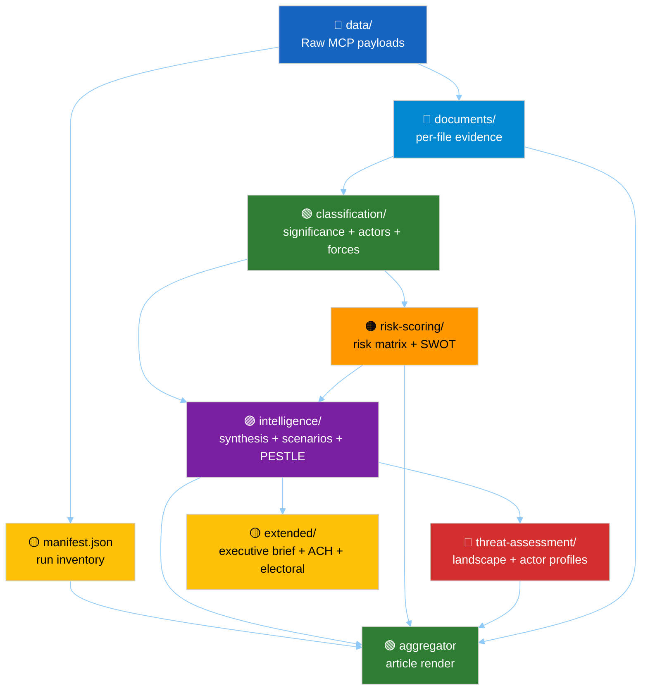
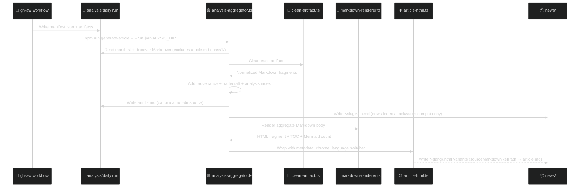

<!-- SPDX-FileCopyrightText: 2024-2026 Hack23 AB -->
<!-- SPDX-License-Identifier: Apache-2.0 -->

<p align="center">
  
</p>

<h1 align="center">📰 EU Parliament Monitor — Article Generation</h1>

<p align="center">
  <strong>How European Parliament analysis artifacts become Markdown sources, multilingual HTML articles, and deployed static-site assets</strong><br>
  <em>Agentic workflows · Political intelligence methodologies · Aggregator code · UI/UX · S3/CloudFront delivery</em>
</p>

<p align="center">
  <a href="#"></a>
  <a href="#"></a>
  <a href="#"></a>
  <a href="#"></a>
</p>

**📋 Document Owner:** CEO | **📄 Version:** 1.1 | **📅 Last Updated:** 2026-05-05 (UTC)
**🔄 Review Cycle:** Quarterly | **⏰ Next Review:** 2026-08-05 | **🏷️ Classification:** Public

---

## 🎯 Purpose

This document is the end-to-end reference for generating EU Parliament Monitor articles. It explains how an agentic workflow collects European Parliament data, produces structured political-intelligence artifacts under `analysis/daily/`, converts those artifacts into an aggregated Markdown source, renders 14 language-aware HTML variants, supports Mermaid / Chart.js / D3-enhanced UI, and deploys the resulting static site through AWS S3 + CloudFront.

The current production model is the **April 2026 aggregator-era pipeline**:

- AI agents write **analysis artifacts** in Markdown.
- TypeScript code renders those committed artifacts deterministically.
- There is **no AI-authored HTML step**.
- The canonical render command is `npm run generate-article -- --run <analysis-run-dir>`.
- Batch regeneration uses `npm run generate-article:all`.
- Each run also receives a committed `article.md` inside its analysis directory (see [§ article.md in the run directory](#-articlemd-in-the-run-directory)).

> **Primary example:** `analysis/daily/2026-04-24/breaking/article.md` → `news/2026-04-24-breaking-en.html` / `news/2026-04-24-breaking-sv.html` (14 language variants).

---

## 🗺️ End-to-End Article Pipeline

```mermaid
%%{init: {"theme":"dark","themeVariables":{"primaryColor":"#1565C0","primaryTextColor":"#ffffff","primaryBorderColor":"#0A3F7F","lineColor":"#90CAF9","secondaryColor":"#2E7D32","secondaryTextColor":"#ffffff","tertiaryColor":"#FF9800","tertiaryTextColor":"#000000","mainBkg":"#1565C0","secondBkg":"#2E7D32","tertiaryBkg":"#FF9800","noteBkgColor":"#FFC107","noteTextColor":"#000000","errorBkgColor":"#D32F2F","fontFamily":"Inter, Helvetica, Arial, sans-serif"}}}%%
flowchart LR
    A["🔵 Stage A<br/>EP MCP data collection"] --> B["🟣 Stage B<br/>AI political intelligence artifacts"]
    B --> C["🟡 Stage C<br/>Completeness + quality gate"]
    C --> D["🟢 Stage D<br/>Deterministic aggregator render"]
    D --> E["🔷 Generated Markdown<br/>news/*.en.md"]
    D --> F["🟢 Generated HTML<br/>news/*-{lang}.html"]
    F --> G["🟠 Derived indexes<br/>metadata + sitemap"]
    G --> H["🟢 S3 sync<br/>CloudFront invalidation"]

    style A fill:#1565C0,color:#ffffff
    style B fill:#7B1FA2,color:#ffffff
    style C fill:#FFC107,color:#000000
    style D fill:#2E7D32,color:#ffffff
    style E fill:#0288D1,color:#ffffff
    style F fill:#2E7D32,color:#ffffff
    style G fill:#FF9800,color:#000000
    style H fill:#2E7D32,color:#ffffff
```



### Semantic color key

| Color | Meaning in this document |
|---|---|
| 🔵 Blue `#1565C0` | Input, scope, MCP collection |
| 🟣 Purple `#7B1FA2` | Political-intelligence synthesis |
| 🟢 Green `#2E7D32` | Approved, deterministic, deployable output |
| 🟠 Orange `#FF9800` | Risk, operational caution, generated indexes |
| 🔴 Red `#D32F2F` | Threat, rejection, missing-gate condition |
| 🟡 Yellow `#FFC107` | Gate, note, metadata, pending state |
| 🔷 Light-blue `#0288D1` | Reference, source Markdown, read-only artifact |

---

## 🧩 Business Value and Political-Analysis Object

| Dimension | What article generation delivers |
|---|---|
| Democratic transparency | Converts public European Parliament data into readable, sourced intelligence products for citizens across 14 languages. |
| Political accountability | Preserves traceability from public article sections back to `analysis/daily/<date>/<type>/` artifacts, raw MCP payloads, and `manifest.json`. |
| Editorial quality | Forces agents to use structured methodologies, confidence levels, source grading, WEP probability bands, and Pass-2 readback before publication. |
| Operational resilience | Separates AI-authored analysis from deterministic HTML rendering, reducing template-prose leaks and making articles reproducible. |
| Public distribution | Publishes static HTML through S3 + CloudFront with short HTML cache and long immutable asset cache. |

The political-analysis object is not a single blob of prose. It is a **run directory**:

```text
analysis/daily/<YYYY-MM-DD>/<article-type>/
├── manifest.json
├── data/                         # raw EP MCP / IMF / WB payloads
├── intelligence/                 # synthesis, forecast, stakeholders, threat model, etc.
├── classification/               # significance, actors, forces, impact matrix
├── risk-scoring/                 # risk matrix and quantitative SWOT
├── threat-assessment/            # optional expanded threat artifacts
├── documents/                    # document index and per-file intelligence
├── existing/                     # legacy long-form artifacts when present
└── extended/                     # optional executive brief, ACH, electoral, etc.
```

The article is a deterministic view over this object.

---

## 🤖 Agentic Workflow Coverage

### Source workflows

The article-generating workflows are Markdown gh-aw workflows under `.github/workflows/` and are compiled to `.lock.yml` files. This table reflects the **current repository files**: 14 unified article workflows plus the manual translation helper. The 6 long-horizon and electoral workflows (`news-quarter-ahead.md`, `news-year-ahead.md`, `news-quarter-in-review.md`, `news-year-in-review.md`, `news-term-outlook.md`, `news-election-cycle.md`) were added in 2026-Q2 — see [§ Forward-looking horizons & election cycle](#-forward-looking-horizons--election-cycle).

| Workflow | Article type slug | Purpose |
|---|---|---|
| `.github/workflows/news-breaking.md` | `breaking` | Rapid coverage of recent EP developments. |
| `.github/workflows/news-week-in-review.md` | `week-in-review` | Weekly retrospective intelligence. |
| `.github/workflows/news-month-in-review.md` | `month-in-review` | Monthly retrospective intelligence. |
| `.github/workflows/news-quarter-in-review.md` | `quarter-in-review` | Quarterly retrospective with pipeline transit + presidency-trio overlay. |
| `.github/workflows/news-year-in-review.md` | `year-in-review` | Annual retrospective with mandate-fulfilment + term-arc + historical parallels. |
| `.github/workflows/news-week-ahead.md` | `week-ahead` | Forward calendar and risk outlook. |
| `.github/workflows/news-month-ahead.md` | `month-ahead` | Monthly forward outlook. |
| `.github/workflows/news-quarter-ahead.md` | `quarter-ahead` | 90-day legislative pipeline forecast + presidency-trio overlay. |
| `.github/workflows/news-year-ahead.md` | `year-ahead` | 12-month strategic outlook + Commission Work Programme alignment. |
| `.github/workflows/news-term-outlook.md` | `term-outlook` | Full EP-term outlook anchored to the next-EP-election week. |
| `.github/workflows/news-election-cycle.md` | `election-cycle` | EP-election span (±6 mo) with mandate scorecard, seat projection, Spitzenkandidaten arithmetic. |
| `.github/workflows/news-committee-reports.md` | `committee-reports` | Committee activity and legislative-production analysis. |
| `.github/workflows/news-motions.md` | `motions` | Motions, resolutions, urgency files, political signals. |
| `.github/workflows/news-propositions.md` | `propositions` | Legislative proposals and pipeline analysis. |
| `.github/workflows/news-translate.md` | translation helper | Flushes or updates 14-language variants. |

All article workflows follow the same high-level contract:

1. **Stage A — Data collection:** source `scripts/mcp-setup.sh`, collect EP MCP feed data and direct endpoint fallbacks, persist raw payloads under `data/`.
2. **Stage B — Analysis:** write artifacts in at least two passes using the methodology and template libraries.
3. **Stage C — Completeness gate:** verify mandatory artifacts, line floors, confidence labels, evidence citations, and absence of placeholder markers.
4. **Stage D — Article render:** run `npm run generate-article -- --run "$ANALYSIS_DIR"`.
5. **Stage E — Single PR:** create exactly one safe-output PR with analysis and generated news files.

### Workflow frontmatter and runtime features

Each workflow declares the operational envelope used by gh-aw:

| Concern | Current pattern |
|---|---|
| Runtime | Node.js 26. |
| MCP gateway | `features.mcp-gateway: true`, sandbox MCP port `8080`. |
| Network allowlist | GitHub, EP data domains, IMF data services, World Bank, Hack23 sites, project domains, defaults. |
| Safe output | `create-pull-request.max: 1` for article workflows. |
| Build setup | `npm ci`, `npm run build`, `npm run copy-vendor`. |
| Render command | `npm run generate-article -- --run "$ANALYSIS_DIR"`. |
| Vendor assets | Chart.js, Chart.js annotation plugin, D3, and Mermaid vendor bundle copied to `js/vendor/`. |

---

## 🔭 Forward-Looking Horizons & Election Cycle

The April-2026 long-horizon and electoral expansion added **6 new article types** on top of the 8 short-form types. Each is driven by a single unified `news-<slug>.md` workflow that produces one PR per run, just like the short-form workflows — the difference is **scope, depth, and which mandatory artifacts the Stage-C completeness gate enforces**.

### Horizon registry — single source of truth

The full horizon configuration lives in [`src/config/article-horizons.ts`](src/config/article-horizons.ts) — one entry per `ArticleCategory` enum value, with:

- `dataWindow` — direction (`forward` / `backward` / `span` / `point`), span in days, and anchor (`today` / `next-election` / `commission-wp` / `term-end`).
- `cadence` — cron string + free-text description + optional auxiliary triggers (e.g. `election-imminent-t180/t90/t30`).
- `primaryFeeds` — EP MCP tools that **must** be probed in Stage A.
- `mandatoryArtifacts` / `optionalArtifacts` — relative paths under `analysis/daily/<date>/<slug>/`.
- `stageBudgets` — A / B / C / D / E minute ceilings (sum ≤ 50 within the 60-min cap, drift-guard: `test/unit/horizon-registry.test.js`).
- `scenarioMaxHorizonMonths` — caps the scenario-forecast time window.
- `forwardStatementsHorizonDays` — bounds open-statement carry-forward (week-ahead = 14, term-outlook = 1500, election-cycle = 1825).
- `electoralOverlay` — when `true`, Family-D electoral artifacts (`term-arc`, `seat-projection`, `mandate-fulfilment-scorecard`, `presidency-trio-context`, `commission-wp-alignment`, `forward-indicators`) become mandatory and the scenario-forecast must include an EP-election outcome branch.

Adding a new horizon is a four-step change documented in the module header: new `ArticleCategory` enum value → new `ARTICLE_HORIZONS` entry → per-language title generator in `src/constants/language-articles.ts` → new `news-<slug>.md` workflow. The aggregator (`src/aggregator/article-metadata.ts`), forward-statements registry (`scripts/aggregator/forward-statements-registry.js`), and drift-guard tests all consume this registry directly.

### Six new horizons (2026-Q2)

| Slug | Window | Cadence | Mandatory extras (vs base) | Electoral overlay |
|---|---|---|---|:---:|
| `quarter-ahead` | T+90d (forward) | `0 8 1 * *` — 1st of month 08:00 UTC | `forward-projection` · `legislative-pipeline-forecast` · `parliamentary-calendar-projection` · `forward-indicators` | — |
| `year-ahead` | T+365d (forward) | `0 8 2 1,4,7,10 *` — quarterly | adds `presidency-trio-context` · `commission-wp-alignment` (mandatory) | — |
| `quarter-in-review` | T-90d (backward) | `0 8 5 * *` — 5th of month | retrospective base + `legislative-pipeline-forecast` | — |
| `year-in-review` | T-365d (backward) | `0 8 15 1 *` — 15 Jan | retrospective base + `mandate-fulfilment-scorecard` · `term-arc` · `legislative-pipeline-forecast` · `presidency-trio-context` · `commission-wp-alignment` · `historical-parallels` | — |
| `term-outlook` | today → next-election (~1500d) | `0 8 1 1,7 *` — 1 Jan & 1 Jul | prospective base + full electoral artifact set | ✅ |
| `election-cycle` | ±6 mo around the election week | `0 8 1 12 *` + T-180/T-90/T-30 imminent triggers | prospective base + full electoral artifact set + `mandate-fulfilment-scorecard` · `historical-parallels` · `comparative-international` | ✅ |

### Eight new analysis artifacts

The long-horizon workflows author 8 new artifacts produced under `intelligence/`. Each has a row in [`analysis/methodologies/artifact-catalog.md`](analysis/methodologies/artifact-catalog.md) and a section in [`analysis/methodologies/per-artifact-methodologies.md`](analysis/methodologies/per-artifact-methodologies.md), with depth floors keyed per article type in [`analysis/methodologies/reference-quality-thresholds.json`](analysis/methodologies/reference-quality-thresholds.json):

| Artifact | Produced for | Methodology |
|---|---|---|
| `intelligence/forward-projection.md` | every prospective horizon ≥ 7d | [forward-projection-methodology.md](analysis/methodologies/forward-projection-methodology.md) |
| `intelligence/legislative-pipeline-forecast.md` | quarter-ahead, year-ahead, term-outlook, quarter-in-review, year-in-review | [forward-projection-methodology.md §5](analysis/methodologies/forward-projection-methodology.md) |
| `intelligence/parliamentary-calendar-projection.md` | quarter-ahead, year-ahead, term-outlook | [forward-projection-methodology.md §6](analysis/methodologies/forward-projection-methodology.md) |
| `intelligence/term-arc.md` | year-in-review, term-outlook, election-cycle | [electoral-cycle-methodology.md](analysis/methodologies/electoral-cycle-methodology.md) |
| `intelligence/seat-projection.md` | term-outlook, election-cycle (mandatory); year-ahead/year-in-review (optional) | [electoral-cycle-methodology.md §3](analysis/methodologies/electoral-cycle-methodology.md) |
| `intelligence/mandate-fulfilment-scorecard.md` | year-in-review, term-outlook, election-cycle | [electoral-cycle-methodology.md §2 (Track A)](analysis/methodologies/electoral-cycle-methodology.md) |
| `intelligence/presidency-trio-context.md` | year-ahead, year-in-review, term-outlook, election-cycle | [forward-projection-methodology.md §7](analysis/methodologies/forward-projection-methodology.md) |
| `intelligence/commission-wp-alignment.md` | year-ahead, year-in-review, term-outlook, election-cycle | [forward-projection-methodology.md §8](analysis/methodologies/forward-projection-methodology.md) |

### Stage-C tripwires for long-horizon runs

Stage-C completeness gate exit minute (within the 60-min `timeout-minutes` cap; `engine.mcp.session-timeout` is intentionally **not** set because the bundled gh-aw MCP gateway rejects that field):

| Family | Stage-C exit | PR-call deadline | Stage budgets (A/B/C/D/E) |
|---|:---:|:---:|---|
| Standard short-form (breaking, week-*, month-*, committee-reports, motions, propositions) | minute 36 | minute ≤ 45 | 5 / 22 / 4 / 2 / 2 = 35 (prospective) · 4 / 22 / 4 / 2 / 2 = 34 (retrospective) |
| Long-horizon prospective (quarter-ahead, year-ahead) | minute 38–39 | minute ≤ 45 | 5 / 24–25 / 4 / 2 / 2 |
| Long-horizon retrospective (quarter-in-review, year-in-review) | minute 38–39 | minute ≤ 45 | 4–5 / 24–25 / 4 / 2 / 2 |
| Electoral (term-outlook, election-cycle) | minute 42 | minute ≤ 47 | 5 / 26–28 / 4 / 2 / 2 = up to 41 |

The drift-guard test (`test/unit/horizon-registry.test.js`) asserts every horizon's `stageBudgets` sum is ≤ 50 to leave the 10-min buffer for sandbox setup, MCP gateway boot, and the safe-output `create_pull_request` round-trip.

---

## 📚 Prompt Library and Stage Contract

The prompt library under `.github/prompts/` defines the bounded contexts each workflow reads.

| Prompt | Role in generation |
|---|---|
| `00-scope-and-ground-rules.md` | Workspace scope, neutrality, forbidden edits, one-PR rule. |
| `01-data-collection.md` | EP MCP feeds, direct fallbacks, raw data persistence, IMF/WB context. |
| `02-analysis-protocol.md` | Stage-B artifact production and mandatory two-pass analysis. |
| `03-analysis-completeness-gate.md` | Stage-C gate and refusal conditions. |
| `04-article-generation.md` | Stage-D deterministic aggregation and metadata/title contract. |
| `05-analysis-to-article-contract.md` | Division of responsibility: AI writes artifacts, aggregator renders. |
| `06-pr-and-safe-outputs.md` | Single-PR rule and safe-output semantics. |
| `07-mcp-reference.md` | EP MCP, IMF, and World Bank tool reference. |
| `08-infrastructure.md` | MCP gateway, workflow frontmatter, folder layout. |
| `09-troubleshooting.md` | Firewall, MCP, render, and PR failure diagnostics. |

The most important Stage-D rule is: **agents do not author article prose in Stage D**. They complete analysis in Stage B/C; Stage D only renders what is already committed in Markdown.

### SEO metadata contract

The public `<title>`, `<meta name="description">`, Open Graph / Twitter card
fields, JSON-LD headline/description, news indexes, RSS, and sitemap metadata
all inherit from the same resolved article metadata. **The executive brief is
the single source of truth for that metadata** — Stage-B agents set SEO
quality before rendering:

1. The brief template `analysis/templates/executive-brief.md` carries a
   **`## 🌍 14-Language SEO Metadata Pack`** table — one row per supported
   language with `Title candidate (≤70 chars)` and
   `Description candidate (150–160 chars)` columns. Fill this table during
   Stage-B Pass 2.
2. When the [`news-translate`](.github/workflows/news-translate.md) workflow
   has produced sibling `executive-brief_<lang>.md` files for the run,
   each translated brief's `# H1` and `## 🎯 BLUF` / `## 📰 60-Second Read`
   lede are the **authoritative** localized source for that language and
   take precedence over the English brief's `<lang>` row.
3. Copy the resolved per-language `(title, description)` pairs into
   `manifest.title.<lang>` and `manifest.description.<lang>`. When a locale
   has no translated brief AND its row in the English pack is unfilled, copy
   the English `en` row and set `manifest.metadataFallback[<lang>] = "en"`.
4. Keep titles ≤70 characters, active, specific, and actor-led. Keep
   descriptions 150–160 characters, consequence-led, and distinct from the
   lede.
5. Put search-intent terms in human prose and headings: committee acronyms,
   procedure titles, policy areas, institutions, and named stakeholders.
6. Never publish date/type boilerplate such as "EU Parliament Breaking —
   YYYY-MM-DD" unless no article is rendered.
7. For economic stories, use IMF-backed wording only when
   `intelligence/economic-context.md` contains IMF vintage, SDMX code, and policy
   bridge evidence.

The full per-language priority ladder, including the
`executive-brief_<lang>.md` precedence rule and the aggregator's
deterministic fallback tiers, is documented in
[`.github/prompts/04-article-generation.md`](.github/prompts/04-article-generation.md)
§ 6.

#### Automated SEO drift-guard

The `scripts/validate-manifest-seo.js` validator (invoked via
`npm run validate:manifest-seo`) audits every
`analysis/daily/<date>/<slug>/manifest.json` against six gates that
mirror this contract:

1. **title-shape** — when present, the `title` field is a 14-language
   object keyed by supported language codes.
2. **title-length** — each title is ≤ 140 characters.
3. **description-shape** — same shape rules as `title-shape`.
4. **description-length** — each description is 60–200 characters
   (CJK locales legitimately pack the same payload into ~60–80 characters).
5. **forbidden-prefix** — neither titles nor descriptions begin with
   reserved Stage-A→E preamble labels (`Run:`, `Purpose:`, `BLUF:`,
   `Stage A`…`Stage E`, `scripts/...`, `Classification:`, `Window:`,
   etc.) that previously leaked into SEO surfaces.
6. **english-fallthrough** — when a non-English value duplicates the
   English value verbatim, `manifest.metadataFallback[<lang>] = "en"`
   must be declared so the static-site layer can surface a
   pending-translation editorial note.

Single-string `title` / `description` overrides remain accepted as a
legacy/emergency degraded form, but they produce an advisory
violation so editors notice the missing 14-language pack.

---

## 🧠 Methodologies That Shape the Article

The article inherits its political meaning from the methodology library under `analysis/methodologies/`.

| Methodology | Function in article generation |
|---|---|
| `ai-driven-analysis-guide.md` | Ten-step protocol: prepare scope, read methods, collect data, classify, score risk, model threats, synthesize, choose metadata, Pass 2, validate. |
| `artifact-catalog.md` | Master map of every artifact, methodology, template, depth floor, Mermaid requirement, and MCP source. |
| `per-artifact-methodologies.md` | Construction rules for every artifact: purpose, inputs, required sections, Mermaid, quality signals. |
| `osint-tradecraft-standards.md` | ICD 203 standards, Admiralty grades, WEP bands, SAT catalog, OSINT ethics. |
| `political-classification-guide.md` | 7-dimension classification and urgency / policy-domain taxonomy. |
| `political-risk-methodology.md` | 5×5 likelihood × impact scoring, risk tiers, risk-to-SWOT integration. |
| `political-swot-framework.md` | Evidence-based SWOT and TOWS rules. |
| `political-threat-framework.md` | Political Threat Landscape 6D + Attack Trees + Political Kill Chain + Diamond Model + ICO Profiling; STRIDE is explicitly rejected for political analysis. |
| `political-style-guide.md` | Evidence density, official EP vocabulary, confidence notation, Economist-style analytic paragraphs. |
| `synthesis-methodology.md` | Stage-B.7 significance scoring, synthesis summary, stakeholder perspectives, coalition dynamics, executive brief. |
| `strategic-extensions-methodology.md` | Scenario forecasts, ACH, comparative context, intelligence assessment, methodology reflection. |
| `per-document-methodology.md` | Atomic document analysis for individual EP documents. |
| `structural-metadata-methodology.md` | Provenance, `manifest.json`, cross-reference maps, data-download manifests. |
| `electoral-domain-methodology.md` | EP10/EP11 electoral context, coalition mathematics, voter segmentation. |
| `reference-quality-thresholds.json` | Per-artifact line-count floors and tradecraft-quality signals used by Stage-C review. |

### Artifact families



---

## 🧾 Templates and Artifact-to-Article Mapping

The template index is [`analysis/templates/README.md`](./analysis/templates/README.md). It describes the structured Markdown templates that agents fill with actual EP evidence. **Templates are not rendered directly** — completed artifacts (the files agents author **from** the templates and commit under `analysis/daily/<date>/<run>/…`) are what reach the rendered article.

The aggregator maps artifact paths to rendered article sections via `src/aggregator/artifact-order.ts`. The table below enumerates **every one of the 59 templates** by basename, in the order in which the corresponding artifact is rendered. Templates marked *(long-horizon)* or *(extended)* are silently skipped if the run does not produce them — see [`src/config/article-horizons.ts`](./src/config/article-horizons.ts).

| # | Rendered article section (id → title) | Template basenames (in order) | Notes |
|--:|---|---|---|
| 1 | `executive-brief` → Executive Brief | [`executive-brief.md`](./analysis/templates/executive-brief.md) | Run-root or `extended/` fallback. BLUF + 3 decisions + 60-second read. |
| 2 | `synthesis` → Synthesis Summary | [`synthesis-summary.md`](./analysis/templates/synthesis-summary.md) | Editorial spine; cites every other artifact. |
| 3 | `significance` → Significance | [`significance-classification.md`](./analysis/templates/significance-classification.md) · [`significance-scoring.md`](./analysis/templates/significance-scoring.md) | 7-dimension classification + 5-dimension composite score → publish/hold/skip. |
| 4 | `actors-forces` → Actors & Forces | [`actor-mapping.md`](./analysis/templates/actor-mapping.md) · [`forces-analysis.md`](./analysis/templates/forces-analysis.md) · [`impact-matrix.md`](./analysis/templates/impact-matrix.md) | Power × Interest quadrants + driver-vs-blocker fan-out. |
| 5 | `coalitions-voting` → Coalitions & Voting | [`coalition-dynamics.md`](./analysis/templates/coalition-dynamics.md) · [`coalition-mathematics.md`](./analysis/templates/coalition-mathematics.md) · [`voting-patterns.md`](./analysis/templates/voting-patterns.md) | Group icons mandatory: 🔵 EPP / 🔴 S&D / 🟡 RE / 🟢 Greens / 🟠 ECR / 🟣 Left / ⚪ NI. |
| 6 | `stakeholder-map` → Stakeholder Map | [`stakeholder-map.md`](./analysis/templates/stakeholder-map.md) · [`stakeholder-impact.md`](./analysis/templates/stakeholder-impact.md) | 7-lens institutional cascade. |
| 7 | `economic-context` → Economic Context | [`economic-context.md`](./analysis/templates/economic-context.md) · [`imf-vintage-audit.md`](./analysis/templates/imf-vintage-audit.md) *(optional)* | IMF authoritative; placed before risk so macro constraints frame the risk register. |
| 8 | `risk` → Risk Assessment | [`risk-matrix.md`](./analysis/templates/risk-matrix.md) · [`risk-assessment.md`](./analysis/templates/risk-assessment.md) · [`quantitative-swot.md`](./analysis/templates/quantitative-swot.md) · [`swot-analysis.md`](./analysis/templates/swot-analysis.md) · [`political-capital-risk.md`](./analysis/templates/political-capital-risk.md) · [`legislative-velocity-risk.md`](./analysis/templates/legislative-velocity-risk.md) | 5×5 heat-map: 🟢 low → 🟡 med → 🔴 critical. |
| 9 | `threat` → Threat Landscape | [`political-threat-landscape.md`](./analysis/templates/political-threat-landscape.md) · [`threat-model.md`](./analysis/templates/threat-model.md) · [`threat-analysis.md`](./analysis/templates/threat-analysis.md) · [`actor-threat-profiles.md`](./analysis/templates/actor-threat-profiles.md) · [`consequence-trees.md`](./analysis/templates/consequence-trees.md) · [`legislative-disruption.md`](./analysis/templates/legislative-disruption.md) | 5-framework integrated (Political Threat Landscape 6D + Attack Trees + Kill Chain + Diamond + ICO). **STRIDE rejected.** |
| 10 | `scenarios` → Scenarios & Wildcards | [`scenario-forecast.md`](./analysis/templates/scenario-forecast.md) · [`wildcards-blackswans.md`](./analysis/templates/wildcards-blackswans.md) · [`devils-advocate-analysis.md`](./analysis/templates/devils-advocate-analysis.md) *(extended)* | Tree of S1/S2/S3 + black-swan tripwires + counter-thesis. |
| 11 | `forward-projection` → What to Watch *(prospective ≥7d)* | [`forward-projection.md`](./analysis/templates/forward-projection.md) · [`legislative-pipeline-forecast.md`](./analysis/templates/legislative-pipeline-forecast.md) *(long-horizon)* · [`parliamentary-calendar-projection.md`](./analysis/templates/parliamentary-calendar-projection.md) *(long-horizon)* · [`forward-indicators.md`](./analysis/templates/forward-indicators.md) *(extended)* | Dated triggers and pipeline forecasts after scenarios. |
| 12 | `electoral-arc` → Electoral Arc & Mandate *(long-horizon)* | [`term-arc.md`](./analysis/templates/term-arc.md) · [`seat-projection.md`](./analysis/templates/seat-projection.md) · [`mandate-fulfilment-scorecard.md`](./analysis/templates/mandate-fulfilment-scorecard.md) · [`presidency-trio-context.md`](./analysis/templates/presidency-trio-context.md) · [`commission-wp-alignment.md`](./analysis/templates/commission-wp-alignment.md) | `quarter-ahead+`, `term-outlook`, `election-cycle`. |
| 13 | `pestle-context` → PESTLE & Context | [`pestle-analysis.md`](./analysis/templates/pestle-analysis.md) · [`historical-baseline.md`](./analysis/templates/historical-baseline.md) | Structural backdrop after the news, stakes, risk and forecast arc. |
| 14 | `continuity` → Cross-Run Continuity | [`cross-run-diff.md`](./analysis/templates/cross-run-diff.md) · [`cross-session-intelligence.md`](./analysis/templates/cross-session-intelligence.md) · [`session-baseline.md`](./analysis/templates/session-baseline.md) | Drift detection + session baseline gantt. |
| 15 | `deep-analysis` → Deep Analysis | [`deep-analysis.md`](./analysis/templates/deep-analysis.md) | Long-form 4 000–10 000 word Economist-style prose. |
| 16 | `documents` → Document Analysis | [`per-file-political-intelligence.md`](./analysis/templates/per-file-political-intelligence.md) · [`political-classification.md`](./analysis/templates/political-classification.md) | Per-file analysis (the most-used template). |
| 17 | `extended-intel` → Extended Intelligence | All [`extended/*.md`](./analysis/templates/) not consumed above — including [`historical-parallels.md`](./analysis/templates/historical-parallels.md) · [`comparative-international.md`](./analysis/templates/comparative-international.md) · [`voter-segmentation.md`](./analysis/templates/voter-segmentation.md) · [`intelligence-assessment.md`](./analysis/templates/intelligence-assessment.md) · [`implementation-feasibility.md`](./analysis/templates/implementation-feasibility.md) · [`media-framing-analysis.md`](./analysis/templates/media-framing-analysis.md) · [`data-download-manifest.md`](./analysis/templates/data-download-manifest.md) · [`cross-reference-map.md`](./analysis/templates/cross-reference-map.md) | Catch-all for `extended/` directory; optional long-form, crisis, breaking-deep and provenance depth. |
| 18 | `mcp-reliability` → MCP Reliability Audit | [`mcp-reliability-audit.md`](./analysis/templates/mcp-reliability-audit.md) | Per-tool retry/fallback dashboard. |
| 19 | `quality-reflection` → Analytical Quality & Reflection | [`analysis-index.md`](./analysis/templates/analysis-index.md) · [`reference-analysis-quality.md`](./analysis/templates/reference-analysis-quality.md) · [`workflow-audit.md`](./analysis/templates/workflow-audit.md) · [`methodology-reflection.md`](./analysis/templates/methodology-reflection.md) | Always last — Step 10.5 of the AI-driven analysis guide. |
| 20 | `aggregator-tradecraft-references` → Tradecraft References | (auto-generated from [`osint-tradecraft-standards.md`](./analysis/methodologies/osint-tradecraft-standards.md)) | Appendix linking methodology + template files. |
| 21 | `aggregator-analysis-index` → Analysis Index | (auto-generated from `manifest.json` + [`analysis-index.md`](./analysis/templates/analysis-index.md)) | Lists every included artifact and source path. |
| 22 | Supplementary Intelligence | Any discovered Markdown not consumed above | Safety-net catch-all only. Recent runs should map all known artifacts into reader-facing sections; this bucket is monitored in the audit below. |

The aggregator never renders templates directly — it renders only artifacts written **from** them, and the order above is the order in which the corresponding *artifacts* appear in the rendered article. Templates marked *(long-horizon)* / *(electoral)* / *(extended)* are silently skipped if the run did not produce them. This list is matched 1:1 with the artifact-claim sets in [`src/aggregator/artifact-order.ts`](./src/aggregator/artifact-order.ts) (the byte-equality test `test/unit/aggregator-determinism.test.js` enforces that the rendered output stays identical run-over-run).

Because `aggregateAnalysisRun()` merges manifest-declared files with discovered Markdown, any extra Markdown in a valid run directory can still be rendered. For current examples such as `analysis/daily/2026-04-24/motions/`, extra Markdown that is not claimed by a canonical section lands under **Supplementary Intelligence** unless `artifact-order.ts` claims it explicitly.

### Recent `article.md` aggregation audit — 2026-05-12

The 2026-05-12 runs were reviewed against the current aggregator contract to
confirm that every manifest-declared or discovered analysis artifact is included
in `article.md`, and that readers encounter the material in a coherent order.

| Run | Manifest-declared artifacts | Discovered Markdown artifacts | Included in `article.md` | Missing from aggregation | Supplementary bucket after this audit | Reader-guide status |
|---|---:|---:|---:|---:|---:|---|
| `analysis/daily/2026-05-12/breaking` | 38 | 52 | 52 | 0 | 0 | Complete — all emitted analytical sections have guide rows. |
| `analysis/daily/2026-05-12/motions` | 18 | 18 | 18 | 0 | 0 | Complete — no executive brief exists, so the guide correctly opens the article. |
| `analysis/daily/2026-05-12/propositions` | 0 (legacy `artifacts[]` schema) | 28 | 28 | 0 | 0 | Complete — discovered artifacts fill the manifest gap. |

Findings:

1. **No artifact was dropped.** The aggregator already merges manifest files with
   discovered Markdown under the run directory, excluding only generated
   `article*.md`, `README.md`, `data/`, `runs/`, and `pass1/`.
2. **Known root-level legacy artifacts needed better placement.** The breaking
   run contained legacy root files (`synthesis.md`, `risk-matrix.md`,
   `scenario-forecast.md`, `article-index.md`, `methodology-reflection.md`,
   etc.) that were included but appeared under **Supplementary Intelligence**.
   These are now claimed by the corresponding canonical sections so the reading
   order stays intelligible.
3. **The Reader Intelligence Guide needed full section coverage in `article.md`.**
   The Markdown guide now covers executive brief, synthesis, significance,
   actors/forces, coalitions, stakeholders, economic context, risk, threat,
   scenarios, forward projection, electoral arc, PESTLE, continuity, deep
   analysis, document trail, extended intelligence, MCP reliability, analytical
   quality, and the supplementary safety net.
4. **The understandable reader order is now:** Executive Brief → Reader
   Intelligence Guide → Key Takeaways → Synthesis → Significance → Actors &
   Forces → Coalitions & Voting → Stakeholders → Economic Context → Risk →
   Threat → Scenarios → What to Watch → Electoral Arc → PESTLE & Context →
   Continuity → Deep Analysis → Documents → Extended Intelligence → MCP
   Reliability → Quality & Reflection → Tradecraft References → Analysis Index.

---

## 🧱 TypeScript Code Used for Generation

The aggregator package is split into seven bounded contexts under `src/aggregator/`. Each context has a narrow public surface (`index.ts`) and is independently unit-tested. Existing files (`article-generator.ts`, `analysis-aggregator.ts`, …) keep exporting the legacy names as thin re-export shims so every workflow, test, and external import keeps resolving — the `npm run generate-article` CLI shape is byte-identical.

| File / Module | Responsibility |
|---|---|
| `src/aggregator/article-generator.ts` | CLI entry point; parses flags; runs aggregation; resolves metadata; writes `article.md` to the run directory AND `news/<slug>.en.md`; **emits the deterministic `article-meta.json` sidecar next to `article.md`**; renders 14 HTML variants; passes `isBasedOn` source artifact URLs to the HTML chrome. Re-exports `buildArticleSlug`, `sanitizeRunSuffix`, `discoverAnalysisRuns`, `groupRunsForCollision`, `DiscoveredRun` from `slug/` and `runs/` for back-compat. |
| `src/aggregator/analysis-aggregator.ts` | Reads run directory and `manifest.json`; flattens manifest files; discovers additional Markdown (excluding `article.md`, translated variants, `README.md`, and `pass1/`); orders sections; **inserts the Reader Intelligence Guide immediately after the Executive Brief, then the deterministic Key Takeaways block, before the deep sections**; adds provenance, tradecraft, and analysis-index appendices. Re-exports `AnalysisManifest`, `flattenManifestFiles`, `latestGateResult`, `resolveArticleTypeFromManifest` from `manifest/` for back-compat. Exports `guessDateFromRunDir` for testability. |
| `src/aggregator/artifact-order.ts` | Defines the canonical section order and artifact path claims. The forward-projection bucket renders under the **`What to Watch`** title so readers see dated triggers as a forward-looking lens rather than buried "extended intel". |
| `src/aggregator/clean-artifact.ts` | Strips front matter, banners, H1s, SPDX tags, artifact-metadata preambles (`**Run:**`, `**Window:**`, etc.), demotes headings, rewrites links, deduplicates Mermaid bodies. Re-exports `githubBlobUrl`/`githubRawUrl` from `infra/` for back-compat. |
| `src/aggregator/markdown-renderer.ts` | Configures `markdown-it`, headings, footnotes, attrs, definition lists, table wrappers, and Mermaid fence rendering. |
| `src/aggregator/article-html.ts` | Wraps rendered body in full HTML5 document, metadata, JSON-LD (with `isBasedOn` provenance list), hreflang links, header, language switcher, TOC, footer, theme toggle. |
| `src/aggregator/article-metadata.ts` | Resolves title and description through the 5-tier editorial-highlight ladder. |
| `src/aggregator/lead-extractor.ts` | **NEW** — pure module that distils a one-sentence executive lead from `executive-brief.md` (preferred) → `intelligence/synthesis-summary.md` → fallback paragraph. Caps at 320 chars with ellipsis. Pure and unit-tested. |
| `src/aggregator/key-takeaways.ts` | **NEW** — deterministic 3–7 bullet "Key Takeaways" synthesiser harvesting `## Top Findings` / `## Key Judgments` / `## BLUF` from `intelligence/synthesis-summary.md` and `intelligence/intelligence-assessment.md`. Folds near-duplicates with a Jaccard-≥-0.7 dedupe pass so overlapping artifacts do not stutter. Returns `''` below the 3-bullet floor so the section is simply omitted. |
| `src/aggregator/article-meta.ts` | **NEW** — emits the structured `article-meta.json` sidecar next to `article.md`. Contains top finding, key takeaways, key actors, key dates, top risks, IMF macro context, and a sorted source-artifact list consumed by HTML SEO/structured-data and news indexes. Same artifact bytes in → same JSON bytes out (asserted by the determinism test). |
| `src/aggregator/infra/github-urls.ts` | **Single source of truth** for the `Hack23/euparliamentmonitor` repo slug and helpers (`blobUrl`, `rawUrl`, `treeUrl`). Eliminates the previous duplication between `clean-artifact.ts` and `article-generator.ts`. |
| `src/aggregator/manifest/{types,reader,resolver,index}.ts` | Canonical `Manifest` schema covering all three historic schema variants (`articleType`, plural `articleTypes[]`, very-legacy `runType`). Exports `readManifest`, `parseManifest`, `resolveArticleType`, `resolveDate`, `resolveRunId`, `latestGateResult`, `flattenManifestFiles`, `UNKNOWN_ARTICLE_TYPE`. |
| `src/aggregator/runs/{discover,grouping,index}.ts` | Filesystem walk of `analysis/daily/<date>/` plus `(date, articleType)` collision grouping. Exports `discoverAnalysisRuns`, `readRunCandidate`, `dateFromPath`, `groupRunsForCollision`, `collisionKey`, `DiscoveredRun`. |
| `src/aggregator/slug/{slug,index}.ts` | Pure naming functions: `buildArticleSlug`, `sanitizeRunSuffix`, `RUN_SUFFIX_MAX_LENGTH`, `DEFAULT_RUN_SUFFIX`. No I/O, no globals — referentially transparent. |
| `src/aggregator/cli/{parse,index}.ts` | Non-exiting CLI parser `parseCliArgsSafe` returning a `{kind:'options'\|'help'\|'error'}` discriminated union, plus shared `HELP_TEXT`. Lets unit tests cover `--help` and every error branch without spying on `process.exit`. |
| `src/mcp/ep-mcp-client.ts` | TypeScript wrappers for 60+ European Parliament MCP tools, with fallback payloads and error classification. |
| `scripts/mcp-setup.sh` | Sourceable gateway configuration for EP MCP, World Bank MCP, and IMF REST base URL. |
| `scripts/generators/news-indexes.js` | Generates news indexes and article metadata during `npm run prebuild`. |
| `scripts/generators/sitemap.js` | Generates sitemap and related metadata during prebuild/deploy. |

### Test coverage for the new modules

| Test file | Scope |
|---|---|
| `test/unit/infra-github-urls.test.js` | 13 tests — repo slug constants, `blobUrl`/`rawUrl`/`treeUrl` builders, POSIX normalisation, byte-equality with legacy shims. |
| `test/unit/manifest.test.js` | 30 tests — all 3 schema variants, malformed JSON, missing file, file-flattener edge cases, gate-result history walk. |
| `test/unit/runs.test.js` | 19 tests — discovery walk, legacy schema tolerance, malformed-JSON skip, sort order, no-descend-into-nested-manifest, collision grouping, insertion-order preservation. |
| `test/unit/slug.test.js` | 21 tests — pure naming functions plus a filename-safety round-trip property check. |
| `test/unit/cli-parse.test.js` | Every flag form (`--flag value`, `--flag=value`, aliases like `--analysis-dir`/`--output`), `--help` short-circuit (no `process.exit` spy required), every error branch — **including explicit rejection of the removed `--lang/--language/--markdown-only` flags with a clear migration message**. |
| `test/unit/aggregator-determinism.test.js` | 3 tests — byte-equality of every output file across two consecutive runs in English-only, all-14-languages, and `--markdown-only` modes (the `markdownOnly` knob is preserved on the programmatic API for test speed even though the CLI flag has been removed). **Now also asserts byte-equality of `article-meta.json`.** This is the safety net that protects the byte-output contract. |
| `test/unit/aggregator-key-takeaways.test.js` | **NEW** — 14 tests covering bullet harvesting (`## Top Findings` / `## Key Judgments` / `## BLUF`), Jaccard near-duplicate dedupe, MIN/MAX bounds, and the rendered Markdown block. |
| `test/unit/aggregator-lead.test.js` | **NEW** — 10 tests covering the executive-lead extractor: preferred-heading scanning, fallback paragraph, code-fence handling, and the sentence-trim cap. |
| `test/unit/aggregator-article-meta.test.js` | **NEW** — 9 tests covering the structured `article-meta.json` sidecar: every per-field extractor (top finding, key takeaways, top risks, key dates, key actors, IMF macro context), graceful degradation when artifacts are missing, and stable sorted-key JSON serialisation. |

### CLI contract

> **Always-14-languages-always-HTML contract (May 2026):** the CLI no longer accepts `--lang`, `--language`, or `--markdown-only`. Every CLI invocation aggregates the analysis run, writes `article.md` and `article-meta.json` into the run directory, and renders **all 14 language-aware HTML variants** under `news/`. There is no flag to scope to a single language or to skip HTML emission — both are guarantees of the contract. Programmatic callers (unit / integration tests) can still narrow the scope by constructing the options object directly when calling `generateArticle()` for speed.

```bash
# Single-run render: article.md in run dir + source Markdown in news/ + all 14 HTML variants
npm run generate-article -- --run analysis/daily/2026-04-24/propositions

# Batch regeneration of every valid analysis run — backport / rebuild
# all article.md files and produce all 14 HTML variants for every run
# discovered under analysis/daily/.
npm run generate-article:all

# Batch regeneration from a date lower bound (still all 14 languages per run)
npm run generate-article -- --all --since 2026-04-24

# Override the auto-derived title or description (single-run only)
npm run generate-article -- --run analysis/daily/2026-04-24/propositions \
  --title "Custom headline" --description "Custom lede"
```

The legacy `--lang en --lang sv` and `--markdown-only` invocations are now rejected with:

```
Flag --lang has been removed. The CLI always renders all 14 languages with HTML output.
See Article-Generation.md § "CLI contract" for the new always-on contract.
```

### Generated file naming

| Input | Output |
|---|---|
| `analysis/daily/2026-04-24/propositions/manifest.json` with `articleType: propositions` | **`analysis/daily/2026-04-24/propositions/article.md`** (canonical run-dir source) |
| Same run | `news/2026-04-24-propositions.en.md` (backwards-compat / news-index copy) |
| Same run, English | `news/2026-04-24-propositions-en.html` |
| Same run, Swedish | `news/2026-04-24-propositions-sv.html` |
| Same run, Arabic | `news/2026-04-24-propositions-ar.html` with RTL direction from language constants. |
| `manifest.json` with `articleType: motions-runmotions-run-1777010709` | `analysis/daily/2026-04-24/motions-runmotions-run-1777010709/article.md` + `news/2026-04-24-motions-runmotions-run-1777010709.en.md` |
| Batch collision during `--all` where two runs would otherwise produce the same slug | Sanitized extra suffix appended to the already-derived `YYYY-MM-DD-<manifest.articleType>` stem. |

The generator builds the base slug from the manifest value as-is: `YYYY-MM-DD-<manifest.articleType>`. In other words, if `manifest.articleType` already contains a run-like suffix, that suffix will already appear in the output filename stem before any collision handling happens.

The additional sanitized suffix is only a collision-avoidance step for batch generation (`--all`) when multiple runs would otherwise write the same output path.

To keep filenames predictable, prefer keeping `manifest.articleType` to the canonical article-type set (for example `breaking`, `week-in-review`, `month-in-review`, `week-ahead`, `month-ahead`, `committee-reports`, `motions`, `propositions`) and place per-run uniqueness in `runId` instead.

### 📄 `article.md` in the run directory

Each `npm run generate-article` invocation writes `article.md` directly into the analysis run directory alongside the artifacts that produced it:

```
analysis/daily/2026-04-24/breaking/
├── manifest.json
├── intelligence/
│   ├── synthesis-summary.md
│   └── ...
├── ...
└── article.md          ← canonical aggregated Markdown (generated by the aggregator)
```

**Why `article.md` lives in the run directory:**
- The Markdown source and the artifacts that produced it are co-located — readers can browse `analysis/daily/<date>/<type>/` on GitHub and immediately see both the evidence and the derived article.
- The HTML "View source Markdown" link points to `analysis/daily/<date>/<type>/article.md` on the deployed site, giving a clear provenance trail from the public HTML back to the intelligence tree.
- `npm run generate-article:all` regenerates every `article.md` across all historical runs in a single deterministic pass, making bulk rebuilds and backports straightforward.

**Aggregator exclusion:** `collectRunArtifacts()` in `analysis-aggregator.ts` skips `article.md` and any per-language translated variants (e.g. `article.sv.md`) so the aggregator never recurses into its own output on subsequent runs. The `pass1/` snapshot directory is also excluded.

### 📄 `article-meta.json` sidecar

Every `npm run generate-article` invocation also writes a deterministic `article-meta.json` next to `article.md`:

```
analysis/daily/2026-04-24/breaking/
├── article.md                ← canonical aggregated Markdown
└── article-meta.json         ← structured-data sidecar (NEW)
```

The sidecar is a pure function of the on-disk artifacts plus the resolved manifest fields — same artifact bytes in → same JSON bytes out (asserted by the determinism test):

| Field | Source artifact(s) | Purpose |
|---|---|---|
| `topFinding` | `executive-brief.md` → `intelligence/synthesis-summary.md` | One-sentence executive lead used as the SEO description and the structured-data `description` |
| `keyTakeaways` | `intelligence/synthesis-summary.md`, `intelligence/intelligence-assessment.md` | 3–7 deterministic bullets, also rendered as the **Key Takeaways** H2 right after the Executive Brief in `article.md` |
| `topRisks` | `risk-scoring/risk-matrix.md` (→ `political-risk.md`, `quantitative-swot.md`) | Top political-risk bullets for SEO/structured data |
| `keyDates` | `intelligence/parliamentary-calendar-projection.md`, `extended/forward-indicators.md`, `intelligence/scenario-forecast.md` | Forward-looking dated triggers for the news/RSS layer |
| `keyActors` | `classification/actor-mapping.md` → `intelligence/stakeholder-map.md` | Top political actors for `mentions` / `about` enrichment |
| `macroContext` | `intelligence/economic-context.md` | One-sentence IMF / WorldBank macro hook surfaced as a sidebar callout in HTML |
| `sources` | Filesystem walk of the canonical artifact list | Sorted run-relative paths consumed by JSON-LD `isBasedOn` |

The sidecar is consumed by the HTML SEO/structured-data layer, the news-index generators, and the RSS feed builder — none of those layers re-parses `article.md` or walks the run directory directly.

### 🧱 Article skeleton (post-aggregator-uplift)

The aggregated `article.md` follows a fixed deterministic skeleton, shaped for a political-intelligence reader (news arc → stakes → forecast → deep context → audit):

1. **`# {humanize(articleType)} — {date}`** (document title)
2. **Executive Brief** (`<h2 id="section-executive-brief">`) — BLUF up front
3. **Reader Intelligence Guide** (`<h2 id="reader-intelligence-guide">`) — Riksdagsmonitor-style navigation table that maps reader needs to artifacts (placed right after the Executive Brief so readers get a navigation map before they commit to scanning the deeper digest)
4. **Key Takeaways** (`<h2 id="section-key-takeaways">`) — 3–7 deterministic bullets harvested from synthesis-summary / intelligence-assessment, **only emitted when ≥3 strong bullets are available**
5. **The political story** — `Synthesis Summary` → `Significance` → `Actors & Forces` → `Coalitions & Voting` → `Stakeholder Map` (the cast and how they aligned)
6. **The stakes** — `Economic Context` (IMF macro stakes) → `Risk Assessment` → `Threat Landscape` → `Scenarios & Wildcards`
7. **What to Watch** (`<h2 id="section-forward-projection">`) — forward-projection bucket (legislative-pipeline-forecast, parliamentary-calendar-projection, forward-indicators) so dated triggers live in their own forward-looking lens rather than under "extended intel"
8. **Electoral Arc & Mandate** (`<h2 id="section-electoral-arc">`) — long-horizon term-arc / seat-projection / mandate-fulfilment / presidency-trio / Commission WP alignment (only when those artifacts are present)
9. **Deep context** — `PESTLE & Context` (politics/economics/sociology/tech/legal/environmental backdrop + historical baseline) → `Cross-Run Continuity` → `Deep Analysis`. PESTLE is structural framing that supports but does not lead the news arc, so it sits after the forward-looking block.
10. **Document Analysis** and **Extended Intelligence** — per-document evidence and catch-all extras
11. **MCP Reliability Audit** and **Analytical Quality & Reflection** — provenance and self-audit
12. **Provenance** blockquote — article type, date, run id, gate, manifest link
13. **Tradecraft Appendix** (methodologies + templates)
14. **Analysis Index** (every artifact, with section + path columns)

The canonical machine-readable order lives in [`src/aggregator/artifact-order.ts`](./src/aggregator/artifact-order.ts) (see the doc-comment on `ARTIFACT_SECTIONS`); the prose skeleton above is its journalistic narration. The TOC entries emitted in `aggregateAnalysisRun(...).sectionToc` mirror the order above 1:1 — when Key Takeaways or the Reader Intelligence Guide is suppressed for a sparse run, both the H2 and the TOC entry are dropped together.

The **rendered HTML body order matches this skeleton 1:1**. The HTML pipeline regenerates the Reader Intelligence Guide from `aggregated.sectionToc` (so per-language copy stays in sync with `i18n/site/<lang>.json`) and then splices it **immediately after the Executive Brief section** via `insertReaderGuideAfterExecutiveBrief(bodyHtml, guideHtml)` in [`src/aggregator/article-generator.ts`](./src/aggregator/article-generator.ts). When the Executive Brief is missing (sparse runs) the splice falls back to prepending so the guide still appears at the top of the body. An integration test in `test/integration/html-article-pipeline.test.js` enforces the ordering on every published article.

### 🏷 Title and description resolution (SEO-critical)

`<title>`, `<meta description>`, OG/Twitter tags, and the `NewsArticle` JSON-LD `headline` / `description` all flow from the same per-language priority ladder in [`src/aggregator/article-metadata.ts`](./src/aggregator/article-metadata.ts) (`resolveArticleMetadata`):

1. **Manifest override** — `manifest.title.<lang>` / `manifest.description.<lang>` (string or per-language map). Stage-B agents set these from the executive brief's **`## 🌍 14-Language SEO Metadata Pack`** table; when sibling `executive-brief_<lang>.md` translations exist they take per-language precedence over the English brief's row (see [`.github/prompts/04-article-generation.md`](./.github/prompts/04-article-generation.md) § 6 for the full ladder).
2. **Editorial artefact H1** — first non-generic `# …` from the canonical editorial-artefact list, in this order: `executive-brief.md` → `extended/executive-brief.md` → `intelligence/synthesis-summary.md` → `intelligence/executive-summary.md` → `intelligence/intelligence-briefing.md` → run-root fallbacks. H1s that are artefact-category labels (`Synthesis Summary — …`, `Executive Brief — …`, `Intelligence Briefing — …`, `Breaking News Analysis — …`, `Committee Activity Report — …`) are treated as **generic** by `isGenericHeading` so they cannot leak into the SEO surfaces.
3. **Priority-finding extraction** — when the canonical brief H1 is generic, `extractPriorityFindingHighlight` mines the **first named dossier** out of the executive brief's `## Key Developments` / `## Priority Dossiers` / `## Key Judgements` / `## 🔴 Priority Intelligence Assessment` / `## 🎯 WEP Assessment` / `## 💡 Policy Intelligence Alerts` (and ~25 other recognised) section headings, plus an H2-level `## 📌 Lead Story:` / `## Story N:` / `## Trigger N:` fallback scan when no parent section exists (motions briefs). Recognised item patterns: (A) `1. **Title** (proc-code, date) Body…` bold-in-numbered-list; (B) `### 1. Title (committee)` / `### 1 · Title` numbered subheadings — decimal-section labels like `### 2.1 Close to Adoption` are explicitly **rejected**; (B') `### KJ-1: Title` / `### T-2: Title` tag-coded headings; (D) `### Alert N — Title` / `### Judgement N — Title` word-prefixed headings; (C) `**Title** Body…` bold-leading paragraphs, with two hard guards — bold body must be ≤110 chars (no paragraph-lede leakage) and must not match the metadata-banner prefix list (`**Admiralty Grade:**`, `**Reporting Window:**`, `**Confidence**`, `**Date:**`, etc.). Leading `🔴 CRITICAL —` / `🎯` / `1.` decoration and trailing `(TA-10-2026-0160, 2026-04-30)` / `(Highly Probable, 80%)` parens-metadata are stripped before the headline reaches `<title>`.
4. **Editorial lede paragraph** — when an editorial artefact's H1 is generic and no priority finding was identified, the resolver pulls the first qualifying prose paragraph inside `## 60-Second Read` / `## TL;DR` / `## BLUF` / `## Executive Summary` / `## Headline Judgement` (or other heading in `EDITORIAL_LEDE_HEADINGS`) as the description. Heading matching is emoji-tolerant (`🎯 Headline Judgement` is recognised).
5. **Aggregated H1 / strong prose** — falls through to the aggregated Markdown's own H1 then the first strong prose paragraph that survives the metadata-leak filter.
6. **Localized template fallback** — last-resort per-language template from `buildTemplateFallback(articleType, date, committee?)` so every locale always has a non-empty `{title, description}` pair. Reaching this tier for a published article means the Stage-B contract above was not honored — treat it as an editorial defect.

> **Translated-sibling exclusion (2026-05 critical fix).** The top-level artefact-fallback scan now skips every `*_<lang>.md` translated sibling brief (`executive-brief_ar.md`, `executive-brief_de.md`, …) via `isTranslatedSiblingBrief`. Prior to this guard, when the canonical English `executive-brief.md` H1 was generic the resolver alphabetically walked translated siblings and the Arabic `_ar.md` H1 (which the English-only `isGenericHeading` detector treated as non-generic) hijacked the English `<title>`, meta description, and homepage card. Regression test: `extractArtifactHighlight — translated-sibling exclusion (regression)` in `test/unit/article-metadata.test.js`.

> **Localized-brief precedence (planned resolver extension).** Tier 2 currently walks the English `executive-brief.md` for every language. When a translated `executive-brief_<lang>.md` exists in the run directory and the manifest carries no override for `<lang>`, the resolver should prefer that file's translated H1 / lede over the English brief for that language. Until that extension lands, the Stage-B agent achieves the same effect explicitly by copying the translated brief's headline and lede into `manifest.title.<lang>` / `manifest.description.<lang>`.

The `shouldSkipDescriptionLine` filter rejects every Stage-B preamble row that previously leaked into descriptions: `**Purpose:** …`, `**Reporting Window:** …`, `**Date:** … | **Horizon:** … | **Confidence:** …`, `**Admiralty Grade:** B2 | **WEP Band:** Probable …`, plus all the historical metadata banners (`Analysis Date`, `Run`, `Series`, `Window`, …). The full prefix list lives in `METADATA_LINE_PREFIXES` and is unit-tested in `test/unit/article-metadata.test.js`.

In addition, two helpers run on every artefact body before it reaches the SEO surfaces:

- **`stripArtifactCategoryAffix(heading)`** — when an editorial-artefact H1 carries an artifact-category label as either prefix (`# Executive Brief — EU Parliament Motions`) or suffix (`# EP10 Term Outlook — Executive Brief`) — including the `Synthesis Summary`, `Intelligence (Synthesis|Briefing|Assessment) Summary`, `Breaking News Analysis`, `Committee Activity Report`, `Deep Analysis`, `Actor Mapping`, `PESTLE Analysis`, `Stakeholder Map`, `SWOT Analysis`, `Risk Matrix`, `Threat Model`, `Coalition Dynamics`, `Voting Patterns`, `Mandate Fulfilment Scorecard`, `Commission WP Alignment`, `Presidency Trio Context`, `Methodology Reflection`, `MCP Reliability Audit`, `Forward Indicators`, `Scenario Forecast`, `Wildcards Blackswans`, `Quantitative SWOT`, `Impact Matrix`, `Significance Classification`, `Legislative Pipeline Forecast/Analysis/Output Analysis`, `Parliamentary Calendar Projection`, `Seat Projection` and `Cross Run Continuity` labels — the affix is stripped and the editorial-topic core is recovered as the headline. Trailing parenthesised metadata (`(2026-05-08)`, `(May 2026)`) is stripped after the affix. When stripping leaves <5 chars the resolver falls through to the next candidate.
- **`stripLeadingProseLabel(line)`** — when the journalist's lede paragraph begins with an all-caps BLUF-style label (`SITUATION:`, `KEY MOTION:`, `BLUF:`, `BOTTOM LINE:`, `TIER-1:`, …) the label is stripped before the line is used as the SEO description. Both `extractLedeAfterHeading` and `extractStrongProseLine` route prose through this helper. Single-word labels shorter than 3 chars are exempted to avoid false-matching legitimate sentence openers like `OK:` / `EU:` / `PR:`.

Both helpers are unit-tested in `test/unit/article-metadata.test.js` and locked in by integration assertions in `test/integration/html-article-pipeline.test.js` (no headline starts OR ends with an artefact-category label; no description starts with an all-caps prose-label opener).

---

## 🔁 How Analysis Becomes HTML



### Cleaning and normalization

Before Markdown is rendered, each artifact is normalized so the final article remains coherent (`clean-artifact.ts` applies passes in order):

1. **YAML front matter** stripped — `---\n…\n---\n` at position 0.
2. **SPDX tag lines** stripped — `SPDX-License-Identifier` / `SPDX-FileCopyrightText` lines removed before rendering to prevent REUSE scanner breakage.
3. **Logo banners, owner metadata, shield rows** stripped — `<p align="center">`, `shields.io` badges, `**📋 Document Owner:**` etc.
4. **Artifact H1 headings** removed; **H2+ headings demoted one level** (H2→H3, H3→H4, …).
5. **Artifact metadata preamble** stripped — after H1 removal, agent-operational header lines like `**Run:** breaking-run-…`, `**Window:** …`, `**Methodology:** …`, `**Scope:** …`, `**Gate target:** …` followed by a `---` separator are removed. These are internal run metadata, not reader-relevant content.
6. **Relative links and images** rewritten to absolute GitHub blob/raw URLs for portability and auditability.
7. **Duplicate Mermaid blocks** replaced by cross-reference HTML comments.

Additionally, `collectRunArtifacts()` skips:
- `data/`, `runs/`, `pass1/` directories (raw payloads, legacy snapshots, Pass-1 work-in-progress)
- `article.md` and `article.<lang>.md` (generated outputs — prevents aggregator recursing into itself)
- `README.md` (case-insensitive) — required for the analysis gate but not for the published article

### Markdown rendering

`markdown-renderer.ts` uses:

- `markdown-it`
- `markdown-it-anchor`
- `markdown-it-footnote`
- `markdown-it-attrs` with only `id` and `class` allowed
- `markdown-it-deflist`
- a Mermaid fence override that emits accessible `<figure class="mermaid-figure" role="img">` and `<pre class="mermaid">` blocks
- table wrappers: `<div class="table-scroll" role="region" tabindex="0">`

### HTML wrapper

`article-html.ts` emits:

- `<!DOCTYPE html>` with `lang` and `dir`.
- security metadata (`X-Content-Type-Options`, `referrer`).
- canonical URL and 14 `hreflang` alternates plus `x-default`.
- Open Graph and Twitter card metadata.
- JSON-LD `NewsArticle` with `isBasedOn` listing every source artifact URL (provenance traceability).
- shared stylesheet `../styles.css`.
- vendored Mermaid bundle and Mermaid init script reference.
- skip link, sticky header, brand logo, theme toggle, language switcher, article TOC, source Markdown link, article body, and shared footer.

---

## 🧭 Metadata Resolution

The article title and description are resolved by `src/aggregator/article-metadata.ts` from the **executive brief** through the following ladder:

1. `manifest.title.<lang>` / `manifest.description.<lang>` (per-language map) — copied by the Stage-B agent from the brief's **`## 🌍 14-Language SEO Metadata Pack`** table. When `executive-brief_<lang>.md` translations exist, that file's translated headline and lede take per-language precedence over the English brief's `<lang>` row; when neither localized brief nor a filled `<lang>` row exists, the English `en` row is used verbatim and `manifest.metadataFallback[<lang>] = "en"` records the fallback.
2. First non-generic editorial-artefact H1 — `executive-brief.md` is walked before `synthesis-summary.md` in the canonical list so the brief's headline wins over Stage-B preamble.
3. Editorial lede paragraph under `## 🎯 BLUF` / `## 📰 60-Second Read` / `## TL;DR` / `## Executive Summary` inside the editorial artefact.
4. Aggregated Markdown H1 / first strong prose paragraph, with filters for banners, Mermaid directives, `Run:`, `Purpose:`, `BLUF`, etc.
5. Localized article-type templates (last-resort safety net).

**Best practice:** Stage-B agents fill the brief's 14-Language SEO Metadata Pack during Pass 2 and mirror it into `manifest.json` before Stage D. Every title and description must trace to a brief highlight (BLUF, 60-Second Read, Top Documents/Procedures, Risk & Threat Snapshot, or Top Forward Trigger) — never to a generic artifact-category H1 or date/type boilerplate. Without manifest overrides, fallback metadata may be technically correct but less editorially attractive, as seen in some 2026-04-24 generated examples where a long WEP judgment becomes the `<title>`.

---

## 🌍 Multi-Language Output and Language Switchers

The platform supports 14 languages: `en`, `sv`, `da`, `no`, `fi`, `de`, `fr`, `es`, `nl`, `ar`, `he`, `ja`, `ko`, `zh`.

`article-html.ts` builds:

- language-specific filenames: `news/<slug>-<lang>.html`;
- `hreflang` alternates for every language;
- `x-default` pointing to English;
- a header-embedded language switcher using `.site-header__langs` and `.lang-link`;
- active language state with `aria-current="page"`;
- `dir="rtl"` for RTL languages via `getTextDirection()`.

The visible switcher appears in the sticky header, not as a separate standalone bar:

```html
<nav class="site-header__langs" role="navigation" aria-label="Language selection">
  <a href="2026-04-24-propositions-en.html" class="lang-link active" hreflang="en" lang="en" aria-current="page">🇬🇧 EN</a>
  <a href="2026-04-24-propositions-sv.html" class="lang-link" hreflang="sv" lang="sv">🇸🇪 SV</a>
</nav>
```

---

## 🎨 UI/UX Support: Markdown, Mermaid, D3, Chart.js

### Mermaid

Analysis artifacts require color-coded Mermaid diagrams. The Markdown renderer converts `mermaid` fences into accessible figures and article HTML loads Mermaid assets:

| Layer | Support |
|---|---|
| Artifact authoring | Methodologies require `flowchart`, `quadrantChart`, `mindmap`, `timeline`, `pie`, `xyChart`, or `graph` diagrams depending on artifact type. |
| Renderer | `markdown-renderer.ts` emits `<figure class="mermaid-figure" role="img" aria-label="Mermaid diagram N">` wrapping a `<pre class="mermaid">…</pre>` block. Every `quadrantChart` fence is run through `sanitizeMermaidQuadrantChart()` first — it auto-quotes any unquoted `quadrant-N`, `x-axis`, `y-axis`, or data-point label so Unicode characters that the v11 lexer rejects (em-dash `—`, en-dash `–`, ellipsis `…`, parentheses, colons, `€`) no longer cause `Lexical error … Unrecognized text` and prevent the diagram from rendering. Other diagram types (`flowchart`, `sequenceDiagram`, `mindmap`, `pie`, `gantt`, `xychart-beta`, …) accept the same characters in unquoted labels and are passed through unchanged. |
| HTML shell | `article-html.ts` injects `<script type="module" src="../js/mermaid-init.js?v=<MERMAID_VERSION>" defer>` in `<head>`. The `?v=` query parameter is sourced from `devDependencies.mermaid` in `package.json` and busts browser / CloudFront caches automatically when the version is bumped. |
| Initializer | `js/mermaid-init.js` dynamically `import()`s `./vendor/mermaid/mermaid.esm.min.mjs` from the same origin (no external CDN), upgrades each `<pre class="mermaid">` to `<div class="mermaid">`, and runs Mermaid in `requestIdleCallback` so first paint stays fast. Errors are caught and the raw source remains readable as a fallback. |
| Vendor copy | `npm run copy-vendor` bundles `mermaid.esm.min.mjs` and all of its dynamic-import chunks into a **single self-contained ESM file** at `js/vendor/mermaid/mermaid.esm.min.mjs` using esbuild. The previous "entry + 81 chunks under `chunks/mermaid.esm.min/`" layout was abandoned in May 2026 after every chunk URL started returning 403 from CloudFront — see the rationale in `scripts/copy-vendor.js`. Bundling at vendor time keeps `script-src 'self'` intact and eliminates the multi-file dependency. |
| Version pinning | `package.json` pins `"mermaid": "11.15.0"` (no semver range char). The `MERMAID_VERSION` constant in `src/constants/config.ts` strips any leading `^` / `~` defensively and feeds the cache-bust query. |
| S3 deploy | `.github/workflows/deploy-s3.yml` runs `npm run copy-vendor` before sync so the vendored bundle ships under `s3://…/js/vendor/mermaid/…`, syncs `*.mjs` with `cache-control: max-age=31536000, immutable`, and patches the `?v=` query in **every** `news/*.html` (legacy + aggregator-generated) so historical articles also benefit from the cache-bust on the next deploy. |
| Operational note | If `js/vendor/mermaid/` is absent, the dynamic `import()` fails silently — the raw `<pre class="mermaid">` source remains visible to readers and the rest of the page continues to work. |

### Chart.js

**Current article-shell status:** Chart.js hydration is currently **not enabled for generated article pages**. The present `src/aggregator/article-html.ts` shell loads Mermaid and the theme-toggle script, but does **not** load `js/vendor/chart.umd.min.js`, `js/vendor/chartjs-plugin-annotation.min.js`, or `js/chart-init.js`. As a result, article pages must rely on semantic fallback content unless the article wrapper is extended to include those assets in a future change.

On pages that do opt into Chart.js hydration (for example the index and other non-article pages), `js/chart-init.js` hydrates canvases with `data-chart-config` and:

- uses `js/vendor/chart.umd.min.js` and `js/vendor/chartjs-plugin-annotation.min.js`;
- applies EU Parliament palette defaults;
- adapts grid and tick colors to light/dark mode;
- assigns dataset colors when omitted;
- preserves semantic fallback content for environments where scripts are unavailable or fail.

Expected progressive-enhancement markup shape:

```html
<canvas data-chart-config="{&quot;type&quot;:&quot;bar&quot;,&quot;data&quot;:{...}}"></canvas>
<noscript>Accessible fallback table or summary.</noscript>
```

### D3

`js/d3-init.js` progressively enhances semantic structures:

| Selector | Enhancement |
|---|---|
| `.mindmap-container` | D3 treemap over semantic mindmap content. |
| `.intelligence-map` | Force-directed intelligence network. |
| `.swot-matrix` | Proportional SWOT quadrant enhancement. |

D3 is additive. The semantic HTML remains the accessible source of truth.

---

## 🌓 CSS: Light Mode, Dark Mode, Article Chrome

The shared stylesheet is `styles.css`.

### Design tokens

`:root` defines the base design system:

- brand tokens: `--primary`, `--primary-dark`, `--secondary`, `--accent`;
- text and surface tokens: `--text`, `--text-secondary`, `--bg`, `--bg-card`, `--border`;
- status tokens: `--success`, `--warning`, `--danger`;
- layout tokens: `--radius-*`, `--shadow-*`, `--max-width`;
- article tokens: `--article-line-height`, `--article-paragraph-spacing`;
- political group tokens: `--group-epp`, `--group-sd`, `--group-re`, `--group-greens`, `--group-ecr`, `--group-id`, `--group-left`.

### Dark mode

Dark mode is supported in two ways:

1. system preference via `@media (prefers-color-scheme: dark)` when no explicit `data-theme="light"` is set;
2. manual theme via `html[data-theme='dark']`.

The theme toggle is emitted by `createThemeToggleButton()` and persisted by the theme script / runtime through `localStorage` key `ep-theme`. The button renders crisp inline-SVG sun and moon glyphs (with emoji `<span>`s preserved as a fallback for environments without SVG support), exposes `aria-pressed` so screen readers announce the current state, and stays in sync with the system colour scheme via `matchMedia('(prefers-color-scheme: dark)')` change events. Theme switches animate with a short colour transition on `body`, header, footer, article body, hero, and article-quality elements; the transition is suppressed under `prefers-reduced-motion: reduce`.

### Header and language switcher

`article-html.ts` emits a stacked header using:

- `.site-header`
- `.site-header__inner--stacked`
- `.site-header__brand`
- `.site-header__logo-picture`
- `.site-header__langs`
- `.lang-link` and `.lang-link.active`

The header is sticky, keyboard-accessible, and responsive. The action area carries three primary CTAs — Sponsor (`HEADER_CTA_SPONSOR_LABELS`), Become a sponsor (`HEADER_CTA_BECOME_SPONSOR_LABELS`), and Transparency \u0026 Security (`HEADER_CTA_SECURITY_LABELS`) — all rendered with inline SVG icons from `src/templates/icons.ts` (`heart`, `sponsor`, `shield-star`) and fully localised across the 14 supported languages. On viewports under 640px each CTA collapses to an icon-only round button while the full label remains accessible via `aria-label` / `title`.

### Article body and TOC

The article shell includes:

- `.article-main`
- `.article-toc-container`
- `.article-toc-details`
- `.article-toc-summary`
- `.article-toc-list`
- `.article-body`
- `.article-reading-times`
- `.article-layer--quick` (always visible)
- `.article-layer--analysis` (`<details>` collapsed by default)
- `.article-layer--intelligence` (`<details>` collapsed by default)
- `.article-source-md`
- `.table-scroll`
- `.artifact-source`

The TOC is derived from canonical H2 sections emitted by `analysis-aggregator.ts`; it is not manually authored. Each TOC row now carries an `L1`/`L2`/`L3` layer badge so readers can see whether the destination is in quick-read, analysis, or full-intelligence depth.

Progressive disclosure uses semantic HTML (`<section>` + `<details>/<summary>`) for WCAG-compatible keyboard and screen-reader navigation. `js/article-runtime.js` auto-opens the relevant disclosure layer when a hash anchor is visited (direct URL or TOC click) and persists layer open/closed state in `sessionStorage` per article path.

### Footer

`article-html.ts` calls `buildSiteFooter()` with language and path prefix. When `articleCount` is available, the footer can include article-count stats derived from `discoverAnalysisRuns()`.

---

## 📦 Generated Files and Deployment

### Files generated during article rendering

| Generator | Files |
|---|---|
| `npm run generate-article -- --run <dir>` | `news/<slug>.en.md` and `news/<slug>-<lang>.html` for each language. |
| `npm run generate-article:all` | Regenerates all valid analysis runs under `analysis/daily/**/manifest.json`. |
| `npm run prebuild` | Runs news indexes and sitemap generation before build/deploy. |
| `npm run copy-vendor` | Copies Chart.js, Chart.js annotation plugin, D3, and Mermaid vendor assets to `js/vendor/`. |

### Deployment workflow

The repository uses `.github/workflows/deploy-s3.yml`. It deploys on `push` to `main` and `workflow_dispatch`.

Key properties:

| Area | Value |
|---|---|
| AWS region | `us-east-1` |
| S3 bucket | `euparliamentmonitor-frontend-us-east-1-172017021075` |
| CloudFront stack | `euparliamentmonitor-frontend` |
| Auth | GitHub OIDC via `aws-actions/configure-aws-credentials` and role `GithubWorkFlowRole`. |
| Runner hardening | `step-security/harden-runner` with block egress and explicit endpoint allowlist. |
| Pre-deploy generation | `npm ci`, `npm run prebuild`, remove `node_modules`. |
| Legacy compatibility | Normalizes CSP in legacy `news/*.html` files before sync. |
| Final step | CloudFront distribution discovery and `aws cloudfront create-invalidation --paths "/*"`. |

### S3 sync categories and cache policy

| File class | Sync rule | Cache policy | Content type |
|---|---|---|---|
| HTML | `--include '*.html'` | `public, max-age=3600, must-revalidate` | `text/html; charset=utf-8` |
| CSS | `--include '*.css'` | `public, max-age=31536000, immutable` | `text/css; charset=utf-8` |
| JS | `--include '*.js'`, excluding `*.config.js` | `public, max-age=31536000, immutable` | `text/javascript; charset=utf-8` |
| SVG | `--include '*.svg'` | `public, max-age=31536000, immutable` | `image/svg+xml` |
| Raster images | `*.webp`, `*.png`, `*.jpg`, `*.jpeg`, `*.gif`, `*.ico` | `public, max-age=31536000, immutable` | guessed |
| Fonts | `*.woff`, `*.woff2`, `*.ttf`, `*.eot`, `*.otf` | `public, max-age=31536000, immutable` | guessed |
| JSON | `--include '*.json'` excluding package/config files | `public, max-age=86400` | `application/json; charset=utf-8` |
| XML | `--include '*.xml'` | `public, max-age=86400` | `text/xml; charset=utf-8` |
| Text | `robots.txt`, `*.txt`, `.nojekyll` | `public, max-age=86400` | `text/plain; charset=utf-8` |
| Web manifest | `*.webmanifest` | `public, max-age=86400` | `application/manifest+json` |
| Remaining website files | catch-all sync | default | excludes source, config, Markdown, package files, tooling, tests, and workflow directories |

The deploy excludes source/tooling directories such as `.git/`, `.github/`, `src/`, `scripts/`, `test/`, `e2e/`, `node_modules/`, `schemas/`, `builds/`, `runbooks/`, and configuration files. Published output is a static website artifact set, not the full repository.

---

## 🔐 Security and Integrity Properties

| Control | Implementation |
|---|---|
| No AI-authored HTML | AI writes Markdown artifacts; TypeScript renders HTML deterministically. |
| Traceability | Each artifact fragment includes a source link to GitHub. |
| Source provenance | Generated Markdown begins with article type, run date, run id, gate result, analysis tree, and manifest link. |
| CSP-friendly scripts | Article runtime avoids inline executable blocks; charts/D3/Mermaid use local assets. |
| Sanitized structure | Markdown rendering uses explicit plugin configuration and artifact cleanup. |
| Static delivery | No server-side execution or database in published site. |
| Public-data boundary | EP MCP / IMF / World Bank public sources only; no private MEP profiling. |
| Supply chain | Node 26, pinned GitHub actions, S3 deploy via OIDC, SLSA/npm provenance elsewhere in release pipeline. |

---

## ✅ Operational Checklist for Article Generation

1. Confirm `analysis/daily/<date>/<type>/manifest.json` has a supported `articleType` and `files` object.
2. Confirm Stage-B artifacts are substantive, cited, and meet `reference-quality-thresholds.json` floors.
3. Prefer manifest `title` and `description` overrides for editorial-quality metadata.
4. Run `npm run build` after TypeScript changes; for documentation-only changes, no build is required unless related tests exist.
5. Render one run with `npm run generate-article -- --run <analysis-run-dir>`.
6. Inspect `news/<slug>.en.md` for provenance and artifact order.
7. Inspect `news/<slug>-en.html` for metadata, header, language switcher, TOC, source Markdown link, footer, and diagram rendering.
8. Run `npm run generate-news-indexes` and `npm run generate-sitemap` through `npm run prebuild` before deployment.
9. Deploy through `.github/workflows/deploy-s3.yml`, not by manually uploading files.
10. Verify CloudFront invalidation completes after S3 sync.

---

## 🧭 Current Example: 2026-04-24 Motions

Current repository example:

| File | Role |
|---|---|
| `analysis/daily/2026-04-24/motions/manifest.json` | Run inventory; lists intelligence artifacts and history. |
| `analysis/daily/2026-04-24/motions/intelligence/synthesis-summary.md` | Primary narrative synthesis. |
| `analysis/daily/2026-04-24/motions/intelligence/stakeholder-map.md` | Stakeholder lens. |
| `analysis/daily/2026-04-24/motions/intelligence/threat-model.md` | Threat analysis. |
| `news/2026-04-24-motions-runmotions-run-1777010709.en.md` | Aggregated English Markdown source generated by the aggregator. |
| `news/2026-04-24-motions-runmotions-run-1777010709-en.html` | Rendered English article. |

The example illustrates both the strength and the discipline required by the current pipeline: article body sections come directly from committed artifacts, while the HTML wrapper contributes metadata, structured data, navigation, language alternates, and shared UI chrome.

---

## 🚫 Anti-Patterns

- Do not hand-edit generated `news/*.html`; regenerate from `analysis/daily/**`.
- Do not create article prose in Stage D; write or improve Stage-B artifacts instead.
- Do not rely on template filler text; every artifact section must contain evidence-based analysis.
- Do not omit `manifest.json`; the aggregator relies on it for article type, date, files, and history.
- Do not use unsupported article types without updating type handling, workflows, prompts, thresholds, and documentation.
- Do not publish policy articles without `intelligence/economic-context.md` where economic context is required.
- Do not treat Mermaid / Chart.js / D3 visualizations as the sole source of meaning; always keep semantic Markdown/HTML fallback content.
