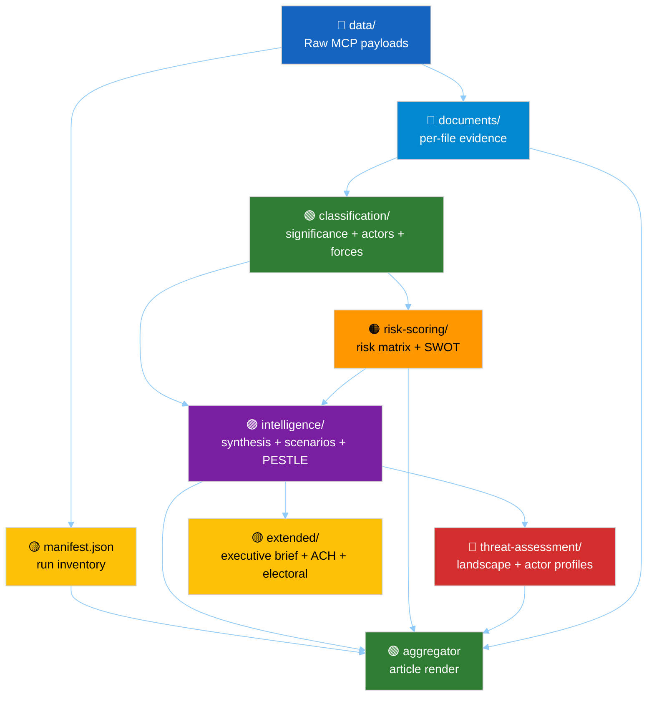
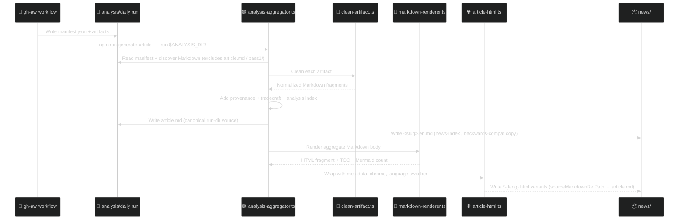

<!-- SPDX-FileCopyrightText: 2024-2026 Hack23 AB -->
<!-- SPDX-License-Identifier: Apache-2.0 -->

<p align="center">
  
</p>

<h1 align="center">📰 EU Parliament Monitor — Article Generation</h1>

<p align="center">
  <strong>How European Parliament analysis artifacts become Markdown sources, multilingual HTML articles, and deployed static-site assets</strong><br>
  <em>Agentic workflows · Political intelligence methodologies · Aggregator code · UI/UX · S3/CloudFront delivery</em>
</p>

<p align="center">
  <a href="#"></a>
  <a href="#"></a>
  <a href="#"></a>
  <a href="#"></a>
</p>

**📋 Document Owner:** CEO | **📄 Version:** 1.0 | **📅 Last Updated:** 2026-04-25 (UTC)
**🔄 Review Cycle:** Quarterly | **⏰ Next Review:** 2026-07-25 | **🏷️ Classification:** Public

---

## 🎯 Purpose

This document is the end-to-end reference for generating EU Parliament Monitor articles. It explains how an agentic workflow collects European Parliament data, produces structured political-intelligence artifacts under `analysis/daily/`, converts those artifacts into an aggregated Markdown source, renders 14 language-aware HTML variants, supports Mermaid / Chart.js / D3-enhanced UI, and deploys the resulting static site through AWS S3 + CloudFront.

The current production model is the **April 2026 aggregator-era pipeline**:

- AI agents write **analysis artifacts** in Markdown.
- TypeScript code renders those committed artifacts deterministically.
- There is **no AI-authored HTML step**.
- The canonical render command is `npm run generate-article -- --run <analysis-run-dir>`.
- Batch regeneration uses `npm run generate-article:all`.
- Each run also receives a committed `article.md` inside its analysis directory (see [§ article.md in the run directory](#-articlemd-in-the-run-directory)).

> **Primary example:** `analysis/daily/2026-04-24/breaking/article.md` → `news/2026-04-24-breaking-en.html` / `news/2026-04-24-breaking-sv.html` (14 language variants).

---

## 🗺️ End-to-End Article Pipeline

```mermaid
%%{init: {"theme":"dark","themeVariables":{"primaryColor":"#1565C0","primaryTextColor":"#ffffff","primaryBorderColor":"#0A3F7F","lineColor":"#90CAF9","secondaryColor":"#2E7D32","secondaryTextColor":"#ffffff","tertiaryColor":"#FF9800","tertiaryTextColor":"#000000","mainBkg":"#1565C0","secondBkg":"#2E7D32","tertiaryBkg":"#FF9800","noteBkgColor":"#FFC107","noteTextColor":"#000000","errorBkgColor":"#D32F2F","fontFamily":"Inter, Helvetica, Arial, sans-serif"}}}%%
flowchart LR
    A["🔵 Stage A<br/>EP MCP data collection"] --> B["🟣 Stage B<br/>AI political intelligence artifacts"]
    B --> C["🟡 Stage C<br/>Completeness + quality gate"]
    C --> D["🟢 Stage D<br/>Deterministic aggregator render"]
    D --> E["🔷 Generated Markdown<br/>news/*.en.md"]
    D --> F["🟢 Generated HTML<br/>news/*-{lang}.html"]
    F --> G["🟠 Derived indexes<br/>metadata + sitemap"]
    G --> H["🟢 S3 sync<br/>CloudFront invalidation"]

    style A fill:#1565C0,color:#ffffff
    style B fill:#7B1FA2,color:#ffffff
    style C fill:#FFC107,color:#000000
    style D fill:#2E7D32,color:#ffffff
    style E fill:#0288D1,color:#ffffff
    style F fill:#2E7D32,color:#ffffff
    style G fill:#FF9800,color:#000000
    style H fill:#2E7D32,color:#ffffff
```



### Semantic color key

| Color | Meaning in this document |
|---|---|
| 🔵 Blue `#1565C0` | Input, scope, MCP collection |
| 🟣 Purple `#7B1FA2` | Political-intelligence synthesis |
| 🟢 Green `#2E7D32` | Approved, deterministic, deployable output |
| 🟠 Orange `#FF9800` | Risk, operational caution, generated indexes |
| 🔴 Red `#D32F2F` | Threat, rejection, missing-gate condition |
| 🟡 Yellow `#FFC107` | Gate, note, metadata, pending state |
| 🔷 Light-blue `#0288D1` | Reference, source Markdown, read-only artifact |

---

## 🧩 Business Value and Political-Analysis Object

| Dimension | What article generation delivers |
|---|---|
| Democratic transparency | Converts public European Parliament data into readable, sourced intelligence products for citizens across 14 languages. |
| Political accountability | Preserves traceability from public article sections back to `analysis/daily/<date>/<type>/` artifacts, raw MCP payloads, and `manifest.json`. |
| Editorial quality | Forces agents to use structured methodologies, confidence levels, source grading, WEP probability bands, and Pass-2 readback before publication. |
| Operational resilience | Separates AI-authored analysis from deterministic HTML rendering, reducing template-prose leaks and making articles reproducible. |
| Public distribution | Publishes static HTML through S3 + CloudFront with short HTML cache and long immutable asset cache. |

The political-analysis object is not a single blob of prose. It is a **run directory**:

```text
analysis/daily/<YYYY-MM-DD>/<article-type>/
├── manifest.json
├── data/                         # raw EP MCP / IMF / WB payloads
├── intelligence/                 # synthesis, forecast, stakeholders, threat model, etc.
├── classification/               # significance, actors, forces, impact matrix
├── risk-scoring/                 # risk matrix and quantitative SWOT
├── threat-assessment/            # optional expanded threat artifacts
├── documents/                    # document index and per-file intelligence
├── existing/                     # legacy long-form artifacts when present
└── extended/                     # optional executive brief, ACH, electoral, etc.
```

The article is a deterministic view over this object.

---

## 🤖 Agentic Workflow Coverage

### Source workflows

The article-generating workflows are Markdown gh-aw workflows under `.github/workflows/` and are compiled to `.lock.yml` files. This table reflects the **current repository files**: one source workflow per article type plus the translation helper. Some older or external documentation may describe split analysis/article pairs; those paired workflow files are not present in the current tree.

| Workflow | Article type slug | Purpose |
|---|---|---|
| `.github/workflows/news-breaking.md` | `breaking` | Rapid coverage of recent EP developments. |
| `.github/workflows/news-week-in-review.md` | `week-in-review` | Weekly retrospective intelligence. |
| `.github/workflows/news-month-in-review.md` | `month-in-review` | Monthly retrospective intelligence. |
| `.github/workflows/news-week-ahead.md` | `week-ahead` | Forward calendar and risk outlook. |
| `.github/workflows/news-month-ahead.md` | `month-ahead` | Monthly forward outlook. |
| `.github/workflows/news-committee-reports.md` | `committee-reports` | Committee activity and legislative-production analysis. |
| `.github/workflows/news-motions.md` | `motions` | Motions, resolutions, urgency files, political signals. |
| `.github/workflows/news-propositions.md` | `propositions` | Legislative proposals and pipeline analysis. |
| `.github/workflows/news-translate.md` | translation helper | Flushes or updates 14-language variants. |

All article workflows follow the same high-level contract:

1. **Stage A — Data collection:** source `scripts/mcp-setup.sh`, collect EP MCP feed data and direct endpoint fallbacks, persist raw payloads under `data/`.
2. **Stage B — Analysis:** write artifacts in at least two passes using the methodology and template libraries.
3. **Stage C — Completeness gate:** verify mandatory artifacts, line floors, confidence labels, evidence citations, and absence of placeholder markers.
4. **Stage D — Article render:** run `npm run generate-article -- --run "$ANALYSIS_DIR"`.
5. **Stage E — Single PR:** create exactly one safe-output PR with analysis and generated news files.

### Workflow frontmatter and runtime features

Each workflow declares the operational envelope used by gh-aw:

| Concern | Current pattern |
|---|---|
| Runtime | Node.js 25. |
| MCP gateway | `features.mcp-gateway: true`, sandbox MCP port `8080`. |
| Network allowlist | GitHub, EP data domains, IMF data services, World Bank, Hack23 sites, project domains, defaults. |
| Safe output | `create-pull-request.max: 1` for article workflows. |
| Build setup | `npm ci`, `npm run build`, `npm run copy-vendor`. |
| Render command | `npm run generate-article -- --run "$ANALYSIS_DIR"`. |
| Vendor assets | Chart.js, Chart.js annotation plugin, D3, and Mermaid vendor bundle copied to `js/vendor/`. |

---

## 📚 Prompt Library and Stage Contract

The prompt library under `.github/prompts/` defines the bounded contexts each workflow reads.

| Prompt | Role in generation |
|---|---|
| `00-scope-and-ground-rules.md` | Workspace scope, neutrality, forbidden edits, one-PR rule. |
| `01-data-collection.md` | EP MCP feeds, direct fallbacks, raw data persistence, IMF/WB context. |
| `02-analysis-protocol.md` | Stage-B artifact production and mandatory two-pass analysis. |
| `03-analysis-completeness-gate.md` | Stage-C gate and refusal conditions. |
| `04-article-generation.md` | Stage-D deterministic aggregation and metadata/title contract. |
| `05-analysis-to-article-contract.md` | Division of responsibility: AI writes artifacts, aggregator renders. |
| `06-pr-and-safe-outputs.md` | Single-PR rule and safe-output semantics. |
| `07-mcp-reference.md` | EP MCP, IMF, and World Bank tool reference. |
| `08-infrastructure.md` | MCP gateway, workflow frontmatter, folder layout. |
| `09-troubleshooting.md` | Firewall, MCP, render, and PR failure diagnostics. |

The most important Stage-D rule is: **agents do not author article prose in Stage D**. They complete analysis in Stage B/C; Stage D only renders what is already committed in Markdown.

### SEO metadata contract

The public `<title>`, `<meta name="description">`, Open Graph / Twitter card
fields, JSON-LD headline/description, news indexes, RSS, and sitemap metadata
all inherit from the same resolved article metadata. Stage-B agents therefore
set SEO quality before rendering:

1. Prefer `manifest.title` and `manifest.description` when the synthesis has a
   clear editorial highlight.
2. Keep titles ≤70 characters, active, specific, and actor-led.
3. Keep descriptions 150–160 characters, consequence-led, and distinct from the
   lede.
4. Put search-intent terms in human prose and headings: committee acronyms,
   procedure titles, policy areas, institutions, and named stakeholders.
5. Never publish date/type boilerplate such as "EU Parliament Breaking —
   YYYY-MM-DD" unless no article is rendered.
6. For economic stories, use IMF-backed wording only when
   `intelligence/economic-context.md` contains IMF vintage, SDMX code, and policy
   bridge evidence.

---

## 🧠 Methodologies That Shape the Article

The article inherits its political meaning from the methodology library under `analysis/methodologies/`.

| Methodology | Function in article generation |
|---|---|
| `ai-driven-analysis-guide.md` | Ten-step protocol: prepare scope, read methods, collect data, classify, score risk, model threats, synthesize, choose metadata, Pass 2, validate. |
| `artifact-catalog.md` | Master map of every artifact, methodology, template, depth floor, Mermaid requirement, and MCP source. |
| `per-artifact-methodologies.md` | Construction rules for every artifact: purpose, inputs, required sections, Mermaid, quality signals. |
| `osint-tradecraft-standards.md` | ICD 203 standards, Admiralty grades, WEP bands, SAT catalog, OSINT ethics. |
| `political-classification-guide.md` | 7-dimension classification and urgency / policy-domain taxonomy. |
| `political-risk-methodology.md` | 5×5 likelihood × impact scoring, risk tiers, risk-to-SWOT integration. |
| `political-swot-framework.md` | Evidence-based SWOT and TOWS rules. |
| `political-threat-framework.md` | Political Threat Landscape 6D + Attack Trees + Political Kill Chain + Diamond Model + ICO Profiling; STRIDE is explicitly rejected for political analysis. |
| `political-style-guide.md` | Evidence density, official EP vocabulary, confidence notation, Economist-style analytic paragraphs. |
| `synthesis-methodology.md` | Stage-B.7 significance scoring, synthesis summary, stakeholder perspectives, coalition dynamics, executive brief. |
| `strategic-extensions-methodology.md` | Scenario forecasts, ACH, comparative context, intelligence assessment, methodology reflection. |
| `per-document-methodology.md` | Atomic document analysis for individual EP documents. |
| `structural-metadata-methodology.md` | Provenance, `manifest.json`, cross-reference maps, data-download manifests. |
| `electoral-domain-methodology.md` | EP10/EP11 electoral context, coalition mathematics, voter segmentation. |
| `reference-quality-thresholds.json` | Per-artifact line-count floors and tradecraft-quality signals used by Stage-C review. |

### Artifact families



---

## 🧾 Templates and Artifact-to-Article Mapping

The template index is `analysis/templates/README.md`. It describes the structured Markdown templates that agents fill with actual EP evidence. Templates are not rendered directly; completed artifacts are.

The aggregator maps artifact paths to rendered article sections via `src/aggregator/artifact-order.ts`:

| Rendered article section | Primary artifact inputs |
|---|---|
| Executive Brief | `extended/executive-brief.md` |
| Synthesis Summary | `intelligence/synthesis-summary.md` |
| Significance | `classification/significance-classification.md`, `intelligence/significance-scoring.md` |
| Actors & Forces | `classification/actor-mapping.md`, `classification/forces-analysis.md`, `classification/impact-matrix.md` |
| Coalitions & Voting | `intelligence/coalition-dynamics.md`, `intelligence/voting-patterns.md`, `existing/voting-patterns.md` |
| Stakeholder Map | `intelligence/stakeholder-map.md`, `existing/stakeholder-impact.md` |
| PESTLE & Context | `intelligence/pestle-analysis.md`, `intelligence/historical-baseline.md` |
| Economic Context | `intelligence/economic-context.md` |
| Risk Assessment | `risk-scoring/risk-matrix.md`, `risk-scoring/quantitative-swot.md`, political capital / velocity risk files |
| Threat Landscape | `intelligence/political-threat-landscape.md`, `intelligence/threat-model.md`, all `threat-assessment/*.md` |
| Scenarios & Wildcards | `intelligence/scenario-forecast.md`, `intelligence/wildcards-blackswans.md` |
| Cross-Run Continuity | `intelligence/cross-run-diff.md`, cross-session and baseline files |
| Deep Analysis | `existing/deep-analysis.md` |
| Document Analysis | `documents/document-analysis-index.md`, `documents/**/*.md` |
| Extended Intelligence | all remaining `extended/*.md` |
| MCP Reliability Audit | `intelligence/mcp-reliability-audit.md` |
| Analytical Quality & Reflection | `intelligence/reference-analysis-quality.md`, `intelligence/workflow-audit.md`, `intelligence/methodology-reflection.md` |
| Supplementary Intelligence | Any discovered Markdown not consumed by a canonical section. |
| Tradecraft References | Auto-generated appendix linking methodology and template files. |
| Analysis Index | Auto-generated appendix listing every included artifact and source path. |

Because `aggregateAnalysisRun()` merges manifest-declared files with discovered Markdown, any extra Markdown in a valid run directory can still be rendered. For current examples such as `analysis/daily/2026-04-24/motions/`, extra Markdown that is not claimed by a canonical section lands under **Supplementary Intelligence** unless `artifact-order.ts` claims it explicitly.

---

## 🧱 TypeScript Code Used for Generation

| File | Responsibility |
|---|---|
| `src/aggregator/article-generator.ts` | CLI entry point; parses flags; runs aggregation; resolves metadata; writes `article.md` to the run directory AND `news/<slug>.en.md`; renders 14 HTML variants; passes `isBasedOn` source artifact URLs to the HTML chrome. |
| `src/aggregator/analysis-aggregator.ts` | Reads run directory and `manifest.json`; flattens manifest files; discovers additional Markdown (excluding `article.md`, translated variants, `README.md`, and `pass1/`); orders sections; adds provenance, tradecraft, and analysis-index appendices. Exports `guessDateFromRunDir` for testability. |
| `src/aggregator/artifact-order.ts` | Defines the canonical section order and artifact path claims. |
| `src/aggregator/clean-artifact.ts` | Strips front matter, banners, H1s, SPDX tags, artifact-metadata preambles (`**Run:**`, `**Window:**`, etc.), demotes headings, rewrites links, deduplicates Mermaid bodies. |
| `src/aggregator/markdown-renderer.ts` | Configures `markdown-it`, headings, footnotes, attrs, definition lists, table wrappers, and Mermaid fence rendering. |
| `src/aggregator/article-html.ts` | Wraps rendered body in full HTML5 document, metadata, JSON-LD (with `isBasedOn` provenance list), hreflang links, header, language switcher, TOC, footer, theme toggle. |
| `src/aggregator/article-metadata.ts` | Resolves title and description through the 5-tier editorial-highlight ladder. |
| `src/mcp/ep-mcp-client.ts` | TypeScript wrappers for 60+ European Parliament MCP tools, with fallback payloads and error classification. |
| `scripts/mcp-setup.sh` | Sourceable gateway configuration for EP MCP, World Bank MCP, and IMF REST base URL. |
| `scripts/generators/news-indexes.js` | Generates news indexes and article metadata during `npm run prebuild`. |
| `scripts/generators/sitemap.js` | Generates sitemap and related metadata during prebuild/deploy. |

### CLI contract

```bash
# Single-run render: article.md in run dir + source Markdown in news/ + all 14 HTML variants
npm run generate-article -- --run analysis/daily/2026-04-24/propositions

# Single-run render for selected languages
npm run generate-article -- --run analysis/daily/2026-04-24/propositions --lang en --lang sv

# Batch regeneration of every valid analysis run (backport / rebuild all article.md files)
npm run generate-article:all

# Batch regeneration from a date lower bound
npm run generate-article -- --all --since 2026-04-24

# Markdown-only source generation
npm run generate-article -- --run analysis/daily/2026-04-24/propositions --markdown-only
```

### Generated file naming

| Input | Output |
|---|---|
| `analysis/daily/2026-04-24/propositions/manifest.json` with `articleType: propositions` | **`analysis/daily/2026-04-24/propositions/article.md`** (canonical run-dir source) |
| Same run | `news/2026-04-24-propositions.en.md` (backwards-compat / news-index copy) |
| Same run, English | `news/2026-04-24-propositions-en.html` |
| Same run, Swedish | `news/2026-04-24-propositions-sv.html` |
| Same run, Arabic | `news/2026-04-24-propositions-ar.html` with RTL direction from language constants. |
| `manifest.json` with `articleType: motions-runmotions-run-1777010709` | `analysis/daily/2026-04-24/motions-runmotions-run-1777010709/article.md` + `news/2026-04-24-motions-runmotions-run-1777010709.en.md` |
| Batch collision during `--all` where two runs would otherwise produce the same slug | Sanitized extra suffix appended to the already-derived `YYYY-MM-DD-<manifest.articleType>` stem. |

The generator builds the base slug from the manifest value as-is: `YYYY-MM-DD-<manifest.articleType>`. In other words, if `manifest.articleType` already contains a run-like suffix, that suffix will already appear in the output filename stem before any collision handling happens.

The additional sanitized suffix is only a collision-avoidance step for batch generation (`--all`) when multiple runs would otherwise write the same output path.

To keep filenames predictable, prefer keeping `manifest.articleType` to the canonical article-type set (for example `breaking`, `week-in-review`, `month-in-review`, `week-ahead`, `month-ahead`, `committee-reports`, `motions`, `propositions`) and place per-run uniqueness in `runId` instead.

### 📄 `article.md` in the run directory

Each `npm run generate-article` invocation writes `article.md` directly into the analysis run directory alongside the artifacts that produced it:

```
analysis/daily/2026-04-24/breaking/
├── manifest.json
├── intelligence/
│   ├── synthesis-summary.md
│   └── ...
├── ...
└── article.md          ← canonical aggregated Markdown (generated by the aggregator)
```

**Why `article.md` lives in the run directory:**
- The Markdown source and the artifacts that produced it are co-located — readers can browse `analysis/daily/<date>/<type>/` on GitHub and immediately see both the evidence and the derived article.
- The HTML "View source Markdown" link points to `analysis/daily/<date>/<type>/article.md` on the deployed site, giving a clear provenance trail from the public HTML back to the intelligence tree.
- `npm run generate-article:all` regenerates every `article.md` across all historical runs in a single deterministic pass, making bulk rebuilds and backports straightforward.

**Aggregator exclusion:** `collectRunArtifacts()` in `analysis-aggregator.ts` skips `article.md` and any per-language translated variants (e.g. `article.sv.md`) so the aggregator never recurses into its own output on subsequent runs. The `pass1/` snapshot directory is also excluded.

---

## 🔁 How Analysis Becomes HTML



### Cleaning and normalization

Before Markdown is rendered, each artifact is normalized so the final article remains coherent (`clean-artifact.ts` applies passes in order):

1. **YAML front matter** stripped — `---\n…\n---\n` at position 0.
2. **SPDX tag lines** stripped — `SPDX-License-Identifier` / `SPDX-FileCopyrightText` lines removed before rendering to prevent REUSE scanner breakage.
3. **Logo banners, owner metadata, shield rows** stripped — `<p align="center">`, `shields.io` badges, `**📋 Document Owner:**` etc.
4. **Artifact H1 headings** removed; **H2+ headings demoted one level** (H2→H3, H3→H4, …).
5. **Artifact metadata preamble** stripped — after H1 removal, agent-operational header lines like `**Run:** breaking-run-…`, `**Window:** …`, `**Methodology:** …`, `**Scope:** …`, `**Gate target:** …` followed by a `---` separator are removed. These are internal run metadata, not reader-relevant content.
6. **Relative links and images** rewritten to absolute GitHub blob/raw URLs for portability and auditability.
7. **Duplicate Mermaid blocks** replaced by cross-reference HTML comments.

Additionally, `collectRunArtifacts()` skips:
- `data/`, `runs/`, `pass1/` directories (raw payloads, legacy snapshots, Pass-1 work-in-progress)
- `article.md` and `article.<lang>.md` (generated outputs — prevents aggregator recursing into itself)
- `README.md` (case-insensitive) — required for the analysis gate but not for the published article

### Markdown rendering

`markdown-renderer.ts` uses:

- `markdown-it`
- `markdown-it-anchor`
- `markdown-it-footnote`
- `markdown-it-attrs` with only `id` and `class` allowed
- `markdown-it-deflist`
- a Mermaid fence override that emits accessible `<figure class="mermaid-figure" role="img">` and `<pre class="mermaid">` blocks
- table wrappers: `<div class="table-scroll" role="region" tabindex="0">`

### HTML wrapper

`article-html.ts` emits:

- `<!DOCTYPE html>` with `lang` and `dir`.
- security metadata (`X-Content-Type-Options`, `referrer`).
- canonical URL and 14 `hreflang` alternates plus `x-default`.
- Open Graph and Twitter card metadata.
- JSON-LD `NewsArticle` with `isBasedOn` listing every source artifact URL (provenance traceability).
- shared stylesheet `../styles.css`.
- vendored Mermaid bundle and Mermaid init script reference.
- skip link, sticky header, brand logo, theme toggle, language switcher, article TOC, source Markdown link, article body, and shared footer.

---

## 🧭 Metadata Resolution

The article title and description are resolved by `src/aggregator/article-metadata.ts`:

1. `manifest.title` / `manifest.description` string or per-language object.
2. First non-generic artifact H1 in manifest order.
3. Aggregated Markdown H1.
4. First strong prose paragraph, with filters for banners, Mermaid directives, `Run:`, `Purpose:`, `BLUF`, etc.
5. Localized article-type templates.

**Best practice:** Stage-B agents should write concise editorial metadata into `manifest.json` whenever the run has a clear political highlight. Without manifest overrides, fallback metadata may be technically correct but less editorially attractive, as seen in some 2026-04-24 generated examples where a long WEP judgment becomes the `<title>`.

---

## 🌍 Multi-Language Output and Language Switchers

The platform supports 14 languages: `en`, `sv`, `da`, `no`, `fi`, `de`, `fr`, `es`, `nl`, `ar`, `he`, `ja`, `ko`, `zh`.

`article-html.ts` builds:

- language-specific filenames: `news/<slug>-<lang>.html`;
- `hreflang` alternates for every language;
- `x-default` pointing to English;
- a header-embedded language switcher using `.site-header__langs` and `.lang-link`;
- active language state with `aria-current="page"`;
- `dir="rtl"` for RTL languages via `getTextDirection()`.

The visible switcher appears in the sticky header, not as a separate standalone bar:

```html
<nav class="site-header__langs" role="navigation" aria-label="Language selection">
  <a href="2026-04-24-propositions-en.html" class="lang-link active" hreflang="en" lang="en" aria-current="page">🇬🇧 EN</a>
  <a href="2026-04-24-propositions-sv.html" class="lang-link" hreflang="sv" lang="sv">🇸🇪 SV</a>
</nav>
```

---

## 🎨 UI/UX Support: Markdown, Mermaid, D3, Chart.js

### Mermaid

Analysis artifacts require color-coded Mermaid diagrams. The Markdown renderer converts `mermaid` fences into accessible figures and article HTML loads Mermaid assets:

| Layer | Support |
|---|---|
| Artifact authoring | Methodologies require `flowchart`, `quadrantChart`, `mindmap`, `timeline`, `pie`, `xyChart`, or `graph` diagrams depending on artifact type. |
| Renderer | `markdown-renderer.ts` emits `<figure class="mermaid-figure" role="img" aria-label="Mermaid diagram N">`. |
| HTML shell | `article-html.ts` references `../js/vendor/mermaid.esm.min.mjs` and `../js/mermaid-init.js`. |
| Vendor copy | `npm run copy-vendor` copies Mermaid ESM when available in `node_modules/mermaid/dist/`. |
| Operational note | Ensure `js/mermaid-init.js` is present in published assets when relying on client-side Mermaid hydration; without it, diagrams remain readable as `<pre class="mermaid">` source. |

### Chart.js

**Current article-shell status:** Chart.js hydration is currently **not enabled for generated article pages**. The present `src/aggregator/article-html.ts` shell loads Mermaid and the theme-toggle script, but does **not** load `js/vendor/chart.umd.min.js`, `js/vendor/chartjs-plugin-annotation.min.js`, or `js/chart-init.js`. As a result, article pages must rely on semantic fallback content unless the article wrapper is extended to include those assets in a future change.

On pages that do opt into Chart.js hydration (for example the index and other non-article pages), `js/chart-init.js` hydrates canvases with `data-chart-config` and:

- uses `js/vendor/chart.umd.min.js` and `js/vendor/chartjs-plugin-annotation.min.js`;
- applies EU Parliament palette defaults;
- adapts grid and tick colors to light/dark mode;
- assigns dataset colors when omitted;
- preserves semantic fallback content for environments where scripts are unavailable or fail.

Expected progressive-enhancement markup shape:

```html
<canvas data-chart-config="{&quot;type&quot;:&quot;bar&quot;,&quot;data&quot;:{...}}"></canvas>
<noscript>Accessible fallback table or summary.</noscript>
```

### D3

`js/d3-init.js` progressively enhances semantic structures:

| Selector | Enhancement |
|---|---|
| `.mindmap-container` | D3 treemap over semantic mindmap content. |
| `.intelligence-map` | Force-directed intelligence network. |
| `.swot-matrix` | Proportional SWOT quadrant enhancement. |

D3 is additive. The semantic HTML remains the accessible source of truth.

---

## 🌓 CSS: Light Mode, Dark Mode, Article Chrome

The shared stylesheet is `styles.css`.

### Design tokens

`:root` defines the base design system:

- brand tokens: `--primary`, `--primary-dark`, `--secondary`, `--accent`;
- text and surface tokens: `--text`, `--text-secondary`, `--bg`, `--bg-card`, `--border`;
- status tokens: `--success`, `--warning`, `--danger`;
- layout tokens: `--radius-*`, `--shadow-*`, `--max-width`;
- article tokens: `--article-line-height`, `--article-paragraph-spacing`;
- political group tokens: `--group-epp`, `--group-sd`, `--group-re`, `--group-greens`, `--group-ecr`, `--group-id`, `--group-left`.

### Dark mode

Dark mode is supported in two ways:

1. system preference via `@media (prefers-color-scheme: dark)` when no explicit `data-theme="light"` is set;
2. manual theme via `html[data-theme='dark']`.

The theme toggle is emitted by `createThemeToggleButton()` and persisted by the theme script / runtime through `localStorage` key `ep-theme`.

### Header and language switcher

`article-html.ts` emits a stacked header using:

- `.site-header`
- `.site-header__inner--stacked`
- `.site-header__brand`
- `.site-header__logo-picture`
- `.site-header__langs`
- `.lang-link` and `.lang-link.active`

The header is sticky, keyboard-accessible, and responsive.

### Article body and TOC

The article shell includes:

- `.article-main`
- `.article-toc-container`
- `.article-toc-details`
- `.article-toc-summary`
- `.article-toc-list`
- `.article-body`
- `.article-source-md`
- `.table-scroll`
- `.artifact-source`

The TOC is derived from canonical H2 sections emitted by `analysis-aggregator.ts`; it is not manually authored.

### Footer

`article-html.ts` calls `buildSiteFooter()` with language and path prefix. When `articleCount` is available, the footer can include article-count stats derived from `discoverAnalysisRuns()`.

---

## 📦 Generated Files and Deployment

### Files generated during article rendering

| Generator | Files |
|---|---|
| `npm run generate-article -- --run <dir>` | `news/<slug>.en.md` and `news/<slug>-<lang>.html` for each language. |
| `npm run generate-article:all` | Regenerates all valid analysis runs under `analysis/daily/**/manifest.json`. |
| `npm run prebuild` | Runs news indexes and sitemap generation before build/deploy. |
| `npm run copy-vendor` | Copies Chart.js, Chart.js annotation plugin, D3, and Mermaid vendor assets to `js/vendor/`. |

### Deployment workflow

The repository uses `.github/workflows/deploy-s3.yml`. It deploys on `push` to `main` and `workflow_dispatch`.

Key properties:

| Area | Value |
|---|---|
| AWS region | `us-east-1` |
| S3 bucket | `euparliamentmonitor-frontend-us-east-1-172017021075` |
| CloudFront stack | `euparliamentmonitor-frontend` |
| Auth | GitHub OIDC via `aws-actions/configure-aws-credentials` and role `GithubWorkFlowRole`. |
| Runner hardening | `step-security/harden-runner` with block egress and explicit endpoint allowlist. |
| Pre-deploy generation | `npm ci`, `npm run prebuild`, remove `node_modules`. |
| Legacy compatibility | Normalizes CSP in legacy `news/*.html` files before sync. |
| Final step | CloudFront distribution discovery and `aws cloudfront create-invalidation --paths "/*"`. |

### S3 sync categories and cache policy

| File class | Sync rule | Cache policy | Content type |
|---|---|---|---|
| HTML | `--include '*.html'` | `public, max-age=3600, must-revalidate` | `text/html; charset=utf-8` |
| CSS | `--include '*.css'` | `public, max-age=31536000, immutable` | `text/css; charset=utf-8` |
| JS | `--include '*.js'`, excluding `*.config.js` | `public, max-age=31536000, immutable` | `text/javascript; charset=utf-8` |
| SVG | `--include '*.svg'` | `public, max-age=31536000, immutable` | `image/svg+xml` |
| Raster images | `*.webp`, `*.png`, `*.jpg`, `*.jpeg`, `*.gif`, `*.ico` | `public, max-age=31536000, immutable` | guessed |
| Fonts | `*.woff`, `*.woff2`, `*.ttf`, `*.eot`, `*.otf` | `public, max-age=31536000, immutable` | guessed |
| JSON | `--include '*.json'` excluding package/config files | `public, max-age=86400` | `application/json; charset=utf-8` |
| XML | `--include '*.xml'` | `public, max-age=86400` | `text/xml; charset=utf-8` |
| Text | `robots.txt`, `*.txt`, `.nojekyll` | `public, max-age=86400` | `text/plain; charset=utf-8` |
| Web manifest | `*.webmanifest` | `public, max-age=86400` | `application/manifest+json` |
| Remaining website files | catch-all sync | default | excludes source, config, Markdown, package files, tooling, tests, and workflow directories |

The deploy excludes source/tooling directories such as `.git/`, `.github/`, `src/`, `scripts/`, `test/`, `e2e/`, `node_modules/`, `schemas/`, `builds/`, `runbooks/`, and configuration files. Published output is a static website artifact set, not the full repository.

---

## 🔐 Security and Integrity Properties

| Control | Implementation |
|---|---|
| No AI-authored HTML | AI writes Markdown artifacts; TypeScript renders HTML deterministically. |
| Traceability | Each artifact fragment includes a source link to GitHub. |
| Source provenance | Generated Markdown begins with article type, run date, run id, gate result, analysis tree, and manifest link. |
| CSP-friendly scripts | Article runtime avoids inline executable blocks; charts/D3/Mermaid use local assets. |
| Sanitized structure | Markdown rendering uses explicit plugin configuration and artifact cleanup. |
| Static delivery | No server-side execution or database in published site. |
| Public-data boundary | EP MCP / IMF / World Bank public sources only; no private MEP profiling. |
| Supply chain | Node 25, pinned GitHub actions, S3 deploy via OIDC, SLSA/npm provenance elsewhere in release pipeline. |

---

## ✅ Operational Checklist for Article Generation

1. Confirm `analysis/daily/<date>/<type>/manifest.json` has a supported `articleType` and `files` object.
2. Confirm Stage-B artifacts are substantive, cited, and meet `reference-quality-thresholds.json` floors.
3. Prefer manifest `title` and `description` overrides for editorial-quality metadata.
4. Run `npm run build` after TypeScript changes; for documentation-only changes, no build is required unless related tests exist.
5. Render one run with `npm run generate-article -- --run <analysis-run-dir>`.
6. Inspect `news/<slug>.en.md` for provenance and artifact order.
7. Inspect `news/<slug>-en.html` for metadata, header, language switcher, TOC, source Markdown link, footer, and diagram rendering.
8. Run `npm run generate-news-indexes` and `npm run generate-sitemap` through `npm run prebuild` before deployment.
9. Deploy through `.github/workflows/deploy-s3.yml`, not by manually uploading files.
10. Verify CloudFront invalidation completes after S3 sync.

---

## 🧭 Current Example: 2026-04-24 Motions

Current repository example:

| File | Role |
|---|---|
| `analysis/daily/2026-04-24/motions/manifest.json` | Run inventory; lists intelligence artifacts and history. |
| `analysis/daily/2026-04-24/motions/intelligence/synthesis-summary.md` | Primary narrative synthesis. |
| `analysis/daily/2026-04-24/motions/intelligence/stakeholder-map.md` | Stakeholder lens. |
| `analysis/daily/2026-04-24/motions/intelligence/threat-model.md` | Threat analysis. |
| `news/2026-04-24-motions-runmotions-run-1777010709.en.md` | Aggregated English Markdown source generated by the aggregator. |
| `news/2026-04-24-motions-runmotions-run-1777010709-en.html` | Rendered English article. |

The example illustrates both the strength and the discipline required by the current pipeline: article body sections come directly from committed artifacts, while the HTML wrapper contributes metadata, structured data, navigation, language alternates, and shared UI chrome.

---

## 🚫 Anti-Patterns

- Do not hand-edit generated `news/*.html`; regenerate from `analysis/daily/**`.
- Do not create article prose in Stage D; write or improve Stage-B artifacts instead.
- Do not rely on template filler text; every artifact section must contain evidence-based analysis.
- Do not omit `manifest.json`; the aggregator relies on it for article type, date, files, and history.
- Do not use unsupported article types without updating type handling, workflows, prompts, thresholds, and documentation.
- Do not publish policy articles without `intelligence/economic-context.md` where economic context is required.
- Do not treat Mermaid / Chart.js / D3 visualizations as the sole source of meaning; always keep semantic Markdown/HTML fallback content.
