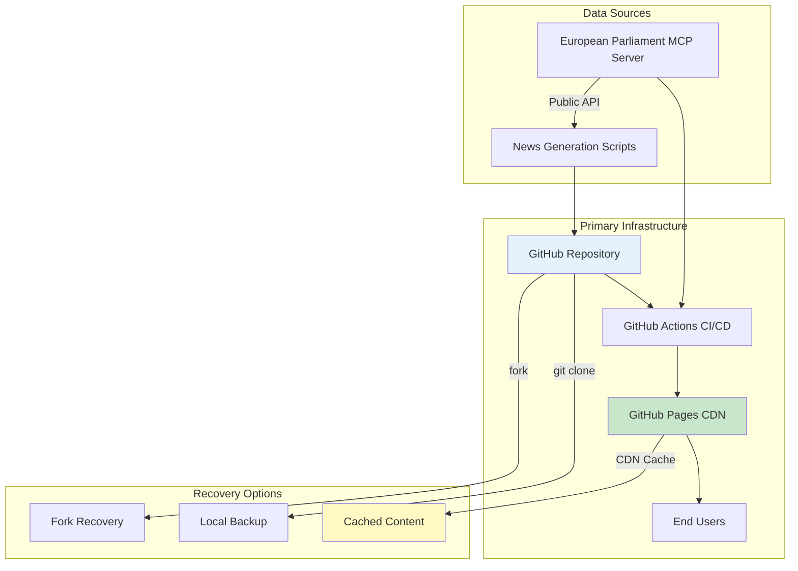

  

<h1 align="center">🔄 EU Parliament Monitor — Business Continuity Plan</h1>

  <strong>🛡️ Classification-Driven Business Resilience for European Parliament Intelligence</strong> 
  <em>🎯 Systematic Recovery Planning Through GitHub Pages Static Site Architecture</em>

  
  
  
  

**📋 Document Owner:** CEO | **📄 Version:** 1.0 | **📅 Last Updated:** 2026-02-20 (UTC)  
**🔄 Review Cycle:** Semi-Annual | **⏰ Next Review:** 2026-08-20

---

## 🎯 Purpose Statement

**EU Parliament Monitor's** business continuity framework demonstrates how **systematic recovery planning directly enables both operational resilience and democratic transparency excellence.** Our classification-driven continuity approach serves as both operational necessity and demonstration of enterprise-grade practices for an open-source European Parliament Intelligence Platform.

This plan ensures European Parliament monitoring and multi-language news generation can continue during and after disruptive events, based on the [Classification Framework](https://github.com/Hack23/ISMS-PUBLIC/blob/main/CLASSIFICATION.md) impact analysis and recovery requirements.

*— James Pether Sörling, CEO/Founder*

---

## 📊 Classification-Based Recovery Requirements

Based on [CLASSIFICATION.md](CLASSIFICATION.md) analysis:

| 🏷️ **Dimension** | 📊 **Level** | 📋 **Justification** |
|-------------------|-------------|----------------------|
| **Confidentiality** | 🟢 Public | All EP data is publicly available open data |
| **Integrity** | 🟡 Moderate | News content accuracy matters for democratic transparency |
| **Availability** | 🟡 Standard | Static site with CDN caching provides inherent resilience |

### ⏱️ Recovery Targets

| 🎯 **Metric** | 📊 **Target** | 📋 **Rationale** |
|---------------|--------------|-------------------|
| **RTO (Recovery Time Objective)** | 4 hours | GitHub Pages rebuild from repository |
| **RPO (Recovery Point Objective)** | 0 minutes | Git repository provides full history |
| **MTTR (Mean Time to Repair)** | 2 hours | Automated CI/CD pipeline rebuild |

---

## 🏗️ Architecture Resilience

### Static Site Architecture Advantages

EU Parliament Monitor's **static site architecture** (HTML5/CSS3 on GitHub Pages) provides inherent business continuity advantages:

| 🛡️ **Resilience Feature** | 📋 **Implementation** | ✅ **Status** |
|---------------------------|----------------------|--------------|
| **No Server Dependencies** | Pure static HTML/CSS/JS | ✅ Active |
| **Git-Based Backup** | Full history in distributed VCS | ✅ Active |
| **CDN Distribution** | GitHub Pages global CDN | ✅ Active |
| **Automated Rebuild** | GitHub Actions CI/CD pipeline | ✅ Active |
| **Multi-Language Content** | 14 EU languages pre-generated | ✅ Active |

---

## 🔄 Business Continuity Scenarios

### Scenario 1: GitHub Pages Outage

| 📋 **Aspect** | 📊 **Detail** |
|---------------|--------------|
| **Impact** | Site temporarily unavailable |
| **Probability** | Low (99.9% SLA) |
| **Recovery** | Automatic upon GitHub Pages restoration |
| **Mitigation** | CDN caching preserves recent content |

### Scenario 2: CI/CD Pipeline Failure

| 📋 **Aspect** | 📊 **Detail** |
|---------------|--------------|
| **Impact** | News generation paused |
| **Probability** | Medium |
| **Recovery** | Debug workflow, trigger manual rebuild |
| **Mitigation** | Existing content remains available |

### Scenario 3: European Parliament Data Source Unavailable

| 📋 **Aspect** | 📊 **Detail** |
|---------------|--------------|
| **Impact** | New content generation paused |
| **Probability** | Low |
| **Recovery** | Resume when EP API restored |
| **Mitigation** | Existing news articles remain accessible in all 14 languages |

### Scenario 4: Repository Corruption

| 📋 **Aspect** | 📊 **Detail** |
|---------------|--------------|
| **Impact** | Source code unavailable |
| **Probability** | Very Low |
| **Recovery** | Restore from forks, local clones, or GitHub support |
| **Mitigation** | Distributed Git provides multiple copies |

---

## 📋 Recovery Procedures

### Immediate Response (0-30 minutes)

1. ✅ Assess incident scope and impact
2. ✅ Notify stakeholders via GitHub Issues
3. ✅ Check GitHub Status page for platform issues
4. ✅ Verify repository integrity

### Short-Term Recovery (30 min - 4 hours)

1. ✅ If GitHub Pages: Wait for restoration or deploy to alternative
2. ✅ If CI/CD: Debug and fix workflow, trigger manual run
3. ✅ If Data Source: Existing content serves users, monitor EP API
4. ✅ If Repository: Restore from fork or local clone

### Full Recovery (4-24 hours)

1. ✅ Verify all 14 language versions are serving correctly
2. ✅ Run full test suite (`npm run lint && npm run test`)
3. ✅ Trigger news generation pipeline
4. ✅ Validate E2E tests pass
5. ✅ Document incident and lessons learned

---

## 🔗 Related Documentation

### 🔐 ISMS Policies
- [🛠️ Secure Development Policy](https://github.com/Hack23/ISMS-PUBLIC/blob/main/Secure_Development_Policy.md)
- [💾 Backup & Recovery Policy](https://github.com/Hack23/ISMS-PUBLIC/blob/main/Backup_Recovery_Policy.md)
- [🚨 Incident Response Plan](https://github.com/Hack23/ISMS-PUBLIC/blob/main/Incident_Response_Plan.md)
- [🏷️ Classification Framework](https://github.com/Hack23/ISMS-PUBLIC/blob/main/CLASSIFICATION.md)

### 🏛️ Project Documentation
- [🏛️ Architecture](ARCHITECTURE.md) — System design
- [🛡️ Security Architecture](SECURITY_ARCHITECTURE.md) — Security controls
- [🏷️ Classification](CLASSIFICATION.md) — CIA classification
- [📊 Data Model](DATA_MODEL.md) — Data structures
- [⚙️ Workflows](WORKFLOWS.md) — CI/CD documentation
- [🔮 Future Workflows](FUTURE_WORKFLOWS.md) — Planned enhancements
- [📦 End-of-Life Strategy](End-of-Life-Strategy.md) — Technology lifecycle
- [💰 Financial Security Plan](FinancialSecurityPlan.md) — Cost analysis

---

**📋 Document Control:**  
**✅ Approved by:** James Pether Sörling, CEO  
**📤 Distribution:** Public  
**🏷️ Classification:**     
**🎯 Framework Compliance:**   
