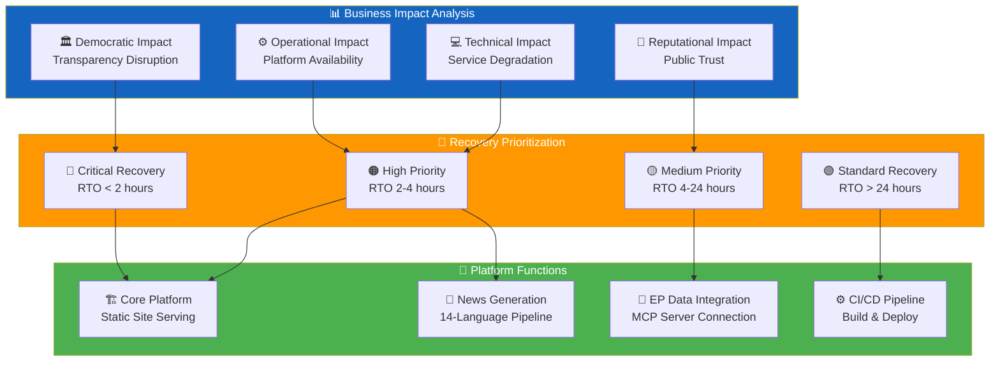
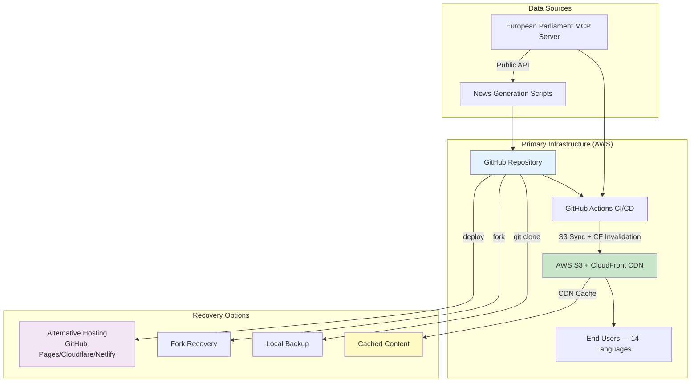
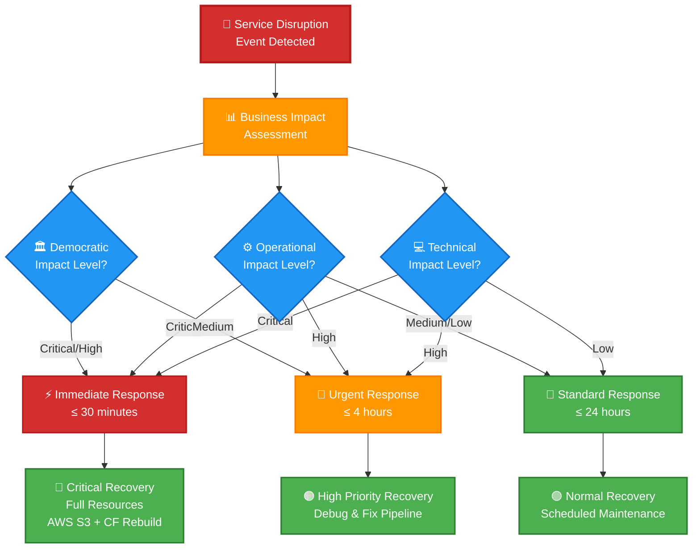
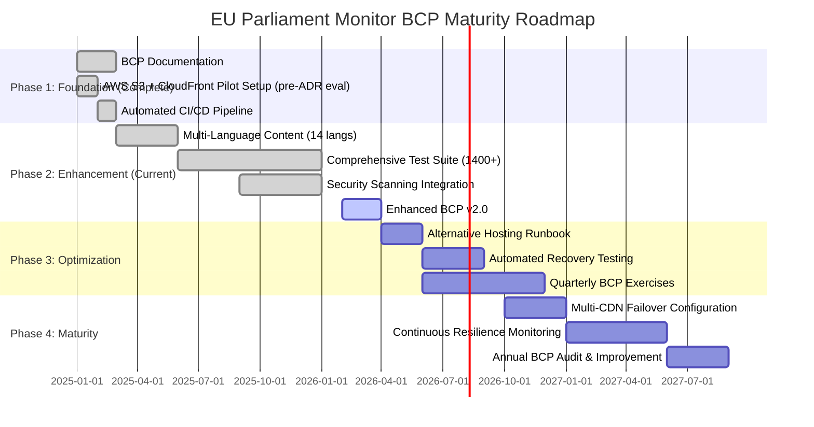

  

<h1 align="center">🔄 EU Parliament Monitor — Business Continuity Plan</h1>

  <strong>🛡️ Classification-Driven Business Resilience for European Parliament Intelligence</strong> 
  <em>🎯 Systematic Recovery Planning Through AWS S3 + CloudFront Static Site Architecture</em>

  
  
  
  

**📋 Document Owner:** CEO | **📄 Version:** 2.0 | **📅 Last Updated:** 2026-03-12 (UTC)  
**🔄 Review Cycle:** Semi-Annual | **⏰ Next Review:** 2026-09-12

---

## 📚 Architecture Documentation Map

| Document                                                            | Focus           | Description                                    | Documentation Link                                                                                     |
| ------------------------------------------------------------------- | --------------- | ---------------------------------------------- | ------------------------------------------------------------------------------------------------------ |
| **[Architecture](ARCHITECTURE.md)**                                 | 🏛️ Architecture | C4 model showing current system structure      | [View Source](https://github.com/Hack23/euparliamentmonitor/blob/main/ARCHITECTURE.md)                 |
| **[Future Architecture](FUTURE_ARCHITECTURE.md)**                   | 🏛️ Architecture | C4 model showing future system structure       | [View Source](https://github.com/Hack23/euparliamentmonitor/blob/main/FUTURE_ARCHITECTURE.md)          |
| **[Mindmaps](MINDMAP.md)**                                          | 🧠 Concept      | Current system component relationships         | [View Source](https://github.com/Hack23/euparliamentmonitor/blob/main/MINDMAP.md)                      |
| **[Future Mindmaps](FUTURE_MINDMAP.md)**                            | 🧠 Concept      | Future capability evolution                    | [View Source](https://github.com/Hack23/euparliamentmonitor/blob/main/FUTURE_MINDMAP.md)               |
| **[SWOT Analysis](SWOT.md)**                                        | 💼 Business     | Current strategic assessment                   | [View Source](https://github.com/Hack23/euparliamentmonitor/blob/main/SWOT.md)                         |
| **[Future SWOT Analysis](FUTURE_SWOT.md)**                          | 💼 Business     | Future strategic opportunities                 | [View Source](https://github.com/Hack23/euparliamentmonitor/blob/main/FUTURE_SWOT.md)                  |
| **[Data Model](DATA_MODEL.md)**                                     | 📊 Data         | Current data structures and relationships      | [View Source](https://github.com/Hack23/euparliamentmonitor/blob/main/DATA_MODEL.md)                   |
| **[Future Data Model](FUTURE_DATA_MODEL.md)**                       | 📊 Data         | Enhanced European Parliament data architecture | [View Source](https://github.com/Hack23/euparliamentmonitor/blob/main/FUTURE_DATA_MODEL.md)            |
| **[Flowcharts](FLOWCHART.md)**                                      | 🔄 Process      | Current data processing workflows              | [View Source](https://github.com/Hack23/euparliamentmonitor/blob/main/FLOWCHART.md)                    |
| **[Future Flowcharts](FUTURE_FLOWCHART.md)**                        | 🔄 Process      | Enhanced AI-driven workflows                   | [View Source](https://github.com/Hack23/euparliamentmonitor/blob/main/FUTURE_FLOWCHART.md)             |
| **[State Diagrams](STATEDIAGRAM.md)**                               | 🔄 Behavior     | Current system state transitions               | [View Source](https://github.com/Hack23/euparliamentmonitor/blob/main/STATEDIAGRAM.md)                 |
| **[Future State Diagrams](FUTURE_STATEDIAGRAM.md)**                 | 🔄 Behavior     | Enhanced adaptive state transitions            | [View Source](https://github.com/Hack23/euparliamentmonitor/blob/main/FUTURE_STATEDIAGRAM.md)          |
| **[Security Architecture](SECURITY_ARCHITECTURE.md)**               | 🛡️ Security     | Current security implementation                | [View Source](https://github.com/Hack23/euparliamentmonitor/blob/main/SECURITY_ARCHITECTURE.md)        |
| **[Future Security Architecture](FUTURE_SECURITY_ARCHITECTURE.md)** | 🛡️ Security     | Security enhancement roadmap                   | [View Source](https://github.com/Hack23/euparliamentmonitor/blob/main/FUTURE_SECURITY_ARCHITECTURE.md) |
| **[Threat Model](THREAT_MODEL.md)**                                 | 🎯 Security     | STRIDE threat analysis                         | [View Source](https://github.com/Hack23/euparliamentmonitor/blob/main/THREAT_MODEL.md)                 |
| **[Classification](CLASSIFICATION.md)**                             | 🏷️ Governance   | CIA classification & BCP                       | [View Source](https://github.com/Hack23/euparliamentmonitor/blob/main/CLASSIFICATION.md)               |
| **[CRA Assessment](CRA-ASSESSMENT.md)**                             | 🛡️ Compliance   | Cyber Resilience Act                           | [View Source](https://github.com/Hack23/euparliamentmonitor/blob/main/CRA-ASSESSMENT.md)               |
| **[Workflows](WORKFLOWS.md)**                                       | ⚙️ DevOps       | CI/CD documentation                            | [View Source](https://github.com/Hack23/euparliamentmonitor/blob/main/WORKFLOWS.md)                    |
| **[Future Workflows](FUTURE_WORKFLOWS.md)**                         | 🚀 DevOps       | Planned CI/CD enhancements                     | [View Source](https://github.com/Hack23/euparliamentmonitor/blob/main/FUTURE_WORKFLOWS.md)             |
| **[Business Continuity Plan](BCPPlan.md)**                          | 🔄 Resilience   | Recovery planning                              | [View Source](https://github.com/Hack23/euparliamentmonitor/blob/main/BCPPlan.md)                      |
| **[Financial Security Plan](FinancialSecurityPlan.md)**             | 💰 Financial    | Cost & security analysis                       | [View Source](https://github.com/Hack23/euparliamentmonitor/blob/main/FinancialSecurityPlan.md)        |
| **[End-of-Life Strategy](End-of-Life-Strategy.md)**                 | 📦 Lifecycle    | Technology EOL planning                        | [View Source](https://github.com/Hack23/euparliamentmonitor/blob/main/End-of-Life-Strategy.md)         |
| **[Unit Test Plan](UnitTestPlan.md)**                               | 🧪 Testing      | Unit testing strategy                          | [View Source](https://github.com/Hack23/euparliamentmonitor/blob/main/UnitTestPlan.md)                 |
| **[E2E Test Plan](E2ETestPlan.md)**                                 | 🔍 Testing      | End-to-end testing                             | [View Source](https://github.com/Hack23/euparliamentmonitor/blob/main/E2ETestPlan.md)                  |
| **[Performance Testing](performance-testing.md)**                   | ⚡ Performance  | Performance benchmarks                         | [View Source](https://github.com/Hack23/euparliamentmonitor/blob/main/performance-testing.md)          |
| **[Security Policy](SECURITY.md)**                                  | 🔒 Security     | Vulnerability reporting & security policy      | [View Source](https://github.com/Hack23/euparliamentmonitor/blob/main/SECURITY.md)                     |

---

## 🎯 Purpose Statement

**EU Parliament Monitor's** business continuity framework demonstrates how **systematic recovery planning directly enables both operational resilience and democratic transparency excellence.** Our classification-driven continuity approach serves as both operational necessity and demonstration of enterprise-grade practices for an open-source European Parliament Intelligence Platform.

This plan ensures European Parliament monitoring and multi-language news generation (14 languages) can continue during and after disruptive events, based on the [Classification Framework](https://github.com/Hack23/ISMS-PUBLIC/blob/main/CLASSIFICATION.md) impact analysis and recovery requirements.

*— James Pether Sörling, CEO/Founder*

---

## 📊 Business Impact-Driven Recovery Framework

### 🎯 Business Impact Analysis Integration

Our business continuity planning is directly driven by the [Classification Framework](https://github.com/Hack23/ISMS-PUBLIC/blob/main/CLASSIFICATION.md) business impact analysis matrix:

```mermaid
graph TB
    subgraph BIA["📊 Business Impact Analysis"]
        DEMOCRATIC[🏛️ Democratic Impact<br/>Transparency Disruption]
        OPERATIONAL[⚙️ Operational Impact<br/>Platform Availability]
        REPUTATIONAL[🤝 Reputational Impact<br/>Public Trust]
        TECHNICAL[💻 Technical Impact<br/>Service Degradation]
    end
    
    subgraph RECOVERY["🔄 Recovery Prioritization"]
        CRITICAL[🔴 Critical Recovery<br/>RTO < 2 hours]
        HIGH[🟠 High Priority<br/>RTO 2-4 hours]
        MEDIUM[🟡 Medium Priority<br/>RTO 4-24 hours]
        STANDARD[🟢 Standard Recovery<br/>RTO > 24 hours]
    end
    
    subgraph BUSINESS["🏢 Platform Functions"]
        CORE[🏗️ Core Platform<br/>Static Site Serving]
        NEWS[📰 News Generation<br/>14-Language Pipeline]
        DATA[📡 EP Data Integration<br/>MCP Server Connection]
        CI[⚙️ CI/CD Pipeline<br/>Build & Deploy]
    end
    
    DEMOCRATIC --> CRITICAL
    OPERATIONAL --> HIGH
    REPUTATIONAL --> MEDIUM
    TECHNICAL --> HIGH
    
    CRITICAL --> CORE
    HIGH --> CORE
    HIGH --> NEWS
    MEDIUM --> DATA
    STANDARD --> CI
    
    style BIA fill:#1565C0,color:#fff
    style RECOVERY fill:#FF9800,color:#fff
    style BUSINESS fill:#4CAF50,color:#fff
```

### 📈 Business Impact Thresholds

| Business Function | 🏛️ Democratic Impact | ⚙️ Operational Impact | 🤝 Reputational Impact | 💻 Technical Impact | 🎯 Recovery Priority |
|-------------------|-------------------|----------------------|----------------------|--------------------|--------------------|
| **🌐 Static Site Serving** | High — Citizens lose access to EP intelligence | Critical — Complete outage | High — Public trust impact | Critical — Full failure | 🔴 Critical (RTO: 2h) |
| **📰 News Generation** | High — Multi-language coverage halted | High — No new content | Medium — Stale content | High — Pipeline failure | 🟠 High (RTO: 4h) |
| **📡 EP Data Integration** | Medium — Existing content still available | Medium — No fresh data | Low — Limited visibility | Medium — API connection lost | 🟡 Medium (RTO: 24h) |
| **⚙️ CI/CD Pipeline** | Low — Existing site unaffected | Medium — Delayed updates | Low — Internal only | Medium — Build delays | 🟢 Standard (RTO: 72h) |

### 📊 Classification-Based Recovery Requirements

Based on [CLASSIFICATION.md](CLASSIFICATION.md) analysis:

| 🏷️ **Dimension** | 📊 **Level** | 📋 **Justification** |
|-------------------|-------------|----------------------|
| **Confidentiality** | 🟢 Public | All EP data is publicly available open data |
| **Integrity** | 🟡 Moderate | News content accuracy matters for democratic transparency |
| **Availability** | 🟡 Standard | Static site with CDN caching provides inherent resilience |

### ⏱️ Recovery Targets

| 🎯 **Metric** | 📊 **Target** | 📋 **Rationale** |
|---------------|--------------|-------------------|
| **RTO (Recovery Time Objective)** | 2 hours | AWS S3 + CloudFront rebuild from repository via deploy-s3 workflow within critical BIA threshold |
| **RPO (Recovery Point Objective)** | 0 minutes | Git repository provides full history |
| **MTTR (Mean Time to Repair)** | 2 hours | Automated CI/CD pipeline rebuild |
| **MTPD (Max Tolerable Period of Disruption)** | 72 hours | After 3 days, democratic monitoring impact becomes significant |
| **SDO (Service Delivery Objective)** | 95% availability | Monthly target for AWS S3 + CloudFront service |
| **WRT (Work Recovery Time)** | 30 minutes | Time to validate restored content integrity |
| **NBD (Normal Business Day)** | N/A (24/7 operations) | No business-day distinction; recovery procedures identical at all times |

---

## 🏗️ Architecture Resilience

### Static Site Architecture Advantages

EU Parliament Monitor's **static site architecture** (HTML5/CSS3 on AWS S3 + CloudFront, per [ADR-002](ARCHITECTURE.md)) provides inherent business continuity advantages:

```mermaid
graph TB
    subgraph "Primary Infrastructure (AWS)"
        GH[GitHub Repository] --> GA[GitHub Actions CI/CD]
        GA -->|S3 Sync + CF Invalidation| AWS[AWS S3 + CloudFront CDN]
        AWS --> U[End Users — 14 Languages]
    end
    
    subgraph "Data Sources"
        EP[European Parliament MCP Server] --> GA
        EP --> |Public API| NS[News Generation Scripts]
        NS --> GH
    end
    
    subgraph "Recovery Options"
        GH --> |git clone| LB[Local Backup]
        GH --> |fork| FR[Fork Recovery]
        AWS --> |CDN Cache| CC[Cached Content]
        GH --> |deploy| ALT[Alternative Hosting<br/>GitHub Pages/Cloudflare/Netlify]
    end
    
    style GH fill:#e3f2fd
    style AWS fill:#c8e6c9
    style CC fill:#fff9c4
    style ALT fill:#f3e5f5
```

| 🛡️ **Resilience Feature** | 📋 **Implementation** | ✅ **Status** |
|---------------------------|----------------------|--------------|
| **No Server Dependencies** | Pure static HTML/CSS/JS | ✅ Active |
| **Git-Based Backup** | Full history in distributed VCS | ✅ Active |
| **CDN Distribution** | AWS CloudFront global CDN | ✅ Active |
| **Automated Rebuild** | GitHub Actions CI/CD pipeline | ✅ Active |
| **Multi-Language Content** | 14 languages pre-generated | ✅ Active |
| **Portable Artifacts** | Static files deployable to any host | ✅ Active |

---

## 🔍 Critical Function Identification

```mermaid
graph TB
    subgraph "Democratic Transparency Functions"
        A[EU Parliament Monitor] --> B[Multi-Language News]
        A --> C[MEP Activity Tracking]
        A --> D[Committee Reports]
        A --> E[Voting Records]
        A --> F[Legislative Pipeline]
        A --> G[Breaking News]
    end

    subgraph "Technical Components"
        B -.-> B1[AWS S3 + CloudFront Hosting (Primary)]
        B -.-> B2[14-Language HTML Generation]
        B -.-> B3[GitHub Pages Hosting (Fallback)]
        C -.-> C1[EP MCP Server Integration]
        C -.-> C2[Data Processing Pipeline]
        D -.-> D1[Committee Document Fetching]
        E -.-> E1[Roll-Call Vote Analysis]
        F -.-> F1[Procedure Tracking]
        G -.-> G1[Feed Data Processing]
    end

    subgraph "Criticality Ranking"
        B1 -.-> CR1[Critical: Platform availability]
        B2 -.-> CR2[High: Content generation]
        C1 -.-> CR3[Medium: Data freshness]
        D1 -.-> CR4[Medium: Report updates]
        E1 -.-> CR5[Medium: Vote analysis]
        G1 -.-> CR6[High: Breaking coverage]
    end

    classDef critical fill:#ff6666,stroke:#333,stroke-width:2px,color:white;
    classDef high fill:#ffaa66,stroke:#333,stroke-width:2px;
    classDef medium fill:#ffff66,stroke:#333,stroke-width:2px;

    class B1,CR1 critical;
    class B2,G1,CR2,CR6 high;
    class C1,D1,E1,CR3,CR4,CR5 medium;
```

---

## 📊 Business Impact-Driven Decision Matrix

```mermaid
flowchart TD
    INCIDENT[🚨 Service Disruption<br/>Event Detected] --> ASSESS[📊 Business Impact<br/>Assessment]
    
    ASSESS --> DEMOCRATIC{🏛️ Democratic<br/>Impact Level?}
    ASSESS --> OPERATIONAL{⚙️ Operational<br/>Impact Level?}
    ASSESS --> TECHNICAL{💻 Technical<br/>Impact Level?}
    
    DEMOCRATIC -->|Critical/High| IMMEDIATE[⚡ Immediate Response<br/>≤ 30 minutes]
    OPERATIONAL -->|Critical| IMMEDIATE
    TECHNICAL -->|Critical| IMMEDIATE
    
    DEMOCRATIC -->|Medium| URGENT[🔄 Urgent Response<br/>≤ 4 hours]
    OPERATIONAL -->|High| URGENT
    TECHNICAL -->|High| URGENT
    
    OPERATIONAL -->|Medium/Low| STANDARD[📅 Standard Response<br/>≤ 24 hours]
    TECHNICAL -->|Low| STANDARD
    
    IMMEDIATE --> CRITICAL_RECOVERY[🔴 Critical Recovery<br/>Full Resources<br/>AWS S3 + CF Rebuild]
    URGENT --> HIGH_RECOVERY[🟠 High Priority Recovery<br/>Debug & Fix Pipeline]
    STANDARD --> NORMAL_RECOVERY[🟢 Normal Recovery<br/>Scheduled Maintenance]

    classDef incident fill:#D32F2F,stroke:#B71C1C,stroke-width:3px,color:#ffffff
    classDef assessment fill:#FF9800,stroke:#F57C00,stroke-width:2px,color:#ffffff
    classDef decision fill:#2196F3,stroke:#1565C0,stroke-width:2px,color:#ffffff
    classDef immediate fill:#D32F2F,stroke:#B71C1C,stroke-width:2px,color:#ffffff
    classDef urgent fill:#FF9800,stroke:#F57C00,stroke-width:2px,color:#ffffff
    classDef standard fill:#4CAF50,stroke:#2E7D32,stroke-width:2px,color:#ffffff

    class INCIDENT incident
    class ASSESS assessment
    class DEMOCRATIC,OPERATIONAL,TECHNICAL decision
    class IMMEDIATE immediate
    class URGENT urgent
    class STANDARD standard
    class CRITICAL_RECOVERY,HIGH_RECOVERY,NORMAL_RECOVERY standard
```

---

## 🔄 Business Continuity Scenarios

### Scenario 1: AWS S3 + CloudFront Outage

| 📋 **Aspect** | 📊 **Detail** |
|---------------|--------------|
| **Impact** | Site temporarily unavailable across all 14 languages |
| **Probability** | Low (99.9% SLA) |
| **Recovery** | Automatic upon AWS service restoration; GitHub Pages as fallback |
| **Mitigation** | CDN caching preserves recent content; deploy to alternative host if extended |

### Scenario 2: CI/CD Pipeline Failure

| 📋 **Aspect** | 📊 **Detail** |
|---------------|--------------|
| **Impact** | News generation paused; existing content remains served |
| **Probability** | Medium |
| **Recovery** | Debug workflow, trigger manual rebuild |
| **Mitigation** | Existing content remains available; manual deployment as fallback |

### Scenario 3: European Parliament Data Source Unavailable

| 📋 **Aspect** | 📊 **Detail** |
|---------------|--------------|
| **Impact** | New content generation paused |
| **Probability** | Low |
| **Recovery** | Resume when EP API/MCP Server restored |
| **Mitigation** | Existing news articles remain accessible in all 14 languages |

### Scenario 4: Repository Corruption

| 📋 **Aspect** | 📊 **Detail** |
|---------------|--------------|
| **Impact** | Source code unavailable |
| **Probability** | Very Low |
| **Recovery** | Restore from forks, local clones, or GitHub support |
| **Mitigation** | Distributed Git provides multiple copies; static site still served |

### Scenario 5: Security Incident (Supply Chain Attack)

| 📋 **Aspect** | 📊 **Detail** |
|---------------|--------------|
| **Impact** | Compromised dependency introduced to build |
| **Probability** | Low |
| **Recovery** | Roll back to known-good commit; audit dependencies |
| **Mitigation** | SHA-pinned GitHub Actions; Dependabot security alerts; CodeQL scanning |

### Scenario 6: EP MCP Server Breaking Change

| 📋 **Aspect** | 📊 **Detail** |
|---------------|--------------|
| **Impact** | News generation produces errors or empty content |
| **Probability** | Low (Hack23-maintained) |
| **Recovery** | Update EP MCP client code to match new API |
| **Mitigation** | MCP abstraction layer; graceful fallback to cached data |

---

## 🚨 Incident Response Procedures

### Phase 1: Immediate Response (0-30 minutes)

**Assessment and Safety:**
1. **🛡️ Safety First**: Ensure no security compromise in progress
2. **📊 Impact Assessment**: Determine scope using criticality matrix above
3. **🚨 Alert**: Create GitHub Issue tagged `incident`
4. **📋 Documentation**: Begin incident logging with timestamps

**Initial Actions:**
- Check [GitHub Status](https://www.githubstatus.com/) for platform issues
- Verify repository integrity (`git log`, branch protection status)
- Verify AWS S3 sync and CloudFront invalidation status (`deploy-s3` workflow)
- Check GitHub Pages fallback deployment status
- Assess which of the 14 language versions are affected

### Phase 2: Short-Term Recovery (30 min – 4 hours)

**Operational Continuity:**
1. **🌐 If AWS S3/CloudFront**: Check S3 bucket status, CloudFront distribution health; failover to GitHub Pages fallback
2. **⚙️ If CI/CD**: Debug and fix workflow, trigger manual run with `workflow_dispatch`
3. **📡 If Data Source**: Existing content serves users, monitor EP API status
4. **📦 If Repository**: Restore from fork or local clone
5. **🔒 If Security**: Isolate affected components, roll back to known-good state

**Critical System Procedures:**
- Static site: If AWS S3 + CloudFront experiences an extended outage (>30 minutes), perform manual GitHub Pages failover or deploy from local build to an alternative CDN:
  1. Run `npm install` (if needed) and `npm run build` locally to generate the static site assets.
  2. Create or update a `gh-pages` branch containing only the built static assets (for example, contents of the `dist` or `build` directory at the repository root).
  3. In the GitHub repository, go to **Settings → Pages** and configure GitHub Pages to serve from the `gh-pages` branch and the site root (or appropriate folder).
  4. Wait for GitHub Pages to report as active, then validate availability via the GitHub Pages URL for all 14 language paths (EN, SV, DA, NO, FI, DE, FR, ES, NL, AR, HE, JA, KO, ZH).
  5. Record the fallback URL in the incident ticket and, if applicable, update status communications to direct users to the GitHub Pages fallback or alternative CDN endpoint.
- Build pipeline: Run `npm run build` locally, push static assets directly
- Source repository: Restore from contributor forks (distributed backup)

### Phase 3: Full Recovery (4-24 hours)

**Sustained Operations:**
1. ✅ Verify all 14 language versions are serving correctly
2. 🧪 Run full test suite (`npm run lint && npm run test`)
3. 📰 Trigger news generation pipeline (`npm run generate-news`)
4. 🔍 Validate E2E tests pass (`npm run test:e2e`)
5. 📋 Document incident and lessons learned in GitHub Issue

### Phase 4: Recovery Normalization (24-72 hours)

**Return to Normal Operations:**
1. ✅ System fully restored and validated
2. 📊 Post-incident review conducted
3. 📋 BCP updated with improvements
4. 🧪 Schedule follow-up testing
5. 📢 Communicate resolution to stakeholders

---

## 🛡️ Supplier Dependency Matrix

| Supplier/Service            | Service Type          | Criticality | Backup Strategy                    | Recovery Time |
| --------------------------- | --------------------- | ----------- | ---------------------------------- | ------------- |
| **AWS S3 + CloudFront**     | Static Site Hosting   | Critical    | GitHub Pages fallback; alternative CDN (Cloudflare/Netlify) | 2 hours |
| **GitHub Repository**       | Source Code Storage   | Critical    | Local clones, contributor forks    | 30 minutes |
| **GitHub Actions**          | CI/CD Pipeline        | High        | Manual local build + deploy        | 4 hours |
| **EP MCP Server**           | EU Parliament Data    | High        | Cached content; existing articles  | N/A (graceful degrade) |
| **npm Registry**            | Dependency Delivery   | High        | npm cache (package tarballs) in CI; lockfile + `npm ci` | 2 hours |
| **GitHub Dependabot**       | Security Scanning     | Medium      | Manual npm audit; CodeQL           | Low priority |
| **GitHub CodeQL**           | SAST Scanning         | Medium      | ESLint security plugin fallback    | Low priority |

---

## 💾 Data Backup Strategy

**Source Code Backup:**
- GitHub repository with full commit history
- Contributor forks provide distributed backup
- Local development clones on team workstations
- Git shallow clones recoverable via `git fetch --unshallow`

**Generated Content Backup:**
- All generated HTML in `news/` directory committed to Git
- 14-language article archive in repository
- AWS CloudFront caches the primary static site path (S3-backed)
- GitHub Pages CDN caches fallback deployment if activated
- Static files portable to any alternative host

**Configuration Backup:**
- All CI/CD configuration version-controlled (`.github/workflows/`)
- MCP configuration in `.github/copilot-mcp.json`
- Build configuration in `package.json`, `tsconfig.json`, `eslint.config.js`
- No secrets in repository — all via GitHub Secrets/Environment

**Infrastructure as Code:**
- Primary: AWS S3 + CloudFront static hosting managed via GitHub Actions (`deploy-s3` workflow)
- CloudFront distribution, S3 bucket policies and DNS managed via code/automation (no unmanaged click-ops)
- Fallback: GitHub Pages deployment workflow retained as secondary publishing path
- All infrastructure and CI/CD configuration declarative and version-controlled; no unmanaged/manual infrastructure to back up

---

## 📣 Communication Plan

| Stakeholder         | Notification Method            | Timeframe         |
|--------------------|-------------------------------|-------------------|
| CEO                | GitHub Issue @mention, Email  | Immediate         |
| Development Team   | GitHub Issue, PR comments     | Within 15 minutes |
| Contributors       | GitHub Issue (public)         | Within 1 hour     |
| Users/Public       | GitHub Status, Repository README | As needed     |

---

## 🧪 Testing & Maintenance

| Activity | Frequency | Method |
|----------|-----------|--------|
| **BCP Review** | Semi-annually (or after major incident) | Document review and update |
| **Recovery Validation** | Monthly | GitHub Actions pipeline validates full rebuild |
| **Backup Verification** | Monthly | Verify `git clone` produces working site |
| **Contact Verification** | Quarterly | Verify all contact information current |
| **Test Suite Health** | Per commit | Automated via CI (1400+ unit tests + E2E) |
| **Dependency Security** | Daily | Automated via Dependabot + CodeQL |

---

## 📋 ISO 22301:2019 Business Continuity Management Alignment

EU Parliament Monitor BCP aligns with ISO 22301:2019 (Business Continuity Management) key clauses:

| ISO 22301 Clause | Requirement | Implementation | Status |
|-----------------|-------------|----------------|--------|
| **4.1** | Understanding organizational context | Democratic transparency mission, GitHub-hosted | ✅ |
| **4.2** | Interested parties needs | European citizens, researchers, MEPs, media | ✅ |
| **5.1** | Leadership commitment | CEO document ownership and approval | ✅ |
| **6.1** | Risk assessment | THREAT_MODEL.md STRIDE analysis | ✅ |
| **6.2** | Business continuity objectives | RTO ≤ 4h, RPO = 0, MTPD ≤ 72h | ✅ |
| **7.5** | Documented information | This BCP, SECURITY_ARCHITECTURE.md, WORKFLOWS.md | ✅ |
| **8.2** | Business impact analysis (BIA) | CLASSIFICATION.md CIA triad analysis + impact matrix | ✅ |
| **8.3** | Business continuity strategy | Static site + Git backup + CDN + alternative hosting | ✅ |
| **8.4** | Business continuity plans and procedures | This document + recovery runbooks | ✅ |
| **8.5** | Exercise and testing | GitHub Actions pipeline validates recovery monthly | ✅ |
| **8.6** | Evaluation of business continuity docs | Semi-annual review cycle | ✅ |
| **9.1** | Monitoring, measurement, analysis | AWS CloudFront + S3 health monitoring; GitHub Pages fallback monitoring | ✅ |
| **10.1** | Nonconformity and corrective action | GitHub Issues for incident tracking | ✅ |
| **10.2** | Continual improvement | Quarterly threat model review | ✅ |

**ISO 22301 Alignment**: ✅ **Substantially Compliant** — All 14 applicable clauses addressed

---

## 🔄 NIST CSF 2.0 Recovery Function Alignment

| Subcategory | Description | Implementation | Status |
|-------------|-------------|----------------|--------|
| **RC.RP-01** | Recovery plan executed per plan | GitHub Actions manual trigger + runbooks | ✅ |
| **RC.RP-02** | Recovery plan validated before incident | Monthly pipeline test runs | ✅ |
| **RC.RP-03** | Recovery activities meet recovery objectives | RTO/RPO validated in test exercises | ✅ |
| **RC.RP-04** | Critical functions restored per RTO | < 4h rebuild validated via CI timing | ✅ |
| **RC.RP-05** | Integrity of restored assets verified | HTML validation + test suite post-recovery | ✅ |
| **RC.CO-03** | Recovery activities communicated | GitHub Issues, SECURITY.md procedures | ✅ |
| **RC.CO-04** | Lessons learned from incidents documented | Post-incident review requirement | ✅ |
| **RC.IM-01** | Recovery plans updated after exercises | BCP semi-annual review cycle | ✅ |
| **RC.IM-02** | Incident management improvements | GitHub Issues retrospective process | ✅ |

**NIST CSF 2.0 RC Function**: ✅ **9/9 subcategories addressed**

---

## 📊 Framework Compliance Summary

| Framework | Standard | BCP Alignment | Evidence |
|-----------|----------|---------------|---------|
| **ISO 22301:2019** | Business Continuity Management | 14/14 clauses | This document |
| **ISO 27001:2022 A.5.29** | Information security during disruption | Recovery procedures | SECURITY_ARCHITECTURE.md |
| **ISO 27001:2022 A.5.30** | ICT readiness for business continuity | Static site + Git | This document |
| **NIST CSF 2.0 RC** | Recover function | 9/9 subcategories | This document |
| **CIS Controls v8.1 #11** | Data recovery | Git-based backup strategy | BCPPlan.md + WORKFLOWS.md |
| **NIS2 Art.21(2)(c)** | Business continuity | RTO/RPO defined | This document |
| **GDPR Art.32** | Availability of systems | AWS S3 + CloudFront high-availability SLA | Architecture design |
| **EU CRA Annex I §2** | Security update capability | Automated CI/CD pipeline | WORKFLOWS.md |

---

## 📈 BCP Maturity Roadmap

```mermaid
gantt
    title EU Parliament Monitor BCP Maturity Roadmap
    dateFormat YYYY-MM
    section Phase 1: Foundation (Complete)
    BCP Documentation                   :done, 2025-01, 2025-03
    AWS S3 + CloudFront Pilot Setup (pre-ADR eval) :done, 2025-01, 2025-02
    Automated CI/CD Pipeline            :done, 2025-02, 2025-03
    
    section Phase 2: Enhancement (Current)
    Multi-Language Content (14 langs)  :done, 2025-03, 2025-06
    Comprehensive Test Suite (1400+)   :done, 2025-06, 2026-01
    Security Scanning Integration      :done, 2025-09, 2026-01
    Enhanced BCP v2.0                  :active, 2026-02, 2026-04
    
    section Phase 3: Optimization
    Alternative Hosting Runbook        :2026-04, 2026-06
    Automated Recovery Testing         :2026-06, 2026-09
    Quarterly BCP Exercises            :2026-06, 2026-12
    
    section Phase 4: Maturity
    Multi-CDN Failover Configuration   :2026-10, 2027-01
    Continuous Resilience Monitoring    :2027-01, 2027-06
    Annual BCP Audit & Improvement     :2027-06, 2027-09
```

---

## 🔗 Related Documentation

### 🔐 ISMS Policies
- [🛠️ Secure Development Policy](https://github.com/Hack23/ISMS-PUBLIC/blob/main/Secure_Development_Policy.md)
- [💾 Backup & Recovery Policy](https://github.com/Hack23/ISMS-PUBLIC/blob/main/Backup_Recovery_Policy.md)
- [🚨 Incident Response Plan](https://github.com/Hack23/ISMS-PUBLIC/blob/main/Incident_Response_Plan.md)
- [🏷️ Classification Framework](https://github.com/Hack23/ISMS-PUBLIC/blob/main/CLASSIFICATION.md)
- [📋 Information Security Policy](https://github.com/Hack23/ISMS-PUBLIC/blob/main/Information_Security_Policy.md)
- [📊 Risk Assessment Methodology](https://github.com/Hack23/ISMS-PUBLIC/blob/main/Risk_Assessment_Methodology.md)
- [🌐 ISMS Transparency Plan](https://github.com/Hack23/ISMS-PUBLIC/blob/main/ISMS_Transparency_Plan.md)
- [🔍 Vulnerability Management](https://github.com/Hack23/ISMS-PUBLIC/blob/main/Vulnerability_Management.md)
- [🆘 Disaster Recovery Plan](https://github.com/Hack23/ISMS-PUBLIC/blob/main/Disaster_Recovery_Plan.md)
- [📝 Change Management](https://github.com/Hack23/ISMS-PUBLIC/blob/main/Change_Management.md)
- [🤝 Third Party Management](https://github.com/Hack23/ISMS-PUBLIC/blob/main/Third_Party_Management.md)

### 🏛️ Project Documentation
- [🏛️ Architecture](ARCHITECTURE.md) — System design
- [🛡️ Security Architecture](SECURITY_ARCHITECTURE.md) — Security controls
- [🏷️ Classification](CLASSIFICATION.md) — CIA classification
- [📊 Data Model](DATA_MODEL.md) — Data structures
- [⚙️ Workflows](WORKFLOWS.md) — CI/CD documentation
- [🔮 Future Workflows](FUTURE_WORKFLOWS.md) — Planned enhancements
- [📦 End-of-Life Strategy](End-of-Life-Strategy.md) — Technology lifecycle
- [💰 Financial Security Plan](FinancialSecurityPlan.md) — Cost analysis
- [🎯 Threat Model](THREAT_MODEL.md) — STRIDE threat analysis

---

**📋 Document Control:**  
**✅ Approved by:** James Pether Sörling, CEO  
**📤 Distribution:** Public  
**🏷️ Classification:**     
**🎯 Framework Compliance:**   
