  

<h1 align="center">🏷️ EU Parliament Monitor — Classification & Business Continuity</h1>

  <strong>Systematic Classification Excellence Through Impact Analysis</strong> 
  <em>Open Source Intelligence Platform Classification Framework</em>

  
  
  
  

**📋 Document Owner:** CEO | **📄 Version:** 1.0 | **📅 Last Updated:** 2026-02-17 (UTC)  
**🔄 Review Cycle:** Quarterly | **⏰ Next Review:** 2026-05-17

---

## 🎯 Purpose Statement

**EU Parliament Monitor's** classification framework demonstrates how systematic impact analysis enables security excellence and informed decision-making for open source intelligence platforms. This comprehensive classification serves as the foundation for threat modeling, risk assessment, and business continuity planning.

This document provides structured classification across confidentiality, integrity, availability, recovery objectives, and business impact dimensions. It establishes the baseline for security control selection and incident response prioritization.

Our transparent classification approach showcases methodical risk assessment aligned with [Hack23 ISMS Classification Framework](https://github.com/Hack23/ISMS-PUBLIC/blob/main/CLASSIFICATION.md), enabling evidence-based security decision-making.

*— James Pether Sörling, CEO/Founder*

---

# 🏷️ EU Parliament Monitor Classification Framework

This document outlines the classification framework and business impact analysis for EU Parliament Monitor, a static website generator creating multi-language news about European Parliament activities.

---

## 📊 Classification Decision Tree

The following decision tree helps determine the appropriate classification level for EU Parliament Monitor data:

```mermaid
%%{
  init: {
    'theme': 'base',
    'themeVariables': {
      'primaryColor': '#1565C0',
      'primaryTextColor': '#0D47A1',
      'lineColor': '#1565C0',
      'secondaryColor': '#4CAF50',
      'tertiaryColor': '#FF9800'
    }
  }
}%%
flowchart TD
    START[📊 Data Received/Created] --> EP_CHECK{🏛️ European Parliament<br/>Open Data Source?}
    
    EP_CHECK -->|✅ Yes| PII_CHECK{👤 Contains Personal<br/>Identifiable Information?}
    EP_CHECK -->|❌ No| REVIEW[🔍 Manual Review Required]
    
    PII_CHECK -->|❌ No| ACCESS_CHECK{🔐 Requires Access<br/>Control?}
    PII_CHECK -->|✅ Yes| HIGH_CONF[🔴 High Confidentiality<br/>Not Applicable to EP Monitor]
    
    ACCESS_CHECK -->|❌ No| ACCURACY_CHECK{✅ Accuracy<br/>Critical?}
    ACCESS_CHECK -->|✅ Yes| INTERNAL[🟡 Internal Classification<br/>Not Applicable to EP Monitor]
    
    ACCURACY_CHECK -->|✅ Yes| PUBLIC_MED[🟢 PUBLIC Confidentiality<br/>🟡 MEDIUM Integrity<br/>✅ Current EP Monitor Status]
    ACCURACY_CHECK -->|❌ No| PUBLIC_LOW[🟢 PUBLIC Confidentiality<br/>🟢 LOW Integrity<br/>Not Typical for EP Monitor]
    
    PUBLIC_MED --> AVAIL_CHECK{⏱️ 24-hour Outage<br/>Acceptable?}
    
    AVAIL_CHECK -->|✅ Yes| FINAL[✅ Final Classification:<br/>📊 Confidentiality: PUBLIC<br/>✅ Integrity: MEDIUM<br/>⏱️ Availability: MEDIUM<br/>🚨 RTO: 24 hours<br/>🔄 RPO: 1 day]
    AVAIL_CHECK -->|❌ No| HIGH_AVAIL[⚡ High Availability Required<br/>Not Current EP Monitor Design]
    
    classDef start fill:#2196F3,stroke:#1565C0,stroke-width:2px,color:#ffffff
    classDef decision fill:#FF9800,stroke:#F57C00,stroke-width:2px,color:#ffffff
    classDef success fill:#4CAF50,stroke:#2E7D32,stroke-width:2px,color:#ffffff
    classDef warning fill:#FFC107,stroke:#FFA000,stroke-width:2px,color:#000000
    classDef critical fill:#D32F2F,stroke:#B71C1C,stroke-width:2px,color:#ffffff
    classDef final fill:#7B1FA2,stroke:#4A148C,stroke-width:3px,color:#ffffff
    
    class START start
    class EP_CHECK,PII_CHECK,ACCESS_CHECK,ACCURACY_CHECK,AVAIL_CHECK decision
    class PUBLIC_MED,FINAL success
    class PUBLIC_LOW,INTERNAL warning
    class HIGH_CONF,HIGH_AVAIL critical
    class REVIEW final
```

**Decision Tree Explanation:**
1. **European Parliament Data Check**: All EP Monitor data originates from official EP open data APIs
2. **PII Check**: MEP names and roles are public information, not protected PII
3. **Access Control Check**: No authentication or authorization required for public transparency platform
4. **Accuracy Check**: News accuracy is critical for democratic transparency and public trust
5. **Availability Check**: 24-hour outages acceptable given daily update schedule and non-critical nature

---

## 📊 System Classification Summary

**EU Parliament Monitor** is classified as:

| Dimension | Level | Badge | Rationale |
|-----------|-------|-------|-----------|
| **🔒 Confidentiality** | **Public (Level 1)** |  | All data from European Parliament open data sources, no private information, publicly accessible content |
| **✅ Integrity** | **Medium (Level 2)** |  | News accuracy critical for democratic transparency, incorrect information could mislead public opinion |
| **⏱️ Availability** | **Medium (Level 2)** |  | Daily updates expected, 24-hour outages acceptable, not mission-critical infrastructure |
| **🚨 RTO** | **24 hours** | [-lightgreen?style=for-the-badge&logo=clock&logoColor=white)](#rto-classifications) | Manual workflow trigger available, automated recovery via GitHub Actions |
| **🔄 RPO** | **1 day** | [-lightblue?style=for-the-badge&logo=database&logoColor=white)](#rpo-classifications) | Daily generation schedule, previous day's content acceptable loss |
| **🏷️ Privacy** | **NA (Not Applicable)** |  | No personal data processed, public information only, no GDPR obligations |

**Project Type**:  Static site generator for European Parliament intelligence

---

## 💰 Business Impact Analysis Matrix

### EU Parliament Monitor Specific Impact Assessment

| Impact Category | Financial | Operational | Reputational | Regulatory |
|-----------------|-----------|-------------|--------------|------------|
| **🔒 Confidentiality Breach** |  |  |  |  |
| **✅ Integrity Compromise** |  |  |  |  |
| **⏱️ Availability Loss** |  |  |  |  |

### Classification Rationale

#### 🔒 Confidentiality: Public (Level 1)
**Justification:**
- All source data from European Parliament's public open data APIs
- Generated news articles publicly accessible via AWS S3 + Amazon CloudFront
- No authentication, authorization, or access controls required
- No private, sensitive, or personal information processed
- Designed for maximum transparency and public accessibility

**Impact if Compromised:** Negligible - Data already public

#### ✅ Integrity: Medium (Level 2)
**Justification:**
- News accuracy critical for democratic transparency and informed citizenry
- Incorrect information could mislead public opinion on parliamentary activities
- Content influences understanding of European democratic processes
- Manual content validation currently required
- Reputation depends on factual accuracy and reliability

**Impact if Compromised:** Moderate - Public misinformation, trust erosion

#### ⏱️ Availability: Medium (Level 2)
**Justification:**
- Daily content generation expected by users
- 24-hour outages acceptable (not mission-critical)
- Manual workflow trigger available as backup
- GitHub Actions provides automated recovery
- Static site architecture inherently resilient

**Impact if Compromised:** Low - Delayed content, limited operational impact

---

## 📈 Impact Level Definitions

### 💸 Financial Impact Levels {#financial-impact-levels}

**EU Parliament Monitor Context:** Low-cost infrastructure (AWS S3 + CloudFront), volunteer-driven, no revenue generation.

-  Major revenue impact (>$10K daily) — **N/A** for volunteer project
-  Substantial penalties ($5K-10K daily) — **N/A** for volunteer project
-  Regulatory fines ($1K-5K daily) — **N/A** for volunteer project
-  Incident response costs ($500-1K daily) — **Low probability**
-  Minimal impact (<$500 daily) — **Current exposure level**
-  No financial consequences — **Most scenarios**

### 🏢 Operational Impact Levels {#operational-impact-levels}

**EU Parliament Monitor Context:** Static site generator, GitHub Actions automation, manual fallback available.

-  Complete service outage — **Low probability** (AWS S3 + CloudFront redundancy)
-  Major service degradation — **Low probability** (static architecture)
-  Partial service impact — **Possible** (workflow failures, content errors)
-  Minor inconvenience — **Current exposure** (delayed updates)
-  No operational impact — **Most scenarios**

### 🤝 Reputational Impact Levels {#reputational-impact-levels}

**EU Parliament Monitor Context:** Transparency-focused intelligence platform, volunteer open source project.

-  International media coverage — **Very low probability**
-  National coverage — **Low probability**
-  Industry attention — **Possible** (content accuracy issues)
-  Limited visibility — **Current exposure** (minor errors)
-  No reputational impact — **Most scenarios**

### 📜 Regulatory Impact Levels {#regulatory-impact-levels}

**EU Parliament Monitor Context:** Public open data, no PII, GDPR compliant by design, transparency-aligned.

-  Criminal charges — **Not applicable** (no sensitive data)
-  Major penalties — **Not applicable** (no sensitive data)
-  Significant fines — **Not applicable** (no sensitive data)
-  Minor penalties — **Very low probability**
-  Warnings — **Low probability** (transparency concerns)
-  No regulatory implications — **Current status**

---

## 🔒 Security Classification Framework

### 🏗️ Data Classification Hierarchy

The following diagram illustrates the four-level information classification hierarchy used across Hack23 projects, with **EU Parliament Monitor** positioned at the **Public** level:

```mermaid
%%{
  init: {
    'theme': 'base',
    'themeVariables': {
      'primaryColor': '#1565C0',
      'primaryTextColor': '#0D47A1',
      'lineColor': '#1565C0',
      'secondaryColor': '#4CAF50',
      'tertiaryColor': '#FF9800'
    }
  }
}%%
graph TB
    subgraph HIERARCHY["🏗️ Hack23 Information Classification Hierarchy"]
        RESTRICTED[🔴 RESTRICTED<br/>Highest Protection<br/>Zero-trust architecture<br/>HSM, MFA, biometrics]
        CONFIDENTIAL[🟠 CONFIDENTIAL<br/>Strong Protection<br/>Encryption, RBAC, monitoring]
        INTERNAL[🟡 INTERNAL<br/>Standard Protection<br/>Access control, authentication]
        PUBLIC[🟢 PUBLIC<br/>Minimal Protection<br/>TLS in transit only]
    end
    
    RESTRICTED -.->|Lower sensitivity| CONFIDENTIAL
    CONFIDENTIAL -.->|Lower sensitivity| INTERNAL
    INTERNAL -.->|Lower sensitivity| PUBLIC
    
    subgraph EP_MONITOR["🏛️ EU Parliament Monitor"]
        EP_DATA[📊 European Parliament Data<br/>✅ Public open data APIs<br/>✅ No PII processed<br/>✅ Maximum transparency]
        EP_NEWS[📰 Generated News Articles<br/>✅ 14 languages<br/>✅ Public AWS S3 + CloudFront<br/>✅ No access control]
    end
    
    PUBLIC -.->|Applied to| EP_MONITOR
    
    classDef critical fill:#D32F2F,stroke:#B71C1C,stroke-width:3px,color:#ffffff
    classDef high fill:#FF9800,stroke:#F57C00,stroke-width:2px,color:#ffffff
    classDef medium fill:#FFC107,stroke:#FFA000,stroke-width:2px,color:#000000
    classDef low fill:#4CAF50,stroke:#2E7D32,stroke-width:2px,color:#ffffff
    classDef epmonitor fill:#2196F3,stroke:#1565C0,stroke-width:2px,color:#ffffff
    
    class RESTRICTED critical
    class CONFIDENTIAL high
    class INTERNAL medium
    class PUBLIC low
    class EP_DATA,EP_NEWS epmonitor
```

**Hierarchy Characteristics:**

| Level | Protection Controls | EU Parliament Monitor Applicability |
|-------|-------------------|-------------------------------------|
| 🔴 **Restricted** | HSM, zero-trust, biometric auth, air-gapped systems | ❌ Not applicable - no sensitive data |
| 🟠 **Confidential** | Strong encryption (AES-256), RBAC, SIEM monitoring | ❌ Not applicable - transparency platform |
| 🟡 **Internal** | Standard access control, authentication, basic encryption | ❌ Not applicable - public by design |
| 🟢 **Public** | TLS 1.3 in transit, public repository, open source | ✅ **CURRENT LEVEL** - maximum transparency |

### 🛡️ Confidentiality Levels {#confidentiality-levels}

**EU Parliament Monitor Classification: Public (Level 1)**

| Level | Badge | Description | EU Parliament Monitor Context |
|-------|-------|-------------|-------------------------------|
| **Extreme** |  | National security, quantum encryption | Not applicable |
| **Very High** |  | Zero-trust, advanced threat protection | Not applicable |
| **High** |  | Strong encryption, MFA, monitoring | Not applicable |
| **Moderate** |  | Standard encryption, role-based access | Not applicable |
| **Low** |  | Basic protection, standard auth | Not applicable |
| **Public** |  | No confidentiality requirements | **✅ CURRENT LEVEL** |

**Controls Required:**
- ✅ TLS 1.3 for data in transit (Amazon CloudFront, API calls)
- ✅ Public content by design
- ✅ No authentication/authorization systems needed
- ✅ Transparent, open source codebase

### ✅ Integrity Levels {#integrity-levels}

**EU Parliament Monitor Classification: Moderate (Level 2)**

| Level | Badge | Description | EU Parliament Monitor Context |
|-------|-------|-------------|-------------------------------|
| **Critical** |  | Real-time validation, immutable logs | Future aspiration (Q4 2026) |
| **High** |  | Automated validation, digital signatures | Future phase (Q3 2026) |
| **Moderate** |  | Standard validation, checksums | **✅ CURRENT LEVEL** |
| **Low** |  | Basic validation, manual verification | Not appropriate |
| **Minimal** |  | Best-effort basis only | Not acceptable |

**Controls Required:**
- ✅ Git version control (change tracking, audit trail)
- ✅ GitHub commit signing (GPG signatures)
- ✅ Immutable Git history
- ✅ Automated testing (unit tests 82%, E2E tests)
- ✅ Code review via pull requests
- ⏳ Content validation (manual, future automation planned Q3 2026)
- ⏳ Fact-checking integration (planned Q4 2026)

### ⏱️ Availability Levels {#availability-levels}

**EU Parliament Monitor Classification: Moderate (Level 2)**

| Level | Badge | Description | EU Parliament Monitor Context |
|-------|-------|-------------|-------------------------------|
| **Mission Critical** |  | 99.99% uptime, instant failover | Not applicable |
| **High** |  | 99.9% uptime, automated failover | Future phase |
| **Moderate** |  | 99.5% uptime, manual failover | **✅ CURRENT LEVEL** |
| **Standard** |  | 99% uptime, basic redundancy | Minimum acceptable |
| **Best Effort** |  | No uptime guarantees | Not acceptable |

**Controls Required:**
- ✅ AWS S3 + Amazon CloudFront infrastructure (99.9% uptime SLA)
- ✅ Static site architecture (no server-side execution)
- ✅ Amazon CloudFront global CDN distribution
- ✅ Manual workflow trigger (backup recovery)
- ✅ GitHub Actions automated recovery
- ✅ Multiple repository copies (Git distributed architecture)

### 🏷️ Privacy & PII Protection Levels {#privacy-levels}

**EU Parliament Monitor Classification: NA (Not Applicable)**

| Level | Badge | Description | GDPR Context | EU Parliament Monitor Context |
|-------|-------|-------------|--------------|-------------------------------|
| **Special Category** |  | Art. 9 data | Explicit consent required | Not applicable |
| **Personal Identifier** |  | Direct identifiers | GDPR Art. 4(1) | Not applicable |
| **Personal** |  | Personal data | GDPR compliance required | Not applicable |
| **Pseudonymized** |  | De-identified with key | GDPR Art. 4(5) | Not applicable |
| **Anonymized** |  | Irreversibly de-identified | Outside GDPR scope | Not applicable |
| **NA (Not Applicable)** |  | Non-personal data | No GDPR obligations | **✅ CURRENT STATUS** |

**GDPR Compliance Status:**
- ✅ No personal data processed
- ✅ No cookies, tracking, or analytics
- ✅ No user accounts or authentication
- ✅ Public European Parliament data only
- ✅ GDPR by design (data protection by design and by default)
- ✅ No data subject rights obligations (no personal data)

---

## ⏱️ Recovery Time Classifications

### 🚨 RTO (Recovery Time Objective) {#rto-classifications}

**EU Parliament Monitor Classification: Medium (24 hours)**

| Level | Badge | Time Window | EU Parliament Monitor Context |
|-------|-------|-------------|-------------------------------|
| **Instant** | [-red?style=for-the-badge&logo=clock&logoColor=white)](#rto-classifications) | < 5 minutes | Not required |
| **Critical** | [-orange?style=for-the-badge&logo=clock&logoColor=white)](#rto-classifications) | 5-60 minutes | Not required |
| **High** | [-yellow?style=for-the-badge&logo=clock&logoColor=white)](#rto-classifications) | 1-4 hours | Not required |
| **Medium** | [-lightgreen?style=for-the-badge&logo=clock&logoColor=white)](#rto-classifications) | 4-24 hours | **✅ CURRENT TARGET** |
| **Low** | [-lightblue?style=for-the-badge&logo=clock&logoColor=white)](#rto-classifications) | 24-72 hours | Acceptable fallback |
| **Standard** | [-lightgrey?style=for-the-badge&logo=clock&logoColor=black)](#rto-classifications) | > 72 hours | Not acceptable |

**Recovery Strategy:**
- ✅ GitHub Actions automated workflow retry
- ✅ Manual workflow trigger via GitHub UI
- ✅ Static site resilience (existing content remains available)
- ✅ AWS S3 + CloudFront redundancy (no single point of failure)
- ✅ Daily generation schedule provides natural recovery window

**Acceptable Downtime:** 24 hours (content generation can be delayed without critical impact)

### 🔄 RPO (Recovery Point Objective) {#rpo-classifications}

**EU Parliament Monitor Classification: Daily (24 hours)**

| Level | Badge | Data Loss Window | EU Parliament Monitor Context |
|-------|-------|------------------|-------------------------------|
| **Zero Loss** | [-red?style=for-the-badge&logo=database&logoColor=white)](#rpo-classifications) | < 1 minute | Not required |
| **Near Real-time** | [-orange?style=for-the-badge&logo=database&logoColor=white)](#rpo-classifications) | 1-15 minutes | Not required |
| **Minimal** | [-yellow?style=for-the-badge&logo=database&logoColor=black)](#rpo-classifications) | 15-60 minutes | Not required |
| **Hourly** | [-lightgreen?style=for-the-badge&logo=database&logoColor=white)](#rpo-classifications) | 1-4 hours | Future aspiration |
| **Daily** | [-lightblue?style=for-the-badge&logo=database&logoColor=white)](#rpo-classifications) | 4-24 hours | **✅ CURRENT ACCEPTABLE** |
| **Extended** | [-lightgrey?style=for-the-badge&logo=database&logoColor=black)](#rpo-classifications) | > 24 hours | Not preferred |

**Data Loss Strategy:**
- ✅ Daily content generation schedule
- ✅ Git version control (all content versioned)
- ✅ GitHub repository backup (distributed copies)
- ✅ Previous day's content acceptable loss
- ✅ EP API data remains available for regeneration

**Acceptable Data Loss:** Up to 24 hours of generated content (regenerable from source)

---

## 🎯 Project Type Classifications {#project-type-classifications}

### EU Parliament Monitor Project Classification

**Primary Type:**
-  **Static site generator for news intelligence**

**Secondary Types:**
-  **Open source CLI tooling**
-  **European Parliament data aggregation**

**Characteristics:**
- Zero production dependencies
- GitHub Actions automation
- Static HTML output
- Multi-language support (14 languages)
- MCP (Model Context Protocol) integration
- LLM-powered content generation

**Security Level:** Moderate (static architecture, public data, integrity-focused)

---

## 📚 EU Parliament Data Classification Examples

### Specific Data Type Classifications

The following table provides explicit classifications for various types of European Parliament data processed by EU Parliament Monitor:

| Data Type | Source | Confidentiality | Integrity | Availability | Rationale |
|-----------|--------|-----------------|-----------|--------------|-----------|
| **🏛️ MEP Personal Data** (Names, roles, contact) | EP Open Data API | 🟢 **Public** | 🟡 **Medium** | 🟡 **Medium** | Public officials, accuracy matters for democratic transparency |
| **📋 Plenary Session Records** | EP Open Data API | 🟢 **Public** | 🟡 **Medium** | 🟡 **Medium** | Official parliamentary proceedings, historical accuracy critical |
| **📊 Committee Documents** | EP Open Data API | 🟢 **Public** | 🟡 **Medium** | 🟢 **Low** | Committee work publicly accessible, moderate accuracy needs |
| **🗳️ Voting Records** | EP Open Data API | 🟢 **Public** | 🔴 **High** | 🟡 **Medium** | Democratic accountability requires highest integrity |
| **📜 Legislative Documents** | EP Open Data API | 🟢 **Public** | 🟡 **Medium** | 🟡 **Medium** | Legal texts require accuracy but publicly available |
| **📰 Generated News Articles** (14 languages) | EP Monitor (Generated) | 🟢 **Public** | 🟡 **Medium** | 🟢 **Low** | Transparency content, accuracy important but not mission-critical |
| **📊 Session Summaries** | EP Monitor (Processed) | 🟢 **Public** | 🟡 **Medium** | 🟢 **Low** | Aggregated insights, public transparency focus |
| **🌐 Multi-Language Translations** | EP Monitor (Generated) | 🟢 **Public** | 🟡 **Medium** | 🟢 **Low** | Linguistic accuracy important for international audience |

### Data Classification Decision Factors

**Why Everything is Public (Level 1) Confidentiality:**
- ✅ All data originates from European Parliament's official open data sources
- ✅ EU transparency regulations mandate public access to parliamentary proceedings
- ✅ No authentication, authorization, or access control mechanisms needed
- ✅ No personal data protection requirements (MEP information is public official data)
- ✅ Designed for maximum democratic transparency and citizen engagement

**Why Integrity Varies (Low to High):**
- 🗳️ **High Integrity**: Voting records require absolute accuracy for democratic accountability
- 🟡 **Medium Integrity**: Most content requires accuracy but corrections are acceptable
- 🟢 **Low Integrity**: Supplementary content where errors have minimal impact

**Why Availability is Medium/Low:**
- Daily content generation schedule provides natural recovery window
- 24-hour outages acceptable - not mission-critical democratic infrastructure
- Manual workflow triggers available as backup
- AWS S3 with CloudFront provides inherent resilience via global CDN distribution

### Multi-Language Content Classification {#multi-language-classification}

**Language Coverage:** 14 EU languages (en, de, fr, es, it, nl, pl, pt, ro, sv, da, fi, el, hu)

**Uniform Classification Across Languages:**

| Attribute | Classification | Applies to All 14 Languages |
|-----------|----------------|----------------------------|
| **🔒 Confidentiality** | 🟢 **Public** | ✅ Yes - all language variants equally public |
| **✅ Integrity** | 🟡 **Medium** | ✅ Yes - translation accuracy equally important |
| **⏱️ Availability** | 🟡 **Medium** | ✅ Yes - same 24-hour RTO applies to all |
| **🚨 RTO** | 24 hours | ✅ Yes - same recovery objective for all |
| **🔄 RPO** | 1 day | ✅ Yes - daily regeneration schedule universal |

**Language-Specific Considerations:**
- Translation quality monitored but not cryptographically verified
- All languages generated simultaneously in single workflow
- No language-based access restrictions or geographic fencing
- Cultural context maintained across translations
- No special protection for any specific language variant

---

## 📋 Data Lifecycle Management

### Complete Data Lifecycle for EU Parliament Monitor

```mermaid
%%{
  init: {
    'theme': 'base',
    'themeVariables': {
      'primaryColor': '#1565C0',
      'primaryTextColor': '#0D47A1',
      'lineColor': '#1565C0',
      'secondaryColor': '#4CAF50',
      'tertiaryColor': '#FF9800'
    }
  }
}%%
flowchart TB
    subgraph CREATION["📥 Data Creation/Collection"]
        EP_API[🏛️ EP Open Data API Call]
        MCP_FETCH[🔌 MCP Server Data Fetch]
        API_RESPONSE[📊 JSON API Response]
    end
    
    subgraph PROCESSING["⚙️ Data Processing"]
        PARSE[🔍 Parse EP Data]
        TRANSFORM[🔄 Transform to News Format]
        LLM_GEN[🤖 LLM Content Generation]
        TRANSLATE[🌐 14-Language Translation]
    end
    
    subgraph STORAGE["💾 Data Storage"]
        GIT_COMMIT[📝 Git Commit]
        REPO_STORE[📦 GitHub Repository]
        PAGES_DEPLOY[🚀 AWS S3 + CloudFront Deployment]
    end
    
    subgraph PUBLICATION["📢 Publication"]
        HTML_SERVE[🌐 Static HTML Serving]
        CDN_CACHE[⚡ Amazon CloudFront CDN Cache]
        PUBLIC_ACCESS[👥 Public Access]
    end
    
    subgraph ARCHIVING["📚 Archiving"]
        GIT_HISTORY[🕰️ Git Version History]
        IMMUTABLE[🔒 Immutable Git Objects]
        LONG_TERM[📦 Long-Term Preservation]
    end
    
    subgraph DISPOSAL["🗑️ Data Disposal"]
        RETENTION[⏰ 90-Day Retention Policy]
        AUTO_ARCHIVE[🤖 Automatic Archiving]
        NO_DELETION[❌ No Permanent Deletion<br/>Public record preservation]
    end
    
    EP_API --> MCP_FETCH
    MCP_FETCH --> API_RESPONSE
    API_RESPONSE --> PARSE
    PARSE --> TRANSFORM
    TRANSFORM --> LLM_GEN
    LLM_GEN --> TRANSLATE
    TRANSLATE --> GIT_COMMIT
    GIT_COMMIT --> REPO_STORE
    REPO_STORE --> PAGES_DEPLOY
    PAGES_DEPLOY --> HTML_SERVE
    HTML_SERVE --> CDN_CACHE
    CDN_CACHE --> PUBLIC_ACCESS
    
    REPO_STORE --> GIT_HISTORY
    GIT_HISTORY --> IMMUTABLE
    IMMUTABLE --> LONG_TERM
    
    PUBLIC_ACCESS --> RETENTION
    RETENTION --> AUTO_ARCHIVE
    AUTO_ARCHIVE --> NO_DELETION
    
    classDef creation fill:#2196F3,stroke:#1565C0,stroke-width:2px,color:#ffffff
    classDef processing fill:#FF9800,stroke:#F57C00,stroke-width:2px,color:#ffffff
    classDef storage fill:#4CAF50,stroke:#2E7D32,stroke-width:2px,color:#ffffff
    classDef publication fill:#7B1FA2,stroke:#4A148C,stroke-width:2px,color:#ffffff
    classDef archiving fill:#1565C0,stroke:#0D47A1,stroke-width:2px,color:#ffffff
    classDef disposal fill:#9E9E9E,stroke:#616161,stroke-width:2px,color:#ffffff
    
    class EP_API,MCP_FETCH,API_RESPONSE creation
    class PARSE,TRANSFORM,LLM_GEN,TRANSLATE processing
    class GIT_COMMIT,REPO_STORE,PAGES_DEPLOY storage
    class HTML_SERVE,CDN_CACHE,PUBLIC_ACCESS publication
    class GIT_HISTORY,IMMUTABLE,LONG_TERM archiving
    class RETENTION,AUTO_ARCHIVE,NO_DELETION disposal
```

### Lifecycle Stage Details

#### 📥 Stage 1: Data Creation/Collection
**Duration:** Daily (automated via GitHub Actions)  
**Classification Impact:** Public data from inception  
**Controls:**
- ✅ TLS 1.3 for API communications
- ✅ European Parliament MCP Server authentication
- ✅ API rate limiting and error handling
- ✅ Automated retry mechanisms

**Data Volumes:**
- ~50-100 MEP records per execution
- ~10-20 plenary sessions per month
- ~5-10 committee meetings per day
- JSON payloads: 10-50 KB per request

#### ⚙️ Stage 2: Data Processing
**Duration:** 15-30 minutes per execution  
**Classification Impact:** Public input → Public output (no classification change)  
**Controls:**
- ✅ Input validation and sanitization
- ✅ Content safety checks (no malicious content generation)
- ✅ Translation quality validation
- ✅ Git commit signing (integrity verification)

**Processing Steps:**
1. Parse EP API JSON responses
2. Transform to structured news format
3. LLM-powered content generation (news articles)
4. Multi-language translation (14 languages)
5. HTML template rendering

#### 💾 Stage 3: Storage
**Duration:** Permanent (Git version control)  
**Classification Impact:** Public storage with integrity controls  
**Controls:**
- ✅ Git version control (immutable history)
- ✅ GitHub repository backup (distributed copies)
- ✅ Commit signing (GPG signatures)
- ✅ Branch protection rules

**Storage Characteristics:**
- **Location:** GitHub cloud infrastructure
- **Redundancy:** Git distributed architecture (multiple clones)
- **Backup:** GitHub's infrastructure backups + Git clones
- **Retention:** Indefinite (public record preservation)

#### 📢 Stage 4: Publication
**Duration:** Real-time (CDN caching)  
**Classification Impact:** Public access with availability controls  
**Controls:**
- ✅ AWS S3 + CloudFront HTTPS (TLS 1.3)
- ✅ Amazon CloudFront (AWS Shield Standard for DDoS protection)
- ✅ Static site architecture (no server-side vulnerabilities)
- ✅ No authentication required (public by design)

**Availability:**
- **SLA:** AWS S3 (Standard) and Amazon CloudFront, each with 99.9% availability SLA
- **CDN:** Global edge caching
- **RTO:** 24 hours (manual workflow trigger)
- **RPO:** 1 day (daily generation acceptable)

#### 📚 Stage 5: Archiving
**Duration:** Automatic (Git version history)  
**Classification Impact:** Public historical record  
**Controls:**
- ✅ Immutable Git objects (SHA-1/SHA-256 hashing)
- ✅ Permanent version history
- ✅ No content deletion (transparency principle)
- ✅ Historical audit trail

**Archive Characteristics:**
- All content changes tracked via Git commits
- Complete historical record of all articles
- Tamper-evident via Git cryptographic hashing
- No retroactive content modification

#### 🗑️ Stage 6: Data Disposal
**Duration:** N/A (no permanent deletion)  
**Classification Impact:** Public record preservation  
**Policy:**
- ❌ **No permanent deletion** of published content
- ✅ Content remains in Git history indefinitely
- ✅ Transparency principle: public record preservation
- ✅ Compliance: EU transparency regulations

**Rationale for No Deletion:**
- Democratic transparency requires historical preservation
- Public officials' parliamentary activities are permanent public record
- Git architecture supports immutable history
- No GDPR Right to Erasure (public official data, no personal data)

---

## 🛡️ Information Handling Matrix

### Classification-Based Handling Procedures

The following matrix defines specific handling procedures for each classification level across all data operations:

| Handling Procedure | 🔴 Restricted | 🟠 Confidential | 🟡 Internal | 🟢 Public | **EU Parliament Monitor** |
|-------------------|--------------|----------------|------------|----------|---------------------------|
| **💾 Storage** | HSM, encrypted vaults, air-gapped | AES-256 encryption, encrypted databases | Access-controlled storage, basic encryption | Standard storage, version control | ✅ **Git (public), GitHub (cloud)** |
| **📡 Transmission** | Quantum-safe, VPN + TLS 1.3 | TLS 1.3, certificate pinning | TLS 1.2+, standard HTTPS | TLS 1.2+ (prefer 1.3) | ✅ **TLS 1.3 (CloudFront CDN, EP API)** |
| **🤝 Sharing** | Need-to-know, zero-trust, MFA | Role-based, MFA, audit logging | Authenticated access, logging | Public access, no restrictions | ✅ **Public AWS S3 + CloudFront, no auth** |
| **🗑️ Disposal** | Cryptographic erasure, physical destruction, witnessed | Multi-pass overwrite (DoD 5220.22-M), secure deletion | Standard deletion, recycle bin clearing | Standard deletion or retention | ✅ **Git history preservation (no deletion)** |
| **🔐 Access Control** | Biometric + MFA, zero-trust | RBAC + MFA, privileged access management | Username/password + RBAC | No access control required | ✅ **No access control (public by design)** |
| **🔒 Encryption** | AES-256 + HSM, quantum-resistant | AES-256, key rotation, KMS | AES-128/256, managed keys | TLS in transit only | ✅ **TLS 1.3 (CloudFront enforced)** |
| **📋 Labeling** | "RESTRICTED - AUTHORIZED ONLY" | "CONFIDENTIAL - INTERNAL USE" | "INTERNAL - STAFF ONLY" | "PUBLIC" or no label | ✅ **PUBLIC (implied, no labels needed)** |
| **📊 Logging** | Immutable audit logs, SIEM, real-time alerting | Comprehensive logging, SIEM integration | Standard logging, periodic review | Basic logging or none | ✅ **Git commits (immutable), GitHub audit** |
| **🔄 Backup** | Air-gapped, encrypted, off-site vaults | Encrypted backups, off-site replication | Standard backups, encryption | Git version control, cloud backups | ✅ **Git (distributed), GitHub backups** |
| **📱 Mobile Devices** | Prohibited or heavily restricted | MDM, encryption, remote wipe | MDM, basic encryption | No restrictions | ✅ **Public access from any device** |
| **☁️ Cloud Storage** | Prohibited or private cloud only | Encrypted, dedicated tenants | Encrypted, shared cloud | Public cloud, standard controls | ✅ **AWS S3 (public cloud), CloudFront (CDN)** |
| **🖨️ Printing** | Prohibited or secure printers only | Watermarked, secure disposal | Standard printers, secure disposal | Unrestricted | ✅ **N/A (web-only content)** |

### EU Parliament Monitor Handling Summary

**🟢 Public Classification Handling:**

✅ **Storage:**
- Public GitHub repository (no encryption required)
- Git version control for integrity
- Distributed architecture (multiple clones)

✅ **Transmission:**
- TLS 1.3 mandatory (Amazon CloudFront enforced)
- European Parliament API calls over HTTPS
- No VPN or additional encryption needed

✅ **Sharing:**
- Public AWS S3 + CloudFront (open access)
- No authentication, authorization, or access control
- Maximum transparency and accessibility

✅ **Disposal:**
- No permanent deletion (public record preservation)
- Git history maintained indefinitely
- Compliance with transparency principles

✅ **Access Control:**
- None required (public by design)
- No user accounts or login
- Open source codebase

✅ **Encryption:**
- TLS 1.3 in transit only
- No encryption at rest required (public data)
- Amazon CloudFront HTTPS enforced

✅ **Logging:**
- Git commit history (immutable)
- GitHub Actions workflow logs
- No PII logging (no user data)

✅ **Backup:**
- Git distributed architecture (natural backups)
- GitHub infrastructure backups
- Multiple repository clones

---

## 📜 ISMS Policy Alignment

### Framework Compliance Mapping

EU Parliament Monitor's classification framework aligns with multiple international standards and best practices:

#### 🔐 ISO 27001:2022 Alignment

| ISO 27001 Control | Control Name | EU Parliament Monitor Implementation | Compliance Status |
|-------------------|--------------|-------------------------------------|-------------------|
| **A.5.12** | Classification of information | ✅ Documented classification framework (this document) | ✅ **COMPLIANT** |
| **A.5.13** | Labelling of information | ✅ Badges and metadata in all documents | ✅ **COMPLIANT** |
| **A.5.14** | Information transfer | ✅ TLS 1.3 for all transmissions, EP API over HTTPS | ✅ **COMPLIANT** |
| **A.8.10** | Information deletion | ✅ Git history preservation policy (no deletion) | ✅ **COMPLIANT** |
| **A.8.11** | Data masking | ⚪ N/A (no sensitive data) | ⚪ **N/A** |
| **A.8.12** | Data leakage prevention | ⚪ N/A (public data by design) | ⚪ **N/A** |
| **A.5.10** | Acceptable use of information | ✅ Public domain, open source licensing | ✅ **COMPLIANT** |

#### 🛡️ NIST Cybersecurity Framework 2.0 Alignment

| NIST CSF 2.0 Category | Function | EU Parliament Monitor Implementation | Maturity Level |
|-----------------------|----------|-------------------------------------|----------------|
| **ID.AM-5** | Classify data | ✅ Complete classification framework (Public/Medium/Medium) | 🟢 **Level 4 - Adaptive** |
| **PR.DS-1** | Protect data at rest | ✅ Git version control, GitHub backups | 🟢 **Level 3 - Informed** |
| **PR.DS-2** | Protect data in transit | ✅ TLS 1.3 mandatory (CloudFront CDN, S3, EP API) | 🟢 **Level 4 - Adaptive** |
| **PR.DS-5** | Protections against data leaks | ⚪ N/A (public data, no leaks possible) | ⚪ **N/A** |
| **PR.DS-6** | Integrity checking | ✅ Git cryptographic hashing, commit signing | 🟢 **Level 3 - Informed** |
| **PR.DS-7** | Separate dev/test/prod | ✅ GitHub Actions environments, branch protection | 🟢 **Level 3 - Informed** |
| **PR.DS-8** | Integrity verification | ✅ Automated testing (82% coverage), Git signatures | 🟢 **Level 3 - Informed** |

**NIST CSF 2.0 Maturity Levels:**
- 🔴 Level 1 - Partial: Ad hoc, reactive
- 🟠 Level 2 - Risk-Informed: Aware but not systematic
- 🟡 Level 3 - Repeatable: Documented and followed
- 🟢 Level 4 - Adaptive: Continuous improvement

#### ⚡ CIS Controls v8.1 Alignment

| CIS Control | Control Name | EU Parliament Monitor Implementation | Implementation Status |
|-------------|--------------|-------------------------------------|----------------------|
| **3.3** | Configure data access control lists | ⚪ N/A (public access, no ACLs) | ⚪ **N/A** |
| **3.6** | Encrypt data on end-user devices | ⚪ N/A (static web content, no user devices) | ⚪ **N/A** |
| **3.11** | Encrypt sensitive data at rest | ⚪ N/A (public data, no encryption required) | ⚪ **N/A** |
| **3.12** | Segment data processing | ✅ GitHub Actions isolation, ephemeral runners | ✅ **IMPLEMENTED** |
| **3.14** | Log sensitive data access | ✅ Git commit logs, GitHub audit logs | ✅ **IMPLEMENTED** |
| **11.4** | Maintain isolated backups | ✅ Git distributed architecture, GitHub backups | ✅ **IMPLEMENTED** |
| **11.5** | Test data recovery | ✅ Manual workflow trigger tested, Git clone recovery | ✅ **IMPLEMENTED** |

#### 🇪🇺 GDPR Compliance

| GDPR Article | Requirement | EU Parliament Monitor Implementation | Compliance Status |
|--------------|-------------|-------------------------------------|-------------------|
| **Art. 5(1)(a)** | Lawfulness, fairness, transparency | ✅ Public data, open source, maximum transparency | ✅ **COMPLIANT** |
| **Art. 5(1)(b)** | Purpose limitation | ✅ Democratic transparency only, defined purpose | ✅ **COMPLIANT** |
| **Art. 5(1)(c)** | Data minimization | ✅ No personal data processed, EP open data only | ✅ **COMPLIANT** |
| **Art. 5(1)(d)** | Accuracy | ✅ Git version control, automated testing, integrity focus | ✅ **COMPLIANT** |
| **Art. 5(1)(e)** | Storage limitation | ✅ Indefinite retention justified (public record preservation) | ✅ **COMPLIANT** |
| **Art. 5(1)(f)** | Integrity and confidentiality | ✅ TLS 1.3, Git integrity, GitHub security | ✅ **COMPLIANT** |
| **Art. 25** | Data protection by design | ✅ No PII processing architecture, public by design | ✅ **COMPLIANT** |
| **Art. 32** | Security of processing | ✅ TLS 1.3, Git integrity, GitHub Actions security | ✅ **COMPLIANT** |

**GDPR Summary:**
- ✅ **No personal data processing** - EU Parliament Monitor processes only public information
- ✅ **MEP data is public official data** - Not protected under GDPR as personal data
- ✅ **No data subject rights obligations** - No personal data = no GDPR DSR requirements
- ✅ **No cookies, tracking, or analytics** - Privacy by design
- ✅ **Transparency by default** - Open source, public repository, public content

#### 🏛️ EU Cyber Resilience Act (CRA) Alignment

| CRA Requirement | EU Parliament Monitor Implementation | Compliance Status |
|-----------------|-------------------------------------|-------------------|
| **Security by design** | ✅ Static architecture, no server-side execution, public data | ✅ **COMPLIANT** |
| **Vulnerability handling** | ✅ Dependabot, SonarCloud SAST, GitHub security advisories | ✅ **COMPLIANT** |
| **Security updates** | ✅ Automated dependency updates, GitHub Actions CI/CD | ✅ **COMPLIANT** |
| **Incident reporting** | ✅ GitHub security advisories, public issue tracking | ✅ **COMPLIANT** |
| **Documentation** | ✅ Complete security architecture documentation | ✅ **COMPLIANT** |

#### 🇪🇺 NIS2 Directive Alignment

| NIS2 Requirement | EU Parliament Monitor Implementation | Compliance Status |
|-----------------|-------------------------------------|-------------------|
| **Art. 21 — Security measures** | ✅ Static architecture, TLS 1.3, GitHub security controls | ✅ **COMPLIANT** |
| **Art. 21(2)(a) — Incident handling** | ✅ GitHub Actions alerting, manual recovery procedures | ✅ **COMPLIANT** |
| **Art. 21(2)(b) — Business continuity** | ✅ BCP documented, RTO 24h, RPO 1 day, static resilience | ✅ **COMPLIANT** |
| **Art. 21(2)(e) — Supply chain security** | ✅ SHA-pinned GitHub Actions, Dependabot, SBOM generation | ✅ **COMPLIANT** |
| **Art. 21(2)(i) — Vulnerability disclosure** | ✅ GitHub security advisories, SECURITY.md, public issue tracking | ✅ **COMPLIANT** |
| **Art. 23 — Incident reporting** | ✅ GitHub security advisories, transparent public reporting | ✅ **COMPLIANT** |

### Compliance Summary

| Framework | Overall Compliance | Key Strengths | Areas for Improvement |
|-----------|-------------------|---------------|----------------------|
| **ISO 27001:2022** | ✅ **Fully Compliant** | Classification framework, TLS 1.3, Git integrity | Content validation automation (Q3 2026) |
| **NIST CSF 2.0** | 🟢 **Level 3-4 Maturity** | Data protection, integrity verification, separation | Real-time monitoring (future phase) |
| **CIS Controls v8.1** | ✅ **Implemented** | Backup testing, logging, data segmentation | N/A (public data simplifies many controls) |
| **GDPR** | ✅ **Fully Compliant** | No PII, transparency by design, privacy by default | N/A (no personal data processing) |
| **NIS2** | ✅ **Compliant** | Security measures, BCP, supply chain, vulnerability disclosure | N/A (minimal attack surface simplifies many obligations) |
| **EU CRA** | ✅ **Compliant** | Security by design, vulnerability management | Continuous improvement |

---

## 🔗 Related Documentation

| Document | Purpose | Link |
|----------|---------|------|
| **🏷️ Classification Framework** | **This document** | Current document |
| **🎯 Threat Model** | Risk and threat analysis | [THREAT_MODEL.md](THREAT_MODEL.md) |
| **🔐 Security Architecture** | Current security controls | [SECURITY_ARCHITECTURE.md](SECURITY_ARCHITECTURE.md) |
| **🚀 Future Security Architecture** | Security roadmap | [FUTURE_SECURITY_ARCHITECTURE.md](FUTURE_SECURITY_ARCHITECTURE.md) |
| **📊 Data Model** | Data structures | [DATA_MODEL.md](DATA_MODEL.md) |
| **📈 Flowchart** | Process flows | [FLOWCHART.md](FLOWCHART.md) |
| **📐 Architecture** | System design | [ARCHITECTURE.md](ARCHITECTURE.md) |
| **🛡️ ISMS Classification Policy** | Framework reference | [Hack23 ISMS](https://github.com/Hack23/ISMS-PUBLIC/blob/main/CLASSIFICATION.md) |

---

## 🔄 Data Handling Procedures Flowchart

### Complete Information Lifecycle Workflow

The following flowchart illustrates the complete data handling lifecycle for EU Parliament Monitor, from data receipt to archiving or disposal:

### Handling Procedure Details by Stage

#### 📥 Stage 1: RECEIVE
**Duration:** Continuous (daily automated execution)  
**Responsibility:** GitHub Actions workflow, European Parliament MCP Server  
**Actions:**
- Fetch data from European Parliament Open Data API
- Validate API responses (schema validation)
- Log data receipt in Git commit metadata

#### 🏷️ Stage 2: CLASSIFY
**Duration:** Automated (classification rules applied)  
**Responsibility:** Security Architect (policy), automated systems (execution)  
**Classification Criteria:**
- ✅ Data source: European Parliament Open Data (Public by default)
- ✅ Content type: Parliamentary proceedings, MEP information (Public)
- ✅ Accuracy requirements: Democratic transparency (Medium Integrity)
- ✅ Availability needs: Daily updates (Medium Availability)

**Classification Result:** 🟢 Public / 🟡 Medium Integrity / 🟡 Medium Availability

#### 🏷️ Stage 3: LABEL
**Duration:** Automatic (badge generation)  
**Responsibility:** Documentation templates, markdown badges  
**Labeling Methods:**
- GitHub shields.io badges in documentation
- Classification metadata in file headers
- Git commit messages with classification context

**EU Parliament Monitor Labeling:**
- ✅ Public badge: `[]`
- ✅ Medium Integrity: `[]`
- ✅ Medium Availability: `[]`

#### 🤝 Stage 4: HANDLE
**Duration:** Throughout data lifecycle  
**Responsibility:** Automated systems, security controls  
**Public Data Handling:**
- ✅ TLS 1.3 for all transmissions
- ✅ No access control required (public by design)
- ✅ Git version control for integrity
- ✅ No encryption at rest (public data)
- ✅ Standard GitHub Actions security

#### ⚙️ Stage 5: PROCESS
**Duration:** 15-30 minutes per execution  
**Responsibility:** LLM content generation, translation services  
**Processing Steps:**
1. Parse European Parliament data
2. Generate news articles (LLM-powered)
3. Translate to 14 languages
4. Render HTML templates
5. Validate output quality

#### 💾 Stage 6: STORE
**Duration:** Permanent (Git version control)  
**Responsibility:** Git, GitHub repository  
**Storage Controls:**
- ✅ Git cryptographic hashing (integrity)
- ✅ Distributed architecture (redundancy)
- ✅ Commit signing (authenticity)
- ✅ Branch protection (change control)

#### 🚀 Stage 7: DEPLOY
**Duration:** Minutes (AWS S3 + CloudFront deployment)  
**Responsibility:** GitHub Actions, AWS S3, Amazon CloudFront  
**Deployment Controls:**
- ✅ Automated deployment pipeline
- ✅ TLS 1.3 enforced (HTTPS only)
- ✅ CDN caching (availability)
- ✅ No authentication (public access)

#### 📊 Stage 8: MONITOR
**Duration:** Continuous  
**Responsibility:** GitHub Actions, Git logs, AWS CloudFront, AWS S3, AWS CloudTrail  
**Monitoring Methods:**
- ✅ Git commit history (all changes tracked)
- ✅ GitHub Actions workflow logs
- ✅ AWS CloudFront access logs / real-time logs
- ✅ AWS S3 server access logs / CloudTrail S3 data events
- ✅ Dependabot security alerts

#### 🔍 Stage 9: REVIEW
**Duration:** Quarterly (every 3 months)  
**Responsibility:** Security Architect, CEO approval  
**Review Triggers:**
- Scheduled: Quarterly reviews (every 3 months)
- Event-driven: Major feature changes, security incidents
- Compliance: Regulatory requirement updates (GDPR, NIS2, EU CRA)

**Review Outcomes:**
- **Reclassify:** Change classification level (return to Stage 2)
- **Maintain:** Continue with current classification (return to Stage 8)
- **Archive:** Move to long-term preservation (Stage 10)
- **Dispose:** Evaluate for deletion (Stage 11 - N/A for EP Monitor)

#### 📚 Stage 10: ARCHIVE
**Duration:** Permanent  
**Responsibility:** Git version history, GitHub repository  
**Archiving Method:**
- ✅ Immutable Git history (SHA-256 hashing)
- ✅ No retroactive content modification
- ✅ Complete audit trail preservation
- ✅ Compliance with transparency principles

#### 🗑️ Stage 11: DISPOSE
**Duration:** N/A (no permanent deletion)  
**Responsibility:** Security Architect policy decision  
**EU Parliament Monitor Policy:**
- ❌ **No permanent deletion** of public content
- ✅ Transparency principle: public record preservation
- ✅ Democratic accountability: historical record maintained
- ✅ Git architecture: immutable history by design

---

## 📝 Classification Decision Log

### Version 1.0 (2026-02-17)

**Initial Classification Decisions:**

1. **Confidentiality = Public (Level 1)**
   - Rationale: European Parliament open data, public by design
   - Decision maker: Security Architect
   - Review date: 2026-05-17

2. **Integrity = Medium (Level 2)**
   - Rationale: News accuracy critical for democratic transparency
   - Decision maker: Security Architect
   - Review date: 2026-05-17
   - Enhancement plan: Automated fact-checking (Q4 2026)

3. **Availability = Medium (Level 2)**
   - Rationale: Daily updates expected, 24h outage acceptable
   - Decision maker: Security Architect
   - Review date: 2026-05-17

4. **RTO = 24 hours**
   - Rationale: Manual trigger available, not mission-critical
   - Decision maker: Security Architect
   - Review date: 2026-05-17

5. **RPO = 1 day**
   - Rationale: Daily generation schedule, regenerable content
   - Decision maker: Security Architect
   - Review date: 2026-05-17

6. **Privacy = NA**
   - Rationale: No personal data, GDPR compliant by design
   - Decision maker: Security Architect & Legal
   - Review date: 2026-05-17

---

## 🔄 Review and Maintenance

### Review Schedule
- **Quarterly Reviews:** Every 3 months
- **Next Review:** 2026-05-17
- **Triggered Reviews:** Upon architecture changes, incidents, or threat landscape shifts

### Review Triggers
- Major feature additions (e.g., user authentication, API)
- Security incidents affecting classification
- Regulatory requirement changes (GDPR, NIS2, EU CRA)
- Business model changes (e.g., premium features)
- Threat landscape evolution

### Ownership
- **Document Owner:** CEO (James Pether Sörling)
- **Classification Authority:** Security Architect
- **Review Approver:** CEO
- **ISMS Alignment:** [Hack23 ISMS Classification Framework](https://github.com/Hack23/ISMS-PUBLIC/blob/main/CLASSIFICATION.md)

---

## 📊 Classification-Driven Control Matrix

### Security Controls by Classification Level

| Classification Level | Required Controls | EU Parliament Monitor Implementation |
|---------------------|-------------------|-------------------------------------|
| **Confidentiality: Public** | TLS for transit, public access | ✅ AWS S3 + CloudFront HTTPS, open repository |
| **Integrity: Medium** | Version control, code review, testing | ✅ Git, PR workflow, 82% test coverage |
| **Availability: Medium** | Monitoring, manual recovery, CDN | ✅ GitHub Actions monitoring, Pages CDN |
| **RTO: 24 hours** | Automated recovery, manual backup | ✅ Workflow retry, manual trigger |
| **RPO: 1 day** | Daily backups, version control | ✅ Git commits, GitHub repository |
| **Privacy: NA** | No PII processing, GDPR by design | ✅ Public data only, no tracking |

---

**Classification Status:** ✅ **COMPLETE**  
**Threat Modeling Status:** Ready to proceed ([THREAT_MODEL.md](THREAT_MODEL.md))  
**ISMS Compliance:** ✅ Aligned with [Hack23 ISMS Classification Framework](https://github.com/Hack23/ISMS-PUBLIC/blob/main/CLASSIFICATION.md)

---

*This classification framework serves as the foundation for threat modeling, risk assessment, and security control selection. All security decisions must align with these classification levels.*

*— EU Parliament Monitor Security Team*
