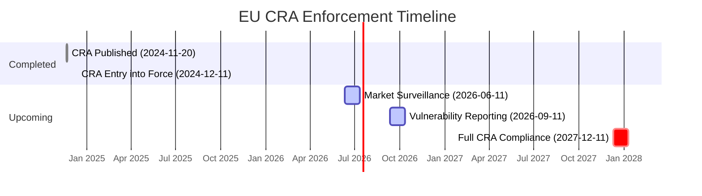
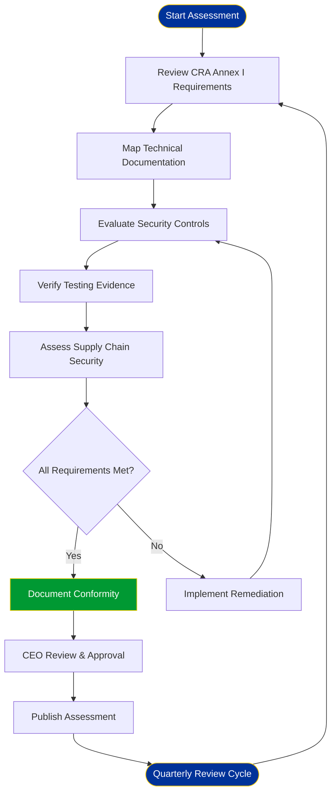

  

<h1 align="center">🛡️ EU Parliament Monitor — CRA Conformity Assessment</h1>

  <strong>Evidence-Driven Conformity Through Systematic Assessment</strong> 
  <em>Demonstrating CRA Compliance for European Parliament Intelligence Platform</em>

  
  
  
  

**📋 Document Owner:** CEO | **📄 Version:** 1.1 | **📅 Last Updated:** 2026-02-25 (UTC)  
**🔄 Review Cycle:** Quarterly | **⏰ Next Review:** 2026-05-25

---

## 📚 Architecture Documentation Map

| Document                                                            | Focus           | Description                                    | Documentation Link                                                                                     |
| ------------------------------------------------------------------- | --------------- | ---------------------------------------------- | ------------------------------------------------------------------------------------------------------ |
| **[Architecture](ARCHITECTURE.md)**                                 | 🏛️ Architecture | C4 model showing current system structure      | [View Source](https://github.com/Hack23/euparliamentmonitor/blob/main/ARCHITECTURE.md)                 |
| **[Future Architecture](FUTURE_ARCHITECTURE.md)**                   | 🏛️ Architecture | C4 model showing future system structure       | [View Source](https://github.com/Hack23/euparliamentmonitor/blob/main/FUTURE_ARCHITECTURE.md)          |
| **[Mindmaps](MINDMAP.md)**                                          | 🧠 Concept      | Current system component relationships         | [View Source](https://github.com/Hack23/euparliamentmonitor/blob/main/MINDMAP.md)                      |
| **[Future Mindmaps](FUTURE_MINDMAP.md)**                            | 🧠 Concept      | Future capability evolution                    | [View Source](https://github.com/Hack23/euparliamentmonitor/blob/main/FUTURE_MINDMAP.md)               |
| **[SWOT Analysis](SWOT.md)**                                        | 💼 Business     | Current strategic assessment                   | [View Source](https://github.com/Hack23/euparliamentmonitor/blob/main/SWOT.md)                         |
| **[Future SWOT Analysis](FUTURE_SWOT.md)**                          | 💼 Business     | Future strategic opportunities                 | [View Source](https://github.com/Hack23/euparliamentmonitor/blob/main/FUTURE_SWOT.md)                  |
| **[Data Model](DATA_MODEL.md)**                                     | 📊 Data         | Current data structures and relationships      | [View Source](https://github.com/Hack23/euparliamentmonitor/blob/main/DATA_MODEL.md)                   |
| **[Future Data Model](FUTURE_DATA_MODEL.md)**                       | 📊 Data         | Enhanced European Parliament data architecture | [View Source](https://github.com/Hack23/euparliamentmonitor/blob/main/FUTURE_DATA_MODEL.md)            |
| **[Flowcharts](FLOWCHART.md)**                                      | 🔄 Process      | Current data processing workflows              | [View Source](https://github.com/Hack23/euparliamentmonitor/blob/main/FLOWCHART.md)                    |
| **[Future Flowcharts](FUTURE_FLOWCHART.md)**                        | 🔄 Process      | Enhanced AI-driven workflows                   | [View Source](https://github.com/Hack23/euparliamentmonitor/blob/main/FUTURE_FLOWCHART.md)             |
| **[State Diagrams](STATEDIAGRAM.md)**                               | 🔄 Behavior     | Current system state transitions               | [View Source](https://github.com/Hack23/euparliamentmonitor/blob/main/STATEDIAGRAM.md)                 |
| **[Future State Diagrams](FUTURE_STATEDIAGRAM.md)**                 | 🔄 Behavior     | Enhanced adaptive state transitions            | [View Source](https://github.com/Hack23/euparliamentmonitor/blob/main/FUTURE_STATEDIAGRAM.md)          |
| **[Security Architecture](SECURITY_ARCHITECTURE.md)**               | 🛡️ Security     | Current security implementation                | [View Source](https://github.com/Hack23/euparliamentmonitor/blob/main/SECURITY_ARCHITECTURE.md)        |
| **[Future Security Architecture](FUTURE_SECURITY_ARCHITECTURE.md)** | 🛡️ Security     | Security enhancement roadmap                   | [View Source](https://github.com/Hack23/euparliamentmonitor/blob/main/FUTURE_SECURITY_ARCHITECTURE.md) |
| **[Threat Model](THREAT_MODEL.md)**                                 | 🎯 Security     | STRIDE threat analysis                         | [View Source](https://github.com/Hack23/euparliamentmonitor/blob/main/THREAT_MODEL.md)                 |
| **[Classification](CLASSIFICATION.md)**                             | 🏷️ Governance   | CIA classification & BCP                       | [View Source](https://github.com/Hack23/euparliamentmonitor/blob/main/CLASSIFICATION.md)               |
| **[CRA Assessment](CRA-ASSESSMENT.md)**                             | 🛡️ Compliance   | Cyber Resilience Act                           | [View Source](https://github.com/Hack23/euparliamentmonitor/blob/main/CRA-ASSESSMENT.md)               |
| **[Workflows](WORKFLOWS.md)**                                       | ⚙️ DevOps       | CI/CD documentation                            | [View Source](https://github.com/Hack23/euparliamentmonitor/blob/main/WORKFLOWS.md)                    |
| **[Future Workflows](FUTURE_WORKFLOWS.md)**                         | 🚀 DevOps       | Planned CI/CD enhancements                     | [View Source](https://github.com/Hack23/euparliamentmonitor/blob/main/FUTURE_WORKFLOWS.md)             |
| **[Business Continuity Plan](BCPPlan.md)**                          | 🔄 Resilience   | Recovery planning                              | [View Source](https://github.com/Hack23/euparliamentmonitor/blob/main/BCPPlan.md)                      |
| **[Financial Security Plan](FinancialSecurityPlan.md)**             | 💰 Financial    | Cost & security analysis                       | [View Source](https://github.com/Hack23/euparliamentmonitor/blob/main/FinancialSecurityPlan.md)        |
| **[End-of-Life Strategy](End-of-Life-Strategy.md)**                 | 📦 Lifecycle    | Technology EOL planning                        | [View Source](https://github.com/Hack23/euparliamentmonitor/blob/main/End-of-Life-Strategy.md)         |
| **[Unit Test Plan](UnitTestPlan.md)**                               | 🧪 Testing      | Unit testing strategy                          | [View Source](https://github.com/Hack23/euparliamentmonitor/blob/main/UnitTestPlan.md)                 |
| **[E2E Test Plan](E2ETestPlan.md)**                                 | 🔍 Testing      | End-to-end testing                             | [View Source](https://github.com/Hack23/euparliamentmonitor/blob/main/E2ETestPlan.md)                  |
| **[Performance Testing](performance-testing.md)**                   | ⚡ Performance  | Performance benchmarks                         | [View Source](https://github.com/Hack23/euparliamentmonitor/blob/main/performance-testing.md)          |
| **[Security Policy](SECURITY.md)**                                  | 🔒 Security     | Vulnerability reporting & security policy      | [View Source](https://github.com/Hack23/euparliamentmonitor/blob/main/SECURITY.md)                     |

---

## 🎯 Purpose Statement

**Hack23 AB's** CRA conformity assessment process demonstrates how **systematic regulatory compliance directly enables transparency and trust** in open-source European Parliament monitoring. This assessment covers the EU Parliament Monitor's compliance with the EU Cyber Resilience Act (CRA) requirements.

As a static site generating multi-language news articles from European Parliament open data, EU Parliament Monitor has a minimal attack surface while maintaining comprehensive security practices aligned with the CRA framework. This assessment follows the [Hack23 AB CRA Conformity Assessment Process](https://github.com/Hack23/cia/blob/master/CRA-ASSESSMENT.md) reference implementation.

*— James Pether Sörling, CEO/Founder*

---

## 1️⃣ Project Identification

| 📋 **Attribute** | 📊 **Value** |
|------------------|-------------|
| **Product Name** | EU Parliament Monitor |
| **Version** | 0.5.1 |
| **Repository** | [github.com/Hack23/euparliamentmonitor](https://github.com/Hack23/euparliamentmonitor) |
| **Homepage** | [euparliamentmonitor.com](https://euparliamentmonitor.com) |
| **Security Contact** | security@hack23.com |
| **License** | Apache-2.0 |
| **Purpose** | Multi-language European Parliament transparency platform — automated static site generating news articles in 14 languages from EU Parliament open data |
| **Technology Stack** | Node.js 24, TypeScript, HTML5/CSS3, GitHub Actions, GitHub Pages |
| **Deployment Model** | Static site served via GitHub Pages CDN |
| **Data Sources** | European Parliament MCP Server (public open data) |

### 📎 Evidence Links

| 📂 **Evidence Area** | 📄 **Document** | 🔗 **Link** |
|----------------------|-----------------|-------------|
| System Architecture | ARCHITECTURE.md | [View](https://github.com/Hack23/euparliamentmonitor/blob/main/ARCHITECTURE.md) |
| Security Architecture | SECURITY_ARCHITECTURE.md | [View](https://github.com/Hack23/euparliamentmonitor/blob/main/SECURITY_ARCHITECTURE.md) |
| Future Security Architecture | FUTURE_SECURITY_ARCHITECTURE.md | [View](https://github.com/Hack23/euparliamentmonitor/blob/main/FUTURE_SECURITY_ARCHITECTURE.md) |
| Threat Model (STRIDE) | THREAT_MODEL.md | [View](https://github.com/Hack23/euparliamentmonitor/blob/main/THREAT_MODEL.md) |
| Security Policy | SECURITY.md | [View](https://github.com/Hack23/euparliamentmonitor/blob/main/SECURITY.md) |
| Classification & BCP | CLASSIFICATION.md | [View](https://github.com/Hack23/euparliamentmonitor/blob/main/CLASSIFICATION.md) |
| Data Model | DATA_MODEL.md | [View](https://github.com/Hack23/euparliamentmonitor/blob/main/DATA_MODEL.md) |
| System Mindmap | MINDMAP.md | [View](https://github.com/Hack23/euparliamentmonitor/blob/main/MINDMAP.md) |
| Workflow Documentation | WORKFLOWS.md | [View](https://github.com/Hack23/euparliamentmonitor/blob/main/WORKFLOWS.md) |
| Business Continuity | BCPPlan.md | [View](https://github.com/Hack23/euparliamentmonitor/blob/main/BCPPlan.md) |
| Financial Security Plan | FinancialSecurityPlan.md | [View](https://github.com/Hack23/euparliamentmonitor/blob/main/FinancialSecurityPlan.md) |
| End-of-Life Strategy | End-of-Life-Strategy.md | [View](https://github.com/Hack23/euparliamentmonitor/blob/main/End-of-Life-Strategy.md) |
| Unit Test Plan | UnitTestPlan.md | [View](https://github.com/Hack23/euparliamentmonitor/blob/main/UnitTestPlan.md) |
| E2E Test Plan | E2ETestPlan.md | [View](https://github.com/Hack23/euparliamentmonitor/blob/main/E2ETestPlan.md) |
| Performance Testing | performance-testing.md | [View](https://github.com/Hack23/euparliamentmonitor/blob/main/performance-testing.md) |
| SBOM & Provenance | GitHub Release Artifacts | [View](https://github.com/Hack23/euparliamentmonitor/releases) |
| OpenSSF Scorecard | Scorecard Results | [View](https://scorecard.dev/viewer/?uri=github.com/Hack23/euparliamentmonitor) |
| CodeQL Results | GitHub Code Scanning | [View](https://github.com/Hack23/euparliamentmonitor/security/code-scanning) |
| Dependency Alerts | Dependabot Alerts | [View](https://github.com/Hack23/euparliamentmonitor/security/dependabot) |

---

## 2️⃣ CRA Scope & Classification

  
  
  

### CRA Product Category

| 📋 **Attribute** | 📊 **Assessment** |
|------------------|-------------------|
| **Product Name** | EU Parliament Monitor |
| **Product Type** | Open-source static website generator |
| **CRA Category** | Standard — Default (non-critical digital product) |
| **Digital Elements** | HTML5, CSS3 (static generation via Node.js/TypeScript) |
| **Network Connectivity** | Build-time only: read-only access to European Parliament open data APIs |
| **Runtime Network** | None — output is pre-rendered static HTML served via CDN |
| **Data Processing** | Public EU Parliament data only (no PII, no user data) |
| **User Interaction** | Read-only static pages — no forms, no authentication, no cookies |
| **Commercial Status** | Non-commercial open-source (Apache-2.0 license) |

### Scope Justification

EU Parliament Monitor falls under **CRA Article 6 — Standard (Default) category** as a non-critical digital product. The product is an open-source static site generator that produces pre-rendered HTML pages from publicly available European Parliament data. It has no runtime network connectivity, processes no personal data, requires no user authentication, and poses minimal cybersecurity risk.

### 🏛️ Open Source Software CRA Exemption

> **Important CRA Note for Open Source Software**: Under CRA **Recital 18** and **Article 3**, open-source software developed and distributed non-commercially (subject to the "in-the-course-of-a-commercial-activity" test) may qualify for full or partial CRA exemption. EU Parliament Monitor is:
>
> - ✅ Free and open-source (Apache-2.0 license)
> - ✅ Non-commercial civic technology — zero revenue generated
> - ✅ No monetary consideration for distribution
> - ✅ No commercial exploitation by manufacturer (Hack23 AB)

**Assessment**: EU Parliament Monitor **likely qualifies as non-commercial OSS** under CRA Article 3, meaning most manufacturer obligations do **NOT** apply. However, the platform **voluntarily implements CRA best practices** as part of Hack23 AB's security commitment and ISMS framework — demonstrating proactive security transparency to citizens, regulators, and the open-source community.

As a non-commercial open-source project (CRA Recital 18), it benefits from reduced obligations while voluntarily maintaining comprehensive security practices aligned with CRA Annex I essential requirements.

---

## 2️⃣ᵃ EU CRA Enforcement Timeline

Understanding CRA's phased enforcement timeline is essential for compliance planning. EU Parliament Monitor monitors these milestones to ensure timely readiness.

| 🗓️ Milestone | 📅 Date | 📋 Requirements | 🚦 Status |
|--------------|---------|-----------------|-----------|
| **CRA Published in Official Journal** | 2024-11-20 | Regulation (EU) 2024/2847 published | ✅ Completed |
| **CRA Entry into Force** | 2024-12-11 | 20 days after publication in Official Journal | ✅ Completed |
| **Market Surveillance Provisions** | **2026-06-11** | Chapter VI market surveillance rules applicable (18 months) | 🔄 Upcoming |
| **Vulnerability & Incident Reporting Obligations** | **2026-09-11** | Articles 14 & 15 — Vulnerability and incident reporting to ENISA/national CSIRTs | 🔄 Upcoming |
| **Full CRA Compliance Required** | **2027-12-11** | All CRA requirements for manufacturers, importers, and distributors | 🔄 Upcoming |
| **CE Marking Mandatory** | **2027-12-11** | Products covered by CRA must bear CE marking | N/A (non-commercial OSS) |

> **📍 Current Position (Feb 2026):** CRA is in force. Vulnerability reporting requirements under Articles 14 & 15 apply from **September 2026 — approximately 7 months away**. EU Parliament Monitor's existing [`SECURITY.md`](SECURITY.md) coordinated disclosure process and GitHub Security Advisories integration **already satisfies these upcoming requirements**. No additional action required before the September 2026 deadline.

---

## 3️⃣ Technical Documentation (CRA Annex V)

| 📋 **CRA Technical Area** | 📊 **Implementation** | 🔗 **Evidence** |
|---------------------------|----------------------|-----------------|
| **Product Architecture** | C4 architecture model (Context, Container, Component levels); static site generator with GitHub Pages deployment; Node.js 24/TypeScript build pipeline | [ARCHITECTURE.md](ARCHITECTURE.md), [SECURITY_ARCHITECTURE.md](SECURITY_ARCHITECTURE.md), [MINDMAP.md](MINDMAP.md) |
| **SBOM & Components** | CycloneDX SBOM generated per release; npm `package-lock.json` provides full dependency tree; single runtime dependency (`european-parliament-mcp-server`) | [GitHub Release Attestations](https://github.com/Hack23/euparliamentmonitor/releases), [package.json](https://github.com/Hack23/euparliamentmonitor/blob/main/package.json) |
| **Cybersecurity Controls** | Static site security model (no server-side code execution); CSP headers via GitHub Pages; Content Security Policy; HTTPS-only delivery; no cookies or tracking | [SECURITY_ARCHITECTURE.md](SECURITY_ARCHITECTURE.md), [THREAT_MODEL.md](THREAT_MODEL.md) |
| **Supply Chain Security** | SLSA Level 3 provenance via `slsa-provenance.yml`; Dependabot daily dependency scanning; OpenSSF Scorecard weekly assessment; dependency-review on PRs; npm audit in CI | [slsa-provenance.yml](https://github.com/Hack23/euparliamentmonitor/blob/main/.github/workflows/slsa-provenance.yml), [scorecards.yml](https://github.com/Hack23/euparliamentmonitor/blob/main/.github/workflows/scorecards.yml), [OpenSSF Scorecard](https://scorecard.dev/viewer/?uri=github.com/Hack23/euparliamentmonitor) |
| **Update Mechanism** | Automated CI/CD via GitHub Actions; daily news generation workflows; automated dependency updates via Dependabot PRs; release workflow with SBOM and provenance attestation | [WORKFLOWS.md](WORKFLOWS.md), [release.yml](https://github.com/Hack23/euparliamentmonitor/blob/main/.github/workflows/release.yml) |
| **Security Monitoring** | CodeQL SAST on every push/PR; Dependabot alerts with severity-based SLAs; SonarCloud code quality analysis; ESLint with security plugin; HTMLHint for output validation | [codeql.yml](https://github.com/Hack23/euparliamentmonitor/blob/main/.github/workflows/codeql.yml), [dependency-review.yml](https://github.com/Hack23/euparliamentmonitor/blob/main/.github/workflows/dependency-review.yml) |
| **Data Protection** | Public data only — all source data from official European Parliament open data portal; no PII collected, processed, or stored; no user tracking or analytics; GDPR compliant by design | [CLASSIFICATION.md](CLASSIFICATION.md), [SECURITY.md](SECURITY.md) |
| **User Guidance** | README.md with quick-start instructions; comprehensive architecture documentation suite (20+ documents); Security Policy with vulnerability reporting process; API documentation | [README.md](README.md), [SECURITY.md](SECURITY.md), [ARCHITECTURE.md](ARCHITECTURE.md) |
| **Vulnerability Disclosure** | GitHub Security Advisories enabled; coordinated disclosure process in SECURITY.md; severity-based SLAs (Critical: 7 days, High: 30 days, Medium: 90 days); security@hack23.com contact | [SECURITY.md](SECURITY.md), [GitHub Security Advisories](https://github.com/Hack23/euparliamentmonitor/security/advisories) |
| **Technology Lifecycle** | End-of-Life Strategy documenting Node.js 24 LTS support timeline; dependency lifecycle tracking; proactive technology migration planning | [End-of-Life-Strategy.md](End-of-Life-Strategy.md) |
| **Testing & Validation** | Vitest unit tests (82%+ coverage); Playwright E2E tests across 14 languages; axe-core accessibility testing (WCAG 2.1 AA); Lighthouse performance benchmarking; ESLint + HTMLHint linting | [UnitTestPlan.md](UnitTestPlan.md), [E2ETestPlan.md](E2ETestPlan.md), [performance-testing.md](performance-testing.md) |
| **Business Continuity** | GitHub Pages CDN with global distribution; git-based disaster recovery; repository mirroring capability; classification-driven recovery priorities | [BCPPlan.md](BCPPlan.md), [FinancialSecurityPlan.md](FinancialSecurityPlan.md) |

### 📦 SBOM Implementation Details

EU Parliament Monitor generates a comprehensive Software Bill of Materials (SBOM) for every release per **CRA Annex I, Part I, §2(3)** requirements — ensuring complete software supply chain transparency.

| 📋 SBOM Attribute | 🔧 Implementation | 📜 CRA Requirement | ✅ Status |
|-------------------|-------------------|-------------------|-----------|
| **SBOM Format** | SPDX JSON (via `npm list --json`) | Machine-readable format | ✅ |
| **Component Inventory** | All npm dependencies — direct and transitive | Complete software component listing | ✅ |
| **Version Information** | Exact semantic versions from `package-lock.json` | Precise version identification | ✅ |
| **License Information** | `REUSE.toml` + SPDX headers per file | License compliance metadata | ✅ |
| **Vulnerability Status** | `npm audit` + Dependabot alerts | Known vulnerability tracking | ✅ |
| **Generation Frequency** | On every release via GitHub Actions release workflow | Current at time of distribution | ✅ |
| **Public Availability** | Released as GitHub Release artifact | Freely accessible to downstream users | ✅ |

> **Note:** The `package-lock.json` provides a machine-readable, version-pinned dependency graph that serves as a complementary SBOM artifact for all build-time consumers. Both the CycloneDX SBOM (generated per release) and `package-lock.json` are publicly accessible, fulfilling CRA Annex I Part II §7.

---

## 4️⃣ Risk Assessment

| 🎯 **CRA Risk Category** | 💎 **Asset** | 📊 **Likelihood** | 💥 **Impact** | 🛡️ **CRA Control Implementation** | 📉 **Residual** | 🔗 **Evidence** |
|--------------------------|-------------|-------------------|--------------|-----------------------------------|-----------------|-----------------|
| **Supply Chain Compromise** | Build pipeline, npm dependencies | 🟡 Medium | 🟡 Medium | SLSA Level 3 provenance; Dependabot daily scanning; dependency-review workflow; npm audit in CI; lock file integrity verification | 🟢 Low | [slsa-provenance.yml](https://github.com/Hack23/euparliamentmonitor/blob/main/.github/workflows/slsa-provenance.yml), [dependency-review.yml](https://github.com/Hack23/euparliamentmonitor/blob/main/.github/workflows/dependency-review.yml) |
| **Known Vulnerability Exploitation** | Node.js runtime, npm packages | 🟡 Medium | 🟡 Medium | CodeQL SAST on every push; Dependabot with severity-based SLAs; OpenSSF Scorecard assessment; npm audit enforcement; ESLint security plugin | 🟢 Low | [codeql.yml](https://github.com/Hack23/euparliamentmonitor/blob/main/.github/workflows/codeql.yml), [SECURITY.md](SECURITY.md) |
| **Content Integrity Compromise** | Generated HTML/CSS news articles | 🟢 Low | 🟡 Medium | Git-based version control with signed commits; HTMLHint output validation; Playwright E2E verification; immutable deployment artifacts | 🟢 Low | [ARCHITECTURE.md](ARCHITECTURE.md), [E2ETestPlan.md](E2ETestPlan.md) |
| **CI/CD Pipeline Tampering** | GitHub Actions workflows | 🟢 Low | 🟡 Medium | Branch protection rules; required PR reviews; pinned action versions; workflow permissions with least privilege; CODEOWNERS enforcement | 🟢 Low | [WORKFLOWS.md](WORKFLOWS.md), [scorecards.yml](https://github.com/Hack23/euparliamentmonitor/blob/main/.github/workflows/scorecards.yml) |
| **Data Source Manipulation** | European Parliament MCP Server data | 🟢 Low | 🟢 Low | Read-only access to official EU Parliament open data; data consumed at build-time only; output reviewed before deployment; public data with inherent transparency | 🟢 Low | [DATA_MODEL.md](DATA_MODEL.md), [SECURITY_ARCHITECTURE.md](SECURITY_ARCHITECTURE.md) |
| **Availability Disruption** | Static site hosted on GitHub Pages | 🟢 Low | 🟢 Low | GitHub Pages CDN with 99.9%+ uptime SLA; static files require no server-side processing; git-based disaster recovery; no database dependencies | 🟢 Low | [BCPPlan.md](BCPPlan.md), [CLASSIFICATION.md](CLASSIFICATION.md) |
| **Cross-Site Scripting (XSS)** | Generated HTML pages in 14 languages | 🟢 Low | 🟡 Medium | No user input accepted at runtime; content generated from sanitized templates; HTMLHint validation; CSP headers; static pre-rendered output only | 🟢 Low | [THREAT_MODEL.md](THREAT_MODEL.md), [SECURITY_ARCHITECTURE.md](SECURITY_ARCHITECTURE.md) |
| **License & IP Compliance** | Open-source dependencies, Apache-2.0 license | 🟢 Low | 🟢 Low | REUSE compliance checking via `reuse.yml` workflow; SBOM generation with license metadata; Apache-2.0 compatible dependency selection | 🟢 Low | [reuse.yml](https://github.com/Hack23/euparliamentmonitor/blob/main/.github/workflows/reuse.yml), [REUSE.toml](https://github.com/Hack23/euparliamentmonitor/blob/main/REUSE.toml) |

---

## 5️⃣ Essential Requirements Assessment (CRA Annex I)

### Part I: Security Properties of Products with Digital Elements

| # | 📋 **CRA Requirement** | ✅ **Status** | 🔧 **Implementation** | 🔗 **Evidence** |
|---|------------------------|--------------|----------------------|-----------------|
| 1 | **Delivered without known exploitable vulnerabilities** | ✅ Met | Automated dependency scanning via Dependabot (daily); CodeQL SAST on every push/PR; npm audit enforcement in CI pipeline; zero known critical/high vulnerabilities maintained | [codeql.yml](https://github.com/Hack23/euparliamentmonitor/blob/main/.github/workflows/codeql.yml), [SECURITY.md](SECURITY.md), [GitHub Code Scanning](https://github.com/Hack23/euparliamentmonitor/security/code-scanning) |
| 2 | **Secure by default configuration** | ✅ Met | Static site requires zero configuration; no server processes, no databases, no authentication configuration needed; CSP headers enforced via GitHub Pages; HTTPS-only delivery; no optional insecure modes | [SECURITY_ARCHITECTURE.md](SECURITY_ARCHITECTURE.md), [ARCHITECTURE.md](ARCHITECTURE.md) |
| 3 | **Protection against unauthorized access** | ✅ N/A | No authentication or authorization needed — platform serves public information only; no admin interface; no writable API endpoints; GitHub repository access controlled via branch protection and CODEOWNERS | [SECURITY.md](SECURITY.md), [THREAT_MODEL.md](THREAT_MODEL.md) |
| 4 | **Protect confidentiality of stored/transmitted/processed data** | ✅ Met | No personal or confidential data processed; all European Parliament data is public and freely available; HTTPS-only delivery ensures transport confidentiality; no cookies, local storage, or session data | [CLASSIFICATION.md](CLASSIFICATION.md), [SECURITY_ARCHITECTURE.md](SECURITY_ARCHITECTURE.md) |
| 5 | **Protect integrity of stored/transmitted/processed data** | ✅ Met | Git-based version control with immutable commit history; SLSA Level 3 provenance for release artifacts; HTMLHint validation on all generated content; Playwright E2E tests verify output integrity across 14 languages | [slsa-provenance.yml](https://github.com/Hack23/euparliamentmonitor/blob/main/.github/workflows/slsa-provenance.yml), [E2ETestPlan.md](E2ETestPlan.md) |
| 6 | **Process only data adequate, relevant, and necessary** | ✅ Met | Data minimization by design — only public European Parliament data processed; no telemetry, analytics, or user tracking; no personal data collection; build-time data processing with no runtime data flows | [DATA_MODEL.md](DATA_MODEL.md), [CLASSIFICATION.md](CLASSIFICATION.md) |
| 7 | **Protect availability of essential functions** | ✅ Met | GitHub Pages CDN provides global distribution with 99.9%+ uptime; static HTML files require no server-side compute; no single points of failure in serving; BCP plan covers disaster recovery | [BCPPlan.md](BCPPlan.md), [ARCHITECTURE.md](ARCHITECTURE.md) |
| 8 | **Minimize negative impact on availability of services provided by other devices/networks** | ✅ Met | Static site generates zero outbound network traffic at runtime; no WebSockets, no API calls, no tracking pixels; no JavaScript required for content rendering; minimal bandwidth consumption | [SECURITY_ARCHITECTURE.md](SECURITY_ARCHITECTURE.md), [performance-testing.md](performance-testing.md) |
| 9 | **Designed and produced to limit attack surfaces** | ✅ Met | Minimal attack surface: pre-rendered static HTML/CSS with no JavaScript execution required; no server-side code; no user input processing at runtime; no database connections; CDN-delivered immutable files | [THREAT_MODEL.md](THREAT_MODEL.md), [ARCHITECTURE.md](ARCHITECTURE.md) |
| 10 | **Designed to reduce impact of security incidents** | ✅ Met | Static site architecture inherently limits blast radius; no persistent server state to compromise; no user data at risk; content easily regenerated from git; rollback via git revert | [BCPPlan.md](BCPPlan.md), [SECURITY_ARCHITECTURE.md](SECURITY_ARCHITECTURE.md) |
| 11 | **Provide security-relevant information through recording/monitoring** | ✅ Met | GitHub Actions provides complete CI/CD audit trail; GitHub Pages access logs available; CodeQL findings tracked via GitHub Code Scanning; Dependabot alerts with historical records | [WORKFLOWS.md](WORKFLOWS.md), [codeql.yml](https://github.com/Hack23/euparliamentmonitor/blob/main/.github/workflows/codeql.yml) |
| 12 | **Provide ability to remove data by users** | ✅ N/A | No user data collected, stored, or processed; no user accounts; no forms; no cookies; no local storage usage; GDPR data subject rights not applicable | [CLASSIFICATION.md](CLASSIFICATION.md) |
| 13 | **Security updates shall be made available** | ✅ Met | Automated CI/CD pipeline for rapid deployment; Dependabot auto-generates PRs for vulnerable dependencies; release workflow generates SBOM and provenance attestation; severity-based remediation SLAs documented | [SECURITY.md](SECURITY.md), [release.yml](https://github.com/Hack23/euparliamentmonitor/blob/main/.github/workflows/release.yml) |

### Part II: Vulnerability Handling Requirements

| # | 📋 **CRA Requirement** | ✅ **Status** | 🔧 **Implementation** | 🔗 **Evidence** |
|---|------------------------|--------------|----------------------|-----------------|
| 1 | **Identify and document vulnerabilities and components** | ✅ Met | SECURITY.md documents vulnerability reporting process; THREAT_MODEL.md provides STRIDE analysis; CycloneDX SBOM generated per release cataloging all components; `package-lock.json` provides complete dependency tree | [SECURITY.md](SECURITY.md), [THREAT_MODEL.md](THREAT_MODEL.md), [GitHub Releases](https://github.com/Hack23/euparliamentmonitor/releases) |
| 2 | **Address and remediate vulnerabilities without delay** | ✅ Met | Severity-based SLAs: Critical (7 days), High (30 days), Medium (90 days); Dependabot auto-generates update PRs; CodeQL runs on every commit; automated npm audit in CI pipeline | [SECURITY.md](SECURITY.md), [Dependabot Alerts](https://github.com/Hack23/euparliamentmonitor/security/dependabot) |
| 3 | **Apply effective and regular testing and review** | ✅ Met | Vitest unit tests (82%+ coverage); Playwright E2E tests across all 14 language pages; axe-core accessibility testing (WCAG 2.1 AA); Lighthouse performance benchmarks; ESLint + HTMLHint linting; CodeQL SAST; jscpd code duplication detection | [UnitTestPlan.md](UnitTestPlan.md), [E2ETestPlan.md](E2ETestPlan.md), [performance-testing.md](performance-testing.md) |
| 4 | **Publicly disclose information about fixed vulnerabilities** | ✅ Met | GitHub Security Advisories enabled for coordinated disclosure; fixed vulnerabilities published via GitHub releases; security@hack23.com for private reporting; public SECURITY.md documents full process | [SECURITY.md](SECURITY.md), [GitHub Security Advisories](https://github.com/Hack23/euparliamentmonitor/security/advisories) |
| 5 | **Provide mechanism for security updates** | ✅ Met | Automated CI/CD pipeline via GitHub Actions; Dependabot generates PRs for dependency updates; SLSA Level 3 provenance ensures update integrity; static site redeploys automatically on merge to main branch | [WORKFLOWS.md](WORKFLOWS.md), [release.yml](https://github.com/Hack23/euparliamentmonitor/blob/main/.github/workflows/release.yml) |
| 6 | **Share vulnerability information in a timely manner** | ✅ Met | Public SECURITY.md with clear reporting instructions; GitHub Security Advisories with CVE assignment capability; coordinated disclosure timeline (acknowledge 48h, validate 7d, remediate per SLA); public security metrics | [SECURITY.md](SECURITY.md) |
| 7 | **Provide a machine-readable SBOM** | ✅ Met | CycloneDX SBOM generated in release workflow; npm `package-lock.json` provides exact dependency versions; SLSA provenance attestation links SBOM to build; REUSE compliance for license metadata | [release.yml](https://github.com/Hack23/euparliamentmonitor/blob/main/.github/workflows/release.yml), [REUSE.toml](https://github.com/Hack23/euparliamentmonitor/blob/main/REUSE.toml) |
| 8 | **Define security support period** | ✅ Met | End-of-Life Strategy documents technology lifecycle and support timeline; Node.js 24 LTS support tracked; dependency EOL monitoring; proactive migration planning documented | [End-of-Life-Strategy.md](End-of-Life-Strategy.md), [SECURITY.md](SECURITY.md) |

---

## 6️⃣ Conformity Assessment Procedure

### Assessment Methodology

EU Parliament Monitor follows **CRA Module A — Internal Production Control** (self-assessment), which is the appropriate conformity assessment procedure for **Standard (Default) category** digital products. This assessment is conducted by Hack23 AB as the manufacturer/maintainer.

### Self-Assessment Process

### Self-Assessment Checklist

| ✅ | 📋 **Conformity Checkpoint** | 📊 **Status** | 📅 **Verified** |
|----|------------------------------|--------------|-----------------|
| ✅ | CRA Annex I Part I — All security property requirements assessed | Complete | 2026-02-25 |
| ✅ | CRA Annex I Part II — All vulnerability handling requirements assessed | Complete | 2026-02-25 |
| ✅ | CRA Annex V — Technical documentation complete and current | Complete | 2026-02-25 |
| ✅ | SBOM — Machine-readable CycloneDX SBOM generated per release | Complete | 2026-02-25 |
| ✅ | SLSA — Level 3 provenance attestation for release artifacts | Complete | 2026-02-25 |
| ✅ | Vulnerability Disclosure — SECURITY.md with coordinated disclosure process | Complete | 2026-02-25 |
| ✅ | Security Testing — SAST (CodeQL), SCA (Dependabot), unit, E2E, accessibility | Complete | 2026-02-25 |
| ✅ | Lifecycle Management — End-of-Life Strategy documenting support period | Complete | 2026-02-25 |
| ✅ | Risk Assessment — STRIDE threat model with residual risk evaluation | Complete | 2026-02-25 |
| ✅ | ISMS Alignment — Mapped to Hack23 ISMS public policy framework | Complete | 2026-02-25 |

### CRA Article Cross-References

- **Article 6:** Scope determination → Section 2 (CRA Scope & Classification)
- **Article 11:** Essential cybersecurity requirements → Section 5 (Essential Requirements Assessment)
- **Article 19:** Conformity assessment → Section 6 (Conformity Assessment Procedure)
- **Article 23:** Post-market obligations → Section 7 (ISMS Policy Alignment for ongoing monitoring)
- **Annex I:** Technical requirements → Section 5 (Essential Requirements self-assessment)
- **Annex V:** Technical documentation → Section 3 (Technical Documentation)

---

## 7️⃣ Security Testing Evidence

### Automated Security Controls

| 🛡️ **Control** | 🔧 **Tool** | 📊 **Frequency** | ✅ **Status** |
|----------------|------------|------------------|--------------|
| **SAST** | CodeQL | Every push/PR |  |
| **SCA** | Dependabot | Daily | ✅ Active |
| **Dependency Review** | GitHub dependency-review-action | Every PR | ✅ Active |
| **Linting** | ESLint (security plugin) + HTMLHint | Every push/PR | ✅ Active |
| **SBOM** | CycloneDX | Every release | ✅ Active |
| **Scorecard** | OpenSSF Scorecard | Weekly |  |
| **SLSA Provenance** | SLSA Level 3 | Every release | ✅ Active |
| **License Compliance** | REUSE | Every push/PR |  |

### Testing Coverage

| 🧪 **Test Type** | 🔧 **Framework** | 📊 **Coverage** | 📋 **Reference** |
|------------------|-----------------|----------------|-----------------|
| **Unit Tests** | Vitest + v8 coverage | 82%+ code coverage | [UnitTestPlan.md](UnitTestPlan.md) |
| **E2E Tests** | Playwright | 14 language pages verified | [E2ETestPlan.md](E2ETestPlan.md) |
| **Accessibility** | Playwright + axe-core | WCAG 2.1 AA compliance | [E2ETestPlan.md](E2ETestPlan.md) |
| **Performance** | Lighthouse | Core Web Vitals benchmarks | [performance-testing.md](performance-testing.md) |
| **HTML Validation** | HTMLHint | All output HTML files | [package.json scripts](https://github.com/Hack23/euparliamentmonitor/blob/main/package.json) |
| **Code Quality** | ESLint + SonarCloud + jscpd | TypeScript source analysis | [eslint.config.js](https://github.com/Hack23/euparliamentmonitor/blob/main/eslint.config.js) |

---

## 8️⃣ Comprehensive ISMS Policy Alignment

| 🏷️ **ISMS Policy** | 📋 **CRA Mapping** | 🔧 **EU Parliament Monitor Implementation** | ✅ **Status** |
|--------------------|-------------------|---------------------------------------------|--------------|
| [🔐 Information Security Policy](https://github.com/Hack23/ISMS-PUBLIC/blob/main/Information_Security_Policy.md) | Overall CRA governance | Security-by-design static site architecture; public data classification; comprehensive security documentation | ✅ Aligned |
| [🛠️ Secure Development Policy](https://github.com/Hack23/ISMS-PUBLIC/blob/main/Secure_Development_Policy.md) | Annex I Part I (1–13) | CodeQL SAST; ESLint security plugin; Vitest/Playwright testing; branch protection; PR reviews; automated CI/CD gates | ✅ Aligned |
| [🔍 Vulnerability Management](https://github.com/Hack23/ISMS-PUBLIC/blob/main/Vulnerability_Management.md) | Annex I Part II (1–8) | Dependabot daily scanning; severity-based SLAs (Critical 7d, High 30d); GitHub Security Advisories; coordinated disclosure via SECURITY.md | ✅ Aligned |
| [📝 Change Management](https://github.com/Hack23/ISMS-PUBLIC/blob/main/Change_Management.md) | Security updates (Annex I Part II §5) | Git-based change tracking; required PR reviews; automated testing gates; deployment via CI/CD; release workflow with SBOM | ✅ Aligned |
| [🏷️ Classification Framework](https://github.com/Hack23/ISMS-PUBLIC/blob/main/CLASSIFICATION.md) | Risk assessment | CIA classification (Public/Moderate/Standard); impact analysis; classification-driven security controls | ✅ Aligned |
| [🔒 Cryptography Policy](https://github.com/Hack23/ISMS-PUBLIC/blob/main/Cryptography_Policy.md) | Data confidentiality (Annex I Part I §4) | HTTPS-only delivery via GitHub Pages; TLS 1.2+ for all transport; no cryptographic key management needed (static site) | ✅ Aligned |
| [🔑 Access Control Policy](https://github.com/Hack23/ISMS-PUBLIC/blob/main/Access_Control_Policy.md) | Unauthorized access (Annex I Part I §3) | GitHub repository access controls; branch protection; CODEOWNERS enforcement; no end-user authentication (public site) | ✅ Aligned |
| [🤝 Third Party Management](https://github.com/Hack23/ISMS-PUBLIC/blob/main/Third_Party_Management.md) | Supply chain security | Dependabot for dependency monitoring; SLSA Level 3 provenance; dependency-review on PRs; npm audit enforcement; pinned action versions | ✅ Aligned |
| [🔓 Open Source Policy](https://github.com/Hack23/ISMS-PUBLIC/blob/main/Open_Source_Policy.md) | OSS governance | Apache-2.0 license; REUSE compliance; SBOM generation; public security policy; coordinated disclosure process | ✅ Aligned |
| [🚨 Incident Response Plan](https://github.com/Hack23/ISMS-PUBLIC/blob/main/Incident_Response_Plan.md) | Post-market surveillance | Security incident handling procedures; communication protocols; forensics capability; GitHub Security Advisories integration | ✅ Aligned |
| [🔄 Business Continuity Plan](https://github.com/Hack23/ISMS-PUBLIC/blob/main/Business_Continuity_Plan.md) | Availability (Annex I Part I §7) | GitHub Pages CDN resilience; git-based disaster recovery; static site regeneration capability; documented BCP | ✅ Aligned |
| [💾 Backup Recovery Policy](https://github.com/Hack23/ISMS-PUBLIC/blob/main/Backup_Recovery_Policy.md) | Data integrity (Annex I Part I §5) | Git repository as immutable backup; GitHub Pages deployment history; full site regeneration from source | ✅ Aligned |
| [📊 Security Metrics](https://github.com/Hack23/ISMS-PUBLIC/blob/main/Security_Metrics.md) | Monitoring & recording (Annex I Part I §11) | CodeQL scan results tracking; Dependabot alert metrics; test coverage reporting; OpenSSF Scorecard trending | ✅ Aligned |
| [📊 Risk Assessment Methodology](https://github.com/Hack23/ISMS-PUBLIC/blob/main/Risk_Assessment_Methodology.md) | CRA risk evaluation | STRIDE threat model; risk categorization with likelihood/impact assessment; residual risk evaluation; evidence-linked controls | ✅ Aligned |
| [🏷️ Data Classification Policy](https://github.com/Hack23/ISMS-PUBLIC/blob/main/Data_Classification_Policy.md) | Data handling (Annex I Part I §6) | Public data only classification; no PII handling; data minimization by design; EU Parliament open data sourcing | ✅ Aligned |
| [🌐 ISMS Transparency Plan](https://github.com/Hack23/ISMS-PUBLIC/blob/main/ISMS_Transparency_Plan.md) | Disclosure & transparency | Public security documentation; open-source CRA assessment; transparent vulnerability reporting; community engagement | ✅ Aligned |

### ISMS Integration Benefits

- **🔄 Operational Continuity:** CRA self-assessment integrated with existing ISMS security operations and review cycles
- **📊 Evidence Reuse:** Security metrics, test results, and monitoring data serve dual ISMS/CRA documentation purposes
- **🎯 Minimal Overhead:** Static site architecture naturally satisfies many CRA requirements through design simplicity
- **🤝 Stakeholder Confidence:** Transparent assessment demonstrates professional security practices for open-source civic technology

### 🔀 ISO 27001:2022 ↔ EU CRA Cross-Reference

The table below maps ISO 27001:2022 controls directly to CRA Annex I references, demonstrating how Hack23 AB's existing ISMS controls satisfy CRA essential requirements — minimising compliance overhead through integrated governance.

| 🏛️ ISO 27001:2022 Control | 📜 CRA Annex I Reference | 📋 Description | ✅ Status |
|--------------------------|-------------------------|----------------|-----------|
| **A.5.1** Information security policies | Part I §1 (Security by default) | Security governance framework establishing security-by-design principles | ✅ Aligned |
| **A.8.8** Technical vulnerability management | Part I §2(2) (Vulnerability handling) | CVE tracking, Dependabot scanning, and severity-based remediation SLAs | ✅ Aligned |
| **A.8.25** Secure development lifecycle | Part II §1 (Secure development) | SDLC security integration via CodeQL SAST, PR reviews, and CI/CD gates | ✅ Aligned |
| **A.5.24** Information security incident management | Part I §2(5) (Incident reporting) | Security incident procedures via SECURITY.md and GitHub Security Advisories | ✅ Aligned |
| **A.8.13** Information backup | Part I §5 (Data integrity) | Git-based immutable backup strategy with full site regeneration capability | ✅ Aligned |
| **A.5.36** Compliance with policies and standards | Module A self-assessment | Ongoing conformity verification through quarterly CRA assessment review cycle | ✅ Aligned |
| **A.8.20** Network security | Part I §8 (Availability of other services) | Static site generates zero runtime outbound traffic; no network attack surface at runtime | ✅ Aligned |
| **A.8.29** Security testing in development | Part II §3 (Regular testing) | Vitest unit tests, Playwright E2E, axe-core accessibility, and Lighthouse performance | ✅ Aligned |
| **A.5.20** Addressing security in supplier agreements | Part I supply chain (§9) | SLSA Level 3 provenance, dependency-review workflow, pinned action versions | ✅ Aligned |

---

## 🔗 Related Documentation

### 🏛️ Project Documentation
- [🏛️ Architecture](ARCHITECTURE.md) — C4 system architecture
- [🛡️ Security Architecture](SECURITY_ARCHITECTURE.md) — Security controls and threat mitigations
- [🎯 Threat Model](THREAT_MODEL.md) — STRIDE threat analysis
- [🏷️ Classification](CLASSIFICATION.md) — CIA classification & business impact
- [🔒 Security Policy](SECURITY.md) — Vulnerability reporting process
- [📦 End-of-Life Strategy](End-of-Life-Strategy.md) — Technology lifecycle management
- [🔄 Business Continuity Plan](BCPPlan.md) — Disaster recovery planning
- [💰 Financial Security Plan](FinancialSecurityPlan.md) — Cost & security analysis
- [⚙️ Workflows](WORKFLOWS.md) — CI/CD security controls
- [📊 Data Model](DATA_MODEL.md) — Data structures and relationships
- [🧪 Unit Test Plan](UnitTestPlan.md) — Unit testing strategy
- [🔍 E2E Test Plan](E2ETestPlan.md) — End-to-end testing
- [⚡ Performance Testing](performance-testing.md) — Performance validation

### 🔗 Hack23 CRA Reference Implementations
- [🕵️ CIA — CRA Assessment](https://github.com/Hack23/cia/blob/master/CRA-ASSESSMENT.md) — Political transparency platform (reference template)
- [⚫ Black Trigram — CRA Assessment](https://github.com/Hack23/blacktrigram/blob/main/CRA-ASSESSMENT.md) — Game product assessment
- [🛡️ CIA Compliance Manager — CRA Assessment](https://github.com/Hack23/cia-compliance-manager/blob/main/CRA-ASSESSMENT.md) — Compliance automation tool

---

**📋 Document Control:**  
**✅ Approved by:** James Pether Sörling, CEO  
**📤 Distribution:** Public  
**🏷️ Classification:**     
**📅 Effective Date:** 2026-02-25  
**🔄 CRA Alignment:** Self-assessment per CRA Module A — supports CRA Annex V technical documentation and Annex I essential requirements  
**🏛️ ISMS Integration:** Comprehensive alignment with [Hack23 ISMS Public Framework](https://github.com/Hack23/ISMS-PUBLIC)  
**🎯 Framework Compliance:**   
