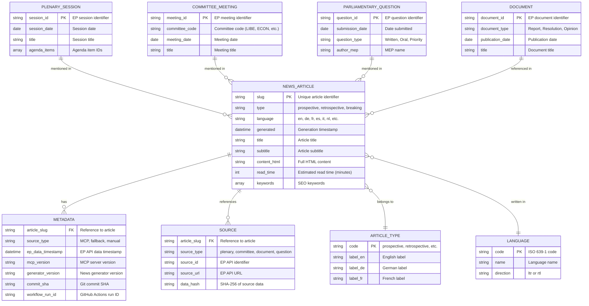

# 📊 EU Parliament Monitor — Data Model

**Version:** 1.0  
**Last Updated:** 2025-02-17  
**Status:** Active Documentation

---

## 📋 Overview

This document defines the data structures and relationships used in the EU Parliament Monitor platform for news generation, storage, and delivery.

## 🎯 Data Model Principles

1. **Simplicity**: Flat file structure, no databases
2. **Immutability**: Generated articles never modified after creation
3. **Traceability**: Generation metadata tracks provenance
4. **Multi-language**: Language-specific content with shared structure
5. **Public Data**: All data from European Parliament open sources

---

## 📐 Entity Relationship Diagram



---

## 📄 Data Structures

### 1. News Article

**File Location**: `news/{year}-{slug}-{lang}.html`

**HTML Structure**:
```html
<!DOCTYPE html>
<html lang="en" dir="ltr">
<head>
  <meta charset="UTF-8">
  <meta name="viewport" content="width=device-width, initial-scale=1.0">
  <title>Article Title - EU Parliament Monitor</title>
  
  <!-- SEO Meta Tags -->
  <meta name="description" content="Article subtitle">
  <meta name="keywords" content="european parliament, keyword1, keyword2">
  <meta name="author" content="EU Parliament Monitor">
  <meta name="publication-date" content="2026-03-01">
  <meta name="article-type" content="prospective">
  <meta name="language" content="en">
  
  <!-- Open Graph -->
  <meta property="og:title" content="Article Title">
  <meta property="og:description" content="Article subtitle">
  <meta property="og:type" content="article">
  <meta property="og:url" content="https://euparliamentmonitor.com/news/2026-week-ahead-en.html">
  
  <!-- Schema.org structured data -->
  <script type="application/ld+json">
  {
    "@context": "https://schema.org",
    "@type": "NewsArticle",
    "headline": "Article Title",
    "description": "Article subtitle",
    "datePublished": "2026-03-01T06:15:32Z",
    "author": {
      "@type": "Organization",
      "name": "EU Parliament Monitor"
    },
    "publisher": {
      "@type": "Organization",
      "name": "EU Parliament Monitor",
      "logo": {
        "@type": "ImageObject",
        "url": "https://euparliamentmonitor.com/logo.png"
      }
    }
  }
  </script>
  
  <link rel="stylesheet" href="../styles.css">
</head>
<body>
  <article class="news-article">
    <header>
      <span class="article-type">Week Ahead</span>
      <h1>Article Title</h1>
      <p class="subtitle">Article subtitle</p>
      <div class="meta">
        <time datetime="2026-03-01">March 1, 2026</time>
        <span class="read-time">5 min read</span>
      </div>
    </header>
    
    <main class="content">
      <!-- Generated HTML content -->
    </main>
    
    <footer>
      <section class="sources">
        <h3>Sources</h3>
        <ul>
          <li><a href="https://data.europarl.europa.eu/...">EP Source 1</a></li>
          <li><a href="https://data.europarl.europa.eu/...">EP Source 2</a></li>
        </ul>
      </section>
      
      <section class="languages">
        <h3>Available Languages</h3>
        <ul>
          <li><a href="2026-week-ahead-de.html">Deutsch</a></li>
          <li><a href="2026-week-ahead-fr.html">Français</a></li>
        </ul>
      </section>
    </footer>
  </article>
</body>
</html>
```

### 2. Generation Metadata

**File Location**: `news/metadata/{year}-{slug}.json`

**JSON Structure**:
```json
{
  "article": {
    "slug": "2026-week-ahead",
    "type": "prospective",
    "languages": ["en", "de", "fr", "es", "it", "nl"],
    "generated_at": "2026-03-01T06:15:32Z"
  },
  "generator": {
    "version": "1.0.0",
    "commit_sha": "abc123def456",
    "workflow_run_id": "12345678",
    "workflow_url": "https://github.com/Hack23/euparliamentmonitor/actions/runs/12345678"
  },
  "mcp": {
    "server_version": "1.2.3",
    "connection_type": "stdio",
    "data_sources": [
      {
        "type": "plenary_session",
        "id": "PS-2026-03-01",
        "url": "https://data.europarl.europa.eu/sessions/2026-03-01",
        "data_hash": "abc123...",
        "timestamp": "2026-02-28T18:30:00Z"
      },
      {
        "type": "committee_meeting",
        "id": "LIBE-2026-02-25",
        "url": "https://data.europarl.europa.eu/committees/LIBE/2026-02-25",
        "data_hash": "def456...",
        "timestamp": "2026-02-25T14:00:00Z"
      }
    ]
  },
  "statistics": {
    "total_languages": 6,
    "word_count": {
      "en": 1250,
      "de": 1300,
      "fr": 1275
    },
    "read_time": {
      "en": 5,
      "de": 5,
      "fr": 5
    }
  }
}
```

### 3. Article Type Definitions

**File Location**: `config/article-types.json` (conceptual)

```json
{
  "article_types": [
    {
      "code": "prospective",
      "labels": {
        "en": "Week Ahead",
        "de": "Woche Voraus",
        "fr": "Semaine à Venir",
        "es": "Semana Próxima",
        "it": "Settimana Prossima",
        "nl": "Week Vooruit",
        "pl": "Nadchodzący Tydzień",
        "pt": "Semana Próxima",
        "ro": "Săptămâna Viitoare",
        "sv": "Vecka Framåt",
        "da": "Ugen Fremover",
        "fi": "Viikko Eteenpäin",
        "el": "Εβδομάδα Μπροστά",
        "hu": "Következő Hét"
      },
      "description": "Preview of upcoming parliamentary events and committee meetings",
      "template": "week-ahead.hbs"
    },
    {
      "code": "retrospective",
      "labels": {
        "en": "Committee Reports",
        "de": "Ausschussberichte",
        "fr": "Rapports de Commission"
      },
      "description": "Analysis of committee activities and decisions",
      "template": "committee-reports.hbs"
    },
    {
      "code": "breaking",
      "labels": {
        "en": "Breaking News",
        "de": "Eilmeldung",
        "fr": "Dernières Nouvelles"
      },
      "description": "Rapid-response coverage of significant developments",
      "template": "breaking.hbs"
    }
  ]
}
```

### 4. Language Configuration

**File Location**: `config/languages.json` (conceptual)

```json
{
  "languages": [
    {
      "code": "en",
      "name": "English",
      "native_name": "English",
      "direction": "ltr",
      "locale": "en-US",
      "region": "Global",
      "priority": 1
    },
    {
      "code": "de",
      "name": "German",
      "native_name": "Deutsch",
      "direction": "ltr",
      "locale": "de-DE",
      "region": "EU Core",
      "priority": 2
    },
    {
      "code": "fr",
      "name": "French",
      "native_name": "Français",
      "direction": "ltr",
      "locale": "fr-FR",
      "region": "EU Core",
      "priority": 3
    }
  ],
  "language_groups": {
    "eu-core": ["en", "de", "fr", "es", "it", "nl"],
    "nordic": ["en", "sv", "da", "fi"],
    "eastern": ["pl", "ro", "hu"],
    "all": ["en", "de", "fr", "es", "it", "nl", "pl", "pt", "ro", "sv", "da", "fi", "el", "hu"]
  }
}
```

---

## 🔗 European Parliament Data Structures

### Plenary Session

**EP API Endpoint**: `https://data.europarl.europa.eu/api/v2/sessions/{session_id}`

```json
{
  "session_id": "PS-2026-03-01",
  "session_date": "2026-03-01",
  "session_type": "Plenary",
  "title": "March 2026 Plenary Session I",
  "location": "Strasbourg",
  "agenda": [
    {
      "item_id": "AGI-2026-03-001",
      "order": 1,
      "title": "Commission statement: European Green Deal progress",
      "speaker": "European Commission",
      "duration_minutes": 60,
      "voting_required": false
    },
    {
      "item_id": "AGI-2026-03-002",
      "order": 2,
      "title": "Vote: Digital Services Act amendments",
      "rapporteur": "MEP Name",
      "duration_minutes": 30,
      "voting_required": true
    }
  ],
  "attendees": 705,
  "status": "scheduled"
}
```

### Committee Meeting

**EP API Endpoint**: `https://data.europarl.europa.eu/api/v2/committees/{committee_code}/meetings/{meeting_id}`

```json
{
  "meeting_id": "LIBE-2026-02-25",
  "committee_code": "LIBE",
  "committee_name": "Committee on Civil Liberties, Justice and Home Affairs",
  "meeting_date": "2026-02-25",
  "meeting_time": "14:00:00",
  "location": "Brussels",
  "agenda": [
    {
      "item_id": "LIBE-AGI-001",
      "title": "Artificial Intelligence Act implementation review",
      "type": "Discussion",
      "documents": ["DOC-2026-001", "DOC-2026-002"]
    }
  ],
  "chair": "MEP Name",
  "status": "completed"
}
```

### Parliamentary Question

**EP API Endpoint**: `https://data.europarl.europa.eu/api/v2/questions/{question_id}`

```json
{
  "question_id": "PQ-2026-000123",
  "question_type": "Written",
  "priority": false,
  "submission_date": "2026-02-20",
  "author": {
    "mep_id": "MEP-12345",
    "name": "MEP Name",
    "political_group": "EPP",
    "country": "Germany"
  },
  "addressee": "European Commission",
  "subject": "Implementation of GDPR enforcement",
  "question_text": "What measures is the Commission taking to...",
  "answer": {
    "answer_date": "2026-03-05",
    "answer_text": "The Commission has undertaken the following actions...",
    "answered_by": "Commissioner Name"
  },
  "languages": ["en", "de"]
}
```

### Document

**EP API Endpoint**: `https://data.europarl.europa.eu/api/v2/documents/{document_id}`

```json
{
  "document_id": "DOC-2026-001",
  "document_type": "Report",
  "title": "Report on the implementation of the Digital Services Act",
  "publication_date": "2026-02-15",
  "rapporteur": {
    "mep_id": "MEP-67890",
    "name": "MEP Name",
    "political_group": "S&D"
  },
  "committee": "LIBE",
  "procedure": "INI",
  "languages": ["en", "de", "fr", "es", "it"],
  "documents": [
    {
      "language": "en",
      "format": "PDF",
      "url": "https://data.europarl.europa.eu/documents/DOC-2026-001-EN.pdf"
    }
  ],
  "status": "published"
}
```

---

## 📁 File System Structure

```
euparliamentmonitor/
├── news/                           # Generated articles
│   ├── 2026-week-ahead-en.html
│   ├── 2026-week-ahead-de.html
│   ├── 2026-week-ahead-fr.html
│   └── metadata/                   # Generation metadata
│       └── 2026-week-ahead.json
│
├── index-{lang}.html               # Language-specific indexes
│   ├── index-en.html
│   ├── index-de.html
│   └── index-fr.html
│
├── sitemap.xml                     # SEO sitemap
├── robots.txt                      # Crawler rules
├── styles.css                      # Global styles
└── favicon.ico                     # Site icon
```

---

## 🔄 Data Flow

### Article Generation Data Flow

```mermaid
flowchart LR
    subgraph "External Sources"
        EP_API[European Parliament<br/>Open Data API]
    end

    subgraph "MCP Layer"
        MCP[MCP Server]
        CACHE[Response Cache]
    end

    subgraph "Generation Layer"
        CLIENT[MCP Client]
        VALIDATE[Data Validator]
        SANITIZE[HTML Sanitizer]
    end

    subgraph "Template Layer"
        TEMPLATE[Article Template]
        META[Metadata Generator]
        HTML[HTML Builder]
    end

    subgraph "Storage Layer"
        FS[File System]
        ARTICLE[Article HTML]
        METADATA[Metadata JSON]
    end

    EP_API -->|JSON Response| MCP
    MCP --> CACHE
    CACHE --> CLIENT
    CLIENT --> VALIDATE
    VALIDATE --> SANITIZE
    SANITIZE --> TEMPLATE
    TEMPLATE --> META
    TEMPLATE --> HTML
    HTML --> ARTICLE
    META --> METADATA
    ARTICLE --> FS
    METADATA --> FS

    style EP_API fill:#fff4e1
    style MCP fill:#e8f5e9
    style CLIENT fill:#e8f5e9
    style VALIDATE fill:#e1f5ff
    style SANITIZE fill:#e1f5ff
    style TEMPLATE fill:#e8f5e9
    style ARTICLE fill:#f0f0f0
    style METADATA fill:#f0f0f0
```



### Index Generation Data Flow

```mermaid
flowchart LR
    subgraph "Input"
        ARTICLES[Generated Articles<br/>news/*.html]
    end
    
    subgraph "Scanner"
        SCAN[File Scanner]
        PARSE[Metadata Parser]
    end
    
    subgraph "Processor"
        GROUP[Group by Language]
        SORT[Sort by Date]
        FILTER[Filter by Type]
    end
    
    subgraph "Generator"
        TEMPLATE[Index Template]
        HTML[HTML Builder]
    end
    
    subgraph "Output"
        INDEX[index-{lang}.html]
    end
    
    ARTICLES --> SCAN
    SCAN --> PARSE
    PARSE --> GROUP
    GROUP --> SORT
    SORT --> FILTER
    FILTER --> TEMPLATE
    TEMPLATE --> HTML
    HTML --> INDEX
    
    style ARTICLES fill:#f0f0f0
    style SCAN fill:#e8f5e9
    style PARSE fill:#e8f5e9
    style GROUP fill:#e1f5ff
    style SORT fill:#e1f5ff
    style FILTER fill:#e1f5ff
    style TEMPLATE fill:#e8f5e9
    style INDEX fill:#f0f0f0
```

---

## 📊 Data Relationships

### Article → Metadata Relationship

- **Cardinality**: One-to-One
- **Foreign Key**: Article slug
- **Purpose**: Track generation provenance and source data

### Article → Sources Relationship

- **Cardinality**: One-to-Many
- **Foreign Key**: Article slug
- **Purpose**: Link articles to European Parliament data sources

### Article → Language Relationship

- **Cardinality**: Many-to-One
- **Foreign Key**: Language code
- **Purpose**: Multi-language support with shared metadata

---

## 🔐 Data Security

### Data Classification

| Data Type | Classification | Storage | Encryption |
|-----------|---------------|---------|------------|
| News Articles | Public | Git repository | At-rest (GitHub) |
| Metadata | Public | Git repository | At-rest (GitHub) |
| EP API Responses | Public | Ephemeral (runtime) | In-transit (TLS 1.3) |
| Generation Logs | Internal | GitHub Actions | At-rest (GitHub) |

### Data Integrity

- **Immutability**: Articles never modified after generation
- **Checksums**: SHA-256 hashes for verification (future)
- **Audit Trail**: Git commit history provides complete provenance
- **Validation**: Schema validation on all EP API responses

---

## 📚 References

- [SECURITY_ARCHITECTURE.md](SECURITY_ARCHITECTURE.md)
- [FLOWCHART.md](FLOWCHART.md)
- [European Parliament Open Data Portal](https://data.europarl.europa.eu)
- [MCP Protocol Specification](https://modelcontextprotocol.io)

---

**Document Status**: Active  
**Next Review**: 2026-05-17  
**Owner**: Development Team, Hack23 AB
