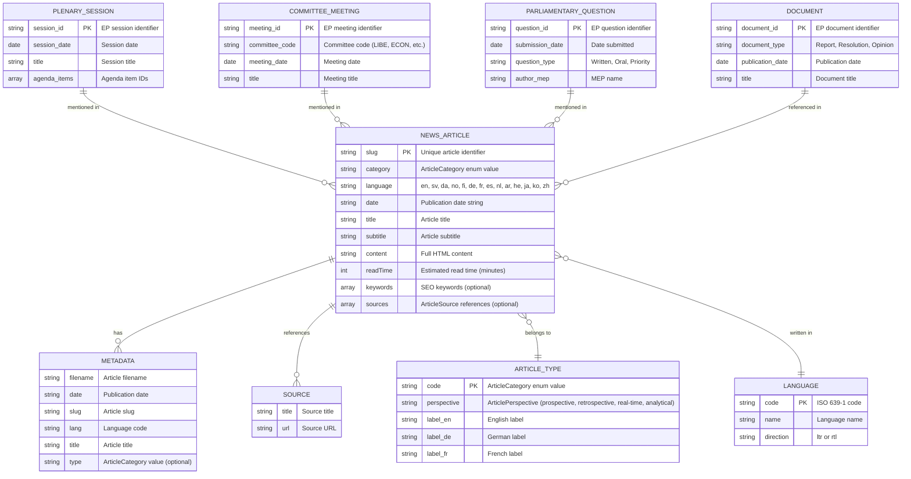
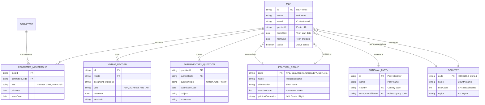
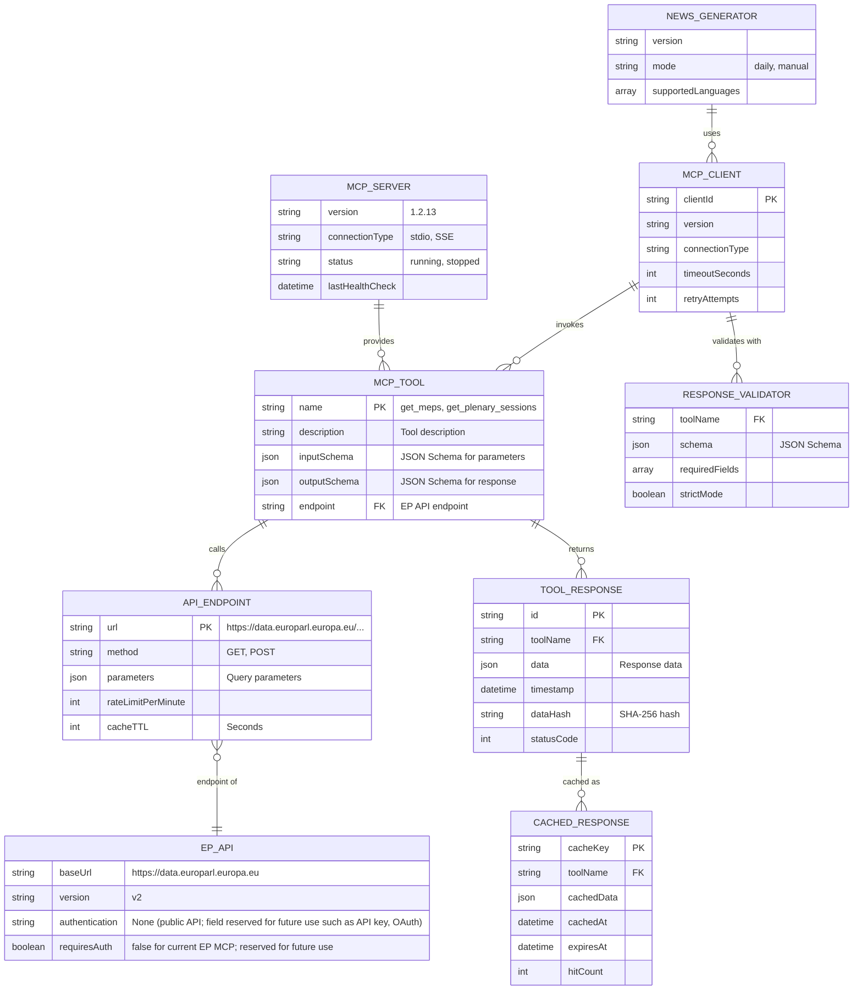
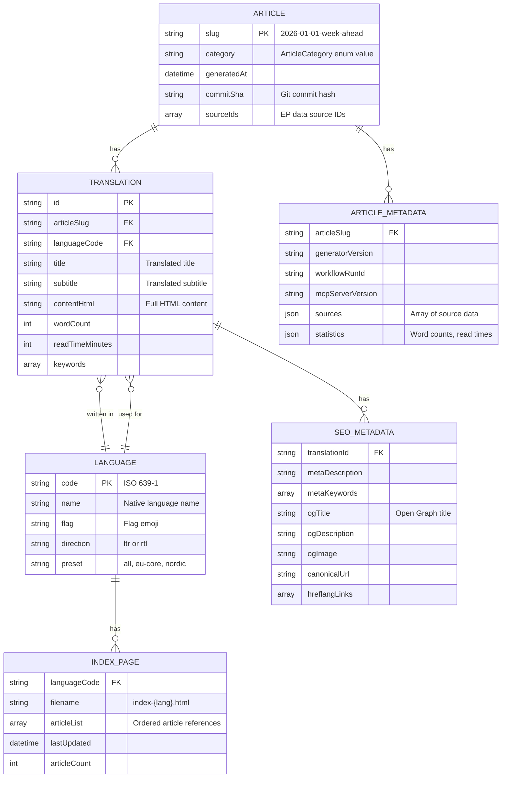
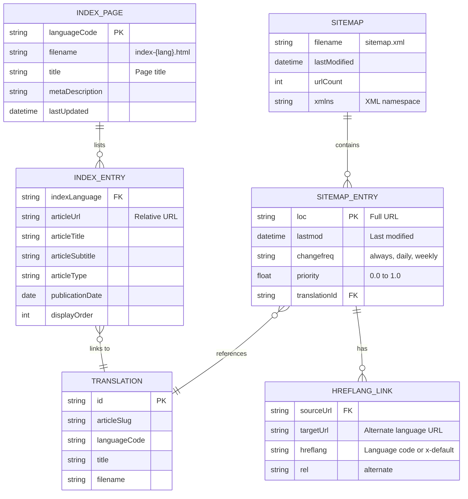
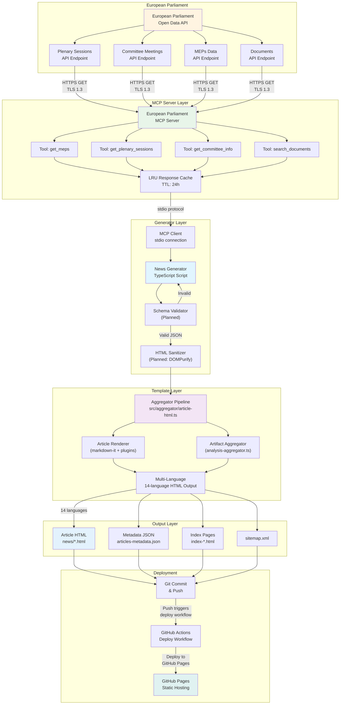
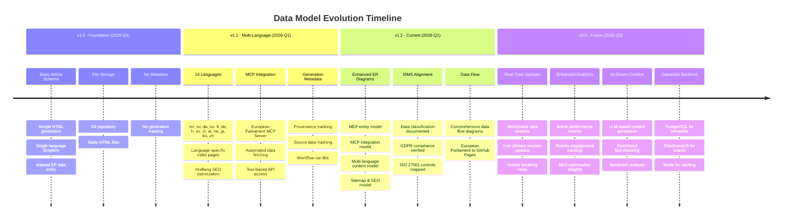

<p align="center">
  
</p>

<h1 align="center">📊 EU Parliament Monitor — Data Model</h1>

<p align="center">
  <strong>Data Structures & Relationships for European Parliament Intelligence</strong><br>
  <em>📊 Entity Models • 🔗 Data Relationships • 📋 Schema Documentation</em>
</p>

<p align="center">
  <a href="#"></a>
  <a href="#"></a>
  <a href="#"></a>
  <a href="#"></a>
</p>

**📋 Document Owner:** CEO | **📄 Version:** 1.3 | **📅 Last Updated:**
2026-05-03 (UTC) | **📦 Release:** v0.8.54  
**🔄 Review Cycle:** Quarterly | **⏰ Next Review:** 2026-08-03

---

## 📋 Overview

This document defines the data structures and relationships used in the EU
Parliament Monitor platform for news generation, storage, and delivery.

> ### ✅ April-2026 Aggregator-Pipeline Migration — Complete
>
> The article data flow has shifted from *AI authors HTML* to *AI authors
> markdown artifacts, aggregator renders HTML deterministically*. The
> canonical on-disk schema is now:
>
> - `analysis/daily/<YYYY-MM-DD>/<article-type-slug>-run<NN>/` —
>   the **authoritative unit of a news run**. Contains every artifact
>   listed in the `manifest.json` (see § Manifest Schema below) plus the
>   rendered `article.html` (produced by `npm run generate-article`).
> - `manifest.json` at the root of each run directory — the aggregator's
>   index: top-level `articleType` + `files` object listing every
>   artifact. Stage-C enforces the schema at self-review time.
> - `news/<YYYY-MM-DD>-<slug>-run<NN>-<lang>.html` — 14 language variants
>   emitted by the aggregator + translation flush.
>
> Two legacy sections in this document — **§ Article Type Definitions**
> and **§ Dual Economic Context Gate** — are kept as **historical
> reference** for the pre-migration `src/generators/strategies/` mapping
> and the pre-migration `src/utils/content-validator.ts` gates. Both
> module trees were **purged** in April 2026; equivalent enforcement
> moved to the Stage-C completeness review at agent level (see
> [`.github/prompts/03-analysis-completeness-gate.md`](.github/prompts/03-analysis-completeness-gate.md)
> and the depth floors in
> [`analysis/methodologies/reference-quality-thresholds.json`](analysis/methodologies/reference-quality-thresholds.json)).
> Read those sections together with this banner and with
> [`ARCHITECTURE.md`](ARCHITECTURE.md) § C4 Container / Component
> diagrams — both have been rewritten against the aggregator stack.

## 🗂️ Manifest Schema (authoritative, aggregator era)

Every analysis run under `analysis/daily/<date>/<slug>-run<NN>/` carries a
`manifest.json` that the aggregator reads to know what to render:

```jsonc
{
  "articleType": "motions",               // one of the 8 canonical slugs
  "runId": "motions-run46",               // <slug>-run<NN>
  "date": "2026-04-20",                   // ISO date (run subdirectory)
  "history": [                            // append-only gate history
    { "at": "2026-04-20T06:00:00Z", "gateResult": "PENDING", "pass": 1 },
    { "at": "2026-04-20T06:22:00Z", "gateResult": "GREEN",   "pass": 2 }
  ],
  "files": {                              // canonical artifact index
    "intelligence": [
      "intelligence/synthesis-summary.md",
      "intelligence/analysis-index.md",
      "intelligence/stakeholder-map.md",
      "intelligence/economic-context.md"
      // …
    ],
    "classification": [
      "classification/significance-classification.md",
      "classification/impact-matrix.md",
      "classification/actor-mapping.md"
    ],
    "risk-scoring": [
      "risk-scoring/risk-matrix.md",
      "risk-scoring/quantitative-swot.md"
    ],
    "threat-assessment": [
      "threat-assessment/political-threat-landscape.md"
    ],
    "existing": [
      "existing/stakeholder-impact.md",
      "existing/deep-analysis.md"
    ],
    "documents": []
  }
}
```

Validation rules (enforced by the Stage-C agent-side review):

| Rule | Rationale |
|---|---|
| top-level `articleType` present and matches one of the 8 slugs | The aggregator uses this to pick the right shared-chrome variant |
| `files` present as an object (nested category → string[] **or** flat path → description) | Walked in canonical order by `src/aggregator/artifact-order.ts` |
| Every `files.*` entry resolves to an existing file under the run directory | Broken links fail the render |
| Latest `history[]` entry with a non-PENDING `gateResult` is carried forward on re-runs | Preserves the last `GREEN` / `ANALYSIS_ONLY` stamp |
| At least one of the per-type required artifacts from [`.github/prompts/05-analysis-to-article-contract.md`](.github/prompts/05-analysis-to-article-contract.md) § 4 present | Prevents a thin run from publishing |

The aggregator reads the manifest via `src/aggregator/analysis-aggregator.ts`
and walks artifacts in the order defined by `src/aggregator/artifact-order.ts`.

## 🎯 Data Model Principles

1. **Simplicity**: Flat file structure, no databases
2. **Immutability**: Generated articles never modified after creation
3. **Traceability**: Generation metadata tracks provenance
4. **Multi-language**: Language-specific content with shared structure
5. **Public Data**: All data from European Parliament open sources

---

## 📚 Architecture Documentation Map

<div class="documentation-map">

| Document                                                            | Focus           | Description                                    | Documentation Link                                                                                     |
| ------------------------------------------------------------------- | --------------- | ---------------------------------------------- | ------------------------------------------------------------------------------------------------------ |
| **[Architecture](ARCHITECTURE.md)**                                 | 🏛️ Architecture | C4 model showing current system structure      | [View Source](https://github.com/Hack23/euparliamentmonitor/blob/main/ARCHITECTURE.md)                 |
| **[Future Architecture](FUTURE_ARCHITECTURE.md)**                   | 🏛️ Architecture | C4 model showing future system structure       | [View Source](https://github.com/Hack23/euparliamentmonitor/blob/main/FUTURE_ARCHITECTURE.md)          |
| **[Mindmaps](MINDMAP.md)**                                          | 🧠 Concept      | Current system component relationships         | [View Source](https://github.com/Hack23/euparliamentmonitor/blob/main/MINDMAP.md)                      |
| **[Future Mindmaps](FUTURE_MINDMAP.md)**                            | 🧠 Concept      | Future capability evolution                    | [View Source](https://github.com/Hack23/euparliamentmonitor/blob/main/FUTURE_MINDMAP.md)               |
| **[SWOT Analysis](SWOT.md)**                                        | 💼 Business     | Current strategic assessment                   | [View Source](https://github.com/Hack23/euparliamentmonitor/blob/main/SWOT.md)                         |
| **[Future SWOT Analysis](FUTURE_SWOT.md)**                          | 💼 Business     | Future strategic opportunities                 | [View Source](https://github.com/Hack23/euparliamentmonitor/blob/main/FUTURE_SWOT.md)                  |
| **[Data Model](DATA_MODEL.md)**                                     | 📊 Data         | Current data structures and relationships      | [View Source](https://github.com/Hack23/euparliamentmonitor/blob/main/DATA_MODEL.md)                   |
| **[Future Data Model](FUTURE_DATA_MODEL.md)**                       | 📊 Data         | Enhanced European Parliament data architecture | [View Source](https://github.com/Hack23/euparliamentmonitor/blob/main/FUTURE_DATA_MODEL.md)            |
| **[Flowcharts](FLOWCHART.md)**                                      | 🔄 Process      | Current data processing workflows              | [View Source](https://github.com/Hack23/euparliamentmonitor/blob/main/FLOWCHART.md)                    |
| **[Future Flowcharts](FUTURE_FLOWCHART.md)**                        | 🔄 Process      | Enhanced AI-driven workflows                   | [View Source](https://github.com/Hack23/euparliamentmonitor/blob/main/FUTURE_FLOWCHART.md)             |
| **[State Diagrams](STATEDIAGRAM.md)**                               | 🔄 Behavior     | Current system state transitions               | [View Source](https://github.com/Hack23/euparliamentmonitor/blob/main/STATEDIAGRAM.md)                 |
| **[Future State Diagrams](FUTURE_STATEDIAGRAM.md)**                 | 🔄 Behavior     | Enhanced adaptive state transitions            | [View Source](https://github.com/Hack23/euparliamentmonitor/blob/main/FUTURE_STATEDIAGRAM.md)          |
| **[Security Architecture](SECURITY_ARCHITECTURE.md)**               | 🛡️ Security     | Current security implementation                | [View Source](https://github.com/Hack23/euparliamentmonitor/blob/main/SECURITY_ARCHITECTURE.md)        |
| **[Future Security Architecture](FUTURE_SECURITY_ARCHITECTURE.md)** | 🛡️ Security     | Security enhancement roadmap                   | [View Source](https://github.com/Hack23/euparliamentmonitor/blob/main/FUTURE_SECURITY_ARCHITECTURE.md) |
| **[Threat Model](THREAT_MODEL.md)**                                 | 🎯 Security     | STRIDE threat analysis                         | [View Source](https://github.com/Hack23/euparliamentmonitor/blob/main/THREAT_MODEL.md)                 |
| **[Classification](CLASSIFICATION.md)**                             | 🏷️ Governance   | CIA classification & BCP                       | [View Source](https://github.com/Hack23/euparliamentmonitor/blob/main/CLASSIFICATION.md)               |
| **[CRA Assessment](CRA-ASSESSMENT.md)**                             | 🛡️ Compliance   | Cyber Resilience Act                           | [View Source](https://github.com/Hack23/euparliamentmonitor/blob/main/CRA-ASSESSMENT.md)               |
| **[Workflows](WORKFLOWS.md)**                                       | ⚙️ DevOps       | CI/CD documentation                            | [View Source](https://github.com/Hack23/euparliamentmonitor/blob/main/WORKFLOWS.md)                    |
| **[Future Workflows](FUTURE_WORKFLOWS.md)**                         | 🚀 DevOps       | Planned CI/CD enhancements                     | [View Source](https://github.com/Hack23/euparliamentmonitor/blob/main/FUTURE_WORKFLOWS.md)             |
| **[Business Continuity Plan](BCPPlan.md)**                          | 🔄 Resilience   | Recovery planning                              | [View Source](https://github.com/Hack23/euparliamentmonitor/blob/main/BCPPlan.md)                      |
| **[Financial Security Plan](FinancialSecurityPlan.md)**             | 💰 Financial    | Cost & security analysis                       | [View Source](https://github.com/Hack23/euparliamentmonitor/blob/main/FinancialSecurityPlan.md)        |
| **[End-of-Life Strategy](End-of-Life-Strategy.md)**                 | 📦 Lifecycle    | Technology EOL planning                        | [View Source](https://github.com/Hack23/euparliamentmonitor/blob/main/End-of-Life-Strategy.md)         |
| **[Unit Test Plan](UnitTestPlan.md)**                               | 🧪 Testing      | Unit testing strategy                          | [View Source](https://github.com/Hack23/euparliamentmonitor/blob/main/UnitTestPlan.md)                 |
| **[E2E Test Plan](E2ETestPlan.md)**                                 | 🔍 Testing      | End-to-end testing                             | [View Source](https://github.com/Hack23/euparliamentmonitor/blob/main/E2ETestPlan.md)                  |
| **[Performance Testing](performance-testing.md)**                   | ⚡ Performance  | Performance benchmarks                         | [View Source](https://github.com/Hack23/euparliamentmonitor/blob/main/performance-testing.md)          |
| **[Security Policy](SECURITY.md)**                                  | 🔒 Security     | Vulnerability reporting & security policy      | [View Source](https://github.com/Hack23/euparliamentmonitor/blob/main/SECURITY.md)                     |

</div>

---

## 🛡️ ISMS Policy Alignment

This data model aligns with Hack23 ISMS policies to ensure secure data handling, classification, and development practices:

### 📋 Relevant ISMS Policies

| Policy | Relevance | Implementation in Data Model |
|--------|-----------|------------------------------|
| **[Data Classification Policy](https://github.com/Hack23/ISMS-PUBLIC/blob/main/Classification_Policy.md)** | High | All data classified as **Public (Level 1)** per [CLASSIFICATION.md](CLASSIFICATION.md). European Parliament data is publicly available open data. No PII or sensitive information processed. |
| **[Cryptography Policy](https://github.com/Hack23/ISMS-PUBLIC/blob/main/Cryptography_Policy.md)** | Medium | TLS 1.3 for data in transit from European Parliament API. At-rest encryption via GitHub repository storage. Planned SHA-256 hashes for data integrity verification in future generator updates. |
| **[Secure Development Policy](https://github.com/Hack23/ISMS-PUBLIC/blob/main/Secure_Development_Policy.md)** | High | Planned schema validation for EP API responses and planned HTML sanitization (e.g., DOMPurify) in future generator/client updates. Input validation for external data where implemented. Git-based audit trail for all changes. |

### 🎯 Compliance Framework Mapping

**ISO 27001:2022 Controls:**
- **A.5.12**: Classification of information — Public data classification documented
- **A.8.3**: Management of technical vulnerabilities — Planned schema validation to prevent malformed data in future iterations
- **A.8.24**: Use of cryptography — TLS 1.3 for API communication
- **A.8.28**: Secure coding — Planned enhancements for input validation and HTML sanitization in the generator/client code

**GDPR Compliance:**
- **Article 5(1)(c)**: Data minimization — No personal data collected beyond publicly available MEP information
- **Article 5(1)(e)**: Storage limitation — Articles immutable, no unnecessary data retention
- **Article 5(1)(f)**: Integrity and confidentiality — SHA-256 checksums, TLS 1.3 encryption

**NIST CSF 2.0:**
- **ID.AM-5**: Resources are prioritized based on classification — Public data classification
- **PR.DS-2**: Data-in-transit is protected — TLS 1.3 encryption
- **PR.DS-5**: Protections against data leaks — No sensitive data to leak (public data only)

---

## 📐 Entity Relationship Diagram


```mermaid
erDiagram
    NEWS_ARTICLE ||--o{ METADATA : has
    NEWS_ARTICLE ||--o{ SOURCE : references
    NEWS_ARTICLE }o--|| ARTICLE_TYPE : "belongs to"
    NEWS_ARTICLE }o--|| LANGUAGE : "written in"

    PLENARY_SESSION ||--o{ NEWS_ARTICLE : "mentioned in"
    COMMITTEE_MEETING ||--o{ NEWS_ARTICLE : "mentioned in"
    PARLIAMENTARY_QUESTION ||--o{ NEWS_ARTICLE : "mentioned in"
    DOCUMENT ||--o{ NEWS_ARTICLE : "referenced in"

    NEWS_ARTICLE {
        string slug PK "Unique article identifier"
        string category "ArticleCategory enum value"
        string language "en, sv, da, no, fi, de, fr, es, nl, ar, he, ja, ko, zh"
        string date "Publication date string"
        string title "Article title"
        string subtitle "Article subtitle"
        string content "Full HTML content"
        int readTime "Estimated read time (minutes)"
        array keywords "SEO keywords (optional)"
        array sources "ArticleSource references (optional)"
    }

    METADATA {
        string filename "Article filename"
        string date "Publication date"
        string slug "Article slug"
        string lang "Language code"
        string title "Article title"
        string type "ArticleCategory value (optional)"
    }

    SOURCE {
        string title "Source title"
        string url "Source URL"
    }

    ARTICLE_TYPE {
        string code PK "ArticleCategory enum value"
        string perspective "ArticlePerspective (prospective, retrospective, real-time, analytical)"
        string label_en "English label"
        string label_de "German label"
        string label_fr "French label"
    }

    LANGUAGE {
        string code PK "ISO 639-1 code"
        string name "Language name"
        string direction "ltr or rtl"
    }

    PLENARY_SESSION {
        string session_id PK "EP session identifier"
        date session_date "Session date"
        string title "Session title"
        array agenda_items "Agenda item IDs"
    }

    COMMITTEE_MEETING {
        string meeting_id PK "EP meeting identifier"
        string committee_code "Committee code (LIBE, ECON, etc.)"
        date meeting_date "Meeting date"
        string title "Meeting title"
    }

    PARLIAMENTARY_QUESTION {
        string question_id PK "EP question identifier"
        date submission_date "Date submitted"
        string question_type "Written, Oral, Priority"
        string author_mep "MEP name"
    }

    DOCUMENT {
        string document_id PK "EP document identifier"
        string document_type "Report, Resolution, Opinion"
        date publication_date "Publication date"
        string title "Document title"
    }
```

---

## 📄 Data Structures

### 1. News Article

**File Location**: `news/YYYY-MM-DD-{slug}-{lang}.html`

**HTML Structure**:

```html
<!DOCTYPE html>
<html lang="en" dir="ltr">
  <head>
    <meta charset="UTF-8" />
    <meta name="viewport" content="width=device-width, initial-scale=1.0" />
    <title>Article Title - EU Parliament Monitor</title>

    <!-- SEO Meta Tags -->
    <meta name="description" content="Article subtitle" />
    <meta name="keywords" content="european parliament, keyword1, keyword2" />
    <meta name="author" content="EU Parliament Monitor" />
    <meta name="publication-date" content="2026-03-01" />
    <meta name="article-type" content="prospective" />
    <meta name="language" content="en" />

    <!-- Open Graph -->
    <meta property="og:title" content="Article Title" />
    <meta property="og:description" content="Article subtitle" />
    <meta property="og:type" content="article" />
    <meta
      property="og:url"
      content="https://euparliamentmonitor.com/news/2026-week-ahead-en.html"
    />

    <!-- Schema.org structured data -->
    <script type="application/ld+json">
      {
        "@context": "https://schema.org",
        "@type": "NewsArticle",
        "headline": "Article Title",
        "description": "Article subtitle",
        "datePublished": "2026-03-01T06:15:32Z",
        "author": {
          "@type": "Organization",
          "name": "EU Parliament Monitor"
        },
        "publisher": {
          "@type": "Organization",
          "name": "EU Parliament Monitor",
          "logo": {
            "@type": "ImageObject",
            "url": "https://euparliamentmonitor.com/logo.png"
          }
        }
      }
    </script>

    <link rel="stylesheet" href="../styles.css" />
  </head>
  <body>
    <article class="news-article">
      <header>
        <span class="article-type">Week Ahead</span>
        <h1>Article Title</h1>
        <p class="subtitle">Article subtitle</p>
        <div class="meta">
          <time datetime="2026-03-01">March 1, 2026</time>
          <span class="read-time">5 min read</span>
        </div>
      </header>

      <main class="content">
        <!-- Generated HTML content -->
      </main>

      <footer>
        <section class="sources">
          <h3>Sources</h3>
          <ul>
            <li>
              <a href="https://data.europarl.europa.eu/...">EP Source 1</a>
            </li>
            <li>
              <a href="https://data.europarl.europa.eu/...">EP Source 2</a>
            </li>
          </ul>
        </section>

        <section class="languages">
          <h3>Available Languages</h3>
          <ul>
            <li><a href="2026-week-ahead-de.html">Deutsch</a></li>
            <li><a href="2026-week-ahead-fr.html">Français</a></li>
          </ul>
        </section>
      </footer>
    </article>
  </body>
</html>
```

### 2. News Metadata Database

**File Location**: `articles-metadata.json`

**TypeScript Interface** (`NewsMetadataDatabase`):

```json
{
  "lastUpdated": "2026-03-01T06:15:32Z",
  "articles": [
    {
      "filename": "2026-03-01-week-ahead-en.html",
      "date": "2026-03-01",
      "slug": "week-ahead",
      "lang": "en",
      "title": "Week Ahead: European Parliament March Session",
      "type": "week-ahead"
    },
    {
      "filename": "2026-03-01-week-ahead-de.html",
      "date": "2026-03-01",
      "slug": "week-ahead",
      "lang": "de",
      "title": "Woche Voraus: Europäisches Parlament Märzsitzung",
      "type": "week-ahead"
    }
  ]
}
```

### 3. Article Type Definitions

**File Location**: `src/types/index.ts` (`ArticleCategory` enum + `ARTICLE_TYPES` catalogue in `src/constants/language-articles.ts`)

EU Parliament Monitor ships **14 production article types**, each driven by a single unified `news-<type>.md` agentic workflow (Stages A→E in one ~60-min session). HTML is rendered deterministically by `src/aggregator/article-generator.ts` from committed Stage-B analysis artifacts — there are no per-type strategy modules in the post-April-2026 pipeline.

| 🏷️ Code | 👁️ Perspective | 🤖 gh-aw Workflow | 📅 Cadence |
|---------|----------------|-------------------|------------|
| 🚨 `breaking` | real-time | `news-breaking.md` | every 4h |
| 🔮 `week-ahead` | prospective | `news-week-ahead.md` | Fri 07:00 UTC |
| 📋 `week-in-review` | retrospective | `news-week-in-review.md` | Sat 09:00 UTC |
| 📊 `month-ahead` | prospective | `news-month-ahead.md` | 1st 08:00 UTC |
| 📈 `month-in-review` | retrospective | `news-month-in-review.md` | 28th 10:00 UTC |
| 🌐 `quarter-ahead` | prospective | `news-quarter-ahead.md` | 1st 06:00 UTC |
| 📚 `quarter-in-review` | retrospective | `news-quarter-in-review.md` | 5th 08:00 UTC |
| 🛰️ `year-ahead` | prospective | `news-year-ahead.md` | Quarterly (Jan/Apr/Jul/Oct) |
| 📜 `year-in-review` | retrospective | `news-year-in-review.md` | Annual (15 Jan) |
| 🗓️ `term-outlook` | prospective | `news-term-outlook.md` | Semi-annual (1 Jan & 1 Jul) |
| 🗳️ `election-cycle` | prospective | `news-election-cycle.md` | Annual + imminent triggers |
| 🏛️ `committee-reports` | analytical | `news-committee-reports.md` | Mon–Fri 04:00 UTC |
| 🗳️ `motions` | analytical | `news-motions.md` | Mon–Fri 06:00 UTC |
| ⚖️ `propositions` | analytical | `news-propositions.md` | Mon–Fri 05:00 UTC |

Plus `news-translate.md` for EN → 13-language translation fan-out (manual dispatch only, exempt from the single-PR rule).

```jsonc
{
  "article_types": [
    {
      "code": "week-ahead",
      "perspective": "prospective",
      "labels": {
        "en": "Week Ahead",
        "sv": "Vecka Framåt",
        "da": "Ugen Fremover",
        "no": "Uken Fremover",
        "fi": "Viikko Eteenpäin",
        "de": "Woche Voraus",
        "fr": "Semaine à Venir",
        "es": "Semana Próxima",
        "nl": "Week Vooruit",
        "ar": "الأسبوع القادم",
        "he": "השבוע הקרוב",
        "ja": "今週の展望",
        "ko": "주간 전망",
        "zh": "一周展望"
      },
      "description": "Preview of upcoming parliamentary events and committee meetings"
    },
    {
      "code": "week-in-review",
      "perspective": "retrospective",
      "description": "Weekly retrospective — voting, coalition dynamics, policy deliveries"
    },
    {
      "code": "month-ahead",
      "perspective": "prospective",
      "description": "Monthly strategic outlook — legislative calendar, policy momentum"
    },
    {
      "code": "month-in-review",
      "perspective": "retrospective",
      "description": "Comprehensive monthly trends and synthesis"
    },
    {
      "code": "committee-reports",
      "perspective": "analytical",
      "description": "Per-committee deep analysis (rapporteur influence, amendments, trilogue)"
    },
    {
      "code": "motions",
      "perspective": "analytical",
      "description": "Per-resolution voting breakdown, abstention analysis"
    },
    {
      "code": "propositions",
      "perspective": "analytical",
      "description": "Legislative pipeline tracking (procedure stages, timeline forecast)"
    },
    {
      "code": "breaking",
      "perspective": "real-time",
      "description": "Rapid-response coverage of significant developments — TODAY-only items, 6h cadence"
    }
  ]
}
```

### 4. Language Configuration

**File Location**: `src/constants/language-core.ts` (defines `ALL_LANGUAGES` and `LANGUAGE_PRESETS`)

14 supported languages (LTR + RTL), defined in `src/constants/language-core.ts::ALL_LANGUAGES`. Per-language UI strings live in `src/constants/language-ui.ts`; per-article-type localized labels live in `src/constants/language-articles.ts`.

```jsonc
{
  "languages": [
    { "code": "en", "name": "English",   "native_name": "English",    "direction": "ltr", "flag": "🇬🇧" },
    { "code": "sv", "name": "Swedish",   "native_name": "Svenska",    "direction": "ltr", "flag": "🇸🇪" },
    { "code": "da", "name": "Danish",    "native_name": "Dansk",      "direction": "ltr", "flag": "🇩🇰" },
    { "code": "no", "name": "Norwegian", "native_name": "Norsk",      "direction": "ltr", "flag": "🇳🇴" },
    { "code": "fi", "name": "Finnish",   "native_name": "Suomi",      "direction": "ltr", "flag": "🇫🇮" },
    { "code": "de", "name": "German",    "native_name": "Deutsch",    "direction": "ltr", "flag": "🇩🇪" },
    { "code": "fr", "name": "French",    "native_name": "Français",   "direction": "ltr", "flag": "🇫🇷" },
    { "code": "es", "name": "Spanish",   "native_name": "Español",    "direction": "ltr", "flag": "🇪🇸" },
    { "code": "nl", "name": "Dutch",     "native_name": "Nederlands", "direction": "ltr", "flag": "🇳🇱" },
    { "code": "ar", "name": "Arabic",    "native_name": "العربية",     "direction": "rtl", "flag": "🇸🇦" },
    { "code": "he", "name": "Hebrew",    "native_name": "עברית",      "direction": "rtl", "flag": "🇮🇱" },
    { "code": "ja", "name": "Japanese",  "native_name": "日本語",       "direction": "ltr", "flag": "🇯🇵" },
    { "code": "ko", "name": "Korean",    "native_name": "한국어",       "direction": "ltr", "flag": "🇰🇷" },
    { "code": "zh", "name": "Chinese",   "native_name": "中文",         "direction": "ltr", "flag": "🇨🇳" }
  ],
  "language_presets": {
    "all":     ["en", "sv", "da", "no", "fi", "de", "fr", "es", "nl", "ar", "he", "ja", "ko", "zh"],
    "eu-core": ["en", "de", "fr", "es", "nl"],
    "nordic":  ["en", "sv", "da", "no", "fi"]
  }
}
```

> **Footer source-of-truth**: All 14 language variants of the site footer are rendered by `buildSiteFooter()` in `src/templates/section-builders.ts`. This is the single source of truth — no article template or generator should render footer markup inline.

---

## 📘 TypeScript Type System (`src/types/`)

All domain types are strongly typed in `src/types/*.ts` (strict mode, ESM). 15 type modules organised by bounded context:

| Module | Purpose | Key exports |
|--------|---------|-------------|
| `common.ts` | Shared primitives | `LanguageCode`, `ISODate`, `ConfidenceLevel` (🟢/🟡/🔴), `Probability` (likely/possible/unlikely), `Significance` |
| `parliament.ts` | EP domain entities | `MEP`, `PlenarySession`, `Committee`, `Procedure`, `Vote`, `VotingRecord`, `AdoptedText`, `CommitteeMeeting`, `ParliamentaryQuestion`, `Document` |
| `mcp.ts` | MCP transport contracts | `FeedBaseOptions` (sliding-window: `timeframe`, optional `startDate`), `FixedWindowFeedOptions` (fixed-window: `limit`, `offset`), `MCPResponse<T>`, `MCPUnavailableEnvelope` |
| `imf.ts` | IMF SDMX types | `IMFDataflow`, `IMFObservation`, `IMFSeriesKey`, `IMFWEOForecast`, `IMFFMForecast` |
| `world-bank.ts` | World Bank WDI types | `WBIndicator`, `WBObservation`, `WBCountry` |
| `generation.ts` | Generation pipeline | `ArticleContext`, `PipelineStageInput/Output`, `StrategyResult`, `RenderContext` |
| `analysis.ts` | Analysis pipeline | `AnalysisContext`, `AnalysisManifest`, `AnalysisRunFiles`, `ClassificationResult`, `RiskScoring` |
| `intelligence.ts` | Intelligence synthesis | `IntelligenceArtifact`, `CrossArticleSynthesis`, `ReferenceThresholds` |
| `political-classification.ts` | 7-dimension taxonomy | `PoliticalClassification`, `Actor`, `Force`, `ImpactMatrix` |
| `political-risk.ts` | Risk matrix 5×5 | `RiskMatrix`, `LikelihoodLevel`, `ImpactLevel`, `CapitalAtRisk`, `Velocity` |
| `political-threats.ts` | 6-dimension threat landscape | `ThreatLandscape`, `ThreatDimension` (coalition/transparency/reversal/institutional/obstruction/erosion), `ActorThreat`, `DisruptionVector` |
| `quality.ts` | AI-First quality gates | `QualityReport`, `SWOTItem`, `StakeholderPerspective`, `ProseRatio` |
| `significance.ts` | Publication priority | `SignificanceScore`, `SignificanceFactors` |
| `stakeholder.ts` | 6 stakeholder perspectives | `StakeholderPerspective`, `ImpactDirection` (`positive`/`negative`/`neutral`/`mixed`), `ImpactSeverity` (`high`/`medium`/`low`) |
| `visualization.ts` | Chart.js + Mermaid types | `ChartDataset`, `DashboardConfig`, `MindmapNode` |
| `index.ts` | Re-exports barrel | All of the above |

### MCP Data Contracts

The EP MCP Server `v1.2.21+` exposes two distinct feed-option schemas. This split was finalised in the v1.2.13 release (fixes [Hack23/European-Parliament-MCP-Server#377](https://github.com/Hack23/European-Parliament-MCP-Server/issues/377) / [#378](https://github.com/Hack23/European-Parliament-MCP-Server/issues/378)) and the political-group code normalisation in v1.2.15 (PR #405) is reflected in `src/types/mcp.ts`:

```typescript
// Sliding-window feeds (6 tools)
// Applied to: adopted_texts_feed, events_feed, procedures_feed, meps_feed,
//             questions_feed, mep_declarations_feed
export interface FeedBaseOptions {
  timeframe: "today" | "one-day" | "one-week" | "one-month" | "custom";
  startDate?: string;    // ISO 8601 — REQUIRED when timeframe === "custom"
  workType?: string;     // optional filter (adopted_texts, external_documents)
  processType?: string;  // procedures feed only
  activityType?: string; // events feed only
}

// Fixed-window feeds (7 tools)
// Applied to: documents, plenary_documents, committee_documents,
//             plenary_session_documents, parliamentary_questions,
//             corporate_bodies, controlled_vocabularies
export interface FixedWindowFeedOptions {
  limit?: number;   // default 50, max 100
  offset?: number;  // default 0
  // NO timeframe/startDate — these feeds ignore those parameters
}

// Uniform unavailable envelope — EP v1.2.21+
export interface MCPUnavailableEnvelope<T> {
  status: "unavailable";
  items: T[];           // ALWAYS empty array — never null or undefined
  reason?: string;      // optional diagnostic string
  retryAfterSeconds?: number;
}

export type MCPResponse<T> =
  | { status: "ok"; items: T[] }
  | MCPUnavailableEnvelope<T>;
```

> **Breaking-change note**: Prior to v1.2.13, fixed-window feeds silently accepted (and ignored) `timeframe`/`startDate`. As of v1.2.13+ those parameters are rejected at the schema level. The Stage-C completeness gate scans article output for fallback-leak fragments (e.g. `"unavailable"` leaking into prose) — any detection blocks PR creation via the editorial-agent review against [`.github/prompts/03-analysis-completeness-gate.md`](.github/prompts/03-analysis-completeness-gate.md). The historical `scanHtmlForFallbackLeaks()` runtime gate in `src/utils/content-validator.ts` was **purged** in April 2026 along with the rest of the runtime validator layer.

### Canonical MCP Tool Lists

Every MCP client exports a canonical tool list asserted by an integration contract test:

| Client | Canonical list | Contract test |
|--------|----------------|---------------|
| `src/mcp/ep-mcp-client.ts` | *(no `EP_MCP_TOOLS` export yet — gap; drift-guard via `safeCallTool()` + `callToolWithRetry()` count in `test/integration/mcp/ep-mcp.test.js`)* | `test/integration/mcp/ep-mcp.test.js` |
| `src/mcp/imf-mcp-client.ts` (class `IMFMCPClient`) | `IMF_MCP_TOOLS` | `test/integration/mcp/imf-mcp.test.js` |
| `src/mcp/wb-mcp-client.ts` | `WORLD_BANK_MCP_TOOLS` | `test/integration/mcp/worldbank-mcp.test.js` |

`IMFMCPClient` is a **native TypeScript fetch client against IMF SDMX 3.0** — NOT an MCP server. Env configuration: `IMF_API_BASE_URL` (defaults to `https://dataservices.imf.org/REST/SDMX_3.0/`), `IMF_API_TIMEOUT_MS`. Provides primary economic data: WEO + Fiscal Monitor + IFS + BOP + ER + PCPS + GFSR + EREO + FSI + GFS + DOT.

### Dual Economic Context Gate — Historical (purged April 2026)

> ⚠️ **Historical reference only.** The runtime `src/utils/content-validator.ts`
> module that exposed `articlePolicyHasWorldBank` (legacy), `articlePolicyHasEconomicContext`
> (Wave-2 OR-gate), `articlePolicyHasIMFEconomicEvidence` (Wave-3 strict), and
> `isWave3IMFStrictEnabled` was **purged** in April 2026 alongside the rest of
> the runtime validator layer. Equivalent enforcement now lives in:
>
> - **Stage-C completeness review protocol** — [`.github/prompts/03-analysis-completeness-gate.md`](.github/prompts/03-analysis-completeness-gate.md)
> - **Per-artifact line floors** — [`analysis/methodologies/reference-quality-thresholds.json`](analysis/methodologies/reference-quality-thresholds.json)
> - **Skill spec** — [`.github/skills/imf-data-integration.md`](.github/skills/imf-data-integration.md)
>
> Policy articles (motions, propositions, committee-reports, month-ahead,
> month-in-review) still MUST cite IMF and/or World Bank evidence per the
> Wave-3/Wave-4 IMF-required-for-policy rule, but enforcement is editorial
> (agent-side review) rather than a runtime TypeScript gate.

### Reference Quality Thresholds

Authoritative thresholds live in `analysis/methodologies/reference-quality-thresholds.json`:

| Artifact | Minimum words | Breaking-news threshold |
|----------|---------------|-------------------------|
| `intelligence/mcp-reliability-audit.md` | 200 | 385 |
| `intelligence/reference-analysis-quality.md` | 140 | 190 |

---

## 📂 Analysis Run Manifest

Every agentic workflow emits an `analysis/daily/YYYY-MM-DD/{article-type}/manifest.json` that acts as the **generation provenance record**:

```typescript
// src/types/analysis.ts
export interface AnalysisManifest {
  articleType: ArticleCategory;        // "breaking" | "week-ahead" | ...
  runId: string;                        // gh-aw run identifier
  generatedAt: string;                  // ISO 8601 UTC
  sourceCommit: string;                 // Git SHA of source code
  epMcpVersion: "1.2.13";               // Pinned EP MCP Server version
  ghAwVersion: "v0.71.3";               // Pinned gh-aw CLI
  files: AnalysisRunFiles;              // Emitted artifact catalogue
  qualityReport: QualityReport;         // AI-First 2-pass metrics
  dataSourcesUsed: Array<"EP" | "WB" | "IMF">;
  languagesProduced: LanguageCode[];    // e.g. ["en"] for content runs, ["sv","de",...] for translate
}

export interface AnalysisRunFiles {
  classification?: string[];            // paths relative to manifest
  threatAssessment?: string[];
  riskScoring?: string[];
  data?: {
    epFeeds?: string[];                 // raw EP MCP payloads
    worldBank?: string[];
    imf?: string[];
    osint?: string[];
  };
  articleHtml?: string[];               // generated article paths (news/*.html)
}
```

### Manifest Directory Structure

```
analysis/daily/2026-04-20/
├── ai-daily-synthesis.md              ← Cross-article synthesis (date root)
├── breaking/
│   ├── manifest.json                   ← Generation provenance
│   ├── classification/
│   ├── threat-assessment/
│   ├── risk-scoring/
│   └── data/
├── committee-reports/
│   ├── manifest.json
│   ├── classification/
│   └── data/
├── motions/{manifest.json, data/}
├── propositions/{manifest.json, data/}
├── week-ahead/{manifest.json, data/}   ← Fridays only
├── weekly-review/                      ← Saturdays only
├── month-ahead/                        ← 1st of month only
└── monthly-review/                     ← 28th of month only
```

> **🚨 Isolation Rule**: Each workflow writes ONLY to its own subdirectory under `analysis/daily/<YYYY-MM-DD>/`. Directory names are typically the article-type slug (e.g. `breaking/`, `week-ahead/`) but may carry a `-run<NN>` or other suffix when multiple runs occur on the same date. Run discovery keys off `manifest.json` presence, not directory-name convention. Cross-workflow overwrites are prohibited. The 14 unified `news-<type>.md` workflows each author their full Stage-B artifact set (39-template methodology) inside their own run directory; there is no shared cross-workflow synthesis step under the post-April-2026 aggregator pipeline (the legacy `news-weekly-review-analysis.md` / `news-monthly-review-analysis.md` aggregators were deleted in the migration).

---

## 🗄️ Language-Indexed Article Metadata

`articles-metadata.json` (maintained by `src/utils/news-metadata.ts`) is the language-indexed metadata layer powering per-language index pages and the sitemap:

```typescript
interface NewsMetadataDatabase {
  lastUpdated: string;                  // ISO 8601 UTC
  articles: ArticleMetadata[];
}

interface ArticleMetadata {
  filename: string;                     // e.g. "2026-04-20-week-ahead-en.html"
  date: string;                         // "2026-04-20"
  slug: string;                         // "week-ahead"
  lang: LanguageCode;                   // 14 possible values
  title: string;                        // localised title
  type: ArticleCategory;                // 7 production types
  articleRunId?: string;                // cross-reference to analysis manifest
  correction?: {                        // immutability exception
    correctsArticle: string;            // filename of article being corrected
    correctionReason: string;
  };
}
```

As of 2026-04-20: **1,894 HTML articles** live under `news/` (~135 article runs × 14 languages).

---

---

## 🔗 European Parliament Data Structures

### Plenary Session

**EP API Endpoint**:
`https://data.europarl.europa.eu/api/v2/sessions/{session_id}`

```json
{
  "session_id": "PS-2026-03-01",
  "session_date": "2026-03-01",
  "session_type": "Plenary",
  "title": "March 2026 Plenary Session I",
  "location": "Strasbourg",
  "agenda": [
    {
      "item_id": "AGI-2026-03-001",
      "order": 1,
      "title": "Commission statement: European Green Deal progress",
      "speaker": "European Commission",
      "duration_minutes": 60,
      "voting_required": false
    },
    {
      "item_id": "AGI-2026-03-002",
      "order": 2,
      "title": "Vote: Digital Services Act amendments",
      "rapporteur": "MEP Name",
      "duration_minutes": 30,
      "voting_required": true
    }
  ],
  "attendees": 705,
  "status": "scheduled"
}
```

### Committee Meeting

**EP API Endpoint**:
`https://data.europarl.europa.eu/api/v2/committees/{committee_code}/meetings/{meeting_id}`

```json
{
  "meeting_id": "LIBE-2026-02-25",
  "committee_code": "LIBE",
  "committee_name": "Committee on Civil Liberties, Justice and Home Affairs",
  "meeting_date": "2026-02-25",
  "meeting_time": "14:00:00",
  "location": "Brussels",
  "agenda": [
    {
      "item_id": "LIBE-AGI-001",
      "title": "Artificial Intelligence Act implementation review",
      "type": "Discussion",
      "documents": ["DOC-2026-001", "DOC-2026-002"]
    }
  ],
  "chair": "MEP Name",
  "status": "completed"
}
```

### Parliamentary Question

**EP API Endpoint**:
`https://data.europarl.europa.eu/api/v2/questions/{question_id}`

```json
{
  "question_id": "PQ-2026-000123",
  "question_type": "Written",
  "priority": false,
  "submission_date": "2026-02-20",
  "author": {
    "mep_id": "MEP-12345",
    "name": "MEP Name",
    "political_group": "EPP",
    "country": "Germany"
  },
  "addressee": "European Commission",
  "subject": "Implementation of GDPR enforcement",
  "question_text": "What measures is the Commission taking to...",
  "answer": {
    "answer_date": "2026-03-05",
    "answer_text": "The Commission has undertaken the following actions...",
    "answered_by": "Commissioner Name"
  },
  "languages": ["en", "de"]
}
```

### Document

**EP API Endpoint**:
`https://data.europarl.europa.eu/api/v2/documents/{document_id}`

```json
{
  "document_id": "DOC-2026-001",
  "document_type": "Report",
  "title": "Report on the implementation of the Digital Services Act",
  "publication_date": "2026-02-15",
  "rapporteur": {
    "mep_id": "MEP-67890",
    "name": "MEP Name",
    "political_group": "S&D"
  },
  "committee": "LIBE",
  "procedure": "INI",
  "languages": ["en", "de", "fr", "es", "it"],
  "documents": [
    {
      "language": "en",
      "format": "PDF",
      "url": "https://data.europarl.europa.eu/documents/DOC-2026-001-EN.pdf"
    }
  ],
  "status": "published"
}
```

---

## 📊 Additional Entity Relationship Diagrams

### MEP Entity Model


```mermaid
erDiagram
    MEP ||--o{ COMMITTEE_MEMBERSHIP : "serves on"
    MEP ||--o{ VOTING_RECORD : "casts"
    MEP ||--o{ PARLIAMENTARY_QUESTION : "authors"
    MEP }o--|| POLITICAL_GROUP : "belongs to"
    MEP }o--|| COUNTRY : "represents"
    MEP }o--|| NATIONAL_PARTY : "member of"

    POLITICAL_GROUP ||--o{ MEP : "has members"
    COUNTRY ||--o{ MEP : "has representatives"
    COMMITTEE ||--o{ COMMITTEE_MEMBERSHIP : "has members"

    MEP {
        string id PK "MEP-xxxxx"
        string name "Full name"
        string email "Contact email"
        string photoUrl "Photo URL"
        date termStart "Term start date"
        date termEnd "Term end date"
        boolean active "Active status"
    }

    POLITICAL_GROUP {
        string code PK "PPE, S&D, Renew, Greens/EFA, ECR, etc."
        string name "Full group name"
        string abbreviation "Short name"
        int memberCount "Number of MEPs"
        string politicalOrientation "Left, Center, Right"
    }

    COUNTRY {
        string code PK "ISO 3166-1 alpha-2"
        string name "Country name"
        int seatCount "EP seats allocated"
        string region "EU region"
    }

    NATIONAL_PARTY {
        string id PK "Party identifier"
        string name "Party name"
        string country FK "Country code"
        string europeanAffiliation FK "Political group code"
    }

    COMMITTEE_MEMBERSHIP {
        string mepId FK
        string committeeCode FK
        string role "Member, Chair, Vice-Chair"
        date joinDate
        date leaveDate
    }

    VOTING_RECORD {
        string id PK
        string mepId FK
        string documentReference
        string vote "FOR, AGAINST, ABSTAIN"
        date voteDate
        string sessionId
    }

    PARLIAMENTARY_QUESTION {
        string questionId PK
        string authorMepId FK
        string questionType "Written, Oral, Priority"
        date submissionDate
        string subject
        string addressee
    }
```

### MCP Data Integration Model


```mermaid
erDiagram
    MCP_SERVER ||--o{ MCP_TOOL : "provides"
    MCP_TOOL ||--o{ API_ENDPOINT : "calls"
    API_ENDPOINT }o--|| EP_API : "endpoint of"
    MCP_TOOL ||--o{ TOOL_RESPONSE : "returns"
    TOOL_RESPONSE ||--o{ CACHED_RESPONSE : "cached as"

    NEWS_GENERATOR ||--o{ MCP_CLIENT : "uses"
    MCP_CLIENT ||--o{ MCP_TOOL : "invokes"
    MCP_CLIENT ||--o{ RESPONSE_VALIDATOR : "validates with"

    MCP_SERVER {
        string version "1.2.13"
        string connectionType "stdio, SSE"
        string status "running, stopped"
        datetime lastHealthCheck
    }

    MCP_TOOL {
        string name PK "get_meps, get_plenary_sessions"
        string description "Tool description"
        json inputSchema "JSON Schema for parameters"
        json outputSchema "JSON Schema for response"
        string endpoint FK "EP API endpoint"
    }

    API_ENDPOINT {
        string url PK "https://data.europarl.europa.eu/..."
        string method "GET, POST"
        json parameters "Query parameters"
        int rateLimitPerMinute
        int cacheTTL "Seconds"
    }

    EP_API {
        string baseUrl "https://data.europarl.europa.eu"
        string version "v2"
        string authentication "None (public API; field reserved for future use such as API key, OAuth)"
        boolean requiresAuth "false for current EP MCP; reserved for future use"
    }

    TOOL_RESPONSE {
        string id PK
        string toolName FK
        json data "Response data"
        datetime timestamp
        string dataHash "SHA-256 hash"
        int statusCode
    }

    CACHED_RESPONSE {
        string cacheKey PK
        string toolName FK
        json cachedData
        datetime cachedAt
        datetime expiresAt
        int hitCount
    }

    MCP_CLIENT {
        string clientId PK
        string version
        string connectionType
        int timeoutSeconds
        int retryAttempts
    }

    RESPONSE_VALIDATOR {
        string toolName FK
        json schema "JSON Schema"
        array requiredFields
        boolean strictMode
    }

    NEWS_GENERATOR {
        string version
        string mode "daily, manual"
        array supportedLanguages
    }
```

### Multi-Language Content Model


```mermaid
erDiagram
    ARTICLE ||--o{ TRANSLATION : "has"
    TRANSLATION }o--|| LANGUAGE : "written in"
    ARTICLE ||--o{ ARTICLE_METADATA : "has"
    TRANSLATION ||--o{ SEO_METADATA : "has"

    LANGUAGE ||--o{ TRANSLATION : "used for"
    LANGUAGE ||--o{ INDEX_PAGE : "has"

    ARTICLE {
        string slug PK "2026-01-01-week-ahead"
        string category "ArticleCategory enum value"
        datetime generatedAt
        string commitSha "Git commit hash"
        array sourceIds "EP data source IDs"
    }

    TRANSLATION {
        string id PK
        string articleSlug FK
        string languageCode FK
        string title "Translated title"
        string subtitle "Translated subtitle"
        string contentHtml "Full HTML content"
        int wordCount
        int readTimeMinutes
        array keywords
    }

    LANGUAGE {
        string code PK "ISO 639-1"
        string name "Native language name"
        string flag "Flag emoji"
        string direction "ltr or rtl"
        string preset "all, eu-core, nordic"
    }

    ARTICLE_METADATA {
        string articleSlug FK
        string generatorVersion
        string workflowRunId
        string mcpServerVersion
        json sources "Array of source data"
        json statistics "Word counts, read times"
    }

    SEO_METADATA {
        string translationId FK
        string metaDescription
        array metaKeywords
        string ogTitle "Open Graph title"
        string ogDescription
        string ogImage
        string canonicalUrl
        array hreflangLinks
    }

    INDEX_PAGE {
        string languageCode FK
        string filename "index-{lang}.html"
        array articleList "Ordered article references"
        datetime lastUpdated
        int articleCount
    }
```

### Sitemap & SEO Metadata Model


```mermaid
erDiagram
    SITEMAP ||--o{ SITEMAP_ENTRY : "contains"
    SITEMAP_ENTRY }o--|| TRANSLATION : "references"
    SITEMAP_ENTRY ||--o{ HREFLANG_LINK : "has"

    INDEX_PAGE ||--o{ INDEX_ENTRY : "lists"
    INDEX_ENTRY }o--|| TRANSLATION : "links to"

    SITEMAP {
        string filename "sitemap.xml"
        datetime lastModified
        int urlCount
        string xmlns "XML namespace"
    }

    SITEMAP_ENTRY {
        string loc PK "Full URL"
        datetime lastmod "Last modified"
        string changefreq "always, daily, weekly"
        float priority "0.0 to 1.0"
        string translationId FK
    }

    HREFLANG_LINK {
        string sourceUrl FK
        string targetUrl "Alternate language URL"
        string hreflang "Language code or x-default"
        string rel "alternate"
    }

    INDEX_PAGE {
        string languageCode PK
        string filename "index-{lang}.html"
        string title "Page title"
        string metaDescription
        datetime lastUpdated
    }

    INDEX_ENTRY {
        string indexLanguage FK
        string articleUrl "Relative URL"
        string articleTitle
        string articleSubtitle
        string articleType
        date publicationDate
        int displayOrder
    }

    TRANSLATION {
        string id PK
        string articleSlug
        string languageCode
        string title
        string filename
    }
```

---

## 🔄 European Parliament Data Flow


```mermaid
flowchart TB
    subgraph "European Parliament"
        EP_API["European Parliament<br/>Open Data API"]
        EP_PLENARY["Plenary Sessions<br/>API Endpoint"]
        EP_COMMITTEE["Committee Meetings<br/>API Endpoint"]
        EP_MEP["MEPs Data<br/>API Endpoint"]
        EP_DOCUMENTS["Documents<br/>API Endpoint"]
    end

    subgraph "MCP Server Layer"
        MCP_SERVER["European Parliament<br/>MCP Server"]
        TOOL_GET_MEPS["Tool: get_meps"]
        TOOL_PLENARY["Tool: get_plenary_sessions"]
        TOOL_COMMITTEE["Tool: get_committee_info"]
        TOOL_DOCUMENTS["Tool: search_documents"]
        MCP_CACHE["LRU Response Cache<br/>TTL: 24h"]
    end

    subgraph "Generator Layer"
        GENERATOR["News Generator<br/>TypeScript Script"]
        MCP_CLIENT["MCP Client<br/>stdio connection"]
        VALIDATOR["Schema Validator<br/>(Planned)"]
        SANITIZER["HTML Sanitizer<br/>(Planned: DOMPurify)"]
    end

    subgraph "Template Layer"
        TEMPLATE_ENGINE["Aggregator Pipeline<br/>src/aggregator/article-html.ts"]
        TEMPLATE_WEEK["Article Renderer<br/>(markdown-it + plugins)"]
        TEMPLATE_COMMITTEE["Artifact Aggregator<br/>(analysis-aggregator.ts)"]
        LANGUAGE_PROCESSOR["Multi-Language<br/>14-language HTML Output"]
    end

    subgraph "Output Layer"
        ARTICLE_HTML["Article HTML<br/>news/*.html"]
        METADATA_JSON["Metadata JSON<br/>articles-metadata.json"]
        INDEX_HTML["Index Pages<br/>index-*.html"]
        SITEMAP_XML["sitemap.xml"]
    end

    subgraph "Deployment"
        GIT_COMMIT["Git Commit<br/>& Push"]
        GHA_DEPLOY["GitHub Actions<br/>Deploy Workflow"]
        GH_PAGES["GitHub Pages<br/>Static Hosting"]
    end

    EP_API --> EP_PLENARY
    EP_API --> EP_COMMITTEE
    EP_API --> EP_MEP
    EP_API --> EP_DOCUMENTS

    EP_PLENARY -->|"HTTPS GET<br/>TLS 1.3"| MCP_SERVER
    EP_COMMITTEE -->|"HTTPS GET<br/>TLS 1.3"| MCP_SERVER
    EP_MEP -->|"HTTPS GET<br/>TLS 1.3"| MCP_SERVER
    EP_DOCUMENTS -->|"HTTPS GET<br/>TLS 1.3"| MCP_SERVER

    MCP_SERVER --> TOOL_GET_MEPS
    MCP_SERVER --> TOOL_PLENARY
    MCP_SERVER --> TOOL_COMMITTEE
    MCP_SERVER --> TOOL_DOCUMENTS

    TOOL_GET_MEPS --> MCP_CACHE
    TOOL_PLENARY --> MCP_CACHE
    TOOL_COMMITTEE --> MCP_CACHE
    TOOL_DOCUMENTS --> MCP_CACHE

    MCP_CACHE -->|"stdio protocol"| MCP_CLIENT
    MCP_CLIENT --> GENERATOR
    GENERATOR --> VALIDATOR
    VALIDATOR -->|"Valid JSON"| SANITIZER
    VALIDATOR -->|"Invalid"| GENERATOR

    SANITIZER --> TEMPLATE_ENGINE
    TEMPLATE_ENGINE --> TEMPLATE_WEEK
    TEMPLATE_ENGINE --> TEMPLATE_COMMITTEE
    TEMPLATE_WEEK --> LANGUAGE_PROCESSOR
    TEMPLATE_COMMITTEE --> LANGUAGE_PROCESSOR

    LANGUAGE_PROCESSOR -->|"14 languages"| ARTICLE_HTML
    LANGUAGE_PROCESSOR --> METADATA_JSON
    LANGUAGE_PROCESSOR --> INDEX_HTML
    LANGUAGE_PROCESSOR --> SITEMAP_XML

    ARTICLE_HTML --> GIT_COMMIT
    METADATA_JSON --> GIT_COMMIT
    INDEX_HTML --> GIT_COMMIT
    SITEMAP_XML --> GIT_COMMIT

    GIT_COMMIT -->|"Push triggers<br/>deploy workflow"| GHA_DEPLOY
    GHA_DEPLOY -->|"Deploy to<br/>GitHub Pages"| GH_PAGES

    style EP_API fill:#fff4e1
    style MCP_SERVER fill:#e8f5e9
    style GENERATOR fill:#e1f5ff
    style TEMPLATE_ENGINE fill:#f3e5f5
    style ARTICLE_HTML fill:#e3f2fd
    style GH_PAGES fill:#e0f2f1
```

---

## 📁 File System Structure

```
euparliamentmonitor/
├── news/                           # Generated articles
│   ├── 2026-01-01-week-ahead-en.html
│   ├── 2026-01-01-week-ahead-de.html
│   ├── 2026-01-01-week-ahead-fr.html
│   └── ...
│
├── articles-metadata.json          # News metadata database
│
├── index-{lang}.html               # Language-specific indexes
│   ├── index.html
│   ├── index-de.html
│   └── index-fr.html
│
├── sitemap.xml                     # SEO sitemap
├── robots.txt                      # Crawler rules
├── styles.css                      # Global styles
└── favicon.ico                     # Site icon
```

---

## 🔄 Data Flow

### Article Generation Data Flow


```mermaid
flowchart LR
    subgraph "External Sources"
        EP_API[European Parliament<br/>Open Data API]
    end

    subgraph "MCP Layer"
        MCP[MCP Server]
        CACHE[Response Cache]
    end

    subgraph "Generation Layer"
        CLIENT[MCP Client]
        VALIDATE[Data Validator]
        SANITIZE[HTML Sanitizer]
    end

    subgraph "Template Layer"
        TEMPLATE[Article Template]
        META[Metadata Generator]
        HTML[HTML Builder]
    end

    subgraph "Storage Layer"
        FS[File System]
        ARTICLE[Article HTML]
        METADATA[Metadata JSON]
    end

    EP_API -->|JSON Response| MCP
    MCP --> CACHE
    CACHE --> CLIENT
    CLIENT --> VALIDATE
    VALIDATE --> SANITIZE
    SANITIZE --> TEMPLATE
    TEMPLATE --> META
    TEMPLATE --> HTML
    HTML --> ARTICLE
    META --> METADATA
    ARTICLE --> FS
    METADATA --> FS

    style EP_API fill:#fff4e1
    style MCP fill:#e8f5e9
    style CLIENT fill:#e8f5e9
    style VALIDATE fill:#e1f5ff
    style SANITIZE fill:#e1f5ff
    style TEMPLATE fill:#e8f5e9
    style ARTICLE fill:#f0f0f0
    style METADATA fill:#f0f0f0
```

### Index Generation Data Flow


```mermaid
flowchart LR
    subgraph "Input"
        ARTICLES[Generated Articles<br/>news/*.html]
    end

    subgraph "Scanner"
        SCAN[File Scanner]
        PARSE[Metadata Parser]
    end

    subgraph "Processor"
        GROUP[Group by Language]
        SORT[Sort by Date]
        FILTER[Filter by Type]
    end

    subgraph "Generator"
        TEMPLATE[Index Template]
        HTML[HTML Builder]
    end

    subgraph "Output"
        INDEX["index-LANG.html"]
    end

    ARTICLES --> SCAN
    SCAN --> PARSE
    PARSE --> GROUP
    GROUP --> SORT
    SORT --> FILTER
    FILTER --> TEMPLATE
    TEMPLATE --> HTML
    HTML --> INDEX

    style ARTICLES fill:#f0f0f0
    style SCAN fill:#e8f5e9
    style PARSE fill:#e8f5e9
    style GROUP fill:#e1f5ff
    style SORT fill:#e1f5ff
    style FILTER fill:#e1f5ff
    style TEMPLATE fill:#e8f5e9
    style INDEX fill:#f0f0f0
```

---

## 📊 Data Relationships

### Article → Metadata Relationship

- **Cardinality**: One-to-One
- **Foreign Key**: Article slug
- **Purpose**: Track generation provenance and source data

### Article → Sources Relationship

- **Cardinality**: One-to-Many
- **Foreign Key**: Article slug
- **Purpose**: Link articles to European Parliament data sources

### Article → Language Relationship

- **Cardinality**: Many-to-One
- **Foreign Key**: Language code
- **Purpose**: Multi-language support with shared metadata

---

## 🔐 Data Security

### Data Classification

| Data Type        | Classification | Storage             | Encryption           |
| ---------------- | -------------- | ------------------- | -------------------- |
| News Articles    | Public         | Git repository      | At-rest (GitHub)     |
| Metadata         | Public         | Git repository      | At-rest (GitHub)     |
| EP API Responses | Public         | Ephemeral (runtime) | In-transit (TLS 1.3) |
| Generation Logs  | Internal       | GitHub Actions      | At-rest (GitHub)     |

### Data Integrity

- **Immutability**: Articles never modified after generation
- **Checksums**: SHA-256 hashes for verification (future)
- **Audit Trail**: Git commit history provides complete provenance
- **Validation**: Schema validation on all EP API responses

---

## 🔒 Data Security Considerations

### Data Classification Framework

All data in EU Parliament Monitor is classified according to [CLASSIFICATION.md](CLASSIFICATION.md) and the [Hack23 ISMS Classification Policy](https://github.com/Hack23/ISMS-PUBLIC/blob/main/Classification_Policy.md):

| Data Type | Classification | Confidentiality | Integrity | Availability | Rationale |
|-----------|----------------|-----------------|-----------|--------------|------------|
| **News Articles** | Public (Level 1) | Public | Medium | Medium | Derived from public EP data, accuracy critical for democratic transparency |
| **Generation Metadata** | Public (Level 1) | Public | Medium | Low | Technical provenance data, publicly accessible |
| **EP API Responses** | Public (Level 1) | Public | Medium | Medium | Public European Parliament data, temporary runtime storage |
| **MCP Tool Responses** | Public (Level 1) | Public | Medium | Medium | Cached EP data, integrity critical |
| **GitHub Actions Logs** | Public (Level 1) | Public | Low | Low | Actions logs are visible to anyone with read access to this public repo and contain technical build details but no secrets |

### Personal Identifiable Information (PII) Handling

**PII Status**: **No User/Customer PII Collected**

EU Parliament Monitor processes **publicly available European Parliament data** only. MEP names, affiliations, and official contact details are publicly available personal data about public officials in their official capacity:

- **MEP Information**: Names, political affiliations, committee memberships (publicly available official data)
- **Contact Information**: Official MEP email addresses (publicly available official contact data)
- **No User Data**: No user accounts, no tracking, no analytics
- **No Cookies**: Static HTML site, no client-side tracking
- **No Private Communications**: No private messages, no personal correspondence

> **Note**: Publicly available personal data about public officials (MEP names, affiliations, official emails) processed in their official capacity is handled under GDPR Article 6 lawful basis (e.g., Art. 6(1)(e) public task and/or Art. 6(1)(f) legitimate interests). No special category data under Article 9 is processed. No user or private personal data is collected.

**GDPR Article 5 Alignment:**

| GDPR Principle | Implementation | Status |
|----------------|----------------|--------|
| **Art. 5(1)(a) - Lawfulness** | Processing of publicly available personal data of MEPs from official EP sources under GDPR Art. 6 lawful basis (public task/legitimate interests); no user/customer personal data processed | ✅ Compliant |
| **Art. 5(1)(b) - Purpose Limitation** | Data used only for news generation about parliamentary activities | ✅ Compliant |
| **Art. 5(1)(c) - Data Minimization** | Only necessary public EP data collected, no excessive data | ✅ Compliant |
| **Art. 5(1)(d) - Accuracy** | EP data used as-is from official sources; planned schema validation and HTML sanitization to ensure accurate representation | ✅ Compliant |
| **Art. 5(1)(e) - Storage Limitation** | Articles immutable, no unnecessary retention, git history for audit | ✅ Compliant |
| **Art. 5(1)(f) - Integrity & Confidentiality** | TLS 1.3 encryption, SHA-256 hashes, GitHub encryption at rest | ✅ Compliant |

### ISO 27001:2022 A.5.12 - Classification of Information

**Control Statement**: Information shall be classified in terms of legal requirements, value, criticality, and sensitivity to unauthorized disclosure or modification.

**Implementation**:

1. **Classification Labels**:
   - All data marked as **Public (Level 1)** in metadata
   - No confidential, restricted, or secret information processed
   - Classification documented in [CLASSIFICATION.md](CLASSIFICATION.md)

2. **Handling Requirements**:
   - Public data: No access controls required
   - Repository logs: GitHub Actions and repository logs accessible to all users with repository read access (public repository, logs contain only data classified as Public)
   - No encryption requirements beyond standard TLS 1.3

3. **Review Process**:
   - Quarterly classification review (per document control)
   - Annual ISMS audit includes data classification verification
   - Classification changes trigger security impact assessment

**Evidence**:
- [CLASSIFICATION.md](CLASSIFICATION.md) - Full classification framework
- [SECURITY_ARCHITECTURE.md](SECURITY_ARCHITECTURE.md) - Security controls
- [GitHub Repository Settings](https://github.com/Hack23/euparliamentmonitor/settings) - Access controls

### Data Protection Controls

| Control | Implementation | Purpose |
|---------|----------------|----------|
| **TLS 1.3 Encryption** | All EP API calls use HTTPS | Protect data in transit |
| **At-Rest Encryption** | GitHub repository encryption | Protect stored data |
| **Schema Validation** | Planned: JSON Schema validation for EP API responses | Prevent malformed data |
| **HTML Sanitization** | Planned: DOMPurify-based sanitization for rendered HTML | Prevent XSS attacks |
| **Input Validation** | Planned: Whitelist-based validation for all configurable inputs | Prevent injection attacks |
| **SHA-256 Hashing** | Planned: SHA-256 checksums for source data integrity | Detect data tampering |
| **Git Audit Trail** | Complete commit history | Track all changes |
| **Immutable Articles** | Articles never modified post-generation | Preserve integrity |

---

## 🗓️ Data Model Evolution

The EU Parliament Monitor data model has evolved through multiple phases to support enhanced functionality and multi-language content:


```mermaid
timeline
    title Data Model Evolution Timeline
    section v1.0 - Foundation (2026-Q1)
      Basic Article Schema : Simple HTML generation
                            : Single language (English)
                            : Manual EP data entry
      File Storage : Git repository
                   : Static HTML files
      No Metadata : No generation tracking

    section v1.1 - Multi-Language (2026-Q1)
      14 Languages : en, sv, da, no, fi, de, fr, es, nl, ar, he, ja, ko, zh
                   : Language-specific index pages
                   : Hreflang SEO optimization
      MCP Integration : European Parliament MCP Server
                      : Automated data fetching
                      : Tool-based API access
      Generation Metadata : Provenance tracking
                          : Source data hashing
                          : Workflow run IDs

    section v1.2 - Current (2026-Q1)
      Enhanced ER Diagrams : MEP entity model
                           : MCP integration model
                           : Multi-language content model
                           : Sitemap & SEO model
      ISMS Alignment : Data classification documented
                     : GDPR compliance verified
                     : ISO 27001 controls mapped
      Data Flow : Comprehensive data flow diagrams
                : European Parliament to GitHub Pages

    section v2.0 - Future (2026-Q3)
      Real-Time Updates : WebSocket data streams
                        : Live plenary session updates
                        : Instant breaking news
      Enhanced Analytics : Article performance metrics
                         : Reader engagement tracking
                         : SEO optimization insights
      AI-Driven Content : LLM-based content generation
                        : Automated fact-checking
                        : Sentiment analysis
      Database Backend : PostgreSQL for metadata
                       : Elasticsearch for search
                       : Redis for caching
```

### Version History

| Version | Release Date | Key Changes | Diagrams Added |
|---------|--------------|-------------|----------------|
| **v1.0** | 2026-02-01 | Initial release, basic article generation | 1 (Main ER diagram) |
| **v1.1** | 2026-03-19 | Multi-language support, MCP integration, ISMS alignment | 4 (MEP, MCP, Multi-language, Sitemap models) + 1 (EP data flow) |
| **v1.3** | 2026-05-03 | Refresh for v0.8.54 + Look-Ahead epic completion: 14 article types (added `quarter-ahead`, `quarter-in-review`, `year-ahead`, `year-in-review`, `term-outlook`, `election-cycle`), 15 unified gh-aw workflows (14 `news-<type>.md` + `news-translate.md`), centralised horizon registry in `src/config/article-horizons.ts` (ADR-007), `ghAwVersion` pinned to `v0.71.3`, isolation rule restated for the post-aggregator pipeline | Schema unchanged — taxonomic refresh |
| **v1.2** | 2026-04-20 | TypeScript type system coverage, FeedBaseOptions vs FixedWindowFeedOptions split (EP MCP v1.2.13), IMF/WB dual economic context, AnalysisManifest schema, 8 article types correctly enumerated, 14 languages from `language-core.ts::ALL_LANGUAGES`, `buildSiteFooter()` single source of truth, reference quality thresholds | Same set — content updates |
| **v2.0** | 2026-Q4 (Planned) | Real-time updates, expanded intelligence types | TBD |

### Breaking Changes Log

No breaking changes to date. All schema changes backward-compatible.

---

## ✅ Data Validation and Integrity

### Schema Validation Rules

#### European Parliament API Response Validation

Planned enhancement: responses from the European Parliament API will be validated against JSON Schemas before processing:

**MEP Data Schema:**
```json
{
  "$schema": "http://json-schema.org/draft-07/schema#",
  "type": "object",
  "required": ["id", "name", "country", "politicalGroup"],
  "properties": {
    "id": { "type": "string", "pattern": "^MEP-[0-9]+$" },
    "name": { "type": "string", "minLength": 1, "maxLength": 200 },
    "country": { "type": "string", "pattern": "^[A-Z]{2}$" },
    "party": { "type": "string", "maxLength": 200 },
    "politicalGroup": { "type": "string", "enum": ["PPE", "S&D", "Renew", "Greens/EFA", "ID", "ECR", "The Left", "NI"] },
    "committees": { "type": "array", "items": { "type": "string" } },
    "email": { "type": "string", "format": "email" },
    "photoUrl": { "type": "string", "format": "uri", "pattern": "^https://" }
  }
}
```

**Plenary Session Schema:**
```json
{
  "$schema": "http://json-schema.org/draft-07/schema#",
  "type": "object",
  "required": ["session_id", "session_date", "title"],
  "properties": {
    "session_id": { "type": "string", "pattern": "^PS-[0-9]{4}-[0-9]{2}-[0-9]{2}$" },
    "session_date": { "type": "string", "format": "date" },
    "title": { "type": "string", "minLength": 5, "maxLength": 500 },
    "location": { "type": "string", "enum": ["Strasbourg", "Brussels"] },
    "agenda": { "type": "array", "items": { "type": "object" } },
    "status": { "type": "string", "enum": ["scheduled", "ongoing", "completed", "cancelled"] }
  }
}
```

**Validation Process (Planned Enhancements):**

1. **Pre-Processing Validation**: Planned JSON Schema–based validation before any data transformation
2. **Type Checking**: Planned strict type enforcement (no implicit coercion) for EP MCP responses
3. **Range Validation**: Planned validation for string length, number ranges, and array size limits
4. **Format Validation**: Planned checks for email, URL, date, and ISO codes
5. **Enum Validation**: Planned fixed vocabularies (political groups, committee codes)
6. **Error Handling (Current Behavior)**: Invalid or missing EP MCP data causes generation to fail or fall back to minimal/placeholder content; JSON Schema validation and cache/manual fallback for EP API responses are planned enhancements

### Article Data Validation Rules

**Generated Article Validation (Planned Enhancements):**

| Field | Validation Rule | Error Handling |
|-------|-----------------|----------------|
| `slug` | Alphanumeric + hyphens, max 100 chars | Planned: generation fails and alert is sent |
| `title` | Min 10 chars, max 200 chars | Planned: generation retries with adjusted prompt |
| `subtitle` | Min 20 chars, max 500 chars | Planned: optional, can be empty |
| `content_html` | Valid HTML5, no `<script>` tags | Planned: HTML sanitization with DOMPurify |
| `language` | ISO 639-1 code, must be in supported list | Planned: generation fails for that language |
| `keywords` | Array of strings, max 10 keywords | Planned: truncated to 10 if exceeded |
| `read_time` | Integer >= 1, <= 60 minutes | Planned: calculated from word count |

### HTML Sanitization Requirements (Planned)

> **Note**: HTML sanitization is handled by the aggregator pipeline. The current generator (`src/aggregator/article-html.ts`) produces HTML from pre-rendered Markdown artifacts via `markdown-it` with an explicit plugin allowlist. The `clean-artifact.ts` module strips SPDX/banner front matter. All dynamic content is escaped via `escapeHTML()` from `src/utils/file-utils.ts`. The configuration below documents additional future hardening.

**Planned DOMPurify Configuration:**

```typescript
const clean = DOMPurify.sanitize(dirtyHtml, {
  ALLOWED_TAGS: ['p', 'h1', 'h2', 'h3', 'h4', 'h5', 'h6', 'ul', 'ol', 'li', 'a', 'strong', 'em', 'blockquote', 'code', 'pre'],
  ALLOWED_ATTR: ['href', 'title', 'class', 'id'],
  ALLOWED_URI_REGEXP: /^https?:\/\/(data\.europarl\.europa\.eu|europarl\.europa\.eu|www\.europarl\.europa\.eu)\/.*/,
  ALLOW_DATA_ATTR: false,
  KEEP_CONTENT: true,
  RETURN_DOM: false,
  RETURN_DOM_FRAGMENT: false
});
```

**Sanitization Rules:**

- **Allowed Tags**: Only semantic HTML5 tags (no styling, no scripting)
- **Allowed Attributes**: Limited to `href`, `title`, `class`, `id`
- **URL Whitelist**: Only European Parliament domains allowed in links
- **No JavaScript**: All `<script>`, `<style>`, `onclick`, etc. removed
- **No Iframes**: No embedded content
- **No Forms**: No user input elements

### Data Integrity Guarantees

#### Immutability

**Policy**: Once generated, articles are **never modified**.

- **Implementation**: Read-only file permissions (conceptual), no update functionality in generator
- **Exceptions**: Security vulnerabilities, factual errors (manual correction with audit trail)
- **Enforcement**: Git commit history provides complete audit trail

#### SHA-256 Integrity Hashes (Planned)

> **Note**: Source data hashing is a planned integrity enhancement. The metadata structure below shows the intended future implementation; SHA-256 hashing of EP/MCP responses is not yet implemented in the current generator code.

**Planned Source Data Hashing Pattern:**

```typescript
const sourceHash = crypto.createHash('sha256')
  .update(JSON.stringify(epApiResponse))
  .digest('hex');
```

**Metadata Storage:**

```json
{
  "sources": [
    {
      "type": "plenary_session",
      "id": "PS-2026-03-01",
      "data_hash": "a1b2c3d4e5f6...",
      "timestamp": "2026-03-01T06:00:00Z"
    }
  ]
}
```

**Integrity Verification** (future):

- Hash comparison to detect data tampering
- Periodic integrity audits via GitHub Actions
- Alert on hash mismatch

#### Git-Based Audit Trail

**Every change tracked:**

- **Commit SHA**: Unique identifier for every generation
- **Author**: GitHub Actions bot (`github-actions[bot]`)
- **Timestamp**: UTC timestamp of commit
- **Diff**: Exact changes made (new files, modified files)
- **Workflow Run ID**: Link to GitHub Actions run for full logs

**Example Metadata:**

```json
{
  "generator": {
    "version": "0.8.40",
    "commit_sha": "abc123def456...",
    "workflow_run_id": "12345678",
    "workflow_url": "https://github.com/Hack23/euparliamentmonitor/actions/runs/12345678"
  }
}
```

**Audit Capabilities:**

- `git log` shows complete history
- `git blame` identifies when each line was added
- `git diff` shows exact changes between versions
- GitHub UI provides web-based audit interface

---

## 📚 References

- [SECURITY_ARCHITECTURE.md](SECURITY_ARCHITECTURE.md)
- [FLOWCHART.md](FLOWCHART.md)
- [European Parliament Open Data Portal](https://data.europarl.europa.eu)
- [MCP Protocol Specification](https://modelcontextprotocol.io)

### 🔗 Related ISMS-PUBLIC Policies

- [Data Classification Policy](https://github.com/Hack23/ISMS-PUBLIC/blob/main/Data_Classification_Policy.md)
- [Information Security Policy](https://github.com/Hack23/ISMS-PUBLIC/blob/main/Information_Security_Policy.md)
- [Secure Development Policy](https://github.com/Hack23/ISMS-PUBLIC/blob/main/Secure_Development_Policy.md)
- [Backup Recovery Policy](https://github.com/Hack23/ISMS-PUBLIC/blob/main/Backup_Recovery_Policy.md)

---

**Document Status**: Active  
**Last Updated**: 2026-05-03 (EU Parliament Monitor v0.8.54)  
**Next Review**: 2026-08-03  
**Owner**: Development Team, Hack23 AB
