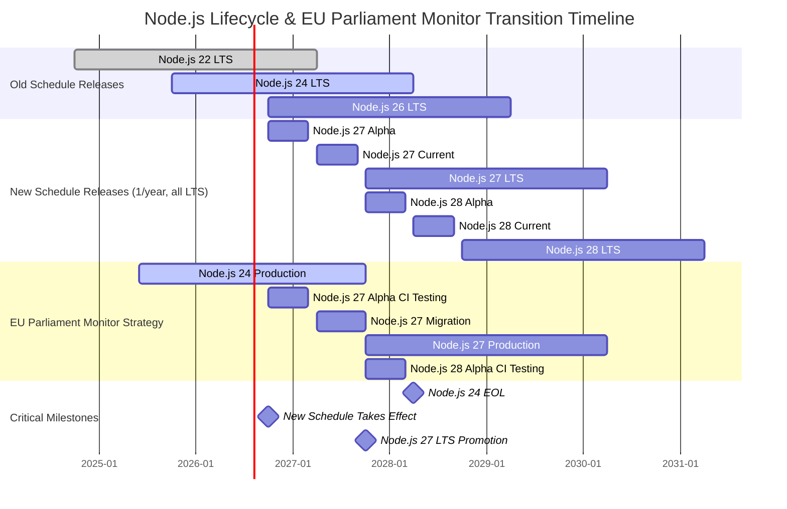
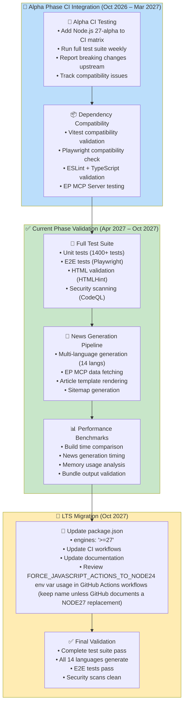
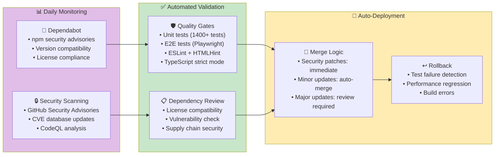
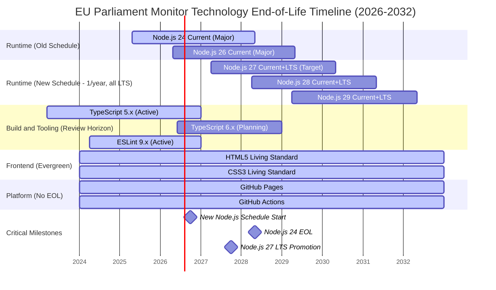
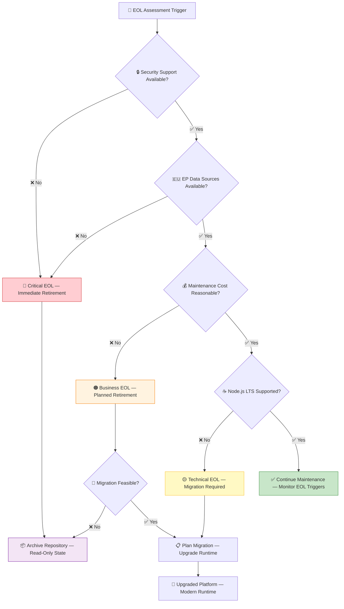

<p align="center">
  
</p>

<h1 align="center">📦 EU Parliament Monitor — End-of-Life Strategy</h1>

<p align="center">
  <strong>🛡️ Proactive Technology Lifecycle Management for European Parliament Intelligence</strong><br>
  <em>📦 Current Stack Maintenance • 🔄 Node.js Lifecycle Planning • ⚡ Future-Ready Architecture</em>
</p>

<p align="center">
  <a href="#"></a>
  <a href="#"></a>
  <a href="#"></a>
  <a href="#"></a>
</p>

**📋 Document Owner:** CEO | **📄 Version:** 2.0 | **📅 Last Updated:** 2026-03-12 (UTC)  
**🔄 Review Cycle:** Annual | **⏰ Next Review:** 2027-03-12  
**🏷️ Classification:** Public (Static Site European Parliament Intelligence Platform)

---

## 📚 Architecture Documentation Map

<div class="documentation-map">

| Document                                                            | Focus           | Description                                    | Documentation Link                                                                                     |
| ------------------------------------------------------------------- | --------------- | ---------------------------------------------- | ------------------------------------------------------------------------------------------------------ |
| **[Architecture](ARCHITECTURE.md)**                                 | 🏛️ Architecture | C4 model showing current system structure      | [View Source](https://github.com/Hack23/euparliamentmonitor/blob/main/ARCHITECTURE.md)                 |
| **[Future Architecture](FUTURE_ARCHITECTURE.md)**                   | 🏛️ Architecture | C4 model showing future system structure       | [View Source](https://github.com/Hack23/euparliamentmonitor/blob/main/FUTURE_ARCHITECTURE.md)          |
| **[Mindmaps](MINDMAP.md)**                                          | 🧠 Concept      | Current system component relationships         | [View Source](https://github.com/Hack23/euparliamentmonitor/blob/main/MINDMAP.md)                      |
| **[Future Mindmaps](FUTURE_MINDMAP.md)**                            | 🧠 Concept      | Future capability evolution                    | [View Source](https://github.com/Hack23/euparliamentmonitor/blob/main/FUTURE_MINDMAP.md)               |
| **[SWOT Analysis](SWOT.md)**                                        | 💼 Business     | Current strategic assessment                   | [View Source](https://github.com/Hack23/euparliamentmonitor/blob/main/SWOT.md)                         |
| **[Future SWOT Analysis](FUTURE_SWOT.md)**                          | 💼 Business     | Future strategic opportunities                 | [View Source](https://github.com/Hack23/euparliamentmonitor/blob/main/FUTURE_SWOT.md)                  |
| **[Data Model](DATA_MODEL.md)**                                     | 📊 Data         | Current data structures and relationships      | [View Source](https://github.com/Hack23/euparliamentmonitor/blob/main/DATA_MODEL.md)                   |
| **[Future Data Model](FUTURE_DATA_MODEL.md)**                       | 📊 Data         | Enhanced European Parliament data architecture | [View Source](https://github.com/Hack23/euparliamentmonitor/blob/main/FUTURE_DATA_MODEL.md)            |
| **[Flowcharts](FLOWCHART.md)**                                      | 🔄 Process      | Current data processing workflows              | [View Source](https://github.com/Hack23/euparliamentmonitor/blob/main/FLOWCHART.md)                    |
| **[Future Flowcharts](FUTURE_FLOWCHART.md)**                        | 🔄 Process      | Enhanced AI-driven workflows                   | [View Source](https://github.com/Hack23/euparliamentmonitor/blob/main/FUTURE_FLOWCHART.md)             |
| **[State Diagrams](STATEDIAGRAM.md)**                               | 🔄 Behavior     | Current system state transitions               | [View Source](https://github.com/Hack23/euparliamentmonitor/blob/main/STATEDIAGRAM.md)                 |
| **[Future State Diagrams](FUTURE_STATEDIAGRAM.md)**                 | 🔄 Behavior     | Enhanced adaptive state transitions            | [View Source](https://github.com/Hack23/euparliamentmonitor/blob/main/FUTURE_STATEDIAGRAM.md)          |
| **[Security Architecture](SECURITY_ARCHITECTURE.md)**               | 🛡️ Security     | Current security implementation                | [View Source](https://github.com/Hack23/euparliamentmonitor/blob/main/SECURITY_ARCHITECTURE.md)        |
| **[Future Security Architecture](FUTURE_SECURITY_ARCHITECTURE.md)** | 🛡️ Security     | Security enhancement roadmap                   | [View Source](https://github.com/Hack23/euparliamentmonitor/blob/main/FUTURE_SECURITY_ARCHITECTURE.md) |
| **[Threat Model](THREAT_MODEL.md)**                                 | 🎯 Security     | STRIDE threat analysis                         | [View Source](https://github.com/Hack23/euparliamentmonitor/blob/main/THREAT_MODEL.md)                 |
| **[Classification](CLASSIFICATION.md)**                             | 🏷️ Governance   | CIA classification & BCP                       | [View Source](https://github.com/Hack23/euparliamentmonitor/blob/main/CLASSIFICATION.md)               |
| **[CRA Assessment](CRA-ASSESSMENT.md)**                             | 🛡️ Compliance   | Cyber Resilience Act                           | [View Source](https://github.com/Hack23/euparliamentmonitor/blob/main/CRA-ASSESSMENT.md)               |
| **[Workflows](WORKFLOWS.md)**                                       | ⚙️ DevOps       | CI/CD documentation                            | [View Source](https://github.com/Hack23/euparliamentmonitor/blob/main/WORKFLOWS.md)                    |
| **[Future Workflows](FUTURE_WORKFLOWS.md)**                         | 🚀 DevOps       | Planned CI/CD enhancements                     | [View Source](https://github.com/Hack23/euparliamentmonitor/blob/main/FUTURE_WORKFLOWS.md)             |
| **[Business Continuity Plan](BCPPlan.md)**                          | 🔄 Resilience   | Recovery planning                              | [View Source](https://github.com/Hack23/euparliamentmonitor/blob/main/BCPPlan.md)                      |
| **[Financial Security Plan](FinancialSecurityPlan.md)**             | 💰 Financial    | Cost & security analysis                       | [View Source](https://github.com/Hack23/euparliamentmonitor/blob/main/FinancialSecurityPlan.md)        |
| **[End-of-Life Strategy](End-of-Life-Strategy.md)**                 | 📦 Lifecycle    | Technology EOL planning                        | [View Source](https://github.com/Hack23/euparliamentmonitor/blob/main/End-of-Life-Strategy.md)         |
| **[Unit Test Plan](UnitTestPlan.md)**                               | 🧪 Testing      | Unit testing strategy                          | [View Source](https://github.com/Hack23/euparliamentmonitor/blob/main/UnitTestPlan.md)                 |
| **[E2E Test Plan](E2ETestPlan.md)**                                 | 🔍 Testing      | End-to-end testing                             | [View Source](https://github.com/Hack23/euparliamentmonitor/blob/main/E2ETestPlan.md)                  |
| **[Performance Testing](performance-testing.md)**                   | ⚡ Performance  | Performance benchmarks                         | [View Source](https://github.com/Hack23/euparliamentmonitor/blob/main/performance-testing.md)          |
| **[Security Policy](SECURITY.md)**                                  | 🔒 Security     | Vulnerability reporting & security policy      | [View Source](https://github.com/Hack23/euparliamentmonitor/blob/main/SECURITY.md)                     |

</div>

---

## 🎯 EOL Strategy Overview

### 📋 Strategic Objective

**EU Parliament Monitor** maintains a modern frontend-only static site architecture using HTML5, CSS3, and the Node.js 24 LTS toolchain for build and content generation. This strategy ensures proactive lifecycle management of all technology components to prevent security exposure, maintain platform stability, and align with [Hack23 AB's Vulnerability Management Policy](https://github.com/Hack23/ISMS-PUBLIC/blob/main/Vulnerability_Management.md) **"Living on the Edge"** philosophy.

This strategy aligns with the [Hack23 AB Secure Development Policy](https://github.com/Hack23/ISMS-PUBLIC/blob/main/Secure_Development_Policy.md) requirement for comprehensive lifecycle documentation.

### 🏷️ Business Impact Classification

Based on [Hack23 AB Classification Framework](https://github.com/Hack23/ISMS-PUBLIC/blob/main/CLASSIFICATION.md):

| Security Dimension     | Level                                                                                                                                                                      | EOL Impact | Business Rationale                                                     |
| ---------------------- | -------------------------------------------------------------------------------------------------------------------------------------------------------------------------- | ---------- | ---------------------------------------------------------------------- |
| **🔐 Confidentiality** | [](https://github.com/Hack23/ISMS-PUBLIC/blob/main/CLASSIFICATION.md#confidentiality-levels)   | Low        | All EP data is publicly available open data |
| **🔒 Integrity**       | [](https://github.com/Hack23/ISMS-PUBLIC/blob/main/CLASSIFICATION.md#integrity-levels)        | Medium     | News content accuracy matters for democratic transparency |
| **⚡ Availability**    | [](https://github.com/Hack23/ISMS-PUBLIC/blob/main/CLASSIFICATION.md#availability-levels) | Medium     | Static site with CDN caching provides inherent resilience |

**🎯 RTO/RPO Alignment:** Standard RTO (2hrs for critical recovery per BCPPlan.md), RPO 0 minutes (Git-backed), acceptable for public intelligence platform

---

## 📦 Current Technology Stack Analysis

### 🏗️ Core Technology Matrix

```mermaid
mindmap
  root((🇪🇺 EU Parliament Monitor Stack))
    (🖥️ Runtime)
      ☕ Node.js 24.x LTS
        📅 Current LTS
        ⏰ EOL: ~Apr 2028
        🔄 Next LTS: Node.js 26
        🎯 Target (annual cadence): Node.js 27
      🌐 Browser Runtime
        📅 Evergreen Updates
        ⏰ EOL: N/A
        🔄 HTML5 Living Standard
    (🏗️ Frontend)
      📄 HTML5 Living Standard
        📅 Evergreen
        ⏰ EOL: N/A
        🔄 No migration needed
      🎨 CSS3 Living Standard
        📅 Evergreen
        ⏰ EOL: N/A
        🔄 No migration needed
      📱 Responsive Design
        📅 Standards-based
        ⏰ EOL: N/A
        🔄 Progressive Enhancement
    (🛠️ Build & Tooling)
      📝 TypeScript 5.x
        📅 Current: Latest
        ⏰ EOL: ~6-month cycles
        🔄 Strict Mode Enabled
      ⚡ ESLint 9.x
        📅 Current: Latest
        ⏰ EOL: Active
        🔄 Flat Config System
      📋 HTMLHint
        📅 Current: Stable
        ⏰ EOL: Active
        🔄 HTML Validation
    (🧪 Testing & Quality)
      🧪 Vitest
        📅 Current: Latest
        ⏰ EOL: Active
        🔄 Native ESM Support
      🔧 Playwright
        📅 Current: Latest
        ⏰ EOL: Active
        🔄 E2E Testing
    (📡 Data & Integration)
      🇪🇺 EP MCP Server
        📅 Active Development
        ⏰ EOL: Hack23-maintained
        🔄 European Parliament API
      📰 News Generation
        📅 Custom Pipeline
        ⏰ EOL: Internal
        🔄 14-Language Output
```

### 📊 Technology Lifecycle Overview

| **Technology Category** | **Current Version**       | **Release Model**               | **EOL Timeline**   | **Migration Complexity**                                                                                                                                |
| ----------------------- | ------------------------- | ------------------------------- | ------------------ | ------------------------------------------------------------------------------------------------------------------------------------------------------- |
| **☕ Node.js Runtime**  | 24.x (LTS)               | Annual LTS (new schedule from v27) | **~Apr 2028**   | [](https://github.com/Hack23/ISMS-PUBLIC/blob/main/CLASSIFICATION.md)     |
| **📝 TypeScript**       | 5.x (Latest)             | Major every 6 months            | Active development | [](https://github.com/Hack23/ISMS-PUBLIC/blob/main/CLASSIFICATION.md)   |
| **📄 HTML5/CSS3**       | Living Standard           | Evergreen                       | N/A (Perpetual)    | [](https://github.com/Hack23/ISMS-PUBLIC/blob/main/CLASSIFICATION.md)  |
| **⚡ ESLint**           | 9.x (Latest)             | Major annually                  | Active development | [](https://github.com/Hack23/ISMS-PUBLIC/blob/main/CLASSIFICATION.md)   |
| **🧪 Vitest**           | Latest                    | Major annually                  | Active development | [](https://github.com/Hack23/ISMS-PUBLIC/blob/main/CLASSIFICATION.md)   |
| **🔧 Playwright**       | Latest                    | Monthly releases                | Active development | [](https://github.com/Hack23/ISMS-PUBLIC/blob/main/CLASSIFICATION.md)   |
| **🇪🇺 EP MCP Server**   | Latest                    | Hack23-maintained               | Active development | [](https://github.com/Hack23/ISMS-PUBLIC/blob/main/CLASSIFICATION.md) |
| **☁️ AWS S3**           | Platform (Primary hosting)| Ongoing                         | N/A (Platform)     | [](https://github.com/Hack23/ISMS-PUBLIC/blob/main/CLASSIFICATION.md)  |
| **🌐 AWS CloudFront**   | Platform (Primary CDN)    | Ongoing                         | N/A (Platform)     | [](https://github.com/Hack23/ISMS-PUBLIC/blob/main/CLASSIFICATION.md)  |
| **📦 GitHub Pages**     | Alternative platform (fallback) | Ongoing                    | N/A (Platform)     | [](https://github.com/Hack23/ISMS-PUBLIC/blob/main/CLASSIFICATION.md)  |
| **⚙️ GitHub Actions**   | Platform                  | Ongoing                         | N/A (Platform)     | [](https://github.com/Hack23/ISMS-PUBLIC/blob/main/CLASSIFICATION.md)  |

---

## ☕ Node.js Lifecycle & Transition Strategy

### 🔄 New Node.js Release Schedule (Effective October 2026)

> **Important (announced as of March 2025; subject to Node.js TSC updates):** Starting with Node.js 27.x, the Node.js project has moved from two major releases per year to **one major release per year**. Every release becomes LTS — the odd/even distinction is eliminated. The calendar-year alignment (e.g., 27 = 2027) and phase timings described below are based on the [Evolving the Node.js Release Schedule](https://nodejs.org/en/blog/announcements/evolving-the-nodejs-release-schedule) announcement and may be revised by the Node.js Technical Steering Committee. This document will be updated if the schedule changes materially.

#### New Schedule Phases

| Phase | Duration | Description |
|-------|----------|-------------|
| **Alpha** | 6 months (Oct–Mar) | Early testing, semver-major changes allowed |
| **Current** | 6 months (Apr–Oct) | Stabilization, production-ready |
| **LTS** | 30 months | Long-term support with security fixes |
| **EOL** | — | No further support |
| **Total Support** | **36 months** | From first Current release to End of Life |

#### Key Changes from Old Schedule (as announced March 2025; subject to Node.js TSC revisions)

| Aspect | Old Schedule (≤ v26) | New Schedule (≥ v27, proposed) |
|--------|---------------------|----------------------|
| **Major releases/year** | 2 (even = LTS, odd = Current only) | 1 (every release becomes LTS) |
| **LTS eligibility** | Even-numbered only | Every release |
| **Version naming** | Sequential | Sequential (future naming subject to Node.js TSC decisions) |
| **Alpha channel** | None | 6-month alpha with semver-major |
| **Concurrent release lines** | 4–5 | Fewer (reduced volunteer burden) |

### 🎯 Strategic Node.js Lifecycle Management

Following [Hack23 AB's Proactive Runtime Management](https://github.com/Hack23/ISMS-PUBLIC/blob/main/Vulnerability_Management.md), EU Parliament Monitor implements a **current-LTS-first** approach for optimal security and performance.



### 📋 Node.js Transition Trigger Conditions

#### 🟢 Proactive Migration Triggers (Preferred)

1. **📅 Node.js 27 Alpha Release:** October 2026 — Begin CI integration testing
2. **📅 Node.js 27 Current Release:** April 2027 — Begin migration planning
3. **🛡️ Security Feature Advantages:** Enhanced security features in Node.js 27
4. **⚡ Performance Improvements:** Significant V8 or runtime optimizations
5. **📦 Ecosystem Compatibility:** Major dependencies requiring Node.js 27+

#### 🟡 Risk-Based Migration Triggers (Monitored)

1. **⏰ 12-Month Warning:** April 2027 — 12 months before Node.js 24 EOL
2. **🚨 Security Support Concerns:** Security patch availability degradation
3. **🔧 Tooling Incompatibility:** Build/development tools requiring newer Node.js
4. **📦 Dependency Requirements:** npm packages dropping Node.js 24 support

#### 🔴 Critical Migration Triggers (Mandatory)

1. **⛔ Node.js 24 EOL:** April 2028 — End of security support
2. **🚨 Critical Vulnerability:** Unpatched security issues in Node.js 24
3. **🔧 Build System Incompatibility:** Essential tools no longer supporting Node.js 24
4. **📦 EP MCP Server Requirements:** European Parliament MCP Server requiring newer Node.js

### 🧪 Node.js 27 Testing & Validation Strategy

> **Per the new Node.js release schedule:** Library authors and application maintainers should integrate Alpha releases into CI as early as possible. If you only test on LTS releases, you will not be able to report bugs before they affect your users.



### 📊 Node.js Migration Risk Assessment

| Risk Category                     | Probability | Impact | Mitigation Strategy                  | Success Criteria            |
| --------------------------------- | ----------- | ------ | ------------------------------------ | --------------------------- |
| **📦 Dependency Incompatibility** | [](https://github.com/Hack23/ISMS-PUBLIC/blob/main/CLASSIFICATION.md) | [](https://github.com/Hack23/ISMS-PUBLIC/blob/main/CLASSIFICATION.md) | Early alpha CI integration + dependency audit | All dependencies compatible |
| **⚡ Performance Regression**     | [](https://github.com/Hack23/ISMS-PUBLIC/blob/main/CLASSIFICATION.md) | [](https://github.com/Hack23/ISMS-PUBLIC/blob/main/CLASSIFICATION.md) | Performance benchmarking before/after | <5% performance degradation |
| **🔧 Build System Changes**       | [](https://github.com/Hack23/ISMS-PUBLIC/blob/main/CLASSIFICATION.md) | [](https://github.com/Hack23/ISMS-PUBLIC/blob/main/CLASSIFICATION.md) | TypeScript + ESLint compatibility testing | Build process unchanged     |
| **📰 News Generation Impact**     | [](https://github.com/Hack23/ISMS-PUBLIC/blob/main/CLASSIFICATION.md) | [](https://github.com/Hack23/ISMS-PUBLIC/blob/main/CLASSIFICATION.md) | Validate all 14 language outputs | All languages generate correctly |
| **🔒 Security Control Impact**    | [](https://github.com/Hack23/ISMS-PUBLIC/blob/main/CLASSIFICATION.md) | [](https://github.com/Hack23/ISMS-PUBLIC/blob/main/CLASSIFICATION.md) | Security scanning + SLSA attestation | Security posture maintained |

---

## 📊 Dependency Lifecycle Management

### 📦 Key Dependencies

| 📋 **Dependency** | 🔧 **Purpose** | 📊 **Risk Level** | 🔄 **Update Strategy** |
|-------------------|---------------|-------------------|----------------------|
| **Vitest** | Unit testing (1400+ tests) | 🟢 Low | Dependabot auto-updates |
| **Playwright** | E2E testing | 🟢 Low | Dependabot auto-updates |
| **ESLint** | Code quality & security | 🟢 Low | Dependabot auto-updates |
| **TypeScript** | Type-safe development | 🟢 Low | Dependabot auto-updates |
| **HTMLHint** | HTML validation | 🟢 Low | Dependabot auto-updates |
| **JSDoc/TypeDoc** | API documentation | 🟢 Low | Manual major version review |
| **EP MCP Server** | EU Parliament data | 🟡 Moderate | Monitor for API changes |
| **@axe-core/playwright** | Accessibility testing | 🟢 Low | Dependabot auto-updates |
| **Prettier** | Code formatting | 🟢 Low | Dependabot auto-updates |

### 📦 Dependency Management Philosophy

Aligned with [Hack23 AB's "Living on the Edge" Strategy](https://github.com/Hack23/ISMS-PUBLIC/blob/main/Vulnerability_Management.md):

- **📦 Always Latest:** Accept Dependabot PRs for latest stable releases
- **🛡️ Security Gates:** Automated testing and security validation before merge
- **🔍 Dependency Review:** GitHub's Dependency Review Action with OpenSSF Scorecard
- **✅ Test-Driven Confidence:** Trust comprehensive test suites (1400+ unit tests, E2E tests)
- **🚨 Rapid Response:** <4 hours for critical security vulnerabilities

### 🔍 Automated Dependency Updates



### 📋 Update Classification & Response Times

| Update Type             | Response Time | Security Gate             | Merge Strategy       |
| ----------------------- | ------------- | ------------------------- | -------------------- |
| **🔴 Security Patches** | <4 hours      | Dependency Review + Tests | Auto-merge on green  |
| **🟠 Major Releases**   | <24 hours     | Full test suite + review  | Manual review required |
| **🟡 Minor Releases**   | <8 hours      | Standard testing          | Auto-merge on green  |
| **🟢 Patch Releases**   | <2 hours      | Basic validation          | Immediate auto-merge |

---

## ⏰ End-of-Life Tracking & Monitoring

### 📊 Technology EOL Dashboard



### 🚨 EOL Warning System

| Warning Level         | Timeline   | Actions Required                              | Escalation |
| --------------------- | ---------- | --------------------------------------------- | ---------- |
| **🟢 Early Warning**  | 24+ months | Technology assessment, alternative evaluation | [](https://github.com/Hack23/ISMS-PUBLIC/blob/main/CLASSIFICATION.md) |
| **🟡 Planning Phase** | 18+ months | Migration strategy development, CI testing    | [](https://github.com/Hack23/ISMS-PUBLIC/blob/main/CLASSIFICATION.md) |
| **🟠 Implementation** | 12+ months | Active migration, compatibility testing       | [](https://github.com/Hack23/ISMS-PUBLIC/blob/main/CLASSIFICATION.md) |
| **🔴 Critical Phase** | 6+ months  | Final testing, production migration           | [](https://github.com/Hack23/ISMS-PUBLIC/blob/main/CLASSIFICATION.md) |
| **⛔ Emergency**      | <6 months  | Mandatory migration, risk acceptance review   | [](https://github.com/Hack23/ISMS-PUBLIC/blob/main/CLASSIFICATION.md) |

---

## 🛡️ Risk Mitigation

### Technology Risks

| 🚨 **Risk** | 📊 **Probability** | 💥 **Impact** | 🔧 **Mitigation** |
|------------|--------------------|--------------|--------------------|
| Node.js LTS EOL | Planned (Apr 2028) | Low | Proactive upgrade to Node.js 27 with alpha CI integration |
| GitHub Pages discontinuation | Very Low | High | Static files portable to any CDN host (Cloudflare, Netlify, S3) |
| EP data source changes | Low | High | MCP Server abstraction layer isolates data format changes |
| Dependency abandonment | Low | Medium | Minimal dependency footprint; all devDependencies only |
| Browser compatibility changes | Very Low | Low | Standard HTML5/CSS3 only; no framework-specific rendering |
| TypeScript major breaking change | Low | Medium | Incremental adoption of new TS features; strict mode already enabled |
| ESLint flat config migration | Done | None | Already migrated to flat config (eslint.config.js) |

### 🛑 Project Retirement Triggers

The project would enter sunset phase if ANY of these conditions occur:

#### 🔴 Critical EOL Triggers (Immediate Retirement)

1. **🚨 Security Support Failure:** No security patches available for critical vulnerabilities in core runtime
2. **🌐 EP Data Source Permanent Loss:** European Parliament permanently discontinues all open data APIs
3. **📦 Dependency Chain Collapse:** Multiple critical build dependencies reach EOL simultaneously

#### 🟠 Business EOL Triggers (Planned Retirement)

1. **💰 Maintenance Cost Exceeds Value:** Security maintenance costs exceed democratic transparency value
2. **🏆 Technology Replacement:** Superior EP monitoring platform renders this obsolete
3. **📋 Regulatory Incompatibility:** New regulations incompatible with static site architecture

#### 🟡 Technical EOL Triggers (Migration Required)

1. **☕ Node.js Runtime End:** No supported Node.js LTS version available
2. **🏗️ GitHub Pages Architecture Change:** Platform changes breaking static site deployment
3. **📡 MCP Protocol Evolution:** EP MCP Server protocol breaking changes requiring full rewrite

### 📊 EOL Decision Matrix



### Graceful Sunset Process

If sunset is triggered:

1. 📢 Announce deprecation 12 months in advance via GitHub and platform
2. 🔒 Freeze feature development, security patches only
3. 📰 Generate final set of news articles in all 14 languages
4. 📦 Archive repository with full documentation
5. 🔄 Transfer to community maintainers if interest exists
6. 📋 Document lessons learned and technology retrospective

---

## 🔄 Technology Succession Planning

### 🚀 Future Platform Vision

Should EOL conditions trigger migration, the successor platform will maintain **democratic transparency mission** while leveraging modern technology:

| Component | Current | Future Candidate | Migration Complexity |
|-----------|---------|-------------------|---------------------|
| **☕ Runtime** | Node.js 24 | Node.js 27+ (new annual schedule) | [](https://github.com/Hack23/ISMS-PUBLIC/blob/main/CLASSIFICATION.md) |
| **📝 Language** | TypeScript 5.x | TypeScript 6.x+ | [](https://github.com/Hack23/ISMS-PUBLIC/blob/main/CLASSIFICATION.md) |
| **📄 Frontend** | HTML5/CSS3 (static) | HTML5/CSS3 (evergreen, no change) | [](https://github.com/Hack23/ISMS-PUBLIC/blob/main/CLASSIFICATION.md) |
| **📦 Hosting** | AWS S3 + CloudFront (primary), GitHub Pages (fallback) | AWS S3 + CloudFront / Cloudflare Pages | [](https://github.com/Hack23/ISMS-PUBLIC/blob/main/CLASSIFICATION.md) |
| **📡 Data** | EP MCP Server | EP MCP Server v2+ | [](https://github.com/Hack23/ISMS-PUBLIC/blob/main/CLASSIFICATION.md) |

---

## 🛡️ Security & Compliance EOL Controls

| Framework Requirement | EOL Control | Implementation | Status |
|-----------------------|-------------|----------------|--------|
| ISO 27001:2022 A.8.8 | Technical vulnerability management | Dependabot auto-update, npm audit, CodeQL | ✅ |
| CIS Controls 2.2 | Ensure authorized software is supported | Node.js LTS-only policy, Dependabot | ✅ |
| NIST CSF PR.PS-02 | Software maintained and supported | package.json `engines: >=24`, LTS upgrades | ✅ |
| NIS2 Art.21(2)(d) | Supply chain security | Dependency lifecycle tracking, SBOM | ✅ |
| EU CRA Annex I §2 | Security updates throughout lifecycle | Automated patch management process | ✅ |
| ISO 27001:2022 A.5.37 | Documented operating procedures | This EOL Strategy + WORKFLOWS.md | ✅ |

**EOL Policy Alignment**: ✅ **All framework requirements met through automated tooling**

---

## 📅 EOL Action Timeline

```
2026-03-12 (Now)    Node.js 24 LTS ✅ Active Production
2026-10-01          🆕 New Node.js release schedule takes effect
2026-10-01          🔬 Node.js 27 Alpha — Add to CI matrix for early testing
2027-04-01          📦 Node.js 27 Current — Begin migration validation
2027-10-01          ✅ Node.js 27 LTS — Complete migration, update engines
2028-04-30          ⚠️  Node.js 24 EOL — Must be on a supported Node.js LTS (26/27+) by this date
2028-10-01          🔬 Node.js 28 Alpha — Add to CI matrix
2029-04-01          📦 Node.js 28 Current — Evaluate for next migration cycle
2030-04-30          ⚠️  Node.js 27 EOL — Plan Node.js 28+ migration
```

---

## 📋 Maintenance Schedule

| 📅 **Activity** | 🔄 **Frequency** | 📋 **Responsible** |
|-----------------|------------------|-------------------|
| Dependency updates (Dependabot) | Daily | Automated |
| Security vulnerability patches | As needed (<4hrs critical) | Development team |
| Node.js Alpha CI integration | Per new Alpha release (annual) | Development team |
| Node.js LTS version upgrade | Per new LTS release (annual) | Development team |
| Framework major version review | Quarterly | Development team |
| EOL strategy review | Annual | CEO |
| Content freshness validation | Monthly | News generation pipeline |
| SBOM generation and review | Per release | Automated (GitHub Actions) |

---

## 📊 Monitoring & Alerting Framework

### 📈 Key EOL Metrics

- **⏰ Days Until EOL:** Automated countdown for Node.js 24 (target: migrate before Apr 2028)
- **🛡️ Security Patch Availability:** Response time and availability tracking via Dependabot
- **📦 Dependency Health Score:** OpenSSF Scorecard and vulnerability status
- **⚡ Build Performance Tracking:** TypeScript compilation and news generation timing
- **🧪 Test Pass Rate:** 1400+ unit tests + E2E test suite health

### 🚨 Alerting Thresholds

- **🔴 Critical (0-6 months to EOL):** Weekly alerts, mandatory migration completion
- **🟠 High (6-12 months to EOL):** Monthly status reports, active migration
- **🟡 Medium (12-18 months to EOL):** Quarterly reviews, CI integration testing
- **🟢 Low (18+ months to EOL):** Annual strategic planning inclusion

---

## 🔗 Related Documentation

### 🔐 ISMS Policies
- [🛠️ Secure Development Policy](https://github.com/Hack23/ISMS-PUBLIC/blob/main/Secure_Development_Policy.md)
- [🔍 Vulnerability Management](https://github.com/Hack23/ISMS-PUBLIC/blob/main/Vulnerability_Management.md)
- [📝 Change Management](https://github.com/Hack23/ISMS-PUBLIC/blob/main/Change_Management.md)
- [📋 Open Source Policy](https://github.com/Hack23/ISMS-PUBLIC/blob/main/Open_Source_Policy.md)
- [🏷️ Classification Framework](https://github.com/Hack23/ISMS-PUBLIC/blob/main/CLASSIFICATION.md)
- [🚨 Incident Response Plan](https://github.com/Hack23/ISMS-PUBLIC/blob/main/Incident_Response_Plan.md)

### 🏛️ Project Documentation
- [🏛️ Architecture](ARCHITECTURE.md) — System design with EOL considerations
- [🚀 Future Architecture](FUTURE_ARCHITECTURE.md) — Migration path and next-generation vision
- [🛡️ Security Architecture](SECURITY_ARCHITECTURE.md) — Security controls aligned with EOL timeline
- [🔄 Business Continuity Plan](BCPPlan.md) — Recovery planning
- [💰 Financial Security Plan](FinancialSecurityPlan.md) — Cost analysis
- [🛡️ CRA Assessment](CRA-ASSESSMENT.md) — Cyber Resilience Act
- [⚙️ Workflows](WORKFLOWS.md) — CI/CD documentation

### 📋 External References
- [☕ Node.js Release Schedule (New)](https://nodejs.org/en/blog/announcements/evolving-the-nodejs-release-schedule) — New annual release model
- [☕ Node.js EOL Dates](https://endoflife.date/nodejs) — Node.js runtime lifecycle tracking
- [📝 TypeScript Releases](https://endoflife.date/typescript) — TypeScript lifecycle
- [📦 endoflife.date](https://endoflife.date/) — General technology end-of-life tracking

---

**📋 Document Control:**  
**✅ Approved by:** James Pether Sörling, CEO  
**📤 Distribution:** Public  
**🏷️ Classification:** [](https://github.com/Hack23/ISMS-PUBLIC/blob/main/CLASSIFICATION.md#confidentiality-levels) [](https://github.com/Hack23/ISMS-PUBLIC/blob/main/CLASSIFICATION.md#integrity-levels) [](https://github.com/Hack23/ISMS-PUBLIC/blob/main/CLASSIFICATION.md#availability-levels)  
**🎯 Framework Compliance:** [](https://github.com/Hack23/ISMS-PUBLIC/blob/main/CLASSIFICATION.md) [](https://github.com/Hack23/ISMS-PUBLIC/blob/main/CLASSIFICATION.md) [](https://github.com/Hack23/ISMS-PUBLIC/blob/main/CLASSIFICATION.md)
