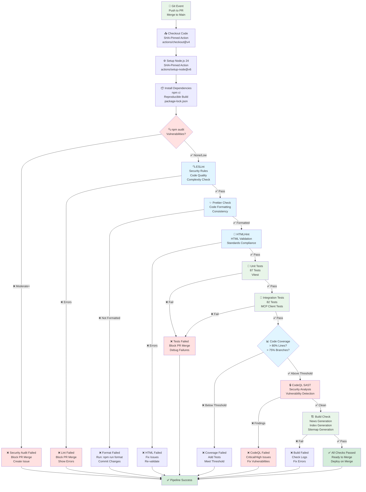
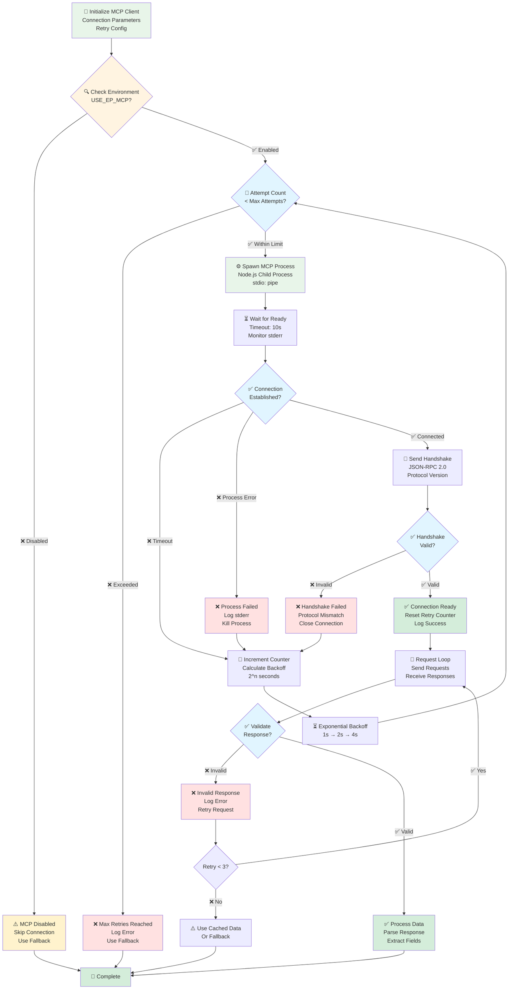
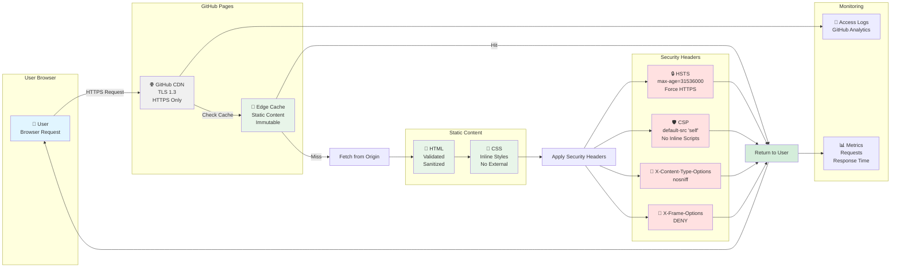
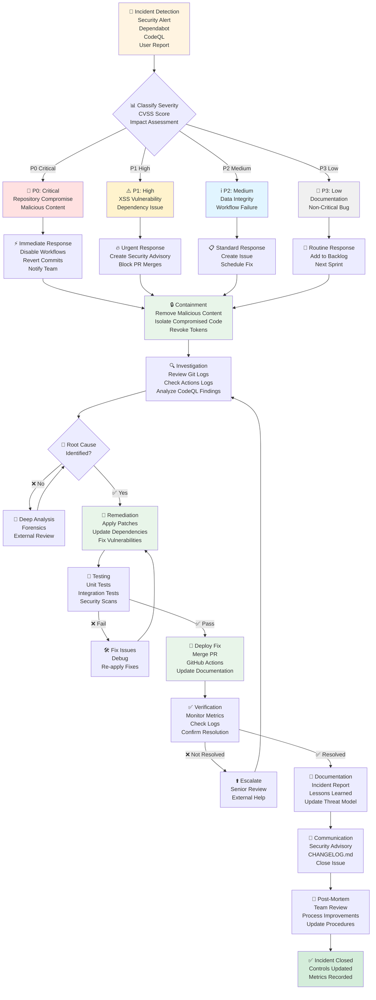

<p align="center">
  
</p>

<h1 align="center">🔄 EU Parliament Monitor — Flowcharts</h1>

<p align="center">
  <strong>Process & Data Flow Documentation for European Parliament Intelligence</strong><br>
  <em>📈 Security Flows • 🔄 CI/CD Pipeline • 📊 Data Processing</em>
</p>

<p align="center">
  <a href="#"></a>
  <a href="#"></a>
  <a href="#"></a>
  <a href="#"></a>
</p>

**📋 Document Owner:** CEO | **📄 Version:** 1.1 | **📅 Last Updated:**
2026-02-21 (UTC)  
**🔄 Review Cycle:** Quarterly | **⏰ Next Review:** 2026-05-24

---

## 📚 Architecture Documentation Map

<div class="documentation-map">

| Document                                                            | Focus           | Description                                    | Documentation Link                                                                                     |
| ------------------------------------------------------------------- | --------------- | ---------------------------------------------- | ------------------------------------------------------------------------------------------------------ |
| **[Architecture](ARCHITECTURE.md)**                                 | 🏛️ Architecture | C4 model showing current system structure      | [View Source](https://github.com/Hack23/euparliamentmonitor/blob/main/ARCHITECTURE.md)                 |
| **[Future Architecture](FUTURE_ARCHITECTURE.md)**                   | 🏛️ Architecture | C4 model showing future system structure       | [View Source](https://github.com/Hack23/euparliamentmonitor/blob/main/FUTURE_ARCHITECTURE.md)          |
| **[Mindmaps](MINDMAP.md)**                                          | 🧠 Concept      | Current system component relationships         | [View Source](https://github.com/Hack23/euparliamentmonitor/blob/main/MINDMAP.md)                      |
| **[Future Mindmaps](FUTURE_MINDMAP.md)**                            | 🧠 Concept      | Future capability evolution                    | [View Source](https://github.com/Hack23/euparliamentmonitor/blob/main/FUTURE_MINDMAP.md)               |
| **[SWOT Analysis](SWOT.md)**                                        | 💼 Business     | Current strategic assessment                   | [View Source](https://github.com/Hack23/euparliamentmonitor/blob/main/SWOT.md)                         |
| **[Future SWOT Analysis](FUTURE_SWOT.md)**                          | 💼 Business     | Future strategic opportunities                 | [View Source](https://github.com/Hack23/euparliamentmonitor/blob/main/FUTURE_SWOT.md)                  |
| **[Data Model](DATA_MODEL.md)**                                     | 📊 Data         | Current data structures and relationships      | [View Source](https://github.com/Hack23/euparliamentmonitor/blob/main/DATA_MODEL.md)                   |
| **[Future Data Model](FUTURE_DATA_MODEL.md)**                       | 📊 Data         | Enhanced European Parliament data architecture | [View Source](https://github.com/Hack23/euparliamentmonitor/blob/main/FUTURE_DATA_MODEL.md)            |
| **[Flowcharts](FLOWCHART.md)**                                      | 🔄 Process      | Current data processing workflows              | [View Source](https://github.com/Hack23/euparliamentmonitor/blob/main/FLOWCHART.md)                    |
| **[Future Flowcharts](FUTURE_FLOWCHART.md)**                        | 🔄 Process      | Enhanced AI-driven workflows                   | [View Source](https://github.com/Hack23/euparliamentmonitor/blob/main/FUTURE_FLOWCHART.md)             |
| **[State Diagrams](STATEDIAGRAM.md)**                               | 🔄 Behavior     | Current system state transitions               | [View Source](https://github.com/Hack23/euparliamentmonitor/blob/main/STATEDIAGRAM.md)                 |
| **[Future State Diagrams](FUTURE_STATEDIAGRAM.md)**                 | 🔄 Behavior     | Enhanced adaptive state transitions            | [View Source](https://github.com/Hack23/euparliamentmonitor/blob/main/FUTURE_STATEDIAGRAM.md)          |
| **[Security Architecture](SECURITY_ARCHITECTURE.md)**               | 🛡️ Security     | Current security implementation                | [View Source](https://github.com/Hack23/euparliamentmonitor/blob/main/SECURITY_ARCHITECTURE.md)        |
| **[Future Security Architecture](FUTURE_SECURITY_ARCHITECTURE.md)** | 🛡️ Security     | Security enhancement roadmap                   | [View Source](https://github.com/Hack23/euparliamentmonitor/blob/main/FUTURE_SECURITY_ARCHITECTURE.md) |
| **[Threat Model](THREAT_MODEL.md)**                                 | 🎯 Security     | STRIDE threat analysis                         | [View Source](https://github.com/Hack23/euparliamentmonitor/blob/main/THREAT_MODEL.md)                 |
| **[Classification](CLASSIFICATION.md)**                             | 🏷️ Governance   | CIA classification & BCP                       | [View Source](https://github.com/Hack23/euparliamentmonitor/blob/main/CLASSIFICATION.md)               |
| **[CRA Assessment](CRA-ASSESSMENT.md)**                             | 🛡️ Compliance   | Cyber Resilience Act                           | [View Source](https://github.com/Hack23/euparliamentmonitor/blob/main/CRA-ASSESSMENT.md)               |
| **[Workflows](WORKFLOWS.md)**                                       | ⚙️ DevOps       | CI/CD documentation                            | [View Source](https://github.com/Hack23/euparliamentmonitor/blob/main/WORKFLOWS.md)                    |
| **[Future Workflows](FUTURE_WORKFLOWS.md)**                         | 🚀 DevOps       | Planned CI/CD enhancements                     | [View Source](https://github.com/Hack23/euparliamentmonitor/blob/main/FUTURE_WORKFLOWS.md)             |
| **[Business Continuity Plan](BCPPlan.md)**                          | 🔄 Resilience   | Recovery planning                              | [View Source](https://github.com/Hack23/euparliamentmonitor/blob/main/BCPPlan.md)                      |
| **[Financial Security Plan](FinancialSecurityPlan.md)**             | 💰 Financial    | Cost & security analysis                       | [View Source](https://github.com/Hack23/euparliamentmonitor/blob/main/FinancialSecurityPlan.md)        |
| **[End-of-Life Strategy](End-of-Life-Strategy.md)**                 | 📦 Lifecycle    | Technology EOL planning                        | [View Source](https://github.com/Hack23/euparliamentmonitor/blob/main/End-of-Life-Strategy.md)         |
| **[Unit Test Plan](UnitTestPlan.md)**                               | 🧪 Testing      | Unit testing strategy                          | [View Source](https://github.com/Hack23/euparliamentmonitor/blob/main/UnitTestPlan.md)                 |
| **[E2E Test Plan](E2ETestPlan.md)**                                 | 🔍 Testing      | End-to-end testing                             | [View Source](https://github.com/Hack23/euparliamentmonitor/blob/main/E2ETestPlan.md)                  |
| **[Performance Testing](performance-testing.md)**                   | ⚡ Performance  | Performance benchmarks                         | [View Source](https://github.com/Hack23/euparliamentmonitor/blob/main/performance-testing.md)          |
| **[Security Policy](SECURITY.md)**                                  | 🔒 Security     | Vulnerability reporting & security policy      | [View Source](https://github.com/Hack23/euparliamentmonitor/blob/main/SECURITY.md)                     |

</div>

---

## 📋 Overview

This document provides detailed process flow diagrams showing security controls,
data flows, and decision points in the EU Parliament Monitor platform.

---

## 🛡️ ISMS Policy Alignment

This document aligns with Hack23's Information Security Management System (ISMS) policies and ISO 27001:2022 controls. All flowcharts demonstrate implementation of security controls required by these policies.

### Policy Mapping

| ISMS Policy | ISO 27001 Control | Document Section | Description |
|-------------|-------------------|------------------|-------------|
| [Information Security Policy](https://github.com/Hack23/ISMS-PUBLIC/blob/main/Information_Security_Policy.md) | A.5.1 | All sections | Overarching security governance framework |
| [Secure Development Policy](https://github.com/Hack23/ISMS-PUBLIC/blob/main/Secure_Development_Policy.md) | A.8.25, A.8.28 | News Generation Security Flow, CI/CD Security Pipeline | Secure coding practices, input validation, code review |
| [Access Control Policy](https://github.com/Hack23/ISMS-PUBLIC/blob/main/Access_Control_Policy.md) | A.5.15, A.5.18 | MCP Client Connection Security Flow | Authentication, authorization, least privilege |
| [Vulnerability Management Policy](https://github.com/Hack23/ISMS-PUBLIC/blob/main/Vulnerability_Management_Policy.md) | A.8.8 | Vulnerability Management Workflow | Vulnerability scanning, remediation, patch management |
| [Incident Response Policy](https://github.com/Hack23/ISMS-PUBLIC/blob/main/Incident_Response_Policy.md) | A.5.24, A.5.25, A.5.26 | Incident Response Flow | Detection, response, recovery, post-incident review |
| [Change Management Policy](https://github.com/Hack23/ISMS-PUBLIC/blob/main/Change_Management_Policy.md) | A.8.32 | CI/CD Security Pipeline, Release Workflow | Controlled deployments, testing, approval gates |
| [Cryptography Policy](https://github.com/Hack23/ISMS-PUBLIC/blob/main/Cryptography_Policy.md) | A.8.24 | Content Delivery Security Flow, Deployment Security Flow | TLS 1.3, HTTPS-only, cryptographic signatures |

### Key Security Principles Demonstrated

1. **Defense in Depth**: Multiple security layers (validation, sanitization, encoding, CSP)
2. **Least Privilege**: Minimal permissions for GitHub Actions, MCP connections
3. **Secure by Default**: HTTPS-only, CSP enforcement, input validation at every stage
4. **Fail Secure**: Fallback content on validation failures, graceful degradation
5. **Separation of Duties**: Automated checks, required approvals, independent verification
6. **Continuous Monitoring**: Dependabot, CodeQL, npm audit, health checks
7. **Incident Response**: Defined severity levels, escalation paths, post-mortem reviews
8. **Supply Chain Security**: SBOM generation, SLSA attestations, dependency scanning

### Compliance Framework Coverage

- **ISO 27001:2022**: Controls A.5.1, A.5.15, A.5.18, A.5.24, A.5.25, A.5.26, A.8.8, A.8.24, A.8.25, A.8.28, A.8.32
- **NIST CSF 2.0**: Identify (ID.RA, ID.SC), Protect (PR.AC, PR.DS, PR.IP), Detect (DE.CM), Respond (RS.AN, RS.MI), Recover (RC.RP)
- **CIS Controls v8.1**: Controls 1, 4, 6, 8, 10, 16, 18
- **GDPR**: Article 25 (Data protection by design), Article 32 (Security of processing)
- **NIS2 Directive**: Risk management, incident handling, supply chain security
- **EU Cyber Resilience Act**: Secure by default, vulnerability disclosure, security updates

---

## 🔐 News Generation Security Flow

```mermaid
flowchart TD
    Start[🚀 GitHub Actions Trigger<br/>Schedule: 06:00 UTC<br/>Manual: workflow_dispatch] --> CheckMCP{🔌 MCP Server<br/>Available?}

    CheckMCP -->|✅ Yes| ConnectMCP[🔗 Connect to EP MCP Server<br/>stdio/localhost]
    CheckMCP -->|❌ No| Fallback[⚠️ Use Placeholder Content<br/>Log Error]

    ConnectMCP --> RetryCheck{🔄 Connection<br/>Successful?}
    RetryCheck -->|❌ No| RetryCount{Retry < 3?}
    RetryCount -->|✅ Yes| BackoffWait[⏳ Exponential Backoff<br/>Wait 1s, 2s, 4s]
    BackoffWait --> ConnectMCP
    RetryCount -->|❌ No| Fallback

    RetryCheck -->|✅ Yes| FetchData[📥 Fetch Parliamentary Data<br/>Plenary Sessions<br/>Committee Meetings<br/>Documents]

    FetchData --> ValidateSchema{✅ Validate<br/>JSON Schema?}
    ValidateSchema -->|❌ Invalid| LogError1[📝 Log Validation Error<br/>Error Type<br/>Field Name] --> Fallback
    ValidateSchema -->|✅ Valid| ValidateType{✅ Type Check<br/>Data Types?}

    ValidateType -->|❌ Invalid| LogError2[📝 Log Type Error<br/>Expected vs Actual] --> Fallback
    ValidateType -->|✅ Valid| ValidateRange{✅ Range Check<br/>Dates, Lengths?}

    ValidateRange -->|❌ Invalid| LogError3[📝 Log Range Error<br/>Out of Bounds] --> Fallback
    ValidateRange -->|✅ Valid| SanitizeHTML[🧹 Sanitize HTML<br/>Strip Script Tags<br/>Remove Event Handlers]

    Fallback --> Generate
    SanitizeHTML --> EncodeHTML[🔒 HTML Entity Encoding<br/>Convert: &lt; &gt; &amp; &quot; &#39;]

    EncodeHTML --> Generate[📝 Generate Articles<br/>All Languages<br/>All Types]

    Generate --> HTMLValidate[✅ Validate HTML<br/>htmlhint Rules<br/>Standards Compliance]

    HTMLValidate -->|❌ Fail| FixHTML[🔧 Fix HTML Issues<br/>Auto-correct<br/>Report Issues]
    FixHTML --> HTMLValidate

    HTMLValidate -->|✅ Pass| GenerateIndex[📋 Generate Language Indexes<br/>index-{lang}.html<br/>Sort by Date]

    GenerateIndex --> GenerateSitemap[🗺️ Generate Sitemap<br/>sitemap.xml<br/>SEO Optimization]

    GenerateSitemap --> RunTests[🧪 Run Security Tests<br/>ESLint Security<br/>npm audit<br/>Unit Tests]

    RunTests -->|❌ Fail| TestFail[❌ Tests Failed<br/>Block Commit<br/>Notify Team]
    RunTests -->|✅ Pass| CommitChanges[📦 Commit Changes<br/>Git Add<br/>Git Commit<br/>Git Push]

    CommitChanges --> Complete[✅ Generation Complete<br/>Articles Published<br/>Indexes Updated]
    TestFail --> End[❌ Workflow Failed]
    Complete --> End[🎉 Workflow Success]

    style Start fill:#e8f5e9
    style CheckMCP fill:#fff4e1
    style ConnectMCP fill:#e1f5ff
    style Fallback fill:#ffe1e1
    style ValidateSchema fill:#e1f5ff
    style ValidateType fill:#e1f5ff
    style ValidateRange fill:#e1f5ff
    style SanitizeHTML fill:#e8f5e9
    style EncodeHTML fill:#e8f5e9
    style Generate fill:#e8f5e9
    style HTMLValidate fill:#e1f5ff
    style CommitChanges fill:#e8f5e9
    style Complete fill:#d4edda
    style End fill:#d4edda
    style TestFail fill:#ffe1e1
```

---

## 🔍 Input Validation Security Flow

```mermaid
flowchart TD
    Input[📥 External Input<br/>European Parliament API<br/>Untrusted Data] --> Layer1{🛡️ Layer 1<br/>Schema Validation}

    Layer1 -->|❌ Invalid Structure| Reject1[❌ Reject Input<br/>Log: Invalid JSON<br/>Use Fallback]
    Layer1 -->|✅ Valid Structure| Layer2{🛡️ Layer 2<br/>Type Validation}

    Layer2 -->|❌ Wrong Types| Reject2[❌ Reject Input<br/>Log: Type Mismatch<br/>Use Fallback]
    Layer2 -->|✅ Correct Types| Layer3{🛡️ Layer 3<br/>Range Validation}

    Layer3 -->|❌ Out of Bounds| Reject3[❌ Reject Input<br/>Log: Range Error<br/>Use Fallback]
    Layer3 -->|✅ Within Bounds| Layer4{🛡️ Layer 4<br/>Content Sanitization}

    Layer4 --> StripScript[🧹 Strip Script Tags<br/>Remove: &lt;script&gt;<br/>Remove: &lt;iframe&gt;<br/>Remove: &lt;object&gt;]
    StripScript --> RemoveEvents[🧹 Remove Event Handlers<br/>Remove: onclick<br/>Remove: onerror<br/>Remove: onload]
    RemoveEvents --> ValidateURLs[🔍 Validate URLs<br/>Check Protocol<br/>Sanitize Path]

    ValidateURLs --> Layer5{🛡️ Layer 5<br/>HTML Encoding}

    Layer5 --> EncodeSpecial[🔒 Encode Special Chars<br/>&lt; → &amp;lt;<br/>&gt; → &amp;gt;<br/>&amp; → &amp;amp;<br/>&quot; → &amp;quot;<br/>&#39; → &amp;#39;]

    EncodeSpecial --> Layer6{🛡️ Layer 6<br/>CSP Compliance}

    Layer6 --> CheckCSP[✅ Check CSP Headers<br/>No Inline Scripts<br/>No Eval()<br/>No External Scripts]

    CheckCSP -->|❌ Violation| Reject4[❌ Block Content<br/>Log: CSP Violation<br/>Return Error]
    CheckCSP -->|✅ Compliant| SafeOutput[✅ Safe Output<br/>Validated<br/>Sanitized<br/>Encoded]

    Reject1 --> FallbackContent[⚠️ Fallback Content<br/>Placeholder Articles<br/>Safe Default]
    Reject2 --> FallbackContent
    Reject3 --> FallbackContent
    Reject4 --> FallbackContent

    SafeOutput --> DeliverContent[📤 Deliver to Template<br/>Generate HTML<br/>Serve to Users]
    FallbackContent --> DeliverContent

    style Input fill:#fff4e1
    style Layer1 fill:#e1f5ff
    style Layer2 fill:#e1f5ff
    style Layer3 fill:#e1f5ff
    style Layer4 fill:#e8f5e9
    style Layer5 fill:#e8f5e9
    style Layer6 fill:#e8f5e9
    style Reject1 fill:#ffe1e1
    style Reject2 fill:#ffe1e1
    style Reject3 fill:#ffe1e1
    style Reject4 fill:#ffe1e1
    style SafeOutput fill:#d4edda
    style FallbackContent fill:#fff3cd
    style DeliverContent fill:#d4edda
```

---

## 🤖 CI/CD Security Pipeline



---

## 🔐 MCP Client Connection Security Flow



---

## 📊 Content Delivery Security Flow



---

## 🚨 Incident Response Flow



---

## 🛡️ Vulnerability Management Workflow

This workflow implements ISO 27001:2022 Control A.8.8 (Management of Technical Vulnerabilities) with defined severity levels and SLA-based remediation timelines.

```mermaid
flowchart TD
    Discovery[🔍 Vulnerability Discovery] --> Source{Discovery<br/>Source}
    
    Source -->|Dependabot| DepAlert[🤖 Dependabot Alert<br/>Dependencies<br/>GitHub Security]
    Source -->|CodeQL| CodeQLAlert[🔒 CodeQL Finding<br/>SAST Scanning<br/>Security Issue]
    Source -->|npm audit| AuditAlert[📦 npm audit<br/>Package Vulnerabilities<br/>CVE Database]
    Source -->|Manual| ManualReport[👤 Manual Report<br/>Security Researcher<br/>User Report]
    
    DepAlert --> Assess
    CodeQLAlert --> Assess
    AuditAlert --> Assess
    ManualReport --> Assess
    
    Assess[📊 Assessment Phase] --> CVSSScore{🎯 CVSS Score<br/>Calculation}
    
    CVSSScore --> Exploit{🔬 Exploitability<br/>Analysis}
    Exploit --> Impact{💥 Impact<br/>Assessment}
    
    Impact --> Prioritize{⚡ Prioritization}
    
    Prioritize -->|Critical 9.0-10.0| Critical[🚨 P0: Critical<br/>SLA: 24 hours<br/>Remote Code Execution<br/>Data Breach Risk]
    Prioritize -->|High 7.0-8.9| High[⚠️ P1: High<br/>SLA: 7 days<br/>Privilege Escalation<br/>XSS/CSRF]
    Prioritize -->|Medium 4.0-6.9| Medium[ℹ️ P2: Medium<br/>SLA: 30 days<br/>Information Disclosure<br/>DoS]
    Prioritize -->|Low 0.1-3.9| Low[📝 P3: Low<br/>SLA: 90 days<br/>Minor Issues<br/>Low Impact]
    
    Critical --> EmergencyTeam[🚨 Emergency Response<br/>Notify Security Team<br/>Disable Affected Feature]
    High --> UrgentAction[🔥 Urgent Action<br/>Create Security Advisory<br/>Block Deployments]
    Medium --> StandardTrack[📋 Standard Track<br/>Create Issue<br/>Schedule Sprint]
    Low --> BacklogAdd[📌 Backlog<br/>Log for Future<br/>Next Release]
    
    EmergencyTeam --> Remediation
    UrgentAction --> Remediation
    StandardTrack --> Remediation
    BacklogAdd --> Remediation
    
    Remediation[🔧 Remediation Strategy] --> Strategy{Strategy<br/>Selection}
    
    Strategy -->|Available| Patch[🩹 Apply Patch<br/>Update Dependency<br/>Upgrade Version]
    Strategy -->|Not Available| Workaround[🔀 Implement Workaround<br/>Code Changes<br/>Configuration Update]
    Strategy -->|Not Feasible| Mitigate[🛡️ Mitigate Risk<br/>Additional Controls<br/>Monitoring]
    Strategy -->|False Positive| Accept[✅ Accept Risk<br/>Document Rationale<br/>Security Exception]
    
    Patch --> Testing
    Workaround --> Testing
    Mitigate --> Testing
    Accept --> Document
    
    Testing[🧪 Verification Testing] --> UnitTest[✅ Unit Tests<br/>169 Tests Pass]
    UnitTest --> IntegTest[🔗 Integration Tests<br/>82 Tests Pass]
    IntegTest --> SecScan[🔒 Security Scan<br/>CodeQL Clean<br/>npm audit Clean]
    
    SecScan --> TestResult{Tests<br/>Pass?}
    TestResult -->|❌ Fail| FixFailed[🛠️ Fix Failed Tests<br/>Debug Issues<br/>Adjust Fix]
    FixFailed --> Remediation
    
    TestResult -->|✅ Pass| Deploy[🚀 Deploy Fix<br/>Merge PR<br/>Production Release]
    
    Deploy --> Verify[✅ Post-Deploy Verification] --> Rescan{Vulnerability<br/>Resolved?}
    
    Rescan -->|❌ Not Fixed| Escalate[⬆️ Escalate<br/>Senior Security Review<br/>External Consultation]
    Escalate --> Remediation
    
    Rescan -->|✅ Fixed| Document[📝 Documentation]
    
    Document --> UpdateAdvisory[📄 Update Security Advisory<br/>CVE Details<br/>Remediation Steps]
    UpdateAdvisory --> UpdateCHANGELOG[📋 Update CHANGELOG.md<br/>Security Fix Entry<br/>Version Bump]
    UpdateCHANGELOG --> CloseIssue[🔒 Close Issue<br/>Link to Commit<br/>Verification Evidence]
    
    CloseIssue --> Metrics[📊 Update Metrics<br/>MTTR Calculation<br/>Vulnerability Stats]
    
    Metrics --> Review[🔄 Post-Fix Review<br/>Lessons Learned<br/>Process Improvement]
    
    Review --> Complete[✅ Vulnerability Closed<br/>Evidence Recorded<br/>Controls Updated]
    
    style Discovery fill:#fff4e1
    style Critical fill:#ffe1e1
    style High fill:#fff3cd
    style Medium fill:#e1f5ff
    style Low fill:#f0f0f0
    style Patch fill:#e8f5e9
    style Testing fill:#e1f5ff
    style Deploy fill:#e8f5e9
    style Complete fill:#d4edda
    style Accept fill:#fff3cd
```



### Vulnerability Management Security Controls

| Phase | Control | SLA | ISMS Reference |
|-------|---------|-----|----------------|
| **Discovery** | Automated scanning (Dependabot, CodeQL, npm audit) | Continuous | ISO 27001 A.8.8 |
| **Assessment** | CVSS scoring, exploitability analysis | 24 hours | NIST SP 800-30 |
| **Prioritization** | Risk-based tiers with SLAs | By severity | ISO 27001 A.5.9 |
| **Remediation** | Patch/workaround/mitigate/accept | 24h-90d | ISO 27001 A.8.8 |
| **Verification** | Testing, scanning, deployment validation | Before close | ISO/IEC 27001:2013 A.14.2.8 |
| **Documentation** | Advisories, CHANGELOG, evidence | Required | ISO/IEC 27001:2013 A.12.1.1 |
| **Metrics** | MTTR, vulnerability stats tracking | Monthly | ISO/IEC 27001:2013 A.18.2.1 |

**Mean Time to Remediate (MTTR) Targets:**
- Critical (P0): 24 hours
- High (P1): 7 days
- Medium (P2): 30 days
- Low (P3): 90 days

---

## 🔗 MCP Data Integration Security Flow

This flow shows the end-to-end secure data pipeline from European Parliament APIs through the MCP server to static site generation, with comprehensive security controls at each stage.

```mermaid
flowchart TD
    subgraph "European Parliament APIs"
        EPAPI[🏛️ EP Official APIs<br/>MEPs, Sessions<br/>Documents, Votes]
    end
    
    subgraph "MCP Server Layer"
        MCPServer[⚙️ EP MCP Server<br/>TypeScript 5.7<br/>Node.js 24]
        MCPTransport[📡 JSON-RPC 2.0<br/>stdio Transport<br/>Protocol v1.0]
        MCPCache[💾 LRU Cache<br/>TTL: 5 min<br/>Max: 500 entries]
    end
    
    subgraph "Client Layer"
        MCPClient[🔌 MCP Client<br/>Custom JSON-RPC over stdio<br/>src/mcp/ep-mcp-client.ts<br/>Planned: @modelcontextprotocol/sdk]
        SchemaVal[🧪 Planned: Schema Validation<br/>JSON Schema<br/>Type Checking]
        TypeCheck[🔍 Planned: Type Validation<br/>TypeScript Interfaces<br/>Runtime Checks]
    end
    
    subgraph "Sanitization Pipeline"
        HTMLSan[🧹 Planned: HTML Sanitizer<br/>DOMPurify<br/>Strip Scripts]
        XSSEncode[🔒 Planned: XSS Encoding<br/>HTML Entities<br/>&lt; &gt; &amp; &quot; &#39;]
        URLVal[🔗 Planned: URL Validation<br/>HTTPS Only<br/>Domain Whitelist]
        LengthCheck[📏 Planned: Length Validation<br/>Max Lengths<br/>Truncation]
    end
    
    subgraph "Content Generation"
        Template[📄 Template Engine<br/>14 Languages<br/>HTML5]
        CSPCheck[🛡️ CSP Compliance<br/>JSON-LD Allowed<br/>No eval()]
        HTMLVal[✅ HTML Validation<br/>htmlhint<br/>Standards Check]
    end
    
    subgraph "Output Layer"
        StaticFiles[📦 Static HTML<br/>index-{lang}.html<br/>CSS Inline]
        Sitemap[🗺️ Sitemap.xml<br/>SEO Optimized<br/>14 Languages]
        Deploy[🚀 AWS S3 + CloudFront<br/>Primary: S3 Sync Deploy<br/>CDN: CloudFront Invalidation]
    end
    
    subgraph "Error Handling"
        FallbackData[⚠️ Fallback Content<br/>Placeholder Articles<br/>Safe Defaults]
        ErrorLog[📝 Error Logging<br/>Structured Logs<br/>GitHub Actions]
    end
    
    EPAPI -->|HTTPS Request| MCPServer
    MCPServer --> MCPTransport
    MCPTransport --> MCPCache
    
    MCPCache -->|Cache Hit| ReturnCached[✅ Return Cached<br/>Skip API Call]
    MCPCache -->|Cache Miss| FetchFresh[📥 Fetch Fresh<br/>Call EP API]
    
    ReturnCached --> MCPClient
    FetchFresh --> MCPClient
    
    MCPClient --> SchemaVal
    SchemaVal -->|❌ Invalid| ErrorLog
    SchemaVal -->|✅ Valid| TypeCheck
    
    TypeCheck -->|❌ Invalid| ErrorLog
    TypeCheck -->|✅ Valid| HTMLSan
    
    ErrorLog --> FallbackData
    FallbackData --> Template
    
    HTMLSan --> XSSEncode
    XSSEncode --> URLVal
    URLVal --> LengthCheck
    
    LengthCheck --> Template
    
    Template --> CSPCheck
    CSPCheck -->|❌ Violation| ErrorLog
    CSPCheck -->|✅ Compliant| HTMLVal
    
    HTMLVal -->|❌ Invalid| FixHTML[🔧 Auto-Fix HTML<br/>Correct Issues]
    FixHTML --> HTMLVal
    HTMLVal -->|✅ Valid| StaticFiles
    
    StaticFiles --> Sitemap
    Sitemap --> Deploy
    
    Deploy --> CDN[🌐 GitHub CDN<br/>Edge Caching<br/>Global Distribution]
    
    style EPAPI fill:#e3f2fd
    style MCPServer fill:#f0f4c3
    style MCPClient fill:#c8e6c9
    style HTMLSan fill:#fff9c4
    style XSSEncode fill:#ffe1e1
    style Template fill:#e1f5ff
    style StaticFiles fill:#e8f5e9
    style Deploy fill:#c8e6c9
    style FallbackData fill:#fff3cd
    style ErrorLog fill:#ffcdd2
    style CDN fill:#d4edda
```

### Data Integration Security Controls

| Layer | Control | Purpose | Implementation |
|-------|---------|---------|----------------|
| **API Layer** | HTTPS-only communication | Encryption in transit | TLS 1.3, HTTPS-only, HSTS via CDN/hosting config |
| **MCP Server** | JSON-RPC 2.0 protocol | Structured communication | Standard protocol implementation |
| **Caching** | LRU cache with TTL | Performance + resilience | 5 min TTL, 500 entry max |
| **Schema Validation** | JSON Schema enforcement (future control) | Data structure integrity | Planned: Ajv validator (strict mode), not yet implemented in codebase |
| **Type Checking** | Runtime type validation (future control) | Type safety beyond TypeScript | Planned: io-ts runtime checks, not yet implemented in codebase |
| **HTML Sanitization** | Planned: DOMPurify scrubbing (future control) | XSS prevention | Not yet in codebase; current: HTML entity encoding via template |
| **XSS Encoding** | HTML entity encoding (future control) | Output encoding | Planned: template-level encoding for all user-controlled data, not yet implemented in codebase |
| **URL Validation** | HTTPS + whitelist (future control) | Prevent malicious redirects | Planned: HTTPS-only + europarl.europa.eu allowlist for article/source URLs, not yet implemented in codebase |
| **CSP Enforcement** | JSON-LD inline scripts allowed; no eval() | XSS mitigation | default-src 'self'; script-src allows type=application/ld+json |
| **HTML Validation** | Standards compliance | Cross-browser compatibility | htmlhint, W3C validation |
| **Fallback Content** | Graceful degradation | Availability | Placeholder articles |
| **Error Logging** | Structured logging | Debugging + monitoring | GitHub Actions logs |

---

## 🌍 Multi-Language Content Generation Workflow

This workflow illustrates the full CI/CD content generation and validation pipeline for European Parliament news in 14 languages (PR/test-and-report.yml and release.yml). The scheduled daily `.github/workflows/news-generation.yml` job only runs the generate-and-commit subset (no HTML/SEO/a11y validation loop).

```mermaid
flowchart TD
    Start[🚀 Content Generation<br/>CI/CD: PRs / Releases<br/>Daily 06:00 UTC (subset)] --> FetchData[📥 Fetch Source Data<br/>EP MCP Server<br/>Validated JSON]
    
    FetchData --> LangDetect{⚙️ Language Args &<br/>Preset Expansion}
    
    LangDetect --> EN[🇬🇧 English<br/>index.html]
    LangDetect --> SV[🇸🇪 Swedish<br/>index-sv.html]
    LangDetect --> DA[🇩🇰 Danish<br/>index-da.html]
    LangDetect --> NO[🇳🇴 Norwegian<br/>index-no.html]
    LangDetect --> FI[🇫🇮 Finnish<br/>index-fi.html]
    LangDetect --> DE[🇩🇪 German<br/>index-de.html]
    LangDetect --> FR[🇫🇷 French<br/>index-fr.html]
    LangDetect --> ES[🇪🇸 Spanish<br/>index-es.html]
    LangDetect --> NL[🇳🇱 Dutch<br/>index-nl.html]
    LangDetect --> AR[🇸🇦 Arabic<br/>index-ar.html]
    LangDetect --> HE[🇮🇱 Hebrew<br/>index-he.html]
    LangDetect --> JA[🇯🇵 Japanese<br/>index-ja.html]
    LangDetect --> KO[🇰🇷 Korean<br/>index-ko.html]
    LangDetect --> ZH[🇨🇳 Chinese<br/>index-zh.html]
    
    EN --> ENTemplate[📄 EN Template<br/>HTML5 Structure<br/>Semantic Tags]
    SV --> SVTemplate[📄 SV Template<br/>HTML5 Structure<br/>Semantic Tags]
    DA --> DATemplate[📄 DA Template<br/>HTML5 Structure<br/>Semantic Tags]
    NO --> NOTemplate[📄 NO Template<br/>HTML5 Structure<br/>Semantic Tags]
    FI --> FITemplate[📄 FI Template<br/>HTML5 Structure<br/>Semantic Tags]
    DE --> DETemplate[📄 DE Template<br/>HTML5 Structure<br/>Semantic Tags]
    FR --> FRTemplate[📄 FR Template<br/>HTML5 Structure<br/>Semantic Tags]
    ES --> ESTemplate[📄 ES Template<br/>HTML5 Structure<br/>Semantic Tags]
    NL --> NLTemplate[📄 NL Template<br/>HTML5 Structure<br/>Semantic Tags]
    AR --> ARTemplate[📄 AR Template<br/>HTML5 Structure<br/>RTL Support]
    HE --> HETemplate[📄 HE Template<br/>HTML5 Structure<br/>RTL Support]
    JA --> JATemplate[📄 JA Template<br/>HTML5 Structure<br/>Semantic Tags]
    KO --> KOTemplate[📄 KO Template<br/>HTML5 Structure<br/>Semantic Tags]
    ZH --> ZHTemplate[📄 ZH Template<br/>HTML5 Structure<br/>Semantic Tags]
    
    ENTemplate --> ENSecCheck[🔒 EN Security<br/>Sanitize + Validate]
    SVTemplate --> SVSecCheck[🔒 SV Security<br/>Sanitize + Validate]
    DATemplate --> DASecCheck[🔒 DA Security<br/>Sanitize + Validate]
    NOTemplate --> NOSecCheck[🔒 NO Security<br/>Sanitize + Validate]
    FITemplate --> FISecCheck[🔒 FI Security<br/>Sanitize + Validate]
    DETemplate --> DESecCheck[🔒 DE Security<br/>Sanitize + Validate]
    FRTemplate --> FRSecCheck[🔒 FR Security<br/>Sanitize + Validate]
    ESTemplate --> ESSecCheck[🔒 ES Security<br/>Sanitize + Validate]
    NLTemplate --> NLSecCheck[🔒 NL Security<br/>Sanitize + Validate]
    ARTemplate --> ARSecCheck[🔒 AR Security<br/>Sanitize + Validate]
    HETemplate --> HESecCheck[🔒 HE Security<br/>Sanitize + Validate]
    JATemplate --> JASecCheck[🔒 JA Security<br/>Sanitize + Validate]
    KOTemplate --> KOSecCheck[🔒 KO Security<br/>Sanitize + Validate]
    ZHTemplate --> ZHSecCheck[🔒 ZH Security<br/>Sanitize + Validate]
    
    ENSecCheck --> Aggregate
    SVSecCheck --> Aggregate
    DASecCheck --> Aggregate
    NOSecCheck --> Aggregate
    FISecCheck --> Aggregate
    DESecCheck --> Aggregate
    FRSecCheck --> Aggregate
    ESSecCheck --> Aggregate
    NLSecCheck --> Aggregate
    ARSecCheck --> Aggregate
    HESecCheck --> Aggregate
    JASecCheck --> Aggregate
    KOSecCheck --> Aggregate
    ZHSecCheck --> Aggregate
    
    Aggregate[📋 Aggregate Results<br/>14 Language Indexes<br/>Collect Metadata] --> MainIndex[🏠 Generate Main Index<br/>index.html<br/>Language Selector]
    
    MainIndex --> Sitemap[🗺️ Generate Sitemap<br/>sitemap.xml<br/>All 14 Languages]
    
    Sitemap --> ValidateAll{✅ Validate<br/>All Files?}
    
    ValidateAll -->|❌ Validation Errors| ShowErrors[❌ Show Errors<br/>htmlhint Output<br/>Line Numbers]
    ShowErrors --> FixErrors[🔧 Auto-Fix<br/>Common Issues<br/>Re-validate]
    FixErrors --> ValidateAll
    
    ValidateAll -->|✅ All Valid| A11yCheck[♿ Accessibility Check<br/>WCAG 2.1 AA<br/>E2E Workflow Only]
    
    A11yCheck -->|❌ A11y Issues| FixA11y[🔧 Fix A11y<br/>Add lang Attributes<br/>Alt Text]
    FixA11y --> A11yCheck
    
    A11yCheck -->|✅ Compliant| SEOCheck[📊 SEO Validation<br/>Meta Tags<br/>hreflang Links<br/>Release Workflow Only]
    
    SEOCheck --> Complete[✅ Generation Complete<br/>14 Languages<br/>Ready to Deploy]
    
    style Start fill:#e3f2fd
    style LangDetect fill:#fff4e1
    style EN fill:#e8f5e9
    style FR fill:#e8f5e9
    style DE fill:#e8f5e9
    style ES fill:#e8f5e9
    style IT fill:#e8f5e9
    style PT fill:#e8f5e9
    style ENSecCheck fill:#ffe1e1
    style FRSecCheck fill:#ffe1e1
    style DESecCheck fill:#ffe1e1
    style ESSecCheck fill:#ffe1e1
    style ITSecCheck fill:#ffe1e1
    style PTSecCheck fill:#ffe1e1
    style Aggregate fill:#e1f5ff
    style MainIndex fill:#c8e6c9
    style Sitemap fill:#c8e6c9
    style Complete fill:#d4edda
```

### Multi-Language Security Controls

| Control | Applied to | Purpose | Standard |
|---------|-----------|---------|----------|
| **HTML Sanitization** | All 14 languages | XSS prevention | OWASP ASVS 5.3 |
| **HTML Entity Encoding** | All 14 languages | Output encoding | OWASP ASVS 5.2 |
| **HTML Validation** | All 14 languages | Standards compliance | W3C HTML5 |
| **Language Attributes** | All 14 languages | Accessibility | WCAG 2.1 AA 3.1.1 |
| **hreflang Links** | All 14 languages | SEO, crawling | Google Guidelines |
| **CSP Headers** | All 14 languages | Script execution control | OWASP CSP |
| **Character Encoding** | All 14 languages | UTF-8 declaration | HTML5 Standard |
| **Text Direction Handling** | All 14 languages (LTR/RTL) | Ensure correct text direction rendering | HTML `dir` attribute / W3C HTML5 |

**Supported Languages:**
1. 🇬🇧 English (en) - Primary
2. 🇸🇪 Swedish (sv) - Nordic
3. 🇩🇰 Danish (da) - Nordic
4. 🇳🇴 Norwegian (no) - Nordic
5. 🇫🇮 Finnish (fi) - Nordic
6. 🇩🇪 German (de) - European
7. 🇫🇷 French (fr) - European
8. 🇪🇸 Spanish (es) - European
9. 🇳🇱 Dutch (nl) - European
10. 🇸🇦 Arabic (ar) - RTL
11. 🇮🇱 Hebrew (he) - RTL
12. 🇯🇵 Japanese (ja) - East Asian
13. 🇰🇷 Korean (ko) - East Asian
14. 🇨🇳 Chinese (zh) - East Asian

---

## 🚀 Deployment Security Flow

This flow shows the secure deployment pipeline from Git commit to S3/CloudFront with comprehensive security gates, SBOM generation, and SLSA attestations. Note: linting, testing, and coverage gates apply to PR merges and release workflows; the daily news-generation workflow triggers S3 deployment directly after build.

```mermaid
flowchart TD
    Commit[💾 Git Commit<br/>Developer Push<br/>Feature Branch] --> SHAVerify[🔐 SHA Verification<br/>Git Integrity Check<br/>GPG Signature]
    
    SHAVerify --> GHActions[🤖 GitHub Actions<br/>Workflow Trigger<br/>ubuntu-latest]
    
    GHActions --> SecGates[🛡️ Security Gates<br/>PR & Release Workflows] --> Gate1{Gate 1:<br/>Linting}
    
    Gate1 -->|❌ Fail| BlockDeploy1[🚫 Block PR / Release<br/>ESLint Errors<br/>Fix Required]
    Gate1 -->|✅ Pass| Gate2{Gate 2:<br/>Unit Tests}
    
    Gate2 -->|❌ Fail| BlockDeploy2[🚫 Block PR / Release<br/>169 Tests Failed<br/>Debug Required]
    Gate2 -->|✅ Pass| Gate3{Gate 3:<br/>Integration Tests}
    
    Gate3 -->|❌ Fail| BlockDeploy3[🚫 Block PR / Release<br/>82 Tests Failed<br/>Fix Required]
    Gate3 -->|✅ Pass| Gate4{Gate 4:<br/>Security Scan}
    
    Gate4 -->|❌ Critical/High| BlockDeploy4[🚫 Block PR / Release<br/>CodeQL Issues<br/>Vulnerability Fix]
    Gate4 -->|✅ Pass| Gate5{Gate 5:<br/>Coverage}
    
    Gate5 -->|❌ Below 80%| BlockDeploy5[🚫 Block PR / Release<br/>Coverage Too Low<br/>Add Tests]
    Gate5 -->|✅ Pass| Build[🏗️ Build Phase]
    
    Build --> GenNews[📰 Generate News<br/>14 Languages<br/>All Article Types]
    GenNews --> GenIndex[📋 Generate Indexes<br/>Language Indexes<br/>Main Index]
    GenIndex --> GenSitemap[🗺️ Generate Sitemap<br/>sitemap.xml<br/>SEO Optimization]
    
    GenSitemap --> SBOM[📦 SBOM Generation<br/>SPDX Format<br/>All Dependencies]
    
    SBOM --> Attest1[🔏 Build Provenance<br/>SLSA Level 3<br/>GitHub Attestations]
    Attest1 --> Attest2[🔐 SBOM Attestation<br/>Cryptographic Sign<br/>Sigstore]
    
    Attest2 --> Artifacts[📦 Collect Artifacts<br/>HTML Files<br/>CSS Files<br/>Sitemap<br/>SBOM]
    
    Artifacts --> DeployPrep[🚀 Deployment Prep<br/>Organize Files<br/>Check Integrity]
    
    DeployPrep --> DeployS3[📤 Deploy to S3<br/>S3 Bucket<br/>Upload Files]
    
    DeployS3 --> CDNProp[🌐 CDN Propagation<br/>CloudFront CDN<br/>Edge Nodes<br/>Global Distribution]
    
    CDNProp --> HealthCheck{🏥 Health Check<br/>Site Accessible?}
    
    HealthCheck -->|❌ Failed| Rollback[🔙 Rollback<br/>Revert to Previous<br/>Restore Last Good]
    Rollback --> NotifyFailure[📧 Notify Team<br/>Deployment Failed<br/>Incident Created]
    
    HealthCheck -->|✅ Success| Verify[✅ Verification Phase] --> CheckHTTPS{HTTPS<br/>Working?}
    
    CheckHTTPS -->|❌ No| Rollback
    CheckHTTPS -->|✅ Yes| CheckContent{Content<br/>Loads?}
    
    CheckContent -->|❌ No| Rollback
    CheckContent -->|✅ Yes| CheckLangs{All 14<br/>Languages?}
    
    CheckLangs -->|❌ Missing| Rollback
    CheckLangs -->|✅ Present| CheckSitemap{Sitemap<br/>Valid?}
    
    CheckSitemap -->|❌ Invalid| Rollback
    CheckSitemap -->|✅ Valid| UpdateMetrics[📊 Update Metrics<br/>Deployment Time<br/>Build Duration<br/>Success Rate]
    
    UpdateMetrics --> TagRelease[🏷️ Tag Release<br/>Git Tag<br/>Version Bump<br/>Create GitHub Release]
    
    TagRelease --> NotifySuccess[📧 Notify Team<br/>Deployment Successful<br/>Version + URL]
    
    NotifySuccess --> Complete[✅ Deployment Complete<br/>Live on S3/CloudFront<br/>Attested + Verified]
    
    style Commit fill:#e3f2fd
    style SHAVerify fill:#ffe1e1
    style Gate1 fill:#e1f5ff
    style Gate2 fill:#e1f5ff
    style Gate3 fill:#e1f5ff
    style Gate4 fill:#ffe1e1
    style Gate5 fill:#e1f5ff
    style BlockDeploy1 fill:#ffcdd2
    style BlockDeploy2 fill:#ffcdd2
    style BlockDeploy3 fill:#ffcdd2
    style BlockDeploy4 fill:#ffcdd2
    style BlockDeploy5 fill:#ffcdd2
    style SBOM fill:#fff9c4
    style Attest1 fill:#ffe1e1
    style Attest2 fill:#ffe1e1
    style DeployS3 fill:#c8e6c9
    style CDNProp fill:#e8f5e9
    style Rollback fill:#ffcdd2
    style Complete fill:#d4edda
```



### Deployment Security Controls

| Stage | Control | Purpose | Implementation |
|-------|---------|---------|----------------|
| **Commit** | SHA verification, GPG signatures | Code integrity | Git built-in |
| **Linting** | ESLint security rules | Code quality, vulnerabilities | eslint-plugin-security |
| **Unit Tests** | 169 tests, 82%+ coverage | Functional correctness | Vitest |
| **Integration Tests** | 82 MCP client tests | API contract validation | Vitest + custom JSON-RPC MCP client |
| **Security Scan** | CodeQL SAST | Vulnerability detection | GitHub CodeQL |
| **Coverage Gate** | 80% lines, 75% branches | Test thoroughness | Vitest v8 provider (@vitest/coverage-v8) |
| **SBOM** | SPDX JSON format | Supply chain transparency | Anchore SBOM Action |
| **Provenance** | SLSA Level 3 | Build integrity | GitHub Attestations |
| **Attestation** | Cryptographic signing | Artifact authenticity | Sigstore |
| **Health Check** | Multi-point verification | Deployment validation | Custom checks |
| **Rollback** | Automated revert | Failure recovery | Git + S3 re-deploy |
| **Metrics** | Deployment tracking | Performance monitoring | GitHub Actions logs |

**Deployment Security Requirements:**
1. ✅ All security gates must pass (no critical/high vulnerabilities)
2. ✅ SBOM generated and attested for every deployment
3. ✅ SLSA Level 3 provenance attestation required
4. ✅ Health checks must pass before declaring success
5. ✅ Automatic rollback on any verification failure
6. ✅ Team notification on success/failure
7. ✅ Deployment metrics recorded for audit trail

---

## 🚀 Release Workflow with Documentation Automation

This comprehensive flow shows the automated release process with SLSA Level 3
attestations and documentation-as-code implementation.

```mermaid
flowchart TD
    Start[🚀 Release Trigger<br/>Manual or Tag Push] --> Prepare[📋 Prepare Job]

    Prepare --> Lint[🔍 Run Linter<br/>ESLint Validation]
    Lint --> HTMLVal[✅ Validate HTML<br/>htmlhint]
    HTMLVal --> Coverage[📊 Run Tests with Coverage<br/>169 Unit Tests<br/>82%+ Coverage]

    Coverage --> CoverageCheck{Coverage<br/>Thresholds?}
    CoverageCheck -->|❌ Fail| Fail1[❌ Build Failed]
    CoverageCheck -->|✅ Pass| E2E[🎭 Run E2E Tests<br/>Playwright Chromium]

    E2E --> E2ECheck{E2E Tests<br/>Pass?}
    E2ECheck -->|❌ Fail| Fail2[❌ Build Failed]
    E2ECheck -->|✅ Pass| CleanDocs[🧹 Clean Old Documentation<br/>Remove docs/api, coverage, test-results]

    CleanDocs --> GenAPI[📖 Generate API Documentation<br/>JSDoc → docs/api/<br/>52 files]
    GenAPI --> CopyReports[📋 Copy Test Reports<br/>Coverage → docs/coverage/<br/>Test Results → docs/test-results/]

    CopyReports --> GenIndex[🎨 Generate Documentation Index<br/>Beautiful Hub Page<br/>docs/index.html]

    GenIndex --> VerifyDocs{Verify<br/>Documentation<br/>Structure?}
    VerifyDocs -->|❌ Missing Files| Fail3[❌ Build Failed]
    VerifyDocs -->|✅ Complete| CommitDocs[💾 Commit Documentation<br/>Git Auto-Commit<br/>To Main Branch]

    CommitDocs --> TagVersion{Workflow<br/>Dispatch?}
    TagVersion -->|✅ Yes| CreateTag[🏷️ Create Version Tag<br/>npm version + git tag]
    TagVersion -->|❌ No| Build[🔨 Build Job]
    CreateTag --> Build

    Build --> Checkout2[📥 Checkout at Tag]
    Checkout2 --> GenNews{News<br/>Directory<br/>Empty?}
    GenNews -->|✅ Yes| SampleNews[📰 Generate Sample News<br/>Week Ahead Articles]
    GenNews -->|❌ No| CreateArtifact
    SampleNews --> CreateArtifact[📦 Create Release Artifacts<br/>Include docs/, playwright-report/<br/>ZIP Archive]

    CreateArtifact --> GenSBOM[🔐 Generate SBOM<br/>SPDX JSON Format<br/>Anchore SBOM Action]
    GenSBOM --> BuildProv[📜 Build Provenance Attestation<br/>SLSA Level 3<br/>GitHub Attestations API]
    BuildProv --> SBOMAttest[🔏 SBOM Attestation<br/>Cryptographic Signing]

    SBOMAttest --> UploadArtifacts[📤 Upload All Artifacts<br/>Build + Security Artifacts]

    UploadArtifacts --> Release[🚀 Release Job]
    Release --> DraftNotes[📝 Draft Release Notes<br/>Release Drafter]
    DraftNotes --> CreateRelease[🎉 Create GitHub Release<br/>Attach All Artifacts]

    CreateRelease --> Verify{Verification<br/>Required?}
    Verify -->|✅ Yes| VerifyCmd[🔍 Verify Attestations<br/>gh attestation verify]
    Verify -->|❌ No| Complete[✅ Release Complete<br/>Documentation Published<br/>Artifacts Attested]
    VerifyCmd --> Complete

    style Start fill:#e3f2fd
    style Prepare fill:#f0f4c3
    style Lint fill:#e1f5ff
    style Coverage fill:#e1f5ff
    style E2E fill:#e1f5ff
    style CleanDocs fill:#fff9c4
    style GenAPI fill:#c8e6c9
    style CopyReports fill:#c8e6c9
    style GenIndex fill:#c8e6c9
    style CommitDocs fill:#a5d6a7
    style Build fill:#f0f4c3
    style GenSBOM fill:#ffe1e1
    style BuildProv fill:#ffe1e1
    style SBOMAttest fill:#ffe1e1
    style Release fill:#f0f4c3
    style CreateRelease fill:#c5cae9
    style Complete fill:#c8e6c9
    style Fail1 fill:#ffcdd2
    style Fail2 fill:#ffcdd2
    style Fail3 fill:#ffcdd2
```



### Release Workflow Security Controls

| Stage                | Control                       | Purpose                     | ISMS Reference                  |
| -------------------- | ----------------------------- | --------------------------- | ------------------------------- |
| **Validation**       | Linter + HTML validation      | Code quality, syntax errors | Quality standards               |
| **Testing**          | 169 unit tests, 82%+ coverage | Functional correctness      | §3.3 Testing Requirements       |
| **E2E Testing**      | Playwright across browsers    | User workflow validation    | Quality assurance               |
| **Documentation**    | JSDoc, coverage, E2E reports  | Evidence generation         | §3.2 Architecture Documentation |
| **Version Control**  | Git commit + tag              | Audit trail, traceability   | ISO 27001 A.12.1.1              |
| **SBOM Generation**  | SPDX format, all dependencies | Supply chain transparency   | §4.4 Supply Chain Security      |
| **Build Provenance** | SLSA Level 3 attestation      | Build integrity             | SLSA Framework                  |
| **SBOM Attestation** | Cryptographic signing         | Artifact authenticity       | Non-repudiation                 |
| **Verification**     | gh attestation verify         | Release validation          | Trust establishment             |

### Documentation-as-Code Benefits

**Integrity:**

- ✅ Generated automatically from code and tests
- ✅ Version controlled with full git history
- ✅ Reproducible from any release tag
- ✅ Part of attested release artifacts

**Transparency:**

- ✅ Public access via GitHub Pages
- ✅ Real-time updates with every release
- ✅ Complete test coverage visibility
- ✅ API documentation always current

**Compliance:**

- ✅ ISMS §3.2 architecture documentation requirement
- ✅ ISO 27001 A.12.1.1 documented procedures
- ✅ Audit trail for all documentation changes
- ✅ Eliminates documentation drift

### ISMS Evidence

- **Workflow**: [release.yml](.github/workflows/release.yml)
- **Documentation**:
  [docs/index.html](https://hack23.github.io/euparliamentmonitor/docs/)
- **Process Guide**: [docs/RELEASE_PROCESS.md](docs/RELEASE_PROCESS.md)
- **Workflow Documentation**: [WORKFLOWS.md](WORKFLOWS.md#5-release-workflow)
- **Attestations**:
  [GitHub Attestations](https://github.com/Hack23/euparliamentmonitor/attestations)
- **Policy**:
  [ISMS Secure Development §3.2](https://github.com/Hack23/ISMS-PUBLIC/blob/main/Secure_Development_Policy.md#32-architecture-documentation)

---

## 📚 References

### Internal Documentation
- [SECURITY_ARCHITECTURE.md](SECURITY_ARCHITECTURE.md) - Security architecture and threat model
- [WORKFLOWS.md](WORKFLOWS.md) - Current CI/CD workflows
- [FUTURE_WORKFLOWS.md](FUTURE_WORKFLOWS.md) - Planned enhancements
- [DATA_MODEL.md](DATA_MODEL.md) - Data structures and schemas
- [ARCHITECTURE.md](ARCHITECTURE.md) - System architecture and C4 models

### ISMS Policies (Hack23)
- [Information Security Policy](https://github.com/Hack23/ISMS-PUBLIC/blob/main/Information_Security_Policy.md) - Overarching security governance
- [Secure Development Policy](https://github.com/Hack23/ISMS-PUBLIC/blob/main/Secure_Development_Policy.md) - Secure coding practices
- [Access Control Policy](https://github.com/Hack23/ISMS-PUBLIC/blob/main/Access_Control_Policy.md) - Authentication and authorization
- [Vulnerability Management Policy](https://github.com/Hack23/ISMS-PUBLIC/blob/main/Vulnerability_Management_Policy.md) - Vulnerability handling
- [Incident Response Policy](https://github.com/Hack23/ISMS-PUBLIC/blob/main/Incident_Response_Policy.md) - Incident management

### Standards and Frameworks
- [ISO 27001:2022](https://www.iso.org/standard/27001) - Information security management
- [NIST Incident Response (SP 800-61)](https://csrc.nist.gov/publications/detail/sp/800-61/rev-2/final) - Incident handling
- [NIST CSF 2.0](https://www.nist.gov/cyberframework) - Cybersecurity Framework
- [CIS Controls v8.1](https://www.cisecurity.org/controls) - Security best practices
- [OWASP Testing Guide](https://owasp.org/www-project-web-security-testing-guide/) - Security testing
- [OWASP ASVS](https://owasp.org/www-project-application-security-verification-standard/) - Application security verification
- [SLSA Framework](https://slsa.dev/) - Supply chain security
- [GDPR](https://gdpr.eu/) - Data protection regulation
- [NIS2 Directive](https://digital-strategy.ec.europa.eu/en/policies/nis2-directive) - Network and information security

### Tools and Technologies
- [GitHub Actions Security](https://docs.github.com/en/actions/security-guides) - CI/CD security
- [CodeQL](https://codeql.github.com/) - Semantic code analysis
- [Dependabot](https://github.com/dependabot) - Dependency management
- [Sigstore](https://www.sigstore.dev/) - Artifact signing
- [SPDX](https://spdx.dev/) - Software bill of materials

---

**Document Status**: Active  
**Next Review**: 2026-05-24  
**Owner**: Development Team, Hack23 AB  
**Classification**: Public  
**Version**: 1.1
