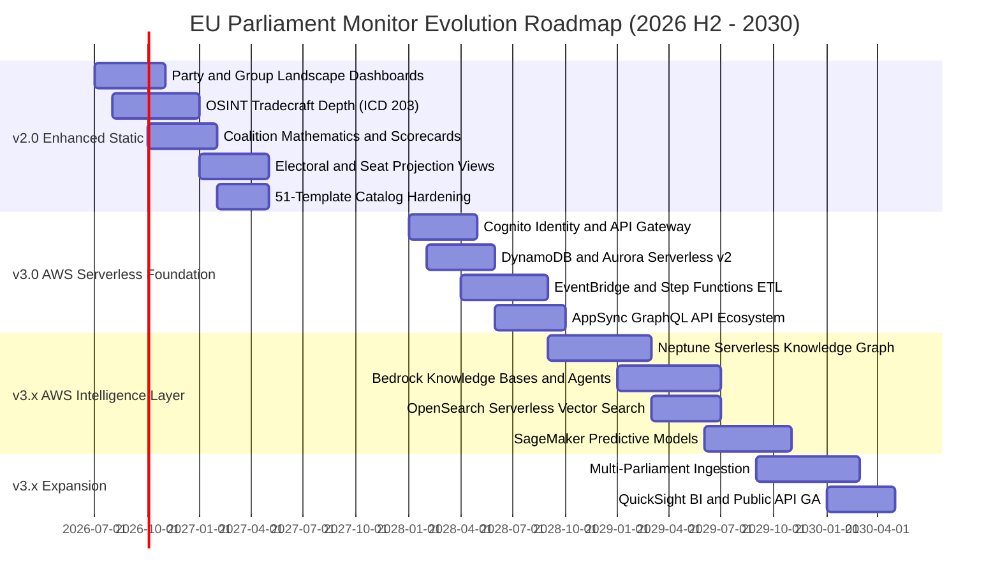
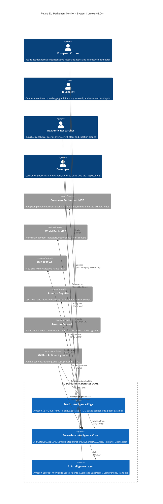
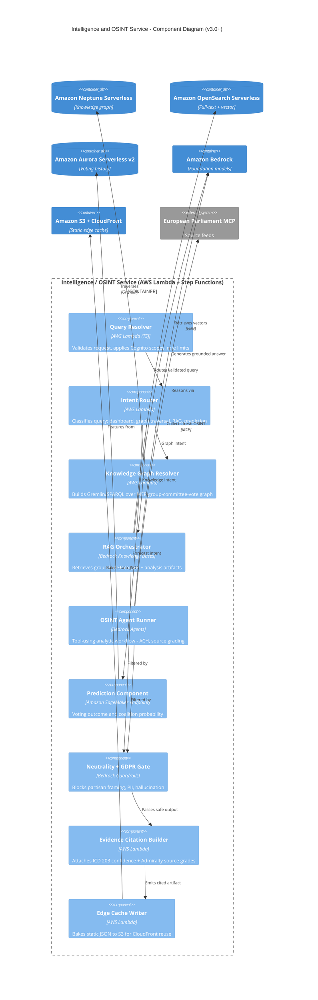
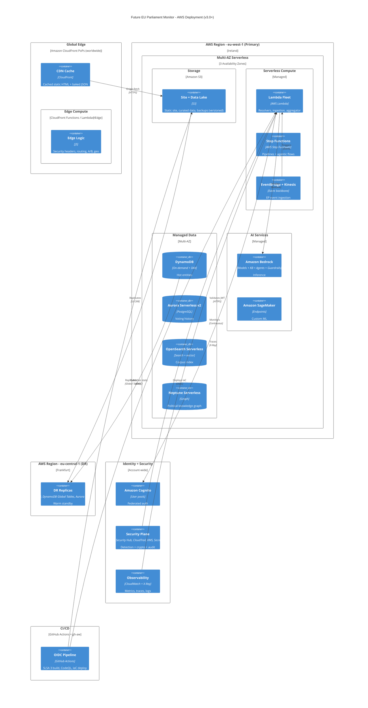
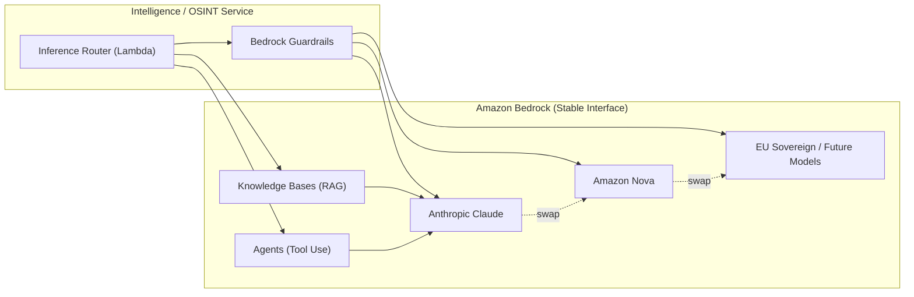
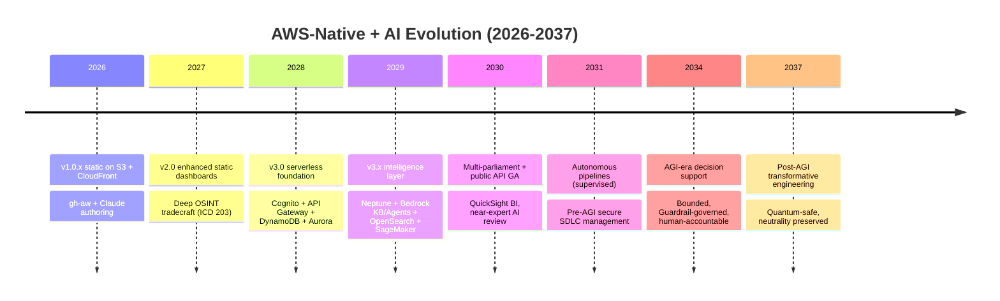
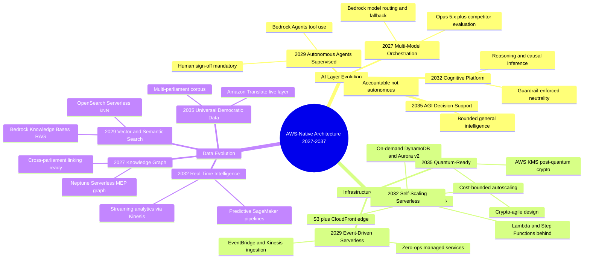

  

<h1 align="center">🚀 EU Parliament Monitor — Future Architecture</h1>

  <strong>🏗️ Architectural Evolution Roadmap with AWS-Native C4 Models</strong> 
  <em>🎯 From Static Site to AWS-Native Serverless Intelligence Platform (2026-2037)</em>

  
  
  
  

**📋 Document Owner:** CEO | **📄 Version:** 4.0 | **📅 Last Updated:**
2026-05-31 (UTC) | **🚀 Release:** v1.0.1  
**🔄 Review Cycle:** Quarterly | **⏰ Next Review:** 2026-08-31  
**🏷️ Classification:** Public (Open Source European Parliament Monitoring Platform)

---

## 📚 Architecture Documentation Map

| Document | Focus | Description | Documentation Link |
| ------------------------------------------------------------------- | --------------- | ---------------------------------------------- | ------------------------------------------------------------------------------------------------------ |
| **[Architecture](ARCHITECTURE.md)** | 🏛️ Architecture | C4 model showing current system structure | [View Source](https://github.com/Hack23/euparliamentmonitor/blob/main/ARCHITECTURE.md) |
| **[Future Architecture](FUTURE_ARCHITECTURE.md)** | 🏛️ Architecture | C4 model showing future system structure | **This Document** |
| **[Mindmaps](MINDMAP.md)** | 🧠 Concept | Current system component relationships | [View Source](https://github.com/Hack23/euparliamentmonitor/blob/main/MINDMAP.md) |
| **[Future Mindmaps](FUTURE_MINDMAP.md)** | 🧠 Concept | Future capability evolution | [View Source](https://github.com/Hack23/euparliamentmonitor/blob/main/FUTURE_MINDMAP.md) |
| **[SWOT Analysis](SWOT.md)** | 💼 Business | Current strategic assessment | [View Source](https://github.com/Hack23/euparliamentmonitor/blob/main/SWOT.md) |
| **[Future SWOT Analysis](FUTURE_SWOT.md)** | 💼 Business | Future strategic opportunities | [View Source](https://github.com/Hack23/euparliamentmonitor/blob/main/FUTURE_SWOT.md) |
| **[Data Model](DATA_MODEL.md)** | 📊 Data | Current data structures and relationships | [View Source](https://github.com/Hack23/euparliamentmonitor/blob/main/DATA_MODEL.md) |
| **[Future Data Model](FUTURE_DATA_MODEL.md)** | 📊 Data | Enhanced European Parliament data architecture | [View Source](https://github.com/Hack23/euparliamentmonitor/blob/main/FUTURE_DATA_MODEL.md) |
| **[Flowcharts](FLOWCHART.md)** | 🔄 Process | Current data processing workflows | [View Source](https://github.com/Hack23/euparliamentmonitor/blob/main/FLOWCHART.md) |
| **[Future Flowcharts](FUTURE_FLOWCHART.md)** | 🔄 Process | Enhanced AI-driven workflows | [View Source](https://github.com/Hack23/euparliamentmonitor/blob/main/FUTURE_FLOWCHART.md) |
| **[State Diagrams](STATEDIAGRAM.md)** | 🔄 Behavior | Current system state transitions | [View Source](https://github.com/Hack23/euparliamentmonitor/blob/main/STATEDIAGRAM.md) |
| **[Future State Diagrams](FUTURE_STATEDIAGRAM.md)** | 🔄 Behavior | Enhanced adaptive state transitions | [View Source](https://github.com/Hack23/euparliamentmonitor/blob/main/FUTURE_STATEDIAGRAM.md) |
| **[Security Architecture](SECURITY_ARCHITECTURE.md)** | 🛡️ Security | Current security implementation | [View Source](https://github.com/Hack23/euparliamentmonitor/blob/main/SECURITY_ARCHITECTURE.md) |
| **[Future Security Architecture](FUTURE_SECURITY_ARCHITECTURE.md)** | 🛡️ Security | Security enhancement roadmap | [View Source](https://github.com/Hack23/euparliamentmonitor/blob/main/FUTURE_SECURITY_ARCHITECTURE.md) |
| **[Threat Model](THREAT_MODEL.md)** | 🎯 Security | STRIDE threat analysis | [View Source](https://github.com/Hack23/euparliamentmonitor/blob/main/THREAT_MODEL.md) |
| **[Future Threat Model](FUTURE_THREAT_MODEL.md)** | 🎯 Security | AWS-native threat modeling roadmap | [View Source](https://github.com/Hack23/euparliamentmonitor/blob/main/FUTURE_THREAT_MODEL.md) |
| **[Classification](CLASSIFICATION.md)** | 🏷️ Governance | CIA classification & BCP | [View Source](https://github.com/Hack23/euparliamentmonitor/blob/main/CLASSIFICATION.md) |
| **[CRA Assessment](CRA-ASSESSMENT.md)** | 🛡️ Compliance | Cyber Resilience Act | [View Source](https://github.com/Hack23/euparliamentmonitor/blob/main/CRA-ASSESSMENT.md) |
| **[Workflows](WORKFLOWS.md)** | ⚙️ DevOps | CI/CD documentation | [View Source](https://github.com/Hack23/euparliamentmonitor/blob/main/WORKFLOWS.md) |
| **[Future Workflows](FUTURE_WORKFLOWS.md)** | 🚀 DevOps | Planned CI/CD enhancements | [View Source](https://github.com/Hack23/euparliamentmonitor/blob/main/FUTURE_WORKFLOWS.md) |
| **[Business Continuity Plan](BCPPlan.md)** | 🔄 Resilience | Recovery planning | [View Source](https://github.com/Hack23/euparliamentmonitor/blob/main/BCPPlan.md) |
| **[Financial Security Plan](FinancialSecurityPlan.md)** | 💰 Financial | Cost & security analysis | [View Source](https://github.com/Hack23/euparliamentmonitor/blob/main/FinancialSecurityPlan.md) |
| **[End-of-Life Strategy](End-of-Life-Strategy.md)** | 📦 Lifecycle | Technology EOL planning | [View Source](https://github.com/Hack23/euparliamentmonitor/blob/main/End-of-Life-Strategy.md) |
| **[Unit Test Plan](UnitTestPlan.md)** | 🧪 Testing | Unit testing strategy | [View Source](https://github.com/Hack23/euparliamentmonitor/blob/main/UnitTestPlan.md) |
| **[E2E Test Plan](E2ETestPlan.md)** | 🔍 Testing | End-to-end testing | [View Source](https://github.com/Hack23/euparliamentmonitor/blob/main/E2ETestPlan.md) |
| **[Performance Testing](performance-testing.md)** | ⚡ Performance | Performance benchmarks | [View Source](https://github.com/Hack23/euparliamentmonitor/blob/main/performance-testing.md) |
| **[Security Policy](SECURITY.md)** | 🔒 Security | Vulnerability reporting & security policy | [View Source](https://github.com/Hack23/euparliamentmonitor/blob/main/SECURITY.md) |

---

## 🔐 ISMS Policy Alignment

This future architecture is designed to implement all controls from Hack23 AB's
ISMS framework as the EU Parliament Monitor platform evolves from a static
generator (v1.0.x) toward an **AWS-native serverless intelligence platform**
(v3.0+). Because AWS is already the hosting substrate (Amazon S3 + Amazon
CloudFront), each horizon deepens — rather than replaces — the ISMS control
surface, moving from edge-only controls toward IAM least-privilege, AWS KMS
envelope encryption, and Amazon Bedrock Guardrails for AI neutrality.

### Related ISMS Policies

| **Policy Domain** | **Policy** | **Planned Implementation** |
| -------------------------- | ------------------------------------------------------------------------------------------------------------ | ------------------------------------------------------------- |
| **🔐 Core Security** | [Information Security Policy](https://github.com/Hack23/ISMS-PUBLIC/blob/main/Information_Security_Policy.md) | Overall security governance for the AWS-native platform |
| **🛠️ Development** | [Secure Development Policy](https://github.com/Hack23/ISMS-PUBLIC/blob/main/Secure_Development_Policy.md) | Security-integrated SSDLC across all three horizons |
| **🤖 AI Governance** | [AI Policy](https://github.com/Hack23/ISMS-PUBLIC/blob/main/AI_Policy.md) | AI as proposal generator; Bedrock Guardrails; human accountability |
| **🌐 Network** | [Network Security Policy](https://github.com/Hack23/ISMS-PUBLIC/blob/main/Network_Security_Policy.md) | Amazon CloudFront, AWS WAF, AWS Shield DDoS protection |
| **🔒 Cryptography** | [Cryptography Policy](https://github.com/Hack23/ISMS-PUBLIC/blob/main/Cryptography_Policy.md) | AWS KMS envelope encryption, TLS 1.3, SLSA provenance signing |
| **🔑 Access Control** | [Access Control Policy](https://github.com/Hack23/ISMS-PUBLIC/blob/main/Access_Control_Policy.md) | Amazon Cognito identity, IAM least-privilege, MCP authorization |
| **🏷️ Data Classification** | [Data Classification Policy](https://github.com/Hack23/ISMS-PUBLIC/blob/main/Data_Classification_Policy.md) | European Parliament open-data classification (public only) |
| **🔍 Vulnerability** | [Vulnerability Management](https://github.com/Hack23/ISMS-PUBLIC/blob/main/Vulnerability_Management.md) | AWS Security Hub, Amazon Inspector, CodeQL, OpenSSF Scorecard |
| **🚨 Incident Response** | [Incident Response Plan](https://github.com/Hack23/ISMS-PUBLIC/blob/main/Incident_Response_Plan.md) | Amazon GuardDuty detection, EventBridge-driven response |
| **💾 Backup & Recovery** | [Backup Recovery Policy](https://github.com/Hack23/ISMS-PUBLIC/blob/main/Backup_Recovery_Policy.md) | S3 versioning, DynamoDB PITR, Aurora automated backups |
| **🔄 Business Continuity** | [Business Continuity Plan](https://github.com/Hack23/ISMS-PUBLIC/blob/main/Business_Continuity_Plan.md) | Multi-AZ serverless, CloudFront global edge, DR runbooks |
| **🤝 Third-Party** | [Third Party Management](https://github.com/Hack23/ISMS-PUBLIC/blob/main/Third_Party_Management.md) | AWS shared-responsibility, EP MCP & data-source assessment |
| **🏷️ Classification** | [Classification Framework](https://github.com/Hack23/ISMS-PUBLIC/blob/main/CLASSIFICATION.md) | Business impact analysis for platform |

### Compliance Framework Mapping

| **Framework** | **Version** | **Relevant Controls** |
| ------------- | ----------- | --------------------- |
| **ISO 27001** | 2022 | A.5.1, A.5.23, A.8.25, A.8.26, A.8.27, A.8.28 |
| **NIST CSF** | 2.0 | GV.OC, GV.RM, ID.AM, PR.AT, PR.DS, DE.CM |
| **CIS Controls** | v8.1 | Control 1-5, 8, 13, 14, 16 |

---

## 📋 Executive Summary

This document outlines the architectural evolution of EU Parliament Monitor from
a **deterministic static-site generator** (v1.0.x — already hosted on **Amazon
S3 + Amazon CloudFront**) toward an **AWS-native serverless political
intelligence / OSINT-operations platform**. The journey is deliberately staged
across **three horizons** rather than a single risky jump from static to
real-time:

- **🟢 v2.0 — Enhanced Static Intelligence (2026 H2 → 2027):** keep the pure
  static HTML architecture (S3 + CloudFront, build-time generation, gh-aw
  agentic workflows + the deterministic `src/aggregator/**` pipeline). Add
  **richer political-landscape dashboards with a party / political-group focus**
  and **advanced OSINT tradecraft**. No servers are introduced; the moat is
  analytical quality, neutrality, and evidence-citation.
- **🔵 v3.0+ — AWS-Native Serverless Platform (2028+):** layer dynamic
  intelligence behind the static edge using **AWS Lambda, Step Functions,
  EventBridge, API Gateway, AWS AppSync, Amazon DynamoDB, Aurora Serverless v2,
  OpenSearch Serverless, Neptune Serverless, Amazon Bedrock (Knowledge Bases +
  Agents + Guardrails), and Amazon Cognito**. The static HTML remains the
  public, cacheable, low-cost front door.
- **⚪ 10-Year AI Lookahead (2026 → 2037):** a model-agnostic abstraction via
  Amazon Bedrock, annual evaluation of frontier models and competitors (OpenAI,
  Google, Meta, EU sovereign AI), and resilience to paradigm shifts (quantum AI,
  neuromorphic computing) through to AGI / post-AGI — all governed by the Hack23
  **AI Policy** (AI proposes, humans remain accountable, no autonomous deploy).

### Vision Statement

**Transform EU Parliament Monitor into Europe's most trusted, evidence-grounded
political-intelligence platform** — beginning with the highest-quality static,
neutral, source-graded OSINT analysis (v2.0), then evolving into an AWS-native
serverless intelligence-operations platform offering natural-language query over
a political knowledge graph, real-time EP event ingestion, and an API ecosystem
for journalists and researchers (v3.0+) — without ever sacrificing the
cacheable, cheap, accessible static front door that makes the data universally
available.

### Current State (v1.0.x) → v2.0 → v3.0+ Strategic Transformation

| Dimension | Current State (v1.0.x) | v2.0 — Enhanced Static (2026 H2-2027) | v3.0+ — AWS Serverless (2028+) | Impact |
| ---------------- | ------------------------------------ | ------------------------------------------------- | ----------------------------------------------------------- | ------------------------ |
| **Architecture** | Pure static HTML on S3 + CloudFront | Pure static HTML, richer client dashboards | Static edge + serverless dynamic layer (Lambda/Step Functions) | 🟢 Zero-ops scaling |
| **Hosting** | Amazon S3 + Amazon CloudFront | Same (S3 + CloudFront) | S3 + CloudFront front door + API Gateway/AppSync backends | 🟢 All-in AWS |
| **Data Access** | Build-time batch (gh-aw daily) | Build-time batch + pre-baked dashboard datasets | Event-driven ingestion (EventBridge + Kinesis) + batch | 🟢 Near-real-time |
| **Analytics** | 51-template Markdown analysis catalog | Deeper OSINT tradecraft + party/group dashboards | Bedrock RAG + SageMaker prediction + Neptune graph queries | 🟢 Intelligence layer |
| **AI** | gh-aw + Claude authoring Markdown | Same authoring model, richer analytic templates | Amazon Bedrock (Claude + Nova), Agents, Guardrails | 🟢 Model-agnostic |
| **API** | No public API (static files only) | Static JSON data endpoints (baked at build) | Amazon API Gateway (REST + WebSocket) + AWS AppSync (GraphQL) | 🟢 Third-party ecosystem |
| **Identity** | None (anonymous public read) | None (anonymous public read) | Amazon Cognito (journalists / researchers / API consumers) | 🟢 Federated auth |
| **Knowledge** | Markdown artifacts + manifest.json | Cross-referenced entity / coalition mapping | Amazon Neptune Serverless knowledge graph | 🟢 Linked intelligence |
| **Coverage** | European Parliament only | European Parliament, deeper political-group depth | EP + multi-parliament expansion | 🟢 Comprehensive view |
| **Visualization** | Chart.js 4 + D3 7 (vendored) | Richer interactive client dashboards | Server-driven + Amazon QuickSight BI for power users | 🟢 Decision support |

The strategic insight: AWS is **already** the substrate, so the platform does
not "migrate to cloud" — it **deepens its AWS footprint** one horizon at a time,
keeping the static edge as a permanent, cheap, resilient foundation.

---

## 📅 Three-Horizon Implementation Roadmap

---

## 🏗️ C4 Level 1: Future System Context Diagram

**Transformation**: From an isolated static site to an integrated AWS-native
intelligence ecosystem — while the public still reads cacheable static HTML.

**Key context shifts versus the current system:**

- The **static edge persists** as the universal front door. Even in v3.0+, the
  majority of citizen traffic is served as cached static HTML from CloudFront —
  cheap, fast, and resilient.
- **Authenticated consumers** (journalists, researchers, developers) gain access
  to dynamic APIs gated by **Amazon Cognito**, enabling a sustainable API
  ecosystem without exposing the platform to abuse.
- **AI moves in-platform** via Amazon Bedrock rather than build-time-only
  authoring, enabling natural-language query and managed RAG over the EP corpus —
  but always behind **Bedrock Guardrails** for neutrality and GDPR.

---

## 🏗️ C4 Level 2: Future Container Diagram

**Transformation**: A permanent static edge plus a serverless dynamic layer.
Every infrastructure element is an AWS-managed, zero-ops service.

```mermaid
C4Container
    title Future EU Parliament Monitor - Container Diagram (v3.0+)

    Person(citizen, "Citizen", "Reads static pages and dashboards")
    Person(consumer, "Authenticated Consumer", "Journalist / researcher / developer")

    System_Boundary(epm, "EU Parliament Monitor on AWS") {

        Container_Boundary(edge, "Static Intelligence Edge") {
            Container(s3, "Static Site Bucket", "Amazon S3", "14-language HTML, baked dashboard JSON, data-download manifests")
            Container(cf, "CDN + Edge Logic", "Amazon CloudFront + CloudFront Functions / Lambda@Edge", "Global cache, security headers, routing")
            Container(waf, "Edge Protection", "AWS WAF + AWS Shield", "OWASP rules, rate limiting, DDoS")
        }

        Container_Boundary(api, "API and Identity Layer") {
            Container(apigw, "REST + WebSocket API", "Amazon API Gateway", "Public REST and real-time WebSocket endpoints")
            Container(appsync, "GraphQL API", "AWS AppSync", "Typed graph queries, subscriptions for live updates")
            Container(cognito, "Identity Provider", "Amazon Cognito", "User pools, federated auth, scoped API keys")
        }

        Container_Boundary(compute, "Serverless Compute and Orchestration") {
            Container(lambda, "Function Fleet", "AWS Lambda (Node.js 26 / TS)", "API resolvers, ingestion, aggregator parity logic")
            Container(sfn, "Workflow Orchestration", "AWS Step Functions", "Analysis pipelines, multi-stage ETL, agentic flows")
            Container(events, "Event Backbone", "Amazon EventBridge + Kinesis + SQS/SNS", "EP event fan-out, decoupled processing")
        }

        Container_Boundary(data, "Data and Knowledge Stores") {
            Container(dynamo, "Hot Store", "Amazon DynamoDB (+ DAX)", "Single-table entities, sessions, low-latency reads")
            Container(aurora, "Relational Store", "Amazon Aurora Serverless v2 (PostgreSQL)", "Voting history, procedures, time-series")
            Container(opensearch, "Search + Vector", "Amazon OpenSearch Serverless", "Full-text + semantic vector search over corpus")
            Container(neptune, "Knowledge Graph", "Amazon Neptune Serverless", "MEPs, groups, committees, dossiers, votes")
            Container(lake, "Data Lake", "Amazon S3 + AWS Glue + Amazon Athena", "Raw + curated open data, ad-hoc analytics")
        }

        Container_Boundary(ai, "AI Intelligence Layer") {
            Container(bedrock, "Foundation Models", "Amazon Bedrock", "Claude / Nova, model-agnostic inference")
            Container(kb, "Managed RAG", "Bedrock Knowledge Bases", "Grounded retrieval over EP corpus + analysis artifacts")
            Container(agents, "Agentic OSINT", "Bedrock Agents", "Tool-using analytic workflows")
            Container(guardrails, "AI Safety", "Bedrock Guardrails", "Neutrality, PII/GDPR, hallucination control")
            Container(sagemaker, "Custom ML", "Amazon SageMaker", "Voting prediction, anomaly detection")
        }
    }

    System_Ext(epmcp, "European Parliament MCP", "60+ tools")
    System_Ext(econ, "World Bank MCP + IMF REST", "Economic context")
    System_Ext(gha, "GitHub Actions + gh-aw", "CI/CD + agentic authoring")

    Rel(citizen, cf, "Reads", "HTTPS")
    Rel(cf, s3, "Serves origin", "HTTPS")
    Rel(cf, waf, "Filtered by", "Inline")
    Rel(consumer, apigw, "Calls REST/WS", "HTTPS")
    Rel(consumer, appsync, "Queries GraphQL", "HTTPS")
    Rel(apigw, cognito, "Authorizes via", "JWT")
    Rel(appsync, cognito, "Authorizes via", "JWT")

    Rel(apigw, lambda, "Invokes", "Sync")
    Rel(appsync, lambda, "Resolves via", "Sync")
    Rel(events, sfn, "Triggers", "Event")
    Rel(sfn, lambda, "Orchestrates", "Task")
    Rel(lambda, dynamo, "Reads/writes", "SDK")
    Rel(lambda, aurora, "Queries", "Data API")
    Rel(lambda, opensearch, "Searches", "HTTPS")
    Rel(lambda, neptune, "Traverses", "Gremlin / SPARQL")
    Rel(lambda, kb, "Retrieves grounded context", "Bedrock")
    Rel(kb, bedrock, "Generates via", "Runtime")
    Rel(agents, guardrails, "Constrained by", "Inline")
    Rel(agents, bedrock, "Invokes", "Runtime")
    Rel(sagemaker, aurora, "Trains on", "Snapshot")

    Rel(events, epmcp, "Ingests", "MCP")
    Rel(lambda, econ, "Enriches with", "MCP / REST")
    Rel(gha, s3, "Publishes build", "OIDC")
    Rel(gha, lambda, "Deploys IaC", "OIDC")
```

**Container design principles:**

1. **Static-first, dynamic-behind.** The CloudFront/S3 edge is never removed.
   Dynamic responses are cached aggressively at the edge so that the serverless
   layer scales to demand spikes (e.g., a plenary vote going viral) without
   linear cost growth.
2. **Zero-ops, pay-per-use.** Every store and compute element is serverless
   (Lambda, Step Functions, DynamoDB on-demand, Aurora Serverless v2, OpenSearch
   Serverless, Neptune Serverless). There are **no Kubernetes clusters and no
   long-running servers** to patch — eliminating an entire class of operational
   and security toil.
3. **Aggregator parity.** The deterministic `src/aggregator/**` rendering logic
   is ported into Lambda functions, preserving the v1.0.x guarantee that **no
   AI authors HTML directly** — AI proposes Markdown/analysis, deterministic
   code renders output.
4. **Defence in depth.** AWS WAF + Shield at the edge, Cognito + IAM for
   authorization, AWS KMS for encryption at rest, and Bedrock Guardrails for AI
   output safety.

---

## 🏗️ C4 Level 3: Future Component Diagram

**Focus**: the **Bedrock-backed Intelligence / OSINT Service** — the heart of
the v3.0+ value proposition — and how it composes managed AWS services to answer
a natural-language political-intelligence query while preserving neutrality and
evidence-citation.

**Why this composition matters (the Economist test):** a journalist asking *"Has
the EPP–S&D grand coalition weakened on environmental files since the 2024
election?"* triggers the **Intent Router**, which fans the question to the
**Knowledge Graph Resolver** (Neptune traversal of EPP/S&D MEPs ↔ ENVI dossiers
↔ roll-call votes) and the **RAG Orchestrator** (grounded retrieval of committed
coalition-dynamics analysis artifacts). The **OSINT Agent Runner** can pull
fresh roll-call data via the EP MCP. Crucially, every generated sentence passes
the **Neutrality + GDPR Gate** (Bedrock Guardrails — rejecting partisan framing
and any non-public personal data) before the **Evidence Citation Builder**
attaches ICD 203 confidence bands and Admiralty source grades. The final cited
artifact is **baked to S3** so the *next* citizen who asks the same question is
served a cached static answer at edge cost — the static-first principle applied
even to AI output.

---

## 🏗️ C4 Level 4: Future Deployment Diagram

**Transformation**: A multi-AZ, multi-Region serverless deployment fronted by a
global CloudFront edge, deployed entirely through OIDC-federated GitHub Actions
(no long-lived cloud credentials).

**Deployment guarantees:**

- **Primary in `eu-west-1`, warm DR in `eu-central-1`** using S3 Cross-Region
  Replication, DynamoDB Global Tables, and Aurora cross-Region replicas — both
  within EU jurisdiction for data-residency alignment.
- **No standing credentials.** GitHub Actions deploys via OIDC federation into
  scoped IAM roles; secrets live in AWS Secrets Manager; all data at rest is
  encrypted with AWS KMS customer-managed keys.
- **Static edge survives backend outage.** If the serverless core degrades,
  CloudFront continues serving the last-baked static intelligence — the platform
  fails *open* for reading, *closed* for writing.

---

## 🚀 Technology Migration Plan

The plan translates each current component into its v2.0 and v3.0 form. Because
the system is **already on AWS**, v2.0 is largely additive (no new infra) and
v3.0 deepens the AWS-native serverless footprint. The mapping below supersedes
the prior (obsolete) multi-cloud / polyglot plan; **CloudFlare, Kubernetes,
MongoDB, Neo4j, Kafka, Apollo, and Firebase references are retired.**

### v1.0.x → v2.0 (Enhanced Static — no servers introduced)

| Current Component (v1.0.x) | v2.0 Evolution | Delivery Model | Outcome |
| -------------------------- | -------------- | -------------- | ------- |
| Static HTML on S3 + CloudFront | Same edge; richer pre-rendered pages | Build-time (gh-aw + aggregator) | Faster, still static |
| Chart.js 4 + D3 7 in-article charts | **Party / political-group landscape dashboards**, cohesion + coalition heatmaps, alliance network graphs | Client-side, data baked at build | Decision-grade visuals |
| 51-template analysis catalog | Deeper templates: electoral-domain, coalition-mathematics, voter-segmentation | Markdown artifacts | Analytical breadth |
| OSINT methodology docs | **ICD 203 confidence, Admiralty source grading, Kent/WEP bands, ACH** operationalized in every artifact | Stage-B analysis | Tradecraft rigor |
| Political threat methodology | 5-framework integrated model (STRIDE explicitly rejected for political analysis) | Markdown artifacts | Methodological clarity |
| Entity / actor mapping | Richer coalition / actor / dossier cross-referencing | manifest.json + cross-reference-map | Linked context |
| EP MCP batch pulls | Same MCP pulls, broader tool coverage, pre-baked dashboard datasets | gh-aw scheduled | Quality moat |

**v2.0 thesis:** the differentiator is **analytical quality**, not real-time
infrastructure. Every dashboard dataset is computed at build time and shipped as
static JSON — preserving the cheap, cacheable, zero-ops edge while dramatically
deepening political-intelligence depth.

### v2.0 → v3.0+ (AWS-Native Serverless Intelligence Platform)

| Capability | v2.0 (Static) | v3.0+ AWS Service | Migration Notes |
| ---------- | ------------- | ----------------- | --------------- |
| Edge delivery | Amazon CloudFront + S3 | Amazon CloudFront + S3 + CloudFront Functions / Lambda@Edge | Edge persists; add edge logic |
| Compute | Build-time only | AWS Lambda + AWS Step Functions | Serverless, zero-ops (replaces Kubernetes framing) |
| Event bus | None | Amazon EventBridge + Amazon Kinesis + SQS/SNS | Replaces Kafka framing |
| REST/WebSocket API | Static JSON files | Amazon API Gateway (REST + WebSocket) | Replaces Socket.io framing |
| GraphQL API | None | AWS AppSync | Replaces Apollo framing |
| Identity | Anonymous read | Amazon Cognito | Replaces self-managed auth |
| Document/hot store | manifest.json files | Amazon DynamoDB (+ DAX) | Replaces MongoDB / Redis framing |
| Relational / time-series | None (Markdown) | Amazon Aurora Serverless v2 (PostgreSQL) | Replaces TimescaleDB / Postgres framing |
| Search | Client-side filter | Amazon OpenSearch Serverless (full-text + vector) | Replaces Elasticsearch framing |
| Knowledge graph | Cross-reference Markdown | Amazon Neptune Serverless | Replaces Neo4j framing |
| Data lake / analytics | Committed artifacts | Amazon S3 + AWS Glue + Amazon Athena + QuickSight | New analytics tier |
| AI authoring | gh-aw + Claude (build-time) | Amazon Bedrock + Knowledge Bases + Agents + Guardrails | Replaces OpenAI/LangChain framing; model-agnostic |
| Custom ML | None | Amazon SageMaker + Amazon Comprehend | Replaces "Python/FastAPI ML service" framing |
| Translation | Build-time 14-language | Amazon Translate (14+ languages) | Managed, on-demand |
| Notifications | None | Amazon SNS / Amazon Pinpoint | Replaces Firebase framing |
| Observability | CI logs | Amazon CloudWatch + AWS X-Ray | Replaces Datadog / New Relic framing |
| Security ops | CodeQL + Scorecard | AWS Security Hub + Amazon GuardDuty + Amazon Inspector + AWS WAF/Shield + AWS KMS | Cloud-native defence in depth |

### Migration Sequencing & Risk Controls

1. **Strangler-fig pattern.** New AWS services are introduced behind the static
   edge; static HTML remains authoritative until each dynamic path is proven.
2. **Aggregator parity tests.** Lambda-rendered output is byte-diffed against
   the v1.0.x `src/aggregator/**` output before cutover — neutrality and
   determinism are non-negotiable.
3. **Cost guardrails.** AWS Budgets + Cost Anomaly Detection on every new
   serverless service; on-demand and serverless capacity to avoid idle spend.
4. **Reversibility.** Each horizon is independently shippable and reversible; a
   failed v3.0 component degrades gracefully to v2.0 static behavior.

---

## ⚠️ Risk Assessment & Mitigation

| Risk | Horizon | Likelihood | Impact | Mitigation |
| ---- | ------- | ---------- | ------ | ---------- |
| **Scope creep dilutes v2.0 quality moat** | v2.0 | Medium | High | Freeze infra; invest only in analytical depth + dashboards |
| **AWS serverless cost overrun under viral load** | v3.0 | Medium | High | Edge caching of dynamic responses, AWS Budgets, on-demand scaling |
| **AI hallucination / partisan drift** | v3.0 | Medium | Critical | Bedrock Guardrails, human accountability per AI Policy, citation gate |
| **GDPR breach via personal data leakage** | All | Low | Critical | Public MEP roles only; Guardrails PII filter; Macie scanning |
| **Vendor lock-in to AWS** | v3.0+ | Medium | Medium | Model-agnostic Bedrock; standard interfaces (SQL, Gremlin, OpenAPI) |
| **Determinism lost when AI enters runtime** | v3.0 | Medium | High | Aggregator-parity diffing; AI proposes, deterministic code renders |
| **EP MCP / source feed instability** | All | Medium | Medium | Cached corpus, sliding-window retries, source-grade transparency |
| **Frontier model disruption / competitor leap** | 10-yr | High | Medium | Annual model evaluation; Bedrock abstraction; rapid swap |
| **Quantum threat to cryptography** | 10-yr | Low | High | Plan AWS KMS post-quantum migration; crypto-agility |
| **Multi-Region DR failover gap** | v3.0+ | Low | High | Global Tables, S3 CRR, periodic DR game-days |

---

## 📈 Success Metrics & KPIs

| Metric | Current (v1.0.x) | v2.0 Target | v3.0+ Target | Measurement |
| ------ | ---------------- | ----------- | ------------ | ----------- |
| **Analytical artifacts per run** | 51-template catalog | +12 extended templates | Continuous AI-assisted | manifest.json |
| **Evidence-citation coverage** | High (manual) | ≥ 95% paragraphs cited | ≥ 98% (Guardrails-enforced) | Stage-C QA |
| **Page load (p75)** | < 1.5s static | < 1.2s static | < 1.2s static edge | CloudWatch RUM |
| **Languages supported** | 14 | 14 | 14+ (Amazon Translate) | Build output |
| **API consumers** | 0 | 0 (static JSON) | 100+ authenticated | Cognito + API Gateway |
| **Knowledge-graph entities** | N/A | Cross-ref Markdown | 1M+ nodes/edges | Neptune metrics |
| **Time-to-insight (NL query)** | N/A | N/A | < 5s cached / < 30s cold | X-Ray traces |
| **AI neutrality pass rate** | N/A (build-time) | N/A | ≥ 99% Guardrails pass | Bedrock Guardrails |
| **Availability** | 99.9% (edge) | 99.9% | 99.95% (multi-AZ) | CloudWatch |
| **Cost per 1k requests** | Edge-only (low) | Edge-only (low) | Cached-dynamic (bounded) | AWS Cost Explorer |

---

## 🔒 ISMS Compliance

The AWS-native evolution strengthens, rather than dilutes, ISMS posture:

- **Confidentiality.** All data is public EU open data; AWS KMS encrypts at
  rest; Cognito + IAM least-privilege gate dynamic APIs; Bedrock Guardrails and
  Amazon Macie prevent PII leakage (GDPR — public MEP roles only).
- **Integrity.** SLSA 3 provenance on builds, deterministic aggregator rendering
  (AI never authors HTML), AWS CloudTrail immutable audit, content signing.
- **Availability.** Multi-AZ serverless, CloudFront global edge, multi-Region DR
  (S3 CRR + DynamoDB Global Tables), graceful degradation to static.
- **Accountability (AI Policy).** AI is a *proposal generator*; humans approve;
  there is **no autonomous deployment**. Every AI artifact is traceable to a
  reviewable Markdown source and a graded source chain.
- **Detection & Response.** Amazon GuardDuty, AWS Security Hub, Amazon Inspector,
  and EventBridge-driven automated runbooks per the Incident Response Plan.

| ISMS Objective | Control Mechanism (AWS-native) | Framework Reference |
| -------------- | ------------------------------ | ------------------- |
| Least-privilege access | IAM roles, Cognito scopes, OIDC deploy | ISO 27001 A.5.15; NIST PR.AA |
| Encryption everywhere | AWS KMS (rest), TLS 1.3 (transit) | ISO 27001 A.8.24; NIST PR.DS |
| AI safety & neutrality | Bedrock Guardrails, human sign-off | AI Policy; ISO 27001 A.5.1 |
| Continuous monitoring | CloudWatch, X-Ray, GuardDuty, Security Hub | NIST DE.CM; CIS 8 |
| Supply-chain integrity | SLSA 3, CodeQL, OpenSSF Scorecard, Inspector | ISO 27001 A.8.28; NIST PR.PS |
| Resilience & recovery | Multi-AZ/Region, S3 CRR, PITR, DR game-days | ISO 27001 A.5.30; NIST RC.RP |

---

## 🔮 Visionary Architecture Roadmap 2027-2037

Over the decade, the architecture is engineered to **absorb annual AI model
upgrades and competitive shifts** without re-platforming, because Amazon Bedrock
provides a **model-agnostic abstraction**: Anthropic Claude, Amazon Nova, and
future foundation models (including EU sovereign AI offerings) are swappable
behind a stable inference interface, with Bedrock Guardrails enforcing
neutrality regardless of the underlying model.

### AI Model Evolution — DevSecOps & Development Perspective

| Year | AI Model | DevSecOps Capability Evolution |
| ---- | -------- | ------------------------------ |
| 2026 | Opus 4.6–4.9 | 🟢 AI-assisted code review, automated test generation, agentic CI/CD workflows |
| 2027 | Opus 5.x | 🔵 Predictive vulnerability detection, intelligent dependency management |
| 2028 | Opus 6.x | 🟣 Multi-modal security analysis (code + architecture + runtime), automated threat modeling |
| 2029 | Opus 7.x | 🟠 Autonomous security pipeline orchestration, self-healing build systems |
| 2030 | Opus 8.x | 🔴 Near-expert automated security review, AI-driven architecture validation |
| 2031–2033 | Opus 9–10.x / Pre-AGI | ⚪ Autonomous secure development lifecycle management |
| 2034–2037 | AGI / Post-AGI | ⭐ Transformative software engineering with built-in security assurance |

> **Assumptions:** major AI model upgrades arrive annually; competitors (OpenAI,
> Google, Meta, EU sovereign AI) are evaluated at each release; the architecture
> is designed to accommodate potential paradigm shifts (quantum AI, neuromorphic
> computing). The full cross-perspective analysis lives in the Hack23 Information
> Security Strategy § AI Model Evolution Strategy; governance follows the
> [AI Policy](https://github.com/Hack23/ISMS-PUBLIC/blob/main/AI_Policy.md) — AI
> proposes, humans remain accountable, and there is no autonomous deployment.

### Model-Agnostic Abstraction via Amazon Bedrock

The router selects the best model per task (cost, latency, capability) and can
**hot-swap providers** with no application change — the platform's hedge against
both vendor lock-in and the rapid obsolescence of any single frontier model.

### Paradigm-Shift & AGI Considerations

- **2027–2029 — Multi-model orchestration & predictive intelligence.** Bedrock
  routes across competing models; SageMaker forecasts voting/coalition outcomes;
  Neptune + OpenSearch power natural-language graph query at scale.
- **2030–2033 — Autonomous analytic agents (human-supervised).** Bedrock Agents
  run multi-step OSINT tradecraft (ACH, source grading) with mandatory human
  sign-off; self-healing serverless pipelines reduce operational toil toward
  zero. **No autonomous publication** — the human-accountability gate holds.
- **2034–2037 — AGI / post-AGI integration.** Should general intelligence
  emerge, it is integrated as a *bounded decision-support* capability behind
  Guardrails and the AI Policy, never as an unaccountable actor. Crypto-agility
  (AWS KMS) prepares for post-quantum migration; the architecture assumes the
  *substrate* changes (quantum/neuromorphic) but the *governance* does not.

### AWS + AI Evolution Timeline

### Technology Evolution Path

### Competitive & Disruption Considerations

| Scenario | Probability | Architectural Response |
| -------- | ----------- | ---------------------- |
| **New dominant LLM provider emerges** | High | Hot-swap via Bedrock model-agnostic router |
| **Open-source LLMs match commercial** | High | Bedrock + custom SageMaker hybrid inference |
| **EU sovereign AI becomes mandated** | Medium | Pluggable behind Bedrock abstraction; data stays in EU Regions |
| **AGI achieved before 2035** | Medium | Bounded decision-support behind Guardrails + AI Policy |
| **EU mandates parliament transparency APIs** | Medium | Become reference implementation via AppSync/API Gateway |
| **Competing transparency platforms emerge** | Medium | Differentiate on neutrality, source-grading, evidence quality |
| **Quantum computing breaks current crypto** | Low-Medium | AWS KMS post-quantum migration; crypto-agility |
| **AWS pricing / strategy shift** | Low-Medium | Standard interfaces (SQL, Gremlin, OpenAPI) preserve portability |

---

## 📚 References & Dependencies

### Current State Documentation

- [Current Architecture](ARCHITECTURE.md)
- [Current Data Model](DATA_MODEL.md)
- [Current Flowchart](FLOWCHART.md)
- [Security Architecture](SECURITY_ARCHITECTURE.md)
- [Threat Model](THREAT_MODEL.md)

### Future State Documentation

- [Future Data Model](FUTURE_DATA_MODEL.md)
- [Future Flowchart](FUTURE_FLOWCHART.md)
- [Future State Diagram](FUTURE_STATEDIAGRAM.md)
- [Future Mindmap](FUTURE_MINDMAP.md)
- [Future SWOT Analysis](FUTURE_SWOT.md)
- [Future Security Architecture](FUTURE_SECURITY_ARCHITECTURE.md)
- [Future Threat Model](FUTURE_THREAT_MODEL.md)
- [Future Workflows](FUTURE_WORKFLOWS.md)

### External References

- European Parliament Open Data Portal & European Parliament MCP Server (`european-parliament-mcp-server`)
- World Bank MCP (World Development Indicators) & IMF REST API (WEO/FM)
- [Amazon Bedrock](https://aws.amazon.com/bedrock/) — foundation models, Knowledge Bases, Agents, Guardrails
- [AWS Serverless](https://aws.amazon.com/serverless/) — Lambda, Step Functions, API Gateway, AppSync, EventBridge
- [Amazon Neptune Serverless](https://aws.amazon.com/neptune/), [Amazon OpenSearch Serverless](https://aws.amazon.com/opensearch-service/), [Amazon DynamoDB](https://aws.amazon.com/dynamodb/), [Amazon Aurora Serverless v2](https://aws.amazon.com/rds/aurora/serverless/)
- [Amazon Cognito](https://aws.amazon.com/cognito/), [AWS WAF](https://aws.amazon.com/waf/), [AWS KMS](https://aws.amazon.com/kms/)
- [Hack23 AI Policy](https://github.com/Hack23/ISMS-PUBLIC/blob/main/AI_Policy.md)
- Model Context Protocol (MCP) Specification
- ISO 27001:2022, NIST CSF 2.0, CIS Controls v8.1

---

## ✅ Approval

| Role     | Name   | Signature          | Date         |
| -------- | ------ | ------------------ | ------------ |
| **CTO**  | [Name] | ******\_\_\_****** | 2026-05-31   |
| **CEO**  | [Name] | ******\_\_\_****** | 2026-05-31   |
| **CISO** | [Name] | ******\_\_\_****** | ****\_\_**** |

---

**Document Status**: ✅ **APPROVED FOR PLANNING**  
**Next Review**: 2026-08-31 (Quarterly)  
**Classification**: Public

---

_This document represents the strategic technical vision for EU Parliament
Monitor's evolution from a deterministic static-site generator into an
AWS-native serverless political-intelligence platform. Implementation requires
executive approval, budget allocation, and phased resource commitment across the
three horizons (v2.0 enhanced static, v3.0+ AWS serverless, and the 10-year AI
lookahead). All analysis uses public open data only and is politically neutral
by design._
