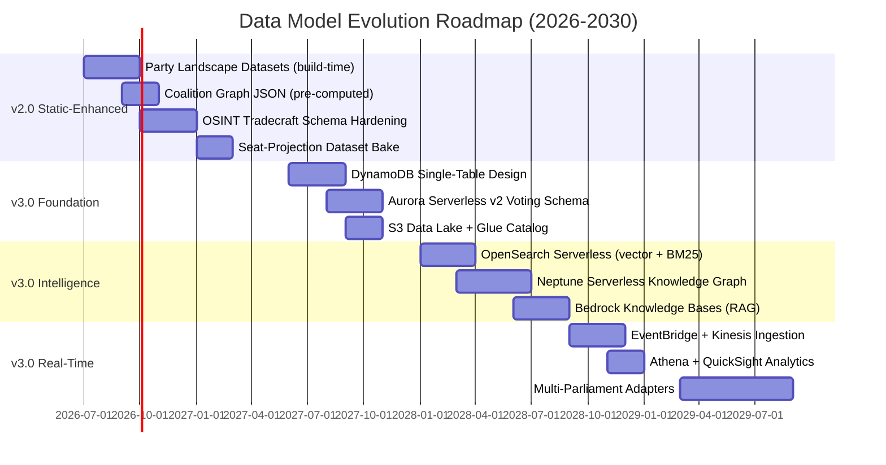
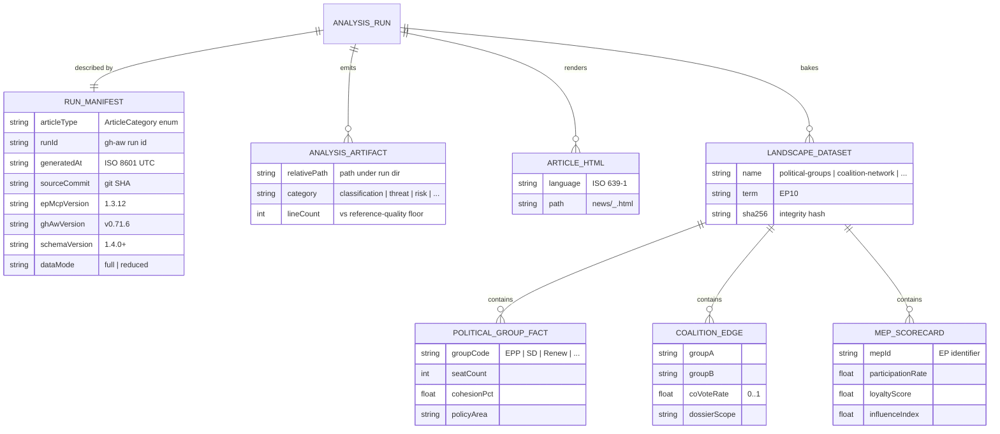
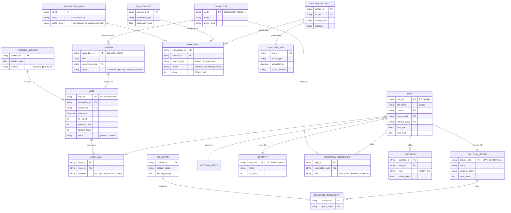
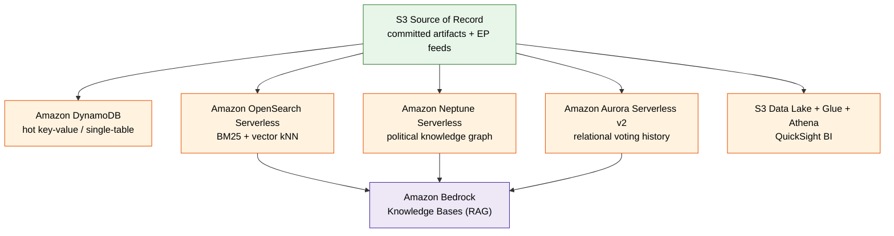
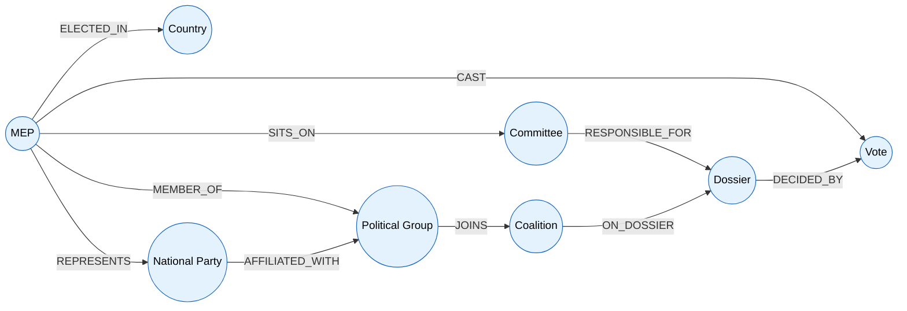
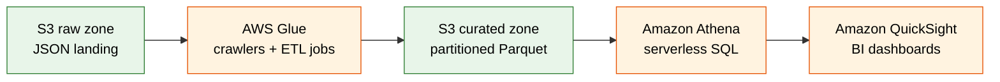
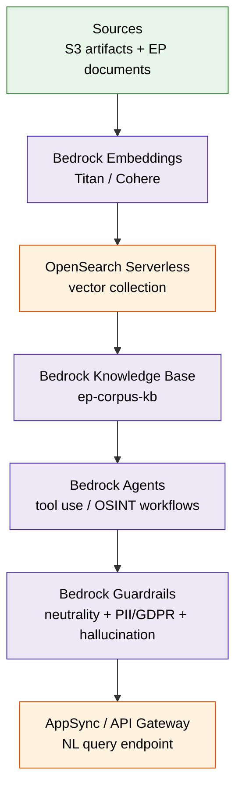
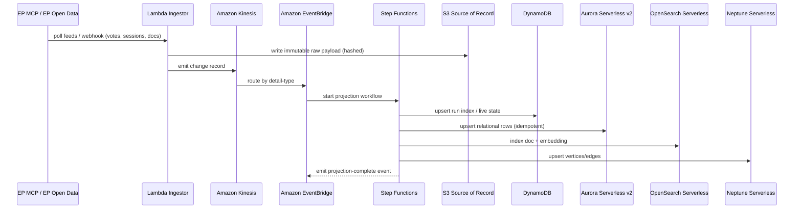
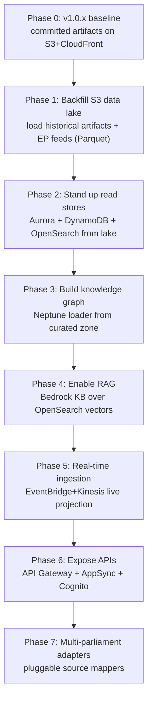

<p align="center">
  
</p>

<h1 align="center">📊 EU Parliament Monitor — Future Data Model</h1>

<p align="center">
  <strong>🗄️ AWS-Native Serverless Data Architecture for Political Intelligence</strong><br>
  <em>🎯 From Committed Static Artifacts to a Serverless Knowledge-Graph Platform (2026-2037)</em>
</p>

<p align="center">
  <a href="#"></a>
  <a href="#"></a>
  <a href="#"></a>
  <a href="#"></a>
</p>

**📋 Document Owner:** CEO | **📄 Version:** 4.1 | **📅 Last
Updated:** 2026-05-31 (UTC) | **🚀 Release:** v1.0.1  
**🔄 Review Cycle:** Quarterly | **⏰ Next Review:** 2026-08-31  
**🏷️ Classification:** Public (Open Source European Parliament Monitoring Platform)

---

## 📚 Architecture Documentation Map

<div class="documentation-map">

| Document | Focus | Description | Documentation Link |
| ------------------------------------------------------------------- | --------------- | ---------------------------------------------- | ------------------------------------------------------------------------------------------------------ |
| **[Architecture](ARCHITECTURE.md)** | 🏛️ Architecture | C4 model showing current system structure | [View Source](https://github.com/Hack23/euparliamentmonitor/blob/main/ARCHITECTURE.md) |
| **[Future Architecture](FUTURE_ARCHITECTURE.md)** | 🏛️ Architecture | C4 model showing future system structure | [View Source](https://github.com/Hack23/euparliamentmonitor/blob/main/FUTURE_ARCHITECTURE.md) |
| **[Mindmaps](MINDMAP.md)** | 🧠 Concept | Current system component relationships | [View Source](https://github.com/Hack23/euparliamentmonitor/blob/main/MINDMAP.md) |
| **[Future Mindmaps](FUTURE_MINDMAP.md)** | 🧠 Concept | Future capability evolution | [View Source](https://github.com/Hack23/euparliamentmonitor/blob/main/FUTURE_MINDMAP.md) |
| **[SWOT Analysis](SWOT.md)** | 💼 Business | Current strategic assessment | [View Source](https://github.com/Hack23/euparliamentmonitor/blob/main/SWOT.md) |
| **[Future SWOT Analysis](FUTURE_SWOT.md)** | 💼 Business | Future strategic opportunities | [View Source](https://github.com/Hack23/euparliamentmonitor/blob/main/FUTURE_SWOT.md) |
| **[Data Model](DATA_MODEL.md)** | 📊 Data | Current data structures and relationships | [View Source](https://github.com/Hack23/euparliamentmonitor/blob/main/DATA_MODEL.md) |
| **[Future Data Model](FUTURE_DATA_MODEL.md)** | 📊 Data | AWS-native serverless data architecture | **This Document** |
| **[Flowcharts](FLOWCHART.md)** | 🔄 Process | Current data processing workflows | [View Source](https://github.com/Hack23/euparliamentmonitor/blob/main/FLOWCHART.md) |
| **[Future Flowcharts](FUTURE_FLOWCHART.md)** | 🔄 Process | Enhanced AI-driven workflows | [View Source](https://github.com/Hack23/euparliamentmonitor/blob/main/FUTURE_FLOWCHART.md) |
| **[State Diagrams](STATEDIAGRAM.md)** | 🔄 Behavior | Current system state transitions | [View Source](https://github.com/Hack23/euparliamentmonitor/blob/main/STATEDIAGRAM.md) |
| **[Future State Diagrams](FUTURE_STATEDIAGRAM.md)** | 🔄 Behavior | Enhanced adaptive state transitions | [View Source](https://github.com/Hack23/euparliamentmonitor/blob/main/FUTURE_STATEDIAGRAM.md) |
| **[Security Architecture](SECURITY_ARCHITECTURE.md)** | 🛡️ Security | Current security implementation | [View Source](https://github.com/Hack23/euparliamentmonitor/blob/main/SECURITY_ARCHITECTURE.md) |
| **[Future Security Architecture](FUTURE_SECURITY_ARCHITECTURE.md)** | 🛡️ Security | Security enhancement roadmap | [View Source](https://github.com/Hack23/euparliamentmonitor/blob/main/FUTURE_SECURITY_ARCHITECTURE.md) |
| **[Threat Model](THREAT_MODEL.md)** | 🎯 Security | STRIDE threat analysis | [View Source](https://github.com/Hack23/euparliamentmonitor/blob/main/THREAT_MODEL.md) |
| **[Future Threat Model](FUTURE_THREAT_MODEL.md)** | 🎯 Security | Future threat landscape & controls | [View Source](https://github.com/Hack23/euparliamentmonitor/blob/main/FUTURE_THREAT_MODEL.md) |
| **[Classification](CLASSIFICATION.md)** | 🏷️ Governance | CIA classification & BCP | [View Source](https://github.com/Hack23/euparliamentmonitor/blob/main/CLASSIFICATION.md) |
| **[CRA Assessment](CRA-ASSESSMENT.md)** | 🛡️ Compliance | Cyber Resilience Act | [View Source](https://github.com/Hack23/euparliamentmonitor/blob/main/CRA-ASSESSMENT.md) |
| **[Workflows](WORKFLOWS.md)** | ⚙️ DevOps | CI/CD documentation | [View Source](https://github.com/Hack23/euparliamentmonitor/blob/main/WORKFLOWS.md) |
| **[Future Workflows](FUTURE_WORKFLOWS.md)** | 🚀 DevOps | Planned CI/CD enhancements | [View Source](https://github.com/Hack23/euparliamentmonitor/blob/main/FUTURE_WORKFLOWS.md) |
| **[Business Continuity Plan](BCPPlan.md)** | 🔄 Resilience | Recovery planning | [View Source](https://github.com/Hack23/euparliamentmonitor/blob/main/BCPPlan.md) |
| **[Financial Security Plan](FinancialSecurityPlan.md)** | 💰 Financial | Cost & security analysis | [View Source](https://github.com/Hack23/euparliamentmonitor/blob/main/FinancialSecurityPlan.md) |
| **[End-of-Life Strategy](End-of-Life-Strategy.md)** | 📦 Lifecycle | Technology EOL planning | [View Source](https://github.com/Hack23/euparliamentmonitor/blob/main/End-of-Life-Strategy.md) |
| **[Unit Test Plan](UnitTestPlan.md)** | 🧪 Testing | Unit testing strategy | [View Source](https://github.com/Hack23/euparliamentmonitor/blob/main/UnitTestPlan.md) |
| **[E2E Test Plan](E2ETestPlan.md)** | 🔍 Testing | End-to-end testing | [View Source](https://github.com/Hack23/euparliamentmonitor/blob/main/E2ETestPlan.md) |
| **[Performance Testing](performance-testing.md)** | ⚡ Performance | Performance benchmarks | [View Source](https://github.com/Hack23/euparliamentmonitor/blob/main/performance-testing.md) |
| **[Security Policy](SECURITY.md)** | 🔒 Security | Vulnerability reporting & security policy | [View Source](https://github.com/Hack23/euparliamentmonitor/blob/main/SECURITY.md) |

</div>

---

## 🔐 ISMS Policy Alignment

This future data model is designed to implement all controls from Hack23 AB's ISMS
framework as the EU Parliament Monitor platform evolves from a committed static-file
corpus to an AWS-native serverless data platform. Every data store named below is
governed by least-privilege IAM, encrypted with AWS KMS customer-managed keys, and
constrained to **PUBLIC open European Parliament data and the platform's own derived
analysis artifacts** — no private-life or non-public personal data is ingested.

### Related ISMS Policies

| **Policy Domain** | **Policy** | **Planned Implementation** |
| -------------------------- | ------------------------------------------------------------------------------------------------------------ | ------------------------------------------------------------- |
| **🔐 Core Security** | [Information Security Policy](https://github.com/Hack23/ISMS-PUBLIC/blob/main/Information_Security_Policy.md) | Overall governance for the serverless data platform |
| **🤖 AI Governance** | [AI Policy](https://github.com/Hack23/ISMS-PUBLIC/blob/main/AI_Policy.md) | Bedrock Guardrails, human-accountable RAG, no autonomous deploy |
| **🛠️ Development** | [Secure Development Policy](https://github.com/Hack23/ISMS-PUBLIC/blob/main/Secure_Development_Policy.md) | Schema-as-code, IaC review gates, data-contract tests |
| **🌐 Network** | [Network Security Policy](https://github.com/Hack23/ISMS-PUBLIC/blob/main/Network_Security_Policy.md) | VPC isolation, PrivateLink, WAF, Shield for data APIs |
| **🔒 Cryptography** | [Cryptography Policy](https://github.com/Hack23/ISMS-PUBLIC/blob/main/Cryptography_Policy.md) | KMS CMK encryption at rest, TLS 1.3 in transit, integrity hashes |
| **🔑 Access Control** | [Access Control Policy](https://github.com/Hack23/ISMS-PUBLIC/blob/main/Access_Control_Policy.md) | Cognito identity, IAM least-privilege, fine-grained table access |
| **🏷️ Data Classification** | [Data Classification Policy](https://github.com/Hack23/ISMS-PUBLIC/blob/main/Data_Classification_Policy.md) | Per-store PUBLIC classification & tagging |
| **🔍 Vulnerability** | [Vulnerability Management](https://github.com/Hack23/ISMS-PUBLIC/blob/main/Vulnerability_Management.md) | Inspector, automated dependency & infra scanning |
| **🚨 Incident Response** | [Incident Response Plan](https://github.com/Hack23/ISMS-PUBLIC/blob/main/Incident_Response_Plan.md) | GuardDuty + Security Hub automated detection & response |
| **💾 Backup & Recovery** | [Backup Recovery Policy](https://github.com/Hack23/ISMS-PUBLIC/blob/main/Backup_Recovery_Policy.md) | PITR, S3 versioning, cross-region replication |
| **🔄 Business Continuity** | [Business Continuity Plan](https://github.com/Hack23/ISMS-PUBLIC/blob/main/Business_Continuity_Plan.md) | Multi-AZ serverless, static-edge fallback |
| **🤝 Third-Party** | [Third Party Management](https://github.com/Hack23/ISMS-PUBLIC/blob/main/Third_Party_Management.md) | EP MCP / EP Open Data / IMF / World Bank source assurance |
| **🏷️ Classification** | [Classification Framework](https://github.com/Hack23/ISMS-PUBLIC/blob/main/CLASSIFICATION.md) | Business impact analysis for platform |

### Compliance Framework Mapping

| **Framework** | **Version** | **Relevant Controls** |
| ------------- | ----------- | --------------------- |
| **ISO 27001** | 2022 | A.5.1, A.8.10, A.8.11, A.8.12, A.8.25, A.8.26, A.8.27, A.8.28 |
| **NIST CSF** | 2.0 | GV.OC, GV.RM, ID.AM, PR.AA, PR.DS, DE.CM |
| **CIS Controls** | v8.1 | Control 1-6, 11, 13, 14, 16 |
| **GDPR** | 2016/679 | Art. 5 (minimisation), Art. 6 (lawful basis: public-interest transparency), Art. 89 |

---

## 📋 Executive Summary

This document defines the evolution of EU Parliament Monitor's data model from its
**current committed static-file corpus** — versioned analysis artifacts plus
pre-rendered, per-language HTML on **Amazon S3 + Amazon CloudFront** — toward an
**AWS-native serverless data platform** capable of real-time European Parliament
event ingestion, a queryable political knowledge graph, semantic / RAG search over
the full analysis corpus, and an API ecosystem for journalists and researchers.

It supersedes the obsolete v3.0 polyglot blueprint (PostgreSQL + MongoDB + Redis +
Elasticsearch + Neo4j on self-managed infrastructure). That generic-cloud framing is
**retired**. Every data tier is now expressed in **managed, serverless AWS
primitives** so the platform retains zero-ops economics while gaining query power.

### Three-Horizon Data Strategy

| Horizon | Name | Data Posture | Primary Stores |
| ------- | ---- | ------------ | -------------- |
| 🟢 **v2.0** | Enhanced Static Intelligence (2026 H2 → 2027) | **Stay file-based.** Committed analysis artifacts (`manifest.json` runs) + per-language HTML, now augmented with **richer pre-computed party / political-landscape dashboard datasets baked at build time**. | Git-versioned artifacts, S3 build outputs, CloudFront edge cache |
| 🔵 **v3.0+** | AWS-Native Serverless Platform (2028+) | **Dynamic layer behind the static edge.** Hot key-value, relational voting history, full-text + vector search, political knowledge graph, S3 data lake + BI, and a managed RAG layer. | DynamoDB · Aurora Serverless v2 · OpenSearch Serverless · Neptune Serverless · S3/Glue/Athena/QuickSight · Bedrock Knowledge Bases |
| ⚪ **10-yr** | AI Lookahead (2026 → 2037) | Model-agnostic semantic fabric; multi-parliament ontology; quantum-safe crypto migration. | Bedrock (model-agnostic) + Neptune ontology + linked-data exports |

### Current State (v1.0.x) → v2.0 → v3.0+ Comparison

| Aspect | Current (v1.0.x) | v2.0 (Static-Enhanced) | v3.0+ (AWS Serverless) | Benefit |
| ------ | ---------------- | ---------------------- | ---------------------- | ------- |
| **Storage** | Committed markdown + HTML on S3 | + pre-computed dashboard JSON baked at build | DynamoDB + Aurora Serverless v2 + S3 lake | Query flexibility, scale |
| **Structure** | Provenance `manifest.json` + typed `src/types` | + party/landscape datasets | Relational + key-value + graph + vector | Rich relationships |
| **Search** | Static client filter | Pre-indexed facets | OpenSearch Serverless (BM25 + kNN vector) | Semantic + RAG search |
| **Relationships** | Implicit in prose | Coalition/actor graph JSON | Neptune Serverless property graph | Native graph queries |
| **Update cadence** | Daily gh-aw batch | Daily batch + richer datasets | EventBridge + Kinesis near-real-time | Sub-minute freshness |
| **Query API** | None (static) | None (static) | API Gateway + AppSync GraphQL | Programmatic access |
| **Historical data** | Git history | Git history | Aurora temporal + Neptune time-versioned | Trend & "as-of" analysis |
| **AI/RAG** | Build-time LLM authoring (gh-aw) | Same | Bedrock Knowledge Bases over corpus | NL query, grounded answers |
| **Data sources** | EP MCP + World Bank + IMF | Same | + multi-parliament adapters | Comparative coverage |

The strategic invariant across all horizons: **the static HTML edge remains the
public, cacheable, low-cost front door.** Dynamic v3.0+ features are layered *behind*
CloudFront, never replacing it. See [FUTURE_ARCHITECTURE.md](FUTURE_ARCHITECTURE.md)
for the matching C4 view and [DATA_MODEL.md](DATA_MODEL.md) for the current schema.

---

## 📅 Data Model Evolution Roadmap



---

## 🟢 v2.0 — File-Based Data Model (Static-Enhanced)

v2.0 introduces **no servers and no databases.** It deepens the existing
file-based corpus and adds **pre-computed dashboard datasets baked at build time**,
so the public surface stays pure static HTML on S3 + CloudFront while gaining
party-level and political-landscape analytics.

### What stays identical to v1.0.x

- **Committed analysis artifacts** under `analysis/daily/<YYYY-MM-DD>/<slug>/` with a
  `manifest.json` provenance record (schema `1.4.0`+) that the deterministic
  aggregator (`src/aggregator/**`) reads to render HTML.
- **Per-language article HTML** (`news/*.html`, 14 languages) generated by
  `src/aggregator/article-generator.ts` — never authored by an LLM directly.
- **Strongly-typed domain models** in `src/types/*.ts` (strict ESM).
- Data surfaces: **European Parliament MCP server** (`european-parliament-mcp-server@1.3.14`,
  60+ tools), **worldbank-mcp** (optional), and **IMF REST**.

### What v2.0 adds — pre-computed landscape datasets

A new build step emits **static, versioned dataset files** (JSON, hydrated
client-side by Chart.js 4 + D3 7) focused on **parties and political groups**:

```text
data/landscape/<term>/
├── political-groups.json        ← seat share, cohesion %, leadership
├── group-cohesion-timeseries.json
├── coalition-mathematics.json   ← winning-coalition combinatorics per dossier
├── coalition-network.json       ← nodes/edges for cross-party alliance graph
├── mep-scorecards.json          ← per-MEP activity/loyalty/influence indices
├── voting-heatmap.json          ← group x policy-area alignment matrix
├── seat-projection-2029.json    ← electoral-cycle forecast bands
└── manifest.json                ← dataset provenance + source EP MCP versions
```

These files are produced deterministically from EP MCP tool output during CI, hashed
for integrity (SHA-256), and committed alongside the analysis run. Because they are
plain static assets, **CloudFront caches them at the edge** with no compute cost. The
v2.0 graph datasets (`coalition-network.json`) use the *same conceptual schema* as
the v3.0 Neptune property graph, so the later migration is a loader change, not a
remodelling exercise.



> **GDPR note (all horizons):** `MEP_SCORECARD` and every MEP-linked record store
> only **public parliamentary-role attributes** (votes cast in plenary, committee
> membership, tabled questions). No private-life, contact-beyond-public-office, or
> protected-characteristic data is held. Lawful basis is **public-interest
> transparency** (GDPR Art. 6(1)(e)); processing is documented per Art. 30.

---

## 🔵 v3.0+ — AWS-Native Serverless Data Architecture

From 2028 the file-based corpus becomes the **immutable source of record** that
hydrates a set of purpose-fit, fully-managed AWS serverless stores. Each store is
selected for a specific access pattern; none is self-managed; all scale to zero or
near-zero when idle.

### 📐 Future Entity Relationship Diagram (v3.0 logical model)



The logical entities above are **physically distributed across five AWS serverless
stores** plus a managed RAG layer, each mapped to its natural access pattern in the
sections that follow.

### Store-to-Access-Pattern Mapping



---

## 🔑 Amazon DynamoDB — Hot Key-Value & Single-Table

**Role:** ultra-low-latency, scale-to-near-zero store for **sessions, the analysis
run index, and real-time EP event state**. Replaces the obsolete MongoDB document
store and the Redis cache (the latter via **DynamoDB DAX** for microsecond reads, or
**ElastiCache Serverless** where a true cache-aside is needed).

### Single-Table Design

A single table `epm-core` uses a generic partition/sort key with overloaded item
types, GSIs for inverted access, and a TTL attribute for ephemeral real-time state.

| Access pattern | PK | SK | Notes |
| -------------- | -- | -- | ----- |
| Run index by date | `RUN#<date>` | `SLUG#<slug>` | List runs for a day |
| Run provenance | `RUN#<runId>` | `META` | Mirrors `manifest.json` |
| Artifact catalogue | `RUN#<runId>` | `ART#<path>` | Per-artifact metadata |
| Live vote tally | `VOTE#<voteId>` | `STATE` | TTL-expiring real-time tally |
| Session (Cognito) | `SESSION#<userId>` | `<sessionId>` | API consumer session |
| Saved query | `USER#<userId>` | `QUERY#<id>` | Researcher saved searches |

```json
{
  "PK": "RUN#2028-06-01-breaking-run07",
  "SK": "META",
  "itemType": "AnalysisRun",
  "articleType": "breaking",
  "generatedAt": "2028-06-01T05:12:44Z",
  "sourceCommit": "a1b2c3d",
  "epMcpVersion": "1.3.12",
  "schemaVersion": "1.4.0",
  "dataMode": "full",
  "gsi1pk": "TYPE#breaking",
  "gsi1sk": "DATE#2028-06-01",
  "ttl": null
}
```

- **Capacity:** on-demand (pay-per-request) — scales to zero cost when idle.
- **Streams:** DynamoDB Streams fan changes into EventBridge for downstream
  projection into Aurora / OpenSearch / Neptune.
- **Integrity:** items carry the `sha256` of their source artifact; PITR enabled.
- **Caching:** DAX cluster (or ElastiCache Serverless) fronts read-heavy GSIs.

> **Old → new:** *MongoDB document store* → **DynamoDB single-table**;
> *Redis cache* → **DynamoDB DAX / ElastiCache Serverless**.

---

## 🗃️ Amazon Aurora Serverless v2 (PostgreSQL) — Relational Voting History

**Role:** the **system of relational truth** for MEPs, votes, full per-MEP voting
history, committees, dossiers, and temporal "as-of" queries. Replaces the obsolete
self-managed PostgreSQL/TimescaleDB tier with an **auto-scaling, scale-to-low
(0.5 ACU) serverless** Postgres that supports the `pgvector` extension for in-row
embeddings where co-location with relational filters is valuable.

### Core Relational Schema

```sql
-- Members of the European Parliament (public role attributes only)
CREATE TABLE mep (
    mep_id          TEXT PRIMARY KEY,           -- EP identifier
    full_name       TEXT NOT NULL,              -- public
    country_iso     CHAR(2) NOT NULL REFERENCES country(iso_code),
    group_code      TEXT REFERENCES political_group(group_code),
    national_party  TEXT,
    term_start      DATE NOT NULL,
    term_end        DATE,
    CONSTRAINT public_role_only CHECK (true)    -- GDPR: no private-life columns
);

CREATE TABLE political_group (
    group_code   TEXT PRIMARY KEY,              -- EPP, SD, Renew, ...
    name         TEXT NOT NULL,
    ideology_band TEXT,
    seat_count   INT
);

CREATE TABLE committee (
    code         TEXT PRIMARY KEY,              -- LIBE, ECON, ENVI, ...
    name         TEXT NOT NULL,
    policy_area  TEXT
);

CREATE TABLE dossier (
    procedure_ref TEXT PRIMARY KEY,             -- 2024/0001(COD)
    title         TEXT NOT NULL,
    committee_code TEXT REFERENCES committee(code),
    stage         TEXT                          -- committee|plenary|trilogue|adopted
);

CREATE TABLE plenary_vote (
    vote_id       TEXT PRIMARY KEY,
    procedure_ref TEXT REFERENCES dossier(procedure_ref),
    session_id    TEXT NOT NULL,
    vote_time     TIMESTAMPTZ NOT NULL,
    for_count     INT, against_count INT, abstain_count INT,
    result        TEXT                          -- passed | rejected
);

-- Per-MEP roll-call positions (the high-volume, append-only history)
CREATE TABLE vote_cast (
    vote_id   TEXT REFERENCES plenary_vote(vote_id),
    mep_id    TEXT REFERENCES mep(mep_id),
    position  TEXT NOT NULL,                    -- for|against|abstain|absent
    PRIMARY KEY (vote_id, mep_id)
);
CREATE INDEX idx_vote_cast_mep ON vote_cast (mep_id);

-- Temporal committee membership for "as-of" composition queries
CREATE TABLE committee_membership (
    mep_id     TEXT REFERENCES mep(mep_id),
    code       TEXT REFERENCES committee(code),
    role       TEXT,                            -- chair|vice|member|substitute
    valid_from DATE NOT NULL,
    valid_to   DATE,
    PRIMARY KEY (mep_id, code, valid_from)
);
```

### Representative Analytical Queries

```sql
-- Group cohesion: share of a group voting with its modal position per dossier
SELECT pg.group_code,
       d.procedure_ref,
       AVG(modal.share) AS cohesion
FROM political_group pg
JOIN mep m              ON m.group_code = pg.group_code
JOIN vote_cast vc       ON vc.mep_id = m.mep_id
JOIN plenary_vote pv    ON pv.vote_id = vc.vote_id
JOIN dossier d          ON d.procedure_ref = pv.procedure_ref
JOIN LATERAL (
    SELECT MAX(cnt)::float / NULLIF(SUM(cnt),0) AS share
    FROM (SELECT position, COUNT(*) cnt
          FROM vote_cast x JOIN mep mm ON mm.mep_id = x.mep_id
          WHERE x.vote_id = pv.vote_id AND mm.group_code = pg.group_code
          GROUP BY position) t
) modal ON true
GROUP BY pg.group_code, d.procedure_ref;
```

- **Scaling:** Aurora Serverless v2 0.5–N ACU, auto-pause off for warm read replicas.
- **Temporal:** `valid_from/valid_to` ranges + `system_time`-style snapshots enable
  "what did committee LIBE look like on 2027-09-01?" analysis.
- **Resilience:** Multi-AZ, automated backups, PITR; cross-region read replica for DR.

> **Old → new:** *self-managed PostgreSQL / TimescaleDB* → **Aurora Serverless v2**.

---

## 🔍 Amazon OpenSearch Serverless — Full-Text + Vector Search

**Role:** unified **lexical (BM25) and semantic (kNN vector)** search across the
analysis corpus, EP documents, and dashboards. Replaces the obsolete Elasticsearch
tier. A single collection serves both keyword search and the **vector store backing
Bedrock Knowledge Bases**.

### Index Mapping (hybrid lexical + vector)

```json
{
  "settings": { "index.knn": true },
  "mappings": {
    "properties": {
      "source_id":   { "type": "keyword" },
      "source_type": { "type": "keyword" },
      "article_type":{ "type": "keyword" },
      "language":    { "type": "keyword" },
      "title":       { "type": "text", "analyzer": "standard" },
      "body":        { "type": "text" },
      "published_at":{ "type": "date" },
      "mep_ids":     { "type": "keyword" },
      "group_codes": { "type": "keyword" },
      "committee":   { "type": "keyword" },
      "embedding": {
        "type": "knn_vector",
        "dimension": 1024,
        "method": { "name": "hnsw", "space_type": "cosinesimil", "engine": "faiss" }
      }
    }
  }
}
```

### Hybrid Query Example

```json
{
  "size": 10,
  "query": {
    "hybrid": {
      "queries": [
        { "match": { "body": "carbon border adjustment cohesion" } },
        { "knn": { "embedding": { "vector": [/* 1024-d query embedding */],
                                  "k": 10 } } }
      ]
    }
  },
  "post_filter": { "term": { "language": "en" } }
}
```

- **Serverless:** OCUs auto-scale; no node management; encryption with KMS CMK.
- **Vector source:** embeddings generated by **Amazon Bedrock** (Titan Embeddings /
  Cohere) at ingestion, stored alongside lexical fields for **hybrid ranking**.
- **Access:** queried by AppSync resolvers and by Bedrock Knowledge Bases retrieval.

> **Old → new:** *Elasticsearch* → **OpenSearch Serverless (lexical + vector)**.

---

## 🕸️ Amazon Neptune Serverless — Political Knowledge Graph

**Role:** the **political knowledge graph** linking MEP ↔ political group ↔ committee
↔ dossier ↔ vote ↔ country, plus derived **coalition and actor networks**. Replaces
the obsolete Neo4j tier with a managed, auto-scaling property-graph + RDF engine
(openCypher / Gremlin / SPARQL). This is the spine of v3.0 OSINT capability: natural
network queries ("which Renew MEPs broke with their group on ENVI dossiers and how
does that cluster by country?") that are awkward in relational SQL.

### Graph Schema



### Property-Graph Model (openCypher)

```cypher
// Vertices carry only PUBLIC role attributes
(:MEP {mep_id, full_name, term_start, term_end})
(:PoliticalGroup {group_code, name, ideology_band, seat_count})
(:Country {iso_code, name, ep_seats})
(:Committee {code, name, policy_area})
(:Dossier {procedure_ref, title, stage})
(:Vote {vote_id, vote_time, result})
(:Coalition {coalition_id, winning_margin})
(:NationalParty {party_id, name})

// Edges
(:MEP)-[:MEMBER_OF {since}]->(:PoliticalGroup)
(:MEP)-[:ELECTED_IN]->(:Country)
(:MEP)-[:REPRESENTS]->(:NationalParty)
(:MEP)-[:SITS_ON {role, valid_from, valid_to}]->(:Committee)
(:MEP)-[:CAST {position}]->(:Vote)
(:Committee)-[:RESPONSIBLE_FOR]->(:Dossier)
(:Dossier)-[:DECIDED_BY]->(:Vote)
(:PoliticalGroup)-[:JOINS {co_vote_rate}]->(:Coalition)
(:Coalition)-[:ON_DOSSIER]->(:Dossier)
```

### Representative Network Query

```cypher
// Cross-party defection clustering on environment dossiers
MATCH (m:MEP)-[:MEMBER_OF]->(g:PoliticalGroup {group_code:'Renew'}),
      (m)-[c:CAST]->(v:Vote)<-[:DECIDED_BY]-(d:Dossier),
      (cte:Committee {code:'ENVI'})-[:RESPONSIBLE_FOR]->(d),
      (m)-[:ELECTED_IN]->(country:Country)
WHERE c.position <> g.modal_position
RETURN country.iso_code, count(DISTINCT m) AS defectors
ORDER BY defectors DESC;
```

- **Serverless:** Neptune Serverless NCUs scale with query load; KMS-encrypted.
- **Provenance:** every edge references the EP source `vote_id` / `procedure_ref`,
  preserving evidence chains required by the OSINT tradecraft methodology.
- **Time-versioning:** edges carry `valid_from/valid_to` so coalition graphs can be
  reconstructed "as of" any plenary week.
- **Bidirectional with v2.0:** the static `coalition-network.json` dataset is the
  same logical graph, exported for client-side D3 rendering.

> **Old → new:** *Neo4j knowledge graph* → **Amazon Neptune Serverless**.

---

## 🏞️ S3 Data Lake + AWS Glue + Amazon Athena + Amazon QuickSight

**Role:** cost-efficient **analytics and BI** over the full historical corpus.
The committed artifacts and EP feeds land in an **S3 data lake** (partitioned
Parquet), are catalogued by **AWS Glue**, queried ad-hoc with **Amazon Athena**
(serverless SQL), and visualised in **Amazon QuickSight** dashboards for internal
analysts and partner journalists.

### Lake Zones & Catalog

```text
s3://epm-datalake/
├── raw/        ep_mcp/ , imf/ , worldbank/        (immutable landing, JSON)
├── curated/    votes/ meps/ dossiers/ coalitions/ (Parquet, partitioned by year/term)
└── analytics/  scorecards/ cohesion/ projections/ (aggregated marts)
```



- **Glue Data Catalog** is the single schema registry shared by Athena, EMR
  Serverless (if needed), and QuickSight.
- **Athena** powers long-horizon trend queries (multi-term voting drift) that would
  be expensive to keep hot in Aurora.
- **QuickSight** SPICE datasets refresh on a schedule from Athena views; row-level
  security ties to Cognito groups.
- **Format:** Parquet + Snappy, partition projection for fast pruning; lifecycle
  policy tiers cold partitions to S3 Glacier Instant Retrieval.

> **Old → new:** ad-hoc warehouse / Datadog dashboards → **S3 + Glue + Athena + QuickSight**.

---

## 🤖 Amazon Bedrock Knowledge Bases — Managed RAG Layer

**Role:** the **managed Retrieval-Augmented-Generation layer** over the EP corpus and
the platform's own analysis artifacts, enabling grounded natural-language query
("Summarise how the EPP voted on migration dossiers this term, with citations").
Replaces any bespoke OpenAI/LangChain gateway with a **model-agnostic** Bedrock layer.



- **Vector store:** the same **OpenSearch Serverless** collection used for hybrid
  search — one index, two consumers (search UI and RAG retrieval).
- **Models:** Anthropic Claude, Amazon Nova, and others, swapped via configuration —
  no application rewrite when a better model ships (see AI lookahead below).
- **Bedrock Guardrails** enforce: political **neutrality**, **PII / GDPR** redaction
  (block any non-public-role personal data), and **hallucination control** (answers
  must cite retrieved EP source passages).
- **Governance:** per the [AI Policy](https://github.com/Hack23/ISMS-PUBLIC/blob/main/AI_Policy.md),
  AI generates **proposals**, humans remain accountable, and **no autonomous deploy**
  of generated content occurs — RAG answers are advisory and citation-backed.

> **Old → new:** *OpenAI / LangChain gateway* → **Amazon Bedrock + Knowledge Bases + Agents + Guardrails**.

---

## 🔄 Data Synchronization & Ingestion Strategy

v3.0 ingestion is **event-driven and serverless end-to-end.** EP MCP / EP Open Data
changes are detected, streamed, transformed, and **projected into each purpose-fit
store** with eventual consistency. The **S3 source of record stays authoritative**;
every derived store can be rebuilt from it.



### Components & Responsibilities

| Concern | AWS Service | Behaviour |
| ------- | ----------- | --------- |
| Scheduled / triggered polling | **EventBridge Scheduler + Lambda** | Pulls EP MCP sliding/fixed-window feeds |
| Change streaming | **Amazon Kinesis Data Streams** | Ordered, replayable change records |
| Routing / fan-out | **Amazon EventBridge** | Content-based routing by detail-type |
| Orchestration | **AWS Step Functions** | Idempotent multi-store projection sagas |
| Async buffering | **Amazon SQS / SNS** | Backpressure + retry + DLQ |
| Source of record | **Amazon S3** | Immutable, versioned, hashed payloads |

### Eventual-Consistency & Idempotency

- Every projection is **idempotent** keyed on the EP source id + content hash, so a
  Kinesis replay never double-writes.
- **Dead-letter queues** capture poison records; a Step Functions retry policy with
  exponential backoff handles transient EP API throttling.
- DynamoDB Streams provide a secondary change feed so a store added later (e.g. a new
  analytics mart) can backfill from history without touching the ingestor.
- **Reconciliation job** (nightly Glue) diffs each derived store against the S3 SOR
  and emits drift metrics to CloudWatch.

> **Old → new:** *Kafka event bus* → **EventBridge + Kinesis + SQS/SNS**;
> *Socket.io / Apollo* → **API Gateway WebSocket / AppSync** for live push.

---

## 📈 Data Migration Plan (File-Based Static → AWS Serverless)

Migration is **additive and reversible**: the file-based corpus keeps running and
serving traffic while serverless stores are populated *from* it. No "big bang."



### Migration Principles

| Principle | Implementation |
| --------- | -------------- |
| **Source of record unchanged** | Git + S3 artifacts remain authoritative; stores are projections |
| **Idempotent loaders** | Re-runnable Glue / Lambda jobs keyed on EP ids + hashes |
| **Reversibility** | Any store can be dropped and rebuilt from S3 SOR |
| **Zero downtime** | Static edge keeps serving; dynamic features feature-flagged |
| **Validation gates** | Row-count + checksum parity checks before cut-over |
| **Cost discipline** | Scale-to-zero serverless; backfill on Spot/serverless batch |

### Illustrative Backfill Job (TypeScript / Lambda)

```typescript
// Project a committed analysis run into DynamoDB + OpenSearch (idempotent)
import { readManifest } from "../src/aggregator/analysis-aggregator.js";

export async function projectRun(runDir: string): Promise<void> {
  const manifest = await readManifest(runDir);          // src/types/analysis.ts
  const key = `RUN#${manifest.runId}`;
  await ddb.put({                                        // idempotent upsert
    TableName: "epm-core",
    Item: { PK: key, SK: "META", ...manifest,
            gsi1pk: `TYPE#${manifest.articleType}`,
            gsi1sk: `DATE#${manifest.generatedAt.slice(0, 10)}` },
  });
  for (const path of manifest.files.classification ?? []) {
    const body = await readArtifact(runDir, path);
    const embedding = await bedrockEmbed(body);          // Titan / Cohere
    await opensearch.index({
      index: "epm-corpus",
      id: `${manifest.runId}:${path}`,                   // deterministic id
      document: { source_id: path, source_type: "artifact",
                  article_type: manifest.articleType, body, embedding },
    });
  }
}
```

---

## 📊 Data Quality & Monitoring

| Dimension | Mechanism | AWS Service |
| --------- | --------- | ----------- |
| **Freshness** | Feed lag vs EP publication timestamps | CloudWatch metric + alarm |
| **Completeness** | Row/edge parity vs S3 SOR | AWS Glue Data Quality |
| **Schema conformance** | Contract tests on ingest | Glue Data Quality rulesets |
| **Integrity** | SHA-256 of raw payloads vs stored | Lambda check + CloudTrail |
| **Referential integrity** | Orphan vote_cast / dangling edges | Athena scheduled query |
| **Drift** | Nightly reconciliation diff | Glue job → CloudWatch dashboard |
| **Cost / capacity** | ACU / OCU / NCU utilisation | CloudWatch + Budgets alerts |

```sql
-- Athena data-quality probe: votes with no recorded per-MEP positions
SELECT pv.vote_id, pv.vote_time
FROM curated.plenary_vote pv
LEFT JOIN curated.vote_cast vc ON vc.vote_id = pv.vote_id
WHERE vc.vote_id IS NULL
ORDER BY pv.vote_time DESC;
```

- **Glue Data Quality** rulesets enforce non-null keys, enum domains (e.g. `position
  IN ('for','against','abstain','absent')`), and freshness SLAs at ingest time.
- **CloudWatch dashboards** track per-store health; alarms route to the Incident
  Response Plan via SNS.
- **Quality lineage** mirrors the existing `reference-quality-thresholds.json`
  philosophy — every projection records its source artifact and line/row counts.

---

## 🔐 Data Security & GDPR

Security is **defence-in-depth and PUBLIC-data-only by design.**

| Control | Implementation |
| ------- | -------------- |
| **Encryption at rest** | **AWS KMS** customer-managed keys for DynamoDB, Aurora, OpenSearch, Neptune, S3 |
| **Encryption in transit** | TLS 1.3 everywhere; VPC endpoints / PrivateLink for store access |
| **Identity** | **Amazon Cognito** user pools (journalists / researchers / API consumers), federated IdP |
| **Authorization** | IAM least-privilege roles per Lambda; fine-grained DynamoDB / row-level Aurora policies |
| **Network** | Private subnets, security groups, **AWS WAF + Shield** on public APIs |
| **Secrets** | **AWS Secrets Manager** for any source credentials; no secrets in code |
| **Audit** | **AWS CloudTrail** + **Security Hub** + **GuardDuty** anomaly detection |
| **PII / GDPR** | **Bedrock Guardrails** block non-public-role personal data in any RAG output |

### GDPR Public-Roles-Only Guarantee

- **Lawful basis:** public-interest transparency (GDPR Art. 6(1)(e)); the data subject
  set is **elected officials acting in their public parliamentary role**.
- **Data minimisation (Art. 5):** stores hold only votes, memberships, tabled
  questions, declarations published by the EP — **no private life, no contact data
  beyond public office, no protected characteristics, no inferred psychographics.**
- **Schema-level enforcement:** Aurora tables carry no private-attribute columns;
  Neptune vertices expose only public role properties; Bedrock Guardrails redact any
  accidental PII before it can surface in a generated answer.
- **Auditability:** all access to MEP-linked data is logged (CloudTrail) per the
  intelligence-operative GDPR duty; processing recorded per Art. 30.
- See [FUTURE_SECURITY_ARCHITECTURE.md](FUTURE_SECURITY_ARCHITECTURE.md) and
  [FUTURE_THREAT_MODEL.md](FUTURE_THREAT_MODEL.md) for the full control set.

---

## 🕵️ Political Intelligence Data Capabilities (2026 → 2037)

The stores above hold the **base** political data — MEPs, groups, votes, dossiers.
This section adds the **intelligence-grade** data structures required by the OSINT
capability roadmap in
[FUTURE_MINDMAP.md](FUTURE_MINDMAP.md#-political-intelligence-capability-roadmap--ai-driven-osint-tradecraft-2026--2037)
and realised architecturally in
[FUTURE_ARCHITECTURE.md](FUTURE_ARCHITECTURE.md#-intelligence-capability-architecture-2026--2037).
Each new entity family is the data backbone of a missing capability a senior
intelligence operative would expect — and every one stays inside the **PUBLIC
open-data, public-parliamentary-role** boundary with provenance attached.

> **GDPR / neutrality invariant.** New entities describe **public roles, public
> declarations, public documents, and public discourse only**. No private-life
> attribute, no protected characteristic, and no psychographic field is ever
> modelled. Integrity findings are stored as *questions with evidence*, never as
> adjudicated accusations.

### New Intelligence Entity Families

| Capability | New Entities | Store | Horizon |
| ---------- | ------------ | ----- | ------- |
| **Collection management / PIR** | `IntelligenceRequirement`, `CollectionTask`, `CoverageGap` | DynamoDB | 🟢 v2.0 → 🔵 v3.0 |
| **Indications and Warning** | `Indicator`, `Watchlist`, `WarningEvent`, `Tripwire` | DynamoDB + Kinesis | 🔵 v3.0 |
| **Integrity / conflict-of-interest** | `FinancialInterest`, `OutsideActivity`, `RegisterEntry`, `Meeting`, `InterestOrganization` | Aurora + Neptune | 🔵 v3.1 |
| **Verbatim speech intelligence** | `Speech`, `Utterance`, `StanceSignal` | Aurora + OpenSearch | 🔵 v3.1 |
| **Counter-FIMI** | `Narrative`, `MediaItem`, `NarrativeCampaign`, `FIMIIncident` | OpenSearch + Neptune | ⚪ v3.2 |
| **Forecasting + ACH** | `Forecast`, `Hypothesis`, `ConfidenceAssessment`, `RedTeamReview` | Aurora | 🔵 v3.0 |
| **Provenance + authenticity** | `EvidenceChain`, `SourceGrade`, `ContentCredential` | S3 + Neptune | 🟢 → ⚪ v3.2 |

### Knowledge-Graph Extensions (openCypher)

These vertices and edges extend the v3.0 Neptune
[political knowledge graph](#-amazon-neptune-serverless--political-knowledge-graph)
so multi-hop **influence and integrity** tracing becomes a single query.

```cypher
// New PUBLIC-only intelligence vertices
(:InterestOrganization {org_id, name, register_id, country, category})
(:RegisterEntry {entry_id, declared_interest, lobby_budget_band, updated})
(:Meeting {meeting_id, date, subject, dossier_ref})
(:FinancialInterest {decl_id, type, declared_on, source})
(:Narrative {narrative_id, theme, first_seen, languages})
(:FIMIIncident {incident_id, disarm_ttp, confidence_band, status})
(:Indicator {indicator_id, name, baseline, threshold})
(:WarningEvent {warning_id, level, raised_at, confirmed_by})

// New edges — every edge references a PUBLIC EP / register source
(:MEP)-[:DECLARED {declared_on}]->(:FinancialInterest)
(:MEP)-[:MET_WITH {date}]->(:InterestOrganization)
(:InterestOrganization)-[:LISTED_IN]->(:RegisterEntry)
(:InterestOrganization)-[:LOBBIED_ON]->(:Dossier)
(:Meeting)-[:CONCERNS]->(:Dossier)
(:Narrative)-[:REFERENCES]->(:Dossier)
(:FIMIIncident)-[:AMPLIFIES]->(:Narrative)
(:Indicator)-[:WATCHES]->(:PoliticalGroup)
(:WarningEvent)-[:RAISED_BY]->(:Indicator)
```

```cypher
// Integrity question (NOT an accusation): rapporteurs whose dossier overlaps a
// declared outside interest AND a registered lobby meeting on the same dossier.
MATCH (m:MEP)-[:SITS_ON {role:'Rapporteur'}]->(:Committee)-[:RESPONSIBLE_FOR]->(d:Dossier),
      (m)-[:DECLARED]->(fi:FinancialInterest),
      (m)-[:MET_WITH]->(o:InterestOrganization)-[:LOBBIED_ON]->(d)
RETURN m.full_name AS public_role, d.procedure_ref, fi.type, o.name
ORDER BY d.procedure_ref;
// Output is a SOURCED prompt for journalistic review, WEP-banded, human-reviewed.
```

### Indications-and-Warning Indicator Schema (DynamoDB)

The I&W store turns the abstract "warning problem" into queryable indicators with
calibrated tripwires and an auditable promotion history.

```json
{
  "PK": "WATCHLIST#coalition-collapse",
  "SK": "INDICATOR#cohesion-decline-EPP",
  "indicator": "EPP roll-call cohesion 30-day rolling mean",
  "baseline": 0.92,
  "current": 0.81,
  "tripwire": 0.85,
  "deviation_sigma": 2.4,
  "confidence_band": "likely (WEP 55-70%)",
  "state": "WARNING",
  "evidence_vote_ids": ["RCV-2029-0412", "RCV-2029-0418"],
  "raised_at": "2029-03-14T09:00:00Z",
  "human_confirmed_by": "analyst-on-duty",
  "anchoring_methodology": "coalition-dynamics-analysis.md"
}
```

### Forecast and Hypothesis Schema (Aurora)

Predictive products are stored with their **competing hypotheses, confidence band,
and red-team review** attached — never a bare point estimate — so every forecast is
auditable against the outcome and the analytic track record is measurable.

```sql
CREATE TABLE forecast (
  forecast_id      uuid PRIMARY KEY,
  subject_ref      text NOT NULL,          -- dossier / coalition / election
  question         text NOT NULL,          -- the estimative question
  estimate         numeric,                -- probability 0..1
  wep_band         text NOT NULL,          -- Kent / Words of Estimative Probability
  confidence       text NOT NULL,          -- ICD 203 low/moderate/high
  competing_hyps   jsonb NOT NULL,         -- >= 2 hypotheses required
  red_team_review  jsonb,                  -- devil's-advocate dissent record
  evidence_chain   jsonb NOT NULL,         -- cited PUBLIC sources
  resolved_outcome numeric,                -- filled after the event for calibration
  human_signoff    text NOT NULL
);
```

> **Calibration loop.** `resolved_outcome` closes the feedback arm of the
> intelligence cycle: forecast accuracy is scored over time (Brier-style), feeding
> the analytic track record and re-tasking the collection plan — the data-model
> realisation of "be early *and* honest about it".

---

## 🔮 Visionary Data Model Roadmap: 2027-2037

As AI models evolve — major upgrades roughly annually, with competitors evaluated at
each release — the data model evolves toward a **model-agnostic semantic fabric** on
the same AWS serverless substrate. Bedrock's model abstraction means new foundation
models are adopted by configuration, not rearchitecture.

### AI Model Evolution — DevSecOps & Development Perspective

| Year | AI Model | DevSecOps Capability Evolution |
| ---- | -------- | ------------------------------ |
| 2026 | Opus 4.6–4.9 | 🟢 AI-assisted code review, automated test generation, agentic CI/CD workflows |
| 2027 | Opus 5.x | 🔵 Predictive vulnerability detection, intelligent dependency management |
| 2028 | Opus 6.x | 🟣 Multi-modal security analysis (code + architecture + runtime), automated threat modeling |
| 2029 | Opus 7.x | 🟠 Autonomous security pipeline orchestration, self-healing build systems |
| 2030 | Opus 8.x | 🔴 Near-expert automated security review, AI-driven architecture validation |
| 2031–2033 | Opus 9–10.x / Pre-AGI | ⚪ Autonomous secure development lifecycle management |
| 2034–2037 | AGI / Post-AGI | ⭐ Transformative software engineering with built-in security assurance |

> **Assumptions:** major AI model upgrades annually; competitors (OpenAI, Google,
> Meta, EU sovereign AI) evaluated at each release; architecture accommodates
> potential paradigm shifts (quantum AI, neuromorphic computing). Full
> cross-perspective analysis lives in the Hack23 Information Security Strategy
> § AI Model Evolution Strategy; governance per
> [AI Policy](https://github.com/Hack23/ISMS-PUBLIC/blob/main/AI_Policy.md)
> (AI = proposal generator, human accountability, no autonomous deploy).

### Data-Model Eras

| Era | Years | Data Model Paradigm | Key Additions |
| --- | ----- | ------------------- | ------------- |
| **Near-Term** | 2027-2029 | AWS serverless multi-store + Neptune graph | Hybrid vector/lexical search, Bedrock RAG, real-time projection |
| **Mid-Term** | 2029-2032 | Unified semantic fabric | OWL/RDF parliament ontology over Neptune, automated schema evolution with human gates |
| **Long-Term** | 2032-2035 | Autonomous data curation | Self-healing pipelines, predictive indexing, causal inference layer |
| **Visionary** | 2035-2037 | AGI-ready, quantum-safe | Dynamic schema generation, universal multi-parliament intelligence, PQC migration |

### Phase 5: Semantic Data Fabric (2027-2029)

- **Universal Parliament Ontology:** a formal **OWL/RDF** ontology over Neptune's RDF
  engine mapping bills, votes, committees, and amendments across the EP and national
  parliaments into one semantic model — exported as **linked open data**.
- **Hybrid retrieval everywhere:** OpenSearch Serverless hybrid (BM25 + kNN) becomes
  the default access path; Bedrock Knowledge Bases ground every analytical answer.
- **Temporal graph:** Neptune time-versioned edges enable "what did Parliament look
  like on date X?" reconstruction across the whole term.

### Phase 6: Autonomous Data Curation (2029-2032)

- **Self-healing pipelines:** Step Functions + Bedrock Agents detect Glue Data
  Quality failures, propose corrections, and apply them **with human approval gates**
  and full CloudTrail audit (per AI Policy — no autonomous mutation of the SOR).
- **Predictive indexing:** SageMaker models anticipate query demand from the EP
  calendar and pre-warm Aurora replicas / OpenSearch OCUs.
- **Cross-lingual unification:** Amazon Translate + Comprehend align 24+ EU-language
  parliamentary data into the shared ontology without manual mapping.

### Phase 7: Global Democratic Data & Multi-Parliament Expansion (2032-2035)

- **Pluggable source adapters:** a normalisation layer maps additional national
  parliaments into the shared ontology, reusing the EP MCP contract pattern.
- **Causal layer:** graph + relational features feed SageMaker causal models for
  "why did this coalition form?" analysis beyond correlation.
- **Linked-data publishing:** SPARQL endpoint + bulk RDF exports make the corpus a
  reusable civic-tech public good.

### Phase 8: AGI-Ready & Quantum-Safe Data (2035-2037)

- **Dynamic schema generation:** AGI-class systems propose optimal projections for a
  given analytical question; humans ratify before deployment.
- **Quantum-safe cryptography:** migrate KMS-managed keys and data-in-transit to
  **post-quantum (PQC) algorithms** as AWS exposes them, protecting long-lived public
  archives against "harvest-now-decrypt-later" risk.
- **Model-agnostic to the end:** Bedrock's abstraction means even paradigm shifts
  (neuromorphic, quantum AI) are adopted at the model layer, leaving the serverless
  data substrate and the GDPR public-roles-only guarantee intact.

---

## 📚 References

### Current State

- [Current Data Model](DATA_MODEL.md)
- [Current Architecture](ARCHITECTURE.md)
- [Current Flowcharts](FLOWCHART.md)

### Future State

- [Future Architecture](FUTURE_ARCHITECTURE.md)
- [Future Flowchart](FUTURE_FLOWCHART.md)
- [Future State Diagram](FUTURE_STATEDIAGRAM.md)
- [Future Security Architecture](FUTURE_SECURITY_ARCHITECTURE.md)
- [Future Threat Model](FUTURE_THREAT_MODEL.md)
- [Future Workflows](FUTURE_WORKFLOWS.md)

### AWS Service Documentation

- Amazon DynamoDB · Amazon Aurora Serverless v2 (PostgreSQL)
- Amazon OpenSearch Serverless (lexical + vector) · Amazon Neptune Serverless
- Amazon S3 · AWS Glue · Amazon Athena · Amazon QuickSight
- Amazon Bedrock · Bedrock Knowledge Bases · Bedrock Agents · Bedrock Guardrails
- Amazon EventBridge · Amazon Kinesis · AWS Step Functions · Amazon SQS / SNS
- Amazon API Gateway · AWS AppSync · Amazon Cognito · AWS KMS · AWS Secrets Manager

### External Standards

- ISO 8601 (Date/Time) · ISO 639-1 (Language Codes) · ISO 3166-1 (Country Codes)
- W3C RDF / OWL / SPARQL (semantic fabric)
- JSON Schema · GraphQL Schema (AppSync)
- GDPR (Regulation 2016/679) — public-interest transparency basis

### Governance

- [Hack23 AI Policy](https://github.com/Hack23/ISMS-PUBLIC/blob/main/AI_Policy.md)
- [Hack23 Information Security Policy](https://github.com/Hack23/ISMS-PUBLIC/blob/main/Information_Security_Policy.md)
- [Hack23 Data Classification Policy](https://github.com/Hack23/ISMS-PUBLIC/blob/main/Data_Classification_Policy.md)

---

**Document Status**: ✅ **APPROVED FOR PLANNING**  
**Version**: 4.0 | **Last Updated**: 2026-05-31 (UTC) | **Release**: v1.0.1  
**Next Review**: 2026-08-31 (Quarterly)  
**Classification**: Public (Open Source European Parliament Monitoring Platform)
