

  

<h1 align="center">🔄 EU Parliament Monitor — Future Flowcharts</h1>

  <strong>📊 From Static Intelligence Generation to AWS-Native Serverless OSINT Operations</strong> 
  <em>🎯 Three Horizons: Enhanced Static (v2.0) → AWS Serverless Platform (v3.0+) → 10-Year AI Lookahead (2026-2037)</em>

  
  
  
  

**📋 Document Owner:** CEO | **📄 Version:** 4.1 | **📅 Last
Updated:** 2026-05-31 (UTC)  
**🔄 Review Cycle:** Quarterly | **⏰ Next Review:** 2026-08-31 | **🏷️ Release:** v1.0.1  
**🏷️ Classification:** Public (Open Source European Parliament Monitoring Platform)

---

## 📚 Architecture Documentation Map

| Document | Focus | Description | Documentation Link |
| ------------------------------------------------------------------- | --------------- | ---------------------------------------------- | ------------------------------------------------------------------------------------------------------ |
| **[Architecture](ARCHITECTURE.md)** | 🏛️ Architecture | C4 model showing current system structure | [View Source](https://github.com/Hack23/euparliamentmonitor/blob/main/ARCHITECTURE.md) |
| **[Future Architecture](FUTURE_ARCHITECTURE.md)** | 🏛️ Architecture | C4 model showing future system structure | [View Source](https://github.com/Hack23/euparliamentmonitor/blob/main/FUTURE_ARCHITECTURE.md) |
| **[Mindmaps](MINDMAP.md)** | 🧠 Concept | Current system component relationships | [View Source](https://github.com/Hack23/euparliamentmonitor/blob/main/MINDMAP.md) |
| **[Future Mindmaps](FUTURE_MINDMAP.md)** | 🧠 Concept | Future capability evolution | [View Source](https://github.com/Hack23/euparliamentmonitor/blob/main/FUTURE_MINDMAP.md) |
| **[SWOT Analysis](SWOT.md)** | 💼 Business | Current strategic assessment | [View Source](https://github.com/Hack23/euparliamentmonitor/blob/main/SWOT.md) |
| **[Future SWOT Analysis](FUTURE_SWOT.md)** | 💼 Business | Future strategic opportunities | [View Source](https://github.com/Hack23/euparliamentmonitor/blob/main/FUTURE_SWOT.md) |
| **[Data Model](DATA_MODEL.md)** | 📊 Data | Current data structures and relationships | [View Source](https://github.com/Hack23/euparliamentmonitor/blob/main/DATA_MODEL.md) |
| **[Future Data Model](FUTURE_DATA_MODEL.md)** | 📊 Data | Enhanced European Parliament data architecture | [View Source](https://github.com/Hack23/euparliamentmonitor/blob/main/FUTURE_DATA_MODEL.md) |
| **[Flowcharts](FLOWCHART.md)** | 🔄 Process | Current data processing workflows | [View Source](https://github.com/Hack23/euparliamentmonitor/blob/main/FLOWCHART.md) |
| **[Future Flowcharts](FUTURE_FLOWCHART.md)** | 🔄 Process | Enhanced AI-driven workflows | **This Document** |
| **[State Diagrams](STATEDIAGRAM.md)** | 🔄 Behavior | Current system state transitions | [View Source](https://github.com/Hack23/euparliamentmonitor/blob/main/STATEDIAGRAM.md) |
| **[Future State Diagrams](FUTURE_STATEDIAGRAM.md)** | 🔄 Behavior | Enhanced adaptive state transitions | [View Source](https://github.com/Hack23/euparliamentmonitor/blob/main/FUTURE_STATEDIAGRAM.md) |
| **[Security Architecture](SECURITY_ARCHITECTURE.md)** | 🛡️ Security | Current security implementation | [View Source](https://github.com/Hack23/euparliamentmonitor/blob/main/SECURITY_ARCHITECTURE.md) |
| **[Future Security Architecture](FUTURE_SECURITY_ARCHITECTURE.md)** | 🛡️ Security | Security enhancement roadmap | [View Source](https://github.com/Hack23/euparliamentmonitor/blob/main/FUTURE_SECURITY_ARCHITECTURE.md) |
| **[Threat Model](THREAT_MODEL.md)** | 🎯 Security | STRIDE threat analysis | [View Source](https://github.com/Hack23/euparliamentmonitor/blob/main/THREAT_MODEL.md) |
| **[Classification](CLASSIFICATION.md)** | 🏷️ Governance | CIA classification & BCP | [View Source](https://github.com/Hack23/euparliamentmonitor/blob/main/CLASSIFICATION.md) |
| **[CRA Assessment](CRA-ASSESSMENT.md)** | 🛡️ Compliance | Cyber Resilience Act | [View Source](https://github.com/Hack23/euparliamentmonitor/blob/main/CRA-ASSESSMENT.md) |
| **[Workflows](WORKFLOWS.md)** | ⚙️ DevOps | CI/CD documentation | [View Source](https://github.com/Hack23/euparliamentmonitor/blob/main/WORKFLOWS.md) |
| **[Future Workflows](FUTURE_WORKFLOWS.md)** | 🚀 DevOps | Planned CI/CD enhancements | [View Source](https://github.com/Hack23/euparliamentmonitor/blob/main/FUTURE_WORKFLOWS.md) |
| **[Business Continuity Plan](BCPPlan.md)** | 🔄 Resilience | Recovery planning | [View Source](https://github.com/Hack23/euparliamentmonitor/blob/main/BCPPlan.md) |
| **[Financial Security Plan](FinancialSecurityPlan.md)** | 💰 Financial | Cost & security analysis | [View Source](https://github.com/Hack23/euparliamentmonitor/blob/main/FinancialSecurityPlan.md) |
| **[End-of-Life Strategy](End-of-Life-Strategy.md)** | 📦 Lifecycle | Technology EOL planning | [View Source](https://github.com/Hack23/euparliamentmonitor/blob/main/End-of-Life-Strategy.md) |
| **[Unit Test Plan](UnitTestPlan.md)** | 🧪 Testing | Unit testing strategy | [View Source](https://github.com/Hack23/euparliamentmonitor/blob/main/UnitTestPlan.md) |
| **[E2E Test Plan](E2ETestPlan.md)** | 🔍 Testing | End-to-end testing | [View Source](https://github.com/Hack23/euparliamentmonitor/blob/main/E2ETestPlan.md) |
| **[Performance Testing](performance-testing.md)** | ⚡ Performance | Performance benchmarks | [View Source](https://github.com/Hack23/euparliamentmonitor/blob/main/performance-testing.md) |
| **[Security Policy](SECURITY.md)** | 🔒 Security | Vulnerability reporting & security policy | [View Source](https://github.com/Hack23/euparliamentmonitor/blob/main/SECURITY.md) |

---

## 🔐 ISMS Policy Alignment

This future flowchart is designed to implement all controls from Hack23 AB's ISMS
framework as the EU Parliament Monitor platform evolves across its three horizons —
**v2.0 enhanced static intelligence**, **v3.0+ AWS-native serverless OSINT
operations**, and the **10-year AI lookahead**. The static front door remains the
cheap, cacheable, auditable substrate; dynamic AWS-native features layer behind it
without weakening provenance or neutrality guarantees.

### Related ISMS Policies

| **Policy Domain** | **Policy** | **Planned Implementation** |
| -------------------------- | ------------------------------------------------------------------------------------------------------------ | ------------------------------------------------------------- |
| **🔐 Core Security** | [Information Security Policy](https://github.com/Hack23/ISMS-PUBLIC/blob/main/Information_Security_Policy.md) | Overall security governance for enhanced monitoring & AWS workloads |
| **🤖 AI Governance** | [AI Policy](https://github.com/Hack23/ISMS-PUBLIC/blob/main/AI_Policy.md) | AI = proposal generator; human accountability; no autonomous deploy |
| **🛠️ Development** | [Secure Development Policy](https://github.com/Hack23/ISMS-PUBLIC/blob/main/Secure_Development_Policy.md) | Security-integrated SSDLC for Lambda/Step Functions pipelines |
| **🌐 Network** | [Network Security Policy](https://github.com/Hack23/ISMS-PUBLIC/blob/main/Network_Security_Policy.md) | CloudFront + AWS WAF + Shield, VPC isolation, private endpoints |
| **🔒 Cryptography** | [Cryptography Policy](https://github.com/Hack23/ISMS-PUBLIC/blob/main/Cryptography_Policy.md) | AWS KMS, TLS 1.3, SLSA provenance, content integrity verification |
| **🔑 Access Control** | [Access Control Policy](https://github.com/Hack23/ISMS-PUBLIC/blob/main/Access_Control_Policy.md) | Amazon Cognito, IAM least-privilege, API Gateway authorizers |
| **🏷️ Data Classification** | [Data Classification Policy](https://github.com/Hack23/ISMS-PUBLIC/blob/main/Data_Classification_Policy.md) | European Parliament PUBLIC open-data classification |
| **🔍 Vulnerability** | [Vulnerability Management](https://github.com/Hack23/ISMS-PUBLIC/blob/main/Vulnerability_Management.md) | CodeQL, OpenSSF Scorecard, GuardDuty, Security Hub automation |
| **🚨 Incident Response** | [Incident Response Plan](https://github.com/Hack23/ISMS-PUBLIC/blob/main/Incident_Response_Plan.md) | CloudWatch alarms, EventBridge-driven automated response |
| **💾 Backup & Recovery** | [Backup Recovery Policy](https://github.com/Hack23/ISMS-PUBLIC/blob/main/Backup_Recovery_Policy.md) | S3 versioning, DynamoDB PITR, Aurora snapshots, Git provenance |
| **🔄 Business Continuity** | [Business Continuity Plan](https://github.com/Hack23/ISMS-PUBLIC/blob/main/Business_Continuity_Plan.md) | Multi-AZ serverless, CloudFront edge, static fallback |
| **🤝 Third-Party** | [Third Party Management](https://github.com/Hack23/ISMS-PUBLIC/blob/main/Third_Party_Management.md) | EP MCP, World Bank MCP, IMF REST, Bedrock model provider review |
| **🏷️ Classification** | [Classification Framework](https://github.com/Hack23/ISMS-PUBLIC/blob/main/CLASSIFICATION.md) | Business impact analysis for platform |

### Compliance Framework Mapping

| **Framework** | **Version** | **Relevant Controls** |
| ------------- | ----------- | --------------------- |
| **ISO 27001** | 2022 | A.5.1, A.5.23, A.8.25, A.8.26, A.8.27, A.8.28 |
| **NIST CSF** | 2.0 | GV.OC, GV.RM, ID.AM, PR.AT, PR.DS, DE.CM |
| **CIS Controls** | v8.1 | Control 1-5, 8, 13, 14, 16 |
| **GDPR** | 2016/679 | Public MEP roles only; data minimization; purpose limitation |

---

## 📋 Executive Summary

This document maps the evolution of EU Parliament Monitor's **process and data
flows** across three strategic horizons. Today's platform (v1.0.x) is a
**pure static-site generator** — `gh-aw` agentic workflows author Stage-B analysis
markdown, the deterministic `src/aggregator/**` pipeline renders 14-language HTML,
and the result is served from **Amazon S3 + Amazon CloudFront**. No servers, no
runtime database, no AI-authored HTML.

- **🟢 v2.0 — Enhanced Static Intelligence (2026 H2 → 2027):** keep the static
  architecture. Deepen the **political-landscape and party/political-group
  dashboards** and the **OSINT tradecraft** (51-template catalog, ICD 203
  confidence, Admiralty grading, Kent/WEP bands, 5-framework political threat
  methodology, 2-pass AI-first quality). All dashboard data is pre-computed at
  build time and delivered as static assets via CloudFront. The moat is **analysis
  quality**, not real-time infrastructure.
- **🔵 v3.0+ — AWS-Native Serverless OSINT Platform (2028+):** layer dynamic,
  event-driven intelligence behind the static edge using **AWS Lambda, Step
  Functions, EventBridge, Kinesis, API Gateway, AppSync, Cognito, DynamoDB, Aurora
  Serverless v2, OpenSearch Serverless, Neptune Serverless, and Amazon Bedrock**
  (foundation models, Knowledge Bases RAG, Bedrock Agents, Guardrails). Real-time
  EP event ingestion, natural-language query over the political knowledge graph,
  and an API ecosystem for journalists and researchers.
- **⚪ 10-Year AI Lookahead (2026 → 2037):** annual major-model upgrades, competitor
  evaluation each release, model-agnostic routing via Bedrock, and resilience to
  paradigm shifts (quantum AI, neuromorphic computing) and AGI / post-AGI — all
  governed by the Hack23 [AI Policy](https://github.com/Hack23/ISMS-PUBLIC/blob/main/AI_Policy.md)
  (AI proposes, humans are accountable, no autonomous deploy).

### Workflow Transformation Across Horizons

| Aspect | Current (v1.0.x) | v2.0 (Static-Enhanced) | v3.0+ (AWS Serverless) |
| ---------------------- | --------------------------- | --------------------------- | -------------------------- |
| **Trigger** | Scheduled `gh-aw` (cron) | Scheduled + richer build matrix | EventBridge / Kinesis (real-time) |
| **Compute** | GitHub Actions runners | GitHub Actions runners | AWS Lambda + Step Functions |
| **Authoring** | LLM (Claude) → markdown | LLM + 51-template OSINT catalog | Bedrock + Knowledge Bases RAG + Agents |
| **Rendering** | `src/aggregator/**` → HTML | Aggregator + richer dashboards | Aggregator (edge) + dynamic APIs |
| **Dashboards** | Chart.js 4 + D3 7 (in-article) | Pre-computed party/landscape datasets | Live datasets via AppSync/API Gateway |
| **Data stores** | Committed markdown + JSON | Committed artifacts + build cache | DynamoDB · Aurora · OpenSearch · Neptune |
| **Delivery** | S3 + CloudFront (static) | S3 + CloudFront (static) | CloudFront static edge + serverless APIs |
| **Query** | None (pre-rendered pages) | Faceted client-side filtering | NL query over knowledge graph (Bedrock) |
| **Neutrality control** | Style guide + 2-pass review | Style guide + ICD 203 + Admiralty | Bedrock Guardrails + human sign-off |

---

## 📅 Workflow Evolution Roadmap

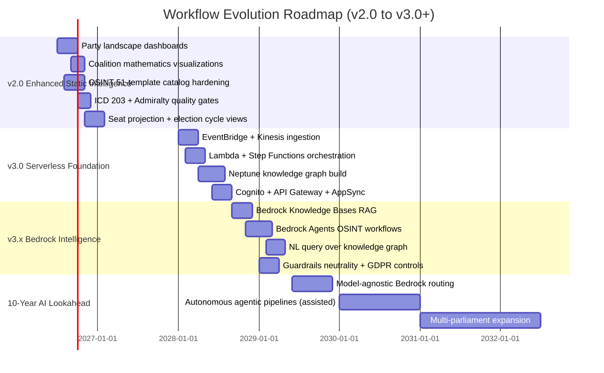
```mermaid
gantt
    title Workflow Evolution Roadmap (v2.0 to v3.0+)
    dateFormat YYYY-MM

    section v2.0 Enhanced Static Intelligence
    Party landscape dashboards            :v2a, 2026-07, 3M
    Coalition mathematics visualizations  :v2b, 2026-09, 2M
    OSINT 51-template catalog hardening   :v2c, 2026-08, 3M
    ICD 203 + Admiralty quality gates     :v2d, 2026-10, 2M
    Seat projection + election cycle views :v2e, 2026-11, 3M

    section v3.0 Serverless Foundation
    EventBridge + Kinesis ingestion       :v3a, 2028-01, 3M
    Lambda + Step Functions orchestration :v3b, 2028-02, 3M
    Neptune knowledge graph build         :v3c, 2028-04, 4M
    Cognito + API Gateway + AppSync       :v3d, 2028-06, 3M

    section v3.x Bedrock Intelligence
    Bedrock Knowledge Bases RAG           :v3e, 2028-09, 3M
    Bedrock Agents OSINT workflows        :v3f, 2028-11, 4M
    NL query over knowledge graph         :v3g, 2029-02, 3M
    Guardrails neutrality + GDPR controls :v3h, 2029-01, 3M

    section 10-Year AI Lookahead
    Model-agnostic Bedrock routing        :ai1, 2029-06, 6M
    Autonomous agentic pipelines (assisted) :ai2, 2030-01, 12M
    Multi-parliament expansion            :ai3, 2031-01, 18M
```

---

# 🟢 HORIZON v2.0 — Enhanced Static Intelligence Flows

> **Architecture unchanged: build-time generation, `gh-aw` + aggregator, pure
> static delivery on Amazon S3 + Amazon CloudFront.** v2.0 adds depth — better
> party/political-landscape dashboards and stronger OSINT tradecraft — while every
> byte served remains a pre-computed static asset.

## 🏛️ Party & Political-Landscape Dashboard Generation Flow

**Build-time flow** producing pre-computed party / political-group dashboard
datasets from European Parliament open data. All charts render **client-side** from
JSON baked into the static bundle — no server, no runtime query.

```mermaid
flowchart TD
    Trigger([🕒 gh-aw Scheduled Workflow<br/>GitHub Actions]) --> MCPFetch[🔌 EP MCP Server Fetch<br/>get_meps, get_voting_records<br/>analyze_coalition_dynamics<br/>compare_political_groups]

    MCPFetch --> Enrich[🌐 Optional Context Enrichment<br/>World Bank MCP WDI<br/>IMF REST WEO/FM]

    Enrich --> Analysis[🧠 Stage-A/B Analysis Artifacts<br/>significance-scoring, actor-mapping<br/>coalition-dynamics, voting-patterns<br/>51-template catalog]

    Analysis --> Precompute[⚙️ Pre-compute Dashboard Datasets<br/>Party cohesion + defection rates<br/>Coalition mathematics<br/>Seat projections + election cycle<br/>Cross-party alliance edges]

    Precompute --> Shape[📐 Shape Static JSON<br/>Heatmap matrices<br/>Network graph nodes/edges<br/>Time-series voting trends]

    Shape --> AggRender[🏗️ Deterministic Aggregator<br/>src/aggregator/** renders HTML<br/>Embeds Chart.js 4 + D3 7]

    AggRender --> Lang[🌍 14-Language Expansion<br/>Per-language static pages]

    Lang --> Commit[💾 Commit Artifacts + Provenance<br/>SLSA 3, signed, version-controlled]

    Commit --> Deploy[📤 Deploy Static Bundle<br/>Amazon S3 origin]

    Deploy --> CDN[⚡ Amazon CloudFront<br/>Global edge cache<br/>Lambda@Edge headers/security]

    CDN --> Client[🖥️ Browser Renders Dashboards<br/>Client-side Chart.js/D3<br/>Faceted filtering, no backend]

    Client --> Done([✅ Static Party/Landscape Dashboard Live<br/>Cacheable, cheap, auditable])

    style Trigger fill:#e8f5e9
    style MCPFetch fill:#e1f5ff
    style Precompute fill:#fff4e1
    style AggRender fill:#e1f5ff
    style CDN fill:#fff4e1
    style Done fill:#d4edda
```

### Dashboard Datasets Produced (v2.0)

| Dashboard | Source MCP Tools | Visualization | Delivery |
| --------- | ---------------- | ------------- | -------- |
| **Party / group landscape** | `generate_political_landscape`, `get_meps` | Seat-share treemap, group cards | Static JSON + Chart.js |
| **Coalition mathematics** | `analyze_coalition_dynamics`, `compare_political_groups` | Stacked-bar majority calculator | Static JSON + D3 |
| **Cohesion & defection** | `sentiment_tracker`, `detect_voting_anomalies` | Cohesion heatmap, z-score flags | Static JSON + Chart.js |
| **Cross-party alliances** | `network_analysis`, `analyze_voting_patterns` | Force-directed network graph | Static JSON + D3 |
| **Seat projection / election cycle** | electoral-domain artifacts | Trend lines + projection bands | Static JSON + Chart.js |
| **MEP / party scorecards** | `assess_mep_influence`, `analyze_legislative_effectiveness` | Radar + ranked tables | Static JSON + Chart.js |

---

## 🔬 Enhanced OSINT Quality Pipeline (v2.0)

**The 2.0 moat.** Every analysis artifact passes structured OSINT tradecraft —
ICD 203 confidence verbalization, Admiralty source grading, Kent/WEP probability
bands, structured analytic techniques (ACH) — and the mandatory **2-pass AI-first
quality** loop. STRIDE is explicitly rejected for political analysis in favour of
the **5-framework political threat methodology** (Political Threat Landscape 6D +
Attack Trees + Kill Chain + Diamond Model + ICO Profiling).

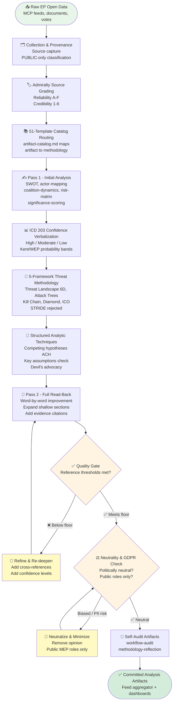
```mermaid
flowchart TD
    Raw([📥 Raw EP Open Data<br/>MCP feeds, documents, votes]) --> Collect[🗂️ Collection & Provenance<br/>Source capture<br/>PUBLIC-only classification]

    Collect --> Grade[🏷️ Admiralty Source Grading<br/>Reliability A-F<br/>Credibility 1-6]

    Grade --> Template[📚 51-Template Catalog Routing<br/>artifact-catalog.md maps<br/>artifact to methodology]

    Template --> Pass1[✍️ Pass 1 - Initial Analysis<br/>SWOT, actor-mapping<br/>coalition-dynamics, risk-matrix<br/>significance-scoring]

    Pass1 --> Confidence[📊 ICD 203 Confidence Verbalization<br/>High / Moderate / Low<br/>Kent/WEP probability bands]

    Confidence --> Threat[🎯 5-Framework Threat Methodology<br/>Threat Landscape 6D, Attack Trees<br/>Kill Chain, Diamond, ICO<br/>STRIDE rejected]

    Threat --> ACH[🔀 Structured Analytic Techniques<br/>Competing hypotheses ACH<br/>Key assumptions check<br/>Devil's advocacy]

    ACH --> Pass2[🔁 Pass 2 - Full Read-Back<br/>Word-by-word improvement<br/>Expand shallow sections<br/>Add evidence citations]

    Pass2 --> Gate{✅ Quality Gate<br/>Reference thresholds met?}

    Gate -->|❌ Below floor| Refine[🔧 Refine & Re-deepen<br/>Add cross-references<br/>Add confidence levels]
    Refine --> Pass2

    Gate -->|✅ Meets floor| Neutral{⚖️ Neutrality & GDPR Check<br/>Politically neutral?<br/>Public roles only?}

    Neutral -->|Biased / PII risk| Adjust[🎨 Neutralize & Minimize<br/>Remove opinion<br/>Public MEP roles only]
    Adjust --> Neutral

    Neutral -->|✅ Neutral| Audit[🧾 Self-Audit Artifacts<br/>workflow-audit<br/>methodology-reflection]

    Audit --> Publish([✅ Committed Analysis Artifacts<br/>Feed aggregator + dashboards])

    style Raw fill:#e8f5e9
    style Gate fill:#fff4e1
    style Neutral fill:#fff4e1
    style Refine fill:#fff9c4
    style Adjust fill:#fff9c4
    style Publish fill:#d4edda
```

### OSINT Tradecraft Standards Applied

| Standard | Purpose | Where Enforced |
| -------- | ------- | -------------- |
| **ICD 203** | Analytic confidence verbalization | Every assessment carries High/Moderate/Low |
| **Admiralty System** | Source reliability × credibility grading | Collection stage, before analysis |
| **Kent / WEP bands** | Calibrated probability language | Forecast & scenario artifacts |
| **ACH** | Competing-hypothesis discipline | Significance & actor-mapping artifacts |
| **5-framework threat** | Political threat analysis (not STRIDE) | `political-threat-landscape` artifact |
| **2-pass AI-first** | Depth & evidence quality floor | All artifacts, Pass 1 + Pass 2 |

---

# 🔵 HORIZON v3.0+ — AWS-Native Serverless OSINT Operations

> **All-in on AWS, fully serverless.** The static CloudFront edge stays the public,
> cacheable front door; dynamic intelligence is layered behind it. No Kubernetes,
> no self-managed message bus, no self-hosted databases — every component is a
> managed AWS service with IAM least-privilege and zero-ops scaling.

## ⚡ Real-Time EP Event Ingestion Flow

**Event-driven pipeline** replacing scheduled polling with near-real-time capture
of plenary votes, committee activity, and document publication.

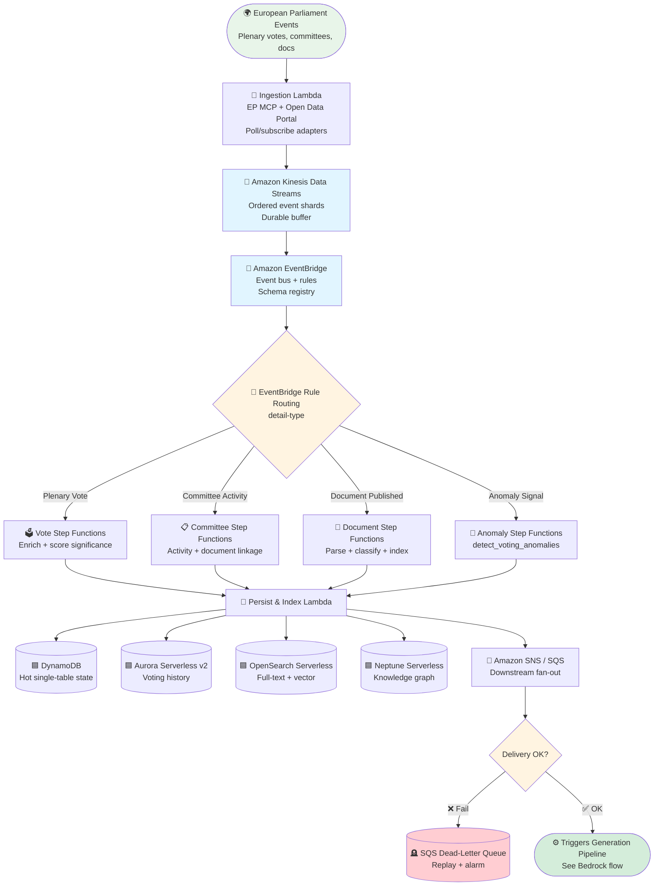
```mermaid
flowchart TD
    EP([🌍 European Parliament Events<br/>Plenary votes, committees, docs]) --> Ingest[🔌 Ingestion Lambda<br/>EP MCP + Open Data Portal<br/>Poll/subscribe adapters]

    Ingest --> Stream[🌊 Amazon Kinesis Data Streams<br/>Ordered event shards<br/>Durable buffer]

    Stream --> Bus[📡 Amazon EventBridge<br/>Event bus + rules<br/>Schema registry]

    Bus --> Route{🔀 EventBridge Rule Routing<br/>detail-type}

    Route -->|Plenary Vote| VoteSF[🗳️ Vote Step Functions<br/>Enrich + score significance]
    Route -->|Committee Activity| CommSF[📋 Committee Step Functions<br/>Activity + document linkage]
    Route -->|Document Published| DocSF[📄 Document Step Functions<br/>Parse + classify + index]
    Route -->|Anomaly Signal| AnomSF[🚨 Anomaly Step Functions<br/>detect_voting_anomalies]

    VoteSF --> Persist[💾 Persist & Index Lambda]
    CommSF --> Persist
    DocSF --> Persist
    AnomSF --> Persist

    Persist --> DDB[(🟦 DynamoDB<br/>Hot single-table state)]
    Persist --> Aurora[(🟦 Aurora Serverless v2<br/>Voting history)]
    Persist --> OS[(🟦 OpenSearch Serverless<br/>Full-text + vector)]
    Persist --> Neptune[(🟦 Neptune Serverless<br/>Knowledge graph)]

    Persist --> Notify[📣 Amazon SNS / SQS<br/>Downstream fan-out]

    Notify --> DLQ{Delivery OK?}
    DLQ -->|❌ Fail| DeadLetter[(🪦 SQS Dead-Letter Queue<br/>Replay + alarm)]
    DLQ -->|✅ OK| Trigger([⚙️ Triggers Generation Pipeline<br/>See Bedrock flow])

    style EP fill:#e8f5e9
    style Stream fill:#e1f5ff
    style Bus fill:#e1f5ff
    style Route fill:#fff4e1
    style DLQ fill:#fff4e1
    style DeadLetter fill:#ffcdd2
    style Trigger fill:#d4edda
```

---

## 🧠 Bedrock-Backed Article & Intelligence Generation Flow

**Managed generative pipeline** using Amazon Bedrock foundation models, Knowledge
Bases (RAG over the EP corpus + committed analysis artifacts), Bedrock Agents for
agentic OSINT tool use, and Guardrails for neutrality, GDPR, and hallucination
control. Output still flows through the **deterministic aggregator** — AI proposes
content; humans remain accountable for what publishes.

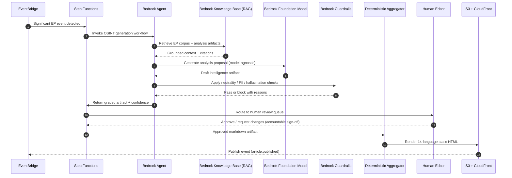
```mermaid
sequenceDiagram
    autonumber
    participant EB as EventBridge
    participant SF as Step Functions
    participant Agent as Bedrock Agent
    participant KB as Bedrock Knowledge Base (RAG)
    participant FM as Bedrock Foundation Model
    participant GR as Bedrock Guardrails
    participant Agg as Deterministic Aggregator
    participant Rev as Human Editor
    participant S3 as S3 + CloudFront

    EB->>SF: Significant EP event detected
    SF->>Agent: Invoke OSINT generation workflow
    Agent->>KB: Retrieve EP corpus + analysis artifacts
    KB-->>Agent: Grounded context + citations
    Agent->>FM: Generate analysis proposal (model-agnostic)
    FM-->>Agent: Draft intelligence artifact
    Agent->>GR: Apply neutrality / PII / hallucination checks
    GR-->>Agent: Pass or block with reasons
    Agent->>SF: Return graded artifact + confidence
    SF->>Rev: Route to human review queue
    Rev-->>SF: Approve / request changes (accountable sign-off)
    SF->>Agg: Approved markdown artifact
    Agg->>S3: Render 14-language static HTML
    S3-->>EB: Publish event (article.published)
```

### Bedrock Layer Responsibilities

| Component | Role | Governance |
| --------- | ---- | ---------- |
| **Bedrock Foundation Models** | Draft analysis (Claude, Nova; model-agnostic) | Routed by cost/quality/latency |
| **Bedrock Knowledge Bases** | Managed RAG grounding over EP corpus | Citations required; no ungrounded claims |
| **Bedrock Agents** | Agentic OSINT tool use / orchestration | Tool allow-list, least-privilege IAM |
| **Bedrock Guardrails** | Neutrality, PII/GDPR, hallucination control | Blocks biased or private-life content |
| **Human Editor** | Accountable approval before publish | Per AI Policy — no autonomous deploy |

---

## 🔐 API Request Flow (Journalists / Researchers / API Consumers)

**Authenticated, serverless API** layered behind the static edge. Amazon Cognito
federates identity; API Gateway (REST/WebSocket) and AppSync (GraphQL) front
Lambda resolvers that read the polyglot data layer.

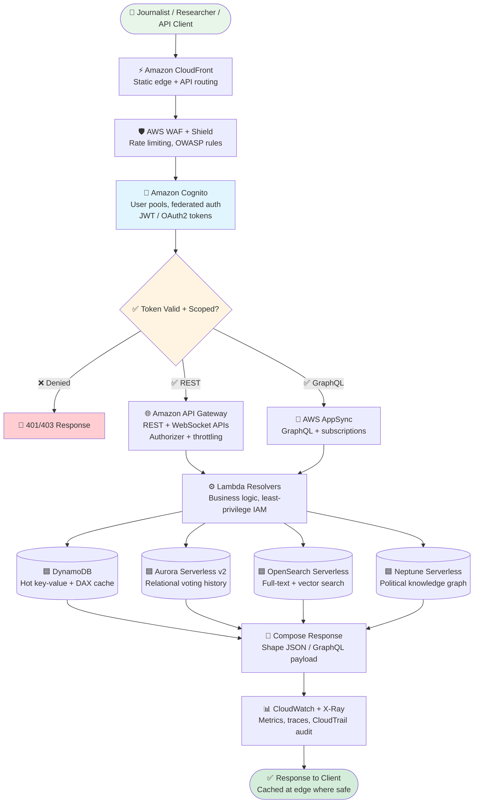
```mermaid
flowchart TD
    User([👤 Journalist / Researcher / API Client]) --> Edge[⚡ Amazon CloudFront<br/>Static edge + API routing]

    Edge --> WAF[🛡️ AWS WAF + Shield<br/>Rate limiting, OWASP rules]

    WAF --> Auth[🔑 Amazon Cognito<br/>User pools, federated auth<br/>JWT / OAuth2 tokens]

    Auth --> AuthZ{✅ Token Valid + Scoped?}
    AuthZ -->|❌ Denied| Reject[🚫 401/403 Response]

    AuthZ -->|✅ REST| APIGW[🌐 Amazon API Gateway<br/>REST + WebSocket APIs<br/>Authorizer + throttling]
    AuthZ -->|✅ GraphQL| AppSync[🔗 AWS AppSync<br/>GraphQL + subscriptions]

    APIGW --> Resolver[⚙️ Lambda Resolvers<br/>Business logic, least-privilege IAM]
    AppSync --> Resolver

    Resolver --> DDB[(🟦 DynamoDB<br/>Hot key-value + DAX cache)]
    Resolver --> Aurora[(🟦 Aurora Serverless v2<br/>Relational voting history)]
    Resolver --> OS[(🟦 OpenSearch Serverless<br/>Full-text + vector search)]
    Resolver --> Neptune[(🟦 Neptune Serverless<br/>Political knowledge graph)]

    DDB --> Compose[🧩 Compose Response<br/>Shape JSON / GraphQL payload]
    Aurora --> Compose
    OS --> Compose
    Neptune --> Compose

    Compose --> Trace[📊 CloudWatch + X-Ray<br/>Metrics, traces, CloudTrail audit]

    Trace --> Return([✅ Response to Client<br/>Cached at edge where safe])

    style User fill:#e8f5e9
    style Auth fill:#e1f5ff
    style AuthZ fill:#fff4e1
    style Reject fill:#ffcdd2
    style Return fill:#d4edda
```

---

## 💬 Natural-Language Query Over the Knowledge Graph

**Conversational OSINT access.** A user asks a question in natural language;
Bedrock translates intent into graph + search queries against Neptune and
OpenSearch, grounds the answer via Knowledge Bases, and returns a cited, neutral
response — never an ungrounded opinion.

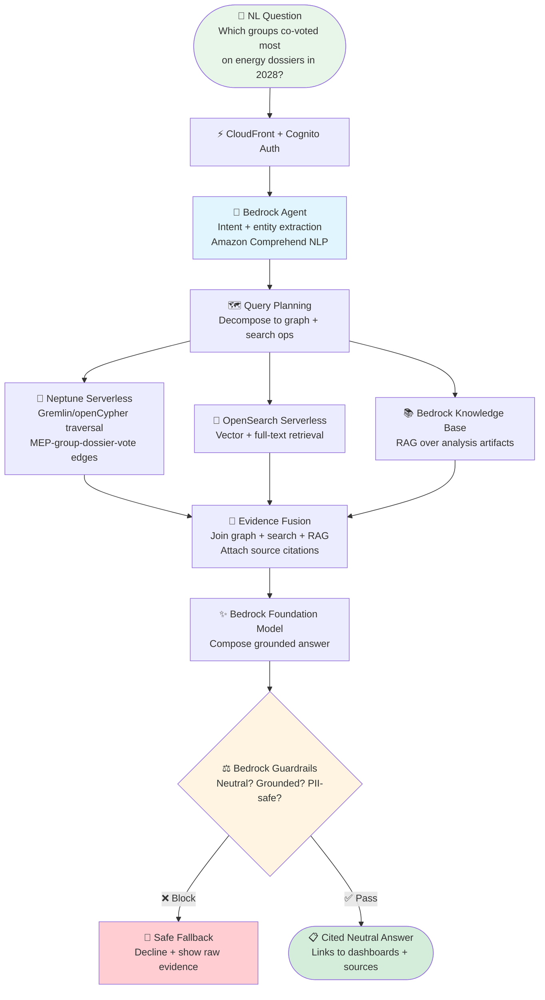
```mermaid
flowchart TD
    Q([💬 NL Question<br/>Which groups co-voted most<br/>on energy dossiers in 2028?]) --> Front[⚡ CloudFront + Cognito Auth]

    Front --> NLU[🧠 Bedrock Agent<br/>Intent + entity extraction<br/>Amazon Comprehend NLP]

    NLU --> Plan[🗺️ Query Planning<br/>Decompose to graph + search ops]

    Plan --> GraphQ[🔷 Neptune Serverless<br/>Gremlin/openCypher traversal<br/>MEP-group-dossier-vote edges]
    Plan --> SearchQ[🔎 OpenSearch Serverless<br/>Vector + full-text retrieval]
    Plan --> KBQ[📚 Bedrock Knowledge Base<br/>RAG over analysis artifacts]

    GraphQ --> Fuse[🧩 Evidence Fusion<br/>Join graph + search + RAG<br/>Attach source citations]
    SearchQ --> Fuse
    KBQ --> Fuse

    Fuse --> Generate[✨ Bedrock Foundation Model<br/>Compose grounded answer]

    Generate --> Guard{⚖️ Bedrock Guardrails<br/>Neutral? Grounded? PII-safe?}

    Guard -->|❌ Block| Safe[🚧 Safe Fallback<br/>Decline + show raw evidence]
    Guard -->|✅ Pass| Answer([📋 Cited Neutral Answer<br/>Links to dashboards + sources])

    style Q fill:#e8f5e9
    style NLU fill:#e1f5ff
    style Guard fill:#fff4e1
    style Safe fill:#ffcdd2
    style Answer fill:#d4edda
```

---

## 🔄 Event-Driven Continuous-Improvement Loop

**Self-monitoring, human-governed.** Quality and engagement signals feed model
routing and prompt/template refinement. Per the AI Policy, model or prompt changes
are **proposals** that require human approval and canary validation before
promotion — there is no autonomous production deploy.

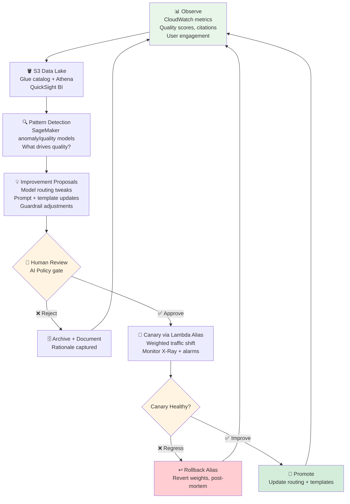
```mermaid
flowchart TD
    Observe[📊 Observe<br/>CloudWatch metrics<br/>Quality scores, citations<br/>User engagement] --> Lake[🪣 S3 Data Lake<br/>Glue catalog + Athena<br/>QuickSight BI]

    Lake --> Detect[🔍 Pattern Detection<br/>SageMaker anomaly/quality models<br/>What drives quality?]

    Detect --> Propose[💡 Improvement Proposals<br/>Model routing tweaks<br/>Prompt + template updates<br/>Guardrail adjustments]

    Propose --> Human{👤 Human Review<br/>AI Policy gate}

    Human -->|❌ Reject| Archive[🗄️ Archive + Document<br/>Rationale captured]
    Human -->|✅ Approve| Canary[🐤 Canary via Lambda Alias<br/>Weighted traffic shift<br/>Monitor X-Ray + alarms]

    Canary --> Result{Canary Healthy?}
    Result -->|❌ Regress| Rollback[↩️ Rollback Alias<br/>Revert weights, post-mortem]
    Result -->|✅ Improve| Promote[🚀 Promote<br/>Update routing + templates]

    Promote --> Observe
    Rollback --> Observe
    Archive --> Observe

    style Observe fill:#e8f5e9
    style Human fill:#fff4e1
    style Result fill:#fff4e1
    style Rollback fill:#ffcdd2
    style Promote fill:#d4edda
```

---

## 📊 Performance Targets

### v2.0 — Static-Enhanced Targets

| Metric | Target | Monitoring |
| ------ | ------ | ---------- |
| **Build-to-publish (full site)** | <30 min per scheduled run | GitHub Actions timing |
| **Dashboard dataset freshness** | ≤ daily (per EP feed cadence) | Provenance timestamps |
| **Page load (LCP)** | <2.0 s on CloudFront edge | RUM / Lighthouse CI |
| **Analysis quality floor** | All artifacts meet reference thresholds | Stage-C quality gate |
| **Accessibility** | WCAG 2.1 AA | axe-core CI |
| **Languages** | 14 complete | Aggregator coverage check |

### v3.0+ — AWS Serverless Targets

| Metric | Target | Monitoring |
| ------ | ------ | ---------- |
| **Event ingestion latency** | <30 s (event → indexed) | CloudWatch + X-Ray |
| **Breaking analysis (assisted)** | <5 min event → reviewed draft | Step Functions metrics |
| **API response (P95)** | <200 ms | API Gateway / AppSync metrics |
| **NL query (P95)** | <3 s grounded answer | Bedrock + X-Ray traces |
| **Static edge availability** | 99.99% (CloudFront + S3) | CloudWatch Synthetics |
| **Guardrail block accuracy** | >95% neutrality/PII enforcement | Bedrock Guardrails reports |
| **Cost per 1k API calls** | Within serverless budget envelope | Cost Explorer / Budgets |

---

## 📚 Workflow Comparison: Current vs v2.0 vs v3.0

| Process Step | Current (v1.0.x) | v2.0 (Static-Enhanced) | v3.0+ (AWS Serverless) |
| ---------------------- | ---------------------- | ------------------------- | ------------------ |
| **Event detection** | Scheduled `gh-aw` cron | Scheduled cron (richer matrix) | EventBridge + Kinesis (<30 s) |
| **Compute substrate** | GitHub Actions runners | GitHub Actions runners | Lambda + Step Functions |
| **Data fetching** | EP MCP batch | EP MCP + WB/IMF enrichment | Streaming ingestion adapters |
| **Analysis authoring** | LLM → markdown | LLM + 51-template OSINT | Bedrock + KB RAG + Agents |
| **Quality control** | 2-pass review | ICD 203 + Admiralty + 2-pass | Guardrails + human sign-off |
| **Dashboards** | In-article Chart.js/D3 | Pre-computed party/landscape | Live AppSync/API Gateway data |
| **Rendering** | Aggregator → HTML | Aggregator → HTML | Aggregator (edge) + dynamic APIs |
| **Data stores** | Committed markdown/JSON | Committed artifacts + cache | DynamoDB · Aurora · OpenSearch · Neptune |
| **Query** | None (pre-rendered) | Client-side faceted filter | NL query over knowledge graph |
| **Identity** | None (public static) | None (public static) | Amazon Cognito federated auth |
| **Delivery** | S3 + CloudFront | S3 + CloudFront | CloudFront edge + serverless APIs |
| **Observability** | Actions logs | Actions logs + RUM | CloudWatch · X-Ray · CloudTrail |

---

## 🕵️ Intelligence-Cycle Capability Flows (2026 → 2037)

The flows above cover analysis and delivery. These flows add the **missing
intelligence-cycle stages** — direction (PIR), indications and warning, adversarial
review, integrity analytics, and counter-FIMI — that turn the platform from an
analysis pipeline into a full **OSINT observatory**. They are the process view of
the capability roadmap in
[FUTURE_MINDMAP.md](FUTURE_MINDMAP.md#-political-intelligence-capability-roadmap--ai-driven-osint-tradecraft-2026--2037).
Every flow ends at a **human-accountability gate**; none publishes autonomously.

### Collection Management — Priority Intelligence Requirements Flow

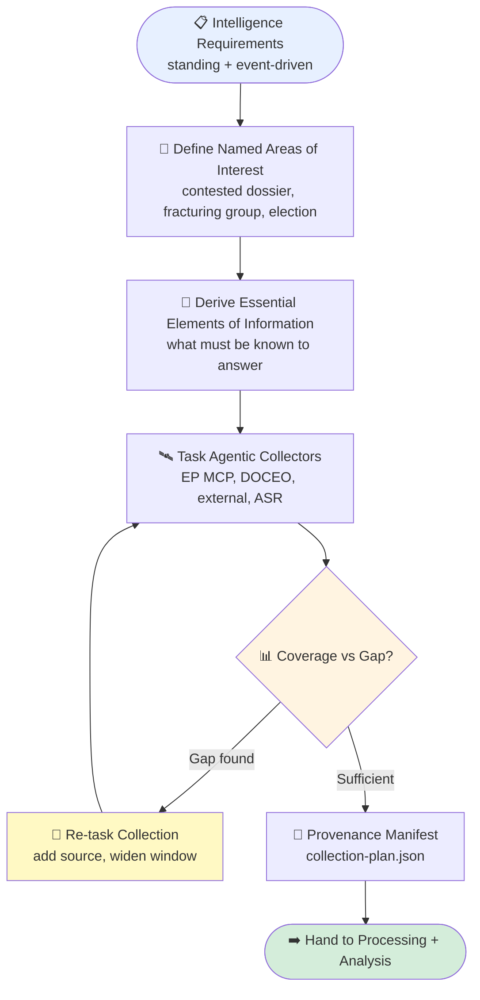
```mermaid
flowchart TD
    REQ([📋 Intelligence Requirements<br/>standing + event-driven]) --> NAI[🎯 Define Named Areas of Interest<br/>contested dossier, fracturing group, election]
    NAI --> EEI[🧩 Derive Essential Elements of Information<br/>what must be known to answer]
    EEI --> TASK[🛰️ Task Agentic Collectors<br/>EP MCP, DOCEO, external, ASR]
    TASK --> COV{📊 Coverage vs Gap?}
    COV -->|Gap found| RETASK[🔁 Re-task Collection<br/>add source, widen window]
    RETASK --> TASK
    COV -->|Sufficient| MANI[🧾 Provenance Manifest<br/>collection-plan.json]
    MANI --> HAND([➡️ Hand to Processing + Analysis])

    style REQ fill:#e7f0ff
    style COV fill:#fff4e1
    style RETASK fill:#fff9c4
    style HAND fill:#d4edda
```

### Indications and Warning — Tripwire Flow

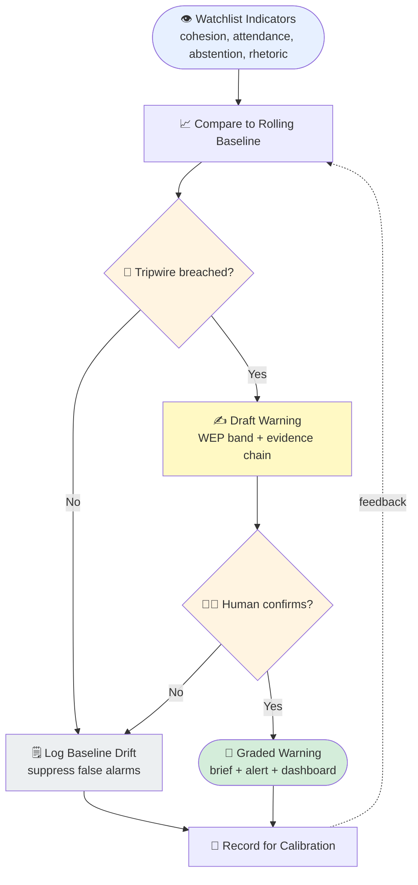
```mermaid
flowchart TD
    WATCH([👁️ Watchlist Indicators<br/>cohesion, attendance, abstention, rhetoric]) --> BASE[📈 Compare to Rolling Baseline]
    BASE --> TRIP{🚨 Tripwire breached?}
    TRIP -->|No| LOG[🗒️ Log Baseline Drift<br/>suppress false alarms]
    TRIP -->|Yes| DRAFT[✍️ Draft Warning<br/>WEP band + evidence chain]
    DRAFT --> HUMAN{🧑‍⚖️ Human confirms?}
    HUMAN -->|No| LOG
    HUMAN -->|Yes| EMIT([📣 Graded Warning<br/>brief + alert + dashboard])
    EMIT --> CAL[🎯 Record for Calibration]
    LOG --> CAL
    CAL -.feedback.-> BASE

    style WATCH fill:#e7f0ff
    style TRIP fill:#fff4e1
    style HUMAN fill:#fff4e1
    style DRAFT fill:#fff9c4
    style EMIT fill:#d4edda
    style LOG fill:#eceff1
```

### Multi-Agent ACH and Red-Team Flow

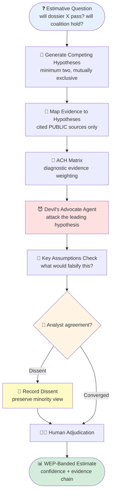
```mermaid
flowchart TD
    Q([❓ Estimative Question<br/>will dossier X pass? will coalition hold?]) --> HYP[🧠 Generate Competing Hypotheses<br/>minimum two, mutually exclusive]
    HYP --> EVID[🔗 Map Evidence to Hypotheses<br/>cited PUBLIC sources only]
    EVID --> ACH[🔀 ACH Matrix<br/>diagnostic evidence weighting]
    ACH --> RED[😈 Devil's Advocate Agent<br/>attack the leading hypothesis]
    RED --> KAC[🧾 Key Assumptions Check<br/>what would falsify this?]
    KAC --> SPLIT{🤝 Analyst agreement?}
    SPLIT -->|Dissent| RECORD[📝 Record Dissent<br/>preserve minority view]
    RECORD --> ADJ[🧑‍⚖️ Human Adjudication]
    SPLIT -->|Converged| ADJ
    ADJ --> EST([📊 WEP-Banded Estimate<br/>confidence + evidence chain])

    style Q fill:#e7f0ff
    style RED fill:#ffe0e0
    style SPLIT fill:#fff4e1
    style RECORD fill:#fff9c4
    style EST fill:#d4edda
```

### Integrity and Counter-FIMI Detection Flow

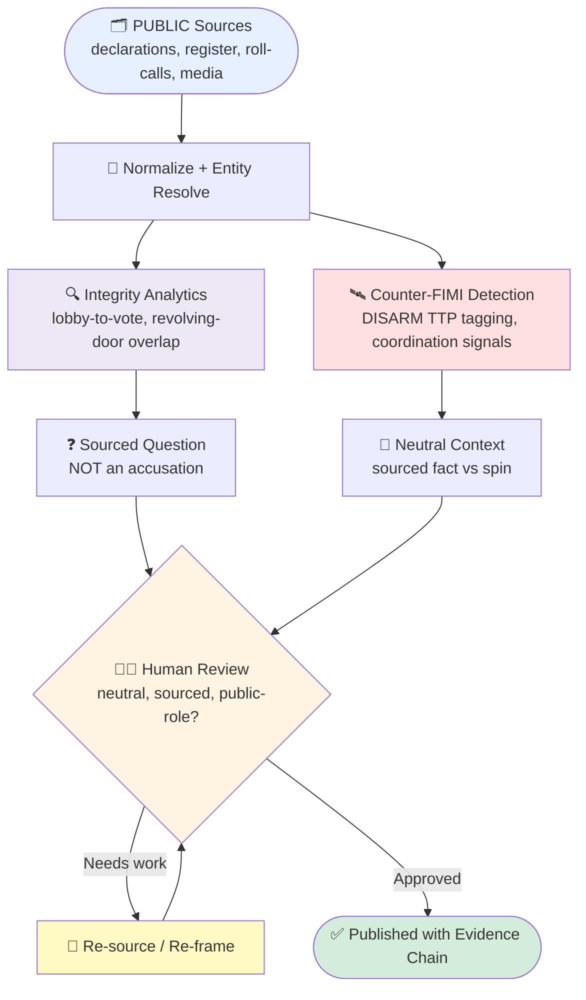
```mermaid
flowchart TD
    PUB([🗂️ PUBLIC Sources<br/>declarations, register, roll-calls, media]) --> NORM[🧹 Normalize + Entity Resolve]
    NORM --> INT[🔍 Integrity Analytics<br/>lobby-to-vote, revolving-door overlap]
    NORM --> FIMI[🛰️ Counter-FIMI Detection<br/>DISARM TTP tagging, coordination signals]
    INT --> QUEST[❓ Sourced Question<br/>NOT an accusation]
    FIMI --> CTX[🧭 Neutral Context<br/>sourced fact vs spin]
    QUEST --> GATE{🧑‍⚖️ Human Review<br/>neutral, sourced, public-role?}
    CTX --> GATE
    GATE -->|Needs work| REFINE[🔧 Re-source / Re-frame]
    REFINE --> GATE
    GATE -->|Approved| OUT([✅ Published with Evidence Chain])

    style PUB fill:#e7f0ff
    style FIMI fill:#ffe0e0
    style INT fill:#ede7f6
    style GATE fill:#fff4e1
    style REFINE fill:#fff9c4
    style OUT fill:#d4edda
```

> **Boundary reminder.** Integrity findings are **sourced questions for journalistic
> review**, never adjudicated accusations. Counter-FIMI is **detection and context
> only** — the platform never conducts influence operations and never targets
> individuals' private lives.

---

## 🔮 Visionary Workflow Roadmap: 2027-2037

The platform's workflows evolve from human-orchestrated `gh-aw` pipelines, through
AWS-native serverless OSINT operations, toward increasingly autonomous — but always
human-accountable — agentic intelligence. Three principles hold across the decade:
**model-agnostic routing** (no single-vendor lock-in via Amazon Bedrock),
**neutrality and provenance by construction**, and **AI as a proposal generator**
with humans accountable for every publish (per the
[AI Policy](https://github.com/Hack23/ISMS-PUBLIC/blob/main/AI_Policy.md)).

### AI Model Evolution — DevSecOps & Development Perspective

| Year | AI Model | DevSecOps Capability Evolution |
| ---- | -------- | ------------------------------ |
| 2026 | Opus 4.6–4.9 | 🟢 AI-assisted code review, automated test generation, agentic CI/CD workflows |
| 2027 | Opus 5.x | 🔵 Predictive vulnerability detection, intelligent dependency management |
| 2028 | Opus 6.x | 🟣 Multi-modal security analysis (code + architecture + runtime), automated threat modeling |
| 2029 | Opus 7.x | 🟠 Autonomous security pipeline orchestration, self-healing build systems |
| 2030 | Opus 8.x | 🔴 Near-expert automated security review, AI-driven architecture validation |
| 2031–2033 | Opus 9–10.x / Pre-AGI | ⚪ Autonomous secure development lifecycle management |
| 2034–2037 | AGI / Post-AGI | ⭐ Transformative software engineering with built-in security assurance |

> **Assumptions:** major AI model upgrades occur annually; competitors (OpenAI,
> Google, Meta, EU sovereign AI) are evaluated at each release; the architecture
> accommodates potential paradigm shifts (quantum AI, neuromorphic computing).
> Full cross-perspective analysis lives in the Hack23 Information Security Strategy
> § AI Model Evolution Strategy; governance per
> [AI Policy](https://github.com/Hack23/ISMS-PUBLIC/blob/main/AI_Policy.md).

### Phase 5: Autonomous Agentic Pipelines — Assisted (2027-2029)

- **Self-Directing OSINT Workflows**: Bedrock Agents propose which analyses to
  generate based on parliamentary-activity signals and significance scoring; humans
  approve scope. AI decides *what to draft*, not *what to publish*.
- **Model-Agnostic Bedrock Routing**: every generation task routed to the optimal
  foundation model (Opus 5.x, Amazon Nova, open-source) by cost, quality, and
  latency — swappable without rewriting pipelines.
- **Zero-Touch Drafting, Human Publish**: routine summaries flow end-to-end to a
  reviewed draft automatically; a human editor remains the accountable gate before
  CloudFront publication.

### Phase 6: Predictive Intelligence Workflows (2029-2032)

- **Anticipatory Frameworks**: Step Functions pre-stage analytical scaffolds for
  upcoming votes and committee sessions from the EP calendar in Neptune.
- **Dynamic Workflow Composition**: Bedrock Agents assemble optimal Step Functions
  graphs on demand by content type, urgency, and quality requirement.
- **Cross-Parliament Synthesis**: serverless fan-out detects related legislative
  activity across multiple parliaments for comparative, neutral analysis.

### Phase 7: Cognitive Workflow Intelligence (2032-2035)

- **Causal Analysis Pipelines**: trace legislative impacts through economic
  (IMF/World Bank), social, and environmental indicators with cited evidence chains.
- **Adaptive Guardrails**: Bedrock Guardrails dynamically tune to content
  sensitivity and regulatory context while holding the neutrality floor.
- **Global Event Correlation**: Kinesis + Neptune correlate parliamentary events
  worldwide to surface emerging legislative trends.

### Phase 8: AGI-Native Operations — Governed (2035-2037)

- **Continuous Democratic Monitoring**: AGI-class systems monitor covered
  parliaments with real-time, evidence-cited analysis — under standing human
  oversight and audit (CloudTrail, Security Hub).
- **Natural-Language Workflow Definition**: stakeholders describe desired analyses
  in plain language; systems design and execute optimal serverless workflows,
  subject to AI-Policy approval gates.
- **Self-Evolving, Human-Accountable Pipelines**: workflows propose their own
  efficiency and quality improvements; promotion always requires human sign-off and
  canary validation — never autonomous production deploy.

---

## 📚 References

### Current State (v1.0.x)

- [Current Flowchart](FLOWCHART.md)
- [Current Architecture](ARCHITECTURE.md)
- [Current Data Model](DATA_MODEL.md)
- [Current State Diagram](STATEDIAGRAM.md)

### Future State

- [Future Architecture](FUTURE_ARCHITECTURE.md)
- [Future Data Model](FUTURE_DATA_MODEL.md)
- [Future State Diagram](FUTURE_STATEDIAGRAM.md)
- [Future Mindmap](FUTURE_MINDMAP.md)
- [Future SWOT](FUTURE_SWOT.md)
- [Future Security Architecture](FUTURE_SECURITY_ARCHITECTURE.md)
- [Future Threat Model](FUTURE_THREAT_MODEL.md)
- [Future Workflows](FUTURE_WORKFLOWS.md)

### AWS Services Referenced

- AWS Lambda — https://aws.amazon.com/lambda/
- AWS Step Functions — https://aws.amazon.com/step-functions/
- Amazon EventBridge — https://aws.amazon.com/eventbridge/
- Amazon Kinesis — https://aws.amazon.com/kinesis/
- Amazon API Gateway — https://aws.amazon.com/api-gateway/
- AWS AppSync — https://aws.amazon.com/appsync/
- Amazon Cognito — https://aws.amazon.com/cognito/
- Amazon DynamoDB — https://aws.amazon.com/dynamodb/
- Amazon Aurora Serverless v2 — https://aws.amazon.com/rds/aurora/serverless/
- Amazon OpenSearch Serverless — https://aws.amazon.com/opensearch-service/
- Amazon Neptune Serverless — https://aws.amazon.com/neptune/
- Amazon Bedrock — https://aws.amazon.com/bedrock/
- Amazon SageMaker — https://aws.amazon.com/sagemaker/
- Amazon CloudFront — https://aws.amazon.com/cloudfront/

### Governance & Methodology

- [Hack23 AI Policy](https://github.com/Hack23/ISMS-PUBLIC/blob/main/AI_Policy.md)
- [OSINT Tradecraft Standards](analysis/methodologies/osint-tradecraft-standards.md)
- [Artifact Catalog (51 templates)](analysis/methodologies/artifact-catalog.md)
- [Political Threat Framework v4.0](analysis/methodologies/political-threat-framework.md)

---

**Document Status**: ✅ **APPROVED FOR PLANNING**  
**Last Updated**: 2026-05-31 (UTC) | **Release**: v1.0.1  
**Next Review**: 2026-08-31 (Quarterly)  
**Classification**: Public
