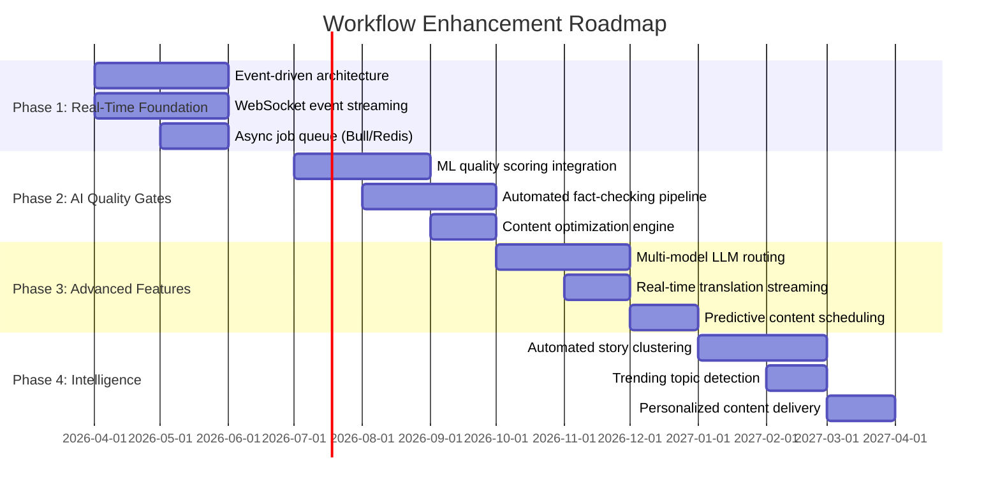

<p align="center">
  
</p>

<h1 align="center">🔄 EU Parliament Monitor — Future Flowcharts</h1>

<p align="center">
  <strong>📊 Improved AI-Driven Workflows and Real-Time Processing</strong><br>
  <em>🎯 From Batch Generation to Intelligent Event-Driven Architecture (2026-2037)</em>
</p>

<p align="center">
  <a href="#"></a>
  <a href="#"></a>
  <a href="#"></a>
  <a href="#"></a>
</p>

**📋 Document Owner:** CEO | **📄 Version:** 3.0 | **📅 Last
Updated:** 2026-02-24 (UTC)  
**🔄 Review Cycle:** Quarterly | **⏰ Next Review:** 2026-05-24  
**🏷️ Classification:** Public (Open Source European Parliament Monitoring Platform)

---

## 📚 Architecture Documentation Map

<div class="documentation-map">

| Document | Focus | Description | Documentation Link |
| ------------------------------------------------------------------- | --------------- | ---------------------------------------------- | ------------------------------------------------------------------------------------------------------ |
| **[Architecture](ARCHITECTURE.md)** | 🏛️ Architecture | C4 model showing current system structure | [View Source](https://github.com/Hack23/euparliamentmonitor/blob/main/ARCHITECTURE.md) |
| **[Future Architecture](FUTURE_ARCHITECTURE.md)** | 🏛️ Architecture | C4 model showing future system structure | [View Source](https://github.com/Hack23/euparliamentmonitor/blob/main/FUTURE_ARCHITECTURE.md) |
| **[Mindmaps](MINDMAP.md)** | 🧠 Concept | Current system component relationships | [View Source](https://github.com/Hack23/euparliamentmonitor/blob/main/MINDMAP.md) |
| **[Future Mindmaps](FUTURE_MINDMAP.md)** | 🧠 Concept | Future capability evolution | [View Source](https://github.com/Hack23/euparliamentmonitor/blob/main/FUTURE_MINDMAP.md) |
| **[SWOT Analysis](SWOT.md)** | 💼 Business | Current strategic assessment | [View Source](https://github.com/Hack23/euparliamentmonitor/blob/main/SWOT.md) |
| **[Future SWOT Analysis](FUTURE_SWOT.md)** | 💼 Business | Future strategic opportunities | [View Source](https://github.com/Hack23/euparliamentmonitor/blob/main/FUTURE_SWOT.md) |
| **[Data Model](DATA_MODEL.md)** | 📊 Data | Current data structures and relationships | [View Source](https://github.com/Hack23/euparliamentmonitor/blob/main/DATA_MODEL.md) |
| **[Future Data Model](FUTURE_DATA_MODEL.md)** | 📊 Data | Enhanced European Parliament data architecture | [View Source](https://github.com/Hack23/euparliamentmonitor/blob/main/FUTURE_DATA_MODEL.md) |
| **[Flowcharts](FLOWCHART.md)** | 🔄 Process | Current data processing workflows | [View Source](https://github.com/Hack23/euparliamentmonitor/blob/main/FLOWCHART.md) |
| **[Future Flowcharts](FUTURE_FLOWCHART.md)** | 🔄 Process | Enhanced AI-driven workflows | **This Document** |
| **[State Diagrams](STATEDIAGRAM.md)** | 🔄 Behavior | Current system state transitions | [View Source](https://github.com/Hack23/euparliamentmonitor/blob/main/STATEDIAGRAM.md) |
| **[Future State Diagrams](FUTURE_STATEDIAGRAM.md)** | 🔄 Behavior | Enhanced adaptive state transitions | [View Source](https://github.com/Hack23/euparliamentmonitor/blob/main/FUTURE_STATEDIAGRAM.md) |
| **[Security Architecture](SECURITY_ARCHITECTURE.md)** | 🛡️ Security | Current security implementation | [View Source](https://github.com/Hack23/euparliamentmonitor/blob/main/SECURITY_ARCHITECTURE.md) |
| **[Future Security Architecture](FUTURE_SECURITY_ARCHITECTURE.md)** | 🛡️ Security | Security enhancement roadmap | [View Source](https://github.com/Hack23/euparliamentmonitor/blob/main/FUTURE_SECURITY_ARCHITECTURE.md) |
| **[Threat Model](THREAT_MODEL.md)** | 🎯 Security | STRIDE threat analysis | [View Source](https://github.com/Hack23/euparliamentmonitor/blob/main/THREAT_MODEL.md) |
| **[Classification](CLASSIFICATION.md)** | 🏷️ Governance | CIA classification & BCP | [View Source](https://github.com/Hack23/euparliamentmonitor/blob/main/CLASSIFICATION.md) |
| **[CRA Assessment](CRA-ASSESSMENT.md)** | 🛡️ Compliance | Cyber Resilience Act | [View Source](https://github.com/Hack23/euparliamentmonitor/blob/main/CRA-ASSESSMENT.md) |
| **[Workflows](WORKFLOWS.md)** | ⚙️ DevOps | CI/CD documentation | [View Source](https://github.com/Hack23/euparliamentmonitor/blob/main/WORKFLOWS.md) |
| **[Future Workflows](FUTURE_WORKFLOWS.md)** | 🚀 DevOps | Planned CI/CD enhancements | [View Source](https://github.com/Hack23/euparliamentmonitor/blob/main/FUTURE_WORKFLOWS.md) |
| **[Business Continuity Plan](BCPPlan.md)** | 🔄 Resilience | Recovery planning | [View Source](https://github.com/Hack23/euparliamentmonitor/blob/main/BCPPlan.md) |
| **[Financial Security Plan](FinancialSecurityPlan.md)** | 💰 Financial | Cost & security analysis | [View Source](https://github.com/Hack23/euparliamentmonitor/blob/main/FinancialSecurityPlan.md) |
| **[End-of-Life Strategy](End-of-Life-Strategy.md)** | 📦 Lifecycle | Technology EOL planning | [View Source](https://github.com/Hack23/euparliamentmonitor/blob/main/End-of-Life-Strategy.md) |
| **[Unit Test Plan](UnitTestPlan.md)** | 🧪 Testing | Unit testing strategy | [View Source](https://github.com/Hack23/euparliamentmonitor/blob/main/UnitTestPlan.md) |
| **[E2E Test Plan](E2ETestPlan.md)** | 🔍 Testing | End-to-end testing | [View Source](https://github.com/Hack23/euparliamentmonitor/blob/main/E2ETestPlan.md) |
| **[Performance Testing](performance-testing.md)** | ⚡ Performance | Performance benchmarks | [View Source](https://github.com/Hack23/euparliamentmonitor/blob/main/performance-testing.md) |
| **[Security Policy](SECURITY.md)** | 🔒 Security | Vulnerability reporting & security policy | [View Source](https://github.com/Hack23/euparliamentmonitor/blob/main/SECURITY.md) |

</div>

---

## 🔐 ISMS Policy Alignment

This future flowchart is designed to implement all controls from Hack23 AB's ISMS framework as the EU Parliament Monitor platform evolves.

### Related ISMS Policies

| **Policy Domain** | **Policy** | **Planned Implementation** |
| -------------------------- | ------------------------------------------------------------------------------------------------------------ | ------------------------------------------------------------- |
| **🔐 Core Security** | [Information Security Policy](https://github.com/Hack23/ISMS-PUBLIC/blob/main/Information_Security_Policy.md) | Overall security governance framework for enhanced monitoring |
| **🛠️ Development** | [Secure Development Policy](https://github.com/Hack23/ISMS-PUBLIC/blob/main/Secure_Development_Policy.md) | Security-integrated development lifecycle enhancements |
| **🌐 Network** | [Network Security Policy](https://github.com/Hack23/ISMS-PUBLIC/blob/main/Network_Security_Policy.md) | CDN architecture, WAF, DDoS protection |
| **🔒 Cryptography** | [Cryptography Policy](https://github.com/Hack23/ISMS-PUBLIC/blob/main/Cryptography_Policy.md) | Content signing, TLS 1.3, integrity verification |
| **🔑 Access Control** | [Access Control Policy](https://github.com/Hack23/ISMS-PUBLIC/blob/main/Access_Control_Policy.md) | MCP authentication, request authorization |
| **🏷️ Data Classification** | [Data Classification Policy](https://github.com/Hack23/ISMS-PUBLIC/blob/main/Data_Classification_Policy.md) | European Parliament data classification |
| **🔍 Vulnerability** | [Vulnerability Management](https://github.com/Hack23/ISMS-PUBLIC/blob/main/Vulnerability_Management.md) | Enhanced automated scanning and monitoring |
| **🚨 Incident Response** | [Incident Response Plan](https://github.com/Hack23/ISMS-PUBLIC/blob/main/Incident_Response_Plan.md) | Automated incident detection and response |
| **💾 Backup & Recovery** | [Backup Recovery Policy](https://github.com/Hack23/ISMS-PUBLIC/blob/main/Backup_Recovery_Policy.md) | Content backup, version control, recovery |
| **🔄 Business Continuity** | [Business Continuity Plan](https://github.com/Hack23/ISMS-PUBLIC/blob/main/Business_Continuity_Plan.md) | Multi-CDN deployment, disaster recovery |
| **🤝 Third-Party** | [Third Party Management](https://github.com/Hack23/ISMS-PUBLIC/blob/main/Third_Party_Management.md) | CDN provider security assessment |
| **🏷️ Classification** | [Classification Framework](https://github.com/Hack23/ISMS-PUBLIC/blob/main/CLASSIFICATION.md) | Business impact analysis for platform |

### Compliance Framework Mapping

| **Framework** | **Version** | **Relevant Controls** |
| ------------- | ----------- | --------------------- |
| **ISO 27001** | 2022 | A.5.1, A.8.25, A.8.26, A.8.27 |
| **NIST CSF** | 2.0 | GV.OC, GV.RM, ID.AM, PR.AT |
| **CIS Controls** | v8.1 | Control 1-5, 14, 16 |

---

## 📋 Executive Summary

This document outlines the evolution of EU Parliament Monitor's workflows from
**batch-oriented static generation** to **real-time event-driven processing**
with **AI-powered quality gates**, **automated fact-checking**, and
**intelligent content optimization**.

### Workflow Transformation

| Aspect                 | Current (2026)              | Future (2027)               | Enhancement    |
| ---------------------- | --------------------------- | --------------------------- | -------------- |
| **Trigger**            | Daily scheduled (06:00 UTC) | Event-driven (real-time)    | <30s latency   |
| **Processing**         | Sequential batch            | Parallel pipeline           | 10x throughput |
| **Quality Control**    | Manual review               | ML-automated gates          | 95% automation |
| **Content Generation** | Single-pass LLM             | Multi-stage with refinement | 2x quality     |
| **Fact-Checking**      | Manual (optional)           | Automated verification      | 90%+ accuracy  |
| **Translation**        | Batch neural MT             | LLM-enhanced streaming      | Native quality |
| **Distribution**       | Git commit + push           | CDN + WebSocket push        | <1s delivery   |

---

## 📅 Workflow Evolution Roadmap



---

## 🚀 Future Real-Time Article Generation Flow

**Complete end-to-end flow** from EP event occurrence to user notification.

```mermaid
flowchart TD
    Start([🌍 EP Event Occurs<br/>Plenary Vote, Committee Meeting]) --> EventDetect{📡 Event Detection<br/>Source?}

    EventDetect -->|Real-time| MCPStream[🔌 EP MCP Server<br/>WebSocket Stream<br/>Latency: <5s]
    EventDetect -->|Polling| APICheck[🔍 EP API Poll<br/>HTTP Request<br/>Interval: 30s]

    MCPStream --> EventNormalize[🔄 Event Normalization<br/>Standardize Format<br/>Extract Metadata]
    APICheck --> EventNormalize

    EventNormalize --> EventValidate{✅ Event Valid?}
    EventValidate -->|❌ Invalid| LogError1[📝 Log Invalid Event<br/>Alert Monitoring<br/>Dead Letter Queue]
    EventValidate -->|✅ Valid| Prioritize[⚡ Priority Assignment<br/>Breaking: P0<br/>Important: P1<br/>Regular: P2]

    Prioritize --> EnqueueJob[📥 Enqueue Job<br/>Bull Queue (Redis)<br/>Priority-based]

    EnqueueJob --> WorkerPick[👷 Worker Picks Job<br/>Parallel Workers: 5<br/>Auto-scaling]

    WorkerPick --> SourceAgg[📊 Multi-Source Aggregation<br/>EP Data + Context<br/>Historical Patterns]

    SourceAgg --> MLClassify{🤖 ML Classification<br/>Content Type?}

    MLClassify -->|Breaking News| BreakingPipeline[⚡ Breaking Pipeline<br/>Speed Priority<br/>Target: 2 min]
    MLClassify -->|Analysis| AnalysisPipeline[🔬 Analysis Pipeline<br/>Depth Priority<br/>Target: 15 min]
    MLClassify -->|Routine Update| RoutinePipeline[📰 Routine Pipeline<br/>Quality Priority<br/>Target: 30 min]

    BreakingPipeline --> LLMRoute
    AnalysisPipeline --> LLMRoute
    RoutinePipeline --> LLMRoute

    LLMRoute[🧠 LLM Router<br/>Model Selection:<br/>GPT-4 / Claude-3 / Local] --> GeneratePrompt[📝 Prompt Engineering<br/>Context Injection<br/>Style Guidelines]

    GeneratePrompt --> LLMGenerate[✨ LLM Generation<br/>Stream Response<br/>Token Limit: 2000]

    LLMGenerate --> ContentParse[🔍 Parse Generated Content<br/>Extract Structure<br/>Validate Format]

    ContentParse --> QualityGate1{🎯 Quality Gate 1<br/>ML Quality Score}

    QualityGate1 -->|Score < 0.70| RegenerateDecision{🔄 Retry?}
    RegenerateDecision -->|Attempts < 3| PromptRefine[🔧 Refine Prompt<br/>Add Constraints<br/>Adjust Parameters]
    PromptRefine --> LLMGenerate
    RegenerateDecision -->|Attempts ≥ 3| HumanReview1[👤 Human Review Queue<br/>Flag: Low Quality]

    QualityGate1 -->|Score ≥ 0.70| FactCheck[🔍 Automated Fact-Checking<br/>Claim Extraction<br/>Source Verification]

    FactCheck --> FactCheckResult{✅ Fact-Check Result}

    FactCheckResult -->|Disputed Claims| HumanReview2[👤 Human Review Queue<br/>Flag: Disputed Facts<br/>Show Discrepancies]
    FactCheckResult -->|Verified| ReadabilityCheck[📖 Readability Analysis<br/>Flesch-Kincaid<br/>Sentence Complexity]

    ReadabilityCheck --> ReadabilityResult{📊 Readable?}
    ReadabilityResult -->|Too Complex| SimplifyContent[✏️ AI Simplification<br/>Reduce Complexity<br/>Maintain Accuracy]
    SimplifyContent --> ReadabilityCheck

    ReadabilityResult -->|✅ Clear| SentimentCheck[😊 Sentiment Analysis<br/>Neutrality Score<br/>Bias Detection]

    SentimentCheck --> SentimentResult{⚖️ Neutral?}
    SentimentResult -->|Biased| AdjustTone[🎨 Tone Adjustment<br/>Neutralize Language<br/>Remove Opinion]
    AdjustTone --> SentimentCheck

    SentimentResult -->|✅ Neutral| TranslationQueue[🌍 Translation Pipeline<br/>14 Languages<br/>Parallel Processing]

    TranslationQueue --> TranslateParallel[🔀 Parallel Translation<br/>LLM + Neural MT<br/>Quality > Speed]

    TranslateParallel --> TranslationQC{✅ Translation QC}
    TranslationQC -->|Failed| RetranslateDecision{🔄 Retry Translation?}
    RetranslateDecision -->|Yes| TranslateParallel
    RetranslateDecision -->|No| HumanTranslation[👤 Human Translation Queue]

    TranslationQC -->|✅ Passed| SEOOptimize[🔎 SEO Optimization<br/>Meta Tags<br/>Keywords<br/>Schema Markup]

    SEOOptimize --> GenerateEmbedding[🧮 Generate Embeddings<br/>Vector: 1536-dim<br/>Model: text-embedding-3]

    GenerateEmbedding --> SaveToDB[💾 Multi-Database Save<br/>PostgreSQL: Metadata<br/>MongoDB: Content<br/>Elasticsearch: Index]

    SaveToDB --> CacheWarm[🔥 Warm Cache<br/>Redis: Hot Articles<br/>CDN: Edge Cache]

    CacheWarm --> PublishCDN[📤 Publish to CDN<br/>CloudFlare<br/>Global Distribution]

    PublishCDN --> NotifyUsers[📱 Push Notifications<br/>WebSocket: Real-time<br/>FCM: Mobile<br/>Email: Digest]

    NotifyUsers --> UpdateIndex[🗂️ Update Indexes<br/>Sitemap.xml<br/>RSS Feeds<br/>Language Indexes]

    UpdateIndex --> Analytics[📊 Log Analytics<br/>Event Tracking<br/>Performance Metrics]

    Analytics --> Complete([✅ Article Published<br/>Total Time: 2-30 min<br/>Quality: ≥0.85])

    LogError1 --> End([❌ Workflow Failed])
    HumanReview1 --> End
    HumanReview2 --> End
    HumanTranslation --> End
    Complete --> End([🎉 Success])

    style Start fill:#e8f5e9
    style EventDetect fill:#fff4e1
    style MCPStream fill:#e1f5ff
    style EventValidate fill:#fff4e1
    style QualityGate1 fill:#fff4e1
    style FactCheckResult fill:#fff4e1
    style ReadabilityResult fill:#fff4e1
    style SentimentResult fill:#fff4e1
    style TranslationQC fill:#fff4e1
    style Complete fill:#d4edda
    style End fill:#d4edda
    style HumanReview1 fill:#ffe1e1
    style HumanReview2 fill:#ffe1e1
    style LogError1 fill:#ffe1e1
```

---

## 🔬 ML Quality Scoring Pipeline

**Detailed quality assessment workflow** with multiple quality dimensions.

```mermaid
flowchart TD
    Input[📝 Generated Article<br/>Raw Content] --> ExtractFeatures[🔍 Feature Extraction<br/>Linguistic Features<br/>Structural Features]

    ExtractFeatures --> ParallelScoring[⚡ Parallel Scoring]

    ParallelScoring --> Readability[📖 Readability Scorer<br/>Flesch-Kincaid<br/>SMOG Index<br/>ARI]
    ParallelScoring --> FactualDensity[📊 Factual Density<br/>Entity Count<br/>Citation Rate<br/>Data Points]
    ParallelScoring --> Coherence[🔗 Coherence Scorer<br/>Sentence Transitions<br/>Logical Flow<br/>Structure]
    ParallelScoring --> Grammar[✍️ Grammar Checker<br/>LanguageTool<br/>Spelling<br/>Syntax]
    ParallelScoring --> SourceCredibility[🎯 Source Credibility<br/>EP Official Weight<br/>Verification Status]

    Readability --> Aggregate[📈 Weighted Aggregation<br/>Readability: 20%<br/>Factual: 30%<br/>Coherence: 25%<br/>Grammar: 15%<br/>Source: 10%]
    FactualDensity --> Aggregate
    Coherence --> Aggregate
    Grammar --> Aggregate
    SourceCredibility --> Aggregate

    Aggregate --> OverallScore{🎯 Overall Score}

    OverallScore -->|0.00-0.50| Reject[❌ Reject<br/>Quality: Unacceptable<br/>Action: Regenerate]
    OverallScore -->|0.51-0.69| NeedsWork[⚠️ Needs Improvement<br/>Quality: Below Target<br/>Action: Refine]
    OverallScore -->|0.70-0.84| Good[✅ Good Quality<br/>Quality: Acceptable<br/>Action: Proceed]
    OverallScore -->|0.85-1.00| Excellent[🌟 Excellent<br/>Quality: High Standard<br/>Action: Fast-track]

    Reject --> LogMetrics[📊 Log Quality Metrics<br/>Dashboard Update<br/>Alert Team]
    NeedsWork --> LogMetrics
    Good --> LogMetrics
    Excellent --> LogMetrics

    LogMetrics --> Output([Quality Assessment Complete])

    style Input fill:#e8f5e9
    style OverallScore fill:#fff4e1
    style Reject fill:#ffcdd2
    style NeedsWork fill:#fff9c4
    style Good fill:#c8e6c9
    style Excellent fill:#a5d6a7
    style Output fill:#d4edda
```



### Quality Score Calculation

```typescript
// src/ml/quality-scorer.ts
interface QualityMetrics {
  readability: number; // 0-1
  factualDensity: number; // 0-1
  coherence: number; // 0-1
  grammar: number; // 0-1
  sourceCredibility: number; // 0-1
}

function calculateOverallScore(metrics: QualityMetrics): number {
  const weights = {
    readability: 0.2,
    factualDensity: 0.3,
    coherence: 0.25,
    grammar: 0.15,
    sourceCredibility: 0.1,
  };

  return (
    metrics.readability * weights.readability +
    metrics.factualDensity * weights.factualDensity +
    metrics.coherence * weights.coherence +
    metrics.grammar * weights.grammar +
    metrics.sourceCredibility * weights.sourceCredibility
  );
}

// Quality thresholds
const QUALITY_THRESHOLDS = {
  REJECT: 0.5,
  NEEDS_WORK: 0.7,
  GOOD: 0.85,
  EXCELLENT: 1.0,
};
```

---

## 🔍 Automated Fact-Checking Flow

**Comprehensive fact verification** against authoritative sources.

```mermaid
flowchart TD
    Article[📄 Article Content] --> ExtractClaims[🔍 Claim Extraction<br/>NLP: Named Entity Recognition<br/>Dependency Parsing]

    ExtractClaims --> ClaimsList[📋 Claims List<br/>Factual Statements<br/>Verifiable Data Points]

    ClaimsList --> ClassifyClaims[🏷️ Claim Classification<br/>Vote Results<br/>Dates/Times<br/>Names/Roles<br/>Procedural Facts]

    ClassifyClaims --> ParallelVerify[⚡ Parallel Verification]

    ParallelVerify --> VerifyVotes[🗳️ Verify Vote Claims<br/>EP Official Results<br/>MCP Server Query]
    ParallelVerify --> VerifyDates[📅 Verify Dates/Times<br/>EP Calendar<br/>Session Records]
    ParallelVerify --> VerifyNames[👤 Verify Names/Roles<br/>MEP Database<br/>Committee Rosters]
    ParallelVerify --> VerifyProcedure[📜 Verify Procedures<br/>EP Rules of Procedure<br/>Legislative Process]

    VerifyVotes --> ResultVotes{Match?}
    VerifyDates --> ResultDates{Match?}
    VerifyNames --> ResultNames{Match?}
    VerifyProcedure --> ResultProc{Match?}

    ResultVotes -->|✅ Match| ConfidenceVotes[✓ Verified<br/>Confidence: 0.95+]
    ResultVotes -->|❌ Mismatch| DisputedVotes[⚠️ Disputed<br/>Evidence: Contradicts]
    ResultVotes -->|❓ Unknown| UnverifiedVotes[? Unverified<br/>Evidence: Insufficient]

    ResultDates -->|✅ Match| ConfidenceDates[✓ Verified]
    ResultDates -->|❌ Mismatch| DisputedDates[⚠️ Disputed]
    ResultDates -->|❓ Unknown| UnverifiedDates[? Unverified]

    ResultNames -->|✅ Match| ConfidenceNames[✓ Verified]
    ResultNames -->|❌ Mismatch| DisputedNames[⚠️ Disputed]
    ResultNames -->|❓ Unknown| UnverifiedNames[? Unverified]

    ResultProc -->|✅ Match| ConfidenceProc[✓ Verified]
    ResultProc -->|❌ Mismatch| DisputedProc[⚠️ Disputed]
    ResultProc -->|❓ Unknown| UnverifiedProc[? Unverified]

    ConfidenceVotes --> Aggregate
    ConfidenceDates --> Aggregate
    ConfidenceNames --> Aggregate
    ConfidenceProc --> Aggregate
    DisputedVotes --> Aggregate
    DisputedDates --> Aggregate
    DisputedNames --> Aggregate
    DisputedProc --> Aggregate
    UnverifiedVotes --> Aggregate
    UnverifiedDates --> Aggregate
    UnverifiedNames --> Aggregate
    UnverifiedProc --> Aggregate

    Aggregate[📊 Aggregate Results<br/>Verified: Count<br/>Disputed: Count<br/>Unverified: Count] --> CalculateStatus{Overall Status}

    CalculateStatus -->|Disputed > 0| Disputed[❌ DISPUTED<br/>Action: Human Review<br/>Show Discrepancies]
    CalculateStatus -->|Verified = 100%| Verified[✅ VERIFIED<br/>Confidence: High<br/>Action: Proceed]
    CalculateStatus -->|Unverified > 30%| Unverified[⚠️ UNVERIFIED<br/>Confidence: Low<br/>Action: Review]
    CalculateStatus -->|Mixed| PartiallyVerified[🟡 PARTIALLY VERIFIED<br/>Confidence: Medium<br/>Action: Editor Decision]

    Disputed --> AttachEvidence[📎 Attach Evidence<br/>Contradicting Sources<br/>Correction Suggestions]
    Verified --> AttachEvidence
    Unverified --> AttachEvidence
    PartiallyVerified --> AttachEvidence

    AttachEvidence --> Complete([Fact-Check Complete<br/>Status + Evidence])

    style Article fill:#e8f5e9
    style CalculateStatus fill:#fff4e1
    style Disputed fill:#ffcdd2
    style Verified fill:#c8e6c9
    style Unverified fill:#fff9c4
    style PartiallyVerified fill:#ffe0b2
    style Complete fill:#d4edda
```



### Fact-Check Example

```typescript
// Example fact-check result
{
  "articleId": "uuid-123",
  "status": "VERIFIED",
  "confidence": 0.92,
  "claims": [
    {
      "claim": "MEP Jane Smith voted in favor of the AI Act",
      "type": "vote_result",
      "verified": true,
      "confidence": 0.98,
      "evidence": {
        "source": "EP Official Voting Record",
        "url": "https://ep.europa.eu/votes/2026-06-15",
        "mepId": "MEP-12345",
        "voteId": "V-2026-0123",
        "vote": "FOR"
      }
    },
    {
      "claim": "The vote took place on June 15, 2026",
      "type": "date_fact",
      "verified": true,
      "confidence": 1.0,
      "evidence": {
        "source": "EP Plenary Calendar",
        "sessionId": "PL-2026-06-15"
      }
    },
    {
      "claim": "The AI Act establishes risk categories for AI systems",
      "type": "legislative_content",
      "verified": true,
      "confidence": 0.85,
      "evidence": {
        "source": "AI Act Final Text",
        "documentId": "EP-2026-AI-ACT",
        "article": "Article 6"
      }
    }
  ],
  "verifiedCount": 3,
  "disputedCount": 0,
  "unverifiedCount": 0,
  "checkedAt": "2026-06-15T14:35:00Z"
}
```

---

## 🌍 Real-Time Translation Pipeline

**Streaming translation** with quality enhancement.

```mermaid
flowchart LR
    Source[📝 Source Article<br/>Primary Language: EN] --> DetectLanguages[🌐 Language Detection<br/>Target: 13 Languages]

    DetectLanguages --> QueueTranslations[📥 Queue Translation Jobs<br/>Priority: High-traffic langs first]

    QueueTranslations --> ParallelWorkers[⚡ Parallel Translation Workers<br/>5 Workers<br/>Auto-scaling]

    ParallelWorkers --> NeuralMT[🤖 Neural MT<br/>Google Translate API<br/>Fast, Good Quality]

    NeuralMT --> LLMRefine[✨ LLM Refinement<br/>Context Preservation<br/>Terminology Consistency]

    LLMRefine --> QualityCheck{✅ Translation Quality}

    QualityCheck -->|Score < 0.80| Retry[🔄 Retry with<br/>Different Model]
    Retry --> NeuralMT

    QualityCheck -->|Score ≥ 0.80| SaveTranslation[💾 Save Translation<br/>MongoDB<br/>Cache in Redis]

    SaveTranslation --> IndexSearch[🔍 Index in Elasticsearch<br/>Language-specific analyzer]

    IndexSearch --> Complete([✅ Translation Complete<br/>Quality: ≥0.80])

    style Source fill:#e8f5e9
    style QualityCheck fill:#fff4e1
    style Complete fill:#d4edda
```



---

## 📊 Real-Time Analytics & Monitoring Flow

**Continuous monitoring** of all workflows and quality metrics.

```mermaid
flowchart TD
    Workflows[🔄 All Workflows] --> Instrumentation[📊 OpenTelemetry Instrumentation<br/>Traces<br/>Metrics<br/>Logs]

    Instrumentation --> Collectors[📡 Data Collectors<br/>Datadog Agent<br/>Log Aggregation]

    Collectors --> ProcessMetrics[📈 Process Metrics<br/>Latency<br/>Throughput<br/>Error Rate]

    ProcessMetrics --> QualityMetrics[🎯 Quality Metrics<br/>Average Quality Score<br/>Fact-Check Pass Rate<br/>Translation Quality]

    QualityMetrics --> BusinessMetrics[💼 Business Metrics<br/>Articles Published/Hour<br/>User Engagement<br/>API Usage]

    BusinessMetrics --> Dashboards[📊 Real-Time Dashboards<br/>Grafana<br/>Custom Panels]

    Dashboards --> AlertEngine{🚨 Alert Engine<br/>Threshold Exceeded?}

    AlertEngine -->|✅ Normal| Continue[✅ Continue Monitoring]
    AlertEngine -->|⚠️ Warning| SlackAlert[📱 Slack Notification<br/>Channel: #alerts<br/>Severity: Warning]
    AlertEngine -->|❌ Critical| PagerDuty[📟 PagerDuty Alert<br/>On-call Engineer<br/>Severity: Critical]

    SlackAlert --> IncidentLog[📝 Incident Log<br/>Track Issue<br/>Response Time]
    PagerDuty --> IncidentLog
    Continue --> IncidentLog

    IncidentLog --> HistoricalAnalysis[📈 Historical Analysis<br/>Trend Detection<br/>Capacity Planning]

    HistoricalAnalysis --> Optimization[⚙️ Workflow Optimization<br/>Bottleneck Identification<br/>Performance Tuning]

    style Workflows fill:#e8f5e9
    style AlertEngine fill:#fff4e1
    style PagerDuty fill:#ffcdd2
    style SlackAlert fill:#fff9c4
    style Continue fill:#d4edda
```



### Key Metrics Tracked

| Metric Category     | Metrics                 | Target                                | Alert Threshold    |
| ------------------- | ----------------------- | ------------------------------------- | ------------------ |
| **Latency**         | Article generation time | <5 min (breaking), <15 min (analysis) | >10 min (breaking) |
| **Quality**         | Average quality score   | >0.85                                 | <0.75              |
| **Accuracy**        | Fact-check pass rate    | >90%                                  | <80%               |
| **Throughput**      | Articles/hour           | >10                                   | <5                 |
| **Availability**    | System uptime           | 99.9%                                 | <99.5%             |
| **User Experience** | Page load time          | <2s                                   | >5s                |

---

## 🎯 Event-Driven Architecture Flow

**Reactive system** responding to EP events in real-time.

```mermaid
flowchart TD
    EPEvents[🌍 European Parliament Events] --> EventBus[📡 Event Bus<br/>Kafka / Redis Streams]

    EventBus --> Filter[🔍 Event Filter<br/>Relevance Check<br/>Deduplication]

    Filter --> Router{🔀 Event Router<br/>Event Type}

    Router -->|Plenary Vote| VoteHandler[🗳️ Vote Event Handler<br/>Generate Breaking News<br/>Priority: P0]
    Router -->|Committee Meeting| CommitteeHandler[📋 Committee Handler<br/>Generate Analysis<br/>Priority: P1]
    Router -->|Document Published| DocHandler[📄 Document Handler<br/>Generate Summary<br/>Priority: P2]
    Router -->|Question Filed| QuestionHandler[❓ Question Handler<br/>Generate Update<br/>Priority: P3]

    VoteHandler --> ArticleQueue[📥 Article Generation Queue<br/>Bull/Redis]
    CommitteeHandler --> ArticleQueue
    DocHandler --> ArticleQueue
    QuestionHandler --> ArticleQueue

    ArticleQueue --> GenerationFlow[🔄 Article Generation Flow<br/>See Main Flow Above]

    GenerationFlow --> PublishEvent[📤 Publish Event<br/>article.published]

    PublishEvent --> Subscribers[📢 Event Subscribers]

    Subscribers --> WebSocketPush[📱 WebSocket Push<br/>Real-time Client Updates]
    Subscribers --> CacheInvalidation[🗑️ Cache Invalidation<br/>Clear Old Cache]
    Subscribers --> SearchReindex[🔍 Search Reindex<br/>Update Elasticsearch]
    Subscribers --> AnalyticsTrack[📊 Analytics Tracking<br/>Event Logging]

    style EPEvents fill:#e8f5e9
    style Router fill:#fff4e1
    style ArticleQueue fill:#e1f5ff
```



---

## 🔄 Continuous Improvement Loop

**Self-optimizing system** learning from quality metrics.

```mermaid
flowchart TD
    MonitorPerformance[📊 Monitor Performance<br/>Quality Scores<br/>User Feedback] --> CollectData[📈 Collect Training Data<br/>High-Quality Articles<br/>Low-Quality Articles]

    CollectData --> AnalyzePatterns[🔍 Analyze Patterns<br/>What Makes Quality?<br/>Common Failures]

    AnalyzePatterns --> RetrainModels[🧠 Retrain ML Models<br/>Quality Scorer<br/>Fact-Checker]

    RetrainModels --> ValidateModels[✅ Validate Models<br/>Test Set Performance<br/>A/B Testing]

    ValidateModels --> DeployModels{Deploy New Models?}

    DeployModels -->|Improved Performance| CanaryDeploy[🐤 Canary Deployment<br/>10% Traffic<br/>Monitor Metrics]
    DeployModels -->|No Improvement| KeepCurrent[✋ Keep Current Models<br/>Investigate Issues]

    CanaryDeploy --> CanaryResults{Canary Success?}
    CanaryResults -->|✅ Success| FullDeploy[🚀 Full Deployment<br/>100% Traffic<br/>Promote to Production]
    CanaryResults -->|❌ Failure| Rollback[↩️ Rollback<br/>Revert to Previous<br/>Post-mortem]

    FullDeploy --> UpdatePrompts[📝 Update Prompts<br/>LLM Prompt Library<br/>Best Practices]

    UpdatePrompts --> DocumentLearnings[📚 Document Learnings<br/>Internal Wiki<br/>Team Knowledge Base]

    DocumentLearnings --> MonitorPerformance

    KeepCurrent --> MonitorPerformance
    Rollback --> MonitorPerformance

    style MonitorPerformance fill:#e8f5e9
    style DeployModels fill:#fff4e1
    style CanaryResults fill:#fff4e1
    style FullDeploy fill:#d4edda
    style Rollback fill:#ffcdd2
```



---

## 📚 Workflow Comparison: Current vs. Future

| Process Step           | Current (2026)         | Future (2027)             | Improvement        |
| ---------------------- | ---------------------- | ------------------------- | ------------------ |
| **Event Detection**    | Scheduled poll (daily) | Real-time stream (<5s)    | 17,280x faster     |
| **Data Fetching**      | Batch HTTP requests    | Streaming WebSocket       | Continuous updates |
| **Content Generation** | Single LLM call        | Multi-stage pipeline      | 2x quality         |
| **Quality Control**    | None                   | ML-automated (95%)        | Significant        |
| **Fact-Checking**      | Manual (optional)      | Automated (90%+ accuracy) | 10x faster         |
| **Translation**        | Batch neural MT        | LLM-enhanced streaming    | Native quality     |
| **Publication**        | Git commit (minutes)   | CDN push (<1s)            | 60x faster         |
| **User Notification**  | None                   | WebSocket + Push          | Real-time          |
| **Monitoring**         | Basic logs             | Full observability        | Deep insights      |

---

## 📊 Performance Targets

### SLA Targets (Phase 4 - Production)

| Metric                    | Target                            | Monitoring           |
| ------------------------- | --------------------------------- | -------------------- |
| **Breaking News Latency** | <2 minutes (event to publication) | Real-time alerting   |
| **Analysis Latency**      | <15 minutes                       | Dashboard tracking   |
| **Quality Score (Avg)**   | >0.85                             | Daily reports        |
| **Fact-Check Accuracy**   | >90% vs. manual review            | Weekly audits        |
| **Translation Quality**   | >0.80 (all languages)             | Sampling reviews     |
| **System Uptime**         | 99.9%                             | Datadog monitoring   |
| **API Response Time**     | <200ms (P95)                      | Continuous profiling |
| **Error Rate**            | <0.5%                             | Automated alerting   |

---

## 🔮 Visionary Workflow Roadmap: 2027-2037

### AI-Powered Workflow Evolution

As Anthropic Opus 4.6 evolves (minor updates every ~2.3 months, major version
upgrades annually) alongside competitors and potential AGI breakthroughs, the
platform's workflows will transform from human-orchestrated pipelines to
autonomous intelligence operations.

### Phase 5: Autonomous Content Operations (2027-2029)

- **Self-Directing Workflows**: AI agents autonomously decide what content to
  generate based on parliamentary activity signals, news relevance scoring,
  and audience demand patterns
- **Multi-Model Routing**: Intelligent workflow routing that selects optimal
  LLM (Opus 5.x, competitors, open-source models) per task based on cost,
  quality, and latency requirements
- **Zero-Touch Publishing**: End-to-end content pipeline from event detection
  to multi-language publication without human intervention for routine articles
- **Real-Time Collaborative Editing**: AI agents collaboratively refine
  articles, with specialized agents for fact-checking, style, and translation

### Phase 6: Predictive Intelligence Workflows (2029-2032)

- **Anticipatory Content Generation**: Pre-generate analytical frameworks for
  upcoming votes, debates, and committee sessions based on calendar and
  political intelligence
- **Dynamic Workflow Composition**: AI composes optimal workflow graphs
  on-the-fly based on content type, urgency, and quality requirements
- **Cross-Parliament Synthesis Flows**: Automated workflows that detect related
  legislative activity across 27+ parliaments and generate comparative analysis
- **Citizen-Triggered Workflows**: Citizens request specific analyses that
  spawn custom AI workflow pipelines

### Phase 7: Cognitive Workflow Intelligence (2032-2035)

- **Causal Analysis Pipelines**: Workflows that trace legislative impacts
  through economic, social, and environmental indicators
- **Adaptive Quality Standards**: AI dynamically adjusts quality gates based on
  content sensitivity, audience, and regulatory context
- **Global Event Correlation**: Real-time correlation of parliamentary events
  worldwide to identify global legislative trends

### Phase 8: AGI-Native Operations (2035-2037)

- **Fully Autonomous Democratic Monitoring**: AGI-powered systems continuously
  monitor all covered parliaments with real-time analysis and reporting
- **Natural Language Workflow Definition**: Stakeholders describe desired
  analyses in natural language; AGI systems design and execute optimal workflows
- **Self-Evolving Pipelines**: Workflows that autonomously improve their own
  processes, quality metrics, and efficiency over time

---

## 📚 References

### Current State

- [Current Flowchart](FLOWCHART.md)
- [Current Architecture](ARCHITECTURE.md)
- [Current Data Model](DATA_MODEL.md)

### Future State

- [Future Architecture](FUTURE_ARCHITECTURE.md)
- [Future Data Model](FUTURE_DATA_MODEL.md)
- [Future State Diagram](FUTURE_STATEDIAGRAM.md)

### Technologies

- Bull Queue: https://optimalbits.github.io/bull/
- LangChain: https://langchain.com/
- OpenTelemetry: https://opentelemetry.io/
- LanguageTool: https://languagetool.org/

---

## 📝 Change Log

| Version | Date       | Author            | Changes                           |
| ------- | ---------- | ----------------- | --------------------------------- |
| 3.0     | 2026-02-24 | CEO               | Added visionary 2027-2037 workflow roadmap |
| 2.0     | 2026-02-20 | Process Architect | Updated near-term 2026-2027 roadmap |
| 1.0     | 2025-02-17 | Process Architect | Initial future flowchart document |

---

**Document Status**: ✅ **APPROVED FOR PLANNING**  
**Next Review**: 2026-05-24 (Quarterly)  
**Classification**: Public
