

  

<h1 align="center">🧠 EU Parliament Monitor — Future System Mindmap</h1>

  <strong>🗺️ Capability Expansion and Evolution Plans</strong> 
  <em>🎯 From Static News Site to Intelligent Political Platform (2026-2027)</em>

  
  
  
  

**📋 Document Owner:** CEO | **📄 Version:** 2.0 | **📅 Last
Updated:** 2026-02-20 (UTC)  
**🔄 Review Cycle:** Quarterly | **⏰ Next Review:** 2026-05-20  
**🏷️ Classification:** Public (Open Source European Parliament Monitoring Platform)

---

## 📚 Documentation Map

| Document | Focus | Description | Documentation Link |
| ------------------------------------------------------------------- | --------------- | ---------------------------------------------- | ------------------------------------------------------------------------------------------------------ |
| **[Architecture](ARCHITECTURE.md)** | 🏛️ Architecture | C4 model showing current system structure | [View Source](https://github.com/Hack23/euparliamentmonitor/blob/main/ARCHITECTURE.md) |
| **[Future Architecture](FUTURE_ARCHITECTURE.md)** | 🏛️ Architecture | C4 model showing future system structure | [View Source](https://github.com/Hack23/euparliamentmonitor/blob/main/FUTURE_ARCHITECTURE.md) |
| **[Mindmaps](MINDMAP.md)** | 🧠 Concept | Current system component relationships | [View Source](https://github.com/Hack23/euparliamentmonitor/blob/main/MINDMAP.md) |
| **[Future Mindmaps](FUTURE_MINDMAP.md)** | 🧠 Concept | Future capability evolution | **This Document** |
| **[SWOT Analysis](SWOT.md)** | 💼 Business | Current strategic assessment | [View Source](https://github.com/Hack23/euparliamentmonitor/blob/main/SWOT.md) |
| **[Future SWOT Analysis](FUTURE_SWOT.md)** | 💼 Business | Future strategic opportunities | [View Source](https://github.com/Hack23/euparliamentmonitor/blob/main/FUTURE_SWOT.md) |
| **[Data Model](DATA_MODEL.md)** | 📊 Data | Current data structures and relationships | [View Source](https://github.com/Hack23/euparliamentmonitor/blob/main/DATA_MODEL.md) |
| **[Future Data Model](FUTURE_DATA_MODEL.md)** | 📊 Data | Enhanced European Parliament data architecture | [View Source](https://github.com/Hack23/euparliamentmonitor/blob/main/FUTURE_DATA_MODEL.md) |
| **[Flowcharts](FLOWCHART.md)** | 🔄 Process | Current data processing workflows | [View Source](https://github.com/Hack23/euparliamentmonitor/blob/main/FLOWCHART.md) |
| **[Future Flowcharts](FUTURE_FLOWCHART.md)** | 🔄 Process | Enhanced AI-driven workflows | [View Source](https://github.com/Hack23/euparliamentmonitor/blob/main/FUTURE_FLOWCHART.md) |
| **[State Diagrams](STATEDIAGRAM.md)** | 🔄 Behavior | Current system state transitions | [View Source](https://github.com/Hack23/euparliamentmonitor/blob/main/STATEDIAGRAM.md) |
| **[Future State Diagrams](FUTURE_STATEDIAGRAM.md)** | 🔄 Behavior | Enhanced adaptive state transitions | [View Source](https://github.com/Hack23/euparliamentmonitor/blob/main/FUTURE_STATEDIAGRAM.md) |
| **[Security Architecture](SECURITY_ARCHITECTURE.md)** | 🛡️ Security | Current security implementation | [View Source](https://github.com/Hack23/euparliamentmonitor/blob/main/SECURITY_ARCHITECTURE.md) |
| **[Future Security Architecture](FUTURE_SECURITY_ARCHITECTURE.md)** | 🛡️ Security | Security enhancement roadmap | [View Source](https://github.com/Hack23/euparliamentmonitor/blob/main/FUTURE_SECURITY_ARCHITECTURE.md) |
| **[Threat Model](THREAT_MODEL.md)** | 🎯 Security | STRIDE threat analysis | [View Source](https://github.com/Hack23/euparliamentmonitor/blob/main/THREAT_MODEL.md) |
| **[Classification](CLASSIFICATION.md)** | 🏷️ Governance | CIA classification & BCP | [View Source](https://github.com/Hack23/euparliamentmonitor/blob/main/CLASSIFICATION.md) |
| **[CRA Assessment](CRA-ASSESSMENT.md)** | 🛡️ Compliance | Cyber Resilience Act | [View Source](https://github.com/Hack23/euparliamentmonitor/blob/main/CRA-ASSESSMENT.md) |
| **[Workflows](WORKFLOWS.md)** | ⚙️ DevOps | CI/CD documentation | [View Source](https://github.com/Hack23/euparliamentmonitor/blob/main/WORKFLOWS.md) |
| **[Future Workflows](FUTURE_WORKFLOWS.md)** | 🚀 DevOps | Planned CI/CD enhancements | [View Source](https://github.com/Hack23/euparliamentmonitor/blob/main/FUTURE_WORKFLOWS.md) |
| **[Business Continuity Plan](BCPPlan.md)** | 🔄 Resilience | Recovery planning | [View Source](https://github.com/Hack23/euparliamentmonitor/blob/main/BCPPlan.md) |
| **[Financial Security Plan](FinancialSecurityPlan.md)** | 💰 Financial | Cost & security analysis | [View Source](https://github.com/Hack23/euparliamentmonitor/blob/main/FinancialSecurityPlan.md) |
| **[End-of-Life Strategy](End-of-Life-Strategy.md)** | 📦 Lifecycle | Technology EOL planning | [View Source](https://github.com/Hack23/euparliamentmonitor/blob/main/End-of-Life-Strategy.md) |
| **[Unit Test Plan](UnitTestPlan.md)** | 🧪 Testing | Unit testing strategy | [View Source](https://github.com/Hack23/euparliamentmonitor/blob/main/UnitTestPlan.md) |
| **[E2E Test Plan](E2ETestPlan.md)** | 🔍 Testing | End-to-end testing | [View Source](https://github.com/Hack23/euparliamentmonitor/blob/main/E2ETestPlan.md) |
| **[Performance Testing](performance-testing.md)** | ⚡ Performance | Performance benchmarks | [View Source](https://github.com/Hack23/euparliamentmonitor/blob/main/performance-testing.md) |

---

## 🔐 ISMS Policy Alignment

This future mindmap is designed to implement all controls from Hack23 AB's ISMS framework as the EU Parliament Monitor platform evolves.

### Related ISMS Policies

| **Policy Domain** | **Policy** | **Planned Implementation** |
| -------------------------- | ------------------------------------------------------------------------------------------------------------ | ------------------------------------------------------------- |
| **🔐 Core Security** | [Information Security Policy](https://github.com/Hack23/ISMS-PUBLIC/blob/main/Information_Security_Policy.md) | Overall security governance framework for enhanced monitoring |
| **🛠️ Development** | [Secure Development Policy](https://github.com/Hack23/ISMS-PUBLIC/blob/main/Secure_Development_Policy.md) | Security-integrated development lifecycle enhancements |
| **🌐 Network** | [Network Security Policy](https://github.com/Hack23/ISMS-PUBLIC/blob/main/Network_Security_Policy.md) | CDN architecture, WAF, DDoS protection |
| **🔒 Cryptography** | [Cryptography Policy](https://github.com/Hack23/ISMS-PUBLIC/blob/main/Cryptography_Policy.md) | Content signing, TLS 1.3, integrity verification |
| **🔑 Access Control** | [Access Control Policy](https://github.com/Hack23/ISMS-PUBLIC/blob/main/Access_Control_Policy.md) | MCP authentication, request authorization |
| **🏷️ Data Classification** | [Data Classification Policy](https://github.com/Hack23/ISMS-PUBLIC/blob/main/Data_Classification_Policy.md) | European Parliament data classification |
| **🔍 Vulnerability** | [Vulnerability Management](https://github.com/Hack23/ISMS-PUBLIC/blob/main/Vulnerability_Management.md) | Enhanced automated scanning and monitoring |
| **🚨 Incident Response** | [Incident Response Plan](https://github.com/Hack23/ISMS-PUBLIC/blob/main/Incident_Response_Plan.md) | Automated incident detection and response |
| **💾 Backup & Recovery** | [Backup Recovery Policy](https://github.com/Hack23/ISMS-PUBLIC/blob/main/Backup_Recovery_Policy.md) | Content backup, version control, recovery |
| **🔄 Business Continuity** | [Business Continuity Plan](https://github.com/Hack23/ISMS-PUBLIC/blob/main/Business_Continuity_Plan.md) | Multi-CDN deployment, disaster recovery |
| **🤝 Third-Party** | [Third Party Management](https://github.com/Hack23/ISMS-PUBLIC/blob/main/Third_Party_Management.md) | CDN provider security assessment |
| **🏷️ Classification** | [Classification Framework](https://github.com/Hack23/ISMS-PUBLIC/blob/main/CLASSIFICATION.md) | Business impact analysis for platform |

### Compliance Framework Mapping

| **Framework** | **Version** | **Relevant Controls** |
| ------------- | ----------- | --------------------- |
| **ISO 27001** | 2022 | A.5.1, A.8.25, A.8.26, A.8.27 |
| **NIST CSF** | 2.0 | GV.OC, GV.RM, ID.AM, PR.AT |
| **CIS Controls** | v8.1 | Control 1-5, 14, 16 |

---

## 📋 Executive Summary

This document maps the **conceptual evolution** of EU Parliament Monitor from a
simple static news generator to a comprehensive **European political
intelligence platform** with AI capabilities, multi-parliament coverage, and
thriving API ecosystem.

---

## 🌐 Complete System Vision Mindmap

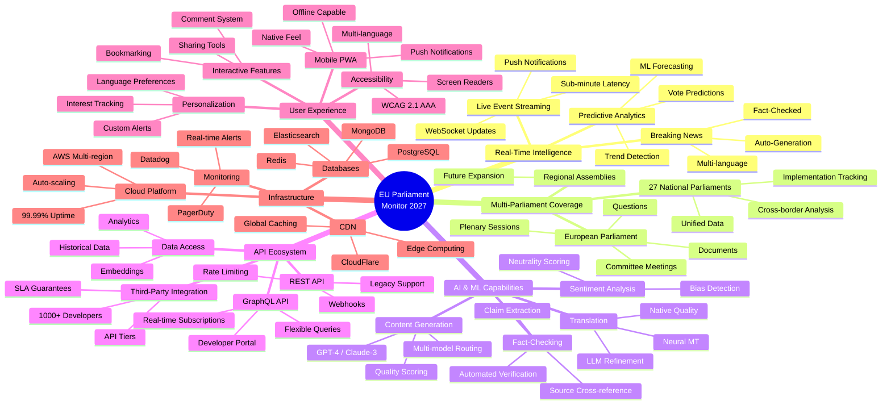

---

## 🎯 Capability Expansion Map

### Phase 1: Foundation (Q2-Q3 2026)

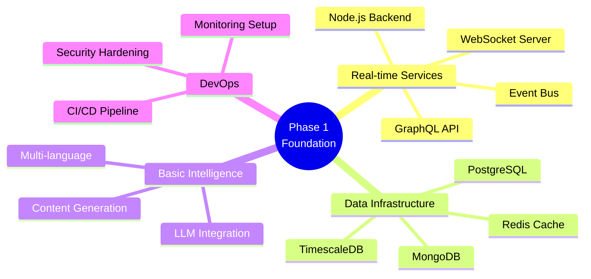

### Phase 2: Intelligence (Q3-Q4 2026)

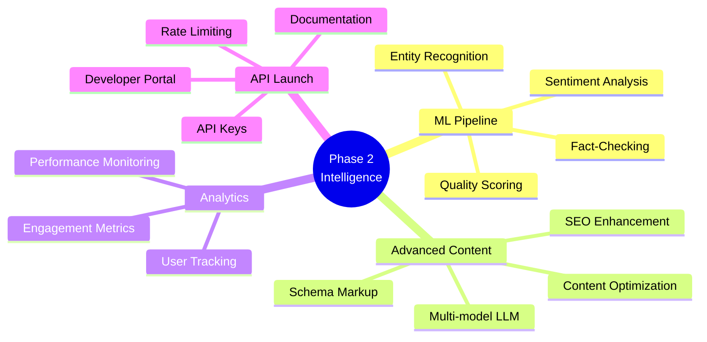

### Phase 3: Expansion (Q4 2026 - Q1 2027)

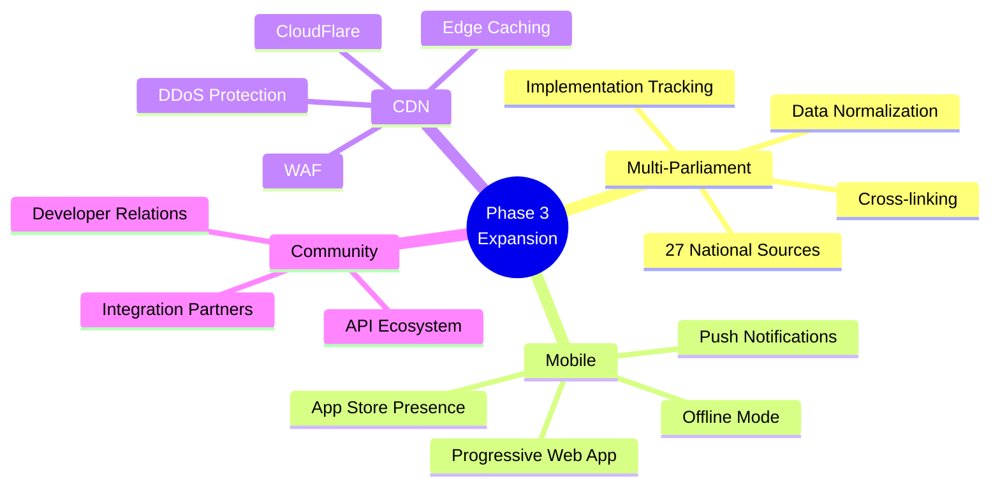

### Phase 4: Maturity (Q1-Q2 2027)

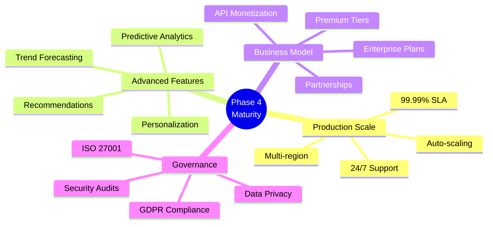

---

## 🔧 Technology Stack Evolution

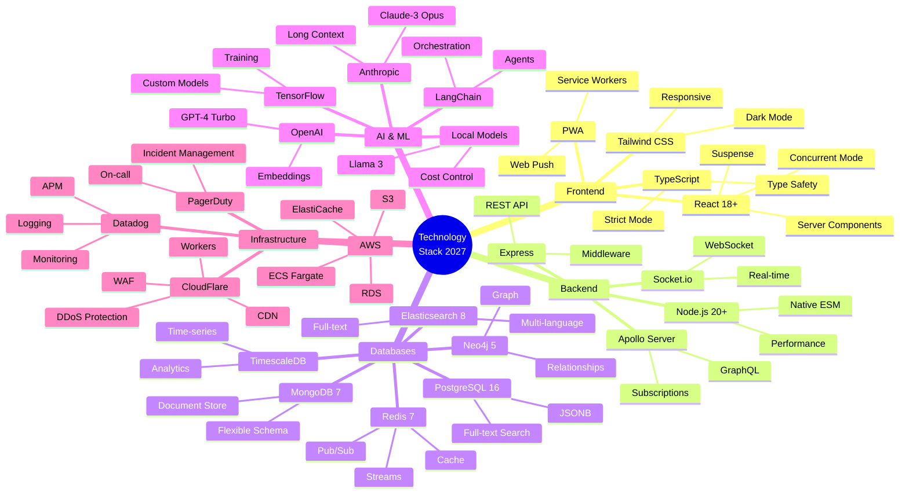

---

## 📊 Data Flow Mindmap

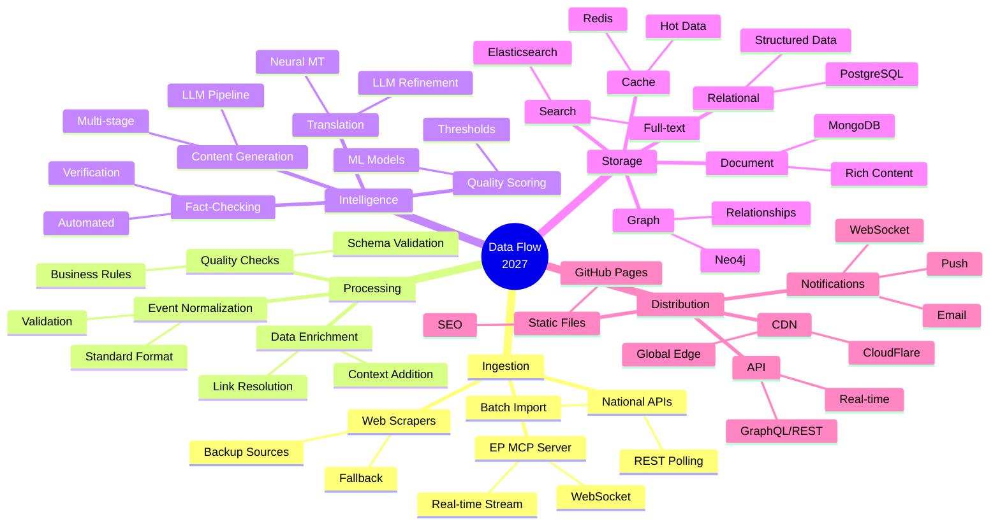

---

## 🎯 Feature Roadmap Mindmap

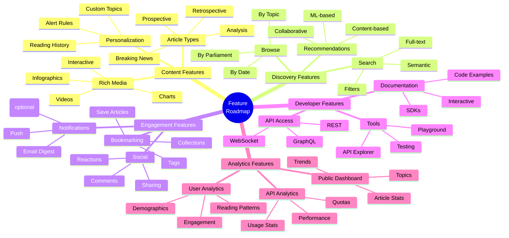

---

## 🔐 Security & Compliance Mindmap

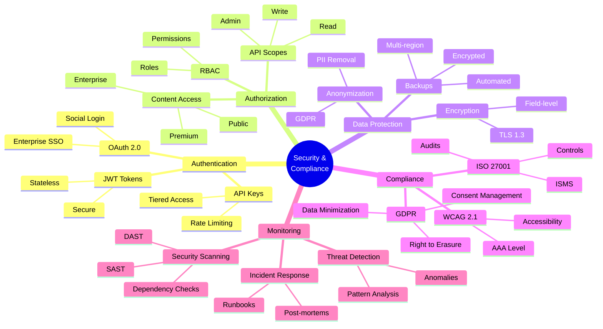

---

## 🌍 Geographic Expansion Mindmap

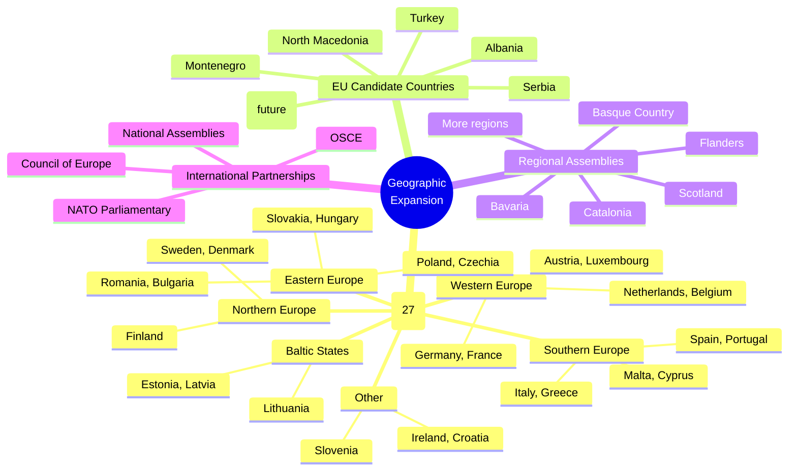

---

## 📈 Growth Metrics Mindmap

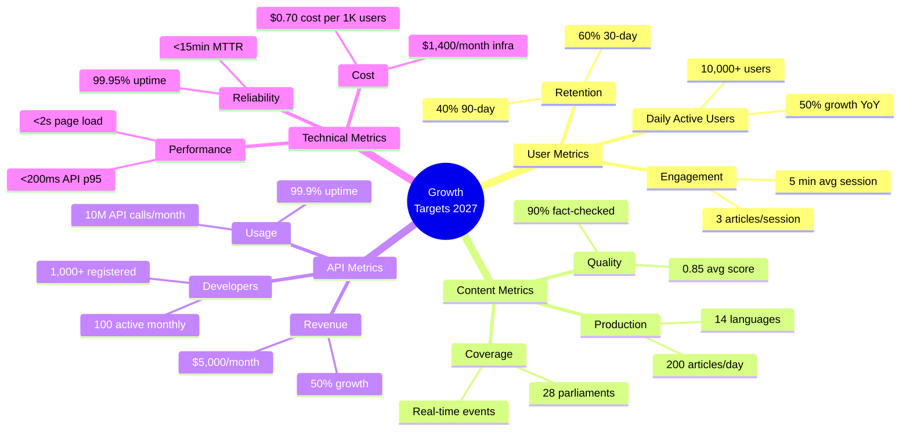

---

## 🤝 Partnership & Integration Mindmap

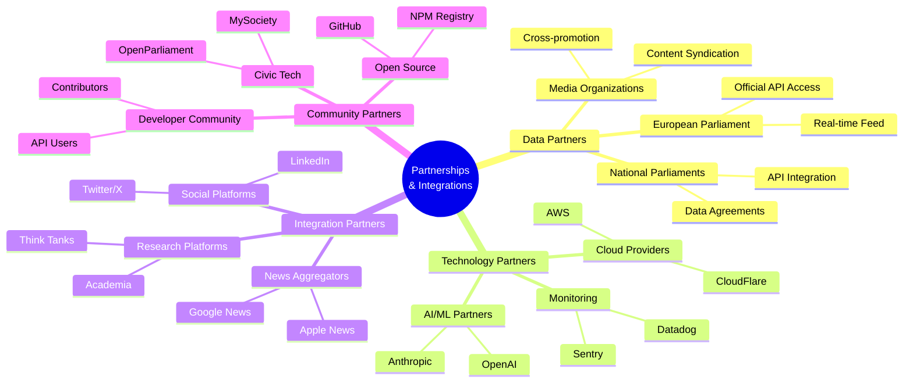

---

## 📚 References

### Current State

- [Current Mindmap](MINDMAP.md)
- [Current Architecture](ARCHITECTURE.md)

### Future State

- [Future Architecture](FUTURE_ARCHITECTURE.md)
- [Future Data Model](FUTURE_DATA_MODEL.md)
- [Future SWOT](FUTURE_SWOT.md)

---

## 📝 Change Log

| Version | Date       | Author          | Changes                         |
| ------- | ---------- | --------------- | ------------------------------- |
| 2.0     | 2025-02-17 | Product Manager | Initial future mindmap document |

---

**Document Status**: ✅ **APPROVED FOR PLANNING**  
**Next Review**: 2025-05-17 (Quarterly)  
**Classification**: Public
