

  

<h1 align="center">🧠 EU Parliament Monitor — Future System Mindmap</h1>

  <strong>🗺️ Three-Horizon Capability Expansion and Evolution Plans</strong> 
  <em>🎯 From Enhanced Static Intelligence to AWS-Native OSINT Platform (2026-2037)</em>

  
  
  
  

**📋 Document Owner:** CEO | **📄 Version:** 5.0 | **📅 Last
Updated:** 2026-05-31 (UTC) | **🚀 Release:** v1.0.1  
**🔄 Review Cycle:** Quarterly | **⏰ Next Review:** 2026-08-31  
**🏷️ Classification:** Public (Open Source European Parliament Monitoring Platform)

---

## 📚 Architecture Documentation Map

| Document | Focus | Description | Documentation Link |
| ------------------------------------------------------------------- | --------------- | ---------------------------------------------- | ------------------------------------------------------------------------------------------------------ |
| **[Architecture](ARCHITECTURE.md)** | 🏛️ Architecture | C4 model showing current system structure | [View Source](https://github.com/Hack23/euparliamentmonitor/blob/main/ARCHITECTURE.md) |
| **[Future Architecture](FUTURE_ARCHITECTURE.md)** | 🏛️ Architecture | C4 model showing future system structure | [View Source](https://github.com/Hack23/euparliamentmonitor/blob/main/FUTURE_ARCHITECTURE.md) |
| **[Mindmaps](MINDMAP.md)** | 🧠 Concept | Current system component relationships | [View Source](https://github.com/Hack23/euparliamentmonitor/blob/main/MINDMAP.md) |
| **[Future Mindmaps](FUTURE_MINDMAP.md)** | 🧠 Concept | Future capability evolution | **This Document** |
| **[SWOT Analysis](SWOT.md)** | 💼 Business | Current strategic assessment | [View Source](https://github.com/Hack23/euparliamentmonitor/blob/main/SWOT.md) |
| **[Future SWOT Analysis](FUTURE_SWOT.md)** | 💼 Business | Future strategic opportunities | [View Source](https://github.com/Hack23/euparliamentmonitor/blob/main/FUTURE_SWOT.md) |
| **[Data Model](DATA_MODEL.md)** | 📊 Data | Current data structures and relationships | [View Source](https://github.com/Hack23/euparliamentmonitor/blob/main/DATA_MODEL.md) |
| **[Future Data Model](FUTURE_DATA_MODEL.md)** | 📊 Data | Enhanced European Parliament data architecture | [View Source](https://github.com/Hack23/euparliamentmonitor/blob/main/FUTURE_DATA_MODEL.md) |
| **[Flowcharts](FLOWCHART.md)** | 🔄 Process | Current data processing workflows | [View Source](https://github.com/Hack23/euparliamentmonitor/blob/main/FLOWCHART.md) |
| **[Future Flowcharts](FUTURE_FLOWCHART.md)** | 🔄 Process | Enhanced AI-driven workflows | [View Source](https://github.com/Hack23/euparliamentmonitor/blob/main/FUTURE_FLOWCHART.md) |
| **[State Diagrams](STATEDIAGRAM.md)** | 🔄 Behavior | Current system state transitions | [View Source](https://github.com/Hack23/euparliamentmonitor/blob/main/STATEDIAGRAM.md) |
| **[Future State Diagrams](FUTURE_STATEDIAGRAM.md)** | 🔄 Behavior | Enhanced adaptive state transitions | [View Source](https://github.com/Hack23/euparliamentmonitor/blob/main/FUTURE_STATEDIAGRAM.md) |
| **[Security Architecture](SECURITY_ARCHITECTURE.md)** | 🛡️ Security | Current security implementation | [View Source](https://github.com/Hack23/euparliamentmonitor/blob/main/SECURITY_ARCHITECTURE.md) |
| **[Future Security Architecture](FUTURE_SECURITY_ARCHITECTURE.md)** | 🛡️ Security | Security enhancement roadmap | [View Source](https://github.com/Hack23/euparliamentmonitor/blob/main/FUTURE_SECURITY_ARCHITECTURE.md) |
| **[Threat Model](THREAT_MODEL.md)** | 🎯 Security | STRIDE threat analysis | [View Source](https://github.com/Hack23/euparliamentmonitor/blob/main/THREAT_MODEL.md) |
| **[Future Threat Model](FUTURE_THREAT_MODEL.md)** | 🎯 Security | Future threat landscape | [View Source](https://github.com/Hack23/euparliamentmonitor/blob/main/FUTURE_THREAT_MODEL.md) |
| **[Classification](CLASSIFICATION.md)** | 🏷️ Governance | CIA classification & BCP | [View Source](https://github.com/Hack23/euparliamentmonitor/blob/main/CLASSIFICATION.md) |
| **[CRA Assessment](CRA-ASSESSMENT.md)** | 🛡️ Compliance | Cyber Resilience Act | [View Source](https://github.com/Hack23/euparliamentmonitor/blob/main/CRA-ASSESSMENT.md) |
| **[Workflows](WORKFLOWS.md)** | ⚙️ DevOps | CI/CD documentation | [View Source](https://github.com/Hack23/euparliamentmonitor/blob/main/WORKFLOWS.md) |
| **[Future Workflows](FUTURE_WORKFLOWS.md)** | 🚀 DevOps | Planned CI/CD enhancements | [View Source](https://github.com/Hack23/euparliamentmonitor/blob/main/FUTURE_WORKFLOWS.md) |
| **[Business Continuity Plan](BCPPlan.md)** | 🔄 Resilience | Recovery planning | [View Source](https://github.com/Hack23/euparliamentmonitor/blob/main/BCPPlan.md) |
| **[Financial Security Plan](FinancialSecurityPlan.md)** | 💰 Financial | Cost & security analysis | [View Source](https://github.com/Hack23/euparliamentmonitor/blob/main/FinancialSecurityPlan.md) |
| **[End-of-Life Strategy](End-of-Life-Strategy.md)** | 📦 Lifecycle | Technology EOL planning | [View Source](https://github.com/Hack23/euparliamentmonitor/blob/main/End-of-Life-Strategy.md) |
| **[Unit Test Plan](UnitTestPlan.md)** | 🧪 Testing | Unit testing strategy | [View Source](https://github.com/Hack23/euparliamentmonitor/blob/main/UnitTestPlan.md) |
| **[E2E Test Plan](E2ETestPlan.md)** | 🔍 Testing | End-to-end testing | [View Source](https://github.com/Hack23/euparliamentmonitor/blob/main/E2ETestPlan.md) |
| **[Performance Testing](performance-testing.md)** | ⚡ Performance | Performance benchmarks | [View Source](https://github.com/Hack23/euparliamentmonitor/blob/main/performance-testing.md) |
| **[Security Policy](SECURITY.md)** | 🔒 Security | Vulnerability reporting & security policy | [View Source](https://github.com/Hack23/euparliamentmonitor/blob/main/SECURITY.md) |

---

## 🔐 ISMS Policy Alignment

This future mindmap is designed to implement all controls from Hack23 AB's ISMS
framework as the EU Parliament Monitor platform evolves across the three horizons —
from the **v2.0 enhanced static** edge to the **v3.0+ AWS-native serverless** OSINT
platform — while preserving political neutrality and PUBLIC open-data boundaries.

### Related ISMS Policies

| **Policy Domain** | **Policy** | **Planned Implementation** |
| -------------------------- | ------------------------------------------------------------------------------------------------------------ | ------------------------------------------------------------- |
| **🔐 Core Security** | [Information Security Policy](https://github.com/Hack23/ISMS-PUBLIC/blob/main/Information_Security_Policy.md) | Overall security governance across S3, CloudFront and serverless tiers |
| **🤖 AI Governance** | [AI Policy](https://github.com/Hack23/ISMS-PUBLIC/blob/main/AI_Policy.md) | Bedrock as proposal generator, human accountability, no autonomous deploy |
| **🛠️ Development** | [Secure Development Policy](https://github.com/Hack23/ISMS-PUBLIC/blob/main/Secure_Development_Policy.md) | Security-integrated SSDLC for aggregator and Lambda services |
| **🌐 Network** | [Network Security Policy](https://github.com/Hack23/ISMS-PUBLIC/blob/main/Network_Security_Policy.md) | CloudFront, AWS WAF, AWS Shield DDoS protection |
| **🔒 Cryptography** | [Cryptography Policy](https://github.com/Hack23/ISMS-PUBLIC/blob/main/Cryptography_Policy.md) | AWS KMS, TLS 1.3, SLSA provenance, integrity verification |
| **🔑 Access Control** | [Access Control Policy](https://github.com/Hack23/ISMS-PUBLIC/blob/main/Access_Control_Policy.md) | Amazon Cognito, IAM least-privilege, API authorization |
| **🏷️ Data Classification** | [Data Classification Policy](https://github.com/Hack23/ISMS-PUBLIC/blob/main/Data_Classification_Policy.md) | European Parliament PUBLIC open-data classification |
| **🔍 Vulnerability** | [Vulnerability Management](https://github.com/Hack23/ISMS-PUBLIC/blob/main/Vulnerability_Management.md) | CodeQL, OpenSSF Scorecard, GuardDuty, Security Hub |
| **🚨 Incident Response** | [Incident Response Plan](https://github.com/Hack23/ISMS-PUBLIC/blob/main/Incident_Response_Plan.md) | CloudWatch alarms, automated detection and response |
| **💾 Backup & Recovery** | [Backup Recovery Policy](https://github.com/Hack23/ISMS-PUBLIC/blob/main/Backup_Recovery_Policy.md) | S3 versioning, DynamoDB PITR, Aurora snapshots |
| **🔄 Business Continuity** | [Business Continuity Plan](https://github.com/Hack23/ISMS-PUBLIC/blob/main/Business_Continuity_Plan.md) | Multi-AZ serverless, static edge fallback, disaster recovery |
| **🤝 Third-Party** | [Third Party Management](https://github.com/Hack23/ISMS-PUBLIC/blob/main/Third_Party_Management.md) | AWS shared-responsibility, MCP provider assessment |
| **🏷️ Classification** | [Classification Framework](https://github.com/Hack23/ISMS-PUBLIC/blob/main/CLASSIFICATION.md) | Business impact analysis for platform |

### Compliance Framework Mapping

| **Framework** | **Version** | **Relevant Controls** |
| ------------- | ----------- | --------------------- |
| **ISO 27001** | 2022 | A.5.1, A.8.25, A.8.26, A.8.27 |
| **NIST CSF** | 2.0 | GV.OC, GV.RM, ID.AM, PR.AT |
| **CIS Controls** | v8.1 | Control 1-5, 14, 16 |
| **GDPR** | 2016/679 | Public MEP roles only, data minimization |

---

## 📋 Executive Summary

This document maps the **conceptual evolution** of EU Parliament Monitor across
**three strategic horizons**. It complements the current-state
[Mindmap](MINDMAP.md) and the [Future Architecture](FUTURE_ARCHITECTURE.md).

- **🟢 v2.0 — Enhanced Static Intelligence (2026 H2 → 2027):** keep the pure
  static-site architecture already hosted on **Amazon S3 + Amazon CloudFront**, and
  invest the next year of effort into *better political-landscape dashboards* and
  *deeper OSINT tradecraft quality*. No servers are introduced. The moat is the
  **highest-quality, neutral, evidence-cited political intelligence** — party and
  political-group cohesion, coalition mathematics, MEP and party scorecards, voting
  heatmaps, and election-cycle visualizations baked at build time and delivered as
  static HTML enriched with Chart.js 4 and D3 7.
- **🔵 v3.0+ — AWS-Native Serverless OSINT Platform (2028+):** evolve from a static
  generator into a dynamic intelligence-operations platform that goes **all-in on
  AWS, fully serverless** — Lambda, Step Functions, EventBridge, API Gateway,
  AppSync, Cognito, DynamoDB, Aurora Serverless v2, OpenSearch Serverless, Neptune
  Serverless, and **Amazon Bedrock** (Knowledge Bases, Agents, Guardrails). The
  static edge remains the cheap, cacheable public front door; dynamic features layer
  behind it.
- **⚪ 10-year AI lookahead (2026 → 2037):** model-agnostic intelligence via Bedrock,
  annual model upgrades, competitor evaluation each release, and resilience to
  paradigm shifts (quantum AI, neuromorphic computing) through AGI and post-AGI —
  governed by the Hack23 **AI Policy** (AI proposes, humans remain accountable, no
  autonomous deploy).

> **📌 v5.0 focus — closing the SWOT loop and going agentic.** This revision makes
> the future vision *traceable* and *visionary after v2.0*. Three new sections answer
> the strategic question "is every weakness and every opportunity addressed in the
> future architecture?":
>
> 1. [🤖 Future AI Agent Capabilities — What Is Really Possible](#-future-ai-agent-capabilities--what-is-really-possible-2026--2037)
>    analyses the *realistic* (not science-fiction) trajectory of agentic AI — the
>    autonomous multi-agent OSINT newsroom that supersedes today's single-session
>    `gh-aw` pipeline — with explicit feasibility bands.
> 2. [📡 Multi-Channel Distribution and Expanded Data Surfaces](#-multi-channel-distribution-and-expanded-data-surfaces)
>    captures the distribution and data-surface opportunities (RSS/ActivityPub,
>    newsletter, audio, PWA, Council/OECD/Eurostat/UN) that earlier revisions left
>    implicit.
> 3. [🧩 SWOT-to-Future Traceability](#-swot-to-future-traceability--every-weakness-mitigated-every-opportunity-captured)
>    maps **every** [SWOT.md](SWOT.md) weakness (W1–W19) and opportunity (O1–O17) to
>    a concrete future-state resolution, horizon, and owning capability — so no
>    improvement area is left unaddressed.

### Three-Horizon Comparison

| Dimension | Current v1.0.x | v2.0 Enhanced Static | v3.0+ AWS Serverless |
| --------- | -------------- | -------------------- | -------------------- |
| **Hosting** | S3 + CloudFront static | S3 + CloudFront static | S3 + CloudFront edge + serverless backend |
| **Generation** | Aggregator at build time | Aggregator + richer baked data | Real-time Lambda + Step Functions |
| **Dashboards** | Chart.js 4 + D3 7 in-article | Party landscape, cohesion, heatmaps | Live AppSync-driven dashboards |
| **AI** | gh-aw Claude authoring | gh-aw + 51-template OSINT catalog | Amazon Bedrock KB + Agents + Guardrails |
| **Data stores** | Committed markdown + JSON | Same + pre-rendered datasets | DynamoDB, Aurora v2, OpenSearch, Neptune |
| **Query** | Static browse | Static browse + filters | Natural-language over knowledge graph |
| **Identity** | None needed | None needed | Amazon Cognito federated |
| **Scope** | EU Parliament | EU Parliament deepened | Multi-parliament + API ecosystem |

---

## 🌐 Complete System Vision Mindmap

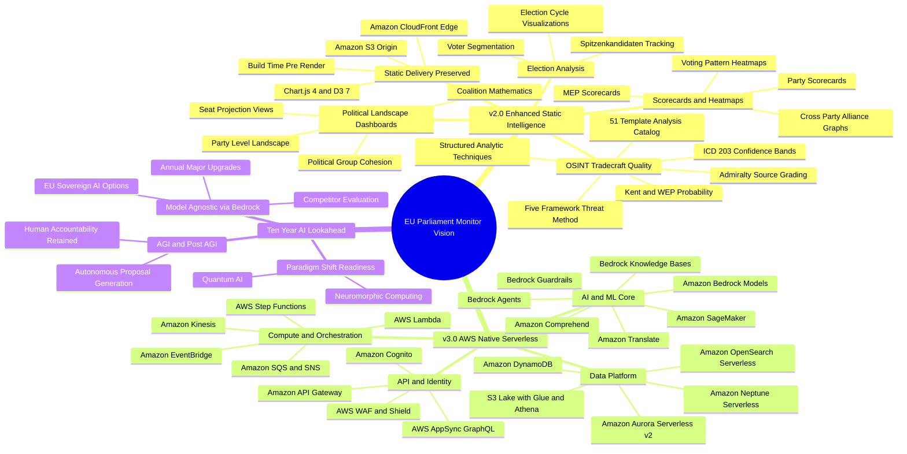
```mermaid
mindmap
  root((EU Parliament Monitor Vision))
    v2.0 Enhanced Static Intelligence
      Political Landscape Dashboards
        Party Level Landscape
        Political Group Cohesion
        Coalition Mathematics
        Seat Projection Views
      Scorecards and Heatmaps
        MEP Scorecards
        Party Scorecards
        Voting Pattern Heatmaps
        Cross Party Alliance Graphs
      Election Analysis
        Election Cycle Visualizations
        Spitzenkandidaten Tracking
        Voter Segmentation
      OSINT Tradecraft Quality
        ICD 203 Confidence Bands
        Admiralty Source Grading
        Kent and WEP Probability
        Structured Analytic Techniques
        51 Template Analysis Catalog
        Five Framework Threat Method
      Static Delivery Preserved
        Amazon S3 Origin
        Amazon CloudFront Edge
        Build Time Pre Render
        Chart.js 4 and D3 7
    v3.0 AWS Native Serverless
      Compute and Orchestration
        AWS Lambda
        AWS Step Functions
        Amazon EventBridge
        Amazon Kinesis
        Amazon SQS and SNS
      API and Identity
        Amazon API Gateway
        AWS AppSync GraphQL
        Amazon Cognito
        AWS WAF and Shield
      Data Platform
        Amazon DynamoDB
        Amazon Aurora Serverless v2
        Amazon OpenSearch Serverless
        Amazon Neptune Serverless
        S3 Lake with Glue and Athena
      AI and ML Core
        Amazon Bedrock Models
        Bedrock Knowledge Bases
        Bedrock Agents
        Bedrock Guardrails
        Amazon SageMaker
        Amazon Comprehend
        Amazon Translate
    Ten Year AI Lookahead
      Model Agnostic via Bedrock
        Annual Major Upgrades
        Competitor Evaluation
        EU Sovereign AI Options
      Paradigm Shift Readiness
        Quantum AI
        Neuromorphic Computing
      AGI and Post AGI
        Autonomous Proposal Generation
        Human Accountability Retained
```

---

## 🎯 Capability Expansion Map

### v2.0 Horizon — Enhanced Static Intelligence (2026 H2 to 2027)

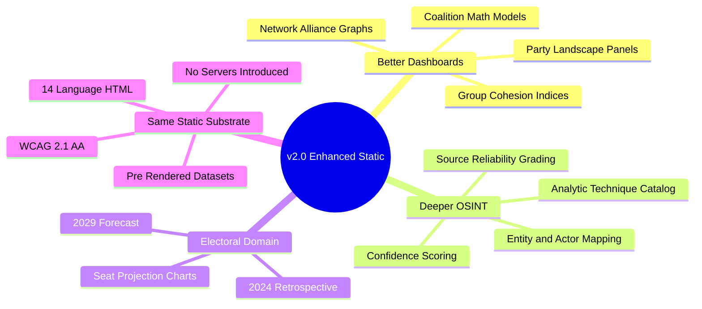
```mermaid
mindmap
  root((v2.0 Enhanced Static))
    Better Dashboards
      Party Landscape Panels
      Group Cohesion Indices
      Coalition Math Models
      Network Alliance Graphs
    Deeper OSINT
      Confidence Scoring
      Source Reliability Grading
      Analytic Technique Catalog
      Entity and Actor Mapping
    Electoral Domain
      2024 Retrospective
      2029 Forecast
      Seat Projection Charts
    Same Static Substrate
      No Servers Introduced
      Pre Rendered Datasets
      14 Language HTML
      WCAG 2.1 AA
```

### v3.0 Horizon — AWS Serverless Foundation (2028)

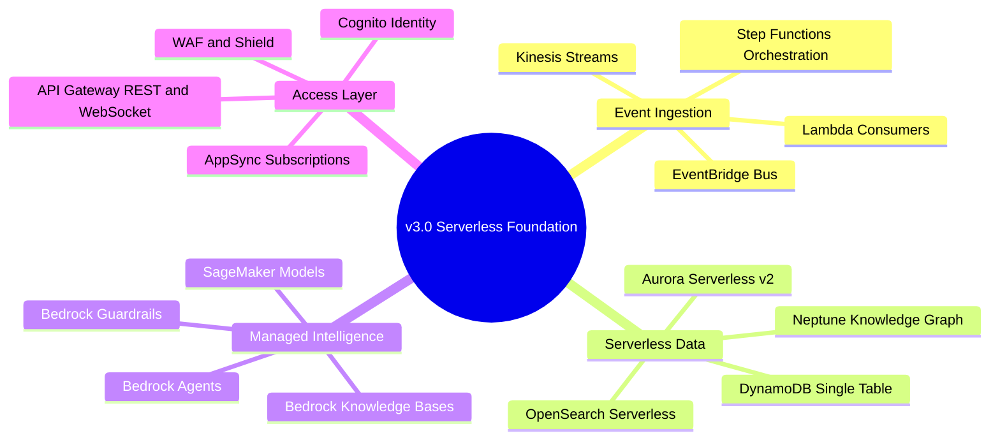
```mermaid
mindmap
  root((v3.0 Serverless Foundation))
    Event Ingestion
      EventBridge Bus
      Kinesis Streams
      Lambda Consumers
      Step Functions Orchestration
    Serverless Data
      DynamoDB Single Table
      Aurora Serverless v2
      OpenSearch Serverless
      Neptune Knowledge Graph
    Managed Intelligence
      Bedrock Knowledge Bases
      Bedrock Agents
      Bedrock Guardrails
      SageMaker Models
    Access Layer
      API Gateway REST and WebSocket
      AppSync Subscriptions
      Cognito Identity
      WAF and Shield
```

### v3.1 Horizon — Intelligence Operations Platform (2029)

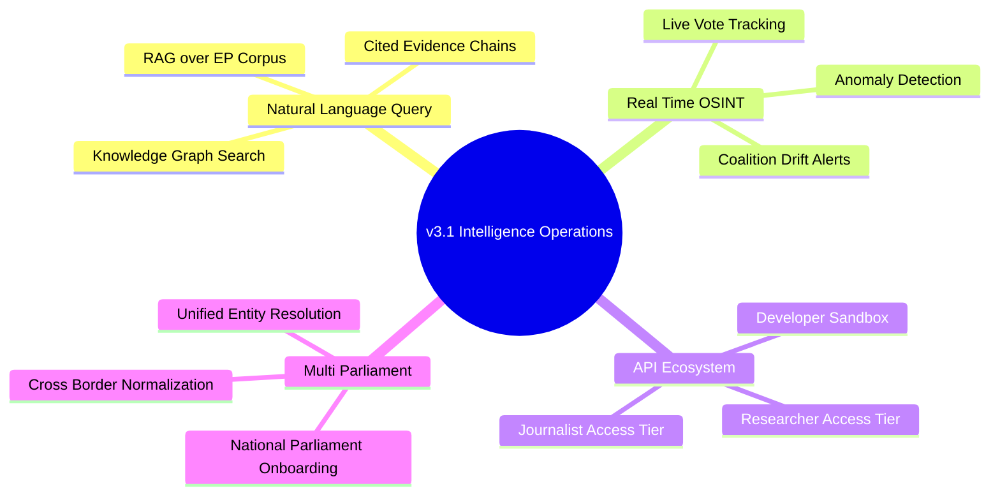
```mermaid
mindmap
  root((v3.1 Intelligence Operations))
    Natural Language Query
      Knowledge Graph Search
      RAG over EP Corpus
      Cited Evidence Chains
    Real Time OSINT
      Live Vote Tracking
      Coalition Drift Alerts
      Anomaly Detection
    API Ecosystem
      Journalist Access Tier
      Researcher Access Tier
      Developer Sandbox
    Multi Parliament
      National Parliament Onboarding
      Cross Border Normalization
      Unified Entity Resolution
```

### v3.2 Horizon — Scale and Sovereignty (2030)

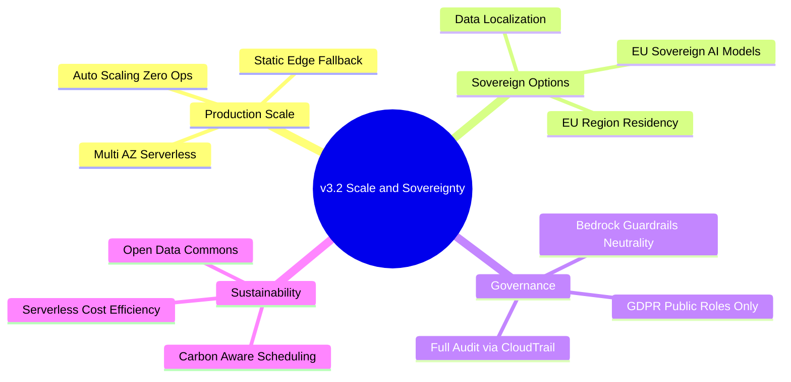
```mermaid
mindmap
  root((v3.2 Scale and Sovereignty))
    Production Scale
      Multi AZ Serverless
      Auto Scaling Zero Ops
      Static Edge Fallback
    Sovereign Options
      EU Region Residency
      EU Sovereign AI Models
      Data Localization
    Governance
      Bedrock Guardrails Neutrality
      GDPR Public Roles Only
      Full Audit via CloudTrail
    Sustainability
      Serverless Cost Efficiency
      Carbon Aware Scheduling
      Open Data Commons
```

---

## 🔧 Technology Stack Evolution

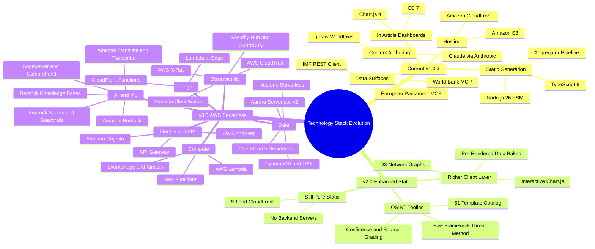
```mermaid
mindmap
  root((Technology Stack Evolution))
    Current v1.0.x
      Static Generation
        Node.js 26 ESM
        TypeScript 6
        Aggregator Pipeline
      Hosting
        Amazon S3
        Amazon CloudFront
      In Article Dashboards
        Chart.js 4
        D3 7
      Content Authoring
        gh-aw Workflows
        Claude via Anthropic
      Data Surfaces
        European Parliament MCP
        World Bank MCP
        IMF REST Client
    v2.0 Enhanced Static
      Richer Client Layer
        Interactive Chart.js
        D3 Network Graphs
        Pre Rendered Data Baked
      OSINT Tooling
        51 Template Catalog
        Confidence and Source Grading
        Five Framework Threat Method
      Still Pure Static
        S3 and CloudFront
        No Backend Servers
    v3.0 AWS Serverless
      Compute
        AWS Lambda
        Step Functions
        EventBridge and Kinesis
      Edge
        CloudFront Functions
        Lambda at Edge
      Data
        DynamoDB and DAX
        Aurora Serverless v2
        OpenSearch Serverless
        Neptune Serverless
      AI and ML
        Amazon Bedrock
        Bedrock Knowledge Bases
        Bedrock Agents and Guardrails
        SageMaker and Comprehend
        Amazon Translate and Transcribe
      Identity and API
        Amazon Cognito
        API Gateway
        AWS AppSync
      Observability
        Amazon CloudWatch
        AWS X-Ray
        AWS CloudTrail
        Security Hub and GuardDuty
```

---

## 📊 Data Flow Mindmap

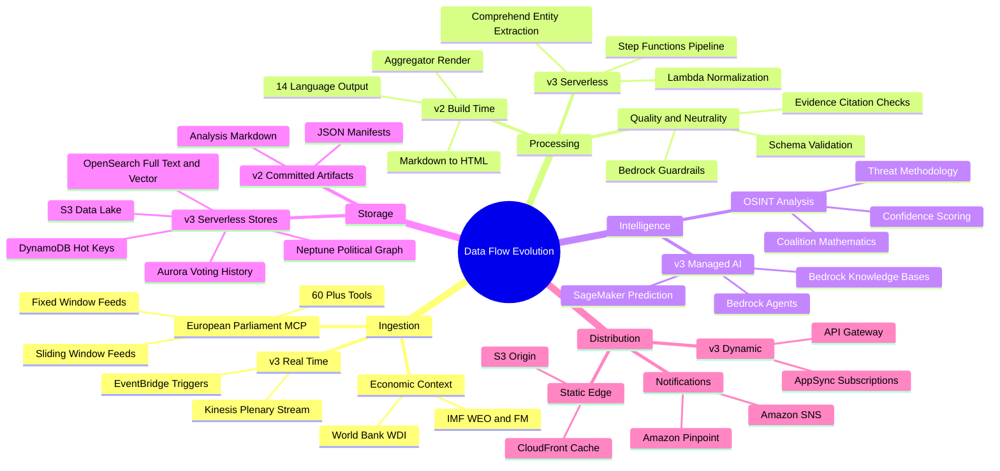
```mermaid
mindmap
  root((Data Flow Evolution))
    Ingestion
      European Parliament MCP
        Sliding Window Feeds
        Fixed Window Feeds
        60 Plus Tools
      Economic Context
        World Bank WDI
        IMF WEO and FM
      v3 Real Time
        EventBridge Triggers
        Kinesis Plenary Stream
    Processing
      v2 Build Time
        Aggregator Render
        Markdown to HTML
        14 Language Output
      v3 Serverless
        Lambda Normalization
        Step Functions Pipeline
        Comprehend Entity Extraction
      Quality and Neutrality
        Schema Validation
        Bedrock Guardrails
        Evidence Citation Checks
    Intelligence
      OSINT Analysis
        Confidence Scoring
        Coalition Mathematics
        Threat Methodology
      v3 Managed AI
        Bedrock Knowledge Bases
        Bedrock Agents
        SageMaker Prediction
    Storage
      v2 Committed Artifacts
        Analysis Markdown
        JSON Manifests
      v3 Serverless Stores
        DynamoDB Hot Keys
        Aurora Voting History
        OpenSearch Full Text and Vector
        Neptune Political Graph
        S3 Data Lake
    Distribution
      Static Edge
        S3 Origin
        CloudFront Cache
      v3 Dynamic
        API Gateway
        AppSync Subscriptions
      Notifications
        Amazon SNS
        Amazon Pinpoint
```

---

## 🎯 Feature Roadmap Mindmap

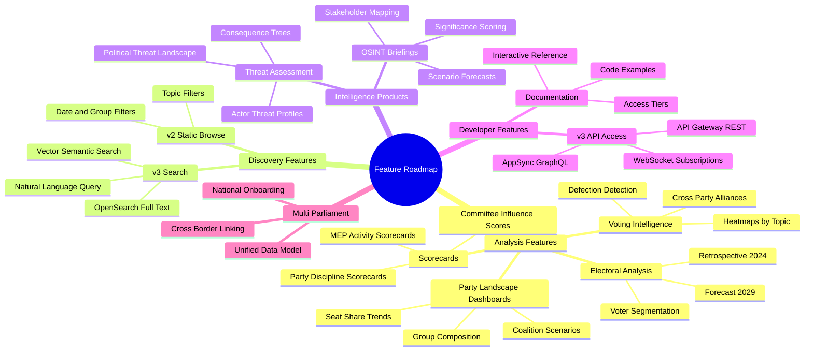
```mermaid
mindmap
  root((Feature Roadmap))
    Analysis Features
      Party Landscape Dashboards
        Group Composition
        Seat Share Trends
        Coalition Scenarios
      Scorecards
        MEP Activity Scorecards
        Party Discipline Scorecards
        Committee Influence Scores
      Voting Intelligence
        Heatmaps by Topic
        Defection Detection
        Cross Party Alliances
      Electoral Analysis
        Retrospective 2024
        Forecast 2029
        Voter Segmentation
    Discovery Features
      v2 Static Browse
        Topic Filters
        Date and Group Filters
      v3 Search
        OpenSearch Full Text
        Vector Semantic Search
        Natural Language Query
    Intelligence Products
      OSINT Briefings
        Significance Scoring
        Stakeholder Mapping
        Scenario Forecasts
      Threat Assessment
        Political Threat Landscape
        Actor Threat Profiles
        Consequence Trees
    Developer Features
      v3 API Access
        API Gateway REST
        AppSync GraphQL
        WebSocket Subscriptions
      Documentation
        Interactive Reference
        Code Examples
        Access Tiers
    Multi Parliament
      National Onboarding
      Cross Border Linking
      Unified Data Model
```

---

## 🔐 Security and Compliance Mindmap

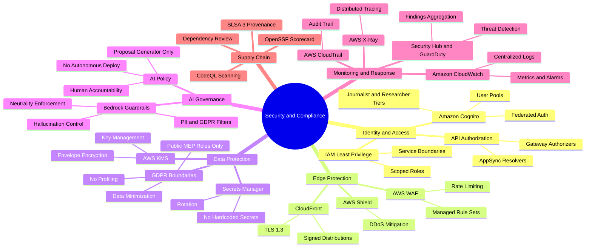
```mermaid
mindmap
  root((Security and Compliance))
    Identity and Access
      Amazon Cognito
        Federated Auth
        User Pools
        Journalist and Researcher Tiers
      IAM Least Privilege
        Scoped Roles
        Service Boundaries
      API Authorization
        Gateway Authorizers
        AppSync Resolvers
    Edge Protection
      AWS WAF
        Managed Rule Sets
        Rate Limiting
      AWS Shield
        DDoS Mitigation
      CloudFront
        TLS 1.3
        Signed Distributions
    Data Protection
      AWS KMS
        Key Management
        Envelope Encryption
      Secrets Manager
        Rotation
        No Hardcoded Secrets
      GDPR Boundaries
        Public MEP Roles Only
        Data Minimization
        No Profiling
    AI Governance
      Bedrock Guardrails
        Neutrality Enforcement
        PII and GDPR Filters
        Hallucination Control
      AI Policy
        Proposal Generator Only
        Human Accountability
        No Autonomous Deploy
    Monitoring and Response
      Amazon CloudWatch
        Metrics and Alarms
        Centralized Logs
      AWS X-Ray
        Distributed Tracing
      AWS CloudTrail
        Audit Trail
      Security Hub and GuardDuty
        Findings Aggregation
        Threat Detection
    Supply Chain
      SLSA 3 Provenance
      OpenSSF Scorecard
      CodeQL Scanning
      Dependency Review
```

---

## 🌍 Geographic and Multi-Parliament Expansion Mindmap

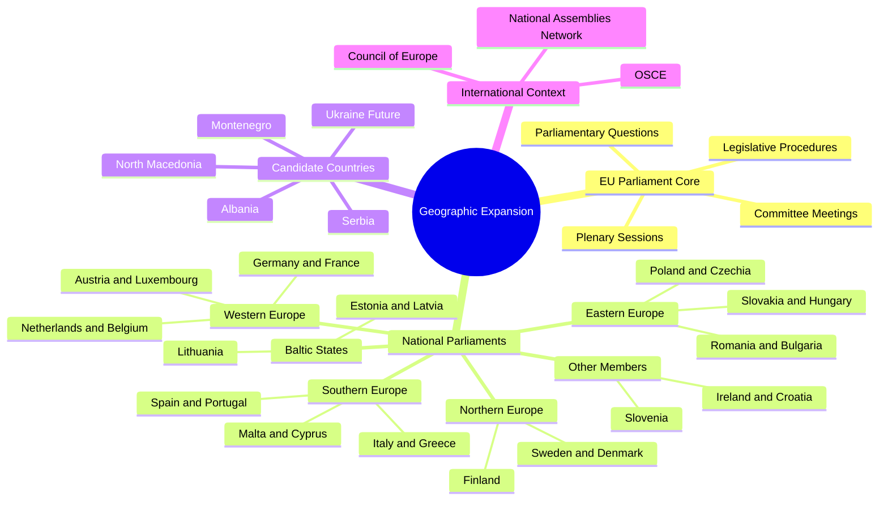
```mermaid
mindmap
  root((Geographic Expansion))
    EU Parliament Core
      Plenary Sessions
      Committee Meetings
      Parliamentary Questions
      Legislative Procedures
    National Parliaments
      Western Europe
        Germany and France
        Netherlands and Belgium
        Austria and Luxembourg
      Southern Europe
        Spain and Portugal
        Italy and Greece
        Malta and Cyprus
      Northern Europe
        Sweden and Denmark
        Finland
      Eastern Europe
        Poland and Czechia
        Slovakia and Hungary
        Romania and Bulgaria
      Baltic States
        Estonia and Latvia
        Lithuania
      Other Members
        Ireland and Croatia
        Slovenia
    Candidate Countries
      Albania
      North Macedonia
      Montenegro
      Serbia
      Ukraine Future
    International Context
      Council of Europe
      OSCE
      National Assemblies Network
```

---

## 📈 Growth Metrics Mindmap

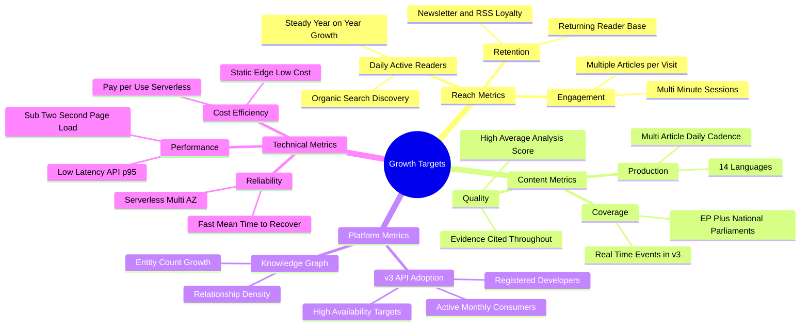
```mermaid
mindmap
  root((Growth Targets))
    Reach Metrics
      Daily Active Readers
        Steady Year on Year Growth
        Organic Search Discovery
      Engagement
        Multi Minute Sessions
        Multiple Articles per Visit
      Retention
        Returning Reader Base
        Newsletter and RSS Loyalty
    Content Metrics
      Production
        Multi Article Daily Cadence
        14 Languages
      Quality
        High Average Analysis Score
        Evidence Cited Throughout
      Coverage
        EP Plus National Parliaments
        Real Time Events in v3
    Platform Metrics
      v3 API Adoption
        Registered Developers
        Active Monthly Consumers
        High Availability Targets
      Knowledge Graph
        Entity Count Growth
        Relationship Density
    Technical Metrics
      Performance
        Sub Two Second Page Load
        Low Latency API p95
      Reliability
        Serverless Multi AZ
        Fast Mean Time to Recover
      Cost Efficiency
        Static Edge Low Cost
        Pay per Use Serverless
```

---

## 🤝 Partnership and Integration Mindmap

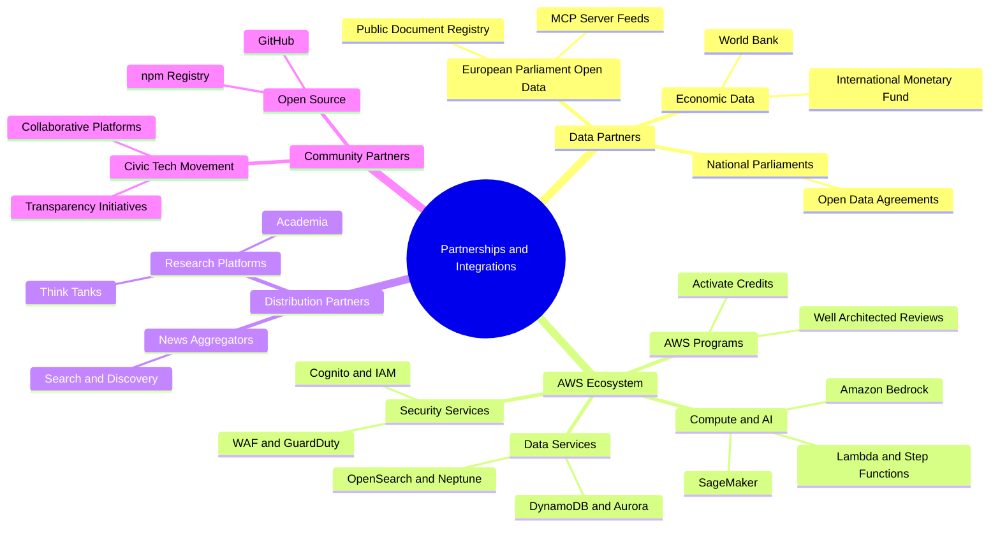
```mermaid
mindmap
  root((Partnerships and Integrations))
    Data Partners
      European Parliament Open Data
        MCP Server Feeds
        Public Document Registry
      Economic Data
        World Bank
        International Monetary Fund
      National Parliaments
        Open Data Agreements
    AWS Ecosystem
      Compute and AI
        Lambda and Step Functions
        Amazon Bedrock
        SageMaker
      Data Services
        DynamoDB and Aurora
        OpenSearch and Neptune
      Security Services
        Cognito and IAM
        WAF and GuardDuty
      AWS Programs
        Activate Credits
        Well Architected Reviews
    Distribution Partners
      News Aggregators
        Search and Discovery
      Research Platforms
        Academia
        Think Tanks
    Community Partners
      Open Source
        GitHub
        npm Registry
      Civic Tech Movement
        Transparency Initiatives
        Collaborative Platforms
```

---

## 🔮 Visionary System Mindmap: 2027-2037

### AI Evolution and Platform Transformation

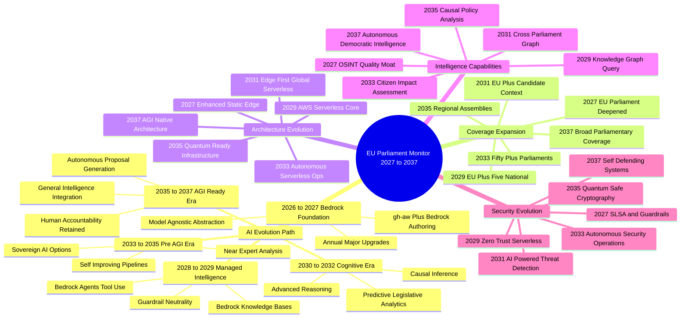
```mermaid
mindmap
  root((EU Parliament Monitor 2027 to 2037))
    AI Evolution Path
      2026 to 2027 Bedrock Foundation
        Model Agnostic Abstraction
        gh-aw Plus Bedrock Authoring
        Annual Major Upgrades
      2028 to 2029 Managed Intelligence
        Bedrock Knowledge Bases
        Bedrock Agents Tool Use
        Guardrail Neutrality
      2030 to 2032 Cognitive Era
        Advanced Reasoning
        Predictive Legislative Analytics
        Causal Inference
      2033 to 2035 Pre AGI Era
        Near Expert Analysis
        Self Improving Pipelines
        Sovereign AI Options
      2035 to 2037 AGI Ready Era
        General Intelligence Integration
        Autonomous Proposal Generation
        Human Accountability Retained
    Coverage Expansion
      2027 EU Parliament Deepened
      2029 EU Plus Five National
      2031 EU Plus Candidate Context
      2033 Fifty Plus Parliaments
      2035 Regional Assemblies
      2037 Broad Parliamentary Coverage
    Architecture Evolution
      2027 Enhanced Static Edge
      2029 AWS Serverless Core
      2031 Edge First Global Serverless
      2033 Autonomous Serverless Ops
      2035 Quantum Ready Infrastructure
      2037 AGI Native Architecture
    Intelligence Capabilities
      2027 OSINT Quality Moat
      2029 Knowledge Graph Query
      2031 Cross Parliament Graph
      2033 Citizen Impact Assessment
      2035 Causal Policy Analysis
      2037 Autonomous Democratic Intelligence
    Security Evolution
      2027 SLSA and Guardrails
      2029 Zero Trust Serverless
      2031 AI Powered Threat Detection
      2033 Autonomous Security Operations
      2035 Quantum Safe Cryptography
      2037 Self Defending Systems
```

### Competitive and Disruption Landscape

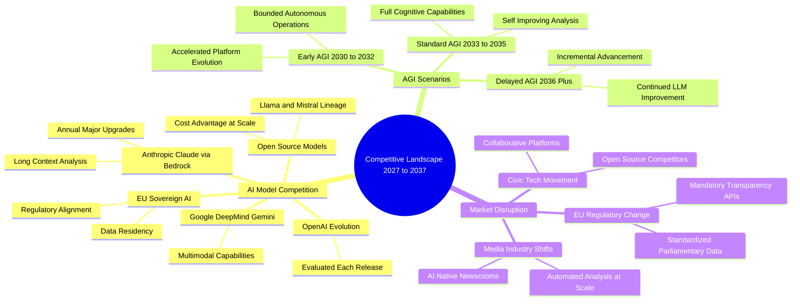
```mermaid
mindmap
  root((Competitive Landscape 2027 to 2037))
    AI Model Competition
      Anthropic Claude via Bedrock
        Annual Major Upgrades
        Long Context Analysis
      OpenAI Evolution
        Evaluated Each Release
      Google DeepMind Gemini
        Multimodal Capabilities
      Open Source Models
        Cost Advantage at Scale
        Llama and Mistral Lineage
      EU Sovereign AI
        Data Residency
        Regulatory Alignment
    AGI Scenarios
      Early AGI 2030 to 2032
        Accelerated Platform Evolution
        Bounded Autonomous Operations
      Standard AGI 2033 to 2035
        Full Cognitive Capabilities
        Self Improving Analysis
      Delayed AGI 2036 Plus
        Continued LLM Improvement
        Incremental Advancement
    Market Disruption
      EU Regulatory Change
        Mandatory Transparency APIs
        Standardized Parliamentary Data
      Civic Tech Movement
        Open Source Competitors
        Collaborative Platforms
      Media Industry Shifts
        AI Native Newsrooms
        Automated Analysis at Scale
```

### AI Model Evolution Timeline

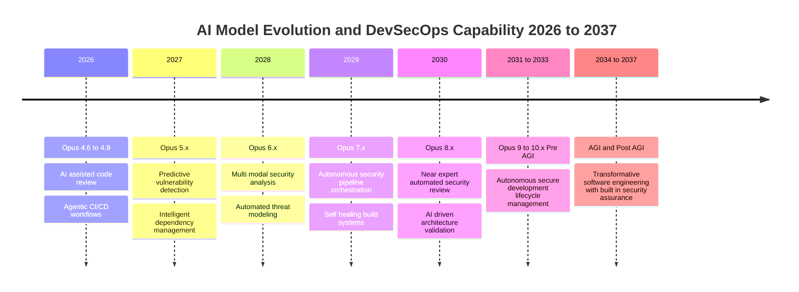
```mermaid
timeline
    title AI Model Evolution and DevSecOps Capability 2026 to 2037
    2026 : Opus 4.6 to 4.9 : AI assisted code review : Agentic CI/CD workflows
    2027 : Opus 5.x : Predictive vulnerability detection : Intelligent dependency management
    2028 : Opus 6.x : Multi modal security analysis : Automated threat modeling
    2029 : Opus 7.x : Autonomous security pipeline orchestration : Self healing build systems
    2030 : Opus 8.x : Near expert automated security review : AI driven architecture validation
    2031 to 2033 : Opus 9 to 10.x Pre AGI : Autonomous secure development lifecycle management
    2034 to 2037 : AGI and Post AGI : Transformative software engineering with built in security assurance
```

### Canonical AI Model Evolution — DevSecOps and Development Perspective

| Year | AI Model | DevSecOps Capability Evolution |
| ---- | -------- | ------------------------------ |
| 2026 | Opus 4.6–4.9 | 🟢 AI-assisted code review, automated test generation, agentic CI/CD workflows |
| 2027 | Opus 5.x | 🔵 Predictive vulnerability detection, intelligent dependency management |
| 2028 | Opus 6.x | 🟣 Multi-modal security analysis (code + architecture + runtime), automated threat modeling |
| 2029 | Opus 7.x | 🟠 Autonomous security pipeline orchestration, self-healing build systems |
| 2030 | Opus 8.x | 🔴 Near-expert automated security review, AI-driven architecture validation |
| 2031–2033 | Opus 9–10.x / Pre-AGI | ⚪ Autonomous secure development lifecycle management |
| 2034–2037 | AGI / Post-AGI | ⭐ Transformative software engineering with built-in security assurance |

> **Assumptions:** major AI model upgrades are expected annually; competitor models
> (OpenAI, Google, Meta, EU sovereign AI) are evaluated at each release; the
> architecture is designed to accommodate potential paradigm shifts such as quantum
> AI and neuromorphic computing. The full cross-perspective analysis lives in the
> Hack23 Information Security Strategy § AI Model Evolution Strategy. Governance
> follows the
> [AI Policy](https://github.com/Hack23/ISMS-PUBLIC/blob/main/AI_Policy.md):
> AI acts as a **proposal generator**, humans retain accountability, and there is
> **no autonomous production deployment**.

---

## 🤖 Future AI Agent Capabilities — What Is Really Possible (2026 → 2037)

Today the platform is authored by a **single-session `gh-aw` agent** that runs
Stages A→E inside one 60-minute window and produces exactly one PR (see SWOT.md
**W18**, **W19**). That model is the current ceiling, not the destination. This
section analyses, with **explicit feasibility bands**, what genuinely becomes
possible as agentic AI matures from today's tool-using assistants toward
Bedrock-managed multi-agent orchestration and, eventually, near-AGI reasoning.

> **Feasibility legend** (so the vision stays honest, per the AI-First Quality
> discipline): 🟢 **Realistic now / ≤ 18 months** — buildable on shipping Bedrock
> Agents + Step Functions; 🔵 **Emerging / 2–4 years** — depends on the next 2–3
> annual model upgrades and managed-agent maturity; ⚪ **Aspirational / 5+ years** —
> contingent on pre-AGI reasoning and sovereign-AI availability. **Every band keeps
> the AI Policy invariant: AI proposes, a human approves, no autonomous production
> deploy.**

### From Single-Session Pipeline to Autonomous Multi-Agent OSINT Newsroom

The decisive shift is decomposing the monolithic 60-minute run into a **fleet of
specialised, cooperating agents**, each a Bedrock Agent with scoped tool access,
its own Guardrail, and a bounded mandate. This directly retires the
single-session timeout fragility (**W18**), the gateway-keepalive risk (**W19**),
and the single-threaded LLM dependency (**W4**, **W7**).

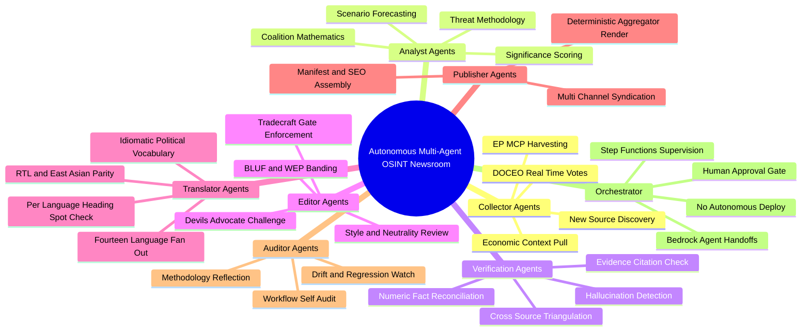
```mermaid
mindmap
  root((Autonomous Multi-Agent OSINT Newsroom))
    Collector Agents
      EP MCP Harvesting
      Economic Context Pull
      DOCEO Real Time Votes
      New Source Discovery
    Analyst Agents
      Coalition Mathematics
      Significance Scoring
      Scenario Forecasting
      Threat Methodology
    Verification Agents
      Cross Source Triangulation
      Evidence Citation Check
      Hallucination Detection
      Numeric Fact Reconciliation
    Editor Agents
      Tradecraft Gate Enforcement
      Style and Neutrality Review
      Devils Advocate Challenge
      BLUF and WEP Banding
    Translator Agents
      Fourteen Language Fan Out
      Idiomatic Political Vocabulary
      RTL and East Asian Parity
      Per Language Heading Spot Check
    Publisher Agents
      Deterministic Aggregator Render
      Manifest and SEO Assembly
      Multi Channel Syndication
    Auditor Agents
      Methodology Reflection
      Workflow Self Audit
      Drift and Regression Watch
    Orchestrator
      Step Functions Supervision
      Bedrock Agent Handoffs
      Human Approval Gate
      No Autonomous Deploy
```

### What Each Capability Realistically Unlocks

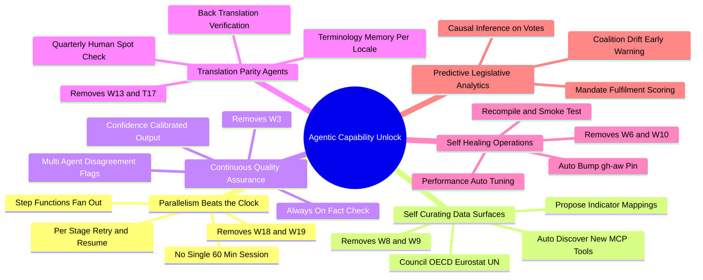
```mermaid
mindmap
  root((Agentic Capability Unlock))
    Parallelism Beats the Clock
      No Single 60 Min Session
      Step Functions Fan Out
      Per Stage Retry and Resume
      Removes W18 and W19
    Self Curating Data Surfaces
      Auto Discover New MCP Tools
      Propose Indicator Mappings
      Council OECD Eurostat UN
      Removes W8 and W9
    Continuous Quality Assurance
      Always On Fact Check
      Multi Agent Disagreement Flags
      Confidence Calibrated Output
      Removes W3
    Translation Parity Agents
      Back Translation Verification
      Terminology Memory Per Locale
      Quarterly Human Spot Check
      Removes W13 and T17
    Self Healing Operations
      Auto Bump gh-aw Pin
      Recompile and Smoke Test
      Performance Auto Tuning
      Removes W6 and W10
    Predictive Legislative Analytics
      Causal Inference on Votes
      Coalition Drift Early Warning
      Mandate Fulfilment Scoring
```

### Agentic Capability Realism — Horizon Table

| Capability | Feasibility | Horizon | Retires SWOT Item | Governing Control |
| ---------- | ----------- | ------- | ----------------- | ----------------- |
| Multi-agent stage parallelism (Step Functions + Bedrock Agents) | 🟢 Realistic | v3.0 (2028) | W18, W19 | AI Policy human gate |
| Always-on verification / fact-check agents | 🟢 Realistic | v2.0→v3.0 | W3, T1 | Bedrock Guardrails |
| Multi-channel publisher agents (RSS, ActivityPub, audio, newsletter) | 🟢 Realistic | v2.0 | O6, O9 | Deterministic aggregator |
| Self-curating data-surface onboarding (Council, OECD, Eurostat, UN) | 🔵 Emerging | v3.1 (2029) | W8, W9, O7, O16 | Human-approved source registry |
| Translation-parity / back-translation agents | 🔵 Emerging | v3.0 | W13, T17 | Quarterly human spot-check |
| Knowledge-graph reasoning agents over Neptune | 🔵 Emerging | v3.1 | O3-graph moat | Cited evidence chains |
| Self-healing dependency + pipeline ops (auto gh-aw bump) | ⚪ Aspirational | v3.2 (2030) | W6, W10 | Human approval before merge |
| Causal predictive legislative analytics | ⚪ Aspirational | 2031+ | O15 deepened | WEP-banded, no determinism claim |
| Autonomous proposal generation (pre-AGI) | ⚪ Aspirational | 2035+ | — | **Human accountability retained** |

### Governance Invariant Across Every Horizon

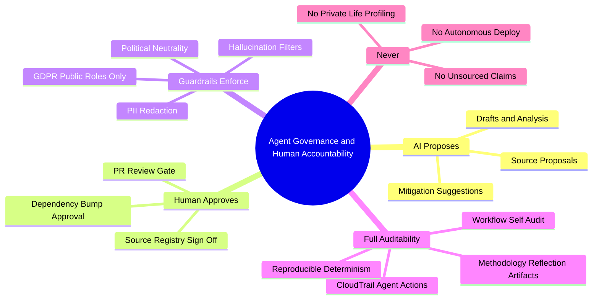
```mermaid
mindmap
  root((Agent Governance and Human Accountability))
    AI Proposes
      Drafts and Analysis
      Source Proposals
      Mitigation Suggestions
    Human Approves
      PR Review Gate
      Source Registry Sign Off
      Dependency Bump Approval
    Guardrails Enforce
      Political Neutrality
      GDPR Public Roles Only
      Hallucination Filters
      PII Redaction
    Full Auditability
      CloudTrail Agent Actions
      Methodology Reflection Artifacts
      Workflow Self Audit
      Reproducible Determinism
    Never
      No Autonomous Deploy
      No Private Life Profiling
      No Unsourced Claims
```

---

## 📡 Multi-Channel Distribution and Expanded Data Surfaces

Earlier revisions left several [SWOT.md](SWOT.md) opportunities **implicit**. This
section makes them first-class so the future vision visibly captures them:
multi-channel distribution (**O6**), federated reach (**O9**), PWA mobile
(**O10**), and an expanded MCP data surface beyond EP/WB/IMF (**O7**, **O16**).

### Distribution Channel Expansion

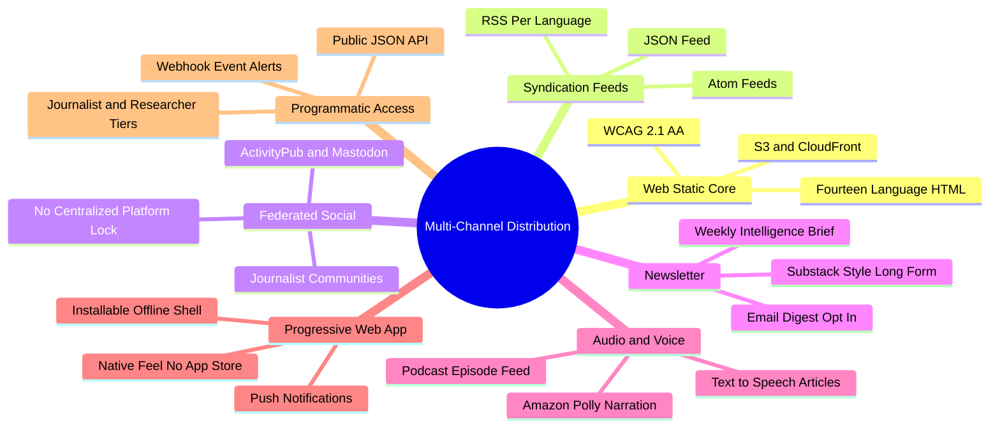
```mermaid
mindmap
  root((Multi-Channel Distribution))
    Web Static Core
      S3 and CloudFront
      Fourteen Language HTML
      WCAG 2.1 AA
    Syndication Feeds
      RSS Per Language
      Atom Feeds
      JSON Feed
    Federated Social
      ActivityPub and Mastodon
      Journalist Communities
      No Centralized Platform Lock
    Newsletter
      Email Digest Opt In
      Weekly Intelligence Brief
      Substack Style Long Form
    Audio and Voice
      Text to Speech Articles
      Amazon Polly Narration
      Podcast Episode Feed
    Progressive Web App
      Installable Offline Shell
      Push Notifications
      Native Feel No App Store
    Programmatic Access
      Public JSON API
      Journalist and Researcher Tiers
      Webhook Event Alerts
```

### Expanded Data-Surface Roadmap

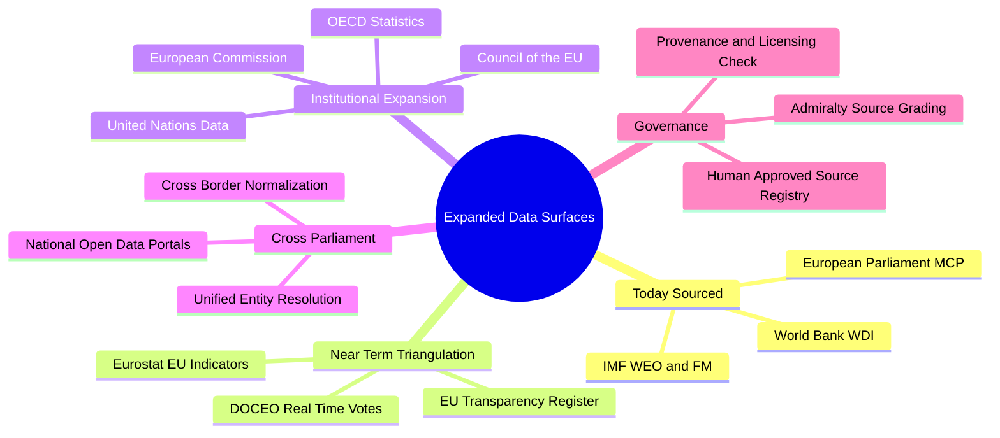
```mermaid
mindmap
  root((Expanded Data Surfaces))
    Today Sourced
      European Parliament MCP
      World Bank WDI
      IMF WEO and FM
    Near Term Triangulation
      Eurostat EU Indicators
      DOCEO Real Time Votes
      EU Transparency Register
    Institutional Expansion
      Council of the EU
      European Commission
      OECD Statistics
      United Nations Data
    Cross Parliament
      National Open Data Portals
      Unified Entity Resolution
      Cross Border Normalization
    Governance
      Human Approved Source Registry
      Admiralty Source Grading
      Provenance and Licensing Check
```

---

## 🧩 SWOT-to-Future Traceability — Every Weakness Mitigated, Every Opportunity Captured

This is the traceability backbone requested in the v5.0 review: a one-to-one map
from each current-state [SWOT.md](SWOT.md) **weakness** and **opportunity** to the
future-state capability, horizon, and section that resolves or captures it. Items
already marked *Resolved* in SWOT.md (e.g. **W15**) are noted for completeness.

### Weakness → Future-State Resolution (W1–W19)

| Weakness (SWOT.md) | Future-State Resolution | Horizon | Where Addressed |
| ------------------ | ----------------------- | ------- | --------------- |
| **W1** MCP server dev dependency | Hack23-owned EP MCP hardened + redundant cross-parliament surfaces | v3.1 | Expanded Data Surfaces; Multi-Parliament |
| **W2** Limited runtime analytics | Serverless backend (DynamoDB, OpenSearch) + live AppSync dashboards | v3.0 | v3.0 Serverless Foundation |
| **W3** Manual content quality assessment | Always-on verification agents + Guardrails | v2.0→v3.0 | Future AI Agent Capabilities |
| **W4** Single-threaded LLM dependency | Model-agnostic Bedrock + multi-agent fleet | v3.0 | Multi-Agent OSINT Newsroom |
| **W5** Limited community engagement | Contributor program, API tiers, civic-tech partnerships | v2.0+ | Partnership; Distribution |
| **W6** Manual optimization and tuning | Self-healing / auto-tuning serverless ops agents | v3.2 | Agentic Capability Unlock |
| **W7** Sole LLM-provider dependency | Bedrock multi-model abstraction + competitor eval | v3.0 | Technology Stack Evolution |
| **W8** EP MCP single technical source | Council/OECD/Eurostat/UN + cross-parliament redundancy | v3.1 | Expanded Data Surfaces |
| **W9** IMF+WB indicator curation burden | Self-curating data-surface agents propose mappings | v3.1 | Agentic Capability Unlock |
| **W10** gh-aw pin fragility | Self-healing auto-bump + recompile + smoke test | v3.2 | Agentic Capability Unlock |
| **W11** Minimal engagement surface (by design) | Opt-in dynamic layer (search, NL query) behind static edge | v3.0/v3.1 | Feature Roadmap; Distribution |
| **W12** Bus factor 1–2 | Community growth + CRA Art. 24 reference + documented methodology | v2.0+ | Partnership; Distribution |
| **W13** Monolingual source-of-truth | Translation-parity / back-translation agents + spot-checks | v3.0 | Future AI Agent Capabilities |
| **W14** EP fixed-window feed limits | v3 real-time EventBridge/Kinesis ingestion | v3.0 | Data Flow Mindmap |
| **W15** EP MCP tool-list export (Resolved) | Already exported + drift-guarded | ✅ now | n/a |
| **W16** EP MCP skeleton coverage | Real-time DOCEO + serverless re-indexing | v3.0 | Data Flow; Expanded Data Surfaces |
| **W17** IMF probe degradation | Eurostat triangulation surface (additive) | v3.0 | Expanded Data Surfaces |
| **W18** Single-session 60-min timeout | Step Functions multi-agent parallelism | v3.0 | Multi-Agent OSINT Newsroom |
| **W19** MCP gateway keepalive | Serverless ingestion removes gateway dependency | v3.0 | Multi-Agent OSINT Newsroom |

### Opportunity → Future-State Capture (O1–O17)

| Opportunity (SWOT.md) | Future-State Capture | Horizon | Where Addressed |
| --------------------- | -------------------- | ------- | --------------- |
| **O1** AI / LLM advancement | Bedrock model-agnostic core + annual upgrades + agent fleet | v3.0→2037 | AI Evolution Path; Agent Capabilities |
| **O2** EU transparency / open data | Mandatory-transparency-API readiness + open methodology | v2.0+ | Competitive/Disruption Landscape |
| **O3** EP API expansion | Real-time ingestion + Neptune knowledge graph | v3.0/v3.1 | Data Flow; Expanded Data Surfaces |
| **O4** Academic / media partnerships | API tiers + syndication + research datasets | v3.1 | Partnership Mindmap |
| **O5** Open-source community growth | Contributor program + GitHub ecosystem | v2.0+ | Partnership; Distribution |
| **O6** Multi-channel distribution | RSS, newsletter, audio/podcast, PWA, API | v2.0/v3.0 | Multi-Channel Distribution |
| **O7** Expand MCP data surface | Council, OECD, Eurostat, UN onboarding | v3.1 | Expanded Data Surfaces |
| **O8** Cross-parliament coverage | National-parliament onboarding + entity resolution | v3.1 | Geographic Expansion |
| **O9** Federated distribution | ActivityPub / Mastodon syndication | v2.0 | Multi-Channel Distribution |
| **O10** PWA mobile experience | Installable offline PWA atop static site | v3.0 | Multi-Channel Distribution |
| **O11** Civic-tech partnership ecosystem | NGO joint advocacy + shared surfaces | v2.0+ | Partnership Mindmap |
| **O12** Academic research partnerships | Publishable analytics dataset | v3.1 | Partnership; Growth Metrics |
| **O13** CRA Article 24 reference impl. | Exemplar OSS-steward compliance posture | v2.0 | Security/Compliance; Distribution |
| **O14** Stage-C completeness roll-out | Verification agents enforce thresholds platform-wide | v2.0→v3.0 | Future AI Agent Capabilities |
| **O15** Deeper long-horizon intelligence | term-outlook + predictive analytics | v3.0→2031 | Intelligence Capabilities; Agent Capabilities |
| **O16** IMF + Eurostat triangulation | Eurostat added as triangulation surface | v3.0 | Expanded Data Surfaces |
| **O17** Real-time DOCEO vote integration | Live vote tracking + coalition-drift alerts | v3.0/v3.1 | Data Flow; Multi-Agent Newsroom |

> **Coverage verdict:** all 19 weaknesses and all 17 opportunities in
> [SWOT.md](SWOT.md) now map to an explicit future-state capability and horizon.
> Aspirational items (⚪) are marked honestly and remain bound by the AI Policy
> human-accountability invariant — they are directions of travel, not commitments
> to autonomy.

---

## 📚 References

### Current State

- [Current Mindmap](MINDMAP.md)
- [Current Architecture](ARCHITECTURE.md)
- [Current Data Model](DATA_MODEL.md)
- [Current SWOT](SWOT.md)

### Future State

- [Future Architecture](FUTURE_ARCHITECTURE.md)
- [Future Data Model](FUTURE_DATA_MODEL.md)
- [Future Flowcharts](FUTURE_FLOWCHART.md)
- [Future State Diagrams](FUTURE_STATEDIAGRAM.md)
- [Future SWOT](FUTURE_SWOT.md)
- [Future Security Architecture](FUTURE_SECURITY_ARCHITECTURE.md)
- [Future Threat Model](FUTURE_THREAT_MODEL.md)
- [Future Workflows](FUTURE_WORKFLOWS.md)

### ISMS and Governance

- [AI Policy](https://github.com/Hack23/ISMS-PUBLIC/blob/main/AI_Policy.md)
- [Information Security Policy](https://github.com/Hack23/ISMS-PUBLIC/blob/main/Information_Security_Policy.md)
- [Secure Development Policy](https://github.com/Hack23/ISMS-PUBLIC/blob/main/Secure_Development_Policy.md)

---

## ✅ Approval

| Role | Name | Decision | Date |
| ---- | ---- | -------- | ---- |
| **Document Owner** | CEO, Hack23 AB | ✅ Approved for Planning | 2026-05-31 |
| **Next Review** | CEO, Hack23 AB | ⏳ Scheduled | 2026-08-31 |

**Document Status**: ✅ **APPROVED FOR PLANNING**  
**Document Version**: 5.0 — adds Future AI Agent Capabilities, Multi-Channel
Distribution and Expanded Data Surfaces, and full SWOT-to-Future traceability
(every W1–W19 and O1–O17 mapped to a future-state resolution).  
**Next Review**: 2026-08-31 (Quarterly)  
**Classification**: Public (Open Source European Parliament Monitoring Platform)
