```mermaid
flowchart TD
    subgraph "Threat Detection Architecture"
        A[🔍 CodeQL] -->|"SAST Scan"| B[🚨 Code Vulnerabilities]
        C[🤖 Dependabot] -->|"Dependency Scan"| D[🚨 Library Vulnerabilities]
        E[🛡️ Secret Scanning] -->|"Credential Detection"| F[🚨 Exposed Secrets]

        G[🔄 Uptime Monitor] -->|"Availability"| H[📊 Anomaly Detection]
        I[🌐 CDN Analytics] -.->|"Future"| H

        B --> J[📧 Alert & Notify]
        D --> J
        F --> J
        H --> J

        J --> K[🐛 GitHub Issue]
        J --> L[👨‍💻 Security Team]
        J --> M[📊 Security Dashboard]

        N[🕵️ Incident Investigation] --> O[📋 Audit Trail]
        N --> P[🔍 Git History]
        N --> Q[📊 Metrics Analysis]
    end

    style A,C,E fill:#FF6F00,stroke:#E65100,stroke-width:2px,color:white,font-weight:bold
    style B,D,F fill:#d32f2f,stroke:#b71c1c,stroke-width:2px,color:white,font-weight:bold
    style G,H,I fill:#00C853,stroke:#007E33,stroke-width:2px,color:white,font-weight:bold
    style J,K,L,M fill:#00BCD4,stroke:#00838F,stroke-width:2px,color:white,font-weight:bold
    style N,O,P,Q fill:#9C27B0,stroke:#6A1B9A,stroke-width:2px,color:white,font-weight:bold
```

<p align="center">
  
</p>

<h1 align="center">🚀 EU Parliament Monitor — Future Security Architecture</h1>

<p align="center">
  <strong>Planned Security Enhancements for European Parliament Intelligence</strong><br>
  <em>🔮 Security Roadmap • 🛡️ Enhanced Controls • 🔐 Advanced Protection</em>
</p>

<p align="center">
  <a href="#"></a>
  <a href="#"></a>
  <a href="#"></a>
  <a href="#"></a>
</p>

**📋 Document Owner:** CEO | **📄 Version:** 1.1 | **📅 Last Updated:**
2026-02-25 (UTC)  
**🔄 Review Cycle:** Quarterly | **⏰ Next Review:** 2026-05-25  
**🏷️ Classification:** Public (Open Source European Parliament Monitoring
Platform)

---

## 📚 Architecture Documentation Map

<div class="documentation-map">

| Document                                                            | Focus           | Description                                    | Documentation Link                                                                                     |
| ------------------------------------------------------------------- | --------------- | ---------------------------------------------- | ------------------------------------------------------------------------------------------------------ |
| **[Architecture](ARCHITECTURE.md)**                                 | 🏛️ Architecture | C4 model showing current system structure      | [View Source](https://github.com/Hack23/euparliamentmonitor/blob/main/ARCHITECTURE.md)                 |
| **[Future Architecture](FUTURE_ARCHITECTURE.md)**                   | 🏛️ Architecture | C4 model showing future system structure       | [View Source](https://github.com/Hack23/euparliamentmonitor/blob/main/FUTURE_ARCHITECTURE.md)          |
| **[Mindmaps](MINDMAP.md)**                                          | 🧠 Concept      | Current system component relationships         | [View Source](https://github.com/Hack23/euparliamentmonitor/blob/main/MINDMAP.md)                      |
| **[Future Mindmaps](FUTURE_MINDMAP.md)**                            | 🧠 Concept      | Future capability evolution                    | [View Source](https://github.com/Hack23/euparliamentmonitor/blob/main/FUTURE_MINDMAP.md)               |
| **[SWOT Analysis](SWOT.md)**                                        | 💼 Business     | Current strategic assessment                   | [View Source](https://github.com/Hack23/euparliamentmonitor/blob/main/SWOT.md)                         |
| **[Future SWOT Analysis](FUTURE_SWOT.md)**                          | 💼 Business     | Future strategic opportunities                 | [View Source](https://github.com/Hack23/euparliamentmonitor/blob/main/FUTURE_SWOT.md)                  |
| **[Data Model](DATA_MODEL.md)**                                     | 📊 Data         | Current data structures and relationships      | [View Source](https://github.com/Hack23/euparliamentmonitor/blob/main/DATA_MODEL.md)                   |
| **[Future Data Model](FUTURE_DATA_MODEL.md)**                       | 📊 Data         | Enhanced European Parliament data architecture | [View Source](https://github.com/Hack23/euparliamentmonitor/blob/main/FUTURE_DATA_MODEL.md)            |
| **[Flowcharts](FLOWCHART.md)**                                      | 🔄 Process      | Current data processing workflows              | [View Source](https://github.com/Hack23/euparliamentmonitor/blob/main/FLOWCHART.md)                    |
| **[Future Flowcharts](FUTURE_FLOWCHART.md)**                        | 🔄 Process      | Enhanced AI-driven workflows                   | [View Source](https://github.com/Hack23/euparliamentmonitor/blob/main/FUTURE_FLOWCHART.md)             |
| **[State Diagrams](STATEDIAGRAM.md)**                               | 🔄 Behavior     | Current system state transitions               | [View Source](https://github.com/Hack23/euparliamentmonitor/blob/main/STATEDIAGRAM.md)                 |
| **[Future State Diagrams](FUTURE_STATEDIAGRAM.md)**                 | 🔄 Behavior     | Enhanced adaptive state transitions            | [View Source](https://github.com/Hack23/euparliamentmonitor/blob/main/FUTURE_STATEDIAGRAM.md)          |
| **[Security Architecture](SECURITY_ARCHITECTURE.md)**               | 🛡️ Security     | Current security implementation                | [View Source](https://github.com/Hack23/euparliamentmonitor/blob/main/SECURITY_ARCHITECTURE.md)        |
| **[Future Security Architecture](FUTURE_SECURITY_ARCHITECTURE.md)** | 🛡️ Security     | Security enhancement roadmap                   | [View Source](https://github.com/Hack23/euparliamentmonitor/blob/main/FUTURE_SECURITY_ARCHITECTURE.md) |
| **[Threat Model](THREAT_MODEL.md)**                                 | 🎯 Security     | STRIDE threat analysis                         | [View Source](https://github.com/Hack23/euparliamentmonitor/blob/main/THREAT_MODEL.md)                 |
| **[Classification](CLASSIFICATION.md)**                             | 🏷️ Governance   | CIA classification & BCP                       | [View Source](https://github.com/Hack23/euparliamentmonitor/blob/main/CLASSIFICATION.md)               |
| **[CRA Assessment](CRA-ASSESSMENT.md)**                             | 🛡️ Compliance   | Cyber Resilience Act                           | [View Source](https://github.com/Hack23/euparliamentmonitor/blob/main/CRA-ASSESSMENT.md)               |
| **[Workflows](WORKFLOWS.md)**                                       | ⚙️ DevOps       | CI/CD documentation                            | [View Source](https://github.com/Hack23/euparliamentmonitor/blob/main/WORKFLOWS.md)                    |
| **[Future Workflows](FUTURE_WORKFLOWS.md)**                         | 🚀 DevOps       | Planned CI/CD enhancements                     | [View Source](https://github.com/Hack23/euparliamentmonitor/blob/main/FUTURE_WORKFLOWS.md)             |
| **[Business Continuity Plan](BCPPlan.md)**                          | 🔄 Resilience   | Recovery planning                              | [View Source](https://github.com/Hack23/euparliamentmonitor/blob/main/BCPPlan.md)                      |
| **[Financial Security Plan](FinancialSecurityPlan.md)**             | 💰 Financial    | Cost & security analysis                       | [View Source](https://github.com/Hack23/euparliamentmonitor/blob/main/FinancialSecurityPlan.md)        |
| **[End-of-Life Strategy](End-of-Life-Strategy.md)**                 | 📦 Lifecycle    | Technology EOL planning                        | [View Source](https://github.com/Hack23/euparliamentmonitor/blob/main/End-of-Life-Strategy.md)         |
| **[Unit Test Plan](UnitTestPlan.md)**                               | 🧪 Testing      | Unit testing strategy                          | [View Source](https://github.com/Hack23/euparliamentmonitor/blob/main/UnitTestPlan.md)                 |
| **[E2E Test Plan](E2ETestPlan.md)**                                 | 🔍 Testing      | End-to-end testing                             | [View Source](https://github.com/Hack23/euparliamentmonitor/blob/main/E2ETestPlan.md)                  |
| **[Performance Testing](performance-testing.md)**                   | ⚡ Performance  | Performance benchmarks                         | [View Source](https://github.com/Hack23/euparliamentmonitor/blob/main/performance-testing.md)          |
| **[Security Policy](SECURITY.md)**                                  | 🔒 Security     | Vulnerability reporting & security policy      | [View Source](https://github.com/Hack23/euparliamentmonitor/blob/main/SECURITY.md)                     |

</div>

---

## 🔐 ISMS Policy Alignment

This future security architecture is designed to implement all controls from
Hack23 AB's ISMS framework as the EU Parliament Monitor platform evolves from
static site to enhanced security capabilities. For complete policy mapping, see
[SECURITY_ARCHITECTURE.md](SECURITY_ARCHITECTURE.md).

### Related ISMS Policies

| **Policy Domain**          | **Policy**                                                                                                    | **Planned Implementation**                                    |
| -------------------------- | ------------------------------------------------------------------------------------------------------------- | ------------------------------------------------------------- |
| **🔐 Core Security**       | [Information Security Policy](https://github.com/Hack23/ISMS-PUBLIC/blob/main/Information_Security_Policy.md) | Overall security governance framework for enhanced monitoring |
| **🛠️ Development**         | [Secure Development Policy](https://github.com/Hack23/ISMS-PUBLIC/blob/main/Secure_Development_Policy.md)     | Security-integrated development lifecycle enhancements        |
| **🌐 Network**             | [Network Security Policy](https://github.com/Hack23/ISMS-PUBLIC/blob/main/Network_Security_Policy.md)         | CDN architecture, WAF, DDoS protection                        |
| **🔒 Cryptography**        | [Cryptography Policy](https://github.com/Hack23/ISMS-PUBLIC/blob/main/Cryptography_Policy.md)                 | Content signing, TLS 1.3, integrity verification              |
| **🔑 Access Control**      | [Access Control Policy](https://github.com/Hack23/ISMS-PUBLIC/blob/main/Access_Control_Policy.md)             | MCP authentication, request authorization                     |
| **🏷️ Data Classification** | [Data Classification Policy](https://github.com/Hack23/ISMS-PUBLIC/blob/main/Data_Classification_Policy.md)   | European Parliament data classification                       |
| **🔍 Vulnerability**       | [Vulnerability Management](https://github.com/Hack23/ISMS-PUBLIC/blob/main/Vulnerability_Management.md)       | Enhanced automated scanning and monitoring                    |
| **🚨 Incident Response**   | [Incident Response Plan](https://github.com/Hack23/ISMS-PUBLIC/blob/main/Incident_Response_Plan.md)           | Automated incident detection and response                     |
| **💾 Backup & Recovery**   | [Backup Recovery Policy](https://github.com/Hack23/ISMS-PUBLIC/blob/main/Backup_Recovery_Policy.md)           | Content backup, version control, recovery                     |
| **🔄 Business Continuity** | [Business Continuity Plan](https://github.com/Hack23/ISMS-PUBLIC/blob/main/Business_Continuity_Plan.md)       | Multi-CDN deployment, disaster recovery                       |
| **🤝 Third-Party**         | [Third Party Management](https://github.com/Hack23/ISMS-PUBLIC/blob/main/Third_Party_Management.md)           | CDN provider security assessment                              |
| **🏷️ Classification**      | [Classification Framework](https://github.com/Hack23/ISMS-PUBLIC/blob/main/CLASSIFICATION.md)                 | Business impact analysis for platform                         |

### Security Control Implementation Roadmap

| **ISMS Control Domain**         | **Current Status**    | **Future Implementation**                        | **Timeline**      |
| ------------------------------- | --------------------- | ------------------------------------------------ | ----------------- |
| **🔑 Access Control**           | ⚠️ Limited            | ✅ MCP authentication + request signing          | Phase 3 (Q4 2026) |
| **🔒 Cryptography**             | ✅ HTTPS only         | ✅ Enhanced (content signing, checksums)         | Phase 2 (Q3 2026) |
| **🌐 Network Security**         | ✅ GitHub Pages       | ✅ Enhanced (CDN, WAF, DDoS protection)          | Phase 4 (Q1 2027) |
| **🛠️ Secure Development**       | ✅ Implemented        | ✅ Extended (enhanced CI/CD security)            | Phase 1 (Q2 2026) |
| **🔍 Vulnerability Management** | ✅ CodeQL, Dependabot | ✅ Enhanced (real-time monitoring)               | Phase 1 (Q2 2026) |
| **📊 Monitoring & Logging**     | ⚠️ Limited            | ✅ Full (uptime, performance, security)          | Phase 1 (Q2 2026) |
| **💾 Data Protection**          | ✅ Git versioning     | ✅ Enhanced (signatures, checksums, audit trail) | Phase 2 (Q3 2026) |
| **🚨 Incident Response**        | ✅ Documented         | ✅ Automated detection and alerting              | Phase 1 (Q2 2026) |

---

## 📋 Executive Summary

This document outlines the planned security architecture enhancements for EU
Parliament Monitor over the near-term (Q2 2026 - Q1 2027) and extends into a
**visionary 10-year security roadmap (2027-2037)**. The near-term roadmap
focuses on **proactive security**, **automated verification**, and
**resilience** while maintaining the platform's core principles of simplicity
and transparency. The long-term vision addresses the security implications of
evolving AI capabilities — including Anthropic Opus 4.6 (minor updates every
~2.3 months, major version upgrades annually) — and potential AGI emergence.

## 🎯 Strategic Security Goals

1. **Enhanced Monitoring** (Q2 2026): Real-time visibility into system health
   and security events
2. **Content Verification** (Q3 2026): Cryptographic integrity verification for
   generated content
3. **Advanced MCP Security** (Q4 2026): Authenticated and encrypted MCP
   communication
4. **CDN Integration** (Q1 2027): Global distribution with advanced protection

---

## 📊 Current Security Posture Baseline (Q1 2026)

Before detailing the future security roadmap, this section documents the **verified current security posture** as the baseline for all planned enhancements. This baseline was validated against the current SECURITY_ARCHITECTURE.md v1.1 (2026-02-25).

### Baseline Control Coverage

| Framework | Controls Implemented | Total Applicable | Coverage | Trend |
|-----------|---------------------|------------------|----------|-------|
| **ISO 27001:2022 Annex A** | 25 | 25 | 100% | ✅ Stable |
| **NIST CSF 2.0** | 36 subcategories | 36 targeted | 100% | ✅ Stable |
| **CIS Controls v8.1** | 19 safeguards | 23 targeted | 83% | ✅ Improving |
| **MITRE ATT&CK** | 18 techniques mapped | 793 total | 2.3% | 🔄 Improving |
| **EU CRA** | All self-assessment requirements | - | Self-assessed ✅ | ✅ Compliant |
| **GDPR** | All applicable articles | - | N/A (no PII) | ✅ Compliant |
| **NIS2** | 7/8 requirements | 8 | 87.5% | 🔄 Improving |

### Current Security Stack

| Category | Tool/Control | Status | Next Enhancement |
|----------|-------------|--------|-----------------|
| SAST | CodeQL (weekly) | ✅ Implemented | SonarCloud Q2 2026 |
| SCA | Dependabot + npm audit | ✅ Implemented | FOSSA license scan Q2 2026 |
| Supply Chain | SHA-pinned actions + SBOM | ✅ Implemented | SLSA Level 3 attestations |
| Access Control | MFA + branch protection + CODEOWNERS | ✅ Implemented | Required reviews enhancement |
| Monitoring | GitHub Actions logs + Dependabot alerts | ✅ Implemented | Uptime monitoring Q2 2026 |
| DAST | Not yet implemented | ⚠️ Gap | OWASP ZAP Q3 2026 |
| Incident Response | SECURITY.md procedures | ✅ Implemented | CSIRT reporting 2026-09 |
| Cryptography | TLS 1.3 + HTTPS-only | ✅ Implemented | Certificate transparency |

### Security Debt Register

| Item | Priority | Target Resolution | Phase |
|------|----------|------------------|-------|
| DAST implementation | Medium | Q3 2026 | Phase 2 |
| NIS2 CSIRT automated reporting | Medium | Q3 2026 (before Sep 2026 CRA deadline) | Phase 3 |
| OpenSSF Best Practices badge | Low | Q2 2026 | Phase 1 |
| FOSSA license compliance | Low | Q2 2026 | Phase 1 |
| Content integrity monitoring | Low | Q3 2026 | Phase 2 |

---

## 📅 Implementation Roadmap


---

## 🔍 Phase 1: Enhanced Monitoring (Q2 2026)

**Goal**: Implement comprehensive monitoring for proactive security and
performance management.

### Phase 1 Controls Alignment (Q1-Q2 2026)

| Enhancement | ISO 27001:2022 | NIST CSF 2.0 | CIS Control | Priority |
|-------------|----------------|--------------|-------------|----------|
| SonarCloud integration | A.8.25 (Secure dev lifecycle) | ID.RA-01, DE.CM-01 | 16.1 | High |
| OpenSSF Scorecard badge | A.5.36 (Compliance) | GV.RM-01 | 16.2 | Medium |
| FOSSA license scanning | A.5.12 (Information classification) | GV.SC-06 | 2.1 | Low |
| Uptime monitoring | A.8.16 (Monitoring activities) | DE.CM-09 | 8.2 | Medium |
| Content freshness alerts | A.8.15 (Logging) | DE.AE-02 | 8.5 | Low |

### 1.1 Uptime Monitoring

**Implementation**: Pingdom or StatusCake integration

```yaml
# .github/workflows/uptime-check.yml
name: Uptime Monitoring

on:
  schedule:
    - cron: '*/5 * * * *' # Every 5 minutes
  workflow_dispatch:

jobs:
  uptime-check:
    runs-on: ubuntu-latest
    steps:
      - name: Check Website Availability
        run: |
          response=$(curl -s -o /dev/null -w "%{http_code}" https://euparliamentmonitor.com)
          if [ $response -ne 200 ]; then
            echo "::error::Website returned $response"
            exit 1
          fi

      - name: Validate Content Integrity
        run: |
          content=$(curl -s https://euparliamentmonitor.com/index.html)
          if ! echo "$content" | grep -q "EU Parliament Monitor"; then
            echo "::error::Content integrity check failed"
            exit 1
          fi
```

**Metrics Tracked:**

- HTTP response codes
- Response time (latency)
- Content availability
- SSL certificate validity
- DNS resolution time

**Alerting:**

- Slack/Discord notifications on downtime
- Email alerts for SSL expiry (30 days before)
- GitHub Issues auto-created for incidents

### 1.2 Error Tracking & Alerting

**Implementation**: Sentry integration for client-side error tracking

```html
<!-- Add to article-template.js -->
<script
  src="https://browser.sentry-cdn.com/7.x.x/bundle.min.js"
  integrity="sha384-..."
  crossorigin="anonymous"
></script>
<script>
  Sentry.init({
    dsn: 'https://...@sentry.io/...',
    environment: 'production',
    sampleRate: 0.1, // 10% sampling for performance
    beforeSend(event) {
      // Filter out PII, only track errors
      return event;
    },
  });
</script>
```

**Error Categories:**

- JavaScript errors (if any future JS added)
- Resource loading failures
- CSP violations
- Browser compatibility issues

### 1.3 Performance Metrics Collection

**Implementation**: Lighthouse CI integration

```yaml
# .github/workflows/lighthouse.yml
name: Lighthouse CI

on:
  push:
    branches: [main]
  pull_request:

jobs:
  lighthouse:
    runs-on: ubuntu-latest
    steps:
      - uses: actions/checkout@v4
      - name: Run Lighthouse CI
        uses: treosh/lighthouse-ci-action@v10
        with:
          urls: |
            https://euparliamentmonitor.com
            https://euparliamentmonitor.com/index.html
          uploadArtifacts: true
          temporaryPublicStorage: true
```

**Metrics:**

- Performance score (target: > 90)
- Accessibility score (target: 100)
- Best Practices score (target: 100)
- SEO score (target: 100)

### 1.4 Security Metrics Dashboard

**Implementation**: Custom GitHub Pages dashboard

```javascript
// scripts/generate-security-dashboard.js
export function generateSecurityDashboard() {
  const metrics = {
    vulnerabilities: fetchDependabotAlerts(),
    codeQlFindings: fetchCodeQLFindings(),
    testCoverage: parseVitestCoverage(),
    uptime: fetchUptimeMetrics(),
    deployments: fetchGitHubActions(),
  };

  return generateHTMLDashboard(metrics);
}
```

**Dashboard Components:**

- Vulnerability count (target: 0)
- Test coverage trend
- Deployment success rate
- Uptime percentage (30-day rolling)
- CodeQL findings by severity

---

## 🔐 Phase 2: Content Verification (Q3 2026)

**Goal**: Implement cryptographic verification to ensure content integrity and
authenticity.

### 2.1 Digital Signatures for Articles

**Implementation**: GPG signing of generated articles

```javascript
// scripts/sign-articles.js
import { execSync } from 'child_process';
import { readFileSync, writeFileSync } from 'fs';

export function signArticle(articlePath) {
  const content = readFileSync(articlePath, 'utf-8');
  const signature = execSync('gpg --clearsign --armor', {
    input: content,
    encoding: 'utf-8',
  });

  // Embed signature in HTML meta tag
  const signedContent = content.replace(
    '</head>',
    `  <meta name="signature" content="${signature}">\n</head>`
  );

  writeFileSync(articlePath, signedContent);
}
```

**Signature Verification:**

- Public key published in repository
- Verification instructions in footer
- Automated verification tool

```bash
# Verify article signature
curl https://euparliamentmonitor.com/news/2026-week-ahead-en.html \
  | grep 'meta name="signature"' \
  | cut -d'"' -f4 \
  | gpg --verify
```

### 2.2 Cryptographic Integrity Verification

**Implementation**: SHA-256 checksums for content integrity

```javascript
// scripts/generate-checksums.js
import { createHash } from 'crypto';
import { readdirSync, readFileSync, writeFileSync } from 'fs';

export function generateChecksums(directory) {
  const checksums = {};

  const files = readdirSync(directory, { recursive: true });
  for (const file of files) {
    if (file.endsWith('.html')) {
      const content = readFileSync(`${directory}/${file}`, 'utf-8');
      const hash = createHash('sha256').update(content).digest('hex');
      checksums[file] = hash;
    }
  }

  writeFileSync(
    `${directory}/checksums.json`,
    JSON.stringify(checksums, null, 2)
  );
}
```

**Checksum Verification:**

```json
// news/checksums.json
{
  "2026-week-ahead-en.html": "abc123...",
  "2026-week-ahead-de.html": "def456...",
  "metadata/2026-week-ahead.json": "789ghi..."
}
```

### 2.3 Audit Trail Enhancement

**Implementation**: Immutable audit log with content provenance

```javascript
// scripts/audit-trail.js
export function recordGeneration(article, metadata) {
  const auditEntry = {
    timestamp: new Date().toISOString(),
    article_id: article.slug,
    type: article.type,
    language: article.lang,
    mcp_version: metadata.mcpVersion,
    generator_version: metadata.generatorVersion,
    source_data_hash: metadata.sourceDataHash,
    commit_sha: process.env.GITHUB_SHA,
    workflow_run: process.env.GITHUB_RUN_ID,
  };

  // Append to audit log (Git-tracked)
  appendAuditLog('news/audit-trail.jsonl', auditEntry);
}
```

**Audit Trail Query:**

```bash
# Find all articles generated from specific EP data
jq -r 'select(.source_data_hash == "abc123") | .article_id' \
  news/audit-trail.jsonl
```

### 2.4 Source Attribution Verification

**Implementation**: Embed European Parliament data references

```html
<!-- Article footer -->
<div class="source-attribution">
  <h3>Data Sources</h3>
  <ul>
    <li>
      <strong>Plenary Session:</strong>
      <a href="https://data.europarl.europa.eu/sessions/2026-03-01">
        2026-03-01 Plenary Session
      </a>
      <span class="data-hash">SHA-256: abc123...</span>
    </li>
    <li>
      <strong>Committee Meeting:</strong>
      <a href="https://data.europarl.europa.eu/committees/LIBE/2026-02-25">
        LIBE Committee 2026-02-25
      </a>
      <span class="data-hash">SHA-256: def456...</span>
    </li>
  </ul>
  <p>
    <small>
      Generated: 2026-03-01T06:15:32Z | MCP Version: 1.2.3 | Commit:
      <a href="https://github.com/Hack23/euparliamentmonitor/commit/..."
        >abc123d</a
      >
    </small>
  </p>
</div>
```

---

## 🔑 Authentication Architecture

**Status**: 🔮 Planned Enhancement - MCP Communication Security

```mermaid
flowchart TD
    subgraph "Future MCP Authentication Architecture"
        A[📅 GitHub Actions<br/>Daily Cron] -->|"Build-time Only"| B[🔐 EP MCP Client]
        B -->|"Authenticated Request"| C[🌐 European Parliament<br/>MCP Server]

        D[🔑 Request Signing<br/>HMAC-SHA256] --> B
        E[⏰ Timestamp Validation<br/>5-min window] --> B
        F[🔄 Nonce Generation<br/>Replay Protection] --> B

        C -->|"Validated Response"| G[📊 MEP Data]
        G --> H[📰 News Generation]
        H --> I[🌐 Static HTML<br/>GitHub Pages]

        J[👤 Citizens] -->|"HTTPS"| I
        J -.->|"No Authentication<br/>Public Access"| I
    end

    style A fill:#003399,stroke:#FFCC00,stroke-width:2px,color:white,font-weight:bold
    style B,D,E,F fill:#FF6F00,stroke:#E65100,stroke-width:2px,color:white,font-weight:bold
    style C,G fill:#00C853,stroke:#007E33,stroke-width:2px,color:white,font-weight:bold
    style H,I fill:#2979FF,stroke:#0D47A1,stroke-width:2px,color:white,font-weight:bold
    style J fill:#9C27B0,stroke:#6A1B9A,stroke-width:2px,color:white,font-weight:bold
```



### Implementation Strategy

EU Parliament Monitor implements authentication for build-time MCP communication
only. End-user access remains authentication-free as the platform serves
publicly accessible political intelligence.

#### 🔐 MCP Authentication (Phase 3)

**Build-Time Authentication:**

- **✅ HMAC Request Signing**: All MCP requests signed with HMAC-SHA256
- **✅ Timestamp Validation**: 5-minute request freshness window
- **✅ Nonce Protection**: Replay attack prevention
- **✅ GitHub Secrets**: Secure storage of MCP authentication credentials

**Implementation:**

```javascript
// scripts/mcp-auth.js
import { createHmac } from 'crypto';

export function authenticateMCPRequest(request, secret) {
  const timestamp = Date.now();
  const nonce = crypto.randomBytes(16).toString('hex');

  const payload = JSON.stringify({
    method: request.method,
    params: request.params,
    timestamp,
    nonce,
  });

  const signature = createHmac('sha256', secret).update(payload).digest('hex');

  return {
    ...request,
    auth: {
      timestamp,
      nonce,
      signature,
      version: '1.0',
    },
  };
}
```

#### 🌐 Public Access (No Authentication)

**Static Site Architecture:**

- **✅ No User Authentication**: Citizens access content without login
- **✅ HTTPS-Only**: Encryption in transit via GitHub Pages
- **✅ No Personal Data**: Zero PII collection, GDPR-compliant by design
- **✅ Open Access**: Transparency through unrestricted access to EU political
  intelligence

**Security Implications:**

- Content generated at build-time with authenticated MCP access
- Published content is public and requires no authentication
- No session management or user tracking
- Privacy-first architecture with no authentication cookies

### Future Authentication Enhancements

#### Phase 3 (Q4 2026): MCP Authentication

- Mutual TLS for MCP communication
- Client certificate authentication
- Automated certificate rotation

#### Phase 4 (Q1 2027): CDN Security

- CloudFlare challenge pages for bot protection
- Rate limiting per IP address
- Geographic access analysis (metrics only, no blocking)

---

## 📜 Data Integrity & Auditing

**Status**: 🔮 Planned Enhancement - Content Verification & Provenance Tracking

```mermaid
flowchart TD
    subgraph "Content Integrity & Audit Architecture"
        A[📰 Generated Article] -->|"SHA-256"| B[🔐 Content Checksum]
        A -->|"GPG Signing"| C[🔑 Digital Signature]
        A -->|"Metadata"| D[📋 Audit Trail]

        E[🌐 EP MCP Data] -->|"Data Hash"| F[🗂️ Source Attribution]
        F --> D

        G[⚙️ GitHub Actions] -->|"Build Metadata"| D
        G -->|"Commit SHA"| D
        G -->|"Workflow ID"| D

        D -->|"JSONL Log"| H[📂 news/audit-trail.jsonl]
        B -->|"Checksums"| I[📂 news/checksums.json]
        C -->|"Signature Meta"| J[📄 HTML Meta Tag]

        K[👤 Citizens] -->|"Verify"| B
        K -->|"Verify"| C
        K -->|"Query"| H
    end

    style A fill:#003399,stroke:#FFCC00,stroke-width:2px,color:white,font-weight:bold
    style B,C,D fill:#FF6F00,stroke:#E65100,stroke-width:2px,color:white,font-weight:bold
    style E,F fill:#00C853,stroke:#007E33,stroke-width:2px,color:white,font-weight:bold
    style G,H,I,J fill:#2979FF,stroke:#0D47A1,stroke-width:2px,color:white,font-weight:bold
    style K fill:#9C27B0,stroke:#6A1B9A,stroke-width:2px,color:white,font-weight:bold
```



### Implementation Strategy

#### 📝 Immutable Audit Trail (Phase 2)

**Comprehensive Audit Logging:**

- **✅ Generation Events**: All article generation events logged with complete
  metadata
- **✅ Source Data Tracking**: European Parliament API data hashes for
  provenance
- **✅ Build Metadata**: GitHub Actions workflow IDs, commit SHAs, timestamps
- **✅ Git-Tracked Logs**: Audit trail versioned in Git for immutability

**Audit Trail Schema:**

```javascript
// Audit trail entry format
{
  "timestamp": "2026-07-15T06:00:00Z",
  "article_id": "2026-week-28-plenary",
  "type": "plenary-preview",
  "languages": ["en", "de", "fr", "es", "it", "nl", "sv", "da", "fi", "pl", "ro", "hu", "pt", "el"],
  "mcp_version": "1.2.3",
  "generator_version": "2.0.0",
  "source_data": {
    "plenary_session": {
      "id": "PS-2026-07-14",
      "hash": "sha256:abc123..."
    },
    "committee_meetings": [
      { "committee": "ENVI", "date": "2026-07-10", "hash": "sha256:def456..." },
      { "committee": "LIBE", "date": "2026-07-11", "hash": "sha256:ghi789..." }
    ]
  },
  "commit_sha": "a1b2c3d4e5f6",
  "workflow_run": "1234567890",
  "build_duration_ms": 45230
}
```

#### 🔐 Content Verification (Phase 2)

**Multi-Layer Verification:**

- **✅ SHA-256 Checksums**: Content integrity verification for all HTML files
- **✅ GPG Signatures**: Cryptographic signatures for article authenticity
- **✅ Source Attribution**: Embedded European Parliament API references with
  data hashes
- **✅ Verification Tools**: Citizen-accessible verification utilities

**Checksum Verification:**

```bash
# Verify article integrity
curl -s https://euparliamentmonitor.com/news/2026-week-28-en.html | \
  sha256sum | \
  awk '{print $1}' | \
  jq -r --arg file "news/2026-week-28-en.html" \
    'select(.[$file] == input) | "✅ Verified"' \
    checksums.json
```

#### 🗂️ Data Lineage Tracking (Phase 2)

**Source Data Provenance:**

- **✅ EP API References**: Direct links to source European Parliament data
- **✅ Data Hashes**: SHA-256 hashes of source data for tamper detection
- **✅ Metadata Enrichment**: Complete attribution in article footers
- **✅ Query Tools**: Audit trail queries for transparency

**Query Examples:**

```bash
# Find all articles using specific EP data
jq -r 'select(.source_data.plenary_session.hash == "sha256:abc123") | .article_id' \
  news/audit-trail.jsonl

# Track article generation history
jq -r 'select(.article_id == "2026-week-28-plenary")' \
  news/audit-trail.jsonl | jq -s 'sort_by(.timestamp)'
```

### Audit Data Protection

**Security Measures:**

- **✅ Git Immutability**: Audit logs tracked in Git with complete history
- **✅ Append-Only**: JSONL format prevents modification of historical entries
- **✅ Public Transparency**: Audit trail publicly accessible for verification
- **✅ Long-Term Retention**: Permanent retention in Git history

---

## 📊 Session & Action Tracking

**Status**: 🔮 Planned Enhancement - Privacy-Compliant Analytics

```mermaid
flowchart TD
    subgraph "Privacy-First Analytics Architecture"
        A[👤 Citizen Visit] -->|"No Cookies"| B[🌐 GitHub Pages]
        B -->|"Server Logs"| C[📊 Access Metrics]

        D[🔍 CloudFlare<br/>Future Phase] -.->|"Privacy-Respecting"| E[📈 CDN Analytics]
        E -.->|"Aggregated Only"| F[📉 Performance Metrics]

        G[⚙️ Lighthouse CI] -->|"Build-time"| H[🎯 Core Web Vitals]
        I[🔄 Uptime Monitor] -->|"External"| J[⏱️ Availability Metrics]

        K[🚫 No Tracking] -.-> A
        L[🚫 No PII] -.-> C
        M[🚫 No Sessions] -.-> B
    end

    style A fill:#9C27B0,stroke:#6A1B9A,stroke-width:2px,color:white,font-weight:bold
    style B,C fill:#2979FF,stroke:#0D47A1,stroke-width:2px,color:white,font-weight:bold
    style D,E,F fill:#00BCD4,stroke:#00838F,stroke-width:2px,color:white,font-weight:bold
    style G,H,I,J fill:#00C853,stroke:#007E33,stroke-width:2px,color:white,font-weight:bold
    style K,L,M fill:#FF6F00,stroke:#E65100,stroke-width:2px,color:white,font-weight:bold
```



### Implementation Strategy

EU Parliament Monitor implements **zero-tracking** architecture with
privacy-respecting analytics.

#### 🚫 No User Tracking

**Privacy-First Design:**

- **✅ No Cookies**: Zero cookie usage, no consent banners required
- **✅ No JavaScript Tracking**: No analytics JavaScript on frontend
- **✅ No User Sessions**: Stateless architecture, no session management
- **✅ No Personal Data**: Zero PII collection, GDPR-compliant by design
- **✅ No Fingerprinting**: No browser fingerprinting or device tracking

#### 📊 Privacy-Compliant Metrics (Phase 1 & 4)

**Server-Side Analytics Only:**

- **✅ Server Logs**: GitHub Pages access logs (aggregated, no IP storage)
- **✅ CDN Analytics** (Phase 4): CloudFlare aggregated metrics (no IP logging)
- **✅ Build-Time Metrics**: Lighthouse CI performance scores
- **✅ Uptime Monitoring**: External availability checks (no user tracking)

**Metrics Collected:**

- Page view counts (aggregated, no user identification)
- Performance metrics (Core Web Vitals)
- Availability percentage (uptime monitoring)
- Language distribution (from URL paths, aggregated)
- Geographic distribution (CDN edge metrics, country-level only)

#### 🔐 Analytics Security

**Data Protection:**

- **✅ No Raw Logs**: IP addresses not stored or logged
- **✅ Aggregation Only**: All metrics aggregated before storage
- **✅ Time-Limited**: Metrics retained for 30 days maximum
- **✅ Public Dashboard**: Aggregated metrics publicly visible for transparency

#### 📈 Future Analytics Enhancements (Phase 4)

**CloudFlare Privacy-Respecting Analytics:**

- Country-level traffic distribution (no IP tracking)
- Bot detection and filtering (security only)
- Performance metrics by region
- Cache hit rates and CDN efficiency

**Transparency:**

- All metrics publicly documented
- No hidden tracking or analytics
- Open-source verification tools
- Public privacy policy

---

## 🔍 Security Event Monitoring

**Status**: 🔮 Planned Enhancement - Real-Time Security Visibility

```mermaid
flowchart TD
    subgraph "Security Event Monitoring Architecture"
        A[🔍 CodeQL SAST] -->|"Code Scan"| B[🚨 Security Alerts]
        C[🤖 Dependabot] -->|"Dependency Scan"| B
        D[🛡️ Secret Scanning] -->|"Secret Detection"| B

        E[🔄 Uptime Monitor] -->|"Availability"| F[📊 Health Metrics]
        G[⚡ Lighthouse CI] -->|"Performance"| F
        H[🌐 CDN Monitoring] -.->|"Future Phase"| F

        B -->|"Notify"| I[📧 Email Alerts]
        B -->|"Create"| J[🐛 GitHub Issues]
        F -->|"Dashboard"| K[📈 Metrics Page]

        L[🔒 WAF Events] -.->|"Future Phase"| M[🚨 Security Dashboard]
        N[🤖 Bot Detection] -.->|"Future Phase"| M
        O[⚠️ Threat Intelligence] -.->|"Future Phase"| M
    end

    style A,C,D fill:#FF6F00,stroke:#E65100,stroke-width:2px,color:white,font-weight:bold
    style B,I,J fill:#d32f2f,stroke:#b71c1c,stroke-width:2px,color:white,font-weight:bold
    style E,G,H,F,K fill:#00C853,stroke:#007E33,stroke-width:2px,color:white,font-weight:bold
    style L,N,O,M fill:#00BCD4,stroke:#00838F,stroke-width:2px,color:white,font-weight:bold
```



### Current Implementation

#### 🔒 Automated Security Scanning

**Static Application Security Testing (SAST):**

- **✅ CodeQL**: Weekly scans for security vulnerabilities in JavaScript/Node.js
  code
- **✅ Dependabot**: Daily dependency vulnerability scanning with automated PRs
- **✅ Secret Scanning**: GitHub secret scanning for exposed credentials
- **✅ Branch Protection**: Required security checks before merge

**Security Metrics:**

- Zero high/critical vulnerabilities policy
- 7-day SLA for high severity vulnerabilities
- Automated PR creation for security updates
- Security-focused code review requirements

#### 📊 Performance & Availability Monitoring (Phase 1)

**Uptime Monitoring:**

- **✅ External Monitoring**: Pingdom/StatusCake for availability checks
- **✅ Multi-Region**: Monitoring from multiple geographic locations
- **✅ Health Checks**: HTTP status, content integrity, SSL validity
- **✅ Alert Routing**: Slack/Discord/Email notifications

**Performance Monitoring:**

- **✅ Lighthouse CI**: Automated Core Web Vitals tracking
- **✅ Build-Time**: GitHub Actions build performance metrics
- **✅ Deployment Time**: End-to-end deployment duration tracking

### Future Enhancements

#### 🛡️ WAF Security Events (Phase 4)

**CloudFlare WAF Monitoring:**

- Attack pattern detection (SQL injection, XSS, etc.)
- DDoS mitigation events
- Bot traffic analysis
- Geographic threat intelligence

#### 🚨 Security Dashboard (Phase 1)

**Centralized Security Visibility:**

- Real-time vulnerability status
- Dependency health metrics
- Uptime and performance trends
- Security scan results
- Deployment success rates

**Implementation:**

```javascript
// scripts/generate-security-dashboard.js
export async function generateSecurityDashboard() {
  const securityMetrics = {
    vulnerabilities: {
      dependabot: await fetchDependabotAlerts(),
      codeql: await fetchCodeQLFindings(),
      secrets: await fetchSecretScanning(),
    },
    monitoring: {
      uptime: await fetchUptimeMetrics(),
      performance: await fetchLighthouseScores(),
      deployment: await fetchDeploymentMetrics(),
    },
    coverage: {
      tests: parseVitestCoverage(),
      validation: parseHTMLValidation(),
    },
  };

  return generateHTMLDashboard(securityMetrics);
}
```

---

## 🔒 Phase 3: Advanced MCP Security (Q4 2026)

**Goal**: Secure MCP communication with authentication, encryption, and rate
limiting.

### 3.1 Mutual TLS for MCP Communication

**Implementation**: TLS 1.3 with client certificate authentication

```javascript
// scripts/ep-mcp-client-tls.js
import { spawn } from 'child_process';
import { readFileSync } from 'fs';

export class SecureEPMCPClient extends EuropeanParliamentMCPClient {
  constructor(options = {}) {
    super(options);
    this.tlsConfig = {
      cert: readFileSync(options.clientCert),
      key: readFileSync(options.clientKey),
      ca: readFileSync(options.serverCA),
      minVersion: 'TLSv1.3',
      ciphers: 'TLS_AES_256_GCM_SHA384:TLS_CHACHA20_POLY1305_SHA256',
    };
  }

  async connect() {
    this.process = spawn('node', [this.serverPath], {
      stdio: ['pipe', 'pipe', 'pipe'],
      env: {
        ...process.env,
        MCP_TLS_CERT: this.tlsConfig.cert,
        MCP_TLS_KEY: this.tlsConfig.key,
        MCP_TLS_CA: this.tlsConfig.ca,
      },
    });

    // TLS handshake verification
    await this.verifyTLSConnection();
  }
}
```

**Certificate Management:**

- GitHub Secrets for private keys
- Automated rotation (90-day cycle)
- Certificate pinning for server verification

### 3.2 API Rate Limiting

**Implementation**: Token bucket algorithm for MCP requests

```javascript
// scripts/rate-limiter.js
export class RateLimiter {
  constructor(maxRequests = 100, windowMs = 60000) {
    this.maxRequests = maxRequests;
    this.windowMs = windowMs;
    this.requests = [];
  }

  async checkLimit() {
    const now = Date.now();
    this.requests = this.requests.filter((time) => now - time < this.windowMs);

    if (this.requests.length >= this.maxRequests) {
      const oldestRequest = Math.min(...this.requests);
      const waitTime = this.windowMs - (now - oldestRequest);
      throw new Error(`Rate limit exceeded. Retry after ${waitTime}ms`);
    }

    this.requests.push(now);
  }
}

// Usage in MCP client
const rateLimiter = new RateLimiter(100, 60000); // 100 req/min
await rateLimiter.checkLimit();
const response = await mcpClient.sendRequest(request);
```

### 3.3 Request Authentication

**Implementation**: HMAC-SHA256 request signing

```javascript
// scripts/request-signer.js
import { createHmac } from 'crypto';

export function signRequest(request, secret) {
  const timestamp = Date.now();
  const nonce = crypto.randomBytes(16).toString('hex');

  const payload = JSON.stringify({
    method: request.method,
    params: request.params,
    timestamp,
    nonce,
  });

  const signature = createHmac('sha256', secret).update(payload).digest('hex');

  return {
    ...request,
    auth: {
      timestamp,
      nonce,
      signature,
    },
  };
}

export function verifyRequest(request, secret, maxAge = 300000) {
  const now = Date.now();

  // Check timestamp freshness (5 min window)
  if (now - request.auth.timestamp > maxAge) {
    throw new Error('Request expired');
  }

  // Recompute signature
  const payload = JSON.stringify({
    method: request.method,
    params: request.params,
    timestamp: request.auth.timestamp,
    nonce: request.auth.nonce,
  });

  const expectedSignature = createHmac('sha256', secret)
    .update(payload)
    .digest('hex');

  if (expectedSignature !== request.auth.signature) {
    throw new Error('Invalid signature');
  }
}
```

### 3.4 Response Validation Schemas

**Implementation**: JSON Schema validation for MCP responses

```javascript
// scripts/mcp-schema-validator.js
import Ajv from 'ajv';

const ajv = new Ajv({ strict: true });

const plenarySessionSchema = {
  type: 'object',
  required: ['session_id', 'date', 'title', 'agenda'],
  properties: {
    session_id: { type: 'string', pattern: '^PS-\\d{4}-\\d{2}-\\d{2}$' },
    date: { type: 'string', format: 'date' },
    title: { type: 'string', minLength: 1, maxLength: 500 },
    agenda: {
      type: 'array',
      items: {
        type: 'object',
        required: ['item_id', 'title'],
        properties: {
          item_id: { type: 'string' },
          title: { type: 'string' },
          description: { type: 'string' },
        },
      },
    },
  },
  additionalProperties: false,
};

const validatePlenarySession = ajv.compile(plenarySessionSchema);

export function validateMCPResponse(response, schema) {
  const validate = ajv.compile(schema);
  const valid = validate(response);

  if (!valid) {
    console.error('Validation errors:', validate.errors);
    throw new Error('Invalid MCP response schema');
  }

  return response;
}
```

---

## 🌐 Phase 4: CDN Integration (Q1 2027)

**Goal**: Global content delivery with advanced DDoS protection and performance
optimization.

### 4.1 CloudFlare Integration

**Implementation**: CloudFlare Pages deployment with custom configuration

```yaml
# .github/workflows/deploy-cloudflare.yml
name: Deploy to CloudFlare Pages

on:
  push:
    branches: [main]

jobs:
  deploy:
    runs-on: ubuntu-latest
    steps:
      - uses: actions/checkout@v4

      - name: Generate News
        run: npm run generate-news

      - name: Deploy to CloudFlare Pages
        uses: cloudflare/pages-action@v1
        with:
          apiToken: ${{ secrets.CLOUDFLARE_API_TOKEN }}
          accountId: ${{ secrets.CLOUDFLARE_ACCOUNT_ID }}
          projectName: euparliamentmonitor
          directory: .
          gitHubToken: ${{ secrets.GITHUB_TOKEN }}
```

**CloudFlare Configuration:**

```toml
# cloudflare-pages.toml
[build]
command = "npm run generate-news && npm run generate-sitemap"
publish = "."

[build.environment]
NODE_VERSION = "24"

[[redirects]]
from = "/index.html"
to = "/index.html"
status = 302

[[headers]]
for = "/*"
[headers.values]
X-Content-Type-Options = "nosniff"
X-Frame-Options = "DENY"
Referrer-Policy = "strict-origin-when-cross-origin"
Permissions-Policy = "geolocation=(), microphone=(), camera=()"
Content-Security-Policy = "default-src 'self'; script-src 'self'; style-src 'self' 'unsafe-inline'; img-src 'self' data: https:; font-src 'self'; connect-src 'self'; frame-ancestors 'none'; base-uri 'self'; form-action 'none';"

[[headers]]
for = "/*.html"
[headers.values]
Cache-Control = "public, max-age=3600, must-revalidate"

[[headers]]
for = "/news/*"
[headers.values]
Cache-Control = "public, max-age=86400, immutable"
```

### 4.2 WAF Implementation

**Implementation**: CloudFlare WAF with OWASP rule set

```javascript
// CloudFlare WAF Rules Configuration
const wafRules = [
  {
    description: 'Block SQL injection attempts',
    expression:
      '(http.request.uri.query contains "\' OR 1=1" or http.request.uri.query contains "UNION SELECT")',
    action: 'block',
  },
  {
    description: 'Block XSS attempts',
    expression:
      '(http.request.uri.query contains "<script" or http.request.uri.query contains "javascript:")',
    action: 'block',
  },
  {
    description: 'Rate limit per IP',
    expression: '(cf.threat_score > 14)',
    action: 'challenge',
  },
  {
    description: 'Block known bad bots',
    expression: '(cf.bot_management.score < 30)',
    action: 'block',
  },
  {
    description: 'OWASP ModSecurity Core Rule Set',
    expression: 'cf.waf.score > 10',
    action: 'challenge',
  },
];
```

**WAF Protection Layers:**

- OWASP Top 10 protection
- DDoS mitigation (L3/L4/L7)
- Bot management
- Rate limiting (per IP, per country)
- GeoIP blocking (if needed)

### 4.3 DDoS Protection

**Implementation**: Multi-layer DDoS protection


**DDoS Mitigation Strategy:**

1. **Anycast Network**: Distribute attack across global edge nodes
2. **Rate Limiting**: 100 req/min per IP, 10,000 req/min per country
3. **Challenge**: CAPTCHA for suspicious traffic
4. **Caching**: 95%+ cache hit rate reduces origin load
5. **Always Online**: Serve cached content if origin unreachable

### 4.4 Geographic Distribution

**Implementation**: Multi-region content delivery

```javascript
// CloudFlare Edge Workers for intelligent routing
addEventListener('fetch', (event) => {
  event.respondWith(handleRequest(event.request));
});

async function handleRequest(request) {
  const url = new URL(request.url);
  const country = request.cf.country;

  // Redirect to localized content based on country
  const languageMap = {
    DE: 'de',
    FR: 'fr',
    ES: 'es',
    IT: 'it',
    NL: 'nl',
    PL: 'pl',
    PT: 'pt',
    RO: 'ro',
    SE: 'sv',
    DK: 'da',
    FI: 'fi',
    GR: 'el',
    HU: 'hu',
  };

  const lang = languageMap[country] || 'en';

  if (url.pathname === '/') {
    return Response.redirect(`/index-${lang}.html`, 302);
  }

  // Serve from cache or origin
  return fetch(request);
}
```

**Geographic Features:**

- Automatic language selection based on IP geolocation
- Edge caching in 200+ cities worldwide
- <50ms latency for 95% of global users
- Failover to origin if edge unavailable

---

## 🏗️ High Availability Design

**Status**: 🔮 Planned Enhancement - Multi-CDN Resilience

```mermaid
graph TD
    subgraph "Multi-CDN High Availability Architecture"
        A[🌐 DNS<br/>Route Selection] --> B[🇪🇺 CloudFlare CDN<br/>Primary]
        A --> C[🇺🇸 GitHub Pages<br/>Fallback]

        B --> D[⚖️ CloudFlare Edge<br/>200+ Cities]
        C --> E[🐙 GitHub Infrastructure<br/>Global]

        D --> F[🗂️ Static Content<br/>14 Languages]
        E --> F

        G[🔄 Health Checks] --> A
        H[📊 Performance Monitoring] --> A

        I[💾 Content Sync] --> B
        I --> C
    end

    style A fill:#FF6F00,stroke:#E65100,stroke-width:2px,color:white,font-weight:bold
    style B,D fill:#003399,stroke:#FFCC00,stroke-width:2px,color:white,font-weight:bold
    style C,E fill:#2979FF,stroke:#0D47A1,stroke-width:2px,color:white,font-weight:bold
    style F fill:#00C853,stroke:#007E33,stroke-width:2px,color:white,font-weight:bold
    style G,H,I fill:#00BCD4,stroke:#00838F,stroke-width:2px,color:white,font-weight:bold
```



### Implementation Strategy

EU Parliament Monitor implements multi-CDN architecture for maximum availability
and resilience.

#### 🌍 Multi-CDN Architecture (Phase 4)

**Primary Distribution:**

- **🇪🇺 CloudFlare CDN**: Primary content delivery with European focus
- **🇺🇸 GitHub Pages**: Fallback and origin server
- **🔄 Dual Deployment**: Simultaneous deployment to both platforms
- **⚡ Intelligent Routing**: DNS-based failover and performance routing

**CloudFlare Configuration:**

```toml
# cloudflare-pages.toml
[build]
command = "npm run generate-news && npm run generate-sitemap"
publish = "."

[build.environment]
NODE_VERSION = "24"

[[redirects]]
from = "/index.html"
to = "/index.html"
status = 302

[[headers]]
for = "/*"
[headers.values]
X-Content-Type-Options = "nosniff"
X-Frame-Options = "DENY"
Referrer-Policy = "strict-origin-when-cross-origin"
Permissions-Policy = "geolocation=(), microphone=(), camera=()"
Content-Security-Policy = "default-src 'self'; script-src 'none'; style-src 'self' 'unsafe-inline'; img-src 'self' data: https:; font-src 'self'; connect-src 'none'; frame-ancestors 'none'; base-uri 'self'; form-action 'none';"
Strict-Transport-Security = "max-age=31536000; includeSubDomains; preload"

[[headers]]
for = "/*.html"
[headers.values]
Cache-Control = "public, max-age=3600, must-revalidate"

[[headers]]
for = "/news/*"
[headers.values]
Cache-Control = "public, max-age=86400, immutable"

[[headers]]
for = "/*.css"
[headers.values]
Cache-Control = "public, max-age=2592000, immutable"
```

#### 🔄 Health Monitoring & Failover (Phase 1 & 4)

**Continuous Health Checks:**

- **✅ HTTP Status Monitoring**: 200 OK verification every 5 minutes
- **✅ Content Integrity**: Verify page title and key content elements
- **✅ SSL Certificate**: Monitor certificate validity and expiration
- **✅ DNS Resolution**: Validate DNS propagation and resolution time
- **✅ Response Time**: Track latency from multiple global locations

**Automated Failover:**

- DNS-based failover to GitHub Pages if CloudFlare unavailable
- Automatic traffic switching based on health check results
- 60-second detection and failover time (RTO: 1 minute)
- Zero data loss (static content synchronized)

#### 📊 Availability Targets

**Service Level Objectives (SLOs):**

| Metric                   | Target       | Measurement                     |
| ------------------------ | ------------ | ------------------------------- |
| **Uptime**               | 99.9%        | 8.76 hours downtime/year max    |
| **Response Time**        | <500ms (p95) | Global CDN edge locations       |
| **Time to First Byte**   | <100ms       | European users via CloudFlare   |
| **Recovery Time (RTO)**  | 60 seconds   | DNS failover activation         |
| **Recovery Point (RPO)** | 0 minutes    | Zero data loss (static content) |

#### 🌐 Geographic Distribution

**Global Content Delivery:**

- **🇪🇺 Europe**: CloudFlare edge nodes in 30+ European cities
- **🌍 Global**: 200+ CloudFlare edge locations worldwide
- **🇺🇸 Fallback**: GitHub Pages global infrastructure
- **⚡ Latency**: <50ms for 95% of European users

**Language-Specific Optimization:**

```javascript
// CloudFlare Edge Worker for intelligent routing
addEventListener('fetch', (event) => {
  event.respondWith(handleRequest(event.request));
});

async function handleRequest(request) {
  const url = new URL(request.url);
  const acceptLanguage = request.headers.get('Accept-Language');

  // Map Accept-Language to supported languages
  const languageMap = {
    de: 'de',
    'de-DE': 'de',
    'de-AT': 'de',
    'de-CH': 'de',
    fr: 'fr',
    'fr-FR': 'fr',
    'fr-BE': 'fr',
    'fr-CH': 'fr',
    es: 'es',
    'es-ES': 'es',
    it: 'it',
    'it-IT': 'it',
    nl: 'nl',
    'nl-NL': 'nl',
    'nl-BE': 'nl',
    sv: 'sv',
    'sv-SE': 'sv',
    da: 'da',
    'da-DK': 'da',
    fi: 'fi',
    'fi-FI': 'fi',
    pl: 'pl',
    'pl-PL': 'pl',
    ro: 'ro',
    'ro-RO': 'ro',
    hu: 'hu',
    'hu-HU': 'hu',
    pt: 'pt',
    'pt-PT': 'pt',
    el: 'el',
    'el-GR': 'el',
  };

  // Detect preferred language from Accept-Language header
  const detectedLang = detectLanguage(acceptLanguage, languageMap) || 'en';
  // Validate language against allowed list to prevent open redirect
  const allowedLanguages = [
    'en',
    'de',
    'fr',
    'es',
    'it',
    'nl',
    'sv',
    'da',
    'fi',
    'pl',
    'ro',
    'hu',
    'pt',
    'el',
  ];
  const preferredLang = allowedLanguages.includes(detectedLang)
    ? detectedLang
    : 'en';

  // Redirect root to language-specific index
  if (url.pathname === '/' || url.pathname === '/index.html') {
    return Response.redirect(`${url.origin}/index-${preferredLang}.html`, 302);
  }

  // Serve from cache or origin
  return fetch(request);
}

function detectLanguage(acceptLanguage, languageMap) {
  if (!acceptLanguage) return null;

  const languages = acceptLanguage.split(',').map((lang) => {
    const [code, q = 'q=1.0'] = lang.trim().split(';');
    return { code: code.trim(), quality: parseFloat(q.split('=')[1]) };
  });

  languages.sort((a, b) => b.quality - a.quality);

  for (const { code } of languages) {
    if (languageMap[code]) {
      return languageMap[code];
    }
  }

  return null;
}
```

#### 💾 Content Synchronization

**Deployment Strategy:**

- **Simultaneous Deployment**: GitHub Actions deploys to both CloudFlare and
  GitHub Pages
- **Atomic Updates**: Content synchronized before DNS cutover
- **Version Consistency**: Same content SHA-256 on both CDNs
- **Rollback Capability**: Git-based rollback to previous versions

```yaml
# .github/workflows/deploy-multi-cdn.yml
name: Deploy to Multi-CDN

on:
  push:
    branches: [main]

jobs:
  deploy:
    runs-on: ubuntu-latest
    steps:
      - uses: actions/checkout@v4

      - name: Generate News
        run: npm run generate-news

      - name: Generate Checksums
        run: npm run generate-checksums

      - name: Deploy to GitHub Pages
        uses: peaceiris/actions-gh-pages@v3
        with:
          github_token: ${{ secrets.GITHUB_TOKEN }}
          publish_dir: .
          publish_branch: gh-pages

      - name: Deploy to CloudFlare Pages
        uses: cloudflare/pages-action@v1
        with:
          apiToken: ${{ secrets.CLOUDFLARE_API_TOKEN }}
          accountId: ${{ secrets.CLOUDFLARE_ACCOUNT_ID }}
          projectName: euparliamentmonitor
          directory: .
          gitHubToken: ${{ secrets.GITHUB_TOKEN }}

      - name: Verify Deployment
        run: |
          npm run verify-deployment-consistency
```

---

## 💾 Data Protection

**Status**: 🔮 Planned Enhancement - Enhanced Encryption & Key Management

```mermaid
flowchart TD
    subgraph "Data Protection Architecture"
        A[🔐 Data at Rest] --> B[📂 Git Repository<br/>Encrypted Storage]
        A --> C[🔑 GPG Signed Content<br/>Article Signatures]
        A --> D[🗂️ Audit Trail<br/>Immutable Logs]

        E[🚀 Data in Transit] --> F[🔒 TLS 1.3<br/>GitHub Pages]
        E --> G[🛡️ HTTPS Only<br/>CloudFlare CDN]
        E --> H[🔐 TLS for MCP<br/>Build-Time Only]

        I[🔑 Key Management] --> J[🔐 GPG Keys<br/>Content Signing]
        J --> K[🔄 Key Rotation<br/>Annual]
        J --> L[🗂️ GitHub Secrets<br/>MCP Credentials]

        M[📋 Checksums] --> N[🔍 SHA-256<br/>Content Integrity]
        O[🛡️ Backup Strategy] --> P[📂 Git History<br/>Complete Versioning]
    end

    style A,E fill:#FF6F00,stroke:#E65100,stroke-width:2px,color:white,font-weight:bold
    style B,C,D,F,G,H fill:#00C853,stroke:#007E33,stroke-width:2px,color:white,font-weight:bold
    style I,J,K,L fill:#9C27B0,stroke:#6A1B9A,stroke-width:2px,color:white,font-weight:bold
    style M,N,O,P fill:#00BCD4,stroke:#00838F,stroke-width:2px,color:white,font-weight:bold
```



### Implementation Strategy

#### 🔐 Enhanced Encryption at Rest (Phase 2)

**Content Protection:**

- **✅ Git Repository Encryption**: GitHub's encrypted storage for all content
- **✅ GPG Signatures** (Phase 2): Digital signatures for article authenticity
- **✅ SHA-256 Checksums** (Phase 2): Content integrity verification
- **✅ Audit Trail Immutability**: Git-tracked append-only logs

**GPG Signing Implementation:**

```javascript
// scripts/gpg-signing.js
import { execSync } from 'child_process';
import { readFileSync, writeFileSync } from 'fs';

export function signArticle(articlePath, privateKeyPath) {
  const content = readFileSync(articlePath, 'utf-8');

  // Generate detached signature
  const signature = execSync(
    `gpg --detach-sign --armor --local-user hack23-euparliament`,
    {
      input: content,
      encoding: 'utf-8',
      env: {
        ...process.env,
        GNUPGHOME: privateKeyPath,
      },
    }
  );

  // Embed signature in HTML meta tag
  const signedContent = content.replace(
    '</head>',
    `  <meta name="pgp-signature" content="${signature
      .replace(/\n/g, '&#10;')
      .replace(/"/g, '&quot;'}">\n  <meta name="pgp-key-id" content="hack23-euparliament">\n  <meta name="pgp-key-url" content="https://euparliamentmonitor.com/public-key.asc">\n</head>`
  );

  writeFileSync(articlePath, signedContent);

  return {
    articlePath,
    signatureLength: signature.length,
    timestamp: new Date().toISOString(),
  };
}
```

#### 🚀 Enhanced Encryption in Transit (Current + Phase 4)

**TLS Configuration:**

- **✅ TLS 1.3**: Latest protocol with perfect forward secrecy (GitHub Pages +
  CloudFlare)
- **✅ HSTS Preload**: Strict-Transport-Security with preload list submission
- **✅ Certificate Monitoring**: Automated Let's Encrypt certificate renewal
- **✅ Mixed Content Prevention**: All resources loaded over HTTPS only

**Security Headers:**

```javascript
// Enhanced security headers (CloudFlare Pages)
const securityHeaders = {
  'Strict-Transport-Security': 'max-age=31536000; includeSubDomains; preload',
  'X-Content-Type-Options': 'nosniff',
  'X-Frame-Options': 'DENY',
  'Referrer-Policy': 'strict-origin-when-cross-origin',
  'Permissions-Policy': 'geolocation=(), microphone=(), camera=()',
  'Content-Security-Policy': [
    "default-src 'self'",
    "script-src 'none'",
    "style-src 'self' 'unsafe-inline'",
    "img-src 'self' data: https:",
    "font-src 'self'",
    "connect-src 'none'",
    "frame-ancestors 'none'",
    "base-uri 'self'",
    "form-action 'none'",
  ].join('; '),
};
```

#### 🔑 Advanced Key Management (Phase 2 & 3)

**Key Types and Usage:**

| Key Type             | Purpose             | Storage                               | Rotation            |
| -------------------- | ------------------- | ------------------------------------- | ------------------- |
| **GPG Signing Key**  | Article signatures  | GitHub Secrets + local secure storage | Annual              |
| **MCP Auth Secret**  | MCP request signing | GitHub Secrets (encrypted)            | Quarterly           |
| **TLS Certificates** | HTTPS encryption    | Let's Encrypt automatic               | 90 days (automatic) |

**Key Rotation Strategy:**

```javascript
// scripts/rotate-keys.js
export async function rotateKeys() {
  // 1. Generate new GPG key pair
  const newKeyId = await generateGPGKey();

  // 2. Update GitHub Secrets
  await updateGitHubSecret('GPG_PRIVATE_KEY', newKeyId);

  // 3. Publish new public key
  await publishPublicKey(newKeyId);

  // 4. Keep old key valid for 30 days (signature verification)
  await scheduleKeyDeprecation(oldKeyId, 30);

  // 5. Update documentation
  await updateKeyDocumentation(newKeyId);

  return {
    oldKeyId,
    newKeyId,
    rotationDate: new Date().toISOString(),
  };
}
```

#### 💾 Backup and Recovery Strategy

**Git-Based Versioning:**

- **✅ Complete History**: Full Git history preserves all content versions
- **✅ Point-in-Time Recovery**: Rollback to any previous commit
- **✅ Distributed Backups**: GitHub's redundant storage infrastructure
- **✅ Local Clones**: Development team maintains local repository clones

**Recovery Procedures:**

```bash
# Rollback to previous version
git checkout HEAD~1 -- news/2026-week-28-*.html
git commit -m "Rollback week 28 articles to previous version"
git push origin main

# Recover deleted file
git checkout $(git rev-list -n 1 HEAD -- news/deleted-article.html)^ -- news/deleted-article.html
git commit -m "Recover deleted article"
git push origin main

# Full repository recovery from backup
git clone https://github.com/Hack23/euparliamentmonitor.git euparliamentmonitor-recovery
cd euparliamentmonitor-recovery
git log --oneline --graph --all
```

---

## 🔰 Security Best Practices

**Status**: ✅ Implemented + 🔮 Planned Enhancements

### Current Best Practices

#### 🛡️ Secure Development Lifecycle

**Code Security:**

- **✅ Static Analysis**: CodeQL SAST scanning on every commit
- **✅ Dependency Scanning**: Dependabot automated vulnerability detection
- **✅ Secret Scanning**: GitHub Advanced Security secret detection
- **✅ Branch Protection**: Required reviews and status checks before merge
- **✅ Signed Commits**: GPG-signed commits for code provenance

**Code Review Process:**

```yaml
# .github/CODEOWNERS
# Security-sensitive files require security-architect review
scripts/security/**         @Hack23/security-team
.github/workflows/**        @Hack23/security-team
scripts/ep-mcp-client*.js   @Hack23/security-team
SECURITY*.md                @Hack23/security-team
```

#### 🔒 Input Validation & Sanitization

**European Parliament MCP Data Validation:**

```javascript
// scripts/security/validate-mcp-response.js
import Ajv from 'ajv';
import addFormats from 'ajv-formats';
import DOMPurify from 'isomorphic-dompurify';

const ajv = new Ajv({ strict: true, allErrors: true });
addFormats(ajv);

export function validateMEPData(data) {
  const schema = {
    type: 'object',
    required: ['id', 'name', 'country', 'party'],
    properties: {
      id: { type: 'string', pattern: '^mep-[a-z0-9-]+$' },
      name: { type: 'string', minLength: 1, maxLength: 200 },
      country: { type: 'string', pattern: '^[A-Z]{2}$' },
      party: { type: 'string', minLength: 1, maxLength: 200 },
      email: { type: 'string', format: 'email' },
      photoUrl: { type: 'string', format: 'uri', pattern: '^https://' },
    },
    additionalProperties: false,
  };

  const validate = ajv.compile(schema);
  const valid = validate(data);

  if (!valid) {
    throw new Error(
      `MEP data validation failed: ${JSON.stringify(validate.errors)}`
    );
  }

  // Sanitize string fields
  return {
    ...data,
    name: DOMPurify.sanitize(data.name, { ALLOWED_TAGS: [] }),
    party: DOMPurify.sanitize(data.party, { ALLOWED_TAGS: [] }),
    email: data.email
      ? DOMPurify.sanitize(data.email, { ALLOWED_TAGS: [] })
      : undefined,
  };
}
```

#### 🌐 Content Security Policy

**Strict CSP Implementation:**

```javascript
// Current CSP (via meta tag + future CDN headers)
const cspDirectives = {
  'default-src': ["'self'"],
  'script-src': ["'none'"], // Zero JavaScript on frontend
  'style-src': ["'self'", "'unsafe-inline'"], // Inline styles for simplicity
  'img-src': ["'self'", 'data:', 'https:'], // MEP photos from EP API
  'font-src': ["'self'"],
  'connect-src': ["'none'"], // No AJAX requests
  'frame-ancestors': ["'none'"], // No embedding
  'base-uri': ["'self'"],
  'form-action': ["'none'"], // No forms
  'upgrade-insecure-requests': [],
};

const csp = Object.entries(cspDirectives)
  .map(([directive, sources]) => `${directive} ${sources.join(' ')}`)
  .join('; ');

// <meta http-equiv="Content-Security-Policy" content="...">
```

### Future Enhancements

#### 🔐 Enhanced MCP Security (Phase 3)

**Mutual TLS Authentication:**

```javascript
// scripts/mcp-mtls-client.js
import { spawn } from 'child_process';
import { readFileSync } from 'fs';

export class MTLSEPMCPClient extends EuropeanParliamentMCPClient {
  constructor(options = {}) {
    super(options);
    this.tlsConfig = {
      cert: readFileSync(options.clientCert),
      key: readFileSync(options.clientKey),
      ca: readFileSync(options.serverCA),
      minVersion: 'TLSv1.3',
      ciphers: ['TLS_AES_256_GCM_SHA384', 'TLS_CHACHA20_POLY1305_SHA256'].join(
        ':'
      ),
      honorCipherOrder: true,
    };
  }

  async connect() {
    this.process = spawn('node', [this.serverPath], {
      stdio: ['pipe', 'pipe', 'pipe'],
      env: {
        ...process.env,
        MCP_TLS_CERT: this.tlsConfig.cert.toString('base64'),
        MCP_TLS_KEY: this.tlsConfig.key.toString('base64'),
        MCP_TLS_CA: this.tlsConfig.ca.toString('base64'),
      },
    });

    // Verify TLS handshake
    await this.verifyTLSConnection();
  }

  async verifyTLSConnection() {
    // Wait for TLS handshake confirmation
    const handshakeConfirmed = await this.waitForHandshake(10000);
    if (!handshakeConfirmed) {
      throw new Error('TLS handshake failed');
    }

    // Verify peer certificate
    const peerCert = await this.getPeerCertificate();
    if (!this.validateCertificate(peerCert)) {
      throw new Error('Invalid peer certificate');
    }
  }
}
```

#### 🛡️ WAF Rules (Phase 4)

**CloudFlare WAF Configuration:**

```javascript
// CloudFlare WAF custom rules
const wafRules = [
  {
    id: 'block-sql-injection',
    description: 'Block SQL injection attempts',
    expression:
      '(http.request.uri.query contains "UNION SELECT" or http.request.uri.query contains "\' OR 1=1")',
    action: 'block',
  },
  {
    id: 'block-xss',
    description: 'Block XSS attempts',
    expression:
      '(http.request.uri.query contains "<script" or http.request.uri.query contains "javascript:")',
    action: 'block',
  },
  {
    id: 'rate-limit-aggressive',
    description: 'Rate limit aggressive requests',
    expression: '(cf.threat_score > 14 and rate(10m) > 100)',
    action: 'challenge',
  },
  {
    id: 'block-bad-bots',
    description: 'Block known bad bots',
    expression:
      '(cf.bot_management.score < 30 and not cf.bot_management.verified_bot)',
    action: 'block',
  },
  {
    id: 'geo-rate-limiting',
    description: 'Rate limit by country',
    expression: 'rate(1m) > 1000',
    action: 'challenge',
    rateLimit: {
      characteristics: ['ip.geoip.country'],
      period: 60,
      requestsPerPeriod: 1000,
    },
  },
];
```

---

## 🕵️ Threat Detection & Investigation

**Status**: ✅ Implemented + 🔮 Planned Enhancements



### Current Implementation

#### 🔍 Automated Threat Detection

**Static Application Security Testing (SAST):**

```yaml
# .github/workflows/codeql.yml (existing)
name: CodeQL Security Analysis

on:
  push:
    branches: [main, develop]
  pull_request:
    branches: [main]
  schedule:
    - cron: '0 6 * * 1' # Weekly Monday 6 AM UTC

jobs:
  analyze:
    runs-on: ubuntu-latest
    permissions:
      security-events: write
      contents: read

    steps:
      - name: Checkout repository
        uses: actions/checkout@v4

      - name: Initialize CodeQL
        uses: github/codeql-action/init@v3
        with:
          languages: javascript
          queries: security-extended,security-and-quality

      - name: Perform CodeQL Analysis
        uses: github/codeql-action/analyze@v3
        with:
          category: '/language:javascript'

      - name: Upload SARIF results
        uses: github/codeql-action/upload-sarif@v3
        with:
          sarif_file: results.sarif
```

**Dependency Vulnerability Scanning:**

```yaml
# .github/dependabot.yml (existing)
version: 2
updates:
  - package-ecosystem: 'npm'
    directory: '/'
    schedule:
      interval: 'daily'
      time: '06:00'
      timezone: 'Europe/Stockholm'
    open-pull-requests-limit: 10
    reviewers:
      - 'Hack23/security-team'
    labels:
      - 'dependencies'
      - 'security'
    commit-message:
      prefix: 'security'
      include: 'scope'
```

### Future Enhancements

#### 🚨 Advanced Anomaly Detection (Phase 1 & 4)

**Uptime Monitoring with Anomaly Detection:**

```javascript
// scripts/anomaly-detection.js
export class AnomalyDetector {
  constructor(baselineData) {
    this.baseline = this.calculateBaseline(baselineData);
    this.thresholds = {
      responseTime: this.baseline.responseTime * 3, // 3x baseline
      errorRate: this.baseline.errorRate * 5, // 5x baseline
      trafficDeviation: 0.5, // 50% deviation
    };
  }

  detectAnomalies(currentMetrics) {
    const anomalies = [];

    // Response time anomaly
    if (currentMetrics.responseTime > this.thresholds.responseTime) {
      anomalies.push({
        type: 'response-time',
        severity: 'high',
        current: currentMetrics.responseTime,
        threshold: this.thresholds.responseTime,
        message: `Response time ${currentMetrics.responseTime}ms exceeds threshold ${this.thresholds.responseTime}ms`,
      });
    }

    // Error rate anomaly
    if (currentMetrics.errorRate > this.thresholds.errorRate) {
      anomalies.push({
        type: 'error-rate',
        severity: 'critical',
        current: currentMetrics.errorRate,
        threshold: this.thresholds.errorRate,
        message: `Error rate ${currentMetrics.errorRate}% exceeds threshold ${this.thresholds.errorRate}%`,
      });
    }

    // Traffic pattern anomaly
    const trafficDeviation = Math.abs(
      (currentMetrics.requests - this.baseline.requests) / this.baseline.requests
    );
    if (trafficDeviation > this.thresholds.trafficDeviation) {
      anomalies.push({
        type: 'traffic-pattern',
        severity: trafficDeviation > 0.8 ? 'high' : 'medium',
        current: currentMetrics.requests,
        baseline: this.baseline.requests,
        deviation: trafficDeviation,
        message: `Traffic ${trafficDeviation > 0 ? 'spike' : 'drop'} detected: ${(trafficDeviation * 100).toFixed(1)}% deviation`,
      });
    }

    return anomalies;
  }

  calculateBaseline(data) {
    // Calculate rolling average for baseline metrics
    const responseTimessum(data.map((d) => d.responseTime)) / data.length;
    const errorRatessum(data.map((d) => d.errorRate)) / data.length;
    const requestssum(data.map((d) => d.requests)) / data.length;

    return { responseTime, errorRate, requests };
  }
}
```

#### 📋 Incident Investigation Tools (Phase 2)

**Audit Trail Queries:**

```bash
# scripts/investigate-incident.sh

# Find all generation events within time window
function investigate_time_window() {
  local start_time="$1"
  local end_time="$2"

  jq -r --arg start "$start_time" --arg end "$end_time" '
    select(.timestamp >= $start and .timestamp <= $end)
  ' news/audit-trail.jsonl | jq -s 'sort_by(.timestamp)'
}

# Track article generation history
function track_article_history() {
  local article_id="$1"

  jq -r --arg id "$article_id" '
    select(.article_id == $id)
  ' news/audit-trail.jsonl | jq -s 'sort_by(.timestamp)'
}

# Find articles generated from suspicious data
function find_suspicious_articles() {
  local suspicious_hash="$1"

  jq -r --arg hash "$suspicious_hash" '
    select(.source_data | .. | select(type == "string" and contains($hash)))
  ' news/audit-trail.jsonl
}

# Analyze build failures
function analyze_build_failures() {
  jq -r 'select(.status == "failed")' news/audit-trail.jsonl | \
    jq -s 'group_by(.error_type) | map({error_type: .[0].error_type, count: length})'
}
```

---

## 📋 Configuration & Compliance Management

**Status**: ✅ Implemented + 🔮 Planned Enhancements

### Current Implementation

#### 🔒 Infrastructure as Code

**GitHub Actions Configuration:**

```yaml
# All CI/CD workflows version-controlled in Git
.github/workflows/
├── generate-news.yml          # Daily news generation
├── codeql.yml                 # Security scanning
├── validate-html.yml          # HTML validation
├── lighthouse.yml             # Performance testing
└── deploy.yml                 # Deployment automation
```

**Security Configuration:**

```yaml
# .github/workflows/security-checks.yml
name: Security Compliance Checks

on:
  push:
    branches: [main]
  pull_request:
  schedule:
    - cron: '0 6 * * *' # Daily at 6 AM UTC

jobs:
  security-audit:
    runs-on: ubuntu-latest
    steps:
      - uses: actions/checkout@v4

      - name: npm audit
        run: npm audit --audit-level=moderate

      - name: Check for outdated dependencies
        run: npm outdated || true

      - name: Validate security headers
        run: npm run test:security-headers

      - name: Check CSP compliance
        run: npm run test:csp

      - name: Verify HTTPS configuration
        run: npm run test:https-config
```

#### 📊 Compliance Monitoring

**Automated Compliance Checks:**

| Check                          | Frequency  | Tool                   | Standard             |
| ------------------------------ | ---------- | ---------------------- | -------------------- |
| **Dependency Vulnerabilities** | Daily      | Dependabot             | OWASP Top 10         |
| **Code Security**              | Per commit | CodeQL                 | CWE Top 25           |
| **Secret Exposure**            | Per commit | GitHub Secret Scanning | CIS Controls 3.11    |
| **HTML Validation**            | Per PR     | Nu HTML Checker        | W3C Standards        |
| **Accessibility**              | Per PR     | Lighthouse CI          | WCAG 2.1 AA          |
| **Performance**                | Per PR     | Lighthouse CI          | Core Web Vitals      |
| **Security Headers**           | Daily      | Custom tests           | OWASP Secure Headers |

### Future Enhancements

#### 🔐 Enhanced Compliance Reporting (Phase 1)

**Security Dashboard:**

```javascript
// scripts/generate-compliance-report.js
export async function generateComplianceReport() {
  const complianceData = {
    vulnerabilities: {
      dependabot: await fetchDependabotAlerts(),
      codeql: await fetchCodeQLFindings(),
      secrets: await fetchSecretScanning(),
    },
    standards: {
      owasp: await checkOWASPCompliance(),
      cis: await checkCISCompliance(),
      gdpr: await checkGDPRCompliance(),
      wcag: await checkWCAGCompliance(),
    },
    metrics: {
      uptime: await fetchUptimeMetrics(),
      performance: await fetchLighthouseScores(),
      security: await fetchSecurityScores(),
    },
    certifications: {
      lastAudit: '2026-01-15',
      nextAudit: '2026-07-15',
      status: 'compliant',
    },
  };

  return generateComplianceHTML(complianceData);
}

async function checkOWASPCompliance() {
  return {
    'A01:2021-Broken Access Control': 'compliant',
    'A02:2021-Cryptographic Failures': 'compliant',
    'A03:2021-Injection': 'compliant',
    'A04:2021-Insecure Design': 'compliant',
    'A05:2021-Security Misconfiguration': 'compliant',
    'A06:2021-Vulnerable Components': 'compliant',
    'A07:2021-Authentication Failures': 'n/a',
    'A08:2021-Software Integrity Failures': 'planned-phase2',
    'A09:2021-Logging Failures': 'planned-phase1',
    'A10:2021-SSRF': 'n/a',
  };
}
```

---

## 🔒 NIST CSF 2.0 Future Enhancement Roadmap

The NIST CSF 2.0 introduced the **Govern (GV)** function as a new top-level function. Current implementation covers all 36 subcategories. Future enhancements target deeper maturity:

| CSF Function | Current Maturity | 2026 Target | 2027 Target |
|--------------|-----------------|-------------|-------------|
| **GV (Govern)** | Tier 2 (Risk-Informed) | Tier 2 | Tier 3 (Repeatable) |
| **ID (Identify)** | Tier 2 | Tier 3 | Tier 3 |
| **PR (Protect)** | Tier 2 | Tier 2 | Tier 3 |
| **DE (Detect)** | Tier 1 (Partial) | Tier 2 | Tier 2 |
| **RS (Respond)** | Tier 2 | Tier 2 | Tier 3 |
| **RC (Recover)** | Tier 2 | Tier 2 | Tier 3 |

**CSF Tier Definitions**: Tier 1=Partial, Tier 2=Risk-Informed, Tier 3=Repeatable, Tier 4=Adaptive

---

## 📊 Monitoring & Analytics

**Status**: 🔮 Planned Enhancement - Comprehensive Observability

### Phase 1: Enhanced Monitoring (Q2 2026)

See [Phase 1: Enhanced Monitoring](#-phase-1-enhanced-monitoring-q2-2026) for
detailed implementation.

**Key Metrics:**

- Uptime and availability
- Performance (Core Web Vitals)
- Security events (vulnerabilities, failed builds)
- Deployment success rates

### Phase 4: Advanced Analytics (Q1 2027)

**CloudFlare Analytics:**

```javascript
// CloudFlare Workers Analytics
export default {
  async fetch(request, env) {
    const url = new URL(request.url);
    const startTime = Date.now();

    // Process request
    const response = await fetch(request);

    // Log analytics (privacy-respecting)
    await env.ANALYTICS.writeDataPoint({
      doubles: [Date.now() - startTime], // Response time
      indexes: [url.pathname], // Requested path
    });

    return response;
  },
};

// Query analytics
async function getAnalytics(env) {
  const query = `
    SELECT
      index1 as path,
      AVG(double1) as avg_response_time,
      COUNT(*) as request_count
    FROM analytics
    WHERE timestamp > NOW() - INTERVAL '24 hours'
    GROUP BY path
    ORDER BY request_count DESC
    LIMIT 100
  `;

  const results = await env.ANALYTICS.query(query);
  return results;
}
```

**Privacy-Compliant Metrics:**

- Aggregated page views (no user tracking)
- Performance metrics by country (no IP logging)
- Language distribution from URL paths
- Cache hit rates and CDN efficiency
- Bot traffic analysis (security only)

---

## 🛡️ Threat Evolution

### Emerging Threats (2026-2027)

#### 1. AI-Generated Misinformation

**Threat**: Deepfake parliamentary videos, AI-generated fake quotes

**Mitigation Strategy**:

- Digital signatures for all content
- Source attribution with EP API data hashes
- Fact-checking partnerships (future)
- Content verification tools for users

#### 2. Supply Chain Attacks on CDN

**Threat**: Compromise of CloudFlare or CDN provider

**Mitigation Strategy**:

- Subresource Integrity (SRI) for all external resources
- Multi-CDN strategy (CloudFlare + GitHub Pages fallback)
- Certificate pinning
- Automated integrity verification

#### 3. Advanced Persistent Threats (APT)

**Threat**: State-sponsored actors targeting political intelligence platforms

**Mitigation Strategy**:

- Enhanced monitoring and anomaly detection
- Incident response playbooks
- Regular security audits
- Red team penetration testing (annual)

#### 4. Privacy Regulations Evolution

**Threat**: Stricter data protection laws (ePrivacy Regulation, DMA, DSA)

**Mitigation Strategy**:

- No tracking architecture maintained
- Privacy-by-design principles
- Regular legal compliance reviews
- Data Protection Impact Assessments (if needed)

---

## 📊 Success Metrics

### Phase 1 Targets (Q2 2026)

| Metric             | Target        | Measurement        |
| ------------------ | ------------- | ------------------ |
| Uptime             | > 99.9%       | Pingdom monitoring |
| Response Time      | < 500ms (p95) | Lighthouse CI      |
| Error Rate         | < 0.1%        | Sentry tracking    |
| Security Dashboard | Live          | Custom dashboard   |

### Phase 2 Targets (Q3 2026)

| Metric              | Target | Measurement        |
| ------------------- | ------ | ------------------ |
| Articles Signed     | 100%   | Digital signatures |
| Checksum Coverage   | 100%   | SHA-256 checksums  |
| Audit Trail Entries | 100%   | JSONL audit log    |
| Source Attribution  | 100%   | EP API references  |

### Phase 3 Targets (Q4 2026)

| Metric                  | Target | Measurement     |
| ----------------------- | ------ | --------------- |
| TLS Encryption          | 100%   | Mutual TLS      |
| Rate Limit Violations   | < 1%   | Token bucket    |
| Authentication Failures | 0      | HMAC signatures |
| Schema Validation       | 100%   | JSON Schema     |

### Phase 4 Targets (Q1 2027)

| Metric                    | Target | Measurement          |
| ------------------------- | ------ | -------------------- |
| CDN Cache Hit Rate        | > 95%  | CloudFlare analytics |
| Global Latency (p95)      | < 50ms | Edge metrics         |
| DDoS Attacks Mitigated    | 100%   | WAF logs             |
| Multi-Region Availability | 100%   | Anycast network      |

---

## 💰 Investment Requirements

### Budget Estimates

| Phase     | Component                      | Estimated Cost (Annual) |
| --------- | ------------------------------ | ----------------------- |
| Phase 1   | Pingdom/StatusCake             | $15/month = $180        |
| Phase 1   | Sentry (10K events/month)      | $26/month = $312        |
| Phase 1   | Lighthouse CI                  | Free (GitHub Actions)   |
| Phase 2   | GPG Key Management             | Free (self-managed)     |
| Phase 2   | Audit Trail Storage            | Free (Git repository)   |
| Phase 3   | TLS Certificates               | Free (Let's Encrypt)    |
| Phase 3   | Enhanced MCP Server            | Development time only   |
| Phase 4   | CloudFlare Pages Pro           | $20/month = $240        |
| Phase 4   | CloudFlare WAF                 | $5/month = $60          |
| **Total** | **Annual Security Investment** | **~$800/year**          |

**ROI Justification:**

- Reduced incident response costs
- Enhanced credibility and trust
- Compliance with evolving regulations
- Proactive threat prevention

---

## 📝 Implementation Plan

### Q2 2026: Enhanced Monitoring

**Week 1-2**: Setup uptime monitoring

- Configure Pingdom/StatusCake
- Create alert rules
- Test notification channels

**Week 3-4**: Implement error tracking

- Integrate Sentry
- Configure error filtering
- Setup alerting

**Week 5-6**: Performance monitoring

- Setup Lighthouse CI
- Create performance budgets
- Automate regression detection

**Week 7-8**: Security dashboard

- Design dashboard layout
- Implement metrics collection
- Deploy to GitHub Pages

### Q3 2026: Content Verification

**Week 1-2**: Digital signatures

- Generate GPG keys
- Implement signing workflow
- Document verification process

**Week 3-4**: Checksums

- Implement SHA-256 generation
- Create verification tools
- Automate checksum updates

**Week 5-6**: Audit trail

- Design audit log schema
- Implement logging
- Create query tools

**Week 7-8**: Source attribution

- Embed EP API references
- Add data hash tracking
- Update article templates

### Q4 2026: Advanced MCP Security

**Week 1-2**: Mutual TLS

- Generate certificates
- Implement TLS handshake
- Test certificate rotation

**Week 3-4**: Rate limiting

- Implement token bucket
- Test rate limits
- Add monitoring

**Week 5-6**: Request authentication

- Implement HMAC signing
- Test signature verification
- Add timestamp validation

**Week 7-8**: Schema validation

- Define JSON schemas
- Implement validation
- Test error handling

### Q1 2027: CDN Integration

**Week 1-2**: CloudFlare setup

- Create CloudFlare account
- Configure Pages project
- Test deployment

**Week 3-4**: WAF configuration

- Enable WAF rules
- Test OWASP protection
- Configure rate limiting

**Week 5-6**: DDoS protection

- Enable Under Attack mode
- Test challenge pages
- Configure bot management

**Week 7-8**: Edge optimization

- Implement Edge Workers
- Test geographic routing
- Optimize caching

---

## 🔮 Visionary Security Roadmap: 2027-2037

### AI-Driven Security Evolution

As AI models evolve from Anthropic Opus 4.6 (minor updates every ~2.3 months,
major annual upgrades) through potential AGI, the security architecture must
evolve to address both new capabilities and new threat vectors.

### Security Threat Evolution Timeline

| Era | Years | Primary Threats | Security Response |
| --- | ----- | --------------- | ----------------- |
| **Current** | 2026 | Supply chain attacks, prompt injection, data poisoning | SHA-pinning, input validation, CodeQL |
| **Near-Term** | 2027-2029 | Advanced AI-powered attacks, model manipulation, deepfake content | AI-powered threat detection, content provenance, model verification |
| **Mid-Term** | 2029-2032 | Autonomous attack agents, quantum cryptography threats, AI model theft | Zero-trust AI architecture, post-quantum crypto migration, model fingerprinting |
| **Long-Term** | 2032-2035 | AGI-enabled sophisticated attacks, infrastructure-level threats | AGI-powered defense systems, self-healing security, predictive threat prevention |
| **Visionary** | 2035-2037 | Post-AGI threat landscape, unknown attack vectors | Autonomous security operations, adaptive defense, quantum-safe infrastructure |

### Phase 5: AI-Powered Security Operations (2027-2029)

- **AI Threat Detection**: Deploy ML models to detect anomalous patterns in
  MCP data flows, content generation, and user access — leveraging Opus 5.x
  capabilities for natural language threat analysis
- **Content Provenance & Signing**: Cryptographic signatures on all generated
  content with blockchain-anchored provenance chains, ensuring content integrity
  across the multi-language pipeline
- **LLM Security Hardening**: Implement model-agnostic guardrails for prompt
  injection, jailbreak attempts, and adversarial inputs as the platform
  integrates multiple AI models (Anthropic, competitors, open-source)
- **Automated Vulnerability Remediation**: AI-assisted patch generation and
  deployment for detected vulnerabilities with human approval gates

### Phase 6: Zero-Trust AI Architecture (2029-2032)

- **Zero-Trust Model Interactions**: Every AI model interaction verified,
  validated, and audited — no implicit trust between system components
- **Post-Quantum Cryptography Migration**: Begin transitioning to quantum-safe
  algorithms (CRYSTALS-Kyber, CRYSTALS-Dilithium) for all cryptographic
  operations before quantum computing threatens current encryption
- **AI Red Team Automation**: Continuous automated adversarial testing of all
  AI components using competing models to find vulnerabilities
- **Federated Security Intelligence**: Share threat intelligence across the
  Hack23 ecosystem (CIA, riksdagsmonitor, etc.) with privacy-preserving protocols

### Phase 7: Autonomous Security (2032-2035)

- **Self-Defending Infrastructure**: Systems that autonomously detect,
  isolate, and remediate security incidents without human intervention for
  routine threats
- **Predictive Threat Prevention**: AI models that forecast attack vectors
  based on geopolitical trends, technology evolution, and historical patterns
- **Quantum-Safe Infrastructure**: Complete migration to quantum-resistant
  cryptographic primitives across all system components
- **AI Ethics & Safety Controls**: Comprehensive guardrails ensuring AI
  security tools operate within defined ethical boundaries

### Phase 8: AGI-Ready Security (2035-2037)

- **AGI-Powered Defense**: If AGI emerges, integrate general intelligence
  capabilities into security operations for unprecedented threat detection
  and response
- **Autonomous Compliance Management**: Security systems that automatically
  adapt to evolving regulatory requirements (GDPR successors, new EU
  regulations, global standards)
- **Universal Threat Intelligence**: Real-time global threat awareness with
  autonomous response across all covered parliamentary platforms
- **Self-Evolving Security Architecture**: Security controls that autonomously
  improve based on emerging threat patterns and attack techniques

### Cryptographic Evolution Path

| Year | Cryptographic Standard | Key Size / Algorithm | Purpose |
| ---- | ---------------------- | -------------------- | ------- |
| 2026 | TLS 1.3 + AES-256 | Current best practice | Transit + at-rest encryption |
| 2028 | Hybrid classical + PQ | CRYSTALS-Kyber (testing) | Quantum migration preparation |
| 2030 | Post-quantum primary | CRYSTALS-Dilithium, SPHINCS+ | Quantum-safe signatures |
| 2033 | Full PQ migration | Quantum-safe only | Complete quantum resistance |
| 2035 | Quantum-native | QKD-enhanced (if available) | Quantum key distribution |

---

## 🔄 Review & Maintenance

### Quarterly Reviews

- **Q2 2026**: Phase 1 completion review
- **Q3 2026**: Phase 2 completion review
- **Q4 2026**: Phase 3 completion review
- **Q1 2027**: Phase 4 completion review

### Annual Security Review (Q4 2027)

- Threat landscape assessment
- Security controls effectiveness
- Compliance status review
- Budget allocation for 2028
- New threat identification
- Technology evolution assessment

---

## 📚 References

- [Hack23 ISMS-PUBLIC](https://github.com/Hack23/ISMS-PUBLIC)
- [SECURITY_ARCHITECTURE.md](SECURITY_ARCHITECTURE.md)
- [Secure Development Policy](https://github.com/Hack23/ISMS-PUBLIC/blob/main/Secure_Development_Policy.md)
- [📋 Information Security Policy](https://github.com/Hack23/ISMS-PUBLIC/blob/main/Information_Security_Policy.md)
- [🔑 Access Control Policy](https://github.com/Hack23/ISMS-PUBLIC/blob/main/Access_Control_Policy.md)
- [🔒 Cryptography Policy](https://github.com/Hack23/ISMS-PUBLIC/blob/main/Cryptography_Policy.md)
- [📊 Risk Assessment Methodology](https://github.com/Hack23/ISMS-PUBLIC/blob/main/Risk_Assessment_Methodology.md)
- [🤖 AI Policy](https://github.com/Hack23/ISMS-PUBLIC/blob/main/AI_Policy.md) (for AI-assisted news generation security)
- [🌐 ISMS Transparency Plan](https://github.com/Hack23/ISMS-PUBLIC/blob/main/ISMS_Transparency_Plan.md)
- [NIST Cybersecurity Framework 2.0](https://www.nist.gov/cyberframework)
- [OWASP Top 10](https://owasp.org/www-project-top-ten/)
- [CIS Controls v8.1](https://www.cisecurity.org/controls)

---

**Document Status**: Living document, updated quarterly  
**Next Review**: 2026-05-24  
**Owner**: CEO, Hack23 AB

<p align="center">
  <em>Security is a journey, not a destination</em>
</p>
