

  

<h1 align="center">🔄 EU Parliament Monitor — Future State Diagrams</h1>

  <strong>🔀 Three-Horizon State Management: Static Build Lifecycle → AWS-Native Serverless Intelligence</strong> 
  <em>🎯 From Deterministic Build States to Event-Driven, Agentic, Self-Healing State Machines (2026-2037)</em>

  
  
  
  

**📋 Document Owner:** CEO | **📄 Version:** 4.1 | **📅 Last
Updated:** 2026-05-31 (UTC) | **🚀 Release:** v1.0.1  
**🔄 Review Cycle:** Quarterly | **⏰ Next Review:** 2026-08-31  
**🏷️ Classification:** Public (Open Source European Parliament Monitoring Platform)

---

## 📚 Architecture Documentation Map

| Document | Focus | Description | Documentation Link |
| ------------------------------------------------------------------- | --------------- | ---------------------------------------------- | ------------------------------------------------------------------------------------------------------ |
| **[Architecture](ARCHITECTURE.md)** | 🏛️ Architecture | C4 model showing current system structure | [View Source](https://github.com/Hack23/euparliamentmonitor/blob/main/ARCHITECTURE.md) |
| **[Future Architecture](FUTURE_ARCHITECTURE.md)** | 🏛️ Architecture | C4 model showing future system structure | [View Source](https://github.com/Hack23/euparliamentmonitor/blob/main/FUTURE_ARCHITECTURE.md) |
| **[Mindmaps](MINDMAP.md)** | 🧠 Concept | Current system component relationships | [View Source](https://github.com/Hack23/euparliamentmonitor/blob/main/MINDMAP.md) |
| **[Future Mindmaps](FUTURE_MINDMAP.md)** | 🧠 Concept | Future capability evolution | [View Source](https://github.com/Hack23/euparliamentmonitor/blob/main/FUTURE_MINDMAP.md) |
| **[SWOT Analysis](SWOT.md)** | 💼 Business | Current strategic assessment | [View Source](https://github.com/Hack23/euparliamentmonitor/blob/main/SWOT.md) |
| **[Future SWOT Analysis](FUTURE_SWOT.md)** | 💼 Business | Future strategic opportunities | [View Source](https://github.com/Hack23/euparliamentmonitor/blob/main/FUTURE_SWOT.md) |
| **[Data Model](DATA_MODEL.md)** | 📊 Data | Current data structures and relationships | [View Source](https://github.com/Hack23/euparliamentmonitor/blob/main/DATA_MODEL.md) |
| **[Future Data Model](FUTURE_DATA_MODEL.md)** | 📊 Data | Enhanced European Parliament data architecture | [View Source](https://github.com/Hack23/euparliamentmonitor/blob/main/FUTURE_DATA_MODEL.md) |
| **[Flowcharts](FLOWCHART.md)** | 🔄 Process | Current data processing workflows | [View Source](https://github.com/Hack23/euparliamentmonitor/blob/main/FLOWCHART.md) |
| **[Future Flowcharts](FUTURE_FLOWCHART.md)** | 🔄 Process | Enhanced AI-driven workflows | [View Source](https://github.com/Hack23/euparliamentmonitor/blob/main/FUTURE_FLOWCHART.md) |
| **[State Diagrams](STATEDIAGRAM.md)** | 🔄 Behavior | Current system state transitions | [View Source](https://github.com/Hack23/euparliamentmonitor/blob/main/STATEDIAGRAM.md) |
| **[Future State Diagrams](FUTURE_STATEDIAGRAM.md)** | 🔄 Behavior | Enhanced adaptive state transitions | **This Document** |
| **[Security Architecture](SECURITY_ARCHITECTURE.md)** | 🛡️ Security | Current security implementation | [View Source](https://github.com/Hack23/euparliamentmonitor/blob/main/SECURITY_ARCHITECTURE.md) |
| **[Future Security Architecture](FUTURE_SECURITY_ARCHITECTURE.md)** | 🛡️ Security | Security enhancement roadmap | [View Source](https://github.com/Hack23/euparliamentmonitor/blob/main/FUTURE_SECURITY_ARCHITECTURE.md) |
| **[Threat Model](THREAT_MODEL.md)** | 🎯 Security | STRIDE threat analysis | [View Source](https://github.com/Hack23/euparliamentmonitor/blob/main/THREAT_MODEL.md) |
| **[Future Threat Model](FUTURE_THREAT_MODEL.md)** | 🎯 Security | Forward-looking threat analysis | [View Source](https://github.com/Hack23/euparliamentmonitor/blob/main/FUTURE_THREAT_MODEL.md) |
| **[Classification](CLASSIFICATION.md)** | 🏷️ Governance | CIA classification & BCP | [View Source](https://github.com/Hack23/euparliamentmonitor/blob/main/CLASSIFICATION.md) |
| **[CRA Assessment](CRA-ASSESSMENT.md)** | 🛡️ Compliance | Cyber Resilience Act | [View Source](https://github.com/Hack23/euparliamentmonitor/blob/main/CRA-ASSESSMENT.md) |
| **[Workflows](WORKFLOWS.md)** | ⚙️ DevOps | CI/CD documentation | [View Source](https://github.com/Hack23/euparliamentmonitor/blob/main/WORKFLOWS.md) |
| **[Future Workflows](FUTURE_WORKFLOWS.md)** | 🚀 DevOps | Planned CI/CD enhancements | [View Source](https://github.com/Hack23/euparliamentmonitor/blob/main/FUTURE_WORKFLOWS.md) |
| **[Business Continuity Plan](BCPPlan.md)** | 🔄 Resilience | Recovery planning | [View Source](https://github.com/Hack23/euparliamentmonitor/blob/main/BCPPlan.md) |
| **[Financial Security Plan](FinancialSecurityPlan.md)** | 💰 Financial | Cost & security analysis | [View Source](https://github.com/Hack23/euparliamentmonitor/blob/main/FinancialSecurityPlan.md) |
| **[End-of-Life Strategy](End-of-Life-Strategy.md)** | 📦 Lifecycle | Technology EOL planning | [View Source](https://github.com/Hack23/euparliamentmonitor/blob/main/End-of-Life-Strategy.md) |
| **[Unit Test Plan](UnitTestPlan.md)** | 🧪 Testing | Unit testing strategy | [View Source](https://github.com/Hack23/euparliamentmonitor/blob/main/UnitTestPlan.md) |
| **[E2E Test Plan](E2ETestPlan.md)** | 🔍 Testing | End-to-end testing | [View Source](https://github.com/Hack23/euparliamentmonitor/blob/main/E2ETestPlan.md) |
| **[Performance Testing](performance-testing.md)** | ⚡ Performance | Performance benchmarks | [View Source](https://github.com/Hack23/euparliamentmonitor/blob/main/performance-testing.md) |
| **[Security Policy](SECURITY.md)** | 🔒 Security | Vulnerability reporting & security policy | [View Source](https://github.com/Hack23/euparliamentmonitor/blob/main/SECURITY.md) |

---

## 🔐 ISMS Policy Alignment

This future state diagram is designed to implement all controls from Hack23 AB's ISMS framework as the EU Parliament Monitor platform evolves across its three strategic horizons — from the **v2.0 enhanced static intelligence** lifecycle to the **v3.0+ AWS-native serverless** state machines.

### Related ISMS Policies

| **Policy Domain** | **Policy** | **Planned Implementation** |
| -------------------------- | ------------------------------------------------------------------------------------------------------------ | ------------------------------------------------------------- |
| **🔐 Core Security** | [Information Security Policy](https://github.com/Hack23/ISMS-PUBLIC/blob/main/Information_Security_Policy.md) | Overall security governance framework for state lifecycle |
| **🤖 AI Governance** | [AI Policy](https://github.com/Hack23/ISMS-PUBLIC/blob/main/AI_Policy.md) | AI = proposal generator; human-review gate states; no autonomous deploy |
| **🛠️ Development** | [Secure Development Policy](https://github.com/Hack23/ISMS-PUBLIC/blob/main/Secure_Development_Policy.md) | Security-integrated state machine design and validation |
| **🌐 Network** | [Network Security Policy](https://github.com/Hack23/ISMS-PUBLIC/blob/main/Network_Security_Policy.md) | CloudFront edge states, AWS WAF + Shield, rate-limit states |
| **🔒 Cryptography** | [Cryptography Policy](https://github.com/Hack23/ISMS-PUBLIC/blob/main/Cryptography_Policy.md) | SLSA provenance signing, TLS 1.3, AWS KMS envelope encryption |
| **🔑 Access Control** | [Access Control Policy](https://github.com/Hack23/ISMS-PUBLIC/blob/main/Access_Control_Policy.md) | Amazon Cognito session states, IAM least-privilege transitions |
| **🏷️ Data Classification** | [Data Classification Policy](https://github.com/Hack23/ISMS-PUBLIC/blob/main/Data_Classification_Policy.md) | European Parliament public open-data classification states |
| **🔍 Vulnerability** | [Vulnerability Management](https://github.com/Hack23/ISMS-PUBLIC/blob/main/Vulnerability_Management.md) | Amazon Inspector / CodeQL scan states in build lifecycle |
| **🚨 Incident Response** | [Incident Response Plan](https://github.com/Hack23/ISMS-PUBLIC/blob/main/Incident_Response_Plan.md) | GuardDuty/Security Hub detection → response state transitions |
| **💾 Backup & Recovery** | [Backup Recovery Policy](https://github.com/Hack23/ISMS-PUBLIC/blob/main/Backup_Recovery_Policy.md) | S3 versioning, point-in-time recovery states |
| **🔄 Business Continuity** | [Business Continuity Plan](https://github.com/Hack23/ISMS-PUBLIC/blob/main/Business_Continuity_Plan.md) | Multi-AZ serverless failover, static-edge fallback states |
| **🤝 Third-Party** | [Third Party Management](https://github.com/Hack23/ISMS-PUBLIC/blob/main/Third_Party_Management.md) | AWS shared-responsibility and MCP provider assessment |
| **🏷️ Classification** | [Classification Framework](https://github.com/Hack23/ISMS-PUBLIC/blob/main/CLASSIFICATION.md) | Business impact analysis for platform state criticality |

### Compliance Framework Mapping

| **Framework** | **Version** | **Relevant Controls** |
| ------------- | ----------- | --------------------- |
| **ISO 27001** | 2022 | A.5.1, A.8.25, A.8.26, A.8.27, A.8.28 |
| **NIST CSF** | 2.0 | GV.OC, GV.RM, ID.AM, PR.AT, DE.CM, RS.MA |
| **CIS Controls** | v8.1 | Control 1-5, 8, 13, 14, 16 |
| **GDPR** | 2016/679 | Public MEP roles only; Bedrock Guardrails PII states |

---

## 📋 Executive Summary

This document defines the evolution of EU Parliament Monitor's **state management**
across three strategic horizons. Today (v1.0.x) the platform is a **pure static-site
generator** whose only "states" are deterministic build-pipeline stages running in
GitHub Actions and publishing to **Amazon S3 + Amazon CloudFront**. The future is
**not** a single leap to "real-time"; it is a deliberate, governed progression:

- **🟢 v2.0 — Enhanced Static Intelligence (2026 H2 → 2027):** keep the static HTML
  architecture and its simple, auditable build/publish lifecycle, but enrich the
  *content* states — richer party / political-group landscape dashboards, deeper
  OSINT tradecraft, and the 51-template analysis catalog — all baked at build time
  and delivered as static, cacheable assets. **No servers, no runtime state stores.**
- **🔵 v3.0+ — AWS-Native Serverless Intelligence Platform (2028+):** layer
  event-driven, agentic, and session-aware state machines *behind* the static edge
  using **AWS Step Functions, Lambda, EventBridge, Kinesis, Amazon Cognito, Amazon
  Bedrock, Amazon Neptune Serverless, DynamoDB DAX, GuardDuty and Security Hub** —
  evolving the platform into a political-intelligence-operations ("intop") system
  without abandoning the cheap, resilient static front door.
- **⚪ 10-Year AI Lookahead (2026 → 2037):** state machines progressively move from
  reactive → predictive → autonomous (self-healing), governed by the Hack23
  **AI Policy** (AI proposes, humans remain accountable, no autonomous production
  deploy).

> **Design principle:** complexity is *added behind* the static edge, never *in front
> of* it. The public, open-data front door always degrades to a pre-rendered static
> snapshot. This is the resilience and cost moat.

### State Management Transformation

| Aspect | Current (v1.0.x) | v2.0 (Enhanced Static) | v3.0+ (AWS Serverless) |
| --------------------- | ---------------------- | -------------------------- | ------------------------- |
| **State Persistence** | None (ephemeral build) | None (ephemeral build) | DynamoDB + Aurora Serverless v2 + Step Functions execution history |
| **State Complexity** | Linear build workflow | Linear build + dataset states | Event-driven, parallel, agentic state machines |
| **Orchestration** | GitHub Actions jobs | GitHub Actions (gh-aw) | AWS Step Functions + EventBridge |
| **Error Recovery** | Fail and re-run | Fail and re-run | Retry/catch states, DLQ, self-healing |
| **Identity/Session** | None (anonymous static) | None (anonymous static) | Amazon Cognito session states |
| **AI Generation** | Build-time LLM (gh-aw) | Build-time LLM (gh-aw) | Bedrock + Knowledge Bases + Guardrails + human gate |
| **Security States** | CI scan gates | CI scan gates | GuardDuty/Security Hub detect → respond |

---

## 📅 State Management Evolution Roadmap

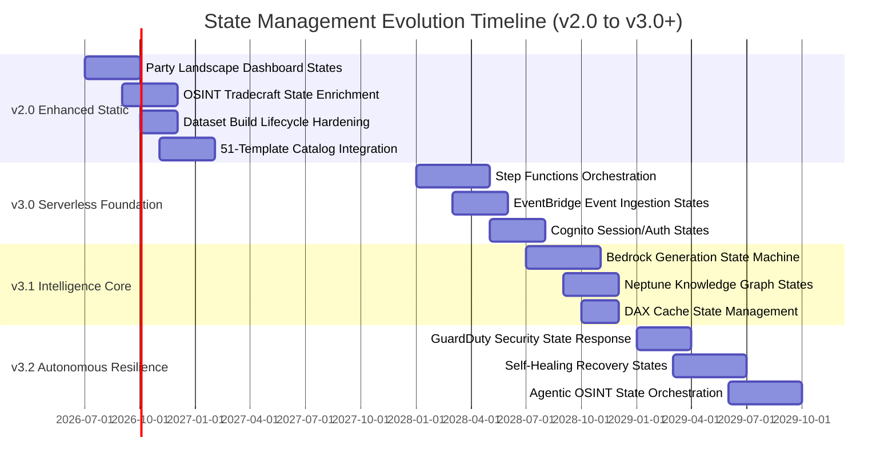

---

## 🟢 v2.0 — Static Build & Publish Lifecycle State Machine

The v2.0 horizon **preserves** the deterministic, server-free build lifecycle. A
gh-aw agentic workflow authors Stage-B markdown analysis artifacts, the deterministic
aggregator renders 14-language HTML, and the result is deployed to Amazon S3 and
served via Amazon CloudFront. These states are short-lived, fully reproducible, and
leave no runtime state to defend.

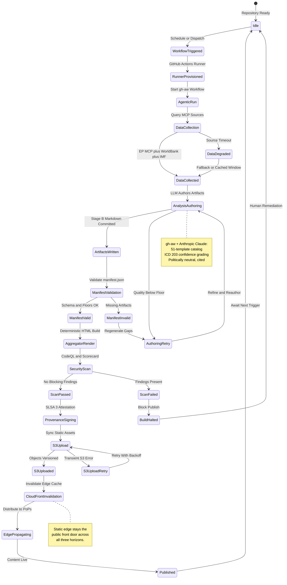

---

## 🟢 v2.0 — Dashboard Dataset Build State Machine

v2.0's differentiator is **higher-quality political-landscape intelligence**, with a
focus on parties and political groups. Interactive dashboards (Chart.js 4 + D3 7)
consume **pre-rendered datasets baked at build time** — there is no runtime query
path, preserving pure static delivery. The state machine below governs how a dataset
(e.g., political-group cohesion, coalition mathematics, seat projection, voting-pattern
heatmap) is assembled, validated, and frozen into a static JSON asset.

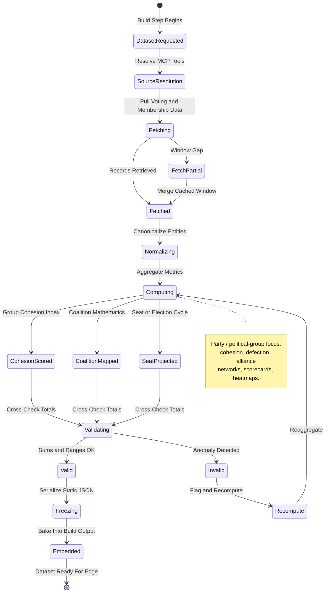

---

## 🔵 v3.0+ — Step Functions Article & Intelligence Generation State Machine

In v3.0+ the build-time generation path is complemented by an **AWS Step
Functions**-orchestrated state machine for on-demand and event-triggered intelligence
products. **Amazon Bedrock** provides model-agnostic foundation models, **Bedrock
Knowledge Bases** supply managed RAG over the EP corpus and committed analysis
artifacts, and **Bedrock Guardrails** enforce neutrality, GDPR/PII boundaries, and
hallucination control. Per the Hack23 **AI Policy**, a **human-review gate** precedes
any publication — AI proposes, humans remain accountable.

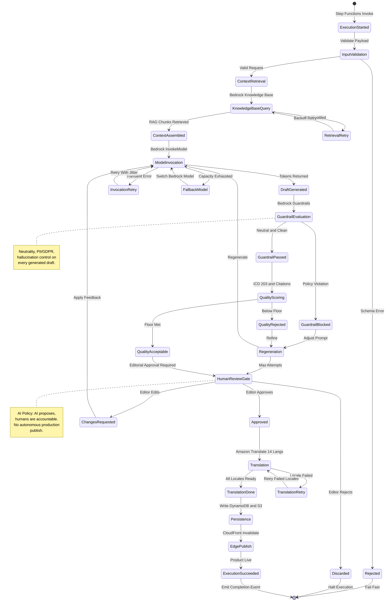

---

## 🔵 v3.0+ — Real-Time EP Event Ingestion State Machine

To support near-real-time political intelligence, v3.0+ ingests European Parliament
events through **Amazon EventBridge**, **Amazon Kinesis** (stream buffering), and
**AWS Lambda** consumers. Events (new votes, tabled documents, plenary activities)
flow from MCP feed polling into a durable stream, are deduplicated and classified,
then either trigger the Step Functions generation machine or update the knowledge
graph. Failures route to **Amazon SQS** dead-letter queues.

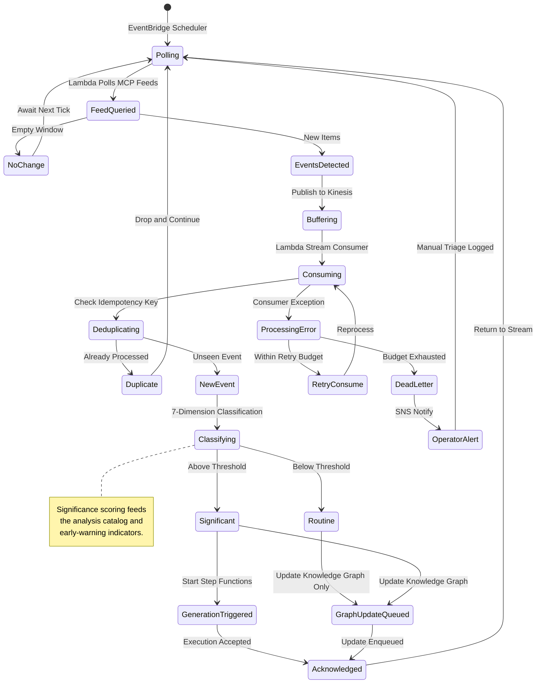

---

## 🔵 v3.0+ — API Session & Authentication State Machine (Amazon Cognito)

The v3.0+ API ecosystem serves journalists, researchers, and programmatic consumers
via **Amazon API Gateway** fronted by **AWS WAF**, with identity managed by **Amazon
Cognito** user pools (federated sign-in supported). The state machine governs a
consumer session from anonymous edge access through authenticated, token-scoped API
use. Public open-data endpoints remain anonymously reachable through the static edge.

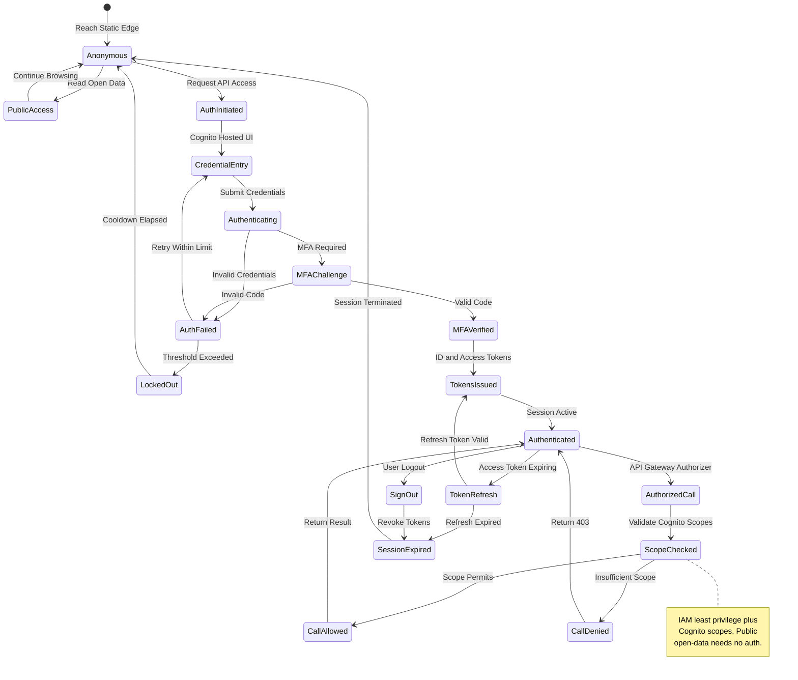

---

## 🔵 v3.0+ — Knowledge Graph Update State Machine (Amazon Neptune)

The political knowledge graph (MEPs ↔ political groups ↔ committees ↔ dossiers ↔
votes) lives in **Amazon Neptune Serverless**. Updates arrive from the event
ingestion machine and from batch reconciliation jobs. The state machine enforces
transactional consistency, entity resolution, and provenance tagging before commits
become queryable via natural-language search (AppSync/OpenSearch-backed).

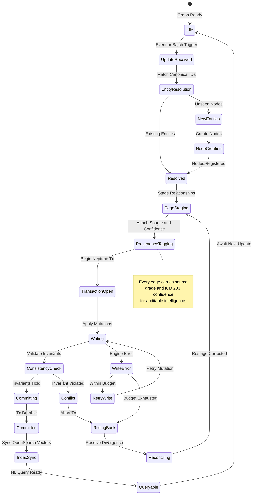

---

## 🔵 v3.0+ — Cache State Management (CloudFront + DynamoDB DAX)

v3.0+ caching is two-tiered: **Amazon CloudFront** at the edge (static assets and
cacheable API responses) and **Amazon DynamoDB Accelerated (DAX)** for hot key-value
read paths behind dynamic Lambda functions. The state machine governs cache warming,
hit/miss handling, event-driven invalidation, and eviction — with predictive warming
guided by the parliamentary calendar.

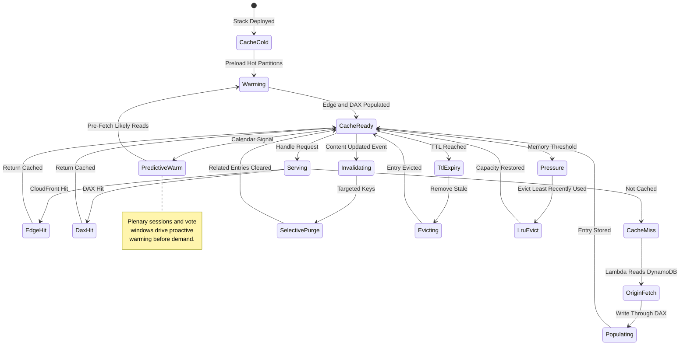

---

## 🔵 v3.0+ — Security State Management (GuardDuty + Security Hub)

Runtime security states are driven by **Amazon GuardDuty** (threat detection) and
**AWS Security Hub** (finding aggregation and posture), with automated response
orchestrated by **EventBridge → Lambda** and escalation via **Amazon SNS**. The
machine moves from steady-state monitoring through detection, automated containment,
and human-decision escalation, then back to a hardened secure state with updated
detection rules.

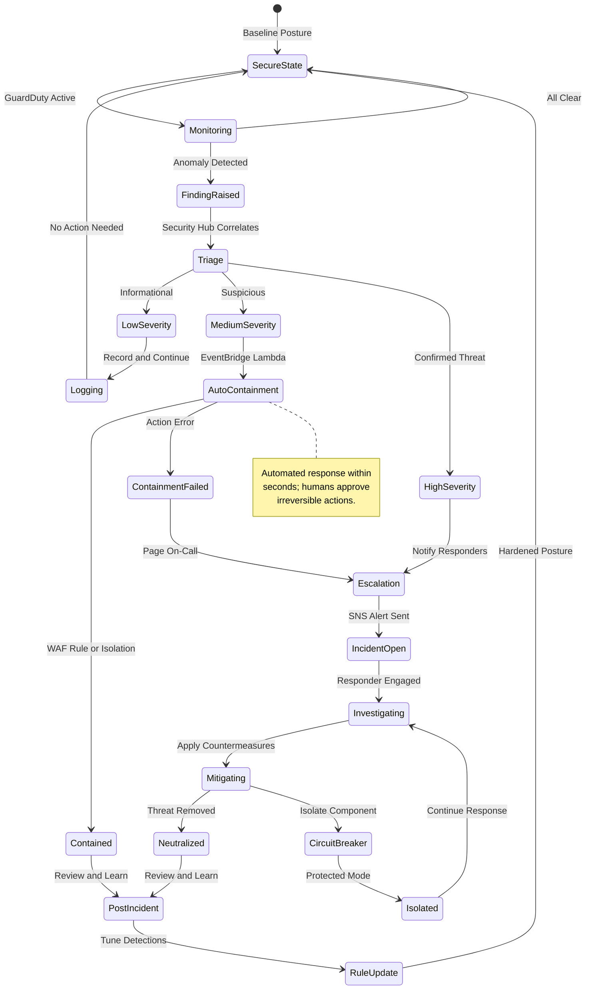

---

## 📊 State Transition Metrics

### Key Performance Indicators

| State Category | Metric | Target | Alert Threshold |
| ---------------------- | ------------------------ | ----------------- | --------------- |
| **Static Build (v2.0)** | Build-to-Published time | <12 min | >25 min |
| **Dataset Build (v2.0)** | Dataset freeze success rate | >99% | <97% |
| **Step Functions (v3.0)** | Execution success rate | >99% | <97% |
| **Bedrock Generation** | Draft-to-approved latency | <6 min | >15 min |
| **Event Ingestion** | Event processing lag | <60 seconds | >300 seconds |
| **Cognito Auth** | Token issuance latency | <500 ms | >2 seconds |
| **Neptune Update** | Commit-to-queryable lag | <30 seconds | >120 seconds |
| **Cache (CloudFront/DAX)** | Combined cache hit rate | >95% | <90% |
| **Security Response** | Detect-to-contain time | <30 seconds | >120 seconds |

### Governance Notes

- **Human-review gate is non-bypassable.** No Step Functions execution reaches
  `EdgePublish` without an `Approved` transition through `HumanReviewGate`, per the
  [AI Policy](https://github.com/Hack23/ISMS-PUBLIC/blob/main/AI_Policy.md).
- **Static edge fallback is always available.** If any dynamic v3.0+ state machine is
  degraded, CloudFront continues serving the last pre-rendered static snapshot.
- **All states emit CloudTrail / CloudWatch events** for auditability and X-Ray
  tracing, satisfying NIST CSF DE.CM and ISO 27001 A.8.15/A.8.16.

---

## 🎯 State Comparison: Current vs. v2.0 vs. v3.0

| State Aspect | Current (v1.0.x) | v2.0 (Enhanced Static) | v3.0+ (AWS Serverless) |
| ----------------------- | --------------------- | ----------------------- | -------------------- |
| **Total States** | ~10 (build workflow) | ~20 (build + dataset) | 120+ (multi-machine) |
| **State Persistence** | None (ephemeral) | None (ephemeral) | DynamoDB + Aurora SLv2 + Step Functions history |
| **Orchestration** | GitHub Actions | GitHub Actions (gh-aw) | Step Functions + EventBridge |
| **Error States** | Re-run job | Re-run job | Retry/catch, DLQ, self-healing |
| **Parallel States** | None (serial) | Limited (parallel datasets) | True parallel + fan-out |
| **Identity States** | None (anonymous) | None (anonymous) | Amazon Cognito sessions |
| **AI States** | Build-time gh-aw LLM | Build-time gh-aw LLM | Bedrock + KB + Guardrails + gate |
| **Security States** | CI scan gates | CI scan gates | GuardDuty/Security Hub detect→respond |
| **Predictive States** | None | None | Predictive cache warming, anomaly forecast |
| **Public Front Door** | Static (S3+CloudFront) | Static (S3+CloudFront) | Static edge + dynamic behind it |

---

## 🕵️ Intelligence Capability State Machines (2026 → 2037)

The state machines above govern build, ingest, auth, graph, cache and security.
These add the **intelligence-product lifecycles** required by the OSINT capability
roadmap — the behaviour of an **indicator/warning**, a **forecast**, and a
**competing-hypothesis assessment** as they move from raw signal to human-approved,
calibrated intelligence. Each lifecycle bakes in the AI-Policy gate: **no state
reaches "Published" without human confirmation.**

### v3.0+ — Indications and Warning Indicator Lifecycle

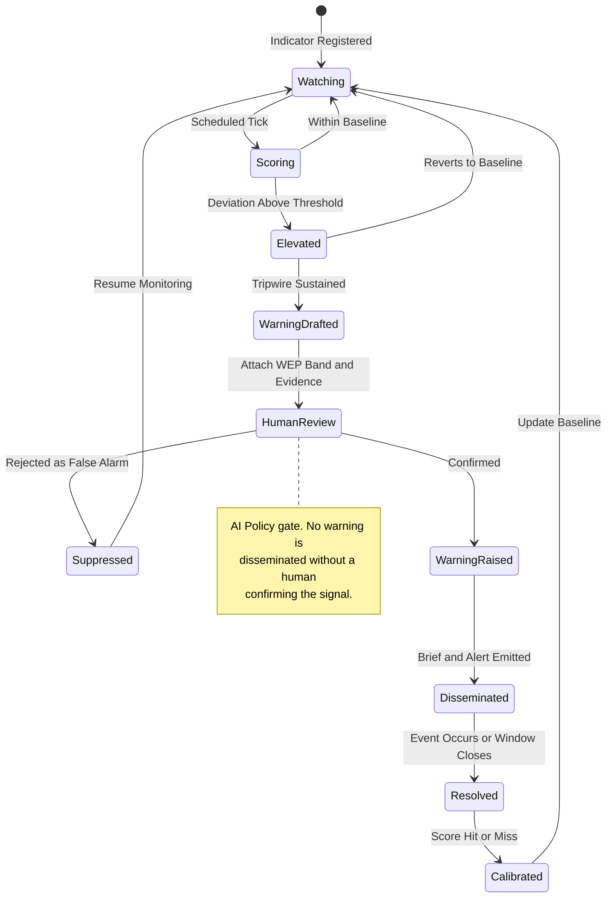

### v3.0+ — Forecast Lifecycle (Estimate to Calibration)

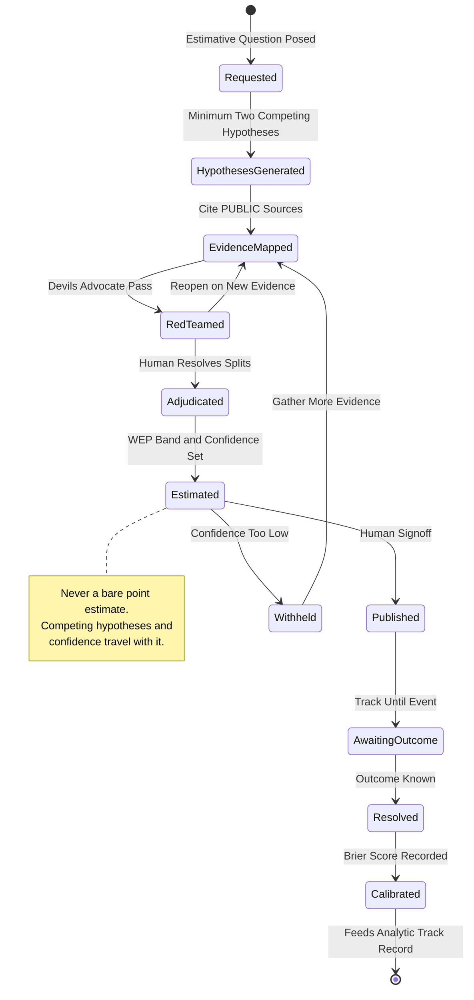

### v3.0+ — Competing-Hypothesis (ACH) Assessment State Machine

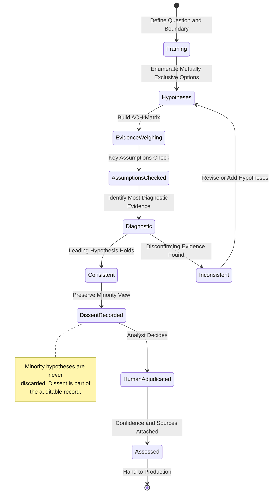

---

## 🔮 Visionary State Management Roadmap: 2027-2037

### AI-Driven State Evolution

As foundation models advance — accessed model-agnostically through **Amazon Bedrock**
and continuously benchmarked against competitors (OpenAI, Google, Meta, EU sovereign
AI) at each release — state management evolves from **reactive** (v2.0 build gates)
to **predictive** (v3.0 anomaly and demand forecasting) to **autonomous self-healing**
(late-horizon), always within Hack23 **AI Policy** guardrails: AI proposes, humans
remain accountable, no autonomous production deploy.

### AI Model Evolution — DevSecOps & Development Perspective

| Year | AI Model | DevSecOps Capability Evolution |
| ---- | -------- | ------------------------------ |
| 2026 | Opus 4.6–4.9 | 🟢 AI-assisted code review, automated test generation, agentic CI/CD workflows |
| 2027 | Opus 5.x | 🔵 Predictive vulnerability detection, intelligent dependency management |
| 2028 | Opus 6.x | 🟣 Multi-modal security analysis (code + architecture + runtime), automated threat modeling |
| 2029 | Opus 7.x | 🟠 Autonomous security pipeline orchestration, self-healing build systems |
| 2030 | Opus 8.x | 🔴 Near-expert automated security review, AI-driven architecture validation |
| 2031–2033 | Opus 9–10.x / Pre-AGI | ⚪ Autonomous secure development lifecycle management |
| 2034–2037 | AGI / Post-AGI | ⭐ Transformative software engineering with built-in security assurance |

> **Assumptions:** major AI model upgrades annually; competitors evaluated at each
> release; architecture accommodates potential paradigm shifts (quantum AI,
> neuromorphic computing). Full cross-perspective analysis lives in the Hack23
> Information Security Strategy § AI Model Evolution Strategy; governance per
> [AI Policy](https://github.com/Hack23/ISMS-PUBLIC/blob/main/AI_Policy.md).

### Phase 5: Predictive State Intelligence (2027-2029)

- **SageMaker-Driven State Prediction**: Amazon SageMaker models forecast next
  system states from the parliamentary calendar, historical patterns, and real-time
  EventBridge signals — pre-warming DAX/CloudFront and pre-provisioning Lambda
  concurrency before plenary-session demand spikes.
- **Self-Optimizing Step Functions**: execution paths whose retry budgets,
  parallelism, and model selection self-tune from CloudWatch metrics, reducing
  latency and cost without manual intervention.
- **Cross-Region State Consensus**: multi-Region DynamoDB Global Tables and Neptune
  replication provide globally consistent read state with low-latency edge access.

### Phase 6: Autonomous Self-Healing State Recovery (2029-2032)

- **Intent-Based State Machines**: operators declare desired outcomes (e.g., "all
  significant votes summarized within 5 minutes of publication"), and Bedrock Agents
  propose optimal Step Functions transition paths for human approval.
- **Self-Healing Recovery States**: agents diagnose stuck executions, dead-letter
  backlogs, or Neptune conflicts, and apply corrective transitions with full
  CloudTrail audit trails — while irreversible actions still require human sign-off.
- **Temporal State Analytics**: Step Functions execution history and S3 state
  snapshots enable time-travel replay to analyze behavior and forecast evolution.

### Phase 7: Cognitive State Systems (2032-2035)

- **Natural-Language State Definition**: stakeholders describe behavior in natural
  language; Bedrock Agents generate formal Amazon States Language definitions for
  human review and gated deployment.
- **Cross-Parliament State Orchestration**: a unified serverless control plane manages
  many parliament-monitoring instances with intelligent conflict resolution, sharing
  the Neptune knowledge-graph schema.
- **Predictive Failure Prevention**: anomaly models forecast state-machine failures
  from subtle CloudWatch/X-Ray degradation signals before incidents occur.

### Phase 8: AGI-Native State Architecture (2035-2037)

- **Dynamic State Evolution**: pre-AGI/AGI systems design, test, and propose new
  state machines as requirements change — deployment remains human-gated and
  policy-bound.
- **Universal State Abstraction**: a single serverless state paradigm scales from a
  simple static build to complex multi-system, multi-parliament orchestration.
- **Bounded Autonomy**: maximally automated operations with comprehensive safety
  boundaries, Bedrock Guardrails, and ethical guardrails — preserving the AI Policy
  invariant that humans remain accountable for published intelligence.

---

## 📚 References

### Current State

- [Current State Diagram](STATEDIAGRAM.md)
- [Current Architecture](ARCHITECTURE.md)
- [Current Data Model](DATA_MODEL.md)
- [Current Flowchart](FLOWCHART.md)

### Future State

- [Future Architecture](FUTURE_ARCHITECTURE.md)
- [Future Flowchart](FUTURE_FLOWCHART.md)
- [Future Data Model](FUTURE_DATA_MODEL.md)
- [Future Mindmap](FUTURE_MINDMAP.md)
- [Future SWOT](FUTURE_SWOT.md)
- [Future Security Architecture](FUTURE_SECURITY_ARCHITECTURE.md)
- [Future Threat Model](FUTURE_THREAT_MODEL.md)
- [Future Workflows](FUTURE_WORKFLOWS.md)

### AWS Services & Patterns

- AWS Step Functions: https://docs.aws.amazon.com/step-functions/
- Amazon Bedrock: https://docs.aws.amazon.com/bedrock/
- Amazon EventBridge: https://docs.aws.amazon.com/eventbridge/
- Amazon Cognito: https://docs.aws.amazon.com/cognito/
- Amazon Neptune Serverless: https://docs.aws.amazon.com/neptune/
- Amazon DynamoDB DAX: https://docs.aws.amazon.com/amazondynamodb/latest/developerguide/DAX.html
- Amazon GuardDuty: https://docs.aws.amazon.com/guardduty/
- AWS Security Hub: https://docs.aws.amazon.com/securityhub/

### Governance

- [Hack23 AI Policy](https://github.com/Hack23/ISMS-PUBLIC/blob/main/AI_Policy.md)
- [Hack23 ISMS-PUBLIC](https://github.com/Hack23/ISMS-PUBLIC)

---

**Document Status**: ✅ **APPROVED FOR PLANNING**  
**Last Updated**: 2026-05-31 (UTC)  
**Next Review**: 2026-08-31 (Quarterly)  
**Classification**: Public
