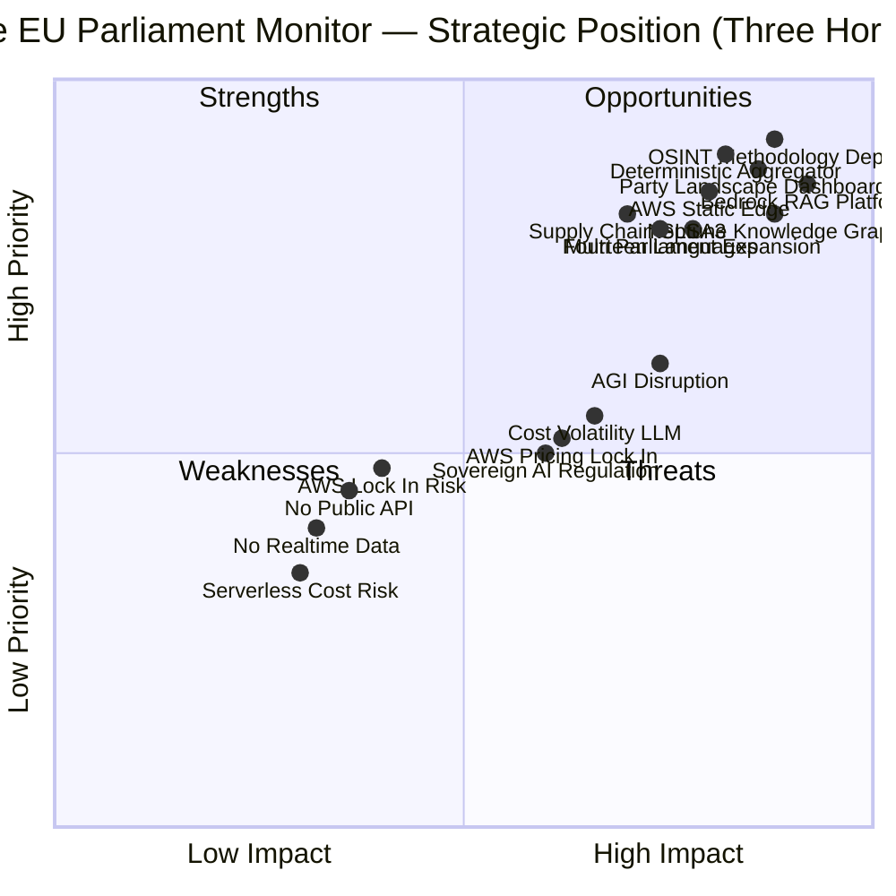
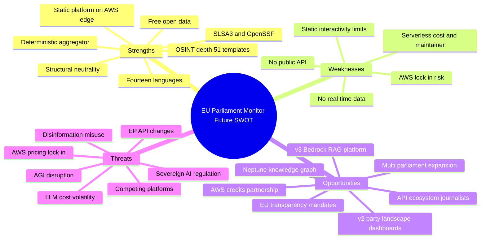
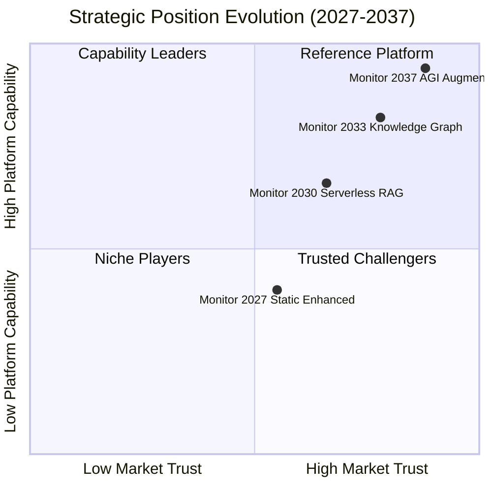

  

<h1 align="center">💼 EU Parliament Monitor — Future SWOT Analysis</h1>

  <strong>📊 Forward-Looking Strategic Opportunities Analysis</strong> 
  <em>🎯 Three-Horizon Positioning: Static-Enhanced → AWS Serverless Intelligence → 10-Year AI Lookahead (2026-2037)</em>

  
  
  
  

**📋 Document Owner:** CEO | **📄 Version:** 4.0 | **📅 Last Updated:**
2026-05-31 (UTC) | **🚀 Release:** v1.0.1  
**🔄 Review Cycle:** Quarterly | **⏰ Next Review:** 2026-08-31  
**🏷️ Classification:** Public (Open Source European Parliament Monitoring Platform)

---

## 📚 Architecture Documentation Map

| Document | Focus | Description | Documentation Link |
| ------------------------------------------------------------------- | --------------- | ---------------------------------------------- | ------------------------------------------------------------------------------------------------------ |
| **[Architecture](ARCHITECTURE.md)** | 🏛️ Architecture | C4 model showing current system structure | [View Source](https://github.com/Hack23/euparliamentmonitor/blob/main/ARCHITECTURE.md) |
| **[Future Architecture](FUTURE_ARCHITECTURE.md)** | 🏛️ Architecture | C4 model showing future system structure | [View Source](https://github.com/Hack23/euparliamentmonitor/blob/main/FUTURE_ARCHITECTURE.md) |
| **[Mindmaps](MINDMAP.md)** | 🧠 Concept | Current system component relationships | [View Source](https://github.com/Hack23/euparliamentmonitor/blob/main/MINDMAP.md) |
| **[Future Mindmaps](FUTURE_MINDMAP.md)** | 🧠 Concept | Future capability evolution | [View Source](https://github.com/Hack23/euparliamentmonitor/blob/main/FUTURE_MINDMAP.md) |
| **[SWOT Analysis](SWOT.md)** | 💼 Business | Current strategic assessment | [View Source](https://github.com/Hack23/euparliamentmonitor/blob/main/SWOT.md) |
| **[Future SWOT Analysis](FUTURE_SWOT.md)** | 💼 Business | Future strategic opportunities | **This Document** |
| **[Data Model](DATA_MODEL.md)** | 📊 Data | Current data structures and relationships | [View Source](https://github.com/Hack23/euparliamentmonitor/blob/main/DATA_MODEL.md) |
| **[Future Data Model](FUTURE_DATA_MODEL.md)** | 📊 Data | Enhanced European Parliament data architecture | [View Source](https://github.com/Hack23/euparliamentmonitor/blob/main/FUTURE_DATA_MODEL.md) |
| **[Flowcharts](FLOWCHART.md)** | 🔄 Process | Current data processing workflows | [View Source](https://github.com/Hack23/euparliamentmonitor/blob/main/FLOWCHART.md) |
| **[Future Flowcharts](FUTURE_FLOWCHART.md)** | 🔄 Process | Enhanced AI-driven workflows | [View Source](https://github.com/Hack23/euparliamentmonitor/blob/main/FUTURE_FLOWCHART.md) |
| **[State Diagrams](STATEDIAGRAM.md)** | 🔄 Behavior | Current system state transitions | [View Source](https://github.com/Hack23/euparliamentmonitor/blob/main/STATEDIAGRAM.md) |
| **[Future State Diagrams](FUTURE_STATEDIAGRAM.md)** | 🔄 Behavior | Enhanced adaptive state transitions | [View Source](https://github.com/Hack23/euparliamentmonitor/blob/main/FUTURE_STATEDIAGRAM.md) |
| **[Security Architecture](SECURITY_ARCHITECTURE.md)** | 🛡️ Security | Current security implementation | [View Source](https://github.com/Hack23/euparliamentmonitor/blob/main/SECURITY_ARCHITECTURE.md) |
| **[Future Security Architecture](FUTURE_SECURITY_ARCHITECTURE.md)** | 🛡️ Security | Security enhancement roadmap | [View Source](https://github.com/Hack23/euparliamentmonitor/blob/main/FUTURE_SECURITY_ARCHITECTURE.md) |
| **[Threat Model](THREAT_MODEL.md)** | 🎯 Security | STRIDE threat analysis | [View Source](https://github.com/Hack23/euparliamentmonitor/blob/main/THREAT_MODEL.md) |
| **[Future Threat Model](FUTURE_THREAT_MODEL.md)** | 🎯 Security | Forward threat landscape | [View Source](https://github.com/Hack23/euparliamentmonitor/blob/main/FUTURE_THREAT_MODEL.md) |
| **[Classification](CLASSIFICATION.md)** | 🏷️ Governance | CIA classification & BCP | [View Source](https://github.com/Hack23/euparliamentmonitor/blob/main/CLASSIFICATION.md) |
| **[CRA Assessment](CRA-ASSESSMENT.md)** | 🛡️ Compliance | Cyber Resilience Act | [View Source](https://github.com/Hack23/euparliamentmonitor/blob/main/CRA-ASSESSMENT.md) |
| **[Workflows](WORKFLOWS.md)** | ⚙️ DevOps | CI/CD documentation | [View Source](https://github.com/Hack23/euparliamentmonitor/blob/main/WORKFLOWS.md) |
| **[Future Workflows](FUTURE_WORKFLOWS.md)** | 🚀 DevOps | Planned CI/CD enhancements | [View Source](https://github.com/Hack23/euparliamentmonitor/blob/main/FUTURE_WORKFLOWS.md) |
| **[Business Continuity Plan](BCPPlan.md)** | 🔄 Resilience | Recovery planning | [View Source](https://github.com/Hack23/euparliamentmonitor/blob/main/BCPPlan.md) |
| **[Financial Security Plan](FinancialSecurityPlan.md)** | 💰 Financial | Cost & security analysis | [View Source](https://github.com/Hack23/euparliamentmonitor/blob/main/FinancialSecurityPlan.md) |
| **[End-of-Life Strategy](End-of-Life-Strategy.md)** | 📦 Lifecycle | Technology EOL planning | [View Source](https://github.com/Hack23/euparliamentmonitor/blob/main/End-of-Life-Strategy.md) |
| **[Unit Test Plan](UnitTestPlan.md)** | 🧪 Testing | Unit testing strategy | [View Source](https://github.com/Hack23/euparliamentmonitor/blob/main/UnitTestPlan.md) |
| **[E2E Test Plan](E2ETestPlan.md)** | 🔍 Testing | End-to-end testing | [View Source](https://github.com/Hack23/euparliamentmonitor/blob/main/E2ETestPlan.md) |
| **[Performance Testing](performance-testing.md)** | ⚡ Performance | Performance benchmarks | [View Source](https://github.com/Hack23/euparliamentmonitor/blob/main/performance-testing.md) |
| **[Security Policy](SECURITY.md)** | 🔒 Security | Vulnerability reporting & security policy | [View Source](https://github.com/Hack23/euparliamentmonitor/blob/main/SECURITY.md) |

---

## 🔐 ISMS Policy Alignment

This future SWOT analysis is designed to implement all controls from Hack23 AB's
ISMS framework as the EU Parliament Monitor platform evolves across its three
strategic horizons — from an enhanced static intelligence site (v2.0) to an
AWS-native serverless intelligence-operations platform (v3.0+) and on through the
ten-year AI lookahead.

### Related ISMS Policies

| **Policy Domain** | **Policy** | **Planned Implementation** |
| -------------------------- | ------------------------------------------------------------------------------------------------------------ | ------------------------------------------------------------- |
| **🔐 Core Security** | [Information Security Policy](https://github.com/Hack23/ISMS-PUBLIC/blob/main/Information_Security_Policy.md) | Overall security governance for static-enhanced and serverless horizons |
| **🤖 AI Governance** | [AI Policy](https://github.com/Hack23/ISMS-PUBLIC/blob/main/AI_Policy.md) | AI as proposal generator, human accountability, no autonomous deploy; Bedrock Guardrails |
| **🛠️ Development** | [Secure Development Policy](https://github.com/Hack23/ISMS-PUBLIC/blob/main/Secure_Development_Policy.md) | Security-integrated SDLC; SLSA 3 provenance retained into serverless |
| **🌐 Network** | [Network Security Policy](https://github.com/Hack23/ISMS-PUBLIC/blob/main/Network_Security_Policy.md) | CloudFront, AWS WAF + Shield, edge protection |
| **🔒 Cryptography** | [Cryptography Policy](https://github.com/Hack23/ISMS-PUBLIC/blob/main/Cryptography_Policy.md) | TLS 1.3, AWS KMS, content signing, integrity verification |
| **🔑 Access Control** | [Access Control Policy](https://github.com/Hack23/ISMS-PUBLIC/blob/main/Access_Control_Policy.md) | Amazon Cognito identity, IAM least-privilege, API authorization |
| **🏷️ Data Classification** | [Data Classification Policy](https://github.com/Hack23/ISMS-PUBLIC/blob/main/Data_Classification_Policy.md) | PUBLIC open-data classification; GDPR public-roles-only boundary |
| **🔍 Vulnerability** | [Vulnerability Management](https://github.com/Hack23/ISMS-PUBLIC/blob/main/Vulnerability_Management.md) | CodeQL, Scorecard, Amazon Inspector, GuardDuty |
| **🚨 Incident Response** | [Incident Response Plan](https://github.com/Hack23/ISMS-PUBLIC/blob/main/Incident_Response_Plan.md) | CloudWatch + Security Hub automated detection and response |
| **💾 Backup & Recovery** | [Backup Recovery Policy](https://github.com/Hack23/ISMS-PUBLIC/blob/main/Backup_Recovery_Policy.md) | S3 versioning, git provenance, point-in-time recovery |
| **🔄 Business Continuity** | [Business Continuity Plan](https://github.com/Hack23/ISMS-PUBLIC/blob/main/Business_Continuity_Plan.md) | Static edge fallback, multi-AZ serverless, disaster recovery |
| **🤝 Third-Party** | [Third Party Management](https://github.com/Hack23/ISMS-PUBLIC/blob/main/Third_Party_Management.md) | AWS, Anthropic, EP/World Bank/IMF data-source assessment |
| **🏷️ Classification** | [Classification Framework](https://github.com/Hack23/ISMS-PUBLIC/blob/main/CLASSIFICATION.md) | Business impact analysis for platform |

### Compliance Framework Mapping

| **Framework** | **Version** | **Relevant Controls** |
| ------------- | ----------- | --------------------- |
| **ISO 27001** | 2022 | A.5.1, A.5.23, A.8.11, A.8.25, A.8.26, A.8.27, A.8.28 |
| **NIST CSF** | 2.0 | GV.OC, GV.RM, GV.SC, ID.AM, PR.AT, PR.DS |
| **CIS Controls** | v8.1 | Control 1-5, 14, 16 |
| **GDPR** | 2016/679 | Art. 5 (minimization), Art. 6 (lawfulness), public-roles-only |
| **EU AI Act** | 2024/1689 | Transparency, human oversight, neutrality safeguards |

---

## 📋 Executive Summary

This SWOT analysis evaluates the **forward strategic position** of EU Parliament
Monitor across three sequenced horizons. The platform has just shipped **v1.0.1**
as a pure static-site generator already hosted on **AWS S3 + Amazon CloudFront**,
delivering neutral, evidence-cited political intelligence in **14 languages** from
free open-data sources (the European Parliament MCP server, World Bank WDI, and
the IMF REST API). The strategic question is no longer *whether* to build, but
*how far* and *how fast* to extend an already-credible, low-cost analytical
platform into a dynamic intelligence-operations service — without sacrificing the
neutrality, determinism, and cost discipline that constitute its current moat.

The strategy is deliberately staged so that each horizon de-risks the next:

- **🟢 v2.0 — Enhanced Static Intelligence (2026 H2 → 2027):** keep the static
  HTML architecture (S3 + CloudFront, build-time generation, gh-aw + deterministic
  aggregator) and compete on **analytical quality**, not infrastructure. Ship
  richer party / political-group landscape dashboards (cohesion, coalition
  mathematics, MEP & party scorecards, voting-pattern heatmaps, seat projections,
  cross-party alliance networks) plus deeper OSINT tradecraft. No servers are
  introduced; quality is the 2.0 moat.
- **🔵 v3.0+ — AWS-Native Serverless Intelligence Platform (2028+):** an explicit
  **all-in-on-AWS** strategic bet. Layer dynamic features behind the static edge
  using AWS Lambda, Step Functions, EventBridge, API Gateway + Amazon Cognito,
  DynamoDB / Aurora Serverless v2 / OpenSearch Serverless / **Amazon Neptune
  Serverless** (political knowledge graph), and **Amazon Bedrock** with **Bedrock
  Knowledge Bases** (managed RAG), **Bedrock Agents**, and **Bedrock Guardrails**.
- **⚪ 10-Year AI Lookahead (2026 → 2037):** annual major-model upgrades, a
  model-agnostic Bedrock abstraction, competitor evaluation each release, and
  resilience to paradigm shifts (quantum AI, neuromorphic computing) and AGI /
  post-AGI — all governed by the Hack23 AI Policy.

### Key Findings (Three-Horizon View)

| Dimension | Status | Key Insight |
| ----------------- | -------------- | ----------------------------------------------------------------------------------- |
| **Strengths** | 🟢 Very Strong | Shipped static platform on AWS edge, deterministic aggregator, 14 languages, deep OSINT methodology, SLSA 3 / OpenSSF, free open data, structural neutrality |
| **Weaknesses** | 🟡 Manageable | No real-time data, no public API, static-only interactivity limits, single-maintainer cost constraints of serverless, AWS lock-in from the all-in choice |
| **Opportunities** | 🟢 Excellent | v2.0 party-landscape dashboards as differentiator; v3.0+ AWS serverless intop platform (Bedrock RAG, API ecosystem, Neptune graph); multi-parliament; EU transparency mandates; journalist/researcher market; AWS credits |
| **Threats** | 🟡 Moderate | Competing platforms, LLM/API cost volatility, AWS lock-in & pricing, EU sovereign-AI/regulatory shifts, disinformation/misuse, AGI disruption, EP API changes |

**Strategic Recommendation:** Win the **quality war first** in v2.0 (cheap,
static, defensible), then convert that analytical credibility into a v3.0+
serverless platform where the marginal cost of dynamic intelligence is paid only
when revenue or grants justify it. Treat the all-in-AWS bet as a *managed* risk:
exploit Bedrock's model-agnosticism and serverless zero-ops economics while
holding the static edge as a permanent, portable fallback that caps both cost and
lock-in exposure.

---

## 🧭 Horizon Comparison — Current State → v2.0 → v3.0+

| Capability | Current State (v1.0.x) | 🟢 v2.0 Static-Enhanced (2026 H2-2027) | 🔵 v3.0+ AWS Serverless (2028+) |
| --- | --- | --- | --- |
| **Delivery** | Static HTML on S3 + CloudFront | Same static edge, richer client-side dashboards | Static edge front door + dynamic serverless behind it |
| **Compute** | GitHub Actions build only | GitHub Actions build only | Lambda + Step Functions + EventBridge (zero-ops) |
| **Data freshness** | Build-time batch (gh-aw runs) | Build-time batch, denser cadence | Near-real-time EP ingestion via Kinesis/EventBridge |
| **Interactivity** | Pre-rendered Chart.js 4 / D3 7 | Richer interactive layer, baked data | Live query, WebSocket (API Gateway), AppSync subscriptions |
| **AI** | gh-aw LLM authors markdown artifacts | Same, deeper OSINT tradecraft | Amazon Bedrock + Knowledge Bases RAG + Bedrock Agents |
| **Knowledge graph** | Implicit in artifacts | Pre-rendered alliance network graphs | Amazon Neptune Serverless (MEPs ↔ groups ↔ dossiers ↔ votes) |
| **Identity / API** | None (public site) | None (public site) | Amazon Cognito + API Gateway ecosystem |
| **Cost profile** | ~Pennies/month (edge + Actions) | Still near-zero marginal cost | Pay-per-use serverless; scales with revenue |
| **Moat** | Neutrality + determinism | Analytical quality & OSINT depth | Knowledge graph + RAG + API network effects |

---

## 📊 Future SWOT Quadrant Chart

---

## 💪 STRENGTHS (Future State)

### S1: Shipped Static Platform Already on the AWS Edge 🌟

**Rating:** ⭐⭐⭐⭐⭐ (Critical Strength) · **Confidence:** High

EU Parliament Monitor is not a slideware concept — **v1.0.1 is live** as a pure
static-site generator served from **Amazon S3 behind Amazon CloudFront**. AWS is
therefore *already* the substrate, which materially de-risks the v3.0+ all-in bet:
there is no migration discontinuity, only incremental layering of serverless
services behind an edge the team already operates. The static delivery model gives
near-perfect availability, global low latency, trivial DDoS resilience via
CloudFront + AWS WAF, and a cost base measured in pennies. This combination of
*proven production status* and *AWS-native hosting* is rare among civic-tech
entrants and is the foundation every later horizon builds upon.

### S2: Deterministic Aggregator — Reproducible, Audit-Grade Rendering 🚀

**Rating:** ⭐⭐⭐⭐⭐ (Critical Strength) · **Confidence:** High

The `src/aggregator/**` pipeline renders article HTML deterministically by walking
committed Stage-B analysis markdown artifacts and `manifest.json` — **no
AI-authored HTML** reaches readers. This is a profound trust and compliance asset:
every published page is reproducible from version-controlled inputs, satisfying
audit, correction, and provenance requirements that purely generative competitors
cannot meet. It cleanly separates *AI as proposal generator* (gh-aw workflows
producing analysis) from *deterministic publication* (the aggregator), directly
operationalizing the Hack23 AI Policy. Into v3.0+, the same determinism anchors
Bedrock Guardrails output: RAG and agents propose, the aggregator and human review
dispose.

### S3: Fourteen-Language Reach with Consistent Analytical Conclusions 🌍

**Rating:** ⭐⭐⭐⭐ (Major Strength) · **Confidence:** High

The platform already publishes in **14 languages** (with RSS per language), serving
citizens, journalists, and researchers across the EU's linguistic diversity while
maintaining consistent analytical conclusions across translations. Multilingual
parity is expensive for competitors to retrofit but is native here, baked at build
time. It widens the addressable audience for v2.0 party-landscape dashboards and,
in v3.0+, maps directly onto **Amazon Translate** for scaling beyond 14 languages
and onto **Amazon Transcribe** for plenary-audio pipelines — turning a present
content asset into a future data-ingestion advantage.

### S4: OSINT Methodology Depth — 51 Templates, ICD 203, 5-Framework Threat Method 🔬

**Rating:** ⭐⭐⭐⭐⭐ (Critical Strength) · **Confidence:** High

The analytical core is the durable moat. The platform applies a **51-template
analysis catalog**, **ICD 203** analytic-confidence standards, Admiralty source
grading, Kent/WEP probability bands, and structured analytic techniques (ACH, key
assumptions check). Its **5-framework political threat methodology** (Political
Threat Landscape 6D + Attack Trees + Kill Chain + Diamond Model + ICO Profiling)
**explicitly rejects STRIDE** for political analysis — a deliberate tradecraft
choice that distinguishes rigorous political intelligence from repurposed software
threat modeling. This depth is hard to replicate, defensible against both
big-tech generalists and thin LLM wrappers, and becomes the corpus that
**Bedrock Knowledge Bases** indexes for RAG in v3.0+.

### S5: Supply-Chain Assurance — SLSA 3 + OpenSSF 🛡️

**Rating:** ⭐⭐⭐⭐ (Major Strength) · **Confidence:** High

The build pipeline carries **SLSA Level 3 provenance**, npm provenance, an
**OpenSSF Scorecard**, OpenSSF Best Practices, CodeQL, and WCAG 2.1 AA
conformance. For a platform whose entire value proposition is *trustworthy*
political intelligence, verifiable supply-chain integrity is not a checkbox but a
credibility multiplier — it lets institutional partners (parliaments, newsrooms,
academia) trust the provenance of both code and content. These attestations carry
forward unchanged into the serverless horizon, where IAM least-privilege, AWS KMS,
CloudTrail, and Security Hub extend the same assurance posture to runtime.

### S6: Free Open-Data Sourcing — Structurally Low Cost ♻️

**Rating:** ⭐⭐⭐⭐ (Major Strength) · **Confidence:** High

All inputs are **free, authoritative open data**: the European Parliament MCP
server (`european-parliament-mcp-server`, 60+ tools, sliding/fixed-window feeds),
optional World Bank WDI, and the IMF REST API (WEO + FM forecasts). There are no
data-licensing fees, no paywalled feeds, and no contractual data lock-in. This
keeps the cost base structurally low and the sourcing fully reproducible and
auditable — a decisive advantage when competitors pay for commercial political
data. It also keeps the platform firmly inside the PUBLIC classification and
GDPR public-roles-only boundary by construction.

### S7: Structural Political Neutrality ⚖️

**Rating:** ⭐⭐⭐⭐⭐ (Critical Strength) · **Confidence:** High

Neutrality is enforced by design, not by editorial promise: evidence-cited
analysis, explicit confidence levels, competing-hypotheses discipline, and a
deterministic publication path that prevents partisan drift. In an information
environment saturated with persuasion, *credible neutrality is the scarcest and
most defensible position*. It is the prerequisite for institutional trust, for
journalist adoption, and for surviving the EU AI Act's transparency expectations.
In v3.0+, **Bedrock Guardrails** codify this neutrality (and PII/GDPR controls)
into the generative layer so that scale does not erode the platform's defining
characteristic.

---

## ⚠️ WEAKNESSES (Future State)

### W1: No Real-Time Data — Build-Time Batch Only ⏱️

**Rating:** ⚠️⚠️⚠️ (Significant Weakness) · **Confidence:** High

The current architecture refreshes only when gh-aw workflows run and the site
rebuilds; there is no live ingestion of EP events. For breaking votes, plenary
drama, or fast-moving coalition shifts, the platform lags. This is acceptable —
even strategically deliberate — in v2.0, where *quality, not speed* is the moat,
but it is the primary functional gap that v3.0+ addresses through **Amazon
EventBridge + Kinesis** ingestion and **API Gateway WebSocket / AppSync
subscriptions**. The weakness is real today and must be honestly disclosed to
users who may assume real-time coverage.

### W2: No Public API — Closed Surface for Reuse 🔌

**Rating:** ⚠️⚠️⚠️ (Significant Weakness) · **Confidence:** High

The platform exposes HTML and RSS but **no queryable public API**. Journalists,
researchers, and civic-tech developers cannot programmatically access the
underlying analysis, scorecards, or knowledge graph — foreclosing integration,
network effects, and a natural revenue path. This is the single largest unrealized
asset. v3.0+ resolves it with **Amazon API Gateway (REST + WebSocket)**, **AWS
AppSync (GraphQL)**, and **Amazon Cognito** identity/federation, but until then the
analytical depth remains locked behind rendered pages, limiting reach and
monetization.

### W3: Static-Only Interactivity Limits 🧩

**Rating:** ⚠️⚠️ (Moderate Weakness) · **Confidence:** Moderate

Pre-rendered Chart.js/D3 dashboards are fast and cheap but constrained: users
cannot run arbitrary cross-filters, ad-hoc queries, natural-language questions, or
personalized views against the full dataset. v2.0 mitigates this with a richer
client-side interactive layer over data baked at build time, but the ceiling is
inherent to static delivery. Genuinely dynamic exploration — "show me every MEP
who defected from their group on migration votes in the last quarter" — requires
the v3.0+ serverless query layer (Neptune + OpenSearch + Lambda). Users
accustomed to live BI tools may perceive the static layer as limited.

### W4: Single-Maintainer & Cost Constraints of Going Serverless 👤

**Rating:** ⚠️⚠️⚠️ (Significant Weakness) · **Confidence:** High

The static platform thrives precisely because it is near-zero-ops and near-zero-
cost — ideal for a lean, potentially single-maintainer operation. Moving to a
v3.0+ serverless platform, even with zero-ops managed services, introduces
**operational surface** (IAM, Cognito, multiple data stores, Bedrock spend,
observability) and **variable, usage-coupled cost** where a traffic spike or a
runaway agent loop can generate real bills. The team must size this honestly:
serverless removes server management but not architectural, security, and
cost-governance responsibility. Mitigation: hard budget alarms (AWS Budgets +
CloudWatch), per-service cost ceilings, and a phased rollout that keeps the static
edge as the default cheap path.

### W5: AWS Lock-In Risk from the All-In Choice 🔒

**Rating:** ⚠️⚠️ (Moderate Weakness) · **Confidence:** Moderate

Committing all-in to AWS — Bedrock, Neptune, AppSync, Cognito, Step Functions —
delivers velocity and zero-ops economics but concentrates dependency on a single
vendor for compute, data, identity, and AI. Proprietary services (AppSync,
Neptune's Gremlin/openCypher specifics, Bedrock APIs) raise switching costs.
This is a *managed* weakness rather than a disqualifying one (see the strategic-bet
analysis below), but it is genuine: pricing changes, regional/sovereignty
constraints, or strategic shifts at AWS would propagate directly. Mitigation rests
on the portable static edge, open data formats, model-agnostic Bedrock usage, and
infrastructure-as-code that documents (and could re-target) the topology.

---

## 🚀 OPPORTUNITIES (Future State)

### O1: v2.0 Party & Political-Landscape Dashboards as a Differentiator 💎

**Rating:** 🌟🌟🌟🌟🌟 (Exceptional Opportunity) · **Confidence:** High

The most immediate, lowest-cost growth lever is to make EU Parliament Monitor the
**best place to understand parties and political groups** — party-level landscape
dashboards, political-group cohesion and **coalition mathematics**, MEP and party
scorecards, voting-pattern heatmaps, seat-projection and election-cycle
visualizations, and cross-party alliance network graphs. All are buildable
client-side (Chart.js 4 / D3 7 + a richer interactive layer) with data baked at
build time — **pure static delivery, near-zero marginal cost**. This converts the
platform's analytical depth into visible, shareable, journalist-friendly artifacts
and establishes a differentiated identity *before* any serverless spend.

### O2: v3.0+ AWS Serverless Intelligence-Operations Platform 🤖

**Rating:** 🌟🌟🌟🌟🌟 (Exceptional Opportunity) · **Confidence:** Moderate-High

The transformative opportunity is an **AWS-native "intop" platform** built on
**Amazon Bedrock** (model-agnostic foundation models), **Bedrock Knowledge Bases**
for managed **RAG** over the EP corpus and the 51-template analysis artifacts,
**Bedrock Agents** for agentic OSINT workflows, and **Bedrock Guardrails** for
neutrality and GDPR control. Natural-language query over the analytical corpus —
grounded, cited, and neutral — is a category-defining capability. Orchestrated by
**Lambda + Step Functions + EventBridge** and fronted by **API Gateway**, it turns
a publishing site into an interactive intelligence service while the static edge
remains the cheap public front door.

### O3: Amazon Neptune Knowledge Graph — The Relational Moat 🕸️

**Rating:** 🌟🌟🌟🌟🌟 (Exceptional Opportunity) · **Confidence:** Moderate-High

A **political knowledge graph on Amazon Neptune Serverless** — MEPs ↔ political
groups ↔ committees ↔ dossiers ↔ votes ↔ amendments — unlocks questions no static
page can answer: influence centrality, broker identification, coalition formation
paths, and cross-dossier voting coalitions. Combined with **OpenSearch Serverless**
(full-text + vector) and Bedrock RAG, the graph becomes the substrate for both
analyst tooling and the public API. Graphs compound in value with every ingested
vote (network effects), creating a defensible data asset that competitors cannot
quickly replicate.

### O4: API Ecosystem for Journalists & Researchers 🏛️

**Rating:** 🌟🌟🌟🌟 (Major Opportunity) · **Confidence:** Moderate

Exposing the corpus through **Amazon API Gateway + AWS AppSync** with **Amazon
Cognito** federated identity opens a journalist/researcher/civic-developer market
that today has no neutral, well-provenanced EP intelligence API. Tiered access
(free for civic use, paid for institutional/commercial) supports a sustainable
funding model without compromising the open-data mission. Network effects from
third-party integrations deepen the moat; usage telemetry sharpens the analysis.
This is the principal path from "credible publication" to "platform."

### O5: Multi-Parliament Expansion 🌍

**Rating:** 🌟🌟🌟🌟 (Major Opportunity) · **Confidence:** Moderate

The methodology, aggregator, and (in v3.0+) the serverless ingestion stack are
**parliament-agnostic**. The same 51-template catalog and threat methodology apply
to national parliaments, EU candidate-country assemblies, and pan-European bodies
(Council of Europe, OSCE PA). Reusing the platform across parliaments multiplies
addressable audience and data network effects with largely incremental
engineering, and aligns with sister Hack23 monitoring efforts. Expansion should
follow demand and data availability rather than land-grab ambition.

### O6: EU Transparency Mandates & Open-Data Tailwinds 📜

**Rating:** 🌟🌟🌟🌟 (Major Opportunity) · **Confidence:** Moderate

EU policy direction favors transparency, open data, and democratic accountability.
A neutral, open-source, evidence-cited platform is positioned to benefit from
transparency mandates, open-data initiatives, and Horizon-Europe-style civic-tech
funding. Rather than fearing regulation, the platform can ride it: stronger
disclosure obligations on institutions increase data supply, and public-interest
funding programs reward exactly the neutrality and provenance the platform already
delivers.

### O7: Journalist / Researcher Market & Editorial Syndication 📰

**Rating:** 🌟🌟🌟🌟 (Major Opportunity) · **Confidence:** Moderate

Regional newsrooms and academic researchers lack affordable, neutral, multilingual
EP intelligence. Pre-fact-checked, citation-grounded analysis in 14+ languages,
accessible via API or syndication, addresses a real cost gap (no Brussels bureau
required). This market values *provenance and neutrality over speed*, aligning
precisely with the platform's strengths and lowering the urgency — and cost — of
the real-time build.

### O8: AWS Credits, Partnership & Activate Programs 🤝

**Rating:** 🌟🌟🌟 (Supporting Opportunity) · **Confidence:** Moderate

Going all-in on AWS positions the project for **AWS Activate / open-source / nonprofit
credit programs**, co-marketing, and architectural support that can substantially
offset the v3.0+ serverless and Bedrock spend during the ramp. Credits convert the
single biggest weakness of the serverless horizon (variable cost) into a managed,
time-boxed runway — buying time to validate the API/revenue model before costs bite.

---

## 🔻 THREATS (Future State)

### T1: Competing Platforms 🥊

**Rating:** 🔴🔴🔴 (Significant Threat) · **Confidence:** Moderate

Established players (VoteWatch-style analytics, Politico/Euractiv, parliamentary
monitoring NGOs) and well-funded entrants could occupy the political-intelligence
space. Big-tech generalists could fold EP coverage into news products at zero
marginal cost. The defense is *not* to out-spend but to **out-rigor**: neutrality,
ICD-203 confidence discipline, the 5-framework threat methodology, deterministic
provenance, and 14-language reach are hard to copy credibly. Differentiate on
trust and depth, not feature breadth.

### T2: LLM / API Cost Volatility 💸

**Rating:** 🔴🔴🔴 (Significant Threat) · **Confidence:** Moderate-High

Generative-AI economics remain volatile. Token pricing, rate limits, and model
deprecations can swing operating costs and force migrations. The v3.0+ platform's
reliance on Bedrock for RAG and agents exposes it to this volatility. Mitigation:
**Bedrock's model-agnostic abstraction** (switch among Claude, Amazon Nova, and
others without re-architecting), aggressive caching of analysis artifacts,
build-time precomputation in v2.0, and hard cost ceilings. The static moat means
the platform degrades gracefully to cheap publication if generative costs spike.

### T3: AWS Lock-In & Pricing Power 🔒

**Rating:** 🔴🔴 (Moderate Threat) · **Confidence:** Moderate

The all-in-AWS bet concentrates pricing and roadmap power in one vendor. Price
increases, service deprecations, or unfavorable terms on Neptune, AppSync, Bedrock,
or Cognito would propagate directly to the platform's economics and capabilities.
Mitigation: keep the portable static edge as a permanent fallback, persist data in
open/exportable formats (S3 data lake, standard graph query languages), pursue AWS
credits to cushion the ramp, and document the topology as infrastructure-as-code so
the architecture is *describable and re-targetable* even if never re-targeted.

### T4: EU Sovereign-AI & Regulatory Shifts 🇪🇺

**Rating:** 🔴🔴 (Moderate Threat) · **Confidence:** Moderate

EU AI Act obligations, data-residency/sovereignty expectations, and a possible push
toward *sovereign* European AI could constrain reliance on US-headquartered cloud
and model providers for a civic-democratic platform. Mitigation: use AWS European
regions and (as available) EU-sovereign cloud offerings, exploit Bedrock's
model-agnosticism to adopt EU sovereign models if mandated, and lean into the AI
Act's transparency and human-oversight requirements — which the platform's
deterministic, human-accountable design already satisfies. Regulation is as much
tailwind (O6) as threat.

### T5: Disinformation, Misuse & Weaponization 🛡️

**Rating:** 🔴🔴 (Moderate Threat) · **Confidence:** Moderate

A credible, neutral intelligence platform can be selectively quoted, decontextualized,
or weaponized for partisan or manipulative ends; conversely, a single high-profile
analytical error could be exploited to discredit it. Mitigation: radical
transparency (visible methodology, confidence levels, corrections log),
deterministic provenance enabling rebuttal, **Bedrock Guardrails** against
hallucination and PII leakage, and strict adherence to the public-roles-only GDPR
boundary so the platform can never become a surveillance instrument.

### T6: AGI / Paradigm Disruption 🌐

**Rating:** 🔴🔴🔴 (Significant, Long-Horizon Threat) · **Confidence:** Low-Moderate

By the back half of the lookahead, AGI-class systems could commoditize analysis
generation, collapsing the differentiation between rigorous and casual political
intelligence. The durable defenses are **proprietary structured methodology**, the
**accumulated knowledge graph** (a data moat AGI cannot conjure without the data),
**institutional trust**, and **neutrality** — assets that compound regardless of
model capability. The platform should treat each annual model leap as an upgrade to
exploit (via Bedrock) rather than a threat to fear, while keeping humans
accountable per the AI Policy.

### T7: Data-Source (EP API) Changes 🔌

**Rating:** 🔴🔴 (Moderate Threat) · **Confidence:** Moderate

The platform depends on the European Parliament Open Data Portal / MCP server and
secondary World Bank / IMF feeds. Endpoint changes, rate limiting, schema breaks,
or access-policy shifts could disrupt ingestion. Mitigation: the MCP client
abstraction (`src/mcp/**`) isolates source changes, sliding/fixed-window feeds
provide redundancy, committed artifacts give historical resilience, and an S3 data
lake in v3.0+ preserves a durable analytical record independent of upstream
availability.

---

## 🎯 Strategic Options Matrix (SO / WO / ST / WT)

This matrix pairs internal factors with external factors to derive actionable,
horizon-aware initiatives. Codes reference the items above (S = strength, W =
weakness, O = opportunity, T = threat).

| | **Opportunities (O)** | **Threats (T)** |
| --- | --- | --- |
| **Strengths (S)** — *SO Maxi-Maxi* | **SO1:** Pair **S4** (OSINT depth) + **S2** (deterministic aggregator) with **O1** (party dashboards) → ship the best neutral political-landscape dashboards as the v2.0 differentiator, fully static. **SO2:** Pair **S4** + **S6** (free open data) with **O2/O3** (Bedrock RAG + Neptune graph) → make the 51-template corpus the indexed substrate for grounded natural-language intelligence. **SO3:** Pair **S5** (SLSA3) + **S7** (neutrality) with **O4** (API ecosystem) → sell *trust and provenance* as the API's core value. | **ST1:** Use **S7** (neutrality) + **S2** (determinism) to blunt **T1** (competitors) and **T5** (misuse) — out-rigor, don't out-spend. **ST2:** Use **S6** (free open data) + MCP abstraction to absorb **T7** (EP API changes). **ST3:** Use **S1** (static AWS edge) as the permanent fallback that caps **T2** (LLM cost) and **T3** (AWS lock-in). |
| **Weaknesses (W)** — *WO Mini-Maxi* | **WO1:** Resolve **W2** (no API) via **O4** (API Gateway + Cognito ecosystem) to unlock the journalist/researcher market. **WO2:** Resolve **W1** (no real-time) via **O2** (EventBridge/Kinesis ingestion) only when **O8** (AWS credits) and **O4** revenue justify the spend. **WO3:** Offset **W4** (cost/maintainer constraints) with **O8** (AWS Activate credits) and zero-ops serverless. | **WT1:** Cap **W4/W5** (cost + lock-in) against **T2/T3** with AWS Budgets alarms, per-service ceilings, and a portable static fallback. **WT2:** Mitigate **W5** (lock-in) against **T4** (sovereign-AI) via Bedrock model-agnosticism, EU regions, and open data formats. **WT3:** Hold **W1** (no real-time) as deliberate in v2.0 so **T2** cost volatility cannot threaten a service that does not yet exist. |

### Prioritized Initiatives

| # | Initiative | Horizon | SWOT Linkage | Priority |
| --- | --- | --- | --- | --- |
| 1 | Party / political-group landscape dashboards (static) | v2.0 | SO1 | 🔴 Critical |
| 2 | Deepen OSINT tradecraft (ICD 203, ACH, 5-framework) | v2.0 | SO1, ST1 | 🔴 Critical |
| 3 | Cost-governance guardrails (Budgets, ceilings) | v2.0→v3.0 | WT1 | 🟠 High |
| 4 | Bedrock Knowledge Bases RAG over the corpus | v3.0+ | SO2 | 🟠 High |
| 5 | Amazon Neptune political knowledge graph | v3.0+ | SO2, O3 | 🟠 High |
| 6 | API Gateway + Cognito public API ecosystem | v3.0+ | WO1, SO3 | 🟠 High |
| 7 | EventBridge/Kinesis real-time EP ingestion | v3.0+ | WO2 | 🟡 Medium |
| 8 | Multi-parliament expansion | v3.0+ | O5 | 🟡 Medium |
| 9 | Secure AWS Activate / open-source credits | v2.0→v3.0 | WO3, O8 | 🟡 Medium |

---

## 🧮 All-In AWS Strategic-Bet Analysis

The v3.0+ horizon makes an explicit, deliberate **all-in-on-AWS, fully-serverless**
commitment. This section weighs the bet honestly.

### Why All-In on AWS

- **No migration discontinuity:** the platform *already* runs on S3 + CloudFront,
  so v3.0+ is additive layering, not replatforming.
- **Zero-ops economics:** Lambda, Step Functions, DynamoDB, Aurora Serverless v2,
  OpenSearch Serverless, and Neptune Serverless remove server management for a lean
  team — capacity scales to zero when idle.
- **AI as a managed primitive:** Amazon Bedrock provides model-agnostic foundation
  models, **Knowledge Bases** (managed RAG), **Agents**, and **Guardrails** without
  building an LLM gateway, vector store, or safety layer from scratch.
- **Integrated security & governance:** IAM least-privilege, KMS, CloudTrail,
  Security Hub, GuardDuty, and WAF + Shield give a coherent, auditable control plane
  aligned to the ISMS.
- **Cost cushioning:** AWS Activate / open-source credit programs can fund the ramp
  (O8), converting variable cost into a time-boxed runway.

### Lock-In Risks & Mitigations

| Lock-In Vector | Exposure | Mitigation |
| --- | --- | --- |
| **Compute (Lambda/Step Functions)** | Moderate — code is portable JS/TS | Keep business logic framework-light; standard runtimes |
| **AI (Bedrock)** | Moderate — proprietary APIs | Model-agnostic usage; abstract the Bedrock client behind an interface; portable prompts/artifacts |
| **Graph (Neptune)** | Higher — Gremlin/openCypher specifics | Persist source data in S3 data lake; standard query languages; graph rebuildable from artifacts |
| **API/Identity (AppSync/Cognito)** | Higher — proprietary | Document schema; keep REST option via API Gateway; OIDC-standard tokens |
| **Pricing/roadmap power** | Strategic | Static edge as permanent cheap fallback; AWS Budgets ceilings; credits runway |
| **Sovereignty (T4)** | Regulatory | AWS EU regions; adopt EU-sovereign models via Bedrock if mandated |

### Net Assessment

**Confidence: Moderate-High.** The bet is sound *because* the static edge is a
genuine, portable fallback: the platform can always retreat to cheap, neutral
publication if serverless economics or lock-in turn adverse. The all-in choice buys
velocity and zero-ops leverage that a small team cannot otherwise achieve, while the
data moat (Neptune graph + open-data S3 lake) and methodology moat remain
fundamentally AWS-independent. **Recommendation:** proceed, but gate each serverless
component behind a cost ceiling and a validated demand signal (API revenue, grants,
or credits), never on technology enthusiasm alone.

---

## 🧠 Strategic SWOT Mindmap

---

## 🔮 Visionary SWOT: 10-Year Outlook (2027-2037)

### AI Model Evolution Impact on SWOT

The platform's strategic position is fundamentally shaped by the cadence of AI
advancement. The strategy assumes **annual major model upgrades**, **competitor
evaluation at each release** (OpenAI, Google, Meta, EU sovereign AI), and a
**model-agnostic Amazon Bedrock abstraction** that lets the platform adopt the
best available model without re-architecting. Governance follows the Hack23
**AI Policy**: AI is a *proposal generator*, humans remain accountable, and there
is *no autonomous deploy*.

#### AI Model Evolution — DevSecOps & Development Perspective

| Year | AI Model | DevSecOps Capability Evolution |
| ---- | -------- | ------------------------------ |
| 2026 | Opus 4.6–4.9 | 🟢 AI-assisted code review, automated test generation, agentic CI/CD workflows |
| 2027 | Opus 5.x | 🔵 Predictive vulnerability detection, intelligent dependency management |
| 2028 | Opus 6.x | 🟣 Multi-modal security analysis (code + architecture + runtime), automated threat modeling |
| 2029 | Opus 7.x | 🟠 Autonomous security pipeline orchestration, self-healing build systems |
| 2030 | Opus 8.x | 🔴 Near-expert automated security review, AI-driven architecture validation |
| 2031–2033 | Opus 9–10.x / Pre-AGI | ⚪ Autonomous secure development lifecycle management |
| 2034–2037 | AGI / Post-AGI | ⭐ Transformative software engineering with built-in security assurance |

> **Assumptions:** major AI model upgrades annually; competitors evaluated at each
> release; architecture accommodates potential paradigm shifts (quantum AI,
> neuromorphic computing); full cross-perspective analysis lives in the Hack23
> Information Security Strategy § AI Model Evolution Strategy; governance per
> [AI Policy](https://github.com/Hack23/ISMS-PUBLIC/blob/main/AI_Policy.md).

### How the SWOT Shifts as AI Advances to AGI / Post-AGI

#### Emerging Strengths (2027-2037)

| Era | New Strength | Strategic Advantage |
| --- | ------------ | ------------------- |
| **2027-2029** | Bedrock model-agnostic orchestration | Best model per task; resilience against single-model risk; rapid adoption of annual upgrades |
| **2029-2032** | Compounding Neptune knowledge graph | Relational data moat that deepens with every vote ingested; AGI cannot replicate without the data |
| **2032-2035** | Predictive legislative intelligence (SageMaker) | Forecast coalition formation and vote outcomes with cited confidence; unique product |
| **2035-2037** | AGI-augmented, human-accountable analysis | Unprecedented depth while neutrality and provenance remain the differentiator |

#### Emerging Weaknesses (2027-2037)

| Era | Risk | Mitigation Strategy |
| --- | ---- | ------------------- |
| **2027-2029** | Serverless + multi-store operational surface grows | Zero-ops managed services; IaC; cost ceilings; automated observability |
| **2029-2032** | Generative autonomy creates accountability gaps | Human-in-the-loop for high-stakes analysis; deterministic aggregator; audit trails |
| **2032-2035** | Deepening AWS/Bedrock dependence | Open data formats; portable static edge; model-agnostic interfaces; documented IaC |
| **2035-2037** | AGI integration ethics and safety concerns | AI Policy governance; Bedrock Guardrails; transparent methodology publication |

#### Emerging Opportunities (2027-2037)

| Era | Opportunity | Strategic Value |
| --- | ----------- | --------------- |
| **2027-2029** | Neutral EP intelligence API for civic tech | Network effects; sustainable funding without compromising open-data mission |
| **2029-2032** | Institutional intelligence subscriptions (newsrooms, academia, think tanks) | Premium grounded-RAG products; multi-parliament reach |
| **2032-2035** | Reference platform for European parliamentary transparency | Category leadership; data network effects across parliaments |
| **2035-2037** | AGI-powered, neutral democratic-transparency infrastructure | Transformative public-interest positioning with an unmatched data + trust moat |

#### Emerging Threats (2027-2037)

| Era | Threat | Likelihood | Impact | Response |
| --- | ------ | ---------- | ------ | -------- |
| **2027-2029** | Big-tech generalists fold EP coverage into news | Medium | High | Out-rigor on neutrality + provenance; domain depth moat |
| **2029-2032** | EU mandates free public APIs (compresses API revenue) | Medium | Medium | Shift to premium analytics, RAG, and value-add services |
| **2032-2035** | AI regulation restricts autonomous generation | Medium | High | Proactive EU AI Act alignment; human-accountable design |
| **2035-2037** | AGI commoditizes analysis generation | High | Very High | Lean on data moat (Neptune), institutional trust, neutrality |

### 10-Year Strategic Positioning

---

## 📚 References

### Current State

- [Current SWOT Analysis](SWOT.md)
- [Current Architecture](ARCHITECTURE.md)
- [Current Data Model](DATA_MODEL.md)
- [Threat Model](THREAT_MODEL.md)

### Future State

- [Future Architecture](FUTURE_ARCHITECTURE.md)
- [Future Data Model](FUTURE_DATA_MODEL.md)
- [Future Mindmap](FUTURE_MINDMAP.md)
- [Future Flowcharts](FUTURE_FLOWCHART.md)
- [Future State Diagrams](FUTURE_STATEDIAGRAM.md)
- [Future Security Architecture](FUTURE_SECURITY_ARCHITECTURE.md)
- [Future Threat Model](FUTURE_THREAT_MODEL.md)
- [Future Workflows](FUTURE_WORKFLOWS.md)

### ISMS & Governance

- [Information Security Policy](https://github.com/Hack23/ISMS-PUBLIC/blob/main/Information_Security_Policy.md)
- [AI Policy](https://github.com/Hack23/ISMS-PUBLIC/blob/main/AI_Policy.md)
- [Secure Development Policy](https://github.com/Hack23/ISMS-PUBLIC/blob/main/Secure_Development_Policy.md)
- [Data Classification Policy](https://github.com/Hack23/ISMS-PUBLIC/blob/main/Data_Classification_Policy.md)

### External

- [Amazon Bedrock](https://aws.amazon.com/bedrock/) — model-agnostic foundation models, Knowledge Bases, Agents, Guardrails
- [Amazon Neptune Serverless](https://aws.amazon.com/neptune/) — managed graph database
- [AWS Activate](https://aws.amazon.com/activate/) — startup/open-source credits
- [EU AI Act (Regulation 2024/1689)](https://eur-lex.europa.eu/eli/reg/2024/1689/oj)
- [European Parliament Open Data Portal](https://data.europarl.europa.eu/)

---

**Document Status:** ✅ **APPROVED FOR PLANNING**  
**Version:** 4.0 | **Last Updated:** 2026-05-31 (UTC) | **Release:** v1.0.1  
**Next Review:** 2026-08-31 (Quarterly)  
**Classification:** Public

---

_This forward-looking SWOT provides strategic guidance for EU Parliament Monitor's
three-horizon evolution — from enhanced static intelligence (v2.0) through an
AWS-native serverless intelligence-operations platform (v3.0+) and across the
ten-year AI lookahead. All analysis uses PUBLIC open data only and respects the
GDPR public-roles-only boundary. Quarterly reviews are recommended to adapt to
changing market, technology, and regulatory conditions._
