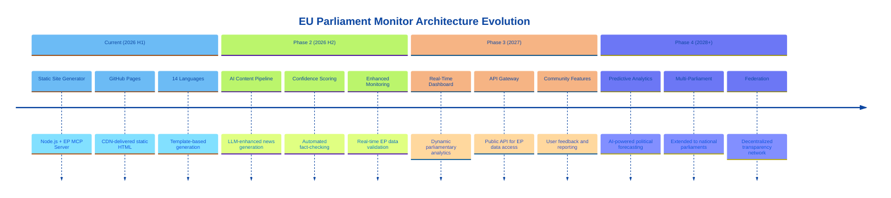
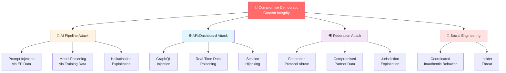
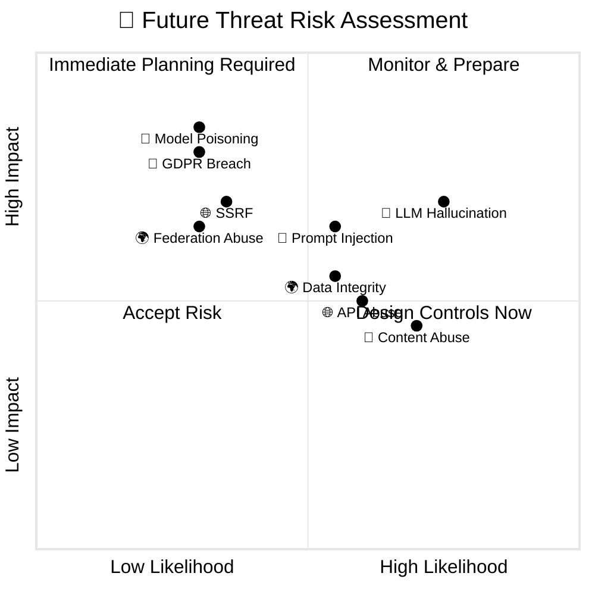

  

<h1 align="center">🔮 EU Parliament Monitor — Future Threat Model</h1>

  <strong>🛡️ Evolving Threat Landscape & Planned Security Controls</strong> 
  <em>🔍 Future Architecture Threats • AI/LLM Security • Advanced Democratic Protection</em>

  
  
  
  
  

**📋 Document Owner:** CEO | **📄 Version:** 2.0 | **📅 Last Updated:**
2026-03-19 (UTC)  
**🔄 Review Cycle:** Quarterly | **⏰ Next Review:** 2026-06-19  
**🏷️ Classification:** Public (Open Civic Transparency Platform)

---

## 📚 Architecture Documentation Map

| Category | Document | Description | Status |
| --- | --- | --- | --- |
| **🏛️ Architecture** | [ARCHITECTURE.md](ARCHITECTURE.md) | C4 model system architecture | ✅ Current |
| **📊 Data Model** | [DATA_MODEL.md](DATA_MODEL.md) | Entity relationships and data flow | ✅ Current |
| **🔄 Flowchart** | [FLOWCHART.md](FLOWCHART.md) | Process workflows and data flows | ✅ Current |
| **📈 State Diagram** | [STATEDIAGRAM.md](STATEDIAGRAM.md) | System state transitions | ✅ Current |
| **🧠 Mind Map** | [MINDMAP.md](MINDMAP.md) | Conceptual system relationships | ✅ Current |
| **💼 SWOT** | [SWOT.md](SWOT.md) | Strategic analysis | ✅ Current |
| **🛡️ Security** | [SECURITY_ARCHITECTURE.md](SECURITY_ARCHITECTURE.md) | Security controls and architecture | ✅ Current |
| **🎯 Threats** | [THREAT_MODEL.md](THREAT_MODEL.md) | Current threat landscape (20 threats) | ✅ Current |
| **🔮 Future Threats** | **FUTURE_THREAT_MODEL.md** | **This document** — Future threat analysis | 📋 Planning |
| **🚀 Future Architecture** | [FUTURE_ARCHITECTURE.md](FUTURE_ARCHITECTURE.md) | Architectural evolution roadmap | 📋 Planning |
| **🚀 Future Security** | [FUTURE_SECURITY_ARCHITECTURE.md](FUTURE_SECURITY_ARCHITECTURE.md) | Planned security enhancements | 📋 Planning |

---

## 🎯 Purpose & Scope

This document identifies **emerging threats** and **planned security controls** for the EU Parliament Monitor as it evolves from a static site generator into an advanced European Parliament intelligence platform. It complements the current [THREAT_MODEL.md](THREAT_MODEL.md) with forward-looking analysis of threats that will materialize as new capabilities are added.

### **🌟 Transparency Commitment**

As an open-source European Parliament monitoring platform, this future threat model is published publicly to:

- 🔍 **Demonstrate Proactive Security**: Show commitment to anticipating threats before they materialize
- 📋 **Enable Community Review**: Allow security researchers to review planned defenses
- 🏛️ **Democratic Accountability**: Ensure transparency in protecting democratic information systems
- 🤝 **Build Trust**: Provide evidence of systematic security planning to stakeholders

### **📚 Framework Integration**

This future threat model follows the [Hack23 ISMS Threat Modeling Policy](https://github.com/Hack23/ISMS-PUBLIC/blob/main/Threat_Modeling.md) framework:

- **STRIDE Framework**: Threat categorization per future system component
- **MITRE ATT&CK**: Technique mapping for emerging attack vectors
- **ENISA Threat Landscape**: EU-specific threat intelligence integration
- **OWASP LLM Top 10**: AI/LLM-specific threat classification
- **CIA Triad**: Confidentiality, Integrity, Availability impact analysis

### **🔗 Reference Documents**

| Document | Purpose |
|---|---|
| [THREAT_MODEL.md](THREAT_MODEL.md) | Current threat landscape (20 threats, v2.0) |
| [FUTURE_ARCHITECTURE.md](FUTURE_ARCHITECTURE.md) | Planned architectural evolution |
| [FUTURE_SECURITY_ARCHITECTURE.md](FUTURE_SECURITY_ARCHITECTURE.md) | Planned security controls |
| [Hack23 ISMS - Threat Modeling](https://github.com/Hack23/ISMS-PUBLIC/blob/main/Threat_Modeling.md) | Policy framework |
| [Hack23 ISMS - Secure Development](https://github.com/Hack23/ISMS-PUBLIC/blob/main/Secure_Development_Policy.md) | Secure SDLC requirements |
| [Hack23 ISMS - Vulnerability Management](https://github.com/Hack23/ISMS-PUBLIC/blob/main/Vulnerability_Management.md) | Vulnerability lifecycle management |

---

## 🔄 Planned Architecture Evolution

### **📊 Architecture Transition Timeline**

```mermaid
%%{
  init: {
    'theme': 'base',
    'themeVariables': {
      'primaryColor': '#e3f2fd',
      'primaryTextColor': '#0d47a1',
      'lineColor': '#1976d2'
    }
  }
}%%
timeline
    title EU Parliament Monitor Architecture Evolution
    section Current (2026 H1)
        Static Site Generator : Node.js + EP MCP Server
        GitHub Pages : CDN-delivered static HTML
        14 Languages : Template-based generation
    section Phase 2 (2026 H2)
        AI Content Pipeline : LLM-enhanced news generation
        Confidence Scoring : Automated fact-checking
        Enhanced Monitoring : Real-time EP data validation
    section Phase 3 (2027)
        Real-Time Dashboard : Dynamic parliamentary analytics
        API Gateway : Public API for EP data access
        Community Features : User feedback and reporting
    section Phase 4 (2028+)
        Predictive Analytics : AI-powered political forecasting
        Multi-Parliament : Extended to national parliaments
        Federation : Decentralized transparency network
```

### **📊 Attack Surface Evolution**

```mermaid
flowchart LR
    subgraph "Current Attack Surface"
        direction TB
        C1[📄 Static HTML] --- C2[🔌 EP MCP Client]
        C2 --- C3[⚙️ GitHub Actions]
        C3 --- C4[📦 npm Dependencies]
    end

    subgraph "Phase 2 Attack Surface"
        direction TB
        P2_1[🤖 LLM Pipeline] --- P2_2[📊 Confidence Scoring]
        P2_2 --- P2_3[🔍 Fact Checking]
        P2_3 --- P2_4[📡 Enhanced Monitoring]
    end

    subgraph "Phase 3 Attack Surface"
        direction TB
        P3_1[🌐 API Gateway] --- P3_2[👥 User Accounts]
        P3_2 --- P3_3[💬 Community Features]
        P3_3 --- P3_4[📊 Real-Time Dashboard]
    end

    subgraph "Phase 4 Attack Surface"
        direction TB
        P4_1[🌍 Multi-Parliament] --- P4_2[🔗 Federation Protocol]
        P4_2 --- P4_3[🧠 Predictive AI]
        P4_3 --- P4_4[📈 Analytics Engine]
    end

    C4 -.->|"+8-12 threats"| P2_1
    P2_4 -.->|"+10-15 threats"| P3_1
    P3_4 -.->|"+5-8 threats"| P4_1

    style C1 fill:#e8f5e9
    style P2_1 fill:#fff4e1
    style P3_1 fill:#ffe1e1
    style P4_1 fill:#f3e5f5
```

---

## 💎 Future Critical Assets & Protection Goals

### **🏗️ Asset-Centric Analysis for Future Architecture**

| Asset | Phase | CIA Classification | Protection Priority |
| --- | --- | --- | --- |
| **AI/LLM Models** | Phase 2 | C:Low, I:Critical, A:High | Model integrity, provenance verification |
| **API Keys & OAuth Tokens** | Phase 3 | C:High, I:High, A:Medium | Secret management, rotation policies |
| **User Account Data** | Phase 3 | C:High (GDPR), I:High, A:Medium | Privacy by design, encryption at rest |
| **Community Content** | Phase 3 | C:Public, I:High, A:Medium | Content integrity, moderation |
| **Federation Credentials** | Phase 4 | C:Critical, I:Critical, A:High | Mutual TLS, certificate management |
| **Predictive Models** | Phase 4 | C:Medium, I:Critical, A:Medium | Model integrity, bias prevention |
| **Cross-Parliament Data** | Phase 4 | C:Low, I:Critical, A:High | Data reconciliation, source verification |

### **🔐 Crown Jewel Analysis (Future State)**

| Crown Jewel | Threat Category | Worst-Case Impact | Protection Strategy |
| --- | --- | --- | --- |
| **Democratic Content Integrity** | Data Manipulation | Public misinformation from trusted source | Multi-layer validation, confidence scoring, human review |
| **User Privacy (GDPR)** | Data Breach | Regulatory fines, reputation damage | Privacy by design, data minimization, encryption |
| **AI Model Integrity** | Model Poisoning | Systematically biased political content | Model provenance, training data audit, bias detection |
| **Federation Trust** | Protocol Abuse | Cross-platform trust compromise | Mutual TLS, zero-trust architecture, audit logging |

---

## 🆕 Future Threat Categories

### **🤖 FT-001: AI/LLM Content Generation Threats**

**Applies to:** Phase 2 (AI Content Pipeline)

| Threat | Description | STRIDE | MITRE ATT&CK | Likelihood | Impact | Mitigation Strategy |
|---|---|---|---|---|---|---|
| **LLM Prompt Injection** | Adversarial EP data crafted to manipulate LLM output during news generation | Tampering | [T1059](https://attack.mitre.org/techniques/T1059/) | Medium | High | Input sanitization, prompt engineering guardrails, output validation |
| **LLM Hallucination** | AI generates plausible but incorrect parliamentary information | Tampering | N/A | High | High | Confidence scoring, human-in-the-loop for <0.85 confidence, cross-reference validation |
| **Model Poisoning** | Training data manipulation to bias AI-generated content | Tampering | [T1565](https://attack.mitre.org/techniques/T1565/) | Low | Critical | Model provenance verification, training data audit, bias detection |
| **LLM Data Leakage** | AI model inadvertently exposing sensitive information in generated content | Information Disclosure | [T1530](https://attack.mitre.org/techniques/T1530/) | Low | Medium | Output filtering, PII detection, content review pipeline |
| **Adversarial Prompt via EP Data** | Crafted parliamentary text exploiting LLM instruction-following | Tampering | [T1059.006](https://attack.mitre.org/techniques/T1059/006/) | Medium | High | Input boundary enforcement, system prompt hardening |
| **Model Supply Chain Attack** | Compromised LLM model weights or framework dependency | Tampering | [T1195](https://attack.mitre.org/techniques/T1195/) | Low | Critical | Model checksums, signed artifacts, provenance verification |

**OWASP LLM Top 10 Alignment:**

| OWASP LLM ID | Threat | EU Parliament Monitor Relevance | Planned Control |
|---|---|---|---|
| **LLM01** | Prompt Injection | EP data used as LLM input could contain injection vectors | Input sanitization, prompt hardening |
| **LLM02** | Insecure Output Handling | Generated HTML could contain unsafe content from LLM | Output validation, CSP, auto-escaping |
| **LLM04** | Model Denial of Service | Excessive EP data could overwhelm LLM processing | Rate limiting, input size caps, timeout enforcement |
| **LLM05** | Supply Chain Vulnerabilities | LLM model or framework dependencies could be compromised | Model provenance, dependency scanning |
| **LLM06** | Sensitive Information Disclosure | LLM might include sensitive patterns from training data | Output filtering, content review |
| **LLM09** | Overreliance | Trusting LLM output without verification | Confidence scoring, human review queue |

### **🌐 FT-002: API Gateway & Dynamic Content Threats**

**Applies to:** Phase 3 (Real-Time Dashboard)

| Threat | Description | STRIDE | MITRE ATT&CK | Likelihood | Impact | Mitigation Strategy |
|---|---|---|---|---|---|---|
| **API Abuse** | Rate limiting bypass, credential stuffing on API endpoints | Denial of Service | [T1110](https://attack.mitre.org/techniques/T1110/) | Medium | Medium | OAuth2/API keys, rate limiting, WAF rules |
| **Server-Side Request Forgery** | API gateway exploited to access internal resources | Elevation of Privilege | [T1190](https://attack.mitre.org/techniques/T1190/) | Low | High | Strict allowlisting, network segmentation |
| **Real-Time Data Poisoning** | Malicious data injected into live dashboard feeds | Tampering | [T1565](https://attack.mitre.org/techniques/T1565/) | Low | High | Schema validation, anomaly detection, data signing |
| **Session Hijacking** | Authenticated user sessions compromised | Spoofing | [T1539](https://attack.mitre.org/techniques/T1539/) | Low | Medium | Secure session management, HTTPS-only, SameSite cookies |
| **GraphQL Injection** | Malicious queries exploiting GraphQL endpoint complexity | Tampering | [T1190](https://attack.mitre.org/techniques/T1190/) | Medium | Medium | Query depth limiting, complexity analysis, rate limiting |
| **WebSocket Hijacking** | Real-time data stream interception or manipulation | Spoofing | [T1557](https://attack.mitre.org/techniques/T1557/) | Low | High | WSS (TLS), origin validation, message authentication |

### **👥 FT-003: Community Feature Threats**

**Applies to:** Phase 3 (Community Features)

| Threat | Description | STRIDE | MITRE ATT&CK | Likelihood | Impact | Mitigation Strategy |
|---|---|---|---|---|---|---|
| **User-Generated Content Abuse** | Spam, disinformation, or political manipulation via feedback system | Tampering | [T1491](https://attack.mitre.org/techniques/T1491/) | High | Medium | Content moderation, anti-spam filters, reporting mechanism |
| **GDPR Data Breach** | User personal data exposure from community features | Information Disclosure | [T1530](https://attack.mitre.org/techniques/T1530/) | Low | Critical | Privacy by design, data minimization, encryption at rest |
| **Account Takeover** | Community user accounts compromised for manipulation | Spoofing | [T1078](https://attack.mitre.org/techniques/T1078/) | Medium | Medium | MFA, rate limiting, anomaly detection |
| **Coordinated Inauthentic Behavior** | Bot networks manipulating community sentiment | Repudiation | [T1583](https://attack.mitre.org/techniques/T1583/) | Medium | High | Bot detection, behavioral analysis, rate limiting |
| **Cross-Site Scripting (Stored)** | User-submitted content containing XSS payloads | Tampering | [T1189](https://attack.mitre.org/techniques/T1189/) | Medium | High | Input sanitization, CSP, output encoding |

### **🌍 FT-004: Multi-Parliament Federation Threats**

**Applies to:** Phase 4 (Multi-Parliament)

| Threat | Description | STRIDE | MITRE ATT&CK | Likelihood | Impact | Mitigation Strategy |
|---|---|---|---|---|---|---|
| **Cross-Parliament Data Integrity** | Inconsistent data between EU and national parliament sources | Tampering | [T1565](https://attack.mitre.org/techniques/T1565/) | Medium | Medium | Data reconciliation, source verification, integrity checksums |
| **Federation Protocol Abuse** | Exploiting inter-system communication for unauthorized data access | Elevation of Privilege | [T1071](https://attack.mitre.org/techniques/T1071/) | Low | High | Mutual TLS, API authentication, protocol validation |
| **Jurisdiction Conflict** | Different privacy laws (GDPR vs. national) creating compliance gaps | N/A | N/A | Medium | Medium | Legal review per jurisdiction, data classification, consent management |
| **Supply Chain via Federation Partner** | Compromised national parliament data source injecting malicious data | Tampering | [T1195.002](https://attack.mitre.org/techniques/T1195/002/) | Low | Critical | Source validation, data integrity checks, anomaly detection |
| **DNS Hijacking of Federation Endpoints** | Redirecting federation traffic to attacker-controlled servers | Spoofing | [T1584.002](https://attack.mitre.org/techniques/T1584/002/) | Low | High | Certificate pinning, DNSSEC, mutual TLS |

---

## 🎖️ MITRE ATT&CK Future Coverage Analysis

### **📊 ATT&CK Tactics for Emerging Attack Surface**

| Tactic | Current Coverage | Phase 2 (AI) | Phase 3 (API) | Phase 4 (Federation) |
| --- | --- | --- | --- | --- |
| **Initial Access** | ✅ Supply chain, dependency | 🔮 Model poisoning | 🔮 API exploitation, credential stuffing | 🔮 Federation endpoint abuse |
| **Execution** | ✅ GitHub Actions | 🔮 Prompt injection, LLM manipulation | 🔮 GraphQL injection | 🔮 Cross-parliament code execution |
| **Persistence** | ✅ Repository compromise | 🔮 Backdoored models | 🔮 Account persistence, session fixation | 🔮 Federation trust abuse |
| **Privilege Escalation** | ✅ Token scope abuse | 🔮 Model authority escalation | 🔮 OAuth scope escalation | 🔮 Cross-jurisdiction privilege |
| **Defense Evasion** | ✅ SHA pinning bypass | 🔮 Adversarial input evasion | 🔮 WAF bypass | 🔮 Cross-border evasion |
| **Credential Access** | ✅ Secret exposure | 🔮 API key extraction from LLM | 🔮 OAuth token theft | 🔮 mTLS certificate theft |
| **Collection** | ✅ EP data access | 🔮 Training data extraction | 🔮 User data scraping | 🔮 Cross-parliament data harvest |
| **Impact** | ✅ Content manipulation | 🔮 Systematic bias injection | 🔮 Service disruption, data manipulation | 🔮 Democratic process manipulation |

### **🌳 Future Attack Trees**

```mermaid
graph TD
    ROOT[🎯 Compromise Democratic<br/>Content Integrity] --> AI[🤖 AI Pipeline Attack]
    ROOT --> API[🌐 API/Dashboard Attack]
    ROOT --> FED[🌍 Federation Attack]
    ROOT --> SOCIAL[👥 Social Engineering]

    AI --> AI1[Prompt Injection<br/>via EP Data]
    AI --> AI2[Model Poisoning<br/>via Training Data]
    AI --> AI3[Hallucination<br/>Exploitation]

    API --> API1[GraphQL<br/>Injection]
    API --> API2[Real-Time Data<br/>Poisoning]
    API --> API3[Session<br/>Hijacking]

    FED --> FED1[Federation<br/>Protocol Abuse]
    FED --> FED2[Compromised<br/>Partner Data]
    FED --> FED3[Jurisdiction<br/>Exploitation]

    SOCIAL --> SOC1[Coordinated<br/>Inauthentic Behavior]
    SOCIAL --> SOC2[Insider<br/>Threat]

    style ROOT fill:#ff6b6b,color:#fff
    style AI fill:#fff4e1
    style API fill:#e1f5ff
    style FED fill:#f3e5f5
    style SOCIAL fill:#ffe1e1
```

---

## 👥 Future Threat Agent Evolution

### **📊 Evolving Threat Actor Landscape**

| Agent Type | Current Risk | Phase 2 Risk | Phase 3 Risk | Phase 4 Risk | Evolution Driver |
| --- | --- | --- | --- | --- | --- |
| **🏛️ Nation-State Actors** | Medium | High | High | Critical | AI manipulation tools, geopolitical interest in EU data |
| **💰 Cybercriminals** | Low | Medium | High | High | API monetization creates financial targets |
| **🎭 Hacktivists** | Medium | Medium | High | High | Community features enable social manipulation |
| **👤 Malicious Insiders** | Low | Medium | Medium | High | Expanded team, federation partners |
| **🔧 Accidental Insiders** | Medium | High | High | High | AI complexity increases error probability |
| **🤖 AI-Powered Attackers** | Low | High | High | Critical | Automated adversarial content generation |

### **🎯 Future Threat Agent Capabilities**

| Capability | 2026 (Current) | 2027 (Phase 3) | 2028+ (Phase 4) |
| --- | --- | --- | --- |
| **Adversarial ML** | Emerging | Mainstream | Advanced |
| **Automated Content Manipulation** | Basic | Sophisticated | AI-native |
| **Cross-Platform Attacks** | Limited | Moderate | Advanced (federation) |
| **Supply Chain Sophistication** | Known patterns | AI model supply chain | Federation supply chain |
| **Democratic Process Targeting** | Election periods | Continuous influence | Systemic manipulation |

---

## 📊 Future Risk Assessment

### **🎯 Risk Matrix for Future Threats**

```mermaid
%%{
  init: {
    'theme': 'base',
    'themeVariables': {
      'primaryColor': '#fff',
      'primaryTextColor': '#000',
      'lineColor': '#333'
    }
  }
}%%
quadrantChart
    title 🔮 Future Threat Risk Assessment
    x-axis Low Likelihood --> High Likelihood
    y-axis Low Impact --> High Impact
    quadrant-1 Monitor & Prepare
    quadrant-2 Immediate Planning Required
    quadrant-3 Accept Risk
    quadrant-4 Design Controls Now

    "🤖 LLM Hallucination": [0.75, 0.70]
    "🤖 Prompt Injection": [0.55, 0.65]
    "🤖 Model Poisoning": [0.30, 0.85]
    "🌐 API Abuse": [0.60, 0.50]
    "🌐 SSRF": [0.35, 0.70]
    "👥 Content Abuse": [0.70, 0.45]
    "👥 GDPR Breach": [0.30, 0.80]
    "🌍 Data Integrity": [0.55, 0.55]
    "🌍 Federation Abuse": [0.30, 0.65]
```

### **📈 Quantitative Risk Scoring (Future Threats)**

| Threat ID | Threat | Likelihood (1-5) | Impact (1-5) | Risk Score | Priority |
| --- | --- | --- | --- | --- | --- |
| FT-001a | LLM Prompt Injection | 3 | 4 | 12 | 🔴 High |
| FT-001b | LLM Hallucination | 4 | 4 | 16 | 🔴 Critical |
| FT-001c | Model Poisoning | 2 | 5 | 10 | 🔴 High |
| FT-001d | LLM Data Leakage | 2 | 3 | 6 | 🟡 Medium |
| FT-001e | Adversarial Prompt | 3 | 4 | 12 | 🔴 High |
| FT-001f | Model Supply Chain | 2 | 5 | 10 | 🔴 High |
| FT-002a | API Abuse | 3 | 3 | 9 | 🟡 Medium |
| FT-002b | SSRF | 2 | 4 | 8 | 🟡 Medium |
| FT-002c | Data Poisoning | 2 | 4 | 8 | 🟡 Medium |
| FT-002d | Session Hijacking | 2 | 3 | 6 | 🟡 Medium |
| FT-003a | Content Abuse | 4 | 3 | 12 | 🔴 High |
| FT-003b | GDPR Breach | 2 | 5 | 10 | 🔴 High |
| FT-003c | Account Takeover | 3 | 3 | 9 | 🟡 Medium |
| FT-004a | Cross-Parliament Integrity | 3 | 3 | 9 | 🟡 Medium |
| FT-004b | Federation Protocol Abuse | 2 | 4 | 8 | 🟡 Medium |

### **📈 Threat Evolution Timeline**

| Phase | New Attack Surface | Threat Count Increase | Key New Controls Required |
|---|---|---|---|
| **Current** | Static site + EP MCP | 20 threats (baseline) | Schema validation, CSP, SAST |
| **Phase 2** | + AI/LLM pipeline | +8-12 threats (LLM-specific) | Confidence scoring, output validation, prompt hardening |
| **Phase 3** | + API gateway, users | +10-15 threats (API/user) | WAF, OAuth2, rate limiting, session management |
| **Phase 4** | + Multi-parliament federation | +5-8 threats (federation) | Mutual TLS, data reconciliation, jurisdiction management |

---

## 🎯 Scenario-Centric Future Threat Analysis

### **🎭 Misuse Cases**

#### **Misuse Case 1: AI-Powered Disinformation Campaign**

**Scenario:** A nation-state actor identifies that EU Parliament Monitor uses LLM-generated content. They craft adversarial European Parliament documents designed to trigger specific LLM outputs, injecting subtle political bias into generated news articles across all 14 languages.

**Attack Path:**
1. Attacker submits amendments to EP documents with adversarial text patterns
2. EP MCP Server fetches legitimate EP data containing adversarial content
3. LLM processes the data and generates subtly biased news articles
4. Biased content published across 14 languages, amplifying disinformation

**Impact:** Medium-High — Undermines democratic transparency platform credibility

**Mitigation:** Confidence scoring, cross-reference validation, multi-source fact-checking, human review queue for political content

#### **Misuse Case 2: Community Feature Manipulation**

**Scenario:** A coordinated group creates fake user accounts to systematically upvote/downvote community assessments of MEP activities, creating artificial consensus around political positions.

**Attack Path:**
1. Attacker registers multiple accounts using disposable email services
2. Bot network systematically rates/reviews MEP activities
3. Artificial consensus distorts public perception via platform

**Impact:** High — Platform becomes tool for political manipulation rather than transparency

**Mitigation:** Bot detection, behavioral analysis, rate limiting per account, proof-of-work for registration, anomaly detection on voting patterns

### **🤔 What-If Analysis**

| What-If Scenario | Probability | Impact | Response Strategy |
| --- | --- | --- | --- |
| **What if EP Open Data API introduces authentication?** | Medium | High | Implement OAuth2 client, update MCP server, credential rotation |
| **What if a major LLM provider has a security breach?** | Low | Critical | Model isolation, fallback to template-based generation, incident response |
| **What if EU AI Act mandates content labeling?** | High | Medium | Implement AI content disclosure, transparency watermarking |
| **What if a federation partner is compromised?** | Low | High | Mutual TLS revocation, data quarantine, partner isolation |
| **What if coordinated attack targets during EU elections?** | Medium | Critical | Election security protocols, enhanced monitoring, manual override |

---

## 🛡️ Planned Security Controls

### **Phase 2: AI Content Pipeline Security**

| Control | Purpose | Priority | Timeline | STRIDE Mitigation |
|---|---|---|---|---|
| **Confidence Scoring System** | Score 0.0-1.0 for each generated article; human review if <0.85 | P1 | Q3 2026 | Tampering |
| **LLM Output Validation** | Automated fact-checking against official EP data sources | P1 | Q3 2026 | Tampering |
| **Prompt Injection Detection** | Input sanitization for EP data before LLM processing | P1 | Q3 2026 | Tampering |
| **Content Integrity Pipeline** | Cross-reference generated content with source EP data | P2 | Q4 2026 | Tampering, Repudiation |
| **AI Bias Detection** | Automated political neutrality checking across 14 languages | P2 | Q4 2026 | Tampering |
| **Model Provenance Verification** | Signed model artifacts, checksum validation | P1 | Q3 2026 | Tampering |

### **Phase 3: API & Community Security**

| Control | Purpose | Priority | Timeline | STRIDE Mitigation |
|---|---|---|---|---|
| **API Gateway with WAF** | Rate limiting, authentication, request validation | P1 | Q1 2027 | DoS, Tampering |
| **OAuth2/OIDC Authentication** | Secure user authentication for community features | P1 | Q1 2027 | Spoofing |
| **Content Moderation System** | Anti-spam, disinformation detection, reporting | P1 | Q2 2027 | Tampering, Repudiation |
| **GDPR Compliance Layer** | Privacy by design, data minimization, consent management | P1 | Q1 2027 | Information Disclosure |
| **Real-Time Anomaly Detection** | Monitor live data feeds for integrity violations | P2 | Q2 2027 | Tampering |
| **GraphQL Query Complexity Limiting** | Prevent denial-of-service via complex queries | P1 | Q1 2027 | DoS |

### **Phase 4: Federation Security**

| Control | Purpose | Priority | Timeline | STRIDE Mitigation |
|---|---|---|---|---|
| **Mutual TLS for Federation** | Secure inter-parliament communication | P1 | 2028 | Spoofing, Tampering |
| **Data Reconciliation Engine** | Cross-validate data between parliament sources | P1 | 2028 | Tampering |
| **Jurisdiction Compliance Engine** | Automated GDPR/national law compliance checking | P2 | 2028 | Information Disclosure |
| **Zero-Trust Federation Architecture** | Never trust, always verify partner data | P1 | 2028 | Spoofing, Elevation of Privilege |
| **Federation Audit Trail** | Immutable logging of all cross-parliament operations | P1 | 2028 | Repudiation |

---

## 📋 Future Compliance Framework Mapping

### **📊 Emerging Regulatory Landscape**

| Regulation | Effective Date | Impact on EP Monitor | Required Controls |
| --- | --- | --- | --- |
| **EU AI Act** | 2026-2027 | AI content generation transparency requirements | AI content labeling, risk assessment, bias detection |
| **EU Cyber Resilience Act (CRA)** | 2027 | Software security requirements for open-source | SBOM, vulnerability disclosure, security updates |
| **NIS2 Directive** | Already effective | Critical infrastructure security (if classified) | Incident reporting, risk management, supply chain security |
| **GDPR** | Already effective | User data protection for community features | Privacy by design, DPO, DPIA, consent management |
| **EU Data Act** | 2025-2026 | Data sharing and interoperability requirements | Data portability, fair access, interoperability standards |

### **🏛️ Future ISO 27001:2022 Control Mapping**

| Control | Phase 2 Relevance | Phase 3 Relevance | Phase 4 Relevance |
| --- | --- | --- | --- |
| **A.5.23 Cloud Security** | LLM API security | API gateway cloud deployment | Federation cloud architecture |
| **A.8.9 Configuration Management** | AI pipeline config | API & user config | Federation config management |
| **A.8.12 Data Leakage Prevention** | LLM output filtering | User data protection | Cross-border data controls |
| **A.8.25 Secure Development** | AI pipeline testing | API security testing | Federation protocol testing |
| **A.8.28 Secure Coding** | Prompt engineering | API input validation | Protocol implementation |

---

## 🔄 Continuous Threat Landscape Monitoring

### **📡 Emerging Threat Indicators**

The following developments should trigger a threat model update:

| Indicator | Trigger Action | Review Priority |
|---|---|---|
| **New LLM vulnerability class discovered** | Update OWASP LLM Top 10 alignment | 🔴 High |
| **EP API major version change** | Re-assess data integrity controls | 🔴 High |
| **European Parliament election period** | Activate election security protocols | 🔴 High |
| **New ENISA Threat Landscape published** | Update ENISA alignment section | 🟡 Medium |
| **GitHub Actions security advisory** | Review CI/CD security controls | 🟡 Medium |
| **New EU regulation (AI Act, CRA update)** | Update compliance mapping | 🟡 Medium |
| **National parliament data source added** | Expand threat model scope | 🟡 Medium |
| **Major LLM provider breach or incident** | Review AI pipeline security controls | 🔴 High |
| **Federation partner security incident** | Activate partner isolation protocols | 🔴 High |

### **📅 Future Assessment Lifecycle**

| Assessment Type | Frequency | Trigger | Scope |
| --- | --- | --- | --- |
| **Quarterly Review** | Every 3 months | Scheduled | Full threat landscape review |
| **Phase Transition Assessment** | Per architecture phase | Phase completion | New attack surface analysis |
| **Incident-Driven Assessment** | As needed | Security incident | Affected threat categories |
| **Regulatory Update Assessment** | As needed | New regulation | Compliance impact analysis |
| **ENISA-Triggered Review** | Annually | ENISA report publication | EU threat landscape alignment |

---

## 🎯 Future Threat Modeling Maturity

### **📈 Planned Maturity Progression**

| Level | Phase | Capabilities | Evidence |
| --- | --- | --- | --- |
| **🟢 Level 2: Repeatable** | Current | Structured STRIDE analysis, MITRE ATT&CK mapping | THREAT_MODEL.md v2.0 |
| **🟡 Level 3: Defined** | Phase 2 | AI-specific threat modeling, automated threat detection | OWASP LLM integration, CI/CD security gates |
| **🟠 Level 4: Managed** | Phase 3 | Quantitative risk assessment, threat intelligence feeds | Real-time monitoring, SIEM integration |
| **🔴 Level 5: Optimized** | Phase 4 | Predictive threat analysis, automated response | AI-driven threat detection, self-healing controls |

---

## 📚 Related Documents

| Document | Description | Link |
|---|---|---|
| **THREAT_MODEL.md** | Current threat landscape (20 threats) | [THREAT_MODEL.md](THREAT_MODEL.md) |
| **SECURITY_ARCHITECTURE.md** | Current security controls | [SECURITY_ARCHITECTURE.md](SECURITY_ARCHITECTURE.md) |
| **FUTURE_SECURITY_ARCHITECTURE.md** | Planned security enhancements | [FUTURE_SECURITY_ARCHITECTURE.md](FUTURE_SECURITY_ARCHITECTURE.md) |
| **FUTURE_ARCHITECTURE.md** | Planned architectural evolution | [FUTURE_ARCHITECTURE.md](FUTURE_ARCHITECTURE.md) |
| **Hack23 ISMS - Threat Modeling** | Policy framework | [Threat_Modeling.md](https://github.com/Hack23/ISMS-PUBLIC/blob/main/Threat_Modeling.md) |
| **Hack23 ISMS - Secure Development** | Secure SDLC requirements | [Secure_Development_Policy.md](https://github.com/Hack23/ISMS-PUBLIC/blob/main/Secure_Development_Policy.md) |
| **Hack23 ISMS - Vulnerability Management** | Vulnerability lifecycle | [Vulnerability_Management.md](https://github.com/Hack23/ISMS-PUBLIC/blob/main/Vulnerability_Management.md) |
| **Hack23 ISMS - Classification** | Data classification framework | [CLASSIFICATION.md](https://github.com/Hack23/ISMS-PUBLIC/blob/main/CLASSIFICATION.md) |

---

## Approval and Review

| Role                   | Name          | Date       | Signature |
| ---------------------- | ------------- | ---------- | --------- |
| **Security Architect** | Security Team | 2026-03-19 | Approved  |
| **Product Owner**      | Product Team  | 2026-03-19 | Approved  |
| **CEO / CISO**         | CEO           | 2026-03-19 | Approved  |

### **📝 Change Log**

| Version | Date       | Author        | Changes                                                |
| ------- | ---------- | ------------- | ------------------------------------------------------ |
| 1.0     | 2026-02-26 | Security Team | Initial future threat model document                   |
|         |            |               | - AI/LLM threat analysis (OWASP LLM Top 10 alignment) |
|         |            |               | - API gateway and dynamic content threats              |
|         |            |               | - Community feature threat analysis                    |
|         |            |               | - Multi-parliament federation threats                  |
|         |            |               | - Planned security controls roadmap (Phase 2-4)        |
|         |            |               | - Emerging threat indicator monitoring plan            |
| 2.0     | 2026-03-19 | Security Team | Major expansion per ISMS Threat Modeling Policy        |
|         |            |               | - Added architecture documentation map                 |
|         |            |               | - Added STRIDE categorization to all threats           |
|         |            |               | - Added MITRE ATT&CK future coverage analysis          |
|         |            |               | - Added future attack trees with Mermaid diagrams      |
|         |            |               | - Added threat agent evolution analysis                |
|         |            |               | - Added quantitative risk scoring                      |
|         |            |               | - Added scenario-centric analysis (misuse cases)       |
|         |            |               | - Added what-if analysis                               |
|         |            |               | - Added future compliance framework mapping            |
|         |            |               | - Added crown jewel analysis for future state          |
|         |            |               | - Added threat modeling maturity progression           |
|         |            |               | - Added attack surface evolution diagram               |

---

**📋 Document Control:**  
**✅ Approved by:** James Pether Sörling, CEO - Hack23 AB  
**📤 Distribution:** Public  
**🏷️ Classification:**

---

_This future threat model anticipates the evolving threat landscape for the EU Parliament Monitor as it advances from a static site generator to a comprehensive European Parliament intelligence platform. It demonstrates Hack23 AB's commitment to proactive security through forward-looking threat analysis aligned with the [Hack23 ISMS Threat Modeling Policy](https://github.com/Hack23/ISMS-PUBLIC/blob/main/Threat_Modeling.md)._
