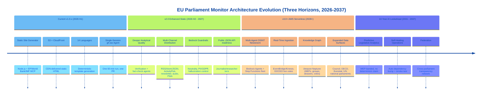
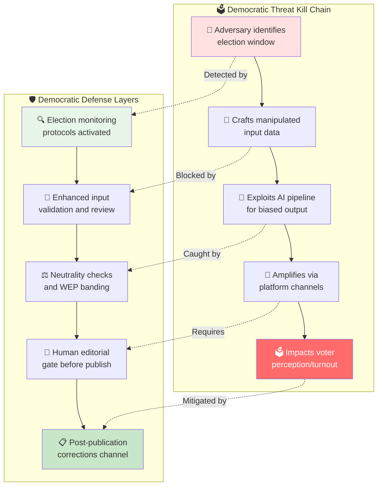
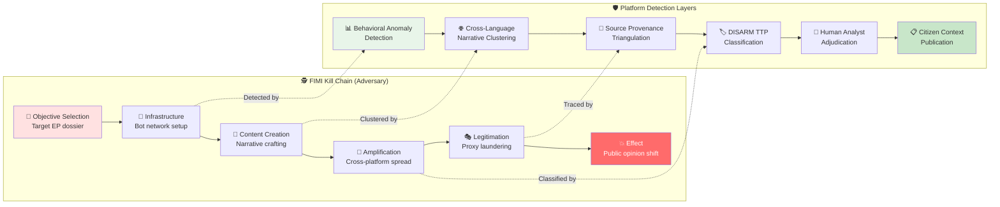
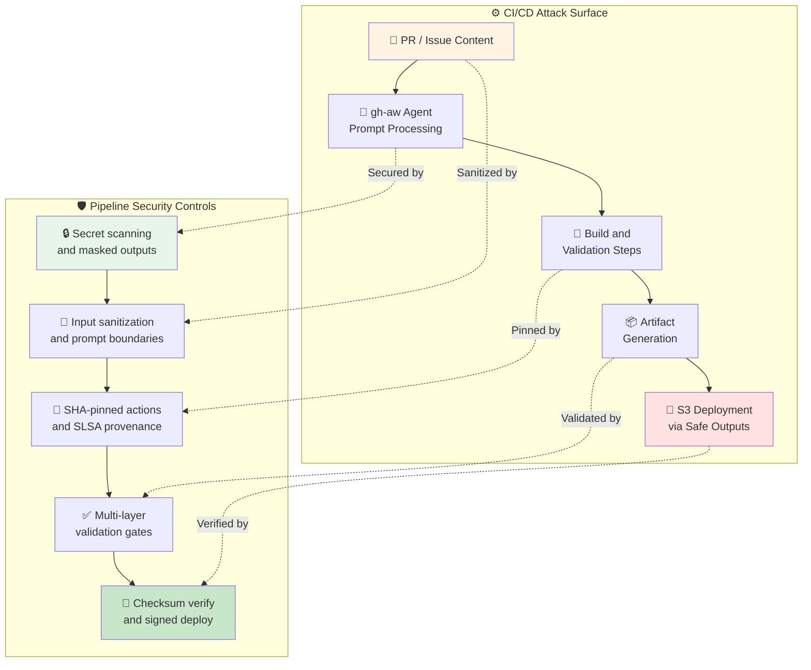
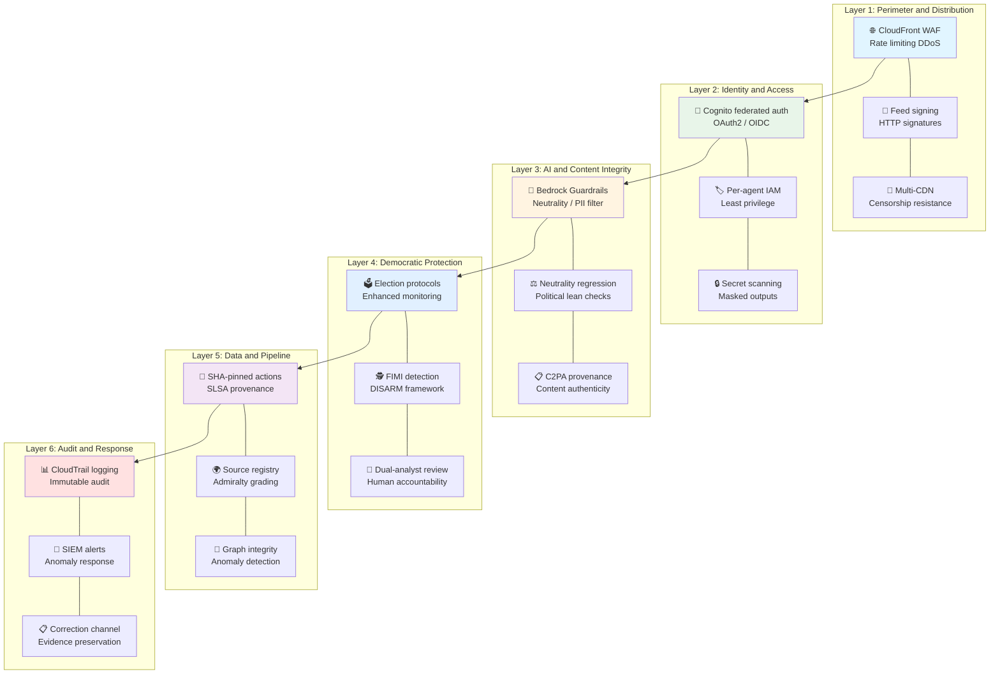
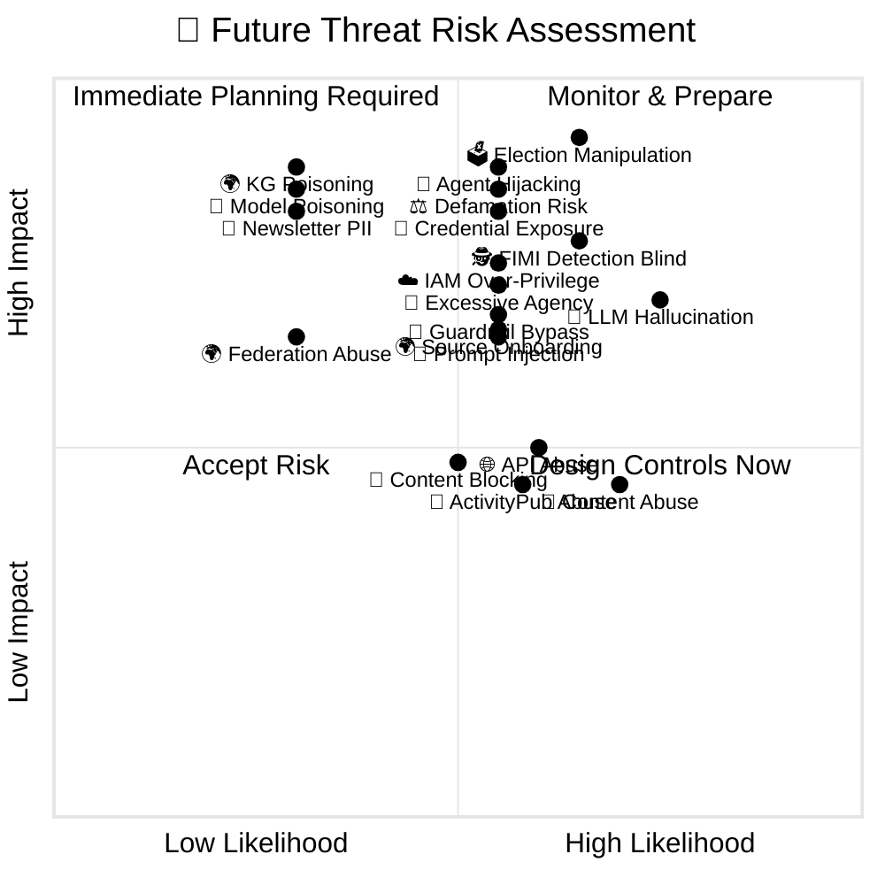

  

<h1 align="center">🔮 EU Parliament Monitor — Future Threat Model</h1>

  <strong>🛡️ Evolving Threat Landscape & Planned Security Controls (2026-2037)</strong> 
  <em>🔍 Three-Horizon AWS-Native Threats • Agentic AI/LLM Security • Multi-Channel Distribution • Advanced Democratic Protection</em>

  
  
  
  
  
  

**📋 Document Owner:** CEO | **📄 Version:** 3.1 | **📅 Last Updated:**
2026-05-31 (UTC) | **🚀 Release:** v1.0.1  
**🔄 Review Cycle:** Quarterly | **⏰ Next Review:** 2026-08-31  
**🏷️ Classification:** Public (Open Source European Parliament Monitoring Platform)

---

## 📚 Architecture Documentation Map

| Category | Document | Description | Status |
| --- | --- | --- | --- |
| **🏛️ Architecture** | [ARCHITECTURE.md](ARCHITECTURE.md) | C4 model system architecture | ✅ Current |
| **📊 Data Model** | [DATA_MODEL.md](DATA_MODEL.md) | Entity relationships and data flow | ✅ Current |
| **🔄 Flowchart** | [FLOWCHART.md](FLOWCHART.md) | Process workflows and data flows | ✅ Current |
| **📈 State Diagram** | [STATEDIAGRAM.md](STATEDIAGRAM.md) | System state transitions | ✅ Current |
| **🧠 Mind Map** | [MINDMAP.md](MINDMAP.md) | Conceptual system relationships | ✅ Current |
| **💼 SWOT** | [SWOT.md](SWOT.md) | Strategic analysis | ✅ Current |
| **🛡️ Security** | [SECURITY_ARCHITECTURE.md](SECURITY_ARCHITECTURE.md) | Security controls and architecture | ✅ Current |
| **🎯 Threats** | [THREAT_MODEL.md](THREAT_MODEL.md) | Current threat landscape (20 threats) | ✅ Current |
| **🔮 Future Threats** | **FUTURE_THREAT_MODEL.md** | **This document** — Future threat analysis | 📋 Planning |
| **🚀 Future Architecture** | [FUTURE_ARCHITECTURE.md](FUTURE_ARCHITECTURE.md) | Architectural evolution roadmap | 📋 Planning |
| **🚀 Future Security** | [FUTURE_SECURITY_ARCHITECTURE.md](FUTURE_SECURITY_ARCHITECTURE.md) | Planned security enhancements | 📋 Planning |

---

## 🎯 Purpose & Scope

This document identifies **emerging threats** and **planned security controls** for the EU Parliament Monitor as it evolves across **three horizons** — from today's static site generator (v1.0.x) into an **AWS-native serverless European Parliament intelligence platform** (v3.0+) authored by an **autonomous multi-agent OSINT newsroom** and distributed across **many channels**. It complements the current [THREAT_MODEL.md](THREAT_MODEL.md) with forward-looking analysis of threats that materialise as new capabilities are added, and it is aligned 1:1 with the three-horizon vision in [FUTURE_ARCHITECTURE.md](FUTURE_ARCHITECTURE.md) and the v5.0 scenarios in [FUTURE_MINDMAP.md](FUTURE_MINDMAP.md).

> **🧭 Horizon naming (consistent across the FUTURE_* portfolio):**
> **🟢 v2.0 — Enhanced Static Intelligence (2026 H2 → 2027)** · **🔵 v3.0+ — AWS-Native Serverless Platform (2028+)** · **⚪ 10-Year AI Lookahead (2026 → 2037)**.
> This version (3.0) supersedes the prior "Phase 2/3/4" framing and incorporates the four new future scenarios introduced in FUTURE_MINDMAP v5.0: the **autonomous multi-agent OSINT newsroom**, **multi-channel distribution and expanded data surfaces**, the **Amazon Neptune knowledge graph**, and **self-healing serverless operations** — each governed by the Hack23 **AI Policy** invariant (AI proposes, a human approves, no autonomous production deploy).

### **🌟 Transparency Commitment**

As an open-source European Parliament monitoring platform, this future threat model is published publicly to:

- 🔍 **Demonstrate Proactive Security**: Show commitment to anticipating threats before they materialize
- 📋 **Enable Community Review**: Allow security researchers to review planned defenses
- 🏛️ **Democratic Accountability**: Ensure transparency in protecting democratic information systems
- 🤝 **Build Trust**: Provide evidence of systematic security planning to stakeholders

### **📚 Framework Integration**

This future threat model follows the [Hack23 ISMS Threat Modeling Policy](https://github.com/Hack23/ISMS-PUBLIC/blob/main/Threat_Modeling.md) framework. **STRIDE is used here for software/platform security analysis** (distinct from the political-threat methodology used for editorial/intelligence analysis, where STRIDE is explicitly rejected):

- **STRIDE Framework**: Threat categorization per future system component (software-security context)
- **MITRE ATT&CK**: Technique mapping for emerging attack vectors
- **MITRE ATLAS**: Adversarial-ML / agentic-AI technique mapping for the Bedrock multi-agent layer
- **OWASP LLM Top 10 + OWASP Agentic / Multi-Agent threats**: AI/LLM and agent-orchestration threat classification
- **ENISA Threat Landscape**: EU-specific threat intelligence integration
- **CIA Triad**: Confidentiality, Integrity, Availability impact analysis

### **🔗 Reference Documents**

| Document | Purpose |
|---|---|
| [THREAT_MODEL.md](THREAT_MODEL.md) | Current threat landscape (20 threats, v2.4) |
| [FUTURE_ARCHITECTURE.md](FUTURE_ARCHITECTURE.md) | Three-horizon AWS-native architectural evolution (v4.0) |
| [FUTURE_SECURITY_ARCHITECTURE.md](FUTURE_SECURITY_ARCHITECTURE.md) | Planned security controls |
| [FUTURE_MINDMAP.md](FUTURE_MINDMAP.md) | v5.0 future scenarios (multi-agent newsroom, multi-channel distribution, expanded data surfaces, SWOT-to-future traceability) |
| [FUTURE_DATA_MODEL.md](FUTURE_DATA_MODEL.md) | AWS-native serverless data + knowledge-graph model |
| [Hack23 ISMS - Threat Modeling](https://github.com/Hack23/ISMS-PUBLIC/blob/main/Threat_Modeling.md) | Policy framework |
| [Hack23 ISMS - Secure Development](https://github.com/Hack23/ISMS-PUBLIC/blob/main/Secure_Development_Policy.md) | Secure SDLC requirements |
| [Hack23 ISMS - Vulnerability Management](https://github.com/Hack23/ISMS-PUBLIC/blob/main/Vulnerability_Management.md) | Vulnerability lifecycle management |

---

## 🔄 Planned Architecture Evolution

### **📊 Architecture Transition Timeline**

```mermaid
%%{
  init: {
    'theme': 'base',
    'themeVariables': {
      'primaryColor': '#e3f2fd',
      'primaryTextColor': '#0d47a1',
      'lineColor': '#1976d2'
    }
  }
}%%
timeline
    title EU Parliament Monitor Architecture Evolution (Three Horizons, 2026-2037)
    section Current v1.0.x (2026 H1)
        Static Site Generator : Node.js + EP/World Bank/IMF MCP
        S3 + CloudFront : CDN-delivered static HTML
        14 Languages : Deterministic template generation
        Single-Session gh-aw Agent : One 60-min run, one PR
    section v2.0 Enhanced Static (2026 H2 - 2027)
        Deeper Analytical Quality : Verification + fact-check agents
        Multi-Channel Distribution : RSS/Atom/JSON, ActivityPub, newsletter, audio, PWA
        Bedrock Guardrails : Neutrality, PII/GDPR, hallucination control
        Public JSON API readiness : Journalist/researcher tiers
    section v3.0+ AWS Serverless (2028+)
        Multi-Agent OSINT Newsroom : Bedrock Agents + Step Functions fleet
        Real-Time Ingestion : EventBridge/Kinesis, DOCEO live votes
        Knowledge Graph : Amazon Neptune (MEPs, groups, dossiers, votes)
        Expanded Data Surfaces : Council, OECD, Eurostat, UN, national parliaments
    section 10-Year AI Lookahead (2031 - 2037)
        Predictive Legislative Analytics : WEP-banded, no determinism claim
        Self-Healing Operations : Auto dependency bump + smoke test
        Federation : Cross-parliament transparency network
```

### **📊 Attack Surface Evolution**

```mermaid
flowchart LR
    subgraph "Current v1.0.x Attack Surface"
        direction TB
        C1[📄 Static HTML on S3] --- C2[🔌 EP/WB/IMF MCP Clients]
        C2 --- C3[⚙️ GitHub Actions + gh-aw]
        C3 --- C4[📦 npm Dependencies]
    end

    subgraph "v2.0 Enhanced Static Surface"
        direction TB
        H2_1[🤖 Verification/Fact-Check Agents] --- H2_2[🛡️ Bedrock Guardrails]
        H2_2 --- H2_3[📡 Multi-Channel Feeds + ActivityPub]
        H2_3 --- H2_4[📧 Newsletter + Audio + PWA]
    end

    subgraph "v3.0+ AWS Serverless Surface"
        direction TB
        H3_1[🧠 Bedrock Multi-Agent Fleet] --- H3_2[🌐 API Gateway / AppSync / Cognito]
        H3_2 --- H3_3[🗄️ DynamoDB / Aurora / OpenSearch / Neptune]
        H3_3 --- H3_4[🔁 EventBridge / Kinesis Real-Time Ingestion]
    end

    subgraph "10-Year Lookahead Surface"
        direction TB
        H4_1[🌍 Cross-Parliament Federation] --- H4_2[🔧 Self-Healing Auto-Ops]
        H4_2 --- H4_3[🧠 Predictive Analytics]
        H4_3 --- H4_4[📈 Expanded Institutional Sources]
    end

    C4 -.->|"+10-14 threats"| H2_1
    H2_4 -.->|"+12-16 threats"| H3_1
    H3_4 -.->|"+6-10 threats"| H4_1

    style C1 fill:#e8f5e9
    style H2_1 fill:#fff4e1
    style H3_1 fill:#ffe1e1
    style H4_1 fill:#f3e5f5
```

---

## 💎 Future Critical Assets & Protection Goals

### **🏗️ Asset-Centric Analysis for Future Architecture**

| Asset | Horizon | CIA Classification | Protection Priority |
| --- | --- | --- | --- |
| **Bedrock Foundation Models & Inference** | v2.0+ | C:Low, I:Critical, A:High | Model-agnostic abstraction, provenance, Guardrails on every call |
| **Bedrock Agent Definitions & Tool Scopes** | v3.0 | C:Medium, I:Critical, A:High | Least-privilege tool grants, per-agent IAM roles, action allow-lists |
| **Agent Orchestration State (Step Functions)** | v3.0 | C:Medium, I:Critical, A:High | State-machine integrity, idempotency, human approval gate before publish |
| **Cognito Identity & API Keys / OAuth Tokens** | v3.0 | C:High, I:High, A:Medium | Secret management, rotation, scoped tiers, MFA |
| **Authenticated Consumer / Newsletter PII** | v2.0/v3.0 | C:High (GDPR), I:High, A:Medium | Privacy by design, KMS encryption at rest, data minimization |
| **Knowledge Graph (Amazon Neptune)** | v3.0 | C:Low, I:Critical, A:High | Entity-resolution integrity, write-path validation, cited provenance |
| **Hot/Relational/Search Stores (DynamoDB, Aurora, OpenSearch)** | v3.0 | C:Medium, I:Critical, A:High | IAM scoping, encryption, schema/anomaly validation |
| **Multi-Channel Distribution Artifacts (feeds, ActivityPub, audio)** | v2.0+ | C:Public, I:High, A:Medium | Deterministic render, signing, syndication integrity |
| **Expanded Source Registry (Council/OECD/Eurostat/UN)** | v3.1 | C:Low, I:Critical, A:High | Human-approved onboarding, Admiralty grading, provenance/licensing |
| **Federation Credentials (cross-parliament)** | 10-yr | C:Critical, I:Critical, A:High | Mutual TLS, certificate management, zero-trust |

### **🔐 Crown Jewel Analysis (Future State)**

| Crown Jewel | Threat Category | Worst-Case Impact | Protection Strategy |
| --- | --- | --- | --- |
| **Democratic Content Integrity** | Data/Output Manipulation | Public misinformation from trusted source | Deterministic aggregator (no AI authors HTML), multi-agent verification, confidence scoring, human review |
| **Agentic Pipeline Trust** | Agent Hijacking / Excessive Agency | Autonomous publication of manipulated analysis | Per-agent least-privilege, Guardrails, mandatory human approval gate, full CloudTrail audit |
| **User & Subscriber Privacy (GDPR)** | Data Breach | Regulatory fines, reputation damage | Privacy by design, data minimization, KMS encryption, Cognito |
| **AI Model & Guardrail Integrity** | Model Poisoning / Guardrail Bypass | Systematically biased political content | Model provenance, Bedrock Guardrails, bias detection, neutrality checks |
| **Knowledge-Graph & Source Integrity** | Graph/Source Poisoning | Corrupted entity relations propagate across products | Human-approved source registry, entity-resolution validation, cited evidence chains |
| **Federation Trust** | Protocol Abuse | Cross-platform trust compromise | Mutual TLS, zero-trust architecture, audit logging |

---

## 🆕 Future Threat Categories

### **🤖 FT-001: AI/LLM Content Generation Threats**

**Applies to:** v2.0 (verification/fact-check agents on Amazon Bedrock) → v3.0+ (Bedrock Knowledge Bases / managed RAG)

| Threat | Description | STRIDE | MITRE ATT&CK / ATLAS | Likelihood | Impact | Mitigation Strategy |
|---|---|---|---|---|---|---|
| **LLM Prompt Injection** | Adversarial EP data crafted to manipulate LLM output during news generation | Tampering | [T1059](https://attack.mitre.org/techniques/T1059/) · ATLAS AML.T0051 | Medium | High | Input sanitization, Bedrock Guardrails, prompt hardening, output validation |
| **LLM Hallucination** | AI generates plausible but incorrect parliamentary information | Tampering | N/A · ATLAS AML.T0048 | High | High | Confidence scoring, human-in-the-loop for <0.85 confidence, cross-reference validation |
| **Model Poisoning** | Training/fine-tuning or RAG-corpus manipulation to bias generated content | Tampering | [T1565](https://attack.mitre.org/techniques/T1565/) · ATLAS AML.T0020 | Low | Critical | Model provenance, RAG-corpus integrity, bias detection |
| **LLM Data Leakage** | AI model inadvertently exposing sensitive information in generated content | Information Disclosure | [T1530](https://attack.mitre.org/techniques/T1530/) | Low | Medium | Output filtering, PII detection, Guardrails redaction |
| **Adversarial Prompt via EP Data** | Crafted parliamentary text exploiting LLM instruction-following | Tampering | [T1059.006](https://attack.mitre.org/techniques/T1059/006/) · ATLAS AML.T0051 | Medium | High | Input boundary enforcement, system prompt hardening |
| **Model Supply Chain Attack** | Compromised foundation-model access or framework dependency | Tampering | [T1195](https://attack.mitre.org/techniques/T1195/) | Low | Critical | Bedrock managed models, signed artifacts, provenance verification |

**OWASP LLM Top 10 Alignment:**

| OWASP LLM ID | Threat | EU Parliament Monitor Relevance | Planned Control |
|---|---|---|---|
| **LLM01** | Prompt Injection | EP data used as LLM input could contain injection vectors | Input sanitization, prompt hardening, Bedrock Guardrails |
| **LLM02** | Insecure Output Handling | Generated content could contain unsafe markup from LLM | Deterministic aggregator render, output validation, CSP, auto-escaping |
| **LLM04** | Model Denial of Service | Excessive EP data could overwhelm LLM processing | Rate limiting, input size caps, timeout enforcement |
| **LLM05** | Supply Chain Vulnerabilities | Model or framework dependencies could be compromised | Model provenance, dependency scanning |
| **LLM06** | Sensitive Information Disclosure | LLM might include sensitive patterns from training data | Output filtering, content review |
| **LLM08** | Excessive Agency | Agents granted broad tool/action scope (see FT-002) | Least-privilege tool grants, human approval gate |
| **LLM09** | Overreliance | Trusting LLM output without verification | Confidence scoring, human review queue |

### **🧠 FT-002: Agentic Multi-Agent Orchestration Threats**

**Applies to:** v3.0+ (Autonomous Multi-Agent OSINT Newsroom — Bedrock Agents + AWS Step Functions, per [FUTURE_MINDMAP.md](FUTURE_MINDMAP.md) v5.0). Retires the single-session timeout fragility but introduces an orchestration attack surface.

| Threat | Description | STRIDE | MITRE ATT&CK / ATLAS | Likelihood | Impact | Mitigation Strategy |
|---|---|---|---|---|---|---|
| **Agent Hijacking** | Injected content redirects a collector/analyst agent to attacker-chosen tools or goals | Tampering | ATLAS AML.T0051 · [T1059](https://attack.mitre.org/techniques/T1059/) | Medium | Critical | Per-agent system-prompt hardening, Guardrails, scoped tool allow-lists |
| **Excessive Agency / Over-Privilege** | An agent holds broader tool or IAM scope than its mandate requires | Elevation of Privilege | [T1078](https://attack.mitre.org/techniques/T1078/) | Medium | High | Least-privilege per-agent IAM roles, action allow-lists, no write-to-prod |
| **Inter-Agent Prompt-Injection Cascade** | Malicious output of one agent becomes poisoned input to the next (collector → analyst → editor) | Tampering | ATLAS AML.T0051 | Medium | High | Inter-agent message validation, provenance tags, verification agents between stages |
| **Tool Poisoning / Rogue MCP Tool** | A compromised or spoofed MCP tool returns manipulated data or instructions to an agent | Tampering | [T1195](https://attack.mitre.org/techniques/T1195/) | Low | Critical | Human-approved tool registry, tool-response schema validation, signed tool manifests |
| **Orchestrator Compromise** | Step Functions state machine altered to skip verification or the human approval gate | Tampering | [T1565](https://attack.mitre.org/techniques/T1565/) | Low | Critical | IaC review, state-machine integrity, immutable definitions, CloudTrail alarms |
| **Guardrail Bypass** | Adversarial phrasing evades Bedrock Guardrails (neutrality / PII / hallucination filters) | Defense Evasion | ATLAS AML.T0043 | Medium | High | Layered guardrails, red-team prompt suites, defense-in-depth output checks |
| **Autonomous Deploy Attempt** | An agent attempts to merge/publish without human sign-off | Elevation of Privilege | [T1648](https://attack.mitre.org/techniques/T1648/) | Low | Critical | Hard human approval gate, branch protection, deny autonomous deploy by policy |
| **Self-Healing Auto-Bump Supply Chain** | Self-healing ops agent auto-bumps a dependency (e.g. gh-aw pin) to a malicious version | Tampering | [T1195.001](https://attack.mitre.org/techniques/T1195/001/) | Low | High | Recompile + smoke test, pinned digests, human approval before merge |

**OWASP Agentic / Multi-Agent Alignment:** Excessive Agency, Tool Misuse, Memory/Context Poisoning, Identity & Privilege abuse, and Cascading-Failure are each mapped to a row above; **every horizon preserves the AI Policy invariant — AI proposes, a human approves, no autonomous production deploy.**

### **🌐 FT-003: API Gateway & Dynamic Content Threats**

**Applies to:** v3.0+ (Amazon API Gateway REST/WebSocket, AWS AppSync GraphQL, Amazon Cognito)

| Threat | Description | STRIDE | MITRE ATT&CK | Likelihood | Impact | Mitigation Strategy |
|---|---|---|---|---|---|---|
| **API Abuse** | Rate-limit bypass, credential stuffing on public REST/GraphQL endpoints | Denial of Service | [T1110](https://attack.mitre.org/techniques/T1110/) | Medium | Medium | Cognito + scoped API keys, AWS WAF rate limiting |
| **Server-Side Request Forgery** | API/Lambda exploited to reach internal AWS resources (incl. IMDS) | Elevation of Privilege | [T1190](https://attack.mitre.org/techniques/T1190/) | Low | High | IMDSv2, strict allow-listing, VPC egress controls |
| **Real-Time Data Poisoning** | Malicious data injected into live WebSocket/EventBridge feeds | Tampering | [T1565](https://attack.mitre.org/techniques/T1565/) | Low | High | Schema validation, anomaly detection, data signing |
| **Session/Token Hijacking** | Authenticated Cognito sessions or JWTs compromised | Spoofing | [T1539](https://attack.mitre.org/techniques/T1539/) | Low | Medium | Short-lived JWTs, HTTPS-only, SameSite cookies, rotation |
| **GraphQL Injection / Abuse** | Malicious or deeply nested queries exploiting AppSync complexity | Tampering | [T1190](https://attack.mitre.org/techniques/T1190/) | Medium | Medium | Query depth/complexity limits, rate limiting |
| **WebSocket Hijacking** | Real-time data stream interception or manipulation | Spoofing | [T1557](https://attack.mitre.org/techniques/T1557/) | Low | High | WSS (TLS), origin validation, message authentication |

### **📡 FT-004: Multi-Channel Distribution Threats**

**Applies to:** v2.0+ (RSS/Atom/JSON feeds, ActivityPub/Mastodon, newsletter, audio/Amazon Polly, PWA, public JSON API/webhooks — per [FUTURE_MINDMAP.md](FUTURE_MINDMAP.md) Multi-Channel Distribution)

| Threat | Description | STRIDE | MITRE ATT&CK | Likelihood | Impact | Mitigation Strategy |
|---|---|---|---|---|---|---|
| **Feed Poisoning / Spoofing** | Tampered or spoofed RSS/Atom/JSON feed misattributes content to the platform | Tampering / Spoofing | [T1565](https://attack.mitre.org/techniques/T1565/) | Low | High | Deterministic render, HTTPS, optional feed signing, canonical URLs |
| **ActivityPub Federation Abuse** | Spoofed actors, replay, or relay flooding via Mastodon/Fediverse syndication | Spoofing | [T1583](https://attack.mitre.org/techniques/T1583/) | Medium | Medium | HTTP-signature verification, instance allow/deny, outbound-only posture |
| **Newsletter List / PII Exposure** | Subscriber email list leaked or scraped from opt-in store | Information Disclosure | [T1530](https://attack.mitre.org/techniques/T1530/) | Low | Critical (GDPR) | Double opt-in, KMS encryption, data minimization, unsubscribe integrity |
| **Push / Service-Worker Abuse (PWA)** | Malicious service-worker scope or push spam from a compromised registration | Tampering | [T1505](https://attack.mitre.org/techniques/T1505/) | Low | Medium | Strict SW scope, CSP, signed pushes, subscription validation |
| **Audio/TTS Injection** | Crafted text causes Amazon Polly narration to emit misleading SSML/audio | Tampering | [T1565](https://attack.mitre.org/techniques/T1565/) | Low | Medium | SSML sanitization, deterministic script source, content review |
| **Public API Tier Abuse** | Scraping, quota exhaustion, or data harvesting via journalist/researcher tiers | Denial of Service | [T1110](https://attack.mitre.org/techniques/T1110/) | Medium | Medium | Tiered quotas, API keys, WAF, usage anomaly detection |
| **Webhook SSRF / Spoofing** | Outbound webhook alerts exploited for SSRF or spoofed inbound webhook events | Spoofing / EoP | [T1190](https://attack.mitre.org/techniques/T1190/) | Low | High | Signed webhooks (HMAC), egress allow-lists, destination validation |

### **🌍 FT-005: Expanded Data-Surface & Knowledge-Graph Threats**

**Applies to:** v3.0/v3.1 (Council, OECD, Eurostat, UN, national-parliament onboarding; Amazon Neptune knowledge graph; entity resolution — per [FUTURE_MINDMAP.md](FUTURE_MINDMAP.md) Expanded Data Surfaces)

| Threat | Description | STRIDE | MITRE ATT&CK | Likelihood | Impact | Mitigation Strategy |
|---|---|---|---|---|---|---|
| **Source-Onboarding Poisoning** | A newly onboarded institutional source injects manipulated or licence-encumbered data | Tampering | [T1195.002](https://attack.mitre.org/techniques/T1195/002/) | Medium | High | Human-approved source registry, Admiralty grading, provenance/licensing checks |
| **Knowledge-Graph Poisoning** | Malicious writes corrupt Neptune entity/relationship edges, propagating across products | Tampering | [T1565](https://attack.mitre.org/techniques/T1565/) | Low | Critical | Write-path validation, signed ingest, graph integrity audits, cited evidence |
| **Entity-Resolution Attack** | Crafted near-duplicate identities cause mis-merge of MEPs/parties across parliaments | Tampering | [T1036](https://attack.mitre.org/techniques/T1036/) | Medium | High | Deterministic resolution rules, confidence thresholds, human adjudication |
| **Cross-Parliament Data Integrity** | Inconsistent data between EU and national-parliament sources | Tampering | [T1565](https://attack.mitre.org/techniques/T1565/) | Medium | Medium | Reconciliation, source verification, integrity checksums |
| **Indicator-Mapping Manipulation** | Self-curating data-surface agent proposes a biased OECD/Eurostat indicator mapping | Tampering | [T1565](https://attack.mitre.org/techniques/T1565/) | Low | Medium | Human-approved mapping registry, dual-source triangulation |

### **👥 FT-006: Community Feature Threats**

**Applies to:** v3.0 (opt-in dynamic engagement layer behind the static edge)

| Threat | Description | STRIDE | MITRE ATT&CK | Likelihood | Impact | Mitigation Strategy |
|---|---|---|---|---|---|---|
| **User-Generated Content Abuse** | Spam, disinformation, or political manipulation via feedback system | Tampering | [T1491](https://attack.mitre.org/techniques/T1491/) | High | Medium | Content moderation, anti-spam filters, reporting mechanism |
| **GDPR Data Breach** | User personal data exposure from community features | Information Disclosure | [T1530](https://attack.mitre.org/techniques/T1530/) | Low | Critical | Privacy by design, data minimization, encryption at rest |
| **Account Takeover** | Community user accounts compromised for manipulation | Spoofing | [T1078](https://attack.mitre.org/techniques/T1078/) | Medium | Medium | MFA, rate limiting, anomaly detection |
| **Coordinated Inauthentic Behavior** | Bot networks manipulating community sentiment | Repudiation | [T1583](https://attack.mitre.org/techniques/T1583/) | Medium | High | Bot detection, behavioral analysis, rate limiting |
| **Cross-Site Scripting (Stored)** | User-submitted content containing XSS payloads | Tampering | [T1189](https://attack.mitre.org/techniques/T1189/) | Medium | High | Input sanitization, CSP, output encoding |

### **🌍 FT-007: Multi-Parliament Federation Threats**

**Applies to:** 10-Year AI Lookahead (cross-parliament federation / decentralized transparency network)

| Threat | Description | STRIDE | MITRE ATT&CK | Likelihood | Impact | Mitigation Strategy |
|---|---|---|---|---|---|---|
| **Cross-Parliament Data Integrity** | Inconsistent data between EU and national parliament sources | Tampering | [T1565](https://attack.mitre.org/techniques/T1565/) | Medium | Medium | Data reconciliation, source verification, integrity checksums |
| **Federation Protocol Abuse** | Exploiting inter-system communication for unauthorized data access | Elevation of Privilege | [T1071](https://attack.mitre.org/techniques/T1071/) | Low | High | Mutual TLS, API authentication, protocol validation |
| **Jurisdiction Conflict** | Different privacy laws (GDPR vs. national) creating compliance gaps | N/A | N/A | Medium | Medium | Legal review per jurisdiction, data classification, consent management |
| **Supply Chain via Federation Partner** | Compromised national parliament data source injecting malicious data | Tampering | [T1195.002](https://attack.mitre.org/techniques/T1195/002/) | Low | Critical | Source validation, data integrity checks, anomaly detection |
| **DNS Hijacking of Federation Endpoints** | Redirecting federation traffic to attacker-controlled servers | Spoofing | [T1584.002](https://attack.mitre.org/techniques/T1584/002/) | Low | High | Certificate pinning, DNSSEC, mutual TLS |

### **🗳️ FT-010: Democratic Process & Electoral Security Threats**

**Applies to:** v2.0+ (Electoral and Democratic Intelligence capabilities — per [FUTURE_MINDMAP.md](FUTURE_MINDMAP.md) Electoral Intelligence, seat-projection models, 2029/2034 election-cycle coverage). This category addresses threats to the platform's role as a **trusted democratic transparency infrastructure** — distinct from software-security threats, these target the platform's societal mission.

| Threat | Description | STRIDE | MITRE ATT&CK | Likelihood | Impact | Mitigation Strategy |
|---|---|---|---|---|---|---|
| **🗳️ Election-Period Targeted Manipulation** | Coordinated attacks timed to EU election windows (2029, 2034) to inject biased content during peak public attention | Tampering | [T1565](https://attack.mitre.org/techniques/T1565/) · [T1583](https://attack.mitre.org/techniques/T1583/) | High | Critical | Election security protocols, enhanced monitoring windows, manual review override, pre-election content freeze options |
| **📊 Seat-Projection Model Poisoning** | Manipulated input data or model parameters bias seat-projection forecasts to influence expectations or demoralize voters | Tampering | ATLAS AML.T0020 | Medium | High | WEP-banded confidence, no determinism claims, pre-registered methodology, independent validation, human sign-off |
| **🏛️ Democratic Institution Delegitimization** | Platform output selectively weaponized to erode trust in EU Parliament or specific democratic processes | Spoofing | [T1583](https://attack.mitre.org/techniques/T1583/) | Medium | High | Context-preserving summaries, C2PA content authenticity, canonical URLs, correction channel, balanced framing |
| **🎯 Voter Suppression via Misinformation** | Crafted content discouraging voter turnout by presenting misleading parliamentary data (e.g., "your vote doesn't matter" narratives) | Tampering | [T1565](https://attack.mitre.org/techniques/T1565/) | Medium | Critical | Neutral descriptive framing, no advocacy, turnout context always paired with participation data, editorial review |
| **📉 Mandate-Tracking Manipulation** | Distorted promise-tracking or mandate-vs-voting-record analysis used to unfairly target specific MEPs or parties | Repudiation | [T1565](https://attack.mitre.org/techniques/T1565/) | Medium | High | Question-not-accusation framing, sourced evidence chains, human editorial review, balanced coverage metrics |
| **⚖️ Selective Transparency Weaponization** | Adversary exploits platform's open data to construct misleading narratives by cherry-picking parliamentary data out of context | Spoofing | [T1583](https://attack.mitre.org/techniques/T1583/) | High | Medium | Context-rich presentations, canonical citations, watermarking, proactive narrative monitoring |

**Democratic Protection Invariant:** The platform serves **all citizens equally** — it is descriptive, not prescriptive; neutral, not partisan. Every electoral-intelligence output must preserve the citizen's right to form their own judgment. Controls protect against both **external attacks on democratic content** and **internal drift toward partisan framing**.

```mermaid
flowchart TD
    subgraph "🗳️ Democratic Threat Kill Chain"
        direction TB
        DT1[🎯 Adversary identifies<br/>election window] --> DT2[📡 Crafts manipulated<br/>input data]
        DT2 --> DT3[🤖 Exploits AI pipeline<br/>for biased output]
        DT3 --> DT4[📢 Amplifies via<br/>platform channels]
        DT4 --> DT5[🗳️ Impacts voter<br/>perception/turnout]
    end

    subgraph "🛡️ Democratic Defense Layers"
        direction TB
        DD1[🔍 Election monitoring<br/>protocols activated] --> DD2[🧪 Enhanced input<br/>validation and review]
        DD2 --> DD3[⚖️ Neutrality checks<br/>and WEP banding]
        DD3 --> DD4[👤 Human editorial<br/>gate before publish]
        DD4 --> DD5[📋 Post-publication<br/>corrections channel]
    end

    DT1 -.->|"Detected by"| DD1
    DT2 -.->|"Blocked by"| DD2
    DT3 -.->|"Caught by"| DD3
    DT4 -.->|"Requires"| DD4
    DT5 -.->|"Mitigated by"| DD5

    style DT1 fill:#ffe1e1
    style DT5 fill:#ff6b6b,color:#fff
    style DD1 fill:#e8f5e9
    style DD5 fill:#c8e6c9
```

### **🕵️‍♂️ FT-011: Counter-FIMI & Foreign Influence Operation Threats**

**Applies to:** v2.0+ (Counter-Disinformation & Information-Integrity Layer, Counter-FIMI tradecraft — per [FUTURE_MINDMAP.md](FUTURE_MINDMAP.md) DISARM TTP tagging, coordinated inauthentic behavior detection, narrative-to-dossier mapping). These threats target the platform's **defensive detection capabilities** — adversaries who discover they are being monitored may attempt to blind, discredit, or weaponize the detection layer itself.

| Threat | Description | STRIDE | MITRE ATT&CK | Likelihood | Impact | Mitigation Strategy |
|---|---|---|---|---|---|---|
| **🔇 Detection-Layer Blinding** | Adversary identifies FIMI-detection heuristics and adapts operations to evade detection (counter-counter-intelligence) | Defense Evasion | [T1562](https://attack.mitre.org/techniques/T1562/) · ATLAS AML.T0043 | High | High | Layered detection heuristics, red-team exercises, regularly updated detection models, behavioral (not keyword) analysis |
| **🎭 False-Flag FIMI Attribution** | Adversary frames a third party by mimicking their TTP signature in detected influence operations | Spoofing | [T1583](https://attack.mitre.org/techniques/T1583/) | Medium | Critical | Evidence-bounded attribution, DISARM discipline, no attribution beyond sourced facts, dual-analyst review |
| **📰 Detection Weaponization** | Adversary deliberately triggers FIMI alerts to discredit the detection system or target specific actors with false positives | Tampering | [T1565](https://attack.mitre.org/techniques/T1565/) | Medium | High | High-confidence threshold before publication, human adjudication, false-positive rate monitoring, correction process |
| **🤖 Coordinated Amplification at Scale** | AI-powered bot networks operating at volumes that overwhelm detection capacity (narrative flooding) | Denial of Service | [T1499](https://attack.mitre.org/techniques/T1499/) · [T1583](https://attack.mitre.org/techniques/T1583/) | Medium | Medium | Scalable detection infrastructure, volumetric anomaly detection, rate limiting, progressive analysis |
| **🔄 Narrative Laundering via Proxies** | Adversary uses legitimate media, academia, or NGOs to launder manipulated narratives before they reach EP-related discourse | Spoofing | [T1583.001](https://attack.mitre.org/techniques/T1583/001/) | High | High | Multi-hop provenance tracing, original-source triangulation, temporal correlation analysis, independent-source requirement |
| **⚠️ Chilling Effect on Legitimate Discourse** | Over-sensitive detection labels legitimate political debate or dissent as "coordinated inauthentic behavior" | Repudiation | N/A | Medium | High | Strict "detection not influence" boundary, no individual targeting, public-interest-only scope, external oversight |
| **🌐 Cross-Language Coordination Evasion** | FIMI campaigns fragment narratives across EU languages to avoid cross-language pattern detection | Defense Evasion | [T1027](https://attack.mitre.org/techniques/T1027/) | Medium | Medium | 24-language NLP coverage, cross-language semantic similarity, narrative-cluster analysis, temporal alignment |

**FIMI Defense Doctrine:** Detection is strictly **defensive and descriptive** — the platform **detects and contextualises** but never influences, never attributes beyond evidence, and never targets individuals. The DISARM framework provides structured TTP vocabulary; the ABCDE (Actor-Behaviour-Content-Degree-Effect) model ensures neutral incident framing.

```mermaid
flowchart LR
    subgraph "🕵️ FIMI Kill Chain (Adversary)"
        direction TB
        F1[🎯 Objective Selection<br/>Target EP dossier] --> F2[🤖 Infrastructure<br/>Bot network setup]
        F2 --> F3[📝 Content Creation<br/>Narrative crafting]
        F3 --> F4[📡 Amplification<br/>Cross-platform spread]
        F4 --> F5[🎭 Legitimation<br/>Proxy laundering]
        F5 --> F6[💥 Effect<br/>Public opinion shift]
    end

    subgraph "🛡️ Platform Detection Layers"
        direction TB
        D1[📊 Behavioral Anomaly<br/>Detection] --> D2[🌐 Cross-Language<br/>Narrative Clustering]
        D2 --> D3[🔗 Source Provenance<br/>Triangulation]
        D3 --> D4[🏷️ DISARM TTP<br/>Classification]
        D4 --> D5[👤 Human Analyst<br/>Adjudication]
        D5 --> D6[📋 Citizen Context<br/>Publication]
    end

    F2 -.->|"Detected by"| D1
    F3 -.->|"Clustered by"| D2
    F5 -.->|"Traced by"| D3
    F4 -.->|"Classified by"| D4

    style F1 fill:#ffe1e1
    style F6 fill:#ff6b6b,color:#fff
    style D1 fill:#e8f5e9
    style D6 fill:#c8e6c9
```

### **⚖️ FT-012: Integrity Analytics & Conflict-of-Interest Threats**

**Applies to:** v3.0+ (Integrity, Declarations, and Conflict-of-Interest Analytics — per [FUTURE_MINDMAP.md](FUTURE_MINDMAP.md) lobby-to-vote correlation, revolving-door patterns, declaration completeness scoring). These threats arise from the platform's capability to surface **public-interest integrity questions** about MEPs — a capability that creates unique legal, reputational, and adversarial risks.

| Threat | Description | STRIDE | MITRE ATT&CK | Likelihood | Impact | Mitigation Strategy |
|---|---|---|---|---|---|---|
| **⚖️ Defamation via False Correlation** | Lobby-to-vote or revolving-door analytics produce a statistical correlation that is presented (or perceived) as causal — harming a public figure's reputation | Repudiation | N/A | Medium | Critical | Question-not-accusation framing, evidence-chain requirement, human legal/editorial review, confidence banding, dual-analyst sign-off |
| **🎯 Targeted Integrity-Score Manipulation** | Adversary manipulates public declarations or Transparency Register entries to artificially inflate/deflate an MEP's integrity indicators | Tampering | [T1565](https://attack.mitre.org/techniques/T1565/) | Low | High | Multi-source triangulation, temporal anomaly detection, declaration-change audit, human review before publishing integrity findings |
| **🔒 Strategic Litigation Against Public Participation (SLAPP)** | Litigious actors use legal threats to suppress legitimate public-interest integrity findings | N/A (legal) | N/A | Medium | High | Anti-SLAPP legal preparedness, EU Anti-SLAPP Directive alignment, evidence preservation, publisher's insurance, legal review workflow |
| **📊 Declaration Data Quality Exploitation** | Incomplete or inconsistent MEP declarations exploited to produce misleading completeness scores | Tampering | [T1565](https://attack.mitre.org/techniques/T1565/) | Medium | Medium | Acknowledge data-quality limitations, score methodology transparency, "data gap" versus "non-disclosure" distinction |
| **🔄 Revolving-Door False Positive** | Career-transition detection incorrectly flags legitimate employment changes as corruption indicators | Repudiation | N/A | Medium | High | Strict public-data-only boundary, contextual framing, human expert review, correction mechanism, no accusatory language |
| **🕸️ Lobby Network Evasion** | Lobbying actors restructure influence pathways to avoid detection by the platform's register-meeting-to-dossier matching | Defense Evasion | [T1036](https://attack.mitre.org/techniques/T1036/) | High | Medium | Multi-signal correlation, temporal proximity analysis, behavioral patterns beyond direct meetings, continuous methodology adaptation |

**Integrity Analytics Invariant:** Every finding uses **public declarations only**, is framed as a **question not an accusation**, requires **evidence-linked sourcing**, and undergoes **human review before release**. The platform explicitly adopts a **journalist privilege framing** — surfacing matters of public interest for further investigation, not rendering verdicts.

### **⚙️ FT-013: CI/CD Agentic Workflow & Supply Chain Threats**

**Applies to:** Current v1.0.x → v2.0+ (GitHub Actions, gh-aw agentic workflows, PAT credential management, safe-outputs pipeline, multi-workflow orchestration — per [FUTURE_WORKFLOWS.md](FUTURE_WORKFLOWS.md)). These threats target the **build and deployment pipeline** that produces all platform artifacts.

| Threat | Description | STRIDE | MITRE ATT&CK | Likelihood | Impact | Mitigation Strategy |
|---|---|---|---|---|---|---|
| **🔑 PAT / Credential Exposure in Workflows** | Personal Access Tokens or MCP secrets exposed via workflow logs, environment leakage, or compromised action steps | Credential Access | [T1552.001](https://attack.mitre.org/techniques/T1552/001/) | Medium | Critical | Secret scanning, audit-logged credential access, short-lived tokens, environment isolation, masked outputs |
| **📦 gh-aw Agent Prompt Injection** | Adversarial content in PR descriptions, issue bodies, or fetched data injects instructions into agentic workflow prompts | Tampering | ATLAS AML.T0051 · [T1059](https://attack.mitre.org/techniques/T1059/) | Medium | High | Prompt boundary enforcement, input sanitization, scoped agent permissions, safe-output validation |
| **🔄 Workflow Dispatch Manipulation** | Unauthorized or manipulated workflow_dispatch triggers cause unintended builds, deployments, or data processing | Elevation of Privilege | [T1078](https://attack.mitre.org/techniques/T1078/) | Low | High | Branch protection, actor validation, required approvals for sensitive dispatches, audit logging |
| **📋 Safe-Outputs Pipeline Bypass** | Adversary crafts PR content that passes safe-output validation but contains malicious artifacts (HTML injection, XSS payloads) | Tampering | [T1195](https://attack.mitre.org/techniques/T1195/) | Low | High | Multi-layer validation, schema enforcement, CSP headers in output, deterministic template rendering |
| **🕐 Workflow Timeout Exploitation** | Adversary triggers long-running operations that exhaust the 60-min gh-aw timeout, causing incomplete state or race conditions | Denial of Service | [T1499](https://attack.mitre.org/techniques/T1499/) | Medium | Medium | Emergency-flush thresholds (40 min), graceful degradation, idempotent operations, state checkpointing |
| **🔗 Action Supply Chain Compromise** | Compromised GitHub Action (tag-jacking or dependency confusion) injects malicious steps into CI pipeline | Tampering | [T1195.001](https://attack.mitre.org/techniques/T1195/001/) | Low | Critical | SHA-pinned actions, Scorecard monitoring, action audit, minimal action surface, Dependabot for actions |
| **📤 Artifact Integrity Tampering** | Build artifacts (HTML, JSON, RSS) modified between generation and S3 deployment | Tampering | [T1565](https://attack.mitre.org/techniques/T1565/) | Low | High | SLSA provenance, checksum verification, signed commits, deployment integrity checks |

```mermaid
flowchart TD
    subgraph "⚙️ CI/CD Attack Surface"
        direction TB
        W1[📝 PR / Issue Content] --> W2[🤖 gh-aw Agent<br/>Prompt Processing]
        W2 --> W3[🔧 Build and<br/>Validation Steps]
        W3 --> W4[📦 Artifact<br/>Generation]
        W4 --> W5[🚀 S3 Deployment<br/>via Safe Outputs]
    end

    subgraph "🛡️ Pipeline Security Controls"
        direction TB
        P1[🔒 Secret scanning<br/>and masked outputs] --> P2[🧹 Input sanitization<br/>and prompt boundaries]
        P2 --> P3[📌 SHA-pinned actions<br/>and SLSA provenance]
        P3 --> P4[✅ Multi-layer<br/>validation gates]
        P4 --> P5[🔐 Checksum verify<br/>and signed deploy]
    end

    W1 -.->|"Sanitized by"| P2
    W2 -.->|"Secured by"| P1
    W3 -.->|"Pinned by"| P3
    W4 -.->|"Validated by"| P4
    W5 -.->|"Verified by"| P5

    style W1 fill:#fff4e1
    style W5 fill:#ffe1e1
    style P1 fill:#e8f5e9
    style P5 fill:#c8e6c9
```

### **🌍 FT-014: Platform Accessibility & Censorship Resistance Threats**

**Applies to:** v2.0+ (multi-language, multi-channel delivery, global accessibility of democratic transparency content). These threats target the platform's **availability as a democratic public good** — particularly relevant given that EU Parliament monitoring content may be politically sensitive in certain jurisdictions.

| Threat | Description | STRIDE | MITRE ATT&CK | Likelihood | Impact | Mitigation Strategy |
|---|---|---|---|---|---|---|
| **🚫 State-Level Content Blocking** | Authoritarian regimes block access to the platform's CloudFront distribution to suppress EU transparency content | Denial of Service | [T1498](https://attack.mitre.org/techniques/T1498/) | Medium | Medium | Multi-CDN distribution, alternative domain strategies, Tor/IPFS mirrors (10-year), content caching in federated nodes |
| **🔍 Metadata Surveillance of Consumers** | State actors monitor who accesses EU Parliament transparency content to identify dissidents or journalists | Information Disclosure | [T1040](https://attack.mitre.org/techniques/T1040/) | Medium | High | Privacy-respecting analytics (no PII), no user tracking, HTTPS-only, no access logs shared, privacy-by-design |
| **📵 Selective Channel Disruption** | Targeted blocking of specific distribution channels (ActivityPub/Mastodon blocked, RSS allowed) to fragment access | Denial of Service | [T1498](https://attack.mitre.org/techniques/T1498/) | Low | Medium | Channel diversity, cross-channel content parity, offline-capable PWA, downloadable archives |
| **🗣️ Language-Specific Content Suppression** | Attacks targeting specific language variants (e.g., suppressing content in languages of EU-critical states) | Denial of Service | [T1491](https://attack.mitre.org/techniques/T1491/) | Low | Medium | Equal treatment across 14+ languages, language-parity monitoring, multi-origin serving |
| **♿ Accessibility Degradation Attack** | Adversary targets accessibility features (screen readers, ARIA, keyboard nav) to exclude users with disabilities from democratic content | Tampering | [T1491](https://attack.mitre.org/techniques/T1491/) | Low | Medium | Automated accessibility testing (WCAG 2.1 AA), integrity monitoring of a11y attributes, deterministic template rendering |
| **🔗 Link Rot & Reference Decay** | Systematic degradation of source citations and evidence links, undermining provenance verification | Tampering | [T1565](https://attack.mitre.org/techniques/T1565/) | Medium | Medium | Citation archival (Wayback Machine integration), local source caching, broken-link monitoring, evidence manifest |

### **☁️ FT-008: AWS Serverless Platform / Cloud-Native Threats**

**Applies to:** v3.0+ (Amazon S3/CloudFront, API Gateway/AppSync, Lambda/Step Functions, DynamoDB/Aurora/OpenSearch/Neptune, Cognito, KMS, EventBridge/Kinesis — the all-in-AWS substrate from [FUTURE_ARCHITECTURE.md](FUTURE_ARCHITECTURE.md))

| Threat | Description | STRIDE | MITRE ATT&CK | Likelihood | Impact | Mitigation Strategy |
|---|---|---|---|---|---|---|
| **IAM Misconfiguration / Over-Privilege** | Over-broad Lambda/agent IAM roles enable lateral movement | Elevation of Privilege | [T1078.004](https://attack.mitre.org/techniques/T1078/004/) | Medium | High | Least-privilege roles, IAM Access Analyzer, permission boundaries |
| **IMDS / SSRF to Internal Metadata** | SSRF reaches the instance metadata service to steal role credentials | Credential Access | [T1552.005](https://attack.mitre.org/techniques/T1552/005/) | Low | High | IMDSv2 enforced, egress controls, no long-running EC2 |
| **Data-Store Exposure** | Misconfigured S3/DynamoDB/Aurora/OpenSearch grants public or broad read | Information Disclosure | [T1530](https://attack.mitre.org/techniques/T1530/) | Low | Critical | Block Public Access, KMS encryption, scoped resource policies |
| **KMS Key Mismanagement** | Encryption key over-shared or lacks rotation | Information Disclosure | [T1552](https://attack.mitre.org/techniques/T1552/) | Low | High | Per-domain CMKs, key policies, automatic rotation |
| **IaC Supply-Chain Compromise** | Malicious module/template in the CDK/Terraform deploy path | Tampering | [T1195](https://attack.mitre.org/techniques/T1195/) | Low | Critical | Pinned modules, plan review, OIDC-scoped deploy roles, drift detection |
| **Serverless Event-Injection** | Forged EventBridge/SQS/Kinesis events trigger unintended Lambda/agent actions | Tampering | [T1565](https://attack.mitre.org/techniques/T1565/) | Low | High | Event source validation, schema registry, signed events, DLQs |
| **Cost / Resource Exhaustion (Denial of Wallet)** | Adversary drives serverless invocations to inflate cost or throttle service | Denial of Service | [T1499](https://attack.mitre.org/techniques/T1499/) | Medium | Medium | WAF + edge caching, concurrency caps, budgets/alarms, throttles |

### **🕵️ FT-009: Intelligence Integrity & Analytic-Neutrality Threats**

**Applies to:** v2.0 → v3.2+ (the **intelligence product** itself — the
capability roadmap in [FUTURE_MINDMAP.md](FUTURE_MINDMAP.md#-political-intelligence-capability-roadmap--ai-driven-osint-tradecraft-2026--2037)).
Where FT-001…FT-008 protect the *infrastructure and pipeline*, FT-009 protects the
**trustworthiness, neutrality, and provenance of the analysis** — the actual moat.
These are *tradecraft* threats: a successful one does not crash a server, it
silently produces a **biased, false, or weaponisable assessment** that a citizen
trusts. STRIDE is shown for table parity but the governing doctrine is the
**5-framework political-threat methodology** (STRIDE is explicitly rejected for
political analysis).

| Threat | Description | STRIDE | MITRE ATT&CK / ATLAS | Likelihood | Impact | Mitigation Strategy |
|---|---|---|---|---|---|---|
| **Model Political-Lean Drift** | A model upgrade silently shifts the partisan baseline of generated analysis, eroding neutrality | Tampering | ATLAS AML.T0018 | Medium | Critical | Continuous political-lean benchmarking, neutrality regression suite, sovereign/EU model eval, human sign-off |
| **False Indications-and-Warning Manufacturing** | Adversary engineers PUBLIC-source activity to trip a watchlist indicator and provoke a false warning | Tampering | [T1565](https://attack.mitre.org/techniques/T1565/) · ATLAS AML.T0020 | Low | High | Multi-indicator corroboration, WEP-banded confidence, human-confirmation gate, baseline anomaly review |
| **Integrity-Analytics False Positive (Defamation Risk)** | A lobby-to-vote or conflict-of-interest correlation is published as fact rather than sourced question, harming a public figure | Repudiation | N/A | Medium | Critical | Question-not-accusation framing, evidence-chain requirement, human legal/editorial review before release |
| **Counter-FIMI False Attribution** | Coordinated-narrative detection over-attributes a campaign to a state/actor beyond the evidence | Repudiation | N/A | Medium | High | Evidence-bounded attribution, DISARM TTP discipline, no attribution beyond sourced facts, dual review |
| **Forecast-Calibration Gaming** | Estimative questions or resolution criteria are framed to flatter the track record | Repudiation | N/A | Low | Medium | Pre-registered questions, independent outcome scoring, immutable forecast ledger |
| **Narrative Laundering via the Platform** | Adversary cites neutral platform output out of context to lend false credibility to a partisan claim | Spoofing | [T1583](https://attack.mitre.org/techniques/T1583/) | Medium | Medium | Content-authenticity signing (C2PA), canonical URLs, context-preserving summaries, correction channel |
| **Dissent Suppression / Single-Hypothesis Collapse** | Pressure or automation drops the minority hypothesis, producing false analytic certainty | Tampering | ATLAS AML.T0048 | Low | High | Mandatory competing hypotheses, recorded dissent, red-team/devil's-advocate gate |
| **Source-Triangulation Evasion** | A single manipulated source is presented as corroborated by recycling it across surfaces | Tampering | [T1565](https://attack.mitre.org/techniques/T1565/) | Medium | High | Independent-source requirement, Admiralty grading, single-source flagging |
| **Provenance / Evidence-Chain Tampering** | Citations are altered or detached so a claim cannot be traced to a primary EP source | Tampering | [T1565](https://attack.mitre.org/techniques/T1565/) | Low | Critical | Immutable evidence manifest, CloudTrail logging, signed artifacts, citation-existence validation |

**Analytic-integrity invariant:** every FT-009 mitigation reduces to the same three
non-negotiables enforced across the methodology library — **competing hypotheses
always, confidence and source-grade always, human accountability always.** The
single highest-impact threat is *Model Political-Lean Drift*: it is slow, silent,
and strikes the neutrality that is the platform's entire reason to exist, which is
why **model-neutrality assurance** is elevated to a first-class control in
[FUTURE_SECURITY_ARCHITECTURE.md](FUTURE_SECURITY_ARCHITECTURE.md).

---

## 🎖️ MITRE ATT&CK Future Coverage Analysis

### **📊 ATT&CK Tactics for Emerging Attack Surface**

| Tactic | Current Coverage | v2.0 (Agents/Distribution) | v3.0+ (AWS/API/Graph) | 10-Year (Federation) |
| --- | --- | --- | --- | --- |
| **Initial Access** | ✅ Supply chain, dependency | 🔮 Prompt injection, feed/ActivityPub spoof | 🔮 API exploitation, IaC compromise, credential stuffing | 🔮 Federation endpoint abuse |
| **Execution** | ✅ GitHub Actions | 🔮 Agent hijacking, guardrail bypass | 🔮 GraphQL injection, serverless event-injection | 🔮 Cross-parliament code execution |
| **Persistence** | ✅ Repository compromise | 🔮 Poisoned agent memory/RAG corpus | 🔮 Account/session persistence, backdoored IaC | 🔮 Federation trust abuse |
| **Privilege Escalation** | ✅ Token scope abuse | 🔮 Excessive agency / over-privileged agents | 🔮 IAM/OAuth scope escalation, IMDS abuse | 🔮 Cross-jurisdiction privilege |
| **Defense Evasion** | ✅ SHA pinning bypass | 🔮 Guardrail evasion, inter-agent cascade, FIMI detection blinding | 🔮 WAF bypass, event spoofing, lobby network evasion | 🔮 Cross-border evasion, cross-language FIMI fragmentation |
| **Credential Access** | ✅ Secret exposure | 🔮 Tool/API key extraction via agents, PAT workflow leakage | 🔮 KMS/Cognito token theft, IMDS creds | 🔮 mTLS certificate theft |
| **Collection** | ✅ EP data access | 🔮 RAG/training-data extraction | 🔮 Data-store scraping, graph harvest, integrity declaration mining | 🔮 Cross-parliament data harvest |
| **Impact** | ✅ Content manipulation | 🔮 Autonomous biased publication, election-period manipulation | 🔮 Knowledge-graph poisoning, denial-of-wallet, false FIMI attribution | 🔮 Democratic process manipulation, censorship |

### **🌳 Future Attack Trees**

```mermaid
graph TD
    ROOT[🎯 Compromise Democratic<br/>Content Integrity] --> AI[🤖 AI/Agent Pipeline Attack]
    ROOT --> API[🌐 API/Cloud Attack]
    ROOT --> DIST[📡 Distribution Attack]
    ROOT --> DATA[🌍 Data-Surface/Graph Attack]
    ROOT --> SOCIAL[👥 Social Engineering]
    ROOT --> DEMO[🗳️ Democratic Process Attack]
    ROOT --> CICD[⚙️ CI/CD Pipeline Attack]

    AI --> AI1[Prompt Injection<br/>via EP Data]
    AI --> AI2[Agent Hijacking /<br/>Excessive Agency]
    AI --> AI3[Inter-Agent<br/>Cascade]
    AI --> AI4[Guardrail<br/>Bypass]
    AI --> AI5[Autonomous<br/>Deploy Attempt]

    API --> API1[GraphQL<br/>Injection]
    API --> API2[IAM / IMDS<br/>Abuse]
    API --> API3[Serverless<br/>Event Injection]

    DIST --> DIST1[Feed / ActivityPub<br/>Spoofing]
    DIST --> DIST2[Newsletter PII<br/>Exposure]
    DIST --> DIST3[Webhook / API<br/>Tier Abuse]

    DATA --> DATA1[Knowledge-Graph<br/>Poisoning]
    DATA --> DATA2[Source-Onboarding<br/>Poisoning]
    DATA --> DATA3[Entity-Resolution<br/>Attack]

    SOCIAL --> SOC1[Coordinated<br/>Inauthentic Behavior]
    SOCIAL --> SOC2[Insider<br/>Threat]

    DEMO --> DEMO1[Election-Period<br/>Manipulation]
    DEMO --> DEMO2[FIMI / Foreign<br/>Influence Ops]
    DEMO --> DEMO3[Integrity Analytics<br/>Weaponization]
    DEMO --> DEMO4[Censorship /<br/>Content Blocking]
    DEMO --> DEMO5[Selective Transparency<br/>Weaponization]

    CICD --> CICD1[Action Supply<br/>Chain Compromise]
    CICD --> CICD2[PAT / Secret<br/>Exfiltration]
    CICD --> CICD3[gh-aw Prompt<br/>Injection]
    CICD --> CICD4[Safe-Output<br/>Bypass]

    style ROOT fill:#ff6b6b,color:#fff
    style AI fill:#fff4e1
    style API fill:#e1f5ff
    style DIST fill:#e8f5e9
    style DATA fill:#f3e5f5
    style SOCIAL fill:#ffe1e1
    style DEMO fill:#e1f0ff
    style CICD fill:#fff8e1
```

### **🛡️ Defense-in-Depth Architecture**

```mermaid
flowchart TB
    subgraph "Layer 1: Perimeter and Distribution"
        direction LR
        L1A[🌐 CloudFront WAF<br/>Rate limiting DDoS] --- L1B[📡 Feed signing<br/>HTTP signatures] --- L1C[🔐 Multi-CDN<br/>Censorship resistance]
    end

    subgraph "Layer 2: Identity and Access"
        direction LR
        L2A[🔑 Cognito federated auth<br/>OAuth2 / OIDC] --- L2B[🏷️ Per-agent IAM<br/>Least privilege] --- L2C[🔒 Secret scanning<br/>Masked outputs]
    end

    subgraph "Layer 3: AI and Content Integrity"
        direction LR
        L3A[🤖 Bedrock Guardrails<br/>Neutrality / PII filter] --- L3B[⚖️ Neutrality regression<br/>Political lean checks] --- L3C[📋 C2PA provenance<br/>Content authenticity]
    end

    subgraph "Layer 4: Democratic Protection"
        direction LR
        L4A[🗳️ Election protocols<br/>Enhanced monitoring] --- L4B[🕵️ FIMI detection<br/>DISARM framework] --- L4C[👥 Dual-analyst review<br/>Human accountability]
    end

    subgraph "Layer 5: Data and Pipeline"
        direction LR
        L5A[📌 SHA-pinned actions<br/>SLSA provenance] --- L5B[🌍 Source registry<br/>Admiralty grading] --- L5C[🧪 Graph integrity<br/>Anomaly detection]
    end

    subgraph "Layer 6: Audit and Response"
        direction LR
        L6A[📊 CloudTrail logging<br/>Immutable audit] --- L6B[🚨 SIEM alerts<br/>Anomaly response] --- L6C[📋 Correction channel<br/>Evidence preservation]
    end

    L1A --> L2A
    L2A --> L3A
    L3A --> L4A
    L4A --> L5A
    L5A --> L6A

    style L1A fill:#e1f5ff
    style L2A fill:#e8f5e9
    style L3A fill:#fff4e1
    style L4A fill:#e1f0ff
    style L5A fill:#f3e5f5
    style L6A fill:#ffe1e1
```

---

## 👥 Future Threat Agent Evolution

### **📊 Evolving Threat Actor Landscape**

| Agent Type | Current Risk | v2.0 Risk | v3.0+ Risk | 10-Year Risk | Evolution Driver |
| --- | --- | --- | --- | --- | --- |
| **🏛️ Nation-State Actors** | Medium | High | High | Critical | AI manipulation tools, geopolitical interest in EU data |
| **💰 Cybercriminals** | Low | Medium | High | High | API monetization + denial-of-wallet create financial targets |
| **🎭 Hacktivists** | Medium | Medium | High | High | Distribution + community features enable social manipulation |
| **👤 Malicious Insiders** | Low | Medium | Medium | High | Expanded team, federation partners, agent tool scopes |
| **🔧 Accidental Insiders** | Medium | High | High | High | Agentic complexity increases error probability |
| **🤖 AI-Powered Attackers** | Low | High | High | Critical | Automated adversarial content + agent-targeting attacks |
| **🏴 Foreign Information Operators** | Medium | High | High | Critical | FIMI campaigns, coordinated inauthentic behavior, narrative laundering |
| **⚖️ Litigious Actors (SLAPP)** | Low | Medium | High | High | Strategic litigation to suppress public-interest transparency findings |
| **🏢 Corporate Lobby Networks** | Low | Medium | Medium | High | Evasion of lobby-to-vote detection, declaration manipulation |
| **🌐 Authoritarian State Censors** | Low | Low | Medium | Medium | Content blocking, metadata surveillance, platform suppression |

### **🎯 Future Threat Agent Capabilities**

| Capability | 2026 (Current) | v2.0/v3.0 (2027-2028) | 10-Year (2031+) |
| --- | --- | --- | --- |
| **Adversarial ML** | Emerging | Mainstream | Advanced |
| **Agent-Targeting Attacks** | Theoretical | Active (hijacking, tool poisoning) | Autonomous agent-vs-agent |
| **Automated Content Manipulation** | Basic | Sophisticated | AI-native |
| **Cross-Platform Attacks** | Limited | Moderate (distribution/federation) | Advanced (federation) |
| **Supply Chain Sophistication** | Known patterns | Model + IaC + tool supply chain | Federation supply chain |
| **Democratic Process Targeting** | Election periods | Continuous influence | Systemic manipulation |

---

## 📊 Future Risk Assessment

### **🎯 Risk Matrix for Future Threats**

```mermaid
%%{
  init: {
    'theme': 'base',
    'themeVariables': {
      'primaryColor': '#fff',
      'primaryTextColor': '#000',
      'lineColor': '#333'
    }
  }
}%%
quadrantChart
    title 🔮 Future Threat Risk Assessment
    x-axis Low Likelihood --> High Likelihood
    y-axis Low Impact --> High Impact
    quadrant-1 Monitor & Prepare
    quadrant-2 Immediate Planning Required
    quadrant-3 Accept Risk
    quadrant-4 Design Controls Now

    "🤖 LLM Hallucination": [0.75, 0.70]
    "🧠 Agent Hijacking": [0.55, 0.88]
    "🧠 Excessive Agency": [0.55, 0.72]
    "🧠 Guardrail Bypass": [0.55, 0.68]
    "🤖 Prompt Injection": [0.55, 0.65]
    "🤖 Model Poisoning": [0.30, 0.85]
    "🌐 API Abuse": [0.60, 0.50]
    "☁️ IAM Over-Privilege": [0.55, 0.75]
    "📡 ActivityPub Abuse": [0.58, 0.45]
    "📡 Newsletter PII": [0.30, 0.82]
    "🌍 KG Poisoning": [0.30, 0.88]
    "🌍 Source Onboarding": [0.55, 0.66]
    "👥 Content Abuse": [0.70, 0.45]
    "🌍 Federation Abuse": [0.30, 0.65]
    "🗳️ Election Manipulation": [0.65, 0.92]
    "🕵️ FIMI Detection Blind": [0.65, 0.78]
    "⚖️ Defamation Risk": [0.55, 0.85]
    "🔑 Credential Exposure": [0.55, 0.82]
    "🚫 Content Blocking": [0.50, 0.48]
```

### **📈 Quantitative Risk Scoring (Future Threats)**

| Threat ID | Threat | Likelihood (1-5) | Impact (1-5) | Risk Score | Priority |
| --- | --- | --- | --- | --- | --- |
| FT-001a | LLM Prompt Injection | 3 | 4 | 12 | 🔴 High |
| FT-001b | LLM Hallucination | 4 | 4 | 16 | 🔴 Critical |
| FT-001c | Model Poisoning | 2 | 5 | 10 | 🔴 High |
| FT-002a | Agent Hijacking | 3 | 5 | 15 | 🔴 Critical |
| FT-002b | Excessive Agency / Over-Privilege | 3 | 4 | 12 | 🔴 High |
| FT-002c | Inter-Agent Cascade | 3 | 4 | 12 | 🔴 High |
| FT-002d | Tool Poisoning / Rogue MCP Tool | 2 | 5 | 10 | 🔴 High |
| FT-002e | Orchestrator Compromise | 2 | 5 | 10 | 🔴 High |
| FT-002f | Guardrail Bypass | 3 | 4 | 12 | 🔴 High |
| FT-003a | API Abuse | 3 | 3 | 9 | 🟡 Medium |
| FT-003b | SSRF | 2 | 4 | 8 | 🟡 Medium |
| FT-004a | Feed / ActivityPub Spoofing | 3 | 3 | 9 | 🟡 Medium |
| FT-004b | Newsletter PII Exposure | 2 | 5 | 10 | 🔴 High |
| FT-004c | Webhook SSRF / Spoofing | 2 | 4 | 8 | 🟡 Medium |
| FT-005a | Source-Onboarding Poisoning | 3 | 4 | 12 | 🔴 High |
| FT-005b | Knowledge-Graph Poisoning | 2 | 5 | 10 | 🔴 High |
| FT-005c | Entity-Resolution Attack | 3 | 4 | 12 | 🔴 High |
| FT-006a | Community Content Abuse | 4 | 3 | 12 | 🔴 High |
| FT-006b | GDPR Breach | 2 | 5 | 10 | 🔴 High |
| FT-007a | Cross-Parliament Integrity | 3 | 3 | 9 | 🟡 Medium |
| FT-008a | IAM Misconfiguration / Over-Privilege | 3 | 4 | 12 | 🔴 High |
| FT-008b | Data-Store Exposure | 2 | 5 | 10 | 🔴 High |
| FT-008c | Denial-of-Wallet | 3 | 3 | 9 | 🟡 Medium |
| FT-010a | Election-Period Targeted Manipulation | 4 | 5 | 20 | 🔴 Critical |
| FT-010b | Seat-Projection Model Poisoning | 3 | 4 | 12 | 🔴 High |
| FT-010c | Democratic Institution Delegitimization | 3 | 4 | 12 | 🔴 High |
| FT-010d | Voter Suppression via Misinformation | 3 | 5 | 15 | 🔴 Critical |
| FT-010e | Selective Transparency Weaponization | 4 | 3 | 12 | 🔴 High |
| FT-011a | Detection-Layer Blinding | 4 | 4 | 16 | 🔴 Critical |
| FT-011b | False-Flag FIMI Attribution | 3 | 5 | 15 | 🔴 Critical |
| FT-011c | Detection Weaponization (False Positives) | 3 | 4 | 12 | 🔴 High |
| FT-011d | Narrative Laundering via Proxies | 4 | 4 | 16 | 🔴 Critical |
| FT-012a | Defamation via False Correlation | 3 | 5 | 15 | 🔴 Critical |
| FT-012b | SLAPP Litigation | 3 | 4 | 12 | 🔴 High |
| FT-012c | Lobby Network Evasion | 4 | 3 | 12 | 🔴 High |
| FT-013a | PAT / Credential Exposure | 3 | 5 | 15 | 🔴 Critical |
| FT-013b | gh-aw Agent Prompt Injection | 3 | 4 | 12 | 🔴 High |
| FT-013c | Action Supply Chain Compromise | 2 | 5 | 10 | 🔴 High |
| FT-014a | State-Level Content Blocking | 3 | 3 | 9 | 🟡 Medium |
| FT-014b | Metadata Surveillance of Consumers | 3 | 4 | 12 | 🔴 High |

### **📈 Threat Evolution Timeline**

| Horizon | New Attack Surface | Threat Count Increase | Key New Controls Required |
|---|---|---|---|
| **Current v1.0.x** | Static site + EP/WB/IMF MCP + CI/CD pipeline | 20 threats (baseline) + 7 CI/CD (FT-013) | Schema validation, CSP, SAST, SHA-pinned actions, secret scanning |
| **v2.0 Enhanced Static** | + verification agents, multi-channel distribution, election intelligence, FIMI detection | +10-14 threats (agent/distribution) + 12 democratic (FT-010/011/012) | Bedrock Guardrails, feed signing, election protocols, FIMI detection layer, dual-analyst review |
| **v3.0+ AWS Serverless** | + multi-agent fleet, API/Cognito, DynamoDB/Aurora/OpenSearch/Neptune, integrity analytics | +12-16 threats (agent-orchestration/cloud/graph) + integrity risks | Least-privilege agent IAM, source registry, KG integrity, WAF, anti-SLAPP, C2PA signing |
| **10-Year Lookahead** | + cross-parliament federation, self-healing ops, censorship resistance | +6-10 threats (federation/auto-ops) + 6 accessibility (FT-014) | Mutual TLS, data reconciliation, multi-CDN, IPFS/Tor, jurisdiction management |

---

## 🎯 Scenario-Centric Future Threat Analysis

### **🎭 Misuse Cases**

#### **Misuse Case 1: AI-Powered Disinformation Campaign**

**Scenario:** A nation-state actor identifies that EU Parliament Monitor uses LLM-generated content. They craft adversarial European Parliament documents designed to trigger specific LLM outputs, injecting subtle political bias into generated news articles across all 14 languages.

**Attack Path:**
1. Attacker submits amendments to EP documents with adversarial text patterns
2. EP MCP Server fetches legitimate EP data containing adversarial content
3. LLM processes the data and generates subtly biased news articles
4. Biased content published across 14 languages, amplifying disinformation

**Impact:** Medium-High — Undermines democratic transparency platform credibility

**Mitigation:** Confidence scoring, cross-reference validation, multi-source fact-checking, human review queue for political content

#### **Misuse Case 2: Community Feature Manipulation**

**Scenario:** A coordinated group creates fake user accounts to systematically upvote/downvote community assessments of MEP activities, creating artificial consensus around political positions.

**Attack Path:**
1. Attacker registers multiple accounts using disposable email services
2. Bot network systematically rates/reviews MEP activities
3. Artificial consensus distorts public perception via platform

**Impact:** High — Platform becomes tool for political manipulation rather than transparency

**Mitigation:** Bot detection, behavioral analysis, rate limiting per account, proof-of-work for registration, anomaly detection on voting patterns

#### **Misuse Case 3: Multi-Agent Newsroom Hijacking (v3.0+)**

**Scenario:** With the autonomous multi-agent OSINT newsroom live, an adversary plants an indirect prompt-injection payload inside a legitimate EP committee document. The collector agent ingests it; the embedded instruction propagates to the analyst agent and attempts to make it bias significance-scoring and then instruct the publisher agent to syndicate across all channels — without human review.

**Attack Path:**
1. Adversary inserts crafted instruction text into an EP source document harvested by a collector agent
2. Inter-agent cascade carries the payload to the analyst agent (memory/context poisoning)
3. Payload attempts to escalate the publisher agent to auto-syndicate and skip the human approval gate
4. If unmitigated, biased analysis reaches RSS/ActivityPub/newsletter/audio channels at scale

**Impact:** Critical — Autonomous, multi-channel propagation of manipulated political analysis from a trusted source

**Mitigation:** Per-agent least-privilege tool scopes, Bedrock Guardrails on every hop, verification agents between stages, inter-agent message provenance tags, immutable Step Functions definitions, and a **hard human approval gate that no agent can bypass** (AI Policy invariant). CloudTrail logs every agent action for audit.

#### **Misuse Case 4: Knowledge-Graph & Source-Onboarding Poisoning (v3.1)**

**Scenario:** As expanded data surfaces (Council, OECD, Eurostat, UN, national parliaments) are onboarded into the Amazon Neptune knowledge graph, an attacker supplies a manipulated dataset through a newly proposed source, aiming to corrupt MEP/party entity relationships that downstream analytics and dashboards rely on.

**Attack Path:**
1. Self-curating data-surface agent proposes a new institutional source mapping
2. Manipulated near-duplicate identities trigger entity mis-merge during resolution
3. Poisoned edges propagate to coalition/voting analytics across products

**Impact:** High — Corrupted graph relationships silently bias many downstream intelligence artifacts

**Mitigation:** Human-approved source registry with Admiralty grading and licensing checks, deterministic entity-resolution rules with confidence thresholds and human adjudication, Neptune write-path validation, signed ingest, and periodic graph-integrity audits with cited evidence chains.

#### **Misuse Case 5: Election-Period Democratic Manipulation (FT-010)**

**Scenario:** During the 2029 EU Parliament election campaign, a state-linked actor identifies the platform's seat-projection models as influential among journalists and policy analysts. They execute a multi-vector campaign: (1) manipulate public EP data to bias seat projections, (2) craft misleading excerpts from platform outputs for social media amplification, and (3) time a DDoS attack on the platform during the final 72 hours before voting to prevent access to accurate transparency data.

**Attack Path:**
1. Adversary submits crafted amendments to EP documents designed to skew statistical models
2. Parallel social media campaign amplifies out-of-context platform excerpts with partisan framing
3. 72 hours before election, volumetric attack targets CloudFront distribution
4. Citizens lose access to neutral parliamentary intelligence during critical decision window

**Impact:** Critical — Direct interference with democratic process at EU scale, platform used as both weapon and target

**Mitigation:** Election security protocols (enhanced monitoring 30 days before elections, pre-election methodology freeze, manual override capability), multi-CDN redundancy, offline-capable archives, C2PA content authenticity signing, proactive narrative monitoring, coordination with EU election integrity mechanisms

#### **Misuse Case 6: Counter-FIMI Detection Weaponization (FT-011)**

**Scenario:** An adversary who is aware that the platform detects coordinated inauthentic behavior (CIB) deliberately manufactures false CIB signals that frame a legitimate political party or MEP. The platform's FIMI detection layer flags the manufactured activity, and the adversary then publicizes the platform's own alert as "proof" of wrongdoing — weaponizing the detection system against its intended beneficiaries.

**Attack Path:**
1. Adversary studies the platform's published detection methodology (transparent by design)
2. Creates synthetic bot activity mimicking the TTP signature of the target's supporters
3. Platform's behavioral anomaly detection generates a high-confidence CIB alert
4. Adversary leaks the alert to media as evidence of the target's "coordinated manipulation"
5. Target is falsely accused using the platform's own credibility as evidence

**Impact:** Critical — Platform's democratic protection mission is inverted into a weapon; erosion of institutional trust

**Mitigation:** Evidence-bounded attribution (never attribute beyond sourced facts), mandatory dual-analyst human adjudication before any CIB finding is published, high false-positive awareness, "question not accusation" framing, detection methodology diversity (behavioral + structural + temporal), external oversight board for contested findings

#### **Misuse Case 7: CI/CD Pipeline Supply Chain Attack (FT-013)**

**Scenario:** An attacker compromises a popular GitHub Action used in the safe-outputs pipeline by pushing a malicious update under a legitimate-looking version tag (tag-jacking). The compromised action exfiltrates MCP API keys during the build process, then uses them to inject subtly biased content into generated articles before they pass validation.

**Attack Path:**
1. Attacker identifies a widely-used Action in the workflow dependency chain
2. Pushes a malicious commit and moves an existing tag to point to it
3. Next workflow run executes the compromised Action with repository secrets in scope
4. Secrets exfiltrated; biased content injected into safe-outputs before validation
5. Manipulated articles pass template validation (structurally valid but semantically biased)

**Impact:** High — Silent content manipulation via trusted CI/CD infrastructure, credential compromise enabling persistent access

**Mitigation:** SHA-pinned actions (not tag-based), Dependabot for actions ecosystem, minimal secret scope per workflow step, safe-outputs semantic validation (not just structural), SLSA provenance for all artifacts, Scorecard monitoring of action dependencies

### **🤔 What-If Analysis**

| What-If Scenario | Probability | Impact | Response Strategy |
| --- | --- | --- | --- |
| **What if EP Open Data API introduces authentication?** | Medium | High | Implement OAuth2 client, update MCP server, credential rotation |
| **What if a managed foundation-model provider has a security breach?** | Low | Critical | Model-agnostic Bedrock abstraction, fallback to deterministic templates, incident response |
| **What if an agent attempts to bypass the human approval gate?** | Low | Critical | Policy-enforced gate, branch protection, deny-by-default deploy, CloudTrail alarm + auto-halt |
| **What if EU AI Act classifies the agent fleet as high-risk?** | Medium | High | AI risk assessment, human-oversight evidence, content labeling, conformity documentation |
| **What if a newly onboarded data source is compromised?** | Low | High | Source quarantine, registry revocation, graph rollback, anomaly detection |
| **What if a federation partner is compromised?** | Low | High | Mutual TLS revocation, data quarantine, partner isolation |
| **What if coordinated attack targets during EU elections?** | Medium | Critical | Election security protocols, enhanced monitoring, manual override |
| **What if a denial-of-wallet attack targets serverless endpoints?** | Medium | Medium | Edge caching, concurrency caps, AWS Budgets alarms, WAF rate limiting |
| **What if a SLAPP lawsuit targets integrity analytics findings?** | Medium | High | Anti-SLAPP legal preparedness, EU directive compliance, evidence preservation, publisher's insurance |
| **What if a state actor blocks the platform in their jurisdiction?** | Medium | Medium | Multi-CDN, alternative domains, IPFS/Tor mirrors, offline archives, federated caching |
| **What if the FIMI detection layer produces a high-profile false positive?** | Medium | Critical | Dual-analyst review, retraction/correction process, external oversight board, false-positive rate SLA |
| **What if a lobby network successfully evades detection for years?** | Medium | High | Methodology evolution, external audit, multi-signal correlation, tip-line for investigative journalists |
| **What if a compromised GitHub Action exfiltrates repository secrets?** | Low | Critical | SHA-pinned actions, minimal secret scope, SLSA provenance, Scorecard monitoring, incident response plan |
| **What if adversarial MEPs request GDPR deletion of legitimate public-interest data?** | Medium | High | Public-interest exemption analysis, legal counsel workflow, data-retention justification documentation |

---

## 🛡️ Planned Security Controls

### **v2.0: AI Content & Distribution Security**

| Control | Purpose | Priority | Timeline | STRIDE Mitigation |
|---|---|---|---|---|
| **Confidence Scoring System** | Score 0.0-1.0 for each generated article; human review if <0.85 | P1 | Q3 2026 | Tampering |
| **LLM Output Validation** | Automated fact-checking against official EP data sources | P1 | Q3 2026 | Tampering |
| **Bedrock Guardrails** | Neutrality, PII/GDPR redaction, hallucination filters on every model call | P1 | Q3 2026 | Tampering, Information Disclosure |
| **Prompt Injection Detection** | Input sanitization for EP data before LLM processing | P1 | Q3 2026 | Tampering |
| **Content Integrity Pipeline** | Deterministic aggregator render (no AI authors HTML); cross-reference with source | P2 | Q4 2026 | Tampering, Repudiation |
| **AI Bias Detection** | Automated political neutrality checking across 14 languages | P2 | Q4 2026 | Tampering |
| **Feed Signing & Canonical URLs** | Integrity for RSS/Atom/JSON + ActivityPub HTTP-signature verification | P2 | Q4 2026 | Tampering, Spoofing |
| **Newsletter Double Opt-In + KMS** | Subscriber consent, encrypted list, unsubscribe integrity | P1 | Q4 2026 | Information Disclosure |

### **v2.0+: Democratic Protection & Election Security Controls**

| Control | Purpose | Priority | Timeline | Threat Category |
|---|---|---|---|---|
| **🗳️ Election Security Protocol** | Enhanced monitoring, methodology freeze, and manual override capability during EU election windows (30 days before → 7 days after) | P1 | Q4 2026 | FT-010 |
| **⚖️ Neutrality Regression Suite** | Automated tests verifying political balance across all generated content; blocks publish on drift detection | P1 | Q3 2026 | FT-010, FT-009 |
| **📋 C2PA Content Authenticity** | Cryptographic content provenance signing for all published analysis to prevent out-of-context weaponization | P2 | Q1 2027 | FT-010, FT-011 |
| **🔍 FIMI Detection Layer** | Behavioral anomaly detection, cross-language narrative clustering, and DISARM TTP classification for coordinated inauthentic behavior | P2 | Q2 2027 | FT-011 |
| **👥 Dual-Analyst Adjudication** | Mandatory two-analyst human review for all counter-FIMI findings and integrity analytics before publication | P1 | Q1 2027 | FT-011, FT-012 |
| **⚖️ Anti-SLAPP Legal Preparedness** | Legal review workflow, evidence preservation, publisher's insurance, EU Anti-SLAPP Directive compliance | P2 | Q2 2027 | FT-012 |
| **🔐 Question-Not-Accusation Framework** | Enforceable editorial standard ensuring all integrity findings are framed as sourced questions, never verdicts | P1 | Q3 2026 | FT-012, FT-009 |
| **🌐 Multi-CDN Censorship Resistance** | Alternative distribution paths, offline-capable archives, and channel diversity for democratic content availability | P3 | Q1 2028 | FT-014 |
| **🕵️ Privacy-by-Design Analytics** | No PII collection, no user tracking, no access logs shared — protecting consumers of democratic transparency content | P1 | Q3 2026 | FT-014 |

### **v1.0.x → v2.0: CI/CD & Agentic Workflow Security Controls**

| Control | Purpose | Priority | Timeline | Threat Category |
|---|---|---|---|---|
| **📌 SHA-Pinned Actions** | All GitHub Actions referenced by full SHA, never mutable tags; Dependabot for action updates | P1 | Q3 2026 | FT-013 |
| **🔒 Secret Scope Minimization** | Each workflow step receives only the secrets it requires; environment isolation between steps | P1 | Q3 2026 | FT-013 |
| **🧹 Prompt Boundary Enforcement** | gh-aw agent inputs sanitized; user-controlled content (PR bodies, issues) cannot inject workflow instructions | P1 | Q3 2026 | FT-013 |
| **📋 Safe-Output Semantic Validation** | Beyond structural validation — semantic checks for political neutrality and content integrity in pipeline outputs | P2 | Q4 2026 | FT-013 |
| **🕐 Emergency-Flush & Graceful Degradation** | Idempotent operations with state checkpointing; 40-min emergency flush prevents incomplete states from timeouts | P1 | Current | FT-013 |
| **📊 SLSA Provenance** | Build provenance attestation for all generated artifacts (HTML, JSON, RSS) with integrity verification at deploy | P2 | Q1 2027 | FT-013 |

### **v3.0+: Agentic, API & Cloud Security**

| Control | Purpose | Priority | Timeline | STRIDE Mitigation |
|---|---|---|---|---|
| **Per-Agent Least-Privilege IAM** | Scoped tool grants + IAM roles per Bedrock Agent; no write-to-prod | P1 | 2028 | Elevation of Privilege |
| **Human Approval Gate (no bypass)** | Mandatory sign-off before any publish/merge; deny autonomous deploy | P1 | 2028 | Elevation of Privilege, Repudiation |
| **Inter-Agent Verification & Provenance** | Verification agents + provenance tags between newsroom stages | P1 | 2028 | Tampering |
| **Immutable Step Functions Definitions** | IaC-reviewed, integrity-checked orchestration; CloudTrail alarms | P1 | 2028 | Tampering |
| **Human-Approved Source/Tool Registry** | Admiralty grading + licensing for new sources/MCP tools | P1 | 2028 | Tampering |
| **Knowledge-Graph Integrity Controls** | Neptune write-path validation, signed ingest, graph audits | P2 | 2029 | Tampering |
| **API Gateway/AppSync with WAF** | Rate limiting, Cognito auth, query depth/complexity limits | P1 | 2028 | DoS, Tampering, Spoofing |
| **AWS Hardening Baseline** | IMDSv2, Block Public Access, KMS CMKs + rotation, OIDC deploy roles | P1 | 2028 | Information Disclosure, EoP |
| **Denial-of-Wallet Guardrails** | Concurrency caps, AWS Budgets alarms, edge caching | P2 | 2028 | DoS |

### **10-Year Lookahead: Federation & Self-Healing Security**

| Control | Purpose | Priority | Timeline | STRIDE Mitigation |
|---|---|---|---|---|
| **Mutual TLS for Federation** | Secure inter-parliament communication | P1 | 2031+ | Spoofing, Tampering |
| **Data Reconciliation Engine** | Cross-validate data between parliament sources | P1 | 2031+ | Tampering |
| **Jurisdiction Compliance Engine** | Automated GDPR/national law compliance checking | P2 | 2031+ | Information Disclosure |
| **Zero-Trust Federation Architecture** | Never trust, always verify partner data | P1 | 2031+ | Spoofing, Elevation of Privilege |
| **Self-Healing Auto-Bump Guardrails** | Recompile + smoke test + human approval before dependency merge | P1 | 2030 | Tampering |
| **Federation Audit Trail** | Immutable logging of all cross-parliament operations | P1 | 2031+ | Repudiation |

---

## 📋 Future Compliance Framework Mapping

### **📊 Emerging Regulatory Landscape**

| Regulation | Effective Date | Impact on EP Monitor | Required Controls |
| --- | --- | --- | --- |
| **EU AI Act** | 2026-2027 | AI content generation + agentic systems transparency/oversight | AI content labeling, risk assessment, human oversight evidence, bias detection |
| **EU Cyber Resilience Act (CRA)** | 2027 | Software security requirements for open-source | SBOM, vulnerability disclosure, security updates |
| **EU Digital Services Act (DSA)** | Already effective | Distribution/syndication of information at scale | Content provenance, transparency reporting, notice-and-action readiness |
| **NIS2 Directive** | Already effective | Critical infrastructure security (if classified) | Incident reporting, risk management, supply chain security |
| **GDPR** | Already effective | Newsletter subscribers + authenticated-consumer data | Privacy by design, DPO, DPIA, consent management |
| **EU Data Act** | 2025-2026 | Data sharing and interoperability requirements | Data portability, fair access, interoperability standards |

### **🏛️ Future ISO 27001:2022 Control Mapping**

| Control | v2.0 Relevance | v3.0+ Relevance | 10-Year Relevance |
| --- | --- | --- | --- |
| **A.5.23 Cloud Security** | Bedrock/distribution security | AWS-native serverless platform | Federation cloud architecture |
| **A.8.9 Configuration Management** | Agent/guardrail config | API, IaC & data-store config | Federation config management |
| **A.8.12 Data Leakage Prevention** | Guardrail output filtering | User/graph data protection | Cross-border data controls |
| **A.8.25 Secure Development** | Agent pipeline testing | API + IaC security testing | Federation protocol testing |
| **A.8.28 Secure Coding** | Prompt engineering | API input validation | Protocol implementation |

---

## 🔄 Continuous Threat Landscape Monitoring

### **📡 Emerging Threat Indicators**

The following developments should trigger a threat model update:

| Indicator | Trigger Action | Review Priority |
|---|---|---|
| **New LLM / agentic vulnerability class discovered** | Update OWASP LLM + Agentic / MITRE ATLAS alignment | 🔴 High |
| **EP API major version change** | Re-assess data integrity controls | 🔴 High |
| **European Parliament election period** | Activate election security protocols | 🔴 High |
| **New Bedrock Agent / tool onboarded** | Re-scope agent IAM + tool registry review | 🔴 High |
| **New distribution channel launched (ActivityPub, podcast, API tier)** | Assess distribution-surface threats (FT-004) | 🟡 Medium |
| **New ENISA Threat Landscape published** | Update ENISA alignment section | 🟡 Medium |
| **GitHub Actions / gh-aw security advisory** | Review CI/CD + self-healing auto-bump controls | 🟡 Medium |
| **New EU regulation (AI Act, CRA, DSA update)** | Update compliance mapping | 🟡 Medium |
| **National parliament or institutional data source added** | Expand threat model scope + source registry review | 🟡 Medium |
| **Managed foundation-model provider breach or incident** | Review AI pipeline + Guardrail controls | 🔴 High |
| **Federation partner security incident** | Activate partner isolation protocols | 🔴 High |
| **FIMI campaign targeting EP discourse detected** | Activate counter-FIMI detection layer, escalate to dual-analyst review | 🔴 High |
| **Anti-SLAPP / legal challenge received** | Activate legal preparedness workflow, evidence preservation | 🔴 High |
| **Lobby network evasion pattern identified** | Update integrity analytics methodology, add new detection signals | 🟡 Medium |
| **State-level censorship of platform content detected** | Activate censorship resistance protocols, alternative distribution | 🟡 Medium |
| **CI/CD credential leak or action compromise** | Immediate secret rotation, pipeline integrity audit, incident response | 🔴 High |

### **📅 Future Assessment Lifecycle**

| Assessment Type | Frequency | Trigger | Scope |
| --- | --- | --- | --- |
| **Quarterly Review** | Every 3 months | Scheduled | Full threat landscape review |
| **Horizon Transition Assessment** | Per horizon (v2.0 → v3.0+ → 10-year) | Horizon milestone | New attack surface analysis |
| **Incident-Driven Assessment** | As needed | Security incident | Affected threat categories |
| **Regulatory Update Assessment** | As needed | New regulation | Compliance impact analysis |
| **ENISA-Triggered Review** | Annually | ENISA report publication | EU threat landscape alignment |

---

## 🎯 Future Threat Modeling Maturity

### **📈 Planned Maturity Progression**

| Level | Horizon | Capabilities | Evidence |
| --- | --- | --- | --- |
| **🟢 Level 2: Repeatable** | Current v1.0.x | Structured STRIDE analysis, MITRE ATT&CK mapping | THREAT_MODEL.md v2.4 |
| **🟡 Level 3: Defined** | v2.0 Enhanced Static | AI/agentic threat modeling, automated threat detection | OWASP LLM/Agentic + ATLAS integration, CI/CD security gates |
| **🟠 Level 4: Managed** | v3.0+ AWS Serverless | Quantitative risk assessment, threat intelligence feeds | Real-time monitoring, CloudTrail/SIEM integration |
| **🔴 Level 5: Optimized** | 10-Year Lookahead | Predictive threat analysis, governed automated response | AI-driven threat detection, self-healing controls (human-approved) |

---

## 📚 Related Documents

| Document | Description | Link |
|---|---|---|
| **THREAT_MODEL.md** | Current threat landscape (20 threats, v2.4) | [THREAT_MODEL.md](THREAT_MODEL.md) |
| **SECURITY_ARCHITECTURE.md** | Current security controls | [SECURITY_ARCHITECTURE.md](SECURITY_ARCHITECTURE.md) |
| **FUTURE_SECURITY_ARCHITECTURE.md** | Planned security enhancements | [FUTURE_SECURITY_ARCHITECTURE.md](FUTURE_SECURITY_ARCHITECTURE.md) |
| **FUTURE_ARCHITECTURE.md** | Three-horizon AWS-native architectural evolution | [FUTURE_ARCHITECTURE.md](FUTURE_ARCHITECTURE.md) |
| **FUTURE_MINDMAP.md** | v5.0 future scenarios + SWOT-to-future traceability | [FUTURE_MINDMAP.md](FUTURE_MINDMAP.md) |
| **FUTURE_DATA_MODEL.md** | AWS-native serverless + knowledge-graph data model | [FUTURE_DATA_MODEL.md](FUTURE_DATA_MODEL.md) |
| **FUTURE_WORKFLOWS.md** | CI/CD workflow evolution + agentic pipeline security | [FUTURE_WORKFLOWS.md](FUTURE_WORKFLOWS.md) |
| **FUTURE_SWOT.md** | Strategic threats/weaknesses including democratic risks | [FUTURE_SWOT.md](FUTURE_SWOT.md) |
| **Hack23 ISMS - Threat Modeling** | Policy framework | [Threat_Modeling.md](https://github.com/Hack23/ISMS-PUBLIC/blob/main/Threat_Modeling.md) |
| **Hack23 ISMS - Secure Development** | Secure SDLC requirements | [Secure_Development_Policy.md](https://github.com/Hack23/ISMS-PUBLIC/blob/main/Secure_Development_Policy.md) |
| **Hack23 ISMS - Vulnerability Management** | Vulnerability lifecycle | [Vulnerability_Management.md](https://github.com/Hack23/ISMS-PUBLIC/blob/main/Vulnerability_Management.md) |
| **Hack23 ISMS - Classification** | Data classification framework | [CLASSIFICATION.md](https://github.com/Hack23/ISMS-PUBLIC/blob/main/CLASSIFICATION.md) |

---

## Approval and Review

| Role                   | Name          | Date       | Signature |
| ---------------------- | ------------- | ---------- | --------- |
| **Security Architect** | Security Team | 2026-06-02 | Approved  |
| **Product Owner**      | Product Team  | 2026-06-02 | Approved  |
| **CEO / CISO**         | CEO           | 2026-06-02 | Approved  |

---

**📋 Document Control:**  
**✅ Approved by:** James Pether Sörling, CEO - Hack23 AB  
**📤 Distribution:** Public  
**🏷️ Classification:**

---

_This future threat model anticipates the evolving threat landscape for the EU Parliament Monitor as it advances across three horizons — from today's static site generator (v1.0.x), through an enhanced static intelligence platform (v2.0), to a fully AWS-native serverless intelligence platform (v3.0+) with an autonomous multi-agent OSINT newsroom, multi-channel distribution, and an expanded data-surface knowledge graph, looking ahead to 2037. Version 4.0 expands coverage to include **democratic process protection** (FT-010), **counter-FIMI and foreign influence operations** (FT-011), **integrity analytics and conflict-of-interest risks** (FT-012), **CI/CD agentic workflow supply chain threats** (FT-013), and **platform accessibility and censorship resistance** (FT-014) — reflecting the platform's evolving role as a **trusted democratic transparency infrastructure**. It demonstrates Hack23 AB's commitment to proactive, governed security — where AI proposes and a human approves, with no autonomous production deploy — through forward-looking threat analysis aligned with the [Hack23 ISMS Threat Modeling Policy](https://github.com/Hack23/ISMS-PUBLIC/blob/main/Threat_Modeling.md)._
