  

<h1 align="center">🔮 EU Parliament Monitor — Future Threat Model</h1>

  <strong>🛡️ Evolving Threat Landscape & Planned Security Controls</strong> 
  <em>🔍 Future Architecture Threats • AI/LLM Security • Advanced Democratic Protection</em>

  
  
  
  

**📋 Document Owner:** CEO | **📄 Version:** 1.0 | **📅 Last Updated:**
2026-02-26 (UTC)  
**🔄 Review Cycle:** Quarterly | **⏰ Next Review:** 2026-05-26  
**🏷️ Classification:** Public (Open Civic Transparency Platform)

---

## 🎯 Purpose & Scope

This document identifies **emerging threats** and **planned security controls** for the EU Parliament Monitor as it evolves from a static site generator into an advanced European Parliament intelligence platform. It complements the current [THREAT_MODEL.md](THREAT_MODEL.md) with forward-looking analysis of threats that will materialize as new capabilities are added.

### **🔗 Reference Documents**

| Document | Purpose |
|---|---|
| [THREAT_MODEL.md](THREAT_MODEL.md) | Current threat landscape (20 threats, v2.0) |
| [FUTURE_ARCHITECTURE.md](FUTURE_ARCHITECTURE.md) | Planned architectural evolution |
| [FUTURE_SECURITY_ARCHITECTURE.md](FUTURE_SECURITY_ARCHITECTURE.md) | Planned security controls |
| [Hack23 ISMS - Threat Modeling](https://github.com/Hack23/ISMS-PUBLIC/blob/main/Threat_Modeling.md) | Policy framework |

---

## 🔄 Planned Architecture Evolution

### **📊 Architecture Transition Timeline**

---

## 🆕 Future Threat Categories

### **🤖 FT-001: AI/LLM Content Generation Threats**

**Applies to:** Phase 2 (AI Content Pipeline)

| Threat | Description | MITRE ATT&CK | Likelihood | Impact | Mitigation Strategy |
|---|---|---|---|---|---|
| **LLM Prompt Injection** | Adversarial EP data crafted to manipulate LLM output during news generation | [T1059](https://attack.mitre.org/techniques/T1059/) | Medium | High | Input sanitization, prompt engineering guardrails, output validation |
| **LLM Hallucination** | AI generates plausible but incorrect parliamentary information | N/A | High | High | Confidence scoring, human-in-the-loop for <0.85 confidence, cross-reference validation |
| **Model Poisoning** | Training data manipulation to bias AI-generated content | [T1565](https://attack.mitre.org/techniques/T1565/) | Low | Critical | Model provenance verification, training data audit, bias detection |
| **LLM Data Leakage** | AI model inadvertently exposing sensitive information in generated content | [T1530](https://attack.mitre.org/techniques/T1530/) | Low | Medium | Output filtering, PII detection, content review pipeline |

**OWASP LLM Top 10 Alignment:**

| OWASP LLM ID | Threat | EU Parliament Monitor Relevance | Planned Control |
|---|---|---|---|
| **LLM01** | Prompt Injection | EP data used as LLM input could contain injection vectors | Input sanitization, prompt hardening |
| **LLM02** | Insecure Output Handling | Generated HTML could contain unsafe content from LLM | Output validation, CSP, auto-escaping |
| **LLM04** | Model Denial of Service | Excessive EP data could overwhelm LLM processing | Rate limiting, input size caps, timeout enforcement |
| **LLM05** | Supply Chain Vulnerabilities | LLM model or framework dependencies could be compromised | Model provenance, dependency scanning |
| **LLM06** | Sensitive Information Disclosure | LLM might include sensitive patterns from training data | Output filtering, content review |
| **LLM09** | Overreliance | Trusting LLM output without verification | Confidence scoring, human review queue |

### **🌐 FT-002: API Gateway & Dynamic Content Threats**

**Applies to:** Phase 3 (Real-Time Dashboard)

| Threat | Description | MITRE ATT&CK | Likelihood | Impact | Mitigation Strategy |
|---|---|---|---|---|---|
| **API Abuse** | Rate limiting bypass, credential stuffing on API endpoints | [T1110](https://attack.mitre.org/techniques/T1110/) | Medium | Medium | OAuth2/API keys, rate limiting, WAF rules |
| **Server-Side Request Forgery** | API gateway exploited to access internal resources | [T1190](https://attack.mitre.org/techniques/T1190/) | Low | High | Strict allowlisting, network segmentation |
| **Real-Time Data Poisoning** | Malicious data injected into live dashboard feeds | [T1565](https://attack.mitre.org/techniques/T1565/) | Low | High | Schema validation, anomaly detection, data signing |
| **Session Hijacking** | Authenticated user sessions compromised | [T1539](https://attack.mitre.org/techniques/T1539/) | Low | Medium | Secure session management, HTTPS-only, SameSite cookies |

### **👥 FT-003: Community Feature Threats**

**Applies to:** Phase 3 (Community Features)

| Threat | Description | MITRE ATT&CK | Likelihood | Impact | Mitigation Strategy |
|---|---|---|---|---|---|
| **User-Generated Content Abuse** | Spam, disinformation, or political manipulation via feedback system | [T1491](https://attack.mitre.org/techniques/T1491/) | High | Medium | Content moderation, anti-spam filters, reporting mechanism |
| **GDPR Data Breach** | User personal data exposure from community features | [T1530](https://attack.mitre.org/techniques/T1530/) | Low | Critical | Privacy by design, data minimization, encryption at rest |
| **Account Takeover** | Community user accounts compromised for manipulation | [T1078](https://attack.mitre.org/techniques/T1078/) | Medium | Medium | MFA, rate limiting, anomaly detection |

### **🌍 FT-004: Multi-Parliament Federation Threats**

**Applies to:** Phase 4 (Multi-Parliament)

| Threat | Description | MITRE ATT&CK | Likelihood | Impact | Mitigation Strategy |
|---|---|---|---|---|---|
| **Cross-Parliament Data Integrity** | Inconsistent data between EU and national parliament sources | [T1565](https://attack.mitre.org/techniques/T1565/) | Medium | Medium | Data reconciliation, source verification, integrity checksums |
| **Federation Protocol Abuse** | Exploiting inter-system communication for unauthorized data access | [T1071](https://attack.mitre.org/techniques/T1071/) | Low | High | Mutual TLS, API authentication, protocol validation |
| **Jurisdiction Conflict** | Different privacy laws (GDPR vs. national) creating compliance gaps | N/A | Medium | Medium | Legal review per jurisdiction, data classification, consent management |

---

## 📊 Future Risk Assessment

### **🎯 Risk Matrix for Future Threats**

```mermaid
%%{
  init: {
    'theme': 'base',
    'themeVariables': {
      'primaryColor': '#fff',
      'primaryTextColor': '#000',
      'lineColor': '#333'
    }
  }
}%%
quadrantChart
    title 🔮 Future Threat Risk Assessment
    x-axis Low Likelihood --> High Likelihood
    y-axis Low Impact --> High Impact
    quadrant-1 Monitor & Prepare
    quadrant-2 Immediate Planning Required
    quadrant-3 Accept Risk
    quadrant-4 Design Controls Now

    "🤖 LLM Hallucination": [0.75, 0.70]
    "🤖 Prompt Injection": [0.55, 0.65]
    "🤖 Model Poisoning": [0.30, 0.85]
    "🌐 API Abuse": [0.60, 0.50]
    "🌐 SSRF": [0.35, 0.70]
    "👥 Content Abuse": [0.70, 0.45]
    "👥 GDPR Breach": [0.30, 0.80]
    "🌍 Data Integrity": [0.55, 0.55]
    "🌍 Federation Abuse": [0.30, 0.65]
```

### **📈 Threat Evolution Timeline**

| Phase | New Attack Surface | Threat Count Increase | Key New Controls Required |
|---|---|---|---|
| **Current** | Static site + EP MCP | 20 threats (baseline) | Schema validation, CSP, SAST |
| **Phase 2** | + AI/LLM pipeline | +8-12 threats (LLM-specific) | Confidence scoring, output validation, prompt hardening |
| **Phase 3** | + API gateway, users | +10-15 threats (API/user) | WAF, OAuth2, rate limiting, session management |
| **Phase 4** | + Multi-parliament federation | +5-8 threats (federation) | Mutual TLS, data reconciliation, jurisdiction management |

---

## 🛡️ Planned Security Controls

### **Phase 2: AI Content Pipeline Security**

| Control | Purpose | Priority | Timeline |
|---|---|---|---|
| **Confidence Scoring System** | Score 0.0-1.0 for each generated article; human review if <0.85 | P1 | Q3 2026 |
| **LLM Output Validation** | Automated fact-checking against official EP data sources | P1 | Q3 2026 |
| **Prompt Injection Detection** | Input sanitization for EP data before LLM processing | P1 | Q3 2026 |
| **Content Integrity Pipeline** | Cross-reference generated content with source EP data | P2 | Q4 2026 |
| **AI Bias Detection** | Automated political neutrality checking across 14 languages | P2 | Q4 2026 |

### **Phase 3: API & Community Security**

| Control | Purpose | Priority | Timeline |
|---|---|---|---|
| **API Gateway with WAF** | Rate limiting, authentication, request validation | P1 | Q1 2027 |
| **OAuth2/OIDC Authentication** | Secure user authentication for community features | P1 | Q1 2027 |
| **Content Moderation System** | Anti-spam, disinformation detection, reporting | P1 | Q2 2027 |
| **GDPR Compliance Layer** | Privacy by design, data minimization, consent management | P1 | Q1 2027 |
| **Real-Time Anomaly Detection** | Monitor live data feeds for integrity violations | P2 | Q2 2027 |

### **Phase 4: Federation Security**

| Control | Purpose | Priority | Timeline |
|---|---|---|---|
| **Mutual TLS for Federation** | Secure inter-parliament communication | P1 | 2028 |
| **Data Reconciliation Engine** | Cross-validate data between parliament sources | P1 | 2028 |
| **Jurisdiction Compliance Engine** | Automated GDPR/national law compliance checking | P2 | 2028 |

---

## 🔄 Continuous Threat Landscape Monitoring

### **📡 Emerging Threat Indicators**

The following developments should trigger a threat model update:

| Indicator | Trigger Action | Review Priority |
|---|---|---|
| **New LLM vulnerability class discovered** | Update OWASP LLM Top 10 alignment | 🔴 High |
| **EP API major version change** | Re-assess data integrity controls | 🔴 High |
| **European Parliament election period** | Activate election security protocols | 🔴 High |
| **New ENISA Threat Landscape published** | Update ENISA alignment section | 🟡 Medium |
| **GitHub Actions security advisory** | Review CI/CD security controls | 🟡 Medium |
| **New EU regulation (AI Act, CRA update)** | Update compliance mapping | 🟡 Medium |
| **National parliament data source added** | Expand threat model scope | 🟡 Medium |

---

## 📚 Related Documents

| Document | Description | Link |
|---|---|---|
| **THREAT_MODEL.md** | Current threat landscape (20 threats) | [THREAT_MODEL.md](THREAT_MODEL.md) |
| **SECURITY_ARCHITECTURE.md** | Current security controls | [SECURITY_ARCHITECTURE.md](SECURITY_ARCHITECTURE.md) |
| **FUTURE_SECURITY_ARCHITECTURE.md** | Planned security enhancements | [FUTURE_SECURITY_ARCHITECTURE.md](FUTURE_SECURITY_ARCHITECTURE.md) |
| **FUTURE_ARCHITECTURE.md** | Planned architectural evolution | [FUTURE_ARCHITECTURE.md](FUTURE_ARCHITECTURE.md) |
| **Hack23 ISMS - Threat Modeling** | Policy framework | [Threat_Modeling.md](https://github.com/Hack23/ISMS-PUBLIC/blob/main/Threat_Modeling.md) |
| **Hack23 ISMS - Secure Development** | Secure SDLC requirements | [Secure_Development_Policy.md](https://github.com/Hack23/ISMS-PUBLIC/blob/main/Secure_Development_Policy.md) |

---

## Approval and Review

| Role                   | Name          | Date       | Signature |
| ---------------------- | ------------- | ---------- | --------- |
| **Security Architect** | Security Team | 2026-02-26 | Approved  |
| **Product Owner**      | Product Team  | 2026-02-26 | Approved  |
| **CEO / CISO**         | CEO           | 2026-02-26 | Approved  |

### **📝 Change Log**

| Version | Date       | Author        | Changes                                                |
| ------- | ---------- | ------------- | ------------------------------------------------------ |
| 1.0     | 2026-02-26 | Security Team | Initial future threat model document                   |
|         |            |               | - AI/LLM threat analysis (OWASP LLM Top 10 alignment) |
|         |            |               | - API gateway and dynamic content threats              |
|         |            |               | - Community feature threat analysis                    |
|         |            |               | - Multi-parliament federation threats                  |
|         |            |               | - Planned security controls roadmap (Phase 2-4)        |
|         |            |               | - Emerging threat indicator monitoring plan            |

---

**📋 Document Control:**  
**✅ Approved by:** James Pether Sörling, CEO - Hack23 AB  
**📤 Distribution:** Public  
**🏷️ Classification:**

---

_This future threat model anticipates the evolving threat landscape for the EU Parliament Monitor as it advances from a static site generator to a comprehensive European Parliament intelligence platform. It demonstrates Hack23 AB's commitment to proactive security through forward-looking threat analysis aligned with the [Hack23 ISMS Threat Modeling Policy](https://github.com/Hack23/ISMS-PUBLIC/blob/main/Threat_Modeling.md)._
