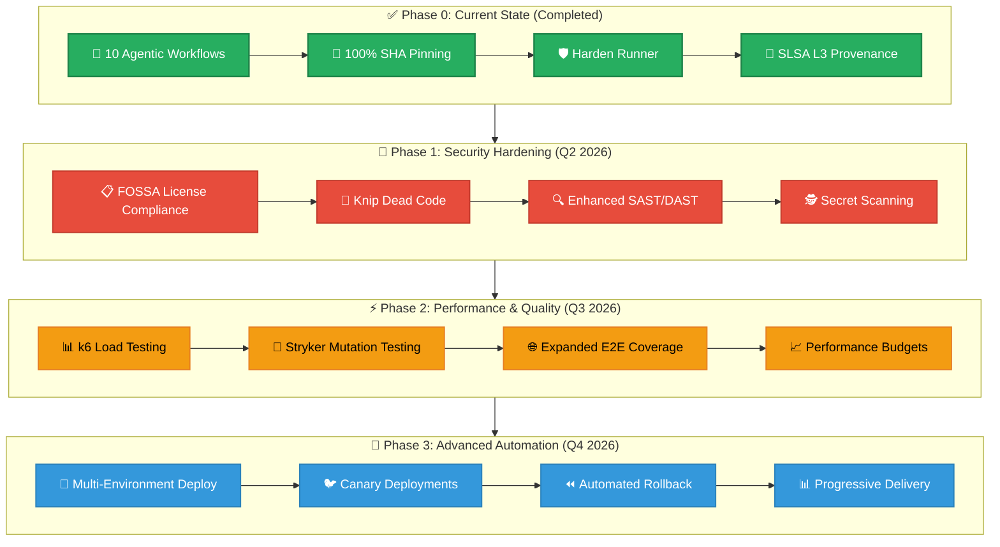
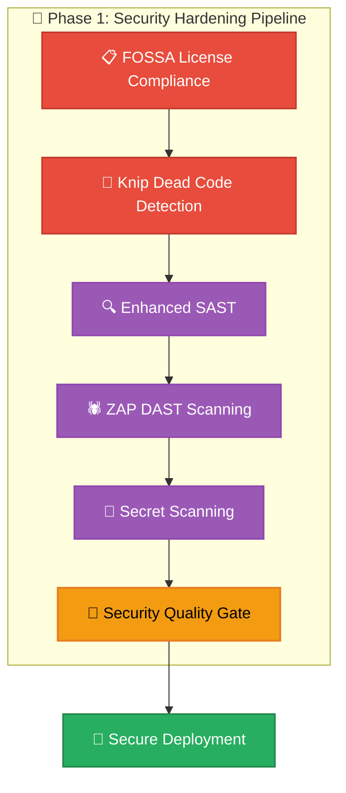
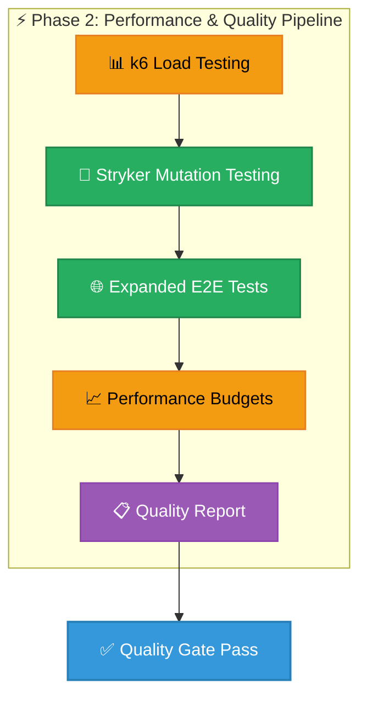
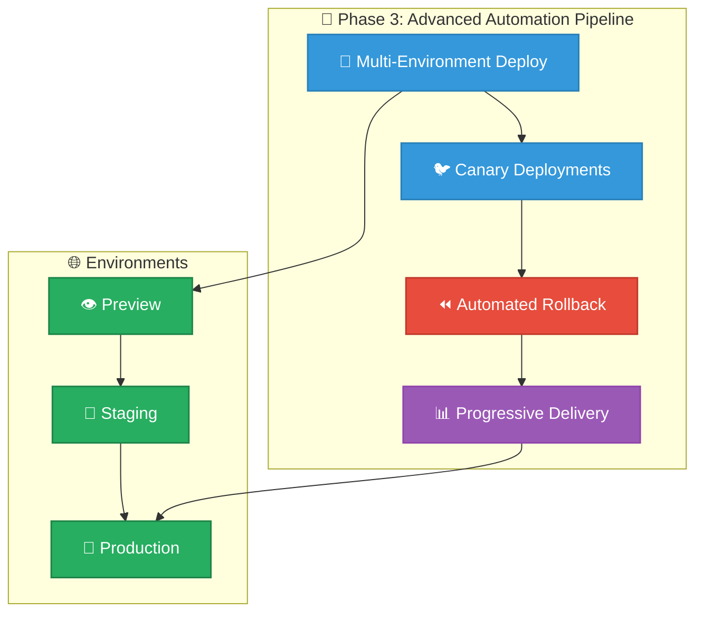
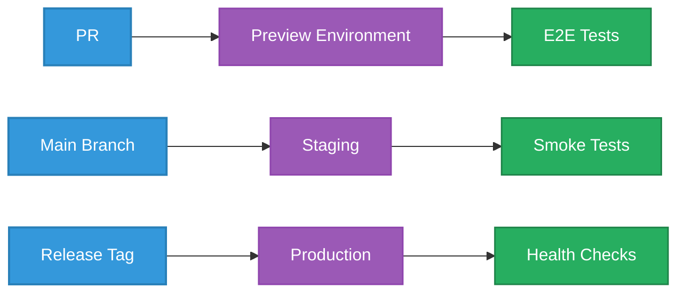
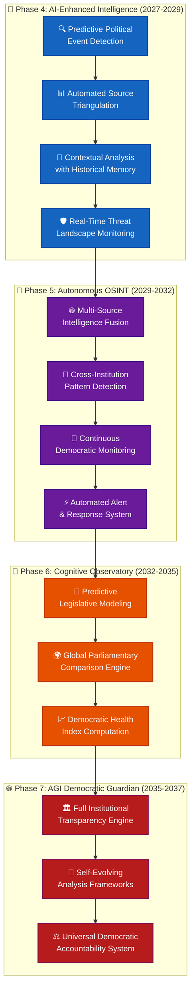
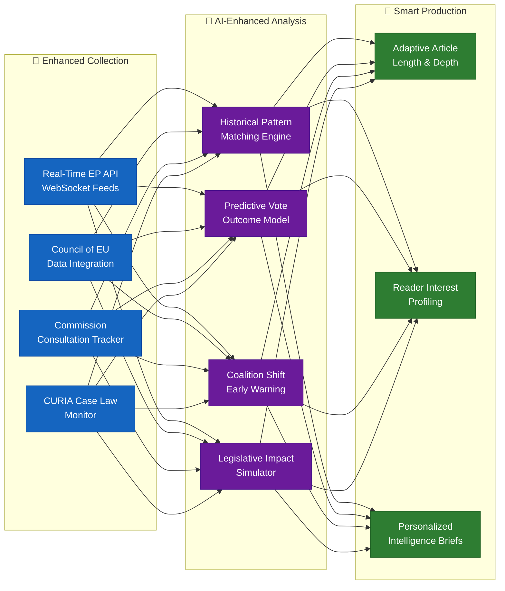
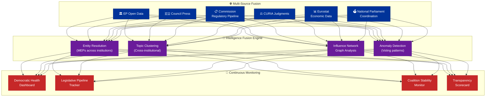
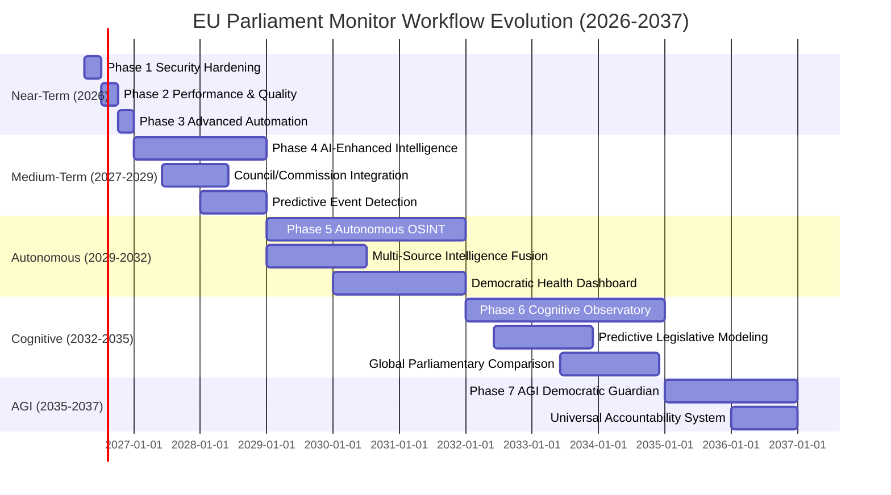
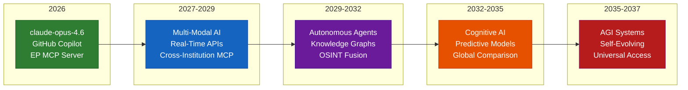

<p align="center">
  
</p>

<h1 align="center">🚀 EU Parliament Monitor — Future CI/CD Workflows</h1>

<p align="center">
  <strong>🔮 Planned Workflow Enhancements & Roadmap (2026-2037)</strong><br>
  <em>🎯 Evolution towards Advanced Automation, AI-Driven Operations & AGI-Ready Pipelines</em>
</p>

<p align="center">
  <a href="#"></a>
  <a href="#"></a>
  <a href="#"></a>
  <a href="#"></a>
</p>

**📋 Document Owner:** CEO | **📄 Version:** 4.0 | **📅 Last Updated:** 2026-03-31 (UTC)  
**🔄 Review Cycle:** Quarterly | **⏰ Next Review:** 2026-06-30  
**🏷️ Classification:** Public (Open Source European Parliament Monitoring Platform)

---

## 📚 Architecture Documentation Map

<div class="documentation-map">

| Document | Focus | Description | Documentation Link |
| ------------------------------------------------------------------- | --------------- | ---------------------------------------------- | ------------------------------------------------------------------------------------------------------ |
| **[Architecture](ARCHITECTURE.md)** | 🏛️ Architecture | C4 model showing current system structure | [View Source](https://github.com/Hack23/euparliamentmonitor/blob/main/ARCHITECTURE.md) |
| **[Future Architecture](FUTURE_ARCHITECTURE.md)** | 🏛️ Architecture | C4 model showing future system structure | [View Source](https://github.com/Hack23/euparliamentmonitor/blob/main/FUTURE_ARCHITECTURE.md) |
| **[Mindmaps](MINDMAP.md)** | 🧠 Concept | Current system component relationships | [View Source](https://github.com/Hack23/euparliamentmonitor/blob/main/MINDMAP.md) |
| **[Future Mindmaps](FUTURE_MINDMAP.md)** | 🧠 Concept | Future capability evolution | [View Source](https://github.com/Hack23/euparliamentmonitor/blob/main/FUTURE_MINDMAP.md) |
| **[SWOT Analysis](SWOT.md)** | 💼 Business | Current strategic assessment | [View Source](https://github.com/Hack23/euparliamentmonitor/blob/main/SWOT.md) |
| **[Future SWOT Analysis](FUTURE_SWOT.md)** | 💼 Business | Future strategic opportunities | [View Source](https://github.com/Hack23/euparliamentmonitor/blob/main/FUTURE_SWOT.md) |
| **[Data Model](DATA_MODEL.md)** | 📊 Data | Current data structures and relationships | [View Source](https://github.com/Hack23/euparliamentmonitor/blob/main/DATA_MODEL.md) |
| **[Future Data Model](FUTURE_DATA_MODEL.md)** | 📊 Data | Enhanced European Parliament data architecture | [View Source](https://github.com/Hack23/euparliamentmonitor/blob/main/FUTURE_DATA_MODEL.md) |
| **[Flowcharts](FLOWCHART.md)** | 🔄 Process | Current data processing workflows | [View Source](https://github.com/Hack23/euparliamentmonitor/blob/main/FLOWCHART.md) |
| **[Future Flowcharts](FUTURE_FLOWCHART.md)** | 🔄 Process | Enhanced AI-driven workflows | [View Source](https://github.com/Hack23/euparliamentmonitor/blob/main/FUTURE_FLOWCHART.md) |
| **[State Diagrams](STATEDIAGRAM.md)** | 🔄 Behavior | Current system state transitions | [View Source](https://github.com/Hack23/euparliamentmonitor/blob/main/STATEDIAGRAM.md) |
| **[Future State Diagrams](FUTURE_STATEDIAGRAM.md)** | 🔄 Behavior | Enhanced adaptive state transitions | [View Source](https://github.com/Hack23/euparliamentmonitor/blob/main/FUTURE_STATEDIAGRAM.md) |
| **[Security Architecture](SECURITY_ARCHITECTURE.md)** | 🛡️ Security | Current security implementation | [View Source](https://github.com/Hack23/euparliamentmonitor/blob/main/SECURITY_ARCHITECTURE.md) |
| **[Future Security Architecture](FUTURE_SECURITY_ARCHITECTURE.md)** | 🛡️ Security | Security enhancement roadmap | [View Source](https://github.com/Hack23/euparliamentmonitor/blob/main/FUTURE_SECURITY_ARCHITECTURE.md) |
| **[Threat Model](THREAT_MODEL.md)** | 🎯 Security | STRIDE threat analysis | [View Source](https://github.com/Hack23/euparliamentmonitor/blob/main/THREAT_MODEL.md) |
| **[Classification](CLASSIFICATION.md)** | 🏷️ Governance | CIA classification & BCP | [View Source](https://github.com/Hack23/euparliamentmonitor/blob/main/CLASSIFICATION.md) |
| **[CRA Assessment](CRA-ASSESSMENT.md)** | 🛡️ Compliance | Cyber Resilience Act | [View Source](https://github.com/Hack23/euparliamentmonitor/blob/main/CRA-ASSESSMENT.md) |
| **[Workflows](WORKFLOWS.md)** | ⚙️ DevOps | CI/CD documentation | [View Source](https://github.com/Hack23/euparliamentmonitor/blob/main/WORKFLOWS.md) |
| **[Future Workflows](FUTURE_WORKFLOWS.md)** | 🚀 DevOps | Planned CI/CD enhancements | **This Document** |
| **[Business Continuity Plan](BCPPlan.md)** | 🔄 Resilience | Recovery planning | [View Source](https://github.com/Hack23/euparliamentmonitor/blob/main/BCPPlan.md) |
| **[Financial Security Plan](FinancialSecurityPlan.md)** | 💰 Financial | Cost & security analysis | [View Source](https://github.com/Hack23/euparliamentmonitor/blob/main/FinancialSecurityPlan.md) |
| **[End-of-Life Strategy](End-of-Life-Strategy.md)** | 📦 Lifecycle | Technology EOL planning | [View Source](https://github.com/Hack23/euparliamentmonitor/blob/main/End-of-Life-Strategy.md) |
| **[Unit Test Plan](UnitTestPlan.md)** | 🧪 Testing | Unit testing strategy | [View Source](https://github.com/Hack23/euparliamentmonitor/blob/main/UnitTestPlan.md) |
| **[E2E Test Plan](E2ETestPlan.md)** | 🔍 Testing | End-to-end testing | [View Source](https://github.com/Hack23/euparliamentmonitor/blob/main/E2ETestPlan.md) |
| **[Performance Testing](performance-testing.md)** | ⚡ Performance | Performance benchmarks | [View Source](https://github.com/Hack23/euparliamentmonitor/blob/main/performance-testing.md) |
| **[Security Policy](SECURITY.md)** | 🔒 Security | Vulnerability reporting & security policy | [View Source](https://github.com/Hack23/euparliamentmonitor/blob/main/SECURITY.md) |

</div>

---

## 🔐 ISMS Policy Alignment

This future workflows document is designed to implement all controls from Hack23 AB's ISMS framework as the EU Parliament Monitor platform evolves.

### Related ISMS Policies

| **Policy Domain** | **Policy** | **Planned Implementation** |
| -------------------------- | ------------------------------------------------------------------------------------------------------------ | ------------------------------------------------------------- |
| **🔐 Core Security** | [Information Security Policy](https://github.com/Hack23/ISMS-PUBLIC/blob/main/Information_Security_Policy.md) | Overall security governance framework for enhanced monitoring |
| **🛠️ Development** | [Secure Development Policy](https://github.com/Hack23/ISMS-PUBLIC/blob/main/Secure_Development_Policy.md) | Security-integrated development lifecycle enhancements |
| **🌐 Network** | [Network Security Policy](https://github.com/Hack23/ISMS-PUBLIC/blob/main/Network_Security_Policy.md) | CDN architecture, WAF, DDoS protection |
| **🔒 Cryptography** | [Cryptography Policy](https://github.com/Hack23/ISMS-PUBLIC/blob/main/Cryptography_Policy.md) | Content signing, TLS 1.3, integrity verification |
| **🔑 Access Control** | [Access Control Policy](https://github.com/Hack23/ISMS-PUBLIC/blob/main/Access_Control_Policy.md) | MCP authentication, request authorization |
| **🏷️ Data Classification** | [Data Classification Policy](https://github.com/Hack23/ISMS-PUBLIC/blob/main/Data_Classification_Policy.md) | European Parliament data classification |
| **🔍 Vulnerability** | [Vulnerability Management](https://github.com/Hack23/ISMS-PUBLIC/blob/main/Vulnerability_Management.md) | Enhanced automated scanning and monitoring |
| **🚨 Incident Response** | [Incident Response Plan](https://github.com/Hack23/ISMS-PUBLIC/blob/main/Incident_Response_Plan.md) | Automated incident detection and response |
| **💾 Backup & Recovery** | [Backup Recovery Policy](https://github.com/Hack23/ISMS-PUBLIC/blob/main/Backup_Recovery_Policy.md) | Content backup, version control, recovery |
| **🔄 Business Continuity** | [Business Continuity Plan](https://github.com/Hack23/ISMS-PUBLIC/blob/main/Business_Continuity_Plan.md) | Multi-CDN deployment, disaster recovery |
| **🤝 Third-Party** | [Third Party Management](https://github.com/Hack23/ISMS-PUBLIC/blob/main/Third_Party_Management.md) | CDN provider security assessment |
| **🏷️ Classification** | [Classification Framework](https://github.com/Hack23/ISMS-PUBLIC/blob/main/CLASSIFICATION.md) | Business impact analysis for platform |

### Compliance Framework Mapping

| **Framework** | **Version** | **Relevant Controls** |
| ------------- | ----------- | --------------------- |
| **ISO 27001** | 2022 | A.5.1, A.8.25, A.8.26, A.8.27 |
| **NIST CSF** | 2.0 | GV.OC, GV.RM, ID.AM, PR.AT |
| **CIS Controls** | v8.1 | Control 1-5, 14, 16 |


## 📋 Executive Summary

This document outlines planned enhancements to the EU Parliament Monitor CI/CD workflows, aligned with the [Future Security Architecture](FUTURE_SECURITY_ARCHITECTURE.md) and [Hack23 ISMS continuous improvement principles](https://github.com/Hack23/ISMS-PUBLIC/blob/main/Secure_Development_Policy.md).

### Enhancement Principles

1. **Security First**: Every enhancement increases security posture
2. **Automation Everywhere**: Reduce manual intervention
3. **Evidence-Based**: All changes backed by metrics
4. **ISMS Aligned**: Compliance with Hack23 ISMS policies
5. **Performance Optimized**: Faster feedback cycles

### Roadmap Overview

| Phase | Timeline | Focus | Key Deliverables | Status |
|-------|----------|-------|------------------|--------|
| **Phase 0** | ✅ Completed | Agentic Workflows | 10 gh-aw news workflows, Copilot agent setup, 100% SHA-pinning | ✅ Done |
| **Phase 1** | Q2 2026 | Security Hardening | FOSSA, knip, advanced scanning | 🔄 In Progress |
| **Phase 2** | Q3 2026 | Performance & Quality | Load testing, mutation testing, E2E expansion | 📋 Planned |
| **Phase 3** | Q4 2026 | Advanced Automation | Multi-environment, canary deployments | 📋 Planned |

### Pipeline Evolution Architecture



---

## ✅ Phase 0: Completed Enhancements (Pre-Q2 2026)

The following capabilities have already been delivered and are documented in [WORKFLOWS.md](WORKFLOWS.md):

### 0.1 Complete SHA-Pinning Migration — ✅ COMPLETED

**Status:** All 12 standard workflows now use 100% SHA-pinned actions.  
**Evidence:** Verified in [WORKFLOWS.md §Workflow Permissions Matrix](WORKFLOWS.md)

### 0.2 Agentic News Workflows — ✅ COMPLETED

**Status:** 10 agentic news workflows compiled via `gh-aw` (GitHub Agentic Workflows v0.57.0) are in production.  
**Engine:** GitHub Copilot CLI with `claude-opus-4.6` model  
**Data Source:** `european-parliament-mcp-server` via MCP protocol  
**Coverage:** 14 languages (EN, SV, DA, NO, FI, DE, FR, ES, NL, AR, HE, JA, KO, ZH)

| Workflow | Schedule | Purpose |
|----------|----------|---------|
| `news-week-ahead.lock.yml` | Friday 07:00 UTC | Parliamentary week preview |
| `news-weekly-review.lock.yml` | Saturday 09:00 UTC | Week retrospective |
| `news-motions.lock.yml` | Weekdays 06:00 UTC | Plenary votes & resolutions |
| `news-propositions.lock.yml` | Weekdays 05:00 UTC | Legislative procedures |
| `news-committee-reports.lock.yml` | Weekdays 04:00 UTC | Committee activity |
| `news-month-ahead.lock.yml` | 1st of month 08:00 UTC | Monthly outlook |
| `news-monthly-review.lock.yml` | 28th of month 10:00 UTC | Monthly retrospective |
| `news-breaking.lock.yml` | Every 6 hours | Breaking news |
| `news-article-generator.lock.yml` | Manual dispatch | Multi-type generator |
| `news-translate.lock.yml` | After content PRs merged | Translate EN articles → 13 languages |

### 0.3 Copilot Agent Setup — ✅ COMPLETED

**Status:** `copilot-setup-steps.yml` configures the environment for 8 specialized Copilot agents with MCP server integrations.  
**Compile Workflow:** `compile-agentic-workflows.yml` compiles `.md` source → `.lock.yml` via `gh aw compile`.

### 0.4 Lighthouse CI Performance Testing — ✅ COMPLETED

**Status:** Lighthouse CI (`@lhci/cli@0.15.1`) is integrated into the `performance` job of `test-and-report.yml`.  
**Metrics:** Performance budgets, accessibility scores, SEO audits, best practices validation.

### 0.5 Article Generation Benchmarks — ✅ COMPLETED

**Status:** The `performance` job in `test-and-report.yml` includes article generation benchmarks with a 30-second budget (`GENERATION_BUDGET_MS=30000`).

---

## 🔐 Phase 1: Security Hardening (Q2 2026)



### ~~1.1 Complete SHA-Pinning Migration~~ — ✅ COMPLETED

**Current State:** ✅ 100% of actions are SHA-pinned (achieved pre-Q2 2026)  
**Target:** ~~100% SHA-pinned actions~~ **Done**  
**Timeline:** ~~Q2 2026 Week 1-2~~ **Completed**

#### Implementation

All 13 standard workflows now use SHA-pinned actions:

```yaml
# All workflows now use SHA-pinned actions (example from e2e.yml)
- uses: actions/checkout@de0fac2e4500dabe0009e67214ff5f5447ce83dd # v6.0.2
- uses: actions/setup-node@53b83947a5a98c8d113130e565377fae1a50d02f # v6.3.0
```

**Benefits:**
- ✅ Protection against compromised action versions
- ✅ Reproducible builds
- ✅ Supply chain security

**ISMS Evidence:** [Supply Chain Security Policy §4.4](https://github.com/Hack23/ISMS-PUBLIC/blob/main/Secure_Development_Policy.md#44-supply-chain-security)

---

### 1.2 Add FOSSA License Compliance

**Purpose:** Automated license compliance scanning  
**Timeline:** Q2 2026 Week 3-4

#### New Workflow: `fossa.yml`

```yaml
name: FOSSA License Compliance

on:
  pull_request:
  push:
    branches: [main]
  schedule:
    - cron: '0 6 * * 1'  # Weekly Monday 06:00 UTC

permissions:
  contents: read
  pull-requests: write

jobs:
  fossa:
    runs-on: ubuntu-latest
    steps:
      - uses: actions/checkout@<SHA>
      
      - name: Run FOSSA Scan
        uses: fossas/fossa-action@<SHA>
        with:
          api-key: ${{ secrets.FOSSA_API_KEY }}
          
      - name: Check License Compliance
        run: fossa test --timeout 600
```

**Benefits:**
- ✅ Automated license compliance
- ✅ Block GPL/AGPL licenses
- ✅ Supply chain transparency

**Badge:** 

---

### 1.3 Add Knip Validation

**Purpose:** Detect unused dependencies and exports  
**Timeline:** Q2 2026 Week 3-4

#### Integration into test-and-report.yml

```yaml
- name: Run knip
  run: npx knip --production --strict
```

**Benefits:**
- ✅ Reduce bundle size
- ✅ Faster builds
- ✅ Less attack surface

**ISMS Evidence:** Code quality standards

---

### 1.4 Enhanced Security Scanning

**Purpose:** Multi-tool SAST/DAST coverage  
**Timeline:** Q2 2026 Week 5-8

#### Additional Security Tools

| Tool | Purpose | Integration |
|------|---------|-------------|
| **Semgrep** | Additional SAST rules | New workflow |
| **Snyk** | Vulnerability database | PR checks |
| **OWASP ZAP** | DAST scanning | Weekly |
| **GitLeaks** | Secret scanning | Pre-commit + CI |

#### New Workflow: `advanced-security.yml`

```yaml
name: Advanced Security Scanning

on:
  pull_request:
  schedule:
    - cron: '0 2 * * 0'  # Weekly Sunday 02:00 UTC

jobs:
  semgrep:
    runs-on: ubuntu-latest
    steps:
      - uses: actions/checkout@<SHA>
      - uses: returntocorp/semgrep-action@<SHA>
        with:
          config: p/security-audit p/javascript

  snyk:
    runs-on: ubuntu-latest
    steps:
      - uses: actions/checkout@<SHA>
      - uses: snyk/actions/node@<SHA>
        env:
          SNYK_TOKEN: ${{ secrets.SNYK_TOKEN }}
```

**Benefits:**
- ✅ Multiple security perspectives
- ✅ Higher vulnerability detection rate
- ✅ Industry best practices

---

## ⚡ Phase 2: Performance & Quality (Q3 2026)



### ~~2.1 Load Testing & Performance~~ — ⚡ PARTIALLY COMPLETED

**Purpose:** Validate performance under load  
**Timeline:** Q3 2026 Week 1-4  
**Status:** Lighthouse CI is already integrated. k6 load testing remains planned.

#### ✅ Completed: Lighthouse CI

Lighthouse CI (`@lhci/cli@0.15.1`) is integrated into the `performance` job of `test-and-report.yml` with:
- Performance budgets (30-second article generation budget)
- Accessibility audits
- SEO validation
- Best practices checks

#### Remaining: k6 Load Testing

```yaml
name: Performance Testing

on:
  workflow_dispatch:
  schedule:
    - cron: '0 3 * * 0'  # Weekly Sunday 03:00 UTC

jobs:
  lighthouse:
    runs-on: ubuntu-latest
    steps:
      - uses: actions/checkout@<SHA>
      
      - name: Run Lighthouse CI
        uses: treosh/lighthouse-ci-action@<SHA>
        with:
          urls: |
            https://hack23.github.io/euparliamentmonitor/
            https://hack23.github.io/euparliamentmonitor/index.html
          uploadArtifacts: true
          temporaryPublicStorage: true

  k6-load-test:
    runs-on: ubuntu-latest
    steps:
      - uses: actions/checkout@<SHA>
      
      - name: Run k6 load test
        uses: grafana/k6-action@<SHA>
        with:
          filename: test/performance/load-test.js
```

**Metrics:**
- Page load time: <1s
- Lighthouse score: >95
- Concurrent users: 1000+

**Benefits:**
- ✅ Performance regression detection
- ✅ User experience validation
- ✅ Capacity planning data

---

### 2.2 Mutation Testing

**Purpose:** Validate test quality  
**Timeline:** Q3 2026 Week 5-8

#### Integration with Stryker

```yaml
- name: Run mutation testing
  run: npx stryker run --concurrency 4
  
- name: Upload mutation report
  uses: actions/upload-artifact@<SHA>
  with:
    name: mutation-report
    path: reports/mutation/
```

**Target:** ≥80% mutation score

**Benefits:**
- ✅ Identify weak tests
- ✅ Improve test quality
- ✅ Higher confidence in coverage

---

### 2.3 Expanded E2E Testing

**Purpose:** Comprehensive cross-browser testing  
**Timeline:** Q3 2026 Week 9-12

#### Enhanced E2E Configuration

```javascript
// playwright.config.js
export default defineConfig({
  projects: [
    { name: 'chromium', use: { ...devices['Desktop Chrome'] } },
    { name: 'firefox', use: { ...devices['Desktop Firefox'] } },
    { name: 'webkit', use: { ...devices['Desktop Safari'] } },
    { name: 'mobile-chrome', use: { ...devices['Pixel 5'] } },
    { name: 'mobile-safari', use: { ...devices['iPhone 13'] } },
  ],
  reporter: [
    ['html'],
    ['junit', { outputFile: 'junit.xml' }],
    ['json', { outputFile: 'test-results.json' }],
  ],
});
```

**Coverage:**
- 5 browsers/devices
- Visual regression testing
- Network condition simulation
- Geolocation testing

---

## 🚀 Phase 3: Advanced Automation (Q4 2026)



### 3.1 Multi-Environment Deployments

**Purpose:** Staging, production, and preview environments  
**Timeline:** Q4 2026 Week 1-6

#### Environment Strategy



#### New Workflow: `deploy-preview.yml`

```yaml
name: Deploy Preview Environment

on:
  pull_request:
    types: [opened, synchronize]

jobs:
  deploy-preview:
    runs-on: ubuntu-latest
    steps:
      - uses: actions/checkout@<SHA>
      
      - name: Deploy to Vercel Preview
        uses: amondnet/vercel-action@<SHA>
        with:
          vercel-token: ${{ secrets.VERCEL_TOKEN }}
          vercel-org-id: ${{ secrets.VERCEL_ORG_ID }}
          vercel-project-id: ${{ secrets.VERCEL_PROJECT_ID }}
          
      - name: Comment PR with preview URL
        uses: actions/github-script@<SHA>
        with:
          script: |
            github.rest.issues.createComment({
              issue_number: context.issue.number,
              owner: context.repo.owner,
              repo: context.repo.repo,
              body: '🚀 Preview deployed: ${{ steps.deploy.outputs.url }}'
            })
```

**Environments:**
- **Preview:** Per-PR isolated environment
- **Staging:** Main branch continuous deployment
- **Production:** Release tag deployment

---

### 3.2 Canary Deployments

**Purpose:** Gradual rollout with automatic rollback  
**Timeline:** Q4 2026 Week 7-10

#### Deployment Strategy

```yaml
name: Canary Deployment

on:
  release:
    types: [published]

jobs:
  canary-deploy:
    runs-on: ubuntu-latest
    steps:
      - name: Deploy 10% traffic
        run: ./scripts/deploy-canary.sh 10
        
      - name: Monitor metrics (5 min)
        run: ./scripts/monitor-health.sh --duration 300
        
      - name: Evaluate canary
        run: |
          if ./scripts/evaluate-metrics.sh; then
            echo "✅ Canary successful, proceeding"
          else
            echo "❌ Canary failed, rolling back"
            ./scripts/rollback.sh
            exit 1
          fi
          
      - name: Gradual rollout
        run: |
          ./scripts/deploy-canary.sh 25
          sleep 300
          ./scripts/deploy-canary.sh 50
          sleep 300
          ./scripts/deploy-canary.sh 100
```

**Metrics Monitored:**
- Error rate
- Response time (P95, P99)
- CPU/Memory usage
- User engagement

---

### 3.3 Automated Rollback

**Purpose:** Instant rollback on failure detection  
**Timeline:** Q4 2026 Week 11-12

#### Health Check Integration

```yaml
- name: Deployment health check
  run: |
    for i in {1..10}; do
      if curl -f https://euparliamentmonitor.com/health; then
        echo "✅ Health check $i passed"
      else
        echo "❌ Health check $i failed"
        ./scripts/rollback.sh
        exit 1
      fi
      sleep 30
    done
```

**Rollback Triggers:**
- Health check failure
- Error rate spike (>1%)
- Response time degradation (>2x baseline)
- Manual trigger

---

## 📊 Success Metrics

### Phase 1 Metrics (Q2 2026)

| Metric | Baseline | Target | Current | Status |
|--------|----------|--------|---------|--------|
| **SHA-Pinned Actions** | ~~90%~~ | 100% | 100% | ✅ Completed |
| **License Compliance** | Manual | Automated | Manual | 📋 Planned |
| **Unused Dependencies** | Unknown | 0 | Unknown | 📋 Planned |
| **Security Tools** | 3 (CodeQL, npm audit, Dep Review) | 5 | 3 | 📋 Planned |

### Phase 2 Metrics (Q3 2026)

| Metric | Baseline | Target | Current | Status |
|--------|----------|--------|---------|--------|
| **Page Load Time** | ~1.5s | <1s | Monitored via Lighthouse CI | ⚡ Partial |
| **Lighthouse Score** | 85 | >95 | Monitored via test-and-report | ⚡ Partial |
| **Mutation Score** | Unknown | ≥80% | Unknown | 📋 Planned |
| **Browser Coverage** | 1 | 5 | 1 (Chromium) | 📋 Planned |

### Phase 3 Metrics (Q4 2026)

| Metric | Baseline | Target | Measurement |
|--------|----------|--------|-------------|
| **Deployment Frequency** | Weekly | Daily | GitHub insights |
| **Mean Time to Deploy** | 15 min | <5 min | Workflow duration |
| **Failed Deployment Rate** | 0% | <1% | Success rate |
| **Rollback Time** | Manual | <2 min | Automated |

---

## 🔒 ISMS Alignment

### Policy Compliance

| **Phase** | **ISMS Policy** | **Implementation** |
| --- | --- | --- |
| **Phase 1** | [🛠️ Secure Development Policy](https://github.com/Hack23/ISMS-PUBLIC/blob/main/Secure_Development_Policy.md) | SHA-pinning, FOSSA, license compliance |
| **Phase 1** | [🔍 Vulnerability Management](https://github.com/Hack23/ISMS-PUBLIC/blob/main/Vulnerability_Management.md) | Semgrep, Snyk, OWASP ZAP, GitLeaks |
| **Phase 2** | [🛠️ Secure Development Policy](https://github.com/Hack23/ISMS-PUBLIC/blob/main/Secure_Development_Policy.md) | Mutation testing, expanded E2E |
| **Phase 2** | [🛠️ Secure Development Policy](https://github.com/Hack23/ISMS-PUBLIC/blob/main/Secure_Development_Policy.md) | Load testing, Lighthouse, performance budgets |
| **Phase 3** | [🛠️ Secure Development Policy](https://github.com/Hack23/ISMS-PUBLIC/blob/main/Secure_Development_Policy.md) | Multi-environment, canary deployment |
| **Phase 3** | [🚨 Incident Response Plan](https://github.com/Hack23/ISMS-PUBLIC/blob/main/Incident_Response_Plan.md) | Automated rollback, incident classification |
| **Phase 3** | [💾 Backup & Recovery Policy](https://github.com/Hack23/ISMS-PUBLIC/blob/main/Backup_Recovery_Policy.md) | Multi-environment disaster recovery |

### Compliance Frameworks

| **Framework** | **Version** | **Control** | **Phase** | **Implementation** |
| --- | --- | --- | --- | --- |
| **ISO 27001** | 2022 | A.8.25 Secure development lifecycle | Phase 1-3 | All phases enhance SDLC |
| **ISO 27001** | 2022 | A.8.28 Secure coding | Phase 2 | Mutation testing, code quality |
| **ISO 27001** | 2022 | A.12.1.2 Change management | Phase 3 | Canary deployment, progressive delivery |
| **NIST CSF** | 2.0 | PR.IP-1 Baseline configuration | Phase 3 | Multi-environment baselines |
| **NIST CSF** | 2.0 | DE.CM Continuous monitoring | Phase 2 | Performance monitoring, load testing |
| **CIS Controls** | v8.1 | 16.6 Application testing | Phase 2 | Mutation testing, performance testing |
| **EU CRA** | 2024 | Art. 10 Vulnerability handling | Phase 1 | Enhanced scanning, auto-remediation |

---

## 💰 Resource Requirements

### Infrastructure Costs

| Phase | Service | Monthly Cost | Annual Cost |
|-------|---------|--------------|-------------|
| **Phase 1** | FOSSA Pro | $299 | $3,588 |
| **Phase 1** | Snyk Team | $98 | $1,176 |
| **Phase 2** | Lighthouse CI | Free | $0 |
| **Phase 2** | k6 Cloud | $49 | $588 |
| **Phase 3** | Vercel Pro | $20 | $240 |
| **Total** | | **$466/mo** | **$5,592/yr** |

### Time Investment

| Phase | Engineering Time | Timeline |
|-------|------------------|----------|
| **Phase 1** | 40 hours | 2 weeks |
| **Phase 2** | 80 hours | 4 weeks |
| **Phase 3** | 120 hours | 6 weeks |
| **Total** | **240 hours** | **12 weeks** |

---

## 🎯 Implementation Plan

### Phase 1: Security Hardening (Q2 2026)

**Week 1-2:**
- [x] Complete SHA-pinning migration for all workflows ✅ (achieved pre-Q2 2026)
- [x] Test all workflows with SHA-pinned actions ✅
- [x] Document action versions ✅ (in WORKFLOWS.md v3.0)

**Week 3-4:**
- [ ] Set up FOSSA account and integration
- [ ] Add knip to test-and-report workflow
- [ ] Configure allowed license list

**Week 5-8:**
- [ ] Integrate Semgrep security rules
- [ ] Set up Snyk scanning
- [ ] Add OWASP ZAP weekly scans
- [ ] Configure GitLeaks pre-commit hooks

### Phase 2: Performance & Quality (Q3 2026)

**Week 1-4:**
- [x] Set up Lighthouse CI ✅ (integrated in test-and-report.yml performance job)
- [ ] Create k6 load test scripts
- [x] Configure performance budgets ✅ (GENERATION_BUDGET_MS=30000)
- [ ] Automate performance reporting

**Week 5-8:**
- [ ] Integrate Stryker mutation testing
- [ ] Configure mutation testing thresholds
- [ ] Add mutation reports to release docs

**Week 9-12:**
- [ ] Enable multi-browser Playwright testing
- [ ] Add visual regression testing
- [ ] Expand E2E test coverage

### Phase 3: Advanced Automation (Q4 2026)

**Week 1-6:**
- [ ] Set up preview environments (Vercel)
- [ ] Configure staging environment
- [ ] Automate preview deployments per PR

**Week 7-10:**
- [ ] Implement canary deployment scripts
- [ ] Set up health monitoring
- [ ] Configure gradual rollout

**Week 11-12:**
- [ ] Implement automated rollback
- [ ] Create runbooks for failure scenarios
- [ ] Document deployment procedures

---

## 🔮 Visionary Workflow Roadmap: 2027-2037

### Political Intelligence Evolution — From Pipeline to Autonomous Observatory

As AI capabilities advance — from current LLMs (Opus 4.6) through multi-modal agents to potential AGI — the EU Parliament Monitor's workflow architecture will evolve from human-configured pipelines into an autonomous political intelligence observatory capable of real-time democratic transparency monitoring across all EU institutions.



### Phase 4: AI-Enhanced Political Intelligence (2027-2029)

**Vision:** Transform from scheduled data processing to proactive intelligence detection — the system anticipates politically significant events before they unfold.



| Capability | Description | Political Intelligence Impact |
|------------|-------------|-------------------------------|
| **Predictive Event Detection** | ML models trained on EP parliamentary calendar predict significant events before official announcements | Earlier breaking news; advance analysis of upcoming votes |
| **Source Triangulation** | Cross-reference EP data with Council, Commission, and CURIA sources for comprehensive coverage | Higher confidence ratings; multi-institutional perspective |
| **Historical Context Engine** | Every analysis automatically enriched with relevant historical precedents from EP's legislative history | Deeper contextual intelligence; trend identification |
| **Real-Time Threat Monitoring** | Continuous Political Threat Landscape assessment with automated alert thresholds | Instant detection of coalition shifts, democratic erosion signals |
| **Smart Caching** | AI-optimised data caching based on parliamentary rhythm (plenary weeks vs. committee weeks) | Faster analysis cycles; reduced MCP server load |

### Phase 5: Autonomous OSINT Operations (2029-2032)

**Vision:** The platform evolves into a full OSINT (Open Source Intelligence) observatory — autonomously collecting, correlating, and publishing intelligence across the entire EU institutional landscape.



- **Multi-Source Intelligence Fusion**: Combine EP, Council, Commission, and court data into unified intelligence products — every article draws from all EU institutions, not just Parliament
- **Cross-Institution Pattern Detection**: Identify when legislative proposals move between institutions, detect coordination patterns, track lobby influence across the trilogue process
- **Continuous Democratic Monitoring**: Real-time dashboards that track democratic health indicators: participation rates, transparency scores, representation metrics, accountability measures
- **Automated Alert & Response**: When threat landscape dimensions exceed thresholds (e.g., coalition cohesion drops below 60%), the system autonomously generates urgent intelligence briefings

### Phase 6: Cognitive Parliamentary Observatory (2032-2035)

**Vision:** The system becomes a cognitive observatory that models legislative outcomes, compares democratic health across global parliaments, and computes verifiable democratic accountability indices.

- **Predictive Legislative Modeling**: Simulate legislative outcomes with >80% accuracy by modeling MEP voting behaviour, committee dynamics, and political group strategies
- **Global Parliamentary Comparison Engine**: Compare EP democratic practices against 50+ national parliaments worldwide, identifying best practices and areas for improvement
- **Democratic Health Index**: A composite, evidence-based score combining transparency, participation, accountability, and representation metrics — updated daily, published monthly
- **Self-Healing Analysis Pipelines**: Workflows that detect their own analytical blind spots, commission additional data collection, and refine their methodologies without human intervention

### Phase 7: AGI Democratic Guardian (2035-2037)

**Vision:** With the emergence of AGI-level capabilities, the platform evolves into a universal democratic accountability system — monitoring, analysing, and reporting on democratic practices across all levels of European governance.

- **Full Institutional Transparency Engine**: AGI-powered monitoring that covers every EU institution, agency, and body — from the European Central Bank to FRONTEX, from OLAF investigations to ECB monetary policy
- **Self-Evolving Analysis Frameworks**: The 6 political threat dimensions automatically expand and refine based on emerging democratic challenges (cyber-democratic threats, AI governance risks, climate policy accountability)
- **Universal Democratic Accountability System**: A platform that any citizen can query in natural language to understand the democratic implications of any EU legislative action, in any of the 24 EU official languages

### Workflow Evolution Gantt



### Technology Evolution Map



---

## 📚 Related Documentation

| Document | Focus | Link |
|----------|-------|------|
| ⚙️ Current Workflows | Present state documentation | [WORKFLOWS.md](WORKFLOWS.md) |
| 🔐 Security Architecture | Current security implementation | [SECURITY_ARCHITECTURE.md](SECURITY_ARCHITECTURE.md) |
| 🚀 Future Security | Planned security enhancements | [FUTURE_SECURITY_ARCHITECTURE.md](FUTURE_SECURITY_ARCHITECTURE.md) |
| 🔬 Analysis Framework | Political intelligence analysis | [analysis/README.md](analysis/README.md) |
| 📐 Analysis Methodologies | 6 analytical frameworks | [analysis/methodologies/README.md](analysis/methodologies/README.md) |
| 📋 Analysis Templates | 8 structured templates | [analysis/templates/README.md](analysis/templates/README.md) |
| 📈 Security Flowcharts | Process flows | [FLOWCHART.md](FLOWCHART.md) |
| 🛡️ ISMS Policy | Policy framework | [Hack23 ISMS-PUBLIC](https://github.com/Hack23/ISMS-PUBLIC) |

---

## 🔄 Review and Updates

This document will be reviewed quarterly to assess progress and adjust priorities based on:
- Security threat landscape changes
- Technology evolution (LLM capabilities, MCP protocol advances)
- Business priorities and democratic transparency mission
- Resource availability
- Compliance requirements (GDPR, NIS2, EU CRA)
- European Parliament institutional changes

**Next Review:** 2026-06-30

---

**📞 Questions?** Contact: [DevOps Team](mailto:devops@hack23.com)  
**💡 Suggestions?** Open an issue: [GitHub Issues](https://github.com/Hack23/euparliamentmonitor/issues)

---

*Last updated: 2026-03-31 by Intelligence Operative*
