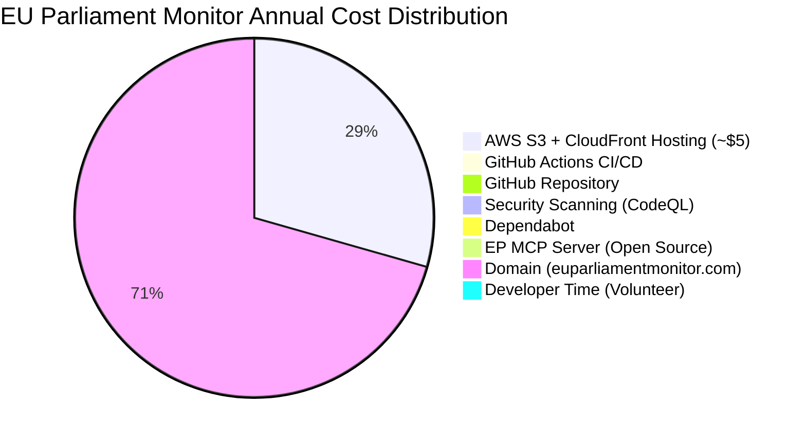
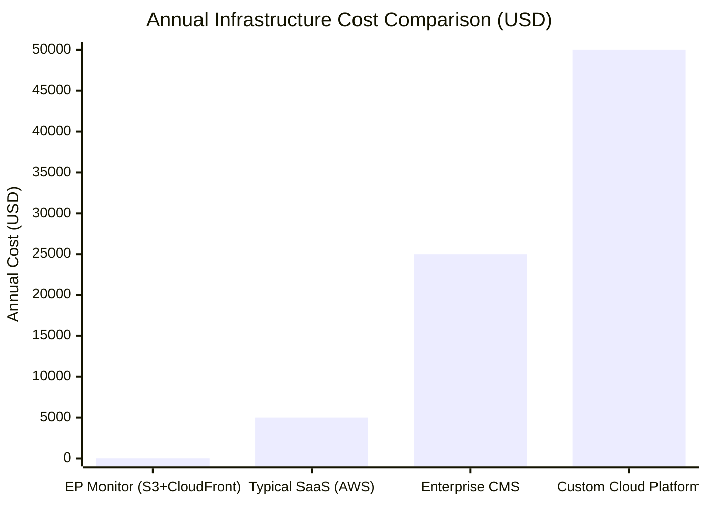
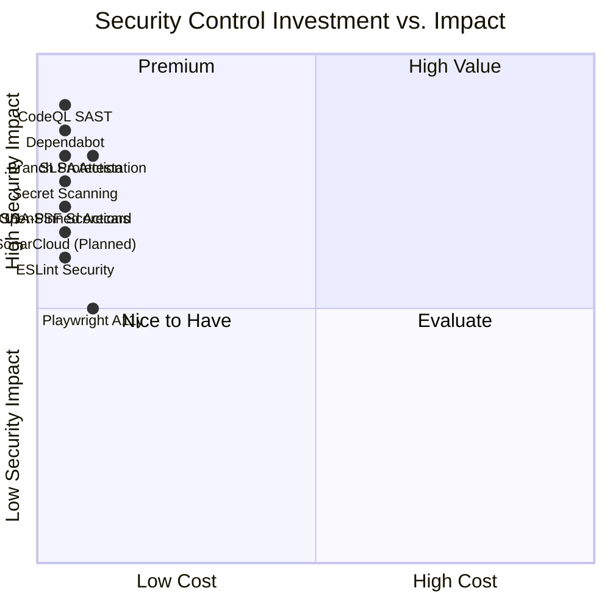
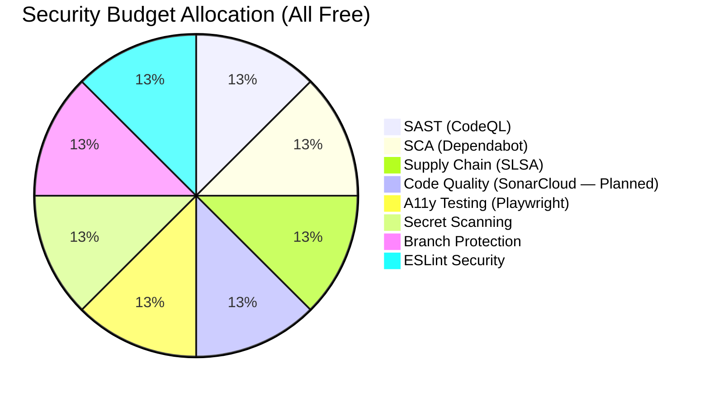

<p align="center">
  
</p>

<h1 align="center">💰 EU Parliament Monitor — Financial Security Plan</h1>

<p align="center">
  <strong>🛡️ Cost Analysis and Security Investment Planning for European Parliament Intelligence</strong><br>
  <em>💰 Zero Infrastructure Cost • 🔒 Maximum Security ROI • ⚡ GitHub-hosted CI/CD + AWS-hosted static site</em>
</p>

<p align="center">
  <a href="#"></a>
  <a href="#"></a>
  <a href="#"></a>
  <a href="#"></a>
</p>

**📋 Document Owner:** CEO | **📄 Version:** 2.0 | **📅 Last Updated:** 2026-03-12 (UTC)  
**🔄 Review Cycle:** Annual | **⏰ Next Review:** 2027-03-12  
**🏷️ Classification:** Public (Open Source European Parliament Intelligence Platform)

---

## 📚 Architecture Documentation Map

<div class="documentation-map">

| Document                                                            | Focus           | Description                                    | Documentation Link                                                                                     |
| ------------------------------------------------------------------- | --------------- | ---------------------------------------------- | ------------------------------------------------------------------------------------------------------ |
| **[Architecture](ARCHITECTURE.md)**                                 | 🏛️ Architecture | C4 model showing current system structure      | [View Source](https://github.com/Hack23/euparliamentmonitor/blob/main/ARCHITECTURE.md)                 |
| **[Future Architecture](FUTURE_ARCHITECTURE.md)**                   | 🏛️ Architecture | C4 model showing future system structure       | [View Source](https://github.com/Hack23/euparliamentmonitor/blob/main/FUTURE_ARCHITECTURE.md)          |
| **[Security Architecture](SECURITY_ARCHITECTURE.md)**               | 🛡️ Security     | Current security implementation                | [View Source](https://github.com/Hack23/euparliamentmonitor/blob/main/SECURITY_ARCHITECTURE.md)        |
| **[Future Security Architecture](FUTURE_SECURITY_ARCHITECTURE.md)** | 🛡️ Security     | Security enhancement roadmap                   | [View Source](https://github.com/Hack23/euparliamentmonitor/blob/main/FUTURE_SECURITY_ARCHITECTURE.md) |
| **[Threat Model](THREAT_MODEL.md)**                                 | 🎯 Security     | STRIDE threat analysis                         | [View Source](https://github.com/Hack23/euparliamentmonitor/blob/main/THREAT_MODEL.md)                 |
| **[Classification](CLASSIFICATION.md)**                             | 🏷️ Governance   | CIA classification & BCP                       | [View Source](https://github.com/Hack23/euparliamentmonitor/blob/main/CLASSIFICATION.md)               |
| **[CRA Assessment](CRA-ASSESSMENT.md)**                             | 🛡️ Compliance   | Cyber Resilience Act                           | [View Source](https://github.com/Hack23/euparliamentmonitor/blob/main/CRA-ASSESSMENT.md)               |
| **[Workflows](WORKFLOWS.md)**                                       | ⚙️ DevOps       | CI/CD documentation                            | [View Source](https://github.com/Hack23/euparliamentmonitor/blob/main/WORKFLOWS.md)                    |
| **[Business Continuity Plan](BCPPlan.md)**                          | 🔄 Resilience   | Recovery planning                              | [View Source](https://github.com/Hack23/euparliamentmonitor/blob/main/BCPPlan.md)                      |
| **[Financial Security Plan](FinancialSecurityPlan.md)**             | 💰 Financial    | Cost & security analysis                       | [View Source](https://github.com/Hack23/euparliamentmonitor/blob/main/FinancialSecurityPlan.md)        |
| **[End-of-Life Strategy](End-of-Life-Strategy.md)**                 | 📦 Lifecycle    | Technology EOL planning                        | [View Source](https://github.com/Hack23/euparliamentmonitor/blob/main/End-of-Life-Strategy.md)         |

</div>

---

## 🎯 Financial Strategy Overview

EU Parliament Monitor achieves **maximum democratic transparency value at near-zero infrastructure cost** through a fully open-source architecture deployed to **AWS S3 + CloudFront** (per [ADR-002](ARCHITECTURE.md)) with GitHub-hosted CI/CD and security tooling. This Financial Security Plan demonstrates how strategic use of free-tier and low-cost platform services and automated tooling minimizes operational cost while maintaining enterprise-grade security posture aligned with [Hack23 AB ISMS](https://github.com/Hack23/ISMS-PUBLIC/blob/main/Information_Security_Policy.md).

### 🏷️ Business Impact Classification

Based on [Hack23 AB Classification Framework](https://github.com/Hack23/ISMS-PUBLIC/blob/main/CLASSIFICATION.md):

| Security Dimension     | Level | Financial Impact | Rationale |
| ---------------------- | ----- | ---------------- | --------- |
| **🔐 Confidentiality** | Public | Negligible | All data is publicly available EP open data |
| **🔒 Integrity**       | Moderate | Low | Incorrect content affects credibility, not finances |
| **⚡ Availability**    | Standard | Low | Static site with CDN caching provides inherent resilience |

---

## 💰 Cost Structure Analysis

### 📊 Annual Cost Summary



> **Textual summary (if chart does not render):** Annual costs are dominated by domain registration (~$12) and AWS S3+CloudFront hosting (~$5). All other components (GitHub Actions, repository, CodeQL, Dependabot, EP MCP Server, volunteer labor) are $0. Total: ~$17/yr.

### 📋 Detailed Cost Breakdown

| 💰 **Cost Category** | 📊 **Monthly** | 📅 **Annual** | 📋 **Notes** |
|----------------------|---------------|--------------|-------------|
| **🌐 AWS S3 + CloudFront Hosting** | <$1 | <$5 | Low-traffic static site within AWS free tier; S3 storage + request charges negligible (~$0.02/GB). CloudFront free tier: 1TB transfer/mo. *ACM certificate free. Costs scale only with significant traffic growth |
| **⚙️ GitHub Actions CI/CD** | $0 | $0 | GitHub-hosted runners: unlimited for public repos; 2,000 min/month for private repos on Free plan |
| **📦 GitHub Repository** | $0 | $0 | Free for public open-source repositories |
| **🔒 CodeQL SAST Scanning** | $0 | $0 | Free for public repos (GitHub Advanced Security) |
| **🤖 Dependabot Security** | $0 | $0 | Free, built into GitHub |
| **🛡️ OpenSSF Scorecard** | $0 | $0 | Free service for open-source projects |
| **📊 SonarCloud (Planned)** | $0 | $0 | Planned optional integration; not yet configured in CI |
| **🧪 Vitest Testing** | $0 | $0 | Open-source testing framework |
| **🔧 Playwright E2E** | $0 | $0 | Open-source E2E framework |
| **🇪🇺 EP MCP Server** | $0 | $0 | Hack23-maintained open-source data source |
| **🌍 Domain Name** | ~$1 | ~$12 | Annual domain registration (if custom domain) |
| **👨‍💻 Development Labor** | Volunteer | $0 | Open-source volunteer contributions |
| **📚 Documentation** | Volunteer | $0 | Copilot-assisted documentation generation |
| | | | |
| **📊 Total Annual Cost** | **~$1.50/mo** | **~$17/yr** | **AWS hosting (<$5) + Domain (~$12, optional)** |

### 💵 Cost Comparison: Static Site vs. Dynamic Architecture



> **Textual summary (if chart does not render):** Annual infrastructure costs — EP Monitor (S3+CloudFront): ~$17 | Typical SaaS (AWS): ~$5,000 | Enterprise CMS: ~$25,000 | Custom Cloud Platform: ~$50,000+

| Architecture Option | Annual Cost | Maintenance Burden | Security Overhead |
|--------------------|-----------:|------------------:|----------------:|
| **EU Parliament Monitor (S3+CloudFront)** | **~$17** | Minimal (automated) | Low (platform-managed) |
| Typical SaaS on AWS | ~$5,000 | Medium (EC2, RDS, CloudFront) | Medium (IAM, SGs, WAF) |
| Enterprise CMS | ~$25,000 | High (server management) | High (patching, configs) |
| Custom Cloud Platform | ~$50,000+ | Very High (full ops team) | Very High (full stack) |

> **Key Insight:** The static site architecture delivers >99% cost savings compared to equivalent dynamic platforms, while maintaining comparable security posture through GitHub's enterprise-grade infrastructure.

---

## 🛡️ Security Investment Analysis

### 📊 Security Controls — Cost vs. Value

| 🛡️ **Security Control** | 💰 **Cost** | 📊 **Value** | 🎯 **ROI** |
|--------------------------|------------|-------------|-----------|
| **GitHub Advanced Security (CodeQL)** | $0 (free for public repos) | SAST scanning, vulnerability detection | ∞ (zero cost, high value) |
| **Dependabot** | $0 (built-in) | Automated dependency updates, security alerts | ∞ |
| **OpenSSF Scorecard** | $0 (free service) | Supply chain security assessment | ∞ |
| **SonarCloud (Planned)** | $0 (free for OSS) | Code quality, security hotspots (not yet configured in CI) | Planned |
| **GitHub Branch Protection** | $0 (built-in) | PR reviews, status checks | ∞ |
| **GitHub Secret Scanning** | $0 (free for public repos) | Leaked credential detection | ∞ |
| **Playwright a11y Testing** | $0 (open-source) | WCAG 2.1 AA compliance verification | ∞ |
| **SLSA Level 3 Attestation** | $0 (GitHub Actions) | Supply chain provenance | ∞ |
| **ESLint Security Plugin** | $0 (open-source) | Code-level security linting | ∞ |
| **SHA-Pinned Actions** | $0 (best practice) | Supply chain attack prevention | ∞ |

### 📊 Security Investment ROI Summary



> **Textual summary (if chart does not render):** All security controls are zero-cost (or near-zero) and high impact, placing them in the "High Value" quadrant. Top-impact: CodeQL SAST, Dependabot, Branch Protection, SLSA Attestation. All others (Secret Scanning, OpenSSF Scorecard, SonarCloud [Planned], ESLint Security, Playwright A11y, SHA-Pinned Actions) also fall in the high-value zone.

> **Result:** All security controls fall in the **High Value** quadrant — zero-cost tools with high security impact. This is the optimal outcome enabled by the open-source, AWS-hosted static site architecture.

---

## 📊 Total Cost of Ownership (TCO)

### 3-Year TCO Projection

| Year | Infrastructure | Security Tooling | Development | Documentation | Total |
|------|---------------|------------------|-------------|---------------|-------|
| **Year 1 (2025-2026)** | ~$17 (domain + AWS S3/CloudFront) | $0 | $0 (volunteer) | $0 (Copilot-assisted) | **~$17** |
| **Year 2 (2026-2027)** | ~$17 (domain + AWS S3/CloudFront) | $0 | $0 (volunteer) | $0 (Copilot-assisted) | **~$17** |
| **Year 3 (2027-2028)** | ~$17 (domain + AWS S3/CloudFront) | $0 | $0 (volunteer) | $0 (Copilot-assisted) | **~$17** |
| **3-Year TCO** | **~$51** | **$0** | **$0** | **$0** | **~$51** |

> **Note:** Domain costs vary by registrar and TLD ($10–$20/year typical). Domain registration is optional — the primary production site is hosted on AWS S3 + CloudFront (estimated at ~$5/year and included in the Infrastructure totals above), with a zero-cost `github.io` subdomain maintained as a fallback endpoint. Estimates assume current registrar pricing and may fluctuate.

### 📈 TCO Comparison with Alternative Architectures

| Architecture | 3-Year TCO | Annual Maintenance Hours | Security Overhead |
|-------------|----------:|:------------------------:|:-----------------:|
| **EU Parliament Monitor (Static)** | **~$51** | ~20h/yr (automated) | Low |
| Equivalent on AWS (EC2+RDS+CF) | ~$15,000 | ~200h/yr | High |
| Equivalent on Vercel Pro | ~$720 | ~50h/yr | Medium |
| Equivalent on Cloudflare Workers | ~$180 | ~40h/yr | Medium |

---

## 🔄 Cost Optimization Strategy

### Current Cost Optimization Measures

| Strategy | Implementation | Annual Savings vs. Cloud Alternative |
|----------|---------------|-------------------------------------|
| **Static Site Generation** | Pre-render all content at build time | ~$3,000/yr (no server costs) |
| **CloudFront CDN (Primary) + GitHub Pages (Fallback)** | ADR-002: AWS S3 + CloudFront for production, GitHub Pages as zero-cost backup CDN | ~$1,200/yr (no managed PaaS/CDN costs) |
| **GitHub Actions CI/CD** | Free CI/CD for public repos | ~$600/yr (no CI/CD platform) |
| **Open-Source Security** | CodeQL, Dependabot, OpenSSF | ~$2,000/yr (no security platform) |
| **Git-Based Backup** | No separate backup infrastructure | ~$200/yr (no backup service) |
| **Copilot-Assisted Docs** | AI-generated documentation | ~$500/yr (no technical writer) |

### Potential Future Costs (If Migration Required)

| Scenario | Trigger | Estimated Annual Cost | Probability |
|----------|---------|----------------------:|:-----------:|
| **Custom Domain + SSL** | Brand enhancement | $12-50 | Low |
| **Cloudflare CDN** | AWS S3/CloudFront extended outage | $0-240 | Very Low |
| **Azure CDN + Blob Storage** | Migration to Azure ecosystem | $120-600 | Very Low |
| **Monitoring Service** | SLA requirement | $0-300 | Low |

---

## 🛡️ Financial Risk Management

### Financial Risks

| 🚨 **Risk** | 📊 **Probability** | 💥 **Impact** | 🔧 **Mitigation** |
|------------|--------------------|--------------|--------------------|
| AWS S3/CloudFront pricing change | Very Low | Low–Medium | Portable static files; manual GitHub Pages failover (see BCPPlan.md §Phase 2) or migrate to any CDN |
| GitHub Actions minute limits | Low | Low | Optimize workflows; local build fallback |
| Domain name cost increase | Very Low | Negligible | Annual registration; alternative registrars |
| EP MCP Server becomes paid | Very Low | Medium | Open-source; fork and self-host if needed |
| SonarCloud pricing change for OSS | Low | Low | Alternative: CodeQL + ESLint (both free) |
| Contributor availability decline | Medium | Low | Copilot-assisted development; minimal maintenance needs |

### Financial Impact of Security Incidents

| Incident Type | Direct Cost | Indirect Cost | Mitigation Cost |
|--------------|:----------:|:-------------:|:---------------:|
| **Supply Chain Attack** | $0 (no customer data) | Reputational | $0 (automated rollback) |
| **Primary Hosting Outage (AWS S3 + CloudFront)** | $0 | Content unavailability | $0 (manual GitHub Pages failover per BCPPlan.md §Phase 2, or local build to alternative CDN) |
| **Dependency Vulnerability** | $0 | Potential exploitation window | $0 (Dependabot auto-fix) |
| **CI/CD Pipeline Breach** | $0 | Compromised deployment | $0 (SHA-pinned actions) |

> **Key Insight:** The static site architecture with no user data, no databases, and no backend eliminates almost all financial risk from security incidents. The maximum impact of any incident is temporary content unavailability.

---

## 📊 Security Budget Allocation

### Current Security Spending: $0/year

All security controls are provided through free-tier services:



### Security Investment Recommendations

| Priority | Recommendation | Cost | Expected Benefit |
|----------|---------------|:----:|-----------------|
| **🟢 Continue** | All current free-tier tools | $0 | Maintain current security posture |
| **🟢 Continue** | Dependabot auto-merge for patches | $0 | Faster vulnerability remediation |
| **🟡 Consider** | GitHub Enterprise (if team grows) | $0-$252/yr | Advanced security features |
| **🟡 Consider** | External penetration test | $0-$500 | Independent security validation |
| **🔵 Future** | Bug bounty program | $0-$1,000 | Community security testing |

---

## 🎖️ Framework Compliance — Financial Controls

| Framework | Requirement | Financial Control | Status |
|-----------|-------------|-------------------|--------|
| **ISO 27001:2022 A.5.12** | Information classification | Public data = minimal financial exposure | ✅ |
| **ISO 27001:2022 A.5.23** | Cloud service security | AWS S3 + CloudFront = managed infrastructure (ADR-002) | ✅ |
| **ISO 27001:2022 A.8.9** | Configuration management | All config in version control ($0 cost) | ✅ |
| **NIST CSF PR.DS-01** | Data-at-rest protection | Static HTML, no sensitive data | ✅ |
| **NIST CSF PR.DS-02** | Data-in-transit protection | HTTPS enforced by CloudFront + ACM certificate | ✅ |
| **CIS Controls 1.1** | Enterprise asset inventory | GitHub repository is the inventory | ✅ |
| **CIS Controls 16.1** | Security awareness program | Open-source transparency = public review | ✅ |
| **NIS2 Art.21(2)(e)** | Supply chain security | Dependabot + SLSA attestation (free) | ✅ |
| **EU CRA Annex I** | Security throughout lifecycle | Automated CI/CD security pipeline (free) | ✅ |
| **GDPR Art.32** | Appropriate technical measures | No personal data processing = minimal measures needed | ✅ |

---

## 📅 Financial Planning Timeline

```
2025-2026    $12/yr  — AWS S3 + CloudFront hosting + domain, all security tools free
2026-2027    $12/yr  — Same architecture, Node.js 27 migration (no cost impact)
2027-2028    $12/yr  — Continued operations, evaluate scaling needs
2028-2029    $12-50  — Potential custom domain SSL or CDN if growth warrants
2029-2030    $12-250 — Evaluate enterprise features if contributor team grows
```

---

## 📋 Maintenance Cost Schedule

| 📅 **Activity** | 🔄 **Frequency** | 💰 **Cost** | 📋 **Notes** |
|-----------------|------------------|------------|--------------|
| Domain renewal | Annual | ~$12 | Only recurring infrastructure cost |
| Dependency updates | Daily (automated) | $0 | Dependabot handles automatically |
| Security patching | As needed | $0 | Automated via CI/CD pipeline |
| Documentation updates | Monthly | $0 | Copilot-assisted generation |
| Test suite maintenance | Per change | $0 | 1400+ tests maintained in CI |
| Node.js version upgrade | Annual | $0 | Developer time only (volunteer) |
| BCP/EOL plan review | Semi-annual/Annual | $0 | Internal review process |

---

## 🔗 Related Documentation

### 🔐 ISMS Policies
- [🛠️ Secure Development Policy](https://github.com/Hack23/ISMS-PUBLIC/blob/main/Secure_Development_Policy.md)
- [📋 Information Security Policy](https://github.com/Hack23/ISMS-PUBLIC/blob/main/Information_Security_Policy.md)
- [🏷️ Classification Framework](https://github.com/Hack23/ISMS-PUBLIC/blob/main/CLASSIFICATION.md)
- [📉 Risk Register](https://github.com/Hack23/ISMS-PUBLIC/blob/main/Risk_Register.md)
- [🤝 Third Party Management](https://github.com/Hack23/ISMS-PUBLIC/blob/main/Third_Party_Management.md)
- [💾 Backup & Recovery Policy](https://github.com/Hack23/ISMS-PUBLIC/blob/main/Backup_Recovery_Policy.md)

### 🏛️ Project Documentation
- [🏛️ Architecture](ARCHITECTURE.md) — System design
- [🛡️ Security Architecture](SECURITY_ARCHITECTURE.md) — Security controls
- [🔄 Business Continuity Plan](BCPPlan.md) — Recovery planning
- [📦 End-of-Life Strategy](End-of-Life-Strategy.md) — Technology lifecycle
- [⚙️ Workflows](WORKFLOWS.md) — CI/CD documentation
- [🎯 Threat Model](THREAT_MODEL.md) — STRIDE threat analysis
- [🏷️ Classification](CLASSIFICATION.md) — CIA classification
- [🛡️ CRA Assessment](CRA-ASSESSMENT.md) — Cyber Resilience Act

---

**📋 Document Control:**  
**✅ Approved by:** James Pether Sörling, CEO  
**📤 Distribution:** Public  
**🏷️ Classification:** [](https://github.com/Hack23/ISMS-PUBLIC/blob/main/CLASSIFICATION.md#confidentiality-levels) [](https://github.com/Hack23/ISMS-PUBLIC/blob/main/CLASSIFICATION.md#integrity-levels) [](https://github.com/Hack23/ISMS-PUBLIC/blob/main/CLASSIFICATION.md#availability-levels)  
**🎯 Framework Compliance:** [](https://github.com/Hack23/ISMS-PUBLIC/blob/main/CLASSIFICATION.md) [](https://github.com/Hack23/ISMS-PUBLIC/blob/main/CLASSIFICATION.md) [](https://github.com/Hack23/ISMS-PUBLIC/blob/main/CLASSIFICATION.md)
