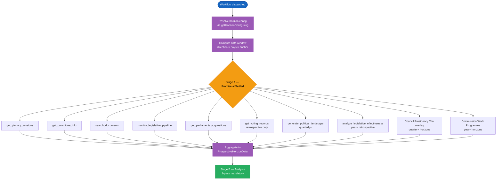

# Look-Ahead Generator Data Flow

> **Scope:** Unified data-flow model for the four prospective horizons — `week-ahead` (T+7d), `month-ahead` (T+30d), `quarter-ahead` (T+90d), `year-ahead` (T+365d) — plus the two electoral horizons that anchor on the next EP election: `term-outlook` (today → next-election ≈ 1500d) and `election-cycle` (±6 mo around the election week, ≈ 1825d).
>
> The original [`WEEK_AHEAD_DATA_FLOW.md`](WEEK_AHEAD_DATA_FLOW.md) remains as the deep-dive on the Stage-A MCP fan-out for `week-ahead`; this document supersedes it for the long-horizon and electoral families and points at the canonical registry that drives all six.

## 🧭 Single Source of Truth — Horizon Registry

All horizon-specific configuration lives in **[`src/config/article-horizons.ts`](src/config/article-horizons.ts)** (see ADR-007 in [ARCHITECTURE.md](ARCHITECTURE.md)). Each prospective / electoral horizon entry declares:

| Field | Meaning | Example (`year-ahead`) |
|---|---|---|
| `slug` | Workflow filename root | `year-ahead` |
| `dataWindow.direction` | Window orientation | `forward` |
| `dataWindow.days` | Span (days) — anchored at `today` for prospective, `next-election` for electoral | `365` |
| `dataWindow.anchor` | `today` / `next-election` / `commission-wp` / `term-end` | `today` |
| `cadence.cron` | Schedule | `0 8 2 1,4,7,10 *` (quarterly) |
| `primaryFeeds` | EP MCP tools that **must** be probed in Stage A | `get_plenary_sessions` · `monitor_legislative_pipeline` · `get_committee_info` · `search_documents` · `get_parliamentary_questions` |
| `mandatoryArtifacts` | Stage-C completeness-gate enforcement list | base + `forward-projection.md` · `legislative-pipeline-forecast.md` · `parliamentary-calendar-projection.md` · `presidency-trio-context.md` · `commission-wp-alignment.md` |
| `stageBudgets` | A/B/C/D/E minute ceilings | 5 / 25 / 4 / 2 / 2 |
| `scenarioMaxHorizonMonths` | Caps scenario-forecast time window | 12 |
| `forwardStatementsHorizonDays` | Bounds open-statement carry-forward | 365 |
| `electoralOverlay` | If `true`, electoral artifact set is mandatory | `false` |

Adding a new horizon is a single registry edit; the aggregator, forward-statements decay, Stage-C completeness gate, and drift-guard tests all consume this registry directly.

## 🔄 Stage A — Data fan-out (uniform across horizons)

### Graceful degradation

Every Stage-A call is independent (`Promise.allSettled`). Partial failures are logged and the absent feed is replaced with an empty array. A long-horizon run does **not** fall back to a shorter horizon — Stage-C blocks the PR if the registry-mandated artifact set cannot be produced.

## 🧠 Stage B — Mandatory artifact tree per horizon

Each horizon adds artifacts on top of the base mandatory set (`synthesis-summary`, `analysis-index`, `methodology-reflection`, `data-download-manifest`, `workflow-audit`, `political-classification`, `risk-assessment`, `swot-analysis`, `threat-analysis`, `stakeholder-impact`):

| Horizon | Mandatory extras | Floor sum (min lines) |
|---|---|---|
| `week-ahead` | `forward-projection` (80) · `scenario-forecast` · `wildcards-blackswans` · `forward-indicators` · `legislative-velocity-risk` | base + 5 |
| `month-ahead` | `forward-projection` (120) · the four week-ahead extras | base + 5 |
| `quarter-ahead` | `forward-projection` (280) · `legislative-pipeline-forecast` (220) · `parliamentary-calendar-projection` (200) · `presidency-trio-context` (180) · `commission-wp-alignment` (180) · `forward-indicators` | base + 6 |
| `year-ahead` | `forward-projection` (340) · `legislative-pipeline-forecast` (260) · `parliamentary-calendar-projection` (240) · `presidency-trio-context` (220) · `commission-wp-alignment` (220) · `forward-indicators` · `historical-baseline` | base + 7 |
| `term-outlook` | `forward-projection` (360) · `term-arc` (320) · `seat-projection` (280) · `mandate-fulfilment-scorecard` (280) · `presidency-trio-context` (220) · `commission-wp-alignment` (220) · `legislative-pipeline-forecast` · `forward-indicators` · `historical-parallels` | base + 9 (electoral overlay) |
| `election-cycle` | full `term-outlook` set + `comparative-international` + EP-election scenario branch | base + 10 (electoral overlay) |

The exact line floors are in [`analysis/methodologies/reference-quality-thresholds.json`](analysis/methodologies/reference-quality-thresholds.json) and the artifact-construction rules in [`analysis/methodologies/per-artifact-methodologies.md`](analysis/methodologies/per-artifact-methodologies.md).

## 🗳️ Electoral overlay invariants

When `electoralOverlay: true` (currently `term-outlook` and `election-cycle`), the Stage-C completeness gate additionally enforces:

1. `mandate-fulfilment-scorecard.md` is present and meets its depth floor.
2. `seat-projection.md` is present and meets its depth floor.
3. `scenario-forecast.md` contains at least one EP-election outcome branch (e.g. EPP-led grand coalition / Right-wing majority / S&D-Greens-Renew progressive bloc).
4. `forwardStatementsHorizonDays` is bounded at ≤ 1825.

These invariants are asserted by [`test/unit/horizon-registry.test.js`](test/unit/horizon-registry.test.js) at build time and re-checked by the runtime Stage-C gate.

## 🔗 Related documents

- [`WEEK_AHEAD_DATA_FLOW.md`](WEEK_AHEAD_DATA_FLOW.md) — historic deep-dive on the `week-ahead` Stage-A MCP fan-out (still accurate for the week-ahead slot).
- [`Article-Generation.md` § Forward-looking horizons & election cycle](Article-Generation.md) — pipeline-level overview.
- [`WORKFLOWS.md`](WORKFLOWS.md) — long-horizon family classification and Stage-C tripwires.
- [`ARCHITECTURE.md`](ARCHITECTURE.md) — ADR-007 (Centralised Horizon Registry).
- [`analysis/methodologies/forward-projection-methodology.md`](analysis/methodologies/forward-projection-methodology.md) — WEP decay tables, structural-break tripwires.
- [`analysis/methodologies/electoral-cycle-methodology.md`](analysis/methodologies/electoral-cycle-methodology.md) — dual-track retrospective + forecast for electoral horizons.

---

**Version**: 1.0
**Last Updated**: 2026-05-02
**Issue**: Look-Ahead §10 documentation refresh (PR follow-up to #1561 / epic #1562)
