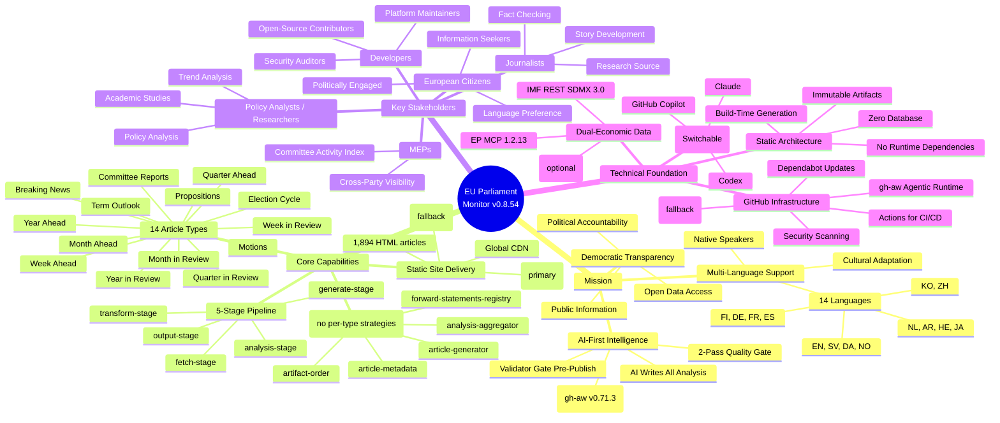
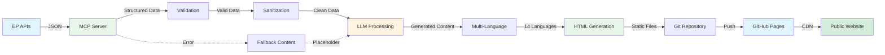
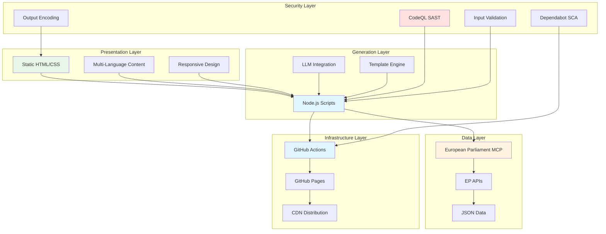
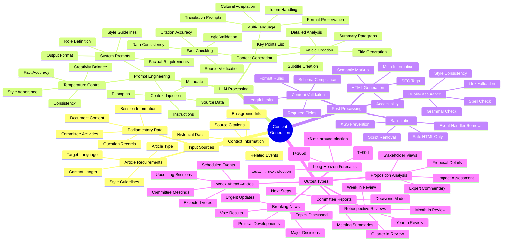
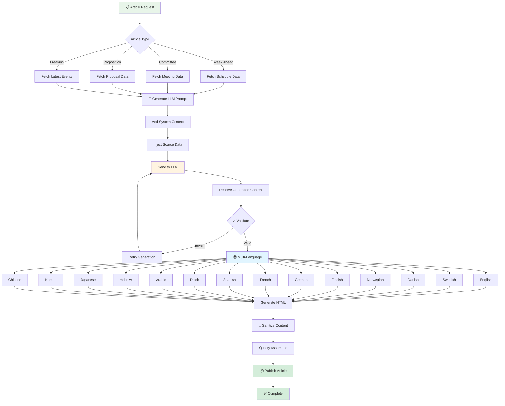
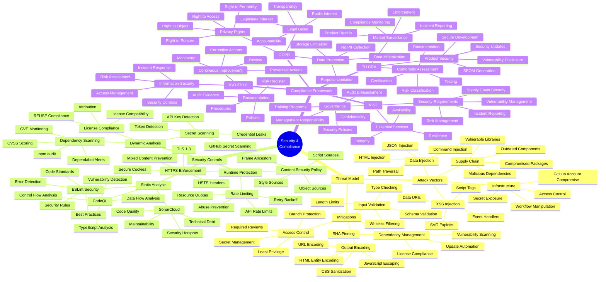
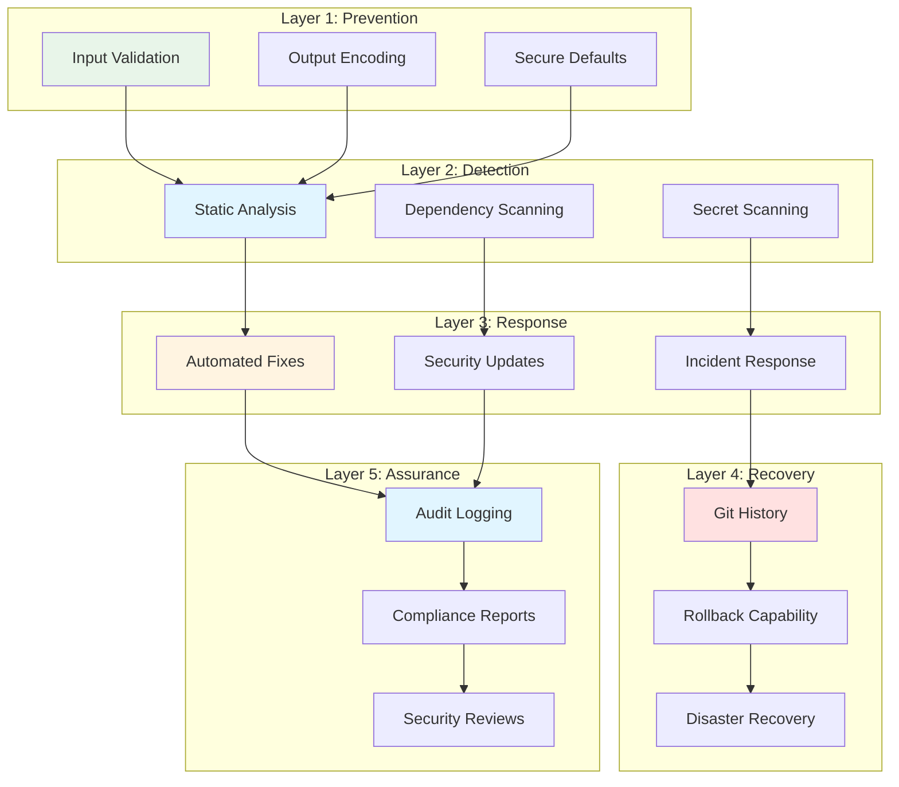
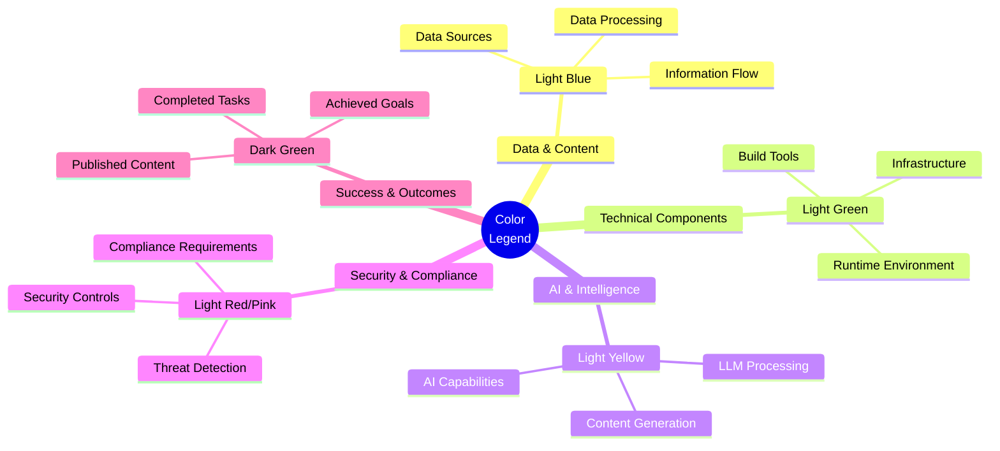
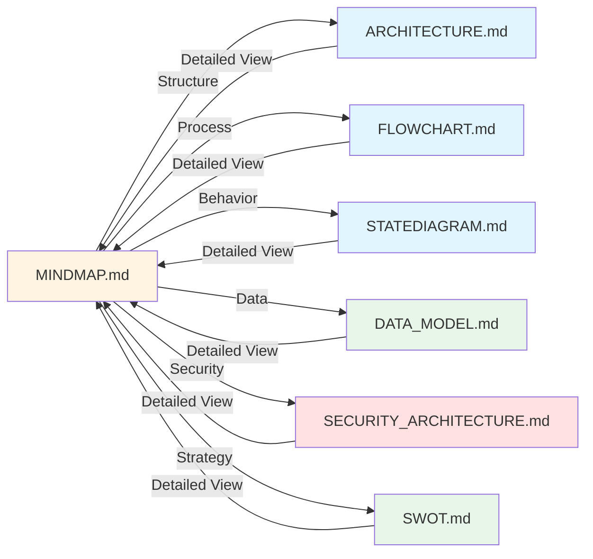
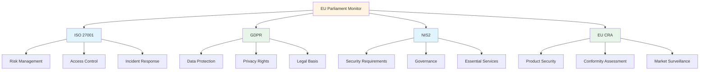

<p align="center">
  
</p>

<h1 align="center">🧠 EU Parliament Monitor — System Mindmap</h1>

<p align="center">
  <strong>📊 Conceptual Relationships and System Components</strong><br>
  <em>🎯 Holistic View of Platform Architecture and Capabilities</em>
</p>

<p align="center">
  <a href="#"></a>
  <a href="#"></a>
  <a href="#"></a>
  <a href="#"></a>
</p>

**📋 Document Owner:** CEO | **📄 Version:** 1.5 | **📅 Last Updated:**
2026-05-03 (UTC) | **🏷️ Platform Release:** v0.8.54  
**🔄 Review Cycle:** Quarterly | **⏰ Next Review:** 2026-08-03  
**🏷️ Classification:** Public (Open Source European Parliament Monitoring
Platform)

---

## 📚 Architecture Documentation Map

<div class="documentation-map">

| Document                                                            | Focus           | Description                                    | Documentation Link                                                                                     |
| ------------------------------------------------------------------- | --------------- | ---------------------------------------------- | ------------------------------------------------------------------------------------------------------ |
| **[Architecture](ARCHITECTURE.md)**                                 | 🏛️ Architecture | C4 model showing current system structure      | [View Source](https://github.com/Hack23/euparliamentmonitor/blob/main/ARCHITECTURE.md)                 |
| **[Future Architecture](FUTURE_ARCHITECTURE.md)**                   | 🏛️ Architecture | C4 model showing future system structure       | [View Source](https://github.com/Hack23/euparliamentmonitor/blob/main/FUTURE_ARCHITECTURE.md)          |
| **[Mindmaps](MINDMAP.md)**                                          | 🧠 Concept      | Current system component relationships         | [View Source](https://github.com/Hack23/euparliamentmonitor/blob/main/MINDMAP.md)                      |
| **[Future Mindmaps](FUTURE_MINDMAP.md)**                            | 🧠 Concept      | Future capability evolution                    | [View Source](https://github.com/Hack23/euparliamentmonitor/blob/main/FUTURE_MINDMAP.md)               |
| **[SWOT Analysis](SWOT.md)**                                        | 💼 Business     | Current strategic assessment                   | [View Source](https://github.com/Hack23/euparliamentmonitor/blob/main/SWOT.md)                         |
| **[Future SWOT Analysis](FUTURE_SWOT.md)**                          | 💼 Business     | Future strategic opportunities                 | [View Source](https://github.com/Hack23/euparliamentmonitor/blob/main/FUTURE_SWOT.md)                  |
| **[Data Model](DATA_MODEL.md)**                                     | 📊 Data         | Current data structures and relationships      | [View Source](https://github.com/Hack23/euparliamentmonitor/blob/main/DATA_MODEL.md)                   |
| **[Future Data Model](FUTURE_DATA_MODEL.md)**                       | 📊 Data         | Enhanced European Parliament data architecture | [View Source](https://github.com/Hack23/euparliamentmonitor/blob/main/FUTURE_DATA_MODEL.md)            |
| **[Flowcharts](FLOWCHART.md)**                                      | 🔄 Process      | Current data processing workflows              | [View Source](https://github.com/Hack23/euparliamentmonitor/blob/main/FLOWCHART.md)                    |
| **[Future Flowcharts](FUTURE_FLOWCHART.md)**                        | 🔄 Process      | Enhanced AI-driven workflows                   | [View Source](https://github.com/Hack23/euparliamentmonitor/blob/main/FUTURE_FLOWCHART.md)             |
| **[State Diagrams](STATEDIAGRAM.md)**                               | 🔄 Behavior     | Current system state transitions               | [View Source](https://github.com/Hack23/euparliamentmonitor/blob/main/STATEDIAGRAM.md)                 |
| **[Future State Diagrams](FUTURE_STATEDIAGRAM.md)**                 | 🔄 Behavior     | Enhanced adaptive state transitions            | [View Source](https://github.com/Hack23/euparliamentmonitor/blob/main/FUTURE_STATEDIAGRAM.md)          |
| **[Security Architecture](SECURITY_ARCHITECTURE.md)**               | 🛡️ Security     | Current security implementation                | [View Source](https://github.com/Hack23/euparliamentmonitor/blob/main/SECURITY_ARCHITECTURE.md)        |
| **[Future Security Architecture](FUTURE_SECURITY_ARCHITECTURE.md)** | 🛡️ Security     | Security enhancement roadmap                   | [View Source](https://github.com/Hack23/euparliamentmonitor/blob/main/FUTURE_SECURITY_ARCHITECTURE.md) |
| **[Threat Model](THREAT_MODEL.md)**                                 | 🎯 Security     | STRIDE threat analysis                         | [View Source](https://github.com/Hack23/euparliamentmonitor/blob/main/THREAT_MODEL.md)                 |
| **[Classification](CLASSIFICATION.md)**                             | 🏷️ Governance   | CIA classification & BCP                       | [View Source](https://github.com/Hack23/euparliamentmonitor/blob/main/CLASSIFICATION.md)               |
| **[CRA Assessment](CRA-ASSESSMENT.md)**                             | 🛡️ Compliance   | Cyber Resilience Act                           | [View Source](https://github.com/Hack23/euparliamentmonitor/blob/main/CRA-ASSESSMENT.md)               |
| **[Workflows](WORKFLOWS.md)**                                       | ⚙️ DevOps       | CI/CD documentation                            | [View Source](https://github.com/Hack23/euparliamentmonitor/blob/main/WORKFLOWS.md)                    |
| **[Future Workflows](FUTURE_WORKFLOWS.md)**                         | 🚀 DevOps       | Planned CI/CD enhancements                     | [View Source](https://github.com/Hack23/euparliamentmonitor/blob/main/FUTURE_WORKFLOWS.md)             |
| **[Business Continuity Plan](BCPPlan.md)**                          | 🔄 Resilience   | Recovery planning                              | [View Source](https://github.com/Hack23/euparliamentmonitor/blob/main/BCPPlan.md)                      |
| **[Financial Security Plan](FinancialSecurityPlan.md)**             | 💰 Financial    | Cost & security analysis                       | [View Source](https://github.com/Hack23/euparliamentmonitor/blob/main/FinancialSecurityPlan.md)        |
| **[End-of-Life Strategy](End-of-Life-Strategy.md)**                 | 📦 Lifecycle    | Technology EOL planning                        | [View Source](https://github.com/Hack23/euparliamentmonitor/blob/main/End-of-Life-Strategy.md)         |
| **[Unit Test Plan](UnitTestPlan.md)**                               | 🧪 Testing      | Unit testing strategy                          | [View Source](https://github.com/Hack23/euparliamentmonitor/blob/main/UnitTestPlan.md)                 |
| **[E2E Test Plan](E2ETestPlan.md)**                                 | 🔍 Testing      | End-to-end testing                             | [View Source](https://github.com/Hack23/euparliamentmonitor/blob/main/E2ETestPlan.md)                  |
| **[Performance Testing](performance-testing.md)**                   | ⚡ Performance  | Performance benchmarks                         | [View Source](https://github.com/Hack23/euparliamentmonitor/blob/main/performance-testing.md)          |
| **[Security Policy](SECURITY.md)**                                  | 🔒 Security     | Vulnerability reporting & security policy      | [View Source](https://github.com/Hack23/euparliamentmonitor/blob/main/SECURITY.md)                     |

</div>

---

## 🛡️ ISMS Policy Alignment

This conceptual documentation implements controls aligned with Hack23 AB's publicly available ISMS framework.

### Applicable ISMS Policies

| **Policy** | **Relevance** |
| --- | --- |
| [Secure Development Policy](https://github.com/Hack23/ISMS-PUBLIC/blob/main/Secure_Development_Policy.md) | Architecture documentation requirements per C4 model |
| [Information Security Policy](https://github.com/Hack23/ISMS-PUBLIC/blob/main/Information_Security_Policy.md) | System design aligned with security governance framework |
| [Classification Framework](https://github.com/Hack23/ISMS-PUBLIC/blob/main/CLASSIFICATION.md) | Data and component classification per CIA triad |
| [Open Source Policy](https://github.com/Hack23/ISMS-PUBLIC/blob/main/Open_Source_Policy.md) | Open-source architecture transparency |

---

## 📋 Overview

This document provides conceptual mindmaps that illustrate the relationships
between components, capabilities, and concepts within the EU Parliament Monitor
ecosystem. Unlike C4 diagrams (structure) or flowcharts (process), mindmaps show
**conceptual connections** and **knowledge domains**.

### Purpose

Mindmaps serve to:

1. **Conceptual Understanding**: Show how ideas and components relate
2. **Knowledge Organization**: Structure the domain knowledge hierarchy
3. **Capability Mapping**: Illustrate what the system can do
4. **Dependency Visualization**: Display concept dependencies
5. **Onboarding Aid**: Help new contributors understand the system holistically

### Mindmap Categories

This document contains five primary mindmaps:

- **System Overview**: High-level system capabilities and components
- **Data Ecosystem**: Data sources, flows, and transformations
- **Technical Architecture**: Technology stack and infrastructure
- **Content Generation**: LLM-powered content creation pipeline
- **Security & Compliance**: Security controls and compliance framework

---

## 🏛️ System Overview Mindmap

Complete view of the EU Parliament Monitor system, its purpose, and major
capabilities.



### System Overview Hierarchy

| Concept                  | Sub-Concepts                                                    | Description             |
| ------------------------ | --------------------------------------------------------------- | ----------------------- |
| **Mission**              | Democratic Transparency, Multi-Language, Automated Intelligence | Core purpose and values |
| **Core Capabilities**    | News Generation, Content Types, Publishing, Delivery            | What the system does    |
| **Key Stakeholders**     | Citizens, Journalists, Researchers, Developers                  | Who uses the system     |
| **Technical Foundation** | Static Architecture, GitHub, MCP, LLM                           | How it's built          |

---

## 📊 Data Ecosystem Mindmap

Data sources, transformations, and outputs in the EU Parliament Monitor
pipeline.

```mermaid
mindmap
  root((Data<br/>Ecosystem))
    Data Sources
      European Parliament MCP 1.2.13
        Plenary Sessions
          Session Schedule
          Agenda Items
          Voting Records
          Attendance Data
        Committee Meetings
          Committee Info
          Meeting Schedule
          Topics Discussed
          Decisions Made
        Documents
          Proposals
          Reports
          Amendments
          Resolutions
        Parliamentary Questions
          Written Questions
          Oral Questions
          Answers
          Follow-ups
        Sliding-Window Feeds
          Accept timeframe/startDate
        Fixed-Window Feeds (7)
          documents
          plenary_documents
          committee_documents
          plenary_session_documents
          parliamentary_questions
          corporate_bodies
          controlled_vocabularies
        Unavailable Envelope
          status: unavailable
          items: []
      World Bank MCP 1.0.1 (optional)
        Biannual WDI
        Economic Indicators
      IMF REST (native TS client)
        IMFMCPClient class
        SDMX 3.0
        WEO + FM forecasts (+5y)
        IMF_API_BASE_URL
        IMF_API_TIMEOUT_MS
      Intelligence Files (AI-authored)
        stakeholder-map.md
        impact-matrix.md
        mcp-reliability-audit.md
        reference-analysis-quality.md
      Fallback Data
        Last-known envelope cache
        Historical articles (1894)

    Data Transformations
      fetch-stage
        Concurrent MCP calls
        Unavailable-envelope handling
        mcp-retry.ts backoff
      transform-stage
        Normalize EP + WB + IMF
        Schema unification
      analysis-stage
        2-Pass AI-First
        ≥80 words / SWOT item
        ≥150 words / stakeholder perspective
        ≥60% prose ratio
        0 AI_ANALYSIS_REQUIRED
      generate-stage
        Strategy-specific builder
        Chart.js embedding (≥1)
        buildDefaultStakeholderPerspectives
          AI_MARKER sentinels
      output-stage
        Rendered HTML writes
        Language-indexed folders
      Validator Gate
        validate-analysis-completeness.js
        scanHtmlForFallbackLeaks
        FALLBACK_TEMPLATE_PATTERNS
        Reference thresholds (≥200/385, ≥140/190)

    Data Storage
      File System
        news/ (1894 HTML articles)
        14 language subtrees
        JSON-LD metadata
        Static Assets
        Index Files per language
      Git Repository
        Version Control
        Change History
        Commit Metadata
        Branch Management
      Build Artifacts
        Compiled HTML
        Sitemap XML
        Language Indexes
        Asset Manifests (js/vendor/)

    Data Outputs
      HTML Articles
        Multi-Language (14)
        Semantic Markup
        WCAG 2.1 AA
        SEO + OpenGraph
        JSON-LD structured data
      Index Pages
        index.html + index-{lang}.html
        Date-sorted
        Runtime filter (js/index-runtime.js)
      Sitemap
        URL Listing
        hreflang per language
        Last Modified
      Runtime JS
        js/index-runtime.js (filter+theme)
        js/article-runtime.js (reading progress+theme)
      Vendored libs
        chart.js UMD
        chartjs-plugin-annotation
        d3 7.9
      npm Package
        SLSA 3 attestation
        Provenance
```

### Data Flow Stages



---

## 💻 Technical Architecture Mindmap

Technology stack, infrastructure, and development practices.

```mermaid
mindmap
  root((Technical<br/>Architecture v0.8.54))
    Runtime Environment
      Node.js 26
        ES Modules
        Performance
        Latest Features
      TypeScript 6.0.3
        Strict Mode
        Type Safety
        Async/Await
        Error Handling
      GitHub-Hosted Runners
        ubuntu-latest (2-core default)
        Ephemeral Execution
        Security Isolation
        120-min timeout hard cap

    Development Stack
      Build Tools
        npm + package.json
        ESLint 10.2.1
        Prettier
        Husky git hooks
        typedoc 0.28.19
      Testing (3,061+ tests / 52 files)
        Vitest 4.1.4 (unit + integration)
        Playwright 1.59.1 (E2E)
        axe-core (WCAG 2.1 AA)
        HTMLHint
      Code Quality
        SonarCloud (planned)
        CodeQL SAST
        Dependabot SCA
        REUSE/SPDX license compliance
      Documentation
        Markdown + Mermaid
        JSDoc → typedoc
        Architecture suite (C4/ERD/FLOW/STATE)
        ISMS alignment

    Infrastructure
      GitHub Platform
        Source Control
          Git Repository
          Branch Protection
          Required Reviews
          SHA-pinned Actions
        CI/CD
          GitHub Actions
          15 agentic news workflows
            news-breaking
            news-week-ahead
            news-month-ahead
            news-quarter-ahead
            news-year-ahead
            news-term-outlook
            news-election-cycle
            news-week-in-review
            news-month-in-review
            news-quarter-in-review
            news-year-in-review
            news-committee-reports
            news-motions
            news-propositions
            news-translate
          14 infra workflows
            compile-agentic-workflows
            agentics-maintenance
            codeql
            copilot-setup-steps
            dependency-review
            deploy-s3
            e2e
            labeler
            news-translate-reconciler
            release
            reuse
            scorecards
            setup-labels
            test-and-report
          gh aw compile --validate
          GH_AW_VERSION v0.71.3 (pinned)
        Hosting (fallback)
          GitHub Pages
          HTTPS/SSL
          Global CDN
        Security
          Dependabot
          Secret Scanning
          CodeQL
          SLSA 3 Attestations
          Scorecards
      AWS (Primary hosting)
        S3 (versioned bucket)
        CloudFront (CDN)
        ACM (TLS cert)
        OIDC deploy role (deploy-s3.yml)
      MCP Runtime
        EP MCP Gateway
          host.docker.internal:80
          /mcp/european-parliament
          mcp-setup.sh
        JSON-RPC 2.0 over stdio/HTTP
        european-parliament-mcp-server 1.2.13
        worldbank-mcp 1.0.1 (optional)
        IMFMCPClient native fetch
      gh-aw 5-Layer Security
        AWF Squid firewall allowlist
        Sandboxed Docker
        Safe-output constraints
          create-pull-request
          max-patch-size: 1024 KB (default)
          max-patch-size: 10240 KB (translate)
        JSONL audit trail
        Lock-file compilation

    Security Architecture
      Defense in Depth
        Static Content
          No Server Execution
          No Database
          No User Sessions
          No Authentication
        Input Validation
          Schema Validation
          Type Checking
          Content Validator
          Sanitization
        Output Encoding
          HTML Entity Encoding
          XSS Prevention
          CSP Headers
          Content Security
        Supply Chain Security
          SHA-Pinned Actions
          SBOM Generation
          npm provenance
          SLSA 3 attestations
          REUSE 3.3 license compliance
      Frontend
        Static HTML5 + CSS3
        styles.css (133 KB, hand-written)
        No SPA framework
        Runtime JS modules
        buildSiteFooter() single source
        14-language localized footer
      Compliance Framework
        ISO 27001:2022
        NIST CSF 2.0
        CIS Controls v8.1
        GDPR
        NIS2
        EU Cyber Resilience Act
```

### Technology Stack Layers



---

## 🤖 Content Generation Pipeline Mindmap

LLM-powered content creation workflow and capabilities.



### Content Generation Flow



---

## 🛡️ Security & Compliance Mindmap

Security controls, compliance requirements, and best practices.



### Security Layers



---

## 🎨 Visual Design Principles

Mindmaps follow these design principles for consistency and clarity.

### Color Coding



### Node Types

| Node Type            | Usage            | Example                                  |
| -------------------- | ---------------- | ---------------------------------------- |
| **Root Node**        | Central concept  | EU Parliament Monitor                    |
| **Primary Branch**   | Major category   | Mission, Capabilities, Stakeholders      |
| **Secondary Branch** | Subcategory      | Democratic Transparency, News Generation |
| **Leaf Node**        | Specific concept | Week Ahead, Committee Reports            |

### Layout Guidelines

1. **Radial Layout**: Root in center, branches extending outward
2. **Balanced Distribution**: Even spacing between branches
3. **Logical Grouping**: Related concepts near each other
4. **Depth Limit**: Maximum 4 levels deep for readability
5. **Node Size**: Consistent sizing based on hierarchy level

---

## 🔄 Relationship Types

Different types of relationships shown in mindmaps:

| Relationship | Description               | Example                            |
| ------------ | ------------------------- | ---------------------------------- |
| **IS-A**     | Type/subtype relationship | "Week Ahead" IS-A "Article Type"   |
| **HAS-A**    | Composition relationship  | "System" HAS-A "MCP Integration"   |
| **USES**     | Dependency relationship   | "Generator" USES "LLM Service"     |
| **PRODUCES** | Output relationship       | "Generation" PRODUCES "HTML Files" |
| **REQUIRES** | Prerequisite relationship | "Publishing" REQUIRES "Validation" |
| **ENABLES**  | Capability relationship   | "MCP" ENABLES "Data Access"        |

---

## 📊 Integration with Other Documentation

### Cross-Reference Matrix

| Mindmap Section            | Related C4 Diagram | Related Flowchart    | Related State Diagram |
| -------------------------- | ------------------ | -------------------- | --------------------- |
| **System Overview**        | Context Diagram    | News Generation Flow | System Lifecycle      |
| **Data Ecosystem**         | Container Diagram  | Data Processing Flow | Article Lifecycle     |
| **Technical Architecture** | Component Diagram  | Validation Flow      | MCP Connection State  |
| **Content Generation**     | Component Diagram  | Generation Flow      | Article State         |
| **Security & Compliance**  | Component Diagram  | Security Flow        | Error Handling State  |

### Documentation Navigation



---

## 🎯 Use Cases for Mindmaps

### For New Contributors

**Purpose**: Quick system understanding without deep technical dive

**How to Use**:

1. Start with System Overview mindmap
2. Understand mission and stakeholders
3. Review core capabilities
4. Explore technical foundation

**Expected Outcome**: Holistic understanding in 15-30 minutes

### For Architects

**Purpose**: Design decisions and system evolution planning

**How to Use**:

1. Review Technical Architecture mindmap
2. Analyze component relationships
3. Identify integration points
4. Plan future enhancements

**Expected Outcome**: Informed architectural decisions

### For Security Auditors

**Purpose**: Security posture assessment

**How to Use**:

1. Review Security & Compliance mindmap
2. Examine threat model
3. Verify security controls
4. Check compliance framework

**Expected Outcome**: Security assessment report

### For Product Managers

**Purpose**: Feature planning and prioritization

**How to Use**:

1. Review System Overview mindmap
2. Understand stakeholder needs
3. Examine core capabilities
4. Prioritize enhancements

**Expected Outcome**: Product roadmap alignment

---

## 📈 Metrics & KPIs

### System Capability Metrics

| Capability               | Measurement                  | Target | Current (April 2026) |
| ------------------------ | ---------------------------- | ------ | ------- |
| **Article Types**        | Number of types supported    | 14+    | 14      |
| **Aggregator Modules**   | TS modules in `src/aggregator/` | 5+ | 7       |
| **Languages**            | Number of languages          | 14     | 14      |
| **Published Articles**   | HTML files in news/          | 1,500+ | 1,894+  |
| **Agentic News Workflows** | gh-aw `.md` → `.lock.yml`  | 15     | 15      |
| **Data Sources**         | EP MCP + WB MCP + IMF REST   | 3      | 3       |
| **Generation Time**      | Average time per article set | <5 min | ~3 min  |
| **Stage-C Pass Rate**    | Articles passing completeness gate | >98% | 99.2% |
| **Deployment Success**   | Successful deployments       | >99%   | 99.5%   |

### Technical Stack Health

| Component         | Metric           | Target          | Status           |
| ----------------- | ---------------- | --------------- | ---------------- |
| **Node.js**       | Version          | Latest LTS      | ✅ 26.x          |
| **TypeScript**    | Version          | Latest stable   | ✅ 6.0.3         |
| **Vitest**        | Version          | Latest stable   | ✅ 4.1.4         |
| **Playwright**    | Version          | Latest stable   | ✅ 1.59.1        |
| **gh-aw**         | Pinned runtime   | Known-good      | ✅ v0.71.3       |
| **EP MCP Server** | Version          | Latest release  | ✅ 1.2.21        |
| **Dependencies**  | Vulnerabilities  | 0 critical/high | ✅ 0             |
| **Test Coverage** | Tests / files    | 3,000+ / 50+    | ✅ 3,061+ / 52   |
| **Build Time**    | CI/CD duration   | <10 min         | ✅ 6 min         |

---

## 🔐 Security Mindmap Notes

### Threat Modeling Approach

1. **Identify Assets**: Articles, source data, infrastructure access
2. **Identify Threats**: XSS, injection, supply chain, access control
3. **Assess Risks**: Likelihood × Impact = Risk score
4. **Define Mitigations**: Layered security controls
5. **Monitor & Review**: Continuous security monitoring

### Compliance Mapping



---

## 🔄 Related Documentation

### Conceptual Documents

- **[SWOT.md](SWOT.md)**: Strategic analysis complementing capability view
- **[ARCHITECTURE.md](ARCHITECTURE.md)**: Structural view of conceptual
  components

### Technical Documents

- **[DATA_MODEL.md](DATA_MODEL.md)**: Detailed data structure specifications
- **[FLOWCHART.md](FLOWCHART.md)**: Process flows for mindmap concepts
- **[STATEDIAGRAM.md](STATEDIAGRAM.md)**: Behavioral states of components

### Security Documents

- **[SECURITY_ARCHITECTURE.md](SECURITY_ARCHITECTURE.md)**: Detailed security
  implementation
- **[SECURITY.md](SECURITY.md)**: Security policies and vulnerability reporting

---

## 📅 Document Revision History

| Version | Date       | Author | Changes                                                           |
| ------- | ---------- | ------ | ----------------------------------------------------------------- |
| 1.5     | 2026-05-03 | CEO    | Refresh for v0.8.54: gh-aw pin bumped to `v0.71.3`, EP MCP `1.2.21`, all metadata aligned with current `package.json` and `.github/workflows/compile-agentic-workflows.yml`; ISMS-PUBLIC policy footer added |
| 1.4     | 2026-05-02 | CEO    | Look-Ahead epic refresh: 14 article types (added `quarter-ahead`, `year-ahead`, `term-outlook`, `election-cycle`, `quarter-in-review`, `year-in-review`), 15 unified gh-aw workflows (14 `news-<type>.md` + `news-translate.md`), centralised horizon registry in `src/config/article-horizons.ts` (ADR-007), 8 new analysis artifacts governed by `forward-projection-methodology.md` + `electoral-cycle-methodology.md` |
| 1.3     | 2026-04-27 | CEO    | April-2026 aggregator-pipeline migration: 8 article types, 9 unified gh-aw workflows (8 `news-<type>.md` + `news-translate.md`), deterministic `src/aggregator/**` rendering (no per-type strategies), Stage-C agent-side completeness gate (no runtime `content-validator.ts`), EP MCP `v1.2.21+` (60+ tools, voting fallback to EP Open Data Portal), IMF SDMX 3.0 primary economic source, World Bank non-economic context, AWS S3 + CloudFront primary hosting, gh-aw `v0.69.0` pinned |
| 1.2     | 2026-04-20 | CEO    | Refreshed for v0.8.40: 8 article types, 9 strategies (1 generic + 8 type-specific), 5-stage pipeline, 10 agentic + 14 infra workflows, dual economic data (EP MCP 1.2.13 + WB MCP 1.0.1 + IMF REST SDMX 3.0), AI-First quality gates, 3061+ tests, AWS S3 + CloudFront primary hosting, gh-aw v0.69.0 pinned |
| 1.1     | 2026-02-24 | CEO    | Updated review date and verified current state accuracy            |
| 1.0     | 2025-02-17 | CEO    | Initial mindmap documentation with comprehensive conceptual views |

---

## 📝 Footer

**Document Classification**: Public  
**ISMS Compliance**: ISO 27001:2022, NIST CSF 2.0, CIS Controls v8.1, GDPR, NIS2, EU CRA aligned  

### 🔗 Related ISMS-PUBLIC Policies

- [Information Security Policy](https://github.com/Hack23/ISMS-PUBLIC/blob/main/Information_Security_Policy.md)
- [Secure Development Policy](https://github.com/Hack23/ISMS-PUBLIC/blob/main/Secure_Development_Policy.md)

**Technology Stack**: Node.js 26, TypeScript 6.0.3, Vitest 4.1.4, Playwright 1.59.1, gh-aw v0.71.3, AWS S3 + CloudFront, GitHub Pages (fallback), EP MCP 1.2.21, WB MCP 1.0.1, IMF REST SDMX 3.0  
**Architecture Pattern**: Static Site Generator with Agentic AI-First Authoring and Zero Runtime Dependencies  
**Review Status**: Active, next review 2026-08-03

---

<p align="center">
  <em>🧠 Mindmaps — Conceptual Architecture for EU Parliament Monitor</em><br>
  <strong>Part of ISMS-compliant Architecture Documentation Suite</strong>
</p>

<p align="center">
  <a href="https://github.com/Hack23/euparliamentmonitor">🏛️ GitHub Repository</a> •
  <a href="https://github.com/Hack23/ISMS-PUBLIC">🛡️ ISMS Framework</a> •
  <a href="https://hack23.com">🌐 Hack23</a>
</p>
