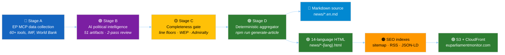
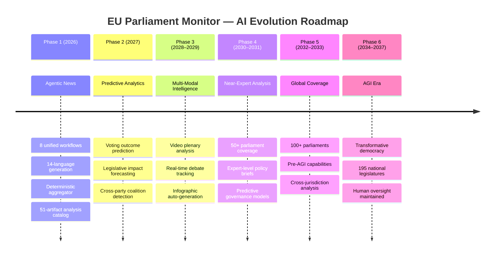

<!-- SPDX-FileCopyrightText: 2024-2026 Hack23 AB -->
<!-- SPDX-License-Identifier: Apache-2.0 -->

<p align="center">
  
</p>

<h1 align="center">🏛️ EU Parliament Monitor</h1>

<p align="center">
  <strong>European Parliament Political Intelligence Platform</strong><br>
  <em>🧠 Political intelligence · 🔍 Radical transparency · 🗳️ Democratic accountability · 🤖 AI-generated news in 14 languages</em>
</p>

<p align="center">
  <a href="https://euparliamentmonitor.com"></a>
  <a href="https://euparliamentmonitor.com/political-intelligence.html"></a>
  <a href="https://euparliamentmonitor.com/sitemap.html"></a>
</p>

<p align="center">
  <a href="#"></a>
  <a href="#"></a>
  <a href="#"></a>
  <a href="#"></a>
</p>

[](https://scorecard.dev/viewer/?uri=github.com/Hack23/euparliamentmonitor)
[](https://www.bestpractices.dev/projects/12068)
[](https://github.com/Hack23/euparliamentmonitor/attestations)
[](https://github.com/Hack23/euparliamentmonitor/blob/main/LICENSE)
[](https://github.com/Hack23/ISMS-PUBLIC)
[](https://deepwiki.com/Hack23/euparliamentmonitor)

[](https://github.com/Hack23/euparliamentmonitor/actions/workflows/compile-agentic-workflows.yml)
[](https://github.com/Hack23/euparliamentmonitor/actions/workflows/codeql.yml)
[](https://github.com/Hack23/euparliamentmonitor/actions/workflows/test-and-report.yml)
[](https://github.com/Hack23/euparliamentmonitor/actions/workflows/e2e.yml)
[](https://github.com/Hack23/euparliamentmonitor/actions/workflows/release.yml)

---

**Explore the live platform** — [🌐 euparliamentmonitor.com](https://euparliamentmonitor.com) · [🧠 Political Intelligence Hub](https://euparliamentmonitor.com/political-intelligence.html) (methodology + artifact transparency, all 14 languages) · [📊 Analysis & Reports](https://euparliamentmonitor.com/docs/) · [🗺️ Site Map](https://euparliamentmonitor.com/sitemap.html) (every page, every language) · [📔 API Reference](https://euparliamentmonitor.com/docs/api/)

## 🎯 Why This Exists

The European Parliament adopts laws that affect **450 million citizens** across 27 member states. Yet most of what happens in Brussels and Strasbourg — committee dossiers, rapporteur appointments, coalition trade-offs, amendment battles, urgency files, trilogue dynamics — remains effectively invisible to the public. Press coverage is sparse, fragmented across national outlets, and rarely connects the procedural dots.

**EU Parliament Monitor turns the EP's own open data into auditable political intelligence — and publishes it as readable news in 14 languages, every day, fully sourced.**

This repository is the open-source platform behind **[euparliamentmonitor.com](https://euparliamentmonitor.com)**: an AI-driven newsroom that monitors plenary sessions, committee work, motions, propositions, and forward-calendar events; produces *Economist-style* analytical articles backed by 51 structured analysis artifacts per run; and exposes **every** methodology, template, and analysis tree publicly so any reader, journalist, researcher, or NGO can verify the analysis behind the prose.

| Pillar | What it means in this project |
|---|---|
| 🧠 **Political Intelligence** | Structured analytic techniques (ACH, SWOT/TOWS, PESTLE, scenario forecasting, devil's-advocate), Admiralty source grading, Words of Estimative Probability (WEP) bands, ICD-203 standards, and a 6-dimension political-threat framework — applied daily to live EP data. |
| 🔍 **Radical Transparency** | Every article links back to the analysis run it was rendered from. Every artifact links to its methodology. Every methodology is published. No black box. |
| 🗳️ **Democratic Accountability** | Public-data only. GDPR-clean. No personal profiling. Multi-language so a Finnish farmer, a Greek student, and a Polish journalist all get the same intelligence in their own language. |
| 🤖 **AI-Generated News** | 8 unified gh-aw agentic workflows + 1 translation workflow run autonomously, produce structured analysis, render deterministic HTML, and open publication-ready pull requests for human review. |

### Documentation & Reports
[](https://euparliamentmonitor.com/docs/api/)
[](https://euparliamentmonitor.com/docs/coverage/index.html)
[](https://euparliamentmonitor.com/playwright-report/index.html)
[](https://github.com/Hack23/euparliamentmonitor/attestations)
---

## 🌐 Explore the Live Platform

The published site is the audience-facing companion to this npm/TypeScript package. **Two hub pages give the fastest entry point** — bookmark them:

<table>
  <tr>
    <td width="140" align="center" valign="top">
      <a href="https://euparliamentmonitor.com/index.html"></a>
    </td>
    <td>
      <strong><a href="https://euparliamentmonitor.com/index.html">🌐 Live News Site — euparliamentmonitor.com</a></strong><br>
      Daily-updated front page with the latest <em>Breaking News</em>, <em>Week / Month Ahead</em>, <em>Week / Month in Review</em>, <em>Committee Reports</em>, <em>Plenary Votes &amp; Resolutions</em>, and <em>Legislative Procedures</em> articles. Every article is generated by an AI agent from live European Parliament MCP data, peer-reviewed against a 51-artifact analytical baseline, and published in <strong>14 languages</strong> (EN, SV, DA, NO, FI, DE, FR, ES, NL, AR, HE, JA, KO, ZH) with WCAG 2.1 AA accessibility, RTL support for Arabic and Hebrew, and JSON-LD <code>NewsArticle</code> structured data linking back to every source artifact.
    </td>
  </tr>
  <tr>
    <td width="140" align="center" valign="top">
      <a href="https://euparliamentmonitor.com/political-intelligence.html"></a>
    </td>
    <td>
      <strong><a href="https://euparliamentmonitor.com/political-intelligence.html">🧠 Political Intelligence Hub</a></strong><br>
      The audit-ready transparency layer behind every published article. A single, fully-linked index into <strong>17 methodologies</strong>, <strong>52 analysis templates</strong>, <strong>19 tradecraft references</strong>, and over <strong>170 daily analysis runs</strong> producing <strong>1,700+ structured artifacts</strong> — including the <em>10-step AI-driven analysis protocol</em>, OSINT tradecraft standards (Admiralty / WEP / SAT / ACH), the political-threat framework, the political SWOT framework, and the per-artifact construction rules. Every link opens directly on GitHub so readers can <em>verify the analysis behind the prose</em>. Available in all 14 supported languages.
    </td>
  </tr>
  <tr>
    <td width="140" align="center" valign="top">
      <a href="https://euparliamentmonitor.com/sitemap.html"></a>
    </td>
    <td>
      <strong><a href="https://euparliamentmonitor.com/sitemap.html">🗺️ Human-Readable Site Map</a></strong><br>
      Index of <strong>every page</strong> on the platform — landing pages, news articles, and technical documentation — across all 14 languages. Best entry point for SEO crawlers, audience navigation, and discovering historical articles. Companion to the machine-readable <code>sitemap.xml</code> and per-language <code>sitemap_&lt;lang&gt;.html</code> variants.
    </td>
  </tr>
  <tr>
    <td width="140" align="center" valign="top">
      <a href="https://euparliamentmonitor.com/docs/api/index.html"></a>
    </td>
    <td>
      <strong><a href="https://euparliamentmonitor.com/docs/api/index.html">📔 TypeDoc API Reference</a></strong><br>
      TypeDoc-generated reference for every public symbol in the <code>euparliamentmonitor</code> npm package — the EP MCP client (60+ tools), the deterministic article aggregator, the 5-tier metadata resolver, and the multi-language renderer. Companion <a href="https://euparliamentmonitor.com/docs/coverage/index.html">📓 Test Coverage</a> and <a href="https://euparliamentmonitor.com/playwright-report/index.html">🎭 E2E Report</a> dashboards are linked from the same documentation hub.
    </td>
  </tr>
</table>

## 📚 Documentation Hub

**📖 Quick Links:**
- [🌐 Live Site](https://euparliamentmonitor.com) - Public news platform (14 languages, daily AI-generated articles)
- [🧠 Political Intelligence Hub](https://euparliamentmonitor.com/political-intelligence.html) - Methodology + artifact transparency layer
- [🗺️ Site Map](https://euparliamentmonitor.com/sitemap.html) - All pages across all 14 languages
- [📘 Architecture Documentation](SECURITY_ARCHITECTURE.md) - Complete security architecture with C4 diagrams
- [📗 Security Flows](FLOWCHART.md) - Process flows with security controls
- [📙 Data Model](DATA_MODEL.md) - Data structures and API integration
- [📕 Release Process](docs/RELEASE_PROCESS.md) - How to create releases
- [📔 API Documentation](https://euparliamentmonitor.com/docs/api/) - TypeDoc-generated API reference
- [📓 Test Coverage](https://euparliamentmonitor.com/docs/coverage/index.html) - Interactive coverage report

**🤖 Agentic Pipeline:**
- [Agent Catalog](.github/agents/README.md) — custom Copilot agents (analysis producers / consumers / gh-aw infrastructure)
- [Skills Library](.github/skills/README.md) — shared skills (security, compliance, intelligence, gh-aw)
- [Prompt Library](.github/prompts/README.md) — 10-file bounded-context prompt set (`00`→`09`) + `npm run lint:prompts` drift-guard
- [Workflows](.github/workflows/README.md) + [WORKFLOWS.md](WORKFLOWS.md) — 9 `news-*.md` agentic workflows (8 unified `news-<type>.md` + `news-translate.md`) + CI workflows
- [Analysis Chain](analysis/README.md) — 5-stage pipeline (Data → Analysis → Completeness Gate → Article → Single PR), methodologies, 39 templates, quality thresholds

**🔒 ISMS Compliance:**
- [🛡️ Hack23 ISMS Framework](https://github.com/Hack23/ISMS-PUBLIC) - Information Security Management System
- [🔐 Secure Development Policy](https://github.com/Hack23/ISMS-PUBLIC/blob/main/Secure_Development_Policy.md) - Development standards
- [📋 Classification Framework](https://github.com/Hack23/ISMS-PUBLIC/blob/main/CLASSIFICATION.md) - CIA triad classification

## Current Status

**MCP Server Integration**: The project uses the
[European-Parliament-MCP-Server](https://github.com/Hack23/European-Parliament-MCP-Server)
v1.2.20 for accessing real EU Parliament data via the Model Context Protocol.

- **MCP Server Status**: ✅ Fully operational — 60+ EP data tools available
  (feeds, direct lookups, analytical tools, intelligence correlation)
- **Agentic Workflows**: 9 unified gh-aw markdown workflows — 8 article types (`news-<type>.md`, Stages A → B → C → D → E in one session) + `news-translate.md` (14-language flush translation) — compiled with
  `gh-aw v0.69.3` (pin in `.github/workflows/compile-agentic-workflows.yml`) to `.lock.yml` for automated news generation with AI-driven political
  intelligence analysis. See [`.github/workflows/README.md`](.github/workflows/README.md).
- **Analysis-Artifact-Driven Article Pipeline**: Agents author the full
  Stage-B analysis-artifact set (`analysis/daily/<date>/<slug>/`, 39
  structured templates per run; repeat same-day runs reuse the folder and
  append to `manifest.json.history[]`) and commit it; the deterministic aggregator
  (`src/aggregator/**`, invoked via
  `npm run generate-article -- --run <analysis-run-dir>` or
  `npm run generate-article:all` for batch regen) then walks `manifest.json`,
  cleans each artifact, and emits the final Markdown source + HTML with the
  shared site chrome (stacked header + embedded 14-language switcher + TOC
  sidebar + footer stats) and 14-language `<link rel="alternate" hreflang>`
  entries. There is no AI-authored HTML step; article quality is guaranteed
  editorially at the Stage-C completeness review over the artifact markdown.
  See [`analysis/README.md`](analysis/README.md) and
  [`analysis/methodologies/ai-driven-analysis-guide.md`](analysis/methodologies/ai-driven-analysis-guide.md).
- **Fallback Mode**: News generation can work with reduced data when EP API
  endpoints are temporarily unavailable
- **Environment Variable**: Set `USE_EP_MCP=false` to disable MCP client
  connection attempts

EU Parliament Monitor is an automated news generation platform that monitors
European Parliament activities and generates multi-language news articles
covering:

- **Week Ahead**: Preview of upcoming parliamentary events and committee
  meetings
- **Committee Reports**: Analysis of committee activities and decisions
- **Propositions**: Government and parliamentary legislative proposals
- **Motions**: Parliamentary motions and resolutions
- **Breaking News**: Rapid-response coverage of significant developments

## Features

- 📰 **Automated News Generation**: Generate news articles about EU Parliament
  activities
- 🌍 **Multi-Language Support**: 14 languages including English, Swedish, German,
  French, Spanish, Arabic, Japanese, and more
- 📅 **Week Ahead Coverage**: Preview upcoming parliamentary events
- 🤖 **GitHub Actions Integration**: Automated daily news generation
- 📊 **SEO Optimized**: Proper metadata, structured data, and sitemap generation
- ✅ **Code Quality**: ESLint, Prettier, and automated quality gates
- 🌐 **IMF-grade Economic Context**: IMF-primary citations are the
  editorial standard for every policy article — see
  [`analysis/imf/README.md`](analysis/imf/README.md) and
  [`analysis/methodologies/imf-indicator-mapping.md`](analysis/methodologies/imf-indicator-mapping.md).
  World Bank is retained only for non-economic indicators (health,
  education, social, environment, demographics, defence, agriculture,
  innovation, governance).

## 🔒 Security Architecture

EU Parliament Monitor implements **security-by-design** with comprehensive
security controls and ISMS compliance.

### Security Documentation

- 📋 **[Security Architecture](SECURITY_ARCHITECTURE.md)** - Complete security
  implementation overview with C4 diagrams, threat model, and compliance mapping
- 🚀 **[Future Security Architecture](FUTURE_SECURITY_ARCHITECTURE.md)** -
  Security enhancement roadmap (2026-2027)
- 📊 **[Data Model](DATA_MODEL.md)** - Data structures and European Parliament
  API integration
- 📈 **[Security Flowcharts](FLOWCHART.md)** - Detailed process flows with
  security controls

### Security Posture

**Project Classification** (per
[ISMS Classification Framework](https://github.com/Hack23/ISMS-PUBLIC/blob/main/CLASSIFICATION.md) and
[Open Source Policy](https://github.com/Hack23/ISMS-PUBLIC/blob/main/Open_Source_Policy.md)):

- **Confidentiality**: Public (Level 1) - European Parliament open data
- **Integrity**: Medium (Level 2) - News accuracy critical for democratic
  transparency
- **Availability**: Medium (Level 2) - Daily updates expected, 24h RTO acceptable
- **RTO**: 24 hours | **RPO**: 1 day (daily generation schedule)
- **Business Impact**: Low financial, Medium operational, Medium reputational
- **Strategic Value**: Democratic transparency, open civic technology leadership

**Key Security Controls**:

- ✅ **Minimal Attack Surface**: Static site, no databases, no server-side
  execution
- ✅ **Automated Security**: CodeQL SAST, Dependabot SCA, npm audit
- ✅ **Supply Chain Security**: SHA-pinned GitHub Actions, SBOM generation
- ✅ **Input Validation**: Multi-layer XSS prevention, HTML sanitization
- ✅ **Infrastructure Security**: GitHub-hosted ephemeral runners, HTTPS
  enforcement
- ✅ **Compliance**: ISO 27001, GDPR, NIS2, EU CRA aligned

**Security Metrics**:

- Zero known vulnerabilities (npm audit clean)
- 82%+ code coverage with security tests
- 100% dependency scanning coverage
- 0 CodeQL critical/high findings

### ISMS Alignment

This project follows
[Hack23 ISMS Secure Development Policy](https://github.com/Hack23/ISMS-PUBLIC/blob/main/Secure_Development_Policy.md):

- ✅ Security architecture documentation (C4 models with Mermaid)
- ✅ Threat modeling (STRIDE analysis)
- ✅ Security testing (SAST, SCA, unit tests)
- ✅ Compliance mapping (ISO 27001, GDPR, NIS2)

## 🤝 Community & Governance

EU Parliament Monitor is an open source project with transparent governance and community standards.

### Open Source Standards

- **[Contributing Guide](CONTRIBUTING.md)** - Development workflow, code standards, and contribution guidelines
- **[Code of Conduct](CODE_OF_CONDUCT.md)** - Community standards based on Contributor Covenant 2.1
- **[Security Policy](SECURITY.md)** - Vulnerability disclosure and security practices
- **[Authors & Contributors](AUTHORS.md)** - Recognition of project contributors
- **[License](LICENSE)** - Apache License 2.0 full text

### Community Channels

- **GitHub Issues**: Bug reports and feature requests
- **GitHub Discussions**: Questions and community discussion
- **Security**: [security@hack23.com](mailto:security@hack23.com) for vulnerability reports
- **Conduct**: [conduct@hack23.com](mailto:conduct@hack23.com) for Code of Conduct issues

### Governance Compliance

This project adheres to:
- ✅ **OpenSSF Best Practices**: Following CII Best Practices criteria
- ✅ **ISMS Compliance**: Aligned with Hack23 ISMS policies
- ✅ **Transparent Development**: Public repository, open discussions
- ✅ **Security First**: Comprehensive security disclosure policy

## Code Quality & Testing

EU Parliament Monitor maintains high code quality standards with comprehensive
testing:
---

## 🧠 The Political Intelligence Pipeline

Every article published on euparliamentmonitor.com is the deterministic render of an **analysis run** — a directory under `analysis/daily/<YYYY-MM-DD>/<article-type>/` containing structured Markdown artifacts (drawn from a **51-template catalog**: 39 core mandatory + 12 extended optional) plus raw EP MCP / IMF / World Bank data payloads. The pipeline is split into five well-defined stages:


```mermaid
%%{init: {"theme":"dark","themeVariables":{"primaryColor":"#1565C0","primaryTextColor":"#fff","lineColor":"#90CAF9","fontFamily":"Inter, Helvetica, Arial, sans-serif"}}}%%
flowchart LR
    A["🔵 Stage A<br/>EP MCP data collection<br/><i>60+ tools, IMF, World Bank</i>"] --> B["🟣 Stage B<br/>AI political intelligence<br/><i>51 artifacts · 2-pass review</i>"]
    B --> C["🟡 Stage C<br/>Completeness gate<br/><i>line floors · WEP · Admiralty</i>"]
    C --> D["🟢 Stage D<br/>Deterministic aggregator<br/><i>npm run generate-article</i>"]
    D --> E["🔷 Markdown source<br/>news/*.en.md"]
    D --> F["🟢 14-language HTML<br/>news/*-{lang}.html"]
    F --> G["🟠 SEO indexes<br/>sitemap · RSS · JSON-LD"]
    G --> H["🟢 S3 + CloudFront<br/>euparliamentmonitor.com"]
    style A fill:#1565C0,color:#fff
    style B fill:#7B1FA2,color:#fff
    style C fill:#FFC107,color:#000
    style D fill:#2E7D32,color:#fff
    style E fill:#0288D1,color:#fff
    style F fill:#2E7D32,color:#fff
    style G fill:#FF9800,color:#000
    style H fill:#2E7D32,color:#fff
```

**Critical architectural property:** AI agents author *analysis artifacts in Markdown* — never HTML. TypeScript code under `src/aggregator/**` deterministically renders the committed artifacts into HTML. There is no AI-authored HTML step and no template-prose leakage. This is what makes the public output reproducible, auditable, and resistant to hallucination.

📖 **Full pipeline reference:** [Article-Generation.md](Article-Generation.md) · [analysis/README.md](analysis/README.md) · [analysis/methodologies/ai-driven-analysis-guide.md](analysis/methodologies/ai-driven-analysis-guide.md)

### 📚 The Methodology Library — published, versioned, auditable

| Methodology | Purpose |
|---|---|
| 🎯 **[AI-Driven Analysis Guide](analysis/methodologies/ai-driven-analysis-guide.md)** | The canonical 10-step protocol every agentic run follows (Rules 1–22 + Step 10.5 methodology reflection). |
| 🗂️ **[Artifact Catalog](analysis/methodologies/artifact-catalog.md)** | Master map: every artifact → methodology + template + depth floor + Mermaid diagram type. |
| 🔬 **[Per-Artifact Methodologies](analysis/methodologies/per-artifact-methodologies.md)** | 34 sections — one per artifact type — with construction rules and quality signals. |
| 🕵️ **[OSINT Tradecraft Standards](analysis/methodologies/osint-tradecraft-standards.md)** | ICD-203 standards · Admiralty source grades · Kent / WEP probability bands · SAT catalog · OSINT ethics. |
| 🏷️ **[Political Classification Guide](analysis/methodologies/political-classification-guide.md)** | 7-dimension EP event classification (actors, stances, urgency, policy domain, risk surface). |
| ⚖️ **[Political Risk Methodology](analysis/methodologies/political-risk-methodology.md)** | Quantitative 5×5 Likelihood × Impact scoring adapted from the Hack23 ISMS. |
| 🧮 **[Political SWOT Framework](analysis/methodologies/political-swot-framework.md)** | Evidence-based SWOT/TOWS with ≥80-word depth floor per quadrant item. |
| 🛡️ **[Political Threat Framework](analysis/methodologies/political-threat-framework.md)** | 5-framework integrated model: 6D Threat Landscape + Attack Trees + Kill Chain + Diamond + ICO Profiling. STRIDE explicitly rejected for political analysis. |
| 🔗 **[Synthesis Methodology](analysis/methodologies/synthesis-methodology.md)** | Stage B.7 significance scoring → synthesis summary → stakeholder perspectives → coalition dynamics → executive brief. |
| 🌍 **[Strategic Extensions](analysis/methodologies/strategic-extensions-methodology.md)** | Scenario forecasts, ACH (Heuer), wildcards & black swans, comparative international, intelligence assessment. |
| 🗳️ **[Electoral Domain Methodology](analysis/methodologies/electoral-domain-methodology.md)** | EP10/EP11 electoral context, coalition mathematics (361-seat threshold), voter segmentation. |
| 📐 **[Per-Document Methodology](analysis/methodologies/per-document-methodology.md)** | Atomic evidence-layer methodology for individual EP documents. |
| 🧾 **[Structural Metadata Methodology](analysis/methodologies/structural-metadata-methodology.md)** | Provenance, `manifest.json`, cross-reference maps, GDPR Article 30 compliance. |
| ✍️ **[Political Style Guide](analysis/methodologies/political-style-guide.md)** | The Economist-inspired tone, balance, attribution rules, multi-language considerations. |
| 💰 **[IMF Indicator Mapping](analysis/methodologies/imf-indicator-mapping.md)** | IMF WEO/Fiscal Monitor/IFS/BOP/ER/PCPS → EP article-type primary economic source. |
| 🌱 **[World Bank Indicator Mapping](analysis/methodologies/worldbank-indicator-mapping.md)** | Non-economic World Bank Open Data indicators (health, education, environment, governance, innovation). |
| 📏 **[Reference Quality Thresholds](analysis/methodologies/reference-quality-thresholds.json)** | Per-artifact line-count floors enforced at the Stage-C completeness gate. |

> 🔍 **Browse all 17 methodologies, 52 templates, 19 tradecraft references, and 1,700+ artifacts produced across 170+ daily analysis runs** on the [Political Intelligence Hub](https://euparliamentmonitor.com/political-intelligence.html).

---

## 📰 Live News Streams

**Eight unified gh-aw article workflows** plus a **14-language translation helper** run on precision schedules, autonomously generating *Economist-style* political intelligence and opening publication-ready pull requests. Every workflow follows the same Stage A → E contract documented in [Article-Generation.md](Article-Generation.md).

| Workflow | Article Type | Focus |
|----------|--------------|-------|
| 🚨 **[news-breaking.md](.github/workflows/news-breaking.md)** | `breaking` | Rapid-response coverage of significant EP developments. |
| 📋 **[news-week-ahead.md](.github/workflows/news-week-ahead.md)** | `week-ahead` | Forward calendar, committee agenda, urgency-file outlook. |
| 🔭 **[news-month-ahead.md](.github/workflows/news-month-ahead.md)** | `month-ahead` | 30-day strategic horizon and risk forecast. |
| 📊 **[news-week-in-review.md](.github/workflows/news-week-in-review.md)** | `week-in-review` | Past-week retrospective intelligence (D-8 → D-36 reporting window). |
| 📈 **[news-month-in-review.md](.github/workflows/news-month-in-review.md)** | `month-in-review` | Monthly retrospective with cross-run continuity analysis. |
| 🏛️ **[news-committee-reports.md](.github/workflows/news-committee-reports.md)** | `committee-reports` | Committee activity, rapporteur work, legislative-production analysis. |
| ⚖️ **[news-motions.md](.github/workflows/news-motions.md)** | `motions` | Plenary motions, resolutions, urgency files, political signals. |
| 📜 **[news-propositions.md](.github/workflows/news-propositions.md)** | `propositions` | Legislative proposals and pipeline analysis. |
| 🌍 **[news-translate.md](.github/workflows/news-translate.md)** | translation helper | 14-language flush translation (manual dispatch only). |

Each unified workflow runs Stages A–E **in a single 45-minute session** and produces exactly one PR containing both the analysis artifacts and the rendered HTML. The earlier split-pair `news-<type>-analysis.md` + `news-<type>-article.md` layout was retired in the April-2026 aggregator migration. See **[.github/workflows/README.md](.github/workflows/README.md)** for compile / lock-file / safe-output mechanics, and **[WORKFLOWS.md](WORKFLOWS.md)** for the full CI/CD catalog.

> 📚 **Prompt Library (`.github/prompts/`)** — 10 bounded-context prompt files (`00-scope-and-ground-rules.md` → `09-troubleshooting.md`) shared across every workflow. The `npm run lint:prompts` drift-guard fails CI on banned patterns (`checkpoint pr`, `keep-alive`, `heartbeat`, `progressive safe output`, `push_repo_memory`).

---

## 🤖 Agent Catalog

EU Parliament Monitor uses a layered agent model: a small set of **product-domain agents** owns the news pipeline, while **infrastructure agents** maintain workflows, contributions, and CI hygiene.

### Product-domain agents (own the news critical path)

| Agent | Role |
|---|---|
| 🕵️ **[intelligence-operative](.github/agents/intelligence-operative.md)** | Senior political intelligence analyst — applies ACH, SWOT, PESTLE, OSINT tradecraft, threat framework. Owns Stage-B analysis artifacts. |
| 📰 **[news-journalist](.github/agents/news-journalist.md)** | The Economist-style EP reporting in 14 languages. Authors editorial prose only when analysis artifacts are signed off. |
| 🔄 **[data-pipeline-specialist](.github/agents/data-pipeline-specialist.md)** | EP MCP integration (60+ tools), data quality, voting-records fallback to EP Open Data Portal. |
| 🎨 **[frontend-specialist](.github/agents/frontend-specialist.md)** | HTML5/CSS3, WCAG 2.1 AA accessibility, multi-language UI, RTL support. |
| ✅ **[quality-engineer](.github/agents/quality-engineer.md)** | Vitest + Playwright, HTML validation, accessibility testing, performance benchmarking. |
| ⚙️ **[devops-engineer](.github/agents/devops-engineer.md)** | gh-aw workflow compilation, GitHub Actions, S3/CloudFront deploy, MCP gateway. |
| 📚 **[documentation-architect](.github/agents/documentation-architect.md)** | C4 models, Mermaid diagrams, ARCHITECTURE.md, ADRs. |
| 🛡️ **security-architect** *(see [SECURITY.md](SECURITY.md))* | ISMS, GDPR, NIS2, EU CRA compliance — reviews data classification of intelligence products. |
| 📋 **[product-task-agent](.github/agents/product-task-agent.md)** | Issue creation, ISMS tracking, capability-roadmap coordination. |
| 📣 **[marketing-specialist](.github/agents/marketing-specialist.md)** | Privacy-first multi-language engagement, GDPR-compliant outreach. |
| 💼 **[business-development-specialist](.github/agents/business-development-specialist.md)** | Strategic planning, civic-tech partnerships, sustainable transparency models. |

### Infrastructure agents (maintain workflows and CI hygiene)

`agentic-workflows.agent.md`, `news-generation.agent.md`, `ci-cleaner.agent.md`, `contribution-checker.agent.md`, `create-safe-output-type.agent.md`, `custom-engine-implementation.agent.md`, `grumpy-reviewer.agent.md`, `interactive-agent-designer.agent.md`, `technical-doc-writer.agent.md`, `w3c-specification-writer.agent.md`. See [.github/agents/README.md](.github/agents/README.md).

---

## 📦 Quick Start (npm package)

```bash
npm install euparliamentmonitor
```

```typescript
import {
  // EP MCP client (60+ open-data tools)
  EuropeanParliamentMCPClient,
  getEPMCPClient,
  // Article generation (deterministic aggregator pipeline)
  generateArticle,
  aggregateAnalysisRun,
  renderMarkdown,
  // Cross-article intelligence index
  buildIndexFromEntries,
  findRelatedArticles,
  generateCrossReferences,
  // Multi-language support (14 languages, RTL aware)
  ALL_LANGUAGES,
  LANGUAGE_NAMES,
} from 'euparliamentmonitor';

// Or import specific modules for tree-shaking
import { EuropeanParliamentMCPClient } from 'euparliamentmonitor/mcp/ep-mcp-client';
import type { ArticleCategory, LanguageCode } from 'euparliamentmonitor/types';
```

**Bundled capabilities:**

- 🏛️ **EU Parliament MCP Client** — 60+ tools covering plenary sessions, committee reports, voting records, parliamentary questions, adopted texts, procedures, MEPs, and declarations, with built-in fallback to the EP Open Data Portal `/api/v2/decision` endpoint when MCP returns empty voting payloads.
- 📰 **Deterministic Article Aggregator** — walks `manifest.json`, cleans each artifact, renders Markdown source + 14 HTML variants with full SEO chrome, JSON-LD `NewsArticle`, hreflang alternates, and `isBasedOn` provenance lists.
- 🔍 **Political Intelligence Analytics** — voting-anomaly detection, coalition dynamics, MEP influence scoring, OSINT correlation (5-framework threat model).
- 🌍 **14-Language Renderer** — EN, SV, DA, NO, FI, DE, FR, ES, NL, AR (RTL), HE (RTL), JA, KO, ZH — with WCAG 2.1 AA accessibility and shared site chrome.

> 📦 **Provenance:** Published with [npm provenance](https://docs.npmjs.com/generating-provenance-statements) and [SLSA Level 3](https://github.com/Hack23/euparliamentmonitor/attestations) build attestations.

---

## 🔌 Data Sources

**Primary — European Parliament MCP Server** ([Hack23/European-Parliament-MCP-Server](https://github.com/Hack23/European-Parliament-MCP-Server) v1.2.20+, fully operational):

- 🗳️ Plenary sessions, voting records, roll-call votes
- 📜 Adopted texts, motions, resolutions, urgency files
- 🏛️ Committee meetings, reports, opinions, hearings
- 👥 MEPs (active, incoming, outgoing, homonym), declarations of financial interests
- ❓ Parliamentary questions (written/oral)
- 📂 Procedures, plenary documents, external documents, controlled vocabularies
- 📊 Analytical tools: voting patterns, coalition dynamics, MEP influence, network analysis, sentiment tracker, early warning system, intelligence correlation

**Secondary — public economic & social context:**

- 💰 **IMF** (primary economic source per the [IMF Indicator Mapping](analysis/methodologies/imf-indicator-mapping.md)) — World Economic Outlook (WEO), Fiscal Monitor, International Financial Statistics (IFS), Balance of Payments (BOP), Exchange Rates, and Primary Commodity Price System (PCPS).
- 🌱 **World Bank Open Data** (non-economic only) — health, education, environment, demographics, governance, innovation.

**Boundary:** Only **public** EP/IMF/World Bank data is used. No personal MEP profiling beyond public parliamentary roles. GDPR-clean by design.

---

## 🔒 Security & ISMS Compliance

EU Parliament Monitor implements **security-by-design** under the [Hack23 ISMS](https://github.com/Hack23/ISMS-PUBLIC) framework.

### Project classification

| Dimension | Level |
|---|---|
| Confidentiality | Public (Level 1) — European Parliament open data only |
| Integrity | Medium (Level 2) — accuracy critical for democratic transparency |
| Availability | Medium (Level 2) — daily updates, 24h RTO |
| Strategic value | Democratic transparency, open civic-tech leadership |

### Compliance frameworks

| Framework | Scope | Evidence |
|---|---|---|
| **ISO 27001:2022** | Information security management | [SECURITY_ARCHITECTURE.md](SECURITY_ARCHITECTURE.md) — A.5.10, A.5.12, A.5.23, A.8.11, A.8.28 |
| **NIST CSF 2.0** | Identify · Protect · Detect · Respond · Recover | Compliance matrix in SECURITY_ARCHITECTURE.md |
| **CIS Controls v8.1** | Operational security best practices | CodeQL, Dependabot, npm audit, SBOM |
| **GDPR** | Data minimization, purpose limitation | Public-data-only boundary, no profiling |
| **NIS2** | Article 20, 21 cybersecurity risk management | [THREAT_MODEL.md](THREAT_MODEL.md) (STRIDE for software-security context) |
| **EU Cyber Resilience Act** | SBOM, vulnerability disclosure, Annex I/V | [CRA-ASSESSMENT.md](CRA-ASSESSMENT.md), SLSA provenance, [SECURITY.md](SECURITY.md) |

### Key security controls

- ✅ **Minimal attack surface** — static site, no databases, no server-side execution
- ✅ **Same-origin JS bundle** — all executable assets under `js/vendor/`, strict `script-src 'self'` CSP, no external CDN
- ✅ **Automated security** — CodeQL SAST, Dependabot SCA, npm audit, OpenSSF Scorecard
- ✅ **Supply chain** — SHA-pinned GitHub Actions, SBOM (SPDX), SLSA Level 3 attestations
- ✅ **Input validation** — multi-layer XSS prevention, HTML sanitization, markdown-it with explicit plugin allowlist
- ✅ **Infrastructure** — GitHub-hosted ephemeral runners, S3/CloudFront via OIDC `GithubWorkFlowRole`, HTTPS enforcement, `step-security/harden-runner` egress block

📋 **Full security architecture:** [SECURITY_ARCHITECTURE.md](SECURITY_ARCHITECTURE.md) · [SECURITY.md](SECURITY.md) · [THREAT_MODEL.md](THREAT_MODEL.md) · [CLASSIFICATION.md](CLASSIFICATION.md)

---

## 🛠️ Local Development

### Requirements

- **Node.js** 25 or higher
- **npm** 10 or higher (ships with Node.js 25)
- **Git**

### From source

```bash
git clone https://github.com/Hack23/euparliamentmonitor.git
cd euparliamentmonitor
npm install
```

### Build, lint, test, render

```bash
npm run build              # TypeScript compilation
npm run lint               # ESLint (TypeScript in src/)
npm run lint:prompts       # gh-aw prompt drift-guard
npm run htmlhint           # HTML validation
npm run test               # Vitest unit + integration (169+ tests)
npm run test:coverage      # Coverage report (≥80% line, ≥75% branch)
npm run test:e2e           # Playwright cross-browser E2E
npm run validate-analysis  # Stage-C completeness gate
npm run generate-article -- --run analysis/daily/2026-04-24/breaking
npm run generate-article:all                # batch regen every committed run
npm run generate-news-indexes               # 14-language news index pages
npm run generate-sitemap                    # sitemap.xml + 14 sitemap_<lang>.html
npm run docs:generate                       # TypeDoc API docs + index
npm run serve                               # local static-site preview at :8080
```

### Optional: live MCP integration

By default the workflows run with `USE_EP_MCP=true`. To experiment locally with the [European Parliament MCP Server](https://github.com/Hack23/European-Parliament-MCP-Server):

```bash
git clone https://github.com/Hack23/European-Parliament-MCP-Server.git
cd European-Parliament-MCP-Server && npm install && npm run build
export EP_MCP_SERVER_PATH="$(pwd)/dist/index.js"
# or use the gateway helper:
source scripts/mcp-setup.sh
```

Set `USE_EP_MCP=false` to disable MCP and fall back to placeholder/test data.

---

## 📚 Documentation Hub

| Topic | Document |
|---|---|
| 🌐 **Live site** | [euparliamentmonitor.com](https://euparliamentmonitor.com) · [Political Intelligence Hub](https://euparliamentmonitor.com/political-intelligence.html) · [Site Map](https://euparliamentmonitor.com/sitemap.html) |
| 🏛️ **Architecture** | [ARCHITECTURE.md](ARCHITECTURE.md) · [FUTURE_ARCHITECTURE.md](FUTURE_ARCHITECTURE.md) · [DATA_MODEL.md](DATA_MODEL.md) · [FLOWCHART.md](FLOWCHART.md) · [STATEDIAGRAM.md](STATEDIAGRAM.md) · [MINDMAP.md](MINDMAP.md) |
| 📰 **Article generation** | [Article-Generation.md](Article-Generation.md) — end-to-end pipeline reference |
| 🧠 **Analysis chain** | [analysis/README.md](analysis/README.md) · [analysis/methodologies/](analysis/methodologies/) · [analysis/templates/README.md](analysis/templates/README.md) |
| 🤖 **Agentic pipeline** | [.github/agents/README.md](.github/agents/README.md) · [.github/skills/README.md](.github/skills/README.md) · [.github/prompts/README.md](.github/prompts/README.md) · [.github/workflows/README.md](.github/workflows/README.md) · [WORKFLOWS.md](WORKFLOWS.md) |
| 🛡️ **Security & compliance** | [SECURITY.md](SECURITY.md) · [SECURITY_ARCHITECTURE.md](SECURITY_ARCHITECTURE.md) · [THREAT_MODEL.md](THREAT_MODEL.md) · [CLASSIFICATION.md](CLASSIFICATION.md) · [CRA-ASSESSMENT.md](CRA-ASSESSMENT.md) |
| 💼 **Business** | [SWOT.md](SWOT.md) · [BCPPlan.md](BCPPlan.md) · [FinancialSecurityPlan.md](FinancialSecurityPlan.md) · [End-of-Life-Strategy.md](End-of-Life-Strategy.md) |
| 🧪 **Testing** | [UnitTestPlan.md](UnitTestPlan.md) · [E2ETestPlan.md](E2ETestPlan.md) · [test/README.md](test/README.md) · [e2e/README.md](e2e/README.md) |
| 🚀 **Release process** | [docs/RELEASE_PROCESS.md](docs/RELEASE_PROCESS.md) · [SLSA Attestations](https://github.com/Hack23/euparliamentmonitor/attestations) |
| 📔 **Generated docs** | [API Reference](https://euparliamentmonitor.com/docs/api/index.html) · [Coverage](https://euparliamentmonitor.com/docs/coverage/index.html) · [E2E Report](https://euparliamentmonitor.com/playwright-report/index.html) |

---

## 🚀 Future: AI Evolution Roadmap (2026–2037)

> *"We're not just keeping up with AI — we're building the editorial infrastructure for the era when machines understand parliamentary procedure better than most MEPs."*

Six-phase roadmap from current agentic news generation to AGI-enhanced transformative democracy, with human oversight maintained at every level.


```mermaid
timeline
    title EU Parliament Monitor — AI Evolution Roadmap
    section Phase 1 (2026)
        Agentic News : 8 unified workflows
                     : 14-language generation
                     : Deterministic aggregator
                     : 51-artifact analysis catalog
    section Phase 2 (2027)
        Predictive Analytics : Voting outcome prediction
                             : Legislative impact forecasting
                             : Cross-party coalition detection
    section Phase 3 (2028–2029)
        Multi-Modal Intelligence : Video plenary analysis
                                 : Real-time debate tracking
                                 : Infographic auto-generation
    section Phase 4 (2030–2031)
        Near-Expert Analysis : 50+ parliament coverage
                             : Expert-level policy briefs
                             : Predictive governance models
    section Phase 5 (2032–2033)
        Global Coverage : 100+ parliaments
                        : Pre-AGI capabilities
                        : Cross-jurisdiction analysis
    section Phase 6 (2034–2037)
        AGI Era : Transformative democracy
               : 195 national legislatures
               : Human oversight maintained
```

📘 **[FUTURE_MINDMAP.md](FUTURE_MINDMAP.md)** — capability evolution & system vision · 📗 **[FUTURE_WORKFLOWS.md](FUTURE_WORKFLOWS.md)** — CI/CD evolution & automation roadmap

---

## 🤝 Community & Contributing

EU Parliament Monitor welcomes contributions from **developers, journalists, translators, political scientists, OSINT analysts, accessibility experts, and security researchers**.

| Resource | Purpose |
|---|---|
| **[CONTRIBUTING.md](CONTRIBUTING.md)** | Development workflow, code standards, contribution guidelines |
| **[CODE_OF_CONDUCT.md](CODE_OF_CONDUCT.md)** | Contributor Covenant 2.1 community standards |
| **[SECURITY.md](SECURITY.md)** | Vulnerability disclosure (48h ack · 7d validation · 30d remediation for criticals) |
| **[AUTHORS.md](AUTHORS.md)** | Recognition of project contributors |
| **[LICENSE](LICENSE)** | Apache License 2.0 |

**Channels:** GitHub Issues (bug reports / features) · GitHub Discussions (Q&A) · [security@hack23.com](mailto:security@hack23.com) (vulnerabilities) · [conduct@hack23.com](mailto:conduct@hack23.com) (Code of Conduct)

**Governance compliance:** ✅ OpenSSF Best Practices · ✅ Hack23 ISMS aligned · ✅ Public repository with transparent decision-making · ✅ REUSE-compliant license headers · ✅ Conventional commits

---

## 📝 License

```
Copyright 2024-2026 Hack23 AB

Licensed under the Apache License, Version 2.0 (the "License");
you may not use this file except in compliance with the License.
You may obtain a copy of the License at

    http://www.apache.org/licenses/LICENSE-2.0
```

See [LICENSE](LICENSE) for the full text.

---

## 🙏 Credits

The news-generation foundation builds on the [Hack23/riksdagsmonitor](https://github.com/Hack23/riksdagsmonitor) Swedish Parliament monitor. Sister projects in the Hack23 transparency portfolio: [European-Parliament-MCP-Server](https://github.com/Hack23/European-Parliament-MCP-Server) (EP data MCP) · [cia](https://github.com/Hack23/cia) (Swedish Parliament intelligence, Java/Spring) · [ISMS-PUBLIC](https://github.com/Hack23/ISMS-PUBLIC) (security policies).

**Maintained by:** Hack23 AB — Intelligence Operations Team
