<p align="center">
  
</p>

<h1 align="center">🏛️ EU Parliament Monitor</h1>

<p align="center">
  <strong>European Parliament Intelligence Platform</strong><br>
  <em>Monitor political activity with systematic transparency</em>
</p>

<p align="center">
  <a href="#"></a>
  <a href="#"></a>
  <a href="#"></a>
  <a href="#"></a>
</p>

<table>
  <tr>
    <td width="120" align="center">
      
      <div>
        <a href="https://github.com/Hack23/euparliamentmonitor">
          
        </a>
      </div>
    </td>
    <td>
      <p><strong>European Parliament Intelligence Platform</strong> — an automated multi-language news platform that monitors EU Parliament activities with 14-language support, covering plenary sessions, committee reports, propositions, and breaking news.</p>
      <div>
        <a href="https://scorecard.dev/viewer/?uri=github.com/Hack23/euparliamentmonitor">
          
        </a>
        <a href="https://github.com/Hack23/euparliamentmonitor/attestations">
          
        </a>
        <a href="https://github.com/Hack23/euparliamentmonitor/license">
          
        </a>
      </div>
      <div>
        <a href="https://github.com/Hack23/euparliamentmonitor"><strong>📂 Repository</strong></a> •
        <a href="https://hack23.com/euparliamentmonitor-features.html"><strong>✨ Features</strong></a> •
        <a href="https://hack23.com/euparliamentmonitor-docs.html"><strong>📚 Documentation</strong></a>
      </div>
    </td>
  </tr>
</table>

[](https://scorecard.dev/viewer/?uri=github.com/Hack23/euparliamentmonitor)
[](https://github.com/Hack23/euparliamentmonitor/attestations)
[](https://github.com/Hack23/euparliamentmonitor/actions/workflows/news-generation.yml)
[](https://github.com/Hack23/euparliamentmonitor/actions/workflows/test-and-report.yml)
[](https://github.com/Hack23/euparliamentmonitor/blob/main/LICENSE)
[](https://github.com/Hack23/ISMS-PUBLIC)
[](https://deepwiki.com/Hack23/euparliamentmonitor)


## 🎯 Status Badges

### Workflow Status
[](https://github.com/Hack23/euparliamentmonitor/actions/workflows/news-generation.yml)
[](https://github.com/Hack23/euparliamentmonitor/actions/workflows/codeql.yml)
[](https://github.com/Hack23/euparliamentmonitor/actions/workflows/test-and-report.yml)
[](https://github.com/Hack23/euparliamentmonitor/actions/workflows/release.yml)
[](https://github.com/Hack23/euparliamentmonitor/actions/workflows/e2e.yml)
[](https://scorecard.dev/viewer/?uri=github.com/Hack23/euparliamentmonitor)

### Documentation & Reports
[](https://euparliamentmonitor.com/docs/api/index.html)
[](https://euparliamentmonitor.com/docs/coverage/index.html)
[](https://euparliamentmonitor.com/playwright-report/index.html)
[](https://github.com/Hack23/euparliamentmonitor/attestations)

## 📚 Documentation Hub

**📖 Quick Links:**
- [📘 Architecture Documentation](SECURITY_ARCHITECTURE.md) - Complete security architecture with C4 diagrams
- [📗 Security Flows](FLOWCHART.md) - Process flows with security controls
- [📙 Data Model](DATA_MODEL.md) - Data structures and API integration
- [📕 Release Process](docs/RELEASE_PROCESS.md) - How to create releases
- [📔 API Documentation](https://euparliamentmonitor.com/docs/api/index.html) - TypeDoc-generated API reference
- [📓 Test Coverage](https://euparliamentmonitor.com/docs/coverage/index.html) - Interactive coverage report

**🔒 ISMS Compliance:**
- [🛡️ Hack23 ISMS Framework](https://github.com/Hack23/ISMS-PUBLIC) - Information Security Management System
- [🔐 Secure Development Policy](https://github.com/Hack23/ISMS-PUBLIC/blob/main/Secure_Development_Policy.md) - Development standards
- [📋 Classification Framework](https://github.com/Hack23/ISMS-PUBLIC/blob/main/CLASSIFICATION.md) - CIA triad classification

## Current Status

**MCP Server Integration**: The project is designed to use the
[European-Parliament-MCP-Server](https://github.com/Hack23/European-Parliament-MCP-Server)
for accessing real EU Parliament data.

- **MCP Server Status**: The MCP server is currently in development (skeleton
  implementation)
- **Fallback Mode**: News generation works with placeholder content when MCP
  server is unavailable
- **Environment Variable**: Set `USE_EP_MCP=false` to disable MCP client
  connection attempts

### When MCP Server is Ready

Once the European-Parliament-MCP-Server is fully implemented, the system will
automatically:

1. Connect to the MCP server for real-time EU Parliament data
2. Fetch plenary sessions, committee meetings, and documents
3. Generate articles with actual parliamentary information
4. Provide proper translation or content generation in each language

### Current Limitations

**Note**: The current implementation generates placeholder content in English
for all languages when MCP server is unavailable. To enable full functionality:

1. **Complete the MCP Server**: The European-Parliament-MCP-Server needs
   implementation of:
   - `get_plenary_sessions` tool
   - `search_documents` tool
   - `get_parliamentary_questions` tool
   - `get_committee_info` tool

2. **Install MCP Server**: Once ready, install the MCP server:

   ```bash
   npm install -g european-parliament-mcp-server
   # or clone and build locally
   ```

3. **Enable MCP Client**: The news generator will automatically connect when the
   server is available

EU Parliament Monitor is an automated news generation platform that monitors
European Parliament activities and generates multi-language news articles
covering:

- **Week Ahead**: Preview of upcoming parliamentary events and committee
  meetings
- **Committee Reports**: Analysis of committee activities and decisions
- **Propositions**: Government and parliamentary legislative proposals
- **Motions**: Parliamentary motions and resolutions
- **Breaking News**: Rapid-response coverage of significant developments

## Features

- 📰 **Automated News Generation**: Generate news articles about EU Parliament
  activities
- 🌍 **Multi-Language Support**: 14 languages including English, Swedish, German,
  French, Spanish, Arabic, Japanese, and more
- 📅 **Week Ahead Coverage**: Preview upcoming parliamentary events
- 🤖 **GitHub Actions Integration**: Automated daily news generation
- 📊 **SEO Optimized**: Proper metadata, structured data, and sitemap generation
- ✅ **Code Quality**: ESLint, Prettier, and automated quality gates

## 🔒 Security Architecture

EU Parliament Monitor implements **security-by-design** with comprehensive
security controls and ISMS compliance.

### Security Documentation

- 📋 **[Security Architecture](SECURITY_ARCHITECTURE.md)** - Complete security
  implementation overview with C4 diagrams, threat model, and compliance mapping
- 🚀 **[Future Security Architecture](FUTURE_SECURITY_ARCHITECTURE.md)** -
  Security enhancement roadmap (2026-2027)
- 📊 **[Data Model](DATA_MODEL.md)** - Data structures and European Parliament
  API integration
- 📈 **[Security Flowcharts](FLOWCHART.md)** - Detailed process flows with
  security controls

### Security Posture

**Classification** (per
[ISMS Classification Framework](https://github.com/Hack23/ISMS-PUBLIC/blob/main/CLASSIFICATION.md)):

- **Confidentiality**: Public (Level 1) - European Parliament open data
- **Integrity**: Medium (Level 2) - News accuracy critical for democratic
  transparency
- **Availability**: Medium (Level 2) - Daily updates expected, 24h RTO acceptable

**Key Security Controls**:

- ✅ **Minimal Attack Surface**: Static site, no databases, no server-side
  execution
- ✅ **Automated Security**: CodeQL SAST, Dependabot SCA, npm audit
- ✅ **Supply Chain Security**: SHA-pinned GitHub Actions, SBOM generation
- ✅ **Input Validation**: Multi-layer XSS prevention, HTML sanitization
- ✅ **Infrastructure Security**: GitHub-hosted ephemeral runners, HTTPS
  enforcement
- ✅ **Compliance**: ISO 27001, GDPR, NIS2, EU CRA aligned

**Security Metrics**:

- Zero known vulnerabilities (npm audit clean)
- 82%+ code coverage with security tests
- 100% dependency scanning coverage
- 0 CodeQL critical/high findings

### ISMS Alignment

This project follows
[Hack23 ISMS Secure Development Policy](https://github.com/Hack23/ISMS-PUBLIC/blob/main/Secure_Development_Policy.md):

- ✅ Security architecture documentation (C4 models with Mermaid)
- ✅ Threat modeling (STRIDE analysis)
- ✅ Security testing (SAST, SCA, unit tests)
- ✅ Compliance mapping (ISO 27001, GDPR, NIS2)

## 🤝 Community & Governance

EU Parliament Monitor is an open source project with transparent governance and community standards.

### Open Source Standards

- **[Contributing Guide](CONTRIBUTING.md)** - Development workflow, code standards, and contribution guidelines
- **[Code of Conduct](CODE_OF_CONDUCT.md)** - Community standards based on Contributor Covenant 2.1
- **[Security Policy](SECURITY.md)** - Vulnerability disclosure and security practices
- **[Authors & Contributors](AUTHORS.md)** - Recognition of project contributors
- **[License](LICENSE)** - Apache License 2.0 full text

### Community Channels

- **GitHub Issues**: Bug reports and feature requests
- **GitHub Discussions**: Questions and community discussion
- **Security**: [security@hack23.com](mailto:security@hack23.com) for vulnerability reports
- **Conduct**: [conduct@hack23.com](mailto:conduct@hack23.com) for Code of Conduct issues

### Governance Compliance

This project adheres to:
- ✅ **OpenSSF Best Practices**: Following CII Best Practices criteria
- ✅ **ISMS Compliance**: Aligned with Hack23 ISMS policies
- ✅ **Transparent Development**: Public repository, open discussions
- ✅ **Security First**: Comprehensive security disclosure policy

## Code Quality & Testing

EU Parliament Monitor maintains high code quality standards with comprehensive
testing:

### Code Quality

- **ESLint**: Comprehensive linting with security, complexity, and documentation
  checks
- **Prettier**: Consistent code formatting across all JavaScript files
- **Pre-commit Hooks**: Automatic linting and formatting before every commit
- **CI/CD Quality Gates**: Automated checks on every pull request
- **TypeDoc/JSDoc**: Complete documentation for all functions

**Code Standards**: See [docs/CODE_STANDARDS.md](docs/CODE_STANDARDS.md) for
detailed coding guidelines.

### Testing Infrastructure

Comprehensive test suite with **Vitest** and **Playwright** covering all
functionality:

#### Unit & Integration Tests (Vitest)

- **Unit Tests**: Article generation, MCP client, index/sitemap generation
- **Integration Tests**: Full workflows, MCP integration, multi-language support
- **Coverage**: ≥80% line coverage, ≥75% branch coverage
- **Test Count**: 169+ tests covering critical paths

```bash
# Run unit & integration tests
npm test

# Run with coverage
npm run test:coverage

# Run tests in watch mode
npm run test:watch

# Run with UI (browser interface)
npm run test:ui
```

#### End-to-End Tests (Playwright)

- **E2E Tests**: Complete user experience validation
- **Cross-Browser**: Chromium, Firefox, WebKit
- **Mobile Support**: Mobile Chrome, Mobile Safari
- **Accessibility**: WCAG 2.1 AA compliance with axe-core
- **Responsive Design**: Multiple viewport sizes
- **Test Count**: 60+ E2E tests covering user journeys

```bash
# Run E2E tests
npm run test:e2e

# Run with UI (interactive)
npm run test:e2e:ui

# Run in headed mode (see browser)
npm run test:e2e:headed

# View test report
npm run test:e2e:report
```

**Testing Documentation**:

- [test/README.md](test/README.md) - Unit & integration tests
- [e2e/README.md](e2e/README.md) - E2E testing guide

## Custom Agents

EU Parliament Monitor includes **8 specialized GitHub Copilot custom agents** to
streamline development:

- 🤖 **[product-task-agent](.github/agents/product-task-agent.md)** - Product
  specialist for issue creation and coordination
- 📰 **[news-journalist](.github/agents/news-journalist.md)** - The
  Economist-style European Parliament reporting
- 🎨 **[frontend-specialist](.github/agents/frontend-specialist.md)** -
  HTML5/CSS3/WCAG 2.1 AA UI/UX expert
- 🔄
  **[data-pipeline-specialist](.github/agents/data-pipeline-specialist.md)** -
  European Parliament MCP integration expert
- ⚙️ **[devops-engineer](.github/agents/devops-engineer.md)** - CI/CD and GitHub
  Actions automation
- 🔒 **[security-architect](.github/agents/security-architect.md)** - ISMS,
  GDPR, NIS2 compliance expert
- 📚 **[documentation-architect](.github/agents/documentation-architect.md)** -
  C4 models and architecture docs
- ✅ **[quality-engineer](.github/agents/quality-engineer.md)** - Testing,
  validation, and accessibility

**Usage Example**:

```bash
# Use product-task-agent to analyze repository and create improvement issues
@product-task-agent analyze the multi-language support and create issues for any gaps

# Use news-journalist to generate content
@news-journalist create a week-ahead article for the upcoming plenary session

# Use frontend-specialist for UI improvements
@frontend-specialist make the language switcher fully keyboard accessible
```

**Learn More**: See [Custom Agents Documentation](.github/agents/README.md) for
detailed agent capabilities, usage patterns, and examples.

## Languages Supported

- **Nordic**: English (en), Swedish (sv), Danish (da), Norwegian (no), Finnish (fi)
- **EU Core**: German (de), French (fr), Spanish (es), Dutch (nl)
- **Middle East**: Arabic (ar), Hebrew (he)
- **East Asia**: Japanese (ja), Korean (ko), Chinese (zh)

## Requirements

- **Node.js**: Version 24 or higher
- **npm**: Version 10 or higher (comes with Node.js 24)
- **Git**: For cloning the repository

You can verify your Node.js version with:
```bash
node --version  # Should be v24.x.x or higher
npm --version   # Should be 10.x.x or higher
```

## Installation

```bash
# Clone the repository
git clone https://github.com/Hack23/euparliamentmonitor.git
cd euparliamentmonitor

# Install dependencies
npm install
```

### Optional: European Parliament MCP Server

For real EU Parliament data integration, install the MCP server:

```bash
# Clone the MCP server repository
git clone https://github.com/Hack23/European-Parliament-MCP-Server.git
cd European-Parliament-MCP-Server

# Install dependencies and build
npm install
npm run build

# The server will be available at dist/index.js
# You can install it globally or reference the path
```

Configure the MCP server path in environment variables:

```bash
export EP_MCP_SERVER_PATH="/path/to/European-Parliament-MCP-Server/dist/index.js"
```

**Note**: The MCP server is currently in development. News generation works
without it using placeholder content.

## Usage

### Generate News Articles

```bash
# Generate week ahead article in English
npm run generate-news -- --types=week-ahead --languages=en

# Generate multiple article types in multiple languages
npm run generate-news -- --types=week-ahead,committee-reports --languages=en,de,fr

# Generate in all eu-core preset languages
npm run generate-news -- --types=week-ahead --languages=eu-core

# Generate in all supported languages
npm run generate-news -- --types=week-ahead --languages=all
```

### Generate Indexes and Sitemap

```bash
# Generate language-specific index pages
npm run generate-news-indexes

# Generate sitemap.xml
npm run generate-sitemap
```

### Local Development

```bash
# Serve the site locally
npm run serve

# Open http://localhost:8080 in your browser
```

## Project Structure

```
euparliamentmonitor/
├── .github/
│   ├── agents/                      # Custom GitHub Copilot agents
│   ├── workflows/                   # CI/CD workflow configurations
│   └── release-drafter.yml          # Release notes configuration
├── src/                             # TypeScript source (compiles to scripts/)
│   ├── constants/                   # Language data, configuration
│   ├── generators/                  # News, index, sitemap generators
│   ├── mcp/                         # European Parliament MCP client
│   ├── templates/                   # HTML article templates
│   ├── types/                       # Shared TypeScript interfaces
│   └── utils/                       # File utilities, metadata
├── scripts/                         # Compiled JavaScript output
│   ├── constants/                   # Compiled constants
│   ├── generators/                  # Compiled generators
│   ├── mcp/                         # Compiled MCP client
│   ├── templates/                   # Compiled templates
│   ├── types/                       # Compiled type definitions
│   └── utils/                       # Compiled utilities
├── news/                            # Generated news articles
│   └── metadata/                    # Generation metadata
├── test/                            # Vitest unit & integration tests
├── e2e/                             # Playwright E2E tests
├── docs/                            # Generated documentation
├── styles.css                       # Article styling
├── index-{lang}.html                # Language-specific index pages
├── typedoc.json                     # TypeDoc configuration
├── tsconfig.json                    # TypeScript configuration
├── sitemap.xml                      # SEO sitemap
└── package.json                     # Project dependencies
```

## CI/CD & Automation

### GitHub Actions Workflows

The repository includes comprehensive GitHub Actions workflows for automation
and quality assurance:

#### 📰 News Generation

- **Schedule**: Runs daily at 06:00 UTC
- **Manual Trigger**: Can be triggered manually with custom parameters
- **Automatic Commit**: Commits and pushes generated articles automatically
- **Workflow**: `.github/workflows/news-generation.yml`

**Workflow Inputs:**

- `article_types`: Comma-separated list of article types (default: `week-ahead`)
- `languages`: Languages to generate (`en`, `eu-core`, `all`, or custom list)
- `force_generation`: Force generation even if recent articles exist

#### 🏷️ PR Labeling

- **Automatic**: Labels PRs based on file changes
- **Configuration**: `.github/labeler.yml`
- **Workflow**: `.github/workflows/labeler.yml`
- **Setup**: Run `.github/workflows/setup-labels.yml` once to create all labels

#### 📦 Release Management

- **Automated Release Notes**: Via Release Drafter
- **Semantic Versioning**: Based on PR labels
- **SBOM & Attestations**: Security compliance with artifact attestations
- **Workflow**: `.github/workflows/release.yml`
- **Configuration**: `.github/release-drafter.yml`

#### 🔒 Security Scanning

- **CodeQL**: Automated security analysis on push, PR, and weekly schedule
- **OpenSSF Scorecard**: Supply chain security assessment (weekly, on branch protection changes)
- **Dependabot**: Weekly dependency updates for npm and GitHub Actions
- **Dependency Review**: Vulnerability scanning on pull requests
- **Vulnerability Scanning**: Automated npm audit in PR validation
- **Workflows**: `.github/workflows/codeql.yml`, `.github/workflows/scorecards.yml`, `.github/dependabot.yml`, `.github/workflows/dependency-review.yml`

#### 🏆 Compliance & Quality

- **REUSE Compliance**: License header verification (FSFE REUSE specification)
- **SonarCloud Analysis**: Automatic server-side code quality, security vulnerabilities, and technical debt tracking
- **SLSA Provenance**: Level 3 build attestations with SBOM generation on releases
- **Workflows**: `.github/workflows/reuse.yml`, `.github/workflows/slsa-provenance.yml`

#### ✅ Test & Validation

- **HTML Validation**: Automated htmlhint checks
- **Functional Tests**: News generation, index, and sitemap validation
- **Security Checks**: npm audit for vulnerabilities
- **Workflow**: `.github/workflows/test-and-report.yml`

**📊 Evidence:** See [Workflow Status Badges](#-status-badges) at top of README.
### Workflow Status Badges

**Core Workflows:**

[](https://github.com/Hack23/euparliamentmonitor/actions/workflows/news-generation.yml)
[](https://github.com/Hack23/euparliamentmonitor/actions/workflows/test-and-report.yml)
[](https://github.com/Hack23/euparliamentmonitor/actions/workflows/e2e.yml)

**Security Workflows:**

[](https://github.com/Hack23/euparliamentmonitor/actions/workflows/codeql.yml)
[](https://github.com/Hack23/euparliamentmonitor/actions/workflows/scorecards.yml)
[](https://github.com/Hack23/euparliamentmonitor/actions/workflows/dependency-review.yml)

**Compliance Workflows:**

[](https://github.com/Hack23/euparliamentmonitor/actions/workflows/reuse.yml)
[](https://github.com/Hack23/euparliamentmonitor/actions/workflows/slsa-provenance.yml)

### Manual Release Process

To create a new release:

1. Go to **Actions** → **Release** workflow
2. Click **Run workflow**
3. Enter version (e.g., `v1.0.0`)
4. Select if pre-release
5. The workflow will:
   - Run validation and tests (169 unit tests, E2E tests)
   - Generate API documentation (TypeDoc)
   - Generate test coverage reports (Vitest HTML)
   - Generate E2E test reports (Playwright)
   - Create documentation index
   - Commit documentation to main branch
   - Generate SBOM and attestations (SLSA Level 3)
   - Create GitHub release with artifacts
   - Update release notes automatically

**🔒 ISMS Evidence:**
- [Release Workflow](.github/workflows/release.yml) - Complete automation
- [SLSA Attestations](https://github.com/Hack23/euparliamentmonitor/attestations) - Build provenance
- [Release Process Guide](docs/RELEASE_PROCESS.md) - Step-by-step documentation

### Documentation as Code

Every release automatically generates comprehensive documentation:

| Documentation | Description | Link |
|--------------|-------------|------|
| **API Documentation** | TypeDoc-generated API reference from TypeScript source | [View Docs](https://hack23.github.io/euparliamentmonitor/docs/api/) |
| **Test Coverage** | Interactive Vitest coverage reports (82%+) | [View Coverage](https://hack23.github.io/euparliamentmonitor/docs/coverage/) |
| **E2E Test Reports** | Playwright test results with screenshots | [View Report](https://hack23.github.io/euparliamentmonitor/playwright-report/) |
| **Documentation Index** | Beautiful hub linking all reports | [View Index](https://hack23.github.io/euparliamentmonitor/docs/) |

**📋 How It Works:**
1. Release workflow runs all tests
2. Generates API docs with TypeDoc
3. Copies coverage reports to `docs/`
4. Creates documentation index page
5. Commits everything to `main` branch
6. Documentation is version-controlled and traceable

**🎯 Run Locally:**
```bash
npm run docs:generate  # Generate all documentation
npm run docs:api       # Generate API docs only
npm run docs:index     # Generate index page
```

**🔒 ISMS Compliance:**
- Documentation-as-code follows [Hack23 ISMS Secure Development Policy §3.2](https://github.com/Hack23/ISMS-PUBLIC/blob/main/Secure_Development_Policy.md#32-architecture-documentation)
- All releases include complete documentation evidence
- Documentation committed to repository for full auditability

### Setting Up Labels

First-time setup requires running the label creation workflow:

1. Go to **Actions** → **Setup Repository Labels**
2. Click **Run workflow**
3. Wait for completion
4. Labels will be automatically applied to future PRs

## Configuration

### Language Presets

- `en` - English only
- `eu-core` - English, German, French, Spanish, Dutch
- `nordic` - English, Swedish, Danish, Norwegian, Finnish
- `all` - All 14 supported languages

### Article Types

- `week-ahead` - Preview of upcoming parliamentary events
- `committee-reports` - Committee activity analysis (coming soon)
- `propositions` - Legislative proposals analysis (coming soon)
- `motions` - Parliamentary motions analysis (coming soon)
- `breaking` - Breaking news coverage (coming soon)

## Contributing

We welcome contributions from developers, journalists, translators, and security researchers!

### How to Contribute

Please read our comprehensive [Contributing Guide](CONTRIBUTING.md) for:
- Development workflow and setup instructions
- Code quality requirements and testing standards
- Pull request process and review guidelines
- Security best practices and ISMS compliance
- Multi-language contribution guidelines

### Code of Conduct

This project adheres to the [Contributor Covenant Code of Conduct](CODE_OF_CONDUCT.md). By participating, you are expected to uphold this code. Please report unacceptable behavior to [conduct@hack23.com](mailto:conduct@hack23.com).

### Security

If you discover a security vulnerability, please follow our [Security Policy](SECURITY.md) for responsible disclosure. **Do not** report security issues through public GitHub issues.

### Contributors

See [AUTHORS.md](AUTHORS.md) for a list of contributors who have helped make this project possible.
Contributions are welcome! Please see [CONTRIBUTING.md](CONTRIBUTING.md) for detailed guidelines on:

- Code quality requirements (ESLint, Prettier, JSDoc)
- Testing requirements (80% line coverage, 75% branch coverage)
- Security requirements (input validation, XSS prevention, dependency scanning)
- Commit message format (conventional commits)
- Pull request process

**Security-Critical Contributions**: All security-related changes must align with [SECURITY_ARCHITECTURE.md](SECURITY_ARCHITECTURE.md) and [Hack23 ISMS Secure Development Policy](https://github.com/Hack23/ISMS-PUBLIC/blob/main/Secure_Development_Policy.md).

## Security Policy

For security vulnerability reporting and disclosure process, please see [SECURITY.md](SECURITY.md).

**Responsible Disclosure**:
- Report vulnerabilities privately via GitHub Security Advisories
- 48-hour acknowledgment, 7-day validation, 30-day remediation for critical issues
- Public recognition for security researchers (unless anonymity requested)

## Badge Maintenance

### Maintaining Security Badge Status

EU Parliament Monitor maintains security excellence through continuous compliance with OpenSSF best practices:

#### OpenSSF Scorecard (Target: ≥7.0)

**Current Optimizations**:
- ✅ Branch protection on `main` branch
- ✅ Required code review for pull requests
- ✅ SHA-pinned GitHub Actions
- ✅ CodeQL SAST enabled
- ✅ Dependabot alerts enabled
- ✅ SECURITY.md present
- ✅ No dangerous workflow patterns

**Monitoring**: View current score at [OpenSSF Scorecard Dashboard](https://scorecard.dev/viewer/?uri=github.com/Hack23/euparliamentmonitor)

#### CII Best Practices (Target: Passing → Silver → Gold)

**Requirements Met**:
- ✅ Public version control (GitHub)
- ✅ Public issue tracker (GitHub Issues)
- ✅ LICENSE file (Apache-2.0)
- ✅ CONTRIBUTING.md with clear guidelines
- ✅ CODE_OF_CONDUCT.md
- ✅ SECURITY.md with vulnerability reporting
- ✅ Documentation in README
- ✅ Automated testing (Vitest + Playwright, ≥80% coverage)
- ✅ Static analysis (CodeQL, ESLint)
- ✅ Dependency scanning (Dependabot, npm audit)

**Registration**: Complete questionnaire at [CII Best Practices](https://bestpractices.coreinfrastructure.org/)

#### SLSA Level 3 (Status: ✅ Implemented)

**Provenance Generation**:
- ✅ Automated on releases via `.github/workflows/slsa-provenance.yml`
- ✅ Build attestations using `actions/attest-build-provenance@v2`
- ✅ SBOM generation using CycloneDX
- ✅ Artifacts uploaded to GitHub Releases

**Verification**: View attestations at `https://github.com/Hack23/euparliamentmonitor/attestations/`

#### FOSSA License Compliance

**Setup Required**:
1. Sign up at [FOSSA](https://fossa.com/)
2. Connect GitHub repository
3. Configure license policy (Apache-2.0 compatible only)

**Badge**: Updates automatically after scan completion

#### REUSE Compliance (Status: ✅ Implemented)

**Compliance Verification**:
- ✅ `.reuse/dep5` covers all files without headers
- ✅ Apache-2.0 license applied to all project files
- ✅ Copyright notices: "2024-2026 Hack23 AB"

**Workflow**: Runs on push, pull requests, and weekly via `.github/workflows/reuse.yml`

### ISMS Policy References

This project adheres to [Hack23 ISMS](https://github.com/Hack23/ISMS-PUBLIC) policies:

| Policy | Relevance | Implementation |
|--------|-----------|----------------|
| [**Open Source Policy**](https://github.com/Hack23/ISMS-PUBLIC/blob/main/Open_Source_Policy.md) | Security badge requirements | All required badges implemented |
| [**Secure Development Policy**](https://github.com/Hack23/ISMS-PUBLIC/blob/main/Secure_Development_Policy.md) | Development security standards | SECURITY_ARCHITECTURE.md, SAST/SCA/DAST |
| [**Threat Modeling Policy**](https://github.com/Hack23/ISMS-PUBLIC/blob/main/Threat_Modeling.md) | Threat analysis requirements | STRIDE analysis in SECURITY_ARCHITECTURE.md |
| [**Vulnerability Management**](https://github.com/Hack23/ISMS-PUBLIC/blob/main/Vulnerability_Management.md) | Remediation SLAs | SECURITY.md disclosure timeline |
| [**Classification Framework**](https://github.com/Hack23/ISMS-PUBLIC/blob/main/CLASSIFICATION.md) | Data classification | Public/Medium/Medium (L1/L2/L2) |
| [**Incident Response Plan**](https://github.com/Hack23/ISMS-PUBLIC/blob/main/Incident_Response_Plan.md) | Security incident procedures | Linked in SECURITY.md |

### Compliance Frameworks

EU Parliament Monitor aligns with multiple compliance frameworks:

| Framework | Controls | Evidence |
|-----------|----------|----------|
| **ISO 27001** | A.12.6.1 (Vulnerability Management), A.14.2.8 (Security Testing) | CodeQL, Dependabot, npm audit |
| **NIST CSF 2.0** | Identify, Protect, Detect, Respond, Recover | SECURITY_ARCHITECTURE.md compliance matrix |
| **CIS Controls v8.1** | 18.3 (Remediate Vulnerabilities), 2.7 (Allowlisting) | Automated scanning, SBOM |
| **GDPR** | Data Protection by Design | European Parliament open data (public) |
| **NIS2** | Article 20, 21 (Cybersecurity Risk Management) | Threat model, security controls |
| **EU Cyber Resilience Act** | SBOM, Vulnerability Disclosure | SLSA provenance, SECURITY.md |

## 🤖 AI-Disrupted News Generation & Agentic Intelligence

> *"While traditional newsrooms debate whether AI will replace journalists,
> EU Parliament Monitor quietly deployed 8 autonomous AI agents that publish
> investigative political intelligence in 14 languages before most reporters
> have finished their morning coffee. The future of parliamentary journalism
> didn't send a memo — it opened a pull request."*

The EU Parliament Monitor doesn't just report on European Parliament activity — it **autonomously generates deep political intelligence** at machine speed, with editorial quality that would make legacy news desks nervous. Every article is researched, written, localized, and published by AI agents operating on live European Parliament data via the [MCP Server](https://github.com/Hack23/European-Parliament-MCP-Server) (46 tools, real-time data), without a single human keystroke.

### 📰 Agentic News Generation Architecture

**8 autonomous news workflows** run on precision schedules, each powered by a dedicated GitHub Copilot agentic workflow that fetches live EP data, generates Economist-style analysis, and publishes across all 14 languages:

```mermaid
graph LR
    subgraph "📅 Daily Cycle (Mon-Fri)"
        CR["🏛️ Committee Reports<br/>04:00 UTC"]
        PR["📜 Propositions<br/>05:00 UTC"]
        MO["⚖️ Motions<br/>06:00 UTC"]
    end

    subgraph "📆 Weekly Cycle"
        WA["📋 Week Ahead<br/>Fri 07:00 UTC"]
        WR["📊 Weekly Review<br/>Sat 09:00 UTC"]
    end

    subgraph "📅 Monthly Cycle"
        MA["🔭 Month Ahead<br/>1st 08:00 UTC"]
        MR["📈 Monthly Review<br/>28th 10:00 UTC"]
    end

    subgraph "🎛️ On-Demand"
        AG["🚀 Article Generator<br/>Manual Dispatch"]
    end

    MCP["🔌 EP MCP Server<br/>46 Tools · Live Data"]

    MCP --> CR & PR & MO & WA & WR & MA & MR & AG

    style CR fill:#1a5276,color:#fff
    style PR fill:#1a5276,color:#fff
    style MO fill:#1a5276,color:#fff
    style WA fill:#117a65,color:#fff
    style WR fill:#117a65,color:#fff
    style MA fill:#7d3c98,color:#fff
    style MR fill:#7d3c98,color:#fff
    style AG fill:#b9770e,color:#fff
    style MCP fill:#c0392b,color:#fff
```



| Workflow | Schedule | Focus | Output |
|----------|----------|-------|--------|
| 🏛️ **Committee Reports** | Mon–Fri 04:00 UTC | Committee decisions & activities | 14 language articles |
| 📜 **Propositions** | Mon–Fri 05:00 UTC | Legislative proposals analysis | 14 language articles |
| ⚖️ **Motions** | Mon–Fri 06:00 UTC | Motions & resolutions analysis | 14 language articles |
| 📋 **Week Ahead** | Fridays 07:00 UTC | Upcoming parliamentary preview | 14 language articles |
| 📊 **Weekly Review** | Saturdays 09:00 UTC | Past week retrospective | 14 language articles |
| 🔭 **Month Ahead** | 1st of month 08:00 UTC | Strategic monthly outlook | 14 language articles |
| 📈 **Monthly Review** | 28th of month 10:00 UTC | Monthly retrospective analysis | 14 language articles |
| 🚀 **Article Generator** | Manual dispatch | Multi-type article generation | Configurable |

### 🧠 The Intelligence Stack

The platform combines **8 specialized AI agents**, **39 TypeScript source modules**, **21 CI/CD workflows**, and **46 MCP data tools** into a fully autonomous political intelligence pipeline:

```mermaid
graph TB
    subgraph "🤖 8 Custom AI Agents"
        A1["📰 News Journalist<br/><i>Economist-style reporting</i>"]
        A2["🔄 Data Pipeline<br/><i>MCP integration</i>"]
        A3["🎨 Frontend<br/><i>WCAG 2.1 AA</i>"]
        A4["✅ Quality Engineer<br/><i>Testing & validation</i>"]
        A5["🔒 Security Architect<br/><i>ISMS compliance</i>"]
        A6["📚 Documentation<br/><i>C4 & architecture</i>"]
        A7["⚙️ DevOps Engineer<br/><i>CI/CD automation</i>"]
        A8["📋 Product Task<br/><i>Issue management</i>"]
    end

    subgraph "⚙️ 21 CI/CD Workflows"
        W1["8 News Generation"]
        W2["5 Security Scanning"]
        W3["4 Testing & Quality"]
        W4["4 Release & Deploy"]
    end

    subgraph "📊 Data Layer"
        MCP["🔌 EP MCP Server<br/>46 Tools"]
        TS["📦 39 TypeScript Modules"]
        L14["🌍 14 Languages"]
    end

    A1 --> W1
    A2 --> MCP
    A7 --> W2 & W3 & W4
    W1 --> TS --> L14

    style A1 fill:#2e86c1,color:#fff
    style A2 fill:#2e86c1,color:#fff
    style A3 fill:#2e86c1,color:#fff
    style A4 fill:#2e86c1,color:#fff
    style A5 fill:#2e86c1,color:#fff
    style A6 fill:#2e86c1,color:#fff
    style A7 fill:#2e86c1,color:#fff
    style A8 fill:#2e86c1,color:#fff
    style W1 fill:#1a5276,color:#fff
    style W2 fill:#7d3c98,color:#fff
    style W3 fill:#117a65,color:#fff
    style W4 fill:#b9770e,color:#fff
    style MCP fill:#c0392b,color:#fff
    style TS fill:#1c2833,color:#fff
    style L14 fill:#117a65,color:#fff
```



### 🚀 Future Advance: AI Evolution Roadmap (2026–2037)

> *"We're not just keeping up with AI — we're building the editorial infrastructure
> for the era when machines understand parliamentary procedure better than most MEPs."*

The platform evolves through six phases from agentic news generation to AGI-enhanced transformative democracy. Full details in **[Future Mindmap](FUTURE_MINDMAP.md)** and **[Future Workflows](FUTURE_WORKFLOWS.md)**.

```mermaid
timeline
    title EU Parliament Monitor — AI Evolution Roadmap
    section Phase 1 (2026)
        Agentic News : 8 autonomous workflows
                     : 14-language generation
                     : MCP data integration
                     : Economist-style analysis
    section Phase 2 (2027)
        Predictive Analytics : Voting outcome prediction
                             : Legislative impact forecasting
                             : Cross-party coalition detection
                             : Automated trend analysis
    section Phase 3 (2028–2029)
        Multi-Modal Intelligence : Video plenary analysis
                                 : Real-time debate tracking
                                 : Infographic auto-generation
                                 : Autonomous content pipelines
    section Phase 4 (2030–2031)
        Near-Expert Analysis : 50+ parliament coverage
                             : Expert-level policy briefs
                             : Predictive governance models
                             : Universal language support
    section Phase 5 (2032–2033)
        Global Coverage : 100+ parliaments
                        : Pre-AGI capabilities
                        : Real-time policy impact
                        : Cross-jurisdiction analysis
    section Phase 6 (2034–2037)
        AGI Era : Transformative democracy
               : 195 parliamentary systems
               : Policy prediction before proposal
               : Human oversight maintained
```



### 🤖 Phase 6: AGI Era & Transformative Democracy (2034–2037)

When AGI or near-AGI systems become available, the platform architecture is designed to scale responsibly:

| Capability | Description |
|-----------|-------------|
| 🤖 **Autonomous Analysis** | AGI-powered real-time political intelligence across all 195 parliamentary systems |
| 🌐 **Universal Language Support** | Every UN language supported natively — no translation pipeline, native generation |
| 📊 **Predictive Governance** | Policy impact prediction *before* legislation is proposed — anticipatory intelligence |
| ⚖️ **Ethical AI Governance** | Human oversight maintained regardless of AI capability level — democratic safeguards hardcoded |
| 🛡️ **Democratic Safeguards** | Platform architecture prevents weaponization or manipulation — transparency by design |

### 📈 AI Model Evolution Strategy

**Assumptions:** Major AI model upgrades annually, competitors (OpenAI, Google, Meta, EU sovereign AI) evaluated at each release. Architecture accommodates potential paradigm shifts (quantum AI, neuromorphic computing).

| Year | Total Workflows | AI Model | Key Capability |
|------|----------------|----------|----------------|
| **2026** | 44–50 | Opus 4.6–4.9 | 🟢 Agentic news generation |
| **2027** | 50–55 | Opus 5.x | 🔵 Predictive analytics |
| **2028** | 55–65 | Opus 6.x | 🟣 Multi-modal content |
| **2029** | 65–75 | Opus 7.x | 🟠 Autonomous pipeline |
| **2030** | 75–85 | Opus 8.x | 🔴 Near-expert analysis |
| **2031–2033** | 85–100 | Opus 9–10.x / Pre-AGI | ⚪ Global coverage |
| **2034–2037** | 100–120+ | AGI / Post-AGI | ⭐ Transformative platform |

```mermaid
%%{init: {'theme': 'base', 'themeVariables': {'primaryColor': '#1a5276', 'primaryTextColor': '#fff', 'lineColor': '#2e86c1', 'secondaryColor': '#117a65'}}}%%
xychart-beta
    title "Workflow Growth Projection (2026–2037)"
    x-axis ["2026", "2027", "2028", "2029", "2030", "2031", "2032", "2033", "2034", "2035", "2036", "2037"]
    y-axis "Total Workflows" 0 --> 130
    bar [47, 53, 60, 70, 80, 88, 94, 100, 105, 110, 115, 120]
    line [47, 53, 60, 70, 80, 88, 94, 100, 105, 110, 115, 120]
```



### 📚 Detailed Roadmap Documentation

| Document | Focus | Coverage |
|----------|-------|----------|
| 📘 **[Future Mindmap](FUTURE_MINDMAP.md)** | Capability evolution & system vision | 2026–2037 AI/ML roadmap, multi-parliament expansion, API ecosystem |
| 📗 **[Future Workflows](FUTURE_WORKFLOWS.md)** | CI/CD evolution & automation roadmap | Security hardening, performance optimization, AGI-ready pipelines |

## License

Copyright 2024-2026 Hack23 AB

Licensed under the Apache License, Version 2.0 (the "License");
you may not use this file except in compliance with the License.
You may obtain a copy of the License at

    http://www.apache.org/licenses/LICENSE-2.0

Unless required by applicable law or agreed to in writing, software
distributed under the License is distributed on an "AS IS" BASIS,
WITHOUT WARRANTIES OR CONDITIONS OF ANY KIND, either express or implied.
See the License for the specific language governing permissions and
limitations under the License.

See [LICENSE](LICENSE) file for full details.

## Credits

This project is based on the news generation implementation from
[Hack23/riksdagsmonitor](https://github.com/Hack23/riksdagsmonitor).

## Author

Hack23 AB - Intelligence Operations Team
