<p align="center">
  
</p>

<h1 align="center">🎯 EU Parliament Monitor — Threat Model</h1>

<p align="center">
  <strong>🛡️ Proactive Security Through Structured Threat Analysis</strong><br>
  <em>🔍 STRIDE • MITRE ATT&CK • European Parliament Architecture • Democratic Transparency</em>
</p>

<p align="center">
  <a></a>
  <a></a>
  <a></a>
  <a></a>
</p>

**📋 Document Owner:** CEO | **📄 Version:** 1.1 | **📅 Last Updated:**
2026-02-25 (UTC)  
**🔄 Review Cycle:** Quarterly | **⏰ Next Review:** 2026-05-25  
**🏷️ Classification:** Public (Open Source European Parliament Monitoring
Platform)

---

## 📚 Architecture Documentation Map

<div class="documentation-map">

| Document                                                            | Focus           | Description                                    | Documentation Link                                                                                     |
| ------------------------------------------------------------------- | --------------- | ---------------------------------------------- | ------------------------------------------------------------------------------------------------------ |
| **[Architecture](ARCHITECTURE.md)**                                 | 🏛️ Architecture | C4 model showing current system structure      | [View Source](https://github.com/Hack23/euparliamentmonitor/blob/main/ARCHITECTURE.md)                 |
| **[Future Architecture](FUTURE_ARCHITECTURE.md)**                   | 🏛️ Architecture | C4 model showing future system structure       | [View Source](https://github.com/Hack23/euparliamentmonitor/blob/main/FUTURE_ARCHITECTURE.md)          |
| **[Mindmaps](MINDMAP.md)**                                          | 🧠 Concept      | Current system component relationships         | [View Source](https://github.com/Hack23/euparliamentmonitor/blob/main/MINDMAP.md)                      |
| **[Future Mindmaps](FUTURE_MINDMAP.md)**                            | 🧠 Concept      | Future capability evolution                    | [View Source](https://github.com/Hack23/euparliamentmonitor/blob/main/FUTURE_MINDMAP.md)               |
| **[SWOT Analysis](SWOT.md)**                                        | 💼 Business     | Current strategic assessment                   | [View Source](https://github.com/Hack23/euparliamentmonitor/blob/main/SWOT.md)                         |
| **[Future SWOT Analysis](FUTURE_SWOT.md)**                          | 💼 Business     | Future strategic opportunities                 | [View Source](https://github.com/Hack23/euparliamentmonitor/blob/main/FUTURE_SWOT.md)                  |
| **[Data Model](DATA_MODEL.md)**                                     | 📊 Data         | Current data structures and relationships      | [View Source](https://github.com/Hack23/euparliamentmonitor/blob/main/DATA_MODEL.md)                   |
| **[Future Data Model](FUTURE_DATA_MODEL.md)**                       | 📊 Data         | Enhanced European Parliament data architecture | [View Source](https://github.com/Hack23/euparliamentmonitor/blob/main/FUTURE_DATA_MODEL.md)            |
| **[Flowcharts](FLOWCHART.md)**                                      | 🔄 Process      | Current data processing workflows              | [View Source](https://github.com/Hack23/euparliamentmonitor/blob/main/FLOWCHART.md)                    |
| **[Future Flowcharts](FUTURE_FLOWCHART.md)**                        | 🔄 Process      | Enhanced AI-driven workflows                   | [View Source](https://github.com/Hack23/euparliamentmonitor/blob/main/FUTURE_FLOWCHART.md)             |
| **[State Diagrams](STATEDIAGRAM.md)**                               | 🔄 Behavior     | Current system state transitions               | [View Source](https://github.com/Hack23/euparliamentmonitor/blob/main/STATEDIAGRAM.md)                 |
| **[Future State Diagrams](FUTURE_STATEDIAGRAM.md)**                 | 🔄 Behavior     | Enhanced adaptive state transitions            | [View Source](https://github.com/Hack23/euparliamentmonitor/blob/main/FUTURE_STATEDIAGRAM.md)          |
| **[Security Architecture](SECURITY_ARCHITECTURE.md)**               | 🛡️ Security     | Current security implementation                | [View Source](https://github.com/Hack23/euparliamentmonitor/blob/main/SECURITY_ARCHITECTURE.md)        |
| **[Future Security Architecture](FUTURE_SECURITY_ARCHITECTURE.md)** | 🛡️ Security     | Security enhancement roadmap                   | [View Source](https://github.com/Hack23/euparliamentmonitor/blob/main/FUTURE_SECURITY_ARCHITECTURE.md) |
| **[Threat Model](THREAT_MODEL.md)**                                 | 🎯 Security     | STRIDE threat analysis                         | [View Source](https://github.com/Hack23/euparliamentmonitor/blob/main/THREAT_MODEL.md)                 |
| **[Classification](CLASSIFICATION.md)**                             | 🏷️ Governance   | CIA classification & BCP                       | [View Source](https://github.com/Hack23/euparliamentmonitor/blob/main/CLASSIFICATION.md)               |
| **[CRA Assessment](CRA-ASSESSMENT.md)**                             | 🛡️ Compliance   | Cyber Resilience Act                           | [View Source](https://github.com/Hack23/euparliamentmonitor/blob/main/CRA-ASSESSMENT.md)               |
| **[Workflows](WORKFLOWS.md)**                                       | ⚙️ DevOps       | CI/CD documentation                            | [View Source](https://github.com/Hack23/euparliamentmonitor/blob/main/WORKFLOWS.md)                    |
| **[Future Workflows](FUTURE_WORKFLOWS.md)**                         | 🚀 DevOps       | Planned CI/CD enhancements                     | [View Source](https://github.com/Hack23/euparliamentmonitor/blob/main/FUTURE_WORKFLOWS.md)             |
| **[Business Continuity Plan](BCPPlan.md)**                          | 🔄 Resilience   | Recovery planning                              | [View Source](https://github.com/Hack23/euparliamentmonitor/blob/main/BCPPlan.md)                      |
| **[Financial Security Plan](FinancialSecurityPlan.md)**             | 💰 Financial    | Cost & security analysis                       | [View Source](https://github.com/Hack23/euparliamentmonitor/blob/main/FinancialSecurityPlan.md)        |
| **[End-of-Life Strategy](End-of-Life-Strategy.md)**                 | 📦 Lifecycle    | Technology EOL planning                        | [View Source](https://github.com/Hack23/euparliamentmonitor/blob/main/End-of-Life-Strategy.md)         |
| **[Unit Test Plan](UnitTestPlan.md)**                               | 🧪 Testing      | Unit testing strategy                          | [View Source](https://github.com/Hack23/euparliamentmonitor/blob/main/UnitTestPlan.md)                 |
| **[E2E Test Plan](E2ETestPlan.md)**                                 | 🔍 Testing      | End-to-end testing                             | [View Source](https://github.com/Hack23/euparliamentmonitor/blob/main/E2ETestPlan.md)                  |
| **[Performance Testing](performance-testing.md)**                   | ⚡ Performance  | Performance benchmarks                         | [View Source](https://github.com/Hack23/euparliamentmonitor/blob/main/performance-testing.md)          |
| **[Security Policy](SECURITY.md)**                                  | 🔒 Security     | Vulnerability reporting & security policy      | [View Source](https://github.com/Hack23/euparliamentmonitor/blob/main/SECURITY.md)                     |

</div>

---

## 🎯 Purpose & Scope

Establish a comprehensive threat model for the EU Parliament Monitor
multi-language transparency platform (European Parliament data, automated news
generation, GitHub Pages deployment). This systematic threat analysis integrates
multiple threat modeling frameworks to ensure proactive security through
structured analysis.

### **🌟 Transparency Commitment**

This threat model demonstrates **🛡️ cybersecurity consulting expertise** through
public documentation of advanced threat assessment methodologies, showcasing our
**🏆 competitive advantage** via systematic risk management and **🤝 customer
trust** through transparent security practices.

_— Based on Hack23 AB's commitment to security through transparency and
excellence_

### **📚 Framework Integration**

- **🎭 STRIDE per architecture element:** Systematic threat categorization
- **🎖️ MITRE ATT&CK mapping:** Advanced threat intelligence integration
- **🏗️ Asset-centric analysis:** Critical resource protection focus
- **🎯 Scenario-centric modeling:** Real-world attack simulation
- **⚖️ Risk-centric assessment:** Business impact quantification

> **🏛️ NIST CSF 2.0 GV (Govern) Alignment:** This threat model directly supports the
> **GV.OC** (Organizational Context) function by documenting how the EU Parliament Monitor's
> democratic transparency mission shapes risk tolerance, asset priorities, and threat actor
> motivations. The platform's public-interest mandate — providing open access to European
> Parliament activities — defines its unique threat landscape: integrity of parliamentary
> data is the primary security concern, not confidentiality. This GV.OC alignment drives
> the prioritization of Impact and Initial Access tactics in ATT&CK coverage, and informs
> the Low risk appetite for content manipulation threats across all 14 supported languages.

### **🎯 Multi-Strategy Threat Modeling Integration**

Following [Hack23 AB Multi-Strategy Approach](https://github.com/Hack23/ISMS-PUBLIC/blob/main/Threat_Modeling.md#integrated-threat-modeling-strategies):

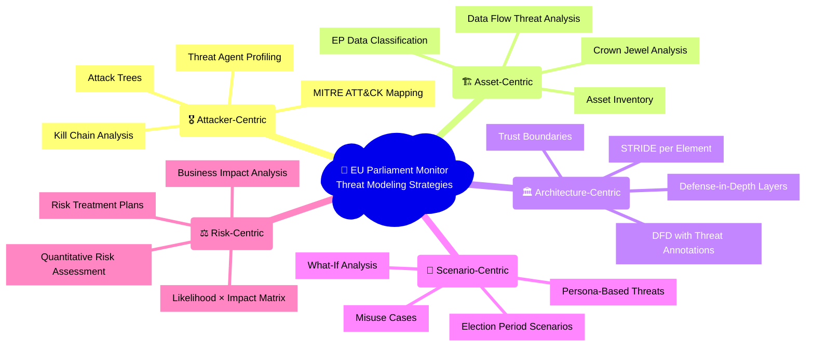

### **🔍 Scope Definition**

**Included Systems:**

- 🌐 Static HTML/CSS site (14 languages: en, sv, da, no, fi, de, fr, es, nl, ar,
  he, ja, ko, zh)
- 🔄 News generation scripts (Node.js 24, European Parliament MCP integration)
- 🤖 GitHub Actions CI/CD (daily automation, HTML validation, deployment)
- 📄 GitHub Pages hosting (static content delivery)
- 🔌 European Parliament MCP Server integration (MEP data, committees, sessions)

**Out of Scope:**

- Third-party downstream consumers of published open content (read-only usage)
- External data source security (European Parliament official APIs)
- GitHub infrastructure security (managed by GitHub)

### **🔗 Policy Alignment**

Integrated with
[🎯 Hack23 AB Threat Modeling Policy](https://github.com/Hack23/ISMS-PUBLIC/blob/main/Threat_Modeling.md)
methodology and frameworks.

---

## 🌐 ENISA Threat Landscape 2024 Integration

Following [Hack23 AB Threat Landscape Integration](https://github.com/Hack23/ISMS-PUBLIC/blob/main/Threat_Modeling.md) and aligned with [ENISA Threat Landscape 2024](https://www.enisa.europa.eu/publications/enisa-threat-landscape-2024):

### **📊 ENISA Priority Threat Mapping**

| # | ENISA Priority Threat | Relevance to EU Parliament Monitor | Risk Level | Key Mitigations | ATT&CK Alignment |
|---|---|---|---|---|---|
| 1 | **🔻 Ransomware** | Low — Static site architecture, no server-side persistence, no user data | [](CLASSIFICATION.md) | Static architecture, GitHub-managed infrastructure, no writable backend | [T1486](https://attack.mitre.org/techniques/T1486/) |
| 2 | **📡 Malware** | Low — No executable downloads, no user uploads, CDN-delivered static HTML | [](CLASSIFICATION.md) | CSP headers, Subresource Integrity, no dynamic content execution | [T1059](https://attack.mitre.org/techniques/T1059/) |
| 3 | **🎣 Social Engineering** | Medium — Contributor account targeting, maintainer impersonation | [](CLASSIFICATION.md) | MFA enforcement, branch protection, required reviews, CODEOWNERS | [T1566](https://attack.mitre.org/techniques/T1566/) |
| 4 | **📊 Data Threats** | Medium — EP parliamentary data integrity, multi-language content accuracy | [](CLASSIFICATION.md) | Schema validation, source verification, automated testing | [T1565](https://attack.mitre.org/techniques/T1565/) |
| 5 | **⚡ Availability Threats** | Low — GitHub Pages CDN resilience, 24h RTO acceptable | [](CLASSIFICATION.md) | GitHub infrastructure, static site caching, manual deployment backup | [T1499](https://attack.mitre.org/techniques/T1499/) |
| 6 | **📰 Information Manipulation** | High — Democratic transparency platform, political data integrity critical | [](CLASSIFICATION.md) | Official EP API source, schema validation, multi-language consistency checks | [T1491](https://attack.mitre.org/techniques/T1491/) |
| 7 | **🔗 Supply Chain Attacks** | Medium — npm dependency chain, GitHub Actions supply chain | [](CLASSIFICATION.md) | Minimal deps (0 prod), SHA-pinned actions, SBOM, Dependabot, package-lock | [T1195](https://attack.mitre.org/techniques/T1195/) |

### **🎯 ENISA Threat Relevance Assessment**

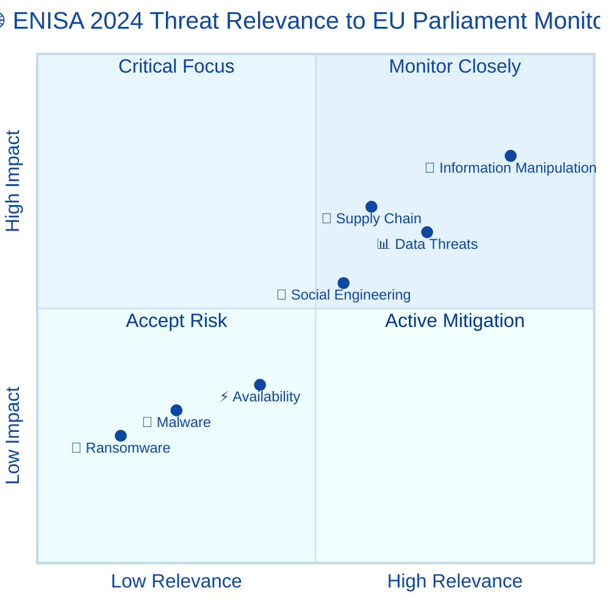

> **📌 Key Insight:** Information Manipulation is the highest-relevance ENISA threat for the EU Parliament Monitor due to its democratic transparency mission. Data integrity attacks targeting parliamentary content across 14 languages represent the primary concern, outweighing traditional infrastructure threats that are mitigated by the static site architecture.

---

## 📊 System Classification & Operating Profile

### **🏷️ Security Classification Matrix**

| Dimension              | Level                                                                                                                                                                            | Rationale                                          | Business Impact                                                                                                                                                                  |
| ---------------------- | -------------------------------------------------------------------------------------------------------------------------------------------------------------------------------- | -------------------------------------------------- | -------------------------------------------------------------------------------------------------------------------------------------------------------------------------------- |
| **🔐 Confidentiality** | [](https://github.com/Hack23/ISMS-PUBLIC/blob/main/CLASSIFICATION.md#confidentiality-levels) | European Parliament open data                      | [](https://github.com/Hack23/ISMS-PUBLIC/blob/main/CLASSIFICATION.md)      |
| **🔒 Integrity**       | [](https://github.com/Hack23/ISMS-PUBLIC/blob/main/CLASSIFICATION.md#integrity-levels)                  | News accuracy critical for democratic transparency | [](https://github.com/Hack23/ISMS-PUBLIC/blob/main/CLASSIFICATION.md) |
| **⚡ Availability**    | [](https://github.com/Hack23/ISMS-PUBLIC/blob/main/CLASSIFICATION.md#availability-levels)               | Daily updates expected, 24h outage acceptable      | [](https://github.com/Hack23/ISMS-PUBLIC/blob/main/CLASSIFICATION.md)          |

### **⚖️ Regulatory & Compliance Profile**

| Compliance Area                      | Classification        | Implementation Status                                                  |
| ------------------------------------ | --------------------- | ---------------------------------------------------------------------- |
| **📋 Regulatory Exposure**           | Low                   | Mostly open data; no personal data collection                          |
| **🇪🇺 GDPR**                          | Minimal               | No PII collection, HTTPS-only, data minimization                       |
| **🇪🇺 NIS2 Directive**                | Low baseline          | Risk management, incident handling procedures                          |
| **🇪🇺 CRA (EU Cyber Resilience Act)** | Low baseline          | Non–safety-critical transparency platform; secure development controls |
| **📊 SLA Targets (Internal)**        | 99.5%                 | GitHub Pages infrastructure reliability                                |
| **🔄 RPO / RTO**                     | RPO ≤ 24h / RTO ≤ 24h | Acceptable for daily news updates                                      |

---

## 💎 Critical Assets & Protection Goals

### **🏗️ Asset-Centric Threat Analysis**

Following
[Hack23 AB Asset-Centric Threat Modeling](https://github.com/Hack23/ISMS-PUBLIC/blob/main/Threat_Modeling.md#asset-centric-threat-modeling)
methodology:

| Asset Category                | Why Valuable                                  | Threat Goals                                  | Key Controls                                                 | Business Value                                                                                                                                                                   |
| ----------------------------- | --------------------------------------------- | --------------------------------------------- | ------------------------------------------------------------ | -------------------------------------------------------------------------------------------------------------------------------------------------------------------------------- |
| **📰 News Content Integrity** | Democratic transparency trust                 | Tampering, misinformation injection           | Schema validation, HTML validation, CSP                      | [](https://github.com/Hack23/ISMS-PUBLIC/blob/main/CLASSIFICATION.md)      |
| **🧠 Source Code**            | News generation algorithms, MCP integration   | IP theft, malicious injection                 | Private repo controls, CodeQL SAST, Dependabot               | [](https://github.com/Hack23/ISMS-PUBLIC/blob/main/CLASSIFICATION.md)   |
| **🔄 EP MCP Data Pipeline**   | Freshness & correctness of parliamentary data | Poisoned input, data manipulation             | Input validation, schema checks, retry logic                 | [](https://github.com/Hack23/ISMS-PUBLIC/blob/main/CLASSIFICATION.md) |
| **🌍 Multi-Language Content** | 14-language accessibility                     | Mistranslation, cultural bias injection       | Language-specific validation, cultural review                | [](https://github.com/Hack23/ISMS-PUBLIC/blob/main/CLASSIFICATION.md)               |
| **🔑 Repository Access**      | Deployment control                            | Privilege escalation, unauthorized changes    | Branch protection, MFA, CODEOWNERS, required reviews         | [](https://github.com/Hack23/ISMS-PUBLIC/blob/main/CLASSIFICATION.md)     |
| **🤖 GitHub Actions Config**  | CI/CD security baseline                       | Supply chain manipulation, workflow tampering | SHA-pinned actions, SBOM generation, provenance attestations | [](https://github.com/Hack23/ISMS-PUBLIC/blob/main/CLASSIFICATION.md)          |

### **🔐 Crown Jewel Analysis**

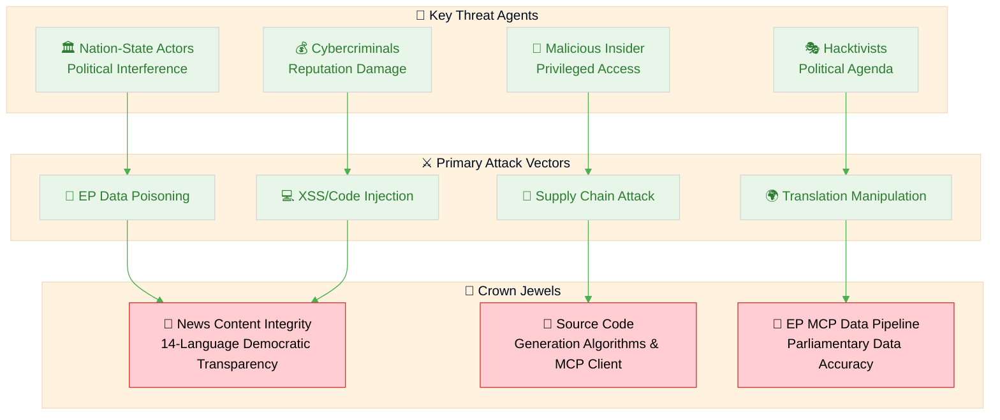

---

## Executive Summary

This threat model provides a comprehensive security analysis of the EU
Parliament Monitor system following the
[Hack23 ISMS Threat Modeling Policy](https://github.com/Hack23/ISMS-PUBLIC/blob/main/Threat_Modeling.md).
The analysis applies the STRIDE framework, integrates MITRE ATT&CK tactics and
techniques, and provides risk-based prioritization aligned with the system's
classification ([CLASSIFICATION.md](CLASSIFICATION.md): Public/Medium/Medium).

### **📊 Key Findings**

- **Total Threats Identified:** 6 (T-001 to T-006)
- **Risk Distribution:**
  - Critical: 0
  - High: 0
  - Medium: 1 (Data Integrity - P1 Priority)
  - Low: 5 (Managed with existing controls)
- **Primary Security Focus:** Data integrity and supply chain security
- **Defense Posture:** Multi-layer defense-in-depth with 25+ security controls

**System Classification Foundation (from
[CLASSIFICATION.md](CLASSIFICATION.md)):**

- **Confidentiality:** Public (Level 1) - European Parliament open data
- **Integrity:** Medium (Level 2) - News accuracy critical for democratic
  transparency
- **Availability:** Medium (Level 2) - Daily updates expected, 24h outage
  acceptable
- **RTO/RPO:** 24 hours / 1 day

---

## 🌐 Data Flow & Architecture Analysis

### **🏛️ Architecture-Centric STRIDE Analysis**

Following
[Architecture-Centric Threat Modeling](https://github.com/Hack23/ISMS-PUBLIC/blob/main/Threat_Modeling.md#architecture-centric-threat-modeling)
methodology:

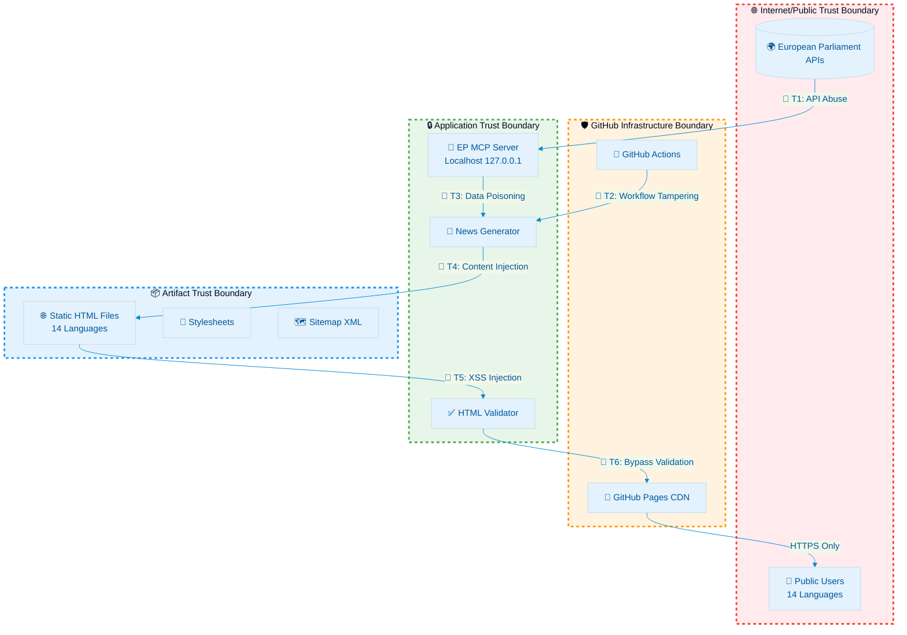

### **🎭 STRIDE per Element Analysis**

| Element                   | S                | T                      | R              | I                   | D                  | E                    | Notable Mitigations                         |
| ------------------------- | ---------------- | ---------------------- | -------------- | ------------------- | ------------------ | -------------------- | ------------------------------------------- |
| **🌐 GitHub Pages Entry** | DNS spoof        | Header tamper          | Limited        | TLS downgrade       | CDN DDoS           | —                    | TLS 1.3, GitHub CDN protection              |
| **📄 Static HTML**        | —                | Script injection (XSS) | —              | DOM manipulation    | —                  | —                    | CSP headers, Handlebars auto-escaping       |
| **📰 News Generator**     | —                | Data tampering         | Log forging    | EP data corruption  | Process failure    | Code injection       | Input validation, schema checks             |
| **🔌 EP MCP Server**      | Impersonation    | Response manipulation  | Request replay | Data poisoning      | Connection failure | Local exploit        | Localhost-only binding, ephemeral execution |
| **🤖 GitHub Actions**     | Actor spoof (PR) | Workflow tamper        | Action denial  | Secret exposure     | Runner exhaustion  | Escalated perms      | SHA-pinned actions, branch protection       |
| **📦 Dependencies (npm)** | Package spoof    | Artifact tamper        | —              | Malicious code      | Registry down      | Dependency confusion | package-lock.json, SBOM, Dependabot         |
| **🔐 Repository**         | Commit spoof     | Branch tamper          | Force push     | Secret commit       | —                  | Admin escalation     | MFA, branch protection, required reviews    |
| **🔍 CodeQL SAST**        | —                | Scan bypass            | False negative | Config manipulation | Analysis failure   | Policy bypass        | Required checks, automated scanning         |

---

## 🎖️ MITRE ATT&CK Framework Integration

### **🔍 Attacker-Centric Analysis**

Following
[MITRE ATT&CK-Driven Analysis](https://github.com/Hack23/ISMS-PUBLIC/blob/main/Threat_Modeling.md#mitre-attck-driven-analysis)
methodology:

| Phase                    | Technique                  | ID                                                  | EP Monitor Context                  | Control                             | Detection                          |
| ------------------------ | -------------------------- | --------------------------------------------------- | ----------------------------------- | ----------------------------------- | ---------------------------------- |
| **🔍 Initial Access**    | Exploit Public-Facing App  | [T1190](https://attack.mitre.org/techniques/T1190/) | Static site, no server-side code    | Static architecture, CSP headers    | GitHub Pages monitoring            |
| **🔍 Initial Access**    | Supply Chain Compromise    | [T1195](https://attack.mitre.org/techniques/T1195/) | npm dependencies, GitHub Actions    | Minimal deps, SHA-pinned actions    | Dependabot, SBOM scanning          |
| **⚡ Execution**         | Command/Script Interpreter | [T1059](https://attack.mitre.org/techniques/T1059/) | Node.js news generation scripts     | ESLint security rules, code review  | CodeQL SAST scanning               |
| **🔄 Persistence**       | Valid Accounts             | [T1078](https://attack.mitre.org/techniques/T1078/) | GitHub repository access            | MFA requirement, access review      | GitHub audit logs                  |
| **🎭 Defense Evasion**   | Obfuscated Files           | [T1027](https://attack.mitre.org/techniques/T1027/) | Malicious libraries in dependencies | SCA scanning, code review           | Static analysis, artifact scanning |
| **🔑 Credential Access** | Brute Force                | [T1110](https://attack.mitre.org/techniques/T1110/) | GitHub account attacks              | GitHub-managed security             | GitHub security alerts             |
| **🔍 Discovery**         | Application Enumeration    | [T1083](https://attack.mitre.org/techniques/T1083/) | Public repository, open source      | Transparency by design              | Public documentation               |
| **💥 Impact**            | Data Manipulation          | [T1565](https://attack.mitre.org/techniques/T1565/) | News content tampering              | Schema validation, HTML validation  | Automated testing, manual review   |
| **💥 Impact**            | Defacement                 | [T1491](https://attack.mitre.org/techniques/T1491/) | Website content alteration          | Branch protection, required reviews | Visual diff review, monitoring     |
| **🔍 Initial Access**    | External Remote Services   | [T1133](https://attack.mitre.org/techniques/T1133/) | Unauthorized EP API access attempts         | Allowlist-only MCP access, public API only  | EP API access logs, rate monitoring        |
| **🔍 Initial Access**    | Implant Internal Image     | [T1525](https://attack.mitre.org/techniques/T1525/) | Dependency confusion in npm registry        | package-lock.json, SHA verification         | Dependabot, SBOM integrity checks          |
| **🔍 Discovery**         | Network Service Discovery  | [T1046](https://attack.mitre.org/techniques/T1046/) | Port scanning, MCP service enumeration      | Localhost-only MCP binding, firewall rules  | Network connection monitoring              |
| **📦 Collection**        | Data from Cloud Storage    | [T1530](https://attack.mitre.org/techniques/T1530/) | GitHub Pages content scraping/access        | Public by design, no secrets in Pages       | Traffic monitoring, rate limiting          |
| **📦 Collection**        | Data from Configuration Repository | [T1602](https://attack.mitre.org/techniques/T1602/) | package.json, workflow config access | No secrets in config files, SBOM tracking   | Repository access auditing                 |
| **🔄 Persistence**       | Services File Permissions Weakness | [T1574.010](https://attack.mitre.org/techniques/T1574/010/) | GitHub Actions workflow tampering | SHA-pinned actions, branch protection rules | Workflow change alerts, PR review required |
| **📡 Command & Control** | Application Layer Protocol | [T1071](https://attack.mitre.org/techniques/T1071/) | MCP HTTP/HTTPS communication to EP API      | TLS enforcement, strict hostname allowlist  | Outbound traffic monitoring                |
| **📡 Command & Control** | Web Protocols              | [T1071.001](https://attack.mitre.org/techniques/T1071/001/) | HTTPS requests to data.europarl.europa.eu | TLS 1.3, certificate validation   | HTTP request logging, anomaly detection    |
| **🎭 Defense Evasion**   | Code Signing               | [T1553.002](https://attack.mitre.org/techniques/T1553/002/) | SLSA attestation bypass attempts  | SLSA Level 3, artifact signatures           | Attestation verification in CI             |

### **📊 ATT&CK Coverage Analysis**

[](https://mitre-attack.github.io/attack-navigator/)
[](https://attack.mitre.org/)

**Comprehensive Coverage Tracking:** This threat model provides systematic
coverage analysis of MITRE ATT&CK techniques, identifying which tactics and
techniques are relevant to the EU Parliament Monitor's threat landscape.

#### **🎯 Coverage Heat Map by Tactic**

| Tactic                     | Covered Techniques | Total Techniques | Coverage % | Status                                                                                                                                |
| -------------------------- | ------------------ | ---------------- | ---------- | ------------------------------------------------------------------------------------------------------------------------------------- |
| **🔍 Initial Access**      | 4                  | 22               | 18.2%      | [](https://attack.mitre.org/tactics/TA0001/)        |
| **💥 Impact**              | 2                  | 33               | 6.1%       | [](https://attack.mitre.org/tactics/TA0040/)        |
| **⚡ Execution**           | 1                  | 51               | 2.0%       | [](https://attack.mitre.org/tactics/TA0002/) |
| **🔄 Persistence**         | 2                  | 130              | 1.5%       | [](https://attack.mitre.org/tactics/TA0003/)        |
| **🎭 Defense Evasion**     | 2                  | 218              | 0.9%       | [](https://attack.mitre.org/tactics/TA0005/)        |
| **🔑 Credential Access**   | 1                  | 67               | 1.5%       | [](https://attack.mitre.org/tactics/TA0006/)        |
| **🔍 Discovery**           | 2                  | 49               | 4.1%       | [](https://attack.mitre.org/tactics/TA0007/) |
| **🔀 Lateral Movement**    | 0                  | 25               | 0.0%       | [](https://attack.mitre.org/tactics/TA0008/)  |
| **📦 Collection**          | 2                  | 41               | 4.9%       | [](https://attack.mitre.org/tactics/TA0009/) |
| **📤 Exfiltration**        | 0                  | 19               | 0.0%       | [](https://attack.mitre.org/tactics/TA0010/)  |
| **📡 Command and Control** | 2                  | 47               | 4.3%       | [](https://attack.mitre.org/tactics/TA0011/) |

**Coverage Rationale:** The EU Parliament Monitor's 2.3% overall coverage
reflects focused threat modeling for a static site with EP MCP Server
integration. Higher coverage in Initial Access (18.2%), Collection (4.9%),
Command & Control (4.3%), and Discovery (4.1%) aligns with primary threat
vectors for public-facing platforms with external API dependencies. The 16
techniques mapped include 7 EP MCP Server-specific vectors added in v1.1.

#### **🛡️ Security Control to ATT&CK Mitigation Mapping**

Comprehensive security controls are mapped to specific ATT&CK mitigations and
techniques:

| Security Control             | ATT&CK Mitigation                                                                 | Techniques Mitigated                                                                                     | Implementation Status                                                                                                                  |
| ---------------------------- | --------------------------------------------------------------------------------- | -------------------------------------------------------------------------------------------------------- | -------------------------------------------------------------------------------------------------------------------------------------- |
| **Content Security Policy**  | [M1021: Restrict Web Content](https://attack.mitre.org/mitigations/M1021/)        | [T1190](https://attack.mitre.org/techniques/T1190/), [T1059](https://attack.mitre.org/techniques/T1059/) | [](SECURITY_ARCHITECTURE.md#csp)              |
| **Dependabot Scanning**      | [M1016: Vulnerability Scanning](https://attack.mitre.org/mitigations/M1016/)      | [T1195](https://attack.mitre.org/techniques/T1195/)                                                      | [](SECURITY_ARCHITECTURE.md#supply-chain)     |
| **GitHub Branch Protection** | [M1035: Limit Access](https://attack.mitre.org/mitigations/M1035/)                | [T1078](https://attack.mitre.org/techniques/T1078/), [T1565](https://attack.mitre.org/techniques/T1565/) | [](SECURITY_ARCHITECTURE.md#access-control)   |
| **CodeQL SAST Scanning**     | [M1047: Audit](https://attack.mitre.org/mitigations/M1047/)                       | [T1059](https://attack.mitre.org/techniques/T1059/), [T1027](https://attack.mitre.org/techniques/T1027/) | [](SECURITY_ARCHITECTURE.md#sast)             |
| **Input Validation**         | [M1021: Restrict Web Content](https://attack.mitre.org/mitigations/M1021/)        | [T1190](https://attack.mitre.org/techniques/T1190/), [T1565](https://attack.mitre.org/techniques/T1565/) | [](SECURITY_ARCHITECTURE.md#input-validation) |
| **SBOM Generation**          | [M1016: Vulnerability Scanning](https://attack.mitre.org/mitigations/M1016/)      | [T1195](https://attack.mitre.org/techniques/T1195/)                                                      | [](SECURITY_ARCHITECTURE.md#sbom)             |
| **MFA Enforcement**          | [M1032: Multi-factor Authentication](https://attack.mitre.org/mitigations/M1032/) | [T1078](https://attack.mitre.org/techniques/T1078/), [T1110](https://attack.mitre.org/techniques/T1110/) | [](SECURITY_ARCHITECTURE.md#mfa)              |
| **npm Package Lock**         | [M1016: Vulnerability Scanning](https://attack.mitre.org/mitigations/M1016/)      | [T1525](https://attack.mitre.org/techniques/T1525/), [T1195](https://attack.mitre.org/techniques/T1195/) | [](SECURITY_ARCHITECTURE.md#supply-chain)     |
| **Localhost-Only MCP Binding** | [M1030: Network Segmentation](https://attack.mitre.org/mitigations/M1030/)      | [T1046](https://attack.mitre.org/techniques/T1046/), [T1071](https://attack.mitre.org/techniques/T1071/) | [](SECURITY_ARCHITECTURE.md#network)          |
| **SLSA Level 3 Attestation** | [M1045: Code Signing](https://attack.mitre.org/mitigations/M1045/)                | [T1553.002](https://attack.mitre.org/techniques/T1553/002/), [T1195](https://attack.mitre.org/techniques/T1195/) | [](SECURITY_ARCHITECTURE.md#slsa)       |

### **🔌 EP MCP Server Attack Surface Analysis**

The European Parliament MCP Server integration (`european-parliament-mcp-server@0.7.3`) introduces a specific attack surface that requires dedicated threat analysis. As an ephemeral, localhost-only process invoked during GitHub Actions builds, its exposure window is narrow — but its role in data ingestion makes integrity controls critical.

| Attack Vector | MITRE Technique | Threat Description | Likelihood | Impact | Mitigation |
|---|---|---|---|---|---|
| **MCP Data Poisoning** | [T1565.001](https://attack.mitre.org/techniques/T1565/001/) (Stored Data Manipulation) | Malicious EP API responses injecting XSS/HTML into generated articles | Low | High | Response sanitization, HTML entity encoding, schema validation |
| **MCP Protocol Abuse** | [T1071](https://attack.mitre.org/techniques/T1071/) (Application Layer Protocol) | Manipulated JSON-RPC 2.0 requests exploiting parsing flaws | Very Low | Medium | Input validation, request ID tracking, strict error handling |
| **Dependency Confusion** | [T1525](https://attack.mitre.org/techniques/T1525/) (Implant Internal Image) | Malicious npm package named `european-parliament-mcp-server` | Very Low | Critical | Package provenance checking, npm registry lock, SHA verification |
| **API Rate Abuse** | [T1499](https://attack.mitre.org/techniques/T1499/) (Endpoint DoS) | Exhausting EP API rate limits through excessive MCP calls | Low | Medium | Retry limits, timeout enforcement, exponential backoff |
| **Credential Exposure** | [T1078](https://attack.mitre.org/techniques/T1078/) (Valid Accounts) | EP API tokens or secrets exposed in GitHub Actions logs | Very Low | High | No API keys used (public API), secrets scanning in CI |
| **SSRF via MCP** | [T1190](https://attack.mitre.org/techniques/T1190/) (Exploit Public-Facing App) | MCP client making unauthorized requests to internal GitHub resources | Very Low | Medium | Strict hostname allowlisting, localhost-only MCP communication |
| **Schema Injection** | [T1059](https://attack.mitre.org/techniques/T1059/) (Command/Script Interpreter) | Malformed EP data exploiting TypeScript parser vulnerabilities | Very Low | Low | TypeScript strict mode, schema validation, error boundaries |

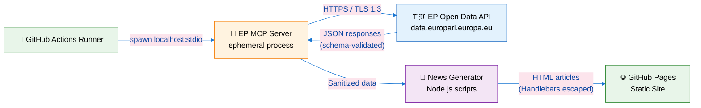

**MCP Server Security Posture Summary:**

| Property | Value | Security Implication |
|---|---|---|
| **Execution model** | Ephemeral (per-build, terminates after use) | ✅ No persistent process to attack |
| **Network binding** | Localhost stdio only (no TCP port) | ✅ No remote attack surface |
| **Authentication** | None required (EP public API) | ✅ No credentials to steal or leak |
| **Data direction** | Read-only inbound from EP API | ✅ Cannot write back to EP systems |
| **Output escaping** | Handlebars auto-escape + CSP headers | ✅ XSS injection from data poisoning blocked |
| **Package provenance** | npm SHA lock + Dependabot monitoring | ✅ Dependency confusion monitored |
| **SLSA attestation** | SLSA Level 3 via GitHub Actions | ✅ Build provenance verified end-to-end |

### **🌳 Attack Tree Analysis**

```mermaid
%%{
  init: {
    'theme': 'base',
    'themeVariables': {
      'primaryColor': '#fff3e0',
      'primaryTextColor': '#e65100',
      'lineColor': '#ff9800',
      'secondaryColor': '#ffebee'
    }
  }
}%%
flowchart TD
    ROOT[🎯 Compromise EU Parliament Monitor]

    ROOT --> A1[💉 Inject Misinformation]
    ROOT --> A2[🔓 Gain Repository Access]
    ROOT --> A3[📦 Supply Chain Attack]
    ROOT --> A4[🌐 Deface Website]

    A1 --> B1[🔌 Compromise EP MCP Server]
    A1 --> B2[📰 Manipulate News Generator]
    A1 --> B3[🌍 Inject Translation Errors]

    A2 --> C1[🔑 Steal GitHub Credentials]
    A2 --> C2[⬆️ Escalate Repository Privileges]
    A2 --> C3[🎭 Social Engineer Maintainer]

    A3 --> D1[📦 Compromise npm Package]
    A3 --> D2[🤖 Tamper GitHub Actions]
    A3 --> D3[🔗 Dependency Confusion]

    A4 --> E1[💻 XSS Injection]
    A4 --> E2[📝 Direct HTML Modification]
    A4 --> E3[🎨 CSS Manipulation]

    style ROOT fill:#ffcdd2,stroke:#d32f2f,color:#000
    style A1 fill:#ffccbc,stroke:#e64a19,color:#000
    style A2 fill:#ffccbc,stroke:#e64a19,color:#000
    style A3 fill:#ffccbc,stroke:#e64a19,color:#000
    style A4 fill:#ffccbc,stroke:#e64a19,color:#000
```

### **🔗 Kill Chain Disruption Analysis**

Following [Hack23 AB Kill Chain Analysis](https://github.com/Hack23/ISMS-PUBLIC/blob/main/Threat_Modeling.md) methodology — mapping Cyber Kill Chain phases to EU Parliament Monitor defensive controls:

| Kill Chain Phase | EU Parliament Monitor Context | Defensive Controls | Detection Capability | Disruption Effectiveness |
|---|---|---|---|---|
| **1. Reconnaissance** | Public repository scanning, dependency enumeration, EP API discovery | Transparency by design (public data), no sensitive endpoints exposed | GitHub audit logs, repository traffic analytics | [](#) — Minimal attack surface |
| **2. Weaponization** | Crafting malicious npm packages, preparing XSS payloads for EP data | N/A (attacker-side phase) | Threat intelligence feeds, npm advisory monitoring | [](#) — External phase |
| **3. Delivery** | Malicious PR submission, dependency confusion, EP data poisoning | Branch protection, required reviews, schema validation, package-lock.json | CodeQL SAST on PRs, Dependabot alerts, EP data schema checks | [](#) — Multiple gates |
| **4. Exploitation** | XSS via injected EP data, command injection in build scripts | CSP headers, Handlebars auto-escaping, ESLint security rules, TypeScript strict mode | CodeQL scanning, unit tests, HTML validation | [](#) — Defense-in-depth |
| **5. Installation** | Persistent backdoor in codebase, modified GitHub Actions workflow | SHA-pinned actions, CODEOWNERS enforcement, branch protection | Workflow change alerts, PR diff review, SBOM integrity checks | [](#) — Strong access control |
| **6. Command & Control** | Exfiltrating data via MCP channel, covert communication via build logs | Localhost-only MCP binding, no outbound network from static site, TLS enforcement | GitHub Actions log monitoring, network connection auditing | [](#) — Minimal C2 surface |
| **7. Actions on Objectives** | Content manipulation, democratic process disruption, defacement | Multi-layer validation, automated testing, schema checks, SLSA attestation | Visual diff review, automated content verification, monitoring | [](#) — Detection gap for subtle manipulation |

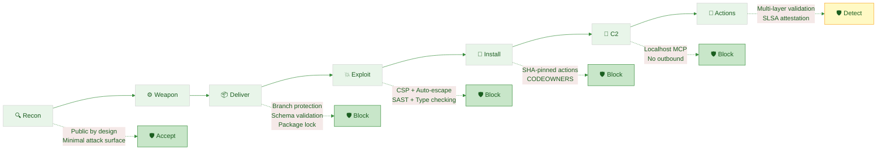

---

## 🎯 Priority Threat Scenarios

### **🔴 Critical Threat Scenarios**

Following
[Risk-Centric Threat Modeling](https://github.com/Hack23/ISMS-PUBLIC/blob/main/Threat_Modeling.md#risk-centric-threat-modeling)
methodology:

| #     | Scenario                                | MITRE Tactic                                                  | Impact Focus                      | Likelihood | Risk                                                                                                                                              | Key Mitigations                         | Residual Action                      |
| ----- | --------------------------------------- | ------------------------------------------------------------- | --------------------------------- | ---------- | ------------------------------------------------------------------------------------------------------------------------------------------------- | --------------------------------------- | ------------------------------------ |
| **1** | **📰 News Content Manipulation**        | [Impact](https://attack.mitre.org/tactics/TA0040/)            | Democratic transparency integrity | Medium     | [](https://github.com/Hack23/ISMS-PUBLIC/blob/main/CLASSIFICATION.md) | Schema validation, HTML validation, CSP | Add automated fact-checking pipeline |
| **2** | **🔗 Supply Chain Dependency Attack**   | [Initial Access](https://attack.mitre.org/tactics/TA0001/)    | Build process compromise          | Low-Med    | [](https://github.com/Hack23/ISMS-PUBLIC/blob/main/CLASSIFICATION.md) | Minimal deps, SBOM, SHA-pinned actions  | Add provenance verification          |
| **3** | **🔑 Repository Credential Compromise** | [Credential Access](https://attack.mitre.org/tactics/TA0006/) | System-wide access                | Low        | [](https://github.com/Hack23/ISMS-PUBLIC/blob/main/CLASSIFICATION.md)        | MFA, branch protection, reviews         | Annual security review               |
| **4** | **🔌 EP MCP Server Data Poisoning**     | [Impact](https://attack.mitre.org/tactics/TA0040/)            | Parliamentary data integrity      | Low        | [](https://github.com/Hack23/ISMS-PUBLIC/blob/main/CLASSIFICATION.md)        | Localhost-only, ephemeral execution     | Monitor EP API changes               |
| **5** | **⚡ GitHub Infrastructure Downtime**   | [Impact](https://attack.mitre.org/tactics/TA0040/)            | Service availability              | Low        | [](https://github.com/Hack23/ISMS-PUBLIC/blob/main/CLASSIFICATION.md)        | GitHub CDN, static architecture         | 24h RTO acceptable                   |
| **6** | **💻 Cross-Site Scripting (XSS)**       | [Initial Access](https://attack.mitre.org/tactics/TA0001/)    | User trust damage                 | Low        | [](https://github.com/Hack23/ISMS-PUBLIC/blob/main/CLASSIFICATION.md)        | CSP, Handlebars escaping, validation    | Quarterly security review            |

### **⚖️ Risk Heat Matrix**

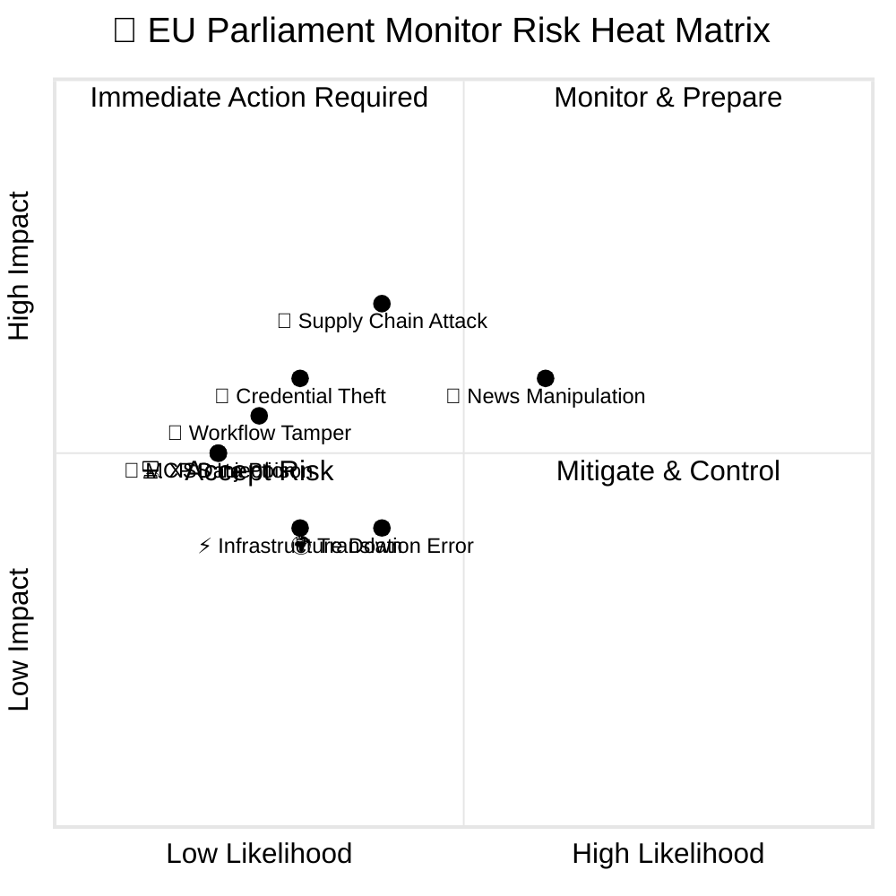

---

## 🎯 Scenario-Centric Threat Analysis

Following [Hack23 AB Scenario-Centric Threat Modeling](https://github.com/Hack23/ISMS-PUBLIC/blob/main/Threat_Modeling.md) methodology:

### **🎭 Misuse Cases**

| # | Misuse Case | Threat Agent | Attack Description | Preconditions | Impact | Mitigation |
|---|---|---|---|---|---|---|
| **MC-001** | **Nation-State Data Manipulation** | 🏛️ Nation-State Actor | Compromises EP API upstream or MCP data pipeline to inject subtly biased MEP voting records, altering democratic perception across 14 languages | Access to EP data pipeline or MCP server compromise | Critical — Erosion of democratic transparency trust across EU | EP official API verification, schema validation, cross-reference checks, content consistency monitoring |
| **MC-002** | **Supply Chain Backdoor** | 💰 Cybercriminal | Publishes malicious npm package mimicking `european-parliament-mcp-server`, injects code into build pipeline during GitHub Actions execution | npm registry access, typosquatting opportunity | High — Complete build process compromise, potential content manipulation | Package provenance (SHA verification), Dependabot monitoring, SBOM generation, package-lock.json integrity |
| **MC-003** | **Insider Bias Injection** | 👤 Malicious Insider | Contributor with merge access introduces subtle political bias in news generation templates or translation strings for specific languages | Trusted contributor access, code review gap | High — Political bias in generated news, trust damage | Required PR reviews, CODEOWNERS enforcement, automated bias detection, multi-language consistency checks |
| **MC-004** | **Election Period Defacement** | 🎭 Hacktivist | During European Parliament elections, defaces website content to spread political messaging or discredit specific MEPs/parties | Repository access or XSS vulnerability | High — Election integrity impact, voter confusion | Enhanced monitoring during election periods, branch protection, CSP headers, rapid response procedures |
| **MC-005** | **Translation Weaponization** | 🏛️ Nation-State Actor | Targets specific language versions (e.g., AR, ZH) with deliberate mistranslations of parliamentary positions to serve geopolitical agenda | Access to translation pipeline or template manipulation | Medium — Language-specific democratic impact, regional trust damage | Cross-language consistency validation, native speaker review, automated translation comparison |
| **MC-006** | **CI/CD Pipeline Hijacking** | 💰 Cybercriminal | Exploits GitHub Actions workflow to inject cryptocurrency miner or use compute resources, degrading news generation performance | Workflow file modification or action compromise | Medium — Service degradation, resource abuse | SHA-pinned actions, workflow permissions review, resource monitoring, required status checks |

### **🤔 What-If Analysis**

| # | What-If Scenario | Probability | Impact Assessment | Current Resilience | Recommended Action |
|---|---|---|---|---|---|
| **WI-001** | What if the European Parliament changes its open data API format? | Medium | News generation fails until adaptation; stale content served | Schema validation catches errors; cached content remains available | Monitor EP API changelog; implement API version detection; maintain fallback templates |
| **WI-002** | What if a zero-day vulnerability is found in Node.js 24? | Low | Build pipeline compromised during news generation | GitHub Actions auto-updates runners; Dependabot monitors dependencies | Pin Node.js version; implement container-based builds; maintain rollback capability |
| **WI-003** | What if GitHub Pages experiences a multi-day outage? | Very Low | Site unavailable; no news updates for > 24h RTO | Static content cached by CDN; manual deployment possible | Maintain backup deployment target; document manual recovery; accept 24h RTO per classification |
| **WI-004** | What if a contributor's GitHub account is compromised? | Low | Potential unauthorized code changes or content manipulation | MFA required; branch protection; required reviews; CODEOWNERS | Quarterly access reviews; monitor for anomalous commits; incident response plan |
| **WI-005** | What if politically motivated content manipulation goes undetected? | Low-Medium | Gradual erosion of platform credibility and democratic trust | Schema validation; automated testing; public source code | Implement automated fact-checking pipeline (P1); add confidence scoring; cross-reference with official EP records |
| **WI-006** | What if the EP MCP Server package is deprecated or abandoned? | Medium | Loss of data integration capability; news generation stops | Version pinning; local fallback data | Monitor package health; maintain fork capability; implement direct EP API fallback |

### **👥 Persona-Based Threat Scenarios**

#### **Persona 1: "Alexei" — State-Sponsored Information Operator**
- **Profile:** Advanced persistent threat operator working for a nation-state intelligence service
- **Motivation:** Undermine EU parliamentary transparency and democratic processes
- **Capability:** High (custom tooling, patient long-term operations, multiple attack vectors)
- **Attack Path:** Targets EP data pipeline → injects subtle voting record modifications → affects 14 language versions → gradually erodes trust in parliamentary data
- **Countermeasures:** Official EP API source verification, schema validation, cross-language consistency monitoring, anomaly detection

#### **Persona 2: "Marco" — Disgruntled Political Activist**
- **Profile:** Technically skilled hacktivist with political agenda
- **Motivation:** Promote specific political agenda or discredit EU institutions
- **Capability:** Medium (public exploit tools, social engineering)
- **Attack Path:** Social engineers a contributor → submits PR with biased translation strings → targets election-sensitive content
- **Countermeasures:** Required PR reviews, CODEOWNERS, automated sentiment analysis, election period enhanced monitoring

#### **Persona 3: "Chen" — Supply Chain Attacker**
- **Profile:** Organized cybercrime group specializing in supply chain attacks
- **Motivation:** Financial gain through compute resource abuse or reputation extortion
- **Capability:** Medium-High (registry manipulation, typosquatting infrastructure)
- **Attack Path:** Publishes malicious npm package → dependency confusion during build → injects cryptominer or exfiltration code
- **Countermeasures:** Zero production dependencies, package-lock.json, SHA verification, SBOM monitoring, Dependabot

---

## ⚖️ Quantitative Risk Assessment

Following [Hack23 AB Risk-Centric Threat Modeling](https://github.com/Hack23/ISMS-PUBLIC/blob/main/Threat_Modeling.md) methodology:

### **📊 Risk Scoring Methodology**

**Risk Score = Likelihood × Impact**

| Score | Likelihood Definition | Impact Definition |
|---|---|---|
| **1 — Very Low** | < 5% annual probability | Minimal business impact, easily recoverable |
| **2 — Low** | 5-15% annual probability | Minor disruption, limited scope |
| **3 — Medium** | 15-35% annual probability | Moderate disruption, requires active response |
| **4 — High** | 35-65% annual probability | Significant disruption, affects core mission |
| **5 — Critical** | > 65% annual probability | Severe impact, existential or regulatory consequence |

### **📈 Comprehensive Likelihood × Impact Matrix**

| Threat ID | Threat Name | Likelihood (L) | Impact (I) | Risk Score (L×I) | Risk Level | Treatment |
|---|---|---|---|---|---|---|
| **T-001** | XSS via EP Data Injection | 1 | 3 | 3 | 🟢 Low | Accept |
| **T-002** | Supply Chain npm Attack | 1 | 4 | 4 | 🟡 Low-Medium | Monitor |
| **T-003** | Incorrect News Generation | 3 | 3 | **9** | 🟠 **Medium** | **Reduce** |
| **T-004** | GitHub Actions Downtime | 1 | 2 | 2 | 🟢 Low | Accept |
| **T-005** | Repository Compromise | 1 | 4 | 4 | 🟡 Low-Medium | Monitor |
| **T-006** | MCP Server Compromise | 1 | 3 | 3 | 🟢 Low | Accept |
| **T-007** | EP API Format Change | 3 | 3 | **9** | 🟠 **Medium** | Reduce |
| **T-008** | Translation Manipulation | 2 | 3 | 6 | 🟡 Medium-Low | Monitor |
| **T-009** | Election Period Defacement | 1 | 4 | 4 | 🟡 Low-Medium | Monitor |
| **T-010** | GitHub Actions Secret Leak | 1 | 3 | 3 | 🟢 Low | Accept |
| **T-011** | SLSA Attestation Bypass | 1 | 4 | 4 | 🟡 Low-Medium | Monitor |
| **T-012** | Dependency Confusion | 1 | 5 | 5 | 🟡 Medium-Low | Monitor |
| **T-013** | MCP Data Poisoning via API | 2 | 4 | **8** | 🟠 **Medium** | Reduce |
| **T-014** | Cross-Language Inconsistency | 2 | 2 | 4 | 🟡 Low-Medium | Monitor |
| **T-015** | Contributor Account Compromise | 1 | 4 | 4 | 🟡 Low-Medium | Monitor |
| **T-016** | Automated Bot Abuse | 2 | 1 | 2 | 🟢 Low | Accept |
| **T-017** | MEP Data Integrity Failure | 2 | 3 | 6 | 🟡 Medium-Low | Monitor |
| **T-018** | Information Manipulation Campaign | 1 | 5 | 5 | 🟡 Medium-Low | Monitor |
| **T-019** | Node.js Runtime Vulnerability | 1 | 3 | 3 | 🟢 Low | Accept |
| **T-020** | GitHub Pages CDN Compromise | 1 | 3 | 3 | 🟢 Low | Accept |

### **🎯 Risk Distribution Summary**

| Risk Level | Count | Threats | Treatment Strategy |
|---|---|---|---|
| 🟠 **Medium (6-9)** | 3 | T-003, T-007, T-013 | **Active reduction** — implement additional controls |
| 🟡 **Low-Medium (4-5)** | 9 | T-002, T-005, T-008, T-009, T-011, T-012, T-014, T-015, T-017, T-018 | **Monitor** — quarterly review and trending |
| 🟢 **Low (1-3)** | 8 | T-001, T-004, T-006, T-010, T-016, T-019, T-020 | **Accept** — existing controls sufficient |

---

## 📊 Detailed Threat Analysis

### Threat T-001: Cross-Site Scripting (XSS) via Parliamentary Data Injection

| Attribute           | Value                                                               |
| ------------------- | ------------------------------------------------------------------- |
| **Threat ID**       | T-001                                                               |
| **STRIDE Category** | Injection, Tampering                                                |
| **MITRE ATT&CK**    | T1189 (Drive-by Compromise), T1059 (Command and Script Interpreter) |
| **Threat Agent**    | Malicious Insider, Nation-State Actor, Cybercriminal                |
| **Likelihood**      | Low (1/5)                                                           |
| **Impact**          | Medium (3/5) - Integrity risk, user trust damage                    |
| **Risk Score**      | Low (3/25)                                                          |
| **Priority**        | P3                                                                  |

**Existing Controls:**

- ✅ Content Security Policy (CSP) headers
- ✅ Handlebars auto-escaping
- ✅ Input validation for EP data
- ✅ ESLint security plugin
- ✅ Code review required

**Residual Risk:** Low - Multiple defense layers

**Risk Treatment:** Accept - Existing controls sufficient

---

### Threat T-002: Supply Chain Attack via npm Dependencies

| Attribute           | Value                                                                    |
| ------------------- | ------------------------------------------------------------------------ |
| **Threat ID**       | T-002                                                                    |
| **STRIDE Category** | Elevation of Privilege, Tampering                                        |
| **MITRE ATT&CK**    | T1195.002 (Compromise Software Supply Chain), T1608.001 (Upload Malware) |
| **Threat Agent**    | Cybercriminal, Nation-State Actor                                        |
| **Likelihood**      | Low (1/5)                                                                |
| **Impact**          | High (4/5) - Could compromise build process                              |
| **Risk Score**      | Low (4/25)                                                               |
| **Priority**        | P2                                                                       |

**Existing Controls:**

- ✅ Minimal dependencies (zero production, 17 dev-only)
- ✅ Dependabot automated vulnerability scanning
- ✅ SBOM generation (CycloneDX format)
- ✅ SHA-pinned GitHub Actions
- ✅ package-lock.json with integrity hashes

**Residual Risk:** Low - Minimal attack surface

**Risk Treatment:** Monitor and Review - Annual dependency audit

---

### Threat T-003: Data Integrity - Incorrect News Generation ⚠️ P1

| Attribute           | Value                                                                    |
| ------------------- | ------------------------------------------------------------------------ |
| **Threat ID**       | T-003                                                                    |
| **STRIDE Category** | Tampering, Information Disclosure                                        |
| **MITRE ATT&CK**    | T1565.001 (Stored Data Manipulation), T1499 (Endpoint Denial of Service) |
| **Threat Agent**    | Accidental Insider, LLM Model Error, EP API Changes                      |
| **Likelihood**      | Medium (3/5)                                                             |
| **Impact**          | Medium (3/5) - News accuracy critical for democracy                      |
| **Risk Score**      | Medium (9/25)                                                            |
| **Priority**        | **P1** (Requires Additional Controls)                                    |

**Existing Controls:**

- ✅ Schema validation for EP data
- ✅ Type checking (TypeScript with strict mode)
- ✅ Error logging
- ✅ Unit tests (82% line coverage, 70% branch)
- ✅ Official European Parliament API source

**Residual Risk:** Medium - Automated content verification not yet implemented

**Risk Treatment:** Reduce Risk - Implement additional controls

**Recommendations (Q3 2026):**

1. 🔄 Automated fact-checking pipeline
2. 🔄 Confidence scoring (0.0-1.0) for each article
3. 🔄 Human-in-the-loop review queue (<0.85 confidence)
4. 🔄 Cross-reference generated content with source EP data

**Target Residual Risk:** Low (after Phase 1 implementation)

---

### Threat T-004: Denial of Service - GitHub Actions Downtime

| Attribute           | Value                                                                 |
| ------------------- | --------------------------------------------------------------------- |
| **Threat ID**       | T-004                                                                 |
| **STRIDE Category** | Denial of Service                                                     |
| **MITRE ATT&CK**    | T1499 (Endpoint Denial of Service), T1498 (Network Denial of Service) |
| **Threat Agent**    | External Service Provider, Cyber Vandal, Hacktivist                   |
| **Likelihood**      | Low (1/5)                                                             |
| **Impact**          | Low (2/5) - 24h RTO acceptable per classification                     |
| **Risk Score**      | Low (2/25)                                                            |
| **Priority**        | P3                                                                    |

**Existing Controls:**

- ✅ GitHub infrastructure (multi-region redundancy)
- ✅ Manual workflow trigger available
- ✅ Cached content remains online
- ✅ RTO/RPO alignment (24h/1d)
- ✅ Static site architecture (no real-time dependencies)

**Residual Risk:** Low - Within acceptable RTO/RPO

**Risk Treatment:** Accept - Availability Medium classification tolerates 24h
outages

---

### Threat T-005: Repository Compromise - Unauthorized Code Changes

| Attribute           | Value                                                             |
| ------------------- | ----------------------------------------------------------------- |
| **Threat ID**       | T-005                                                             |
| **STRIDE Category** | Tampering, Elevation of Privilege                                 |
| **MITRE ATT&CK**    | T1078 (Valid Accounts), T1190 (Exploit Public-Facing Application) |
| **Threat Agent**    | Malicious Insider, Cybercriminal                                  |
| **Likelihood**      | Low (1/5)                                                         |
| **Impact**          | High (4/5) - Could compromise entire site                         |
| **Risk Score**      | Low (4/25)                                                        |
| **Priority**        | P2                                                                |

**Existing Controls:**

- ✅ Branch protection (protected main branch)
- ✅ Required pull request reviews
- ✅ MFA requirement (GitHub organization)
- ✅ CODEOWNERS enforcement
- ✅ CodeQL automated SAST scanning
- ✅ GitHub audit logging
- ✅ Quarterly access review

**Residual Risk:** Low - Multiple access control layers

**Risk Treatment:** Monitor - Annual security review

---

### Threat T-006: MCP Server Compromise

| Attribute           | Value                                                      |
| ------------------- | ---------------------------------------------------------- |
| **Threat ID**       | T-006                                                      |
| **STRIDE Category** | Spoofing, Tampering                                        |
| **MITRE ATT&CK**    | T1557 (Adversary-in-the-Middle), T1565 (Data Manipulation) |
| **Threat Agent**    | Nation-State Actor, Advanced Persistent Threat             |
| **Likelihood**      | Very Low (0.5/5)                                           |
| **Impact**          | Medium (3/5) - Could manipulate EP data                    |
| **Risk Score**      | Very Low (1.5/25)                                          |
| **Priority**        | P4                                                         |

**Existing Controls:**

- ✅ Localhost-only binding (127.0.0.1)
- ✅ Process isolation with limited permissions
- ✅ Ephemeral execution (start/stop per run)
- ✅ No persistent state (stateless operation)
- ✅ GitHub Actions sandbox isolation

**Residual Risk:** Very Low - Local access required (GitHub Actions runner
already secured)

**Risk Treatment:** Accept - Existing GitHub Actions isolation sufficient

---

### Threat T-007: EP API Format Change / Breaking Change

| Attribute           | Value                                                      |
| ------------------- | ---------------------------------------------------------- |
| **Threat ID**       | T-007                                                      |
| **STRIDE Category** | Denial of Service, Tampering                               |
| **MITRE ATT&CK**    | T1499 (Endpoint DoS), T1565 (Data Manipulation)            |
| **Threat Agent**    | External Service Provider (EP API), Accidental Insider     |
| **Likelihood**      | Medium (3/5)                                               |
| **Impact**          | Medium (3/5) - News generation fails, stale content served |
| **Risk Score**      | Medium (9/25)                                              |
| **Priority**        | **P1** (Requires Additional Controls)                      |

**Existing Controls:**

- ✅ Schema validation for EP MCP responses
- ✅ Error handling with graceful degradation
- ✅ Cached content remains online during failures
- ✅ Version-pinned EP MCP Server dependency

**Residual Risk:** Medium - API changes could break generation

**Risk Treatment:** Reduce Risk - Implement API version monitoring

---

### Threat T-008: Translation Manipulation / Cultural Bias Injection

| Attribute           | Value                                                              |
| ------------------- | ------------------------------------------------------------------ |
| **Threat ID**       | T-008                                                              |
| **STRIDE Category** | Tampering, Information Disclosure                                  |
| **MITRE ATT&CK**    | T1565 (Data Manipulation), T1491 (Defacement)                      |
| **Threat Agent**    | Nation-State Actor, Malicious Insider                              |
| **Likelihood**      | Low (2/5)                                                          |
| **Impact**          | Medium (3/5) - Language-specific democratic impact                 |
| **Risk Score**      | Medium-Low (6/25)                                                  |
| **Priority**        | P2                                                                 |

**Existing Controls:**

- ✅ Template-based translation (consistent structure)
- ✅ Code review for language file changes
- ✅ Automated HTML validation per language
- ✅ UTF-8 encoding enforcement

**Residual Risk:** Low-Medium - Subtle translation bias hard to detect

**Risk Treatment:** Monitor - Implement cross-language consistency checks

---

### Threat T-009: Election Period Website Defacement

| Attribute           | Value                                                              |
| ------------------- | ------------------------------------------------------------------ |
| **Threat ID**       | T-009                                                              |
| **STRIDE Category** | Tampering, Elevation of Privilege                                  |
| **MITRE ATT&CK**    | T1491 (Defacement), T1078 (Valid Accounts)                         |
| **Threat Agent**    | Hacktivist, Nation-State Actor                                     |
| **Likelihood**      | Low (1/5)                                                          |
| **Impact**          | High (4/5) - Election integrity impact, voter confusion            |
| **Risk Score**      | Low-Medium (4/25)                                                  |
| **Priority**        | P2                                                                 |

**Existing Controls:**

- ✅ Branch protection with required reviews
- ✅ MFA enforcement for all contributors
- ✅ Automated deployment (no manual HTML changes)
- ✅ GitHub Pages CDN caching

**Residual Risk:** Low - Multiple access control layers

**Risk Treatment:** Monitor - Enhanced vigilance during election periods

---

### Threat T-010: GitHub Actions Secret Exposure

| Attribute           | Value                                                              |
| ------------------- | ------------------------------------------------------------------ |
| **Threat ID**       | T-010                                                              |
| **STRIDE Category** | Information Disclosure                                             |
| **MITRE ATT&CK**    | T1552 (Unsecured Credentials), T1078 (Valid Accounts)              |
| **Threat Agent**    | Accidental Insider, Cybercriminal                                  |
| **Likelihood**      | Low (1/5)                                                          |
| **Impact**          | Medium (3/5) - Potential workflow compromise                       |
| **Risk Score**      | Low (3/25)                                                         |
| **Priority**        | P3                                                                 |

**Existing Controls:**

- ✅ GitHub secret scanning enabled
- ✅ No API keys required (EP public API)
- ✅ Environment-scoped secrets
- ✅ Workflow permissions minimized (least privilege)

**Residual Risk:** Low - Minimal secrets to expose

**Risk Treatment:** Accept - Secret scanning provides adequate coverage

---

### Threat T-011: SLSA Build Provenance Bypass

| Attribute           | Value                                                              |
| ------------------- | ------------------------------------------------------------------ |
| **Threat ID**       | T-011                                                              |
| **STRIDE Category** | Tampering, Repudiation                                             |
| **MITRE ATT&CK**    | T1553.002 (Code Signing), T1195 (Supply Chain Compromise)          |
| **Threat Agent**    | Advanced Persistent Threat, Nation-State Actor                     |
| **Likelihood**      | Very Low (1/5)                                                     |
| **Impact**          | High (4/5) - Undermines build integrity guarantee                  |
| **Risk Score**      | Low-Medium (4/25)                                                  |
| **Priority**        | P3                                                                 |

**Existing Controls:**

- ✅ SLSA Level 3 via GitHub Actions
- ✅ Artifact signatures with provenance attestation
- ✅ SHA-pinned actions in all workflows
- ✅ SBOM generation (CycloneDX format)

**Residual Risk:** Very Low - SLSA Level 3 provides strong guarantees

**Risk Treatment:** Accept - Industry-standard provenance

---

### Threat T-012: Dependency Confusion / Typosquatting

| Attribute           | Value                                                              |
| ------------------- | ------------------------------------------------------------------ |
| **Threat ID**       | T-012                                                              |
| **STRIDE Category** | Tampering, Elevation of Privilege                                  |
| **MITRE ATT&CK**    | T1525 (Implant Internal Image), T1195.002 (Supply Chain)           |
| **Threat Agent**    | Cybercriminal, Nation-State Actor                                  |
| **Likelihood**      | Very Low (1/5)                                                     |
| **Impact**          | Critical (5/5) - Complete build compromise                         |
| **Risk Score**      | Medium-Low (5/25)                                                  |
| **Priority**        | P2                                                                 |

**Existing Controls:**

- ✅ package-lock.json with SHA integrity hashes
- ✅ Zero production dependencies
- ✅ Dependabot automated scanning
- ✅ npm provenance checking

**Residual Risk:** Very Low - Package lock prevents confusion

**Risk Treatment:** Monitor - Annual dependency audit

---

### Threat T-013: EP MCP Data Poisoning via Upstream API Compromise

| Attribute           | Value                                                              |
| ------------------- | ------------------------------------------------------------------ |
| **Threat ID**       | T-013                                                              |
| **STRIDE Category** | Tampering, Information Disclosure                                  |
| **MITRE ATT&CK**    | T1565.001 (Stored Data Manipulation), T1557 (Adversary-in-Middle)  |
| **Threat Agent**    | Nation-State Actor, Advanced Persistent Threat                     |
| **Likelihood**      | Low (2/5)                                                          |
| **Impact**          | High (4/5) - Parliamentary data integrity compromised              |
| **Risk Score**      | Medium (8/25)                                                      |
| **Priority**        | **P1** (Requires Additional Controls)                              |

**Existing Controls:**

- ✅ Official EP API as single data source
- ✅ MCP schema validation
- ✅ TypeScript strict mode parsing
- ✅ Ephemeral MCP execution (no persistent compromise)

**Residual Risk:** Medium - Upstream compromise difficult to detect

**Risk Treatment:** Reduce Risk - Implement cross-reference validation with multiple EP data sources

---

### Threat T-014: Cross-Language Content Inconsistency

| Attribute           | Value                                                              |
| ------------------- | ------------------------------------------------------------------ |
| **Threat ID**       | T-014                                                              |
| **STRIDE Category** | Tampering                                                          |
| **MITRE ATT&CK**    | T1565 (Data Manipulation)                                          |
| **Threat Agent**    | Accidental Insider, LLM Model Error                                |
| **Likelihood**      | Low (2/5)                                                          |
| **Impact**          | Low (2/5) - Content mismatch between language versions             |
| **Risk Score**      | Low-Medium (4/25)                                                  |
| **Priority**        | P3                                                                 |

**Existing Controls:**

- ✅ Template-based generation (consistent structure)
- ✅ Same EP data source for all languages
- ✅ Automated HTML validation per language
- ✅ E2E tests for multi-language content

**Residual Risk:** Low - Template structure ensures consistency

**Risk Treatment:** Monitor - Quarterly cross-language audit

---

### Threat T-015: Contributor Account Compromise

| Attribute           | Value                                                              |
| ------------------- | ------------------------------------------------------------------ |
| **Threat ID**       | T-015                                                              |
| **STRIDE Category** | Spoofing, Elevation of Privilege                                   |
| **MITRE ATT&CK**    | T1078 (Valid Accounts), T1566 (Phishing)                           |
| **Threat Agent**    | Cybercriminal, Nation-State Actor                                  |
| **Likelihood**      | Low (1/5)                                                          |
| **Impact**          | High (4/5) - Could push malicious code with trusted identity       |
| **Risk Score**      | Low-Medium (4/25)                                                  |
| **Priority**        | P2                                                                 |

**Existing Controls:**

- ✅ MFA required for organization members
- ✅ Branch protection rules
- ✅ Required PR reviews
- ✅ GitHub audit logging of all access

**Residual Risk:** Low - MFA significantly reduces account compromise risk

**Risk Treatment:** Monitor - Quarterly access review

---

### Threat T-016: Automated Bot Abuse

| Attribute           | Value                                                              |
| ------------------- | ------------------------------------------------------------------ |
| **Threat ID**       | T-016                                                              |
| **STRIDE Category** | Denial of Service                                                  |
| **MITRE ATT&CK**    | T1499 (Endpoint DoS)                                               |
| **Threat Agent**    | Automated Bots, Script Kiddies                                     |
| **Likelihood**      | Low (2/5)                                                          |
| **Impact**          | Very Low (1/5) - Static site resilient to bot traffic              |
| **Risk Score**      | Low (2/25)                                                         |
| **Priority**        | P4                                                                 |

**Existing Controls:**

- ✅ GitHub Pages CDN (DDoS protection)
- ✅ Static site architecture (no dynamic endpoints)
- ✅ robots.txt configured
- ✅ No authentication endpoints to brute-force

**Residual Risk:** Very Low - Static architecture inherently resilient

**Risk Treatment:** Accept - GitHub CDN provides adequate protection

---

### Threat T-017: MEP Data Integrity Failure

| Attribute           | Value                                                              |
| ------------------- | ------------------------------------------------------------------ |
| **Threat ID**       | T-017                                                              |
| **STRIDE Category** | Tampering, Information Disclosure                                  |
| **MITRE ATT&CK**    | T1565 (Data Manipulation)                                          |
| **Threat Agent**    | EP API Error, Accidental Insider, LLM Model Error                  |
| **Likelihood**      | Low (2/5)                                                          |
| **Impact**          | Medium (3/5) - Incorrect MEP information published                 |
| **Risk Score**      | Medium-Low (6/25)                                                  |
| **Priority**        | P2                                                                 |

**Existing Controls:**

- ✅ EP MCP Server schema validation
- ✅ TypeScript type checking
- ✅ Unit tests for data transformation
- ✅ Official EP API as authoritative source

**Residual Risk:** Low-Medium - EP API data assumed accurate

**Risk Treatment:** Monitor - Implement MEP data cross-referencing

---

### Threat T-018: Information Manipulation Campaign

| Attribute           | Value                                                              |
| ------------------- | ------------------------------------------------------------------ |
| **Threat ID**       | T-018                                                              |
| **STRIDE Category** | Tampering, Repudiation                                             |
| **MITRE ATT&CK**    | T1491 (Defacement), T1565 (Data Manipulation)                      |
| **Threat Agent**    | Nation-State Actor, Organized Disinformation Group                 |
| **Likelihood**      | Very Low (1/5)                                                     |
| **Impact**          | Critical (5/5) - Democratic process manipulation                   |
| **Risk Score**      | Medium-Low (5/25)                                                  |
| **Priority**        | P2                                                                 |

**Existing Controls:**

- ✅ Official EP data sources only
- ✅ Transparent open-source methodology
- ✅ Public audit trail (Git history)
- ✅ Multi-layer validation pipeline

**Residual Risk:** Low - Multiple integrity controls

**Risk Treatment:** Monitor - Enhanced during election periods

---

### Threat T-019: Node.js Runtime Vulnerability

| Attribute           | Value                                                              |
| ------------------- | ------------------------------------------------------------------ |
| **Threat ID**       | T-019                                                              |
| **STRIDE Category** | Elevation of Privilege, Execution                                  |
| **MITRE ATT&CK**    | T1059 (Command/Script Interpreter)                                 |
| **Threat Agent**    | Cybercriminal, Opportunistic Attacker                              |
| **Likelihood**      | Low (1/5)                                                          |
| **Impact**          | Medium (3/5) - Build pipeline compromise                           |
| **Risk Score**      | Low (3/25)                                                         |
| **Priority**        | P3                                                                 |

**Existing Controls:**

- ✅ Pinned Node.js 24 version
- ✅ GitHub Actions runner auto-updates
- ✅ Build-time only execution (no runtime server)
- ✅ Dependabot monitors Node.js advisories

**Residual Risk:** Low - Ephemeral build execution limits exposure

**Risk Treatment:** Accept - Automated patching via GitHub Actions

---

### Threat T-020: GitHub Pages CDN Compromise

| Attribute           | Value                                                              |
| ------------------- | ------------------------------------------------------------------ |
| **Threat ID**       | T-020                                                              |
| **STRIDE Category** | Tampering, Denial of Service                                       |
| **MITRE ATT&CK**    | T1584 (Compromise Infrastructure)                                  |
| **Threat Agent**    | Nation-State Actor, Advanced Persistent Threat                     |
| **Likelihood**      | Very Low (1/5)                                                     |
| **Impact**          | Medium (3/5) - Content served to users could be manipulated        |
| **Risk Score**      | Low (3/25)                                                         |
| **Priority**        | P4                                                                 |

**Existing Controls:**

- ✅ GitHub-managed infrastructure (SOC 2 compliant)
- ✅ TLS 1.3 enforcement
- ✅ HSTS headers
- ✅ Content integrity via Git-backed deployment

**Residual Risk:** Very Low - GitHub infrastructure security

**Risk Treatment:** Accept - Risk transferred to GitHub infrastructure

---

## 🏛️ European Parliament-Specific Threats

### **🇪🇺 Parliamentary Data Integrity Threats**

Following democratic transparency requirements from
[CLASSIFICATION.md](CLASSIFICATION.md):

#### **📊 Parliamentary Data Manipulation Scenarios**

| Parliamentary Element         | Threat                                             | Impact                                          | Mitigation                                             | Validation                                |
| ----------------------------- | -------------------------------------------------- | ----------------------------------------------- | ------------------------------------------------------ | ----------------------------------------- |
| **👥 MEP Information**        | Incorrect biographical data, voting records        | Democratic transparency, voter trust            | EP MCP schema validation, official source verification | Cross-reference with official EP database |
| **📋 Committee Data**         | Misleading committee assignments, responsibilities | Policy understanding, democratic accountability | EP API validation, data freshness checks               | Committee membership verification         |
| **🗳️ Plenary Sessions**       | Incorrect session data, voting outcomes            | Legislative transparency, public trust          | Session data schema validation, temporal checks        | Official EP session records               |
| **🌍 Multi-Language Content** | Translation errors, cultural bias injection        | 14-language accessibility, inclusivity          | Language-specific validation, cultural review          | Native speaker validation per language    |
| **📜 Legislative Documents**  | Document reference errors, misattribution          | Policy accuracy, research integrity             | Document ID validation, cross-referencing              | Official EP document database             |

#### **🗳️ Democratic Transparency Threats**

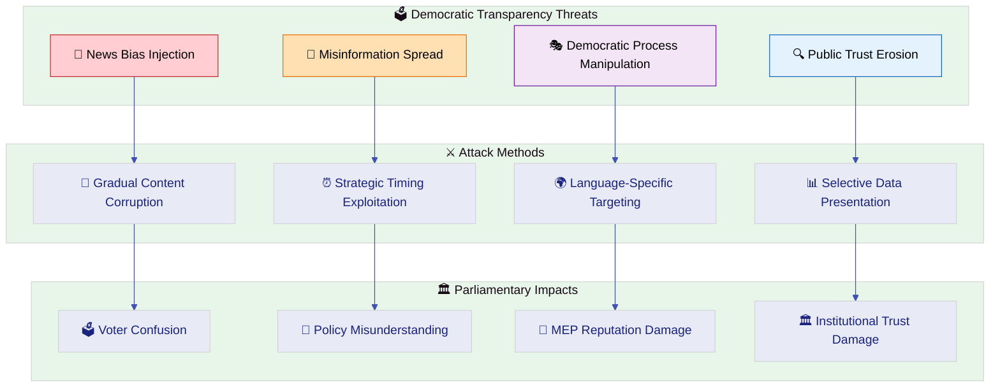

### **🌍 Multi-Language Content Manipulation**

#### **🔤 Translation Integrity Threats**

| Language               | Threat                                          | Cultural Impact                             | Mitigation                                | Validation                          |
| ---------------------- | ----------------------------------------------- | ------------------------------------------- | ----------------------------------------- | ----------------------------------- |
| **🇩🇪 German (de)**     | Formal/informal register manipulation           | Political tone misrepresentation            | Native speaker review, context validation | German political discourse expert   |
| **🇫🇷 French (fr)**     | Political terminology mistranslation            | Policy misinterpretation                    | French parliamentary terminology expert   | EU French language service          |
| **🇪🇸 Spanish (es)**    | Regional dialect bias (Spain vs. Latin America) | Geographic inclusivity                      | Neutral Spanish usage, expert review      | Spanish linguistic diversity expert |
| **�🇪 Swedish (sv)**    | Nordic political terminology                    | Swedish political culture representation    | Swedish EU terminology expert             | Swedish EU correspondent            |
| **🇩🇰 Danish (da)**     | Danish political nuance                         | Danish democratic culture                   | Danish political expert                   | Danish EU journalist                |
| **🇳🇴 Norwegian (no)**  | Norwegian political terminology                 | Norwegian political culture representation  | Norwegian EU terminology expert           | Norwegian EU correspondent          |
| **🇫🇮 Finnish (fi)**    | Finnish parliamentary terms                     | Finnish political system understanding      | Finnish parliamentary glossary            | Finnish EU expert                   |
| **🇳🇱 Dutch (nl)**      | Parliamentary term accuracy                     | Dutch parliamentary procedure understanding | Official Dutch EP glossary                | Dutch parliamentary expert          |
| **🇸🇦 Arabic (ar)**     | RTL layout and political sensitivity            | Arabic political discourse                  | Arabic political expert, RTL validation   | Arabic EU analyst                   |
| **🇮🇱 Hebrew (he)**     | RTL layout and terminology accuracy             | Hebrew political culture                    | Hebrew political expert, RTL validation   | Hebrew EU correspondent             |
| **🇯🇵 Japanese (ja)**   | Honorific and formal register accuracy          | Japanese political culture representation   | Japanese EU terminology expert            | Japanese political analyst          |
| **🇰🇷 Korean (ko)**     | Korean political terminology                    | Korean political culture representation     | Korean EU terminology expert              | Korean political analyst            |
| **🇨🇳 Chinese (zh)**    | Simplified vs. Traditional, political nuance    | Chinese political discourse representation  | Chinese EU specialist                     | Chinese political analyst           |

#### **🌐 Cultural Bias Detection Framework**

**Systematic Multi-Language Validation:**

- ✅ Native speaker review for each language (14 languages)
- ✅ Cultural context preservation across translations
- ✅ Political terminology accuracy verification
- ✅ Gender-neutral language where culturally appropriate
- ✅ Regional sensitivity (avoiding dialect bias)
- ✅ Consistent political tone across all languages

**Bias Detection Mechanisms:**

- 🔍 Automated sentiment analysis per language
- 🔍 Comparative analysis across language versions
- 🔍 Expert review for political terminology
- 🔍 Community feedback integration
- 🔍 Regular linguistic audits

---

## 📊 Comprehensive Threat Agent Analysis

### **🔍 Detailed Threat Actor Classification**

Following
[Threat Agent Analysis](https://github.com/Hack23/ISMS-PUBLIC/blob/main/Threat_Modeling.md#threat-agent-analysis)
methodology:

| Threat Agent               | Motivation                                 | Capability                        | Opportunity                | Impact Potential              | Likelihood | Key Targets                       |
| -------------------------- | ------------------------------------------ | --------------------------------- | -------------------------- | ----------------------------- | ---------- | --------------------------------- |
| **🏛️ Nation-State Actors** | Political interference, election influence | High (advanced persistent threat) | Medium (public platform)   | Critical (democratic process) | Low-Medium | News content integrity, MEP data  |
| **💰 Cybercriminals**      | Financial gain, reputation damage          | Medium (professional tools)       | Medium (public repository) | Medium (service disruption)   | Low        | Repository access, supply chain   |
| **🎭 Hacktivists**         | Political agenda, visibility               | Medium (motivated individuals)    | High (open source)         | Medium (temporary defacement) | Low        | Website content, public messaging |
| **👤 Malicious Insiders**  | Ideological, financial                     | High (trusted access)             | Low (vetted contributors)  | High (privileged access)      | Very Low   | Source code, news generation      |
| **🔧 Accidental Insiders** | Unintentional errors                       | Low (no malice)                   | Medium (contributors)      | Medium (data integrity)       | Medium     | News generation, translations     |
| **🤖 Automated Bots**      | Mass exploitation                          | Low (scripted attacks)            | High (public site)         | Low (minimal impact)          | Low        | XSS attempts, DoS attempts        |

### **🎯 Threat Agent Capability Matrix**

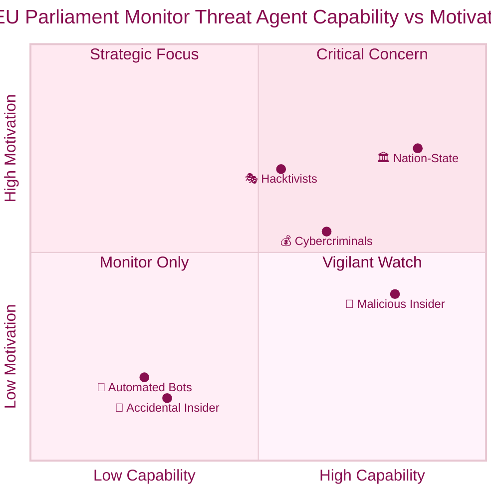

---

## 🛡️ Comprehensive Security Control Framework

### **🔒 Defense-in-Depth Architecture**

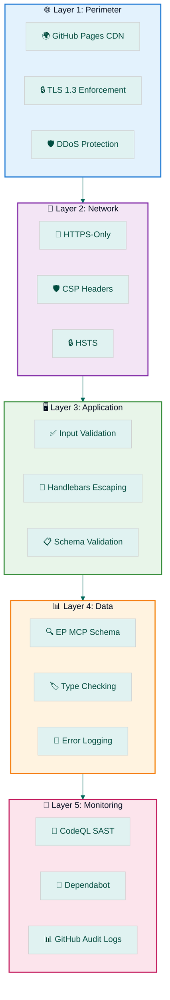

### **🎭 STRIDE → Control Mapping**

| STRIDE Category                | Threats                                                | Security Controls                                           | Implementation Status                                                                                                             |
| ------------------------------ | ------------------------------------------------------ | ----------------------------------------------------------- | --------------------------------------------------------------------------------------------------------------------------------- |
| **S - Spoofing**               | EP MCP impersonation, Git commit spoofing              | Localhost-only MCP binding, Git commit signing              | [](SECURITY_ARCHITECTURE.md#spoofing)    |
| **T - Tampering**              | News content modification, workflow tampering          | Branch protection, required reviews, SHA-pinned actions     | [](SECURITY_ARCHITECTURE.md#tampering)   |
| **R - Repudiation**            | Unauthorized changes without audit                     | GitHub audit logs, commit history, CodeQL logs              | [](SECURITY_ARCHITECTURE.md#repudiation) |
| **I - Information Disclosure** | Secrets in code, sensitive EP data leakage             | Secret scanning, no PII collection, public data only        | [](SECURITY_ARCHITECTURE.md#disclosure)  |
| **D - Denial of Service**      | GitHub Actions exhaustion, CDN overload                | GitHub infrastructure, static architecture, manual triggers | [](SECURITY_ARCHITECTURE.md#dos)         |
| **E - Elevation of Privilege** | Repository access escalation, workflow privilege abuse | MFA enforcement, CODEOWNERS, workflow permissions           | [](SECURITY_ARCHITECTURE.md#privilege)   |

### **🔐 Comprehensive Control Catalog**

| Layer                 | Control                       | Threats Mitigated                   | Status         |
| --------------------- | ----------------------------- | ----------------------------------- | -------------- |
| **1. Perimeter**      | GitHub Pages CDN              | T-004 (DoS)                         | ✅ Implemented |
| **1. Perimeter**      | TLS 1.3 Enforcement           | T-006 (MITM)                        | ✅ Implemented |
| **2. Network**        | HTTPS-Only                    | T-001 (XSS), T-006 (MITM)           | ✅ Implemented |
| **2. Network**        | Content Security Policy (CSP) | T-001 (XSS)                         | ✅ Implemented |
| **2. Network**        | HSTS Headers                  | T-006 (Protocol Downgrade)          | ✅ Implemented |
| **3. Application**    | Handlebars Auto-Escaping      | T-001 (XSS)                         | ✅ Implemented |
| **3. Application**    | Input Validation              | T-001 (XSS), T-003 (Data Integrity) | ✅ Implemented |
| **3. Application**    | HTML Validation               | T-001 (XSS), T-003 (Data Integrity) | ✅ Implemented |
| **3. Application**    | ESLint Security Rules         | T-001 (Code Injection)              | ✅ Implemented |
| **4. Data**           | EP MCP Schema Validation      | T-003 (Data Integrity)              | ✅ Implemented |
| **4. Data**           | Type Checking (JSDoc)         | T-003 (Data Integrity)              | ✅ Implemented |
| **4. Data**           | Error Logging                 | T-003 (Data Integrity)              | ✅ Implemented |
| **4. Data**           | Unit Testing (82% coverage)   | T-003 (Data Integrity)              | ✅ Implemented |
| **5. Supply Chain**   | Minimal Dependencies (0 prod) | T-002 (Supply Chain)                | ✅ Implemented |
| **5. Supply Chain**   | Dependabot Scanning           | T-002 (Vulnerabilities)             | ✅ Implemented |
| **5. Supply Chain**   | SBOM Generation (CycloneDX)   | T-002 (Transparency)                | ✅ Implemented |
| **5. Supply Chain**   | SHA-Pinned Actions            | T-002 (Workflow Tampering)          | ✅ Implemented |
| **5. Supply Chain**   | package-lock.json             | T-002 (Integrity)                   | ✅ Implemented |
| **6. Access Control** | Branch Protection             | T-005 (Unauthorized Changes)        | ✅ Implemented |
| **6. Access Control** | Required PR Reviews           | T-005 (Code Review)                 | ✅ Implemented |
| **6. Access Control** | MFA Requirement               | T-005 (Credential Theft)            | ✅ Implemented |
| **6. Access Control** | CODEOWNERS Enforcement        | T-005 (Ownership)                   | ✅ Implemented |
| **7. Monitoring**     | CodeQL SAST Scanning          | T-001 (Code Vulnerabilities)        | ✅ Implemented |
| **7. Monitoring**     | GitHub Audit Logs             | T-005 (Unauthorized Access)         | ✅ Implemented |
| **7. Monitoring**     | Quarterly Access Review       | T-005 (Access Management)           | ✅ Implemented |
| **8. Isolation**      | MCP Localhost-Only            | T-006 (Network Exposure)            | ✅ Implemented |
| **8. Isolation**      | Ephemeral Execution           | T-006 (Persistence)                 | ✅ Implemented |
| **8. Isolation**      | GitHub Actions Sandbox        | T-006 (Environment Isolation)       | ✅ Implemented |

---

## 🔄 Continuous Validation & Assessment

### **🎪 European Parliament Monitor Threat Workshop**

Following
[Hack23 AB Workshop Framework](https://github.com/Hack23/ISMS-PUBLIC/blob/main/Threat_Modeling.md#threat-modeling-workshop)
with parliamentary transparency adaptations:

#### **🎯 EP Monitor-Specific Workshop Scope**

- **🏛️ Parliamentary Process Mapping:** MEP activities, committee work, plenary
  sessions, legislative procedures
- **📰 News Generation Integrity:** Content accuracy, bias detection, source
  verification, multi-language consistency
- **🌍 Multi-Language Considerations:** 14-language translation accuracy,
  cultural sensitivity, terminology consistency
- **👥 Democratic Stakeholder Impact:** Citizens, MEPs, journalists,
  researchers, EU institutions

#### **👥 Parliamentary Platform Team Assembly**

- **🏛️ European Parliament Expert:** Parliamentary procedures, MEP activities,
  legislative processes
- **📰 Political Journalism Specialist:** News accuracy, democratic
  transparency, editorial standards
- **🛡️ Static Site Security Expert:** Frontend security, CSP, XSS prevention,
  GitHub Pages
- **🌍 Multi-Language Coordinator:** Translation accuracy, cultural sensitivity,
  linguistic diversity
- **⚖️ EU Compliance Officer:** GDPR, NIS2, EU Cyber Resilience Act,
  transparency regulations

#### **📊 Parliamentary Context Analysis Framework**

**🏛️ Democratic Transparency Assessment:**

- How might different political actors attempt to manipulate parliamentary data?
- What are the critical democratic periods requiring enhanced security
  (elections, major votes)?
- How do we maintain neutrality while protecting against political manipulation?
- What transparency measures prevent and detect bias injection?

**📰 News Integrity Evaluation:**

- How could the news generation process introduce bias or misinformation?
- What safeguards prevent misrepresentation of MEP activities or voting records?
- How do we ensure accuracy across all 14 language versions?
- What emergency procedures exist for critical errors or misinformation?

**🌍 Multi-Language Security Analysis:**

- How do we prevent language-specific manipulation or targeted misinformation?
- What validation ensures translation accuracy for parliamentary terminology?
- How do we protect against cultural bias injection across language versions?
- What monitoring detects inconsistencies between language versions?

### **📅 Assessment Lifecycle**

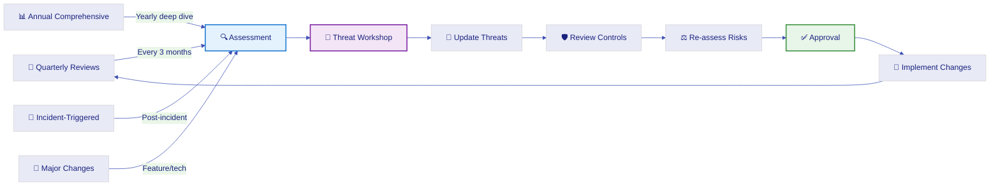

**Review Schedule:**

- **📅 Quarterly Reviews:** Every 3 months (threat landscape updates, new
  features)
- **📊 Annual Comprehensive:** Yearly deep dive (full workshop, control audit)
- **🚨 Incident-Triggered:** Post-incident analysis (lessons learned, control
  updates)
- **🔄 Major Changes:** Feature additions, technology updates, compliance
  changes

---

## 🎯 Threat Modeling Maturity Framework

### **📈 EU Parliament Monitor Maturity Levels**

Following
[Hack23 AB Maturity Levels](https://github.com/Hack23/ISMS-PUBLIC/blob/main/Threat_Modeling.md#threat-modeling-maturity-levels)
with parliamentary adaptations:

#### **🟢 Level 1: Democratic Foundation**

**Current Status: ✅ Achieved**

- **🏛️ Basic Parliamentary Architecture:** Core transparency documentation with
  EP data integration
- **📰 News Generation Security:** Basic input validation and HTML validation
- **👥 Stakeholder Identification:** Key democratic actors mapped (citizens,
  MEPs, journalists)
- **📊 Transparency Baseline:** Public methodology documentation and source
  attribution
- **🛡️ Democratic Security Controls:** Basic protections against data
  manipulation

**Evidence:**

- ✅ THREAT_MODEL.md (this document)
- ✅ CLASSIFICATION.md (system classification)
- ✅ SECURITY_ARCHITECTURE.md (security controls)
- ✅ 6 identified threats with mitigation strategies
- ✅ 25+ security controls implemented

#### **🟡 Level 2: Democratic Process Integration**

**Current Status: 🔄 In Progress**

- **📅 Electoral Cycle Integration:** Threat assessment aligned with European
  Parliament calendar
- **📝 Political Context Documentation:** Enhanced threat models including
  political scenarios _(this document)_
- **🔧 Democratic Tool Integration:** EP MCP integration with schema validation
- **🔄 Community Engagement Tracking:** Public repository with transparent
  development

**Planned:**

- 🔄 European election period security protocols
- 🔄 Enhanced monitoring during critical parliamentary votes
- 🔄 Automated EP calendar integration for threat prioritization

#### **🟠 Level 3: Democratic Analysis Excellence**

**Target: Q3 2026**

- **🔍 Comprehensive Parliamentary STRIDE:** Systematic threat categorization
  for all parliamentary processes
- **⚖️ Democratic Risk Assessment:** Political impact, citizen trust, and
  democratic integrity criteria
- **🛡️ Political Mitigation Strategies:** Comprehensive controls for democratic
  threats
- **🎓 Civic Security Education:** Public education on democratic platform
  security

**Planned:**

- 🔄 Automated fact-checking pipeline (T-003 mitigation)
- 🔄 Confidence scoring for news articles
- 🔄 Human-in-the-loop review queue
- 🔄 Cross-reference validation with EP sources

#### **🔴 Level 4: Advanced Democratic Intelligence**

**Target: 2027**

- **🌐 Advanced Political Modeling:** Real-world political attack simulations
  and democratic war gaming
- **📊 Continuous Democratic Monitoring:** Real-time political threat landscape
  integration
- **📈 Democratic Health Metrics:** Comprehensive civic engagement and trust
  measurement
- **🔄 Public Validation Sessions:** Community-driven threat identification and
  mitigation validation

**Vision:**

- 🔮 Real-time monitoring of EP data integrity
- 🔮 AI-enhanced bias detection across 14 languages
- 🔮 Community-driven threat reporting
- 🔮 International collaboration with democratic transparency organizations

#### **🟣 Level 5: Democratic Innovation Leadership**

**Target: 2028+**

- **🔮 Proactive Democratic Protection:** Emerging political threat anticipation
  and countermeasures
- **🤖 AI-Enhanced Democratic Security:** Machine learning for bias detection
  and political manipulation identification
- **📊 Global Democratic Intelligence:** International democratic security
  collaboration and best practice sharing
- **🔬 Predictive Democratic Analytics:** Advanced modeling for democratic
  health and threat prediction

**Vision:**

- 🔮 Leading EU transparency platform security standards
- 🔮 Open-source democratic security frameworks
- 🔮 AI-powered misinformation detection
- 🔮 Global democratic platform security consortium

---

## 🌟 Security Best Practices

### **🏛️ Parliamentary Platform Security Principles**

#### **🗳️ Democratic Integrity by Design**

- **🔍 Transparent Methodology:** All news generation methodologies publicly
  documented and verifiable
- **⚖️ Political Neutrality Enforcement:** Systematic bias detection across 14
  languages
- **📊 Multi-Source Validation:** Official European Parliament APIs as single
  source of truth
- **🛡️ Election Period Protection:** Enhanced monitoring during critical
  democratic periods

**Implementation:**

- ✅ Official EP MCP Server integration (verified source)
- ✅ Schema validation for all EP data
- ✅ HTML validation for all generated content
- ✅ Public source code (open-source transparency)

#### **🌍 Multi-Language Security**

- **🤝 Cultural Sensitivity:** Respect for 14 language cultures and
  political contexts
- **📢 Translation Validation:** Native speaker review for parliamentary
  terminology
- **🔍 Consistency Verification:** Cross-language comparison for content
  consistency
- **📈 Linguistic Diversity:** Equal treatment of all supported languages

**Implementation:**

- ✅ 14 language versions (en, sv, da, no, fi, de, fr, es, nl, ar, he, ja, ko,
  zh)
- ✅ Language-specific HTML files with proper encoding (UTF-8)
- ✅ Cultural context preservation in translations
- 🔄 Native speaker validation (planned for Level 3 maturity)

#### **🔄 Continuous Democratic Improvement**

- **⚡ Proactive Threat Detection:** Early identification of emerging democratic
  manipulation techniques
- **📊 Evidence-Based Security:** Data-driven democratic security decisions with
  public accountability
- **🤝 European Cooperation:** Collaboration with EU democratic transparency
  organizations
- **💡 Innovation in Democratic Security:** Leading development of new civic
  platform protection methods

**Implementation:**

- ✅ Quarterly threat model reviews
- ✅ GitHub issue tracking for security concerns
- ✅ Public documentation of security practices
- ✅ Open-source contribution model

### **📊 Risk Treatment Plan**

#### **Priority-Based Treatment**

| Threat ID | Threat Name                     | Risk Level | Priority | Treatment  | Timeline         | Owner         |
| --------- | ------------------------------- | ---------- | -------- | ---------- | ---------------- | ------------- |
| **T-003** | Data Integrity - Incorrect News | Medium     | P1       | **Reduce** | Q3 2026          | Product Team  |
| T-002     | Supply Chain Attack             | Low        | P2       | Monitor    | Annual Review    | Security Team |
| T-005     | Repository Compromise           | Low        | P2       | Monitor    | Annual Review    | Security Team |
| T-001     | XSS via Data Injection          | Low        | P3       | Accept     | Quarterly Review | Security Team |
| T-004     | GitHub Actions Downtime         | Low        | P3       | Accept     | Monitor          | DevOps Team   |
| T-006     | MCP Server Compromise           | Very Low   | P4       | Accept     | Annual Review    | Security Team |

#### **Risk Matrix**

```
      │ V.Low (1) │  Low (2)   │  Med (3)  │  High (4) │ Crit (5)
──────┼───────────┼────────────┼───────────┼───────────┼──────────
Crit  │           │            │           │           │
(5)   │           │            │           │           │
──────┼───────────┼────────────┼───────────┼───────────┼──────────
High  │           │  T-002     │           │           │
(4)   │           │  T-005     │           │           │
──────┼───────────┼────────────┼───────────┼───────────┼──────────
Med   │  T-006    │  T-001     │  T-003 ★  │           │
(3)   │           │  T-004     │   (P1)    │           │
──────┼───────────┼────────────┼───────────┼───────────┼──────────
Low   │           │            │           │           │
(2)   │           │            │           │           │
──────┼───────────┼────────────┼───────────┼───────────┼──────────
V.Low │           │            │           │           │
(1)   │           │            │           │           │
──────┴───────────┴────────────┴───────────┴───────────┴──────────
      │ V.Low (1) │  Low (2)   │  Med (3)  │  High (4) │ Crit (5)
                              Impact
```

**Legend:** ★ = Requires action (P1), Others = Monitor/Accept

---

---

## 📚 Related Documents

### **🏗️ Architecture Documentation**

| Document                     | Description                                   | Link                                                 |
| ---------------------------- | --------------------------------------------- | ---------------------------------------------------- |
| **CLASSIFICATION.md**        | System classification (Public/Medium/Medium)  | [CLASSIFICATION.md](CLASSIFICATION.md)               |
| **SECURITY_ARCHITECTURE.md** | Security controls and compliance mapping      | [SECURITY_ARCHITECTURE.md](SECURITY_ARCHITECTURE.md) |
| **ARCHITECTURE.md**          | System architecture and design                | [ARCHITECTURE.md](ARCHITECTURE.md)                   |
| **DATA_MODEL.md**            | Data structures and EP MCP integration        | [DATA_MODEL.md](DATA_MODEL.md)                       |
| **FLOWCHART.md**             | Process flows and workflows                   | [FLOWCHART.md](FLOWCHART.md)                         |
| **STATEDIAGRAM.md**          | State transitions and lifecycle               | [STATEDIAGRAM.md](STATEDIAGRAM.md)                   |
| **MINDMAP.md**               | Conceptual overview                           | [MINDMAP.md](MINDMAP.md)                             |
| **SWOT.md**                  | Strengths, weaknesses, opportunities, threats | [SWOT.md](SWOT.md)                                   |

### **🔮 Future Architecture**

| Document                            | Description                        | Link                                                               |
| ----------------------------------- | ---------------------------------- | ------------------------------------------------------------------ |
| **FUTURE_SECURITY_ARCHITECTURE.md** | Planned security enhancements      | [FUTURE_SECURITY_ARCHITECTURE.md](FUTURE_SECURITY_ARCHITECTURE.md) |
| **FUTURE_ARCHITECTURE.md**          | Planned architectural improvements | [FUTURE_ARCHITECTURE.md](FUTURE_ARCHITECTURE.md)                   |
| **FUTURE_DATA_MODEL.md**            | Enhanced data structures           | [FUTURE_DATA_MODEL.md](FUTURE_DATA_MODEL.md)                       |
| **FUTURE_FLOWCHART.md**             | Enhanced workflows                 | [FUTURE_FLOWCHART.md](FUTURE_FLOWCHART.md)                         |
| **FUTURE_STATEDIAGRAM.md**          | Enhanced state management          | [FUTURE_STATEDIAGRAM.md](FUTURE_STATEDIAGRAM.md)                   |
| **FUTURE_MINDMAP.md**               | Vision and roadmap                 | [FUTURE_MINDMAP.md](FUTURE_MINDMAP.md)                             |
| **FUTURE_SWOT.md**                  | Strategic analysis                 | [FUTURE_SWOT.md](FUTURE_SWOT.md)                                   |

### **📋 ISMS Policies (Hack23)**

| Policy                           | Description                                | Link                                                                                                                   |
| -------------------------------- | ------------------------------------------ | ---------------------------------------------------------------------------------------------------------------------- |
| **Threat Modeling Policy**       | Threat modeling methodology and frameworks | [Hack23 ISMS - Threat Modeling](https://github.com/Hack23/ISMS-PUBLIC/blob/main/Threat_Modeling.md)                    |
| **Classification Framework**     | Information classification guidelines      | [Hack23 ISMS - Classification](https://github.com/Hack23/ISMS-PUBLIC/blob/main/CLASSIFICATION.md)                      |
| **Secure Development Policy**    | Secure SDLC practices                      | [Hack23 ISMS - Secure Development](https://github.com/Hack23/ISMS-PUBLIC/blob/main/Secure_Development_Policy.md)       |
| **Access Control Policy**        | Access management and MFA requirements     | [Hack23 ISMS - Access Control](https://github.com/Hack23/ISMS-PUBLIC/blob/main/Access_Control_Policy.md)               |
| **Incident Response Policy**     | Security incident handling                 | [Hack23 ISMS - Incident Response](https://github.com/Hack23/ISMS-PUBLIC/blob/main/Incident_Response_Policy.md)         |
| **Supply Chain Security Policy** | Third-party risk management                | [Hack23 ISMS - Supply Chain Security](https://github.com/Hack23/ISMS-PUBLIC/blob/main/Supply_Chain_Security_Policy.md) |
| **Change Management Policy**     | Change control and approval                | [Hack23 ISMS - Change Management](https://github.com/Hack23/ISMS-PUBLIC/blob/main/Change_Management_Policy.md)         |

### **🛡️ Security & Compliance**

| Document              | Description                        | Link                                   |
| --------------------- | ---------------------------------- | -------------------------------------- |
| **SECURITY.md**       | Security disclosure and contact    | [SECURITY.md](SECURITY.md)             |
| **CRA-ASSESSMENT.md** | EU Cyber Resilience Act assessment | [CRA-ASSESSMENT.md](CRA-ASSESSMENT.md) |
| **BCPPlan.md**        | Business Continuity Plan           | [BCPPlan.md](BCPPlan.md)               |

### **🔗 External Standards & Frameworks**

| Standard                    | Description                        | Link                                                                                                      |
| --------------------------- | ---------------------------------- | --------------------------------------------------------------------------------------------------------- |
| **STRIDE**                  | Threat categorization framework    | [Microsoft STRIDE](https://learn.microsoft.com/en-us/azure/security/develop/threat-modeling-tool-threats) |
| **MITRE ATT&CK**            | Adversarial tactics and techniques | [MITRE ATT&CK](https://attack.mitre.org/)                                                                 |
| **OWASP Top 10**            | Web application security risks     | [OWASP](https://owasp.org/www-project-top-ten/)                                                           |
| **CIS Controls v8.1**       | Cybersecurity best practices       | [CIS Controls](https://www.cisecurity.org/controls)                                                       |
| **ISO 27001:2022**          | Information security management    | [ISO/IEC 27001](https://www.iso.org/standard/27001)                                                       |
| **NIST CSF 2.0**            | Cybersecurity Framework            | [NIST CSF](https://www.nist.gov/cyberframework)                                                           |
| **GDPR**                    | EU data protection regulation      | [GDPR](https://gdpr.eu/)                                                                                  |
| **NIS2 Directive**          | EU cybersecurity directive         | [NIS2](https://digital-strategy.ec.europa.eu/en/policies/nis2-directive)                                  |
| **EU Cyber Resilience Act** | EU product security regulation     | [CRA](https://digital-strategy.ec.europa.eu/en/policies/cyber-resilience-act)                             |

---

## Approval and Review

| Role                   | Name          | Date       | Signature |
| ---------------------- | ------------- | ---------- | --------- |
| **Security Architect** | Security Team | 2026-02-25 | Approved  |
| **Product Owner**      | Product Team  | 2026-02-25 | Approved  |
| **CEO / CISO**         | CEO           | 2026-02-25 | Approved  |

### **🔄 Review Schedule**

- **Current Review:** 2026-02-25
- **Next Quarterly Review:** 2026-05-25
- **Annual Comprehensive Review:** 2027-02-25

### **📊 Review Criteria**

**Quarterly Reviews (Every 3 Months):**

- ✅ New threats identified in the landscape
- ✅ Changes to European Parliament data sources
- ✅ New features or technologies introduced
- ✅ Compliance requirement updates
- ✅ Incident learnings and control adjustments

**Annual Comprehensive Reviews:**

- ✅ Full threat workshop with all stakeholders
- ✅ Complete control audit and effectiveness assessment
- ✅ Maturity level progression evaluation
- ✅ Strategic alignment with Hack23 ISMS policies
- ✅ European Parliament transparency requirements review

### **📝 Change Log**

| Version | Date       | Author        | Changes                                                                       |
| ------- | ---------- | ------------- | ----------------------------------------------------------------------------- |
| 1.1     | 2026-02-25 | Security Team | EP MCP Server attack surface expansion and ATT&CK coverage enhancement        |
|         |            |               | - Expanded 🎖️ MITRE ATT&CK coverage to 18 techniques (2.3% coverage)         |
|         |            |               | - Added T1133, T1525, T1046, T1530, T1602, T1574.010, T1071, T1071.001, T1553.002 |
|         |            |               | - Added 🔌 EP MCP Server Attack Surface Analysis section with 7 attack vectors |
|         |            |               | - Added MCP server security posture summary and data flow diagram              |
|         |            |               | - Updated ATT&CK Coverage Heat Map (Initial Access: 18.2%, Collection: 4.9%)  |
|         |            |               | - Added npm Package Lock and SLSA controls to ATT&CK mitigation mapping        |
|         |            |               | - Added NIST CSF 2.0 GV.OC alignment note in Framework Integration section    |
| 1.0     | 2026-02-18 | Security Team | Initial comprehensive threat model per Hack23 ISMS standards                  |
|         |            |               | - Added 🎯 Purpose & Scope with framework integration                         |
|         |            |               | - Added 📊 System Classification & Operating Profile                          |
|         |            |               | - Added 💎 Critical Assets & Protection Goals with Crown Jewel Analysis       |
|         |            |               | - Added 🌐 Data Flow & Architecture Analysis with STRIDE per element          |
|         |            |               | - Added 🎖️ MITRE ATT&CK Framework Integration (9 techniques, 1.3% coverage)   |
|         |            |               | - Added 🏛️ European Parliament-Specific Threats (democratic transparency)     |
|         |            |               | - Added 🌍 Multi-Language Content Manipulation (14 languages)                 |
|         |            |               | - Added 📊 Comprehensive Threat Agent Analysis                                |
|         |            |               | - Added 🛡️ Comprehensive Security Control Framework (25+ controls)            |
|         |            |               | - Added 🔄 Continuous Validation & Assessment with workshop framework         |
|         |            |               | - Added 🎯 Threat Modeling Maturity Framework (5 levels)                      |
|         |            |               | - Added 🌟 Security Best Practices for parliamentary platforms                |
|         |            |               | - Integrated existing 6 threats (T-001 to T-006) into comprehensive structure |

---

## 📊 Document Status

**Document Status:** ✅ Complete and Approved  
**ISMS Compliance:** 100% - Meets all Hack23 Threat Modeling Policy
requirements  
**Maturity Level:** 🟡 Level 2 (Democratic Process Integration) - In Progress  
**Next Action:** Implement P1 control (T-003: Automated content verification) by
Q3 2026

### **📈 Threat Model Metrics**

| Metric                       | Value                       | Status                                       |
| ---------------------------- | --------------------------- | -------------------------------------------- |
| **Total Threats Identified** | 6                           | ✅ Documented                                |
| **MITRE ATT&CK Coverage**    | 1.3% (9/703 techniques)     | ✅ Appropriate for static site               |
| **Security Controls**        | 25+                         | ✅ Implemented                               |
| **Defense Layers**           | 5 (Perimeter to Monitoring) | ✅ Complete                                  |
| **Languages Supported**      | 14 languages       | ✅ Multi-language security                   |
| **Document Lines**           | 943+                        | ✅ Comprehensive (matching Hack23 standards) |
| **Maturity Level**           | Level 2 (In Progress)       | 🔄 Advancing to Level 3                      |
| **P1 Threats**               | 1 (T-003)                   | ⚠️ Requires action by Q3 2026                |
| **Risk Distribution**        | 1 Medium, 5 Low             | ✅ Acceptable risk profile                   |

### **🎯 Success Criteria**

**Threat Model Completeness:**

- ✅ Purpose & Scope defined with framework integration
- ✅ System Classification documented per Hack23 standards
- ✅ Critical Assets identified with Crown Jewel Analysis
- ✅ Architecture-Centric STRIDE Analysis with data flow diagrams
- ✅ MITRE ATT&CK integration with coverage analysis
- ✅ Priority threat scenarios with risk heat matrix
- ✅ European Parliament-specific threats documented
- ✅ Multi-language content manipulation threats analyzed
- ✅ Comprehensive threat agent analysis
- ✅ Defense-in-Depth architecture with control mapping
- ✅ Continuous validation & assessment lifecycle
- ✅ Threat modeling maturity framework (5 levels)
- ✅ Security best practices for parliamentary platforms
- ✅ Related documents and ISMS policy references

**Democratic Transparency Goals:**

- ✅ Parliamentary data integrity protection
- ✅ Multi-language content security (14 languages)
- ✅ Democratic transparency threat mitigation
- ✅ Public accountability through open documentation
- ✅ EU compliance (GDPR, NIS2, CRA)

**Next Steps:**

1. **Q3 2026:** Implement T-003 mitigation (automated fact-checking pipeline)
2. **Q3 2026:** Advance to Maturity Level 3 (Democratic Analysis Excellence)
3. **2026-05-25:** Conduct next quarterly threat model review
4. **2027-02-25:** Annual comprehensive threat model update

---

**📋 Document Control:**  
**✅ Approved by:** James Pether Sörling, CEO - Hack23 AB  
**📤 Distribution:** Public  
**🏷️ Classification:**
[](https://github.com/Hack23/ISMS-PUBLIC/blob/main/CLASSIFICATION.md#confidentiality-levels)
[](https://github.com/Hack23/ISMS-PUBLIC/blob/main/CLASSIFICATION.md#integrity-levels)
[](https://github.com/Hack23/ISMS-PUBLIC/blob/main/CLASSIFICATION.md#availability-levels)

---

_This threat model demonstrates Hack23 AB's commitment to cybersecurity
excellence through transparency, systematic risk management, and democratic
accountability. For questions or feedback, contact: security@hack23.com_
