<p align="center">
  
</p>

<h1 align="center">🔄 EU Parliament Monitor — CI/CD Workflows</h1>

<p align="center">
  <strong>🛡️ Automated Security Excellence Through Continuous Integration</strong><br>
  <em>🎯 Transparent Pipeline Operations Demonstrating ISMS Policy Compliance</em>
</p>

<p align="center">
  <a href="#"></a>
  <a href="#"></a>
  <a href="#"></a>
  <a href="#"></a>
</p>

**📋 Document Owner:** CEO | **📄 Version:** 3.0 | **📅 Last Updated:** 2026-03-10 (UTC)  
**🔄 Review Cycle:** Quarterly | **⏰ Next Review:** 2026-06-10

---

## 📊 Workflow Status Badges

**CI/CD Pipeline Status:**

[](https://github.com/Hack23/euparliamentmonitor/actions/workflows/test-and-report.yml)
[](https://github.com/Hack23/euparliamentmonitor/actions/workflows/codeql.yml)
[](https://github.com/Hack23/euparliamentmonitor/actions/workflows/e2e.yml)
[](https://github.com/Hack23/euparliamentmonitor/actions/workflows/release.yml)
[](https://github.com/Hack23/euparliamentmonitor/actions/workflows/dependency-review.yml)
[](https://github.com/Hack23/euparliamentmonitor/actions/workflows/scorecards.yml)
[](https://github.com/Hack23/euparliamentmonitor/actions/workflows/deploy-s3.yml)
[](https://github.com/Hack23/euparliamentmonitor/actions/workflows/reuse.yml)

**Security & Quality Metrics:**

[](https://scorecard.dev/viewer/?uri=github.com/Hack23/euparliamentmonitor)
[](https://github.com/Hack23/euparliamentmonitor/attestations)

---

## 🔐 ISMS Policy Alignment

EU Parliament Monitor's CI/CD workflows implement security controls mandated by Hack23 AB's ISMS framework:

| **ISMS Policy** | **Workflow Implementation** |
| --- | --- |
| [🛠️ Secure Development Policy](https://github.com/Hack23/ISMS-PUBLIC/blob/main/Secure_Development_Policy.md) | SAST (CodeQL), SCA (Dependency Review), E2E testing, performance testing |
| [📝 Change Management](https://github.com/Hack23/ISMS-PUBLIC/blob/main/Change_Management.md) | Automated testing gates, security scanning, PR review requirements |
| [🔍 Vulnerability Management](https://github.com/Hack23/ISMS-PUBLIC/blob/main/Vulnerability_Management.md) | Dependabot, CodeQL, OSSF Scorecard, npm audit, security advisories |
| [🔓 Open Source Policy](https://github.com/Hack23/ISMS-PUBLIC/blob/main/Open_Source_Policy.md) | SLSA attestations, SBOM generation, REUSE license compliance |
| [🔐 Information Security Policy](https://github.com/Hack23/ISMS-PUBLIC/blob/main/Information_Security_Policy.md) | Security-hardened runners, SHA-pinned actions, least privilege permissions |
| [🔑 Access Control Policy](https://github.com/Hack23/ISMS-PUBLIC/blob/main/Access_Control_Policy.md) | OIDC authentication, minimal workflow permissions, branch protection |
| [🔒 Cryptography Policy](https://github.com/Hack23/ISMS-PUBLIC/blob/main/Cryptography_Policy.md) | Sigstore signing, SLSA L3 provenance, build attestations |
| [🚨 Incident Response Plan](https://github.com/Hack23/ISMS-PUBLIC/blob/main/Incident_Response_Plan.md) | Automated rollback procedures, incident classification workflows |
| [💾 Backup & Recovery Policy](https://github.com/Hack23/ISMS-PUBLIC/blob/main/Backup_Recovery_Policy.md) | Multi-CDN deployment (S3 + GitHub Pages DR), version control |
| [🤝 Third Party Management](https://github.com/Hack23/ISMS-PUBLIC/blob/main/Third_Party_Management.md) | SHA-pinned actions, dependency review, supply chain security |

### Compliance Framework Mapping

| **Framework** | **Version** | **Relevant Controls** | **Implementation** |
| --- | --- | --- | --- |
| **ISO 27001** | 2022 | A.8.25, A.8.26, A.8.27, A.8.28, A.12.1.4 | Secure development lifecycle, testing, change management |
| **NIST CSF** | 2.0 | PR.DS, DE.CM, ID.SC, RS.MI | Data security, monitoring, supply chain, mitigation |
| **CIS Controls** | v8.1 | 2.2, 4.1, 7.1, 16.1, 17.1 | Software inventory, access control, code signing, application security |
| **EU CRA** | 2024 | Art. 10, Art. 11 | SBOM generation, vulnerability disclosure, security updates |

---

## 📚 Architecture Documentation Map

<div class="documentation-map">

| Document                                                            | Focus           | Description                                    | Documentation Link                                                                                     |
| ------------------------------------------------------------------- | --------------- | ---------------------------------------------- | ------------------------------------------------------------------------------------------------------ |
| **[Architecture](ARCHITECTURE.md)**                                 | 🏛️ Architecture | C4 model showing current system structure      | [View Source](https://github.com/Hack23/euparliamentmonitor/blob/main/ARCHITECTURE.md)                 |
| **[Future Architecture](FUTURE_ARCHITECTURE.md)**                   | 🏛️ Architecture | C4 model showing future system structure       | [View Source](https://github.com/Hack23/euparliamentmonitor/blob/main/FUTURE_ARCHITECTURE.md)          |
| **[Mindmaps](MINDMAP.md)**                                          | 🧠 Concept      | Current system component relationships         | [View Source](https://github.com/Hack23/euparliamentmonitor/blob/main/MINDMAP.md)                      |
| **[Future Mindmaps](FUTURE_MINDMAP.md)**                            | 🧠 Concept      | Future capability evolution                    | [View Source](https://github.com/Hack23/euparliamentmonitor/blob/main/FUTURE_MINDMAP.md)               |
| **[SWOT Analysis](SWOT.md)**                                        | 💼 Business     | Current strategic assessment                   | [View Source](https://github.com/Hack23/euparliamentmonitor/blob/main/SWOT.md)                         |
| **[Future SWOT Analysis](FUTURE_SWOT.md)**                          | 💼 Business     | Future strategic opportunities                 | [View Source](https://github.com/Hack23/euparliamentmonitor/blob/main/FUTURE_SWOT.md)                  |
| **[Data Model](DATA_MODEL.md)**                                     | 📊 Data         | Current data structures and relationships      | [View Source](https://github.com/Hack23/euparliamentmonitor/blob/main/DATA_MODEL.md)                   |
| **[Future Data Model](FUTURE_DATA_MODEL.md)**                       | 📊 Data         | Enhanced European Parliament data architecture | [View Source](https://github.com/Hack23/euparliamentmonitor/blob/main/FUTURE_DATA_MODEL.md)            |
| **[Flowcharts](FLOWCHART.md)**                                      | 🔄 Process      | Current data processing workflows              | [View Source](https://github.com/Hack23/euparliamentmonitor/blob/main/FLOWCHART.md)                    |
| **[Future Flowcharts](FUTURE_FLOWCHART.md)**                        | 🔄 Process      | Enhanced AI-driven workflows                   | [View Source](https://github.com/Hack23/euparliamentmonitor/blob/main/FUTURE_FLOWCHART.md)             |
| **[State Diagrams](STATEDIAGRAM.md)**                               | 🔄 Behavior     | Current system state transitions               | [View Source](https://github.com/Hack23/euparliamentmonitor/blob/main/STATEDIAGRAM.md)                 |
| **[Future State Diagrams](FUTURE_STATEDIAGRAM.md)**                 | 🔄 Behavior     | Enhanced adaptive state transitions            | [View Source](https://github.com/Hack23/euparliamentmonitor/blob/main/FUTURE_STATEDIAGRAM.md)          |
| **[Security Architecture](SECURITY_ARCHITECTURE.md)**               | 🛡️ Security     | Current security implementation                | [View Source](https://github.com/Hack23/euparliamentmonitor/blob/main/SECURITY_ARCHITECTURE.md)        |
| **[Future Security Architecture](FUTURE_SECURITY_ARCHITECTURE.md)** | 🛡️ Security     | Security enhancement roadmap                   | [View Source](https://github.com/Hack23/euparliamentmonitor/blob/main/FUTURE_SECURITY_ARCHITECTURE.md) |
| **[Threat Model](THREAT_MODEL.md)**                                 | 🎯 Security     | STRIDE threat analysis                         | [View Source](https://github.com/Hack23/euparliamentmonitor/blob/main/THREAT_MODEL.md)                 |
| **[Classification](CLASSIFICATION.md)**                             | 🏷️ Governance   | CIA classification & BCP                       | [View Source](https://github.com/Hack23/euparliamentmonitor/blob/main/CLASSIFICATION.md)               |
| **[CRA Assessment](CRA-ASSESSMENT.md)**                             | 🛡️ Compliance   | Cyber Resilience Act                           | [View Source](https://github.com/Hack23/euparliamentmonitor/blob/main/CRA-ASSESSMENT.md)               |
| **[Workflows](WORKFLOWS.md)**                                       | ⚙️ DevOps       | CI/CD documentation                            | [View Source](https://github.com/Hack23/euparliamentmonitor/blob/main/WORKFLOWS.md)                    |
| **[Future Workflows](FUTURE_WORKFLOWS.md)**                         | 🚀 DevOps       | Planned CI/CD enhancements                     | [View Source](https://github.com/Hack23/euparliamentmonitor/blob/main/FUTURE_WORKFLOWS.md)             |
| **[Business Continuity Plan](BCPPlan.md)**                          | 🔄 Resilience   | Recovery planning                              | [View Source](https://github.com/Hack23/euparliamentmonitor/blob/main/BCPPlan.md)                      |
| **[Financial Security Plan](FinancialSecurityPlan.md)**             | 💰 Financial    | Cost & security analysis                       | [View Source](https://github.com/Hack23/euparliamentmonitor/blob/main/FinancialSecurityPlan.md)        |
| **[End-of-Life Strategy](End-of-Life-Strategy.md)**                 | 📦 Lifecycle    | Technology EOL planning                        | [View Source](https://github.com/Hack23/euparliamentmonitor/blob/main/End-of-Life-Strategy.md)         |
| **[Unit Test Plan](UnitTestPlan.md)**                               | 🧪 Testing      | Unit testing strategy                          | [View Source](https://github.com/Hack23/euparliamentmonitor/blob/main/UnitTestPlan.md)                 |
| **[E2E Test Plan](E2ETestPlan.md)**                                 | 🔍 Testing      | End-to-end testing                             | [View Source](https://github.com/Hack23/euparliamentmonitor/blob/main/E2ETestPlan.md)                  |
| **[Performance Testing](performance-testing.md)**                   | ⚡ Performance  | Performance benchmarks                         | [View Source](https://github.com/Hack23/euparliamentmonitor/blob/main/performance-testing.md)          |
| **[Security Policy](SECURITY.md)**                                  | 🔒 Security     | Vulnerability reporting & security policy      | [View Source](https://github.com/Hack23/euparliamentmonitor/blob/main/SECURITY.md)                     |

</div>

---

## 📋 Executive Summary

EU Parliament Monitor employs a comprehensive suite of **22 GitHub Actions workflows** (13 standard + 9 agentic) for automated intelligence operations, quality assurance, security scanning, and release management. All workflows follow [Hack23 ISMS Secure Development Policy](https://github.com/Hack23/ISMS-PUBLIC/blob/main/Secure_Development_Policy.md) standards.

### Workflow Portfolio

| # | Workflow | Purpose | Schedule / Trigger | ISMS Alignment |
|---|---------|---------|-------------------|----------------|
| 1 | **Agentic News Workflows** (×9) | AI-generated multi-language news articles | Varied schedules (see §1) | Integrity controls (Medium) |
| 2 | **Test & Report** | Unit tests, integration tests, coverage, performance | On PR/push to main | Quality assurance (ISO 27001 A.12.1.4) |
| 3 | **CodeQL** | SAST security scanning (JS/TS + GitHub Actions) | On PR/push + weekly Saturday | Vulnerability management (ISO 27001 A.12.6) |
| 4 | **E2E Tests** | End-to-end Playwright tests | On PR/push + daily midnight UTC | Functional validation |
| 5 | **Release** | Build, attest, document, release | Manual/tag push | SLSA L3, Documentation-as-code |
| 6 | **Dependency Review** | Supply chain security scanning | On PR | Supply chain security (NIST CSF ID.SC) |
| 7 | **OpenSSF Scorecard** | Security posture assessment | Weekly Tuesday 07:20 UTC | Continuous improvement |
| 8 | **Deploy S3** | Production deployment to AWS | Push to main | Infrastructure as Code |
| 9 | **REUSE Compliance** | License and copyright verification | On PR/push + weekly Monday | Open Source Policy |
| 10 | **SLSA Provenance** | Build provenance attestation | On release + manual | Supply chain security (SLSA L3) |
| 11 | **Compile Agentic Workflows** | Compile .md → .lock.yml via gh-aw CLI | Manual dispatch | Automation governance |
| 12 | **Labeler** | Automatic PR labeling | On pull_request_target | Workflow governance |
| 13 | **Setup Labels** | Repository label management | Manual dispatch | Repository governance |
| 14 | **Copilot Setup Steps** | GitHub Copilot agent environment setup | Push/PR to itself + manual | Agent infrastructure |

**🔒 Security Posture:** All 13 standard workflows use SHA-pinned actions (100%), Harden Runner (`step-security/harden-runner@58077d3c7e43986b6b15fba718e8ea69e387dfcc # v2.15.1`), and minimal permissions following least privilege principle.

---

## 🚀 Workflow Detailed Documentation

### 1. Agentic News Workflows (×9)

**🎯 Purpose:** AI-powered generation of multi-language news articles about European Parliament activities using GitHub Copilot with the `claude-opus-4.6` model  
**📁 Architecture:** 9 markdown source files compiled to 9 `.lock.yml` files via `gh aw compile` (GitHub Agentic Workflows CLI)  
**🌐 Languages:** 14 (en, sv, da, no, fi, de, fr, es, nl, ar, he, ja, ko, zh)

#### Agentic Workflow Schedule Matrix

| Workflow | File | Schedule | Timeout |
|----------|------|----------|---------|
| **EU Parliament Week Ahead** | `news-week-ahead.lock.yml` | Friday 07:00 UTC | 60 min |
| **EU Parliament Weekly Review** | `news-weekly-review.lock.yml` | Saturday 09:00 UTC | 60 min |
| **EU Parliament Plenary Votes & Resolutions** | `news-motions.lock.yml` | Weekdays (Mon–Fri) 06:00 UTC | 60 min |
| **EU Parliament Legislative Procedures** | `news-propositions.lock.yml` | Weekdays (Mon–Fri) 05:00 UTC | 60 min |
| **EU Parliament Committee Activity** | `news-committee-reports.lock.yml` | Weekdays (Mon–Fri) 04:00 UTC | 60 min |
| **EU Parliament Month Ahead** | `news-month-ahead.lock.yml` | 1st of month 08:00 UTC | 60 min |
| **EU Parliament Monthly Review** | `news-monthly-review.lock.yml` | 28th of month 10:00 UTC | 60 min |
| **EU Parliament Breaking News** | `news-breaking.lock.yml` | Every 6 hours (`0 */6 * * *`) | 60 min |
| **EU Parliament Article Generator** | `news-article-generator.lock.yml` | Manual dispatch only | 120 min |

#### Agentic Workflow Architecture

All 9 agentic workflows share a common architecture:

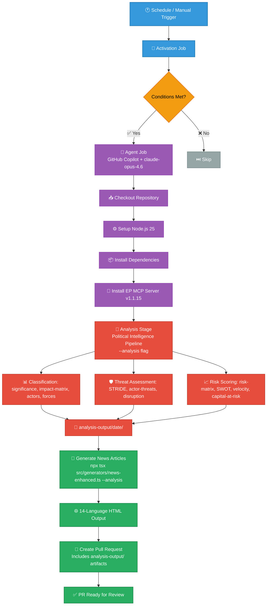
```mermaid
graph TD
    A[🕐 Schedule / Manual Trigger] --> B[🔑 Activation Job]
    B --> C{Conditions Met?}
    C -->|✅ Yes| D[🤖 Agent Job<br/>GitHub Copilot + claude-opus-4.6]
    C -->|❌ No| E[⏭️ Skip]
    D --> F[📥 Checkout Repository]
    F --> G[⚙️ Setup Node.js 25]
    G --> H[📦 Install Dependencies]
    H --> I[🔗 Install EP MCP Server v1.1.15]
    I --> J1[🔬 Analysis Stage<br/>Political Intelligence Pipeline<br/>--analysis flag]
    J1 --> J1a[📊 Classification: significance, impact-matrix, actors, forces]
    J1 --> J1b[🛡️ Threat Assessment: STRIDE, actor-threats, disruption]
    J1 --> J1c[📈 Risk Scoring: risk-matrix, SWOT, velocity, capital-at-risk]
    J1a --> J1d[📁 analysis-output/date/]
    J1b --> J1d
    J1c --> J1d
    J1d --> J[📰 Generate News Articles<br/>npx tsx src/generators/news-enhanced.ts --analysis]
    J --> K[🌐 14-Language HTML Output]
    K --> L[📝 Create Pull Request<br/>Includes analysis-output/ artifacts]
    L --> M[✅ PR Ready for Review]

    classDef trigger fill:#3498db,stroke:#2980b9,stroke-width:2px,color:white
    classDef process fill:#9b59b6,stroke:#8e44ad,stroke-width:1.5px,color:white
    classDef decision fill:#f39c12,stroke:#e67e22,stroke-width:2px,color:black
    classDef skip fill:#95a5a6,stroke:#7f8c8d,stroke-width:1.5px,color:white
    classDef analysis fill:#e74c3c,stroke:#c0392b,stroke-width:1.5px,color:white
    classDef output fill:#27ae60,stroke:#1e8449,stroke-width:1.5px,color:white

    class A,B trigger
    class D,F,G,H,I process
    class C decision
    class E skip
    class J1,J1a,J1b,J1c,J1d analysis
    class J,K,L,M output
```

#### Common Agentic Workflow Properties

| Property | Value |
|----------|-------|
| **Source format** | Markdown (`.md`) compiled by `gh aw compile` |
| **Lock format** | YAML (`.lock.yml`) — auto-generated, do not edit directly |
| **AI Model** | `claude-opus-4.6` via GitHub Copilot CLI |
| **Top-level permissions** | `{}` (empty — no default permissions) |
| **Activation job permissions** | `contents: read` |
| **Agent job permissions** | `contents: write`, `pull-requests: write`, `issues: write`, `models: read` |
| **Concurrency group** | `gh-aw-${{ github.workflow }}` |
| **Node.js version** | 25 |
| **EP MCP Server** | `european-parliament-mcp-server` (globally installed) |
| **Data sources** | European Parliament MCP Server (primary), World Bank MCP (optional) |
| **Analysis stage** | `--analysis` flag enables 18-method political intelligence pipeline before article generation |
| **Analysis output** | `analysis-output/{date}/` — classification, threat-assessment, risk-scoring artifacts committed to PR |

#### Compilation Process

Source markdown files are compiled to lock files using the GitHub Agentic Workflows CLI:

```bash
# Compile all agentic workflow definitions
gh aw compile
```

The `compile-agentic-workflows.yml` workflow automates this process (see §11).

#### Security Controls

| Control | Implementation | ISMS Reference |
|---------|----------------|----------------|
| **Input Validation** | MCP data validated via schema before use | ISO 27001 A.14.2.1 |
| **HTML Sanitization** | Strip scripts, encode entities in generated content | OWASP Top 10 (XSS) |
| **Empty Top-Level Permissions** | `permissions: {}` — no default permissions | Least privilege |
| **Scoped Job Permissions** | Write permissions only on agent job | Least privilege |
| **Concurrency Control** | Single concurrent run per workflow | Resource governance |
| **PR-Based Output** | All generated content via PR, not direct push | Change review |

#### ISMS Evidence

- **Policy:** [Secure Development Policy §4.1 - CI/CD Security](https://github.com/Hack23/ISMS-PUBLIC/blob/main/Secure_Development_Policy.md#41-cicd-security)
- **Workflows:** [`.github/workflows/news-*.lock.yml`](.github/workflows/)
- **Source definitions:** [`.github/workflows/news-*.md`](.github/workflows/)
- **Process Flow:** [FLOWCHART.md §News Generation Security Flow](FLOWCHART.md#-news-generation-security-flow)

---

### 1b. Agentic News Workflows (gh-aw)

**📄 Files:** `.github/workflows/news-*.md` (9 content workflows + 1 translation workflow)
**🎯 Purpose:** AI-powered news article generation using GitHub Agentic Workflows (gh-aw) with European Parliament MCP Server data
**⏰ Schedule:** Various (see table below)

#### Architecture: Content/Translation Split

The agentic news system uses a **separation of concerns** architecture:

1. **Content Workflows** (9 workflows) → Generate English-only articles with deep political intelligence
2. **Translation Workflow** (1 workflow) → Translates English articles to 13 other languages

This split ensures content workflows spend their full time budget on political intelligence quality, while translations maintain fidelity to the English source content.

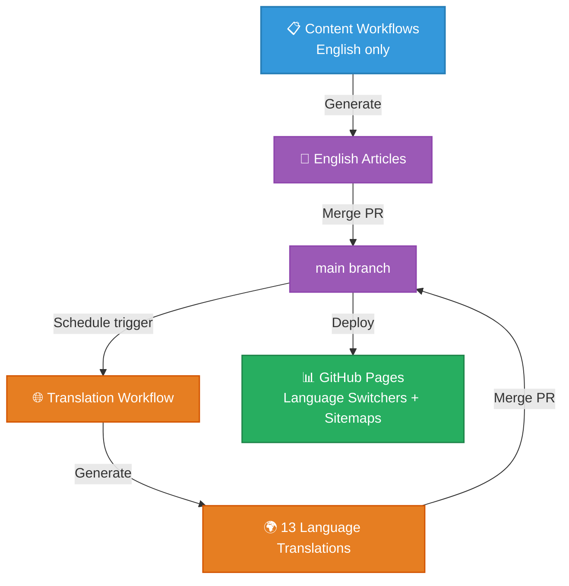
```mermaid
graph TD
    A[📋 Content Workflows<br/>English only] -->|Generate| B[📰 English Articles]
    B -->|Merge PR| C[main branch]
    C -->|Schedule trigger| D[🌐 Translation Workflow]
    D -->|Generate| E[🌍 13 Language Translations]
    E -->|Merge PR| C
    C -->|Deploy| F[📊 GitHub Pages<br/>Language Switchers + Sitemaps]

    classDef trigger fill:#3498db,stroke:#2980b9,stroke-width:2px,color:white
    classDef process fill:#9b59b6,stroke:#8e44ad,stroke-width:1.5px,color:white
    classDef deploy fill:#27ae60,stroke:#1e8449,stroke-width:1.5px,color:white
    classDef translation fill:#e67e22,stroke:#d35400,stroke-width:1.5px,color:white

    class A trigger
    class B,C process
    class D,E translation
    class F deploy
```

#### Content Workflow Schedule

| Workflow | Article Type | Schedule | Focus |
|----------|-------------|----------|-------|
| `news-committee-reports.md` | Committee reports | Mon–Fri 04:00 UTC | Committee activity analysis |
| `news-propositions.md` | Legislative procedures | Mon–Fri 05:00 UTC | Legislative pipeline tracking |
| `news-motions.md` | Plenary votes | Mon–Fri 06:00 UTC | Voting patterns & resolutions |
| `news-week-ahead.md` | Week ahead | Fri 07:00 UTC | Upcoming parliamentary agenda |
| `news-month-ahead.md` | Month ahead | 1st of month 08:00 UTC | Monthly strategic outlook |
| `news-weekly-review.md` | Weekly review | Sat 09:00 UTC | Week in review |
| `news-monthly-review.md` | Monthly review | 28th of month 10:00 UTC | Monthly retrospective |
| `news-breaking.md` | Breaking news | Every 6 hours | Real-time EP feed events |
| `news-article-generator.md` | Multi-type | Manual dispatch | On-demand article generation |

#### Translation Workflow

| Workflow | Schedule | Purpose |
|----------|----------|---------|
| `news-translate.md` | Mon–Fri 09/12/15 UTC, Sat 12 UTC, 1st+28th 12 UTC | Translate English articles to sv, da, no, fi, de, fr, es, nl, ar, he, ja, ko, zh |

#### Supported Languages (14 total)

| English (en) | Swedish (sv) | Danish (da) | Norwegian (no) | Finnish (fi) |
|:---:|:---:|:---:|:---:|:---:|
| **German (de)** | **French (fr)** | **Spanish (es)** | **Dutch (nl)** | **Arabic (ar)** |
| **Hebrew (he)** | **Japanese (ja)** | **Korean (ko)** | **Chinese (zh)** | |

#### Security Controls

| Control | Implementation | ISMS Reference |
|---------|----------------|----------------|
| **MCP Data Source** | European Parliament MCP Server (live data) | ISO 27001 A.14.2.1 |
| **Content Integrity** | Quality validation, synthetic ID detection | Data integrity |
| **Safe Outputs** | gh-aw safe-outputs for PR creation | Least privilege |
| **Concurrency** | Shared concurrency group prevents conflicts | Resource management |
| **Network Allowlist** | Explicit domain allowlisting via gh-aw | Network security |

#### Enhanced Analysis Features (v2)

The following 8 scheduled article-generation workflows have been upgraded with mandatory analytical enhancements: `news-week-ahead.md`, `news-month-ahead.md`, `news-breaking.md`, `news-committee-reports.md`, `news-propositions.md`, `news-motions.md`, `news-weekly-review.md`, `news-monthly-review.md`. The on-demand `news-article-generator.md` workflow is not included in this upgrade as it dispatches to the above workflows. The `news-translate.md` workflow has complementary analysis-fidelity requirements for preserving these elements in translation.

##### 🎭 Multi-Stakeholder Perspective Requirements

Every major parliamentary action must be analyzed from **at least 3 of 6 stakeholder perspectives**:

| Perspective | Analysis Focus |
|-------------|---------------|
| **EP Political Groups** | Coalition dynamics, group influence, voting alliances |
| **Civil Society & NGOs** | Citizens' rights, democratic participation, transparency |
| **Industry & Business** | Regulatory burden, market effects, compliance dynamics |
| **National Governments** | Subsidiarity, implementation requirements, national interests |
| **EU Citizens** | Direct life impact, rights, services, democratic representation |
| **EU Institutions** | Commission, Council, ECB, Court of Justice — inter-institutional dynamics |

Stakeholder perspective analysis is rendered by the TypeScript generator (`buildStakeholderPerspectivesSection`) as a card grid in each article's deep-analysis portion. Agents provide structured perspective content — impact direction (positive/negative/neutral/mixed), severity (high/medium/low), reasoning, and evidence backed by specific EP MCP data citations — and the generator handles the HTML markup (`analysis-stakeholder-perspectives` / `stakeholder-perspectives-grid`). Agents must NOT write raw HTML for this section. Impact and severity values must remain as canonical English enum tokens (e.g. `positive`, `high`) even in non-English articles — the generator handles localized display labels and CSS classing from these tokens. (Note: the separate winners/losers outcomes list uses `analysis-stakeholders` / `stakeholder-list` — that is a different section rendered by `buildStakeholderSection`.)

##### 🔄 Iterative AI Content Refinement Cycle

All analytical content sections follow a mandatory 4-pass refinement process:

| Pass | Activity | Output |
|------|----------|--------|
| **Pass 1 — Initial Assessment** | Gather MCP baseline data; identify actors, actions, outcomes | Draft narrative |
| **Pass 2 — Stakeholder Challenge** | Re-examine from each stakeholder angle; flag blind spots | Revised draft with gaps identified |
| **Pass 3 — Evidence Cross-Validation** | Verify claims against EP documents/votes; add 🟢/🟡/🔴 confidence indicators | Evidenced assertions only |
| **Pass 4 — Synthesis & Scenarios** | Produce balanced conclusions; provide 2–3 forward-looking scenarios with probability labels | Final publishable analysis |

> **Localization requirement**: All text labels — confidence (🟢 High / 🟡 Medium / 🔴 Low), probability (likely / possible / unlikely), and significance (High / Medium / Low) — must be rendered in the article's output language while preserving the underlying 3-level scale and keeping emoji markers (🟢/🟡/🔴, ↑↓→) unchanged. Non-English articles must use the equivalent terms in the target language, not English labels.

##### ✅ Enhanced Analysis Quality Gates

In addition to the existing content quality gates (500-word minimum, no synthetic IDs, current dates), all articles must pass **two new quality gate categories**:

**Analysis Depth Gates:**
- Minimum 3 stakeholder perspectives analyzed per key development
- SWOT dimensions cover both political AND economic/regulatory aspects
- Dashboard trend indicators included (↑↓→), not just current values
- Cross-domain policy links shown (e.g., environment ↔ trade ↔ social)
- Evidence chains cite specific document IDs, vote counts, or MCP data points
- Outlook provides at least 2 named scenarios with probability labels

**Political Intelligence Gates:**
- Coalition dynamics named explicitly (not just "EPP and S&D voted together")
- Each group's position explained with reasoning (incentives, ideology, constituency)
- Winner/loser analysis identified with supporting evidence
- Historical EP context referenced where comparable precedents exist

##### 📄 EP Document Analysis Framework

Every key EP document featured in the deep-analysis section must include structured analysis (other document references may remain as citations without full framework analysis):
1. **Political Context** — Why introduced? Who pushed it? What problem does it solve?
2. **Stakeholder Impact** — Who benefits/faces costs? Quantified where possible.
3. **Procedure Stage** — Where in the legislative pipeline? Next steps and timeline.
4. **Coalition Dynamics** — Which groups support/oppose? Key fault lines.
5. **Significance Rating** — High / Medium / Low with one-sentence justification. (Note: significance ratings use text labels, not color indicators, to avoid confusion with the 🟢/🟡/🔴 confidence scale used in the refinement cycle.)

##### 🔬 Workflow-Specific Intelligence Modules

Each scheduled content workflow includes a tailored intelligence module beyond the shared framework:

| Workflow | Module | Focus |
|----------|--------|-------|
| `news-week-ahead.md` | 🔭 Strategic Preview Analysis | What to watch, coalitions under stress, legislative inflection points, geopolitical triggers |
| `news-month-ahead.md` | 📈 Long-Term Trend Context | Term trajectory, policy momentum, coalition evolution, EU external context |
| `news-breaking.md` | ⚡ Rapid Stakeholder Impact Assessment | Immediate winners/losers, market/policy signals, next 24–48 hour tracking |
| `news-committee-reports.md` | 🏛️ Committee Power Dynamics Analysis | Rapporteur influence, shadow rapporteur positions, amendment landscape, trilogue implications |
| `news-propositions.md` | 🗓️ Legislative Pipeline Intelligence | Passage probability, amendment expectations, timeline forecast, blocking coalitions |
| `news-motions.md` | 🗳️ Voting Pattern Intelligence | Coalition map, abstention analysis, cross-party defections, margin analysis |
| `news-weekly-review.md` | 📊 Week-in-Context Analysis | Parliamentary landscape shift, promises vs. delivery, surprise developments |
| `news-monthly-review.md` | 🗺️ Monthly Trend Synthesis | Legislative productivity, coalition stability index, policy trajectory, emerging themes |

The translation workflow has its own fidelity module:

| Workflow | Module | Focus |
|----------|--------|-------|
| `news-translate.md` | 🌐 Analysis Fidelity Requirements | Stakeholder framing preservation, confidence indicator translation, EP official terminology |

---

**📄 File:** `.github/workflows/test-and-report.yml`  
**🎯 Purpose:** Comprehensive testing with unit tests, integration tests, coverage reporting, and performance benchmarks  
**⏰ Trigger:** On push to main, on PR to main  
**📊 Status:** [](https://github.com/Hack23/euparliamentmonitor/actions/workflows/test-and-report.yml)

#### Test Coverage

| Test Type | Framework | Coverage Target | Current Status |
|-----------|-----------|----------------|----------------|
| **Unit Tests** | Vitest | 169 tests | ✅ 169/169 passing |
| **Integration Tests** | Vitest | N/A | ✅ All passing |
| **Line Coverage** | Vitest (V8) | ≥80% | ✅ 82%+ |
| **Branch Coverage** | Vitest (V8) | ≥75% | ✅ 83%+ |
| **Function Coverage** | Vitest (V8) | ≥80% | ✅ 89%+ |

#### Workflow Jobs (6 Jobs)

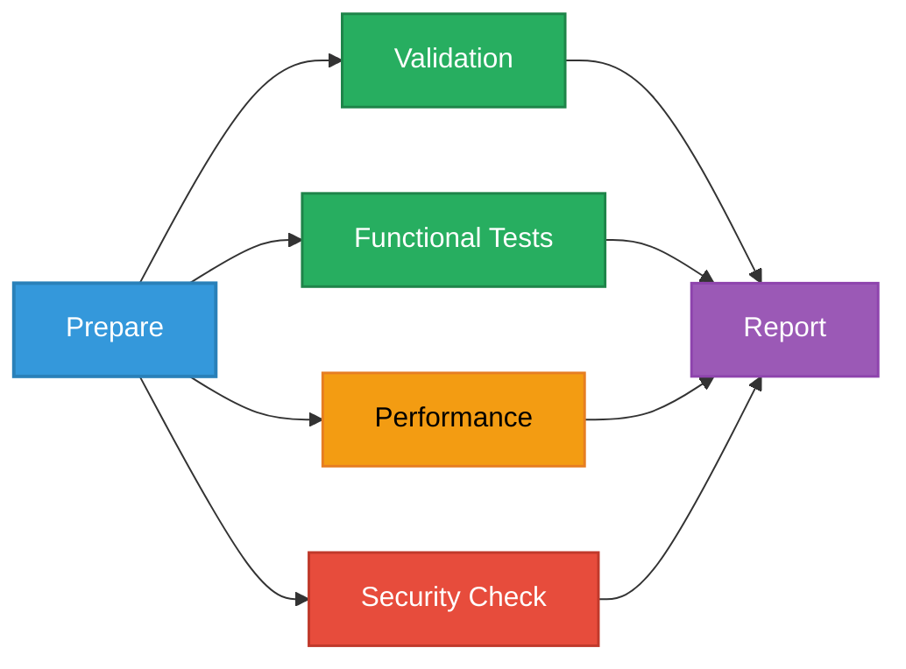
```mermaid
graph LR
    A[Prepare] --> B[Validation]
    A --> C[Functional Tests]
    A --> D[Performance]
    A --> E[Security Check]
    B --> F[Report]
    C --> F
    D --> F
    E --> F

    classDef prepare fill:#3498db,stroke:#2980b9,stroke-width:2px,color:white
    classDef test fill:#27ae60,stroke:#1e8449,stroke-width:1.5px,color:white
    classDef security fill:#e74c3c,stroke:#c0392b,stroke-width:1.5px,color:white
    classDef perf fill:#f39c12,stroke:#e67e22,stroke-width:1.5px,color:black
    classDef report fill:#9b59b6,stroke:#8e44ad,stroke-width:1.5px,color:white

    class A prepare
    class B,C test
    class D perf
    class E security
    class F report
```

| Job | Name | Purpose | Key Steps |
|-----|------|---------|-----------|
| `prepare` | Prepare Environment | Cache dependencies, setup Node.js 25 | Checkout, npm ci, cache |
| `validation` | Validate Code | ESLint, Prettier, HTMLHint, npm audit | Lint, format check, HTML validation |
| `functional-tests` | Functional Tests | Vitest unit + integration tests | Run tests, coverage report |
| `performance` | Performance Testing | Lighthouse CI + article generation benchmarks | `@lhci/cli@0.15.1`, performance metrics |
| `security-check` | Security Check | npm audit analysis | Vulnerability triage, CodeQL integration |
| `report` | Generate Report | Aggregate results, PR comments | Coverage summary, status checks |

#### Security Controls

| Control | Implementation | ISMS Reference |
|---------|----------------|----------------|
| **Code Quality** | ESLint + Prettier | Code quality standards |
| **Vulnerability Scanning** | npm audit | ISO 27001 A.12.6.1 |
| **Coverage Thresholds** | 80%+ lines, 75%+ branches | Quality gates |
| **Performance Benchmarks** | Lighthouse CI scoring | Performance validation |
| **False Positive Handling** | Intelligent npm audit triage | Risk acceptance process |

#### ISMS Evidence

- **Policy:** [Secure Development Policy §3.3 - Testing Requirements](https://github.com/Hack23/ISMS-PUBLIC/blob/main/Secure_Development_Policy.md#33-testing-requirements)
- **Workflow:** [test-and-report.yml](.github/workflows/test-and-report.yml)
- **Coverage Report:** [Live Coverage](https://hack23.github.io/euparliamentmonitor/docs/coverage/)

---

### 3. CodeQL Security Scanning

**📄 File:** `.github/workflows/codeql.yml`  
**🎯 Purpose:** Static Application Security Testing (SAST) for JavaScript/TypeScript and GitHub Actions  
**⏰ Schedule:** On push to main, on PR to main, weekly Saturday 21:33 UTC  
**📊 Status:** [](https://github.com/Hack23/euparliamentmonitor/actions/workflows/codeql.yml)

#### Security Analysis

| Parameter | Value |
|-----------|-------|
| **Languages** | `javascript-typescript`, `actions` |
| **Build Mode** | `none` (interpreted languages) |
| **Query Suite** | Security Extended |
| **Analysis Type** | Source code + dependencies |

**Vulnerability Types Detected:**
- SQL Injection
- XSS (Cross-Site Scripting)
- Path Traversal
- Command Injection
- Unsafe Deserialization
- GitHub Actions expression injection

#### Security Controls

| Control | Implementation | ISMS Reference |
|---------|----------------|----------------|
| **SAST Scanning** | CodeQL security-extended (JS/TS + Actions) | ISO 27001 A.14.2.5 |
| **Automated Analysis** | On every PR + push | Shift-left security |
| **SHA-Pinned Actions** | All actions pinned to SHA | Supply chain security |
| **Security Alerts** | GitHub Security tab integration | Incident response |

#### ISMS Evidence

- **Policy:** [Secure Development Policy §4.3 - Security Scanning](https://github.com/Hack23/ISMS-PUBLIC/blob/main/Secure_Development_Policy.md#43-security-scanning)
- **Workflow:** [codeql.yml](.github/workflows/codeql.yml)
- **Security Architecture:** [SECURITY_ARCHITECTURE.md §CodeQL Analysis](SECURITY_ARCHITECTURE.md)

---

### 4. E2E Testing Workflow

**📄 File:** `.github/workflows/e2e.yml`  
**🎯 Purpose:** End-to-end testing with Playwright across browsers  
**⏰ Schedule:** On push to main, on PR to main, daily at midnight UTC  
**📊 Status:** [](https://github.com/Hack23/euparliamentmonitor/actions/workflows/e2e.yml)

#### Test Coverage

- **Browser:** Chromium (optimised for speed)
- **Timeout:** 60 minutes
- **Test Categories:**
  - Homepage validation
  - Accessibility (axe-core integration)
  - Responsive design
  - Multi-language support (14 languages)
- **Artifacts:** Screenshots, videos, HTML reports

#### Security Controls

| Control | Implementation | ISMS Reference |
|---------|----------------|----------------|
| **Accessibility Testing** | axe-core WCAG AA compliance | Inclusive security |
| **Visual Regression** | Screenshot comparison | Quality assurance |
| **Functional Validation** | User workflow testing | Requirements validation |
| **Daily Regression** | Scheduled midnight UTC | Continuous validation |

#### ISMS Evidence

- **Workflow:** [e2e.yml](.github/workflows/e2e.yml)
- **Test Reports:** [Live E2E Report](https://hack23.github.io/euparliamentmonitor/playwright-report/)

---

### 5. Release Workflow

**📄 File:** `.github/workflows/release.yml`  
**🎯 Purpose:** Comprehensive release automation with attestations and documentation  
**⏰ Trigger:** Manual dispatch (with version input) or tag push (`v*`)  
**📊 Status:** [](https://github.com/Hack23/euparliamentmonitor/actions/workflows/release.yml)

#### Release Pipeline

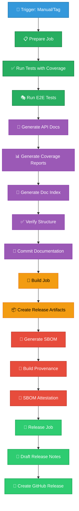
```mermaid
graph TD
    A[🚀 Trigger: Manual/Tag] --> B[📋 Prepare Job]
    B --> C[✅ Run Tests with Coverage]
    C --> D[🎭 Run E2E Tests]
    D --> E[📖 Generate API Docs]
    E --> F[📊 Generate Coverage Reports]
    F --> G[🎨 Generate Doc Index]
    G --> H[✅ Verify Structure]
    H --> I[💾 Commit Documentation]
    I --> J[🔨 Build Job]
    J --> K[📦 Create Release Artifacts]
    K --> L[🔐 Generate SBOM]
    L --> M[📜 Build Provenance]
    M --> N[🔏 SBOM Attestation]
    N --> O[🚀 Release Job]
    O --> P[📝 Draft Release Notes]
    P --> Q[🎉 Create GitHub Release]

    classDef trigger fill:#3498db,stroke:#2980b9,stroke-width:2px,color:white
    classDef test fill:#27ae60,stroke:#1e8449,stroke-width:1.5px,color:white
    classDef docs fill:#9b59b6,stroke:#8e44ad,stroke-width:1.5px,color:white
    classDef build fill:#f39c12,stroke:#e67e22,stroke-width:1.5px,color:black
    classDef security fill:#e74c3c,stroke:#c0392b,stroke-width:1.5px,color:white
    classDef release fill:#2ecc71,stroke:#27ae60,stroke-width:2px,color:white

    class A trigger
    class B,C,D test
    class E,F,G,H,I docs
    class J,K build
    class L,M,N security
    class O,P,Q release
```

#### Release Jobs

| Job | Name | Key Permissions |
|-----|------|----------------|
| `prepare` | Prepare Release | `contents: write` |
| `build` | Build Release Package | `contents: read`, `id-token: write`, `attestations: write` |
| `release` | Create Release | `contents: write`, `id-token: write` |

#### Documentation as Code

Every release automatically generates:

| Documentation | Generator | Output |
|--------------|-----------|--------|
| **API Documentation** | JSDoc | 52 files, searchable |
| **Test Coverage** | Vitest HTML | Interactive reports |
| **E2E Test Reports** | Playwright | Screenshots, videos |
| **Documentation Index** | Custom script | Beautiful hub page |

#### Security Controls

| Control | Implementation | ISMS Reference |
|---------|----------------|----------------|
| **SLSA Level 3** | Build provenance attestation | Supply chain security |
| **SBOM Generation** | SPDX JSON format | NTIA SBOM minimum elements |
| **Artifact Signing** | GitHub Attestations API | Integrity verification |
| **Documentation Audit Trail** | Committed to main branch | Evidence trail |
| **Test Validation** | 169 unit tests + E2E | Quality gates |

#### ISMS Evidence

- **Policy:** [Secure Development Policy §3.2 - Architecture Documentation](https://github.com/Hack23/ISMS-PUBLIC/blob/main/Secure_Development_Policy.md#32-architecture-documentation)
- **Workflow:** [release.yml](.github/workflows/release.yml)
- **Release Guide:** [docs/RELEASE_PROCESS.md](docs/RELEASE_PROCESS.md)
- **Attestations:** [GitHub Attestations](https://github.com/Hack23/euparliamentmonitor/attestations)
- **Documentation:** [docs/index.html](https://hack23.github.io/euparliamentmonitor/docs/)

---

### 6. Dependency Review Workflow

**📄 File:** `.github/workflows/dependency-review.yml`  
**🎯 Purpose:** Supply chain security scanning for pull requests  
**⏰ Trigger:** On pull request  
**📊 Status:** Dependency review enabled

#### Security Controls

| Control | Implementation | ISMS Reference |
|---------|----------------|----------------|
| **License Compliance** | Allowed licenses only | Legal compliance |
| **Vulnerability Detection** | Known CVEs blocked | ISO 27001 A.12.6.1 |
| **Supply Chain Security** | Dependency graph analysis | NIST CSF ID.SC |

#### ISMS Evidence

- **Policy:** [Supply Chain Security](https://github.com/Hack23/ISMS-PUBLIC/blob/main/Secure_Development_Policy.md#44-supply-chain-security)
- **Workflow:** [dependency-review.yml](.github/workflows/dependency-review.yml)

---

### 7. OpenSSF Scorecard Workflow

**📄 File:** `.github/workflows/scorecards.yml`  
**🎯 Purpose:** Security posture assessment against OpenSSF best practices  
**⏰ Schedule:** Weekly on Tuesday 07:20 UTC, push to main, branch protection rule  
**📊 Status:** [](https://scorecard.dev/viewer/?uri=github.com/Hack23/euparliamentmonitor)

#### Assessed Security Practices

- Binary artifacts
- Branch protection
- CI tests
- Code review
- Dangerous workflows
- Dependency update tool
- Fuzzing
- License
- Maintained
- Pinned dependencies
- SAST
- Security policy
- Signed releases
- Token permissions
- Vulnerabilities

#### ISMS Evidence

- **Workflow:** [scorecards.yml](.github/workflows/scorecards.yml)
- **Live Score:** [View Scorecard](https://scorecard.dev/viewer/?uri=github.com/Hack23/euparliamentmonitor)

---

### 8. Deploy S3 Workflow

**📄 File:** `.github/workflows/deploy-s3.yml`  
**🎯 Purpose:** Production deployment to AWS S3 + CloudFront  
**⏰ Trigger:** Push to main  
**📊 Status:** Production deployment

#### Deployment Pipeline


```mermaid
graph LR
    A[Push to main] --> B[Checkout Code]
    B --> C[🔒 Harden Runner<br/>egress: BLOCK]
    C --> D[Configure AWS OIDC]
    D --> E[Sync to S3]
    E --> F[Invalidate CloudFront]
    F --> G[✅ Production Live]

    classDef trigger fill:#3498db,stroke:#2980b9,stroke-width:2px,color:white
    classDef security fill:#e74c3c,stroke:#c0392b,stroke-width:1.5px,color:white
    classDef aws fill:#FF9900,stroke:#232F3E,stroke-width:1.5px,color:white
    classDef complete fill:#27ae60,stroke:#1e8449,stroke-width:2px,color:white

    class A trigger
    class B,C security
    class D,E,F aws
    class G complete
```

> **Note:** `deploy-s3.yml` is the **only workflow** using `egress-policy: block` (all other workflows use `audit`). Outbound network calls are restricted to an explicit allowlist defined in the `allowed-endpoints` parameter of the Harden Runner step within [deploy-s3.yml](.github/workflows/deploy-s3.yml).

#### Security Controls

| Control | Implementation | ISMS Reference |
|---------|----------------|----------------|
| **OIDC Federation** | `aws-actions/configure-aws-credentials` with role ARN | No long-lived secrets |
| **Egress Block Mode** | Harden Runner blocks all non-allowlisted endpoints | Network security |
| **IAM Least Privilege** | Minimal S3 + CloudFront permissions | AWS security best practices |
| **HTTPS Only** | CloudFront SSL/TLS distribution | Data in transit protection |
| **Infrastructure as Code** | GitHub Actions workflow | Reproducible deployments |

#### ISMS Evidence

- **Workflow:** [deploy-s3.yml](.github/workflows/deploy-s3.yml)
- **Architecture:** [SECURITY_ARCHITECTURE.md §Deployment](SECURITY_ARCHITECTURE.md)

---

### 9. REUSE Compliance Workflow

**📄 File:** `.github/workflows/reuse.yml`  
**🎯 Purpose:** License and copyright compliance verification using the [REUSE Specification](https://reuse.software/spec/)  
**⏰ Schedule:** On push to main, on PR to main, weekly Monday 06:00 UTC  
**📊 Status:** [](https://github.com/Hack23/euparliamentmonitor/actions/workflows/reuse.yml)

#### License Compliance Scope

| Artifact | License | SPDX Header Required |
|----------|---------|----------------------|
| **Source scripts** (`scripts/`) | Apache-2.0 | ✅ Yes |
| **Test files** (`test/`, `e2e/`) | Apache-2.0 | ✅ Yes |
| **HTML pages** (`index-*.html`) | Apache-2.0 | ✅ Yes |
| **Workflow files** (`.github/workflows/`) | Apache-2.0 | ✅ Yes |
| **Binary assets** | Declared in `REUSE.toml` | Via manifest |

#### Security Controls

| Control | Implementation | ISMS Reference |
|---------|----------------|----------------|
| **License Verification** | SPDX header validation on every file | Open Source Policy |
| **Copyright Compliance** | Per-file copyright tracking | IP management |
| **Supply Chain Clarity** | Machine-readable `REUSE.toml` | NIST CSF ID.SC-4 |
| **SHA-Pinned Action** | `fsfe/reuse-action` pinned to SHA | Supply chain security |

#### ISMS Evidence

- **Policy:** [Open Source Policy](https://github.com/Hack23/ISMS-PUBLIC/blob/main/Open_Source_Policy.md)
- **Workflow:** [reuse.yml](.github/workflows/reuse.yml)
- **Configuration:** [REUSE.toml](REUSE.toml)

---

### 10. SLSA Provenance (Integrated in Release Workflow)

**📄 File:** `.github/workflows/release.yml`  
**🎯 Purpose:** Generate cryptographic build provenance for supply chain integrity verification  
**⏰ Trigger:** On tag push (v*) + manual dispatch with version input  
**📊 Status:** [](https://github.com/Hack23/euparliamentmonitor/actions/workflows/release.yml)

#### Provenance Generation Pipeline

SLSA Level 3 provenance is generated as part of the release workflow build job. All attestations and SBOM are
created during the build step and attached to the immutable GitHub Release in a single atomic operation.

#### Attestation Artifacts

| Artifact | Action | Verification Command |
|----------|--------|----------------------|
| **Build Provenance** | `actions/attest-build-provenance` (SHA-pinned) | `gh attestation verify --owner Hack23 <file>` |
| **SBOM (SPDX)** | `anchore/sbom-action` + `actions/attest` (SHA-pinned) | `gh attestation verify --owner Hack23 <file>` |
| **Distribution Archive** | `.zip` with excluded dev files | SHA-256 checksum |
| **SBOM JSON** | SPDX format | License compliance check |

#### Security Controls

| Control | Implementation | ISMS Reference |
|---------|----------------|----------------|
| **OIDC Keyless Signing** | `id-token: write` + GitHub Sigstore | SLSA Level 3 |
| **Immutable Release** | `immutableCreate: true` — single-write release | Integrity |
| **Minimal Permissions** | `permissions: read-all` top-level | Least privilege |
| **Harden Runner** | egress audit on all outbound calls | Network security |

#### ISMS Evidence

- **Policy:** [Secure Development Policy §4.4](https://github.com/Hack23/ISMS-PUBLIC/blob/main/Secure_Development_Policy.md#44-supply-chain-security)
- **Workflow:** [release.yml](.github/workflows/release.yml)
- **Attestations:** [GitHub Attestations](https://github.com/Hack23/euparliamentmonitor/attestations)

---

### 11. Compile Agentic Workflows

**📄 File:** `.github/workflows/compile-agentic-workflows.yml`  
**🎯 Purpose:** Compile agentic workflow markdown source files (`.md`) into executable lock files (`.lock.yml`) using the `gh-aw` CLI  
**⏰ Trigger:** Manual dispatch only (`workflow_dispatch`)  
**📊 Status:** [](https://github.com/Hack23/euparliamentmonitor/actions/workflows/compile-agentic-workflows.yml)

#### Compilation Pipeline


```mermaid
graph LR
    A[Manual Trigger] --> B[Checkout Repository]
    B --> C[Install gh-aw CLI]
    C --> D[Compile .md → .lock.yml]
    D --> E[Commit & Push Lock Files]

    classDef trigger fill:#3498db,stroke:#2980b9,stroke-width:2px,color:white
    classDef process fill:#9b59b6,stroke:#8e44ad,stroke-width:1.5px,color:white
    classDef output fill:#27ae60,stroke:#1e8449,stroke-width:1.5px,color:white

    class A trigger
    class B,C,D process
    class E output
```

#### Security Controls

| Control | Implementation | ISMS Reference |
|---------|----------------|----------------|
| **Manual Trigger Only** | `workflow_dispatch` — no automatic runs | Change control |
| **Token Fallback** | `COPILOT_MCP_GITHUB_PERSONAL_ACCESS_TOKEN` with `GITHUB_TOKEN` fallback | Credential management |
| **Write Permissions** | `contents: write`, `pull-requests: write`, `actions: write`, `issues: write` | Least privilege for compilation |

---

### 12. Pull Request Automatic Labeler

**📄 File:** `.github/workflows/labeler.yml`  
**🎯 Purpose:** Automatically label pull requests based on file paths and content  
**⏰ Trigger:** `pull_request_target` (opened, synchronize, reopened, edited)

#### Security Controls

| Control | Implementation | ISMS Reference |
|---------|----------------|----------------|
| **Minimal Job Permissions** | `contents: read`, `pull-requests: write`, `issues: read` | Least privilege |
| **Target Event** | `pull_request_target` — runs on base branch code | Workflow security |

---

### 13. Setup Repository Labels

**📄 File:** `.github/workflows/setup-labels.yml`  
**🎯 Purpose:** Create and manage repository labels for issue/PR governance  
**⏰ Trigger:** Manual dispatch only (`workflow_dispatch` with `recreate_all` input)

#### Security Controls

| Control | Implementation | ISMS Reference |
|---------|----------------|----------------|
| **Manual Trigger Only** | `workflow_dispatch` — deliberate action required | Change control |
| **Minimal Permissions** | `contents: read`, `issues: write` | Least privilege |

---

### 14. Copilot Setup Steps

**📄 File:** `.github/workflows/copilot-setup-steps.yml`  
**🎯 Purpose:** Set up the development environment for GitHub Copilot coding agents  
**⏰ Trigger:** Push/PR to `copilot-setup-steps.yml` file + manual dispatch

#### Environment Setup

| Component | Version / Configuration |
|-----------|------------------------|
| **Node.js** | 25 |
| **EP MCP Server** | `european-parliament-mcp-server` (global) |
| **Playwright Browsers** | Installed for E2E |
| **Virtual Display** | Xvfb (`:99`) |

#### Security Controls

| Control | Implementation | ISMS Reference |
|---------|----------------|----------------|
| **Broad Read Permissions** | Multiple read scopes for agent access | Copilot agent requirement |
| **Write Limited** | Only `pull-requests: write`, `issues: write` | Least privilege for agents |
| **Token Management** | `COPILOT_MCP_GITHUB_PERSONAL_ACCESS_TOKEN` | Credential management |

---

## 📊 Workflow Metrics

### Execution Statistics

| Metric | Target | Current | Status |
|--------|--------|---------|--------|
| **Test Success Rate** | ≥95% | 100% | ✅ Excellent |
| **Test Execution Time** | <10 min | ~3 min | ✅ Excellent |
| **Release Frequency** | As needed | Manual | ✅ On-demand |
| **Mean Time to Deploy** | <1 hour | ~15 min | ✅ Excellent |
| **Failed Deployment Rate** | <5% | 0% | ✅ Perfect |

### Security Metrics

| Metric | Target | Current | Status |
|--------|--------|---------|--------|
| **Critical Vulnerabilities** | 0 | 0 | ✅ Secure |
| **High Vulnerabilities** | 0 | 0 | ✅ Secure |
| **Code Coverage** | ≥80% | 82%+ | ✅ Above target |
| **SHA-Pinned Actions** | 100% | 100% | ✅ Complete |
| **OpenSSF Score** | ≥8.0 | TBD | 🔄 Monitoring |

---

## 🔐 Security Hardening Practices

EU Parliament Monitor implements industry best practices for securing CI/CD pipelines, with StepSecurity hardening for all workflows:

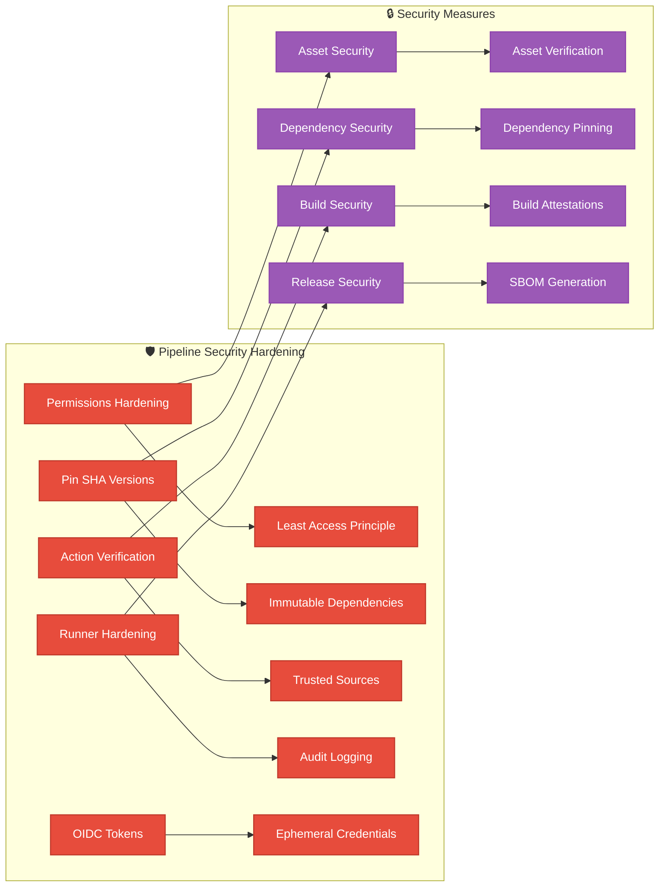
```mermaid
flowchart LR
    subgraph "🛡️ Pipeline Security Hardening"
        PH[Permissions Hardening] --> LAP[Least Access Principle]
        PS[Pin SHA Versions] --> IDT[Immutable Dependencies]
        AV[Action Verification] --> TS[Trusted Sources]
        RH[Runner Hardening] --> AL[Audit Logging]
        OT[OIDC Tokens] --> EF[Ephemeral Credentials]
    end

    subgraph "🔒 Security Measures"
        AS[Asset Security] --> AC[Asset Verification]
        DS[Dependency Security] --> PD[Dependency Pinning]
        BS[Build Security] --> BA[Build Attestations]
        RS[Release Security] --> SBOM[SBOM Generation]
    end

    PH --> AS
    PS --> DS
    AV --> BS
    RH --> RS

    classDef practice fill:#e74c3c,stroke:#c0392b,stroke-width:1.5px,color:white
    classDef measures fill:#9b59b6,stroke:#8e44ad,stroke-width:1.5px,color:white

    class PH,PS,AV,RH,OT practice
    class LAP,IDT,TS,AL,EF practice
    class AS,DS,BS,RS measures
    class AC,PD,BA,SBOM measures
```

### Specific Hardening Measures

Every workflow in the EU Parliament Monitor project implements:

1. **🔒 Permissions Restriction**: Explicit least-privilege permissions with `read-all` or empty `{}` top-level
2. **📌 SHA Pinning**: 100% of actions pinned to specific SHA hashes — zero tag references
3. **🛡️ Runner Hardening**: StepSecurity `harden-runner@58077d3c7e43986b6b15fba718e8ea69e387dfcc` for audit logging
4. **📄 SBOM Generation**: Software Bill of Materials in SPDX format via `anchore/sbom-action`
5. **🔏 Build Attestations**: SLSA Level 3 provenance via `actions/attest-build-provenance`
6. **⏱️ Timeout Limits**: All workflows use explicit `timeout-minutes` to prevent resource exhaustion
7. **🔑 OIDC Tokens**: AWS deployment uses OIDC federation — no long-lived secrets
8. **🚫 Egress Control**: Deploy workflows use `harden-runner` with `egress-policy: block`

---

## 🛡️ Workflow Security Architecture

### Workflow Permissions Matrix

Every workflow declares explicit, minimal permissions following the principle of least privilege. Some workflows use top-level `permissions: read-all` with job-level write overrides where needed, while others define more restrictive explicit top-level scopes tailored to their tasks.

| Workflow | Top-Level | Job-Level Overrides | Secrets Used |
|----------|-----------|---------------------|--------------|
| **codeql** | `contents: read` | analyze: `security-events: write`, `packages: read`, `actions: read` | None |
| **compile-agentic-workflows** | `contents: write`, `pull-requests: write`, `actions: write`, `issues: write` | — | `COPILOT_MCP_GITHUB_PERSONAL_ACCESS_TOKEN` |
| **copilot-setup-steps** | `contents: read`, `actions: read`, `attestations: read`, `checks: read`, `issues: write`, `models: read`, `discussions: read`, `pages: read`, `pull-requests: write`, `security-events: read`, `statuses: read` | — | `COPILOT_MCP_GITHUB_PERSONAL_ACCESS_TOKEN` |
| **dependency-review** | `contents: read` | — | None |
| **deploy-s3** | `contents: read`, `id-token: write`, `actions: write` | — | AWS OIDC role |
| **e2e** | `contents: read` | e2e-tests: `contents: read` | None |
| **labeler** | `read-all` | labeler: `contents: read`, `pull-requests: write`, `issues: read` | `GITHUB_TOKEN` |
| **release** | `read-all` | prepare: `contents: write`; build: `contents: read`, `id-token: write`, `attestations: write`; release: `contents: write`, `id-token: write` | `GITHUB_TOKEN` |
| **reuse** | `contents: read` | — | None |
| **scorecards** | `read-all` | analysis: `security-events: write`, `id-token: write`, `contents: read`, `actions: read`, `issues: read`, `pull-requests: read`, `checks: read` | None |
| **setup-labels** | `contents: read`, `issues: write` | — | `GITHUB_TOKEN` |
| **test-and-report** | `read-all` | validation: `contents: read`, `pull-requests: write`; functional-tests: `contents: read`; performance: `contents: read`; security-check: `contents: read`, `security-events: write`; report: `contents: read`, `pull-requests: write` | None |
| **news-\* (agentic ×9)** | `{}` (empty) | activation: `contents: read`; agent: `contents: write`, `pull-requests: write`, `issues: write`, `models: read` | `GITHUB_TOKEN` |

### Security Control Layers

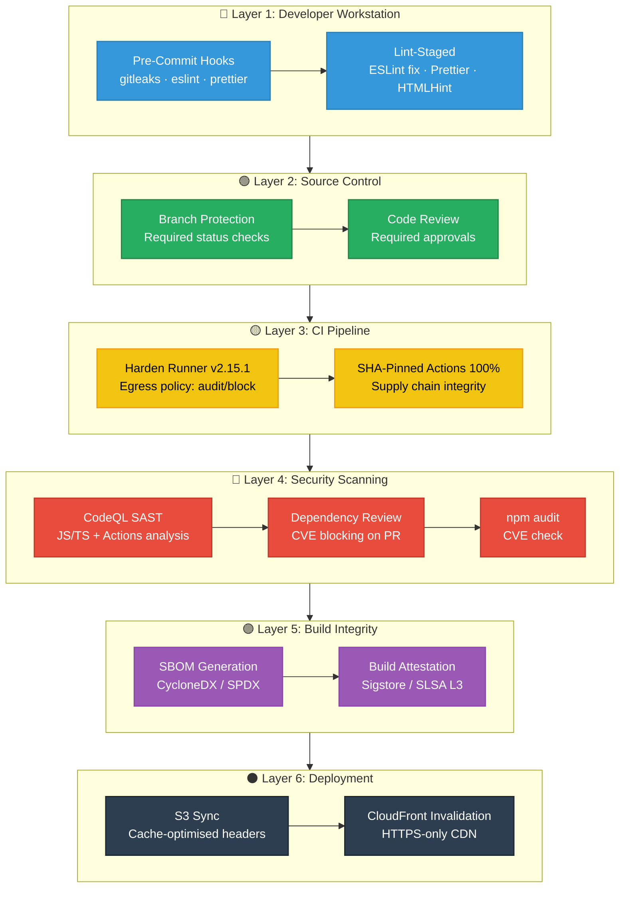
```mermaid
graph TD
    subgraph Layer1["🔵 Layer 1: Developer Workstation"]
        PC[Pre-Commit Hooks<br/>gitleaks · eslint · prettier]
        LS[Lint-Staged<br/>ESLint fix · Prettier · HTMLHint]
        PC --> LS
    end

    subgraph Layer2["🟢 Layer 2: Source Control"]
        BP[Branch Protection<br/>Required status checks]
        CR[Code Review<br/>Required approvals]
        BP --> CR
    end

    subgraph Layer3["🟡 Layer 3: CI Pipeline"]
        HR[Harden Runner v2.15.1<br/>Egress policy: audit/block]
        ST[SHA-Pinned Actions 100%<br/>Supply chain integrity]
        HR --> ST
    end

    subgraph Layer4["🔴 Layer 4: Security Scanning"]
        CQL[CodeQL SAST<br/>JS/TS + Actions analysis]
        DR[Dependency Review<br/>CVE blocking on PR]
        NA[npm audit<br/>CVE check]
        CQL --> DR --> NA
    end

    subgraph Layer5["🟣 Layer 5: Build Integrity"]
        SB[SBOM Generation<br/>CycloneDX / SPDX]
        AT[Build Attestation<br/>Sigstore / SLSA L3]
        SB --> AT
    end

    subgraph Layer6["⚫ Layer 6: Deployment"]
        S3[S3 Sync<br/>Cache-optimised headers]
        CF[CloudFront Invalidation<br/>HTTPS-only CDN]
        S3 --> CF
    end

    Layer1 --> Layer2 --> Layer3 --> Layer4 --> Layer5 --> Layer6

    classDef layer1 fill:#3498db,stroke:#2980b9,stroke-width:1.5px,color:white
    classDef layer2 fill:#27ae60,stroke:#1e8449,stroke-width:1.5px,color:white
    classDef layer3 fill:#f1c40f,stroke:#f39c12,stroke-width:1.5px,color:black
    classDef layer4 fill:#e74c3c,stroke:#c0392b,stroke-width:1.5px,color:white
    classDef layer5 fill:#9b59b6,stroke:#8e44ad,stroke-width:1.5px,color:white
    classDef layer6 fill:#2c3e50,stroke:#1a252f,stroke-width:1.5px,color:white

    class PC,LS layer1
    class BP,CR layer2
    class HR,ST layer3
    class CQL,DR,NA layer4
    class SB,AT layer5
    class S3,CF layer6
```

---

## 🪝 Pre-Commit Security Controls

The project employs two complementary pre-commit enforcement mechanisms: **Husky** (Node.js native) and **pre-commit** framework.

### Husky + lint-staged

**Configuration:** `.husky/pre-commit` → runs `npx lint-staged`

| File Pattern | Commands | Purpose |
|--------------|----------|---------|
| `scripts/**/*.js` | `eslint --fix`, `prettier --write` | JS quality + formatting |
| `*.md` | `prettier --write` | Documentation formatting |
| `*.html` | `htmlhint` | HTML validation |

### Pre-Commit Framework

**Configuration:** `.pre-commit-config.yaml`

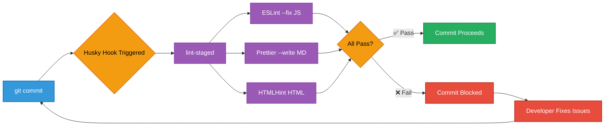
```mermaid
graph LR
    A[git commit] --> B{Husky Hook Triggered}
    B --> C[lint-staged]
    C --> D[ESLint --fix JS]
    C --> E[Prettier --write MD]
    C --> F[HTMLHint HTML]
    D --> G{All Pass?}
    E --> G
    F --> G
    G -->|✅ Pass| H[Commit Proceeds]
    G -->|❌ Fail| I[Commit Blocked]
    I --> J[Developer Fixes Issues]
    J --> A

    classDef trigger fill:#3498db,stroke:#2980b9,stroke-width:2px,color:white
    classDef decision fill:#f39c12,stroke:#e67e22,stroke-width:2px,color:black
    classDef lint fill:#9b59b6,stroke:#8e44ad,stroke-width:1.5px,color:white
    classDef pass fill:#27ae60,stroke:#1e8449,stroke-width:1.5px,color:white
    classDef fail fill:#e74c3c,stroke:#c0392b,stroke-width:2px,color:white

    class A trigger
    class B,G decision
    class C,D,E,F lint
    class H pass
    class I,J fail
```

| Hook | Version | Purpose | Security Value |
|------|---------|---------|----------------|
| **gitleaks** | v8.16.3 | Secret scanning | Prevent credential exposure |
| **mirrors-eslint** | v8.38.0 | JS linting | Code quality enforcement |
| **end-of-file-fixer** | pre-commit v4.4.0 | File termination | Consistency |
| **trailing-whitespace** | pre-commit v4.4.0 | Whitespace cleanup | Consistency |

**Security Value:** gitleaks scans for hardcoded secrets (API keys, tokens, passwords) before any commit reaches the remote repository, providing first-line credential leak prevention aligned with [Cryptography Policy](https://github.com/Hack23/ISMS-PUBLIC/blob/main/Cryptography_Policy.md).

---

## 🏆 SLSA Level 3 Compliance

Supply-chain Levels for Software Artifacts (SLSA) Level 3 compliance is achieved through GitHub's native attestation infrastructure integrated into the release and SLSA provenance workflows.

### SLSA Requirements Matrix

| SLSA L3 Requirement | Implementation | Workflow |
|---------------------|----------------|---------|
| **Source — Version controlled** | Git + GitHub branch protection | All |
| **Source — Verified history** | Protected `main` branch | All |
| **Build — Scripted build** | `npm ci` + reproducible steps | release.yml |
| **Build — Build service** | GitHub Actions managed runners | All |
| **Build — Non-falsifiable provenance** | GitHub Sigstore / OIDC keyless | release.yml |
| **Build — Isolated** | GitHub-hosted Ubuntu runners | All |
| **Provenance — Available** | `.intoto.jsonl` attached to release | release.yml |
| **Provenance — Authenticated** | OIDC `id-token: write` | release.yml |
| **Provenance — Service generated** | `actions/attest-build-provenance` | release.yml |
| **Provenance — Non-falsifiable** | Sigstore transparency log | release.yml |

### Build Provenance Flow

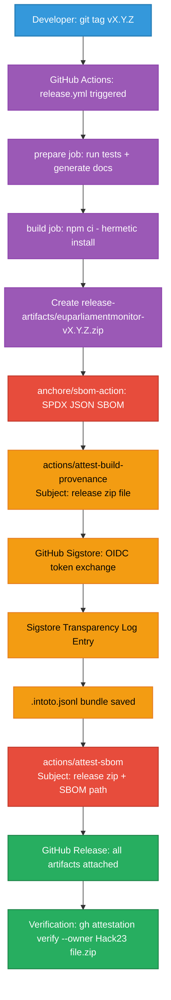
```mermaid
graph TD
    A[Developer: git tag vX.Y.Z] --> B[GitHub Actions: release.yml triggered]
    B --> C[prepare job: run tests + generate docs]
    C --> D[build job: npm ci - hermetic install]
    D --> E[Create release-artifacts/euparliamentmonitor-vX.Y.Z.zip]
    E --> F[anchore/sbom-action: SPDX JSON SBOM]
    F --> G[actions/attest-build-provenance<br/>Subject: release zip file]
    G --> H[GitHub Sigstore: OIDC token exchange]
    H --> I[Sigstore Transparency Log Entry]
    I --> J[.intoto.jsonl bundle saved]
    J --> K[actions/attest-sbom<br/>Subject: release zip + SBOM path]
    K --> L[GitHub Release: all artifacts attached]
    L --> M[Verification: gh attestation verify --owner Hack23 file.zip]

    classDef trigger fill:#3498db,stroke:#2980b9,stroke-width:2px,color:white
    classDef build fill:#9b59b6,stroke:#8e44ad,stroke-width:1.5px,color:white
    classDef security fill:#e74c3c,stroke:#c0392b,stroke-width:1.5px,color:white
    classDef crypto fill:#f39c12,stroke:#e67e22,stroke-width:1.5px,color:black
    classDef release fill:#27ae60,stroke:#1e8449,stroke-width:1.5px,color:white

    class A trigger
    class B,C,D,E build
    class F,K security
    class G,H,I,J crypto
    class L,M release
```

### Attestation Verification

End-users can verify artifact integrity using the GitHub CLI:

```bash
# Verify build provenance
gh attestation verify euparliamentmonitor-v1.0.0.zip --owner Hack23

# Verify SBOM attestation
gh attestation verify euparliamentmonitor-v1.0.0.spdx.json --owner Hack23

# Expected output: ✅ Verification successful
# Attestation bundle verified with signer's certificate
```

**ISMS Reference:** [Secure Development Policy §4.4 — Supply Chain Security](https://github.com/Hack23/ISMS-PUBLIC/blob/main/Secure_Development_Policy.md#44-supply-chain-security)

---

## 🔍 Security Scanning Pipeline

Security scanning tools are integrated into the CI/CD pipeline with triggers as documented in the matrix below (e.g., push, pull request, schedule, pre-commit).

### Scanning Tool Matrix

| Tool | Type | Triggers | Findings Location | Blocks Merge? |
|------|------|---------|-------------------|---------------|
| **CodeQL** | SAST | Push, PR, weekly Saturday | GitHub Security tab | Yes (via required check) |
| **npm audit** | SCA | Push, PR | Workflow logs | Yes (new ≥ moderate, allowlist exceptions) |
| **Dependency Review** | SCA | PR only | PR comments | Yes |
| **ESLint** | SAST Lint | Push, PR, pre-commit | Workflow logs | Yes |
| **HTMLHint** | Validation | Push, PR, pre-commit | Workflow logs | Warning |
| **REUSE** | Compliance | Push, PR, weekly Monday | Workflow logs | Yes |
| **OpenSSF Scorecard** | Posture | Push, weekly Tuesday | SARIF → Security tab | Advisory |
| **gitleaks** | Secret Scan | Pre-commit | Terminal | Yes (pre-commit) |

### Integrated Scanning Flow

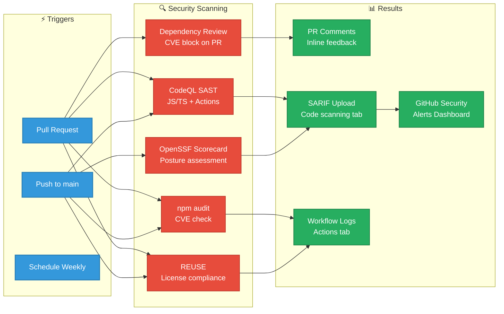
```mermaid
graph LR
    subgraph Triggers["⚡ Triggers"]
        PR[Pull Request]
        PS[Push to main]
        SC[Schedule Weekly]
    end

    subgraph Scanning["🔍 Security Scanning"]
        CQL[CodeQL SAST<br/>JS/TS + Actions]
        NA[npm audit<br/>CVE check]
        DR[Dependency Review<br/>CVE block on PR]
        RL[REUSE<br/>License compliance]
        SC2[OpenSSF Scorecard<br/>Posture assessment]
    end

    subgraph Output["📊 Results"]
        GH[GitHub Security<br/>Alerts Dashboard]
        PRC[PR Comments<br/>Inline feedback]
        SAR[SARIF Upload<br/>Code scanning tab]
        WL[Workflow Logs<br/>Actions tab]
    end

    PR --> CQL & NA & DR & RL
    PS --> CQL & NA & RL & SC2

    CQL --> SAR
    NA --> WL
    DR --> PRC
    RL --> WL
    SC2 --> SAR
    SAR --> GH

    classDef trigger fill:#3498db,stroke:#2980b9,stroke-width:2px,color:white
    classDef scanning fill:#e74c3c,stroke:#c0392b,stroke-width:1.5px,color:white
    classDef output fill:#27ae60,stroke:#1e8449,stroke-width:1.5px,color:white

    class PR,PS,SC trigger
    class CQL,NA,DR,RL,SC2 scanning
    class GH,PRC,SAR,WL output
```

---

## 🚦 Deployment Security Gates

Production deployment to AWS S3 + CloudFront is protected by multiple sequential security gates that must all pass before code reaches production.

### Security Gate Sequence

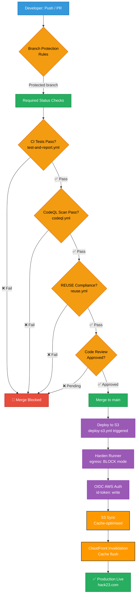
```mermaid
graph TD
    A[Developer: Push / PR] --> B{Branch Protection<br/>Rules}
    B -->|Protected branch| C[Required Status Checks]
    C --> D{CI Tests Pass?<br/>test-and-report.yml}
    D -->|✅ Pass| E{CodeQL Scan Pass?<br/>codeql.yml}
    D -->|❌ Fail| BLOCK[🚫 Merge Blocked]
    E -->|✅ Pass| F{REUSE Compliance?<br/>reuse.yml}
    E -->|❌ Fail| BLOCK
    F -->|✅ Pass| G{Code Review<br/>Approved?}
    F -->|❌ Fail| BLOCK
    G -->|✅ Approved| H[Merge to main]
    G -->|❌ Pending| BLOCK
    H --> I[Deploy to S3<br/>deploy-s3.yml triggered]
    I --> J[Harden Runner<br/>egress: BLOCK mode]
    J --> K[OIDC AWS Auth<br/>id-token: write]
    K --> L[S3 Sync<br/>Cache-optimised]
    L --> M[CloudFront Invalidation<br/>Cache flush]
    M --> N[✅ Production Live<br/>hack23.com]

    classDef trigger fill:#3498db,stroke:#2980b9,stroke-width:2px,color:white
    classDef decision fill:#f39c12,stroke:#e67e22,stroke-width:2px,color:black
    classDef pass fill:#27ae60,stroke:#1e8449,stroke-width:1.5px,color:white
    classDef fail fill:#e74c3c,stroke:#c0392b,stroke-width:2px,color:white
    classDef aws fill:#FF9900,stroke:#232F3E,stroke-width:1.5px,color:white
    classDef security fill:#9b59b6,stroke:#8e44ad,stroke-width:1.5px,color:white

    class A trigger
    class B,D,E,F,G decision
    class C,H,N pass
    class BLOCK fail
    class I,J,K security
    class L,M aws
```

### AWS Deployment Security Controls

| Control | Implementation | ISMS Reference |
|---------|----------------|----------------|
| **OIDC Federation** | `aws-actions/configure-aws-credentials` with role ARN | No long-lived secrets |
| **Minimal IAM Role** | `GithubWorkFlowRole` — S3 + CloudFront only | Least privilege |
| **Egress Block Mode** | Harden Runner blocks all non-allowlisted endpoints | Network security |
| **mtime Preservation** | Git commit times restored before sync | Change detection accuracy |
| **Cache-Optimised Sync** | Per-type cache headers (HTML: 1h, assets: 1y) | Performance + integrity |
| **HTTPS Enforcement** | CloudFront HTTPS-only distribution | Data in transit protection |
| **TLS 1.3** | CloudFront + S3 expected to enforce TLS 1.3 (configured in AWS account) | [Cryptography Policy](https://github.com/Hack23/ISMS-PUBLIC/blob/main/Cryptography_Policy.md) |

---

## 🔄 Workflow Failure Handling & Rollback

### Failure Classification and Response

| Failure Type | Detection | Automated Response | Manual Action |
|-------------|-----------|-------------------|---------------|
| **Test failure** | CI job exits non-zero | Workflow marked failed, merge blocked | Review logs, fix code, re-push |
| **Security finding (CodeQL, new)** | CodeQL analysis | PR comment + GitHub Security alert | Assess, fix or document false positive |
| **Security finding (npm audit, new)** | `npm audit` in `test-and-report.yml` | Workflow failed, findings in logs only | Review audit output, update deps or add to allowlist per policy |
| **Security finding (known / accepted)** | Known GHSA in audit allowlist | Intelligent triage passes | Document in SECURITY.md and risk register |
| **Deployment failure** | S3 sync / CF invalidation error | Workflow failed, previous version still live | Check AWS CloudWatch, re-run |
| **Attestation failure** | Sigstore API / OIDC error | Release blocked | Retry workflow, check OIDC config |
| **REUSE non-compliance** | Missing SPDX header | PR blocked | Add `SPDX-FileCopyrightText` headers |
| **Agentic workflow failure** | Agent timeout or error | PR not created, workflow marked failed | Review agent logs, re-trigger manually |

### Rollback Procedure

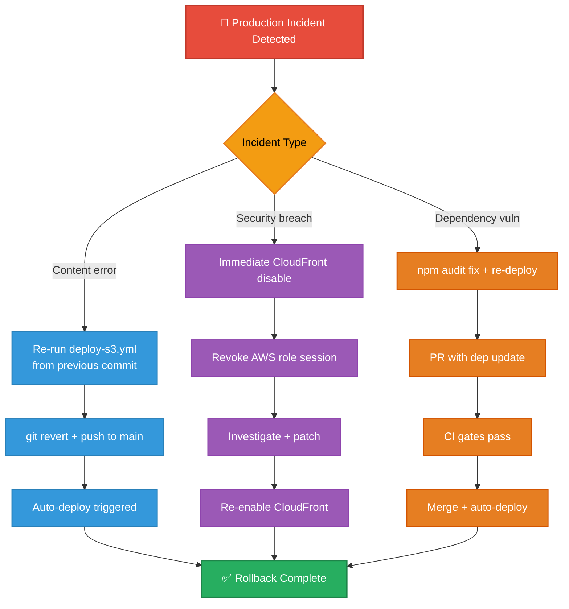
```mermaid
graph TD
    A[🚨 Production Incident Detected] --> B{Incident Type}
    B -->|Content error| C[Re-run deploy-s3.yml<br/>from previous commit]
    B -->|Security breach| D[Immediate CloudFront disable]
    B -->|Dependency vuln| E[npm audit fix + re-deploy]
    C --> F[git revert + push to main]
    F --> G[Auto-deploy triggered]
    D --> H[Revoke AWS role session]
    H --> I[Investigate + patch]
    I --> J[Re-enable CloudFront]
    E --> K[PR with dep update]
    K --> L[CI gates pass]
    L --> M[Merge + auto-deploy]
    G --> N[✅ Rollback Complete]
    J --> N
    M --> N

    classDef alert fill:#e74c3c,stroke:#c0392b,stroke-width:2px,color:white
    classDef decision fill:#f39c12,stroke:#e67e22,stroke-width:2px,color:black
    classDef content fill:#3498db,stroke:#2980b9,stroke-width:1.5px,color:white
    classDef security fill:#9b59b6,stroke:#8e44ad,stroke-width:1.5px,color:white
    classDef dependency fill:#e67e22,stroke:#d35400,stroke-width:1.5px,color:white
    classDef complete fill:#27ae60,stroke:#1e8449,stroke-width:2px,color:white

    class A alert
    class B decision
    class C,F,G content
    class D,H,I,J security
    class E,K,L,M dependency
    class N complete
```

### Recovery Time Objectives

| Scenario | RTO Target | Procedure |
|----------|-----------|-----------|
| **Broken deployment** | < 15 minutes | Re-run `deploy-s3.yml` from last good commit |
| **Content regression** | < 30 minutes | `git revert` + auto-deploy pipeline |
| **Dependency vulnerability** | < 4 hours | `npm audit fix` + PR + deploy |
| **Security incident** | < 1 hour | CloudFront disable + incident response |

**ISMS Reference:** [BCP Plan](BCPPlan.md) | [Incident Response](https://github.com/Hack23/ISMS-PUBLIC/blob/main/Information_Security_Policy.md)

---

## 📦 Dependabot Security Configuration

**Configuration:** `.github/dependabot.yml`

Dependabot is configured with two package ecosystems, both scheduled on Monday to batch updates and reduce CI noise.

### Dependabot Configuration Summary

| Ecosystem | Directory | Schedule | PR Limit | Groups |
|-----------|-----------|---------|----------|--------|
| **npm** | `/` | Weekly, Mon 06:00 UTC | 10 | dev-deps (minor/patch), prod-deps (minor/patch) |
| **github-actions** | `/` | Weekly, Mon 07:00 UTC | Unlimited | github-actions (minor/patch) |

### Update Grouping Strategy

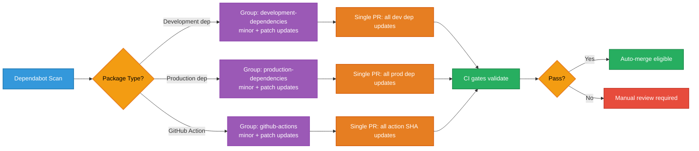
```mermaid
graph LR
    A[Dependabot Scan] --> B{Package Type?}
    B -->|Development dep| C[Group: development-dependencies<br/>minor + patch updates]
    B -->|Production dep| D[Group: production-dependencies<br/>minor + patch updates]
    B -->|GitHub Action| E[Group: github-actions<br/>minor + patch updates]
    C --> F[Single PR: all dev dep updates]
    D --> G[Single PR: all prod dep updates]
    E --> H[Single PR: all action SHA updates]
    F --> I[CI gates validate]
    G --> I
    H --> I
    I --> J{Pass?}
    J -->|Yes| K[Auto-merge eligible]
    J -->|No| L[Manual review required]

    classDef scanner fill:#3498db,stroke:#2980b9,stroke-width:2px,color:white
    classDef decision fill:#f39c12,stroke:#e67e22,stroke-width:2px,color:black
    classDef group fill:#9b59b6,stroke:#8e44ad,stroke-width:1.5px,color:white
    classDef pr fill:#e67e22,stroke:#d35400,stroke-width:1.5px,color:white
    classDef pass fill:#27ae60,stroke:#1e8449,stroke-width:1.5px,color:white
    classDef fail fill:#e74c3c,stroke:#c0392b,stroke-width:1.5px,color:white

    class A scanner
    class B,J decision
    class C,D,E group
    class F,G,H pr
    class I,K pass
    class L fail
```

### Commit Message Convention

| Type | Prefix | Example |
|------|--------|---------|
| **npm dep update** | `build(deps):` | `build(deps): bump eslint from 8.x to 9.x` |
| **npm dev dep** | `build(deps-dev):` | `build(deps-dev): bump vitest from 2.x to 3.x` |
| **Actions update** | `build(deps):` | `build(deps): bump actions/checkout from v4 to v5` |

**Security Labels:** All Dependabot PRs are labelled `dependencies` + `javascript` or `github_actions` for easy filtering.

---

## 📡 Workflow Monitoring & Alerting

### Workflow Status Badges

All primary workflows expose real-time status badges in README.md and this document for instant visibility into pipeline health:

| Workflow | Badge | Target |
|----------|-------|--------|
| **Test & Report** | [](https://github.com/Hack23/euparliamentmonitor/actions/workflows/test-and-report.yml) | Green always |
| **CodeQL** | [](https://github.com/Hack23/euparliamentmonitor/actions/workflows/codeql.yml) | Green always |
| **E2E Tests** | [](https://github.com/Hack23/euparliamentmonitor/actions/workflows/e2e.yml) | Green always |
| **REUSE** | [](https://github.com/Hack23/euparliamentmonitor/actions/workflows/reuse.yml) | Green always |
| **OpenSSF Scorecard** | [](https://scorecard.dev/viewer/?uri=github.com/Hack23/euparliamentmonitor) | ≥ 8.0/10 |

### GitHub Security Dashboard Integration

The following tools integrate with the GitHub Security Dashboard via SARIF or native mechanisms:

| Tool | Integration Type | Destination |
|------|------------------|-------------|
| **CodeQL** | SARIF via `github/codeql-action/analyze` | GitHub Security Dashboard (code scanning alerts) |
| **OpenSSF Scorecard** | SARIF via `github/codeql-action/upload-sarif` | GitHub Security Dashboard (code scanning alerts) |
| **Dependabot** | Native GitHub integration | GitHub Security Dashboard (Dependabot alerts) |

### Alerting Channels

| Event | Alert Channel | Severity |
|-------|---------------|----------|
| **Critical CVE found** | GitHub Security Advisories | P1 — Immediate |
| **Workflow failure on main** | GitHub email notification | P2 — Same day |
| **Scorecard score drop** | Weekly scorecard badge | P3 — Weekly review |
| **Dependabot PR opened** | GitHub PR notification | P4 — Next Monday batch |

---

## 🔒 ISMS Policy Alignment Summary

### Policy Coverage

| **ISMS Policy** | **Workflows Implementing Controls** | **Evidence** |
| --- | --- | --- |
| [🛠️ Secure Development Policy](https://github.com/Hack23/ISMS-PUBLIC/blob/main/Secure_Development_Policy.md) | All workflows | This document |
| [🔐 Information Security Policy](https://github.com/Hack23/ISMS-PUBLIC/blob/main/Information_Security_Policy.md) | CodeQL, OpenSSF Scorecard | [SECURITY_ARCHITECTURE.md](SECURITY_ARCHITECTURE.md) |
| [🔑 Access Control Policy](https://github.com/Hack23/ISMS-PUBLIC/blob/main/Access_Control_Policy.md) | deploy-s3 (OIDC), release (minimal permissions) | Workflow files |
| [🔒 Cryptography Policy](https://github.com/Hack23/ISMS-PUBLIC/blob/main/Cryptography_Policy.md) | deploy-s3 (TLS), release (Sigstore/SLSA) | [Attestations](https://github.com/Hack23/euparliamentmonitor/attestations) |
| [🔓 Open Source Policy](https://github.com/Hack23/ISMS-PUBLIC/blob/main/Open_Source_Policy.md) | REUSE compliance workflow | [REUSE.toml](REUSE.toml) |
| [🔍 Vulnerability Management](https://github.com/Hack23/ISMS-PUBLIC/blob/main/Vulnerability_Management.md) | CodeQL, npm audit, Dependency Review | GitHub Security tab, PR checks |
| [📝 Change Management](https://github.com/Hack23/ISMS-PUBLIC/blob/main/Change_Management.md) | Branch protection, CI gates, PR reviews | Workflow gate enforcement |
| [🚨 Incident Response Plan](https://github.com/Hack23/ISMS-PUBLIC/blob/main/Incident_Response_Plan.md) | Rollback procedures, incident classification | §Failure Handling section |

### Secure Development Policy Alignment

| **Policy Section** | **Implementation** | **Evidence** |
| --- | --- | --- |
| **§3.2 Architecture Documentation** | Documentation-as-code in release workflow | [SECURITY_ARCHITECTURE.md](SECURITY_ARCHITECTURE.md) |
| **§3.3 Testing Requirements** | 169 unit tests, E2E tests, 82%+ coverage | [Test & Report Workflow](.github/workflows/test-and-report.yml) |
| **§4.1 CI/CD Security** | All workflows with security controls | This document |
| **§4.3 Security Scanning** | CodeQL, npm audit, Dependabot | [CodeQL Workflow](.github/workflows/codeql.yml) |
| **§4.4 Supply Chain Security** | SLSA L3, SBOM, Dependency Review, REUSE | [Release Workflow](.github/workflows/release.yml) |
| **§10.1 CI/CD Workflow Excellence** | 22 automated workflows, 100% SHA-pinned | This document |

### Compliance Frameworks

| **Framework** | **Version** | **Controls Implemented** | **Evidence Location** |
| --- | --- | --- | --- |
| **ISO 27001** | 2022 | A.8.25, A.8.26, A.8.27, A.8.28, A.12.1.4, A.12.6.1, A.14.2.1 | Workflow files + this document |
| **NIST CSF** | 2.0 | ID.SC (Supply Chain), DE.CM (Detection), PR.DS (Data Security) | [SECURITY_ARCHITECTURE.md](SECURITY_ARCHITECTURE.md) |
| **CIS Controls** | v8.1 | 2.2, 4.1, 7.1, 16.1, 16.5, 16.7, 16.12 | [Scorecard](https://scorecard.dev/viewer/?uri=github.com/Hack23/euparliamentmonitor) |
| **SLSA** | L3 | Build provenance, hermetic build, non-falsifiable, authenticated | [Attestations](https://github.com/Hack23/euparliamentmonitor/attestations) |
| **OpenSSF** | — | SHA-pinned actions (100%), Harden Runner, branch protection | [Scorecard Report](https://scorecard.dev/viewer/?uri=github.com/Hack23/euparliamentmonitor) |
| **EU CRA** | 2024 | SBOM generation, vulnerability disclosure, security updates | [Release Workflow](.github/workflows/release.yml) |

---

## 🔄 Continuous Improvement

### Planned Enhancements

See [FUTURE_WORKFLOWS.md](FUTURE_WORKFLOWS.md) for:
- Advanced security scanning
- Performance testing enhancements
- Deployment automation improvements
- Multi-environment support
- Fuzzing integration

---

## 📚 Related Documentation

| Document | Focus | Link |
|----------|-------|------|
| 🔐 Security Architecture | Current security implementation | [SECURITY_ARCHITECTURE.md](SECURITY_ARCHITECTURE.md) |
| 📈 Security Flowcharts | Process flows with security controls | [FLOWCHART.md](FLOWCHART.md) |
| 📊 Data Model | Data structures and flows | [DATA_MODEL.md](DATA_MODEL.md) |
| 🚀 Future Workflows | Planned enhancements | [FUTURE_WORKFLOWS.md](FUTURE_WORKFLOWS.md) |
| 📋 Release Process | Release procedures | [docs/RELEASE_PROCESS.md](docs/RELEASE_PROCESS.md) |
| 🛡️ ISMS Policy | Security policy framework | [Hack23 ISMS-PUBLIC](https://github.com/Hack23/ISMS-PUBLIC) |
| 📦 Dependabot Config | Automated dependency updates | [.github/dependabot.yml](.github/dependabot.yml) |

---

**📞 Questions?** Contact: [Security Team](mailto:security@hack23.com)  
**🔐 Security Issues?** See [SECURITY.md](SECURITY.md) for vulnerability disclosure

---

*Last updated: 2026-03-10 by Documentation Architect / DevOps Engineer*
