<p align="center">
  
</p>

<h1 align="center">🔄 EU Parliament Monitor — CI/CD Workflows</h1>

<p align="center">
  <strong>🛡️ Automated Security Excellence Through Continuous Integration</strong><br>
  <em>🎯 Transparent Pipeline Operations Demonstrating ISMS Policy Compliance</em>
</p>

<p align="center">
  <a href="#"></a>
  <a href="#"></a>
  <a href="#"></a>
  <a href="#"></a>
</p>

**📋 Document Owner:** CEO | **📄 Version:** 4.2 | **📅 Last Updated:** 2026-05-03 (UTC) | **📦 Release:** v0.8.54  
**🔄 Review Cycle:** Quarterly | **⏰ Next Review:** 2026-08-03

---

## 📊 Workflow Status Badges

**CI/CD Pipeline Status:**

[](https://github.com/Hack23/euparliamentmonitor/actions/workflows/test-and-report.yml)
[](https://github.com/Hack23/euparliamentmonitor/actions/workflows/knip.yml)
[](https://github.com/Hack23/euparliamentmonitor/actions/workflows/codeql.yml)
[](https://github.com/Hack23/euparliamentmonitor/actions/workflows/e2e.yml)
[](https://github.com/Hack23/euparliamentmonitor/actions/workflows/release.yml)
[](https://github.com/Hack23/euparliamentmonitor/actions/workflows/dependency-review.yml)
[](https://github.com/Hack23/euparliamentmonitor/actions/workflows/scorecards.yml)
[](https://github.com/Hack23/euparliamentmonitor/actions/workflows/deploy-s3.yml)
[](https://github.com/Hack23/euparliamentmonitor/actions/workflows/reuse.yml)

**Security & Quality Metrics:**

[](https://scorecard.dev/viewer/?uri=github.com/Hack23/euparliamentmonitor)
[](https://github.com/Hack23/euparliamentmonitor/attestations)

---

## 🔐 ISMS Policy Alignment

EU Parliament Monitor's CI/CD workflows implement security controls mandated by Hack23 AB's ISMS framework:

| **ISMS Policy** | **Workflow Implementation** |
| --- | --- |
| [🛠️ Secure Development Policy](https://github.com/Hack23/ISMS-PUBLIC/blob/main/Secure_Development_Policy.md) | SAST (CodeQL), SCA (Dependency Review), E2E (Playwright), performance testing |
| [📝 Change Management](https://github.com/Hack23/ISMS-PUBLIC/blob/main/Change_Management.md) | Automated testing gates, security scanning, PR review requirements |
| [🔍 Vulnerability Management](https://github.com/Hack23/ISMS-PUBLIC/blob/main/Vulnerability_Management.md) | Dependabot, CodeQL, OSSF Scorecard, npm audit, security advisories |
| [🔓 Open Source Policy](https://github.com/Hack23/ISMS-PUBLIC/blob/main/Open_Source_Policy.md) | SLSA attestations, SBOM generation, REUSE license compliance |
| [🔐 Information Security Policy](https://github.com/Hack23/ISMS-PUBLIC/blob/main/Information_Security_Policy.md) | Security-hardened runners, SHA-pinned actions, least privilege permissions |
| [🔑 Access Control Policy](https://github.com/Hack23/ISMS-PUBLIC/blob/main/Access_Control_Policy.md) | OIDC authentication, minimal workflow permissions, branch protection |
| [🔒 Cryptography Policy](https://github.com/Hack23/ISMS-PUBLIC/blob/main/Cryptography_Policy.md) | Sigstore signing, SLSA L3 provenance, build attestations |
| [🚨 Incident Response Plan](https://github.com/Hack23/ISMS-PUBLIC/blob/main/Incident_Response_Plan.md) | Automated rollback procedures, incident classification workflows |
| [💾 Backup & Recovery Policy](https://github.com/Hack23/ISMS-PUBLIC/blob/main/Backup_Recovery_Policy.md) | Multi-CDN deployment (S3 + GitHub Pages DR), version control |
| [🤝 Third Party Management](https://github.com/Hack23/ISMS-PUBLIC/blob/main/Third_Party_Management.md) | SHA-pinned actions, dependency review, supply chain security |

### Compliance Framework Mapping

| **Framework** | **Version** | **Relevant Controls** | **Implementation** |
| --- | --- | --- | --- |
| **ISO 27001** | 2022 | A.8.25, A.8.26, A.8.27, A.8.28, A.12.1.4, A.12.6.1, A.14.2.1 | Secure development lifecycle, testing, change management |
| **NIST CSF** | 2.0 | PR.DS, DE.CM, ID.SC, RS.MI | Data security, monitoring, supply chain, mitigation |
| **CIS Controls** | v8.1 | 2.2, 4.1, 7.1, 16.1, 17.1 | Software inventory, access control, code signing, application security |
| **EU CRA** | 2024 | Art. 10, Art. 11 | SBOM generation, vulnerability disclosure, security updates |

---

## 📚 Architecture Documentation Map

<div class="documentation-map">

| Document                                                            | Focus           | Description                                    | Documentation Link                                                                                     |
| ------------------------------------------------------------------- | --------------- | ---------------------------------------------- | ------------------------------------------------------------------------------------------------------ |
| **[Architecture](ARCHITECTURE.md)**                                 | 🏛️ Architecture | C4 model showing current system structure      | [View Source](https://github.com/Hack23/euparliamentmonitor/blob/main/ARCHITECTURE.md)                 |
| **[Future Architecture](FUTURE_ARCHITECTURE.md)**                   | 🏛️ Architecture | C4 model showing future system structure       | [View Source](https://github.com/Hack23/euparliamentmonitor/blob/main/FUTURE_ARCHITECTURE.md)          |
| **[Mindmaps](MINDMAP.md)**                                          | 🧠 Concept      | Current system component relationships         | [View Source](https://github.com/Hack23/euparliamentmonitor/blob/main/MINDMAP.md)                      |
| **[Future Mindmaps](FUTURE_MINDMAP.md)**                            | 🧠 Concept      | Future capability evolution                    | [View Source](https://github.com/Hack23/euparliamentmonitor/blob/main/FUTURE_MINDMAP.md)               |
| **[SWOT Analysis](SWOT.md)**                                        | 💼 Business     | Current strategic assessment                   | [View Source](https://github.com/Hack23/euparliamentmonitor/blob/main/SWOT.md)                         |
| **[Future SWOT Analysis](FUTURE_SWOT.md)**                          | 💼 Business     | Future strategic opportunities                 | [View Source](https://github.com/Hack23/euparliamentmonitor/blob/main/FUTURE_SWOT.md)                  |
| **[Data Model](DATA_MODEL.md)**                                     | 📊 Data         | Current data structures and relationships      | [View Source](https://github.com/Hack23/euparliamentmonitor/blob/main/DATA_MODEL.md)                   |
| **[Future Data Model](FUTURE_DATA_MODEL.md)**                       | 📊 Data         | Enhanced European Parliament data architecture | [View Source](https://github.com/Hack23/euparliamentmonitor/blob/main/FUTURE_DATA_MODEL.md)            |
| **[Flowcharts](FLOWCHART.md)**                                      | 🔄 Process      | Current data processing workflows              | [View Source](https://github.com/Hack23/euparliamentmonitor/blob/main/FLOWCHART.md)                    |
| **[Future Flowcharts](FUTURE_FLOWCHART.md)**                        | 🔄 Process      | Enhanced AI-driven workflows                   | [View Source](https://github.com/Hack23/euparliamentmonitor/blob/main/FUTURE_FLOWCHART.md)             |
| **[State Diagrams](STATEDIAGRAM.md)**                               | 🔄 Behavior     | Current system state transitions               | [View Source](https://github.com/Hack23/euparliamentmonitor/blob/main/STATEDIAGRAM.md)                 |
| **[Future State Diagrams](FUTURE_STATEDIAGRAM.md)**                 | 🔄 Behavior     | Enhanced adaptive state transitions            | [View Source](https://github.com/Hack23/euparliamentmonitor/blob/main/FUTURE_STATEDIAGRAM.md)          |
| **[Security Architecture](SECURITY_ARCHITECTURE.md)**               | 🛡️ Security     | Current security implementation                | [View Source](https://github.com/Hack23/euparliamentmonitor/blob/main/SECURITY_ARCHITECTURE.md)        |
| **[Future Security Architecture](FUTURE_SECURITY_ARCHITECTURE.md)** | 🛡️ Security     | Security enhancement roadmap                   | [View Source](https://github.com/Hack23/euparliamentmonitor/blob/main/FUTURE_SECURITY_ARCHITECTURE.md) |
| **[Threat Model](THREAT_MODEL.md)**                                 | 🎯 Security     | Political Threat Landscape analysis             | [View Source](https://github.com/Hack23/euparliamentmonitor/blob/main/THREAT_MODEL.md)                 |
| **[Classification](CLASSIFICATION.md)**                             | 🏷️ Governance   | CIA classification & BCP                       | [View Source](https://github.com/Hack23/euparliamentmonitor/blob/main/CLASSIFICATION.md)               |
| **[CRA Assessment](CRA-ASSESSMENT.md)**                             | 🛡️ Compliance   | Cyber Resilience Act                           | [View Source](https://github.com/Hack23/euparliamentmonitor/blob/main/CRA-ASSESSMENT.md)               |
| **[Workflows](WORKFLOWS.md)**                                       | ⚙️ DevOps       | CI/CD documentation                            | [View Source](https://github.com/Hack23/euparliamentmonitor/blob/main/WORKFLOWS.md)                    |
| **[Future Workflows](FUTURE_WORKFLOWS.md)**                         | 🚀 DevOps       | Planned CI/CD enhancements                     | [View Source](https://github.com/Hack23/euparliamentmonitor/blob/main/FUTURE_WORKFLOWS.md)             |
| **[Business Continuity Plan](BCPPlan.md)**                          | 🔄 Resilience   | Recovery planning                              | [View Source](https://github.com/Hack23/euparliamentmonitor/blob/main/BCPPlan.md)                      |
| **[Financial Security Plan](FinancialSecurityPlan.md)**             | 💰 Financial    | Cost & security analysis                       | [View Source](https://github.com/Hack23/euparliamentmonitor/blob/main/FinancialSecurityPlan.md)        |
| **[End-of-Life Strategy](End-of-Life-Strategy.md)**                 | 📦 Lifecycle    | Technology EOL planning                        | [View Source](https://github.com/Hack23/euparliamentmonitor/blob/main/End-of-Life-Strategy.md)         |
| **[Unit Test Plan](UnitTestPlan.md)**                               | 🧪 Testing      | Unit testing strategy                          | [View Source](https://github.com/Hack23/euparliamentmonitor/blob/main/UnitTestPlan.md)                 |
| **[E2E Test Plan](E2ETestPlan.md)**                                 | 🔍 Testing      | End-to-end testing                             | [View Source](https://github.com/Hack23/euparliamentmonitor/blob/main/E2ETestPlan.md)                  |
| **[Performance Testing](performance-testing.md)**                   | ⚡ Performance  | Performance benchmarks                         | [View Source](https://github.com/Hack23/euparliamentmonitor/blob/main/performance-testing.md)          |
| **[Security Policy](SECURITY.md)**                                  | 🔒 Security     | Vulnerability reporting & security policy      | [View Source](https://github.com/Hack23/euparliamentmonitor/blob/main/SECURITY.md)                     |

</div>

---

## 📋 Executive Summary

EU Parliament Monitor employs a comprehensive suite of **GitHub Actions workflows** (~15 standard + 15 agentic — 14 unified `news-<type>.md` + `news-translate.md`) for automated intelligence operations, quality assurance, security scanning, and release management. All workflows follow the [Hack23 ISMS Secure Development Policy](https://github.com/Hack23/ISMS-PUBLIC/blob/main/Secure_Development_Policy.md) standards.

### Workflow Portfolio

| # | Workflow | Purpose | Schedule / Trigger | ISMS Alignment |
|---|---------|---------|-------------------|----------------|
| 1 | **Agentic News Workflows** (×15) | AI-generated multi-language news articles (14 article-type unified `news-<type>.md` + `news-translate`) | Varied schedules (see §1) | Integrity controls (Medium) |
| 2 | **Test & Report** | Unit + integration tests, 3061+ tests, coverage, performance | On PR/push to main | Quality assurance (ISO 27001 A.12.1.4) |
| 3 | **CodeQL** | SAST security scanning (JS/TS + GitHub Actions) | On PR/push + weekly Saturday | Vulnerability management (ISO 27001 A.12.6) |
| 4 | **E2E Tests** | End-to-end Playwright tests (Chromium) + axe-core | On PR/push + daily midnight UTC | Functional validation + WCAG 2.1 AA |
| 5 | **Release** | Build, attest (SLSA L3), document, publish to npm (provenance) | Manual/tag push | SLSA L3, Documentation-as-code, npm provenance |
| 6 | **Dependency Review** | Supply chain security scanning | On PR | Supply chain security (NIST CSF ID.SC) |
| 7 | **OpenSSF Scorecard** | Security posture assessment | Weekly Tuesday 07:20 UTC | Continuous improvement |
| 8 | **Deploy S3** | Production deployment to AWS S3 + CloudFront (OIDC, egress: block) | Push to main | Infrastructure as Code |
| 9 | **REUSE Compliance** | License and copyright verification (REUSE 3.3) | On PR/push + weekly Monday | Open Source Policy |
| 10 | **SLSA Provenance** | Build provenance attestation (integrated in release.yml) | On release + manual | Supply chain security (SLSA L3) |
| 11 | **Compile Agentic Workflows** | Compile `.md` → `.lock.yml` via gh-aw CLI (pinned `GH_AW_VERSION: v0.71.3`) | Manual dispatch | Automation governance |
| 12 | **Agentics Maintenance** | Housekeeping for agentic workflows (stale lock cleanup, health probes) | Scheduled | Automation governance |
| 13 | **Labeler** | Automatic PR labeling | On pull_request_target | Workflow governance |
| 14 | **Setup Labels** | Repository label management | Manual dispatch | Repository governance |
| 15 | **Copilot Setup Steps** | GitHub Copilot agent environment setup | Push/PR to itself + manual | Agent infrastructure |
| 16 | **news-translate-reconciler** | Reconcile missing translation artifacts across 14 languages | Scheduled | Translation consistency |

**🔒 Security Posture:** All 14 standard workflows use SHA-pinned actions (100%), Harden Runner (`step-security/harden-runner@8d3c67de8e2fe68ef647c8db1e6a09f647780f40 # v2.19.0`), and minimal permissions following least privilege principle. Agentic workflows add a 5-layer security model: AWF Squid firewall allowlist, sandboxed Docker with restricted shell, safe-output constraints (`create-pull-request` with `max-patch-size`), JSONL audit trail, and lock-file compilation.

### 🏗️ Pipeline Architecture


```mermaid
graph LR
    A[Code Push] --> B[Build & Test]
    B --> C[SCA Scan]
    C --> D[CodeQL Scan]
    D --> E[Quality Gate]
    E --> F[Security Gate]
    F --> G[SBOM Generation]
    G --> H[Attestations]
    H --> I[Release]
    I --> J[Deploy]

    classDef trigger fill:#3498db,stroke:#2980b9,stroke-width:1.5px,color:white
    classDef process fill:#9b59b6,stroke:#8e44ad,stroke-width:1.5px,color:white
    classDef security fill:#e74c3c,stroke:#c0392b,stroke-width:1.5px,color:white
    classDef decision fill:#f39c12,stroke:#e67e22,stroke-width:1.5px,color:black
    classDef success fill:#27ae60,stroke:#1e8449,stroke-width:1.5px,color:white

    class A trigger
    class B process
    class C,D security
    class E,F decision
    class G,H security
    class I,J success
```

### Workflow Relationships

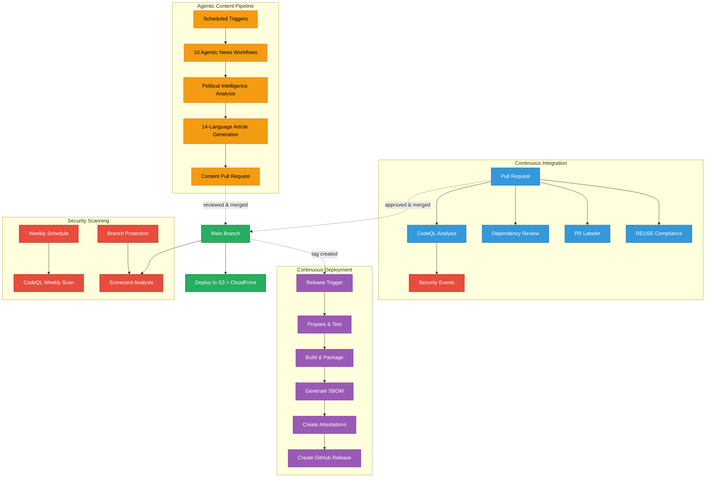
```mermaid
flowchart TB
    subgraph "Continuous Integration"
        direction TB
        PR[Pull Request] --> CodeQLScan[CodeQL Analysis]
        PR --> DependencyReview[Dependency Review]
        PR --> Labeler[PR Labeler]
        PR --> REUSECheck[REUSE Compliance]
        CodeQLScan --> SecurityEvents[Security Events]
    end

    subgraph "Agentic Content Pipeline"
        direction TB
        Schedule1[Scheduled Triggers] --> AgenticNews[10 Agentic News Workflows]
        AgenticNews --> Analysis[Political Intelligence Analysis]
        Analysis --> Articles[14-Language Article Generation]
        Articles --> ContentPR[Content Pull Request]
    end

    subgraph "Continuous Deployment"
        direction TB
        Release[Release Trigger] --> BuildTest[Prepare & Test]
        BuildTest --> BuildPackage[Build & Package]
        BuildPackage --> GenerateSBOM[Generate SBOM]
        GenerateSBOM --> Attestations[Create Attestations]
        Attestations --> CreateRelease[Create GitHub Release]
    end

    subgraph "Security Scanning"
        direction TB
        Weekly[Weekly Schedule] --> WeeklyScan[CodeQL Weekly Scan]
        BranchProtection[Branch Protection] --> Scorecard[Scorecard Analysis]
    end

    PR -.-> |"approved & merged"| main[Main Branch]
    ContentPR -.-> |"reviewed & merged"| main
    main --> Scorecard
    main --> DeployS3[Deploy to S3 + CloudFront]
    main -.-> |"tag created"| Release

    classDef trigger fill:#3498db,stroke:#2980b9,stroke-width:1.5px,color:white
    classDef process fill:#9b59b6,stroke:#8e44ad,stroke-width:1.5px,color:white
    classDef success fill:#27ae60,stroke:#1e8449,stroke-width:1.5px,color:white
    classDef decision fill:#f39c12,stroke:#e67e22,stroke-width:1.5px,color:black
    classDef security fill:#e74c3c,stroke:#c0392b,stroke-width:1.5px,color:white

    class PR,CodeQLScan,DependencyReview,Labeler,REUSECheck trigger
    class Release,BuildTest,BuildPackage,GenerateSBOM,Attestations,CreateRelease process
    class main,DeployS3 success
    class Schedule1,AgenticNews,Analysis,Articles,ContentPR decision
    class SecurityEvents,Weekly,WeeklyScan,BranchProtection,Scorecard security
```

---

## 🚀 Workflow Detailed Documentation

### 1. Agentic News Workflows (×15)

**🎯 Purpose:** AI-powered generation of multi-language news articles about European Parliament activities using GitHub Copilot with the `claude-sonnet-4.6` model
**📁 Architecture:** 15 markdown source files (14 unified `news-<type>.md` covering 14 article types + 1 `news-translate.md` helper) compiled to 15 `.lock.yml` files via `gh aw compile` (GitHub Agentic Workflows CLI)
**🌐 Languages:** 14 (en, sv, da, no, fi, de, fr, es, nl, ar, he, ja, ko, zh)
**📜 Horizon registry:** Every horizon's data window, cadence, mandatory artifacts, stage budgets, scenario depth and electoral overlay is defined in [`src/config/article-horizons.ts`](src/config/article-horizons.ts) — the single source of truth consumed by the aggregator, the forward-statements registry, and the drift-guard tests.

#### Agentic Workflow Schedule Matrix (2026-Q2 long-horizon expansion)

| 🤖 Workflow | 📄 File | 📅 Schedule | ⏱️ Timeout |
|---|---|---|---|
| 🚨 **EU Parliament Breaking News** | `news-breaking.lock.yml` | Every 6 hours (`0 */6 * * *`) | 60 min |
| 🔮 **EU Parliament Week Ahead** | `news-week-ahead.lock.yml` | Friday 07:00 UTC | 60 min |
| 📊 **EU Parliament Month Ahead** | `news-month-ahead.lock.yml` | 1st of month 08:00 UTC | 60 min |
| 🌐 **EU Parliament Quarter Ahead** | `news-quarter-ahead.lock.yml` | 1st of month 06:00 UTC (`0 6 1 * *`) | 60 min |
| 🛰️ **EU Parliament Year Ahead** | `news-year-ahead.lock.yml` | Quarterly — 2nd of Jan/Apr/Jul/Oct 08:00 UTC (`0 8 2 1,4,7,10 *`) | 60 min |
| 🗓️ **EU Parliament Term Outlook** | `news-term-outlook.lock.yml` | Semi-annual — 1 Jan & 1 Jul 08:00 UTC (`0 8 1 1,7 *`) | 60 min |
| 🗳️ **EU Parliament Election Cycle** | `news-election-cycle.lock.yml` | Annual — 1 Dec 08:00 UTC (`0 8 1 12 *`) + T-180 / T-90 / T-30 imminent triggers | 60 min |
| 📋 **EU Parliament Week in Review** | `news-week-in-review.lock.yml` | Saturday 09:00 UTC | 60 min |
| 📈 **EU Parliament Month in Review** | `news-month-in-review.lock.yml` | 28th of month 10:00 UTC | 60 min |
| 📚 **EU Parliament Quarter in Review** | `news-quarter-in-review.lock.yml` | 5th of month 08:00 UTC (`0 8 5 * *`) | 60 min |
| 📜 **EU Parliament Year in Review** | `news-year-in-review.lock.yml` | Annual — 15 Jan 08:00 UTC (`0 8 15 1 *`) | 60 min |
| 🗳️ **EU Parliament Plenary Votes & Resolutions** | `news-motions.lock.yml` | Weekdays (Mon–Fri) 06:00 UTC | 60 min |
| ⚖️ **EU Parliament Legislative Procedures** | `news-propositions.lock.yml` | Weekdays (Mon–Fri) 05:00 UTC | 60 min |
| 🏛️ **EU Parliament Committee Activity** | `news-committee-reports.lock.yml` | Weekdays (Mon–Fri) 04:00 UTC | 60 min |
| 🌐 **Translate Articles** | `news-translate.lock.yml` | Weekdays 09:00/12:00/15:00 UTC; Sat 15:00; 1st & 28th 15:00 | 60 min |

> Each `news-<type>.md` workflow runs **Stages A → B → C → D → E in one 60-minute session** and produces **exactly one PR** containing both analysis artifacts and rendered article HTML. The earlier split-pair `news-<type>-analysis.md` + `news-<type>-article.md` layout and the manual `news-article-generator.md` helper were **deleted** in the April-2026 aggregator-pipeline migration. The `news-translate.md` helper (manual dispatch only) is the sole exemption from the single-PR rule.

#### Long-horizon family classification

| Family | Slugs | Stage budgets (A/B/C/D/E) | Stage-C exit | PR-call deadline | Electoral overlay |
|---|---|---|:---:|:---:|:---:|
| Standard short-form | breaking, week-ahead, month-ahead, week-in-review, month-in-review, committee-reports, motions, propositions | 5/22/4/2/2 = 35 (prospective) · 4/22/4/2/2 = 34 (retrospective) | minute 36 | ≤ 45 | — |
| Long-horizon prospective | quarter-ahead, year-ahead | 5/24–25/4/2/2 | minute 38–39 | ≤ 45 | — |
| Long-horizon retrospective | quarter-in-review, year-in-review | 4–5/24–25/4/2/2 | minute 38–39 | ≤ 45 | — |
| Electoral overlay | term-outlook, election-cycle | 5/26–28/4/2/2 = up to 41 | minute 42 | ≤ 47 | ✅ |

**Electoral-overlay invariants** (enforced by Stage-C completeness gate when `electoralOverlay: true` in the registry):

1. The mandatory artifact set includes `forward-projection.md`, `term-arc.md`, `seat-projection.md`, `mandate-fulfilment-scorecard.md`, `presidency-trio-context.md`, `commission-wp-alignment.md`, `forward-indicators.md`, `comparative-international.md`, and `historical-parallels.md`.
2. The scenario-forecast must include an EP-election outcome branch.
3. `forwardStatementsHorizonDays` is bounded at 1500 (term-outlook) / 1825 (election-cycle) — the registry caps it at 1825.
4. `dataWindow.anchor` is `next-election` (constant June 2029 today), giving deterministic windowing across runs.

**Fallback behaviour**: every horizon inherits the standard fallback chain — empty `today` MCP feed → fall back to the wider sliding window declared in the registry; failed `get_voting_records` for retrospective runs → EP Open Data Portal direct fetch (see [`scripts/mcp-setup.sh`](scripts/mcp-setup.sh) and [`src/mcp/ep-mcp-client.ts`](src/mcp/ep-mcp-client.ts)). A failed long-horizon run does **not** fall back to a shorter horizon — Stage-C blocks the PR and the workflow exits non-zero.

#### Agentic Workflow Architecture

All 15 agentic workflows share a common architecture (14 unified `news-<type>.md` produce English articles in single 60-min sessions; the manual `news-translate` helper then generates the remaining 13 languages):

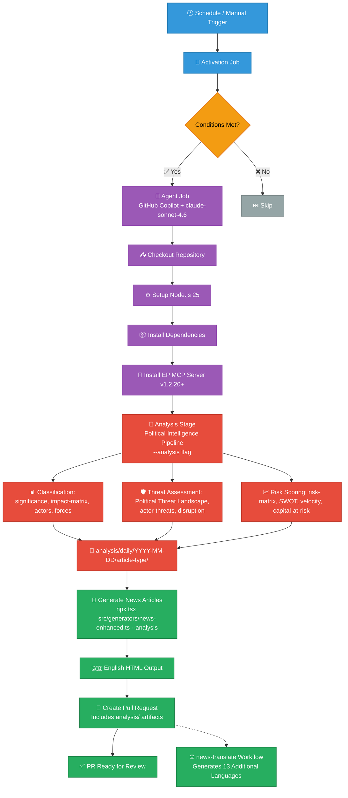
```mermaid
graph TD
    A[🕐 Schedule / Manual Trigger] --> B[🔑 Activation Job]
    B --> C{Conditions Met?}
    C -->|✅ Yes| D[🤖 Agent Job<br/>GitHub Copilot + claude-sonnet-4.6]
    C -->|❌ No| E[⏭️ Skip]
    D --> F[📥 Checkout Repository]
    F --> G[⚙️ Setup Node.js 25]
    G --> H[📦 Install Dependencies]
    H --> I[🔗 Install EP MCP Server v1.2.20+]
    I --> J1[🔬 Analysis Stage<br/>Political Intelligence Pipeline<br/>--analysis flag]
    J1 --> J1a[📊 Classification: significance, impact-matrix, actors, forces]
    J1 --> J1b[🛡️ Threat Assessment: Political Threat Landscape,<br/>actor-threats, disruption]
    J1 --> J1c[📈 Risk Scoring: risk-matrix, SWOT, velocity, capital-at-risk]
    J1a --> J1d["📁 analysis/daily/YYYY-MM-DD/article-type/"]
    J1b --> J1d
    J1c --> J1d
    J1d --> J[📰 Generate News Articles<br/>npx tsx src/generators/news-enhanced.ts --analysis]
    J --> K[🇬🇧 English HTML Output]
    K --> L[📝 Create Pull Request<br/>Includes analysis/ artifacts]
    L --> M[✅ PR Ready for Review]
    L -.-> N[🌐 news-translate Workflow<br/>Generates 13 Additional Languages]

    classDef trigger fill:#3498db,stroke:#2980b9,stroke-width:2px,color:white
    classDef process fill:#9b59b6,stroke:#8e44ad,stroke-width:1.5px,color:white
    classDef decision fill:#f39c12,stroke:#e67e22,stroke-width:2px,color:black
    classDef skip fill:#95a5a6,stroke:#7f8c8d,stroke-width:1.5px,color:white
    classDef analysis fill:#e74c3c,stroke:#c0392b,stroke-width:1.5px,color:white
    classDef output fill:#27ae60,stroke:#1e8449,stroke-width:1.5px,color:white

    class A,B trigger
    class D,F,G,H,I process
    class C decision
    class E skip
    class J1,J1a,J1b,J1c,J1d analysis
    class J,K,L,M,N output
```

#### Common Agentic Workflow Properties

| Property | Value |
|----------|-------|
| **Source format** | Markdown (`.md`) compiled by `gh aw compile` |
| **Lock format** | YAML (`.lock.yml`) — auto-generated, do not edit directly |
| **AI Model** | `claude-sonnet-4.6` via GitHub Copilot CLI |
| **Top-level permissions** | `{}` (empty — no default permissions) |
| **Activation job permissions** | `contents: read` |
| **Agent job permissions** | `contents: write`, `pull-requests: write`, `issues: write`, `models: read` |
| **Concurrency group** | `gh-aw-${{ github.workflow }}` |
| **Node.js version** | 25 |
| **EP MCP Server** | `european-parliament-mcp-server@1.2.20` (globally installed via `scripts/mcp-setup.sh`, MCP gateway `EP_MCP_GATEWAY_URL=http://host.docker.internal:80/mcp/european-parliament`) |
| **Data sources** | European Parliament MCP Server `v1.2.20+` (primary, 60+ tools — sliding + fixed-window feeds + analytical), IMF REST SDMX 3.0 (native fetch in `src/mcp/imf-mcp-client.ts`, **primary economic source** — WEO+FM+IFS+BOP+ER+PCPS+GFSR+EREO+FSI+GFS+DOT), World Bank Open Data MCP (non-economic only — WDI social/health/education/environment/governance). Economic-context enforcement is editorial at the Stage-C completeness review against [`.github/prompts/03-analysis-completeness-gate.md`](.github/prompts/03-analysis-completeness-gate.md) and the per-artifact line floors in [`analysis/methodologies/reference-quality-thresholds.json`](analysis/methodologies/reference-quality-thresholds.json) — the runtime `articlePolicyHas*` gates were purged in April-2026 |
| **Analysis stage** | `--analysis` flag enables 18-method political intelligence pipeline before article generation |
| **Analysis output** | `analysis/daily/{date}/` for cross-article artifacts (for example shared synthesis outputs), plus `analysis/daily/{date}/{article-type}/` for article-type-scoped classification, threat-assessment, risk-scoring, and data (EP feeds, World Bank, IMF, OSINT) artifacts committed to PR. Article-type scoping prevents merge conflicts between concurrent workflows. |

#### 5-Stage Pipeline (matches the prompt library `00`→`09`)

Every article-generating `news-*.md` (all except `news-translate.md`) executes
the same five bounded stages. This is the canonical flow; it aligns 1-to-1
with the ten-file prompt library in [`.github/prompts/`](.github/prompts/README.md):

| Stage | Name | Prompt file(s) | Output location |
|-------|------|----------------|-----------------|
| **A** | Data collection | [`01-data-collection.md`](.github/prompts/01-data-collection.md) + [`07-mcp-reference.md`](.github/prompts/07-mcp-reference.md) | `analysis/daily/<YYYY-MM-DD>/<type>-run<NN>/intelligence/*` |
| **B** | Analysis (**2-pass mandatory**) | [`02-analysis-protocol.md`](.github/prompts/02-analysis-protocol.md) → `analysis/methodologies/ai-driven-analysis-guide.md` (10 steps, Rules 1–22) | classification / threat / risk / synthesis artifacts under the same run dir |
| **C** | Completeness gate | [`03-analysis-completeness-gate.md`](.github/prompts/03-analysis-completeness-gate.md) → `npm run validate-analysis` vs `analysis/methodologies/reference-quality-thresholds.json` | **blocks** PR if any floor is missed |
| **D** | Article (**2-pass mandatory**) | [`04-article-generation.md`](.github/prompts/04-article-generation.md) + [`05-analysis-to-article-contract.md`](.github/prompts/05-analysis-to-article-contract.md) with Read-Before-Write against every artifact from Stage B | `news/<date>-<type>-<lang>.html` |
| **E** | Single PR | [`06-pr-and-safe-outputs.md`](.github/prompts/06-pr-and-safe-outputs.md) → one `safeoutputs___create_pull_request` call at end of run | GitHub PR (max 1 per run; `news-translate.md` is the sole exemption — multi-call flush for 14-language fan-out) |

Stage D's Read-Before-Write rule requires the agent to consult every artifact
produced in Stage B before drafting prose; the artifact → article-section
map lives in [`04-article-generation.md` § 7.1](.github/prompts/04-article-generation.md).
The 39-template artifact catalogue (14 agentic-workflow templates — which
include 6 reusable framework templates — plus 25 per-artifact templates, and
the `analysis-index.md` + `README.md` catalogue files) is enumerated in
[`analysis/templates/README.md`](analysis/templates/README.md) and mapped to
methodologies in [`analysis/methodologies/artifact-catalog.md`](analysis/methodologies/artifact-catalog.md).

#### Imports structure (shared component + runtime-import + lock-file)

Each `news-*.md` (except `news-translate.md`) uses gh-aw's `imports:` field
twice:

```yaml
imports:
  - shared/mcp/news-mcp-servers.md        # frontmatter-only: MCP servers merged into frontmatter
  - ../agents/news-generation.agent.md    # body-only: Required Reading + Stage Contract appended to prompt
```

- `shared/mcp/news-mcp-servers.md` is the single source of truth for the
  `mcp-servers:` block (EP, World Bank, IMF, MCP Gateway mounts). Editing it
  propagates to every importing workflow on next compile.
- `.github/agents/news-generation.agent.md` contributes **body-only** content
  (confirmed against gh-aw v0.71.3, 2026-04-21: imported agent frontmatter is
  not merged into workflow frontmatter). It appends the canonical Required
  Reading order and the 5-stage Stage Contract to every importing prompt.
- Both files are tracked; any change triggers a recompile of every importing
  `.lock.yml` by [`compile-agentic-workflows.yml`](.github/workflows/compile-agentic-workflows.yml).

#### safeoutputs semantics (gh-aw v0.71.3)

Every `news-*.md` declares:

```yaml
safe-outputs:
  create-pull-request:
    max: 1                # default for every news-*.md
```

Documented exceptions:

- **`news-translate.md`** uses `excluded-files:` and a multi-call flush
  pattern with `max-patch-size`; it is **exempt from the single-PR rule** and
  is the only workflow that calls `safeoutputs___create_pull_request` more
  than once.

**Critical semantic:** `safeoutputs___create_pull_request` takes a
**synchronous git format-patch snapshot AT CALL TIME** of the agent's working
tree. Calling it before all files are written produces a partial PR. It must
therefore be invoked **exactly once at the very end of the run**, after every
article, analysis artifact, and manifest has been written to disk. The
banned alternatives — checkpoint PRs, keep-alive heartbeats, progressive safe
outputs, and `safeoutputs___push_repo_memory` — are CI-lint-enforced by
[`scripts/lint-prompts.js`](scripts/lint-prompts.js) / `npm run lint:prompts`.
See [`.github/prompts/README.md` § Drift-guard Lint](.github/prompts/README.md#drift-guard-lint-npm-run-lintprompts)
for the full rule set.


#### Compilation Process

Source markdown files are compiled to lock files using the GitHub Agentic Workflows CLI:

```bash
# Compile all agentic workflow definitions
gh aw compile
```

The `compile-agentic-workflows.yml` workflow automates this process (see §11).

#### Security Controls

| Control | Implementation | ISMS Reference |
|---------|----------------|----------------|
| **Input Validation** | MCP data validated via schema before use | ISO 27001 A.14.2.1 |
| **HTML Sanitization** | Strip scripts, encode entities in generated content | OWASP Top 10 (XSS) |
| **Empty Top-Level Permissions** | `permissions: {}` — no default permissions | Least privilege |
| **Scoped Job Permissions** | Write permissions only on agent job | Least privilege |
| **Concurrency Control** | Single concurrent run per workflow | Resource governance |
| **PR-Based Output** | All generated content via PR, not direct push | Change review |

#### ISMS Evidence

- **Policy:** [Secure Development Policy §4.1 - CI/CD Security](https://github.com/Hack23/ISMS-PUBLIC/blob/main/Secure_Development_Policy.md#41-cicd-security)
- **Workflows:** [`.github/workflows/news-*.lock.yml`](.github/workflows/)
- **Source definitions:** [`.github/workflows/news-*.md`](.github/workflows/)
- **Process Flow:** [FLOWCHART.md §News Generation Security Flow](FLOWCHART.md#-news-generation-security-flow)

---

#### Unique Data & Analytics Per Workflow (PRIO 1)

**Every workflow downloads unique data and produces article-type-specific analytics.** The following matrix shows the mandatory MCP data downloads and analytical tools unique to each workflow:

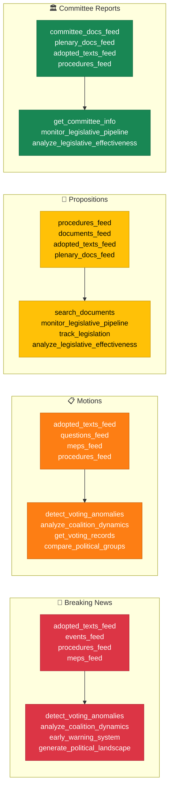
```mermaid
flowchart LR
    subgraph "🔴 Breaking News"
        B1["adopted_texts_feed\nevents_feed\nprocedures_feed\nmeps_feed"] --> B2["detect_voting_anomalies\nanalyze_coalition_dynamics\nearly_warning_system\ngenerate_political_landscape"]
    end

    subgraph "📋 Motions"
        M1["adopted_texts_feed\nquestions_feed\nmeps_feed\nprocedures_feed"] --> M2["detect_voting_anomalies\nanalyze_coalition_dynamics\nget_voting_records\ncompare_political_groups"]
    end

    subgraph "📜 Propositions"
        P1["procedures_feed\ndocuments_feed\nadopted_texts_feed\nplenary_docs_feed"] --> P2["search_documents\nmonitor_legislative_pipeline\ntrack_legislation\nanalyze_legislative_effectiveness"]
    end

    subgraph "🏛️ Committee Reports"
        C1["committee_docs_feed\nplenary_docs_feed\nadopted_texts_feed\nprocedures_feed"] --> C2["get_committee_info\nmonitor_legislative_pipeline\nanalyze_legislative_effectiveness"]
    end

    style B1 fill:#dc3545,stroke:#b02a37,color:#fff
    style B2 fill:#dc3545,stroke:#b02a37,color:#fff
    style M1 fill:#fd7e14,stroke:#ca6510,color:#fff
    style M2 fill:#fd7e14,stroke:#ca6510,color:#fff
    style P1 fill:#ffc107,stroke:#cc9a06,color:#000
    style P2 fill:#ffc107,stroke:#cc9a06,color:#000
    style C1 fill:#198754,stroke:#146c43,color:#fff
    style C2 fill:#198754,stroke:#146c43,color:#fff
```

| Workflow | Mandatory Feed Data | Mandatory Analytical Tools | Unique Focus |
|----------|--------------------|-----------------------------|--------------|
| **Breaking** | adopted_texts, events, procedures, meps (today→one-week) + documents, plenary_docs, committee_docs, questions | detect_voting_anomalies, analyze_coalition_dynamics, early_warning_system, generate_political_landscape | ⚡ Only TODAY's items; 6-hour cycle |
| **Motions** | adopted_texts, parliamentary_questions, meps, procedures | detect_voting_anomalies, analyze_coalition_dynamics, get_voting_records, compare_political_groups | 🗳️ Per-resolution vote breakdowns |
| **Propositions** | procedures, documents, adopted_texts, plenary_documents | search_documents, monitor_legislative_pipeline, track_legislation, analyze_legislative_effectiveness | 📜 Procedure stage tracking |
| **Committee** | committee_documents, plenary_documents, adopted_texts, procedures | get_committee_info, monitor_legislative_pipeline, analyze_legislative_effectiveness | 🏛️ Per-committee deep analysis |
| **Week Ahead** | events, procedures, plenary_documents, plenary_session_documents | get_plenary_sessions (future), get_committee_info, monitor_legislative_pipeline, generate_political_landscape | 📅 Prospective agenda analysis |
| **Weekly Review** | adopted_texts, procedures, plenary_documents, parliamentary_questions | get_voting_records, detect_voting_anomalies, generate_political_landscape | 📊 Retrospective outcome review |
| **Month Ahead** | events, procedures, plenary/committee docs, adopted_texts, session docs, meps | get_plenary_sessions, get_committee_info, monitor_pipeline, generate_landscape, compare_groups, analyze_delegation | 📆 Strategic calendar outlook |
| **Monthly Review** | adopted_texts, procedures, plenary_documents, parliamentary_questions | get_voting_records, detect_anomalies, generate_landscape, compare_groups, analyze_effectiveness | 📈 Comprehensive monthly trends |
| **Translate** | — (consumes English articles) | — | 🌐 EN → 13 languages |

> **PRIO 1 MANDATE:** Each workflow ALWAYS downloads its mandatory feed data and runs its mandatory analytical tools BEFORE deciding whether to produce an article. Data collection is NEVER skipped, even for noop runs.

---

### 1b. Agentic News Workflows (gh-aw)

**📄 Files:** `.github/workflows/news-*.md` (14 content workflows + 1 translation workflow)
**🎯 Purpose:** AI-powered news article generation using GitHub Agentic Workflows (gh-aw) with European Parliament MCP Server data
**⏰ Schedule:** Various (see table below)

#### Architecture: Content/Translation Split

The agentic news system uses a **separation of concerns** architecture:

1. **Content Workflows** (14 workflows) → Generate English-only articles with deep political intelligence
2. **Translation Workflow** (1 workflow) → Translates English articles to 13 other languages

This split ensures content workflows spend their full time budget on political intelligence quality, while translations maintain fidelity to the English source content.

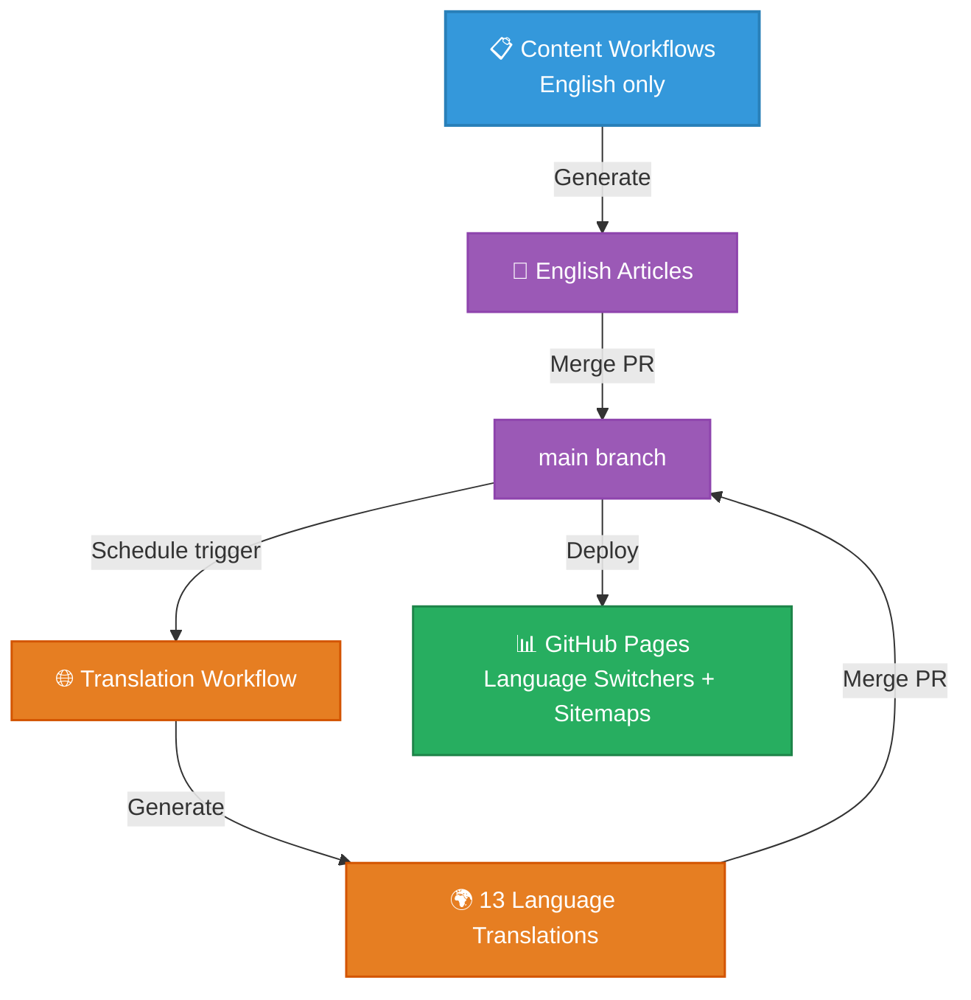
```mermaid
graph TD
    A[📋 Content Workflows<br/>English only] -->|Generate| B[📰 English Articles]
    B -->|Merge PR| C[main branch]
    C -->|Schedule trigger| D[🌐 Translation Workflow]
    D -->|Generate| E[🌍 13 Language Translations]
    E -->|Merge PR| C
    C -->|Deploy| F[📊 GitHub Pages<br/>Language Switchers + Sitemaps]

    classDef trigger fill:#3498db,stroke:#2980b9,stroke-width:2px,color:white
    classDef process fill:#9b59b6,stroke:#8e44ad,stroke-width:1.5px,color:white
    classDef deploy fill:#27ae60,stroke:#1e8449,stroke-width:1.5px,color:white
    classDef translation fill:#e67e22,stroke:#d35400,stroke-width:1.5px,color:white

    class A trigger
    class B,C process
    class D,E translation
    class F deploy
```

#### Content Workflow Schedule

| Workflow Pair (analysis + article) | Article Type | Analysis Schedule | Focus |
|------------------------------------|--------------|-------------------|-------|
| 🤖 Workflow | 🏷️ Type | 📅 Schedule | 🎯 Purpose |
|---|---|---|---|
| `news-committee-reports.md` | committee-reports | Mon–Fri 04:00 UTC | Committee activity analysis |
| `news-propositions.md` | propositions | Mon–Fri 05:00 UTC | Legislative pipeline tracking |
| `news-motions.md` | motions | Mon–Fri 06:00 UTC | Voting patterns & resolutions |
| `news-week-ahead.md` | week-ahead | Fri 07:00 UTC | Upcoming parliamentary agenda |
| `news-month-ahead.md` | month-ahead | 1st of month 08:00 UTC | Monthly strategic outlook |
| `news-week-in-review.md` | week-in-review | Sat 09:00 UTC | Week in review |
| `news-month-in-review.md` | month-in-review | 28th of month 10:00 UTC | Monthly retrospective |
| `news-breaking.md` | breaking | Every 6 hours | Real-time EP feed events |

> Each `news-<type>.md` runs the full Stage A→E protocol in one ~60-minute session and produces exactly one PR with both analysis artifacts and the rendered article HTML. The earlier split-pair `news-<type>-analysis.md` + `news-<type>-article.md` layout and the manual `news-article-generator.md` helper were **deleted** in the April-2026 aggregator-pipeline migration (the prior legacy single-job `news-<type>.md` were briefly replaced by split pairs in 2025 because those exceeded the safeoutputs MCP TTL — the unified workflows now use `engine.mcp.session-timeout: 65m` (gh-aw v0.71.3+) to keep the safeoutputs HTTP session alive for the full run, with the PR call landing by minute ≤ 45 of the 60-min `timeout-minutes` cap).

#### Translation Workflow

| Workflow | Schedule | Purpose |
|----------|----------|---------|
| `news-translate.md` | Mon–Fri 07/09/12/15/17/19 UTC, Sat–Sun 09/12/15 UTC | Translate English articles to sv, da, no, fi, de, fr, es, nl, ar, he, ja, ko, zh |

#### Supported Languages (14 total)

| English (en) | Swedish (sv) | Danish (da) | Norwegian (no) | Finnish (fi) |
|:---:|:---:|:---:|:---:|:---:|
| **German (de)** | **French (fr)** | **Spanish (es)** | **Dutch (nl)** | **Arabic (ar)** |
| **Hebrew (he)** | **Japanese (ja)** | **Korean (ko)** | **Chinese (zh)** | |

#### Security Controls

| Control | Implementation | ISMS Reference |
|---------|----------------|----------------|
| **MCP Data Source** | European Parliament MCP Server (live data) | ISO 27001 A.14.2.1 |
| **Content Integrity** | Quality validation, synthetic ID detection | Data integrity |
| **Safe Outputs** | gh-aw safe-outputs for PR creation | Least privilege |
| **Concurrency** | Shared concurrency group prevents conflicts | Resource management |
| **Network Allowlist** | Explicit domain allowlisting via gh-aw | Network security |

#### Enhanced Analysis Features (v2)

The following 14 unified article-generation workflows include mandatory analytical enhancements: `news-breaking.md`, `news-week-ahead.md`, `news-month-ahead.md`, `news-quarter-ahead.md`, `news-year-ahead.md`, `news-term-outlook.md`, `news-election-cycle.md`, `news-week-in-review.md`, `news-month-in-review.md`, `news-quarter-in-review.md`, `news-year-in-review.md`, `news-committee-reports.md`, `news-propositions.md`, `news-motions.md`. The `news-translate.md` workflow has complementary analysis-fidelity requirements for preserving these elements in translation.

##### 🎭 Multi-Stakeholder Perspective Requirements

Every major parliamentary action must be analyzed from **at least 3 of 6 stakeholder perspectives**:

| Perspective | Analysis Focus |
|-------------|---------------|
| **EP Political Groups** | Coalition dynamics, group influence, voting alliances |
| **Civil Society & NGOs** | Citizens' rights, democratic participation, transparency |
| **Industry & Business** | Regulatory burden, market effects, compliance dynamics |
| **National Governments** | Subsidiarity, implementation requirements, national interests |
| **EU Citizens** | Direct life impact, rights, services, democratic representation |
| **EU Institutions** | Commission, Council, ECB, Court of Justice — inter-institutional dynamics |

Stakeholder perspective analysis is rendered by the TypeScript generator (`buildStakeholderPerspectivesSection`) as a card grid in each article's deep-analysis portion. Agents provide structured perspective content — impact direction (positive/negative/neutral/mixed), severity (high/medium/low), reasoning, and evidence backed by specific EP MCP data citations — and the generator handles the HTML markup (`analysis-stakeholder-perspectives` / `stakeholder-perspectives-grid`). Agents must NOT write raw HTML for this section. Impact and severity values must remain as canonical English enum tokens (e.g. `positive`, `high`) even in non-English articles — the generator handles localized display labels and CSS classing from these tokens. (Note: the separate winners/losers outcomes list uses `analysis-stakeholders` / `stakeholder-list` — that is a different section rendered by `buildStakeholderSection`.)

##### 🔄 Iterative AI Content Refinement Cycle

All analytical content sections follow a mandatory 4-pass refinement process:

| Pass | Activity | Output |
|------|----------|--------|
| **Pass 1 — Initial Assessment** | Gather MCP baseline data; identify actors, actions, outcomes | Draft narrative |
| **Pass 2 — Stakeholder Challenge** | Re-examine from each stakeholder angle; flag blind spots | Revised draft with gaps identified |
| **Pass 3 — Evidence Cross-Validation** | Verify claims against EP documents/votes; add 🟢/🟡/🔴 confidence indicators | Evidenced assertions only |
| **Pass 4 — Synthesis & Scenarios** | Produce balanced conclusions; provide 2–3 forward-looking scenarios with probability labels | Final publishable analysis |

> **Localization requirement**: All text labels — confidence (🟢 High / 🟡 Medium / 🔴 Low), probability (likely / possible / unlikely), and significance (High / Medium / Low) — must be rendered in the article's output language while preserving the underlying 3-level scale and keeping emoji markers (🟢/🟡/🔴, ↑↓→) unchanged. Non-English articles must use the equivalent terms in the target language, not English labels.

##### ✅ Enhanced Analysis Quality Gates

In addition to the existing content quality gates (500-word minimum, no synthetic IDs, current dates), all articles must pass **two new quality gate categories**:

**Analysis Depth Gates:**
- Minimum 3 stakeholder perspectives analyzed per key development
- SWOT dimensions cover both political AND economic/regulatory aspects
- Dashboard trend indicators included (↑↓→), not just current values
- Cross-domain policy links shown (e.g., environment ↔ trade ↔ social)
- Evidence chains cite specific document IDs, vote counts, or MCP data points
- Outlook provides at least 2 named scenarios with probability labels

**Political Intelligence Gates:**
- Coalition dynamics named explicitly (not just "EPP and S&D voted together")
- Each group's position explained with reasoning (incentives, ideology, constituency)
- Winner/loser analysis identified with supporting evidence
- Historical EP context referenced where comparable precedents exist

##### 📄 EP Document Analysis Framework

Every key EP document featured in the deep-analysis section must include structured analysis (other document references may remain as citations without full framework analysis):
1. **Political Context** — Why introduced? Who pushed it? What problem does it solve?
2. **Stakeholder Impact** — Who benefits/faces costs? Quantified where possible.
3. **Procedure Stage** — Where in the legislative pipeline? Next steps and timeline.
4. **Coalition Dynamics** — Which groups support/oppose? Key fault lines.
5. **Significance Rating** — High / Medium / Low with one-sentence justification. (Note: significance ratings use text labels, not color indicators, to avoid confusion with the 🟢/🟡/🔴 confidence scale used in the refinement cycle.)

##### 🔬 Workflow-Specific Intelligence Modules

Each scheduled content workflow includes a tailored intelligence module beyond the shared framework:

| Workflow | Module | Focus |
|----------|--------|-------|
| `news-week-ahead.md` | 🔭 Strategic Preview Analysis | What to watch, coalitions under stress, legislative inflection points, geopolitical triggers |
| `news-month-ahead.md` | 📈 Long-Term Trend Context | Term trajectory, policy momentum, coalition evolution, EU external context |
| `news-quarter-ahead.md` | 🧭 Quarterly Outlook | Coalition stability projection, policy momentum, blocking coalitions |
| `news-year-ahead.md` | 🔮 Annual Forward Projection | Multi-quarter trajectory, electoral pressure, partisan/coalition shifts |
| `news-term-outlook.md` | 🏛️ Term-Length Strategic Outlook | Multi-year coalition viability, mandate-fulfillment trajectory |
| `news-election-cycle.md` | 🗳️ Electoral-Cycle Intelligence | Cycle-position drivers, group-volatility forecast |
| `news-breaking.md` | ⚡ Rapid Stakeholder Impact Assessment | Immediate winners/losers, market/policy signals, next 24–48 hour tracking |
| `news-committee-reports.md` | 🏛️ Committee Power Dynamics Analysis | Rapporteur influence, shadow rapporteur positions, amendment landscape, trilogue implications |
| `news-propositions.md` | 🗓️ Legislative Pipeline Intelligence | Passage probability, amendment expectations, timeline forecast, blocking coalitions |
| `news-motions.md` | 🗳️ Voting Pattern Intelligence | Coalition map, abstention analysis, cross-party defections, margin analysis |
| `news-week-in-review.md` | 📊 Week-in-Context Analysis | Parliamentary landscape shift, promises vs. delivery, surprise developments |
| `news-month-in-review.md` | 🗺️ Monthly Trend Synthesis | Legislative productivity, coalition stability index, policy trajectory, emerging themes |
| `news-quarter-in-review.md` | 📚 Quarterly Retrospective | Coalition stability index, productivity benchmarks |
| `news-year-in-review.md` | 📆 Annual Retrospective | Year-long trend confirmation, accountability ledger |

The translation workflow has its own fidelity module:

| Workflow | Module | Focus |
|----------|--------|-------|
| `news-translate.md` | 🌐 Analysis Fidelity Requirements | Stakeholder framing preservation, confidence indicator translation, EP official terminology |

---

**📄 File:** `.github/workflows/test-and-report.yml`  
**🎯 Purpose:** Comprehensive testing with unit tests, integration tests, coverage reporting, and performance benchmarks  
**⏰ Trigger:** On push to main, on PR to main  
**📊 Status:** [](https://github.com/Hack23/euparliamentmonitor/actions/workflows/test-and-report.yml)

#### Test Coverage

| Test Type | Framework | Coverage Target | Current Status |
|-----------|-----------|----------------|----------------|
| **Unit Tests** | Vitest 4.1.4 (happy-dom) | 52 test files | ✅ 3061+ passing |
| **Integration Tests** | Vitest + MCP contract suites (`test/integration/mcp-integration.test.js`, `test/integration/mcp/imf-mcp.test.js`, `test/integration/mcp/worldbank-mcp.test.js`) | IMF/WB canonical tool lists asserted via drift-guard tests; EP MCP covered by `mcp-integration.test.js` (no canonical `EP_MCP_TOOLS` export yet) | ✅ All passing |
| **Line Coverage** | Vitest (V8) | ≥80% | ✅ 82%+ |
| **Branch Coverage** | Vitest (V8) | ≥75% | ✅ 83%+ |
| **Function Coverage** | Vitest (V8) | ≥80% | ✅ 89%+ |
| **E2E** | Playwright 1.59.1 + @axe-core/playwright 4.11.2 | WCAG 2.1 AA | ✅ Passing |

#### Workflow Jobs (6 Jobs)

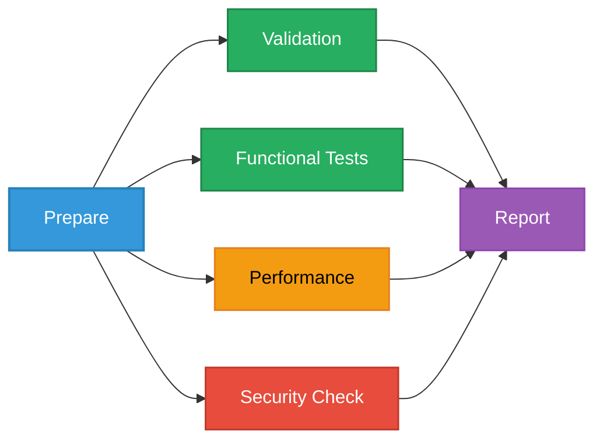
```mermaid
graph LR
    A[Prepare] --> B[Validation]
    A --> C[Functional Tests]
    A --> D[Performance]
    A --> E[Security Check]
    B --> F[Report]
    C --> F
    D --> F
    E --> F

    classDef prepare fill:#3498db,stroke:#2980b9,stroke-width:2px,color:white
    classDef test fill:#27ae60,stroke:#1e8449,stroke-width:1.5px,color:white
    classDef security fill:#e74c3c,stroke:#c0392b,stroke-width:1.5px,color:white
    classDef perf fill:#f39c12,stroke:#e67e22,stroke-width:1.5px,color:black
    classDef report fill:#9b59b6,stroke:#8e44ad,stroke-width:1.5px,color:white

    class A prepare
    class B,C test
    class D perf
    class E security
    class F report
```

| Job | Name | Purpose | Key Steps |
|-----|------|---------|-----------|
| `prepare` | Prepare Environment | Cache dependencies, setup Node.js 25 | Checkout, npm ci, cache |
| `validation` | Validate Code | ESLint, Prettier, HTMLHint, npm audit | Lint, format check, HTML validation |
| `functional-tests` | Functional Tests | Vitest unit + integration tests | Run tests, coverage report |
| `performance` | Performance Testing | Lighthouse CI + article generation benchmarks | `@lhci/cli@0.15.1`, performance metrics |
| `security-check` | Security Check | npm audit analysis | Vulnerability triage, CodeQL integration |
| `report` | Generate Report | Aggregate results, PR comments | Coverage summary, status checks |

#### Security Controls

| Control | Implementation | ISMS Reference |
|---------|----------------|----------------|
| **Code Quality** | ESLint + Prettier | Code quality standards |
| **Vulnerability Scanning** | npm audit | ISO 27001 A.12.6.1 |
| **Coverage Thresholds** | 80%+ lines, 75%+ branches | Quality gates |
| **Performance Benchmarks** | Lighthouse CI scoring | Performance validation |
| **False Positive Handling** | Intelligent npm audit triage | Risk acceptance process |

#### ISMS Evidence

- **Policy:** [Secure Development Policy §3.3 - Testing Requirements](https://github.com/Hack23/ISMS-PUBLIC/blob/main/Secure_Development_Policy.md#33-testing-requirements)
- **Workflow:** [test-and-report.yml](.github/workflows/test-and-report.yml)
- **Coverage Report:** [Live Coverage](https://hack23.github.io/euparliamentmonitor/docs/coverage/)

---

### 2b. Knip — Unused Code Detection

**📄 File:** `.github/workflows/knip.yml`  
**🎯 Purpose:** Detect unused files, exports, dependencies, and types across `src/**` and the hand-written scripts in `scripts/**` so the codebase stays lean ahead of releases.  
**⏰ Trigger:** On push to `main`, on PR to `main`  
**📊 Mode:** ⚠️ **Warning-only** (`continue-on-error: true`) until the baseline stabilises across two consecutive PR cycles, then flipped to blocking.

#### What Knip Scans

| Surface | Coverage |
|---------|----------|
| **Source files** | `src/**/*.ts` (the authoritative TypeScript tree) |
| **Hand-written JS** | All `scripts/**/*.js` files referenced from `package.json` scripts are auto-discovered (e.g. `scripts/copy-vendor.js`, `scripts/lint-prompts.js`, `scripts/validate-analysis-completeness.js`); files only invoked from agentic-workflow `.md` bodies (e.g. `scripts/backport-article-seo.js`, `scripts/aggregator/forward-statements-registry.js`) are listed explicitly in `knip.json` `entry` |
| **Test fixtures** | `test/**/*.test.js`, `e2e/**/*.spec.js` |
| **Compiled `scripts/**`** | Excluded from `project` (it is a 1:1 build output of `src/**`); CLI entry points are auto-discovered via the `package.json` `exports` map |
| **Generated artefacts** | `analysis/**`, `data/**`, `news/**`, `docs/**`, `coverage/**`, `js/vendor/**` — never scanned |

#### Configuration

The full configuration lives in [`knip.json`](./knip.json). Highlights:

- **Entries** explicitly list every CLI / npm-script / agentic-workflow-invoked script that knip cannot otherwise reach (e.g. scripts referenced only from `.github/workflows/*.md` gh-aw bodies).
- **`ignoreDependencies`** covers runtime-spawned packages (`european-parliament-mcp-server` — launched via `npx` by the MCP gateway, not imported), browser-vendored bundles (`chart.js`, `d3`, `mermaid`, `chartjs-plugin-annotation`, `papaparse` — copied by `scripts/copy-vendor.js`), and config-only tooling (`jscpd`, `lint-staged`, `eslint-config-prettier`, `ts-api-utils`).
- **Runtime-spawned tools** (e.g. `european-parliament-mcp-server` invoked via `npx` by the MCP gateway, never imported as a library) are listed in `ignoreDependencies` so they are not flagged as unused.

#### Local Workflow

```bash
npm run knip            # show all unused files / exports / deps
npm run knip:production # production-only mode (skips test entries)
npm run knip:fix        # auto-remove unused exports (use with care, review diff)
```

#### Triage Categories

| Finding | Category | Action |
|---|---|---|
| Unused **file** | (a) should be wired up | Open follow-up issue; do not delete |
| Unused **export** | (b) used by workflow not detected | Refine `entry`/`project` in `knip.json` (preferred) or add comment-justified ignore |
| Unused **dependency** | (c) truly unused | Remove from `package.json`, run `npm install`, commit lockfile |
| Unused **type** | (c) truly unused | Delete and update tests |

Prefer fixing knip's view of the world over adding ignores. Every ignore must carry an inline `$comment` or a one-line rationale in the PR description.

#### Workflow Jobs

| Job | Name | Purpose | Key Steps |
|-----|------|---------|-----------|
| `knip` | Knip Scan | Unused-code detection | Checkout → setup Node 25 → `npm ci` → `npm run build` → `npm run knip` → write `$GITHUB_STEP_SUMMARY` → upload `knip-output.txt` artefact (14-day retention) |

The job runs `npm run build` first because knip resolves imports through the `package.json` `exports` map, which points at compiled `scripts/**`.

#### Security Controls

| Control | Implementation | ISMS Reference |
|---------|----------------|----------------|
| **Hardened Runner** | `step-security/harden-runner` (audit egress) | ISO 27001 A.8.16 |
| **Read-only permissions** | `contents: read`, `pull-requests: read` | ISO 27001 A.5.15 |
| **SHA-pinned actions** | All third-party actions pinned by digest | ISO 27001 A.8.30 |
| **Concurrency control** | `cancel-in-progress: true` per ref | Resource hygiene |

#### ISMS Evidence

- **Policy:** [Secure Development Policy §3.2 - Code Quality Standards](https://github.com/Hack23/ISMS-PUBLIC/blob/main/Secure_Development_Policy.md)
- **Workflow:** [knip.yml](.github/workflows/knip.yml)
- **Configuration:** [knip.json](./knip.json)

---

### 3. CodeQL Security Scanning

**📄 File:** `.github/workflows/codeql.yml`  
**🎯 Purpose:** Static Application Security Testing (SAST) for JavaScript/TypeScript and GitHub Actions  
**⏰ Schedule:** On push to main, on PR to main, weekly Saturday 21:33 UTC  
**📊 Status:** [](https://github.com/Hack23/euparliamentmonitor/actions/workflows/codeql.yml)

#### Security Analysis

| Parameter | Value |
|-----------|-------|
| **Languages** | `javascript-typescript`, `actions` |
| **Build Mode** | `none` (interpreted languages) |
| **Query Suite** | Security Extended |
| **Analysis Type** | Source code + dependencies |

**Vulnerability Types Detected:**
- SQL Injection
- XSS (Cross-Site Scripting)
- Path Traversal
- Command Injection
- Unsafe Deserialization
- GitHub Actions expression injection

#### Security Controls

| Control | Implementation | ISMS Reference |
|---------|----------------|----------------|
| **SAST Scanning** | CodeQL security-extended (JS/TS + Actions) | ISO 27001 A.14.2.5 |
| **Automated Analysis** | On every PR + push | Shift-left security |
| **SHA-Pinned Actions** | All actions pinned to SHA | Supply chain security |
| **Security Alerts** | GitHub Security tab integration | Incident response |

#### ISMS Evidence

- **Policy:** [Secure Development Policy §4.3 - Security Scanning](https://github.com/Hack23/ISMS-PUBLIC/blob/main/Secure_Development_Policy.md#43-security-scanning)
- **Workflow:** [codeql.yml](.github/workflows/codeql.yml)
- **Security Architecture:** [SECURITY_ARCHITECTURE.md §CodeQL Analysis](SECURITY_ARCHITECTURE.md)

---

### 4. E2E Testing Workflow

**📄 File:** `.github/workflows/e2e.yml`  
**🎯 Purpose:** End-to-end testing with Playwright across browsers  
**⏰ Schedule:** On push to main, on PR to main, daily at midnight UTC  
**📊 Status:** [](https://github.com/Hack23/euparliamentmonitor/actions/workflows/e2e.yml)

#### Test Coverage

- **Browser:** Chromium (optimised for speed)
- **Timeout:** 60 minutes
- **Test Categories:**
  - Homepage validation
  - Accessibility (axe-core integration)
  - Responsive design
  - Multi-language support (14 languages)
- **Artifacts:** Screenshots, videos, HTML reports

#### Security Controls

| Control | Implementation | ISMS Reference |
|---------|----------------|----------------|
| **Accessibility Testing** | axe-core WCAG AA compliance | Inclusive security |
| **Visual Regression** | Screenshot comparison | Quality assurance |
| **Functional Validation** | User workflow testing | Requirements validation |
| **Daily Regression** | Scheduled midnight UTC | Continuous validation |

#### ISMS Evidence

- **Workflow:** [e2e.yml](.github/workflows/e2e.yml)
- **Test Reports:** [Live E2E Report](https://hack23.github.io/euparliamentmonitor/playwright-report/)

---

### 5. Release Workflow

**📄 File:** `.github/workflows/release.yml`  
**🎯 Purpose:** Comprehensive release automation with attestations and documentation  
**⏰ Trigger:** Manual dispatch (with version input) or tag push (`v*`)  
**📊 Status:** [](https://github.com/Hack23/euparliamentmonitor/actions/workflows/release.yml)

#### Release Pipeline

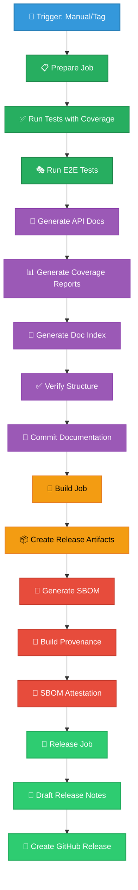
```mermaid
graph TD
    A[🚀 Trigger: Manual/Tag] --> B[📋 Prepare Job]
    B --> C[✅ Run Tests with Coverage]
    C --> D[🎭 Run E2E Tests]
    D --> E[📖 Generate API Docs]
    E --> F[📊 Generate Coverage Reports]
    F --> G[🎨 Generate Doc Index]
    G --> H[✅ Verify Structure]
    H --> I[💾 Commit Documentation]
    I --> J[🔨 Build Job]
    J --> K[📦 Create Release Artifacts]
    K --> L[🔐 Generate SBOM]
    L --> M[📜 Build Provenance]
    M --> N[🔏 SBOM Attestation]
    N --> O[🚀 Release Job]
    O --> P[📝 Draft Release Notes]
    P --> Q[🎉 Create GitHub Release]

    classDef trigger fill:#3498db,stroke:#2980b9,stroke-width:2px,color:white
    classDef test fill:#27ae60,stroke:#1e8449,stroke-width:1.5px,color:white
    classDef docs fill:#9b59b6,stroke:#8e44ad,stroke-width:1.5px,color:white
    classDef build fill:#f39c12,stroke:#e67e22,stroke-width:1.5px,color:black
    classDef security fill:#e74c3c,stroke:#c0392b,stroke-width:1.5px,color:white
    classDef release fill:#2ecc71,stroke:#27ae60,stroke-width:2px,color:white

    class A trigger
    class B,C,D test
    class E,F,G,H,I docs
    class J,K build
    class L,M,N security
    class O,P,Q release
```

#### Release Jobs

| Job | Name | Key Permissions |
|-----|------|----------------|
| `prepare` | Prepare Release | `contents: write` |
| `build` | Build Release Package | `contents: read`, `id-token: write`, `attestations: write` |
| `release` | Create Release | `contents: write`, `id-token: write` |

#### Documentation as Code

Every release automatically generates:

| Documentation | Generator | Output |
|--------------|-----------|--------|
| **API Documentation** | JSDoc | 52 files, searchable |
| **Test Coverage** | Vitest HTML | Interactive reports |
| **E2E Test Reports** | Playwright | Screenshots, videos |
| **Documentation Index** | Custom script | Beautiful hub page |

#### Security Controls

| Control | Implementation | ISMS Reference |
|---------|----------------|----------------|
| **SLSA Level 3** | Build provenance attestation + npm provenance (`--provenance` flag on publish) | Supply chain security |
| **SBOM Generation** | SPDX JSON format via `anchore/sbom-action` | NTIA SBOM minimum elements |
| **Artifact Signing** | GitHub Attestations API (Sigstore, OIDC keyless) | Integrity verification |
| **npm Registry** | Published to `registry.npmjs.org/euparliamentmonitor` with Sigstore provenance | Supply chain transparency |
| **Documentation Audit Trail** | Committed to main branch | Evidence trail |
| **Test Validation** | 3061+ unit/integration tests + E2E Playwright | Quality gates |

#### ISMS Evidence

- **Policy:** [Secure Development Policy §3.2 - Architecture Documentation](https://github.com/Hack23/ISMS-PUBLIC/blob/main/Secure_Development_Policy.md#32-architecture-documentation)
- **Workflow:** [release.yml](.github/workflows/release.yml)
- **Release Guide:** [docs/RELEASE_PROCESS.md](docs/RELEASE_PROCESS.md)
- **Attestations:** [GitHub Attestations](https://github.com/Hack23/euparliamentmonitor/attestations)
- **Documentation:** [docs/index.html](https://hack23.github.io/euparliamentmonitor/docs/)

---

### 6. Dependency Review Workflow

**📄 File:** `.github/workflows/dependency-review.yml`  
**🎯 Purpose:** Supply chain security scanning for pull requests  
**⏰ Trigger:** On pull request  
**📊 Status:** Dependency review enabled

#### Security Controls

| Control | Implementation | ISMS Reference |
|---------|----------------|----------------|
| **License Compliance** | Allowed licenses only | Legal compliance |
| **Vulnerability Detection** | Known CVEs blocked | ISO 27001 A.12.6.1 |
| **Supply Chain Security** | Dependency graph analysis | NIST CSF ID.SC |

#### ISMS Evidence

- **Policy:** [Supply Chain Security](https://github.com/Hack23/ISMS-PUBLIC/blob/main/Secure_Development_Policy.md#44-supply-chain-security)
- **Workflow:** [dependency-review.yml](.github/workflows/dependency-review.yml)

---

### 7. OpenSSF Scorecard Workflow

**📄 File:** `.github/workflows/scorecards.yml`  
**🎯 Purpose:** Security posture assessment against OpenSSF best practices  
**⏰ Schedule:** Weekly on Tuesday 07:20 UTC, push to main, branch protection rule  
**📊 Status:** [](https://scorecard.dev/viewer/?uri=github.com/Hack23/euparliamentmonitor)

#### Assessed Security Practices

- Binary artifacts
- Branch protection
- CI tests
- Code review
- Dangerous workflows
- Dependency update tool
- Fuzzing
- License
- Maintained
- Pinned dependencies
- SAST
- Security policy
- Signed releases
- Token permissions
- Vulnerabilities

#### ISMS Evidence

- **Workflow:** [scorecards.yml](.github/workflows/scorecards.yml)
- **Live Score:** [View Scorecard](https://scorecard.dev/viewer/?uri=github.com/Hack23/euparliamentmonitor)

---

### 8. Deploy S3 Workflow

**📄 File:** `.github/workflows/deploy-s3.yml`  
**🎯 Purpose:** Production deployment to AWS S3 + CloudFront  
**⏰ Trigger:** Push to main  
**📊 Status:** Production deployment

#### Deployment Pipeline


```mermaid
graph LR
    A[Push to main] --> B[Checkout Code]
    B --> C[🔒 Harden Runner<br/>egress: BLOCK]
    C --> D[Configure AWS OIDC]
    D --> E[Sync to S3]
    E --> F[Invalidate CloudFront]
    F --> G[✅ Production Live]

    classDef trigger fill:#3498db,stroke:#2980b9,stroke-width:2px,color:white
    classDef security fill:#e74c3c,stroke:#c0392b,stroke-width:1.5px,color:white
    classDef aws fill:#FF9900,stroke:#232F3E,stroke-width:1.5px,color:white
    classDef complete fill:#27ae60,stroke:#1e8449,stroke-width:2px,color:white

    class A trigger
    class B,C security
    class D,E,F aws
    class G complete
```

> **Note:** `deploy-s3.yml` is the **only workflow** using `egress-policy: block` (all other workflows use `audit`). Outbound network calls are restricted to an explicit allowlist defined in the `allowed-endpoints` parameter of the Harden Runner step within [deploy-s3.yml](.github/workflows/deploy-s3.yml).

#### Security Controls

| Control | Implementation | ISMS Reference |
|---------|----------------|----------------|
| **OIDC Federation** | `aws-actions/configure-aws-credentials` with role ARN | No long-lived secrets |
| **Egress Block Mode** | Harden Runner blocks all non-allowlisted endpoints | Network security |
| **IAM Least Privilege** | Minimal S3 + CloudFront permissions | AWS security best practices |
| **HTTPS Only** | CloudFront SSL/TLS distribution | Data in transit protection |
| **Infrastructure as Code** | GitHub Actions workflow | Reproducible deployments |

#### ISMS Evidence

- **Workflow:** [deploy-s3.yml](.github/workflows/deploy-s3.yml)
- **Architecture:** [SECURITY_ARCHITECTURE.md §Deployment](SECURITY_ARCHITECTURE.md)

---

### 9. REUSE Compliance Workflow

**📄 File:** `.github/workflows/reuse.yml`  
**🎯 Purpose:** License and copyright compliance verification using the [REUSE Specification](https://reuse.software/spec/)  
**⏰ Schedule:** On push to main, on PR to main, weekly Monday 06:00 UTC  
**📊 Status:** [](https://github.com/Hack23/euparliamentmonitor/actions/workflows/reuse.yml)

#### License Compliance Scope

| Artifact | License | SPDX Header Required |
|----------|---------|----------------------|
| **Source scripts** (`scripts/`) | Apache-2.0 | ✅ Yes |
| **Test files** (`test/`, `e2e/`) | Apache-2.0 | ✅ Yes |
| **HTML pages** (`index-*.html`) | Apache-2.0 | ✅ Yes |
| **Workflow files** (`.github/workflows/`) | Apache-2.0 | ✅ Yes |
| **Binary assets** | Declared in `REUSE.toml` | Via manifest |

#### Security Controls

| Control | Implementation | ISMS Reference |
|---------|----------------|----------------|
| **License Verification** | SPDX header validation on every file | Open Source Policy |
| **Copyright Compliance** | Per-file copyright tracking | IP management |
| **Supply Chain Clarity** | Machine-readable `REUSE.toml` | NIST CSF ID.SC-4 |
| **SHA-Pinned Action** | `fsfe/reuse-action` pinned to SHA | Supply chain security |

#### ISMS Evidence

- **Policy:** [Open Source Policy](https://github.com/Hack23/ISMS-PUBLIC/blob/main/Open_Source_Policy.md)
- **Workflow:** [reuse.yml](.github/workflows/reuse.yml)
- **Configuration:** [REUSE.toml](REUSE.toml)

---

### 10. SLSA Provenance (Integrated in Release Workflow)

**📄 File:** `.github/workflows/release.yml`  
**🎯 Purpose:** Generate cryptographic build provenance for supply chain integrity verification  
**⏰ Trigger:** On tag push (v*) + manual dispatch with version input  
**📊 Status:** [](https://github.com/Hack23/euparliamentmonitor/actions/workflows/release.yml)

#### Provenance Generation Pipeline

SLSA Level 3 provenance is generated as part of the release workflow build job. All attestations and SBOM are
created during the build step and attached to the immutable GitHub Release in a single atomic operation.

#### Attestation Artifacts

| Artifact | Action | Verification Command |
|----------|--------|----------------------|
| **Build Provenance** | `actions/attest-build-provenance` (SHA-pinned) | `gh attestation verify --owner Hack23 <file>` |
| **SBOM (SPDX)** | `anchore/sbom-action` + `actions/attest` (SHA-pinned) | `gh attestation verify --owner Hack23 <file>` |
| **Distribution Archive** | `.zip` with excluded dev files | SHA-256 checksum |
| **SBOM JSON** | SPDX format | License compliance check |

#### Security Controls

| Control | Implementation | ISMS Reference |
|---------|----------------|----------------|
| **OIDC Keyless Signing** | `id-token: write` + GitHub Sigstore | SLSA Level 3 |
| **Immutable Release** | `immutableCreate: true` — single-write release | Integrity |
| **Minimal Permissions** | `permissions: read-all` top-level | Least privilege |
| **Harden Runner** | egress audit on all outbound calls | Network security |

#### ISMS Evidence

- **Policy:** [Secure Development Policy §4.4](https://github.com/Hack23/ISMS-PUBLIC/blob/main/Secure_Development_Policy.md#44-supply-chain-security)
- **Workflow:** [release.yml](.github/workflows/release.yml)
- **Attestations:** [GitHub Attestations](https://github.com/Hack23/euparliamentmonitor/attestations)

---

### 11. Compile Agentic Workflows

**📄 File:** `.github/workflows/compile-agentic-workflows.yml`  
**🎯 Purpose:** Compile agentic workflow markdown source files (`.md`) into executable lock files (`.lock.yml`) using the `gh-aw` CLI (pinned `GH_AW_VERSION: v0.71.3`)  
**⏰ Trigger:** Manual dispatch only (`workflow_dispatch`)  
**📊 Status:** [](https://github.com/Hack23/euparliamentmonitor/actions/workflows/compile-agentic-workflows.yml)

> **Version pin contract**: `GH_AW_VERSION: v0.71.3` is a repository-level environment pin in `compile-agentic-workflows.yml`. Bumping this pin requires re-compilation of all 15 `.lock.yml` files, a full PR review, and successful `gh aw compile --validate` across the workflow set. Any `.md` → `.lock.yml` drift is detected by `agentics-maintenance.yml`.

#### Compilation Pipeline

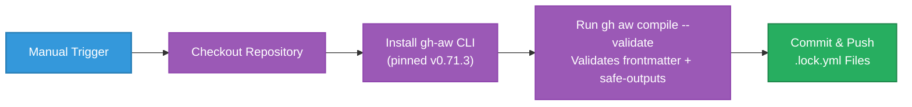
```mermaid
graph LR
    A[Manual Trigger] --> B[Checkout Repository]
    B --> C["Install gh-aw CLI<br/>(pinned v0.71.3)"]
    C --> D["Run gh aw compile --validate<br/>Validates frontmatter + safe-outputs"]
    D --> E["Commit & Push<br/>.lock.yml Files"]

    classDef trigger fill:#3498db,stroke:#2980b9,stroke-width:2px,color:white
    classDef process fill:#9b59b6,stroke:#8e44ad,stroke-width:1.5px,color:white
    classDef output fill:#27ae60,stroke:#1e8449,stroke-width:1.5px,color:white

    class A trigger
    class B,C,D process
    class E output
```

#### gh-aw Architecture Gotchas (AI-First Quality Principle)

| Gotcha | Impact | Mitigation |
|--------|--------|-----------|
| **Bash Tool Call Contract** | Every `bash` tool call in an agentic workflow MUST specify BOTH `command` and `description` parameters — omitting `description` causes silent tool-call rejection | Validator in `gh aw compile --validate` + agent system prompt enforcement |
| **AWF Sandbox Expansion Restrictions** | Dangerous shell expansions (`${var@P}`, chained variable assignments building command substitutions, `${!var}`, `eval`-like constructs) are refused by the sandbox | Agents must not attempt prompt-injection patterns; sandbox logs refused attempts |
| **max-patch-size Tuning** | Default `create-pull-request` `max-patch-size` is **1024 KB**; `news-translate.md` overrides to **10240 KB at top level** to accommodate 14-language fan-out patches | Top-level YAML frontmatter in `news-translate.md` sets the elevated limit |
| **Dynamic file resolution** | Agents must not hallucinate filenames; use `ls -t "news/${TODAY}-${TYPE}"*"-en.html" \| head -1` pattern to resolve latest English source for translation | Pattern documented in workflow system prompts |

#### Security Controls

| Control | Implementation | ISMS Reference |
|---------|----------------|----------------|
| **Manual Trigger Only** | `workflow_dispatch` — no automatic runs | Change control |
| **Version Pin** | `GH_AW_VERSION: v0.71.3` pinned at workflow env | Supply chain integrity |
| **Token Fallback** | `COPILOT_MCP_GITHUB_PERSONAL_ACCESS_TOKEN` with `GITHUB_TOKEN` fallback | Credential management |
| **Write Permissions** | `contents: write`, `pull-requests: write`, `actions: write`, `issues: write` | Least privilege for compilation |

---

### 12. Pull Request Automatic Labeler

**📄 File:** `.github/workflows/labeler.yml`  
**🎯 Purpose:** Automatically label pull requests based on file paths and content  
**⏰ Trigger:** `pull_request_target` (opened, synchronize, reopened, edited)

#### Security Controls

| Control | Implementation | ISMS Reference |
|---------|----------------|----------------|
| **Minimal Job Permissions** | `contents: read`, `pull-requests: write`, `issues: read` | Least privilege |
| **Target Event** | `pull_request_target` — runs on base branch code | Workflow security |

---

### 13. Setup Repository Labels

**📄 File:** `.github/workflows/setup-labels.yml`  
**🎯 Purpose:** Create and manage repository labels for issue/PR governance  
**⏰ Trigger:** Manual dispatch only (`workflow_dispatch` with `recreate_all` input)

#### Security Controls

| Control | Implementation | ISMS Reference |
|---------|----------------|----------------|
| **Manual Trigger Only** | `workflow_dispatch` — deliberate action required | Change control |
| **Minimal Permissions** | `contents: read`, `issues: write` | Least privilege |

---

### 14. Copilot Setup Steps

**📄 File:** `.github/workflows/copilot-setup-steps.yml`  
**🎯 Purpose:** Set up the development environment for GitHub Copilot coding agents  
**⏰ Trigger:** Push/PR to `copilot-setup-steps.yml` file + manual dispatch

#### Environment Setup

| Component | Version / Configuration |
|-----------|------------------------|
| **Node.js** | 25 |
| **EP MCP Server** | `european-parliament-mcp-server` (global) |
| **Playwright Browsers** | Installed for E2E |
| **Virtual Display** | Xvfb (`:99`) |

#### Security Controls

| Control | Implementation | ISMS Reference |
|---------|----------------|----------------|
| **Broad Read Permissions** | Multiple read scopes for agent access | Copilot agent requirement |
| **Write Limited** | Only `pull-requests: write`, `issues: write` | Least privilege for agents |
| **Token Management** | `COPILOT_MCP_GITHUB_PERSONAL_ACCESS_TOKEN` | Credential management |

### 15. Agentics Maintenance

**📄 File:** `.github/workflows/agentics-maintenance.yml`  
**🎯 Purpose:** Housekeeping for the agentic workflow fleet — detect `.md` ↔ `.lock.yml` drift, probe MCP gateway health, prune stale analysis artifacts, verify `GH_AW_VERSION: v0.71.3` is in effect.  
**⏰ Trigger:** Scheduled (weekly) + manual dispatch  

#### Security Controls

| Control | Implementation |
|---------|----------------|
| **Read-only probes** | Health checks write no state to the repo |
| **Drift detection** | Compares `gh aw compile --validate` output against committed `.lock.yml` |
| **PR on drift** | Opens a PR via safe-outputs when lock drift is detected |

---

### 16. News Translate Reconciler

**📄 File:** `.github/workflows/news-translate-reconciler.yml`  
**🎯 Purpose:** Sweep `news/` for English articles that are missing translations in one or more of the 13 target languages (`sv, da, no, fi, de, fr, es, nl, ar, he, ja, ko, zh`) and enqueue backfill runs for `news-translate.md`.  
**⏰ Trigger:** Scheduled (multiple times daily) + manual dispatch  

#### Reconciliation Logic

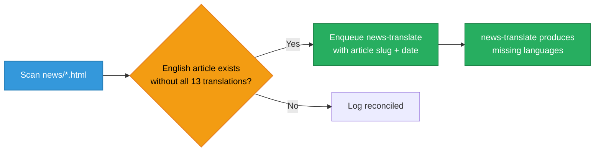
```mermaid
flowchart LR
    A[Scan news/*.html] --> B{English article exists<br/>without all 13 translations?}
    B -- Yes --> C[Enqueue news-translate<br/>with article slug + date]
    B -- No --> D[Log reconciled]
    C --> E[news-translate produces<br/>missing languages]

    classDef scan fill:#3498db,stroke:#2980b9,stroke-width:1.5px,color:white
    classDef decision fill:#f39c12,stroke:#e67e22,stroke-width:1.5px,color:black
    classDef action fill:#27ae60,stroke:#1e8449,stroke-width:1.5px,color:white

    class A scan
    class B decision
    class C,E action
```

#### Security Controls

| Control | Implementation |
|---------|----------------|
| **Scoped dispatch** | Only calls `news-translate.md` with a specific `{slug,date}` input — no arbitrary workflow chaining |
| **max-patch-size coordination** | Translation runs use `news-translate.md`'s top-level 10240 KB max-patch-size for fan-out |
| **Idempotency** | Skips slugs already at 14/14 language coverage |

---

## 🧠 AI-First Quality Principle Enforcement

The AI-First Quality Principle (`.github/skills/ai-first-quality.md`, non-negotiable) governs all agentic content generation. Workflow-level enforcement:

### Mandatory 2-Pass Iterative Improvement

| Pass | Time Budget | Mandatory Outputs |
|------|-------------|-------------------|
| **Pass 1 (~60%)** | First 60% of workflow timeout | Initial narrative draft; full MCP data fetch; first stakeholder perspective pass |
| **Pass 2 (~40%)** | Remaining 40% of workflow timeout | Read-back of entire draft; evidence cross-validation; gap filling; scenario elaboration |

### Time Budget Enforcement

| Workflow timeout | Minimum active time (no early exit) |
|------------------|-------------------------------------|
| 60-minute workflow | ≥45 minutes actively engaged |
| 120-minute workflow (article-generator) | ≥90 minutes actively engaged |

### Quality Gates (Validator — `validate-analysis-completeness`)

Before PR creation, the agentic workflow MUST run:

```bash
node scripts/utils/validate-analysis-completeness.js --article-html="$(ls -t news/${TODAY}-${TYPE}*-en.html | head -1)"
```

which asserts:

- ≥80 words per SWOT item
- ≥150 words per stakeholder perspective
- ≥60% prose ratio (non-HTML text content)
- ≥1 Chart.js visualization embedded
- **0** `[AI_ANALYSIS_REQUIRED]` sentinel markers remaining
- Economic context present: **IMF** (primary economic source, mandatory for policy articles per Stage-C review) and/or **World Bank** (non-economic context). Enforcement is editorial at the Stage-C completeness gate against [`.github/prompts/03-analysis-completeness-gate.md`](.github/prompts/03-analysis-completeness-gate.md)
- `scanHtmlForFallbackLeaks()` returns empty — no `FALLBACK_TEMPLATE_PATTERNS` in output

Reference thresholds (`analysis/methodologies/reference-quality-thresholds.json`):

| Artifact | Min words | Breaking threshold |
|----------|-----------|--------------------|
| `intelligence/mcp-reliability-audit.md` | 200 | 385 |
| `intelligence/reference-analysis-quality.md` | 140 | 190 |

### Pre-Translation Validator Gate

`news-translate.md` runs the validator against **all English source articles** before fan-out to the 13 target languages. A single failing English source blocks the entire translation run, preserving translation fidelity.

### Analysis-to-Article Data Contract

`buildDefaultStakeholderPerspectives` in `src/templates/section-builders.ts` emits `AI_MARKER` sentinels into the HTML template. Agents author the stakeholder/impact slots **directly in rendered HTML** — the generator emits markup shells (`analysis-stakeholder-perspectives` / `stakeholder-perspectives-grid`) and the agent fills the semantic content. Agents MUST NOT write raw HTML for this section structure but MUST author the perspective text.

---

## 📊 Workflow Metrics

### Execution Statistics

| Metric | Target | Current | Status |
|--------|--------|---------|--------|
| **Test Success Rate** | ≥95% | 100% | ✅ Excellent |
| **Test Execution Time** | <10 min | ~3 min | ✅ Excellent |
| **Release Frequency** | As needed | Manual | ✅ On-demand |
| **Mean Time to Deploy** | <1 hour | ~15 min | ✅ Excellent |
| **Failed Deployment Rate** | <5% | 0% | ✅ Perfect |

### Security Metrics

| Metric | Target | Current | Status |
|--------|--------|---------|--------|
| **Critical Vulnerabilities** | 0 | 0 | ✅ Secure |
| **High Vulnerabilities** | 0 | 0 | ✅ Secure |
| **Code Coverage** | ≥80% lines/functions/statements, ≥75% branches | Enforced by vitest config | ✅ CI-gated |
| **SHA-Pinned Actions** | 100% | 100% | ✅ Complete |
| **OpenSSF Score** | ≥8.0 | TBD | 🔄 Monitoring |

---

## 🔐 Security Hardening Practices

EU Parliament Monitor implements industry best practices for securing CI/CD pipelines, with StepSecurity hardening for all workflows:

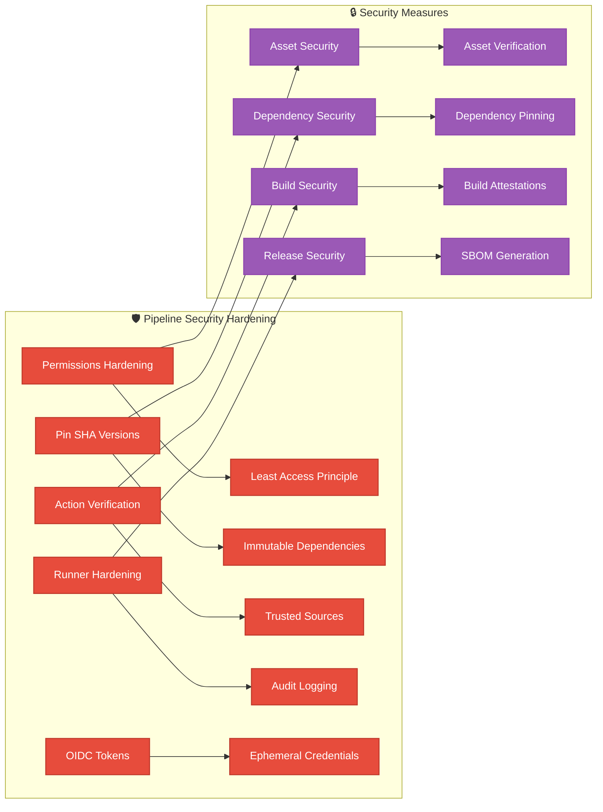
```mermaid
flowchart LR
    subgraph "🛡️ Pipeline Security Hardening"
        PH[Permissions Hardening] --> LAP[Least Access Principle]
        PS[Pin SHA Versions] --> IDT[Immutable Dependencies]
        AV[Action Verification] --> TS[Trusted Sources]
        RH[Runner Hardening] --> AL[Audit Logging]
        OT[OIDC Tokens] --> EF[Ephemeral Credentials]
    end

    subgraph "🔒 Security Measures"
        AS[Asset Security] --> AC[Asset Verification]
        DS[Dependency Security] --> PD[Dependency Pinning]
        BS[Build Security] --> BA[Build Attestations]
        RS[Release Security] --> SBOM[SBOM Generation]
    end

    PH --> AS
    PS --> DS
    AV --> BS
    RH --> RS

    classDef practice fill:#e74c3c,stroke:#c0392b,stroke-width:1.5px,color:white
    classDef measures fill:#9b59b6,stroke:#8e44ad,stroke-width:1.5px,color:white

    class PH,PS,AV,RH,OT practice
    class LAP,IDT,TS,AL,EF practice
    class AS,DS,BS,RS measures
    class AC,PD,BA,SBOM measures
```

### Specific Hardening Measures

The project's workflows collectively implement the following security measures (applied per workflow where applicable):

1. **🔒 Permissions Restriction**: Explicit least-privilege permissions with `read-all` or empty `{}` top-level
2. **📌 SHA Pinning**: 100% of actions pinned to specific SHA hashes — zero tag references
3. **🛡️ Runner Hardening**: StepSecurity `harden-runner@8d3c67de8e2fe68ef647c8db1e6a09f647780f40 # v2.19.0` for audit logging
4. **📄 SBOM Generation**: The release workflow generates a Software Bill of Materials in SPDX format via `anchore/sbom-action`
5. **🔏 Build Attestations**: The release workflow creates SLSA Level 3 provenance via `actions/attest-build-provenance`
6. **⏱️ Timeout Limits**: Critical workflows (e.g., E2E and agentic `*.lock.yml` pipelines) use explicit `timeout-minutes` to prevent resource exhaustion; remaining workflows rely on GitHub's default job timeouts and are monitored for anomalies
7. **🔑 OIDC Tokens**: The `deploy-s3` workflow uses AWS OIDC federation — no long-lived secrets
8. **🚫 Egress Control**: The `deploy-s3` workflow uses `harden-runner` with `egress-policy: block`

---

## 🛡️ Workflow Security Architecture

### Workflow Permissions Matrix

Every workflow declares explicit, minimal permissions following the principle of least privilege. Some workflows use top-level `permissions: read-all` with job-level write overrides where needed, while others define more restrictive explicit top-level scopes tailored to their tasks.

| Workflow | Top-Level | Job-Level Overrides | Secrets Used |
|----------|-----------|---------------------|--------------|
| **codeql** | `contents: read` | analyze: `security-events: write`, `packages: read`, `actions: read` | None |
| **compile-agentic-workflows** | `contents: write`, `pull-requests: write`, `actions: write`, `issues: write` | — | `COPILOT_MCP_GITHUB_PERSONAL_ACCESS_TOKEN` |
| **copilot-setup-steps** | `contents: read`, `actions: read`, `attestations: read`, `checks: read`, `issues: write`, `models: read`, `discussions: read`, `pages: read`, `pull-requests: write`, `security-events: read`, `statuses: read` | — | `COPILOT_MCP_GITHUB_PERSONAL_ACCESS_TOKEN` |
| **dependency-review** | `contents: read` | — | None |
| **deploy-s3** | `contents: read`, `id-token: write`, `actions: write` | — | AWS OIDC role |
| **e2e** | `contents: read` | e2e-tests: `contents: read` | None |
| **labeler** | `read-all` | labeler: `contents: read`, `pull-requests: write`, `issues: read` | `GITHUB_TOKEN` |
| **release** | `read-all` | prepare: `contents: write`; build: `contents: read`, `id-token: write`, `attestations: write`; release: `contents: write`, `id-token: write` | `GITHUB_TOKEN` |
| **reuse** | `contents: read` | — | None |
| **scorecards** | `read-all` | analysis: `security-events: write`, `id-token: write`, `contents: read`, `actions: read`, `issues: read`, `pull-requests: read`, `checks: read` | None |
| **setup-labels** | `contents: read`, `issues: write` | — | `GITHUB_TOKEN` |
| **test-and-report** | `read-all` | validation: `contents: read`, `pull-requests: write`; functional-tests: `contents: read`; performance: `contents: read`; security-check: `contents: read`, `security-events: write`; report: `contents: read`, `pull-requests: write` | None |
| **news-\* (agentic ×9)** | `{}` (empty) | activation: `contents: read`; agent: `contents: write`, `pull-requests: write`, `issues: write`, `models: read` | `GITHUB_TOKEN` |

### Security Control Layers

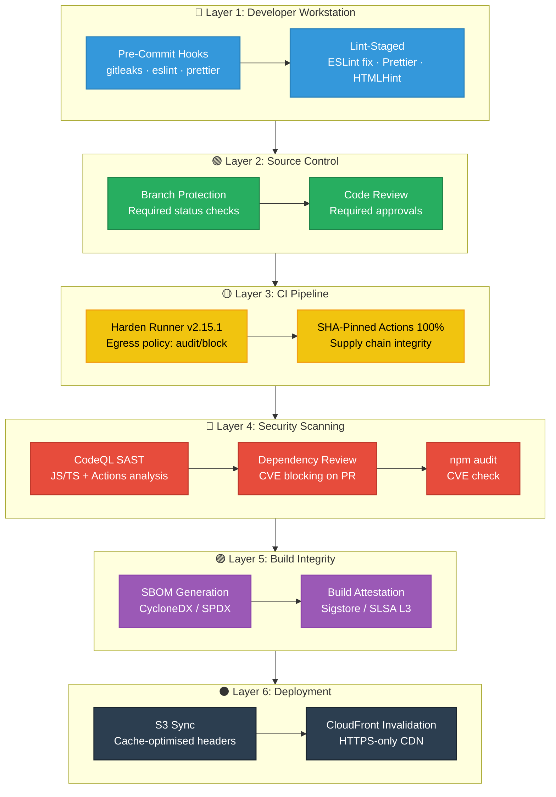
```mermaid
graph TD
    subgraph Layer1["🔵 Layer 1: Developer Workstation"]
        PC[Pre-Commit Hooks<br/>gitleaks · eslint · prettier]
        LS[Lint-Staged<br/>ESLint fix · Prettier · HTMLHint]
        PC --> LS
    end

    subgraph Layer2["🟢 Layer 2: Source Control"]
        BP[Branch Protection<br/>Required status checks]
        CR[Code Review<br/>Required approvals]
        BP --> CR
    end

    subgraph Layer3["🟡 Layer 3: CI Pipeline"]
        HR[Harden Runner v2.15.1<br/>Egress policy: audit/block]
        ST[SHA-Pinned Actions 100%<br/>Supply chain integrity]
        HR --> ST
    end

    subgraph Layer4["🔴 Layer 4: Security Scanning"]
        CQL[CodeQL SAST<br/>JS/TS + Actions analysis]
        DR[Dependency Review<br/>CVE blocking on PR]
        NA[npm audit<br/>CVE check]
        CQL --> DR --> NA
    end

    subgraph Layer5["🟣 Layer 5: Build Integrity"]
        SB[SBOM Generation<br/>CycloneDX / SPDX]
        AT[Build Attestation<br/>Sigstore / SLSA L3]
        SB --> AT
    end

    subgraph Layer6["⚫ Layer 6: Deployment"]
        S3[S3 Sync<br/>Cache-optimised headers]
        CF[CloudFront Invalidation<br/>HTTPS-only CDN]
        S3 --> CF
    end

    Layer1 --> Layer2 --> Layer3 --> Layer4 --> Layer5 --> Layer6

    classDef layer1 fill:#3498db,stroke:#2980b9,stroke-width:1.5px,color:white
    classDef layer2 fill:#27ae60,stroke:#1e8449,stroke-width:1.5px,color:white
    classDef layer3 fill:#f1c40f,stroke:#f39c12,stroke-width:1.5px,color:black
    classDef layer4 fill:#e74c3c,stroke:#c0392b,stroke-width:1.5px,color:white
    classDef layer5 fill:#9b59b6,stroke:#8e44ad,stroke-width:1.5px,color:white
    classDef layer6 fill:#2c3e50,stroke:#1a252f,stroke-width:1.5px,color:white

    class PC,LS layer1
    class BP,CR layer2
    class HR,ST layer3
    class CQL,DR,NA layer4
    class SB,AT layer5
    class S3,CF layer6
```

---

## 🪝 Pre-Commit Security Controls

The project employs two complementary pre-commit enforcement mechanisms: **Husky** (Node.js native) and **pre-commit** framework.

### Husky + lint-staged

**Configuration:** `.husky/pre-commit` → runs `npx lint-staged`

| File Pattern | Commands | Purpose |
|--------------|----------|---------|
| `scripts/**/*.js` | `eslint --fix`, `prettier --write` | JS quality + formatting |
| `*.md` | `prettier --write` | Documentation formatting |
| `*.html` | `htmlhint` | HTML validation |

### Pre-Commit Framework

**Configuration:** `.pre-commit-config.yaml`

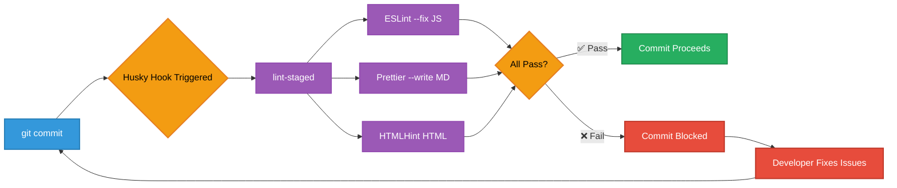
```mermaid
graph LR
    A[git commit] --> B{Husky Hook Triggered}
    B --> C[lint-staged]
    C --> D[ESLint --fix JS]
    C --> E[Prettier --write MD]
    C --> F[HTMLHint HTML]
    D --> G{All Pass?}
    E --> G
    F --> G
    G -->|✅ Pass| H[Commit Proceeds]
    G -->|❌ Fail| I[Commit Blocked]
    I --> J[Developer Fixes Issues]
    J --> A

    classDef trigger fill:#3498db,stroke:#2980b9,stroke-width:2px,color:white
    classDef decision fill:#f39c12,stroke:#e67e22,stroke-width:2px,color:black
    classDef lint fill:#9b59b6,stroke:#8e44ad,stroke-width:1.5px,color:white
    classDef pass fill:#27ae60,stroke:#1e8449,stroke-width:1.5px,color:white
    classDef fail fill:#e74c3c,stroke:#c0392b,stroke-width:2px,color:white

    class A trigger
    class B,G decision
    class C,D,E,F lint
    class H pass
    class I,J fail
```

| Hook | Version | Purpose | Security Value |
|------|---------|---------|----------------|
| **gitleaks** | v8.16.3 | Secret scanning | Prevent credential exposure |
| **mirrors-eslint** | v8.38.0 | JS linting | Code quality enforcement |
| **end-of-file-fixer** | pre-commit v4.4.0 | File termination | Consistency |
| **trailing-whitespace** | pre-commit v4.4.0 | Whitespace cleanup | Consistency |

**Security Value:** gitleaks scans for hardcoded secrets (API keys, tokens, passwords) before any commit reaches the remote repository, providing first-line credential leak prevention aligned with [Cryptography Policy](https://github.com/Hack23/ISMS-PUBLIC/blob/main/Cryptography_Policy.md).

---

## 🏆 SLSA Level 3 Compliance

Supply-chain Levels for Software Artifacts (SLSA) Level 3 compliance is achieved through GitHub's native attestation infrastructure integrated into the release and SLSA provenance workflows.

### SLSA Requirements Matrix

| SLSA L3 Requirement | Implementation | Workflow |
|---------------------|----------------|---------|
| **Source — Version controlled** | Git + GitHub branch protection | All |
| **Source — Verified history** | Protected `main` branch | All |
| **Build — Scripted build** | `npm ci` + reproducible steps | release.yml |
| **Build — Build service** | GitHub Actions managed runners | All |
| **Build — Non-falsifiable provenance** | GitHub Sigstore / OIDC keyless | release.yml |
| **Build — Isolated** | GitHub-hosted Ubuntu runners | All |
| **Provenance — Available** | `.intoto.jsonl` attached to release | release.yml |
| **Provenance — Authenticated** | OIDC `id-token: write` | release.yml |
| **Provenance — Service generated** | `actions/attest-build-provenance` | release.yml |
| **Provenance — Non-falsifiable** | Sigstore transparency log | release.yml |

### Build Provenance Flow

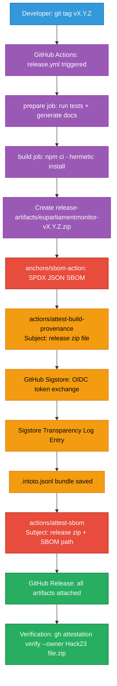
```mermaid
graph TD
    A[Developer: git tag vX.Y.Z] --> B[GitHub Actions: release.yml triggered]
    B --> C[prepare job: run tests + generate docs]
    C --> D[build job: npm ci - hermetic install]
    D --> E[Create release-artifacts/euparliamentmonitor-vX.Y.Z.zip]
    E --> F[anchore/sbom-action: SPDX JSON SBOM]
    F --> G[actions/attest-build-provenance<br/>Subject: release zip file]
    G --> H[GitHub Sigstore: OIDC token exchange]
    H --> I[Sigstore Transparency Log Entry]
    I --> J[.intoto.jsonl bundle saved]
    J --> K[actions/attest-sbom<br/>Subject: release zip + SBOM path]
    K --> L[GitHub Release: all artifacts attached]
    L --> M[Verification: gh attestation verify --owner Hack23 file.zip]

    classDef trigger fill:#3498db,stroke:#2980b9,stroke-width:2px,color:white
    classDef build fill:#9b59b6,stroke:#8e44ad,stroke-width:1.5px,color:white
    classDef security fill:#e74c3c,stroke:#c0392b,stroke-width:1.5px,color:white
    classDef crypto fill:#f39c12,stroke:#e67e22,stroke-width:1.5px,color:black
    classDef release fill:#27ae60,stroke:#1e8449,stroke-width:1.5px,color:white

    class A trigger
    class B,C,D,E build
    class F,K security
    class G,H,I,J crypto
    class L,M release
```

### Attestation Verification

End-users can verify artifact integrity using the GitHub CLI:

```bash
# Verify build provenance
gh attestation verify euparliamentmonitor-v1.0.0.zip --owner Hack23

# Verify SBOM attestation
gh attestation verify euparliamentmonitor-v1.0.0.spdx.json --owner Hack23

# Expected output: ✅ Verification successful
# Attestation bundle verified with signer's certificate
```

**ISMS Reference:** [Secure Development Policy §4.4 — Supply Chain Security](https://github.com/Hack23/ISMS-PUBLIC/blob/main/Secure_Development_Policy.md#44-supply-chain-security)

---

## 🔍 Security Scanning Pipeline

Security scanning tools are integrated into the CI/CD pipeline with triggers as documented in the matrix below (e.g., push, pull request, schedule, pre-commit).

### Scanning Tool Matrix

| Tool | Type | Triggers | Findings Location | Blocks Merge? |
|------|------|---------|-------------------|---------------|
| **CodeQL** | SAST | Push, PR, weekly Saturday | GitHub Security tab | Yes (via required check) |
| **npm audit** | SCA | Push, PR | Workflow logs | Yes (new ≥ moderate, allowlist exceptions) |
| **Dependency Review** | SCA | PR only | PR comments | Yes |
| **ESLint** | SAST Lint | Push, PR, pre-commit | Workflow logs | Yes |
| **HTMLHint** | Validation | Push, PR, pre-commit | Workflow logs | Warning |
| **REUSE** | Compliance | Push, PR, weekly Monday | Workflow logs | Yes |
| **OpenSSF Scorecard** | Posture | Push, weekly Tuesday | SARIF → Security tab | Advisory |
| **gitleaks** | Secret Scan | Pre-commit | Terminal | Yes (pre-commit) |

### Integrated Scanning Flow

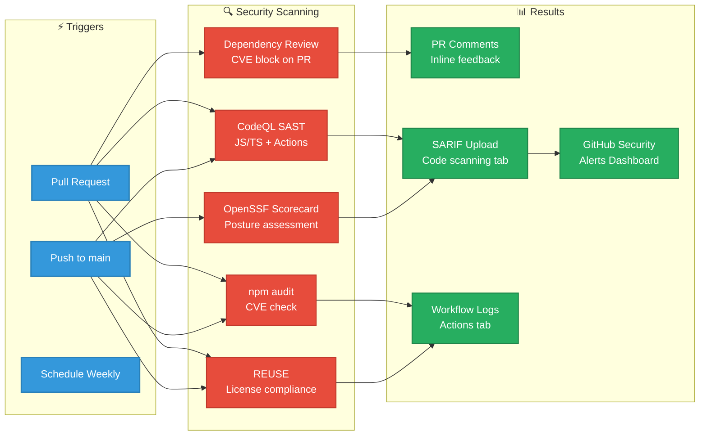
```mermaid
graph LR
    subgraph Triggers["⚡ Triggers"]
        PR[Pull Request]
        PS[Push to main]
        SC[Schedule Weekly]
    end

    subgraph Scanning["🔍 Security Scanning"]
        CQL[CodeQL SAST<br/>JS/TS + Actions]
        NA[npm audit<br/>CVE check]
        DR[Dependency Review<br/>CVE block on PR]
        RL[REUSE<br/>License compliance]
        SC2[OpenSSF Scorecard<br/>Posture assessment]
    end

    subgraph Output["📊 Results"]
        GH[GitHub Security<br/>Alerts Dashboard]
        PRC[PR Comments<br/>Inline feedback]
        SAR[SARIF Upload<br/>Code scanning tab]
        WL[Workflow Logs<br/>Actions tab]
    end

    PR --> CQL & NA & DR & RL
    PS --> CQL & NA & RL & SC2

    CQL --> SAR
    NA --> WL
    DR --> PRC
    RL --> WL
    SC2 --> SAR
    SAR --> GH

    classDef trigger fill:#3498db,stroke:#2980b9,stroke-width:2px,color:white
    classDef scanning fill:#e74c3c,stroke:#c0392b,stroke-width:1.5px,color:white
    classDef output fill:#27ae60,stroke:#1e8449,stroke-width:1.5px,color:white

    class PR,PS,SC trigger
    class CQL,NA,DR,RL,SC2 scanning
    class GH,PRC,SAR,WL output
```

---

## 🚦 Deployment Security Gates

Production deployment to AWS S3 + CloudFront is protected by multiple sequential security gates that must all pass before code reaches production.

### Security Gate Sequence

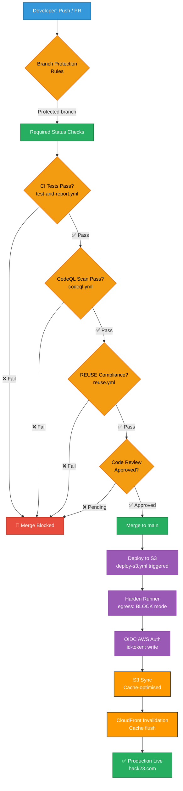
```mermaid
graph TD
    A[Developer: Push / PR] --> B{Branch Protection<br/>Rules}
    B -->|Protected branch| C[Required Status Checks]
    C --> D{CI Tests Pass?<br/>test-and-report.yml}
    D -->|✅ Pass| E{CodeQL Scan Pass?<br/>codeql.yml}
    D -->|❌ Fail| BLOCK[🚫 Merge Blocked]
    E -->|✅ Pass| F{REUSE Compliance?<br/>reuse.yml}
    E -->|❌ Fail| BLOCK
    F -->|✅ Pass| G{Code Review<br/>Approved?}
    F -->|❌ Fail| BLOCK
    G -->|✅ Approved| H[Merge to main]
    G -->|❌ Pending| BLOCK
    H --> I[Deploy to S3<br/>deploy-s3.yml triggered]
    I --> J[Harden Runner<br/>egress: BLOCK mode]
    J --> K[OIDC AWS Auth<br/>id-token: write]
    K --> L[S3 Sync<br/>Cache-optimised]
    L --> M[CloudFront Invalidation<br/>Cache flush]
    M --> N[✅ Production Live<br/>hack23.com]

    classDef trigger fill:#3498db,stroke:#2980b9,stroke-width:2px,color:white
    classDef decision fill:#f39c12,stroke:#e67e22,stroke-width:2px,color:black
    classDef pass fill:#27ae60,stroke:#1e8449,stroke-width:1.5px,color:white
    classDef fail fill:#e74c3c,stroke:#c0392b,stroke-width:2px,color:white
    classDef aws fill:#FF9900,stroke:#232F3E,stroke-width:1.5px,color:white
    classDef security fill:#9b59b6,stroke:#8e44ad,stroke-width:1.5px,color:white

    class A trigger
    class B,D,E,F,G decision
    class C,H,N pass
    class BLOCK fail
    class I,J,K security
    class L,M aws
```

### AWS Deployment Security Controls

| Control | Implementation | ISMS Reference |
|---------|----------------|----------------|
| **OIDC Federation** | `aws-actions/configure-aws-credentials` with role ARN | No long-lived secrets |
| **Minimal IAM Role** | `GithubWorkFlowRole` — S3 + CloudFront only | Least privilege |
| **Egress Block Mode** | Harden Runner blocks all non-allowlisted endpoints | Network security |
| **mtime Preservation** | Git commit times restored before sync | Change detection accuracy |
| **Cache-Optimised Sync** | Per-type cache headers (HTML: 1h, assets: 1y) | Performance + integrity |
| **HTTPS Enforcement** | CloudFront HTTPS-only distribution | Data in transit protection |
| **TLS 1.3** | CloudFront + S3 expected to enforce TLS 1.3 (configured in AWS account) | [Cryptography Policy](https://github.com/Hack23/ISMS-PUBLIC/blob/main/Cryptography_Policy.md) |

---

## 🔄 Workflow Failure Handling & Rollback

### Failure Classification and Response

| Failure Type | Detection | Automated Response | Manual Action |
|-------------|-----------|-------------------|---------------|
| **Test failure** | CI job exits non-zero | Workflow marked failed, merge blocked | Review logs, fix code, re-push |
| **Security finding (CodeQL, new)** | CodeQL analysis | PR comment + GitHub Security alert | Assess, fix or document false positive |
| **Security finding (npm audit, new)** | `npm audit` in `test-and-report.yml` | Workflow failed, findings in logs only | Review audit output, update deps or add to allowlist per policy |
| **Security finding (known / accepted)** | Known GHSA in audit allowlist | Intelligent triage passes | Document in SECURITY.md and risk register |
| **Deployment failure** | S3 sync / CF invalidation error | Workflow failed, previous version still live | Check AWS CloudWatch, re-run |
| **Attestation failure** | Sigstore API / OIDC error | Release blocked | Retry workflow, check OIDC config |
| **REUSE non-compliance** | Missing SPDX header | PR blocked | Add `SPDX-FileCopyrightText` headers |
| **Agentic workflow failure** | Agent timeout or error | PR not created, workflow marked failed | Review agent logs, re-trigger manually |

### Rollback Procedure

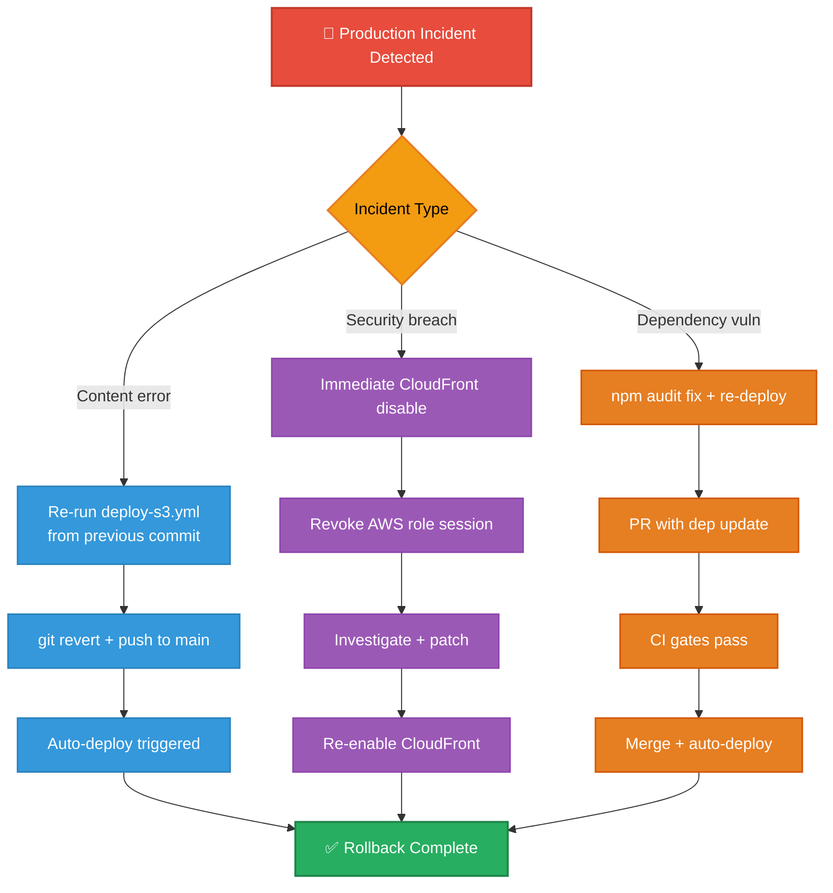
```mermaid
graph TD
    A[🚨 Production Incident Detected] --> B{Incident Type}
    B -->|Content error| C[Re-run deploy-s3.yml<br/>from previous commit]
    B -->|Security breach| D[Immediate CloudFront disable]
    B -->|Dependency vuln| E[npm audit fix + re-deploy]
    C --> F[git revert + push to main]
    F --> G[Auto-deploy triggered]
    D --> H[Revoke AWS role session]
    H --> I[Investigate + patch]
    I --> J[Re-enable CloudFront]
    E --> K[PR with dep update]
    K --> L[CI gates pass]
    L --> M[Merge + auto-deploy]
    G --> N[✅ Rollback Complete]
    J --> N
    M --> N

    classDef alert fill:#e74c3c,stroke:#c0392b,stroke-width:2px,color:white
    classDef decision fill:#f39c12,stroke:#e67e22,stroke-width:2px,color:black
    classDef content fill:#3498db,stroke:#2980b9,stroke-width:1.5px,color:white
    classDef security fill:#9b59b6,stroke:#8e44ad,stroke-width:1.5px,color:white
    classDef dependency fill:#e67e22,stroke:#d35400,stroke-width:1.5px,color:white
    classDef complete fill:#27ae60,stroke:#1e8449,stroke-width:2px,color:white

    class A alert
    class B decision
    class C,F,G content
    class D,H,I,J security
    class E,K,L,M dependency
    class N complete
```

### Recovery Time Objectives

| Scenario | RTO Target | Procedure |
|----------|-----------|-----------|
| **Broken deployment** | < 15 minutes | Re-run `deploy-s3.yml` from last good commit |
| **Content regression** | < 30 minutes | `git revert` + auto-deploy pipeline |
| **Dependency vulnerability** | < 4 hours | `npm audit fix` + PR + deploy |
| **Security incident** | < 1 hour | CloudFront disable + incident response |

**ISMS Reference:** [BCP Plan](BCPPlan.md) | [Incident Response](https://github.com/Hack23/ISMS-PUBLIC/blob/main/Information_Security_Policy.md)

---

## 📦 Dependabot Security Configuration

**Configuration:** `.github/dependabot.yml`

Dependabot is configured with two package ecosystems, both scheduled on Monday to batch updates and reduce CI noise.

### Dependabot Configuration Summary

| Ecosystem | Directory | Schedule | PR Limit | Groups |
|-----------|-----------|---------|----------|--------|
| **npm** | `/` | Weekly, Mon 06:00 UTC | 10 | dev-deps (minor/patch), prod-deps (minor/patch) |
| **github-actions** | `/` | Weekly, Mon 07:00 UTC | Unlimited | github-actions (minor/patch) |

### Update Grouping Strategy

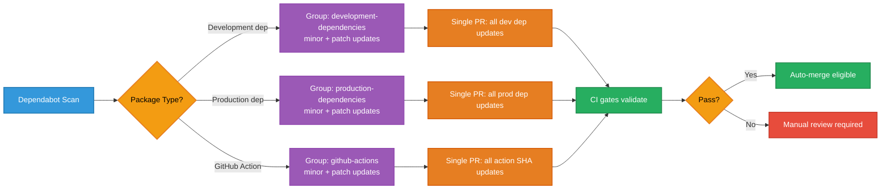
```mermaid
graph LR
    A[Dependabot Scan] --> B{Package Type?}
    B -->|Development dep| C[Group: development-dependencies<br/>minor + patch updates]
    B -->|Production dep| D[Group: production-dependencies<br/>minor + patch updates]
    B -->|GitHub Action| E[Group: github-actions<br/>minor + patch updates]
    C --> F[Single PR: all dev dep updates]
    D --> G[Single PR: all prod dep updates]
    E --> H[Single PR: all action SHA updates]
    F --> I[CI gates validate]
    G --> I
    H --> I
    I --> J{Pass?}
    J -->|Yes| K[Auto-merge eligible]
    J -->|No| L[Manual review required]

    classDef scanner fill:#3498db,stroke:#2980b9,stroke-width:2px,color:white
    classDef decision fill:#f39c12,stroke:#e67e22,stroke-width:2px,color:black
    classDef group fill:#9b59b6,stroke:#8e44ad,stroke-width:1.5px,color:white
    classDef pr fill:#e67e22,stroke:#d35400,stroke-width:1.5px,color:white
    classDef pass fill:#27ae60,stroke:#1e8449,stroke-width:1.5px,color:white
    classDef fail fill:#e74c3c,stroke:#c0392b,stroke-width:1.5px,color:white

    class A scanner
    class B,J decision
    class C,D,E group
    class F,G,H pr
    class I,K pass
    class L fail
```

### Commit Message Convention

| Type | Prefix | Example |
|------|--------|---------|
| **npm dep update** | `build(deps):` | `build(deps): bump eslint from 8.x to 9.x` |
| **npm dev dep** | `build(deps-dev):` | `build(deps-dev): bump vitest from 2.x to 3.x` |
| **Actions update** | `build(deps):` | `build(deps): bump actions/checkout from v4 to v5` |

**Security Labels:** All Dependabot PRs are labelled `dependencies` + `javascript` or `github_actions` for easy filtering.

---

## 📡 Workflow Monitoring & Alerting

### Workflow Status Badges

All primary workflows expose real-time status badges in README.md and this document for instant visibility into pipeline health:

| Workflow | Badge | Target |
|----------|-------|--------|
| **Test & Report** | [](https://github.com/Hack23/euparliamentmonitor/actions/workflows/test-and-report.yml) | Green always |
| **CodeQL** | [](https://github.com/Hack23/euparliamentmonitor/actions/workflows/codeql.yml) | Green always |
| **E2E Tests** | [](https://github.com/Hack23/euparliamentmonitor/actions/workflows/e2e.yml) | Green always |
| **REUSE** | [](https://github.com/Hack23/euparliamentmonitor/actions/workflows/reuse.yml) | Green always |
| **OpenSSF Scorecard** | [](https://scorecard.dev/viewer/?uri=github.com/Hack23/euparliamentmonitor) | ≥ 8.0/10 |

### GitHub Security Dashboard Integration

The following tools integrate with the GitHub Security Dashboard via SARIF or native mechanisms:

| Tool | Integration Type | Destination |
|------|------------------|-------------|
| **CodeQL** | SARIF via `github/codeql-action/analyze` | GitHub Security Dashboard (code scanning alerts) |
| **OpenSSF Scorecard** | SARIF via `github/codeql-action/upload-sarif` | GitHub Security Dashboard (code scanning alerts) |
| **Dependabot** | Native GitHub integration | GitHub Security Dashboard (Dependabot alerts) |

### Alerting Channels

| Event | Alert Channel | Severity |
|-------|---------------|----------|
| **Critical CVE found** | GitHub Security Advisories | P1 — Immediate |
| **Workflow failure on main** | GitHub email notification | P2 — Same day |
| **Scorecard score drop** | Weekly scorecard badge | P3 — Weekly review |
| **Dependabot PR opened** | GitHub PR notification | P4 — Next Monday batch |

---

## 🔒 ISMS Policy Alignment Summary

### Policy Coverage

| **ISMS Policy** | **Workflows Implementing Controls** | **Evidence** |
| --- | --- | --- |
| [🛠️ Secure Development Policy](https://github.com/Hack23/ISMS-PUBLIC/blob/main/Secure_Development_Policy.md) | All 24 workflows | This document |
| [🔐 Information Security Policy](https://github.com/Hack23/ISMS-PUBLIC/blob/main/Information_Security_Policy.md) | CodeQL, OpenSSF Scorecard | [SECURITY_ARCHITECTURE.md](SECURITY_ARCHITECTURE.md) |
| [🔑 Access Control Policy](https://github.com/Hack23/ISMS-PUBLIC/blob/main/Access_Control_Policy.md) | deploy-s3 (OIDC), release (minimal permissions) | Workflow files |
| [🔒 Cryptography Policy](https://github.com/Hack23/ISMS-PUBLIC/blob/main/Cryptography_Policy.md) | deploy-s3 (TLS), release (Sigstore/SLSA) | [Attestations](https://github.com/Hack23/euparliamentmonitor/attestations) |
| [🔓 Open Source Policy](https://github.com/Hack23/ISMS-PUBLIC/blob/main/Open_Source_Policy.md) | REUSE compliance workflow | [REUSE.toml](REUSE.toml) |
| [🔍 Vulnerability Management](https://github.com/Hack23/ISMS-PUBLIC/blob/main/Vulnerability_Management.md) | CodeQL, npm audit, Dependency Review | GitHub Security tab, PR checks |
| [📝 Change Management](https://github.com/Hack23/ISMS-PUBLIC/blob/main/Change_Management.md) | Branch protection, CI gates, PR reviews | Workflow gate enforcement |
| [🚨 Incident Response Plan](https://github.com/Hack23/ISMS-PUBLIC/blob/main/Incident_Response_Plan.md) | Rollback procedures, incident classification | §Failure Handling section |

### Secure Development Policy Alignment

| **Policy Section** | **Implementation** | **Evidence** |
| --- | --- | --- |
| **§3.2 Architecture Documentation** | Documentation-as-code in release workflow | [SECURITY_ARCHITECTURE.md](SECURITY_ARCHITECTURE.md) |
| **§3.3 Testing Requirements** | 3061+ unit/integration tests, E2E tests, 82%+ coverage | [Test & Report Workflow](.github/workflows/test-and-report.yml) |
| **§4.1 CI/CD Security** | All workflows with security controls | This document |
| **§4.3 Security Scanning** | CodeQL, npm audit, Dependabot | [CodeQL Workflow](.github/workflows/codeql.yml) |
| **§4.4 Supply Chain Security** | SLSA L3, SBOM, Dependency Review, REUSE, npm provenance | [Release Workflow](.github/workflows/release.yml) |
| **§10.1 CI/CD Workflow Excellence** | 24 automated workflows, 100% SHA-pinned | This document |

### Compliance Frameworks

| **Framework** | **Version** | **Controls Implemented** | **Evidence Location** |
| --- | --- | --- | --- |
| **ISO 27001** | 2022 | A.8.25, A.8.26, A.8.27, A.8.28, A.12.1.4, A.12.6.1, A.14.2.1 | Workflow files + this document |
| **NIST CSF** | 2.0 | ID.SC (Supply Chain), DE.CM (Detection), PR.DS (Data Security) | [SECURITY_ARCHITECTURE.md](SECURITY_ARCHITECTURE.md) |
| **CIS Controls** | v8.1 | 2.2, 4.1, 7.1, 16.1, 16.5, 16.7, 16.12 | [Scorecard](https://scorecard.dev/viewer/?uri=github.com/Hack23/euparliamentmonitor) |
| **SLSA** | L3 | Build provenance, hermetic build, non-falsifiable, authenticated | [Attestations](https://github.com/Hack23/euparliamentmonitor/attestations) |
| **OpenSSF** | — | SHA-pinned actions (100%), Harden Runner, branch protection | [Scorecard Report](https://scorecard.dev/viewer/?uri=github.com/Hack23/euparliamentmonitor) |
| **EU CRA** | 2024 | SBOM generation, vulnerability disclosure, security updates | [Release Workflow](.github/workflows/release.yml) |

---

## 🔬 Political Intelligence Operations Centre

The 15 agentic news workflows collectively form a **European Parliament Political Intelligence Operations Centre** — a systematic, automated pipeline that transforms raw parliamentary data into multi-language political intelligence articles published daily, weekly, monthly, quarterly, annually and across the full EP-term electoral cycle.

### Intelligence Collection Cycle

The following diagram shows the complete intelligence cycle from EP data collection through analysis to multi-language publication:

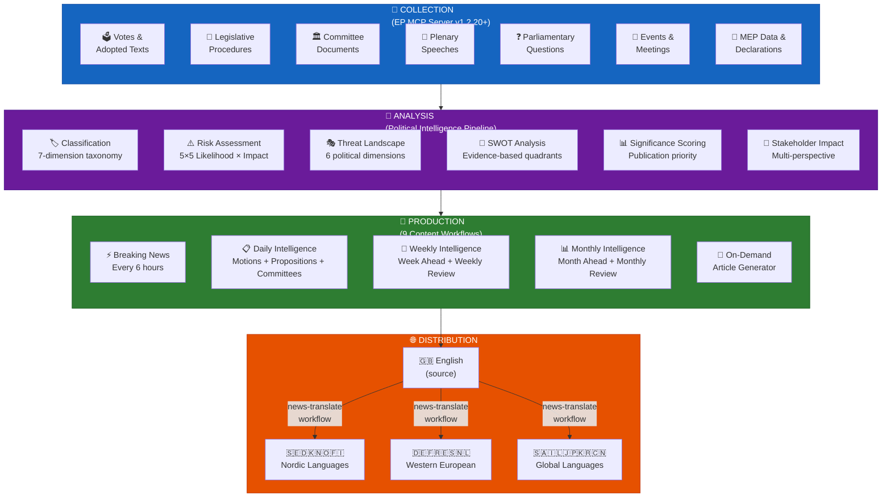
```mermaid
flowchart TD
    subgraph Collection["📡 COLLECTION<br/>(EP MCP Server v1.2.20+)"]
        direction TB
        C1["🗳️ Votes &<br/>Adopted Texts"]
        C2["📜 Legislative<br/>Procedures"]
        C3["🏛️ Committee<br/>Documents"]
        C4["🎤 Plenary<br/>Speeches"]
        C5["❓ Parliamentary<br/>Questions"]
        C6["📅 Events &<br/>Meetings"]
        C7["👤 MEP Data &<br/>Declarations"]
    end

    subgraph Analysis["🔬 ANALYSIS<br/>(Political Intelligence Pipeline)"]
        direction TB
        A1["🏷️ Classification<br/>7-dimension taxonomy"]
        A2["⚠️ Risk Assessment<br/>5×5 Likelihood × Impact"]
        A3["🎭 Threat Landscape<br/>6 political dimensions"]
        A4["💼 SWOT Analysis<br/>Evidence-based quadrants"]
        A5["📊 Significance Scoring<br/>Publication priority"]
        A6["👥 Stakeholder Impact<br/>Multi-perspective"]
    end

    subgraph Production["📰 PRODUCTION<br/>(9 Content Workflows)"]
        direction TB
        P1["⚡ Breaking News<br/>Every 6 hours"]
        P2["📋 Daily Intelligence<br/>Motions + Propositions + Committees"]
        P3["📅 Weekly Intelligence<br/>Week Ahead + Weekly Review"]
        P4["📊 Monthly Intelligence<br/>Month Ahead + Monthly Review"]
        P5["🎯 On-Demand<br/>Article Generator"]
    end

    subgraph Distribution["🌐 DISTRIBUTION<br/>(14 Languages)"]
        direction TB
        D1["🇬🇧 English<br/>(source)"]
        D2["🇸🇪🇩🇰🇳🇴🇫🇮<br/>Nordic Languages"]
        D3["🇩🇪🇫🇷🇪🇸🇳🇱<br/>Western European"]
        D4["🇸🇦🇮🇱🇯🇵🇰🇷🇨🇳<br/>Global Languages"]
    end

    Collection --> Analysis --> Production --> D1
    D1 --> |"news-translate<br/>workflow"| D2 & D3 & D4

    style Collection fill:#1565C0,stroke:#0D47A1,color:#FFFFFF
    style Analysis fill:#6A1B9A,stroke:#4A148C,color:#FFFFFF
    style Production fill:#2E7D32,stroke:#1B5E20,color:#FFFFFF
    style Distribution fill:#E65100,stroke:#BF360C,color:#FFFFFF
```

### Threat Landscape Dimensions Monitored

The political intelligence pipeline monitors six threat landscape dimensions across all parliamentary activity:

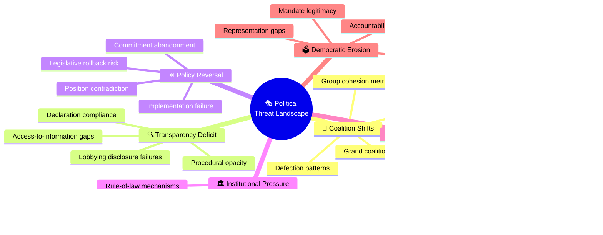
```mermaid
mindmap
  root((🎭 Political<br/>Threat Landscape))
    🔄 Coalition Shifts
      Grand coalition stability
      Cross-party alliance formation
      Defection patterns
      Group cohesion metrics
    🔍 Transparency Deficit
      Access-to-information gaps
      Lobbying disclosure failures
      Declaration compliance
      Procedural opacity
    ⏪ Policy Reversal
      Legislative rollback risk
      Position contradiction
      Commitment abandonment
      Implementation failure
    🏛️ Institutional Pressure
      Inter-institutional friction
      Council-Parliament disputes
      Commission accountability
      Rule-of-law mechanisms
    🚧 Legislative Obstruction
      Procedure stalling
      Amendment flooding
      Committee bottlenecks
      Trilogue deadlocks
    🗳️ Democratic Erosion
      Participation decline
      Representation gaps
      Accountability weakening
      Mandate legitimacy
```

### Workflow Cadence — Weekly Intelligence Rhythm

The 15 agentic workflows follow a carefully orchestrated schedule to ensure continuous intelligence coverage of the European Parliament across daily / weekly / monthly / quarterly / annual / term-scoped horizons.

> **Note:** The Gantt chart below uses sample dates (week of 2026-01-05) to illustrate the recurring weekly cadence. Mermaid's gantt format requires concrete dates; the actual schedule repeats every week.

```mermaid
gantt
    title Weekly Agentic Workflow Cadence UTC — Sample Week
    dateFormat YYYY-MM-DD
    axisFormat %a

    section Daily Mon-Fri
    Committee Reports 04h00 UTC    :active, d1, 2026-01-05, 1d
    Propositions 05h00 UTC         :active, d2, 2026-01-05, 1d
    Motions 06h00 UTC              :active, d3, 2026-01-05, 1d
    Breaking News 4x daily         :crit, d4, 2026-01-05, 1d

    section Weekly
    Week Ahead Fri 07h00 UTC       :d5, 2026-01-09, 1d

    section Weekend
    Weekly Review Sat 09h00 UTC    :d6, 2026-01-10, 1d

    section Translation
    Translate Weekdays 3x daily    :d7, 2026-01-05, 5d
    Translate Sat 15h00 UTC        :d8, 2026-01-10, 1d

    section Monthly
    Month Ahead 1st 08h00 UTC      :d9, 2026-01-01, 1d
    Monthly Review 28th 10h00 UTC  :d10, 2026-01-28, 1d
```

### Data Flow — EP MCP Server to Published Article

```mermaid
flowchart LR
    subgraph "🏛️ European Parliament"
        EP["EP Open Data Portal"]
    end

    subgraph "🔌 MCP Layer"
        MCP["EP MCP Server<br/>v1.2.20+<br/>(120s timeout;<br/>60+ tools, sliding + fixed-window feeds)"]
    end

    subgraph "🤖 Agent Layer"
        Agent["GitHub Copilot<br/>claude-sonnet-4.6"]
        Analyze["Analysis Pipeline<br/>11 methodology assets<br/>39 templates"]
    end

    subgraph "📰 Output Layer"
        EN["🇬🇧 English Article"]
        Translate["Translation Agent"]
        Multi["🌐 13 Additional<br/>Languages"]
    end

    subgraph "🚀 Deployment"
        PR["Pull Request"]
        Pages["GitHub Pages"]
        S3["AWS S3 CDN"]
    end

    EP --> MCP --> Agent --> Analyze --> EN --> PR
    EN --> Translate --> Multi --> PR
    PR --> |"merge"| Pages & S3

    style EP fill:#003399,stroke:#002266,color:#FFFFFF
    style MCP fill:#6A1B9A,stroke:#4A148C,color:#FFFFFF
    style Agent fill:#1565C0,stroke:#0D47A1,color:#FFFFFF
    style Analyze fill:#C62828,stroke:#B71C1C,color:#FFFFFF
    style EN fill:#2E7D32,stroke:#1B5E20,color:#FFFFFF
    style Translate fill:#E65100,stroke:#BF360C,color:#FFFFFF
    style Multi fill:#F57F17,stroke:#F9A825,color:#000000
    style PR fill:#37474F,stroke:#263238,color:#FFFFFF
    style Pages fill:#00695C,stroke:#004D40,color:#FFFFFF
    style S3 fill:#FF6F00,stroke:#E65100,color:#FFFFFF
```

### Analysis Artifact Structure

Each content workflow deposits analysis artifacts in an isolated directory. Cross-article artifacts (such as `ai-daily-synthesis.md`) live at the date root `analysis/daily/{date}/`, while per-workflow artifacts are scoped under `analysis/daily/{date}/{article-type}/`:

```
analysis/daily/2026-03-31/
├── ai-daily-synthesis.md              ← Cross-article synthesis (date root)
├── breaking/                          ← news-breaking workflow
│   ├── manifest.json
│   ├── classification/
│   ├── threat-assessment/
│   ├── risk-scoring/
│   └── data/                          ← EP MCP data for this workflow
├── committee-reports/                 ← news-committee-reports workflow
│   ├── manifest.json
│   ├── classification/
│   └── data/
├── motions/                           ← news-motions workflow
│   ├── manifest.json
│   └── data/
├── propositions/                      ← news-propositions workflow
│   ├── manifest.json
│   └── data/
└── week-ahead/                        ← news-week-ahead workflow (Fridays)
    ├── manifest.json
    └── data/
```

> **🚨 Isolation Rule:** Each workflow writes ONLY to its own `{article-type-slug}/` subdirectory. Cross-workflow overwrites are prohibited. The `ai-*.md` synthesis files at the date root aggregate across all workflows.

---

## 🔄 Continuous Improvement

### Planned Enhancements

See [FUTURE_WORKFLOWS.md](FUTURE_WORKFLOWS.md) for:
- Advanced security scanning
- Performance testing enhancements
- Deployment automation improvements
- Multi-environment support
- Fuzzing integration

---

## 📚 Related Documentation

| Document | Focus | Link |
|----------|-------|------|
| 🔐 Security Architecture | Current security implementation | [SECURITY_ARCHITECTURE.md](SECURITY_ARCHITECTURE.md) |
| 📈 Security Flowcharts | Process flows with security controls | [FLOWCHART.md](FLOWCHART.md) |
| 📊 Data Model | Data structures and flows | [DATA_MODEL.md](DATA_MODEL.md) |
| 🚀 Future Workflows | Planned enhancements | [FUTURE_WORKFLOWS.md](FUTURE_WORKFLOWS.md) |
| 📋 Release Process | Release procedures | [docs/RELEASE_PROCESS.md](docs/RELEASE_PROCESS.md) |
| 🛡️ ISMS Policy | Security policy framework | [Hack23 ISMS-PUBLIC](https://github.com/Hack23/ISMS-PUBLIC) |
| 📦 Dependabot Config | Automated dependency updates | [.github/dependabot.yml](.github/dependabot.yml) |

---

**📞 Questions?** Contact: [Security Team](mailto:security@hack23.com)  
**🔐 Security Issues?** See [SECURITY.md](SECURITY.md) for vulnerability disclosure

### 🔗 Related ISMS-PUBLIC Policies

- [Secure Development Policy](https://github.com/Hack23/ISMS-PUBLIC/blob/main/Secure_Development_Policy.md)
- [Change Management](https://github.com/Hack23/ISMS-PUBLIC/blob/main/Change_Management.md)
- [Information Security Policy](https://github.com/Hack23/ISMS-PUBLIC/blob/main/Information_Security_Policy.md)

---

*Last updated: 2026-05-03 by Documentation Architect / DevOps Engineer (EU Parliament Monitor v0.8.54)*
