<p align="center">
  
</p>

<h1 align="center">⚙️ EU Parliament Monitor — CI/CD Workflows</h1>

<p align="center">
  <strong>Current State Workflow Documentation</strong><br>
  <em>Automated Intelligence Operations with Security-First Design</em>
</p>

<p align="center">
  <a href="#"></a>
  <a href="#"></a>
  <a href="#"></a>
  <a href="#"></a>
</p>

**📋 Document Owner:** CEO | **📄 Version:** 2.0 | **📅 Last Updated:** 2026-02-21 (UTC)  
**🔄 Review Cycle:** Quarterly | **⏰ Next Review:** 2026-05-24

---

## 📚 Architecture Documentation Map

<div class="documentation-map">

| Document                                                            | Focus           | Description                                    | Documentation Link                                                                                     |
| ------------------------------------------------------------------- | --------------- | ---------------------------------------------- | ------------------------------------------------------------------------------------------------------ |
| **[Architecture](ARCHITECTURE.md)**                                 | 🏛️ Architecture | C4 model showing current system structure      | [View Source](https://github.com/Hack23/euparliamentmonitor/blob/main/ARCHITECTURE.md)                 |
| **[Future Architecture](FUTURE_ARCHITECTURE.md)**                   | 🏛️ Architecture | C4 model showing future system structure       | [View Source](https://github.com/Hack23/euparliamentmonitor/blob/main/FUTURE_ARCHITECTURE.md)          |
| **[Mindmaps](MINDMAP.md)**                                          | 🧠 Concept      | Current system component relationships         | [View Source](https://github.com/Hack23/euparliamentmonitor/blob/main/MINDMAP.md)                      |
| **[Future Mindmaps](FUTURE_MINDMAP.md)**                            | 🧠 Concept      | Future capability evolution                    | [View Source](https://github.com/Hack23/euparliamentmonitor/blob/main/FUTURE_MINDMAP.md)               |
| **[SWOT Analysis](SWOT.md)**                                        | 💼 Business     | Current strategic assessment                   | [View Source](https://github.com/Hack23/euparliamentmonitor/blob/main/SWOT.md)                         |
| **[Future SWOT Analysis](FUTURE_SWOT.md)**                          | 💼 Business     | Future strategic opportunities                 | [View Source](https://github.com/Hack23/euparliamentmonitor/blob/main/FUTURE_SWOT.md)                  |
| **[Data Model](DATA_MODEL.md)**                                     | 📊 Data         | Current data structures and relationships      | [View Source](https://github.com/Hack23/euparliamentmonitor/blob/main/DATA_MODEL.md)                   |
| **[Future Data Model](FUTURE_DATA_MODEL.md)**                       | 📊 Data         | Enhanced European Parliament data architecture | [View Source](https://github.com/Hack23/euparliamentmonitor/blob/main/FUTURE_DATA_MODEL.md)            |
| **[Flowcharts](FLOWCHART.md)**                                      | 🔄 Process      | Current data processing workflows              | [View Source](https://github.com/Hack23/euparliamentmonitor/blob/main/FLOWCHART.md)                    |
| **[Future Flowcharts](FUTURE_FLOWCHART.md)**                        | 🔄 Process      | Enhanced AI-driven workflows                   | [View Source](https://github.com/Hack23/euparliamentmonitor/blob/main/FUTURE_FLOWCHART.md)             |
| **[State Diagrams](STATEDIAGRAM.md)**                               | 🔄 Behavior     | Current system state transitions               | [View Source](https://github.com/Hack23/euparliamentmonitor/blob/main/STATEDIAGRAM.md)                 |
| **[Future State Diagrams](FUTURE_STATEDIAGRAM.md)**                 | 🔄 Behavior     | Enhanced adaptive state transitions            | [View Source](https://github.com/Hack23/euparliamentmonitor/blob/main/FUTURE_STATEDIAGRAM.md)          |
| **[Security Architecture](SECURITY_ARCHITECTURE.md)**               | 🛡️ Security     | Current security implementation                | [View Source](https://github.com/Hack23/euparliamentmonitor/blob/main/SECURITY_ARCHITECTURE.md)        |
| **[Future Security Architecture](FUTURE_SECURITY_ARCHITECTURE.md)** | 🛡️ Security     | Security enhancement roadmap                   | [View Source](https://github.com/Hack23/euparliamentmonitor/blob/main/FUTURE_SECURITY_ARCHITECTURE.md) |
| **[Threat Model](THREAT_MODEL.md)**                                 | 🎯 Security     | STRIDE threat analysis                         | [View Source](https://github.com/Hack23/euparliamentmonitor/blob/main/THREAT_MODEL.md)                 |
| **[Classification](CLASSIFICATION.md)**                             | 🏷️ Governance   | CIA classification & BCP                       | [View Source](https://github.com/Hack23/euparliamentmonitor/blob/main/CLASSIFICATION.md)               |
| **[CRA Assessment](CRA-ASSESSMENT.md)**                             | 🛡️ Compliance   | Cyber Resilience Act                           | [View Source](https://github.com/Hack23/euparliamentmonitor/blob/main/CRA-ASSESSMENT.md)               |
| **[Workflows](WORKFLOWS.md)**                                       | ⚙️ DevOps       | CI/CD documentation                            | [View Source](https://github.com/Hack23/euparliamentmonitor/blob/main/WORKFLOWS.md)                    |
| **[Future Workflows](FUTURE_WORKFLOWS.md)**                         | 🚀 DevOps       | Planned CI/CD enhancements                     | [View Source](https://github.com/Hack23/euparliamentmonitor/blob/main/FUTURE_WORKFLOWS.md)             |
| **[Business Continuity Plan](BCPPlan.md)**                          | 🔄 Resilience   | Recovery planning                              | [View Source](https://github.com/Hack23/euparliamentmonitor/blob/main/BCPPlan.md)                      |
| **[Financial Security Plan](FinancialSecurityPlan.md)**             | 💰 Financial    | Cost & security analysis                       | [View Source](https://github.com/Hack23/euparliamentmonitor/blob/main/FinancialSecurityPlan.md)        |
| **[End-of-Life Strategy](End-of-Life-Strategy.md)**                 | 📦 Lifecycle    | Technology EOL planning                        | [View Source](https://github.com/Hack23/euparliamentmonitor/blob/main/End-of-Life-Strategy.md)         |
| **[Unit Test Plan](UnitTestPlan.md)**                               | 🧪 Testing      | Unit testing strategy                          | [View Source](https://github.com/Hack23/euparliamentmonitor/blob/main/UnitTestPlan.md)                 |
| **[E2E Test Plan](E2ETestPlan.md)**                                 | 🔍 Testing      | End-to-end testing                             | [View Source](https://github.com/Hack23/euparliamentmonitor/blob/main/E2ETestPlan.md)                  |
| **[Performance Testing](performance-testing.md)**                   | ⚡ Performance  | Performance benchmarks                         | [View Source](https://github.com/Hack23/euparliamentmonitor/blob/main/performance-testing.md)          |
| **[Security Policy](SECURITY.md)**                                  | 🔒 Security     | Vulnerability reporting & security policy      | [View Source](https://github.com/Hack23/euparliamentmonitor/blob/main/SECURITY.md)                     |

</div>

---

## 📋 Executive Summary

EU Parliament Monitor employs a comprehensive suite of GitHub Actions workflows for automated intelligence operations, quality assurance, security scanning, and release management. All workflows follow [Hack23 ISMS Secure Development Policy](https://github.com/Hack23/ISMS-PUBLIC/blob/main/Secure_Development_Policy.md) standards.

### Workflow Portfolio

| Workflow | Purpose | Schedule | ISMS Alignment |
|----------|---------|----------|----------------|
| **News Generation** | Generate multi-language news articles | Daily 06:00 UTC | Integrity controls (Medium) |
| **Test & Report** | Unit tests, integration tests, coverage | On PR/push | Quality assurance (ISO 27001 A.12.1.4) |
| **CodeQL** | SAST security scanning | On PR/push | Vulnerability management (ISO 27001 A.12.6) |
| **E2E Tests** | End-to-end Playwright tests | On PR/push | Functional validation |
| **Release** | Build, attest, document, release | Manual/tag push | SLSA L3, Documentation-as-code |
| **Dependency Review** | Supply chain security scanning | On PR | Supply chain security (NIST CSF ID.SC) |
| **OpenSSF Scorecard** | Security posture assessment | Weekly | Continuous improvement |
| **Deploy S3** | Production deployment to AWS | Post-release | Infrastructure as Code |
| **REUSE Compliance** | License and copyright verification | On PR/push/weekly | Open Source Policy |
| **SonarCloud Analysis** | Continuous code quality & SAST | On PR/push/weekly | Vulnerability management |
| **SLSA Provenance** | Build provenance attestation | On release | Supply chain security (SLSA L3) |

**🔒 Security Posture:** All workflows use SHA-pinned actions, Harden Runner, and minimal permissions following least privilege principle.

---

## 🚀 Workflow Detailed Documentation

### 1. News Generation Workflow

**📄 File:** `.github/workflows/news-generation.yml`  
**🎯 Purpose:** Automated generation of multi-language news articles about European Parliament activities  
**⏰ Schedule:** Daily at 06:00 UTC + Manual trigger  
**📊 Status:** [](https://github.com/Hack23/euparliamentmonitor/actions/workflows/news-generation.yml)

#### Workflow Steps

```mermaid
graph TD
    A[🚀 Trigger: Schedule/Manual] --> B[📥 Checkout Repository]
    B --> C[⚙️ Setup Node.js 20]
    C --> D[📦 Install Dependencies]
    D --> E{📡 MCP Server Available?}
    E -->|✅ Yes| F[🔗 Connect to EP MCP Server]
    E -->|❌ No| G[⚠️ Use Placeholder Content]
    F --> H[📰 Generate News Articles]
    G --> H
    H --> I[📋 Generate Index Pages]
    I --> J[🗺️ Generate Sitemap]
    J --> K[✅ Validate HTML]
    K --> L[💾 Commit & Push Changes]
```



#### Security Controls

| Control | Implementation | ISMS Reference |
|---------|----------------|----------------|
| **Input Validation** | MCP data validated before use | ISO 27001 A.14.2.1 |
| **HTML Sanitization** | Strip scripts, encode entities | OWASP Top 10 (XSS) |
| **Minimal Permissions** | `contents: write` only | Least privilege |
| **Automated Commit** | Git auto-commit action (SHA-pinned) | Audit trail |

#### ISMS Evidence

- **Policy:** [Secure Development Policy §4.1 - CI/CD Security](https://github.com/Hack23/ISMS-PUBLIC/blob/main/Secure_Development_Policy.md#41-cicd-security)
- **Workflow:** [news-generation.yml](.github/workflows/news-generation.yml)
- **Process Flow:** [FLOWCHART.md §News Generation Security Flow](FLOWCHART.md#-news-generation-security-flow)

---

### 2. Test & Report Workflow

**📄 File:** `.github/workflows/test-and-report.yml`  
**🎯 Purpose:** Comprehensive testing with unit tests, integration tests, and coverage reporting  
**⏰ Schedule:** On push to main, on PR  
**📊 Status:** [](https://github.com/Hack23/euparliamentmonitor/actions/workflows/test-and-report.yml)

#### Test Coverage

| Test Type | Framework | Coverage Target | Current Status |
|-----------|-----------|----------------|----------------|
| **Unit Tests** | Vitest | 169 tests | ✅ 169/169 passing |
| **Integration Tests** | Vitest | N/A | ✅ All passing |
| **Line Coverage** | Vitest (V8) | ≥80% | ✅ 82.44% |
| **Branch Coverage** | Vitest (V8) | ≥75% | ✅ 83.07% |
| **Function Coverage** | Vitest (V8) | ≥80% | ✅ 89.47% |

#### Workflow Jobs


#### Security Controls

| Control | Implementation | ISMS Reference |
|---------|----------------|----------------|
| **Code Quality** | ESLint + Prettier | Code quality standards |
| **Vulnerability Scanning** | npm audit | ISO 27001 A.12.6.1 |
| **Coverage Thresholds** | 80%+ lines, 75%+ branches | Quality gates |
| **False Positive Handling** | Intelligent npm audit triage | Risk acceptance process |

#### ISMS Evidence

- **Policy:** [Secure Development Policy §3.3 - Testing Requirements](https://github.com/Hack23/ISMS-PUBLIC/blob/main/Secure_Development_Policy.md#33-testing-requirements)
- **Workflow:** [test-and-report.yml](.github/workflows/test-and-report.yml)
- **Coverage Report:** [Live Coverage](https://hack23.github.io/euparliamentmonitor/docs/coverage/)

---

### 3. CodeQL Security Scanning

**📄 File:** `.github/workflows/codeql.yml`  
**🎯 Purpose:** Static Application Security Testing (SAST) for JavaScript/TypeScript  
**⏰ Schedule:** On push to main, on PR, weekly  
**📊 Status:** [](https://github.com/Hack23/euparliamentmonitor/actions/workflows/codeql.yml)

#### Security Analysis

- **Language:** JavaScript
- **Query Suite:** Security Extended
- **Analysis Type:** Source code + dependencies
- **Vulnerability Types:** 
  - SQL Injection
  - XSS (Cross-Site Scripting)
  - Path Traversal
  - Command Injection
  - Unsafe Deserialization

#### Security Controls

| Control | Implementation | ISMS Reference |
|---------|----------------|----------------|
| **SAST Scanning** | CodeQL security-extended | ISO 27001 A.14.2.5 |
| **Automated Analysis** | On every PR + push | Shift-left security |
| **SHA-Pinned Actions** | All actions pinned to SHA | Supply chain security |
| **Security Alerts** | GitHub Security tab integration | Incident response |

#### ISMS Evidence

- **Policy:** [Secure Development Policy §4.3 - Security Scanning](https://github.com/Hack23/ISMS-PUBLIC/blob/main/Secure_Development_Policy.md#43-security-scanning)
- **Workflow:** [codeql.yml](.github/workflows/codeql.yml)
- **Security Architecture:** [SECURITY_ARCHITECTURE.md §CodeQL Analysis](SECURITY_ARCHITECTURE.md)

---

### 4. E2E Testing Workflow

**📄 File:** `.github/workflows/e2e.yml`  
**🎯 Purpose:** End-to-end testing with Playwright across multiple browsers  
**⏰ Schedule:** On push to main, on PR  
**📊 Status:** [](https://github.com/Hack23/euparliamentmonitor/actions/workflows/e2e.yml)

#### Test Coverage

- **Browser:** Chromium (optimized for speed)
- **Test Categories:**
  - Homepage validation
  - Accessibility (axe-core integration)
  - Responsive design
  - Multi-language support
- **Artifacts:** Screenshots, videos, HTML reports

#### Security Controls

| Control | Implementation | ISMS Reference |
|---------|----------------|----------------|
| **Accessibility Testing** | axe-core WCAG AA compliance | Inclusive security |
| **Visual Regression** | Screenshot comparison | Quality assurance |
| **Functional Validation** | User workflow testing | Requirements validation |

#### ISMS Evidence

- **Workflow:** [e2e.yml](.github/workflows/e2e.yml)
- **Test Reports:** [Live E2E Report](https://hack23.github.io/euparliamentmonitor/playwright-report/)

**⚠️ Note:** E2E workflow uses version tags (not SHA-pinned). Tracked for Phase 2 improvement.

---

### 5. Release Workflow

**📄 File:** `.github/workflows/release.yml`  
**🎯 Purpose:** Comprehensive release automation with attestations and documentation  
**⏰ Schedule:** Manual trigger or tag push  
**📊 Status:** [](https://github.com/Hack23/euparliamentmonitor/actions/workflows/release.yml)

#### Release Pipeline

```mermaid
graph TD
    A[🚀 Trigger: Manual/Tag] --> B[📋 Prepare Job]
    B --> C[✅ Run Tests with Coverage]
    C --> D[🎭 Run E2E Tests]
    D --> E[📖 Generate API Docs]
    E --> F[📊 Generate Coverage Reports]
    F --> G[🎨 Generate Doc Index]
    G --> H[✅ Verify Structure]
    H --> I[💾 Commit Documentation]
    I --> J[🔨 Build Job]
    J --> K[📦 Create Release Artifacts]
    K --> L[🔐 Generate SBOM]
    L --> M[📜 Build Provenance]
    M --> N[🔏 SBOM Attestation]
    N --> O[🚀 Release Job]
    O --> P[📝 Draft Release Notes]
    P --> Q[🎉 Create GitHub Release]
```



#### Documentation as Code

Every release automatically generates:

| Documentation | Generator | Output |
|--------------|-----------|--------|
| **API Documentation** | JSDoc | 52 files, searchable |
| **Test Coverage** | Vitest HTML | Interactive reports |
| **E2E Test Reports** | Playwright | Screenshots, videos |
| **Documentation Index** | Custom script | Beautiful hub page |

#### Security Controls

| Control | Implementation | ISMS Reference |
|---------|----------------|----------------|
| **SLSA Level 3** | Build provenance attestation | Supply chain security |
| **SBOM Generation** | SPDX JSON format | NTIA SBOM minimum elements |
| **Artifact Signing** | GitHub Attestations API | Integrity verification |
| **Documentation Audit Trail** | Committed to main branch | Evidence trail |
| **Test Validation** | 169 unit tests + E2E | Quality gates |

#### ISMS Evidence

- **Policy:** [Secure Development Policy §3.2 - Architecture Documentation](https://github.com/Hack23/ISMS-PUBLIC/blob/main/Secure_Development_Policy.md#32-architecture-documentation)
- **Workflow:** [release.yml](.github/workflows/release.yml)
- **Release Guide:** [docs/RELEASE_PROCESS.md](docs/RELEASE_PROCESS.md)
- **Attestations:** [GitHub Attestations](https://github.com/Hack23/euparliamentmonitor/attestations)
- **Documentation:** [docs/index.html](https://hack23.github.io/euparliamentmonitor/docs/)

---

### 6. Dependency Review Workflow

**📄 File:** `.github/workflows/dependency-review.yml`  
**🎯 Purpose:** Supply chain security scanning for pull requests  
**⏰ Schedule:** On pull request  
**📊 Status:** Dependency review enabled

#### Security Controls

| Control | Implementation | ISMS Reference |
|---------|----------------|----------------|
| **License Compliance** | Allowed licenses only | Legal compliance |
| **Vulnerability Detection** | Known CVEs blocked | ISO 27001 A.12.6.1 |
| **Supply Chain Security** | Dependency graph analysis | NIST CSF ID.SC |

#### ISMS Evidence

- **Policy:** [Supply Chain Security](https://github.com/Hack23/ISMS-PUBLIC/blob/main/Secure_Development_Policy.md#44-supply-chain-security)
- **Workflow:** [dependency-review.yml](.github/workflows/dependency-review.yml)

---

### 7. OpenSSF Scorecard Workflow

**📄 File:** `.github/workflows/scorecards.yml`  
**🎯 Purpose:** Security posture assessment against OpenSSF best practices  
**⏰ Schedule:** Weekly on Monday  
**📊 Status:** [](https://scorecard.dev/viewer/?uri=github.com/Hack23/euparliamentmonitor)

#### Assessed Security Practices

- Binary artifacts
- Branch protection
- CI tests
- Code review
- Dangerous workflows
- Dependency update tool
- Fuzzing
- License
- Maintained
- Pinned dependencies
- SAST
- Security policy
- Signed releases
- Token permissions
- Vulnerabilities

#### ISMS Evidence

- **Workflow:** [scorecards.yml](.github/workflows/scorecards.yml)
- **Live Score:** [View Scorecard](https://scorecard.dev/viewer/?uri=github.com/Hack23/euparliamentmonitor)

---

### 8. Deploy S3 Workflow

**📄 File:** `.github/workflows/deploy-s3.yml`  
**🎯 Purpose:** Production deployment to AWS S3 + CloudFront  
**⏰ Schedule:** Post-release  
**📊 Status:** Production deployment

#### Deployment Pipeline

```mermaid
graph LR
    A[Release Created] --> B[Checkout Code]
    B --> C[Configure AWS]
    C --> D[Sync to S3]
    D --> E[Invalidate CloudFront]
    E --> F[✅ Deployed]
```



#### Security Controls

| Control | Implementation | ISMS Reference |
|---------|----------------|----------------|
| **IAM Least Privilege** | Minimal S3 permissions | AWS security best practices |
| **HTTPS Only** | CloudFront SSL/TLS | Data in transit protection |
| **Infrastructure as Code** | GitHub Actions workflow | Reproducible deployments |

#### ISMS Evidence

- **Workflow:** [deploy-s3.yml](.github/workflows/deploy-s3.yml)
- **Architecture:** [SECURITY_ARCHITECTURE.md §Deployment](SECURITY_ARCHITECTURE.md)

---

### 9. REUSE Compliance Workflow

**📄 File:** `.github/workflows/reuse.yml`  
**🎯 Purpose:** License and copyright compliance verification using the [REUSE Specification](https://reuse.software/spec/)  
**⏰ Schedule:** On push to main, on PR, weekly Monday 06:00 UTC  
**📊 Status:** [](https://github.com/Hack23/euparliamentmonitor/actions/workflows/reuse.yml)

#### License Compliance Scope

| Artifact | License | SPDX Header Required |
|----------|---------|----------------------|
| **Source scripts** (`scripts/`) | Apache-2.0 | ✅ Yes |
| **Test files** (`test/`, `e2e/`) | Apache-2.0 | ✅ Yes |
| **HTML pages** (`index-*.html`) | Apache-2.0 | ✅ Yes |
| **Workflow files** (`.github/workflows/`) | Apache-2.0 | ✅ Yes |
| **Binary assets** | Declared in `REUSE.toml` | Via manifest |

#### Security Controls

| Control | Implementation | ISMS Reference |
|---------|----------------|----------------|
| **License Verification** | SPDX header validation on every file | Open Source Policy |
| **Copyright Compliance** | Per-file copyright tracking | IP management |
| **Supply Chain Clarity** | Machine-readable `REUSE.toml` | NIST CSF ID.SC-4 |
| **SHA-Pinned Action** | `fsfe/reuse-action@676e2d560c9a403aa252096d99fcab3e1132b0f5` | Supply chain security |

#### ISMS Evidence

- **Policy:** [Open Source Policy](https://github.com/Hack23/ISMS-PUBLIC/blob/main/Open_Source_Policy.md)
- **Workflow:** [reuse.yml](.github/workflows/reuse.yml)
- **Configuration:** [REUSE.toml](REUSE.toml)

---

### 10. SonarCloud Analysis Workflow

**📄 File:** `.github/workflows/sonarcloud.yml`  
**🎯 Purpose:** Continuous code quality and security analysis with SonarCloud SAST integration  
**⏰ Schedule:** On push to main, on PR, weekly Monday 07:00 UTC  
**📊 Status:** [](https://sonarcloud.io/dashboard?id=Hack23_euparliamentmonitor)

#### Analysis Configuration

| Parameter | Value | Purpose |
|-----------|-------|---------|
| **Project Key** | `Hack23_euparliamentmonitor` | SonarCloud project identity |
| **Sources** | `scripts/` | Production code only |
| **Tests** | `test/`, `e2e/` | Test code separation |
| **Coverage Report** | `coverage/lcov.info` | LCOV format from Vitest V8 |
| **JS Node Max Space** | 4096 MB | Large project analysis |
| **Fetch Depth** | `0` (full clone) | Accurate blame analysis |

#### Security Controls

| Control | Implementation | ISMS Reference |
|---------|----------------|----------------|
| **Security Hotspot Detection** | SONAR_TOKEN secret (org-level) | ISO 27001 A.14.2.5 |
| **Quality Gate Status** | Analysis only (no merge-blocking quality gate) | Shift-left security |
| **PR Decoration** | Inline code review comments | Developer feedback loop |
| **Coverage Integration** | LCOV → SonarCloud metrics | Testing quality assurance |

#### ISMS Evidence

- **Policy:** [Secure Development Policy §4.3](https://github.com/Hack23/ISMS-PUBLIC/blob/main/Secure_Development_Policy.md#43-security-scanning)
- **Workflow:** [sonarcloud.yml](.github/workflows/sonarcloud.yml)
- **Dashboard:** [SonarCloud Project](https://sonarcloud.io/dashboard?id=Hack23_euparliamentmonitor)

---

### 11. SLSA Provenance Workflow

**📄 File:** `.github/workflows/slsa-provenance.yml`  
**🎯 Purpose:** Generate cryptographic build provenance for supply chain integrity verification  
**⏰ Schedule:** On release creation + manual trigger with version input  
**📊 Status:** [](https://github.com/Hack23/euparliamentmonitor/actions/workflows/slsa-provenance.yml)

#### Provenance Generation Pipeline

```mermaid
graph TD
    A[🚀 Release Trigger] --> B[🔒 Harden Runner: egress audit]
    B --> C[📥 Checkout Code SHA-pinned]
    C --> D[📦 npm ci: Hermetic Build]
    D --> E[📰 Generate News USE_EP_MCP=false]
    E --> F[🗜️ Create tar.gz Archive]
    F --> G[📋 CycloneDX SBOM Generation]
    G --> H[🔏 Attest Build Provenance]
    H --> I[🔏 Attest SBOM]
    I --> J[📤 Upload Artifacts 90-day retention]
    J --> K{Release Event?}
    K -->|Yes| L[📎 Attach to GitHub Release]
    K -->|No| M[✅ Artifacts Available]
```



#### Attestation Artifacts

| Artifact | Action | Verification Command |
|----------|--------|----------------------|
| **Build Provenance** | `actions/attest-build-provenance@96278af6caaf10aea03fd8d33a09a777ca52d62f` | `gh attestation verify --owner Hack23 <file>` |
| **SBOM (CycloneDX)** | `actions/attest-sbom@4cb5f8d7f70b69c98b0271f47c5bcbc87faa8c3a` | `gh attestation verify --owner Hack23 <file>` |
| **Distribution Archive** | `tar.gz` with excluded dev files | SHA-256 checksum |
| **SBOM JSON** | CycloneDX NPM format | License compliance check |

#### Security Controls

| Control | Implementation | ISMS Reference |
|---------|----------------|----------------|
| **OIDC Keyless Signing** | `id-token: write` + GitHub Sigstore | SLSA Level 3 |
| **Hermetic Build** | `USE_EP_MCP=false`, controlled deps | Reproducibility |
| **Minimal Permissions** | `permissions: read-all` top-level | Least privilege |
| **90-day Retention** | Artifact retention policy | Evidence management |
| **Harden Runner** | egress audit on all outbound calls | Network security |

#### ISMS Evidence

- **Policy:** [Secure Development Policy §4.4](https://github.com/Hack23/ISMS-PUBLIC/blob/main/Secure_Development_Policy.md#44-supply-chain-security)
- **Workflow:** [slsa-provenance.yml](.github/workflows/slsa-provenance.yml)
- **Attestations:** [GitHub Attestations](https://github.com/Hack23/euparliamentmonitor/attestations)

---

## 📊 Workflow Metrics

### Execution Statistics

| Metric | Target | Current | Status |
|--------|--------|---------|--------|
| **Test Success Rate** | ≥95% | 100% | ✅ Excellent |
| **Test Execution Time** | <10 min | ~3 min | ✅ Excellent |
| **Release Frequency** | As needed | Manual | ✅ On-demand |
| **Mean Time to Deploy** | <1 hour | ~15 min | ✅ Excellent |
| **Failed Deployment Rate** | <5% | 0% | ✅ Perfect |

### Security Metrics

| Metric | Target | Current | Status |
|--------|--------|---------|--------|
| **Critical Vulnerabilities** | 0 | 0 | ✅ Secure |
| **High Vulnerabilities** | 0 | 0 | ✅ Secure |
| **Code Coverage** | ≥80% | 82.44% | ✅ Above target |
| **SHA-Pinned Actions** | 100% | ~90% | 🟡 In progress |
| **OpenSSF Score** | ≥8.0 | TBD | 🔄 Monitoring |

---

## 🛡️ Workflow Security Architecture

### Workflow Permissions Matrix

Every workflow declares explicit, minimal permissions following the principle of least privilege. Some workflows use top-level `permissions: read-all` with job-level write overrides where needed, while others define more restrictive explicit top-level scopes tailored to their tasks.

| Workflow | Top-Level | Job-Level Overrides | Secrets Used |
|----------|-----------|---------------------|--------------|
| **news-generation** | `contents: write` | — | `GITHUB_TOKEN` |
| **test-and-report** | `read-all` | validation: `pull-requests: write`; report: `pull-requests: write`; security: `security-events: write` | None |
| **codeql** | `contents: read` | analyze: `security-events: write`, `packages: read` | None |
| **e2e** | `contents: read` | — | None |
| **release** | `read-all` | prepare: `contents: write`; build: `id-token: write`, `attestations: write`; release: `contents: write`, `id-token: write` | `GITHUB_TOKEN` |
| **dependency-review** | `contents: read` | — | None |
| **scorecards** | `read-all` | analysis: `security-events: write`, `id-token: write`, `issues: read` | None |
| **deploy-s3** | `contents: read`, `id-token: write`, `actions: write` | — | AWS OIDC role |
| **reuse** | `contents: read` | — | None |
| **sonarcloud** | `contents: read` | sonarcloud: `pull-requests: read` | `SONAR_TOKEN` |
| **slsa-provenance** | `read-all` | build: `contents: write`, `id-token: write`, `attestations: write` | None |

### Security Control Layers

```mermaid
graph TD
    subgraph Layer1["🔵 Layer 1: Developer Workstation"]
        PC[Pre-Commit Hooks<br/>gitleaks · eslint · prettier]
        LS[Lint-Staged<br/>ESLint fix · Prettier · HTMLHint]
        PC --> LS
    end

    subgraph Layer2["🟢 Layer 2: Source Control"]
        BP[Branch Protection<br/>Required status checks]
        CR[Code Review<br/>Required approvals]
        BP --> CR
    end

    subgraph Layer3["🟡 Layer 3: CI Pipeline"]
        HR[Harden Runner<br/>Egress policy: audit/block]
        ST[SHA-Pinned Actions<br/>Supply chain integrity]
        HR --> ST
    end

    subgraph Layer4["🔴 Layer 4: Security Scanning"]
        CQL[CodeQL SAST<br/>JS + Actions analysis]
        SC[SonarCloud SAST<br/>Quality + hotspots]
        DR[Dependency Review<br/>CVE blocking on PR]
        CQL --> SC --> DR
    end

    subgraph Layer5["🟣 Layer 5: Build Integrity"]
        SB[SBOM Generation<br/>CycloneDX / SPDX]
        AT[Build Attestation<br/>Sigstore / SLSA L3]
        SB --> AT
    end

    subgraph Layer6["⚫ Layer 6: Deployment"]
        S3[S3 Sync<br/>Cache-optimised headers]
        CF[CloudFront Invalidation<br/>HTTPS-only CDN]
        S3 --> CF
    end

    Layer1 --> Layer2 --> Layer3 --> Layer4 --> Layer5 --> Layer6
```



---

## 🪝 Pre-Commit Security Controls

The project employs two complementary pre-commit enforcement mechanisms: **Husky** (Node.js native) and **pre-commit** framework.

### Husky + lint-staged

**Configuration:** `.husky/pre-commit` → runs `npx lint-staged`

| File Pattern | Commands | Purpose |
|--------------|----------|---------|
| `scripts/**/*.js` | `eslint --fix`, `prettier --write` | JS quality + formatting |
| `*.md` | `prettier --write` | Documentation formatting |
| `*.html` | `htmlhint` | HTML validation |

### Pre-Commit Framework

**Configuration:** `.pre-commit-config.yaml`

```mermaid
graph LR
    A[git commit] --> B{Husky Hook Triggered}
    B --> C[lint-staged]
    C --> D[ESLint --fix JS]
    C --> E[Prettier --write MD]
    C --> F[HTMLHint HTML]
    D --> G{All Pass?}
    E --> G
    F --> G
    G -->|✅ Pass| H[Commit Proceeds]
    G -->|❌ Fail| I[Commit Blocked]
    I --> J[Developer Fixes Issues]
    J --> A
```



| Hook | Version | Purpose | Security Value |
|------|---------|---------|----------------|
| **gitleaks** | v8.16.3 | Secret scanning | Prevent credential exposure |
| **mirrors-eslint** | v8.38.0 | JS linting | Code quality enforcement |
| **end-of-file-fixer** | pre-commit v4.4.0 | File termination | Consistency |
| **trailing-whitespace** | pre-commit v4.4.0 | Whitespace cleanup | Consistency |

**Security Value:** gitleaks scans for hardcoded secrets (API keys, tokens, passwords) before any commit reaches the remote repository, providing first-line credential leak prevention aligned with [Cryptography Policy](https://github.com/Hack23/ISMS-PUBLIC/blob/main/Cryptography_Policy.md).

---

## 🏆 SLSA Level 3 Compliance

Supply-chain Levels for Software Artifacts (SLSA) Level 3 compliance is achieved through GitHub's native attestation infrastructure integrated into the release and SLSA provenance workflows.

### SLSA Requirements Matrix

| SLSA L3 Requirement | Implementation | Workflow |
|---------------------|----------------|---------|
| **Source — Version controlled** | Git + GitHub branch protection | All |
| **Source — Verified history** | Protected `main` branch | All |
| **Build — Scripted build** | `npm ci` + reproducible steps | release.yml, slsa-provenance.yml |
| **Build — Build service** | GitHub Actions managed runners | All |
| **Build — Non-falsifiable provenance** | GitHub Sigstore / OIDC keyless | release.yml, slsa-provenance.yml |
| **Build — Isolated** | GitHub-hosted Ubuntu runners | All |
| **Provenance — Available** | `.intoto.jsonl` attached to release | release.yml |
| **Provenance — Authenticated** | OIDC `id-token: write` | release.yml, slsa-provenance.yml |
| **Provenance — Service generated** | `actions/attest-build-provenance` | release.yml |
| **Provenance — Non-falsifiable** | Sigstore transparency log | release.yml |

### Build Provenance Flow


### Attestation Verification

End-users can verify artifact integrity using the GitHub CLI:

```bash
# Verify build provenance
gh attestation verify euparliamentmonitor-v1.0.0.zip --owner Hack23

# Verify SBOM attestation
gh attestation verify euparliamentmonitor-v1.0.0.spdx.json --owner Hack23

# Expected output: ✅ Verification successful
# Attestation bundle verified with signer's certificate
```

**ISMS Reference:** [Secure Development Policy §4.4 — Supply Chain Security](https://github.com/Hack23/ISMS-PUBLIC/blob/main/Secure_Development_Policy.md#44-supply-chain-security)

---

## 🔍 Security Scanning Pipeline

Security scanning tools are integrated into the CI/CD pipeline with triggers as documented in the matrix below (e.g., push, pull request, schedule, pre-commit).

### Scanning Tool Matrix

| Tool | Type | Triggers | Findings Location | Blocks Merge? |
|------|------|---------|-------------------|---------------|
| **CodeQL** | SAST | Push, PR, weekly | GitHub Security tab | Yes (via required check) |
| **SonarCloud** | SAST + Quality | Push, PR, weekly | SonarCloud dashboard | Configurable |
| **npm audit** | SCA | Push, PR | Workflow logs | Yes (new ≥ moderate, allowlist exceptions) |
| **Dependency Review** | SCA | PR only | PR comments | Yes |
| **ESLint** | SAST Lint | Push, PR, pre-commit | Workflow logs | Yes |
| **HTMLHint** | Validation | Push, PR, pre-commit | Workflow logs | Warning |
| **REUSE** | Compliance | Push, PR, weekly | Workflow logs | Yes |
| **OpenSSF Scorecard** | Posture | Push, weekly | SARIF → Security tab | Advisory |
| **gitleaks** | Secret Scan | Pre-commit | Terminal | Yes (pre-commit) |

### Integrated Scanning Flow


---

## 🚦 Deployment Security Gates

Production deployment to AWS S3 + CloudFront is protected by multiple sequential security gates that must all pass before code reaches production.

### Security Gate Sequence

```mermaid
graph TD
    A[Developer: Push / PR] --> B{Branch Protection<br/>Rules}
    B -->|Protected branch| C[Required Status Checks]
    C --> D{CI Tests Pass?<br/>test-and-report.yml}
    D -->|✅ Pass| E{CodeQL Scan Pass?<br/>codeql.yml}
    D -->|❌ Fail| BLOCK[🚫 Merge Blocked]
    E -->|✅ Pass| F{REUSE Compliance?<br/>reuse.yml}
    E -->|❌ Fail| BLOCK
    F -->|✅ Pass| G{Code Review<br/>Approved?}
    F -->|❌ Fail| BLOCK
    G -->|✅ Approved| H[Merge to main]
    G -->|❌ Pending| BLOCK
    H --> I[Deploy to S3<br/>deploy-s3.yml triggered]
    I --> J[Harden Runner<br/>egress: BLOCK mode]
    J --> K[OIDC AWS Auth<br/>id-token: write]
    K --> L[S3 Sync<br/>Cache-optimised]
    L --> M[CloudFront Invalidation<br/>Cache flush]
    M --> N[✅ Production Live<br/>hack23.com]
```



### AWS Deployment Security Controls

| Control | Implementation | ISMS Reference |
|---------|----------------|----------------|
| **OIDC Federation** | `aws-actions/configure-aws-credentials` with role ARN | No long-lived secrets |
| **Minimal IAM Role** | `GithubWorkFlowRole` — S3 + CloudFront only | Least privilege |
| **Egress Block Mode** | Harden Runner blocks all non-allowlisted endpoints | Network security |
| **mtime Preservation** | Git commit times restored before sync | Change detection accuracy |
| **Cache-Optimised Sync** | Per-type cache headers (HTML: 1h, assets: 1y) | Performance + integrity |
| **HTTPS Enforcement** | CloudFront HTTPS-only distribution | Data in transit protection |
| **TLS 1.3** | CloudFront + S3 expected to enforce TLS 1.3 (configured in AWS account) | [Cryptography Policy](https://github.com/Hack23/ISMS-PUBLIC/blob/main/Cryptography_Policy.md) |

---

## 🔄 Workflow Failure Handling & Rollback

### Failure Classification and Response

| Failure Type | Detection | Automated Response | Manual Action |
|-------------|-----------|-------------------|---------------|
| **Test failure** | CI job exits non-zero | Workflow marked failed, merge blocked | Review logs, fix code, re-push |
| **Security finding (CodeQL, new)** | CodeQL analysis | PR comment + GitHub Security alert | Assess, fix or document false positive |
| **Security finding (npm audit, new)** | `npm audit` in `test-and-report.yml` | Workflow failed, findings in logs only | Review audit output, update deps or add to allowlist per policy |
| **Security finding (known / accepted)** | Known GHSA in audit allowlist | Intelligent triage passes | Document in SECURITY.md and risk register |
| **Deployment failure** | S3 sync / CF invalidation error | Workflow failed, previous version still live | Check AWS CloudWatch, re-run |
| **Attestation failure** | Sigstore API / OIDC error | Release blocked | Retry workflow, check OIDC config |
| **REUSE non-compliance** | Missing SPDX header | PR blocked | Add `SPDX-FileCopyrightText` headers |

### Rollback Procedure

```mermaid
graph TD
    A[🚨 Production Incident Detected] --> B{Incident Type}
    B -->|Content error| C[Re-run deploy-s3.yml<br/>from previous commit]
    B -->|Security breach| D[Immediate CloudFront disable]
    B -->|Dependency vuln| E[npm audit fix + re-deploy]
    C --> F[git revert + push to main]
    F --> G[Auto-deploy triggered]
    D --> H[Revoke AWS role session]
    H --> I[Investigate + patch]
    I --> J[Re-enable CloudFront]
    E --> K[PR with dep update]
    K --> L[CI gates pass]
    L --> M[Merge + auto-deploy]
    G --> N[✅ Rollback Complete]
    J --> N
    M --> N
```



### Recovery Time Objectives

| Scenario | RTO Target | Procedure |
|----------|-----------|-----------|
| **Broken deployment** | < 15 minutes | Re-run `deploy-s3.yml` from last good commit |
| **Content regression** | < 30 minutes | `git revert` + auto-deploy pipeline |
| **Dependency vulnerability** | < 4 hours | `npm audit fix` + PR + deploy |
| **Security incident** | < 1 hour | CloudFront disable + incident response |

**ISMS Reference:** [BCP Plan](BCPPlan.md) | [Incident Response](https://github.com/Hack23/ISMS-PUBLIC/blob/main/Information_Security_Policy.md)

---

## 📦 Dependabot Security Configuration

**Configuration:** `.github/dependabot.yml`

Dependabot is configured with two package ecosystems, both scheduled on Monday to batch updates and reduce CI noise.

### Dependabot Configuration Summary

| Ecosystem | Directory | Schedule | PR Limit | Groups |
|-----------|-----------|---------|----------|--------|
| **npm** | `/` | Weekly, Mon 06:00 UTC | 10 | dev-deps (minor/patch), prod-deps (minor/patch) |
| **github-actions** | `/` | Weekly, Mon 07:00 UTC | Unlimited | github-actions (minor/patch) |

### Update Grouping Strategy


### Commit Message Convention

| Type | Prefix | Example |
|------|--------|---------|
| **npm dep update** | `build(deps):` | `build(deps): bump eslint from 8.x to 9.x` |
| **npm dev dep** | `build(deps-dev):` | `build(deps-dev): bump vitest from 2.x to 3.x` |
| **Actions update** | `build(deps):` | `build(deps): bump actions/checkout from v4 to v5` |

**Security Labels:** All Dependabot PRs are labelled `dependencies` + `javascript` or `github_actions` for easy filtering.

---

## 📡 Workflow Monitoring & Alerting

### Workflow Status Badges

All primary workflows expose real-time status badges in README.md and this document for instant visibility into pipeline health:

| Workflow | Badge | Target |
|----------|-------|--------|
| **Test & Report** | [](https://github.com/Hack23/euparliamentmonitor/actions/workflows/test-and-report.yml) | Green always |
| **CodeQL** | [](https://github.com/Hack23/euparliamentmonitor/actions/workflows/codeql.yml) | Green always |
| **E2E Tests** | [](https://github.com/Hack23/euparliamentmonitor/actions/workflows/e2e.yml) | Green always |
| **REUSE** | [](https://github.com/Hack23/euparliamentmonitor/actions/workflows/reuse.yml) | Green always |
| **OpenSSF Scorecard** | [](https://scorecard.dev/viewer/?uri=github.com/Hack23/euparliamentmonitor) | ≥ 8.0/10 |

### GitHub Security Dashboard Integration

The following tools integrate with the GitHub Security Dashboard via SARIF or native mechanisms; others report to external dashboards:

| Tool | Integration Type | Destination |
|------|------------------|-------------|
| **CodeQL** | SARIF via `github/codeql-action/analyze` | GitHub Security Dashboard (code scanning alerts) |
| **OpenSSF Scorecard** | SARIF via `github/codeql-action/upload-sarif` | GitHub Security Dashboard (code scanning alerts) |
| **Dependabot** | Native GitHub integration | GitHub Security Dashboard (Dependabot alerts) |
| **SonarCloud** | External dashboard (no SARIF upload to GitHub in this setup) | SonarCloud Security Reports |

### Alerting Channels

| Event | Alert Channel | Severity |
|-------|---------------|----------|
| **Critical CVE found** | GitHub Security Advisories | P1 — Immediate |
| **Workflow failure on main** | GitHub email notification | P2 — Same day |
| **Scorecard score drop** | Weekly scorecard badge | P3 — Weekly review |
| **Dependabot PR opened** | GitHub PR notification | P4 — Next Monday batch |

---

## 🔒 ISMS Policy Alignment

### Policy Coverage

| Policy | Workflows Implementing Controls | Evidence |
|--------|--------------------------------|----------|
| **Secure Development Policy** | All workflows | This document |
| **Information Security Policy** | CodeQL, SonarCloud, OpenSSF | [SECURITY_ARCHITECTURE.md](SECURITY_ARCHITECTURE.md) |
| **Access Control Policy** | deploy-s3 (OIDC), release (minimal permissions) | Workflow files |
| **Cryptography Policy** | deploy-s3 (TLS), release (Sigstore/SLSA) | [Attestations](https://github.com/Hack23/euparliamentmonitor/attestations) |
| **Open Source Policy** | REUSE compliance workflow | [REUSE.toml](REUSE.toml) |
| **Vulnerability Management** | CodeQL, npm audit, Dependency Review | CodeQL: GitHub Security tab; npm audit: workflow logs (Actions); Dependency Review: PR checks & review comments |

---


### Policy Alignment

| Policy Section | Implementation | Evidence |
|----------------|----------------|----------|
| **§3.2 Architecture Documentation** | Documentation-as-code in release workflow | [SECURITY_ARCHITECTURE.md](SECURITY_ARCHITECTURE.md) |
| **§3.3 Testing Requirements** | 169 unit tests, E2E tests, 82%+ coverage | [Test & Report Workflow](.github/workflows/test-and-report.yml) |
| **§4.1 CI/CD Security** | All workflows with security controls | This document |
| **§4.3 Security Scanning** | CodeQL, SonarCloud, npm audit, Dependabot | [CodeQL Workflow](.github/workflows/codeql.yml) |
| **§4.4 Supply Chain Security** | SLSA L3, SBOM, Dependency Review, REUSE | [Release Workflow](.github/workflows/release.yml) |

### Compliance Frameworks

| Framework | Controls Implemented | Evidence Location |
|-----------|---------------------|-------------------|
| **ISO 27001** | A.12.1.4, A.12.6.1, A.14.2.1, A.14.2.5 | Workflow files + this document |
| **NIST CSF 2.0** | ID.SC (Supply Chain), DE.CM (Detection), PR.DS (Data Security) | [SECURITY_ARCHITECTURE.md](SECURITY_ARCHITECTURE.md) |
| **CIS Controls v8.1** | 16.1, 16.5, 16.7, 16.12 | [Scorecard](https://scorecard.dev/viewer/?uri=github.com/Hack23/euparliamentmonitor) |
| **SLSA** | Level 3 (Build provenance, hermetic, non-falsifiable, authenticated) | [Attestations](https://github.com/Hack23/euparliamentmonitor/attestations) |
| **OpenSSF Best Practices** | SHA-pinned actions, Harden Runner, branch protection | [Scorecard Report](https://scorecard.dev/viewer/?uri=github.com/Hack23/euparliamentmonitor) |

---

## 🔄 Continuous Improvement

### Current Limitations

1. **SonarCloud Quality Gate:** Analysis only — no merge-blocking quality gate step configured in `sonarcloud.yml`
2. **Fuzzing:** Not yet implemented (planned in FUTURE_WORKFLOWS.md)

### Planned Enhancements

See [FUTURE_WORKFLOWS.md](FUTURE_WORKFLOWS.md) for:
- Advanced security scanning
- Performance testing
- Deployment automation improvements
- Multi-environment support

---

## 📚 Related Documentation

| Document | Focus | Link |
|----------|-------|------|
| 🔐 Security Architecture | Current security implementation | [SECURITY_ARCHITECTURE.md](SECURITY_ARCHITECTURE.md) |
| 📈 Security Flowcharts | Process flows with security controls | [FLOWCHART.md](FLOWCHART.md) |
| 📊 Data Model | Data structures and flows | [DATA_MODEL.md](DATA_MODEL.md) |
| 🚀 Future Workflows | Planned enhancements | [FUTURE_WORKFLOWS.md](FUTURE_WORKFLOWS.md) |
| 📋 Release Process | Release procedures | [docs/RELEASE_PROCESS.md](docs/RELEASE_PROCESS.md) |
| 🛡️ ISMS Policy | Security policy framework | [Hack23 ISMS-PUBLIC](https://github.com/Hack23/ISMS-PUBLIC) |
| 📦 Dependabot Config | Automated dependency updates | [.github/dependabot.yml](.github/dependabot.yml) |

---

**📞 Questions?** Contact: [Security Team](mailto:security@hack23.com)  
**🔐 Security Issues?** See [SECURITY.md](SECURITY.md) for vulnerability disclosure

---

*Last updated: 2026-02-21 by Security Architect / DevOps Engineer*
