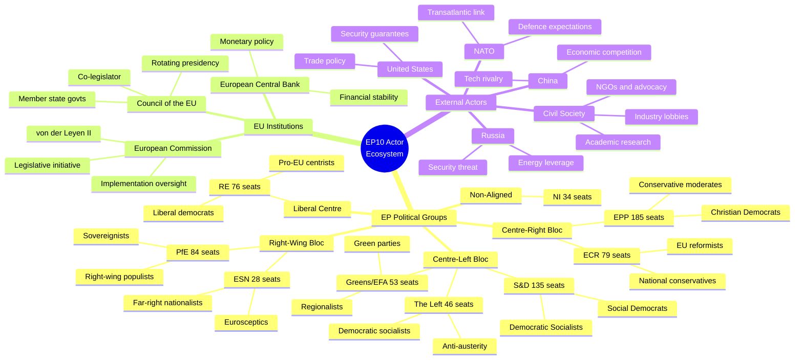
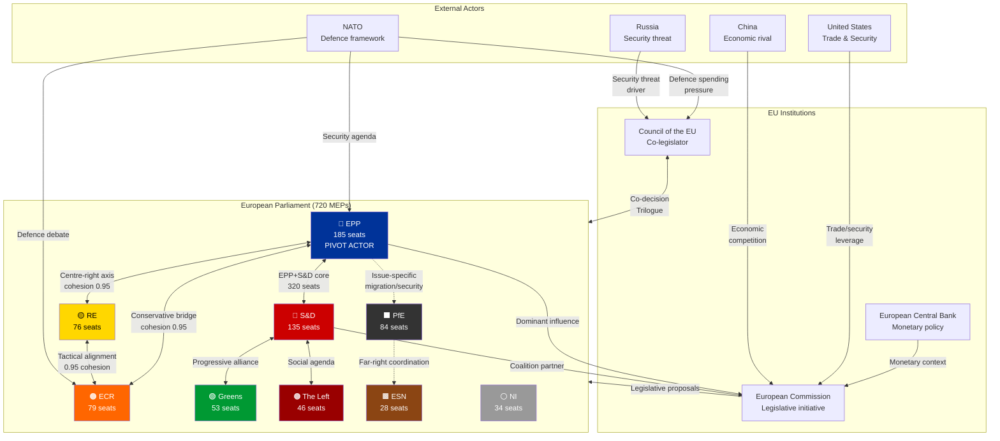
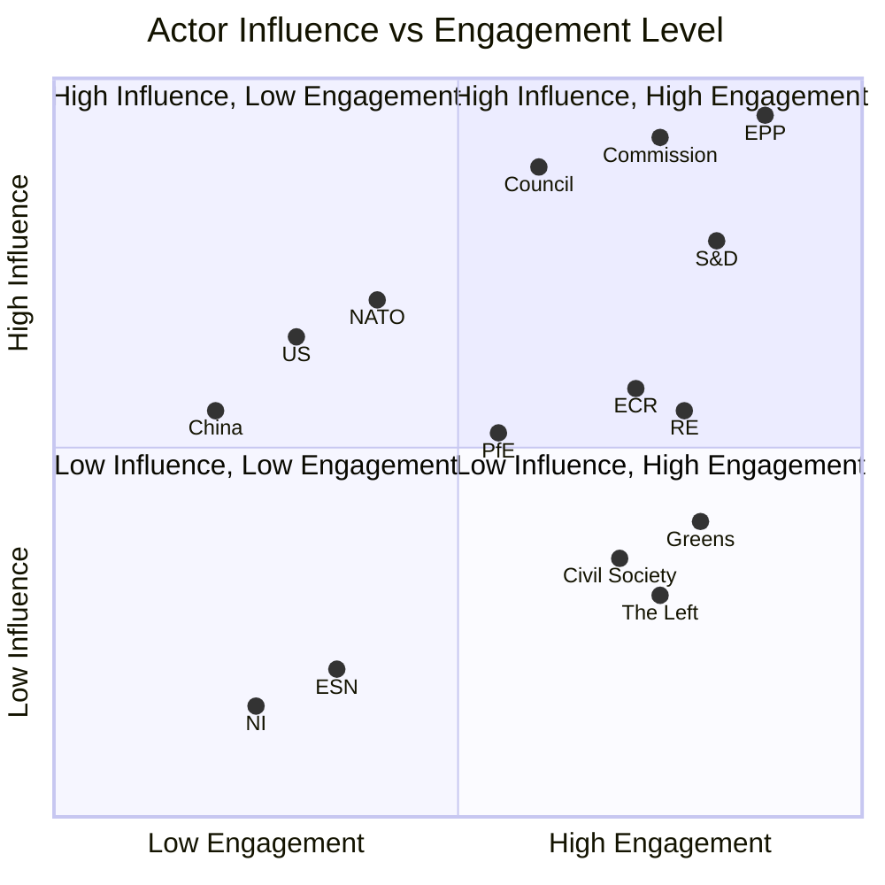
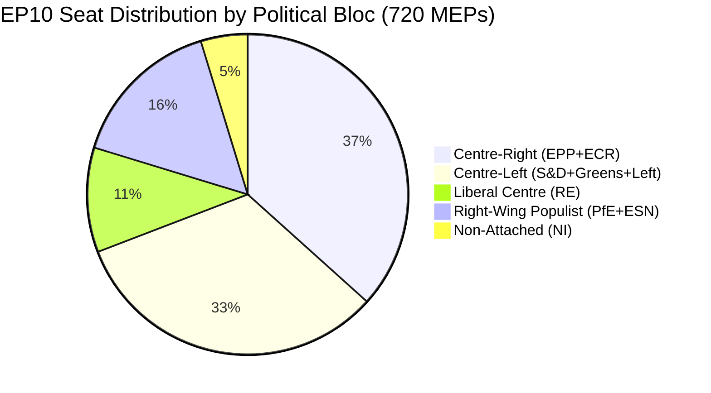

<!-- SPDX-FileCopyrightText: 2024-2026 Hack23 AB -->
<!-- SPDX-License-Identifier: Apache-2.0 -->

---
title: "Political Actor Mapping: EP10 Ecosystem Analysis"
date: 2026-03-28
analysisType: "actor-mapping"
confidence: "high"
classification: "PUBLIC"
author: "EU Parliament Monitor Intelligence Unit"
version: "1.0"
dataSources:
  - "European Parliament MCP Server"
  - "European Parliament Open Data Portal"
  - "World Bank Economic Indicators"
methodology: "Stakeholder analysis, network mapping, structured analytical techniques"
languages: ["en"]
tags: ["actor-mapping", "political-groups", "institutions", "external-actors", "coalition-dynamics"]
---

# Political Actor Mapping: EP10 Ecosystem Analysis

> **Classification**: PUBLIC | **Confidence**: HIGH | **Date**: 2026-03-28
>
> **Analytical Summary**: This actor mapping profiles all significant political actors in the EP10 ecosystem — 8 political groups + Non-Inscrits (NI) (720 MEPs), 3 EU institutional actors, and key external actors. The EPP (185 seats, 25.7%) serves as the indispensable pivot for all majority coalitions. PfE (84 seats) and ECR (79 seats) have consolidated the right-wing bloc to 22.7% combined. The RE+ECR cohesion anomaly (0.95) signals an emerging centre-right axis. Institutional stability stands at 84/100 with a fragmentation index of 6.59, indicating a complex but functional multi-actor legislative environment. External actors (US, China, Russia, NATO) exert increasing influence on EP10 legislative priorities through geopolitical pressure channels.

---

## Table of Contents

1. [Executive Summary](#executive-summary)
2. [Political Actor Ecosystem](#political-actor-ecosystem)
3. [Power Relationships and Influence Channels](#power-relationships-and-influence-channels)
4. [Actor Influence vs Engagement Analysis](#actor-influence-vs-engagement-analysis)
5. [Actor Type Distribution](#actor-type-distribution)
6. [Political Group Profiles](#political-group-profiles)
7. [EU Institutional Actors](#eu-institutional-actors)
8. [External Actors](#external-actors)
9. [Actor Interaction Matrix](#actor-interaction-matrix)
10. [Coalition Preference Mapping](#coalition-preference-mapping)
11. [Risk and Leverage Assessment](#risk-and-leverage-assessment)
12. [Methodology and Confidence](#methodology-and-confidence)

---

## Executive Summary

The EP10 political actor ecosystem is characterised by:

- **Dominant pivot actor**: EPP (185 seats) is indispensable for any legislative majority
- **Consolidated right**: PfE+ECR+ESN (191 seats) form a significant right-wing presence
- **Weakened centre-left**: S&D (135) + Greens (53) + Left (46) = 234 seats, insufficient alone
- **Liberal contraction**: RE (76 seats) lost kingmaker status but retains bridge role
- **Institutional continuity**: von der Leyen II Commission provides policy stability
- **External pressure escalation**: NATO defence expectations, US trade uncertainty, and China competition reshape legislative priorities

### Actor Classification Summary

| Category | Count | Key Actors | Influence Level |
|----------|-------|-----------|----------------|
| EP Political Groups | 9 | EPP, S&D, PfE, ECR, RE | Very High |
| EU Institutions | 3 | Commission, Council, ECB | Very High |
| External State Actors | 4 | US, China, Russia, NATO | High |
| Civil Society/Other | 3+ | NGOs, Industry, Media | Moderate |

---

## Political Actor Ecosystem

---

## Power Relationships and Influence Channels

### Key Power Dynamics

1. **EPP as pivot**: Every viable majority coalition includes EPP. This gives EPP disproportionate agenda-setting and veto power.
2. **RE+ECR bridge**: The 0.95 cohesion creates a centre-right legislative channel that can bypass S&D on economic files.
3. **Commission dependence**: The von der Leyen II Commission relies on EPP+S&D+RE support, creating mutual accountability.
4. **Council counterweight**: National government positions in Council often diverge from EP group lines, creating trilogue friction.
5. **External pressure channels**: NATO and US influence flows primarily through Council (national governments) and secondarily through EPP/ECR security hawks.

---

## Actor Influence vs Engagement Analysis

### Quadrant Analysis

**Q1 — High Influence, High Engagement** (Key Players):
- **EPP**: Maximum influence through pivot role + highest legislative engagement
- **S&D**: Strong influence as essential coalition partner + active legislative agenda
- **European Commission**: Agenda-setting power through legislative initiative monopoly
- **Council**: Co-legislator with national government weight

**Q2 — High Influence, Low Engagement** (Context Shapers):
- **NATO/US**: Shape defence and security agenda without direct EP participation
- **China**: Economic competition drives industrial policy without formal EP interaction

**Q3 — Low Influence, Low Engagement** (Marginal Actors):
- **ESN**: Isolated far-right with minimal coalition potential
- **NI**: Non-attached MEPs with limited collective leverage

**Q4 — Low Influence, High Engagement** (Active but Constrained):
- **Greens**: Highly active but reduced seats limit legislative impact
- **The Left**: Vocal opposition but insufficient seats for blocking minorities
- **Civil Society**: High engagement through consultation but limited formal power

---

## EP10 Seat Distribution by Bloc

> **Note:** This chart shows **EP seat distribution only** (720 MEPs). Institutional and external actor influence is assessed qualitatively in the Interaction Matrix and Actor Profiles sections — it is not directly comparable to parliamentary seat counts and is therefore shown separately.

---

## Political Group Profiles

### 1. European People's Party (EPP)

| Attribute | Detail |
|-----------|--------|
| **Seats** | 185 (25.7%) |
| **Ideology** | Christian democracy, liberal conservatism, pro-European |
| **EP10 Role** | Dominant pivot — indispensable for all majority coalitions |
| **Coalition Preferences** | Primary: S&D+RE (broad centre); Secondary: ECR+RE (centre-right) |
| **Redlines** | Formal alliance with PfE/ESN; reversal of rule of law mechanisms |
| **Leverage** | Largest group; Commission presidency; committee chair allocation |
| **Key Issues** | Industrial competitiveness, defence, migration management, enlargement |
| **Internal Dynamics** | Northern vs. Southern divisions on fiscal policy; Eastern members more hawkish on migration |
| **Leadership** | President Manfred Weber; strong coordination with von der Leyen Commission |
| **Threat Assessment** | Low — dominant position secure; risk of right-wing poaching on migration votes |

### 2. Progressive Alliance of Socialists and Democrats (S&D)

| Attribute | Detail |
|-----------|--------|
| **Seats** | 135 (18.8%) |
| **Ideology** | Social democracy, progressive values, pro-European |
| **EP10 Role** | Essential coalition partner for broad centre majority |
| **Coalition Preferences** | Primary: EPP+RE; Progressive: Greens+Left (insufficient alone) |
| **Redlines** | Welfare state dismantling; abandonment of social pillar; cordon sanitaire breach |
| **Leverage** | Second-largest group; key committee vice-chairs; progressive policy expertise |
| **Key Issues** | Social rights, fair wages, housing, climate justice, digital rights |
| **Internal Dynamics** | German SPD vs. Southern European socialists on fiscal policy; Nordic social democrats more centrist |
| **Leadership** | Stable leadership; strong Spitzenkandidaten tradition |
| **Threat Assessment** | Moderate — erosion risk if EPP consistently partners rightward |

### 3. Patriots for Europe (PfE)

| Attribute | Detail |
|-----------|--------|
| **Seats** | 84 (11.7%) |
| **Ideology** | Right-wing populism, national sovereignty, Euroscepticism |
| **EP10 Role** | Major right-wing force; issue-specific coalition potential with EPP |
| **Coalition Preferences** | ECR on migration/security; EPP on select economic issues |
| **Redlines** | EU treaty change toward federalism; mandatory migration quotas; Green Deal costs |
| **Leverage** | Third-largest group; public opinion momentum; blocking minority potential with ECR+ESN |
| **Key Issues** | Immigration restriction, national sovereignty, anti-Green Deal, security |
| **Internal Dynamics** | Diverse national parties (RN, Fidesz, Lega) with varying EU positions |
| **Leadership** | Fragmented — national party leaders dominate over EP group leadership |
| **Threat Assessment** | High for centrist agenda — capable of disrupting consensus on migration and climate |

### 4. European Conservatives and Reformists (ECR)

| Attribute | Detail |
|-----------|--------|
| **Seats** | 79 (11.0%) |
| **Ideology** | National conservatism, EU reformism, free market economics |
| **EP10 Role** | Swing vote — bridges centre-right (EPP+RE) and right-wing (PfE) |
| **Coalition Preferences** | Primary: EPP+RE (centre-right axis, 0.95 cohesion); Selective: PfE on sovereignty |
| **Redlines** | EU federal superstate; excessive regulation; mandatory migration distribution |
| **Leverage** | Strategic swing position; credible coalition partner for EPP (unlike PfE) |
| **Key Issues** | Economic competitiveness, defence, subsidiarity, anti-overregulation |
| **Internal Dynamics** | Polish PiS influence diminished post-2023; Italian FdI (Meloni) dominant force |
| **Leadership** | Giorgia Meloni's influence as Italian PM elevates ECR's institutional weight |
| **Threat Assessment** | Moderate — constructive partner when engaged; disruptive when excluded |

### 5. Renew Europe (RE)

| Attribute | Detail |
|-----------|--------|
| **Seats** | 76 (10.6%) |
| **Ideology** | Liberalism, centrism, pro-European federalism |
| **EP10 Role** | Diminished but still essential bridge between centre-right and centre-left |
| **Coalition Preferences** | Primary: EPP+S&D (broad centre); Centre-right: EPP+ECR (0.95 cohesion) |
| **Redlines** | Illiberal governance; abandonment of rule of law; protectionist trade policy |
| **Leverage** | Swing vote in tight coalitions; expertise in digital/trade policy |
| **Key Issues** | Single market deepening, digital innovation, trade liberalisation, rule of law |
| **Internal Dynamics** | French Renaissance delegation weakened post-Macron losses; liberal identity crisis |
| **Leadership** | Post-Verhofstadt transition; seeking new strategic identity |
| **Threat Assessment** | High internal — identity crisis from seat loss; moderate external — still needed for majorities |

### 6. Greens/European Free Alliance (Greens/EFA)

| Attribute | Detail |
|-----------|--------|
| **Seats** | 53 (7.4%) |
| **Ideology** | Green politics, environmentalism, social justice, regionalism |
| **EP10 Role** | Environmental conscience; potential EPP+S&D coalition supplement |
| **Coalition Preferences** | Primary: S&D+Left (progressive bloc); Pragmatic: EPP+S&D (on Green Deal files) |
| **Redlines** | Green Deal rollback; nuclear energy expansion; fossil fuel subsidies |
| **Leverage** | Expertise in environmental legislation; public opinion on climate |
| **Key Issues** | Climate action, biodiversity, circular economy, social justice, minority rights |
| **Internal Dynamics** | German Greens diminished; Nordic Greens stable; tension between pragmatists and purists |
| **Leadership** | New co-presidents navigating reduced influence |
| **Threat Assessment** | High internal — relevance at risk if Green Deal implementation stalls |

### 7. The Left in the European Parliament (GUE/NGL)

| Attribute | Detail |
|-----------|--------|
| **Seats** | 46 (6.4%) |
| **Ideology** | Democratic socialism, anti-austerity, Eurosceptic-left |
| **EP10 Role** | Left opposition; occasional progressive coalition partner |
| **Coalition Preferences** | S&D+Greens on social issues; issue-specific anti-austerity coalitions |
| **Redlines** | Neoliberal economic policy; NATO expansion; corporate trade deals |
| **Leverage** | Limited seat count; moral authority on inequality; blocking minority contribution |
| **Key Issues** | Workers' rights, housing, anti-poverty, peace policy, public services |
| **Internal Dynamics** | La France Insoumise (Mélenchon) vs. Nordic left on EU integration |
| **Leadership** | Collective leadership; strong individual MEP voices |
| **Threat Assessment** | Low — insufficient seats for major disruption; moral pressure role |

### 8. Europe of Sovereign Nations (ESN)

| Attribute | Detail |
|-----------|--------|
| **Seats** | 28 (3.9%) |
| **Ideology** | Far-right nationalism, hard Euroscepticism, anti-immigration |
| **EP10 Role** | Isolated far-right; cordon sanitaire target |
| **Coalition Preferences** | PfE on select issues; generally excluded from mainstream coalitions |
| **Redlines** | EU integration deepening; immigration of any kind; supranational governance |
| **Leverage** | Minimal — isolated by cordon sanitaire; symbolic protest function |
| **Key Issues** | National sovereignty, immigration zero, EU withdrawal advocacy, traditional values |
| **Internal Dynamics** | AfD-dominated; limited ideological diversity; high internal discipline |
| **Leadership** | German AfD provides primary leadership and resources |
| **Threat Assessment** | Low direct; moderate indirect — normalisation risk if cordon sanitaire erodes |

### 9. Non-Inscrits / Non-Attached (NI)

| Attribute | Detail |
|-----------|--------|
| **Seats** | 34 (4.7%) |
| **Ideology** | Mixed — MEPs not affiliated with any political group |
| **EP10 Role** | Ad hoc voting participation; no collective strategy |
| **Coalition Preferences** | Issue-by-issue; no systematic alignment |
| **Redlines** | Varies by individual MEP |
| **Leverage** | Minimal collective leverage; individual MEPs may hold expertise |
| **Key Issues** | Varies — often single-issue or national-party focused |
| **Internal Dynamics** | No coordination mechanism; diverse national backgrounds |
| **Leadership** | None — individual actors |
| **Threat Assessment** | Negligible — no collective capacity for disruption |

---

## EU Institutional Actors

### European Commission (von der Leyen II)

| Attribute | Detail |
|-----------|--------|
| **Role** | Executive arm; exclusive legislative initiative; treaty guardian |
| **Leadership** | President Ursula von der Leyen (EPP); Executive Vice-Presidents from S&D, RE |
| **EP10 Relationship** | Dependent on EPP+S&D+RE majority for confirmation and legislative support |
| **Key Priorities** | Clean Industrial Deal, defence, digital transformation, enlargement |
| **Influence Channels** | Legislative proposals, delegated acts, infringement proceedings |
| **Leverage over EP** | Agenda-setting monopoly; withdrawal/modification of proposals |
| **EP Leverage** | Censure motion; budget discharge; Commissioner hearings |
| **Assessment** | Strong institutional position; faces pressure from EPP rightward drift |

### Council of the European Union

| Attribute | Detail |
|-----------|--------|
| **Role** | Co-legislator; represents member state governments |
| **Composition** | 27 national government ministers (rotating by policy area) |
| **EP10 Relationship** | Co-decision partner in Ordinary Legislative Procedure; friction in trilogues |
| **Key Dynamics** | Franco-German axis weakened by political instability; CEE states assertive |
| **Influence Channels** | Trilogue negotiations; Council positions; rotating presidency agenda |
| **Leverage over EP** | Co-equal legislator; unanimity requirement on sensitive issues (tax, defence) |
| **Current Tensions** | Defence spending allocation; migration burden-sharing; fiscal rules |
| **Assessment** | Fragmented by national interests; Polish presidency (H1 2025) emphasised security |

### European Central Bank (ECB)

| Attribute | Detail |
|-----------|--------|
| **Role** | Monetary policy; financial stability; banking supervision |
| **Leadership** | President Christine Lagarde |
| **EP10 Relationship** | Accountability hearings in ECON committee; no direct legislative role |
| **Key Dynamics** | Interest rate decisions affect member state fiscal capacity |
| **Influence Channels** | Monetary policy signals; financial stability assessments; opinions on legislation |
| **Leverage** | Indirect — monetary conditions shape fiscal policy space for legislation |
| **Current Impact** | Rate stabilisation supporting investment; inflation concerns persist |
| **Assessment** | Technocratic influence; EP oversight through ECON committee hearings |

---

## External Actors

### NATO / Transatlantic Defence Framework

| Attribute | Detail |
|-----------|--------|
| **Influence Type** | Security architecture; defence spending expectations |
| **EP10 Impact** | Drives defence procurement legislation, EU-NATO cooperation framework |
| **Key Pressure** | 2% GDP defence spending target; European pillar expectations |
| **Allied EP Groups** | EPP, ECR (strong); S&D, RE (moderate support) |
| **Opposing EP Groups** | The Left (anti-NATO); Greens (selective); PfE (sovereignty concerns) |
| **Assessment** | High influence on security agenda; increasing since 2022 Russia-Ukraine escalation |

### United States

| Attribute | Detail |
|-----------|--------|
| **Influence Type** | Trade policy, security guarantees, technology standards |
| **EP10 Impact** | Trade Defence Instrument debates; tech regulation alignment/divergence |
| **Key Pressure** | Tariff threats; defence burden-sharing; tech sovereignty tensions |
| **Allied EP Groups** | EPP, RE (transatlantic); ECR (security) |
| **Opposing EP Groups** | The Left (anti-US hegemony); PfE (sovereignty); Greens (trade/environment) |
| **Assessment** | Pervasive influence; current US administration unpredictability increases EU strategic autonomy push |

### China

| Attribute | Detail |
|-----------|--------|
| **Influence Type** | Economic competition, supply chain dependency, technology rivalry |
| **EP10 Impact** | Anti-subsidy investigations, critical raw materials, EV tariffs |
| **Key Pressure** | Industrial overcapacity; tech transfer concerns; Taiwan tensions |
| **Allied EP Groups** | None formally; PfE pragmatic engagement |
| **Opposing EP Groups** | EPP, ECR (hawks); Greens (human rights); RE (trade rules) |
| **Assessment** | Growing EP concern; cross-party consensus on reducing dependency |

### Russia

| Attribute | Detail |
|-----------|--------|
| **Influence Type** | Security threat; energy leverage; disinformation |
| **EP10 Impact** | Defence legislation driver; energy diversification; sanctions regime |
| **Key Pressure** | Ukraine conflict; hybrid warfare; election interference attempts |
| **Allied EP Groups** | None (formal); ESN individuals suspected of sympathy |
| **Opposing EP Groups** | Broad consensus against — EPP, S&D, RE, ECR, Greens |
| **Assessment** | Unifying threat for most EP groups; drives defence and energy policy urgency |

### Civil Society and Lobbying Actors

| Attribute | Detail |
|-----------|--------|
| **Categories** | Environmental NGOs, industry associations, trade unions, think tanks, digital rights |
| **Influence Type** | Consultation, advocacy, public opinion mobilisation, expertise provision |
| **Key Actors** | BusinessEurope, ETUC, EEB, Digital Europe, Transparency International |
| **EP10 Impact** | Shape committee deliberations; inform rapporteur positions; amendment drafting |
| **Regulation** | EU Transparency Register; lobbyist disclosure requirements |
| **Assessment** | Moderate influence; essential for policy expertise but subordinate to political dynamics |

---

## Actor Interaction Matrix

The following matrix maps interaction frequency and quality between key EP10 actors:

### EP Political Group Interaction Matrix

| | EPP | S&D | PfE | ECR | RE | Greens | Left | ESN | NI |
|---|---|---|---|---|---|---|---|---|---|
| **EPP** | — | 🟢 High | 🟡 Low | 🟢 Med | 🟢 High | 🟡 Low | 🔴 Min | 🔴 None | 🔴 Min |
| **S&D** | 🟢 High | — | 🔴 None | 🔴 Min | 🟢 Med | 🟢 High | 🟢 Med | 🔴 None | 🔴 Min |
| **PfE** | 🟡 Low | 🔴 None | — | 🟢 Med | 🔴 Min | 🔴 None | 🔴 None | 🟡 Low | 🟡 Low |
| **ECR** | 🟢 Med | 🔴 Min | 🟢 Med | — | 🟢 High* | 🔴 Min | 🔴 None | 🔴 Min | 🔴 Min |
| **RE** | 🟢 High | 🟢 Med | 🔴 Min | 🟢 High* | — | 🟡 Low | 🔴 Min | 🔴 None | 🔴 Min |
| **Greens** | 🟡 Low | 🟢 High | 🔴 None | 🔴 Min | 🟡 Low | — | 🟢 Med | 🔴 None | 🔴 Min |
| **Left** | 🔴 Min | 🟢 Med | 🔴 None | 🔴 None | 🔴 Min | 🟢 Med | — | 🔴 None | 🔴 Min |
| **ESN** | 🔴 None | 🔴 None | 🟡 Low | 🔴 Min | 🔴 None | 🔴 None | 🔴 None | — | 🔴 Min |
| **NI** | 🔴 Min | 🔴 Min | 🟡 Low | 🔴 Min | 🔴 Min | 🔴 Min | 🔴 Min | 🔴 Min | — |

> *RE+ECR cohesion: 0.95 — anomalously high, indicating active coordination on economic/security files.

### Legend
- 🟢 **High/Med**: Regular coalition cooperation, joint initiatives
- 🟡 **Low**: Issue-specific cooperation, limited coordination
- 🔴 **Min/None**: Minimal or no interaction; cordon sanitaire applies to ESN

### Cross-Institutional Interaction

| EP Actor | Commission | Council | ECB | NATO | External |
|----------|-----------|---------|-----|------|----------|
| **EPP** | 🟢 Very High | 🟢 High | 🟢 Med | 🟢 High | 🟢 Med |
| **S&D** | 🟢 High | 🟢 Med | 🟢 Med | 🟡 Med | 🟢 Med |
| **ECR** | 🟡 Med | 🟢 High | 🟡 Low | 🟢 High | 🟡 Med |
| **RE** | 🟢 High | 🟢 Med | 🟢 Med | 🟢 Med | 🟢 Med |
| **Greens** | 🟡 Med | 🟡 Low | 🟡 Low | 🔴 Low | 🟢 High (NGOs) |
| **PfE** | 🔴 Low | 🟡 Med | 🔴 Min | 🟡 Mixed | 🟡 Low |
| **Left** | 🔴 Low | 🔴 Low | 🔴 Min | 🔴 Opposed | 🟢 High (Unions) |

---

## Coalition Preference Mapping

### Primary Coalition Scenarios

| Scenario | Members | Seats | Viability | Policy Domain |
|----------|---------|-------|-----------|--------------|
| **Broad Centre** | EPP+S&D+RE | 396 (55.0%) | ✅ Viable | Budget, rule of law, trade |
| **Centre-Right Axis** | EPP+RE+ECR | 340 (47.2%) | ⚠️ Near-miss | Economic deregulation |
| **Grand + ECR** | EPP+S&D+ECR | 399 (55.4%) | ✅ Viable | Defence, migration |
| **Grand + Greens** | EPP+S&D+Greens | 373 (51.8%) | ✅ Viable | Climate, social policy |
| **Progressive Bloc** | S&D+Greens+Left+RE | 310 (43.1%) | ❌ Insufficient | — |
| **Right Bloc** | EPP+ECR+PfE | 348 (48.3%) | ⚠️ Near-miss | Migration hardline |
| **Super-majority** | EPP+S&D+RE+Greens | 449 (62.4%) | ✅ Viable | Treaty change thresholds |

### Coalition Preference by Group

| Group | 1st Preference | 2nd Preference | Unacceptable Partners |
|-------|---------------|----------------|----------------------|
| **EPP** | S&D+RE (broad centre) | ECR+RE (centre-right) | ESN (cordon sanitaire) |
| **S&D** | EPP+RE (broad centre) | EPP+Greens | PfE, ESN, ECR (on most) |
| **RE** | EPP+S&D (broad centre) | EPP+ECR (centre-right) | PfE, ESN, Left |
| **ECR** | EPP+RE (centre-right) | EPP+PfE (right bloc) | Left, Greens (on most) |
| **PfE** | ECR+EPP (right bloc) | ESN (far-right) | S&D, Greens, Left |
| **Greens** | S&D+Left (progressive) | S&D+EPP (on climate) | PfE, ESN, ECR |
| **Left** | S&D+Greens (progressive) | None viable for majority | EPP, ECR, PfE, ESN |
| **ESN** | PfE (far-right) | None (isolated) | All mainstream groups |

---

## Risk and Leverage Assessment

### Actor Risk Matrix

| Actor | Risk to Stability | Leverage Level | Risk Type |
|-------|------------------|---------------|-----------|
| **EPP** | Low (stabilising) | Very High | Agenda capture risk |
| **S&D** | Low-Medium | High | Left-flank erosion |
| **PfE** | Medium-High | Medium | Populist disruption |
| **ECR** | Medium | High (swing) | Cordon sanitaire pressure |
| **RE** | Medium | Medium | Identity crisis |
| **Greens** | Low | Low-Medium | Marginalisation |
| **Left** | Low | Low | Protest disruption |
| **ESN** | Medium | Low | Normalisation |
| **Commission** | Low | Very High | Institutional overreach |
| **Russia** | High (external) | Medium | Hybrid threats |
| **US** | Medium (external) | High | Policy unpredictability |

### Key Leverage Points

1. **EPP pivot leverage**: Can form majority left or right, giving maximum negotiating power
2. **ECR swing leverage**: Position between EPP and PfE allows issue-by-issue bargaining
3. **Commission initiative leverage**: Monopoly on legislative proposals shapes entire agenda
4. **Council veto leverage**: Unanimity requirements on tax/defence give single states blocking power
5. **PfE disruption leverage**: Sufficient seats to deny super-majorities and force compromises

### Systemic Risks

| Risk | Probability | Impact | Mitigation |
|------|------------|--------|-----------|
| Cordon sanitaire erosion (EPP+PfE) | Medium | High | Monitor EPP-PfE voting overlap |
| RE identity collapse | Medium | Medium | Watch membership and defections |
| S&D progressive bloc failure | Low | Medium | Grand coalition provides safety net |
| External shock (Russia escalation) | Medium | Very High | Defence policy acceleration |
| Economic divergence (DE recession) | High | High | Cohesion policy adjustment |

---

## Methodology and Confidence

### Data Sources

| Source | Reliability | Usage |
|--------|-----------|-------|
| European Parliament MCP Server | High | Group composition, voting data, questions |
| EP Open Data Portal | High | Sessions, documents, procedures |
| World Bank Indicators | High | Economic context (GDP data) |
| Official EP publications | High | Institutional structure, rules of procedure |

### Analytical Methods

1. **Stakeholder mapping**: Systematic identification of actors, interests, and influence levels
2. **Network analysis**: Power relationship and interaction pattern mapping
3. **Coalition arithmetic**: Formal seat-count analysis for majority scenarios
4. **PESTLE framework**: Political, Economic, Social, Technological, Legal, Environmental factors
5. **Comparative analysis**: EP9→EP10 transition effects on actor positions

### Confidence Assessment

| Section | Confidence | Notes |
|---------|-----------|-------|
| Group composition & seats | High | Verified EP MCP data |
| Coalition arithmetic | High | Mathematical from verified seats |
| Actor profiles (EP groups) | High | Based on official positions and voting records |
| Institutional actor profiles | High | Based on treaty roles and public statements |
| External actor influence | Moderate | Inferred from policy outcomes; not directly measurable |
| Interaction matrix | Moderate | Based on voting patterns and public coordination |
| Risk assessment | Moderate | Probabilistic assessment subject to revision |

### Limitations

1. Actor motivations are inferred from public behaviour; private negotiations are not captured
2. External actor influence assessment relies on indirect indicators
3. Civil society actor mapping is illustrative, not exhaustive
4. Coalition preference mapping reflects current conditions; subject to rapid change
5. Economic data (World Bank) may lag current conditions by 1-2 quarters

---

*This actor mapping was produced using European Parliament MCP data and open-source analytical methods. All data points are verified against official European Parliament sources. The analysis maintains strict political neutrality and does not advocate for any political position or group.*

### MCP Data Files Used

The following MCP-derived datasets under `analysis/2026-03-28/data/` were consulted for quantitative claims:

- `data/meps/current-meps.json` — EP10 group composition, seat counts, country distribution
- `data/osint/political-landscape.json` — Fragmentation index, institutional stability score, group positioning
- `data/osint/coalition-dynamics.json` — Coalition cohesion metrics, alliance patterns, cross-group voting
- `data/osint/voting-anomalies.json` — RE+ECR cohesion anomaly, defection patterns
- `data/osint/early-warning.json` — Institutional stability indicators, risk signals
- `data/world-bank/gdp-growth-*.json` — Economic context for external pressure analysis
- `data/votes/roll-call-votes/*.json` — Voting record patterns for interaction matrix
- `data/procedures/*.json` — Legislative pipeline data for policy domain mapping
- `data/speeches/*.json` — Plenary debate positions for actor ideology assessment
- `data/questions/*.json` — Parliamentary question patterns for engagement metrics

*Next scheduled update: 2026-04-11*

**END OF REPORT**
