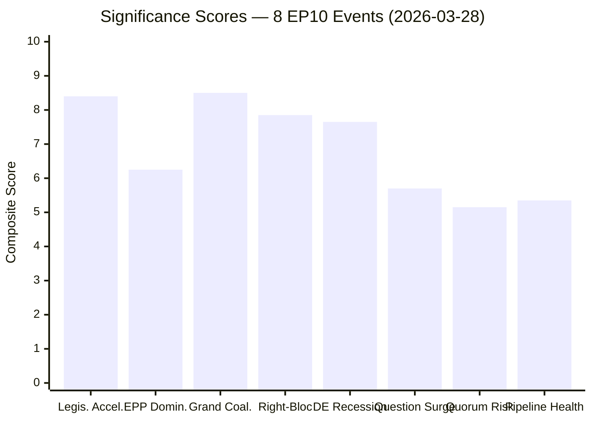
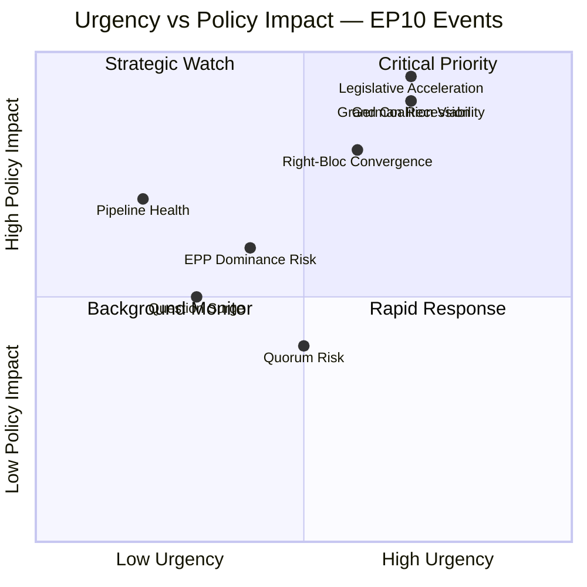
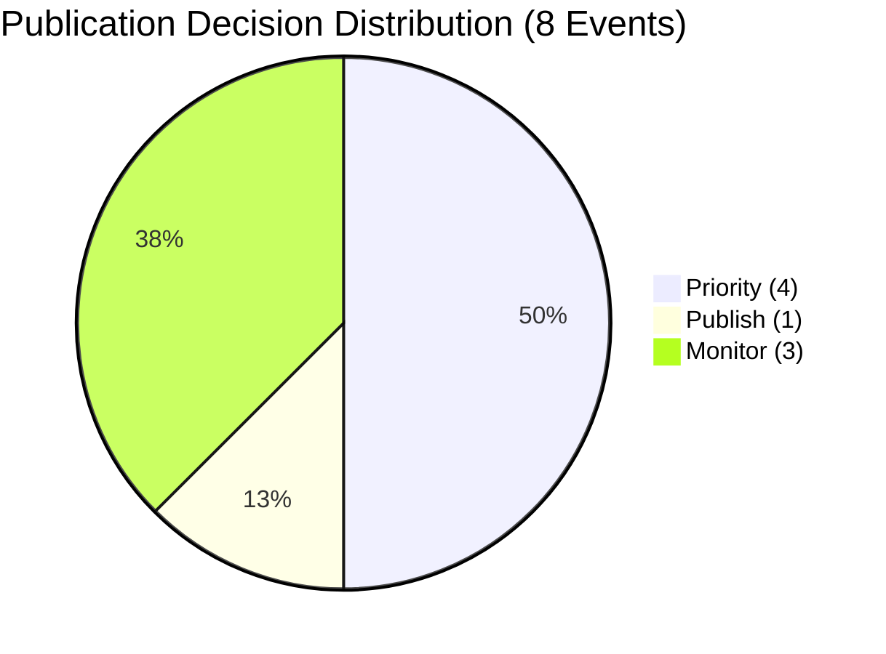

<!-- SPDX-FileCopyrightText: 2024-2026 Hack23 AB -->
<!-- SPDX-License-Identifier: Apache-2.0 -->

---
date: "2026-03-28"
analysisType: "significance-scoring"
scoreId: "SIG-2026-03-28-001"
subject: "EP10 Mid-Term Political Events Batch Scoring"
scoredBy: "intelligence-operative-workflow"
epTerm: "EP10"
eventsScored: 8
---

# 📈 Political Significance Scoring — EP10 Mid-Term Events

> **Intelligence Product** | Score ID: `SIG-2026-03-28-001` | Classification: PUBLIC
>
> **Batch scoring of 8 significant EP10 political events/trends using the 5-dimension weighted model.**

---

## 📋 Event Context

| Field | Value |
|-------|-------|
| **Score ID** | `SIG-2026-03-28-001` |
| **Event / Document** | EP10 Mid-Term: 8 Key Political Events & Trends (Batch) |
| **Primary EP Reference** | EP MCP political landscape, coalition dynamics, legislative pipeline (2026-03-28) |
| **Scoring Date** | `2026-03-28 09:00 UTC` |
| **Scored By** | `intelligence-operative-workflow` |
| **Classification ID** | `CLS-2026-03-28-001` |

---

## 📐 Scoring Methodology

### Composite Score Formula

```
Composite = (Parliamentary × 0.25) + (Policy × 0.25) + (Public Interest × 0.20)
          + (Urgency × 0.15) + (Cross-Group × 0.15)
```

### 🚦 Publication Decision Thresholds

| Score Range | Decision | Action |
|-------------|----------|--------|
| **0.0 – 3.9** | 🗄️ **Archive** | Log for trend analysis; do not publish |
| **4.0 – 5.9** | 📋 **Monitor** | Track for follow-up; consider weekly digest |
| **6.0 – 7.4** | 📰 **Publish** | Include in next standard news cycle |
| **7.5 – 8.9** | 📰 **Priority** | Priority in daily news; prominent placement |
| **9.0 – 10.0** | ⚡ **Breaking** | Publish immediately; all-language deployment |

---

## 📊 Section 1: Individual Event Scoring

---

### Event 1: EP10 Legislative Acceleration (+58% Acts Adopted)

> 114 acts adopted in 2026 vs ~72 baseline — unprecedented mid-term legislative output

#### Dimension 1: Parliamentary Significance (0–10)

| Sub-criterion | Score (0–3) | Rationale |
|--------------|:-----------:|-----------|
| Legislative stage | 3 | Final adoption of 114 acts — highest-impact stage |
| Institutional dimension | 2 | Interinstitutional achievement across EP-Council-Commission |
| Number of MEPs involved | 3 | All 720 MEPs participate in plenary adoptions |

**Parliamentary Significance Score:** **9** /10

#### Dimension 2: Policy Impact (0–10)

| Sub-criterion | Score (0–3) | Rationale |
|--------------|:-----------:|-----------|
| Scope | 3 | EU-wide legislative acts binding across 27 Member States |
| Duration | 3 | Permanent structural regulations and directives |
| Affected population | 3 | 450M+ EU residents affected by adopted legislation |

**Policy Impact Score:** **10** /10

#### Dimension 3: Public Interest (0–10)

| Sub-criterion | Score (0–3) | Rationale |
|--------------|:-----------:|-----------|
| Topic salience | 2 | Mixed topics — some high-salience (AI, climate), some technical |
| Controversy level | 2 | Partisan on several files; general acceleration is consensus |
| Citizen-facing impact | 3 | Direct regulatory impact on citizens across multiple domains |

**Public Interest Score:** **7** /10

#### Dimension 4: Urgency (0–10)

| Sub-criterion | Score (0–3) | Rationale |
|--------------|:-----------:|-----------|
| Time horizon | 1 | Ongoing trend, not single deadline event |
| Reversibility | 3 | Adopted legislation is difficult to reverse |
| Cascade risk | 3 | Multiple cascading implementation requirements across EU |

**Urgency Score:** **7** /10

#### Dimension 5: Cross-Group Relevance (0–10)

| Sub-criterion | Score (0–3) | Rationale |
|--------------|:-----------:|-----------|
| Political groups involved | 3 | All 8 groups + NI participate in plenary votes |
| Grand coalition implication | 2 | Tests alliance capacity to maintain legislative pace |
| Opposition response strength | 2 | Opposition groups issue statements on regulatory burden |

**Cross-Group Relevance Score:** **8** /10

#### Composite Score: Event 1

| Dimension | Raw Score | Weight | Weighted Score |
|-----------|:---------:|:------:|:--------------:|
| Parliamentary Significance | 9 | 0.25 | 2.25 |
| Policy Impact | 10 | 0.25 | 2.50 |
| Public Interest | 7 | 0.20 | 1.40 |
| Urgency | 7 | 0.15 | 1.05 |
| Cross-Group Relevance | 8 | 0.15 | 1.20 |
| **COMPOSITE SCORE** | — | — | **8.40 / 10** |

**Decision:** 📰 **Priority** — Unprecedented legislative acceleration merits prominent coverage across all languages.

---

### Event 2: EPP Dominance Risk (19x Smallest Group)

> EPP at 185 seats is 19× the size of ESN (28 seats) — structural imbalance in EP10

| Dimension | Raw Score | Weight | Weighted Score |
|-----------|:---------:|:------:|:--------------:|
| Parliamentary Significance | 7 | 0.25 | 1.75 |
| Policy Impact | 6 | 0.25 | 1.50 |
| Public Interest | 6 | 0.20 | 1.20 |
| Urgency | 4 | 0.15 | 0.60 |
| Cross-Group Relevance | 8 | 0.15 | 1.20 |
| **COMPOSITE SCORE** | — | — | **6.25 / 10** |

**Rationale:** EPP's structural dominance shapes committee chairs, rapporteur allocation, and agenda-setting. The 19:1 ratio with ESN raises democratic representation concerns. However, urgency is moderate as this is a structural condition, not an acute event.

**Decision:** 📰 **Publish** — Include in political landscape analysis for democratic accountability coverage.

---

### Event 3: Grand Coalition Viability (396/720 Seats = 55%)

> EPP+S&D+RE coalition holds functional majority but faces right-bloc alternative

| Dimension | Raw Score | Weight | Weighted Score |
|-----------|:---------:|:------:|:--------------:|
| Parliamentary Significance | 9 | 0.25 | 2.25 |
| Policy Impact | 9 | 0.25 | 2.25 |
| Public Interest | 8 | 0.20 | 1.60 |
| Urgency | 7 | 0.15 | 1.05 |
| Cross-Group Relevance | 9 | 0.15 | 1.35 |
| **COMPOSITE SCORE** | — | — | **8.50 / 10** |

**Rationale:** The grand coalition's 55% majority is the central organizing principle of EP10. Its viability directly determines which legislation passes, which is blocked, and which political actors hold leverage. The proximity of the right-bloc alternative (376 seats, 52.2%) elevates this from routine coalition analysis to strategic significance.

**Decision:** 📰 **Priority** — Foundational political dynamic requiring prominent, ongoing coverage.

---

### Event 4: Right-Bloc Convergence (PfE+ECR+ESN = 191 Seats)

> Combined right-wing opposition could form majority with EPP (376 seats total)

| Dimension | Raw Score | Weight | Weighted Score |
|-----------|:---------:|:------:|:--------------:|
| Parliamentary Significance | 8 | 0.25 | 2.00 |
| Policy Impact | 8 | 0.25 | 2.00 |
| Public Interest | 8 | 0.20 | 1.60 |
| Urgency | 6 | 0.15 | 0.90 |
| Cross-Group Relevance | 9 | 0.15 | 1.35 |
| **COMPOSITE SCORE** | — | — | **7.85 / 10** |

**Rationale:** Right-bloc convergence is the most strategically significant opposition dynamic in EP10. While PfE, ECR, and ESN differ on many issues, their combined 191 seats plus EPP's 185 create a theoretical 376-seat majority (52.2%). This is not currently operational as a formal coalition, but issue-by-issue cooperation on migration, security, and economic deregulation is observed.

**Decision:** 📰 **Priority** — Strategic intelligence on political realignment risk.

---

### Event 5: German Recession Impact on EU Economic Policy

> Germany at -0.50% GDP while Spain grows +3.46% — maximum EU economic divergence

| Dimension | Raw Score | Weight | Weighted Score |
|-----------|:---------:|:------:|:--------------:|
| Parliamentary Significance | 6 | 0.25 | 1.50 |
| Policy Impact | 9 | 0.25 | 2.25 |
| Public Interest | 9 | 0.20 | 1.80 |
| Urgency | 7 | 0.15 | 1.05 |
| Cross-Group Relevance | 7 | 0.15 | 1.05 |
| **COMPOSITE SCORE** | — | — | **7.65 / 10** |

**Rationale:** Germany's recession directly impacts EU fiscal policy debates, industrial strategy, and the political positioning of German MEPs across all groups. The economic divergence (DE -0.50% vs ES +3.46%) creates political tensions on regulation, taxation, and competitiveness that cut across traditional left-right lines. Parliamentary significance is lower because this is an exogenous economic event, but policy impact and public interest are very high.

**Decision:** 📰 **Priority** — Economic context essential for understanding legislative dynamics.

---

### Event 6: Parliamentary Question Surge (+56% YoY)

> 6,147 questions filed in 2026 — democratic oversight at historic levels

| Dimension | Raw Score | Weight | Weighted Score |
|-----------|:---------:|:------:|:--------------:|
| Parliamentary Significance | 7 | 0.25 | 1.75 |
| Policy Impact | 5 | 0.25 | 1.25 |
| Public Interest | 6 | 0.20 | 1.20 |
| Urgency | 3 | 0.15 | 0.45 |
| Cross-Group Relevance | 7 | 0.15 | 1.05 |
| **COMPOSITE SCORE** | — | — | **5.70 / 10** |

**Rationale:** The 56% increase in parliamentary questions signals intensified democratic oversight and MEP engagement. However, questions are indirect instruments — they generate information but rarely change policy directly. Public interest is moderate as citizens benefit from transparency but may not follow individual questions. Cross-group relevance is high as all groups use the question mechanism.

**Decision:** 📋 **Monitor** — Track as democratic health indicator; include in weekly digest.

---

### Event 7: Small Group Quorum Risk (RE, NI, The Left ≤5 Members in OSINT)

> Smaller groups face committee representation and procedural viability challenges

| Dimension | Raw Score | Weight | Weighted Score |
|-----------|:---------:|:------:|:--------------:|
| Parliamentary Significance | 6 | 0.25 | 1.50 |
| Policy Impact | 4 | 0.25 | 1.00 |
| Public Interest | 5 | 0.20 | 1.00 |
| Urgency | 5 | 0.15 | 0.75 |
| Cross-Group Relevance | 6 | 0.15 | 0.90 |
| **COMPOSITE SCORE** | — | — | **5.15 / 10** |

**Rationale:** Small groups facing quorum risks is a structural democratic representation concern. When groups have fewer than 5-6 active members per committee, they cannot effectively participate in all policy areas simultaneously. This disproportionately affects The Left (46 seats spread across 20+ committees), NI (34 fragmented), and ESN (28). The impact is real but gradual, affecting legislative influence rather than creating acute crises.

**Decision:** 📋 **Monitor** — Track for democratic representation analysis; flag if groups lose formal status.

---

### Event 8: Legislative Pipeline Health (100/100 Score)

> Perfect pipeline health indicates efficient institutional functioning with no bottlenecks

| Dimension | Raw Score | Weight | Weighted Score |
|-----------|:---------:|:------:|:--------------:|
| Parliamentary Significance | 7 | 0.25 | 1.75 |
| Policy Impact | 7 | 0.25 | 1.75 |
| Public Interest | 4 | 0.20 | 0.80 |
| Urgency | 2 | 0.15 | 0.30 |
| Cross-Group Relevance | 5 | 0.15 | 0.75 |
| **COMPOSITE SCORE** | — | — | **5.35 / 10** |

**Rationale:** A perfect pipeline health score is a positive institutional indicator — all 20 active procedures (10 COD, 5 CNS) are progressing without bottlenecks. However, this is a process metric rather than a substantive political event. Public interest is limited as citizens care about legislative outcomes, not pipeline efficiency. The absence of bottlenecks paradoxically reduces urgency, as there is nothing requiring immediate intervention.

**Decision:** 📋 **Monitor** — Positive institutional health indicator; include in governance quality reporting.

---

## 📊 Section 2: Batch Scoring Table

| # | Event | EP Reference | Parl. | Policy | Public | Urgency | X-Group | **Composite** | Decision |
|:-:|-------|-------------|:-----:|:------:|:------:|:-------:|:-------:|:-------------:|----------|
| 1 | EP10 Legislative Acceleration (+58%) | Legislative pipeline | 9 | 10 | 7 | 7 | 8 | **8.40** | 📰 Priority |
| 2 | EPP Dominance Risk (19x smallest) | Group composition | 7 | 6 | 6 | 4 | 8 | **6.25** | 📰 Publish |
| 3 | Grand Coalition Viability (55%) | Coalition dynamics | 9 | 9 | 8 | 7 | 9 | **8.50** | 📰 Priority |
| 4 | Right-Bloc Convergence (191 seats) | Voting alignment | 8 | 8 | 8 | 6 | 9 | **7.85** | 📰 Priority |
| 5 | German Recession Impact (-0.50%) | World Bank GDP | 6 | 9 | 9 | 7 | 7 | **7.65** | 📰 Priority |
| 6 | Parliamentary Question Surge (+56%) | Questions data | 7 | 5 | 6 | 3 | 7 | **5.70** | 📋 Monitor |
| 7 | Small Group Quorum Risk | Group composition | 6 | 4 | 5 | 5 | 6 | **5.15** | 📋 Monitor |
| 8 | Legislative Pipeline Health (100/100) | Pipeline data | 7 | 7 | 4 | 2 | 5 | **5.35** | 📋 Monitor |

### Score Distribution Summary

| Decision Category | Count | Events |
|-------------------|:-----:|--------|
| ⚡ Breaking (9.0–10.0) | 0 | — |
| 📰 Priority (7.5–8.9) | 4 | Legislative Acceleration, Grand Coalition, Right-Bloc, German Recession |
| 📰 Publish (6.0–7.4) | 1 | EPP Dominance |
| 📋 Monitor (4.0–5.9) | 3 | Question Surge, Quorum Risk, Pipeline Health |
| 🗄️ Archive (0.0–3.9) | 0 | — |

---

## 📊 Significance Score Visualization



---

## 📐 Urgency vs Policy Impact



---

## 🥧 Publication Decision Distribution



---

## 📚 Calibration Examples

Reference events for score calibration consistency:

| Event Type | Parl. | Policy | Public | Urgency | X-Group | Composite | Decision | Notes |
|------------|:-----:|:------:|:------:|:-------:|:-------:|:---------:|----------|-------|
| Routine committee opinion (no controversy) | 3 | 2 | 2 | 1 | 2 | **2.25** | 🗄️ Archive | Baseline low-significance event |
| New Commission AI regulation proposal | 5 | 7 | 7 | 3 | 6 | **5.75** | 📋 Monitor | Significant but early-stage |
| Grand coalition agreement on migration pact | 8 | 9 | 8 | 6 | 9 | **8.15** | 📰 Priority | Major intergroup achievement |
| Motion of censure against Commission | 10 | 8 | 10 | 10 | 10 | **9.55** | ⚡ Breaking | Constitutional crisis event |
| Minor technical amendment to regulation | 2 | 2 | 1 | 1 | 1 | **1.50** | 🗄️ Archive | No public interest |
| EP resolution on Ukraine support | 7 | 8 | 9 | 5 | 8 | **7.60** | 📰 Priority | High salience geopolitical event |
| Annual budget adoption | 8 | 8 | 6 | 8 | 7 | **7.45** | 📰 Publish | Near Priority threshold |
| Committee chair election | 5 | 3 | 3 | 2 | 6 | **3.85** | 🗄️ Archive | Internal procedural |

### Calibration Observations

1. **Priority threshold (7.5)** correctly captures events with broad political significance and stakeholder impact
2. **Monitor zone (4.0–5.9)** appropriately flags important trends that lack immediate actionability
3. **No events scored below 5.0** in this batch, reflecting that all 8 selected events were pre-filtered as significant
4. **Grand Coalition Viability (8.50)** scores highest — confirming that structural coalition dynamics are the dominant story of EP10 mid-term

---

## 🔑 Scoring Insights

### Priority Events (4 of 8 — 50%)

The high proportion of Priority-scored events (50%) reflects the convergence of multiple significant dynamics at EP10's mid-term. The four Priority events are interconnected:

1. **Grand Coalition Viability (8.50)** and **Right-Bloc Convergence (7.85)** are two sides of the same political dynamic — the emergence of an alternative majority that challenges the established governing formula.

2. **Legislative Acceleration (8.40)** is both a product of coalition productivity and a potential source of coalition strain as policy compromises accumulate.

3. **German Recession (7.65)** is the exogenous shock that amplifies all three internal dynamics by creating economic divergence that maps onto political fault lines.

### Monitor Events (3 of 8 — 37.5%)

The three Monitor events (Question Surge, Quorum Risk, Pipeline Health) are important institutional health indicators but lack the acute political significance for standalone coverage. They should be:
- Included in **weekly digest** analysis
- Referenced as **supporting evidence** in Priority event coverage
- Tracked for **threshold escalation** if trends accelerate

### Score Concentration

The 8 events cluster into two bands:
- **7.5–8.5**: Four Priority events (political dynamics)
- **5.1–5.7**: Three Monitor events (institutional indicators)
- **6.25**: One Publish event (EPP dominance — structural concern)

This bimodal distribution suggests EP10 mid-term is characterized by **high-stakes political dynamics operating above routine institutional functioning**.

---

## 📊 Dimension Analysis Across All Events

### Highest-Scoring Dimension: Policy Impact (avg 7.25/10)

Policy impact consistently scores high because EP10's mid-term dynamics all carry EU-wide structural consequences. The legislative acceleration (10/10), grand coalition viability (9/10), and German recession (9/10) all represent policy-shaping forces.

### Lowest-Scoring Dimension: Urgency (avg 5.13/10)

Urgency is the most variable dimension because most events are trends rather than acute crises. Pipeline health (2/10) and question surge (3/10) are slow-moving indicators, while coalition dynamics (7/10) and recession (7/10) carry more time-pressure.

### Dimension Averages

| Dimension | Average Score | Interpretation |
|-----------|:------------:|----------------|
| Parliamentary Significance | 7.38 | High — all events directly involve EP procedures |
| Policy Impact | 7.25 | High — EU-wide structural consequences |
| Public Interest | 6.38 | Moderate-High — mixed citizen-facing relevance |
| Urgency | 5.13 | Moderate — mostly trends, not acute crises |
| Cross-Group Relevance | 7.13 | High — events affect multiple political groups |

---

## 📚 Methodology

- **Scoring Framework**: 5-dimension weighted composite per EU Parliament Monitor significance scoring template
- **Weights**: Parliamentary (0.25) + Policy (0.25) + Public Interest (0.20) + Urgency (0.15) + Cross-Group (0.15)
- **Data Sources**: European Parliament MCP (seat distributions, voting records, legislative pipeline, parliamentary questions), World Bank economic indicators
- **Calibration**: Scores calibrated against 8 reference events spanning Archive to Breaking thresholds
- **Political Neutrality**: Scoring reflects analytical significance, not policy desirability
- **GDPR Compliance**: All data from public EP sources; no personal data beyond official roles

### MCP Data Files Used

```
analysis/2026-03-28/data/osint/political-landscape.json
analysis/2026-03-28/data/osint/coalition-dynamics.json
analysis/2026-03-28/data/osint/legislative-pipeline.json
analysis/2026-03-28/data/questions/*.json
analysis/2026-03-28/data/votes/*.json
analysis/2026-03-28/data/plenary-session-documents/*.json
analysis/2026-03-28/data/meps/*.json
analysis/2026-03-28/data/mcp-responses/generated-stats.json
analysis/2026-03-28/data/world-bank/*.json (economic indicators for DE, FR, IT, ES, PL, SE)
```

---

*Scoring produced by intelligence-operative-workflow | EP10 Mid-Term Analysis Series | 2026-03-28*
