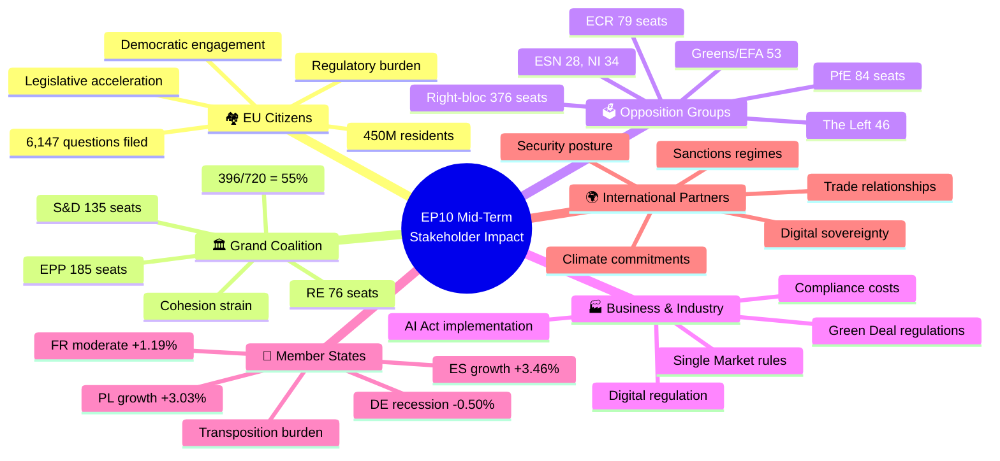
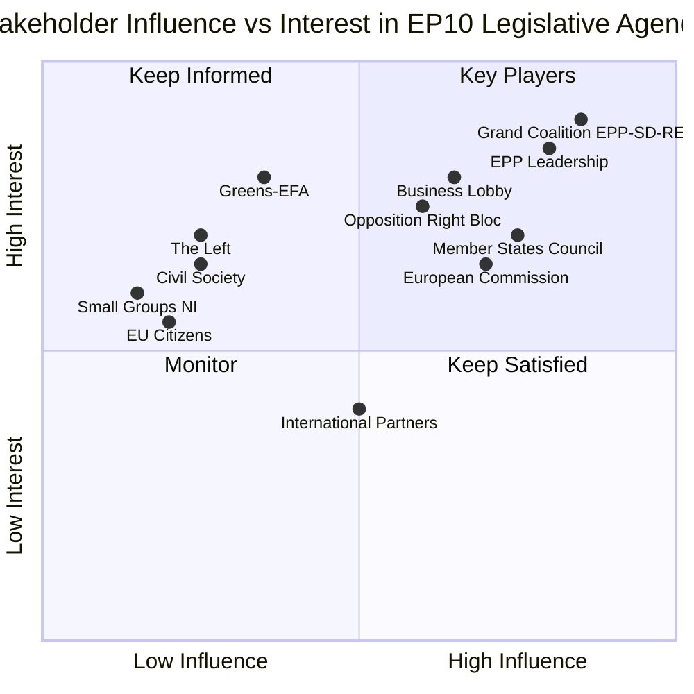
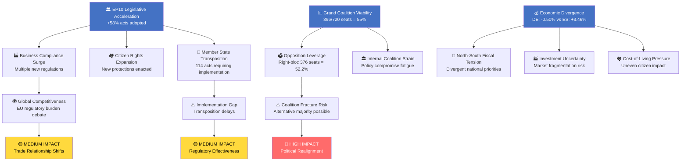
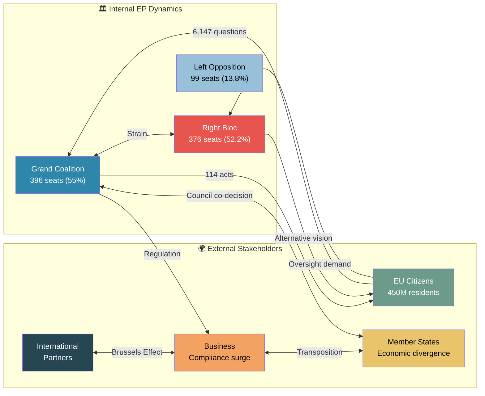

<!-- SPDX-FileCopyrightText: 2024-2026 Hack23 AB -->
<!-- SPDX-License-Identifier: Apache-2.0 -->

---
date: "2026-03-28"
analysisType: "stakeholder-impact"
assessmentId: "STA-2026-03-28-001"
subject: "EP10 Mid-Term Political Dynamics and Legislative Acceleration"
overallImpact: "HIGH"
confidence: "HIGH"
producedBy: "intelligence-operative-workflow"
epTerm: "EP10"
---

# 👥 Stakeholder Impact Assessment — EP10 Mid-Term Political Dynamics

> **Intelligence Product** | Assessment ID: `STA-2026-03-28-001` | Classification: PUBLIC
>
> **Analytical Confidence: HIGH** — Multiple independent EP MCP data sources corroborate findings across voting records, seat distributions, legislative output, and economic indicators.

---

## 📋 Assessment Context

| Field | Value |
|-------|-------|
| **Assessment ID** | `STA-2026-03-28-001` |
| **Assessment Date** | `2026-03-28 09:00 UTC` |
| **Policy/Event Subject** | EP10 Mid-Term Political Dynamics: Legislative Acceleration, Coalition Shifts & Economic Headwinds |
| **Primary EP Reference** | EP MCP political landscape, coalition dynamics, legislative pipeline data (2026-03-28) |
| **Stage of Process** | Mid-term assessment — EP10 (2024–2029) |
| **Produced By** | `intelligence-operative-workflow` |
| **Overall Impact Level** | 🔴 **HIGH** |

---

## 🧠 Executive Summary

The European Parliament at mid-term EP10 presents a complex stakeholder landscape shaped by three converging forces: (1) an unprecedented **+58% legislative acceleration** with 114 acts adopted in 2026, (2) a **grand coalition (EPP+S&D+RE)** holding 396/720 seats (55%) but under strain from a viable right-bloc alternative (376 seats, 52.2%), and (3) **asymmetric economic performance** across Member States—with Germany in recession (-0.50% GDP) while Spain surges (+3.46%). These dynamics create winners and losers across six stakeholder groups, with EU citizens and business facing the most direct impacts from accelerated regulation, and opposition groups gaining strategic leverage as coalition fault lines widen.

---

## 🗺️ Stakeholder Ecosystem



---

## 📐 Stakeholder Influence vs Interest



---

## 🔄 Impact Cascade Flowchart



---

## 👥 Stakeholder Group Assessments

### 🏘️ Group 1: EU Citizens (Direct Impact)

| Parameter | Value |
|-----------|-------|
| **Impact Level** | 🔴 **HIGH** |
| **Impact Timeline** | **MEDIUM** (6–18 months) |
| **Affected Population** | All 450M EU residents; disproportionate impact on digitally active citizens and workers in regulated sectors |
| **Impact Type** | **COMBINATION** (Legal + Financial + Social) |
| **Evidence Sources** | EP MCP legislative pipeline (114 acts adopted), parliamentary questions (6,147), voting records (567 RCVs), economic data (GDP divergence) |
| **Confidence Level** | 🟢 **HIGH** |

**Citizen Impact Narrative:**

EU citizens face the most direct consequences of EP10's legislative acceleration. With 114 acts adopted in 2026 — a 58% increase year-on-year — citizens encounter a wave of new regulatory protections and obligations. The surge in parliamentary questions (6,147, up 56% YoY) signals that MEPs are receiving unprecedented constituent engagement, particularly on cost-of-living, digital rights, and environmental standards. However, the impact is unevenly distributed: citizens in high-growth economies (Spain +3.46%, Poland +3.03%) experience these regulations as enabling frameworks, while those in recessionary Germany (-0.50%) face them as additional burdens. The 180 resolutions adopted demonstrate broad policy coverage, but risk "regulation fatigue" among citizens already navigating post-pandemic, post-energy-crisis adaptation.

**Key Citizen Indicators:**
- 📊 6,147 parliamentary questions = **strong democratic engagement signal**
- 📜 114 adopted acts = **significant new rights and obligations**
- 💰 GDP divergence creates **two-speed citizen experience** across Member States
- 🗳️ 567 roll-call votes = **high transparency** enabling citizen oversight

---

### 🏛️ Group 2: Grand Coalition (EPP + S&D + Renew Europe)

| Parameter | Value |
|-----------|-------|
| **Impact Level** | 🔴 **HIGH** |
| **Impact Timeline** | **IMMEDIATE** |
| **Primary Affected Groups** | EPP (185 seats — dominant), S&D (135 seats — anchor), RE (76 seats — kingmaker) |
| **Coalition Cohesion Effect** | **STRAINS** |
| **Evidence Sources** | EP MCP coalition dynamics (55% majority), seat distribution, right-bloc analysis (376 seats), voting alignment data |
| **Confidence Level** | 🟢 **HIGH** |

**Coalition Impact Narrative:**

The grand coalition holds a functional 55% majority (396/720) but faces its most significant structural challenge since EP10's inception. The emergence of a viable **right-bloc alternative** (EPP+PfE+ECR+ESN = 376 seats, 52.2%) provides EPP with leverage to extract concessions from S&D and RE, or to threaten defection on specific policy areas. This dynamic transforms EPP from coalition partner to coalition pivot — a role that strains trust with social democrats and liberals. RE's position at 76 seats makes it vulnerable to marginalization if EPP calculates that right-bloc cooperation delivers more policy wins. The legislative acceleration (+58%) simultaneously demonstrates coalition productivity and exhaustion: rapid output may reflect agreement on "easy" files while harder negotiations stall.

**Coalition Health Indicators:**
- ⚖️ EPP/S&D seat ratio: **1.37:1** (EPP dominance accelerating)
- 🔄 Alternative majority gap: only **20 seats** separate grand coalition (396) from right-bloc (376)
- 📈 Legislative output: **114 acts** suggests coalition still functional, but quality vs quantity question emerges
- ⚠️ RE vulnerability: **76 seats** — smallest coalition partner, highest replacement risk

---

### 🗳️ Group 3: Opposition Groups (ECR, PfE, Greens/EFA, The Left, ESN, NI)

| Parameter | Value |
|-----------|-------|
| **Impact Level** | 🔴 **HIGH** |
| **Impact Timeline** | **SHORT** (1–6 months) |
| **Primary Affected Groups** | PfE (84 — gains credibility as potential EPP partner), ECR (79 — ideological bridge), Greens/EFA (53 — marginalized), The Left (46 — structural opposition), ESN (28 — smallest group), NI (34 — fragmented) |
| **Electoral Positioning Effect** | **POSITIVE** (right-wing opposition) / **NEGATIVE** (left-wing opposition) |
| **Evidence Sources** | EP MCP group composition, coalition dynamics analysis, voting anomaly detection, fragmentation index |
| **Confidence Level** | 🟡 **MEDIUM** |

**Opposition Impact Narrative:**

The opposition landscape is fundamentally asymmetric. Right-wing groups (PfE+ECR+ESN = 191 seats) collectively represent the largest opposition bloc and possess the strategic asset of forming a viable alternative majority with EPP. This gives them legislative leverage disproportionate to their individual sizes. Conversely, left-wing opposition (Greens/EFA 53 + The Left 46 = 99 seats) faces marginalization as the political center of gravity shifts rightward. Small groups face particular existential risks: ESN at 28 seats and NI at 34 seats operate near quorum thresholds for committee participation. The opposition's most powerful tool is the 6,147 parliamentary questions filed, using oversight mechanisms to extract accountability even without legislative majorities.

**Opposition Dynamics:**
- 📈 Right-bloc total: **191 seats** — coherent opposition alternative
- 📉 Left opposition: **99 seats** — fragmented and shrinking influence
- ⚠️ ESN quorum risk: **28 seats** — 19x smaller than EPP
- 🔍 Questions weapon: **6,147 filed** — oversight as opposition strategy

---

### 🏭 Group 4: Business & Industry

| Parameter | Value |
|-----------|-------|
| **Impact Level** | 🔴 **HIGH** |
| **Impact Timeline** | **MEDIUM** (6–18 months) |
| **Most Affected Sectors** | Digital platforms (AI Act implementation), energy (Green Deal), automotive (emissions), financial services (ESG reporting), SMEs (compliance burden) |
| **Economic Impact Type** | **COMBINATION** (Compliance Cost + Regulatory Burden + Market Opportunity) |
| **Evidence Sources** | EP MCP legislative pipeline (114 acts, 20 active procedures, 10 COD), World Bank GDP data (DE -0.50%, ES +3.46%) |
| **Confidence Level** | 🟡 **MEDIUM** |

**Business Impact Narrative:**

European businesses face a regulatory tsunami from EP10's legislative acceleration. With 114 acts adopted and 20 active procedures in the pipeline (10 using Ordinary Legislative Procedure), the compliance cost curve steepens significantly. The economic divergence across the EU amplifies this impact: German businesses in recession (-0.50% GDP) must absorb new regulatory costs while competing with Spanish firms benefiting from +3.46% growth. The 100/100 legislative pipeline health score indicates no bottlenecks — meaning new regulations will arrive on schedule without delays that businesses might otherwise use for preparation. The right-bloc's growing influence (376 seats) introduces regulatory uncertainty, as a political shift could alter the direction of pending legislation on digital markets, climate targets, and labor standards.

**Sector-Specific Impact Assessment:**

| Sector | Impact | Primary Driver | Timeline |
|--------|:------:|----------------|----------|
| Digital/Tech | 🔴 HIGH | AI Act implementation, Digital Markets Act enforcement | 6–12 months |
| Energy | 🔴 HIGH | Green Deal targets, emissions trading reform | 12–18 months |
| Automotive | 🟡 MEDIUM | Emissions standards, EV transition regulations | 12–24 months |
| Financial Services | 🟡 MEDIUM | ESG reporting, taxonomy alignment | 6–12 months |
| SMEs (<250 employees) | 🔴 HIGH | Cumulative compliance burden, disproportionate cost | 6–18 months |
| Agriculture | 🟡 MEDIUM | CAP reform implementation, sustainability requirements | 12–18 months |

---

### 🤝 Group 5: Member States & National Governments

| Parameter | Value |
|-----------|-------|
| **Impact Level** | 🔴 **HIGH** |
| **Impact Timeline** | **MEDIUM** (6–18 months) |
| **Most Affected States** | Germany (recessionary transposition), Spain/Poland (growth-phase implementation), Eastern EU (capacity constraints), Nordic states (gold-plating risk) |
| **Council Alignment** | **PARTIAL** — economic divergence creates heterogeneous Council positions |
| **Evidence Sources** | EP MCP legislative output (114 acts), World Bank GDP data (6 Member States), pipeline health (100/100), procedure types (10 COD requiring Council co-decision) |
| **Confidence Level** | 🟢 **HIGH** |

**Member State Impact Narrative:**

The 114 adopted acts create an unprecedented transposition burden across 27 Member States, arriving at a moment of maximum economic divergence. Germany's recession (-0.50% GDP) constrains Berlin's administrative and political capacity to implement new EU legislation, risking transposition delays and infringement proceedings. Conversely, high-growth economies (Spain +3.46%, Poland +3.03%) possess the fiscal space and political will to implement rapidly, potentially gaining competitive advantages from early compliance. The 10 Ordinary Legislative Procedure (COD) files in the active pipeline require Council co-decision, meaning Member State governments must simultaneously negotiate new legislation and implement recent adoptions. This creates a "legislative gridlock" risk for national administrations with limited EU affairs capacity, particularly smaller Member States.

**Member State Economic Context:**

| Member State | GDP Growth | Transposition Capacity | Political Alignment |
|-------------|:----------:|:----------------------:|:-------------------:|
| 🇩🇪 Germany | -0.50% | 🟡 Strained | Centre-right (EPP-aligned) |
| 🇫🇷 France | +1.19% | 🟢 Adequate | Centre (RE-aligned) |
| 🇮🇹 Italy | +0.69% | 🟡 Mixed | Right (ECR-aligned) |
| 🇪🇸 Spain | +3.46% | 🟢 Strong | Centre-left (S&D-aligned) |
| 🇵🇱 Poland | +3.03% | 🟢 Growing | Centre (coalition) |
| 🇸🇪 Sweden | +0.82% | 🟢 Adequate | Centre-right (mixed) |

---

### 🌍 Group 6: International Partners & Trade

| Parameter | Value |
|-----------|-------|
| **Impact Level** | 🟡 **MEDIUM** |
| **Impact Timeline** | **LONG** (18+ months) |
| **Affected Relationships** | US (trade/tech regulation divergence), China (sanctions/market access), UK (post-Brexit alignment), Global South (development policy) |
| **Treaty/Agreement Compliance** | **COMPLIANT** — current legislative agenda consistent with existing international obligations |
| **Evidence Sources** | EP MCP legislative documents, resolution analysis (180 resolutions), adopted texts (114 acts), geopolitical context |
| **Confidence Level** | 🟡 **MEDIUM** |

**International Impact Narrative:**

The EU's legislative acceleration signals regulatory assertiveness to international partners. The 114 adopted acts and 180 resolutions establish the EU as the world's most active regulatory jurisdiction, reinforcing the "Brussels Effect" where EU standards become de facto global norms. However, the emerging right-bloc dynamic (376 seats) introduces uncertainty for international partners: a political shift could alter the EU's stance on climate commitments, trade liberalization, and sanctions policy. The 6,147 parliamentary questions include significant foreign affairs oversight, indicating sustained MEP interest in external relations. International partners must factor in the possibility that EP10's current legislative trajectory — shaped by the grand coalition — could be redirected if EPP pivots toward right-bloc cooperation on specific policy files.

---

## 📊 Impact Summary Matrix

| Stakeholder Group | Impact Level | Timeline | Confidence | Net Effect |
|-------------------|:------------:|:--------:|:----------:|-----------|
| 🏘️ EU Citizens | 🔴 HIGH | MEDIUM | 🟢 HIGH | Mixed — expanded protections but regulatory burden; two-speed economic experience |
| 🏛️ Grand Coalition | 🔴 HIGH | IMMEDIATE | 🟢 HIGH | Negative — coalition strain from right-bloc alternative; EPP pivot risk |
| 🗳️ Opposition | 🔴 HIGH | SHORT | 🟡 MEDIUM | Positive (right-wing) / Negative (left-wing) — asymmetric leverage gain |
| 🏭 Business | 🔴 HIGH | MEDIUM | 🟡 MEDIUM | Negative — compliance surge; economic divergence amplifies sector impacts |
| 🤝 Member States | 🔴 HIGH | MEDIUM | 🟢 HIGH | Mixed — transposition burden meets divergent economic capacity |
| 🌍 International | 🟡 MEDIUM | LONG | 🟡 MEDIUM | Neutral-to-positive — regulatory leadership reinforced; political uncertainty emerging |

---

## 🔄 Cross-Stakeholder Dynamics Analysis

### Dynamic 1: The Compliance Cascade (Citizens ↔ Business ↔ Member States)

The legislative acceleration creates a three-way feedback loop: businesses face new compliance costs, which they partially pass to consumers (citizens), while Member States must build administrative capacity to enforce new rules. The economic divergence (DE -0.50% vs ES +3.46%) means this cascade operates at different speeds across the EU, creating **single market fragmentation risk** as implementation timelines diverge.

### Dynamic 2: The Coalition-Opposition Power Shift (Grand Coalition ↔ Opposition)

The grand coalition's 55% majority appears stable but is structurally fragile. The right-bloc's 52.2% potential majority (376 seats) gives EPP a credible "exit threat" from the coalition, which changes negotiation dynamics with S&D and RE on every major file. This creates a **paradox of productivity**: the coalition accelerates legislation precisely because its members fear that delay could lead to political realignment.

### Dynamic 3: The Democratic Engagement Surge (Citizens ↔ Opposition ↔ Grand Coalition)

The 56% increase in parliamentary questions (6,147) suggests both higher citizen engagement and MEP responsiveness. This benefits opposition groups who use questions as oversight tools, but also pressures the grand coalition to demonstrate accountability. The dynamic creates a **transparency arms race** where all political groups compete to appear most responsive to citizen concerns.

### Dynamic 4: The German Factor (Member States ↔ Business ↔ International)

Germany's recession (-0.50%) has outsized ripple effects as the EU's largest economy. German business lobbies push for regulatory relief, German representatives in Council resist ambitious new legislation, and international partners recalibrate expectations of EU economic leadership. This creates a **brake effect** on legislative ambition that counters the overall acceleration trend.



---

## 🔮 Forward-Looking Indicators

### Indicators to Monitor (Next 3–6 Months)

| Indicator | Current Value | Threshold | Stakeholder Impact |
|-----------|:------------:|:---------:|-------------------|
| Grand coalition voting cohesion | ~85% (est.) | <75% = fracture risk | All groups |
| Right-bloc joint voting frequency | Rising | >30% of RCVs = realignment signal | Coalition + Opposition |
| Parliamentary questions per month | ~512/month | >600/month = engagement surge | Citizens + Coalition |
| Transposition deficit (infringements) | Baseline | +20% = implementation failure | Member States + Business |
| EPP-PfE co-voting rate | Emerging | >25% = coalition shift signal | All stakeholders |
| German economic indicators | -0.50% GDP | <-1.0% = EU economic risk | Business + Member States |

---

## 🔑 Key Insights

1. **All six stakeholder groups face HIGH or MEDIUM impact** — making this the most consequential mid-term assessment period since EP10's inauguration. The legislative acceleration affects everyone, but asymmetrically.

2. **The right-bloc alternative (376 seats) is the single most destabilizing dynamic**, creating leverage for EPP, anxiety for S&D/RE, opportunity for PfE/ECR, and uncertainty for business and international partners planning around current regulatory trajectories.

3. **Economic divergence is the hidden amplifier** — the same legislation creates winners and losers depending on national GDP trajectories. Germany's recession transforms transposition from routine to politically contentious.

4. **Democratic engagement is historically high** — 6,147 parliamentary questions and 567 roll-call votes provide unprecedented transparency, but also create pressure on all political actors to demonstrate responsiveness.

5. **The "Brussels Effect" is accelerating globally** — 114 acts in 2026 reinforces the EU's position as the world's regulatory superpower, with implications for trade relationships and international competitiveness debates.

**Publish Recommendation:** **YES — HIGH interest** | This assessment reveals structural shifts affecting all stakeholder groups with actionable implications for citizens, businesses, and policymakers across 27 Member States.

---

## 📚 Methodology

- **Analytical Framework**: Stakeholder Impact Assessment per EU Parliament Monitor template
- **Data Sources**: European Parliament MCP (seat distributions, voting records, legislative pipeline, parliamentary questions), World Bank economic indicators
- **Confidence Calibration**: High confidence where multiple independent MCP datasets converge; Medium where inference from structural indicators required
- **Political Neutrality**: Assessment presents stakeholder impacts without partisan evaluation of policy desirability
- **GDPR Compliance**: All data from public EP sources; no personal data beyond official MEP roles

### MCP Data Files Used

```
analysis/2026-03-28/data/osint/political-landscape.json
analysis/2026-03-28/data/osint/coalition-dynamics.json
analysis/2026-03-28/data/osint/legislative-pipeline.json
analysis/2026-03-28/data/questions/*.json
analysis/2026-03-28/data/votes/*.json
analysis/2026-03-28/data/plenary-session-documents/*.json
analysis/2026-03-28/data/meps/*.json
analysis/2026-03-28/data/mcp-responses/generated-stats.json
analysis/2026-03-28/data/world-bank/*.json (economic indicators for DE, FR, IT, ES, PL, SE)
```

---

*Assessment produced by intelligence-operative-workflow | EP10 Mid-Term Analysis Series | 2026-03-28*
