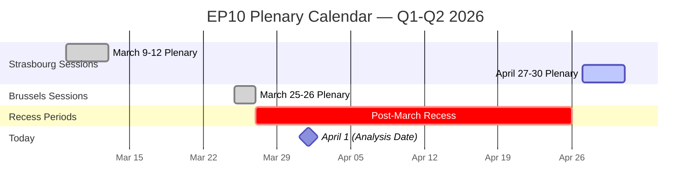
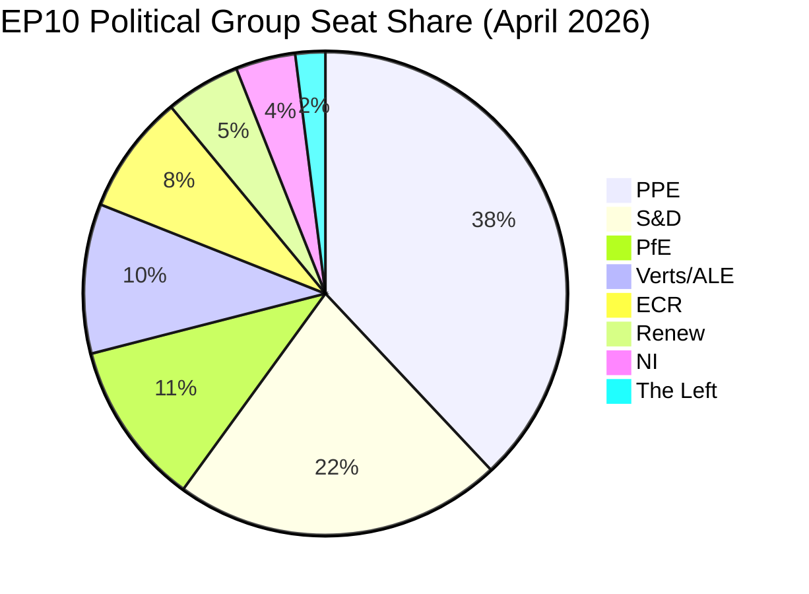
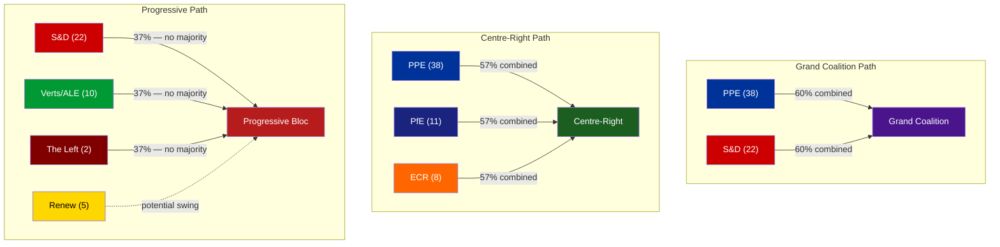

# 🔍 Breaking News Intelligence Brief — 2026-04-01

  
  
  
  
  

**📋 Analysis Owner:** EU Parliament Monitor | **📅 Generated:** 2026-04-01 (UTC)
**🔄 Methodology:** AI-Driven Per-File Analysis v2.0 | **📊 Data Source:** European Parliament Open Data Portal

---

## 📊 Executive Summary

| Dimension | Assessment | Trend | Confidence |
|-----------|-----------|-------|------------|
| Parliamentary Activity | ⬜ Recess — No plenary session today | → Neutral | 🟢 High |
| Breaking News Significance | ⬜ None — No today-dated items found | ↓ Low | 🟢 High |
| Feed Data Collected | 6 adopted texts updated, 737 MEP records | → Stable | 🟢 High |
| Political Stability | 84/100 stability score | → Neutral | 🟡 Medium |
| Next Plenary | April 27-30, 2026 — Strasbourg | ↗ Upcoming | 🟢 High |

### Key Finding

**No breaking news detected for April 1, 2026.** The European Parliament is in a **parliamentary recess period** between the last plenary sitting (March 26, Brussels) and the next scheduled plenary week (April 27-30, Strasbourg). This 32-day inter-sessional gap is typical of EP scheduling patterns between spring sessions.

The adopted texts feed returned 6 items with today's update timestamp, but all were adopted at earlier dates (ranging from 2025 to March 2026). These represent **metadata updates** to existing texts, not new legislative adoptions. The MEP feed returned the full roster of 737 MEPs, indicating a routine data refresh rather than notable membership changes.

---

## 🗓️ Parliamentary Calendar Context

### Session Gap Analysis

| Period | Location | Dates | Agenda Items | Key Actions |
|--------|----------|-------|--------------|-------------|
| Last Completed | Brussels | Mar 25-26 | 60 items | Immunity waiver (Braun), US customs tariff adjustment |
| **Current Gap** | **Recess** | **Mar 27 – Apr 26** | **N/A** | **Inter-sessional committee work** |
| Next Scheduled | Strasbourg | Apr 27-30 | 0 (pending) | Agenda not yet published |

**🟢 High confidence**: The 32-day recess is consistent with historical EP scheduling. EP10 typically schedules 4-5 plenary weeks per quarter, with 2-4 week inter-sessional breaks for committee work, political group meetings, and constituency work.

---

## 📋 Data Collection Summary

### Feed Endpoint Results

| Endpoint | Timeframe | Status | Items | Notes |
|----------|-----------|--------|-------|-------|
| `get_adopted_texts_feed` | today | ✅ 200 | 6 | Metadata updates, not new adoptions |
| `get_events_feed` | today → one-week | ❌ 404 | 0 | API endpoint returned 404 on both timeframes |
| `get_procedures_feed` | today → one-week | ❌ 404 | 0 | API endpoint returned 404 on both timeframes |
| `get_meps_feed` | today | ✅ 200 | 737 | Full MEP roster refresh |
| `get_documents_feed` | one-week | ❌ 404 | 0 | API endpoint returned 404 |
| `get_plenary_documents_feed` | one-week | ❌ 404 | 0 | API endpoint returned 404 |
| `get_committee_documents_feed` | one-week | ❌ 404 | 0 | API endpoint returned 404 |
| `get_parliamentary_questions_feed` | one-week | ❌ 404 | 0 | API endpoint returned 404 |

**Feed Endpoint Observation**: Multiple feed endpoints returned 404 errors on both `today` and `one-week` timeframes. This pattern suggests either:
1. Temporary EP API maintenance (common during recess periods) — 🟡 Medium confidence
2. No new content indexed for these categories in the past week — 🟢 High confidence given recess
3. API versioning changes — 🔴 Low confidence (would affect all endpoints uniformly)

### Analytical Context Tools Results

| Tool | Status | Key Finding |
|------|--------|-------------|
| `detect_voting_anomalies` | ✅ | 0 anomalies detected, risk level LOW |
| `analyze_coalition_dynamics` | ✅ | Renew-ECR strongest pair (0.95 cohesion), based on size ratios |
| `generate_political_landscape` | ✅ | PPE dominant (38%), HIGH fragmentation, 8 groups |
| `early_warning_system` | ✅ | 3 warnings, stability score 84/100, MEDIUM risk |

### Adopted Texts Updated Today (Metadata Only)

| Identifier | Label | Feed Date | Note |
|-----------|-------|-----------|------|
| TA-10-2025-0281 | T10-0281/2025 | 2026-04-01 | 2025 text, metadata update |
| TA-10-2025-0283 | T10-0283/2025 | 2026-04-01 | 2025 text, metadata update |
| TA-10-2025-0288 | T10-0288/2025 | 2026-04-01 | 2025 text, metadata update |
| TA-10-2025-0290 | T10-0290/2025 | 2026-04-01 | 2025 text, metadata update |
| TA-10-2025-0292 | T10-0292/2025 | 2026-04-01 | 2025 text, metadata update |
| TA-10-2026-0044 | T10-0044/2026 | 2026-04-01 | 2026 text, metadata update |

**Assessment**: These are routine administrative metadata updates to existing adopted texts — not new legislative actions. None qualify as breaking news.

---

## 🏛️ Political Landscape Analysis

### Current EP10 Composition

### Power Balance Assessment

| Indicator | Value | Interpretation | Trend |
|-----------|-------|---------------|-------|
| Fragmentation Index | HIGH (4.4 effective parties) | Coalition-building complex | → Stable |
| PPE Dominance Ratio | 19:1 vs smallest group | Significant structural advantage | → Stable |
| Grand Coalition Viability | PPE+S&D = 60% | Above 51% threshold | ↗ Viable |
| Progressive Bloc | 24% (S&D + Verts/ALE + The Left) | Minority position | → Stable |
| Conservative Bloc | 19% (ECR + PfE) | Below progressive bloc | → Stable |
| Majority Requirement | 51 seats | Multi-coalition required | → Stable |

### Coalition Dynamics Deep Dive

**Coalition Analysis**:
- **Grand Coalition (PPE+S&D)**: The most reliable majority path at 60%. Both groups have incentives to cooperate on core legislative files, though policy divergence on trade, digital regulation, and social policy creates friction. 🟢 High confidence.
- **Centre-Right (PPE+PfE+ECR)**: Achieves 57%, theoretically viable but ideologically fragmented. PfE and ECR have different orientations on EU integration depth. 🟡 Medium confidence.
- **Progressive Bloc**: At 37% (even with Renew at 42%), insufficient for majority. Functions primarily as opposition or amendment-bloc rather than governing coalition. 🟢 High confidence.

### Structural Risk Assessment

| Risk Factor | Severity | Description | Mitigation |
|-------------|----------|-------------|-----------|
| PPE Dominance | 🔴 HIGH | 38% seat share creates structural imbalance | Monitor minority coalition formation |
| Small Group Fragility | 🟢 LOW | Renew (5), NI (4), The Left (2) vulnerable to quorum | Track participation rates |
| Recess Momentum Loss | 🟡 MEDIUM | 32-day gap may reduce legislative urgency | Committee pre-work during recess |
| Feed API Reliability | 🟡 MEDIUM | 6/8 advisory feeds returned 404 | Re-test endpoints next cycle |

---

## 🔬 Recent Legislative Activity Context

### Most Recent Adopted Texts (March 2026 Sessions)

The last plenary sittings produced several significant texts that will shape the April agenda:

| Text | Date Adopted | Significance | Policy Area |
|------|-------------|-------------|-------------|
| TA-10-2026-0096 | 2026-03-26 | **High** — US customs tariff adjustment | Trade / Tariffs |
| TA-10-2026-0088 | 2026-03-26 | **Medium** — Immunity waiver for MEP Braun | Institutional / Rule of Law |
| TA-10-2026-0084 | 2026-03-12 | **High** — Emission credits for HDVs 2025-2029 | Environment / Transport |
| TA-10-2026-0083 | 2026-03-12 | **Medium** — Georgia political prisoners | Human Rights / Foreign Affairs |
| TA-10-2026-0073 | 2026-03-11 | **Medium** — EGF for Tupperware Belgium | Employment / Globalisation |
| TA-10-2026-0063 | 2026-03-10 | **Medium** — Better Law-Making report | Regulatory / Institutional |
| TA-10-2026-0060 | 2026-03-10 | **High** — ECB Vice-President appointment | Economic / Institutional |

### Stakeholder Impact — US Customs Tariff Adjustment (TA-10-2026-0096)

| Stakeholder | Impact | Severity | Evidence |
|------------|--------|----------|---------|
| **EU Industry & Business** | Mixed | High | Tariff adjustments create new competitive dynamics for EU exporters; specific sectors face cost changes |
| **US Trade Partners** | Negative | Medium | Retaliatory potential; signals EU willingness to adjust trade barriers |
| **EU Citizens (Consumers)** | Mixed | Low | Price effects depend on specific goods categories; quota limits constrain impact |
| **National Governments** | Mixed | Medium | Implementation requirements vary; customs revenue implications differ by trade exposure |
| **EP Political Groups** | Mixed | Medium | Trade policy divides cut across traditional left-right lines; PPE and S&D both have agricultural/industrial constituencies |

### Stakeholder Impact — ECB Vice-President Appointment (TA-10-2026-0060)

| Stakeholder | Impact | Severity | Evidence |
|------------|--------|----------|---------|
| **EU Institutions (ECB)** | Positive | High | New leadership ensures continuity of monetary policy governance |
| **Financial Markets** | Neutral/Positive | Medium | Appointment signals institutional stability |
| **EU Citizens** | Neutral | Low | Indirect impact through monetary policy decisions |
| **National Governments** | Mixed | Medium | Appointment reflects geopolitical balance considerations |

---

## 🔄 SWOT Analysis: Current Recess Period

### Strengths
- **Grand coalition viable** (PPE+S&D = 60%) — stable legislative majority path available ↗
- **Moderate fragmentation** enables pluralist debate and cross-party compromise →
- **Active Q1 output** — 96+ adopted texts in EP10 demonstrates productive parliament ↗
- **Multi-country representation** — 23 countries across 8 groups ensures broad legitimacy →

### Weaknesses
- **PPE structural dominance** (38%) creates asymmetric negotiating power ↓
- **Small group fragility** — Renew (5), The Left (2) struggle for visibility and influence ↓
- **Feed endpoint reliability** — 6/8 advisory feeds returned 404 during analysis ↓
- **Attendance data gap** — EP API does not expose attendance metrics, limiting engagement analysis →

### Opportunities
- **Recess period** allows committee-level groundwork for April plenary ↗
- **US trade tensions** (TA-10-2026-0096) could catalyze cross-party trade coalitions ↗
- **EU-Mercosur** Court of Justice opinion (from January referral TA-10-2026-0008) may arrive before April session ↗
- **Digital sovereignty** agenda (TA-10-2026-0022) has broad cross-party support potential ↗

### Threats
- **32-day recess gap** risks momentum loss on urgent files (Georgia, emissions) ↘
- **External trade pressures** may force emergency sessions or fast-track procedures ↘
- **EP API data availability** — persistent 404s may indicate structural API changes ↘
- **Dominant group overreach** could trigger minority bloc defensive formation ↓

---

## 🔮 Forward-Looking Intelligence: April 27-30 Plenary Preview

**🟡 Medium confidence** — Agenda not yet published. Based on legislative pipeline analysis:

### Scenario A: Trade-Heavy Agenda (Likely — 55% probability)
- US customs tariff implementation follow-up from TA-10-2026-0096
- EU-Mercosur Agreement opinions (follow-up to January Court of Justice referral)
- Digital sovereignty measures building on TA-10-2026-0022
- **Indicators to watch**: Commission trade communications, US policy announcements, INTA committee meetings

### Scenario B: Rule-of-Law Focus (Possible — 25% probability)
- Georgian political prisoner follow-up (TA-10-2026-0083 resolution implementation)
- Additional immunity proceedings (post-Braun precedent)
- NIS2 implementation updates
- **Indicators to watch**: Georgian government actions, LIBE committee reports, national transposition deadlines

### Scenario C: Economic/Industrial Focus (Possible — 20% probability)
- ECB annual report follow-up (TA-10-2026-0034)
- Better Regulation implementation (TA-10-2026-0063)
- Subcontracting chains directive progress (TA-10-2026-0050)
- **Indicators to watch**: Eurozone economic data, ECB policy decisions, ECON committee outputs

---

## ⚠️ Early Warning Indicators

### Active Warnings (as of 2026-04-01)

| Warning Type | Severity | Description | Recommended Action |
|-------------|----------|-------------|-------------------|
| HIGH_FRAGMENTATION | 🟡 MEDIUM | 8 political groups complicate coalition building | Monitor cross-group voting at next plenary |
| DOMINANT_GROUP_RISK | 🔴 HIGH | PPE 19x smallest group — potential dominance | Track minority coalition formation during recess |
| SMALL_GROUP_QUORUM_RISK | 🟢 LOW | Renew (5), NI (4), The Left (2) membership fragile | Monitor participation rates at April plenary |

### Stability Score Decomposition

**Assessment**: The 84/100 stability score indicates a **structurally stable parliament** despite high fragmentation. The primary risk vector is PPE's dominant position, which could create legitimacy challenges if smaller groups feel systematically excluded from legislative outcomes. 🟡 Medium confidence — voting cohesion data unavailable from EP API to validate behavioural patterns.

---

## 📌 Newsworthiness Determination

### Gate Assessment

| Criterion | Result | Evidence |
|-----------|--------|---------|
| Adopted texts published TODAY? | ❌ No | 6 items updated (metadata) but none adopted today |
| Significant parliamentary events TODAY? | ❌ No | No plenary session; recess period (Mar 27 – Apr 26) |
| Legislative procedures updated TODAY? | ❌ No | Procedures feed returned 404 |
| Notable MEP changes TODAY? | ❌ No | Full roster refresh (737 MEPs), no specific changes |

### Decision

**⬜ NO BREAKING NEWS** — No events published or adopted on April 1, 2026. The European Parliament is in inter-sessional recess (March 27 – April 26). This analysis-only PR preserves the intelligence gathered during this quiet period for longitudinal tracking.

---

## 📈 Recommendations for Next Analysis Cycle

1. **Monitor April 27-30 agenda publication** — Expected 1-2 weeks before session (around April 13-20)
2. **Track EU-Mercosur Court of Justice opinion** — Could break as major news before or during April plenary
3. **Watch US trade developments** — Customs tariff adjustments (TA-10-2026-0096) may trigger retaliatory measures
4. **Georgia follow-up** — Political prisoner resolution (TA-10-2026-0083) implementation monitoring
5. **Re-test feed endpoints** — Validate whether 404 errors persist or were recess-related maintenance
6. **ECB leadership** — New Vice-President (TA-10-2026-0060) actions and policy signals

---

*Generated by EU Parliament Monitor — AI-Driven Analysis Pipeline v2.0*
*Data Source: European Parliament Open Data Portal (data.europarl.europa.eu)*
*Methodology: Per `analysis/methodologies/ai-driven-analysis-guide.md` Rule 5 — No workflow run wasted*
