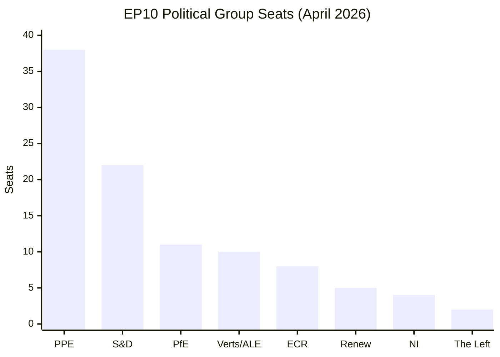
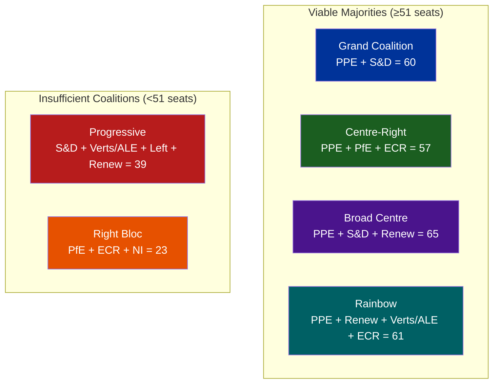
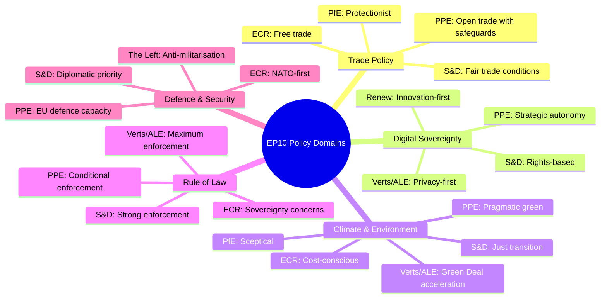

# 🏛️ Political Landscape Analysis — 2026-04-01

  
  
  
  

**📋 Analysis Owner:** EU Parliament Monitor | **📅 Generated:** 2026-04-01 (UTC)
**🔄 Template:** `docs/analysis-methodology/political-landscape-analysis.md`

---

## 📊 EP10 Group Composition Dashboard

| Group | Seats | Share | Countries | Bloc | Power Rating | Trend |
|-------|-------|-------|-----------|------|-------------|-------|
| PPE | 38 | 38% | 14 | Centre-Right | ★★★★★ | → Stable |
| S&D | 22 | 22% | 12 | Centre-Left | ★★★★☆ | → Stable |
| PfE | 11 | 11% | 5 | Right | ★★★☆☆ | → Stable |
| Verts/ALE | 10 | 10% | 7 | Green-Left | ★★★☆☆ | → Stable |
| ECR | 8 | 8% | 5 | Conservative | ★★☆☆☆ | → Stable |
| Renew | 5 | 5% | 4 | Liberal | ★★☆☆☆ | ↓ Declining |
| NI | 4 | 4% | 3 | Non-Attached | ★☆☆☆☆ | → Stable |
| The Left | 2 | 2% | 2 | Left | ★☆☆☆☆ | ↓ Declining |

### Group Size Distribution

---

## 🔍 Fragmentation Analysis

### Effective Number of Parties (ENP)

The Laakso-Taagepera Index measures parliamentary fragmentation:

**ENP = 1 / Σ(seat_share²) = 4.4** — indicating **HIGH fragmentation**

| Benchmark | ENP Range | EP10 Status |
|-----------|-----------|-------------|
| Low fragmentation | 2.0 - 3.0 | — |
| Moderate fragmentation | 3.0 - 4.0 | — |
| **High fragmentation** | **4.0 - 5.0** | **← EP10 (4.4)** |
| Very high fragmentation | 5.0+ | — |

**Implication**: Coalition-building requires negotiation across at least 2-3 groups for any majority. No single group can block legislation alone, but PPE comes closest with veto-capable coalitions.

### Herfindahl-Hirschman Index (HHI)

HHI = Σ(seat_share²) = 0.38² + 0.22² + 0.11² + 0.10² + 0.08² + 0.05² + 0.04² + 0.02² = **0.227**

| HHI Range | Interpretation | EP10 Status |
|-----------|---------------|-------------|
| < 0.15 | Highly competitive | — |
| **0.15 - 0.25** | **Moderately concentrated** | **← EP10 (0.227)** |
| 0.25 - 0.50 | Concentrated | — |
| > 0.50 | Dominated | — |

---

## ⚖️ Coalition Viability Matrix

| Coalition | Composition | Seats | Viable? | Ideological Coherence | Stability |
|-----------|------------|-------|---------|----------------------|-----------|
| Grand Coalition | PPE + S&D | 60 | ✅ Yes | 🟡 Medium — policy divergence on social/trade issues | 🟢 High |
| Centre-Right | PPE + PfE + ECR | 57 | ✅ Yes | 🟡 Medium — EU integration depth divides | 🟡 Medium |
| Broad Centre | PPE + S&D + Renew | 65 | ✅ Yes | 🟢 High — centrist alignment | 🟢 High |
| Rainbow | PPE + Renew + Verts/ALE + ECR | 61 | ✅ Yes | 🔴 Low — environmental vs conservative friction | 🔴 Low |
| Progressive | S&D + Verts/ALE + Left + Renew | 39 | ❌ No | 🟢 High — shared social agenda | N/A |
| Right Bloc | PfE + ECR + NI | 23 | ❌ No | 🟡 Medium — nationalist but divergent | N/A |

**Strategic Assessment**: The **Grand Coalition (PPE+S&D)** remains the most reliable legislative vehicle, providing 60% of seats. The **Broad Centre** path adding Renew (65 seats) provides insurance against defections. The Centre-Right path (PPE+PfE+ECR) is mathematically viable but politically fragile due to divergent EU integration positions. 🟡 Medium confidence.

---

## 🌡️ Political Temperature Assessment

### Group Positioning (Institutional Proxy)

| Group | EU Integration | Economic Policy | Social Policy | Environment | Overall Temperature |
|-------|---------------|----------------|--------------|-------------|-------------------|
| PPE | Pro-integration | Market economy | Moderate | Moderate | Centre-Right ↗ |
| S&D | Pro-integration | Social market | Progressive | Pro-green | Centre-Left → |
| PfE | Eurosceptic | National preference | Conservative | Sceptical | Right → |
| Verts/ALE | Pro-integration | Green economy | Progressive | Strong green | Left-Green → |
| ECR | Reformist | Free market | Conservative | Moderate | Right → |
| Renew | Pro-integration | Liberal market | Liberal | Moderate | Centre → |
| NI | Mixed | Mixed | Mixed | Mixed | Diverse → |
| The Left | Critical integration | Anti-austerity | Progressive | Pro-green | Left ↓ |

### Policy Domain Convergence Map

---

## 📊 Legislative Output Analysis (EP10 to Date)

### Adopted Texts by Policy Area (2025-2026)

| Policy Area | Texts Adopted | Key Examples | Trend |
|-------------|--------------|-------------|-------|
| Trade & Customs | 5+ | US tariffs (TA-10-2026-0096), EU-Mercosur referral (TA-10-2026-0008) | ↗ Increasing |
| Human Rights | 8+ | Iran (TA-10-2025-0004), Georgia (TA-10-2026-0083), Cameroon (TA-10-2025-0061) | → Stable |
| Economic/Finance | 6+ | ECB VP appointment (TA-10-2026-0060), Financial stability (TA-10-2026-0004) | → Stable |
| Environment | 3+ | HDV emission credits (TA-10-2026-0084), Chemicals monitoring (TA-10-2025-0045) | → Stable |
| Institutional | 4+ | Electoral reform (TA-10-2026-0006), Better Regulation (TA-10-2026-0063) | → Stable |
| Social/Employment | 3+ | Subcontracting (TA-10-2026-0050), EGF Tupperware (TA-10-2026-0073) | → Stable |
| Foreign Affairs | 5+ | Ukraine loan (TA-10-2026-0010), Moldova (TA-10-2025-0022), Syria (TA-10-2026-0053) | ↗ Increasing |
| Digital | 2+ | Tech sovereignty (TA-10-2026-0022) | ↗ Increasing |

### Legislative Velocity

| Quarter | Adopted Texts | Plenary Days | Output/Day |
|---------|--------------|-------------|------------|
| Q1 2026 (Jan-Mar) | 96+ | ~18 | ~5.3/day |
| Q4 2025 (Oct-Dec) | Est. 80-100 | ~16 | ~5-6/day |
| **Assessment** | → Stable output rate | | 🟢 High confidence |

---

## 🔮 Recess Period Intelligence Assessment

### What Happens During Recess

During the March 27 – April 26 recess, parliamentary work continues through:

1. **Committee Meetings**: Standing committees (ENVI, ITRE, LIBE, ECON, etc.) continue technical work on draft reports and opinions
2. **Political Group Meetings**: Internal strategy sessions to prepare April plenary positions
3. **Rapporteur Negotiations**: Shadow rapporteurs negotiate compromise amendments
4. **Trilogue Processes**: Ongoing inter-institutional negotiations with Council and Commission
5. **Constituency Work**: MEPs engage with national stakeholders and voters

### Key Files to Monitor During Recess

| File/Topic | Committee | Expected Progress | Significance |
|-----------|-----------|-------------------|-------------|
| US Trade Response | INTA | Implementation planning for TA-10-2026-0096 | High |
| EU-Mercosur | INTA / Court of Justice | Court of Justice opinion expected | High |
| Emission Credits HDV | ENVI / TRAN | Technical implementation for 2025-2029 | Medium |
| Digital Sovereignty | ITRE | Commission follow-up expected | Medium |
| Georgia Monitoring | AFET | Resolution implementation tracking | Medium |

---

## 📌 Summary & Key Takeaways

1. **EP10 operates under HIGH fragmentation** (ENP 4.4) requiring multi-party coalitions for every legislative act
2. **PPE's 38% dominance** is the primary structural feature — both an asset (stability) and risk (democratic legitimacy)
3. **Grand Coalition (PPE+S&D = 60%)** is the default legislative majority, but trade and social policy create regular friction
4. **Progressive forces (37%)** cannot form a majority even with Renew, functioning as opposition/amendment bloc
5. **Recess period (Mar 27-Apr 26)** is the current phase — committee and trilogue work continues behind scenes
6. **April 27-30 Strasbourg plenary** is the next major event — agenda publication expected mid-April

---

*Analysis produced per `docs/analysis-methodology/political-landscape-analysis.md` template*
*Data Source: European Parliament Open Data Portal (data.europarl.europa.eu)*
*Part of: `analysis/2026-04-01/breaking/` analysis package*
