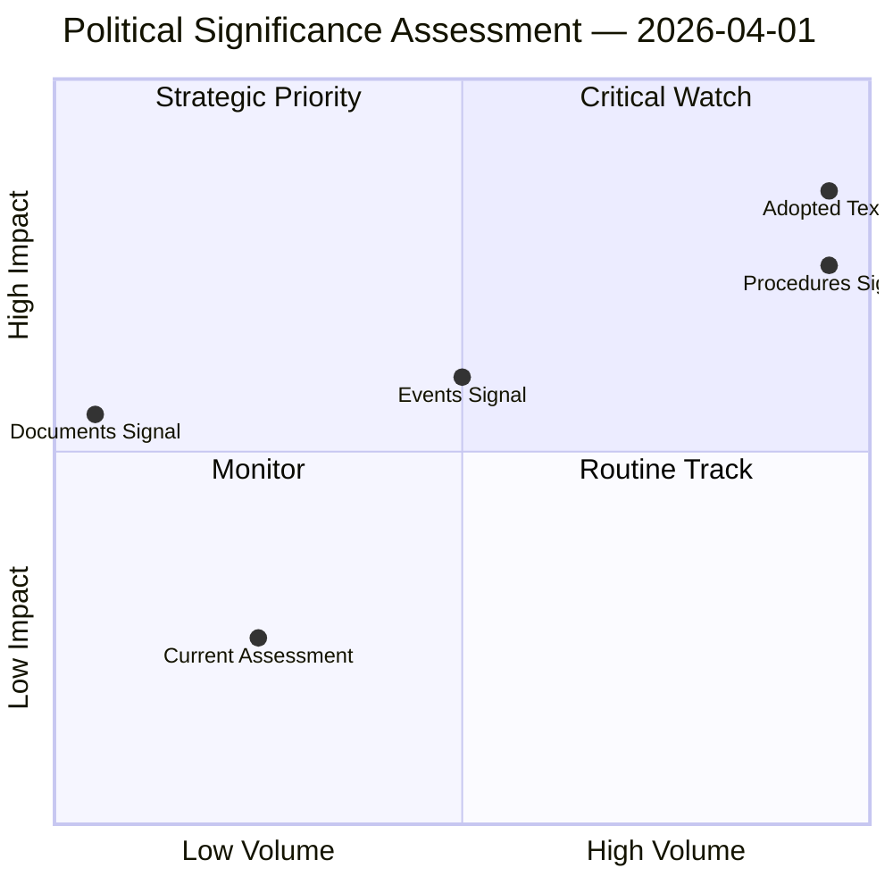

# Political Significance Classification

## Overall Significance: **ROUTINE**

## 5-Signal Model Scores

| Signal | Raw Data | Score |
|--------|----------|-------|
| Volume | 10 events, 1 documents | 1.1/5 |
| Pipeline | 20 procedures | 4.0/5 |
| Output | 16 adopted texts | 3.2/5 |
| Anomalies | Pattern deviation detection | — |
| Coalition | Group alignment analysis | — |

## Data Summary

| Metric | Value |
|--------|-------|
| Computed significance | ROUTINE |
| Total data points | 47 |
| Events | 10 |
| Documents | 1 |
| Procedures | 20 |
| Adopted texts | 16 |
| Date | 2026-04-01 |

## Date: 2026-04-01
