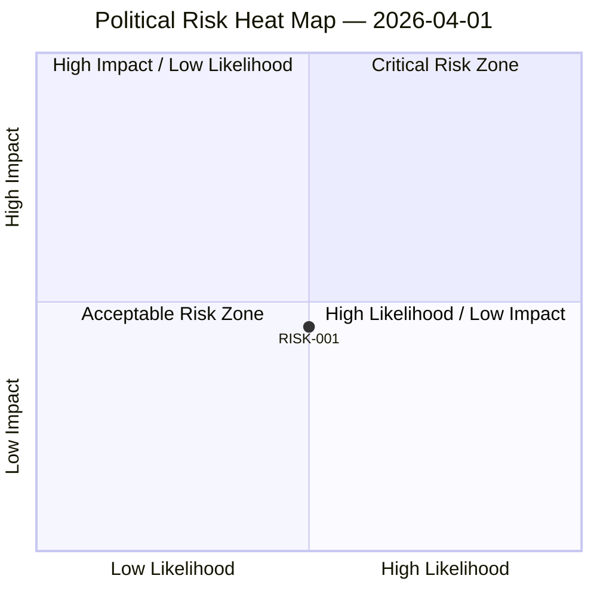

# Political Risk Scoring Matrix

## Overview

Quantitative risk scoring across 1 identified political dimensions.
This matrix uses a standardized likelihood × impact framework to quantify and
prioritize political risks affecting the European Parliament legislative process.

## Risk Heat Map

## Risk Matrix

| Risk ID | Description | Likelihood | Impact | Score | Level |
|---------|-------------|------------|--------|-------|-------|
| RISK-001 | Legislative blockage risk from procedure backlog | possible | moderate | 1.5 | medium |

> **Risk Score** = Likelihood × Impact. **Levels**: 🟢 LOW (≤1.0), 🟡 MEDIUM (≤2.0), 🟠 HIGH (≤3.5), 🔴 CRITICAL (>3.5)

## Risk Assessment Details

### RISK-001: Legislative blockage risk from procedure backlog

| Metric | Value |
|--------|-------|
| Risk Score | 1.50 |
| Risk Level | MEDIUM |
| Likelihood | possible |
| Impact | moderate |

## Risk Mitigation Framework

| Risk Level | Count | Tolerance | Action Required |
|------------|-------|-----------|-----------------|
| 🔴 CRITICAL | 0 | Zero tolerance | Immediate escalation |
| 🟠 HIGH | 0 | Low tolerance | Active mitigation |
| 🟡 MEDIUM | 1 | Moderate | Enhanced monitoring |
| 🟢 LOW | 0 | Acceptable | Routine tracking |

## Date: 2026-04-01
