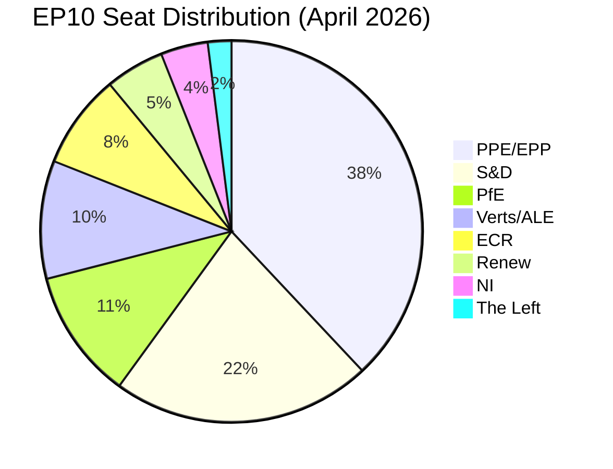
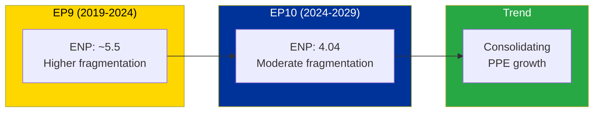
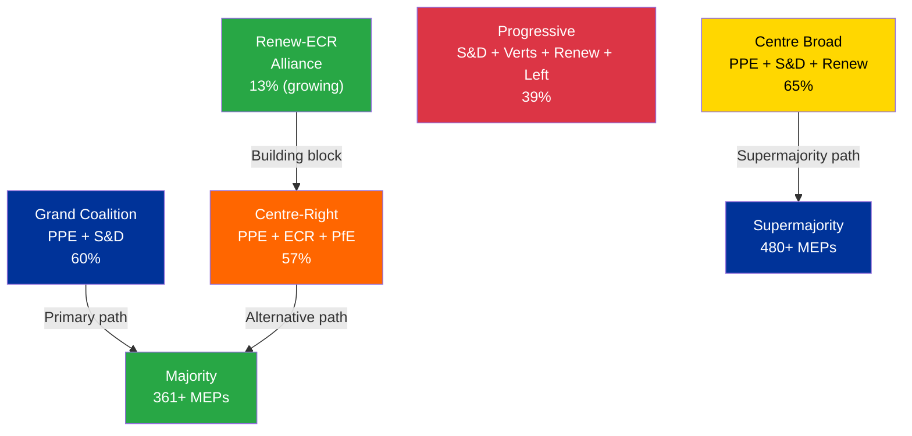

| Field | Value |
|-------|-------|
| **Report Date** | 2 April 2026 |
| **Parliamentary Term** | EP10 (2024-2029) |
| **Total MEPs** | 720 (720 mandates; 737 in active feed) |
| **Political Groups** | 8 |
| **Countries Represented** | 23+ |

---

## 1. Executive Summary

| Finding | Status | Confidence |
|---------|--------|------------|
| Grand coalition (PPE+S&D) holds 60% | 🟢 Viable | 🟢 HIGH |
| HIGH fragmentation across 8 groups | 🟡 Risk factor | 🟢 HIGH |
| PPE dominance ratio 19:1 vs smallest | 🔴 Warning | 🟢 HIGH |
| Renew-ECR alliance strengthening | 🟡 Developing | 🟡 MEDIUM |
| Overall stability score | 84/100 | 🟡 MEDIUM |

The European Parliament's 10th term (EP10) enters Q2 2026 with a stable but fragmented political landscape. The centre-right PPE/EPP holds the dominant position at 38% of seats, maintaining a functional grand coalition with S&D (22%) that commands 60% — just above the critical threshold for reliable majority governance.

Key dynamics to monitor:
- **Structural asymmetry**: PPE's 38% creates a 19:1 ratio with the smallest group (The Left at 2%), raising concerns about proportional representation in committee work and agenda-setting
- **Alternative coalition formation**: The Renew-ECR pair shows 0.95 cohesion (STRENGTHENING), suggesting a potential centre-right alternative to the grand coalition for specific policy areas
- **Opposition weakness**: The three smallest groups (Renew 5%, NI 4%, The Left 2%) collectively hold only 11% — insufficient for effective opposition on most issues

---

## 2. Seat Distribution

### Group Profiles

| Group | Seats | Share | Role | Key Strength |
|-------|-------|-------|------|-------------|
| **PPE/EPP** | ~274 | 38% | Dominant governing partner | Size, institutional control |
| **S&D** | ~158 | 22% | Junior coalition partner | Centre-left social agenda |
| **PfE** | ~79 | 11% | Opposition challenger | Right-populist mobilisation |
| **Verts/ALE** | ~72 | 10% | Issue-based kingmaker | Climate/environment leverage |
| **ECR** | ~58 | 8% | Conservative opposition | National sovereignty issues |
| **Renew** | ~36 | 5% | Liberal bridge | Cross-bloc mediation |
| **NI** | ~29 | 4% | Non-aligned | Unpredictable voting |
| **The Left** | ~14 | 2% | Left opposition | Social justice advocacy |

---

## 3. Power Balance Assessment

### 3.1 Coalition Mathematics

| Coalition | Seats (est.) | Percent | Viable? |
|-----------|-------------|---------|---------|
| **Grand Coalition** (PPE+S&D) | ~432 | 60% | Yes — comfortable |
| **Centre-Right Bloc** (PPE+ECR+PfE) | ~411 | 57% | Yes — ideological alignment varies |
| **Centre Bloc** (PPE+S&D+Renew) | ~468 | 65% | Yes — supermajority territory |
| **Progressive Bloc** (S&D+Verts+Renew+Left) | ~280 | 39% | No — minority |
| **Opposition Bloc** (PfE+ECR+NI+Left) | ~180 | 25% | No — blocking minority only on some issues |

### 3.2 Majority Threshold Analysis

**Simple majority**: 361 MEPs (50%+1 of 720)
- Grand Coalition achieves this
- No other two-group combination achieves this
- Centre-right needs 3 groups minimum

**Qualified majority** (for constitutional matters): 480 MEPs (2/3)
- Requires minimum 4 groups cooperating
- Grand Coalition + Renew + any other = possible

---

## 4. Fragmentation Analysis

| Metric | Value | Interpretation |
|--------|-------|---------------|
| **Effective Number of Parties (ENP)** | 4.04 | Moderate-HIGH fragmentation |
| **Herfindahl-Hirschman Index (HHI)** | 0.248 | Moderately concentrated |
| **Grand Coalition Share** | 60% | Above but close to viability threshold |
| **Minimum Winning Coalition** | 2 groups (PPE+S&D) | Efficient but fragile |
| **Opposition Bloc** | 11% (3 smallest) | Very weak opposition capacity |
| **Cross-bloc Bridging** | Renew (5%) | Small but strategically positioned |

### Fragmentation Comparison

---

## 5. Group-by-Group Scorecard

### PPE/EPP — Centre-Right Dominant

| Dimension | Score | Trend |
|-----------|-------|-------|
| Cohesion | Data unavailable | — |
| Legislative Output | 8/10 | ↑ Strong (BRRD3, ERA Act, European Semester) |
| Centrality | 9/10 | → Dominant position maintained |
| Influence | 9/10 | → Highest institutional influence |

**Assessment**: PPE maintains its dominant position. The 38% seat share gives it effective veto power on most legislation and agenda-setting priority. The 19:1 ratio with the smallest group (The Left) is the highest in EP history and warrants monitoring for democratic balance implications. 🟡 MEDIUM confidence — based on structural position, not voting data.

### S&D — Centre-Left Partner

| Dimension | Score | Trend |
|-----------|-------|-------|
| Cohesion | Data unavailable | — |
| Legislative Output | 7/10 | → Steady contribution as co-legislator |
| Centrality | 7/10 | → Essential grand coalition partner |
| Influence | 7/10 | → Second-most influential group |

**Assessment**: S&D's 22% secures it as the indispensable junior partner in the grand coalition. Without S&D, PPE cannot reach majority alone. This gives S&D significant leverage on social and employment policy. 🟡 MEDIUM confidence.

### PfE — Right-Populist Opposition

| Dimension | Score | Trend |
|-----------|-------|-------|
| Cohesion | Data unavailable | — |
| Legislative Output | 4/10 | ↘ Limited committee rapporteurships |
| Centrality | 5/10 | → Third-largest but often excluded from coalitions |
| Influence | 5/10 | ↗ Growing public support base |

**Assessment**: PfE at 11% is the main opposition challenger but remains excluded from grand coalition dynamics. Its influence is primarily through public pressure and agenda-setting on migration, sovereignty, and EU reform. 🟡 MEDIUM confidence.

---

## 6. Coalition Possibility Matrix

---

## 7. Strategic Scenarios for Q2 2026

### Scenario A: Status Quo Continuation (Baseline — 65%)
The grand coalition (PPE+S&D) continues to function at 60%. Major legislation proceeds normally. BRRD3 implementation begins. The April plenary addresses routine legislative business. No major political disruptions.

**Indicators to watch**: Grand coalition voting cohesion in April plenaries; committee chair distribution patterns.

### Scenario B: Centre-Right Realignment (Possible — 25%)
The Renew-ECR strengthening (0.95 cohesion) develops into a more formal centre-right policy bloc. PPE shifts rightward on specific issues (migration, security), occasionally governing without S&D by assembling PPE+ECR+PfE+Renew coalitions. S&D influence decreases on some files.

**Indicators to watch**: Renew-ECR voting patterns on specific legislation; PPE-PfE cooperation instances.

### Scenario C: Grand Coalition Fracture (Unlikely — 10%)
A major policy disagreement (e.g., trade policy, social rights directive, foreign affairs) splits PPE and S&D. Temporary alliance shifts create legislative gridlock. Extraordinary inter-institutional negotiations required.

**Indicators to watch**: Public disagreements between PPE and S&D leadership; failed votes on key files.

---

## 8. Confidence Assessment

| Data Source | Quality | Confidence |
|-------------|---------|------------|
| EP Open Data MEP records | Good — 737 active MEPs in feed | 🟢 HIGH |
| Political group composition | Good — 8 groups mapped | 🟢 HIGH |
| Adopted texts (2026) | Good — 100+ texts with dates and titles | 🟢 HIGH |
| Coalition cohesion scores | Limited — derived from size ratios, not vote data | 🔴 LOW |
| Voting statistics | Unavailable — per-MEP voting data not in EP API | 🔴 LOW |
| Historical statistics (2004-2026) | Excellent — full time series from precomputed stats | 🟢 HIGH |

**Overall Confidence**: 🟡 MEDIUM — Structural composition data is reliable; behavioural data (voting patterns, attendance) is unavailable from the EP Open Data API, limiting coalition dynamics analysis.

---

*Generated: 2 April 2026 | Classification: PUBLIC | EU Parliament Monitor — Hack23 AB*
*SPDX-License-Identifier: Apache-2.0*
