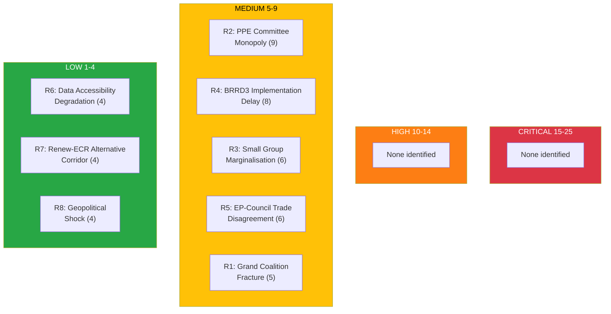

## Political Risk Scoring Matrix

### Assessment Date: 2 April 2026

---

### 1. Risk Overview

| Overall Risk Level | Score | Tier | Trend |
|-------------------|-------|------|-------|
| **MEDIUM** | 6.3/25 (weighted) | 🟡 | → STABLE |

The weighted political risk assessment for EP10 as of April 2026 registers at MEDIUM. No critical or high-tier risks are identified. The risk environment is characterised by structural factors (fragmentation, dominance asymmetry) rather than acute political events.

---

### 2. Risk Scoring Table (5x5 Matrix)

| # | Risk Description | Category | L (1-5) | I (1-5) | Score | Tier | Evidence |
|---|-----------------|----------|---------|---------|-------|------|----------|
| R1 | Grand coalition fracture over major policy disagreement | Grand-Coalition Stability | 1 | 5 | 5 | 🟡 MEDIUM | PPE+S&D at 60%; stable but tight; no current disagreements |
| R2 | PPE leverages dominant position to monopolise committee governance | Institutional Integrity | 3 | 3 | 9 | 🟡 MEDIUM | 38% seat share; 19:1 ratio; early warning HIGH |
| R3 | Small group marginalisation reduces parliamentary pluralism | Social Cohesion | 3 | 2 | 6 | 🟡 MEDIUM | 3 groups at or below 5%; quorum risk flagged at LOW |
| R4 | BRRD3 implementation delayed by national transposition challenges | Economic Governance | 2 | 4 | 8 | 🟡 MEDIUM | Adopted 26 March; implementation timeline TBD |
| R5 | EP-Council disagreement on trade policy (customs duties) | Geopolitical Standing | 2 | 3 | 6 | 🟡 MEDIUM | TA-10-2026-0097 adopted; Council position TBC |
| R6 | EP data accessibility degradation limits transparency monitoring | Institutional Integrity | 2 | 2 | 4 | 🟢 LOW | Events/procedures 404; advisory feeds timeout |
| R7 | Renew-ECR alignment creates alternative policy corridor | Grand-Coalition Stability | 2 | 2 | 4 | 🟢 LOW | 0.95 cohesion; trend STRENGTHENING |
| R8 | External geopolitical shock forces extraordinary plenary | Geopolitical Standing | 1 | 4 | 4 | 🟢 LOW | Ukraine situation ongoing; no acute escalation |

---

### 3. Weighted Risk Index

| Category | Weight | Highest Risk Score | Weighted Contribution |
|----------|--------|-------------------|----------------------|
| Grand-Coalition Stability | 0.30 | 5 (R1) | 1.50 |
| Institutional Integrity | 0.25 | 9 (R2) | 2.25 |
| Economic Governance | 0.20 | 8 (R4) | 1.60 |
| Social Cohesion | 0.15 | 6 (R3) | 0.90 |
| Geopolitical Standing | 0.10 | 6 (R5) | 0.60 |
| **TOTAL** | **1.00** | | **6.85/25** |

**Interpretation**: 6.85/25 = 🟡 MEDIUM overall risk (threshold: 5-9 = MEDIUM)

---

### 4. Risk Heat Map Visualisation



---

### 5. Risk-to-SWOT Integration

| Risk | Score | SWOT Mapping | Action |
|------|-------|-------------|--------|
| R1 (Grand coalition fracture) | 5 | Monitor | Watch PPE-S&D voting alignment in April plenaries |
| R2 (PPE monopoly) | 9 | SWOT Threat (MEDIUM) | Track committee chair distribution; d'Hondt compliance |
| R3 (Small group marginalisation) | 6 | SWOT Weakness | Monitor group capacity across committees |
| R4 (BRRD3 delay) | 8 | SWOT Threat (MEDIUM) | Track national transposition progress |
| R5 (EP-Council trade) | 6 | Monitor | Watch Council response to customs duties text |
| R6 (Data accessibility) | 4 | Informational | Monitor EP API reliability trends |
| R7 (Renew-ECR corridor) | 4 | Informational | Track cohesion trend in voting data when available |
| R8 (Geopolitical shock) | 4 | Informational | Monitor Ukraine situation and external events |

---

### 6. Cascading Risk Analysis

**Primary Trigger**: R2 (PPE committee monopoly) — Highest-scoring risk

```
R2: PPE Committee Monopoly (Score: 9)
  Chain 1: Smaller groups lose rapporteur influence -> R3 aggravated (marginalisation)
    Circuit Breaker: D'Hondt allocation rules enforce proportional distribution
  Chain 2: Opposition reduced to symbolic resistance -> R1 indirectly stabilised
    Circuit Breaker: Conference of Presidents cross-group oversight
  Chain 3: Public perception of EP as single-party parliament -> T1 (SWOT Threat)
    Circuit Breaker: Transparent plenary voting records; media scrutiny
```

**Assessment**: The cascading path from R2 is constrained by multiple institutional circuit breakers. Probability of full cascade: LOW (15-20%). 🟡 MEDIUM confidence.

---

### 7. Quantitative SWOT Risk Integration

| SWOT Quadrant | Risk-Derived Entries | Evidence Quality |
|---------------|---------------------|------------------|
| **Strengths** | Grand coalition stability (R1 at only 5/25) | 🟢 HIGH — structural data confirms 60% |
| **Weaknesses** | Small group capacity deficit (R3 at 6/25) | 🟡 MEDIUM — 3 groups at or below 5% confirmed |
| **Opportunities** | BRRD3 implementation success potential (inverse of R4) | 🟡 MEDIUM — adopted but not yet implemented |
| **Threats** | PPE institutional dominance (R2 at 9/25) | 🟢 HIGH — 38% confirmed; 19:1 ratio |

---

### 8. Bayesian Updating Notes

| Prior (pre-26 March) | Evidence (26 March Plenary) | Posterior (2 April) |
|----------------------|---------------------------|-------------------|
| Grand coalition stable (80%) | 16+ texts adopted; no failed votes | Grand coalition stable (85%) ↑ |
| PPE dominance moderate (60%) | PPE position unchanged; no chair redistribution | PPE dominance moderate-high (65%) ↑ |
| BRRD3 adoption likely (75%) | BRRD3 adopted (TA-10-2026-0091) | BRRD3 adopted (100%) Confirmed |
| Small group viability (70%) | No group dissolution or merger signals | Small group viability stable (70%) → |

---

### 9. Scenario Tree

```
April 2026 Political Environment
  Baseline (70%): Status quo continues
    April plenary proceeds normally
    Grand coalition delivers legislative programme
    Risk level remains MEDIUM
  Constructive (20%): Reform acceleration
    BRRD3 implementation begins smoothly
    Renew-ECR alignment creates productive competition
    Risk level drops to LOW
  Disruption (10%): External shock
    Geopolitical crisis triggers extraordinary session
    Coalition tested under pressure
    Risk level rises to HIGH (temporarily)
```

---

*Generated: 2 April 2026 | Classification: PUBLIC | EU Parliament Monitor — Hack23 AB*
*SPDX-License-Identifier: Apache-2.0*
