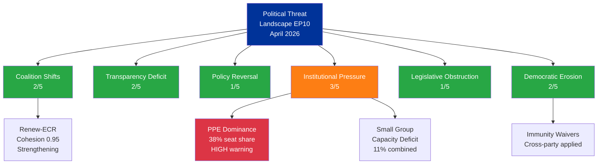
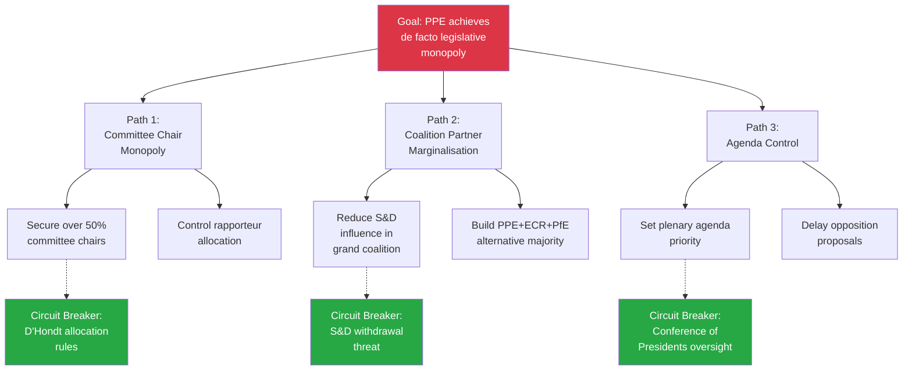

## Political Threat Landscape Assessment

### Assessment Period: Q2 2026 (as of 2 April 2026)

---

### 1. Executive Threat Summary

| Overall Threat Level | Confidence | Trend |
|---------------------|------------|-------|
| **LOW-MEDIUM** (2.0/5.0 average) | 🟡 MEDIUM | → STABLE |

The EP10 political environment presents a low-to-moderate threat landscape as of April 2026. No acute threats are detected. The primary structural concern remains PPE's dominant position (38%) creating institutional power asymmetry. The inter-sessional period shows no active threat escalation.

---

### 2. Six-Dimension Threat Assessment

#### 2.1 Coalition Shifts — Severity: 2/5 🟢

**Current State**: The grand coalition (PPE+S&D at 60%) remains stable. No public disagreements or coalition crises detected in March 2026 plenary activities.

**Emerging Signal**: Renew-ECR cohesion at 0.95 (STRENGTHENING) — this is the strongest bilateral cohesion score in the current parliament. If this trend continues, it could create an alternative centre-right policy corridor that bypasses S&D on specific files.

**Evidence**: Coalition dynamics analysis shows Renew-ECR pair as highest cohesion (0.95), while EPP relationships with all groups show 0 cohesion (data unavailability caveat). S&D-ECR cohesion at 0.60 (STABLE).

**Confidence**: 🟡 MEDIUM — Cohesion scores derived from structural data, not voting records.

#### 2.2 Transparency Deficit — Severity: 2/5 🟢

**Current State**: Immunity waiver decisions for Braun (ECR) and Pappas (The Left) demonstrate transparent judicial accountability processes operating across political lines.

**Emerging Concern**: EP API data accessibility gaps — events and procedures feeds returning 404 errors; advisory feeds timing out at 120s. While this is likely an infrastructure issue, sustained API degradation would limit external transparency monitoring.

**Evidence**: TA-10-2026-0087 (Braun immunity waiver), TA-10-2026-0089 (Pappas immunity waiver); feed endpoint failures documented in data collection.

**Confidence**: 🟡 MEDIUM

#### 2.3 Policy Reversal — Severity: 1/5 🟢

**Current State**: BRRD3 adoption (TA-10-2026-0091) confirms policy continuity from EP9 procedure 2023/0112. Climate Neutrality Framework (TA-10-2026-0031, adopted Feb 10) maintained. Ukraine Facility amended (TA-10-2026-0036, adopted Feb 11) showing commitment adaptation.

**Assessment**: No policy reversal signals detected. The legislative programme continues on established trajectories.

**Evidence**: Multi-year procedures advancing (BRRD3 from 2023, Ukraine Facility amendments); no withdrawn proposals identified.

**Confidence**: 🟢 HIGH

#### 2.4 Institutional Pressure — Severity: 3/5 🟡

**Current State**: PPE's 38% seat share creates a structural dominance that exceeds typical first-party advantages in EP history. The 19:1 ratio with the smallest group (The Left) is flagged by the early warning system as HIGH severity.

**Threat Mechanism**: Dominant group pressure manifests through:
1. Committee chair distribution disproportionate to smaller groups
2. Agenda-setting priority on favoured policy files
3. Rapporteur allocation advantage
4. Inter-institutional negotiation leverage (trilogue positions)

**Mitigating Factors**: Democratic rules (d'Hondt allocation), cross-group cooperation traditions, and transparent voting procedures limit institutional pressure effects.

**Evidence**: Early warning system: DOMINANT_GROUP_RISK at HIGH severity; PPE 19x smallest group; political landscape: multi-coalition required.

**Confidence**: 🟡 MEDIUM

#### 2.5 Legislative Obstruction — Severity: 1/5 🟢

**Current State**: No evidence of systematic legislative obstruction. The March 26 plenary adopted 16+ texts across multiple policy domains, demonstrating functional legislative capacity. Grand coalition at 60% provides reliable majority.

**Evidence**: Adopted texts feed shows 100+ texts in 2026 alone; multiple plenaries proceeding on schedule.

**Confidence**: 🟢 HIGH

#### 2.6 Democratic Erosion — Severity: 2/5 🟢

**Current State**: Immunity waivers demonstrate rule-of-law commitment. However, the small group capacity deficit (Renew 5%, NI 4%, The Left 2%) raises questions about effective multi-party representation.

**Concern**: Three groups collectively holding 11% may struggle to maintain meaningful representation across all committees and delegations, potentially reducing the diversity of perspectives in legislative work.

**Evidence**: Early warning: SMALL_GROUP_QUORUM_RISK at LOW severity; 3 groups at or below 5% seat share.

**Confidence**: 🟡 MEDIUM

---

### 3. Threat Landscape Visualisation

---

### 4. CMO Assessment: Key Actors

#### 4.1 PPE/EPP — Structural Advantage Actor

| Factor | Rating | Evidence |
|--------|--------|----------|
| **Capability** | HIGH (9/10) | 38% seats; largest group; institutional control expected |
| **Motivation** | MEDIUM (6/10) | Centrist governance agenda; reform-oriented but cautious |
| **Opportunity** | HIGH (8/10) | Fragmented opposition; indispensable coalition partner |
| **Threat Profile** | Institutional pressure via dominance | Not adversarial but structurally advantaged |

#### 4.2 PfE — Opposition Challenger

| Factor | Rating | Evidence |
|--------|--------|----------|
| **Capability** | MEDIUM (5/10) | 11% seats; limited committee influence |
| **Motivation** | HIGH (8/10) | Anti-establishment agenda; sovereignty emphasis |
| **Opportunity** | LOW-MEDIUM (4/10) | Excluded from grand coalition; limited institutional access |
| **Threat Profile** | Policy pressure through public mobilisation | Indirect influence via Overton window shift |

#### 4.3 Renew-ECR Alliance — Emerging Dynamic

| Factor | Rating | Evidence |
|--------|--------|----------|
| **Capability** | MEDIUM (5/10) | Combined 13% seats; limited independent majority leverage |
| **Motivation** | MEDIUM (6/10) | Centre-right policy alignment on specific files |
| **Opportunity** | GROWING (6/10) | 0.95 cohesion score; strengthening trend |
| **Threat Profile** | Coalition geometry complexity | Could shift grand coalition dynamics on specific votes |

---

### 5. Attack Tree: PPE Dominance Escalation

**Assessment**: While the attack tree maps theoretical escalation paths, current circuit breakers (institutional rules, coalition interdependence, oversight mechanisms) are functioning effectively. The threat remains theoretical and LOW probability. 🟡 MEDIUM confidence.

---

### 6. PESTLE Factor Scan

| Factor | Current State | EP Impact | Confidence |
|--------|--------------|-----------|------------|
| **Political** | PPE dominance stable; grand coalition functional | Normal legislative output | 🟡 MEDIUM |
| **Economic** | BRRD3 implementation; EGF mobilisation for Belgium | Banking regulation adaptation | 🟡 MEDIUM |
| **Social** | Gender pay gap resolution adopted (TA-10-2026-0074) | Social policy advancing | 🟢 HIGH |
| **Technological** | ERA Act upcoming (TA-10-2026-0068) | Research policy development | 🟡 MEDIUM |
| **Legal** | Immunity waivers processed; rule-of-law maintained | Judicial accountability confirmed | 🟢 HIGH |
| **Environmental** | Climate neutrality framework adopted (TA-10-2026-0031) | Environmental policy on track | 🟢 HIGH |

---

### 7. Recommendations for Continued Monitoring

1. **Track PPE committee chair distribution** in upcoming committee elections — indicator of dominance operationalisation
2. **Monitor Renew-ECR voting alignment** in April plenaries — 0.95 cohesion trend may produce visible policy shifts
3. **Watch grand coalition cohesion** on contentious files — first sign of fracture would be a failed vote where PPE and S&D split
4. **Assess EP API reliability** — sustained 404 errors on events/procedures feeds may indicate systematic data accessibility issues
5. **Follow BRRD3 implementation** — national transposition timeline and banking sector response

---

*Generated: 2 April 2026 | Classification: PUBLIC | EU Parliament Monitor — Hack23 AB*
*SPDX-License-Identifier: Apache-2.0*
