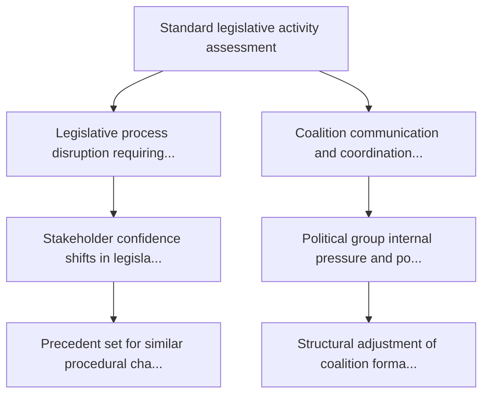

# Political Threat Assessment

**Overall Threat Level**: 🟢 LOW  
**Confidence**: low  
**Date**: 2026-04-02

## Political Threat Landscape Analysis

### Coalition Shifts
**Threat Level**: 🟢 Low

Coalition stability appears maintained. No significant realignment signals.

**Evidence:**
- No coalition shift signals detected in available data

### Transparency Deficit
**Threat Level**: ⚠️ Moderate

Transparency concerns at moderate level. Review committee meeting records and public documentation.

**Evidence:**
- No committee activity data available — potential information gap

### Policy Reversal
**Threat Level**: 🟢 Low

Legislative trajectory appears stable. No major reversal signals.

**Evidence:**
- No significant policy reversal signals detected

### Institutional Pressure
**Threat Level**: 🟢 Low

Institutional balance appears maintained. Power distribution within normal parameters.

**Evidence:**
- No institutional threat signals detected

### Legislative Obstruction
**Threat Level**: 🟢 Low

Legislative pace within normal parameters. No obstruction signals.

**Evidence:**
- No significant legislative delay signals detected

### Democratic Erosion
**Threat Level**: 🟢 Low

Democratic norms appear stable. Institutional processes functioning within expected parameters.

**Evidence:**
- Democratic norms appear stable. No systematic erosion signals.

## Actor Threat Profiles

*No actor threat profiles generated from available data.*

## Consequence Trees

### Consequence Tree: Standard legislative activity assessment

**Mitigating Factors:**
- Institutional resilience mechanisms
- Cross-party dialogue channels

**Amplifying Factors:**
- No significant amplifying factors identified

## Legislative Disruption Analysis

### Procedure: General legislative pipeline

**Current Stage**: proposal | **Resilience**: high

| Stage | Threat Category | Likelihood | Risk Level |
|-------|----------------|------------|------------|
| proposal | delay | 8% | 🟢 Low |
| committee | transparency | 18% | 🟢 Low |
| plenary first reading | shift | 22% | 🟢 Low |
| council position | delay | 12% | 🟢 Low |
| plenary second reading | shift | 21% | 🟢 Low |
| conciliation | reversal | 17% | 🟢 Low |
| adoption | delay | 5% | 🟢 Low |

**Alternative Pathways:**
- Commission resubmission with revised proposal
- Enhanced informal trilogue engagement
- Interim resolution as procedural bridge

## Key Findings

- No high-priority threats detected across threat landscape dimensions

## Recommendations

- Continue routine monitoring of parliamentary activity

---
*Assessment generated by EU Parliament Monitor Political Threat Assessment Pipeline.*  
*Based on public European Parliament data. GDPR-compliant.*